# 分布式事务

## 1微服务化带来的分布式事务问题

开发当中真实场景：

首先，设想一个传统的单体应用（Monolithic App），通过 3 个 Module，在同一个数据源上更新数据来完成一项业务。

很自然的，整个业务过程的数据一致性由本地事务来保证。

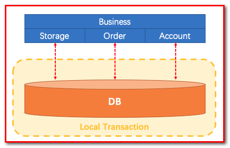

随着业务需求和架构的变化，单体应用被拆分为微服务：原来的 3 个 Module 被拆分为 3 个独立的服务，分别使用独立的数据源。业务过程将由 3 个服务的调用来完成。

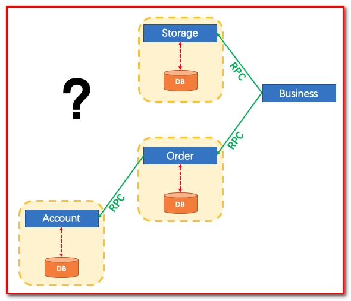

此时，每一个服务内部的数据一致性仍由本地事务来保证。而整个业务层面的全局数据一致性要如何保障呢？这就是微服务架构下面临的，典型的分布式事务需求：我们需要一个分布式事务的解决方案保障业务全局的数据一致性。

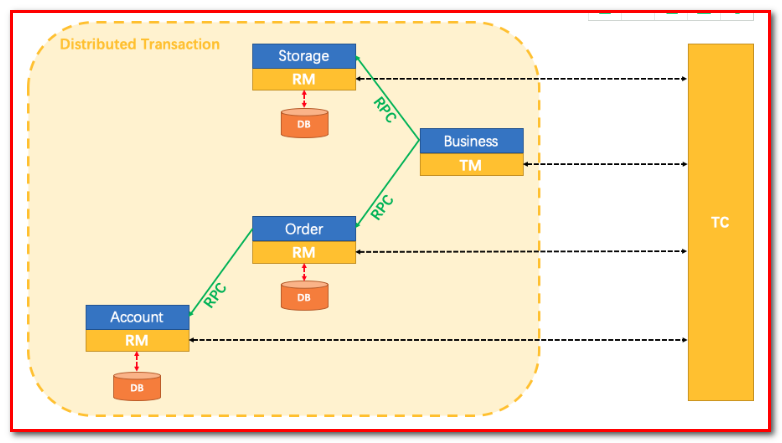

需要解决的问题

随着分布式服务架构的流行与普及，原来在单体应用中执行的多个逻辑操作，现在被拆分成了多个服务之间的远程调用。虽然服务化为我们的系统带来了水平伸缩的能力，然而随之而来挑战就是分布式事务问题，多个服务之间使用自己单独维护的数据库，它们彼此之间不在同一个事务中，假如A执行成功了，B执行却失败了，而A的事务此时已经提交，无法回滚，那么最终就会导致两边数据不一致性的问题；

## 1分布式事务介绍

回顾数据库事务

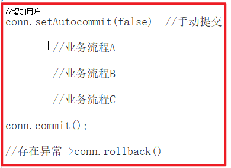

### 1.1什么是事务

不知道你是否遇到过这样的情况，去小卖铺买东西，付了钱，但是店主因为处理了一些其他事，居然忘记你付了钱，又叫你重新付。

又或者在网上购物明明已经扣款，但是却告诉我没有发生交易。这一系列情况都是因为没有事务导致的。这说明了事务在生活中的一些重要性。

有了事务，你去小卖铺买东西，那就是一手交钱一手交货。有了事务，你去网上购物，扣款即产生订单交易。

事务提供一种机制将一个活动涉及的所有操作纳入到一个不可分割的执行单元，组成事务的所有操作只有在所有操作均能正常执行的情况下方能提交，只要其中任一操作执行失败，都将导致整个事务的回滚。

简单地说，事务提供一种“要么什么都不做，要么做全套（All or Nothing）”机制。

事务拥有以下四个特性，习惯上被称为ACID特性：

A：原子性(Atomicity)，一个事务(transaction)中的所有操作，要么全部完成，要么全部不完成，不会结束在中间某个环节。

事务在执行过程中发生错误，会被回滚（Rollback）到事务开始前的状态，就像这个事务从来没有执行过一样。

就像你买东西要么交钱收货一起都执行，要么发不出货，就退钱。

C：一致性(Consistency)，事务的一致性指的是在一个事务执行之前和执行之后数据库都必须处于一致性状态。

如果事务成功地完成，那么系统中所有变化将正确地应用，系统处于有效状态。

如果在事务中出现错误，那么系统中的所有变化将自动地回滚，系统返回到原始状态。

I：隔离性(Isolation)，指的是在并发环境中，当不同的事务同时操纵相同的数据时，每个事务都有各自的完整数据空间。

由并发事务所做的修改必须与任何其他并发事务所做的修改隔离。事务查看数据更新时，数据所处的状态要么是另一事务修改它之前的状态，要么是另一事务修改它之后的状态，事务不会查看到中间状态的数据。

打个比方，你买东西这个事情，是不影响其他人的。

D：持久性(Durability)，指的是只要事务成功结束，它对数据库所做的更新就必须保存下来。

即使发生系统崩溃，重新启动数据库系统后，数据库还能恢复到事务成功结束时的状态。

打个比方，你买东西的时候需要记录在账本上，即使老板忘记了那也有据可查。

### 1.2本地事务

什么是本地事务（Local Transaction）？本地事务也称为*数据库事务*或*传统事务*（相对于分布式事务而言）。它的执行模式就是常见的：

1. transaction begin

2. insert/delete/update

3. insert/delete/update

4. ...

5. transaction commit/rollback
本地事务有这么几个特征:

一次事务只连接一个支持事务的数据库（一般来说都是关系型数据库）
事务的执行结果保证ACID
会用到数据库锁
起初，事务仅限于对单一数据库资源的访问控制, 架构服务化以后，事务的概念延伸到了服务中。倘若将一个单一的服务操作作为一个事务，那么整个服务操作只能涉及一个单一的数据库资源, 这类基于单个服务单一数据库资源访问的事务，被称为本地事务(Local Transaction)。


### 1.3什么是分布式事务

分布式事务指事务的参与者、支持事务的服务器、资源服务器以及事务管理器分别位于不同的分布式系统的不同节点之上, 且属于不同的应用。

指一次大的操作由不同的小操作组成的，这些小的操作分布在不同的服务器上，分布式事务需要保证这些小操作要么全部成功，要么全部失败。

本质上来说，分布式事务就是为了保证不同数据库的数据一致性。

#### 1.3.0假如没有分布式事务

在一系列微服务系统当中，假如不存在分布式事务，会发生什么呢？让我们以互联网中常用的交易业务为例子：


上图中包含了库存和订单两个独立的微服务，每个微服务维护了自己的数据库。在交易系统的业务逻辑中，一个商品在下单之前需要先调用库存服务，进行扣除库存，再调用订单服务，创建订单记录。

正常情况下，两个数据库各自更新成功，两边数据维持着一致性。

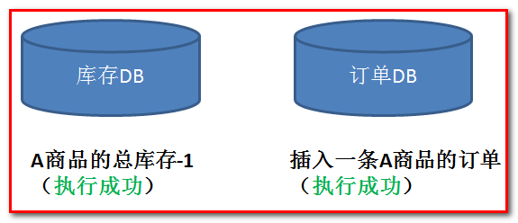

但是，在非正常情况下，有可能库存的扣减完成了，随后的订单记录却因为某些原因插入失败。这个时候，两边数据就失去了应有的一致性。

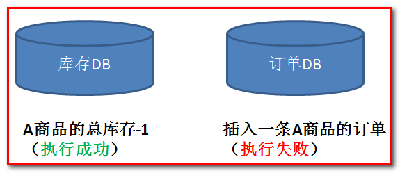

#### 1.3.1谷粒学院真实项目订单与选课需求

谷粒学院的课程分为免费和收费两种。对于收费课程，用户需提交订单并完成支付方可在线学习。
提交订单及支付流程如下：

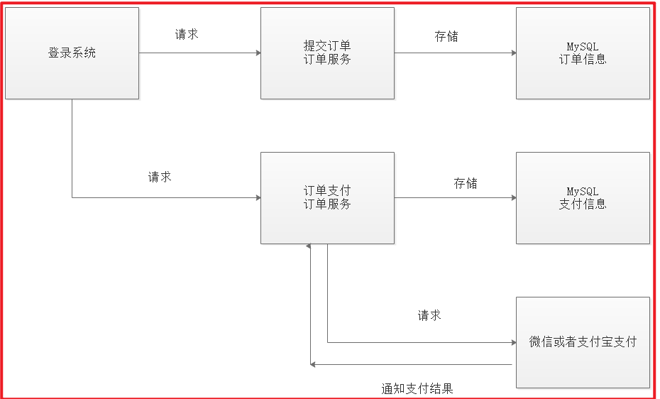

1、用户提交订单需要先登录系统
2、提交订单，订单信息保存到订单数据库
3、订单支付，调用微信支付接口完成支付
4、完成支付，微信支付系统通知谷粒学院支付结果
5、谷粒学院接收到支付结果通知，更新支付结果

提交订单流程：
1、用户进入课程详情页面
2、点击“立即购买”，打开订单确认信息

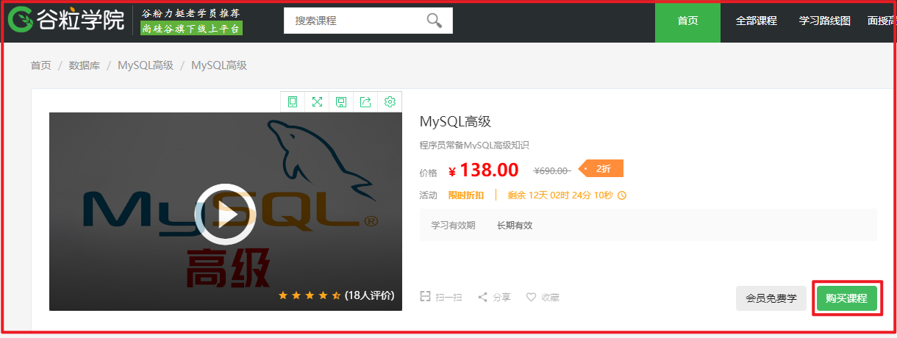

3、点击“ 提交订单 ”

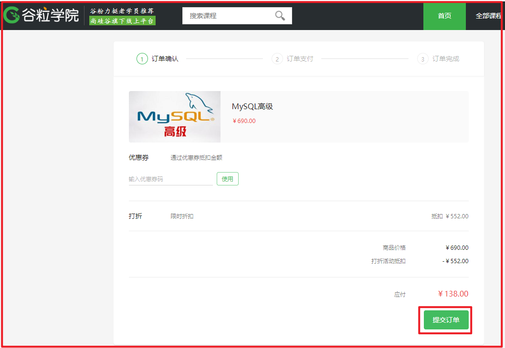

订单提交成功，向订单数据库的orders订单表保存一条记录，向orders_detail订单明细表保存一条或多条记
录，向订单支付表插入一条记录。

4、订单提交成功自动进入订单支付页面

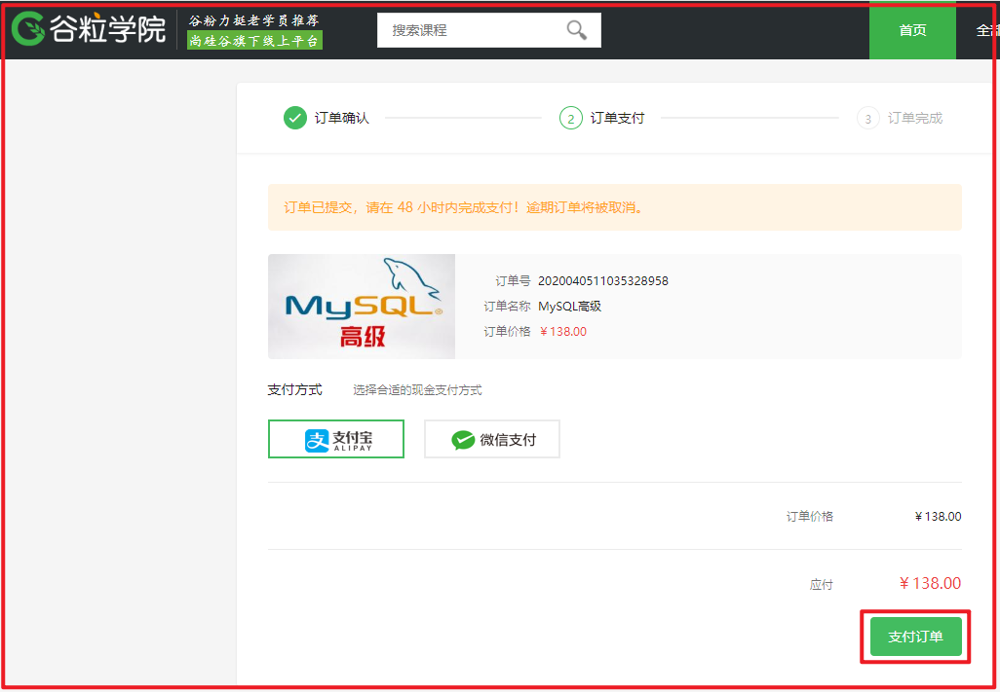

5、点击“微信/支付宝支付”打开二维码


6、用手机扫码支付，支付完成，点击“完成支付”
支付完成，收到微信支付系统的支付完成通知或请求微信查询支付已完成，更新谷粒学院订单支付表中的支付状态
字段。

#### 1.3.2谷粒学院真实项目自动选课需求

支付成功即完成订单，订单完成之后系统需自动添加选课。
下图是微信支付、谷粒学院订单服务、谷粒学院学习服务交互图：

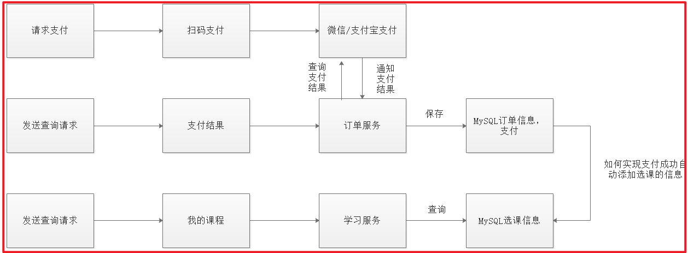

1、用户支付完成，微信/支付宝支付系统会主动通知谷粒学院支付结果，谷粒学院也可主动请求微信支付查询订单的支付
结果。
最终得到支付结果后将订单支付结果保存到订单数据库中。
2、订单支付完成系统自动向选课表添加学生选课记录。
3、选课记录添加完成学习即可在线开始学习。

#### 1.3.3问题描述

根据上边的自动选课的需求，分析如下：
用户支付完成会将支付状态及订单状态保存在订单数据库中，由订单服务去维护订单数据库。而学生选课信息在学
习中心数据库，由学习服务去维护学习中心数据库的信息。下图是系统结构图：

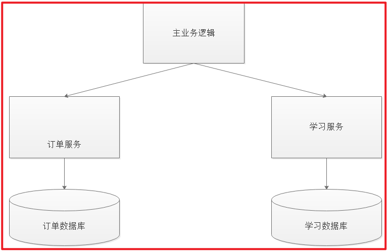

上图中包含了学习和订单两个独立的微服务，每个微服务维护了自己的数据库。在交易系统的业务逻辑中，一个商品在下单之前需要先调用学习服务，进行学习选课，再调用订单服务，创建订单记录。

正常情况下，两个数据库各自更新成功，两边数据维持着一致性。

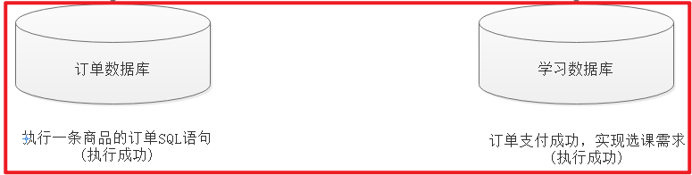

但是，在非正常情况下，有可能订单支付成功，学生理论上可以进行上课了，但确在学习数据库执行SQL语句执行失败了。这个时候花了钱，不能听课肯定非常崩溃，两边数据就失去了应有的一致性。

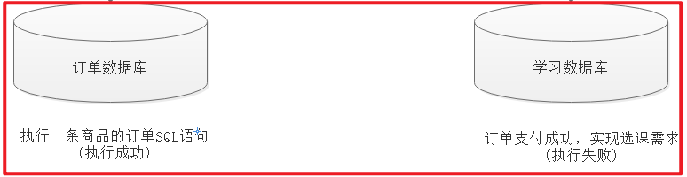

如何实现两个分布式服务（订单服务、学习服务）共同完成一件事即订单支付成功自动添加学生上课的需求，这里
的关键是如何保证两个分布式服务的事务的一致性。
尝试解决上边的需求，在订单服务中远程调用上课接口，伪代码如下：

订单支付结果通知方法｛

    更新支付表中支付状态为“成功”。    
    远程调用上课接口添加上课记录。    

｝
上边的逻辑说明：
1、更新支付表状态为本地数据库操作。
2、远程调用选课接口为网络远程调用请求。
3、为保存事务上边两步操作由spring控制事务，当遇到Exception异常则回滚本地数据库操作。
问题如下：
1、如果更新支付表失败则抛出异常，不再执行远程调用，此设想没有问题。
2、如果更新支付表成功，网络远程调用超时会拉长本地数据库事务时间，影响数据库性能。
3、如果更新支付表成功，远程调用添加选课成功（选课数据库commit成功），最后更新支付表commit失败，此
时出现操作不一致。
上边的问题涉及到分布式事务控制。

### 1.4分布式事务系统架构

本地事务主要限制在单个会话内，不涉及多个数据库资源。但是在基于SOA(Service-Oriented Architecture，面向服务架构)的分布式应用环境下，越来越多的应用要求对多个数据库资源，多个服务的访问都能纳入到同一个事务当中，分布式事务应运而生。

#### 1.4.1什么是分布式系统？

部署在不同结点上的系统通过网络交互来完成协同工作的系统。
比如：充值加积分的业务，用户在充值系统向自己的账户充钱，在积分系统中自己积分相应的增加。充值系统和积
分系统是两个不同的系统，一次充值加积分的业务就需要这两个系统协同工作来完成。

#### 1.4.2分布式事务有哪些场景？

1) 电商系统中的下单扣库存
电商系统中，订单系统和库存系统是两个系统，一次下单的操作由两个系统协同完成

2）金融系统中的银行卡充值
在金融系统中通过银行卡向平台充值需要通过银行系统和金融系统协同完成。

3）教育系统中下单选课业务
在线教育系统中，用户购买课程，下单支付成功后学生选课成功，此事务由订单系统和选课系统协同完成。

4） SNS系统的消息发送
在社交系统中发送站内消息同时发送手机短信，一次消息发送由站内消息系统和手机通信系统协同完成。

#### 1.4.3单一服务分布式事务

最早的分布式事务应用架构很简单，不涉及服务间的访问调用，仅仅是服务内操作涉及到对多个数据库资源的访问。


#### 1.4.4多服务分布式事务

当一个服务操作访问不同的数据库资源，又希望对它们的访问具有事务特性时，就需要采用分布式事务来协调所有的事务参与者。

对于上面介绍的分布式事务应用架构，尽管一个服务操作会访问多个数据库资源，但是毕竟整个事务还是控制在单一服务的内部。如果一个服务操作需要调用另外一个服务，这时的事务就需要跨越多个服务了。在这种情况下，起始于某个服务的事务在调用另外一个服务的时候，需要以某种机制流转到另外一个服务，从而使被调用的服务访问的资源也自动加入到该事务当中来。下图反映了这样一个跨越多个服务的分布式事务：


#### 1.4.5多服务多数据源分布式事务

如果将上面这两种场景(一个服务可以调用多个数据库资源，也可以调用其他服务)结合在一起，对此进行延伸，整个分布式事务的参与者将会组成如下图所示的树形拓扑结构。在一个跨服务的分布式事务中，事务的发起者和提交均系同一个，它可以是整个调用的客户端，也可以是客户端最先调用的那个服务。

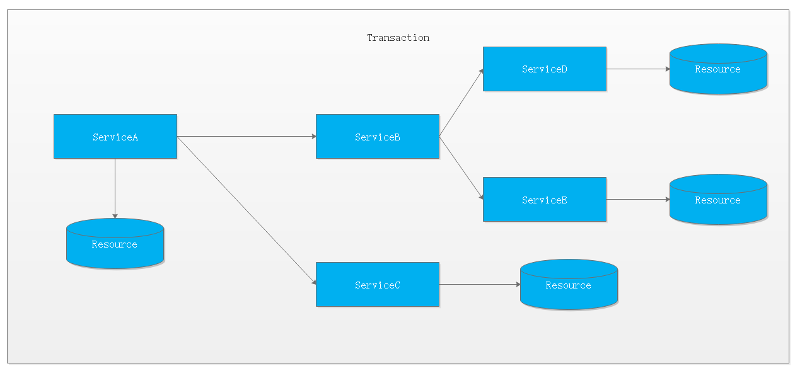

较之基于单一数据库资源访问的本地事务，分布式事务的应用架构更为复杂。在不同的分布式应用架构下，实现一个分布式事务要考虑的问题并不完全一样，比如对多资源的协调、事务的跨服务传播等，实现机制也是复杂多变。

事务的作用：

保证每个事务的数据一致性。

### 1.5CAP定理

CAP 定理，又被叫作布鲁尔定理。对于设计分布式系统(不仅仅是分布式事务)的架构师来说，CAP 就是你的入门理论。

分布式系统（distributed system）正变得越来越重要，大型网站几乎都是分布式的。

分布式系统的最大难点，就是各个节点的状态如何同步。CAP 定理是这方面的基本定理，也是理解分布式系统的起点。

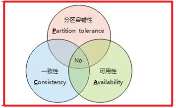

C (一致性)：指数据在多个副本之间能够保持一致的特性（严格的一致性）在分布式系统中的所有数据备份，在同一时刻是否同样的值。（所有节点在同一时间具有相同的数据）

一致性（Consistency）是指多副本（Replications）问题中的数据一致性。可以分为强一致性、与弱一致性。

① 强一致性

简言之，在任意时刻，所有节点中的数据是一样的。

例如，对于关系型数据库，要求更新过的数据能被后续的访问都能看到，这是强一致性。

② 弱一致性

数据更新后，如果能容忍后续的访问只能访问到部分或者全部访问不到，则是弱一致性。

最终一致性就属于弱一致性。

A (可用性)：指系统提供的服务必须一直处于可用的状态，每次只要收到用户的请求，服务器就必须给出回应。在合理的时间内返回合理的响应（不是错误和超时的响应）

只有非故障节点才能满足业务正常；只有在合理的时间内，用户才能接受；只有返回合理的响应，用户才能接受。

P (网络分区容错性)：网络节点之间无法通信的情况下，节点被隔离，产生了网络分区， 整个系统仍然是可以工作的 . 大多数分布式系统都分布在多个子网络。每个子网络就叫做一个区（partition）。分区容错的意思是，区间通信可能失败。比如，一台服务器放在中国，另一台服务器放在美国，这就是两个区，它们之间可能无法通信。

什么是分区？

在分布式系统中，不同的节点分布在不同的子网络中，由于一些特殊的原因，这些子节点之间出现了网络不通的状态，但他们的内部子网络是正常的。从而导致了整个系统的环境被切分成了若干个孤立的区域。这就是分区。

CAP原则的精髓就是要么AP，要么CP，要么AC，但是不存在CAP。

#### 1.5.1CAP定理的证明

现在我们就来证明一下，为什么不能同时满足三个特性？

假设有两台服务器，一台放着应用A和数据库V，一台放着应用B和数据库V，他们之间的网络可以互通，也就相当于分布式系统的两个部分。

在满足一致性的时候，两台服务器 N1和N2，一开始两台服务器的数据是一样的，DB0=DB0。在满足可用性的时候，用户不管是请求N1或者N2，都会得到立即响应。在满足分区容错性的情况下，N1和N2有任何一方宕机，或者网络不通的时候，都不会影响N1和N2彼此之间的正常运作。

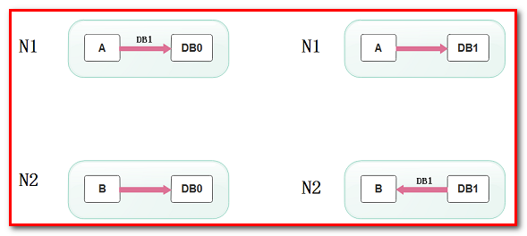

当用户通过N1中的A应用请求数据更新到服务器DB0后，这时N1中的服务器DB0变为DB1，通过分布式系统的数据同步更新操作，N2服务器中的数据库V0也更新为了DB1，这时，用户通过B向数据库发起请求得到的数据就是即时更新后的数据DB1。

上面是正常运作的情况，但分布式系统中，最大的问题就是网络传输问题，现在假设一种极端情况，N1和N2之间的网络断开了，但我们仍要支持这种网络异常，也就是满足分区容错性，那么这样能不能同时满足一致性和可用性呢？

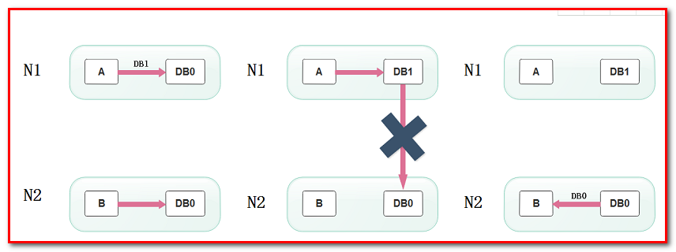

假设N1和N2之间通信的时候网络突然出现故障，有用户向N1发送数据更新请求，那N1中的数据DB0将被更新为DB1，由于网络是断开的，N2中的数据库仍旧是DB0；

如果这个时候，有用户向N2发送数据读取请求，由于数据还没有进行同步，应用程序没办法立即给用户返回最新的数据DB1，怎么办呢？有二种选择，第一，牺牲数据一致性，响应旧的数据DB0给用户；第二，牺牲可用性，阻塞等待，直到网络连接恢复，数据更新操作完成之后，再给用户响应最新的数据DB1。

上面的过程比较简单，但也说明了要满足分区容错性的分布式系统，只能在一致性和可用性两者中，选择其中一个。也就是说分布式系统不可能同时满足三个特性。这就需要我们在搭建系统时进行取舍了，那么，怎么取舍才是更好的策略呢?

#### 1.5.2取舍策略

现如今，对于多数大型互联网应用的场景，主机众多、部署分散，而且现在的集群规模越来越大，节点只会越来越多，所以节点故障、网络故障是常态，因此分区容错性也就成为了一个分布式系统必然要面对的问题。那么就只能在C和A之间进行取舍。

原因是

因为，在分布式系统中，网络无法 100% 可靠，分区其实是一个必然现象，随着网络节点出现问题，产生了分区, 这时候其他节点和出错节点的数据必然会不一致，这时候就要面临选择，

是选择停掉所有的服务，等网络节点修复后恢复数据，以此来保证一致性（PC）, 
还是选择继续提供服务，放弃强一致性的要求，以此来保证整体的可用性（PA）。

所以，最多满足两个条件：

组合	分析结果
CA	满足原子和可用，放弃分区容错。说白了，就是一个整体的应用。
CP	满足原子和分区容错，也就是说，要放弃可用。当系统被分区，为了保证原子性，必须放弃可用性，让服务停用。
AP	满足可用性和分区容错，当出现分区，同时为了保证可用性，必须让节点继续对外服务，这样必然导致失去原子性。
在分布式系统设计中AP的应用较多，即保证分区容忍性和可用性，牺牲数据的强一致性（写操作后立刻读取到最
新数据），保证数据最终一致性。比如：订单退款，今日退款成功，明日账户到账，只要在预定的用户可以接受的
时间内退款事务走完即可。

顺便一提，CAP 理论中是忽略网络延迟，也就是当事务提交时，从节点 A 复制到节点 B 没有延迟，但是在现实中这个是明显不可能的，所以总会有一定的时间是不一致。

但是，有个特殊情况需要注意：但对于传统的项目就可能有所不同，拿银行的转账系统来说，涉及到金钱的对于数据一致性不能做出一丝的让步，C必须保证，出现网络故障的话，宁可停止服务，可以在A和P之间做取舍。

总而言之，没有最好的策略，好的系统应该是根据业务场景来进行架构设计的，只有适合的才是最好的。

## 2分布式事务解决方案

1. XA两段提交(低效率)-分布式事务解决方案

2. TCC三段提交(2段, 高效率[不推荐(补偿代码)])

3. 本地消息(MQ+Table)

4. 事务消息(RocketMQ[alibaba])

5. Seata(alibaba)

### 2.1基于XA协议的两阶段提交(2PC)

X/Open 组织（即现在的 Open Group ）定义了分布式事务处理模型

XA协议：XA是一个分布式事务协议。XA中大致分为两部分：事务管理器和本地资源管理器。其中本地资源管理器往往由数据库实现，比如Oracle、DB2这些商业数据库都实现了XA接口，而事务管理器作为全局的调度者，负责各个本地资源的提交和回滚。

#### 2.1.1概念

二阶段提交2PC（Two phase Commit）是指，在分布式系统里，为了保证所有节点在进行事务提交时保持一致性的一种算法。

#### 2.1.2背景

在分布式系统里，**每个节点都可以知晓自己操作的成功或者失败，却无法知道其他节点操作的成功或失败。**

当一个事务跨多个节点时，为了保持事务的原子性与一致性，需要引入一个**协调者**（Coordinator）来统一掌控所有**参与者**（Participant）的操作结果，并指示它们是否要把操作结果进行真正的提交（commit）或者回滚（rollback）。

#### 2.1.3思路

2PC顾名思义分为两个阶段，其实施思路可概括为：

（1）投票阶段（voting phase）：参与者将操作结果通知协调者；

（2）提交阶段（commit phase）：收到参与者的通知后，协调者再向参与者发出通知，根据反馈情况决定各参与者是否要提交还是回滚；

#### 2.1.4缺陷

算法执行过程中，**所有节点都处于阻塞状态，所有节点所持有的资源（例如数据库数据，本地文件等）都处于封锁状态。**

典型场景为：

（1）某一个参与者发出通知之前，所有参与者以及协调者都处于阻塞状态；

（2）在协调者发出通知之前，所有参与者都处于阻塞状态；

另外，如有协调者或者某个参与者出现了崩溃，为了避免整个算法处于一个完全阻塞状态，往往需要借助超时机制来将算法继续向前推进，故此时算法的效率比较低。

总的来说，**2PC是一种比较保守的算法**。

#### 2.1.5举例

甲乙丙丁四人要组织一个会议，需要确定会议时间，不妨设甲是协调者，乙丙丁是参与者。

投票阶段：

（1）甲发邮件给乙丙丁，周二十点开会是否有时间；

（2）甲回复有时间；

（3）乙回复有时间；

（4）丙迟迟不回复，此时对于这个活动，甲乙丙均处于阻塞状态，算法无法继续进行；

（5）丙回复有时间（或者没有时间）；

提交阶段：

（1）协调者甲将收集到的结果反馈给乙丙丁（什么时候反馈，以及反馈结果如何，在此例中取决与丙的时间与决定）；

（2）乙收到；

（3）丙收到；

（4）丁收到；

#### 2.1.6结论

2PC效率很低，分布式事务很难做

#### 2.1.7实际应用交互流程

第一阶段：

2PC中包含着两个角色：**事务协调者**和**事务参与者**。让我们来看一看他们之间的交互流程：

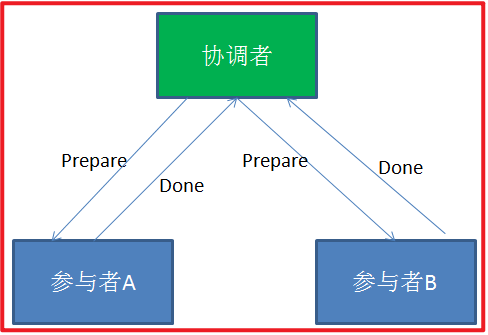

在分布式事务的第一阶段，作为事务协调者的节点会首先向所有的参与者节点发送Prepare请求。

在接到Prepare请求之后，每一个参与者节点会各自执行与事务有关的数据更新，写入Undo Log和Redo Log。如果参与者执行成功，暂时不提交事务，而是向事务协调节点返回“完成”消息。

当事务协调者接到了所有参与者的返回消息，整个分布式事务将会进入第二阶段。

第二阶段：

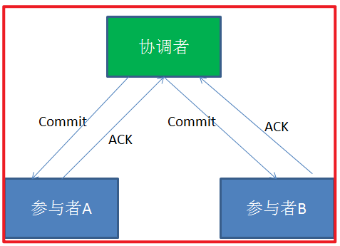

在2PC分布式事务的第二阶段，如果事务协调节点在之前所收到都是正向返回，那么它将会向所有事务参与者发出Commit请求。

接到Commit请求之后，事务参与者节点会各自进行本地的事务提交，并释放锁资源。当本地事务完成提交后，将会向事务协调者返回“完成”消息。

当事务协调者接收到所有事务参与者的“完成”反馈，整个分布式事务完成。

以上所描述的是2PC两阶段提交的正向流程，接下来我们看一看失败情况的处理流程：

第一阶段：

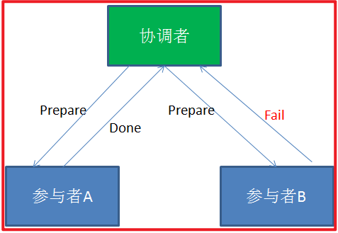

第二阶段：

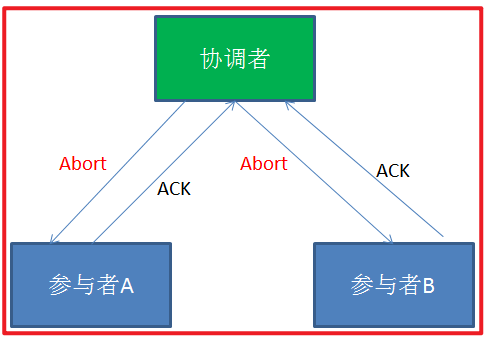

在2PC的第一阶段，如果某个事务参与者反馈失败消息，说明该节点的本地事务执行不成功，必须回滚。

于是在第二阶段，事务协调节点向所有的事务参与者发送Abort(中止)请求。接收到Abort请求之后，各个事务参与者节点需要在本地进行事务的回滚操作，回滚操作依照Undo Log来进行。

以上就是2PC两阶段提交协议的详细过程。

2PC两阶段提交究竟有哪些不足呢？

1. 性能问题

2PC遵循强一致性。在事务执行过程中，各个节点占用着数据库资源，只有当所有节点准备完毕，事务协调者才会通知提交，参与者提交后释放资源。这样的过程有着非常明显的性能问题。

2. 协调者单点故障问题

事务协调者是整个2PC模型的核心，一旦事务协调者节点挂掉，参与者收不到提交或是回滚通知，参与者会一直处于中间状态无法完成事务。

3. 丢失消息导致的不一致问题。

在2PC协议的第二个阶段，如果发生局部网络问题，一部分事务参与者收到了提交消息，另一部分事务参与者没收到提交消息，那么就导致了节点之间数据的不一致。

### 2.2代码补偿事务(TCC）

TCC的作用主要是解决跨服务调用场景下的分布式事务问题

#### 2.2.1场景案例

以航班预定的案例，来介绍TCC要解决的事务场景。在这里笔者虚构一个场景，把自己当做航班预定的主人公，来介绍这个案例。从合肥 –> 昆明 –> 大理。

准备从合肥出发，到云南大理去游玩，然后使用美团App(机票代理商)来订机票。发现没有从合肥直达大理的航班，需要到昆明进行中转。如下图：

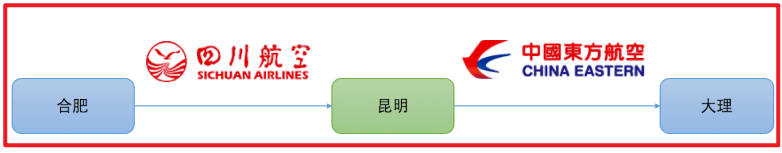

从图中我们可以看出来，从合肥到昆明乘坐的是四川航空，从昆明到大理乘坐的是东方航空。

​ 由于使用的是美团App预定，当我选择了这种航班预定方案后，美团App要去四川航空和东方航空各帮我购买一张票。如下图：

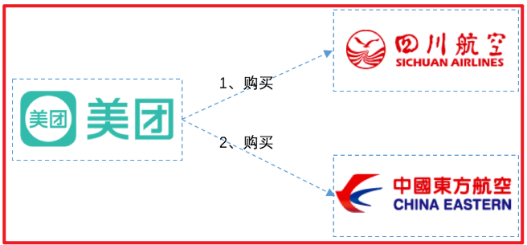

考虑最简单的情况：美团先去川航帮我买票，如果买不到，那么东航也没必要买了。如果川航购买成功，再去东航购买另一张票。

​ 现在问题来了：假设美团先从川航成功买到了票，然后去东航买票的时候，因为天气问题，东航航班被取消了。那么此时，美团必须取消川航的票，因为只有一张票是没用的，不取消就是浪费我的钱。那么如果取消会怎样呢？如果读者有取消机票经历的话，非正常退票，肯定要扣手续费的。在这里，川航本来已经购买成功，现在因为东航的原因要退川航的票，川航应该是要扣代理商的钱的。

​ 那么美团就要保证，如果任一航班购买失败，都不能扣钱，怎么做呢？

​ 两个航空公司都为美团提供以下3个接口：机票预留接口、确认接口、取消接口。美团App分2个阶段进行调用，如下所示：

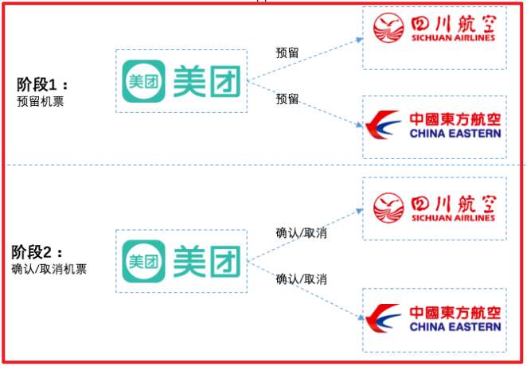

在第1阶段：

​ 美团分别请求两个航空公司预留机票，两个航空公司分别告诉美团预留成功还是失败。航空公司需要保证，机票预留成功的话，之后一定能购买到。

在第2阶段：

​ 如果两个航空公司都预留成功，则分别向两个公司发送确认购买请求。

​ 如果两个航空公司任意一个预留失败，则对于预留成功的航空公司也要取消预留。这种情况下，对于之前预留成功机票的航班取消，也不会扣用户的钱，因为购买并没实际发生，之前只是请求预留机票而已。

​ 通过这种方案，可以保证两个航空公司购买机票的一致性，要不都成功，要不都失败，即使失败也不会扣用户的钱。如果在两个航班都已经已经确认购买后，再退票，那肯定还是要扣钱的。

​ 当然，实际情况肯定这里提到的肯定要复杂，通常航空公司在第一阶段，对于预留的机票，会要求在指定的时间必须确认购买(支付成功)，如果没有及时确认购买，会自动取消。假设川航要求10分钟内支付成功，东航要求30分钟内支付成功。以较短的时间算，如果用户在10分钟内支付成功的话，那么美团会向两个航空公司都发送确认购买的请求，如果超过10分钟(以较短的时间为准)，那么就不能进行支付。

​ 这个方案提供给我们一种跨服务保证事务一致性的一种解决思路，可以把这种方案当做TCC的雏形。

TCC是Try ( 尝试 ) — Confirm(确认) — Cancel ( 取消 ) 的简称:

操作方法	含义
Try	完成所有业务检查（一致性），预留业务资源(准隔离性) 回顾上面航班预定案例的阶段1，机票就是业务资源，所有的资源提供者(航空公司)预留都成功，try阶段才算成功
Confirm	确认执行业务操作，不做任何业务检查， 只使用Try阶段预留的业务资源。回顾上面航班预定案例的阶段2，美团APP确认两个航空公司机票都预留成功，因此向两个航空公司分别发送确认购买的请求。
Cancel	取消Try阶段预留的业务资源。回顾上面航班预定案例的阶段2，如果某个业务方的业务资源没有预留成功，则取消所有业务资源预留请求。
有哥们立马会想到，TCC与XA两阶段提交有着异曲同工之妙，下图列出了二者之间的对比：


1) 在阶段1：

​ 在XA中，各个RM准备提交各自的事务分支，事实上就是准备提交资源的更新操作(insert、delete、update等)；而在TCC中，是主业务活动请求(try)各个从业务服务预留资源。

2) 在阶段2：

​ XA根据第一阶段每个RM是否都prepare成功，判断是要提交还是回滚。如果都prepare成功，那么就commit每个事务分支，反之则rollback每个事务分支。

​ TCC中，如果在第一阶段所有业务资源都预留成功，那么confirm各个从业务服务，否则取消(cancel)所有从业务服务的资源预留请求。

#### 2.2.2TCC两阶段提交与XA两阶段提交的区别

​ XA是资源层面的分布式事务，强一致性，在两阶段提交的整个过程中，一直会持有资源的锁。

​ XA事务中的两阶段提交内部过程是对开发者屏蔽的 ，其内部会委派给TransactionManager进行真正的两阶段提交，因此开发者从代码层面是感知不到这个过程的。而事务管理器在两阶段提交过程中，从prepare到commit/rollback过程中，资源实际上一直都是被加锁的。如果有其他人需要更新这两条记录，那么就必须等待锁释放。

TCC是业务层面的分布式事务，最终一致性，不会一直持有资源的锁。

​ TCC中的两阶段提交并没有对开发者完全屏蔽，也就是说从代码层面，开发者是可以感受到两阶段提交的存在。如上述航班预定案例：在第一阶段，航空公司需要提供try接口(机票资源预留)。在第二阶段，航空公司提需要提供confirm/cancel接口(确认购买机票/取消预留)。开发者明显的感知到了两阶段提交过程的存在。try、confirm/cancel在执行过程中，一般都会开启各自的本地事务，来保证方法内部业务逻辑的ACID特性。其中：

​ 1、try过程的本地事务，是保证资源预留的业务逻辑的正确性。

​ 2、confirm/cancel执行的本地事务逻辑确认/取消预留资源，以保证最终一致性，也就是所谓的补偿型事务

由于是多个独立的本地事务，因此不会对资源一直加锁。

TCC 将事务提交分为 Try - Confirm - Cancel 3个操作。其和两阶段提交有点类似，Try为第一阶段，Confirm - Cancel为第二阶段，是一种应用层面侵入业务的两阶段提交。

操作方法	含义
Try	预留业务资源/数据效验-尝试检查当前操作是否可行
Confirm	确认执行业务操作，实际提交数据，不做任何业务检查，try成功，confirm必定成功
Cancel	取消执行业务操作，实际回滚数据
其核心在于将业务分为两个操作步骤完成。不依赖 RM 对分布式事务的支持，而是通过对业务逻辑的分解来实现分布式事务。

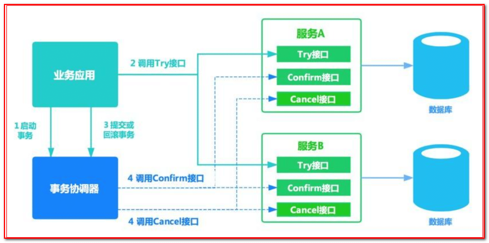

例如： A要向 B 转账，思路大概是：

假设用户user表中有两个字段：可用余额(available_money)、冻结余额(frozen_money)
A扣钱对应服务A(ServiceA)
B加钱对应服务B(ServiceB)
转账订单服务(OrderService)
业务转账方法服务(BusinessService)
ServiceA，ServiceB，OrderService都需分别实现try()，confirm()，cancle()方法，方法对应业务逻辑如下

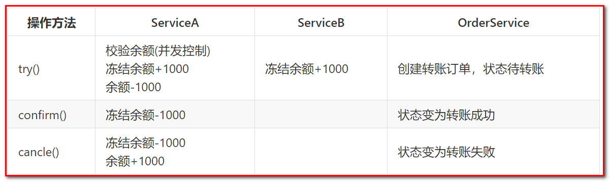

其中业务调用方BusinessService中就需要调用
ServiceA.try()
ServiceB.try()
OrderService.try()

1、当所有try()方法均执行成功时，对全局事物进行提交，即由事物管理器调用每个微服务的confirm()方法

2、 当任意一个方法try()失败(预留资源不足，抑或网络异常，代码异常等任何异常)，由事物管理器调用每个微服务的cancle()方法对全局事务进行回滚

优点： 跟2PC(很多第三方框架)比起来，实现以及流程相对简单了一些，但数据的一致性比2PC也要差一些

缺点： 缺点还是比较明显的，在2, 3步中都有可能失败。TCC属于应用层的一种补偿方式，所以需要程序员在实现的时候多写很多补偿的代码，在一些场景中，一些业务流程可能用TCC不太好定义及处理。

### 2.3本地消息表（异步确保）- 事务最终一致性

这种实现方式的思路，其实是源于 ebay，后来通过支付宝等公司的布道，在业内广泛使用。**其基本的设计思想是将远程分布式事务拆分成一系列的本地事务**。如果不考虑性能及设计优雅，借助关系型数据库中的表即可实现。

举个经典的跨行转账的例子来描述。

第一步伪代码如下，扣款 1W，通过本地事务保证了凭证消息插入到消息表中。

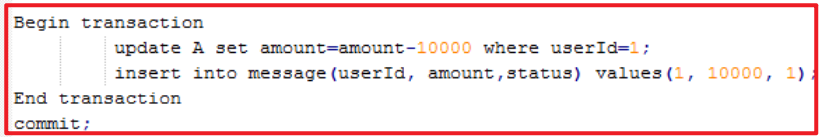

第二步，通知对方银行账户上加 1W 了。那问题来了，如何通知到对方呢？

通常采用两种方式：

采用时效性高的 MQ，由对方订阅消息并监听，有消息时自动触发事件
采用定时轮询扫描的方式，去检查消息表的数据
两种方式其实各有利弊，仅仅依靠 MQ，可能会出现通知失败的问题。而过于频繁的定时轮询，效率也不是最佳的（90% 是无用功）。所以，我们一般会把两种方式结合起来使用。

解决了通知的问题，又有新的问题了。万一这消息有重复被消费，往用户帐号上多加了钱，那岂不是后果很严重？

仔细思考，其实我们可以消息消费方，也通过一个“消费状态表”来记录消费状态。在执行“加款”操作之前，检测下该消息（提供标识）是否已经消费过，消费完成后，通过本地事务控制来更新这个“消费状态表”。这样子就避免重复消费的问题。

总结：上述的方式是一种非常经典的实现，基本避免了分布式事务，实现了“最终一致性”。但是，关系型数据库的吞吐量和性能方面存在瓶颈，频繁的读写消息会给数据库造成压力。所以，在真正的高并发场景下，该方案也会有瓶颈和限制的。

在订单系统新增一条消息表，将新增订单和新增消息放到一个事务里完成，然后通过轮询的方式去查询消息表，将消息推送到 MQ，库存系统去消费 MQ。

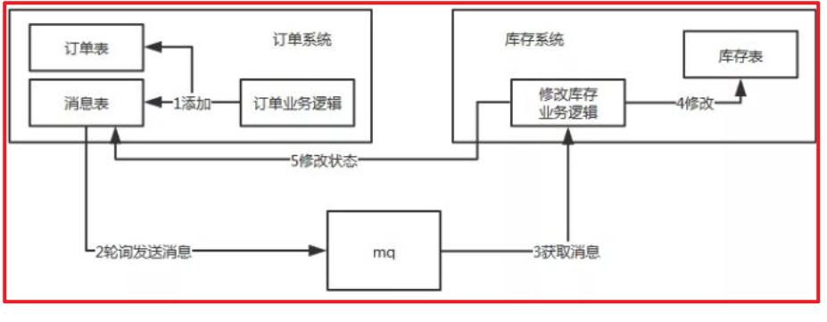

执行流程：

订单系统，添加一条订单和一条消息，在一个事务里提交。
订单系统，使用定时任务轮询查询状态为未同步的消息表，发送到 MQ，如果发送失败，就重试发送。
库存系统，接收 MQ 消息，修改库存表，需要保证幂等操作。
如果修改成功，调用 RPC 接口修改订单系统消息表的状态为已完成或者直接删除这条消息。
如果修改失败，可以不做处理，等待重试。
订单系统中的消息有可能由于业务问题会一直重复发送，所以为了避免这种情况可以记录一下发送次数，当达到次数限制之后报警，人工接入处理；库存系统需要保证幂等，避免同一条消息被多次消费造成数据一致。

本地消息表这种方案实现了最终一致性，需要在业务系统里增加消息表，业务逻辑中多一次插入的 DB 操作，所以性能会有损耗，而且最终一致性的间隔主要由定时任务的间隔时间决定。

优点： 一种非常经典的实现，避免了分布式事务，实现了最终一致性。在 . NET中 有现成的解决方案。

缺点： 消息表会耦合到业务系统中，如果没有封装好的解决方案，会有很多杂活需要处理。

### 2.4 MQ 事务消息

有一些第三方的MQ是支持事务消息的，比如RocketMQ，他们支持事务消息的方式也是类似于采用的二阶段提交，但是市面上一些主流的MQ都是不支持事务消息的，比如 RabbitMQ 和 Kafka 都不支持。

以阿里的 RocketMQ 中间件为例，其思路大致为：

RocketMQ提供了类似X/Open XA的分布事务功能，通过MQ的事务消息能达到分布式事务的最终一致。
发送方在业务执行开始会先向消息队列中投递 “ 半消息 ” ，半消息即暂时不会真正投递的消息，当发送方（即生产者）将消息成功发送给了MQ服务端且并未将该消息的二次确认结果返回，此时消息状态是“ 暂时不可投递 ” 状态（可以认为是状态未知）。该状态下的消息即半消息。
如果出现网络闪断、生产者应用重启等原因导致事务消息二次确认丢失，MQ服务端会通过扫描发现某条消息长期处于 “ 半消息 ” 状态，MQ服务端会主动向生产者查询该消息的最终状态是处于Commit(消息提交)还是Rollback(消息回滚)。这个过程称为消息回查。
在业务方法内要想消息队列提交两次请求，一次发送消息和一次确认消息。如果确认消息发送失败了RocketMQ会定期扫描消息集群中的事务消息，这时候发现了Prepared消息，它会向消息发送者确认，所以生产方需要实现一个check接口，RocketMQ会根据发送端设置的策略来决定是回滚还是继续发送确认消息。这样就保证了消息发送与本地事务同时成功或同时失败。

总体而言RocketMQ事务消息分为两条主线

定时任务发送流程：发送half message(半消息)，执行本地事务，发送事务执行结果

定时任务回查流程：MQ服务器回查本地事务，发送事务执行结果

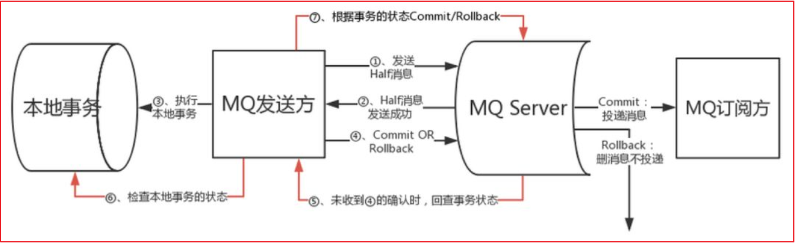

具体流程如下

1、Producer 向 MQ 服务器 发送消息 , MQ Server 将消息状态标记为 Prepared（预备状态），注意此时这条消息消费者（MQ订阅方）是无法消费到的。

2、MQ 服务器收到消息并持久化成功之后，会向Producer 确认首次消息发送成功，此时消息处于 half message(半消息) 状态，并未发送给对应的 Consumer 。

3、Producer 开始执行本地事务逻辑 , 通过本地数据库事务控制。

4、根据事务执行结果，Producer 向 MQ 服务器提交二次确认 ( commit 或者 rollback) 。MQ Server 收到 Commit 状态则将半消息标记为可投递，Consumer 最终将收到该消息；MQ Server 收到 Rollback 状态则删除半消息，Consumer 将不会接受该消息。

5、在断网或者应用重启的情况下，二次确认未成功的发给 MQ Server，MQ Server 会主动向 Producer 启动消息回查

6、Producer 根据事务执行结果，对消息回查返回对应的结果。

7、Mq Server根据返回结果，决定继续投递消息或者丢弃消息(重复第4步操作)。

注意 1-4 为事务消息的发送过程， 5-6 为事务消息的回查过程。

优点： 实现了最终一致性，不需要依赖本地数据库事务。

缺点： 目前主流MQ中只有RocketMQ支持事务消息。

### 2.5 分布式事务解决的方案

目前分布式事务解决的方案主要有对业务无入侵和有入侵的方案，无入侵方案主要有基于数据库 XA 协议的两段式提交（2PC）方案，它的优点是对业务代码无入侵，但是它的缺点也是很明显：必须要求数据库对 XA 协议的支持，且由于 XA 协议自身的特点，它会造成事务资源长时间得不到释放，锁定周期长，而且在应用层上面无法干预，因此它性能很差，它的存在相当于七伤拳那样“伤人七分，损己三分”，因此在互联网项目中并不是很流行这种解决方案。

为了这个弥补这种方案带来性能低的问题，大佬们又想出了很多种方案来解决，但这无一例外都需要通过在应用层做手脚，即入侵业务的方式，比如很出名的 TCC 方案，基于 TCC 也有很多成熟的框架，如 ByteTCC、tcc-transaction 等。以及基于可靠消息的最终一致性来实现，如 RocketMQ 的事务消息。

入侵代码的方案是基于现有情形“迫不得已”才推出的解决方案，实际上它们实现起来非常不优雅，一个事务的调用通常伴随而来的是对该事务接口增加一系列的反向操作，比如 TCC 三段式提交，提交逻辑必然伴随着回滚的逻辑，这样的代码会使得项目非常臃肿，维护成本高。

什么是侵入性

当你的代码引入了一个组件, 导致其它代码或者设计, 要做相应的 更改以适应新组件. 这样的情况我们就认为这个新组件具有侵入性

### 2.5 理想的方案应该是什么样子

针对上面所说的分布式事务解决方案的痛点，那很显然，我们理想的分布式事务解决方案肯定是性能要好而且要对业务无入侵，业务层上无需关心分布式事务机制的约束。

一个理想的分布式事务解决方案应该：像使用 本地事务 一样简单，业务逻辑只关注业务层面的需求，不需要考虑事务机制上的约束。

#### 2.5.1 原理和设计

我们要设计一个对业务无侵入的方案，所以从业务无侵入的 XA 方案来思考：

是否可以在 XA 的基础上演进，解决掉 XA 方案面临的问题呢？

#### 2.5.2 如何定义一个分布式事务

首先，很自然的，我们可以把一个分布式事务理解成一个包含了若干 分支事务 的 全局事务。**全局事务** 的职责是协调其下管辖的 分支事务 达成一致，要么一起成功提交，要么一起失败回滚。此外，通常 分支事务 本身就是一个满足 ACID 的 本地事务。这是我们对分布式事务结构的基本认识，与 XA 是一致的。

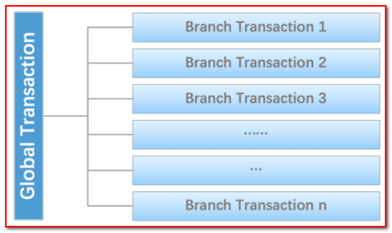

#### 2.5.3 Seata介绍

seata是阿里开源的一个分布式事务框架，能够让大家在操作分布式事务时，像操作本地事务一样简单。一个注解搞定分布式事务。

解决分布式事务问题，有两个设计初衷

对业务无侵入：即减少技术架构上的微服务化所带来的分布式事务问题对业务的侵入
高性能：减少分布式事务解决方案所带来的性能消耗

seata中有两种分布式事务实现方案，AT及TCC

AT模式主要关注多 DB 访问的数据一致性，当然也包括多服务下的多 DB 数据访问一致性问题 2PC-改进

TCC 模式主要关注业务拆分，在按照业务横向扩展资源时，解决微服务间调用的一致性问题

那 Seata 是怎么做到的呢？下面说说它的各个模块之间的关系。

Seata 的设计思路是将一个分布式事务可以理解成一个全局事务，下面挂了若干个分支事务，而一个分支事务是一个满足 ACID 的本地事务，因此我们可以操作分布式事务像操作本地事务一样。

2019 年 1 月，阿里巴巴中间件团队发起了开源项目 Fescar*（Fast & EaSy Commit And Rollback）*，和社区一起共建开源分布式事务解决方案。Fescar 的愿景是让分布式事务的使用像本地事务的使用一样，简单和高效，并逐步解决开发者们遇到的分布式事务方面的所有难题。

##### 2.5.3.1 AT模式

它使得应用代码可以像使用本地事务一样使用分布式事务，完全屏蔽了底层细节

AT 模式下，把每个数据库被当做是一个 Resource，Seata 里称为 DataSource Resource。业务通过 JDBC 标准接口访问数据库资源时，Seata 框架会对所有请求进行拦截，做一些操作。每个本地事务提交时，Seata RM（Resource Manager，资源管理器） 都会向 TC（Transaction Coordinator，事务协调器） 注册一个分支事务。当请求链路调用完成后，发起方通知 TC 提交或回滚分布式事务，进入二阶段调用流程。此时，TC 会根据之前注册的分支事务回调到对应参与者去执行对应资源的第二阶段。TC 是怎么找到分支事务与资源的对应关系呢？每个资源都有一个全局唯一的资源 ID，并且在初始化时用该 ID 向 TC 注册资源。在运行时，每个分支事务的注册都会带上其资源 ID。这样 TC 就能在二阶段调用时正确找到对应的资源。


解释：

Transaction Coordinator (TC)： 事务协调器，维护全局事务的运行状态，负责协调并决定全局事务的提交或回滚。
Transaction Manager（TM）： 控制全局事务的边界，负责开启一个全局事务，并最终发起全局提交或全局回滚的决议。
Resource Manager (RM)： 资源管理器，负责本地事务的注册，本地事务状态的汇报(投票)，并且负责本地事务的提交和回滚。

XID：一个全局事务的唯一标识

其中，TM是一个分布式事务的发起者和终结者，TC负责维护分布式事务的运行状态，而RM则负责本地事务的运行。如下图所示：


下面是一个分布式事务在Seata中的执行流程：

TM 向 TC 申请开启一个全局事务，全局事务创建成功并生成一个全局唯一的 XID
XID 在微服务调用链路的上下文中传播。
RM 向 TC 注册分支事务，接着执行这个分支事务并提交（重点：RM在第一阶段就已经执行了本地事务的提交/回滚），最后将执行结果汇报给TC
TM 根据 TC 中所有的分支事务的执行情况，发起全局提交或回滚决议。
TC 调度 XID 下管辖的全部分支事务完成提交或回滚请求。
Seata 中有三大模块，分别是 TM、RM 和 TC。 其中 TM 和 RM 是作为 Seata 的客户端与业务系统集成在一起，TC 作为 Seata 的服务端独立部署。

##### 2.5.3.4MT 模式

Seata还支持MT模式。MT模式本质上是一种TCC方案，业务逻辑需要被拆分为 Prepare/Commit/Rollback 3 部分，形成一个 MT 分支，加入全局事务。如图所示：


MT 模式一方面是 AT 模式的补充。另外，更重要的价值在于，通过 MT 模式可以把众多非事务性资源纳入全局事务的管理中。

## 3Seata案例

### 3.1需求分析

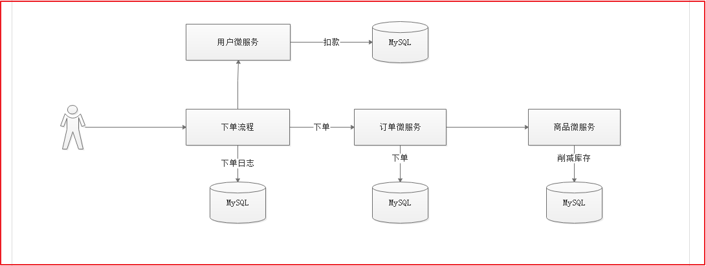

完成一个案例，用户下单的时候记录下单日志，完成订单添加，完成用户账户扣款，完成商品库存削减功能，一会在任何一个微服务中制造异常，测试分布式事务。

先将\seata\案例SQL脚本数据库脚本导入到数据库中。

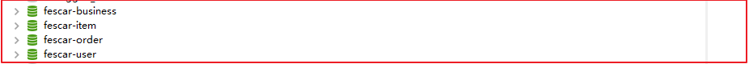

### 3.2案例实现

fescar:fast easy commit and rollback

#### 3.2.1父工程

搭建 fescar-parent

pom.xml依赖如下：

```xml
<?xml version="1.0" encoding="UTF-8"?>
<project xmlns="http://maven.apache.org/POM/4.0.0"
         xmlns:xsi="http://www.w3.org/2001/XMLSchema-instance"
         xsi:schemaLocation="http://maven.apache.org/POM/4.0.0 http://maven.apache.org/xsd/maven-4.0.0.xsd">
    <modelVersion>4.0.0</modelVersion>

    <groupId>com.atguigu</groupId>
    <artifactId>fescar-parent</artifactId>
    <version>1.0-SNAPSHOT</version>

    <parent>
        <groupId>org.springframework.boot</groupId>
        <artifactId>spring-boot-starter-parent</artifactId>
        <version>2.1.4.RELEASE</version>
    </parent>

    <packaging>pom</packaging>

    <!--跳过测试-->
    <properties>
        <skipTests>true</skipTests>
    </properties>

    <!--依赖包-->
    <dependencies>
        <!--测试包-->
        <dependency>
            <groupId>org.springframework.boot</groupId>
            <artifactId>spring-boot-starter-test</artifactId>
        </dependency>

        <!--fastjson-->
        <dependency>
            <groupId>com.alibaba</groupId>
            <artifactId>fastjson</artifactId>
            <version>1.2.51</version>
        </dependency>

        <!--鉴权-->
        <dependency>
            <groupId>io.jsonwebtoken</groupId>
            <artifactId>jjwt</artifactId>
            <version>0.9.0</version>
        </dependency>

        <!--web起步依赖-->
        <dependency>
            <groupId>org.springframework.boot</groupId>
            <artifactId>spring-boot-starter-web</artifactId>
        </dependency>

        <!-- redis 使用-->
        <dependency>
            <groupId>org.springframework.boot</groupId>
            <artifactId>spring-boot-starter-data-redis</artifactId>
        </dependency>

        <!--eureka-client-->
        <dependency>
            <groupId>org.springframework.cloud</groupId>
            <artifactId>spring-cloud-starter-netflix-eureka-client</artifactId>
        </dependency>

        <!--openfeign-->
        <dependency>
            <groupId>org.springframework.cloud</groupId>
            <artifactId>spring-cloud-starter-openfeign</artifactId>
        </dependency>

        <!--微信支付-->
        <dependency>
            <groupId>com.github.wxpay</groupId>
            <artifactId>wxpay-sdk</artifactId>
            <version>0.0.3</version>
        </dependency>

        <!--httpclient支持,微信支付-->
        <dependency>
            <groupId>org.apache.httpcomponents</groupId>
            <artifactId>httpclient</artifactId>
        </dependency>

        <!--通用mapper起步依赖,MyBatis通用Mapper封装，基于MyBatis动态SQL实现,可以实现对数据库的操作，不需要编写SQL语句-->
        <dependency>
            <groupId>tk.mybatis</groupId>
            <artifactId>mapper-spring-boot-starter</artifactId>
            <version>2.0.4</version>
        </dependency>

        <!--MySQL数据库驱动-->
        <dependency>
            <groupId>mysql</groupId>
            <artifactId>mysql-connector-java</artifactId>
        </dependency>

        <!--mybatis分页插件,用于解决数据库分页实现  PageHelper.start(当前页，每页显示的条数)-->
        <dependency>
            <groupId>com.github.pagehelper</groupId>
            <artifactId>pagehelper-spring-boot-starter</artifactId>
            <version>1.2.3</version>
        </dependency>
    </dependencies>

    <dependencyManagement>
        <dependencies>
            <dependency>
                <groupId>org.springframework.cloud</groupId>
                <artifactId>spring-cloud-dependencies</artifactId>
                <version>Greenwich.SR1</version>
                <type>pom</type>
                <scope>import</scope>
            </dependency>
        </dependencies>
    </dependencyManagement>
</project>
```

#### 3.2.2公共工程

将所有数据库对应的Pojo/Feign抽取出一个公共工程fescar-api, 在该工程中导入依赖:

pom.xml

```xml
<?xml version="1.0" encoding="UTF-8"?>
<project xmlns="http://maven.apache.org/POM/4.0.0"
         xmlns:xsi="http://www.w3.org/2001/XMLSchema-instance"
         xsi:schemaLocation="http://maven.apache.org/POM/4.0.0 http://maven.apache.org/xsd/maven-4.0.0.xsd">
    <parent>
        <artifactId>fescar-parent</artifactId>
        <groupId>com.atguigu</groupId>
        <version>1.0-SNAPSHOT</version>
    </parent>
    <modelVersion>4.0.0</modelVersion>
    <description>
<!--        API:Model和Feign-->
    </description>
    <artifactId>fescar-api</artifactId>
</project>
```

将Pojo导入到工程中

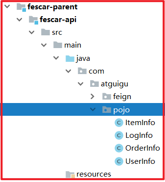

#### 3.2.3商品微服务

创建fescar-item微服务，在该工程中实现库存削减。

(1)pom.xml

```xml
<?xml version="1.0" encoding="UTF-8"?>
<project xmlns="http://maven.apache.org/POM/4.0.0"
         xmlns:xsi="http://www.w3.org/2001/XMLSchema-instance"
         xsi:schemaLocation="http://maven.apache.org/POM/4.0.0 http://maven.apache.org/xsd/maven-4.0.0.xsd">
    <parent>
        <artifactId>fescar-parent</artifactId>
        <groupId>com.atguigu</groupId>
        <version>1.0-SNAPSHOT</version>
    </parent>
    <modelVersion>4.0.0</modelVersion>
    <artifactId>fescar-item</artifactId>

    <dependencies>
        <dependency>
            <groupId>com.atguigu</groupId>
            <artifactId>fescar-api</artifactId>
            <version>1.0-SNAPSHOT</version>
        </dependency>
    </dependencies>
</project>
```

(2)Dao

创建com.atguigu.dao. ItemInfoMapper, 代码如下：

```java
package com.atguigu.dao;

import com.atguigu.pojo.ItemInfo;
import tk.mybatis.mapper.common.Mapper;

/*****
 * @Author: 马伟奇
 * @Description: com.atguigu.dao
 ****/
public interface ItemInfoMapper extends Mapper<ItemInfo> {
}
```

(3)Service

创建com.atguigu.service. ItemInfoService接口，并创建库存递减方法，代码如下：

```java
package com.atguigu.service;

/*****
 * @Author: 马伟奇
 * @Description: com.atguigu.service
 ****/
public interface ItemInfoService {
    /**
     * 库存递减
     * @param id
     * @param count
     */
    void decrCount(int id, int count);
}
```

创建com.atguigu.service.impl. ItemInfoServiceImpl实现库存递减操作，代码如下：

```java

package com.atguigu.service.impl;

import com.atguigu.dao.ItemInfoMapper;
import com.atguigu.pojo.ItemInfo;
import com.atguigu.service.ItemInfoService;
import org.springframework.beans.factory.annotation.Autowired;
import org.springframework.stereotype.Service;
import org.springframework.transaction.annotation.Transactional;

/*****
 * @Author: 马伟奇
 * @Description: com.atguigu.service.impl
 ****/
@Service
public class ItemInfoServiceImpl implements ItemInfoService {

    @Autowired
    private ItemInfoMapper itemInfoMapper;

    /***
     * 库存递减
     * @param id
     * @param count
     */
    @Transactional(rollbackFor = Exception.class)
    @Override
    public void decrCount(int id, int count) {
        //查询商品信息
        ItemInfo itemInfo = itemInfoMapper.selectByPrimaryKey(id);
        itemInfo.setCount(itemInfo.getCount()-count);
        int dcount = itemInfoMapper.updateByPrimaryKeySelective(itemInfo);
        System.out.println("库存递减受影响行数："+dcount);
    }
}
```

(4)Controller

创建com.atguigu.controller. ItemInfoController，代码如下：

```java

package com.atguigu.controller;

import com.atguigu.service.ItemInfoService;
import org.springframework.beans.factory.annotation.Autowired;
import org.springframework.web.bind.annotation.*;

/*****
 * @Author: 马伟奇
 * @Description: com.atguigu.controller
 ****/
@RestController
@RequestMapping("/itemInfo")
@CrossOrigin
public class ItemInfoController {

    @Autowired
    private ItemInfoService itemInfoService;

    /**
     * 库存递减
     * @param id
     * @param count
     * @return
     */
    @PostMapping(value = "/decrCount")
    public String decrCount(@RequestParam(value = "id") int id, @RequestParam(value = "count") int count){
        //库存递减
        itemInfoService.decrCount(id,count);
        return "success";
    }
}
```

(5)启动类

创建com.atguigu. ItemApplication代码如下：

```java
package com.atguigu;

import org.springframework.boot.SpringApplication;
import org.springframework.boot.autoconfigure.SpringBootApplication;
import org.springframework.cloud.netflix.eureka.EnableEurekaClient;
import org.springframework.cloud.openfeign.EnableFeignClients;
import tk.mybatis.spring.annotation.MapperScan;

/*****
 * @Author: 马伟奇
 * @Description: com.atguigu
 ****/
@SpringBootApplication
@EnableEurekaClient
@EnableFeignClients(basePackages = {"com.atguigu.feign"})
@MapperScan(basePackages = {"com.atguigu.dao"})
public class ItemApplication {

    public static void main(String[] args) {
        SpringApplication.run(ItemApplication.class,args);
    }
}
```

(6)application.yml

创建applicatin.yml, 配置如下：

```yaml
server:
  port: 18082
spring:
  application:
    name: item
  datasource:
    driver-class-name: com.mysql.jdbc.Driver
    url: jdbc:mysql://127.0.0.1:3306/fescar-item?useUnicode=true&characterEncoding=UTF-8&serverTimezone=UTC
    username: root
    password: root
  main:
    allow-bean-definition-overriding: true

eureka:
  client:
    service-url:
      defaultZone: http://127.0.0.1:7001/eureka/
  instance:
    prefer-ip-address: true
feign:
  hystrix:
    enabled: true
#hystrix 配置
hystrix:
  command:
    default:
      execution:
        isolation:
          thread:
            timeoutInMilliseconds: 10000
          strategy: SEMAPHORE
```

#### 3.2.4用户微服务

创建fescar-user微服务，并引入公共工程依赖。

(1)pom.xml

```xml

<?xml version="1.0" encoding="UTF-8"?>
<project xmlns="http://maven.apache.org/POM/4.0.0"
         xmlns:xsi="http://www.w3.org/2001/XMLSchema-instance"
         xsi:schemaLocation="http://maven.apache.org/POM/4.0.0 http://maven.apache.org/xsd/maven-4.0.0.xsd">
    <parent>
        <artifactId>fescar-parent</artifactId>
        <groupId>com.atguigu</groupId>
        <version>1.0-SNAPSHOT</version>
    </parent>
    <modelVersion>4.0.0</modelVersion>
    <artifactId>fescar-user</artifactId>

    <dependencies>
        <dependency>
            <groupId>com.atguigu</groupId>
            <artifactId>fescar-api</artifactId>
            <version>1.0-SNAPSHOT</version>
        </dependency>
    </dependencies>

</project>
```

(2)Dao

创建com.atguigu.dao. UserInfoMapper，代码如下：

```java
package com.atguigu.dao;

import com.atguigu.pojo.UserInfo;
import tk.mybatis.mapper.common.Mapper;

/*****
 * @Author: 马伟奇
 * @Description: com.atguigu.dao
 ****/
public interface UserInfoMapper extends Mapper<UserInfo> {
}
```

(3)Service

创建com.atguigu.service. UserInfoService接口，代码如下：

```java
package com.atguigu.service;

/*****
 * @Author: 马伟奇
 * @Description: com.atguigu.service
 ****/
public interface UserInfoService {
    /***
     * 账户金额递减
     * @param username
     * @param money
     */
    void decrMoney(String username, int money);
}
```

创建com.atguigu.service.impl. UserInfoServiceImpl实现用户账户扣款，代码如下：

```java
package com.atguigu.service.impl;

import com.atguigu.dao.UserInfoMapper;
import com.atguigu.pojo.UserInfo;
import com.atguigu.service.UserInfoService;
import org.springframework.beans.factory.annotation.Autowired;
import org.springframework.stereotype.Service;
import org.springframework.transaction.annotation.Transactional;

/*****
 * @Author: 马伟奇
 * @Description: com.atguigu.service.impl
 ****/
@Service
public class UserInfoServiceImpl implements UserInfoService {

    @Autowired
    private UserInfoMapper userInfoMapper;

    /***
     * 账户金额递减
     * @param username
     * @param money
     */
    @Transactional(rollbackFor = Exception.class)
    @Override
    public void decrMoney(String username, int money) {
        UserInfo userInfo = userInfoMapper.selectByPrimaryKey(username);
        userInfo.setMoney(userInfo.getMoney()-money);
        int count = userInfoMapper.updateByPrimaryKeySelective(userInfo);
        System.out.println("添加用户受影响行数："+count);
      //  int q=10/0;
    }
}
```

(4)Controller

创建com.atguigu.controller. UserInfoController代码如下：

```java
package com.atguigu.controller;

import com.atguigu.service.UserInfoService;
import org.springframework.beans.factory.annotation.Autowired;
import org.springframework.web.bind.annotation.*;

/*****
 * @Author: 马伟奇
 * @Description: com.atguigu.controller
 ****/
@RestController
@RequestMapping("/userInfo")
@CrossOrigin
public class UserInfoController {

    @Autowired
    private UserInfoService userInfoService;

    /***
     * 账户余额递减
     * @param username
     * @param money
     */
    @PostMapping(value = "/add")
    public String decrMoney(@RequestParam(value = "username") String username, @RequestParam(value = "money") int money){
        userInfoService.decrMoney(username,money);
        return "success";
    }

}
```

(5)启动类

创建com.atguigu. UserApplication，代码如下：

```java
package com.atguigu;

import org.springframework.boot.SpringApplication;
import org.springframework.boot.autoconfigure.SpringBootApplication;
import org.springframework.cloud.netflix.eureka.EnableEurekaClient;
import org.springframework.cloud.openfeign.EnableFeignClients;
import tk.mybatis.spring.annotation.MapperScan;

/*****
 * @Author: 马伟奇
 * @Description: com.atguigu
 ****/
@SpringBootApplication
@EnableEurekaClient
@EnableFeignClients(basePackages = {"com.atguigu.feign"})
@MapperScan(basePackages = {"com.atguigu.dao"})
public class UserApplication {

    public static void main(String[] args) {
        SpringApplication.run(UserApplication.class,args);
    }
}
```

(6)application.yml

创建application.yml配置如下：

```yaml

server:
  port: 18084
spring:
  application:
    name: user
  datasource:
    driver-class-name: com.mysql.jdbc.Driver
    url: jdbc:mysql://127.0.0.1:3306/fescar-user?useUnicode=true&characterEncoding=UTF-8&serverTimezone=UTC
    username: root
    password: root
  main:
    allow-bean-definition-overriding: true

eureka:
  client:
    service-url:
      defaultZone: http://127.0.0.1:7001/eureka
  instance:
    prefer-ip-address: true
feign:
  hystrix:
    enabled: true
#hystrix 配置
hystrix:
  command:
    default:
      execution:
        isolation:
          thread:
            timeoutInMilliseconds: 10000
          strategy: SEMAPHORE
```

#### 3.2.5订单微服务

在订单微服务中实现调用商品微服务递减库存。

(1)pom.xml

```xml
<?xml version="1.0" encoding="UTF-8"?>
<project xmlns="http://maven.apache.org/POM/4.0.0"
         xmlns:xsi="http://www.w3.org/2001/XMLSchema-instance"
         xsi:schemaLocation="http://maven.apache.org/POM/4.0.0 http://maven.apache.org/xsd/maven-4.0.0.xsd">
    <parent>
        <artifactId>fescar-parent</artifactId>
        <groupId>com.atguigu</groupId>
        <version>1.0-SNAPSHOT</version>
    </parent>
    <modelVersion>4.0.0</modelVersion>
    <artifactId>fescar-order</artifactId>

    <dependencies>
        <dependency>
            <groupId>com.atguigu</groupId>
            <artifactId>fescar-api</artifactId>
            <version>1.0-SNAPSHOT</version>
        </dependency>
    </dependencies>
</project>
```

(2)Dao

创建com.atguigu.dao. OrderInfoMapper，代码如下：

```java
package com.atguigu.dao;

import com.atguigu.pojo.OrderInfo;
import tk.mybatis.mapper.common.Mapper;

/*****
 * @Author: 马伟奇
 * @Description: com.atguigu.dao
 ****/
public interface OrderInfoMapper extends Mapper<OrderInfo> {
}
```

(3)Service

创建com.atguigu.service. OrderInfoService实现添加订单操作，代码如下：

```java
package com.atguigu.service;

/*****
 * @Author: 马伟奇
 * @Description: com.atguigu.service
 ****/
public interface OrderInfoService {

    /***
     * 添加订单
     * @param username
     * @param id
     * @param count
     */
    void add(String username, int id, int count);
}
```

创建com.atguigu.service.impl. OrderInfoServiceImpl，代码如下：

```java
package com.atguigu.service.impl;

import com.atguigu.dao.OrderInfoMapper;
import com.atguigu.feign.ItemInfoFeign;
import com.atguigu.pojo.OrderInfo;
import com.atguigu.service.OrderInfoService;
import org.springframework.beans.factory.annotation.Autowired;
import org.springframework.stereotype.Service;
import org.springframework.transaction.annotation.Transactional;

/*****
 * @Author: 马伟奇
 * @Description: com.atguigu.service.impl
 ****/
@Service
public class OrderInfoServiceImpl implements OrderInfoService {

    @Autowired
    private OrderInfoMapper orderInfoMapper;

    @Autowired
    private ItemInfoFeign itemInfoFeign;

    /***
     * 添加订单
     * @param username
     * @param id
     * @param count
     */
    @Transactional
    @Override
    public void add(String username, int id, int count) {
        //添加订单
        OrderInfo orderInfo = new OrderInfo();
        orderInfo.setMessage("生成订单");
        orderInfo.setMoney(10);
        int icount = orderInfoMapper.insertSelective(orderInfo);
        System.out.println("添加订单受影响函数："+icount);

        //递减库存
        itemInfoFeign.decrCount(id,count);
    }
}
```

(3)Controller

创建com.atguigu.controller. OrderInfoController调用下单操作，代码如下：

```java
package com.atguigu.controller;

import com.atguigu.service.OrderInfoService;
import org.springframework.beans.factory.annotation.Autowired;
import org.springframework.web.bind.annotation.*;

/*****
 * @Author: 马伟奇
 * @Description: com.atguigu.controller
 ****/
@RestController
@RequestMapping("/orderInfo")
@CrossOrigin
public class OrderInfoController {

    @Autowired
    private OrderInfoService orderInfoService;

    /**
     * 增加订单
     * @param username
     * @param id
     * @param count
     */
    @PostMapping(value = "/add")
    public String add(@RequestParam(value = "name") String username, @RequestParam(value = "id") int id, @RequestParam(value = "count") int count){
        //添加订单
        orderInfoService.add(username,id,count);
        return "success";
    }

}
```

(4)启动类

创建com.atguigu. OrderApplication启动类，代码如下：

```java
package com.atguigu;

import org.springframework.boot.SpringApplication;
import org.springframework.boot.autoconfigure.SpringBootApplication;
import org.springframework.cloud.netflix.eureka.EnableEurekaClient;
import org.springframework.cloud.openfeign.EnableFeignClients;
import tk.mybatis.spring.annotation.MapperScan;

/*****
 * @Author: 马伟奇
 * @Description: com.atguigu
 ****/
@SpringBootApplication
@EnableEurekaClient
@EnableFeignClients(basePackages = {"com.atguigu.feign"})
@MapperScan(basePackages = {"com.atguigu.dao"})
public class OrderApplication {

    public static void main(String[] args) {
        SpringApplication.run(OrderApplication.class,args);
    }
}
```

(5)application.yml配置

```yaml

server:
  port: 18083
spring:
  application:
    name: order
  datasource:
    driver-class-name: com.mysql.jdbc.Driver
    url: jdbc:mysql://127.0.0.1:3306/fescar-order?useUnicode=true&characterEncoding=UTF-8&serverTimezone=UTC
    username: root
    password: root
  main:
    allow-bean-definition-overriding: true

eureka:
  client:
    service-url:
      defaultZone: http://127.0.0.1:7001/eureka
  instance:
    prefer-ip-address: true
feign:
  hystrix:
    enabled: true
#hystrix 配置
hystrix:
  command:
    default:
      execution:
        isolation:
          thread:
            timeoutInMilliseconds: 10000
          strategy: SEMAPHORE
```

#### 3.2.6业务微服务

创建fescar-business业务微服务，在该微服务中实现分布式事务控制，下单入口从这里开始。

（1）pom.xml

```xml
<?xml version="1.0" encoding="UTF-8"?>
<project xmlns="http://maven.apache.org/POM/4.0.0"
         xmlns:xsi="http://www.w3.org/2001/XMLSchema-instance"
         xsi:schemaLocation="http://maven.apache.org/POM/4.0.0 http://maven.apache.org/xsd/maven-4.0.0.xsd">
    <parent>
        <artifactId>fescar-parent</artifactId>
        <groupId>com.atguigu</groupId>
        <version>1.0-SNAPSHOT</version>
    </parent>
    <modelVersion>4.0.0</modelVersion>
    <description>分布式事务业务控制</description>
    <artifactId>fescar-business</artifactId>

    <dependencies>
        <dependency>
            <groupId>com.atguigu</groupId>
            <artifactId>fescar-api</artifactId>
            <version>1.0-SNAPSHOT</version>
        </dependency>
    </dependencies>

</project>
```

(2)Dao

创建com.atguigu.dao. LogInfoMapper代码如下：

```java
package com.atguigu.dao;

import com.atguigu.pojo.LogInfo;
import tk.mybatis.mapper.common.Mapper;

/*****
 * @Author: 马伟奇
 * @Description: com.atguigu.dao
 ****/
public interface LogInfoMapper extends Mapper<LogInfo> {
}
```

(3)Service

创建com.atguigu.service. BusinessService接口，代码如下：

```java
package com.atguigu.service;

/*****
 * @Author: 马伟奇
 * @Description: com.atguigu.service
 ****/
public interface BusinessService {

    /**
     * 下单
     * @param username
     * @param id
     * @param count
     */
    void add(String username, int id, int count);
}
```

创建com.atguigu.service.impl. BusinessServiceImpl，代码如下：

```java
package com.atguigu.service.impl;

import com.atguigu.dao.LogInfoMapper;
import com.atguigu.feign.OrderInfoFeign;
import com.atguigu.feign.UserInfoFeign;
import com.atguigu.pojo.LogInfo;
import com.atguigu.service.BusinessService;
import org.springframework.beans.factory.annotation.Autowired;
import org.springframework.stereotype.Service;

import java.util.Date;

/*****
 * @Author: 马伟奇
 * @Description: com.atguigu.service.impl
 ****/
@Service
public class BusinessServiceImpl implements BusinessService {

    @Autowired
    private OrderInfoFeign orderInfoFeign;

    @Autowired
    private UserInfoFeign userInfoFeign;

    @Autowired
    private LogInfoMapper logInfoMapper;

    /***
     * ①
     * 下单
     * @GlobalTransactional:全局事务入口
     * @param username
     * @param id
     * @param count
     */

    @Override
    public void add(String username, int id, int count) {
        //添加订单日志
        LogInfo logInfo = new LogInfo();
        logInfo.setContent("添加订单数据---"+new Date());
        logInfo.setCreatetime(new Date());
        int logcount = logInfoMapper.insertSelective(logInfo);
        System.out.println("添加日志受影响行数："+logcount);

        //添加订单
        orderInfoFeign.add(username,id,count);

        //用户账户余额递减
        userInfoFeign.decrMoney(username,10);
    }
}
```

(4)Controller

创建com.atguigu.controller. BusinessController，代码如下：

```java
package com.atguigu.controller;

import com.atguigu.service.BusinessService;
import org.springframework.beans.factory.annotation.Autowired;
import org.springframework.web.bind.annotation.RequestMapping;
import org.springframework.web.bind.annotation.RestController;

/*****
 * @Author: 马伟奇
 * @Description: com.atguigu.controller
 ****/
@RestController
@RequestMapping(value = "/business")
public class BusinessController {

    @Autowired
    private BusinessService businessService;

    /***
     * 购买商品分布式事务测试
     * @return
     */
    @RequestMapping(value = "/addorder")
    public String order(){
        String username="zhangsan";
        int id=1;
        int count=5;
        //下单
        businessService.add(username,id,count);
        return "success";
    }
}
```

(5)启动类

创建启动类com.atguigu. BusinessApplication，代码如下：

```java
package com.atguigu;

import org.springframework.boot.SpringApplication;
import org.springframework.boot.autoconfigure.SpringBootApplication;
import org.springframework.cloud.netflix.eureka.EnableEurekaClient;
import org.springframework.cloud.openfeign.EnableFeignClients;
import tk.mybatis.spring.annotation.MapperScan;

/*****
 * @Author: 马伟奇
 * @Description: com.atguigu
 ****/
@SpringBootApplication
@EnableEurekaClient
@EnableFeignClients(basePackages = {"com.atguigu.feign"})
@MapperScan(basePackages = {"com.atguigu.dao"})
public class BusinessApplication {

    public static void main(String[] args) {
        SpringApplication.run(BusinessApplication.class,args);
    }
}
```

(6)application.yml配置

```yaml
server:
  port: 18081
spring:
  application:
    name: business
  datasource:
    driver-class-name: com.mysql.jdbc.Driver
    url: jdbc:mysql://127.0.0.1:3306/fescar-business?useUnicode=true&characterEncoding=UTF-8&serverTimezone=UTC
    username: root
    password: root
  main:
    allow-bean-definition-overriding: true

eureka:
  client:
    service-url:
      defaultZone: http://127.0.0.1:7001/eureka
  instance:
    prefer-ip-address: true
feign:
  hystrix:
    enabled: true

#读取超时设置
ribbon:
  ReadTimeout: 30000
#hystrix 配置
hystrix:
  command:
    default:
      execution:
        isolation:
          thread:
            timeoutInMilliseconds: 10000
          strategy: SEMAPHORE
```

直接启动测试

### 3.3分布式事务抽取

Seata参考地址：<https://github.com/seata/seata-samples/blob/master/doc/quick-integration-with-spring-cloud.md>

上面案例，并没有实现分布式事务，在我们以后工作中，也并非每个服务都需要实现分布式事务，我们可以将分布式事务抽取出来。

相关概念讲解

XID：全局事务的唯一标识，由 ip:port:sequence 组成；
Transaction Coordinator (TC)：事务协调器，维护全局事务的运行状态，负责协调并驱动全局事务的提交或回滚；
Transaction Manager (TM )：控制全局事务的边界，负责开启一个全局事务，并最终发起全局提交或全局回滚的决议；
Resource Manager (RM)：控制分支事务，负责分支注册、状态汇报，并接收事务协调器的指令，驱动分支（本地）事务的提交和回滚；
Fescar 使用 XID 表示一个分布式事务，XID 需要在一次分布式事务请求所涉的系统中进行传递，从而向 feacar-server 发送分支事务的处理情况，以及接收 feacar-server 的 commit、rollback 指令。

#### 3.3.2配置讲解

fescar 的配置入口文件是 registry.conf, 查看代码 ConfigurationFactory 得知目前还不能指定该配置文件，所以配置文件名称只能为 registry.conf。

在 registry 中可以指定具体配置的形式，默认使用 file 类型，在 file.conf 中有 3 部分配置内容：

transport transport : 用于定义 Netty 相关的参数，TM、RM 与 fescar-server 之间使用 Netty 进行通信。

service:

```
service {
  #vgroup->rgroup
  vgroup_mapping.my_test_tx_group = "default"
  #only support single node 配置Client连接TC的地址
  default.grouplist = "127.0.0.1:8091"
  #degrade current not support
  enableDegrade = false
  #disable
  disable = false
  #是否启用Seata分布式事务
  disableGlobalTransaction = false
}
```

client:

```
client {
  #RM接收TC的commit通知缓冲上限
  async.commit.buffer.limit = 10000
  lock {
    retry.internal = 10
    retry.times = 30
  }
```

fescar 在 AT 模式下需要创建数据库代理. 在com.atguigu.fescar. FescarAutoConfiguration中代码如下：

```java
/***
 * 创建代理数据库
 * 会将und_log绑定到本地事务中
 * @param environment
 * @return
 */
@Bean
public DataSource dataSource(Environment environment){
    //创建数据源对象
    DruidDataSource dataSource = new DruidDataSource();
    //获取数据源链接地址
    dataSource.setUrl(environment.getProperty("spring.datasource.url"));
    try {
        //设置数据库驱动
        dataSource.setDriver(DriverManager.getDriver(environment.getProperty("spring.datasource.url")));
    } catch (SQLException e) {
        throw new RuntimeException("无法识别驱动类型");
    }
    //获取数据库名字
    dataSource.setUsername(environment.getProperty("spring.datasource.username"));
    //获取数据库密码
    dataSource.setPassword(environment.getProperty("spring.datasource.password"));
    //将数据库封装成一个代理数据库
    return new DataSourceProxy(dataSource);
}

/***
 * 全局事务扫描器
 * 用来解析带有@GlobalTransactional注解的方法，然后采用AOP的机制控制事务
 * @param environment
 * @return
 */
@Bean
public GlobalTransactionScanner globalTransactionScanner(Environment environment){
    //事务分组名称
    String applicationName = environment.getProperty("spring.application.name");
    String groupName = environment.getProperty("fescar.group.name");
    if(applicationName == null){
        return new GlobalTransactionScanner(groupName == null ? "my_test_tx_group" : groupName);
    }else{
        return new GlobalTransactionScanner(applicationName, groupName == null ? "my_test_tx_group" : groupName);
    }
}
```

使用 DataSourceProxy 的目的是为了引入 ConnectionProxy ，fescar 无侵入的一方面就体现在 ConnectionProxy 的实现上，即分支事务加入全局事务的切入点是在本地事务的 commit 阶段，这样设计可以保证业务数据与 undo_log 是在一个本地事务中。

undo_log 是需要在业务库上创建的一个表，fescar 依赖该表记录每笔分支事务的状态及二阶段 rollback 的回放数据。不用担心该表的数据量过大形成单点问题，在全局事务 commit 的场景下事务对应的 undo_log 会异步删除。

所以在每个微服务对应的数据库中需要创建一张undo_log表。

```sql
CREATE TABLE `undo_log` (
  `id` bigint(20) NOT NULL AUTO_INCREMENT,
  `branch_id` bigint(20) NOT NULL,
  `xid` varchar(100) NOT NULL,
  `rollback_info` longblob NOT NULL,
  `log_status` int(11) NOT NULL,
  `log_created` datetime NOT NULL,
  `log_modified` datetime NOT NULL,
  `ext` varchar(100) DEFAULT NULL,
  PRIMARY KEY (`id`),
  KEY `idx_unionkey` (`xid`,`branch_id`)
) ENGINE=InnoDB AUTO_INCREMENT=35 DEFAULT CHARSET=utf8;
```
