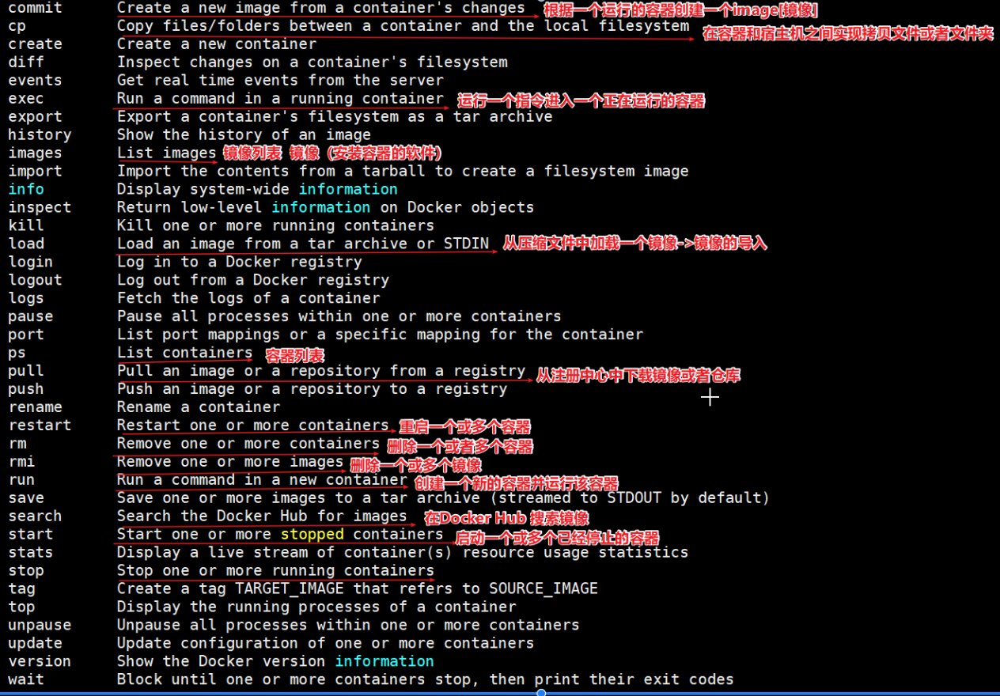
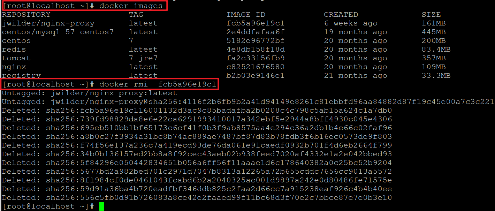

# Docker 简介

## 1.1 什么是虚拟化

虚拟化，是指通过虚拟化技术将一台计算机虚拟为多台逻辑计算机。在一台计算机上同时运行多个逻辑计算机，每个逻辑计算机可运行不同的操作系统，并且应用程序都可以在相互独立的空间内运行而互不影响，从而显著提高计算机的工作效率。

虚拟化技术种类很多，例如：软件虚拟化、硬件虚拟化、内存虚拟化、网络虚拟化(vip)、桌面虚拟化、服务虚拟化、虚拟机等等。

## 1.2 问题：为什么会有 docker 出现？

一款产品从开发到上线，从操作系统，到运行环境，再到应用配置。作为开发+运维之间的协作我们需要关心很多东西，这也是很多互联网公司都不得不面对的问题，特别是各种版本的迭代之后，不同版本环境的兼容，对运维人员都是考验 , 这个时候 Docker 横空出世，是因为它对此给出了一个标准化的解决方案。
环境配置如此麻烦，换一台机器，就要重来一次，费力费时。很多人想到，能不能从根本上解决问题，软件可以带环境安装？也就是说，安装的时候，把原始环境一模一样地复制过来。开发人员利用 Docker 可以消除协作编码时“在我的机器上可正常工作”的问题。


之前，可以发现，每发布一个程序，都要走一遍以上的流程：

## 1.2 什么是 Docker

Docker 是一个开源的应用容器引擎，基于 Go 语言开发。Docker 可以让开发者打包他们的应用以及依赖包到一个轻量级、可移植的容器中，然后发布到任何流行的 Linux 机器上，也可以实现虚拟化。容器是完全使用沙箱机制，相互之间不会有任何接口（类似 iPhone 的 app）,更重要的是容器性能开销极低。

Docker 的主要目标是“Build，Ship and Run Any App,Anywhere”，也就是通过对应用组件的封装、分发、部署、运行等生命周期的管理，使用户的 APP（可以是一个 WEB 应用或数据库应用等等）及其运行环境能够做到“一次封装，到处运行”。

总之一句话：只需要一次配置好环境，换到别的机子上就可以一键部署好，大大简化了操作 。


为什么选择 Docker?

Docker 的镜像提供了除内核外完整的运行时环境，确保了应用运行环境一致性，从而不会再出现“这段代码在我机器上没问题啊”这类问题；——一致的运行环境
可以做到秒级、甚至毫秒级的启动时间。大大的节约了开发、测试、部署的时间。——更快速的启动时间
避免公用的服务器，资源会容易受到其他用户的影响。——隔离性
善于处理集中爆发的服务器使用压力；——弹性伸缩，快速扩展
可以很轻易的将在一个平台上运行的应用，迁移到另一个平台上，而不用担心运行环境的变化导致应用无法正常运行的情况。——迁移方便
使用 Docker 可以通过定制应用镜像来实现持续集成、持续交付、部署。——持续交付和部署
Docker 应用场景

① Web 应用的自动化打包和发布
② 自动化测试和持续集成、发布
③ 在服务型环境中部署和调整数据库或其他的后台应用

使用 Docker 可以实现开发人员的开发环境、测试人员的测试环境、运维人员的生产环境的一致性。


Docker 借鉴了标准集装箱的概念。标准集装箱将货物运往世界各地，Docker 将这个模型运用到自己的设计
中，唯一不同的是：集装箱运输货物，而 Docker 运输软件。

## 1.3 容器与虚拟机比较

下面的图片比较了 Docker 和传统虚拟化方式的不同之处，可见容器是在操作系统层面上实现虚拟化，直接复用本地主机的操作系统，而传统方式则是在硬件层面实现。

传统虚拟机


传统虚拟机技术基于安装在主操作系统上的虚拟机管理系统（如：VirtualBox 和 VMWare 等），创建虚拟机（虚拟出各种硬件），在虚拟机上安装从操作系统，在从操作系统中安装部署各种应用。

Docker


Docker 容器是在操作系统层面上实现虚拟化，直接复用本地主机的操作系统，而传统虚拟机则是在硬件层面实现虚拟化。与传统的虚拟机相比，Docker 优势体现为启动速度快、占用体积小。

使用上的区别


简单来说： 容器和虚拟机具有相似的资源隔离和分配优势，但功能有所不同，因为容器虚拟化的是操作系统，而不是硬件，因此容器更容易移植，效率也更高。

## 1.4 Docker 组件

### 1.4.1 Docker 组成部分

Docker 是一个客户端-服务器（C/S）架构程序。Docker 客户端只需要向 Docker 服务器或者守护进程发出请求，服务器或者守护进程将完成所有工作并返回结果。Docker 提供了一个命令行工具 Docker 以及一整套 RESTful API。你可以在同一台宿主机上运行 Docker 守护进程和客户端，也可以从本地的 Docker 客户端连接到运行在另一台宿主机上的远程 Docker 守护进程。


### 1.4.2 Docker 镜像与容器

镜像：类似虚拟机镜像 , 是一个特殊的文件系统

操作系统分为内核和用户空间。对于 Linux 而言，内核启动后，会挂载 root 文件系统为其提供用户空间支持。而 Docker 镜像（Image），就相当于是一个 root 文件系统。

Docker 镜像是一个特殊的文件系统，除了提供容器运行时所需的程序、库、资源、配置等文件外，还包含了一些为运行时准备的一些配置参数（如匿名卷、环境变量、用户等）。 镜像不包含任何动态数据，其内容在构建之后也不会被改变。

容器：类似 linux 系统环境，运行和隔离应用。是镜像运行时的实体

镜像（Image）和容器（Container）的关系，就像是面向对象程序设计中的类和实例一样，镜像是静态的定义，容器是镜像运行时的实体。容器可以被创建、启动、停止、删除、暂停等 。

仓库：集中存放镜像文件的地方。

镜像构建完成后，可以很容易的在当前宿主上运行，但是， 如果需要在其它服务器上使用这个镜像，我们就需要一个集中存储、分发镜像的地方，比如后面我们要学的，Docker Registry 就是这样的服务。

### 1.4.3 Registry（注册中心）

Docker 用 Registry 来保存用户构建的镜像。Registry 分为公共和私有两种。Docker 公司运营公共的 Registry 叫做 Docker Hub。用户可以在 Docker Hub 注册账号，分享并保存自己的镜像（说明：在 Docker Hub 下载镜像巨慢，可以自己构建私有的 Registry）。

https://hub.docker.com/

# 2 Docker 安装与启动

## 2.1 安装 Docker

Docker 官方建议在 Ubuntu 中安装，因为 Docker 是基于 Ubuntu 发布的，而且一般 Docker 出现的问题 Ubuntu 是最先更新或者打补丁的。在很多版本的 CentOS 中是不支持更新最新的一些补丁包的。

由于我们学习的环境都使用的是 CentOS，因此这里我们将 Docker 安装到 CentOS 上。注意：这里建议安装在 CentOS7.x 以上的版本，在 CentOS6.x 的版本中，安装前需要安装其他很多的环境而且 Docker 很多补丁不支持更新。

资料已经准备了安装好的镜像，直接挂载即可。

账号：root

密码：123456

查看 ip 地址

ip addr


请直接挂载课程配套的 Centos7.x 镜像

（1）yum 包更新到最新

sudo yum update


（2）安装需要的软件包， yum-util 提供 yum-config-manager 功能，另外两个是 devicemapper 驱动依赖的

sudo yum install -y yum-utils device-mapper-persistent-data lvm2


（3）设置 yum 源为阿里云

sudo yum-config-manager --add-repo http://mirrors.aliyun.com/docker-ce/linux/centos/docker-ce.repo


（4）安装 docker

sudo yum install docker-ce


（5）安装后查看 docker 版本

docker -v


## 2.2 设置 ustc 的镜像

ustc 是老牌的 linux 镜像服务提供者了，还在遥远的 ubuntu 5.04 版本的时候就在用。ustc 的 docker 镜像加速器速度很快。ustc docker mirror 的优势之一就是不需要注册，是真正的公共服务。

https://lug.ustc.edu.cn/wiki/mirrors/help/docker

编辑该文件：

vi /etc/docker/daemon.json  


在该文件中输入如下内容：

```json
{
  "registry-mirrors": ["https://docker.mirrors.ustc.edu.cn"]
}
```

退出保存

先点下 esc 然后在 :wq

## 2.3 Docker 的启动与停止

systemctl 命令是系统服务管理器指令

启动 docker：

systemctl start docker


停止 docker：

systemctl stop docker


重启 docker：

systemctl restart docker


查看 docker 状态：

systemctl status docker


开机启动：

systemctl enable docker


查看 docker 概要信息

docker info


查看 docker 帮助文档

docker --help




指令介绍：

cp:本地文件系统(OS 操作系统|宿主机)和容器之间进行文件或者文件夹拷贝
exec:登录一个容器，使用命令行操作正在运行的容器。
images:镜像的集合查询。
ps:容器列表
pull:下载镜像
restart:重启一个或多个容器
rm:删除一个或多个容器
rmi:删除一个或多个镜像
run:创建一个容器，并运行起来
save:导出镜像到一个文件(tar)中
search:搜索镜像（从 Docker Hub）
start：启动一个或多个已经停止的容器
restart:重启动一个或多个已经停止的容器
stop：停止一个或多个正在运行的容器

# 3 常用命令

镜像：Docker 镜像是由文件系统叠加而成（是一种文件的存储形式）；是 docker 中的核心概念，可以认为镜像就是对某些运行环境或者软件打的包，用户可以从 docker 仓库中下载基础镜像到本地，比如开发人员可以从 docker 仓库拉取（下载）一个只包含 centos7 系统的基础镜像，然后在这个镜像中安装 jdk、mysql、Tomcat 和自己开发的应用，最后将这些环境打成一个新的镜像。开发人员将这个新的镜像提交给测试人员进行测试，测试人员只需要在测试环境下运行这个镜像就可以了，这样就可以保证开发人员的环境和测试人员的环境完全一致。

## 3.1 镜像相关命令

### 3.1.1 查看镜像

查看镜像可以使用如下命令：

docker images


REPOSITORY：镜像名称

TAG：镜像标签

IMAGE ID：镜像 ID

CREATED：镜像的创建日期（不是获取该镜像的日期）

SIZE：镜像大小

这些镜像都是存储在 Docker 的 /var/lib/docker 目录下

### 3.1.2 搜索镜像

如果你需要从网络中查找需要的镜像，可以通过以下命令搜索

如果你需要从网络中查找需要的镜像，可以通过以下命令搜索

docker search 镜像名称

比如 docker search nginx

例如 下载一个 nginx 镜像


NAME：仓库名称

DESCRIPTION：镜像描述

STARS：用户评价，反应一个镜像的受欢迎程度

OFFICIAL：是否官方

AUTOMATED：自动构建，表示该镜像由 Docker Hub 自动构建流程创建的

### 3.1.3 拉取镜像

拉取镜像就是从中央仓库中下载镜像到本地

拉取镜像就是从 Docker 仓库下载镜像到本地，镜像名称格式为 名称:版本号，如果版本号不指定则是最新的版本

命令如下：
docker pull 镜像名称

例如，我要下载 centos7 镜像

docker pull centos:7
下载一个 nginx 的镜像 , 需要注意：如果下载的时候，不指定版本，会下载最新的版本


刚刚下载的镜像通过 docker images 就可以查看


### 3.1.4 删除镜像

按镜像 ID 删除镜像

可以按照镜像 id 删除镜像，命令如下：

docker rmi 镜像 ID
删除 nginx 镜像



刚刚的 nginx 就已经被删除了


删除所有镜像

docker rmi `docker images -q`
3.15 从 Docker Hub 拉取
Docker 镜像首页，包括官方镜像和其它公开镜像。Docker Hub 上最受欢迎的 10 大镜像（通过 Docker registry API 获取不了镜像被 pull 的个数，只能通过镜像的 stars 数量，来衡量镜像的流行度。毫无疑问，拥有最高 stars 数量的库都是官方库）。

https://hub.docker.com/search?image_filter=official&type=image


国情的原因，国内下载 Docker HUB 官方的相关镜像比较慢，可以使用国内（docker.io）的一些镜像加速器，镜像保持和官方一致，关键是速度块，推荐使用。

## 3.2 容器相关命令

容器，也是 docker 中的核心概念，镜像是创建容器的软件 , 容器是由镜像运行产生的运行实例。镜像和容器的关系，就如同 Java 语言中类和对象的关系。

如果需要通俗的描述容器的话，我觉得容器就是一个存放东西的地方，就像书包可以装各种文具、衣柜可以放各种衣服、鞋架可以放各种鞋子一样。我们现在所说的容器存放的东西可能更偏向于应用比如网站、程序甚至是系统环境。


### 3.2.1 查看容器

查看正在运行的容器

docker ps


查看所有容器

docker ps –a


查看最后一次运行的容器

docker ps –l


查看停止的容器

docker ps -f status=exited


### 3.2.2 创建与启动容器

① 什么是宿主机？

就是主机，这个概念是相对于子机而言的，比如你安装有虚拟机的话，那么相对于虚拟机而言，你正在使用的计算机就是宿主机，虚拟机是安装在主机上的，必须在主机上才能运行，主机就是一个“宿主”。

② 创建容器常用的参数说明：

创建容器命令：docker run

-i：表示运行容器

-t：表示容器启动后会进入其命令行。加入这两个参数后，容器创建就能登录进去。即分配一个伪终端。

--name :为创建的容器命名。

-v：表示目录映射关系（前者是宿主机目录，后者是映射到宿主机上的目录），可以使用多个－v 做多个目录或文件映射。注意：最好做目录映射，在宿主机上做修改，然后共享到容器上。

-d：在 run 后面加上-d 参数,则会创建一个守护式容器在后台运行（这样创建容器后不会自动登录容器，如果只加-i -t 两个参数，创建后就会自动进去容器）。

-p：表示端口映射，前者是宿主机端口，后者是容器内的映射端口。可以使用多个-p 做多个端口映射
（1）交互式方式创建容器

以交互式方式创建并启动容器，启动完成后，直接进入当前容器。使用 exit 命令退出容器。需要注意的是以此种方式启动容器，如果退出容器，则容器会进入停止状态。可以理解成交互式容器 是前台容器。

docker run -it --name=容器名称 镜像名称:标签 /bin/bash

比如：docker run -it --name=mycentos centos:7 /bin/bash

docker run:表示创建容器

-it：表示运行容器并进入它的命令行

--name=mycentos：给当前的容器命名

centos:7：使用该镜像创建

/bin/bash：放在镜像名后的是命令，这里我们希望有个交互式 Shell，因此用的是 /bin/bash

创建容器


创建好容器，并且已经进入到容器内部了，可以直接观察前面中括号里面的内容发现，跟创建容器之前不一样了，

并且 通过 dir 命令，会发现，其实容器内部也是一个 centos , 我们可以把每个容器都看成一个小电脑或者服务器


重新开一个新的会话，查看刚刚创建的容器是否已经有了。


查看正在运行的容器

docker ps


退出当前容器

exit


退出之后，容器也退出了，没有删除


(2) 创建后台容器

docker run -id --name=mycentos2 centos:7


查看 docker 容器已经运行


（3）守护式方式创建容器：

创建一个守护式容器；如果对于一个需要长期运行的容器来说，我们可以创建一个守护式容器。命令如下（容器名称不能重复）：守护容器可以理解成在后台运行的容器

守护式容器和交互式容器的创建方式区别：

① -it 换成 -di

② 去掉后面的 /bin/bash

docker run -di --name=容器名称 镜像名称:标签

比如：docker run -di --name=mycentos10 centos:7


通过 docker ps 查看容器已经是运行状态


进入守护式容器方式：

docker exec -it 容器名称 (或者容器 ID) /bin/bash

比如 docker exec -it mycentos10 /bin/bash


已经进入到容器内部了，如果现在退出，然后查看容器是否还在后台运行


### 3.2.3 停止与启动容器

先通过 docker ps 查看正在运行的容器


停止容器：

docker stop 容器名称（或者容器 ID）
例如： docker stop mycentos2
创建完容器之后，停止容器


查看容器是否已经停止


启动容器：

docker start 容器名称（或者容器 ID）
例如： docker start mycentos2


查看容器是否已经启动


### 3.2.4 文件拷贝

我们需要在容器内安装一个软件，软件首先需要有安装包，我们就需要把安装包拷贝到容器内。我们通常的操作是先把文件上传到宿主机，然后我们在将文件从宿主机拷贝到容器内的某个目录下面进行安装。

将 linux 宿主机中的文件拷贝到容器内可以使用命令：


如果我们需要将文件拷贝到容器内可以使用 cp 命令

docker cp 需要拷贝的文件或目录 容器名称:容器目录
例如： docker cp anaconda-ks.cfg mycentos2:/usr/local/
拷贝一个文件到 mycentos2 的 /urs/local/ 文件下面 ，拷贝完成之后，删除文件，然后在 mycentos2 拷贝过来


登录容器查看拷贝之后的结果

docker exec -it mycentos2 /bin/bash
docker exec：表示登陆正在运行的容器
-it：进入命令行
mycentos2：进入到该容器


也可以将文件从容器内拷贝出来

docker cp 容器名称:容器目录 需要拷贝的文件或目录
例如：docker cp mycentos2:/usr/local/anaconda-ks.cfg ./
我们先通过 exit 退出容器，然后在把文件从容器拷贝到当前目录


### 3.2.5 目录挂载

我们可以在创建容器的时候，将宿主机的目录与容器内的目录进行映射，这样我们就可以通过修改宿主机某个目录的文件从而去影响容器。
创建容器 添加-v 参数 后边为 宿主机目录:容器目录，例如：

创建并启动容器 mycentos3,并挂载 linux 中的/usr/local/myhtml 目录到容器的/usr/local/myhtml；也就是在 linux 中的/usr/local/myhtml 中操作相当于对容器相应目录操作

docker run -di --name=容器的名字 -v /usr/local/myhtml:/usr/local/myhtml --name=mycentos3 centos:7

比如：docker run -di --name=mycentos3 -v /usr/local/myhtml:/usr/local/myhtml centos:7
通过 docker ps 查看正在运行的容器，在创建容器并且进行目录挂载，然后在通过 docker ps 查看刚刚创建的容器是否已经创建


进入到 myhtml 目录 ，通过 dir 查看是否有文件，通过 vi test2 ，创建一个文件，进入 test2 文件，随便输入一些数据


进入目录随便输入一些东西 ， 退出保存


登录容器，查看刚刚输入的内容

进入容器

docker exec -it mycentos11 /bin/bash

进入容器中查看目录

cd /usr/local/myhtml

查看 myhtml 目录中，是否有对应文件 test2.txt

ls
cat test2

退出容器

exit


如果你共享的是多级的目录，可能会出现权限不足的提示。

这是因为 CentOS7 中的安全模块 selinux 把权限禁掉了，我们需要添加参数 –privileged=true 来解决挂载的目录没有权限的问题

### 3.2.6 查看容器 IP 地址

我们可以通过以下命令查看容器运行的各种数据

docker inspect 容器名称（容器 ID）

在 linux 宿主机下查看 mycentos3 的 ip


IP 地址


通过 inspect 可以查看的信息太多，如果想单纯有针对性的查看某个信息，也可以直接执行下面的命令直接输出 IP 地址

```shell script
docker inspect --format='{{.NetworkSettings.IPAddress}}' #容器名称（容器ID）

#  例如：docker inspect --format='{{.NetworkSettings.IPAddress}}' mycentos11

```


### 3.2.7 删除容器

删除指定的容器：

docker rm 容器名称（容器 ID）
例如：docker rm mycentos11
删除容器的时候，如果容器在运行，会报错，必须先停止容器

查看正在运行的容器

docker ps

删除正在运行的容器

docker rm mycentos11

停止容器

docker stop mycentos11


查看所有的容器，看看是否有 mycentos11

docker ps -a

删除 centos11 容器

docker rm mycentos11

删除完成之后，在查看 mycentos11 容器是否还存在

docker ps -a


# 4 应用部署

## 4.1 MySQL 部署


（1）拉取 mysql 镜像

docker pull centos/mysql-57-centos7


（2）创建容器

创建 mysql5.7 容器

docker run -di --name=容器名字 -p 宿主机端口:容器端口 -e MYSQL_ROOT_PASSWORD=mysql 密码 容器名称

docker run -di --name=mysql5.7 -p 33306:3306 -e MYSQL_ROOT_PASSWORD=123456 centos/mysql-57-centos7
-p 代表端口映射，格式为 宿主机映射端口:容器运行端口
-e 代表添加环境变量 MYSQL_ROOT_PASSWORD 是 root 用户的远程登陆密码

创建交互式容器 ，并且通过 docker ps 查看是否映射成功，


（3）远程登录 mysql

连接宿主机的 IP ,指定端口为 33306

使用 windows 上面的小海豚进行连接


navicat 测试连接


创建数据库和数据库里面的表

```sql
CREATE DATABASE vue;
USE vue;
CREATE TABLE USER(
  id INT PRIMARY KEY AUTO_INCREMENT,
  age INT,
  username VARCHAR(20),
  password VARCHAR(50),
  email VARCHAR(50),
  sex VARCHAR(20)
)
```


## 4.2 tomcat 部署

（1）拉取镜像

docker pull tomcat:7-jre7


（2）创建容器

创建容器 -p 表示地址映射 -v 表示目录挂载

创建 tomcat 容器;并挂载了 webapps 目录

docker run -di --name=mytomcat -p 9000:8080 -v /usr/local/webapps:/usr/local/tomcat/webapps tomcat:7-jre7
创建完成容器之后，在通过 docker ps 查看容器是否正在运行


本地的 war 包 ，上传到 docker 容器里面


ls 查看 dubbo 的 war 是否已经上传到 docker 容器，上传成功之后，在通过 mv 命令 把 dubbo 移动到 /usr/local/webapps 目录下面，然后请求 http://192.168.211.144:9000/dubbo-admin-2.6.0/


请求地址：http://192.168.211.144:9000/dubbo-admin-2.6.0/ 说明咱的 tomcat 已经部署成功


## 4.3 Nginx 部署

（1）拉取镜像

docker pull nginx
（2）创建 Nginx 容器

docker run -di --name=mynginx -p 80:80 nginx


安装完成之后，请求 nginx 页面


## 4.4 Redis 部署

（1）拉取镜像

docker pull redis
（2）创建容器

docker run -di --name=myredis -p 6379:6379 redis
创建 redis 容器


远程连接 redis 容器 -h ：表示远程连接


# 5 迁移与备份


其中涉及到的命令有：

docker commit 将容器保存为镜像
docker save 将镜像备份为 tar 文件
docker load 根据 tar 文件恢复为镜像

## 5.1 容器保存为镜像

我们可以通过以下命令将容器保存为镜像

保存 nginx 容器为镜像

docker commit 容器名称 镜像名称
例如：docker commit mynginx mynginx_i
使用 docker ps -a 查看所有的容器


看到有一个 mynginx 容器 , 将容器保存为一个镜像：


查看镜像是否保存成功


使用刚刚保存的镜像 ，重新创建一个容器


创建完成之后 ， 直接 通过 docker ps 查看正在运行的容器，可以找到刚刚创建的容器 mynginx2


## 5.2 镜像备份

我们可以通过以下命令将镜像保存为 tar 文件

命令形式：docker save –o tar 文件名 镜像名

保存镜像为文件 -o：表示 output 输出的意思

docker save -o mynginx.tar mynginx_i
通过 save 保存成文件之后，在通过 ls 命令进行查看当前目录是否有 tar 文件


## 5.3 镜像恢复与迁移

首先我们先删除掉 mynginx_img 镜像 然后执行此命令进行恢复

命令形式：docker load -i tar 文件名

docker load -i mynginx.tar
-i 表示 input 输入的文件

执行后再次查看镜像，可以看到镜像已经恢复

我们需要直接恢复刚刚的 tar 文件 ，就需要先删除 mynginx_i 镜像，才能恢复, 直接删除 mynginx_i 镜像 ，发现会报错，因为当前镜像的容器正在运行，需要先停止容器，删除容器 ， 在删除镜像


删除完成之后 ， 在查看镜像是否还存在 ，发现 mynginx_i 镜像已经被删除


恢复镜像


# 6 Dockerfile

## 6.1 什么是 Dockerfile

前面的课程中已经知道了，要获得镜像，可以从 Docker 仓库中进行下载。那如果我们想自己开发一个镜像，那该如何做呢？答案是：Dockerfile
Dockerfile 其实就是一个文本文件，由一系列命令和参数构成，Docker 可以读取 Dockerfile 文件并根据 Dockerfile 文件的描述来构建镜像。

1、对于开发人员：可以为开发团队提供一个完全一致的开发环境；
2、对于测试人员：可以直接拿开发时所构建的镜像或者通过 Dockerfile 文件构建一个新的镜像开始工作了；
3、对于运维人员：在部署时，可以实现应用的无缝移植。

## 6.2 常用命令

命令 作用
FROM image_name:tag 定义了使用哪个基础镜像启动构建流程
MAINTAINER user_name 声明镜像的创建者
ENV key value 设置环境变量 (可以写多条)
RUN command 是 Dockerfile 的核心部分(可以写多条)
ADD source_dir/file dest_dir/file 将宿主机的文件复制到容器内，如果是一个压缩文件，将会在复制后自动解压
COPY source_dir/file dest_dir/file 和 ADD 相似，但是如果有压缩文件并不能解压
WORKDIR path_dir 设置工作目录

## 6.3 使用脚本创建镜像

步骤：

（1）创建目录

mkdir –p /usr/local/dockerjdk8


（2）下载 jdk-8u144-linux-x64.tar.gz 并上传到服务器（虚拟机）中的/usr/local/dockerjdk8 目录


(3) 移动目录刚刚上传的 jdk 到 /usr/local/dockerjdk8 目录下面

mv jdk-8u144-linux-x64.tar.gz /usr/local/dockerjdk8


（3）创建文件 Dockerfile vi Dockerfile

Dockerfile 名字不要改

vi Dockerfile


设置环境变量 ，设置完成之后 先按下 esc , 然后在 :wq 保存退出

#依赖镜像名称和 ID
FROM centos:7 #指定镜像创建者信息
MAINTAINER maweiqi #切换工作目录
WORKDIR /usr
RUN mkdir /usr/local/java
#ADD 是相对路径 jar,把 java 添加到容器中
ADD jdk-8u144-linux-x64.tar.gz /usr/local/java/

#配置 java 环境变量
ENV JAVA_HOME /usr/local/java/jdk1.8.0_144
ENV JRE_HOME $JAVA_HOME/jre
ENV CLASSPATH $JAVA_HOME/lib/dt.jar:$JAVA_HOME/lib/tools.jar:$JRE_HOME/lib:$CLASSPATH
ENV PATH $JAVA_HOME/bin:\$PATH


（4）执行命令构建镜像

docker build -t='jdk1.8' .
注意后边的空格和点，不要省略


（5）查看镜像是否建立完成

docker images


# 7 Docker 私有仓库

Docker 官方的 Docker hub（https://hub.docker.com）是一个用于管理公共镜像的仓库，我们可以从上面拉取镜像到本地，也可以把我们自己的镜像推送上去。但是，有时候我们的服务器无法访问互联网，或者你不希望将自己的镜像放到公网当中，那么我们就需要搭建自己的私有仓库来存储和管理自己的镜像。

## 7.1 私有仓库搭建与配置

（1）拉取私有仓库镜像（此步省略）

docker pull registry
（2）启动私有仓库容器

docker run -di --name=registry -p 5000:5000 registry
创建私有仓库容器


通过 docker ps 查看容器是否创建成功


（3）打开浏览器 输入地址 http://192.168.211.144:5000/v2/_catalog 看到{"repositories":[]} 表示私有仓库搭建成功并且内容为空


（4）修改 daemon.json

vi /etc/docker/daemon.json


添加以下内容，保存退出。目的是让容器信任下面的地址

"insecure-registries":["192.168.211.144:5000"]
此步用于让 docker 信任私有仓库地址 ，然后退出保存


（5）重启 docker 服务

systemctl restart docker


## 7.2 镜像上传至私有仓库

（1）标记此镜像为私有仓库的镜像

1、标记镜像为私有仓库的镜像

docker tag jdk1.8 宿主机 IP:5000/jdk1.8

docker tag jdk1.8 192.168.184.141:5000/jdk1.8


（2）再次启动私服容器

2、再次启动私有仓库容器

docker start registry


（3）上传标记的镜像

3、上传标记的镜像

docker push 宿主机 IP:5000/jdk1.8

docker push 192.168.211.144:5000/jdk1.8


重新刷新，发现 jdk 1.8 已经上传到私服


## 7.3 从私有仓库拉取镜像

### 7.3.1 其它服务器拉取私有仓库镜像

大多数情况下，都是某台服务器部署了私有镜像仓库之后；到其它服务器上从私有仓库中拉取镜像，若要拉取私有仓库镜像需要去修改 docker 的配置文件，设置启动时候的仓库地址。

打开配置文件

vi /usr/lib/systemd/system/docker.service

在打开的上述文件中按照下面的图，添加如下的内容；注意修改下面内容中的 ip 地址

--add-registry=192.168.12.135:5000 --insecure-registry=192.168.12.135:5000 \

修改完后需要重新加载 docker 配置文件并重启 docker

systemctl daemon-reload
systemctl restart docker


配置完成之后，需要重启 docker 和修改 配置文件


在重启之后；那么则可以去拉取私有仓库中的镜像：

执行拉取镜像命令并查看

docker pull jdk1.8
docker images


