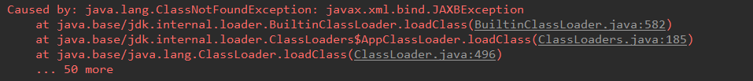

# SpringBoot基础

学习目标：

能够理解Spring的优缺点

能够理解SpringBoot的特点

能够理解SpringBoot的核心功能

能够搭建SpringBoot的环境

能够完成application.properties配置文件的配置

能够完成application.yml配置文件的配置

能够使用SpringBoot集成Mybatis

能够使用SpringBoot集成Junit

能够使用SpringBoot集成SpringData JPA

## 一、SpringBoot简介

### 1.2 SpringBoot的概述

#### 1.2.1 什么是Spring Boot

Spring Boot 是所有基于 Spring Framework 5.0 开发的项目。Spring Boot 的设计是为了让你尽可能快的跑起来 Spring 应用程序，并且尽可能减少你的配置文件。

设计目的： 用来简化 Spring 应用的初始搭建以及开发过程。

从最根本上来讲，Spring Boot 就是一些库的集合，它能够被任意项目所使用。它使用 “习惯优于配置” （项目中存在大量的配置，此外还内置一个习惯性的配置）的理念让你的项目快速运行起来。spring boot 其实不是什么新的框架，它默认配置了很多框架的使用方式，就像 maven 整合了所有的 jar 包，spring boot 整合了所有的框架，总结一下及几点：

（1）为所有 Spring 开发提供一个更快更广泛的入门体验。

（2）零配置。无冗余代码生成和XML 强制配置，遵循“约定大于配置” 。

（3）集成了大量常用的第三方库的配置， Spring Boot 应用为这些第三方库提供了几乎可以零配置的开箱即用的能力。

（4）提供一系列大型项目常用的非功能性特征，如嵌入服务器等。

使用 Spring Boot有什么好处

其实就是简单、快速、方便！平时如果我们需要搭建一个 Spring Web 项目的时候需要怎么做呢？

1）配置 web.xml，加载 Spring 和 Spring mvc

2）配置数据库连接、配置 Spring 事务

3）配置加载配置文件的读取，开启注解

4）配置日志文件

…

配置完成之后部署 Tomcat 调试

…

现在非常流行微服务，如果我这个项目仅仅只是需要发送一个邮件，如果我的项目仅仅是生产一个积分；我都需要这样折腾一遍!

但是如果使用 Spring Boot 呢？

很简单，我仅仅只需要非常少的几个配置就可以迅速方便的搭建起来一套 Web 项目或者是构建一个微服务！

使用 Spring Boot 到底有多爽，用下面这幅图来表达


#### 1.2.2 SpringBoot的特点

为基于Spring的开发提供更快的入门体验

开箱即用，没有代码生成，也无需XML配置。同时也可以修改默认值来满足特定的需求

提供了一些大型项目中常见的非功能性特性，如嵌入式服务器、外部配置等

SpringBoot不是对Spring功能上的增强，而是提供了一种快速使用Spring的方式

#### 1.2.3 SpringBoot的核心功能

起步依赖

起步依赖本质上是一个Maven项目对象模型（Project Object Model，POM），定义了对其他库的传递依赖，这些东西加在一起即支持某项功能。

简单的说，起步依赖就是将具备某种功能的坐标打包到一起，并提供一些默认的功能。

自动配置

Spring Boot的自动配置是一个运行时（更准确地说，是应用程序启动时）的过程，考虑了众多因素，才决定Spring配置应该用哪个，不该用哪个。该过程是Spring自动完成的。

## 二、SpringBoot快速入门

### 2.1 代码实现

#### 2.1.1 创建Maven工程

使用idea工具创建一个maven工程，该工程为普通的java工程即可


创建项目 springboot_demo01


#### 2.1.2 添加SpringBoot的起步依赖

添加pom文件

```xml
<?xml version="1.0" encoding="UTF-8"?>
<project xmlns="http://maven.apache.org/POM/4.0.0"
         xmlns:xsi="http://www.w3.org/2001/XMLSchema-instance"
         xsi:schemaLocation="http://maven.apache.org/POM/4.0.0 http://maven.apache.org/xsd/maven-4.0.0.xsd">
    <modelVersion>4.0.0</modelVersion>

    <groupId>com.maweiqi</groupId>
    <artifactId>springboot_demo01</artifactId>
    <version>1.0-SNAPSHOT</version>

    <!--父工程-->
    <parent>
        <groupId>org.springframework.boot</groupId>
        <artifactId>spring-boot-starter-parent</artifactId>
        <version>2.1.6.RELEASE</version>
    </parent>

    <dependencies>
        <!--web起步包
         注意：虽然是web工程，但不需要打war包，直接打jar就行
        -->
        <dependency>
            <groupId>org.springframework.boot</groupId>
            <artifactId>spring-boot-starter-web</artifactId>
        </dependency>
    </dependencies>
</project>
```


#### 2.1.3 编写SpringBoot引导类

要通过SpringBoot提供的引导类起步SpringBoot才可以进行访问

```java
package com.maweiqi;

import org.springframework.boot.SpringApplication;
import org.springframework.boot.autoconfigure.SpringBootApplication;

/**
 * MySpringBootApplication
 *
 * @Author: 马伟奇
 * @Description:
 */
// 声明该类是一个SpringBoot引导类
@SpringBootApplication
public class MySpringBootApplication {
    // main是java程序的入口
    public static void main(String[] args) {
        // run方法 表示运行SpringBoot的引导类 run参数就是SpringBoot引导类的字节码对象
        SpringApplication.run(MySpringBootApplication.class,args);
    }
}
```

#### 2.1.4 编写Controller

在引导类MySpringBootApplication同级包或者子级包中创建QuickStartController

```java
package com.maweiqi.controller;

import org.springframework.web.bind.annotation.RequestMapping;
import org.springframework.web.bind.annotation.RestController;

/**
 * QuickStartController
 *
 * @Author: 马伟奇
 * @Description:
 */
@RestController
@RequestMapping
public class QuickStartController {

    @RequestMapping("/quick")
    public String quick(){
        return "springboot 访问成功!";
    }
}
```

#### 2.1.5 测试

执行SpringBoot起步类的主方法，控制台打印日志如下：


通过日志发现，Tomcat started on port(s): 8080 (http) with context path ’’

tomcat已经起步，端口监听8080，web应用的虚拟工程名称为空（默认“/”）

打开浏览器访问url地址为：http://localhost:8080/quick


可以发现我们省去了springmvc.xml的配置。

### 2.2 快速入门解析

#### 2.2.2 SpringBoot代码解析

@SpringBootApplication：标注SpringBoot的启动类，该注解具备多种功能（后面详细剖析）

SpringApplication.run(MySpringBootApplication.class) 代表运行SpringBoot的启动类，参数为SpringBoot启动类的字节码对象

#### 2.2.3 SpringBoot工程热部署

我们在开发中反复修改类、页面等资源，每次修改后都是需要重新启动才生效，这样每次启动都很麻烦，浪费了大量的时间，我们可以在修改代码后不重启就能生效，在 pom.xml 中添加如下配置就可以实现这样的功能，我们称之为热部署。


```xml

<!--热部署配置-->
<dependency>
    <groupId>org.springframework.boot</groupId>
    <artifactId>spring-boot-devtools</artifactId>
</dependency>

<build>
    <plugins>
        <plugin>
            <groupId>org.springframework.boot</groupId>
            <artifactId>spring-boot-maven-plugin</artifactId>
        </plugin>
    </plugins>
</build>
```

开启 Intellij IEDA 自动编译，需要对IDEA进行自动编译的设置，如下：


正常情况下就可以进行热部署， 如果还是不行，在加入如下操作，如果已经可以热部署，就不需要看后面的操作

然后 Shift+Ctrl+Alt+/，选择Registry


#### 2.2.4 使用idea快速创建SpringBoot项目


通过idea快速创建的SpringBoot项目的pom.xml中已经导入了我们选择的web的起步依赖的坐标

```xml
<?xml version="1.0" encoding="UTF-8"?>
<project xmlns="http://maven.apache.org/POM/4.0.0" xmlns:xsi="http://www.w3.org/2001/XMLSchema-instance"
         xsi:schemaLocation="http://maven.apache.org/POM/4.0.0 https://maven.apache.org/xsd/maven-4.0.0.xsd">
    <modelVersion>4.0.0</modelVersion>
    <parent>
        <groupId>org.springframework.boot</groupId>
        <artifactId>spring-boot-starter-parent</artifactId>
        <version>2.2.4.RELEASE</version>
        <relativePath/> <!-- lookup parent from repository -->
    </parent>
    <groupId>com.atguigu</groupId>
    <artifactId>springboot_demo02</artifactId>
    <version>0.0.1-SNAPSHOT</version>
    <name>springboot_demo02</name>
    <description>Demo project for Spring Boot</description>

    <properties>
        <java.version>1.8</java.version>
    </properties>

    <dependencies>
        <dependency>
            <groupId>org.springframework.boot</groupId>
            <artifactId>spring-boot-starter-web</artifactId>
        </dependency>

        <dependency>
            <groupId>org.springframework.boot</groupId>
            <artifactId>spring-boot-starter-test</artifactId>
            <scope>test</scope>
            <exclusions>
                <exclusion>
                    <groupId>org.junit.vintage</groupId>
                    <artifactId>junit-vintage-engine</artifactId>
                </exclusion>
            </exclusions>
        </dependency>
    </dependencies>

    <build>
        <plugins>
            <plugin>
                <groupId>org.springframework.boot</groupId>
                <artifactId>spring-boot-maven-plugin</artifactId>
            </plugin>
        </plugins>
    </build>

</project>
```

可以使用快速入门的方式创建Controller进行访问，此处不再赘述

## 三、SpringBoot原理分析

### 3.1 起步依赖原理分析

#### 3.1.1 分析spring-boot-starter-parent

按住Ctrl点击pom.xml中的spring-boot-starter-parent，跳转到了spring-boot-starter-parent的pom.xml，xml配置如下（只摘抄了部分重点配置）：


按住Ctrl点击pom.xml中的spring-boot-starter-dependencies，跳转到了spring-boot-starter-dependencies的pom.xml，xml配置如下（只摘抄了部分重点配置）：

```xml

<properties>
  	<activemq.version>5.15.3</activemq.version>
  	<antlr2.version>2.7.7</antlr2.version>
  	<appengine-sdk.version>1.9.63</appengine-sdk.version>
  	<artemis.version>2.4.0</artemis.version>
  	<aspectj.version>1.8.13</aspectj.version>
  	<assertj.version>3.9.1</assertj.version>
  	<atomikos.version>4.0.6</atomikos.version>
  	<bitronix.version>2.1.4</bitronix.version>
  	<build-helper-maven-plugin.version>3.0.0</build-helper-maven-plugin.version>
  	<byte-buddy.version>1.7.11</byte-buddy.version>
  	... ... ...
</properties>
<dependencyManagement>
  	<dependencies>
      	<dependency>
        	<groupId>org.springframework.boot</groupId>
        	<artifactId>spring-boot</artifactId>
        	<version>2.0.1.RELEASE</version>
      	</dependency>
      	<dependency>
        	<groupId>org.springframework.boot</groupId>
        	<artifactId>spring-boot-test</artifactId>
        	<version>2.0.1.RELEASE</version>
      	</dependency>
      	... ... ...
	</dependencies>
</dependencyManagement>
<build>
  	<pluginManagement>
    	<plugins>
      		<plugin>
        		<groupId>org.jetbrains.kotlin</groupId>
        		<artifactId>kotlin-maven-plugin</artifactId>
        		<version>${kotlin.version}</version>
      		</plugin>
      		<plugin>
        		<groupId>org.jooq</groupId>
        		<artifactId>jooq-codegen-maven</artifactId>
        		<version>${jooq.version}</version>
      		</plugin>
      		<plugin>
        		<groupId>org.springframework.boot</groupId>
        		<artifactId>spring-boot-maven-plugin</artifactId>
        		<version>2.0.1.RELEASE</version>
      		</plugin>
          	... ... ...
    	</plugins>
  	</pluginManagement>
</build>
```

总结：从上面的spring-boot-starter-dependencies的pom.xml中我们可以发现，一部分坐标的版本、依赖管理、插件管理已经定义好，所以我们的SpringBoot工程继承spring-boot-starter-parent后已经具备版本锁定等配置了（不会出现版本冲突的问题）。所以起步依赖的作用就是进行依赖的传递。

#### 3.1.2 分析spring-boot-starter-web

不是所有的jar都传递，需要指定，用到哪个jar包，导入哪个jar包。


按住Ctrl点击pom.xml中的spring-boot-starter-web，跳转到了spring-boot-starter-web的pom.xml，xml配置如下（只摘抄了部分重点配置）：

```xml
<?xml version="1.0" encoding="UTF-8"?>
<project xsi:schemaLocation="http://maven.apache.org/POM/4.0.0 http://maven.apache.org/xsd/maven-4.0.0.xsd" xmlns="http://maven.apache.org/POM/4.0.0"
    xmlns:xsi="http://www.w3.org/2001/XMLSchema-instance">
  	<modelVersion>4.0.0</modelVersion>
  	<parent>
    	<groupId>org.springframework.boot</groupId>
    	<artifactId>spring-boot-starters</artifactId>
    	<version>2.0.1.RELEASE</version>
  	</parent>
  	<groupId>org.springframework.boot</groupId>
  	<artifactId>spring-boot-starter-web</artifactId>
  	<version>2.0.1.RELEASE</version>
  	<name>Spring Boot Web Starter</name>
  
  	<dependencies>
    	<dependency>
      		<groupId>org.springframework.boot</groupId>
      		<artifactId>spring-boot-starter</artifactId>
      		<version>2.0.1.RELEASE</version>
      		<scope>compile</scope>
    	</dependency>
    	<dependency>
      		<groupId>org.springframework.boot</groupId>
      		<artifactId>spring-boot-starter-json</artifactId>
      		<version>2.0.1.RELEASE</version>
      		<scope>compile</scope>
    	</dependency>
    	<dependency>
      		<groupId>org.springframework.boot</groupId>
      		<artifactId>spring-boot-starter-tomcat</artifactId>
      		<version>2.0.1.RELEASE</version>
      		<scope>compile</scope>
    	</dependency>
    	<dependency>
      		<groupId>org.hibernate.validator</groupId>
      		<artifactId>hibernate-validator</artifactId>
      		<version>6.0.9.Final</version>
      		<scope>compile</scope>
    	</dependency>
    	<dependency>
      		<groupId>org.springframework</groupId>
      		<artifactId>spring-web</artifactId>
      		<version>5.0.5.RELEASE</version>
      		<scope>compile</scope>
    	</dependency>
    	<dependency>
      		<groupId>org.springframework</groupId>
      		<artifactId>spring-webmvc</artifactId>
      		<version>5.0.5.RELEASE</version>
      		<scope>compile</scope>
    	</dependency>
  	</dependencies>
</project>
```

总结：从上面的spring-boot-starter-web的pom.xml中我们可以发现，spring-boot-starter-web就是将web开发要使用的spring-web、spring-webmvc等坐标进行了“打包”，这样我们的工程只要引入spring-boot-starter-web起步依赖的坐标就可以进行web开发了，同样体现了依赖传递的作用，同时加载tomcat，只要启动main方法，就相当于起到tomcat进行开发；同时加载json，支持springmvc的数据请求和响应。

### 3.2 自动配置原理解析

```java
package com.atguigu;

import org.springframework.boot.SpringApplication;
import org.springframework.boot.autoconfigure.SpringBootApplication;
import org.springframework.context.ApplicationContext;
import org.springframework.context.ConfigurableApplicationContext;

@SpringBootApplication
public class SpringbootDemo02Application {

    public static void main(String[] args) {
        ApplicationContext act = SpringApplication.run(SpringbootDemo02Application.class, args);
        for (String name : act.getBeanDefinitionNames()) {
            System.out.println(name);
        }
    }

}
```

运行默认自动配置加载的对象


按住Ctrl点击查看启动类MySpringBootApplication上的注解@SpringBootApplication

```java
@SpringBootApplication
public class MySpringBootApplication {
    public static void main(String[] args) {
        SpringApplication.run(MySpringBootApplication.class);
    }
}
```

注解@SpringBootApplication的源码

@SpringBootApplication封装spring注解的复合注解，包含@ComponentScan，和@SpringBootConfiguration，@EnableAutoConfiguration

```java
@Target(ElementType.TYPE)
@Retention(RetentionPolicy.RUNTIME)
@Documented
@Inherited
@SpringBootConfiguration
@EnableAutoConfiguration
@ComponentScan(excludeFilters = {
		@Filter(type = FilterType.CUSTOM, classes = TypeExcludeFilter.class),
		@Filter(type = FilterType.CUSTOM, classes = AutoConfigurationExcludeFilter.class) })
public @interface SpringBootApplication {

	/**
	 * Exclude specific auto-configuration classes such that they will never be applied.
	 * @return the classes to exclude
	 */
	@AliasFor(annotation = EnableAutoConfiguration.class)
	Class<?>[] exclude() default {};

//......

}
```

其中，

点进 @SpringBootApplication 注解后我们重点关注最后三个注解

@ComponentScan（包扫描）

component是组件，scan是扫描，所以这个注解的含义就是用来扫描组件的，

componentScan 扫描当前包及其子包下被 @Component，@Controller，@Service，@Repository注解标记的类并纳入到spring容器中进行管理，所以这个注解会自动注入所有在主程序所在包下的组件。默认把当前启动类所在的包作为扫描包的起点，例如咱们的项目，扫描 com.maweiqi 包

以前在ssm项目中我们需要去配置我们的包扫描

<context:component-scan base-package="com.xxx"></context:component-scan>

@SpringBootConfiguration : 表示当前类具有配置类的作用

按住Ctrl点击查看注解 @EnableAutoConfiguration

自动配置：根据当前引入的依赖包，猜测需要创建的工程类型，以及工程中有可能创建的对象，根据猜测自动创建工程所需的相关实例bean

程序启动，会自动加载扫描所有 classpath:/META-INF/spring.factories文件 ，并且创建对应实例

```java
@Target(ElementType.TYPE)
@Retention(RetentionPolicy.RUNTIME)
@Documented
@Inherited
@AutoConfigurationPackage
@Import(AutoConfigurationImportSelector.class)
public @interface EnableAutoConfiguration {
	//... ... ...
}
```

其中，@Import(AutoConfigurationImportSelector.class) 导入了 AutoConfigurationImportSelector 类

按住Ctrl点击查看 AutoConfigurationImportSelector 源码 , 加载元数据

```java
public String[] selectImports(AnnotationMetadata annotationMetadata) {
    ..................
    AutoConfigurationEntry autoConfigurationEntry = getAutoConfigurationEntry(autoConfigurationMetadata,
            annotationMetadata);
    ..................
    return StringUtils.toStringArray(autoConfigurationEntry.getConfigurations());
}

protected AutoConfigurationEntry getAutoConfigurationEntry(AutoConfigurationMetadata autoConfigurationMetadata,
        AnnotationMetadata annotationMetadata) {
    
    ....................
    List<String> configurations = getCandidateConfigurations(annotationMetadata, attributes);
    ....................
}

protected List<String> getCandidateConfigurations(AnnotationMetadata metadata, AnnotationAttributes attributes) {
// 在META-INF/spring.factories中找不到自动配置类。需要看看文件是否正确
"No auto configuration classes found in META-INF/spring.factories. If you "
            + "are using a custom packaging, make sure that file is correct.");
    return configurations;
}
```

其中，SpringFactoriesLoader.loadFactoryNames 方法的作用就是从META-INF/spring.factories文件中读取指定类对应的类名称列表


spring.factories 文件中有关自动配置的配置信息如下：摘抄重点，springboot 启动之后，会自动加载 dispatcherServlet

... ... ...

org.springframework.boot.autoconfigure. EnableAutoConfiguration=\
org.springframework.boot.autoconfigure.web.servlet. DispatcherServletAutoConfiguration, \
... ... ...

上面配置文件存在大量的以 Configuration 为结尾的类名称，这些类就是存有自动配置信息的类，而SpringApplication 在获取这些类名后再加载

我们以 DispatcherServletAutoConfiguration 为例来分析：

```java
@AutoConfigureOrder(Ordered.HIGHEST_PRECEDENCE)
@Configuration
@ConditionalOnWebApplication(type = Type.SERVLET)
@ConditionalOnClass(DispatcherServlet.class)
@AutoConfigureAfter(ServletWebServerFactoryAutoConfiguration.class)
public class DispatcherServletAutoConfiguration {

	/*
	 * The bean name for a DispatcherServlet that will be mapped to the root URL "/"
	 */
	public static final String DEFAULT_DISPATCHER_SERVLET_BEAN_NAME = "dispatcherServlet";
```

### 3.3 举例自动配置

新建包 com.atguigu.pojo , 创建类 User

```java
package com.atguigu.domain;

/**
 * User
 *
 * @Author: 马伟奇
 * @CreateTime: 2020-03-10
 * @Description:
 */
public class User {
}
package com.atguigu;

import org.springframework.boot.SpringApplication;
import org.springframework.boot.autoconfigure.SpringBootApplication;
import org.springframework.context.ApplicationContext;
import org.springframework.context.ConfigurableApplicationContext;

@SpringBootApplication
public class SpringbootDemo02Application {

    public static void main(String[] args) {
        ApplicationContext act = SpringApplication.run(SpringbootDemo02Application.class, args);
        for (String name : act.getBeanDefinitionNames()) {
            System.out.println(name);
        }
    }

}
```

在 resources文件夹下面 新建 /META-INF/spring.factories 文件

org.springframework.boot.autoconfigure. EnableAutoConfiguration=com.atguigu.pojo. User

运行程序


## 四、SpringBoot的配置文件

### 4.1 SpringBoot配置文件类型

#### 4.1.1 SpringBoot配置文件类型和作用

SpringBoot是基于约定的，所以很多配置都有默认值，但如果想使用自己的配置替换默认配置的话，就可以使用application.properties或者application.yml（application.yaml）进行配置。

SpringBoot默认会从Resources目录下加载application.properties或application.yml（application.yaml）文件

其中，application.properties文件是键值对类型的文件，之前一直在使用，所以此处不在对properties文件的格式进行阐述。除了properties文件外，SpringBoot还可以使用yml文件进行配置，下面对yml文件进行讲解。
```properties
# tomcat 端口号

server.port=18081

# 配置项目所在的根目录

server.servlet.context-path=/springboot-demo02

```


新建controller

```java
package com.atguigu.controller;

import org.springframework.web.bind.annotation.RequestMapping;
import org.springframework.web.bind.annotation.RestController;

/**
 * UserController
 *
 * @Author: 马伟奇
 * @CreateTime: 2020-03-11
 * @Description:
 */
@RestController
public class UserController {

    @RequestMapping("/save")
    public String save(){
        return "save";
    }
}
```

运行程序


同级目录下打开：spring-configuration-metadata.json


搜素：server.port


为什么可以在resources下创建application.properties文件呢？我们查看springboot的启动依赖：


点击spring-boot-starter-parent


发现除了可以使用 application.propertes 文件，也可以使用 application.yml 或者 application.yaml 文件。

#### 4.1.2 application.yml配置文件
##### 4.1.2.1 yml配置文件简介
YML文件格式是YAML (YAML Aint Markup Language)编写的文件格式，YAML是一种直观的能够被电脑识别的的数据数据序列化格式，并且容易被人类阅读，容易和脚本语言交互的，可以被支持YAML库的不同的编程语言程序导入，比如： C/C++, Ruby, Python, Java, Perl, C#, PHP等。YML文件是以数据为核心的，比传统的xml方式更加简洁。

YML文件的扩展名可以使用.yml或者.yaml。

##### 4.1.2.2 yml配置文件的语法

###### 4.1.2.2.1 配置普通数据

示例代码：

```yaml

# 属性的配置
# 语法： key: value
name: maweiqi 
```

注意：value之前有一个空格

在resource文件夹下面，新建application.yml文件

```yaml

server:
  port: 18082
```

###### 4.1.2.2.2 配置对象数据
语法：

```yaml

key: 
     key1: value1
     key2: value2
```

或者：

```yaml
key: {key1: value1,key2: value2}
```

在resource文件夹下面新建 application.yml 文件

注意：key1前面的空格个数不限定，在yml语法中，相同缩进代表同一个级别，一般按一下tab键

```yaml
server:
  port: 18082
user:
  username: zhangsan
  password: 123
```

user类，通过注解 @ConfigurationProperties (prefix=“配置文件中的key的前缀”)可以将配置文件中的配置自动与实体进行映射

```java
 package com.atguigu.pojo;

import org.springframework.boot.context.properties.ConfigurationProperties;
import org.springframework.stereotype.Component;

    /**
    
 * User
       *

 * @Author: 马伟奇
 
  * @CreateTime: 2020-03-10
 
  * @Description:
    */
    @Component
    @ConfigurationProperties(value = "user")
    public class User implements Serializable{
 
    private String username;
    private String password;
 
    //生成 set get  tostring
    }
```


报错提示，请在pom文件添加配置信息


在pom文件添加如下配置

# 读取配置文件注解

```xml
<dependency>
    <groupId>org.springframework.boot</groupId>
    <artifactId>spring-boot-configuration-processor</artifactId>
    <optional>true</optional>
</dependency>
```

修改 SpringbootDemo02Application

```java
package com.atguigu;

import com.atguigu.pojo.User;
import org.springframework.boot.SpringApplication;
import org.springframework.boot.autoconfigure.SpringBootApplication;
import org.springframework.context.ApplicationContext;
import org.springframework.context.ConfigurableApplicationContext;

@SpringBootApplication
public class SpringbootDemo02Application {

    public static void main(String[] args) {
        ApplicationContext act = SpringApplication.run(SpringbootDemo02Application.class, args);
        User user = (User) act.getBean("user");
        System.out.println(user);
    }

}
```

运行程序


###### 4.1.2.2.2 配置Map数据

# 语法： 

```yaml
map: 
    key: value1
    key: value2
```

示例代码：

# map结构

```yaml
map:
  key1: value1
  key2: value2
```

###### 4.1.2.2.3 配置数组（List、Set）数据

# 语法： 

 

```yaml
  key: 
  
   - value1
   - value2
     或者：
      key: [value1,value2]
     示例代码：
  ```

  

# 配置数据集合

```yaml
    city:
        - beijing
        - tianjin
        - shanghai
        - chongqing
```

    

# 或者行内注入

city: [beijing, tianjin, shanghai, chongqing]
注意：value1与之间的 - 之间存在一个空格

在 pojo包里面，新建 Mobile 类

```java
package com.atguigu.pojo;

/**
 * Mobile
 *
 * @Author: 马伟奇
 * @CreateTime: 2020-03-11
 * @Description:
 */
public class Mobile {
    private String num;
    private String brand;

    @Override
    public String toString() {
        return "Mobile{" +
                "num='" + num + '\'' +
                ", brand='" + brand + '\'' +
                '}';
    }

    public String getNum() {
        return num;
    }

    public void setNum(String num) {
        this.num = num;
    }

    public String getBrand() {
        return brand;
    }

    public void setBrand(String brand) {
        this.brand = brand;
    }
}
```

修改 user 类

```java
package com.atguigu.pojo;

import org.springframework.boot.context.properties.ConfigurationProperties;
import org.springframework.stereotype.Component;

import java.util.List;

/**
 * User
 *
 * @Author: 马伟奇
 * @CreateTime: 2020-03-10
 * @Description:
 */
@Component
@ConfigurationProperties(value = "user")
public class User {

    private String username;
    private String password;

    private List<String> nicknames;

    private List<Mobile> mobiles;

    // 生成set ，get 和 tostring方法
}
```

修改 yml 配置文件，示例代码：

```yaml
server:
  port: 18082
user:
  username: zhangsan
  password: 123
  nicknames:
    - lisi
    - zhaoliu
  mobiles:
    - num: 1001
      brand: 华为
    - num: 1002
      brand: 小米
```      
注意：value1与之间的 - 之间存在一个空格

运行程序


### 4.2 配置文件与配置类的属性映射方式
#### 4.2.1 使用注解@Value映射
我们可以通过@Value注解将配置文件中的值映射到一个Spring管理的Bean的字段上

例如：

application.yml配置如下：

```yaml
person:
  name: zhangsan
  age: 18
```  
实体Bean代码如下：
```java
package com.atguigu.controller;

import org.springframework.beans.factory.annotation.Value;
import org.springframework.stereotype.Controller;
import org.springframework.web.bind.annotation.RequestMapping;
import org.springframework.web.bind.annotation.ResponseBody;

@Controller
public class Quick2Controller {

    @Value("${person.name}")
    private String name;
    
    @Value("${person.addr}")
    private String addr;
    
    @RequestMapping("/quick")
    @ResponseBody
    public String quick(){
        //获得配置文件的信息
    
        return "name:"+name+",addr="+addr;
    }

}
```

浏览器访问地址：http://localhost:8080/quick 结果如下：


## 五、SpringBoot与整合其他技术
### 5.1 SpringBoot整合Mybatis
新建项目 springboot_mybatis


#### 5.1.1 添加Mybatis的起步依赖

```xml
 <parent>
        <groupId>org.springframework.boot</groupId>
        <artifactId>spring-boot-starter-parent</artifactId>
        <version>2.0.1.RELEASE</version>
        <relativePath/> <!-- lookup parent from repository -->
    </parent>

    <properties>
        <project.build.sourceEncoding>UTF-8</project.build.sourceEncoding>
        <project.reporting.outputEncoding>UTF-8</project.reporting.outputEncoding>
        <java.version>1.8</java.version>
    </properties>
    
    <dependencies>
        <dependency>
            <groupId>org.springframework.boot</groupId>
            <artifactId>spring-boot-starter-web</artifactId>
        </dependency>
    
        <!--SpingBoot集成junit测试的起步依赖-->
        <dependency>
            <groupId>org.springframework.boot</groupId>
            <artifactId>spring-boot-starter-test</artifactId>
            <scope>test</scope>
        </dependency>
    
        <!--mybatis起步依赖-->
        <dependency>
            <groupId>org.mybatis.spring.boot</groupId>
            <artifactId>mybatis-spring-boot-starter</artifactId>
            <version>1.1.1</version>
        </dependency>
    
        <!-- MySQL连接驱动 -->
        <dependency>
            <groupId>mysql</groupId>
            <artifactId>mysql-connector-java</artifactId>
        </dependency>
    
    </dependencies>
    
    <build>
        <plugins>
            <plugin>
                <groupId>org.springframework.boot</groupId>
                <artifactId>spring-boot-maven-plugin</artifactId>
            </plugin>
        </plugins>
    </build>
```

#### 5.1.3 添加数据库连接信息
在 application.yml 中添加数据量的连接信息

```yaml
mybatis:
  type-aliases-package: com.atguigu.domain # 指定mybatis别名包
  mapper-locations: classpath:com/atguigu/dao/*.xml # 指定xml映射文件路径
logging:
  level:
    com.atguigu.dao: debug # 配置日志
spring:
  datasource:
    username: root
    password: root
    url: jdbc:mysql://127.0.0.1:3306/springboot?useUnicode=true&characterEncoding=utf8
    driver-class-name: com.mysql.jdbc.Driver
server:
  port: 18081
```

#### 5.1.4 创建user表
在test数据库中创建user表

```sql
-- ----------------------------
-- Table structure for `user`
-- ----------------------------
DROP TABLE IF EXISTS `user`;
CREATE TABLE `user` (
  `id` int(11) NOT NULL AUTO_INCREMENT,
  `username` varchar(50) DEFAULT NULL,
  `password` varchar(50) DEFAULT NULL,
  `name` varchar(50) DEFAULT NULL,
  PRIMARY KEY (`id`)
) ENGINE=InnoDB AUTO_INCREMENT=10 DEFAULT CHARSET=utf8;

-- ----------------------------
-- Records of user
-- ----------------------------
INSERT INTO `user` VALUES ('1', 'zhangsan', '123', '张三');
INSERT INTO `user` VALUES ('2', 'lisi', '123', '李四');
```

#### 5.1.5 创建实体Bean

```java
package com.atguigu.domain;

public class User implements Serializable {
    // 主键
    private Long id;
    // 用户名
    private String username;
    // 密码
    private String password;
    // 姓名
    private String name;

    //此处省略getter和setter方法 .. ..

}
```

#### 5.1.6 编写Mapper

```java
package com.atguigu.dao;

import com.atguigu.domain.User;
import org.apache.ibatis.annotations.Mapper;

import java.util.List;

/**
 * UserDao
 *
 * @Author: 马伟奇
 * @CreateTime: 2020-03-11
 * @Description:
 */
@Mapper
public interface UserDao {
    public List<User> findAll();
}
```

注意：@Mapper标记该类是一个mybatis的mapper接口，可以被spring boot自动扫描到spring上下文中

#### 5.1.7 配置Mapper映射文件
在resource文件夹下面新建 com/atguigu/dao/UserDao.xml ，路径下加入UserDao.xml配置文件"

```xml
<?xml version="1.0" encoding="utf-8" ?>
<!DOCTYPE mapper PUBLIC "-//mybatis.org//DTD Mapper 3.0//EN"
        "http://mybatis.org/dtd/mybatis-3-mapper.dtd" >
<mapper namespace="com.atguigu.dao.UserDao">
    <select id="findAll" resultType="user">
        select * from user
    </select>
</mapper>
```

#### 5.1.8 在application.yml中添加mybatis的信息
#spring集成Mybatis环境
#pojo别名扫描包
mybatis.type-aliases-package=com.atguigu.domain
#加载Mybatis映射文件
mybatis.mapper-locations=classpath:com/atguigu/dao/*.xml
#### 5.1.9 编写测试Controller

```java
package com.atguigu.controller;

import com.atguigu.domain.User;
import com.atguigu.service.UserService;
import org.springframework.beans.factory.annotation.Autowired;
import org.springframework.web.bind.annotation.RequestMapping;
import org.springframework.web.bind.annotation.RestController;

import java.util.List;

/**
 * UserController
 *
 * @Author: 马伟奇
 * @CreateTime: 2020-03-11
 * @Description:
 */
@RestController
@RequestMapping("/user")
public class UserController {

    @Autowired
    private UserService userService;

    @RequestMapping("/findAll")
    private List<User> findAll(){
        return userService.findAll();
    }

}
```

5.1.10 新建service

```java
package com.atguigu.service;

import com.atguigu.domain.User;

import java.util.List;

/**
 * UserService
 *
 * @Author: 马伟奇
 * @CreateTime: 2020-03-11
 * @Description:
 */
public interface UserService {

    List<User> findAll();
}

package com.atguigu.service.impl;

import com.atguigu.dao.UserDao;
import com.atguigu.domain.User;
import com.atguigu.service.UserService;
import org.springframework.beans.factory.annotation.Autowired;
import org.springframework.stereotype.Service;

import java.util.List;

/**
 * UserServiceImpl
 *
 * @Author: 马伟奇
 * @CreateTime: 2020-03-11
 * @Description:
 */
@Service
public class UserServiceImpl implements UserService {

    @Autowired
    private UserDao userDao;

    @Override
    public List<User> findAll() {
        return userDao.findAll();
    }
}
```

#### 5.1.11 测试


如果运行报错：说明jar冲突


解决方案：

因为pom.xml中引入了spring-boot-starter-web ，同时pom.xml也引入了spring-core，spring-beans，这里去掉spring-core，spring-beans即可。

### 5.2 SpringBoot整合Junit

#### 5.2.1 添加Junit的起步依赖
```xml

<!--测试的起步依赖-->
<dependency>

    <groupId>org.springframework.boot</groupId>
    <artifactId>spring-boot-starter-test</artifactId>

</dependency>
```

#### 5.2.2 编写测试类

在test文件夹下面新建测试类

```java
package com.atguigu;

import com.atguigu.domain.User;
import com.atguigu.service.UserService;
import org.junit.Test;
import org.junit.runner.RunWith;
import org.springframework.beans.factory.annotation.Autowired;
import org.springframework.boot.test.context.SpringBootTest;
import org.springframework.test.context.junit4.SpringRunner;

import java.util.List;

/**
 * MapperTest
 *
 * @Author: 马伟奇
 * @CreateTime: 2020-03-11
 * @Description:
 */
@RunWith(SpringRunner.class)
@SpringBootTest
public class MapperTest {

    @Autowired
    private UserService userService;

    @Test
    public void testUser(){
        List<User> users = userService.findAll();
        for (User user : users) {
            System.out.println(user);
        }
    }

}
```

#### 5.2.3 控制台打印信息


### 5.3 SpringBoot整合Spring Data JPA

新建项目 springboot_jpa


#### 5.3.1 添加Spring Data JPA的起步依赖

```xml
    <parent>
        <groupId>org.springframework.boot</groupId>
        <artifactId>spring-boot-starter-parent</artifactId>
        <version>2.0.1.RELEASE</version>
        <relativePath/> <!-- lookup parent from repository -->
    </parent>
    
    <properties>
        <project.build.sourceEncoding>UTF-8</project.build.sourceEncoding>
        <project.reporting.outputEncoding>UTF-8</project.reporting.outputEncoding>
        <java.version>1.8</java.version>
    </properties>
    
    <dependencies>
        <dependency>
            <groupId>org.springframework.boot</groupId>
            <artifactId>spring-boot-starter-web</artifactId>
        </dependency>
    
        <dependency>
            <groupId>org.springframework.boot</groupId>
            <artifactId>spring-boot-starter-test</artifactId>
            <scope>test</scope>
        </dependency>
    
        <!-- springBoot JPA的起步依赖 -->
        <dependency>
            <groupId>org.springframework.boot</groupId>
            <artifactId>spring-boot-starter-data-jpa</artifactId>
        </dependency>
    
        <!-- MySQL连接驱动 -->
        <dependency>
            <groupId>mysql</groupId>
            <artifactId>mysql-connector-java</artifactId>
        </dependency>

​       

        <!-- 配置使用redis启动器 -->
        <dependency>
            <groupId>org.springframework.boot</groupId>
            <artifactId>spring-boot-starter-data-redis</artifactId>
        </dependency>

    </dependencies>
```

#### 5.3.2 添加数据库驱动依赖

```xml
<!-- MySQL连接驱动 -->
<dependency>
    <groupId>mysql</groupId>
    <artifactId>mysql-connector-java</artifactId>
</dependency>
```

#### 5.3.3 在application.yml中配置数据库和jpa的相关属性

```yaml
logging:
  level:
    com.atguigu.dao: debug # 配置日志
spring:
  datasource:
    username: root
    password: root
    url: jdbc:mysql://127.0.0.1:3306/springboot?useUnicode=true&characterEncoding=utf8
    driver-class-name: com.mysql.jdbc.Driver
  redis: #Redis
    port: 6379
    host: 127.0.0.1
  jpa:
    database: mysql
    show-sql: true
    generate-ddl: true
    hibernate:
      ddl-auto: update
      naming_strategy: org.hibernate.cfg.ImprovedNamingStrategy
server:
  port: 18081
```

#### 5.3.4 创建实体配置实体

```java
package com.atguigu.domain;

import javax.persistence.*;

@Entity
@Table(name = "user")
public class User{

    @Id
    @GeneratedValue(strategy = GenerationType.IDENTITY)
    @Column(name = "id")
    private Long id;
    @Column(name = "username")
    private String username;
    @Column(name = "password")
    private String password;
    @Column(name = "name")
    private String name;
     
    //此处省略setter和getter方法... ...
}
```

#### 5.3.5 编写UserRepository

```java
package com.atguigu.dao;

import com.atguigu.domain.User;
import org.springframework.data.jpa.repository.JpaRepository;

/**
 * UserDao
 *
 * @Author: 马伟奇
 * @CreateTime: 2020-03-12
 * @Description:
 */
public interface UserDao extends JpaRepository<User,Integer> {
}
```

#### 5.3.6 编写service类

```java
package com.atguigu.service;

import com.atguigu.domain.User;

import java.util.List;

/**
 * UserService
 *
 * @Author: 马伟奇
 * @CreateTime: 2020-03-12
 * @Description:
 */
public interface UserService {
    List<User> findUsers();

    User findUserById(Integer id);

    void saveUser(User user);

    void updateUser(User user);

    void deleteUserById(Integer id);
}
```

```java
package com.atguigu.service.impl;

import com.atguigu.dao.UserDao;
import com.atguigu.domain.User;
import com.atguigu.service.UserService;
import org.springframework.beans.factory.annotation.Autowired;
import org.springframework.stereotype.Service;

import java.util.List;

/**
 * UserServiceImpl
 *
 * @Author: 马伟奇
 * @CreateTime: 2020-03-12
 * @Description:
 */
@Service
public class UserServiceImpl implements UserService {

    @Autowired
    private UserDao userDao;

    /**
     * 查询所有
     * @return
     */
    @Override
    public List<User> findUsers() {
        return userDao.findAll();
    }
    /**
     * 根据id查询
     * @return
     */
    @Override
    public User findUserById(Integer id) {
        return userDao.findById(id).get();
    }
    /**
     * 保存
     * @return
     */
    @Override
    public void saveUser(User user) {
        userDao.save(user);
    }
    /**
     * 更新
     * @return
     */
    @Override
    public void updateUser(User user) {
        userDao.save(user);
    }
    /**
     * 根据id删除
     * @return
     */
    @Override
    public void deleteUserById(Integer id) {
        userDao.deleteById(id);
    }
}
```

#### 5.3.6 编写controller类

```java
package com.atguigu.controller;

import com.atguigu.domain.User;
import com.atguigu.service.UserService;
import org.springframework.beans.factory.annotation.Autowired;
import org.springframework.web.bind.annotation.RequestMapping;
import org.springframework.web.bind.annotation.RestController;

import java.util.List;

/**
 * UserController
 *
 * @Author: 马伟奇
 * @CreateTime: 2020-03-12
 * @Description:
 */
@RestController
@RequestMapping("/user")
public class UserController {

    @Autowired
    private UserService userService;

    @RequestMapping("/findAll")
    public List<User> findAll(){
        return userService.findUsers();
    }
}
```

#### 5.3.7 控制台打印信息


注意：如果是jdk9，执行报错如下：



原因：jdk缺少相应的jar

解决方案：手动导入对应的maven坐标，如下：

```xml
<!--jdk9需要导入如下坐标-->
<dependency>

    <groupId>javax.xml.bind</groupId>
    <artifactId>jaxb-api</artifactId>
    <version>2.3.0</version>

</dependency>
```

### 5.4 SpringBoot整合Redis

找到上面的 springboot_mybatis 项目，添加pom文件

#### 5.4.1 添加redis的起步依赖

```xml
<!-- 配置使用redis启动器 -->
<dependency>

    <groupId>org.springframework.boot</groupId>
    <artifactId>spring-boot-starter-data-redis</artifactId>

</dependency>
```

#### 5.4.2 配置redis的连接信息
在 application.yml 文件 添加 redis 的配置信息

```yaml
mybatis:
  type-aliases-package: com.atguigu.domain # 指定mybatis别名包
  mapper-locations: classpath:com/atguigu/dao/*.xml # 指定xml映射文件路径
logging:
  level:

    com.atguigu.dao: debug # 配置日志

spring:
  datasource:

    username: root
    password: root
    url: jdbc:mysql://127.0.0.1:3306/springboot?useUnicode=true&characterEncoding=utf8
    driver-class-name: com.mysql.jdbc.Driver

  redis: #Redis

    port: 6379
    host: 127.0.0.1

server:
  port: 18081
```

#### 5.4.3 注入RedisTemplate测试redis操作

在 service 的实现类里面实现业务逻辑

```java
package com.atguigu.service.impl; 

import com.atguigu.dao. UserDao; 
import com.atguigu.domain. User; 
import com.atguigu.service. UserService; 
import org.springframework.beans.factory.annotation. Autowired; 
import org.springframework.data.redis.core. RedisTemplate; 
import org.springframework.stereotype. Service; 

import java.util. List; 

/**
 * UserServiceImpl
 *
 * @Author: 马伟奇
 * @CreateTime: 2020-03-11
 * @Description:
 */
@Service
public class UserServiceImpl implements UserService {

    @Autowired
    private UserDao userDao;

    @Autowired
    private RedisTemplate redisTemplate;

    @Override
    public List<User> findAll() {
        // redis的key
        String key = "alluser";
        // 先查询redis中是否有数据，如果有直接返回redis的数据
        List<User> users = (List<User>) redisTemplate.boundValueOps(key).get();
        if (users!=null) {
            return users;
        }

        // 如果没有，查询数据库
        users = userDao.findAll();
        // 将数据库数据存入到redis中
        if (users != null && users.size()>0) {
            redisTemplate.boundValueOps(key).set(users);
        }
        
        return users;

    }

}
```

运行程序


### 5.5 SpringBoot整合定时任务

创建项目 springboot_task

添加pom文件

```xml
<!--父工程-->

    <parent>

        <groupId>org.springframework.boot</groupId>
        <artifactId>spring-boot-starter-parent</artifactId>
        <version>2.1.6.RELEASE</version>
        <relativePath/> <!-- lookup parent from repository -->
    </parent>

    <dependencies>
        <dependency>
            <groupId>org.springframework.boot</groupId>
            <artifactId>spring-boot-starter-web</artifactId>
        </dependency>

    

        <dependency>
            <groupId>org.springframework.boot</groupId>
            <artifactId>spring-boot-starter-test</artifactId>
            <scope>test</scope>
        </dependency>

        <!-- 添加 Scheduled 坐标 -->
        <dependency>
            <groupId>org.springframework</groupId>
            <artifactId>spring-context-support</artifactId>
            <version>5.0.5. RELEASE</version>
        </dependency>

    </dependencies>
```

创建 BootApplication

```java
package com.maweiqi; 
import org.springframework.boot. SpringApplication; 
import org.springframework.boot.autoconfigure. SpringBootApplication; 
import org.springframework.scheduling.annotation. EnableScheduling; 
/**
 * BootApplication
 *
 * @Author: 马伟奇
 * @CreateTime: 2020-04-09
 * @Description:
 */
@SpringBootApplication
@EnableScheduling
public class BootApplication {

    public static void main(String[] args) {
        SpringApplication.run(BootApplication.class, args);

    }

}
```

创建 TaskController

```java
package com.maweiqi.controller; 
import java.text. SimpleDateFormat; 
import java.util. Date; 

import org.slf4j. Logger; 
import org.slf4j. LoggerFactory; 
import org.springframework.scheduling.annotation. Scheduled; 
import org.springframework.stereotype. Component; 
import org.springframework.stereotype. Controller; 
/**
 * TaskController
 *
 * @Author: 马伟奇
 * @CreateTime: 2020-04-09
 * @Description:
 */
@Component
public class TaskController {

    /**
     *  @Scheduled:定时规则
     *       cron:,项目启动后每5秒执行一次
     *
     *       fixedDelay:距离上一次定时任务执行完毕后N毫秒在执行，
     *       执行A任务花了5秒，比如参数是3000，A任务执行完成之后，在过3秒执行
     *
     *       fixedRate:执行周期，执行频率，
     *       定时任务执行开始，在过N毫秒后执行，
     *       执行A任务花了2秒，比如参数是3000，A任务执行完成之后，在过1秒后执行，
     *       执行A任务花了15秒，比如参数是3000，A任务执行完成之后，立即执行。
     *
     * @auther
     * @return void
     */
    @Scheduled(fixedDelay = 3000)
    public void myTask() {

        SimpleDateFormat simpleDateFormat = new SimpleDateFormat("yyyy-MM-dd HH:mm:ss");
        System.out.println(simpleDateFormat.format(new Date()));

    }

}
```

运行程序 ， 每隔 3秒钟 执行一次


修改程序 ， 增加休眠时间 ， 测试


运行程序 ，每隔 6秒 执行一次


修改程序 ，换成 fixedRate 参数

```java
    @Scheduled(fixedRate = 3000)
    public void myTask() {

        SimpleDateFormat simpleDateFormat = new SimpleDateFormat("yyyy-MM-dd HH:mm:ss");
        System.out.println(simpleDateFormat.format(new Date()));

        try {
         //   Thread.sleep(3000);
        } catch (Exception e) {
            e.printStackTrace();
        }

    }
```

运行程序 ，每隔 3秒 执行一次


修改程序 , 添加休眠


运行程序 ，每隔 5 秒 执行一次


修改程序 ，换成 cron 参数

```java
 @Scheduled(cron = "0/5 * * * * *")
public void myTask() {

        SimpleDateFormat simpleDateFormat = new SimpleDateFormat("yyyy-MM-dd HH:mm:ss");
        System.out.println(simpleDateFormat.format(new Date()));

    }
```

运行程序 ， 每隔5秒打印一次


### 5.6 SpringBoot整合模板

开发传统Java WEB工程时，我们可以使用JSP页面模板语言，但是在SpringBoot中已经不推荐使用了。SpringBoot支持如下页面模板语言

- Thymeleaf
- FreeMarker
- Velocity
- Groovy
- JSP

上面并没有列举所有SpringBoot支持的页面模板技术。其中Thymeleaf是SpringBoot官方所推荐使用的

#### 5.6.1 Thymeleaf介绍

在应用开发中，你可以使用Thymeleaf来完全代替JSP

模板：将一些重复内容写好，其中某些可能发生变化的内容，采用占位符方式动态加载（JSP），类似10086群发短信 每个人收到的短信内容一模一样 ， 只是名字不一样，一样的内容称之为模板

模板引擎技术：可以基于写好的模板，动态给写好的模板加载数据。

Thymeleaf:==Thymeleaf是一个模板引擎工具，主要用于页面渲染操作(页面数据填充操作)，可以取代之前的jsp操作。==

#### 5.6.2 Springboot整合thymeleaf

使用springboot 来集成使用Thymeleaf可以大大减少单纯使用thymleaf的代码量，所以我们接下来使用springboot集成使用thymeleaf.

实现的步骤为：

创建一个sprinboot项目

添加thymeleaf的起步依赖

添加spring web的起步依赖

编写html 使用thymleaf的语法获取变量对应后台传递的值

编写controller 设置变量的值到model中

==视图:
 prefix: 前缀
  classpath:/templates/
   suffix: 后缀 
   .html==

(1) 创建工程

创建一个独立的工程 springboot-thymeleaf

pom.xml依赖

```xml
  <parent>

        <groupId>org.springframework.boot</groupId>
        <artifactId>spring-boot-starter-parent</artifactId>
        <version>2.1.6.RELEASE</version>
        <relativePath/> <!-- lookup parent from repository -->
    </parent>

    <properties>
        <project.build.sourceEncoding>UTF-8</project.build.sourceEncoding>
        <project.reporting.outputEncoding>UTF-8</project.reporting.outputEncoding>
        <java.version>1.8</java.version>
    </properties>

    <dependencies>
        <dependency>
            <groupId>org.springframework.boot</groupId>
            <artifactId>spring-boot-starter-thymeleaf</artifactId>
        </dependency>
        <dependency>
            <groupId>org.springframework.boot</groupId>
            <artifactId>spring-boot-starter-web</artifactId>
        </dependency>

    

        <dependency>
            <groupId>org.springframework.boot</groupId>
            <artifactId>spring-boot-starter-test</artifactId>
            <scope>test</scope>
        </dependency>

    

        <!--热部署插件-->
        <dependency>
            <groupId>org.springframework.boot</groupId>
            <artifactId>spring-boot-devtools</artifactId>
            <optional>true</optional>
        </dependency>

    

    </dependencies>

    

    <build>
        <plugins>
            <plugin>
                <groupId>org.springframework.boot</groupId>
                <artifactId>spring-boot-maven-plugin</artifactId>
            </plugin>
        </plugins>
    </build>
```

(2) 创建html

在 resources 中创建 templates 目录，在templates 目录创建 demo1.html , 代码如下：

```html
<! DOCTYPE html>
    <!--这句声明使用thymeleaf标签-->
    <html xmlns:th="http://www.thymeleaf.org">

    <head>

        <title>Thymeleaf的入门</title>
        <meta http-equiv="Content-Type" content="text/html; charset=UTF-8" />

    </head>

    <body>
        <!--
输出hello数据
这句使用 th:text="${变量名}" 表示 使用thymeleaf获取文本数据，类似于EL表达式。
thymeleaf：都是作用于HTML标签之上
-->
        <p th:text="${hello}"></p>
    </body>

    </html>
```

(3) 修改 application.yml 配置

创建 application.yml , 并设置 thymeleaf 的缓存设置，设置为false。

```yaml
spring:
  thymeleaf:
    cache: false
```

(4) 控制层

创建 controller 用于测试后台 设置数据到model中。

创建 com.maweiqi.controller. TestController，代码如下：

```java
package com.maweiqi.controller; 

import org.springframework.stereotype. Controller; 
import org.springframework.ui. Model; 
import org.springframework.web.bind.annotation. RequestMapping; 

/**
 * TestController
 *
 * @Author: 马伟奇
 * @CreateTime: 2020-04-09
 * @Description:
 */
@Controller
@RequestMapping("/test")
public class TestController {

    /***
     * 访问/test/hello  跳转到demo1页面
     * @param model
     * @return
     */
    @RequestMapping("/hello")
    public String hello(Model model){

        model.addAttribute("hello","hello welcome");

        return "demo1"; 

    }

}
```

(5) 测试

创建启动类com.maweiqi. ThymeleafApplication，代码如下：

```java
package com.maweiqi; 

import org.springframework.boot. SpringApplication; 
import org.springframework.boot.autoconfigure. SpringBootApplication; 

/**
 * ThymeleafApplication
 *
 * @Author: 马伟奇
 * @CreateTime: 2020-04-09
 * @Description:
 */
@SpringBootApplication
public class ThymeleafApplication {

    public static void main(String[] args) {
        SpringApplication.run(ThymeleafApplication.class, args); 

    }

}
```

启动系统，并在浏览器访问 http://localhost:8080/test/hello


（6）设置缓存不起作用，开启自动编译


#### 5.6.3 Thymeleaf基本语法

(1) th:action

定义后台控制器路径，类似 `<form>` 标签的action属性。

例如：修改刚刚 demo01.html 页面

```html
<form id="login-form" th:action="@{/test/hello}">

    <button>提交</button>

</form>
```

表示提交的请求地址为/test/hello

在 controller 里面打一个断点，点击提交请求， 直接到 controller 里面


(2) th:each

对象遍历，功能类似 jstl 中的`<c:forEach>`标签。

创建 com.maweiqi.model. User , 代码如下：

```java
package com.maweiqi.domain; 

import java.io. Serializable; 

/**
 * User
 *
 * @Author: 马伟奇
 * @CreateTime: 2020-04-09
 * @Description:
 */
public class User implements Serializable {

    private Integer id;
    private String name;
    private String address;
    //..get..set  toString

    public User(Integer id, String name, String address) {
        this.id = id; 
        this.name = name; 
        this.address = address; 

    }

    public User() {

    }
```

Controller 添加数据

```java
package com.maweiqi.controller; 

import com.maweiqi.domain. User; 
import org.springframework.stereotype. Controller; 
import org.springframework.ui. Model; 
import org.springframework.web.bind.annotation. RequestMapping; 

import java.util. ArrayList; 
import java.util. List; 

/**
 * TestController
 *
 * @Author: 马伟奇
 * @CreateTime: 2020-04-09
 * @Description:
 */
@Controller
@RequestMapping("/test")
public class TestController {

    /***
     * 访问/test/hello  跳转到demo1页面
     * @param model
     * @return
     */
    @RequestMapping("/hello")
    public String hello(Model model){

        model.addAttribute("hello","hello welcome");

        //集合数据
        List<User> users = new ArrayList<User>(); 
        users.add(new User(1, "张三", "深圳")); 
        users.add(new User(2, "李四", "北京")); 
        users.add(new User(3, "王五", "武汉")); 
        model.addAttribute("users", users); 

        return "demo1"; 

    }

}
```

修改demo01.html 页面

```html
<! DOCTYPE html>
    <!--这句声明使用thymeleaf标签-->
    <html xmlns:th="http://www.thymeleaf.org">

    <head>

        <title>Thymeleaf的入门</title>
        <meta http-equiv="Content-Type" content="text/html; charset=UTF-8" />

    </head>

    <body>

        <table>

            <tr>
                <td>下标</td>
                <td>编号</td>
                <td>姓名</td>
                <td>住址</td>
            </tr>

            <!--
     循环：第一个参数：user ：当前被循环的对象
          第二个参数：userStat：当前循环的下标
    -->
            <tr th:each="user,userStat:${users}">
                <td>
                    下标:<span th:text="${userStat.index}"></span>,
                </td>
                <td th:text="${user.id}"></td>
                <td th:text="${user.name}"></td>
                <td th:text="${user.address}"></td>
            </tr>

        </table>

    </body>

    </html>
```

测试效果 http://localhost:8080/test/hello


(3) Map输出

后台添加Map

```java
package com.maweiqi.controller; 

import com.maweiqi.domain. User; 
import org.springframework.stereotype. Controller; 
import org.springframework.ui. Model; 
import org.springframework.web.bind.annotation. RequestMapping; 

import java.util. ArrayList; 
import java.util. HashMap; 
import java.util. List; 
import java.util. Map; 

/**
 * TestController
 *
 * @Author: 马伟奇
 * @CreateTime: 2020-04-09
 * @Description:
 */
@Controller
@RequestMapping("/test")
public class TestController {

    /***
     * 访问/test/hello  跳转到demo1页面
     * @param model
     * @return
     */
    @RequestMapping("/hello")
    public String hello(Model model){

//        model.addAttribute("hello", "hello welcome"); 
//
//        //集合数据
//        List<User> users = new ArrayList<User>(); 
//        users.add(new User(1, "张三", "深圳")); 
//        users.add(new User(2, "李四", "北京")); 
//        users.add(new User(3, "王五", "武汉")); 
//        model.addAttribute("users", users); 

        //Map定义
        Map<String, Object> dataMap = new HashMap<String, Object>(); 
        dataMap.put("No", "123"); 
        dataMap.put("address", "深圳"); 
        model.addAttribute("dataMap", dataMap); 

        return "demo1"; 

    }

}
```

页面输出 修改 demo01.html

```html
<! DOCTYPE html>
    <!--这句声明使用thymeleaf标签-->
    <html xmlns:th="http://www.thymeleaf.org">

    <head>

        <title>Thymeleaf的入门</title>
        <meta http-equiv="Content-Type" content="text/html; charset=UTF-8" />

    </head>

    <body>

        <table>

            <!-- 读取map2种方式
    1：知道map的key ， 直接根据key 获取数据
    2：不知道map的key，循环方式获取key，然后获取数据

   -->

            <h5>方式1</h5>
            <div>
                获取Key=NO的值：<span th:text="${dataMap.No}"></span><br />
                获取key=address的值：<span th:text="${dataMap.address}"></span> <br />
            </div>
            <h5>方式2</h5>
            <div th:each="map:${dataMap}">
                <span th:text="${map.key}"></span>:<span th:text="${map.value}"></span>
            </div>

        </table>

    </body>

    </html>
```

测试请求： http://localhost:8080/test/hello


(4) 数组输出

后台添加数组

```java
package com.maweiqi.controller; 

import com.maweiqi.domain. User; 
import org.springframework.stereotype. Controller; 
import org.springframework.ui. Model; 
import org.springframework.web.bind.annotation. RequestMapping; 

import java.util. ArrayList; 
import java.util. HashMap; 
import java.util. List; 
import java.util. Map; 

/**
 * TestController
 *
 * @Author: 马伟奇
 * @CreateTime: 2020-04-09
 * @Description:
 */
@Controller
@RequestMapping("/test")
public class TestController {

    /***
     * 访问/test/hello  跳转到demo1页面
     * @param model
     * @return
     */
    @RequestMapping("/hello")
    public String hello(Model model){

         //存储一个数组
        String[] names = {"张三", "李四", "王五"}; 
        model.addAttribute("names", names); 

        return "demo1"; 

    }

}
```

页面输出

```html
<div th:each="nm, nmStat:${names}">

    <span th:text="${nmStat.count}"></span><span th:text="${nm}"></span>
    ==============================================

</div>
```

测试效果


(5) Date输出

后台添加日期

```java
package com.maweiqi.controller; 

import com.maweiqi.domain. User; 
import org.springframework.stereotype. Controller; 
import org.springframework.ui. Model; 
import org.springframework.web.bind.annotation. RequestMapping; 

import java.util.*; 

/**
 * TestController
 *
 * @Author: 马伟奇
 * @CreateTime: 2020-04-09
 * @Description:
 */
@Controller
@RequestMapping("/test")
public class TestController {

    /***
     * 访问/test/hello  跳转到demo1页面
     * @param model
     * @return
     */
    @RequestMapping("/hello")
    public String hello(Model model){

        //日期
        model.addAttribute("now", new Date()); 

        return "demo1"; 

    }

}
```

页面输出

```html
<! DOCTYPE html>
    <!--这句声明使用thymeleaf标签-->
    <html xmlns:th="http://www.thymeleaf.org">

    <head>

        <title>Thymeleaf的入门</title>
        <meta http-equiv="Content-Type" content="text/html; charset=UTF-8" />

    </head>

    <body>

        <div>

            <span th:text="${#dates.format(now,'yyyy-MM-dd HH:mm:ss')}"></span>

</div>

</body>
</html>
```

测试效果


(6) th:if条件

后台添加年龄

```java
package com.maweiqi.controller; 

import com.maweiqi.domain. User; 
import org.springframework.stereotype. Controller; 
import org.springframework.ui. Model; 
import org.springframework.web.bind.annotation. RequestMapping; 

import java.util.*; 

/**
 * TestController
 *
 * @Author: 马伟奇
 * @CreateTime: 2020-04-09
 * @Description:
 */
@Controller
@RequestMapping("/test")
public class TestController {

    /***
     * 访问/test/hello  跳转到demo1页面
     * @param model
     * @return
     */
    @RequestMapping("/hello")
    public String hello(Model model){

        //if条件
        model.addAttribute("age", 22); 

        return "demo1"; 

    }

}
```

页面输出

```html
<! DOCTYPE html>
    <!--这句声明使用thymeleaf标签-->
    <html xmlns:th="http://www.thymeleaf.org">

    <head>

        <title>Thymeleaf的入门</title>
        <meta http-equiv="Content-Type" content="text/html; charset=UTF-8" />

    </head>

    <body>

        <!--
if:th：unless表示条件不成立 ，输出数据
-->
        <div>

            <span th:if="${(age>=18)}">终于长大了！</span>
            <span th:unless="${age<18}">成年人</span>

        </div>

    </body>

    </html>
```

测试效果


(7) th:fragment 定义一个模块

可以定义一个独立的模块，在 templates 文件夹下面，创建一个 footer.html 代码如下：

```html
<! DOCTYPE html>
    <html xmlns:th="http://www.thymeleaf.org">

    <head>

        <meta http-equiv="Content-Type" content="text/html;charset=charset=utf-8">
        <title>fragment</title>

    </head>

    <body>
        <div th:fragment="copy">

            关于我们<br />

        </div>
    </body>
```

(8) th:include

可以直接引入th:fragment, 在 demo1.html 中引入如下代码：

```html
<! DOCTYPE html>
    <!--这句声明使用thymeleaf标签-->
    <html xmlns:th="http://www.thymeleaf.org">

    <head>

        <title>Thymeleaf的入门</title>
        <meta http-equiv="Content-Type" content="text/html; charset=UTF-8" />

    </head>

    <body>

        <div th:include="footer::copy"></div>
    </body>

    </html>
```

运行测试


