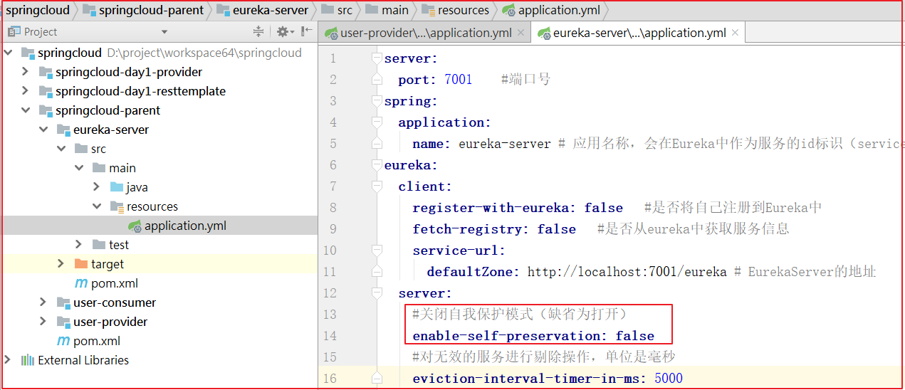

# 第1天 SpringCloud

## 1 初识SpringCloud

通常而言，微服务架构是一种架构模式或者说一种架构风格，它提倡将单一应用程序划分成一组小的服务，每个服务运行在其独立的进程中，服务之间互相协调、互相配合，为用户提供最终的价值。

服务之间采用轻量级的通信机制（通常是基于HTTP的RESTful API）。每个服务都围绕着具体业务进行构建，并且能够被独立地部署到生产环境等。

另外，应尽量避免统一的、集中式的服务管理机制，对具体的一个服务而言，应根据业务上下文，选择合适的语言、工具对其进行构建，可以有一个非常轻量级的集中式管理来协调这些服务，可以使用不同的语言来开发这些服务，也可以使用不同的数据存储。

### 1.1 目标 

了解微服务架构 

了解SpringCloud技术
 
微服务是什么？

微服务化的核心就是将传统的一站式应用，根据业务拆分成一个一个的服务，彻底去掉耦合，每一个微服务提供单个业务功能，一个服务只做一件事。

从技术角度讲就是一种小而独立的处理过程，类似与进程的概念，能够自行单独启动或销毁，可以拥有自己独立的数据库。

微服务的优缺点

微服务优点：

1. 每个服务足够内聚，足够小，代码容易理解。这样能聚焦一个业务功能或业务需求。

2. 开发简单、开发效率提高，一个服务可能就是专业的只干一件事，微服务能够被小团队单独开发，这个小团队可以是2到5人的开发人员组成。

3. 微服务是松耦合的，是有功能意义的服务，无论是在开发阶段或部署阶段都是独立的。

4. 微服务能使用不同的语言开发。

5. 易于和第三方集成，微服务运行容易且灵活的方式集成自动部署。

6. 微服务易于被一个开发人员理解、修改和维护，这样小团队能够更关注自己的工作成果，无需通过合作才能体现价值。

7. 微服务允许你利用融合最新技术。微服务只是业务逻辑的代码，不会和HTML/CSS或其他界面组件混合，即前后端分离。

8. 每个微服务都有自己的存储能力，可以有自己的数据库，也可以有统一数据库。

微服务的缺点：开发人员要处理分布式系统的复杂性。

### 1.2 讲解

####  1.2.1 技术架构演变

(1)单一应用架构

当网站流量很小时，只需要一个应用，所有功能部署在一起，减少部署节点成本的框架称之为集中式框架。此时，用于简化增删改查工作量的数据访问框架(ORM)是影响项目开发的关键。

传统架构其实就是SSH或SSM，属于单点应用，把整个业务模块都会在一个项目进行开发，分为MVC架构，会拆分成控制层、业务逻辑层、数据库访问层（持久层）。

传统架构一般适合于一个人或者小型团队开发。

缺点：耦合度太高，一旦某个模块导致服务不可用，可能会影响到其他模块。


(2)垂直应用架构

当访问量逐渐增大，单一应用增加机器带来的加速度越来越小，将应用拆成互不相干的几个应用，以提升效率。此时，用于加速前端页面开发的Web框架(MVC)是关键。


(3)分布式服务架构

分布式架构是基于传统架构演变过来的，将传统的项目以项目模块拆分成多个子项目，比如：

拆分会员项目、订单项目、支付项目、优惠券项目等，每个项目都有自己的独立数据库，独立redis等。

优点： 

1、把模块拆分，使用接口通信，降低模块之间的耦合度。

2、把项目拆分成若干个子项目，不同的团队负责不同的子项目。

3、增加功能时只需要再增加一个子项目，调用其他系统的接口就可以。
  
4、可以灵活的进行分布式部署。
  （并发量太大的话就要使用缓存（memcached、radis等））

缺点：

系统之间交互需要使用远程通信，接口开发增加工作量。


(4)面向服务(SOA)架构

SOA架构代表面向服务架构，俗称服务化。通俗的理解为面向于业务逻辑层开发，将共同的业务逻辑抽取出来形成的一个服务。提供给其他服务接口进行调用，服务于服务之间调用使用rpc远程技术。

微服务架构

微服务架构是从SOA架构中演变过来的，比SOA架构上的粒度更加精细。让专业的人做专业的事情，目的就是为了提高效率。每个服务之间互相不受影响，每个服务必须独立部署（独立数据库、独立Redis等），微服务架构更加轻量级，采用restful风格提供的API，也就是使用HTTP协议+json格式进行传输，更加轻巧，更加适用于互联网公司敏捷开发、快速迭代产品。

微服务架构如何拆分：

1、微服务把每一个职责，单一功能存放在独立服务器中。

2、每个服务运行在单独进程中，能够单独启动或销毁。

3、每个服务有自己独立的数据库存储，实际上有自己独立的缓存、数据库、消息队列等资源。


微服务架构与SOA架构的区别

（1）、微服务架构基于SOA架构演变过来，继承SOA架构的优点，在微服务架构中去除SOA架构中的ESB消息总线，采用http+json（restful）进行传输。

（2）、微服务架构对比SOA架构粒度会更加精细，让专业的人干专业的事情，目的是为了提高效率，每个服务于服务之间互不影响。在微服务架构中，每个服务必须独立部署，微服务架构更加轻巧、轻量。

（3）、SOA架构中可能数据库存储会发生共享，微服务强调每个服务都有独立数据库，保证每个服务于服务之间互不影响。

（4）、项目体现特征，微服务架构比SOA架构更加适合于互联网公司的敏捷开发、快速迭代版本。

#### 1.2.2 SpringCloud简介 

SpringCloud介绍

Spring Cloud 是一系列框架的有序集合，它利用 Spring Boot 的开发便利性巧妙地简化了分布式系统基础设施的开发，如服务发现注册、配置中心、消息总线、负载均衡、断路器、数据监控等，都可以用 Spring Boot
的开发风格做到一键启动和部署。

Spring 并没有重复制造轮子，它只是将目前各家公司开发的比较成熟、经得起实际考验的服务框架组合起来，通过 Spring Boot
风格进行再封装、屏蔽掉了复杂的配置和实现原理，最终给开发者留出了一套简单易懂、易部署和易维护的分布式系统开发工具包。

springcloud包含众多的子项目：

服务发现——Netflix Eureka

客服端负载均衡——Netflix Ribbon

断路器——Netflix Hystrix

服务网关——Netflix Zuul

分布式配置——Spring Cloud Config

#### 1.2.3 微服务 Spring Boot Spring Cloud 三者之间的关系 

微服务是一种架构的理念，提出了微服务的设计原则，从理论为具体的技术落地提供了指导思想。

Spring Boot 是一套快速配置脚手架，可以基于 Spring Boot 快速开发单个微服务。

Spring Cloud 是一个基于 Spring Boot 实现的服务治理工具包; 

Spring Boot 专注于快速、方便集成的单个微服务个体; 

Spring Cloud 关注全局的服务治理框架。

### 1.3 小结 

微服务架构：就是将相关的功能独立出来，单独创建一个项目，并且连数据库也独立出来，单独创建对应的数据库。

本质：将相关独立的业务完全独立出来，对应的工程和数据库也完全独立出来。 

SpringCloud本身也是基于SpringBoot开发而来，SpringCloud是一系列框架的有序集合, 也是把非常流行的微服务的技术整合到一起。

## 2 服务调用方式

### 2.1 目标 理解RPC和HTTP的区别 能使用RestTemplate发送请求(发送Http请求)

### 2.2 讲解 

#### 2.2.1 RPC和HTTP区别

 什么是RPC呢？

百度百科给出的解释是这样的：

“RPC（Remote Procedure CallProtocol）——远程过程调用协议，它是一种通过网络从远程计算机程序上请求服务，而不需要了解底层网络技术的协议”。

01、所属类别不同

HTTP。其因为简单、扩展性强的特点而广受开发者的青睐。

而RPC 呢，是 Remote Procedure Call Protocol 的简写，中文描述是远程过程调用，它可以实现客户端像调用本地服务(方法)一样调用服务器的服务(方法)。

而 RPC 可以基于 TCP/UDP，也可以基于 HTTP 协议进行传输的 协议。

02、使用方式不同

从使用上来看，HTTP 接口只关注服务提供方，对于客户端怎么调用并不关心。接口只要保证有客户端调用时，返回对应的数据就行了。而RPC则要求客户端接口保持和服务端的一致。

HTTP 是服务端把方法写好，客户端并不知道具体方法。客户端只想获取资源，所以发起HTTP请求，而服务端接收到请求后根据URI经过一系列的路由才定位到方法上面去

RPC是服务端提供好方法给客户端调用，客户端需要知道服务端的具体类，具体方法，然后像调用本地方法一样直接调用它。

03、面向对象不同

从设计上来看，RPC，所谓的远程过程调用 ，是面向方法的 ，HTTP ：是面向资源的

04、序列化协议不同

通信协议，上面已经提及了，HTTP 是 基于 HTTP 协议，而 RPC 可以基于 TCP/UDP，也可以基于 HTTP 协议进行传输的。

05、从性能角度看

由于HTTP本身提供了丰富的状态功能与扩展功能，但也正由于HTTP提供的功能过多，导致在网络传输时，需要携带的信息更多，从性能角度上讲，较为低效。而RPC服务网络传输上仅传输与业务内容相关的数据，传输数据更小，性能更高。

#### 2.2.2 Spring的RestTemplate

(1)RestTemplate介绍

RestTemplate是Rest的HTTP客户端模板工具类 对基于Http的客户端进行封装 实现对象与JSON的序列化与反序列化(JSON---JavaBean)
不限定客户端类型，目前常用的3种客户端都支持：HttpClient、OKHttp、JDK原生URLConnection(默认方式)

(2)RestTemplate入门案例


我们可以使用RestTemplate实现上图中的请求，springcloud-day1-resttemplate通过发送请求，请求springcloud-day1-provider的/user/list方法。

(1)搭建springcloud-day1-provider

这里不演示详细过程了，大家直接使用IDEA搭建一个普通的SpringBoot工程即可。


坐标 pom.xml 依赖

```xml

<!--父工程-->
<parent>
    <groupId>org.springframework.boot</groupId>
    <artifactId>spring-boot-starter-parent</artifactId>
    <version>2.2.2.RELEASE</version>
    <relativePath/> <!-- lookup parent from repository -->
</parent>

<dependencies>
<!--web起步依赖-->
<dependency>
    <groupId>org.springframework.boot</groupId>
    <artifactId>spring-boot-starter-web</artifactId>
</dependency>
</dependencies>
```

创建com.atguigu.domain.User

```java

package com.atguigu.domain;

import java.io.Serializable;

public class User implements Serializable {
    private String name;
    private String address;
    private Integer age;

    public User() {
    }

    public User(String name, String address, Integer age) {
        this.name = name;
        this.address = address;
        this.age = age;
    }
    
    //..get set toString 略
    
}
```

application.yml

```yaml
server:
  port: 18081
```

创建com.atguigu.controller. UserController, 代码如下：

```java
package com.atguigu.controller;

import com.atguigu.domain.User;
import org.springframework.web.bind.annotation.RequestMapping;
import org.springframework.web.bind.annotation.RestController;

import java.util.ArrayList;
import java.util.List;

/**
 * UserController
 *
 * @Author: 马伟奇
 * @CreateTime: 2020-03-18
 * @Description:
 */
@RestController
@RequestMapping(value = "/user")
public class UserController {

    /***
     * 提供服务
     * @return
     */
    @RequestMapping(value = "/list")
    public List<User> list(){
        List<User> users = new ArrayList<User>();
        users.add(new User("王五", "深圳", 25));
        users.add(new User("李四", "北京", 23));
        users.add(new User("赵六", "上海", 26));
        return users;
    }
}
```

创建启动类，并启动工程

```java
package com.atguigu;

import org.springframework.boot.SpringApplication;
import org.springframework.boot.autoconfigure.SpringBootApplication;

/**
 * SpringcloudDay1ProviderApplication
 *
 * @Author: 马伟奇
 * @CreateTime: 2020-03-18
 * @Description:
 */
@SpringBootApplication
public class SpringcloudDay1ProviderApplication {
    public static void main(String[] args) {
        SpringApplication.run(SpringcloudDay1ProviderApplication.class, args);
    }
}
```

访问：<http://localhost:18081/user/list> 效果如下：


(2)创建springcloud-day1-resttemplate

创建的详细过程也不讲解了，直接使用IDEA创建一个SpringBoot工程即可。


pom.xml依赖

```xml

<!--父工程-->
<parent>
    <groupId>org.springframework.boot</groupId>
    <artifactId>spring-boot-starter-parent</artifactId>
    <version>2.1.6.RELEASE</version>
    <relativePath/> <!-- lookup parent from repository -->
</parent>

<dependencies>
<!--web起步依赖-->
<dependency>
    <groupId>org.springframework.boot</groupId>
    <artifactId>spring-boot-starter-web</artifactId>
</dependency>

<!--测试包-->
<dependency>
    <groupId>org.springframework.boot</groupId>
    <artifactId>spring-boot-starter-test</artifactId>
    <scope>test</scope>
</dependency>
</dependencies>
```

创建启动类，并在启动类中创建RestTemplate对象

```java
package com.atguigu;

import org.springframework.boot.SpringApplication;
import org.springframework.boot.autoconfigure.SpringBootApplication;
import org.springframework.context.annotation.Bean;
import org.springframework.web.client.RestTemplate;

/**
 * SpringcloudDay1ResttemplateApplication
 *
 * @Author: 马伟奇
 * @CreateTime: 2020-03-18
 * @Description:
 */
@SpringBootApplication
public class SpringcloudDay1ResttemplateApplication {
    public static void main(String[] args) {
        SpringApplication.run(SpringcloudDay1ResttemplateApplication.class,args);
    }
    /***
     * @Bean:创建一个对象实例，并将对象交给Spring容器管理
     * <bean class="restTemplate" class="org.springframework.web.client.RestTemplate" />
     * @return
     */
    @Bean
    public RestTemplate restTemplate(){
        return new RestTemplate();
    }
}
```

测试 ， 启动提供者，然后在消费者创建测试类进行测试

创建测试类 ，在测试类HttpDemoApplicationTests中@Autowired注入RestTemplate

通过RestTemplate的getForObject()方法，传递url地址及实体类的字节码

RestTemplate会自动发起请求，接收响应

并且帮我们对响应结果进行反序列化

代码如下：

```java
package com.atguigu;

import org.junit.Test;
import org.junit.runner.RunWith;
import org.springframework.beans.factory.annotation.Autowired;
import org.springframework.boot.test.context.SpringBootTest;
import org.springframework.test.context.junit4.SpringRunner;
import org.springframework.web.client.RestTemplate;

/**
 * SpringcloudDay1ResttemplateApplicationTests
 *
 * @Author: 马伟奇
 * @CreateTime: 
 * @Description:
 */
@RunWith(SpringRunner.class)
@SpringBootTest
public class SpringcloudDay1ResttemplateApplicationTests {
    @Autowired
    private RestTemplate restTemplate;

    @Test
    public void testRestTemplateQuery(){
        String url = "http://localhost:18081/user/list";
        String result = restTemplate.getForObject(url,String.class);
        System.out.println(result);
    }
}
```

运行测试方法，效果如下：


### 2.3 小结 RPC和HTTP的区别：

RestTemplate:

①RestTemplate是Rest的HTTP客户端模板工具类。

②对基于Http的客户端进行封装。

③实现对象与JSON的序列化与反序列化。

④不限定客户端类型

RestTemplate的使用 // 创建一个RestTemplate，将该对象实例给SpringIOC容器管理

```java
@Bean
public RestTemplate restTemplate(){
return new RestTemplate();
}

restTemplate.getForObject(url,String.class);
```

## 3 模拟微服务业务场景

 模拟开发过程中的服务间关系。抽象出来，开发中的微服务之间的关系是生产者和消费者关系。

总目标：

模拟一个最简单的服务调用场景，场景中保护微服务提供者(Producer)和微服务调用者(Consumer)，方便后面学习微服务架构

注意：实际开发中，每个微服务为一个独立的SpringBoot工程。


### 3.1 目标 创建父工程

搭建服务提供者

搭建服务消费者 服务消费者使用RestTemplate调用服务提供者

###  3.2 讲解

####  3.2.1 创建父工程

(1)新建工程

新建一个Maven父工程springcloud-parent, 创建步骤如下：


（2）引入依赖

```xml

<properties>
    <project.build.sourceEncoding>UTF-8</project.build.sourceEncoding>
    <project.reporting.outputEncoding>UTF-8</project.reporting.outputEncoding>
    <java.version>1.8</java.version>
</properties>

        <!--父工程-->
<parent>
<groupId>org.springframework.boot</groupId>
<artifactId>spring-boot-starter-parent</artifactId>
<version>2.2.2.RELEASE</version>
</parent>

        <!--SpringCloud包依赖管理-->
<dependencyManagement>
<dependencies>
    <!--spring cloud Hoxton.SR1-->
    <dependency>
        <groupId>org.springframework.cloud</groupId>
        <artifactId>spring-cloud-dependencies</artifactId>
        <version>Hoxton.SR1</version>
        <type>pom</type>
        <scope>import</scope>
    </dependency>
</dependencies>
</dependencyManagement>
```

#### 3.2.2 创建服务提供者(producer)工程 每个微服务工程都是独立的工程，连数据库都是独立的，所以我们一会要单独为该服务工程创建数据库。

工程创建步骤：

1. 准备表结构

2. 创建工程 

3. 引入依赖

4. 创建Pojo，需要配置JPA的注解 

5. 创建Dao，需要继承JpaRepository<T, ID>

6. 创建Service，并调用Dao 

7. 创建Controller，并调用Service 

8. 创建application.yml文件 

9. 创建启动类

10. 测试

(1)建表

producer工程是一个独立的微服务，一般拥有独立的controller、service、dao、数据库，我们在springcloud数据库新建表结构信息，如下：

使用springcloud数据库

```sql
USE springcloud;
-- ----------------------------
-- Table structure for tb_user
-- ----------------------------
CREATE TABLE `tb_user` (
  `id` int(11) NOT NULL AUTO_INCREMENT,
  `username` varchar(100) DEFAULT NULL COMMENT '用户名',
  `password` varchar(100) DEFAULT NULL COMMENT '密码',
  `name` varchar(100) DEFAULT NULL COMMENT '姓名',
  `age` int(11) DEFAULT NULL COMMENT '年龄',
  `sex` int(11) DEFAULT NULL COMMENT '性别，1男，2女',
  `birthday` date DEFAULT NULL COMMENT '出生日期',
  `created` date DEFAULT NULL COMMENT '创建时间',
  `updated` date DEFAULT NULL COMMENT '更新时间',
  `note` varchar(1000) DEFAULT NULL COMMENT '备注',
  PRIMARY KEY (`id`)
) ENGINE=InnoDB AUTO_INCREMENT=2 DEFAULT CHARSET=utf8 COMMENT='用户信息表';
-- ----------------------------
-- Records of tb_user
-- ----------------------------
INSERT INTO `tb_user` VALUES ('1', 'zhangsan', '123456', '张三', '13', '1', '2006-08-01', '2019-05-16', '2019-05-16', '张三');
INSERT INTO `tb_user` VALUES ('2', 'lisi', '123456', '李四', '13', '1', '2006-08-01', '2019-05-16', '2019-05-16', '李四');
```

(2)新建 user-provider 工程

选中 springcloud-parent 工程-- New Modul -- Maven --输入坐标名字，如下步骤：


引入pom.xml依赖

```xml
 <!--依赖包-->
<dependencies>
    <!--JPA包-->
    <dependency>
        <groupId>org.springframework.boot</groupId>
        <artifactId>spring-boot-starter-data-jpa</artifactId>
    </dependency>
    <!--web起步包-->
    <dependency>
        <groupId>org.springframework.boot</groupId>
        <artifactId>spring-boot-starter-web</artifactId>
    </dependency>
    <!--MySQL驱动包-->
    <dependency>
        <groupId>mysql</groupId>
        <artifactId>mysql-connector-java</artifactId>
    </dependency>
</dependencies>
```

(3)User对象创建

创建com.atguigu.domain. User，代码如下：

```java
package com.atguigu.domain;

import javax.persistence.*;
import java.util.Date;

/**
 * User
 *
 * @Author: 马伟奇
 * @CreateTime: 2020-03-18
 * @Description:
 */
@Entity
@Table(name = "tb_user")
public class User {
    @Id
    @GeneratedValue(strategy = GenerationType.IDENTITY)
    private Integer id;//主键id
    private String username;//用户名
    private String password;//密码
    private String name;//姓名
    private Integer age;//年龄
    private Integer sex;//性别 1男性，2女性
    private Date birthday; //出生日期
    private Date created; //创建时间
    private Date updated; //更新时间
    private String note;//备注
    
    //..set get toString 略
    
}
```

(4)dao 创建com.atguigu.dao.UserDao，代码如下：

```java
package com.atguigu.dao;

import com.atguigu.domain.User;
import org.springframework.data.jpa.repository.JpaRepository;

/**
 * UserDao
 *
 * @Author: 马伟奇
 * @CreateTime: 2020-03-18
 * @Description:
 */
public interface UserDao extends JpaRepository<User,Integer> {
}
```

(5)Service层

创建com.atguigu.service.UserService接口，代码如下：

```java
package com.atguigu.service;

import com.atguigu.domain.User;

/**
 * UserService
 *
 * @Author: 马伟奇
 * @CreateTime: 2020-03-18
 * @Description:
 */
public interface UserService {
    /***
     * 根据ID查询用户信息
     * @param id
     * @return
     */
    User findByUserId(Integer id);
}
```

创建com.atguigu.service.impl.UserServiceImpl代码如下：

```java
package com.atguigu.service.impl;

import com.atguigu.dao.UserDao;
import com.atguigu.domain.User;
import com.atguigu.service.UserService;
import org.springframework.beans.factory.annotation.Autowired;
import org.springframework.stereotype.Service;

/**
 * UserServiceImpl
 *
 * @Author: 马伟奇
 * @CreateTime: 2020-03-18
 * @Description:
 */
@Service
public class UserServiceImpl implements UserService {

    @Autowired
    private UserDao userDao;

    /***
     * 根据ID查询用户信息
     * @param id
     * @return
     */
    public User findByUserId(Integer id) {
        return userDao.findById(id).get();
    }
}
```

(6)控制层

创建com.atguigu.controller.UserController，代码如下：

```java
package com.atguigu.controller;

import com.atguigu.domain.User;
import com.atguigu.service.UserService;
import org.springframework.beans.factory.annotation.Autowired;
import org.springframework.web.bind.annotation.PathVariable;
import org.springframework.web.bind.annotation.RequestMapping;
import org.springframework.web.bind.annotation.RestController;

/**
 * UserController
 *
 * @Author: 马伟奇
 * @CreateTime: 2020-03-18
 * @Description:
 */
@RestController
@RequestMapping(value = "/user")
public class UserController {

    @Autowired
    private UserService userService;

    /***
     * 根据ID查询用户信息
     * @param id
     * @return
     */
    @RequestMapping(value = "/find/{id}")
    public User findById(@PathVariable(value = "id") Integer id){
        return userService.findByUserId(id);
    }
}
```

(7) application.yml 配置

```yaml
server:
  port: 18081
spring:
  datasource:
    driver-class-name: com.mysql.cj.jdbc.Driver
    username: root
    password: root
    url: jdbc:mysql://127.0.0.1:3306/springcloud?useUnicode=true&characterEncoding=UTF-8&serverTimezone=UTC
```

注意：

在添加 mysql 的主动的时候，可能会报红


解决方案：

① 选中项目—> 右键—–> Open Module Settings


② Modules —–> App ——-- Dependencies


③ 将runtime 修改为Compile即可


(8)启动类创建

创建com.atguigu.UserProviderApplication启动类，并启动

```java
package com.atguigu;

import org.springframework.boot.SpringApplication; import org.springframework.boot.autoconfigure.SpringBootApplication;

/**

* UserProviderApplication
*
* @Author: 马伟奇
* @Description:
  */ @SpringBootApplication public class UserProviderApplication {

  public static void main(String[] args) { SpringApplication.run(UserProviderApplication.class,args); } }
```

测试：http://localhost:18081/user/find/2


常见错误


包引错了


#### 3.2.3 创建服务消费者(consumer)工程 

在该工程中使用RestTemplate来调用user-provider微服务。

实现步骤：

1. 创建工程

2. 引入依赖

3. 创建Pojo

4. 创建启动类，同时创建RestTemplate对象，并交给SpringIOC容器管理

5. 创建application.yml文件，指定端口

6. 编写Controller，在Controller中通过RestTemplate调用user-provider的服务

7. 启动测试

(1)工程搭建

选中springcloud-parent工程--New Modul--Maven--输入坐标名字，如下步骤：

创建项目的名字 user-consumer


pom.xml依赖如下：

```xml

<!--依赖包-->
<dependencies>
    <!--web起步依赖-->
    <dependency>
        <groupId>org.springframework.boot</groupId>
        <artifactId>spring-boot-starter-web</artifactId>
    </dependency>
</dependencies>
```

(2)创建User对象

在src下创建com.atguigu.domain. User, 代码如下：

```java
package com.atguigu.domain;

import java.io.Serializable; import java.util.Date;

/**

* User
*
* @Author: 马伟奇
* @CreateTime: 2020-03-18
* @Description:
  */ public class User implements Serializable { private Integer id;//主键id private String username;//用户名 private String
  password;//密码 private String name;//姓名 private Integer age;//年龄 private Integer sex;//性别 1男性，2女性 private Date
  birthday; //出生日期 private Date created; //创建时间 private Date updated; //更新时间 private String note;//备注

  //..set、get、toString 略

}
```

(3)创建启动引导类

在src下创建com.atguigu. UserConsumerApplication, 代码如下：

```java
package com.atguigu;

import org.springframework.boot.SpringApplication; import org.springframework.boot.autoconfigure.SpringBootApplication;
import org.springframework.context.annotation.Bean; import org.springframework.web.client.RestTemplate;

/**

* UserConsumerApplication
*
* @Author: 马伟奇
* @CreateTime: 2020-03-18
* @Description:
  */ @SpringBootApplication public class UserConsumerApplication { public static void main(String[] args) {
  SpringApplication.run(UserConsumerApplication.class,args); }

  /***
    * 将RestTemplate的实例放到Spring容器中
    * @return
      */ @Bean public RestTemplate restTemplate(){ return new RestTemplate(); } } 创建 application.yml ,并配置端口为18082
```

```yaml
server:
  port: 18082
```

(4)创建控制层，在控制层中调用user-provider

在src下创建com.atguigu.controller. UserController，代码如下：

```java
package com.atguigu.controller;

import com.atguigu.domain.User; import org.springframework.beans.factory.annotation.Autowired; import
org.springframework.web.bind.annotation.GetMapping; import org.springframework.web.bind.annotation.PathVariable; import
org.springframework.web.bind.annotation.RequestMapping; import org.springframework.web.bind.annotation.RestController;
import org.springframework.web.client.RestTemplate;

/**

* UserController
*
* @Author: 马伟奇
* @CreateTime: 2020-03-18
* @Description:
  */ @RestController @RequestMapping(value = "/consumer")
  public class UserController {

  @Autowired private RestTemplate restTemplate;

  /****
    * 在user-consumer服务中通过RestTemplate调用user-provider服务
    * @param id
    * @return
      */ @GetMapping(value = "/{id}")
      public User queryById(@PathVariable(value = "id")Integer id){ String url = "http://localhost:18081/user/find/"+id;
      return restTemplate.getForObject(url,User.class); }

}
```

启动测试：

请求地址：http://localhost:18082/consumer/1


#### 3.2.4 思考问题

user-provider：对外提供用户查询接口

user-consumer：通过RestTemplate访问接口查询用户数据

存在的问题：

在服务消费者中，我们把url地址硬编码到代码中，不方便后期维护 在服务消费者中，不清楚服务提供者的状态(user-provider有可能没有宕机了)
服务提供者只有一个服务，即便服务提供者形成集群，服务消费者还需要自己实现负载均衡 服务提供者的如果出现故障，是否能够及时发现： 其实上面说的问题，概括一下就是微服务架构必然要面临的问题

服务管理：自动注册与发现、状态监管 服务负载均衡 熔断器 

### 3.3 小结

 服务消费者使用RestTemplate调用服务提供者, 使用RestTemplate调用的时候，需要先创建并注入到SpringIOC容器中

在服务消费者中，我们把url地址硬编码到代码中，不方便后期维护 在服务消费者中，不清楚服务提供者的状态(user-provider有可能没有宕机了)
服务提供者只有一个服务，即便服务提供者形成集群，服务消费者还需要自己实现负载均衡 服务提供者的如果出现故障，不能及时发现。

##  4 注册中心 Spring Cloud Eureka

前面我们学过Dubbo，关于Dubbo的执行过程我们看如下图片：


执行过程：

1. Provider: 服务提供者, 异步将自身信息注册到Register（注册中心） 2. Consumer：服务消费者，异步去Register中拉取服务数据

2. Register异步推送服务数据给Consumer, 如果有新的服务注册了，Consumer可以直接监控到新的服务 4. Consumer同步调用Provider

3. Consumer和Provider异步将调用频率信息发给Monitor监控

###  4.1 目标 

  理解Eureka的原理图-服务注册与发现中心 能实现Eureka服务的搭建 能实现服务提供者向Eureka注册服务
  能实现服务消费者向Eureka注册服务 能实现消费者通过Eureka访问服务提供者 ==能掌握Eureka的详细配置==

### 4.2 讲解

#### 4.2.1 Eureka 简介

  在前后端分离架构中，服务层被拆分成了很多的微服务，微服务的信息如何管理？Spring Cloud中提供服务注册中心来管理微服务信息。

为什么 要用注册中心？

1、微服务数量众多，要进行远程调用就需要知道服务端的ip地址和端口，注册中心帮助我们管理这些服务的ip和端口。

2、微服务会实时上报自己的状态，注册中心统一管理这些微服务的状态，将存在问题的服务踢出服务列表，客户端获取到可用的服务进行调用。

Eureka解决了第一个问题(==作用==)：服务的管理，注册和发现、状态监管、动态路由。

Eureka负责管理记录服务提供者的信息。服务调用者无需自己寻找服务，Eureka自动匹配服务给调用者。

Eureka与服务之间通过心跳机制进行监控；

#### 4.2.2 原理图 基本架构图


Eureka：就是服务注册中心(可以是一个集群)，对外暴露自己的地址

服务提供者：启动后向Eureka注册自己的信息(地址，提供什么服务)

服务消费者：向Eureka订阅服务，Eureka会将对应服务的所有提供者地址列表发送给消费者，并且定期更新

心跳(续约)：提供者定期通过http方式向Eureka刷新自己的状态

1、Eureka Server是服务端，负责管理各各微服务结点的信息和状态。

2、在微服务上部署Eureka Client程序，远程访问Eureka Server将自己注册在Eureka Server。

3、微服务需要调用另一个微服务时从Eureka Server中获取服务调用地址，进行远程调用。

#### 4.2.3 入门案例

目标：搭建 Eureka Server 环境，创建一个 eureka_server 工程。

步骤：分三步

1：eureka-serve搭建工程eureka-server 2：服务提供者-注册服务，user-provider工程 3：服务消费者-发现服务，user-consumer工程

#####  4.2.3.1 搭建eureka-server工程

(1)工程搭建

选中 springcloud-parent 工程--New Modul--Maven--输入坐标名字，如下步骤：

创建项目 eureka-server ，表示注册中心


(2)pom.xml引入依赖

```xml

<!--依赖包-->
<dependencies>
    <!--eureka-server依赖-->
    <dependency>
        <groupId>org.springframework.cloud</groupId>
        <artifactId>spring-cloud-starter-netflix-eureka-server</artifactId>
    </dependency>
</dependencies>
```

注意 ： eureka 包需要下载的时间比较长，耐心等待

(3) application.yml 配置

```yaml
server:
  port: 7001 #端口号 spring:
application:
  name: eureka-server # 应用名称，会在Eureka中作为服务的id标识（serviceId） eureka:
client:
  register-with-eureka: false #是否将自己注册到Eureka中 fetch-registry: false #是否从eureka中获取服务信息 service-url:
  defaultZone: http://localhost:7001/eureka # EurekaServer的地址
```

(4)启动类创建

在src下创建com.atguigu. EurekaServerApplication, 在类上需要添加一个注解@EnableEurekaServer，用于开启Eureka服务, 代码如下：

```java
package com.atguigu;

import org.springframework.boot.SpringApplication; import org.springframework.boot.autoconfigure.SpringBootApplication;
import org.springframework.cloud.netflix.eureka.server.EnableEurekaServer;

/**

* EurekaServerApplication
*
* @Author: 马伟奇
* @CreateTime: 2020-03-18
* @Description:
  */ @SpringBootApplication @EnableEurekaServer //开启Eureka服务 public class EurekaServerApplication {

  public static void main(String[] args) {
   SpringApplication.run(EurekaServerApplication.class,args); 
   } }
```

(5)启动访问

启动后，访问http://127.0.0.1:7001/，效果如下：


##### 4.2.3.2 服务提供者-注册服务

 我们的 user-provider 属于服务提供者，需要在 user-provider 工程中引入 Eureka
客户端依赖，然后在配置文件中指定Eureka服务地址, 然后在启动类中开启Eureka服务发现功能。

步骤：

1. 引入eureka客户端依赖包 2. 在application.yml中配置Eureka服务地址 3. 在启动类上添加@EnableDiscoveryClient或者@EnableEurekaClient
(1)引入依赖

在 user-provider 的 pom.xml 中引入如下依赖

```xml

<!--eureka客户端-->
<dependency>
    <groupId>org.springframework.cloud</groupId>
    <artifactId>spring-cloud-starter-netflix-eureka-client</artifactId>
</dependency>
```

(2)配置Eureka服务地址

修改 user-provider 的 application.yml 配置文件，添加Eureka服务地址，代码如下：


上图代码如下：

```yaml
server:
port: 18081
  spring:
    datasource:
      driver-class-name: com.mysql.cj.jdbc.Driver
      username: root
      password: root
      url: jdbc:mysql://127.0.0.1:3306/springcloud?useUnicode=true&characterEncoding=UTF-8&serverTimezone=UTC
    application:
      name: user-provider #服务的名字,不同的应用，名字不同，如果是集群，名字需要相同
# 指定eureka服务地址
eureka:
  client:
    service-url:
      # EurekaServer的地址 
      defaultZone: http://localhost:7001/eureka
```

(3)开启Eureka客户端发现功能

在 user-provider 的启动类com.atguigu. UserProviderApplication上添加 @EnableEurekaClient 或者 @EnableDiscoveryClient，用于开启客户端发现功能。

```java
package com.atguigu;

import org.springframework.boot.SpringApplication; import org.springframework.boot.autoconfigure.SpringBootApplication;
import org.springframework.cloud.netflix.eureka.EnableEurekaClient;

/**

* UserProviderApplication
*
* @Author: 马伟奇
* @CreateTime: 2020-03-18
* @Description:
  */ @SpringBootApplication @EnableDiscoveryClient //开启Eureka客户端发现功能，注册中心只能是Eureka public class UserProviderApplication
  {

  public static void main(String[] args) { SpringApplication.run(UserProviderApplication.class,args); } } 区别：
```

@EnableDiscoveryClient和@EnableEurekaClient都用于开启客户端的发现功能，但@EnableEurekaClient的注册中心只能是Eureka。

(4)启动测试

启动eureka-server，再启动user-provider。

访问Eureka地址http://127.0.0.1:7001/，效果如下：


##### 4.2.3.3 服务消费者-注册服务中心

 消费方添加Eureka服务注册和生产方配置流程一致。

步骤：

1. 引入eureka客户端依赖包
2. 在application.yml中配置Eureka服务地址
3. 在启动类上添加@EnableDiscoveryClient或者@EnableEurekaClient
(1)pom.xml引入依赖

修改 user-consumer 的 pom.xml 引入如下依赖

```xml

<!--eureka客户端-->
<dependency>
    <groupId>org.springframework.cloud</groupId>
    <artifactId>spring-cloud-starter-netflix-eureka-client</artifactId>
</dependency>
```

(2)application.yml中配置eureka服务地址

修改user-consumer工程的application.yml配置，添加eureka服务地址，配置如下：


上图配置如下：

```yaml

server:
  port: 18082
spring:
  application:
    name: user-consumer #服务名字

# 指定eureka服务地址

eureka:
  client:
    service-url:
      # EurekaServer的地址
      defaultZone: http://localhost:7001/eureka
```

(3)在启动类上开启Eureka服务发现功能

修改 user-consumer 的com.atguigu. UserConsumerApplication启动类，在类上添加@EnableDiscoveryClient注解，代码如下：


上图代码如下：

```java
package com.atguigu;

import org.springframework.boot.SpringApplication; import org.springframework.boot.autoconfigure.SpringBootApplication;
import org.springframework.cloud.client.discovery.EnableDiscoveryClient; import
org.springframework.context.annotation.Bean; import org.springframework.web.client.RestTemplate;

/**

* UserConsumerApplication
*
* @Author: 马伟奇
* @CreateTime: 2020-03-18
* @Description:
  */ @SpringBootApplication @EnableDiscoveryClient //开启Eureka客户端发现功能 public class UserConsumerApplication { public
  static void main(String[] args) { SpringApplication.run(UserConsumerApplication.class,args); }

  /***
    * 将RestTemplate的实例放到Spring容器中
    * @return
      */ @Bean public RestTemplate restTemplate(){
       return new RestTemplate();
        } }
```
(4)测试

启动user-consumer，然后访问Eureka服务地址<http://127.0.0.1:7001/>效果如下：


##### 4.2.3.4 消费者通过Eureka访问提供者

之前消费者user-consumer访问服务提供者user-provider是通过http://localhost:18081/user/find/1访问的，这里是具体的路径，没有从Eureka获取访问地址，我们可以让消费者从Eureka那里获取服务提供者的访问地址，然后访问服务提供者。

修改 user-consumer 的com.atguigu.controller. UserController，代码如下：


```java
package com.atguigu.controller; import com.atguigu.domain.User; import
org.springframework.beans.factory.annotation.Autowired; import org.springframework.cloud.client.ServiceInstance; import
org.springframework.cloud.client.discovery.DiscoveryClient; import org.springframework.web.bind.annotation.GetMapping;
import org.springframework.web.bind.annotation.PathVariable; import
org.springframework.web.bind.annotation.RequestMapping; import org.springframework.web.bind.annotation.RestController;
import org.springframework.web.client.RestTemplate;

import java.util.List;

/**

* UserController
*
* @Author: 马伟奇
* @CreateTime: 2020-04-09
* @Description:
  */ @RestController @RequestMapping(value = "/consumer")
  public class UserController {

  @Autowired private RestTemplate restTemplate;

  @Autowired private DiscoveryClient discoveryClient;

  /****
    * 在user-consumer服务中通过RestTemplate调用user-provider服务
    * @param id
    * @return
      */ @GetMapping(value = "/{id}")
      public User queryById(@PathVariable(value = "id")Integer id){ // String url
      = "http://localhost:18081/user/find/"+id; // return restTemplate.getForObject(url,User.class);
      List<ServiceInstance> instances = discoveryClient.getInstances("user-provider"); ServiceInstance serviceInstance =
      instances.get(0); String instanceUrl = "http://"+serviceInstance.getHost()+":"+serviceInstance.getPort()+"
      /user/find/"+id; return restTemplate.getForObject(instanceUrl,User.class); }

}
```

Debug跟踪运行，访问 `http://localhost:18082/consumer/1` ，效果如下：


跟踪运行后，我们发现，这里的地址就是服务注册中的状态名字。

浏览器结果如下：


(2)使用IP访问配置

上面的请求地址是服务状态名字，其实也是当前主机的名字，可以通过配置文件，将它换成IP，修改application.yml配置文件，代码如下：


上图配置如下：

```yaml
instance:

# 指定IP地址 
ip-address: 127.0.0.1 

# 访问服务的时候，推荐使用IP prefer-ip-address: true 重新启动user-provider，并再次测试，测试效果如下：
```


#### 4.2.4 Eureka详解

#####  4.2.4.1 基础架构 Eureka架构中的三个核心角色

1. 服务注册中心：Eureka服务端应用，提供服务注册发现功能，eureka-server 2. 服务提供者：提供服务的应用 要求统一对外提供Rest风格服务即可 本例子：user-provider
2. 服务消费者：从注册中心获取服务列表，知道去哪调用服务方，user-consumer 4.2.4.2 Eureka客户端 服务提供者要向EurekaServer注册服务，并完成服务续约等工作

服务注册:

1. 当我们开启了客户端发现注解@DiscoveryClient。同时导入了eureka-client依赖坐标
2. 同时配置Eureka服务注册中心地址在配置文件中
3. 服务在启动时，检测是否有@DiscoveryClient注解和配置信息
4. 如果有，则会向注册中心发起注册请求，携带服务元数据信息(IP、端口等)
5. Eureka注册中心会把服务的信息保存在Map中。 服务续约：

Eureka Client 会每隔 30 秒发送一次心跳来续约。 通过续约来告知 Eureka Server 该 Eureka Client 运行正常，没有出现问题。 默认情况下，如果 Eureka Server 在 90 秒内没有收到
Eureka Client 的续约，Server 端会将实例从其注册表中删除，此时间可配置，一般情况不建议更改。


上图配置如下：

租约到期，服务时效时间，默认值90秒

lease-expiration-duration-in-seconds: 150

租约续约间隔时间，默认30秒

lease-renewal-interval-in-seconds: 30 获取服务列表：

Eureka Client 从服务器获取注册表信息，并将其缓存在本地。客户端会使用该信息查找其他服务，从而进行远程调用。该注册列表信息定期（每30秒钟）更新一次。每次返回注册列表信息可能与 Eureka Client
的缓存信息不同，Eureka Client 自动处理。

如果由于某种原因导致注册列表信息不能及时匹配，Eureka Client 则会重新获取整个注册表信息。 Eureka Server 缓存注册列表信息，整个注册表以及每个应用程序的信息进行了压缩，压缩内容和没有压缩的内容完全相同。Eureka
Client 和 Eureka Server 可以使用 JSON/XML 格式进行通讯。在默认情况下 Eureka Client 使用压缩 JSON 格式来获取注册列表的信息。


上图配置如下：

registry-fetch-interval-seconds: 30

说明：

服务消费者启动时，会检测是否获取服务注册信息配置 如果是，则会从 EurekaServer服务列表获取只读备份，缓存到本地 每隔30秒，会重新获取并更新数据
每隔30秒的时间可以通过配置registry-fetch-interval-seconds修改 4.2.4.3 失效剔除和自我保护 当 Eureka Client 和 Eureka Server 不再有心跳时，Eureka Server
会将该服务实例从服务注册列表中删除，即服务剔除。

服务下线：

当服务正常关闭操作时，会发送服务下线的REST请求给EurekaServer。 服务中心接受到请求后，将该服务置为下线状态 失效剔除：

服务中心每隔一段时间(默认60秒)将清单中没有续约的服务剔除。 通过eviction-interval-timer-in-ms配置可以对其进行修改，单位是毫秒 剔除时间配置


上图代码如下：

eviction-interval-timer-in-ms: 5000

自我保护：

默认情况下，如果 Eureka Server 在一定的 90s 内没有接收到某个微服务实例的心跳，会注销该实例。但是在微服务架构下服务之间通常都是跨进程调用，网络通信往往会面临着各种问题，比如微服务状态正常，网络分区故障，导致此实例被注销。

固定时间内大量实例被注销，可能会严重威胁整个微服务架构的可用性。为了解决这个问题，Eureka 开发了自我保护机制，那么什么是自我保护机制呢？

Eureka Server 在运行期间会去统计心跳失败比例在 15 分钟之内是否低于 85%，如果低于 85%，Eureka Server 即会进入自我保护机制。

服务中心页面会显示如下提示信息


含义：紧急情况！Eureka可能错误地声称实例已经启动，而事实并非如此。续约低于阈值，因此实例不会为了安全而过期。

1. 自我保护模式下，不会剔除任何服务实例 2. 自我保护模式保证了大多数服务依然可用 3. 通过enable-self-preservation配置可用关停自我保护，默认值是打开 关闭自我保护



上图配置如下：

enable-self-preservation: false Eurka 工作流程

了解完 Eureka 核心概念，自我保护机制，以及集群内的工作原理后，我们来整体梳理一下 Eureka 的工作流程：

1、Eureka Server 启动成功，等待服务端注册。在启动过程中如果配置了集群，集群之间定时通过 Replicate 同步注册表，每个 Eureka Server 都存在独立完整的服务注册表信息

2、Eureka Client 启动时根据配置的 Eureka Server 地址去注册中心注册服务

3、Eureka Client 会每 30s 向 Eureka Server 发送一次心跳请求，证明客户端服务正常

4、当 Eureka Server 90s 内没有收到 Eureka Client 的心跳，注册中心则认为该节点失效，会注销该实例

5、单位时间内 Eureka Server 统计到有大量的 Eureka Client 没有上送心跳，则认为可能为网络异常，进入自我保护机制，不再剔除没有上送心跳的客户端

6、当 Eureka Client 心跳请求恢复正常之后，Eureka Server 自动退出自我保护模式

7、Eureka Client 定时全量或者增量从注册中心获取服务注册表，并且将获取到的信息缓存到本地

8、服务调用时，Eureka Client 会先从本地缓存找寻调取的服务。如果获取不到，先从注册中心刷新注册表，再同步到本地缓存

9、Eureka Client 获取到目标服务器信息，发起服务调用

10、Eureka Client 程序关闭时向 Eureka Server 发送取消请求，Eureka Server 将实例从注册表中删除

这就是Eurka基本工作流程

### 4.3 小结 理解Eureka的原理图:

properties Eureka：就是服务注册中心(可以是一个集群)，对外暴露自己的地址 服务提供者：启动后向Eureka注册自己的信息(地址，提供什么服务)
服务消费者：向Eureka订阅服务，Eureka会将对应服务的所有提供者地址列表发送给消费者，并且定期更新 心跳(续约)：提供者定期通过http方式向Eureka刷新自己的状态 能实现Eureka服务的搭建:
引入依赖包，配置配置文件，在启动类上加@EnableEurekaServer。

能实现服务提供者向Eureka注册服务

properties 
1. 引入eureka客户端依赖包 
2. 在application.yml中配置Eureka服务地址
3. 在启动类上添加@EnableDiscoveryClient或者@EnableEurekaClient
能实现服务消费者向Eureka注册服务

properties
1. 引入eureka客户端依赖包
2. 在application.yml中配置Eureka服务地址
3. 在启动类上添加@EnableDiscoveryClient或者@EnableEurekaClient 能实现消费者通过Eureka访问服务提供者 

## 5 负载均衡 

Spring Cloud Ribbon Spring Cloud

Ribbon是一个基于Http和TCP的客户端负载均衡工具 ，Ribbon主要 解决集群服务中，多个服务高效率访问的问题。

负载均衡在系统架构中是一个非常重要，并且是不得不去实施的内容。因为负载均衡是对系统的高可用、网络压力的缓解和处理能力扩容的重要手段之一。

### 5.1 目标

 理解Ribbon的负载均衡应用场景 能实现Ribbon的轮询、随机算法配置 理解源码对负载均衡的切换

#### 5.1.1 客户端与服务端级别的负载均衡

服务器端负载均衡：例如Nginx，通过Nginx进行负载均衡过程如下：先发送请求给nginx服务器，然后通过负载均衡算法，在多个业务服务器之间选择一个进行访问；即在服务器端再进行负载均衡算法分配。

客户端负载均衡：客户端会有一个服务器地址列表，在发送请求前通过负载均衡算法选择一个服务器，然后进行访问，即在客户端就进行负载均衡算法分配。

服务端负载均衡

负载均衡是微服务架构中必须使用的技术，通过负载均衡来实现系统的高可用、集群扩容等功能。负载均衡可通过硬件设备及软件来实现，硬件比如：F5、Array等，软件比如：LVS、Nginx等。


客户端负载均衡

上图是服务端负载均衡，客户端负载均衡与服务端负载均衡的区别在于客户端要维护一份服务列表，Ribbon从Eureka Server获取服务列表，Ribbon根据负载均衡算法直接请求到具体的微服务，中间省去了负载均衡服务。

Ribbon负载均衡的流程图：


1、在消费微服务中使用Ribbon实现负载均衡，Ribbon先从EurekaServer中获取服务列表。

2、Ribbon根据负载均衡的算法去调用微服务。

### 5.2 讲解

#### 5.2.1 Ribbon 简介 什么是Ribbon？

Ribbon是Netflix发布的负载均衡器，有助于控制HTTP客户端行为。为Ribbon配置服务提供者地址列表后，Ribbon就可基于负载均衡算法，自动帮助服务消费者请求。

Ribbon默认提供的负载均衡算法：==轮询(默认)==，==随机==, 重试法, 加权。当然，我们可用自己定义负载均衡算法

#### 5.2.2 入门案例

#####  5.2.2.1 多个服务集群


如果想要做负载均衡，我们的服务至少2个以上, 为了演示负载均衡案例，我们可以复制2个工程，分别为user-provider和user-provider-demo1，可以按照如下步骤拷贝工程：

①选中user-provider, 按Ctrl+C，然后Ctrl+V


②名字改成user-provider-demo1, 点击OK


③将user-provider-demo1的artifactId换成user-provider-demo1


④在springcloud-parent的pom.xml中添加一个`<module>user-provider-demo1</module>`


⑤将user-provider-demo1的application.yml中的端口改成18083


为了方便测试，将2个工程对应的com.atguigu.controller. UserController都修改一下：

```java
user-provider:

@RequestMapping(value = "/find/{id}")
public User findById(@PathVariable(value = "id") Integer id){ User user = userService.findByUserId(id);
user.setUsername(user+"     user-provider"); return user; } user-provider-demo1:

@RequestMapping(value = "/find/{id}")
public User findById(@PathVariable(value = "id") Integer id){ User user = userService.findByUserId(id);
user.setUsername(user+"     user-provider-demo1"); return user; }
```

⑥启动eureka-server和user-provider、user-provider-demo1、user-consumer，启动前先注释掉eureka-server中的自我保护和剔除服务配置。


访问eureka-server地址http://127.0.0.1:7001/效果如下：


记住 ，拷贝的demo那个项目，端口一定要换，但是服务的名字千万不要换

##### 5.2.2.2 开启负载均衡

(1)客户端开启负载均衡

Eureka已经集成Ribbon，所以无需引入依赖, 要想使用Ribbon，直接在RestTemplate的配置方法上添加@LoadBalanced注解即可

修改user-consumer的com.atguigu. UserConsumerApplication启动类，在restTemplate()方法上添加@LoadBalanced注解，代码如下：


(2)采用服务名访问配置

修改user-consumer的com.atguigu.controller. UserController的调用方式，不再手动获取ip和端口，而是直接通过服务名称调用，代码如下：

```java
package com.atguigu.controller; import com.atguigu.domain.User; import
org.springframework.beans.factory.annotation.Autowired; import org.springframework.cloud.client.ServiceInstance; import
org.springframework.cloud.client.discovery.DiscoveryClient; import org.springframework.web.bind.annotation.GetMapping;
import org.springframework.web.bind.annotation.PathVariable; import
org.springframework.web.bind.annotation.RequestMapping; import org.springframework.web.bind.annotation.RestController;
import org.springframework.web.client.RestTemplate;

import java.util.List;

/**

* UserController
*
* @Author: 马伟奇
* @CreateTime: 2020-04-09
* @Description:
  */ @RestController @RequestMapping(value = "/consumer")
  public class UserController {

  @Autowired private RestTemplate restTemplate;

  @Autowired private DiscoveryClient discoveryClient;

  /****
    * 在user-consumer服务中通过RestTemplate调用user-provider服务
    * @param id
    * @return
      */ @GetMapping(value = "/{id}")
      public User queryById(@PathVariable(value = "id")Integer id){

      String url = "http://user-provider/user/find/"+id; return restTemplate.getForObject(url,User.class); }

}
```


(3)测试

启动并访问测试http://localhost:18082/consumer/1, 可以发现，数据会在2个服务之间轮询切换。


##### 5.2.2.3 其他负载均衡策略配置 

配置修改轮询策略：Ribbon默认的负载均衡策略是轮询，通过如下


修改服务地址轮询策略，默认是轮询，配置之后变随机

user-provider:
ribbon:

轮询 #NFLoadBalancerRuleClassName: com.netflix.loadbalancer. RoundRobinRule 随机算法 #NFLoadBalancerRuleClassName:

com.netflix.loadbalancer. RandomRule #重试算法, 该算法先按照轮询的策略获取服务, 如果获取服务失败则在指定的时间内会进行重试，获取可用的服务 #NFLoadBalancerRuleClassName:
com.netflix.loadbalancer. RetryRule #加权法, 会根据平均响应时间计算所有服务的权重，响应时间越快服务权重越大被选中的概率越大。刚启动时如果同统计信息不足，则使用轮询的策略，等统计信息足够会切换到自身规则。

NFLoadBalancerRuleClassName: com.netflix.loadbalancer. ZoneAvoidanceRule

SpringBoot可以修改负载均衡规则，配置为ribbon. NFLoadBalancerRuleClassName

格式{服务名称}.ribbon. NFLoadBalancerRuleClassName

#### 5.2.3 负载均衡源码跟踪探究 

为什么只输入了Service名称就可以访问了呢？不应该需要获取ip和端口吗？

负载均衡器动态的从服务注册中心中获取服务提供者的访问地址(host、port)

显然是有某个组件根据Service名称，获取了服务实例ip和端口。就是LoadBalancerInterceptor

这个类会对 RestTemplate 的请求进行拦截，然后从Eureka根据服务id获取服务列表，随后利用负载均衡算法得到真正服务地址信息，替换服务id。

源码跟踪步骤：

通过ctrl + shift + n 快捷键，打开LoadBalancerInterceptor 类，断点打入intercept 方法中


继续跟入execute方法：发现获取了18081发端口的服务


再跟下一次，发现获取的是18081和18083之间切换


通过代码断点内容判断，果然是实现了负载均衡

### 5.3 小结

Ribbon的负载均衡算法应用在客户端(Http请求)，只需要提供服务列表，就能帮助消费端自动访问服务端，并通过不同算法实现负载均衡。 Ribbon的轮询、随机算法配置：在application.yml中配置
{服务名称}.ribbon. NFLoadBalancerRuleClassName 负载均衡的切换:
在LoadBalancerInterceptor中获取服务的名字，通过调用RibbonLoadBalancerClient的execute方法，并获取ILoadBalancer负载均衡器，然后根据ILoadBalancer负载均衡器查询出要使用的节点，再获取节点的信息，并实现调用。

## 6 熔断器

 Spring Cloud Hystrix 6.1 目标 理解Hystrix的作用 理解雪崩效应 知道熔断器的3个状态以及3个状态的切换过程 能理解什么是线程隔离，什么是服务降级 能实现一个局部方法熔断案例 能实现全局方法熔断案例

### 6.1 断路器的概念 ​

有一条山路，被山洪冲垮了，但是大家都不知道。车辆还是沿着山路前进，直到被挡住了去路才发现此路不通，但是此时路上车太多了，前面的车走不了也退不回来，后面的车还在源源不断的开过来，所有人都挤在山上不能动。后来有人就制作了一个提示牌——“此路不通，车辆绕行”。以后每次山路被冲毁的时候，都把这块牌子立在山脚，来往的车辆一看见这牌子就掉头回去了。


这块牌子就是一个断路器，这条山路就是一个服务组件。平时服务组件正常访问的时候断路器不发挥作用，但是一旦服务组件运转异常，调用这个服务就会出现线程阻塞，此时若有大量的请求涌入，Servlet容器的线程资源会被消耗完毕，导致服务瘫痪。断路器的作用就显现出来了，断路打开后，可用避免连锁故障，fallback方法可以直接返回一个固定值。

### 6.2 讲解

#### 6.2.1 Hystrix 简介


hystrix-logo-tagline-640

Hystrix，英文意思是豪猪，全身是刺，刺是一种保护机制。Hystrix也是Netflix公司的一款组件。

Hystrix的作用是什么？：实现服务熔断降级处理，保护微服务，防止雪崩效应发生。

Hystrix是Netflix开源的一个延迟和容错库，用于隔离访问远程服务、第三方库、防止出现级联失败也就是雪崩效应。

#### 6.2.2 雪崩效应 什么是雪崩效应？

分布式系统环境下，服务间类似依赖非常常见，一个业务调用通常依赖多个基础服务。

对大部分电商和快递公司来说，每年年底（Q4季度）由于双11等大促活动的存在，将面对大量的用户流量，尤其是属于大促的那几天，无论是用户的商品订单还是物流订单，都将是平时的3倍以上。

如果这个时候，单个服务出现问题，调用这个服务就出现线程阻塞，此时若有大量的请求涌入，容器的线程资源就会被消耗完毕导致服务瘫痪。

如下图，对于同步调用，当库存服务不可用时，商品服务请求线程被阻塞，当有大批量请求调用库存服务时，最终可能导致整个商品服务资源耗尽，无法继续对外提供服务。服务与服务之间的依赖性，故障会传播，会对整个微服务系统造成不可估量的严重后果，这就是常说的服务故障的“雪崩效应”。


为了解决这个问题，有人就提出了一种解决问题的思路，断路器模型。就是每一个调用服务的接口处加一个断路器，默认是关闭的，当对服务调用时，不可用的次数达到一个阀值时，断路器就会打开，通过回调方法迅速返回一个值结束调用，避免出现连锁故障。

综上所述，如果一个应用不能对来自依赖的故障进行隔离，那该应用本身就处在被拖垮的风险中。 因此，为了构建稳定、可靠的分布式系统，我们的服务应当具有自我保护能力，当依赖服务不可用时，当前服务启动自我保护功能，从而避免发生雪崩效应。

#### 6.2.3 熔断原理分析


熔断器的原理很简单，如同电力过载保护器。

熔断器状态机有3个状态：

熔断器有三个状态 CLOSED、 OPEN、HALF_OPEN 熔断器默认关闭状态，当触发熔断后状态变更为 OPEN, 在等待到指定的时间，Hystrix会放请求检测服务是否开启，这期间熔断器会变为HALF_OPEN
半开启状态，熔断探测服务可用则继续变更为 CLOSED关闭熔断器。

① Closed：关闭状态，所有请求正常访问

② Open：打开状态，所有请求都会被降级。

Hystrix会对请求情况计数，当一定时间失败请求百分比达到阈(yu：四声)值(极限值)，则触发熔断，断路器完全关闭，默认失败比例的阈值是50%，请求次数最低不少于20次

③ Half Open：半开状态

Open状态不是永久的，打开一会后会进入休眠时间(默认5秒)。休眠时间过后会进入半开状态。 半开状态：熔断器会判断下一次请求的返回状况，如果成功，熔断器切回closed状态。如果失败，熔断器切回open状态。


熔断 三种 状态 流程图：


熔断器的核心：线程隔离和服务降级。

1. 线程隔离：是指Hystrix为每个依赖服务调用一个小的线程池，如果线程池用尽，调用立即被拒绝，默认不采用排队。 2. 服务降级(兜底方法)
：优先保证核心服务，而非核心服务不可用或弱可用。触发Hystrix服务降级的情况：线程池已满、请求超时。 线程隔离和服务降级之后，用户请求故障时，线程不会被阻塞，更不会无休止等待或者看到系统奔溃，至少可以看到执行结果(熔断机制)。


#### 6.2.4 局部熔断/服务降级案例

目标：服务提供者的服务出现了故障，服务消费者快速失败给用户友好提示。体验服务降级

降级：某个方法发生故障，则返回默认的数据给用户，此时叫服务降级。其他方法可用，该方法不可用 ，只是降低权限

实现步骤：

(1)引入熔断的依赖坐标：

在user-consumer中加入依赖

```xml
<!--熔断器-->
<dependency>
    <groupId>org.springframework.cloud</groupId>
    <artifactId>spring-cloud-starter-netflix-hystrix</artifactId>
</dependency>
```

(2)开启熔断的注解

修改user-consumer的com.atguigu. UserConsumerApplication, 在该类上添加@EnableCircuitBreaker, 代码如下：


注意：这里也可以使用@SpringCloudApplication, 写了@SpringCloudApplication后，其他注解需要全部去掉。

(3)服务降级处理

在user-consumer的com.atguigu.controller. UserController中添加降级处理方法，方法如下：

/****

* 服务降级处理方法 * 当某个方法发生异常或者执行超时的时候，则直接让该方法处理用户的请求 * @return
  */ public User failBack(Integer id){ User user = new User(); user.setUsername("服务降级, 默认处理！"); return user; }
  在有可能发生问题的方法上添加降级处理调用，例如在queryById方法上添加降级调用，代码如下：


在 user-provider 的 controller 方法里面，添加一个异常信息

```java
package com.atguigu.controller;

import com.atguigu.domain.User; import com.atguigu.service.UserService; import
org.springframework.beans.factory.annotation.Autowired; import org.springframework.web.bind.annotation.PathVariable;
import org.springframework.web.bind.annotation.RequestMapping; import
org.springframework.web.bind.annotation.RestController;

/**

* UserController
*
* @Author: 马伟奇
* @CreateTime: 2020-03-18
* @Description:
  */ @RestController @RequestMapping(value = "/user")
  public class UserController {

  @Autowired private UserService userService;

  /***
    * 根据ID查询用户信息
    * @param id
    * @return
      */ @RequestMapping(value = "/find/{id}")
      public User findById(@PathVariable(value = "id") Integer id){ if (id==3){ throw new RuntimeException("aaa"); }
      User user = userService.findByUserId(id); user.setUsername(user + "        user-provider"); return user; } }
```

(4)测试

将服务全部停掉，启动eureka-server和user-consumer 还有 user-provider, 然后请求http://localhost:18082/consumer/3测试效果如下：


#### 6.2.5 其他熔断策略配置

1. 熔断后休眠时间：sleepWindowInMilliseconds
2. 熔断触发最小请求次数：requestVolumeThreshold
3. 熔断触发错误比例阈值：errorThresholdPercentage
4. 熔断超时时间：timeoutInMilliseconds 在 user-consumer 配置如下：

配置熔断策略：

hystrix:
command:
default:
circuitBreaker:

强制打开熔断器 默认false关闭的。测试配置是否生效 forceOpen: false # 触发熔断错误比例阈值，默认值50% errorThresholdPercentage: 50 # 熔断后休眠时长，默认值5秒

sleepWindowInMilliseconds: 10000 # 熔断触发最小请求次数，默认值是20 requestVolumeThreshold: 10 execution:
isolation:
thread:

熔断降级超时设置，默认为2秒 timeoutInMilliseconds: 2000

(1)超时时间测试

a. 修改user-provider的com.atguigu.controller. UserController的findById方法，让它休眠3秒钟。

b. 修改user-consumer的application.yml，设置超时时间5秒，此时不会熔断。


c. 如果把超时时间改成2000，此时就会熔断。

修改user-provider的com.atguigu.controller. UserController, 在方法中制造异常，代码如下：


运行程序测试 http://localhost:18082/consumer/2


(2)熔断触发最小请求次数测试

a. 修改user-provider的com.atguigu.controller. UserController, 在方法中制造异常，代码如下：


b.3次并发请求<http://localhost:18082/consumer/1>，会触发熔断

再次请求<http://localhost:18082/consumer/2>的时候，也会熔断，5秒钟会自动恢复。

并发请求建议使用jmeter工具。

6.2.5 扩展-全局服务降级的fallback方法： 两种编写方式：编写在类上，编写在方法上。在类的上边对类的所有方法都生效。在方法上，仅对当前方法有效。

(1)方法上服务降级的fallback兜底方法

使用HystrixCommon注解，定义 @HystrixCommand(fallbackMethod="failBack")用来声明一个降级逻辑的fallback兜底方法
(2)类上默认服务降级的fallback兜底方法

刚才把fallback写在了某个业务方法上，如果方法很多，可以将FallBack配置加在类上，实现默认FallBack @DefaultProperties(defaultFallback=”defaultFailBack“)
，在类上，指明统一的失败降级方法；
(3)案例 ，后面有完整说明和完整代码


a. 在user-consumer的com.atguigu.controller. UserController类中添加一个全局熔断方法：

```java


/****

* 全局的服务降级处理方法
* @return
  */ public User defaultFailBack(){ User user = new User(); user.setUsername("Default-服务降级, 默认处理！"); return user; }
```
  b. 在queryById方法上将原来的@HystrixCommand相关去掉，并添加@HystrixCommand注解：

@HystrixCommand @GetMapping(value = "/{id}")
public User queryById(@PathVariable(value = "id")Integer id){ //... 略 return user; }
c. 在user-consumer的com.atguigu.controller. UserController类上添加@DefaultProperties(defaultFallback = "defaultFailBack")

d. 测试访问http://localhost:18082/default/consumer/3，效果如下：


完整代码：

```java
在user-consumer 项目中，新建 DefaultUserController 类， 拷贝下面代码

package com.atguigu.controller; import com.atguigu.domain.User; import
com.netflix.hystrix.contrib.javanica.annotation.DefaultProperties; import
com.netflix.hystrix.contrib.javanica.annotation.HystrixCommand; import
org.springframework.beans.factory.annotation.Autowired; import
org.springframework.cloud.client.discovery.DiscoveryClient; import org.springframework.web.bind.annotation.GetMapping;
import org.springframework.web.bind.annotation.PathVariable; import
org.springframework.web.bind.annotation.RequestMapping; import org.springframework.web.bind.annotation.RestController;
import org.springframework.web.client.RestTemplate;

/**

* UserController
*
* @Author: 马伟奇
* @CreateTime: 2020-04-09
* @Description:
  */ @RestController @DefaultProperties(defaultFallback = "defaultFallback")
  @RequestMapping(value = "/default/consumer")
  public class DefaultUserController {

  /**
    * 全局的服务降级处理方法
      */ public User defaultFallback(){ User user = new User(); user.setUsername("Default---服务降级，默认处理"); return user; }

  @Autowired private RestTemplate restTemplate;

  @Autowired private DiscoveryClient discoveryClient;

  /****
    * 在user-consumer服务中通过RestTemplate调用user-provider服务
    * @param id
    * @return
      */ @GetMapping(value = "/{id}")
      @HystrixCommand public User queryById(@PathVariable(value = "id")Integer id){ String url
      = "http://user-provider/user/find/"+id; return restTemplate.getForObject(url,User.class); }

}
```

6.3 小结

Hystrix的作用:

用于隔离访问远程服务、第三方库、防止出现级联失败也就是雪崩效应。

理解雪崩效应:

properties 

1. 微服务中，一个请求可能需要多个微服务接口才能实现，会形成复杂的调用链路。

2. 如果某服务出现异常，请求阻塞，用户得不到响应，容器中线程不会释放，于是越来越多用户请求堆积，越来越多线程阻塞。

3. 单服务器支持线程和并发数有限，请求如果一直阻塞，会导致服务器资源耗尽，从而导致所有其他服务都不可用，
从而形成雪崩效应； 知道熔断器的3个状态以及3个状态的切换过程 

properties

1. Closed：关闭状态，所有请求正常访问

2. Open：打开状态，所有请求都会被降级。
Hystrix会对请求情况计数，当一定时间失败请求百分比达到阈(yu：四声)值(极限值)，
则触发熔断，断路器完全关闭 默认失败比例的阈值是50%，请求次数最低不少于20次 

3. Half Open：半开状态 Open状态不是永久的，打开一会后会进入休眠时间(默认5秒)。休眠时间过后会进入半开状态。

半开状态：熔断器会判断下一次请求的返回状况，如果成功，熔断器切回closed状态。如果失败，熔断器切回open状态。

threshold reached 到达阈(yu：四声)值 under threshold 阈值以下 能理解什么是线程隔离，什么是服务降级 

properties

1. 线程隔离：是指Hystrix为每个依赖服务调用一个小的线程池，如果线程池用尽，调用立即被拒绝，默认不采用排队。

2. 服务降级(兜底方法)

：优先保证核心服务，而非核心服务不可用或弱可用。触发Hystrix

服务降级的情况：线程池已满、请求超时。

能实现一个局部方法熔断案例


properties 

1. 定义一个局
2. 部处理熔断的方法failBack()
3. 在指定方法上使用@HystrixCommand(fallbackMethod = "failBack")配置调用

能实现全局方法熔断案例 

properties

1. 定义一个全局处理熔断的方法defaultFailBack()

2. 在类上使用@DefaultProperties(defaultFallback = "defaultFailBack")配置调用 

3. 在指定方法上使用@HystrixCommand(2)pom.xml引入依赖

```xml

<!--依赖包-->
<dependencies>
    <!--eureka-server依赖-->
    <dependency>
        <groupId>org.springframework.cloud</groupId>
        <artifactId>spring-cloud-starter-netflix-eureka-server</artifactId>
    </dependency>
</dependencies>
```

注意 ： eureka 包需要下载的时间比较长，耐心等待

(3) application.yml 配置

```yaml
server:
  port: 7001 #端口号 spring:
application:
  name: eureka-server # 应用名称，会在Eureka中作为服务的id标识（serviceId） eureka:
client:
  register-with-eureka: false #是否将自己注册到Eureka中 fetch-registry: false #是否从eureka中获取服务信息 service-url:
  defaultZone: http://localhost:7001/eureka # EurekaServer的地址
```

(4)启动类创建

在src下创建com.atguigu. EurekaServerApplication, 在类上需要添加一个注解@EnableEurekaServer，用于开启Eureka服务, 代码如下：

```java
package com.atguigu;

import org.springframework.boot.SpringApplication; import org.springframework.boot.autoconfigure.SpringBootApplication;
import org.springframework.cloud.netflix.eureka.server.EnableEurekaServer;

/**

* EurekaServerApplication
*
* @Author: 马伟奇
* @CreateTime: 2020-03-18
* @Description:
  */ @SpringBootApplication @EnableEurekaServer //开启Eureka服务 public class EurekaServerApplication {

  public static void main(String[] args) {
   SpringApplication.run(EurekaServerApplication.class,args); 
   } }
```

(5)启动访问

启动后，访问http://127.0.0.1:7001/，效果如下：


##### 4.2.3.2 服务提供者-注册服务

 我们的 user-provider 属于服务提供者，需要在 user-provider 工程中引入 Eureka
客户端依赖，然后在配置文件中指定Eureka服务地址, 然后在启动类中开启Eureka服务发现功能。

步骤：

1. 引入eureka客户端依赖包 2. 在application.yml中配置Eureka服务地址 3. 在启动类上添加@EnableDiscoveryClient或者@EnableEurekaClient
(1)引入依赖

在 user-provider 的 pom.xml 中引入如下依赖

```xml

<!--eureka客户端-->
<dependency>
    <groupId>org.springframework.cloud</groupId>
    <artifactId>spring-cloud-starter-netflix-eureka-client</artifactId>
</dependency>
```

(2)配置Eureka服务地址

修改 user-provider 的 application.yml 配置文件，添加Eureka服务地址，代码如下：


上图代码如下：

```yaml
server:
port: 18081
  spring:
    datasource:
      driver-class-name: com.mysql.cj.jdbc.Driver
      username: root
      password: root
      url: jdbc:mysql://127.0.0.1:3306/springcloud?useUnicode=true&characterEncoding=UTF-8&serverTimezone=UTC
    application:
      name: user-provider #服务的名字,不同的应用，名字不同，如果是集群，名字需要相同
# 指定eureka服务地址
eureka:
  client:
    service-url:
      # EurekaServer的地址 
      defaultZone: http://localhost:7001/eureka
```

(3)开启Eureka客户端发现功能

在 user-provider 的启动类com.atguigu. UserProviderApplication上添加 @EnableEurekaClient 或者 @EnableDiscoveryClient，用于开启客户端发现功能。

```java
package com.atguigu;

import org.springframework.boot.SpringApplication; import org.springframework.boot.autoconfigure.SpringBootApplication;
import org.springframework.cloud.netflix.eureka.EnableEurekaClient;

/**

* UserProviderApplication
*
* @Author: 马伟奇
* @CreateTime: 2020-03-18
* @Description:
  */ @SpringBootApplication @EnableDiscoveryClient //开启Eureka客户端发现功能，注册中心只能是Eureka public class UserProviderApplication
  {

  public static void main(String[] args) { SpringApplication.run(UserProviderApplication.class,args); } } 区别：
```

@EnableDiscoveryClient和@EnableEurekaClient都用于开启客户端的发现功能，但@EnableEurekaClient的注册中心只能是Eureka。

(4)启动测试

启动eureka-server，再启动user-provider。

访问Eureka地址http://127.0.0.1:7001/，效果如下：


##### 4.2.3.3 服务消费者-注册服务中心

 消费方添加Eureka服务注册和生产方配置流程一致。

步骤：

1. 引入eureka客户端依赖包
2. 在application.yml中配置Eureka服务地址
3. 在启动类上添加@EnableDiscoveryClient或者@EnableEurekaClient
(1)pom.xml引入依赖

修改 user-consumer 的 pom.xml 引入如下依赖

```xml

<!--eureka客户端-->
<dependency>
    <groupId>org.springframework.cloud</groupId>
    <artifactId>spring-cloud-starter-netflix-eureka-client</artifactId>
</dependency>
```

(2)application.yml中配置eureka服务地址

修改user-consumer工程的application.yml配置，添加eureka服务地址，配置如下：


上图配置如下：

```yaml

server:
  port: 18082
spring:
  application:
    name: user-consumer #服务名字

# 指定eureka服务地址

eureka:
  client:
    service-url:
      # EurekaServer的地址
      defaultZone: http://localhost:7001/eureka
```

(3)在启动类上开启Eureka服务发现功能

修改 user-consumer 的com.atguigu. UserConsumerApplication启动类，在类上添加@EnableDiscoveryClient注解，代码如下：


上图代码如下：

```java
package com.atguigu;

import org.springframework.boot.SpringApplication; import org.springframework.boot.autoconfigure.SpringBootApplication;
import org.springframework.cloud.client.discovery.EnableDiscoveryClient; import
org.springframework.context.annotation.Bean; import org.springframework.web.client.RestTemplate;

/**

* UserConsumerApplication
*
* @Author: 马伟奇
* @CreateTime: 2020-03-18
* @Description:
  */ @SpringBootApplication @EnableDiscoveryClient //开启Eureka客户端发现功能 public class UserConsumerApplication { public
  static void main(String[] args) { SpringApplication.run(UserConsumerApplication.class,args); }

  /***
    * 将RestTemplate的实例放到Spring容器中
    * @return
      */ @Bean public RestTemplate restTemplate(){
       return new RestTemplate();
        } }
```

(4)测试

启动user-consumer，然后访问Eureka服务地址<http://127.0.0.1:7001/>效果如下：


##### 4.2.3.4 消费者通过Eureka访问提供者

之前消费者user-consumer访问服务提供者user-provider是通过http://localhost:18081/user/find/1访问的，这里是具体的路径，没有从Eureka获取访问地址，我们可以让消费者从Eureka那里获取服务提供者的访问地址，然后访问服务提供者。

修改 user-consumer 的com.atguigu.controller. UserController，代码如下：


```java
package com.atguigu.controller; import com.atguigu.domain.User; import
org.springframework.beans.factory.annotation.Autowired; import org.springframework.cloud.client.ServiceInstance; import
org.springframework.cloud.client.discovery.DiscoveryClient; import org.springframework.web.bind.annotation.GetMapping;
import org.springframework.web.bind.annotation.PathVariable; import
org.springframework.web.bind.annotation.RequestMapping; import org.springframework.web.bind.annotation.RestController;
import org.springframework.web.client.RestTemplate;

import java.util.List;

/**

* UserController
*
* @Author: 马伟奇
* @CreateTime: 2020-04-09
* @Description:
  */ @RestController @RequestMapping(value = "/consumer")
  public class UserController {

  @Autowired private RestTemplate restTemplate;

  @Autowired private DiscoveryClient discoveryClient;

  /****
    * 在user-consumer服务中通过RestTemplate调用user-provider服务
    * @param id
    * @return
      */ @GetMapping(value = "/{id}")
      public User queryById(@PathVariable(value = "id")Integer id){ // String url
      = "http://localhost:18081/user/find/"+id; // return restTemplate.getForObject(url,User.class);
      List<ServiceInstance> instances = discoveryClient.getInstances("user-provider"); ServiceInstance serviceInstance =
      instances.get(0); String instanceUrl = "http://"+serviceInstance.getHost()+":"+serviceInstance.getPort()+"
      /user/find/"+id; return restTemplate.getForObject(instanceUrl,User.class); }

}
```

Debug跟踪运行，访问 `http://localhost:18082/consumer/1` ，效果如下：


跟踪运行后，我们发现，这里的地址就是服务注册中的状态名字。

浏览器结果如下：


(2)使用IP访问配置

上面的请求地址是服务状态名字，其实也是当前主机的名字，可以通过配置文件，将它换成IP，修改application.yml配置文件，代码如下：


上图配置如下：

```yaml
instance:

# 指定IP地址 
ip-address: 127.0.0.1 

# 访问服务的时候，推荐使用IP prefer-ip-address: true 重新启动user-provider，并再次测试，测试效果如下：
```


#### 4.2.4 Eureka详解

#####  4.2.4.1 基础架构 Eureka架构中的三个核心角色

1. 服务注册中心：Eureka服务端应用，提供服务注册发现功能，eureka-server 2. 服务提供者：提供服务的应用 要求统一对外提供Rest风格服务即可 本例子：user-provider
2. 服务消费者：从注册中心获取服务列表，知道去哪调用服务方，user-consumer 4.2.4.2 Eureka客户端 服务提供者要向EurekaServer注册服务，并完成服务续约等工作

服务注册:

1. 当我们开启了客户端发现注解@DiscoveryClient。同时导入了eureka-client依赖坐标
2. 同时配置Eureka服务注册中心地址在配置文件中
3. 服务在启动时，检测是否有@DiscoveryClient注解和配置信息
4. 如果有，则会向注册中心发起注册请求，携带服务元数据信息(IP、端口等)
5. Eureka注册中心会把服务的信息保存在Map中。 服务续约：

Eureka Client 会每隔 30 秒发送一次心跳来续约。 通过续约来告知 Eureka Server 该 Eureka Client 运行正常，没有出现问题。 默认情况下，如果 Eureka Server 在 90 秒内没有收到
Eureka Client 的续约，Server 端会将实例从其注册表中删除，此时间可配置，一般情况不建议更改。


上图配置如下：

租约到期，服务时效时间，默认值90秒

lease-expiration-duration-in-seconds: 150

租约续约间隔时间，默认30秒

lease-renewal-interval-in-seconds: 30 获取服务列表：

Eureka Client 从服务器获取注册表信息，并将其缓存在本地。客户端会使用该信息查找其他服务，从而进行远程调用。该注册列表信息定期（每30秒钟）更新一次。每次返回注册列表信息可能与 Eureka Client
的缓存信息不同，Eureka Client 自动处理。

如果由于某种原因导致注册列表信息不能及时匹配，Eureka Client 则会重新获取整个注册表信息。 Eureka Server 缓存注册列表信息，整个注册表以及每个应用程序的信息进行了压缩，压缩内容和没有压缩的内容完全相同。Eureka
Client 和 Eureka Server 可以使用 JSON/XML 格式进行通讯。在默认情况下 Eureka Client 使用压缩 JSON 格式来获取注册列表的信息。


上图配置如下：

registry-fetch-interval-seconds: 30

说明：

服务消费者启动时，会检测是否获取服务注册信息配置 如果是，则会从 EurekaServer服务列表获取只读备份，缓存到本地 每隔30秒，会重新获取并更新数据
每隔30秒的时间可以通过配置registry-fetch-interval-seconds修改 4.2.4.3 失效剔除和自我保护 当 Eureka Client 和 Eureka Server 不再有心跳时，Eureka Server
会将该服务实例从服务注册列表中删除，即服务剔除。

服务下线：

当服务正常关闭操作时，会发送服务下线的REST请求给EurekaServer。 服务中心接受到请求后，将该服务置为下线状态 失效剔除：

服务中心每隔一段时间(默认60秒)将清单中没有续约的服务剔除。 通过eviction-interval-timer-in-ms配置可以对其进行修改，单位是毫秒 剔除时间配置


上图代码如下：

eviction-interval-timer-in-ms: 5000

自我保护：

默认情况下，如果 Eureka Server 在一定的 90s 内没有接收到某个微服务实例的心跳，会注销该实例。但是在微服务架构下服务之间通常都是跨进程调用，网络通信往往会面临着各种问题，比如微服务状态正常，网络分区故障，导致此实例被注销。

固定时间内大量实例被注销，可能会严重威胁整个微服务架构的可用性。为了解决这个问题，Eureka 开发了自我保护机制，那么什么是自我保护机制呢？

Eureka Server 在运行期间会去统计心跳失败比例在 15 分钟之内是否低于 85%，如果低于 85%，Eureka Server 即会进入自我保护机制。

服务中心页面会显示如下提示信息


含义：紧急情况！Eureka可能错误地声称实例已经启动，而事实并非如此。续约低于阈值，因此实例不会为了安全而过期。

1. 自我保护模式下，不会剔除任何服务实例 2. 自我保护模式保证了大多数服务依然可用 3. 通过enable-self-preservation配置可用关停自我保护，默认值是打开 关闭自我保护


上图配置如下：

enable-self-preservation: false Eurka 工作流程

了解完 Eureka 核心概念，自我保护机制，以及集群内的工作原理后，我们来整体梳理一下 Eureka 的工作流程：

1、Eureka Server 启动成功，等待服务端注册。在启动过程中如果配置了集群，集群之间定时通过 Replicate 同步注册表，每个 Eureka Server 都存在独立完整的服务注册表信息

2、Eureka Client 启动时根据配置的 Eureka Server 地址去注册中心注册服务

3、Eureka Client 会每 30s 向 Eureka Server 发送一次心跳请求，证明客户端服务正常

4、当 Eureka Server 90s 内没有收到 Eureka Client 的心跳，注册中心则认为该节点失效，会注销该实例

5、单位时间内 Eureka Server 统计到有大量的 Eureka Client 没有上送心跳，则认为可能为网络异常，进入自我保护机制，不再剔除没有上送心跳的客户端

6、当 Eureka Client 心跳请求恢复正常之后，Eureka Server 自动退出自我保护模式

7、Eureka Client 定时全量或者增量从注册中心获取服务注册表，并且将获取到的信息缓存到本地

8、服务调用时，Eureka Client 会先从本地缓存找寻调取的服务。如果获取不到，先从注册中心刷新注册表，再同步到本地缓存

9、Eureka Client 获取到目标服务器信息，发起服务调用

10、Eureka Client 程序关闭时向 Eureka Server 发送取消请求，Eureka Server 将实例从注册表中删除

这就是Eurka基本工作流程

### 4.3 小结 理解Eureka的原理图:

properties Eureka：就是服务注册中心(可以是一个集群)，对外暴露自己的地址 服务提供者：启动后向Eureka注册自己的信息(地址，提供什么服务)
服务消费者：向Eureka订阅服务，Eureka会将对应服务的所有提供者地址列表发送给消费者，并且定期更新 心跳(续约)：提供者定期通过http方式向Eureka刷新自己的状态 能实现Eureka服务的搭建:
引入依赖包，配置配置文件，在启动类上加@EnableEurekaServer。

能实现服务提供者向Eureka注册服务

properties 
1. 引入eureka客户端依赖包 
2. 在application.yml中配置Eureka服务地址
3. 在启动类上添加@EnableDiscoveryClient或者@EnableEurekaClient
能实现服务消费者向Eureka注册服务

properties
1. 引入eureka客户端依赖包
2. 在application.yml中配置Eureka服务地址
3. 在启动类上添加@EnableDiscoveryClient或者@EnableEurekaClient 能实现消费者通过Eureka访问服务提供者 

## 5 负载均衡 

Spring Cloud Ribbon Spring Cloud

Ribbon是一个基于Http和TCP的客户端负载均衡工具 ，Ribbon主要 解决集群服务中，多个服务高效率访问的问题。

负载均衡在系统架构中是一个非常重要，并且是不得不去实施的内容。因为负载均衡是对系统的高可用、网络压力的缓解和处理能力扩容的重要手段之一。

### 5.1 目标

 理解Ribbon的负载均衡应用场景 能实现Ribbon的轮询、随机算法配置 理解源码对负载均衡的切换

#### 5.1.1 客户端与服务端级别的负载均衡

服务器端负载均衡：例如Nginx，通过Nginx进行负载均衡过程如下：先发送请求给nginx服务器，然后通过负载均衡算法，在多个业务服务器之间选择一个进行访问；即在服务器端再进行负载均衡算法分配。

客户端负载均衡：客户端会有一个服务器地址列表，在发送请求前通过负载均衡算法选择一个服务器，然后进行访问，即在客户端就进行负载均衡算法分配。

服务端负载均衡

负载均衡是微服务架构中必须使用的技术，通过负载均衡来实现系统的高可用、集群扩容等功能。负载均衡可通过硬件设备及软件来实现，硬件比如：F5、Array等，软件比如：LVS、Nginx等。


客户端负载均衡

上图是服务端负载均衡，客户端负载均衡与服务端负载均衡的区别在于客户端要维护一份服务列表，Ribbon从Eureka Server获取服务列表，Ribbon根据负载均衡算法直接请求到具体的微服务，中间省去了负载均衡服务。

Ribbon负载均衡的流程图：


1、在消费微服务中使用Ribbon实现负载均衡，Ribbon先从EurekaServer中获取服务列表。

2、Ribbon根据负载均衡的算法去调用微服务。

### 5.2 讲解

#### 5.2.1 Ribbon 简介 什么是Ribbon？

Ribbon是Netflix发布的负载均衡器，有助于控制HTTP客户端行为。为Ribbon配置服务提供者地址列表后，Ribbon就可基于负载均衡算法，自动帮助服务消费者请求。

Ribbon默认提供的负载均衡算法：==轮询(默认)==，==随机==, 重试法, 加权。当然，我们可用自己定义负载均衡算法

#### 5.2.2 入门案例

#####  5.2.2.1 多个服务集群


如果想要做负载均衡，我们的服务至少2个以上, 为了演示负载均衡案例，我们可以复制2个工程，分别为user-provider和user-provider-demo1，可以按照如下步骤拷贝工程：

①选中user-provider, 按Ctrl+C，然后Ctrl+V


②名字改成user-provider-demo1, 点击OK


③将user-provider-demo1的artifactId换成user-provider-demo1


④在springcloud-parent的pom.xml中添加一个`<module>user-provider-demo1</module>`


⑤将user-provider-demo1的application.yml中的端口改成18083


为了方便测试，将2个工程对应的com.atguigu.controller. UserController都修改一下：

```java
user-provider:

@RequestMapping(value = "/find/{id}")
public User findById(@PathVariable(value = "id") Integer id){ User user = userService.findByUserId(id);
user.setUsername(user+"     user-provider"); return user; } user-provider-demo1:

@RequestMapping(value = "/find/{id}")
public User findById(@PathVariable(value = "id") Integer id){ User user = userService.findByUserId(id);
user.setUsername(user+"     user-provider-demo1"); return user; }
```

⑥启动eureka-server和user-provider、user-provider-demo1、user-consumer，启动前先注释掉eureka-server中的自我保护和剔除服务配置。


访问eureka-server地址http://127.0.0.1:7001/效果如下：


记住 ，拷贝的demo那个项目，端口一定要换，但是服务的名字千万不要换

##### 5.2.2.2 开启负载均衡

(1)客户端开启负载均衡

Eureka已经集成Ribbon，所以无需引入依赖, 要想使用Ribbon，直接在RestTemplate的配置方法上添加@LoadBalanced注解即可

修改user-consumer的com.atguigu. UserConsumerApplication启动类，在restTemplate()方法上添加@LoadBalanced注解，代码如下：


(2)采用服务名访问配置

修改user-consumer的com.atguigu.controller. UserController的调用方式，不再手动获取ip和端口，而是直接通过服务名称调用，代码如下：

```java
package com.atguigu.controller; import com.atguigu.domain.User; import
org.springframework.beans.factory.annotation.Autowired; import org.springframework.cloud.client.ServiceInstance; import
org.springframework.cloud.client.discovery.DiscoveryClient; import org.springframework.web.bind.annotation.GetMapping;
import org.springframework.web.bind.annotation.PathVariable; import
org.springframework.web.bind.annotation.RequestMapping; import org.springframework.web.bind.annotation.RestController;
import org.springframework.web.client.RestTemplate;

import java.util.List;

/**

* UserController
*
* @Author: 马伟奇
* @CreateTime: 2020-04-09
* @Description:
  */ @RestController @RequestMapping(value = "/consumer")
  public class UserController {

  @Autowired private RestTemplate restTemplate;

  @Autowired private DiscoveryClient discoveryClient;

  /****
    * 在user-consumer服务中通过RestTemplate调用user-provider服务
    * @param id
    * @return
      */ @GetMapping(value = "/{id}")
      public User queryById(@PathVariable(value = "id")Integer id){

      String url = "http://user-provider/user/find/"+id; return restTemplate.getForObject(url,User.class); }

}
```


(3)测试

启动并访问测试http://localhost:18082/consumer/1, 可以发现，数据会在2个服务之间轮询切换。


##### 5.2.2.3 其他负载均衡策略配置 

配置修改轮询策略：Ribbon默认的负载均衡策略是轮询，通过如下


修改服务地址轮询策略，默认是轮询，配置之后变随机

user-provider:
ribbon:

轮询 #NFLoadBalancerRuleClassName: com.netflix.loadbalancer. RoundRobinRule 随机算法 #NFLoadBalancerRuleClassName:

com.netflix.loadbalancer. RandomRule #重试算法, 该算法先按照轮询的策略获取服务, 如果获取服务失败则在指定的时间内会进行重试，获取可用的服务 #NFLoadBalancerRuleClassName:
com.netflix.loadbalancer. RetryRule #加权法, 会根据平均响应时间计算所有服务的权重，响应时间越快服务权重越大被选中的概率越大。刚启动时如果同统计信息不足，则使用轮询的策略，等统计信息足够会切换到自身规则。

NFLoadBalancerRuleClassName: com.netflix.loadbalancer. ZoneAvoidanceRule

SpringBoot可以修改负载均衡规则，配置为ribbon. NFLoadBalancerRuleClassName

格式{服务名称}.ribbon. NFLoadBalancerRuleClassName

#### 5.2.3 负载均衡源码跟踪探究 

为什么只输入了Service名称就可以访问了呢？不应该需要获取ip和端口吗？

负载均衡器动态的从服务注册中心中获取服务提供者的访问地址(host、port)

显然是有某个组件根据Service名称，获取了服务实例ip和端口。就是LoadBalancerInterceptor

这个类会对 RestTemplate 的请求进行拦截，然后从Eureka根据服务id获取服务列表，随后利用负载均衡算法得到真正服务地址信息，替换服务id。

源码跟踪步骤：

通过ctrl + shift + n 快捷键，打开LoadBalancerInterceptor 类，断点打入intercept 方法中


继续跟入execute方法：发现获取了18081发端口的服务


再跟下一次，发现获取的是18081和18083之间切换


通过代码断点内容判断，果然是实现了负载均衡

### 5.3 小结

Ribbon的负载均衡算法应用在客户端(Http请求)，只需要提供服务列表，就能帮助消费端自动访问服务端，并通过不同算法实现负载均衡。 Ribbon的轮询、随机算法配置：在application.yml中配置
{服务名称}.ribbon. NFLoadBalancerRuleClassName 负载均衡的切换:
在LoadBalancerInterceptor中获取服务的名字，通过调用RibbonLoadBalancerClient的execute方法，并获取ILoadBalancer负载均衡器，然后根据ILoadBalancer负载均衡器查询出要使用的节点，再获取节点的信息，并实现调用。

## 6 熔断器

 Spring Cloud Hystrix 6.1 目标 理解Hystrix的作用 理解雪崩效应 知道熔断器的3个状态以及3个状态的切换过程 能理解什么是线程隔离，什么是服务降级 能实现一个局部方法熔断案例 能实现全局方法熔断案例

### 6.1 断路器的概念 ​

有一条山路，被山洪冲垮了，但是大家都不知道。车辆还是沿着山路前进，直到被挡住了去路才发现此路不通，但是此时路上车太多了，前面的车走不了也退不回来，后面的车还在源源不断的开过来，所有人都挤在山上不能动。后来有人就制作了一个提示牌——“此路不通，车辆绕行”。以后每次山路被冲毁的时候，都把这块牌子立在山脚，来往的车辆一看见这牌子就掉头回去了。


这块牌子就是一个断路器，这条山路就是一个服务组件。平时服务组件正常访问的时候断路器不发挥作用，但是一旦服务组件运转异常，调用这个服务就会出现线程阻塞，此时若有大量的请求涌入，Servlet容器的线程资源会被消耗完毕，导致服务瘫痪。断路器的作用就显现出来了，断路打开后，可用避免连锁故障，fallback方法可以直接返回一个固定值。

### 6.2 讲解

#### 6.2.1 Hystrix 简介


hystrix-logo-tagline-640

Hystrix，英文意思是豪猪，全身是刺，刺是一种保护机制。Hystrix也是Netflix公司的一款组件。

Hystrix的作用是什么？：实现服务熔断降级处理，保护微服务，防止雪崩效应发生。

Hystrix是Netflix开源的一个延迟和容错库，用于隔离访问远程服务、第三方库、防止出现级联失败也就是雪崩效应。

#### 6.2.2 雪崩效应 什么是雪崩效应？

分布式系统环境下，服务间类似依赖非常常见，一个业务调用通常依赖多个基础服务。

对大部分电商和快递公司来说，每年年底（Q4季度）由于双11等大促活动的存在，将面对大量的用户流量，尤其是属于大促的那几天，无论是用户的商品订单还是物流订单，都将是平时的3倍以上。

如果这个时候，单个服务出现问题，调用这个服务就出现线程阻塞，此时若有大量的请求涌入，容器的线程资源就会被消耗完毕导致服务瘫痪。

如下图，对于同步调用，当库存服务不可用时，商品服务请求线程被阻塞，当有大批量请求调用库存服务时，最终可能导致整个商品服务资源耗尽，无法继续对外提供服务。服务与服务之间的依赖性，故障会传播，会对整个微服务系统造成不可估量的严重后果，这就是常说的服务故障的“雪崩效应”。


为了解决这个问题，有人就提出了一种解决问题的思路，断路器模型。就是每一个调用服务的接口处加一个断路器，默认是关闭的，当对服务调用时，不可用的次数达到一个阀值时，断路器就会打开，通过回调方法迅速返回一个值结束调用，避免出现连锁故障。

综上所述，如果一个应用不能对来自依赖的故障进行隔离，那该应用本身就处在被拖垮的风险中。 因此，为了构建稳定、可靠的分布式系统，我们的服务应当具有自我保护能力，当依赖服务不可用时，当前服务启动自我保护功能，从而避免发生雪崩效应。

#### 6.2.3 熔断原理分析


熔断器的原理很简单，如同电力过载保护器。

熔断器状态机有3个状态：

熔断器有三个状态 CLOSED、 OPEN、HALF_OPEN 熔断器默认关闭状态，当触发熔断后状态变更为 OPEN, 在等待到指定的时间，Hystrix会放请求检测服务是否开启，这期间熔断器会变为HALF_OPEN
半开启状态，熔断探测服务可用则继续变更为 CLOSED关闭熔断器。

① Closed：关闭状态，所有请求正常访问

② Open：打开状态，所有请求都会被降级。

Hystrix会对请求情况计数，当一定时间失败请求百分比达到阈(yu：四声)值(极限值)，则触发熔断，断路器完全关闭，默认失败比例的阈值是50%，请求次数最低不少于20次

③ Half Open：半开状态

Open状态不是永久的，打开一会后会进入休眠时间(默认5秒)。休眠时间过后会进入半开状态。 半开状态：熔断器会判断下一次请求的返回状况，如果成功，熔断器切回closed状态。如果失败，熔断器切回open状态。


熔断 三种 状态 流程图：


熔断器的核心：线程隔离和服务降级。

1. 线程隔离：是指Hystrix为每个依赖服务调用一个小的线程池，如果线程池用尽，调用立即被拒绝，默认不采用排队。 2. 服务降级(兜底方法)
：优先保证核心服务，而非核心服务不可用或弱可用。触发Hystrix服务降级的情况：线程池已满、请求超时。 线程隔离和服务降级之后，用户请求故障时，线程不会被阻塞，更不会无休止等待或者看到系统奔溃，至少可以看到执行结果(熔断机制)。

#### 6.2.4 局部熔断/服务降级案例

目标：服务提供者的服务出现了故障，服务消费者快速失败给用户友好提示。体验服务降级

降级：某个方法发生故障，则返回默认的数据给用户，此时叫服务降级。其他方法可用，该方法不可用 ，只是降低权限

实现步骤：

(1)引入熔断的依赖坐标：

在user-consumer中加入依赖

```xml
<!--熔断器-->
<dependency>
    <groupId>org.springframework.cloud</groupId>
    <artifactId>spring-cloud-starter-netflix-hystrix</artifactId>
</dependency>
```

(2)开启熔断的注解

修改user-consumer的com.atguigu. UserConsumerApplication, 在该类上添加@EnableCircuitBreaker, 代码如下：


注意：这里也可以使用@SpringCloudApplication, 写了@SpringCloudApplication后，其他注解需要全部去掉。

(3)服务降级处理

在user-consumer的com.atguigu.controller. UserController中添加降级处理方法，方法如下：

/****

* 服务降级处理方法 * 当某个方法发生异常或者执行超时的时候，则直接让该方法处理用户的请求 * @return
  */ public User failBack(Integer id){ User user = new User(); user.setUsername("服务降级, 默认处理！"); return user; }
  在有可能发生问题的方法上添加降级处理调用，例如在queryById方法上添加降级调用，代码如下：


在 user-provider 的 controller 方法里面，添加一个异常信息

```java
package com.atguigu.controller;

import com.atguigu.domain.User; import com.atguigu.service.UserService; import
org.springframework.beans.factory.annotation.Autowired; import org.springframework.web.bind.annotation.PathVariable;
import org.springframework.web.bind.annotation.RequestMapping; import
org.springframework.web.bind.annotation.RestController;

/**

* UserController
*
* @Author: 马伟奇
* @CreateTime: 2020-03-18
* @Description:
  */ @RestController @RequestMapping(value = "/user")
  public class UserController {

  @Autowired private UserService userService;

  /***
    * 根据ID查询用户信息
    * @param id
    * @return
      */ @RequestMapping(value = "/find/{id}")
      public User findById(@PathVariable(value = "id") Integer id){ if (id==3){ throw new RuntimeException("aaa"); }
      User user = userService.findByUserId(id); user.setUsername(user + "        user-provider"); return user; } }
```

(4)测试

将服务全部停掉，启动eureka-server和user-consumer 还有 user-provider, 然后请求http://localhost:18082/consumer/3测试效果如下：


#### 6.2.5 其他熔断策略配置

1. 熔断后休眠时间：sleepWindowInMilliseconds
2. 熔断触发最小请求次数：requestVolumeThreshold
3. 熔断触发错误比例阈值：errorThresholdPercentage
4. 熔断超时时间：timeoutInMilliseconds 在 user-consumer 配置如下：

配置熔断策略：

hystrix:
command:
default:
circuitBreaker:

强制打开熔断器 默认false关闭的。测试配置是否生效 forceOpen: false # 触发熔断错误比例阈值，默认值50% errorThresholdPercentage: 50 # 熔断后休眠时长，默认值5秒

sleepWindowInMilliseconds: 10000 # 熔断触发最小请求次数，默认值是20 requestVolumeThreshold: 10 execution:
isolation:
thread:

熔断降级超时设置，默认为2秒 timeoutInMilliseconds: 2000

(1)超时时间测试

a. 修改user-provider的com.atguigu.controller. UserController的findById方法，让它休眠3秒钟。

b. 修改user-consumer的application.yml，设置超时时间5秒，此时不会熔断。


c. 如果把超时时间改成2000，此时就会熔断。

修改user-provider的com.atguigu.controller. UserController, 在方法中制造异常，代码如下：


运行程序测试 http://localhost:18082/consumer/2


(2)熔断触发最小请求次数测试

a. 修改user-provider的com.atguigu.controller. UserController, 在方法中制造异常，代码如下：


b.3次并发请求<http://localhost:18082/consumer/1>，会触发熔断

再次请求<http://localhost:18082/consumer/2>的时候，也会熔断，5秒钟会自动恢复。

并发请求建议使用jmeter工具。

6.2.5 扩展-全局服务降级的fallback方法： 两种编写方式：编写在类上，编写在方法上。在类的上边对类的所有方法都生效。在方法上，仅对当前方法有效。

(1)方法上服务降级的fallback兜底方法

使用HystrixCommon注解，定义 @HystrixCommand(fallbackMethod="failBack")用来声明一个降级逻辑的fallback兜底方法
(2)类上默认服务降级的fallback兜底方法

刚才把fallback写在了某个业务方法上，如果方法很多，可以将FallBack配置加在类上，实现默认FallBack @DefaultProperties(defaultFallback=”defaultFailBack“)
，在类上，指明统一的失败降级方法；
(3)案例 ，后面有完整说明和完整代码


a. 在user-consumer的com.atguigu.controller. UserController类中添加一个全局熔断方法：

```java


/****

* 全局的服务降级处理方法
* @return
  */ public User defaultFailBack(){ User user = new User(); user.setUsername("Default-服务降级, 默认处理！"); return user; }
```
  b. 在queryById方法上将原来的@HystrixCommand相关去掉，并添加@HystrixCommand注解：

@HystrixCommand @GetMapping(value = "/{id}")
public User queryById(@PathVariable(value = "id")Integer id){ //... 略 return user; }
c. 在user-consumer的com.atguigu.controller. UserController类上添加@DefaultProperties(defaultFallback = "defaultFailBack")

d. 测试访问http://localhost:18082/default/consumer/3，效果如下：


完整代码：

```java
在user-consumer 项目中，新建 DefaultUserController 类， 拷贝下面代码

package com.atguigu.controller; import com.atguigu.domain.User; import
com.netflix.hystrix.contrib.javanica.annotation.DefaultProperties; import
com.netflix.hystrix.contrib.javanica.annotation.HystrixCommand; import
org.springframework.beans.factory.annotation.Autowired; import
org.springframework.cloud.client.discovery.DiscoveryClient; import org.springframework.web.bind.annotation.GetMapping;
import org.springframework.web.bind.annotation.PathVariable; import
org.springframework.web.bind.annotation.RequestMapping; import org.springframework.web.bind.annotation.RestController;
import org.springframework.web.client.RestTemplate;

/**

* UserController
*
* @Author: 马伟奇
* @CreateTime: 2020-04-09
* @Description:
  */ @RestController @DefaultProperties(defaultFallback = "defaultFallback")
  @RequestMapping(value = "/default/consumer")
  public class DefaultUserController {

  /**
    * 全局的服务降级处理方法
      */ public User defaultFallback(){ User user = new User(); user.setUsername("Default---服务降级，默认处理"); return user; }

  @Autowired private RestTemplate restTemplate;

  @Autowired private DiscoveryClient discoveryClient;

  /****
    * 在user-consumer服务中通过RestTemplate调用user-provider服务
    * @param id
    * @return
      */ @GetMapping(value = "/{id}")
      @HystrixCommand public User queryById(@PathVariable(value = "id")Integer id){ String url
      = "http://user-provider/user/find/"+id; return restTemplate.getForObject(url,User.class); }

}
```

6.3 小结

Hystrix的作用:

用于隔离访问远程服务、第三方库、防止出现级联失败也就是雪崩效应。

理解雪崩效应:

properties 

1. 微服务中，一个请求可能需要多个微服务接口才能实现，会形成复杂的调用链路。

2. 如果某服务出现异常，请求阻塞，用户得不到响应，容器中线程不会释放，于是越来越多用户请求堆积，越来越多线程阻塞。

3. 单服务器支持线程和并发数有限，请求如果一直阻塞，会导致服务器资源耗尽，从而导致所有其他服务都不可用，
从而形成雪崩效应； 知道熔断器的3个状态以及3个状态的切换过程 

properties

1. Closed：关闭状态，所有请求正常访问

2. Open：打开状态，所有请求都会被降级。
Hystrix会对请求情况计数，当一定时间失败请求百分比达到阈(yu：四声)值(极限值)，
则触发熔断，断路器完全关闭 默认失败比例的阈值是50%，请求次数最低不少于20次 

3. Half Open：半开状态 Open状态不是永久的，打开一会后会进入休眠时间(默认5秒)。休眠时间过后会进入半开状态。

半开状态：熔断器会判断下一次请求的返回状况，如果成功，熔断器切回closed状态。如果失败，熔断器切回open状态。

threshold reached 到达阈(yu：四声)值 under threshold 阈值以下 能理解什么是线程隔离，什么是服务降级 

properties

1. 线程隔离：是指Hystrix为每个依赖服务调用一个小的线程池，如果线程池用尽，调用立即被拒绝，默认不采用排队。

2. 服务降级(兜底方法)

：优先保证核心服务，而非核心服务不可用或弱可用。触发Hystrix

服务降级的情况：线程池已满、请求超时。

能实现一个局部方法熔断案例

properties 

1. 定义一个局
2. 部处理熔断的方法failBack()
3. 在指定方法上使用@HystrixCommand(fallbackMethod = "failBack")配置调用

能实现全局方法熔断案例 

properties

1. 定义一个全局处理熔断的方法defaultFailBack()

2. 在类上使用@DefaultProperties(defaultFallback = "defaultFailBack")配置调用 

3. 在指定方法上使用@HystrixCommand(2)pom.xml引入依赖

```xml

<!--依赖包-->
<dependencies>
    <!--eureka-server依赖-->
    <dependency>
        <groupId>org.springframework.cloud</groupId>
        <artifactId>spring-cloud-starter-netflix-eureka-server</artifactId>
    </dependency>
</dependencies>
```

注意 ： eureka 包需要下载的时间比较长，耐心等待

(3) application.yml 配置

```yaml
server:
  port: 7001 #端口号 spring:
application:
  name: eureka-server # 应用名称，会在Eureka中作为服务的id标识（serviceId） eureka:
client:
  register-with-eureka: false #是否将自己注册到Eureka中 fetch-registry: false #是否从eureka中获取服务信息 service-url:
  defaultZone: http://localhost:7001/eureka # EurekaServer的地址
```

(4)启动类创建

在src下创建com.atguigu. EurekaServerApplication, 在类上需要添加一个注解@EnableEurekaServer，用于开启Eureka服务, 代码如下：

```java
package com.atguigu;

import org.springframework.boot.SpringApplication; import org.springframework.boot.autoconfigure.SpringBootApplication;
import org.springframework.cloud.netflix.eureka.server.EnableEurekaServer;

/**

* EurekaServerApplication
*
* @Author: 马伟奇
* @CreateTime: 2020-03-18
* @Description:
  */ @SpringBootApplication @EnableEurekaServer //开启Eureka服务 public class EurekaServerApplication {

  public static void main(String[] args) {
   SpringApplication.run(EurekaServerApplication.class,args); 
   } }
```
(5)启动访问

启动后，访问http://127.0.0.1:7001/，效果如下：


##### 4.2.3.2 服务提供者-注册服务

 我们的 user-provider 属于服务提供者，需要在 user-provider 工程中引入 Eureka
客户端依赖，然后在配置文件中指定Eureka服务地址, 然后在启动类中开启Eureka服务发现功能。

步骤：

1. 引入eureka客户端依赖包 2. 在application.yml中配置Eureka服务地址 3. 在启动类上添加@EnableDiscoveryClient或者@EnableEurekaClient
(1)引入依赖

在 user-provider 的 pom.xml 中引入如下依赖

```xml

<!--eureka客户端-->
<dependency>
    <groupId>org.springframework.cloud</groupId>
    <artifactId>spring-cloud-starter-netflix-eureka-client</artifactId>
</dependency>
```

(2)配置Eureka服务地址

修改 user-provider 的 application.yml 配置文件，添加Eureka服务地址，代码如下：


上图代码如下：

```yaml
server:
port: 18081
  spring:
    datasource:
      driver-class-name: com.mysql.cj.jdbc.Driver
      username: root
      password: root
      url: jdbc:mysql://127.0.0.1:3306/springcloud?useUnicode=true&characterEncoding=UTF-8&serverTimezone=UTC
    application:
      name: user-provider #服务的名字,不同的应用，名字不同，如果是集群，名字需要相同
# 指定eureka服务地址
eureka:
  client:
    service-url:
      # EurekaServer的地址 
      defaultZone: http://localhost:7001/eureka
```

(3)开启Eureka客户端发现功能

在 user-provider 的启动类com.atguigu. UserProviderApplication上添加 @EnableEurekaClient 或者 @EnableDiscoveryClient，用于开启客户端发现功能。

```java
package com.atguigu;

import org.springframework.boot.SpringApplication; import org.springframework.boot.autoconfigure.SpringBootApplication;
import org.springframework.cloud.netflix.eureka.EnableEurekaClient;

/**

* UserProviderApplication
*
* @Author: 马伟奇
* @CreateTime: 2020-03-18
* @Description:
  */ @SpringBootApplication @EnableDiscoveryClient //开启Eureka客户端发现功能，注册中心只能是Eureka public class UserProviderApplication
  {

  public static void main(String[] args) { SpringApplication.run(UserProviderApplication.class,args); } } 区别：
```

@EnableDiscoveryClient和@EnableEurekaClient都用于开启客户端的发现功能，但@EnableEurekaClient的注册中心只能是Eureka。

(4)启动测试

启动eureka-server，再启动user-provider。

访问Eureka地址http://127.0.0.1:7001/，效果如下：


##### 4.2.3.3 服务消费者-注册服务中心

 消费方添加Eureka服务注册和生产方配置流程一致。

步骤：

1. 引入eureka客户端依赖包
2. 在application.yml中配置Eureka服务地址
3. 在启动类上添加@EnableDiscoveryClient或者@EnableEurekaClient
(1)pom.xml引入依赖

修改 user-consumer 的 pom.xml 引入如下依赖

```xml

<!--eureka客户端-->
<dependency>
    <groupId>org.springframework.cloud</groupId>
    <artifactId>spring-cloud-starter-netflix-eureka-client</artifactId>
</dependency>
```

(2)application.yml中配置eureka服务地址

修改user-consumer工程的application.yml配置，添加eureka服务地址，配置如下：


上图配置如下：

```yaml

server:
  port: 18082
spring:
  application:
    name: user-consumer #服务名字

# 指定eureka服务地址

eureka:
  client:
    service-url:
      # EurekaServer的地址
      defaultZone: http://localhost:7001/eureka
```

(3)在启动类上开启Eureka服务发现功能

修改 user-consumer 的com.atguigu. UserConsumerApplication启动类，在类上添加@EnableDiscoveryClient注解，代码如下：


上图代码如下：

```java
package com.atguigu;

import org.springframework.boot.SpringApplication; import org.springframework.boot.autoconfigure.SpringBootApplication;
import org.springframework.cloud.client.discovery.EnableDiscoveryClient; import
org.springframework.context.annotation.Bean; import org.springframework.web.client.RestTemplate;

/**

* UserConsumerApplication
*
* @Author: 马伟奇
* @CreateTime: 2020-03-18
* @Description:
  */ @SpringBootApplication @EnableDiscoveryClient //开启Eureka客户端发现功能 public class UserConsumerApplication { public
  static void main(String[] args) { SpringApplication.run(UserConsumerApplication.class,args); }

  /***
    * 将RestTemplate的实例放到Spring容器中
    * @return
      */ @Bean public RestTemplate restTemplate(){
       return new RestTemplate();
        } }
```

(4)测试

启动user-consumer，然后访问Eureka服务地址<http://127.0.0.1:7001/>效果如下：


##### 4.2.3.4 消费者通过Eureka访问提供者

之前消费者user-consumer访问服务提供者user-provider是通过http://localhost:18081/user/find/1访问的，这里是具体的路径，没有从Eureka获取访问地址，我们可以让消费者从Eureka那里获取服务提供者的访问地址，然后访问服务提供者。

修改 user-consumer 的com.atguigu.controller. UserController，代码如下：


```java
package com.atguigu.controller; import com.atguigu.domain.User; import
org.springframework.beans.factory.annotation.Autowired; import org.springframework.cloud.client.ServiceInstance; import
org.springframework.cloud.client.discovery.DiscoveryClient; import org.springframework.web.bind.annotation.GetMapping;
import org.springframework.web.bind.annotation.PathVariable; import
org.springframework.web.bind.annotation.RequestMapping; import org.springframework.web.bind.annotation.RestController;
import org.springframework.web.client.RestTemplate;

import java.util.List;

/**

* UserController
*
* @Author: 马伟奇
* @CreateTime: 2020-04-09
* @Description:
  */ @RestController @RequestMapping(value = "/consumer")
  public class UserController {

  @Autowired private RestTemplate restTemplate;

  @Autowired private DiscoveryClient discoveryClient;

  /****
    * 在user-consumer服务中通过RestTemplate调用user-provider服务
    * @param id
    * @return
      */ @GetMapping(value = "/{id}")
      public User queryById(@PathVariable(value = "id")Integer id){ // String url
      = "http://localhost:18081/user/find/"+id; // return restTemplate.getForObject(url,User.class);
      List<ServiceInstance> instances = discoveryClient.getInstances("user-provider"); ServiceInstance serviceInstance =
      instances.get(0); String instanceUrl = "http://"+serviceInstance.getHost()+":"+serviceInstance.getPort()+"
      /user/find/"+id; return restTemplate.getForObject(instanceUrl,User.class); }

}
```

Debug跟踪运行，访问 `http://localhost:18082/consumer/1` ，效果如下：


跟踪运行后，我们发现，这里的地址就是服务注册中的状态名字。

浏览器结果如下：


(2)使用IP访问配置

上面的请求地址是服务状态名字，其实也是当前主机的名字，可以通过配置文件，将它换成IP，修改application.yml配置文件，代码如下：


上图配置如下：

```yaml
instance:

# 指定IP地址 
ip-address: 127.0.0.1 

# 访问服务的时候，推荐使用IP prefer-ip-address: true 重新启动user-provider，并再次测试，测试效果如下：
```


#### 4.2.4 Eureka详解

#####  4.2.4.1 基础架构 Eureka架构中的三个核心角色

1. 服务注册中心：Eureka服务端应用，提供服务注册发现功能，eureka-server 2. 服务提供者：提供服务的应用 要求统一对外提供Rest风格服务即可 本例子：user-provider
2. 服务消费者：从注册中心获取服务列表，知道去哪调用服务方，user-consumer 4.2.4.2 Eureka客户端 服务提供者要向EurekaServer注册服务，并完成服务续约等工作

服务注册:

1. 当我们开启了客户端发现注解@DiscoveryClient。同时导入了eureka-client依赖坐标
2. 同时配置Eureka服务注册中心地址在配置文件中
3. 服务在启动时，检测是否有@DiscoveryClient注解和配置信息
4. 如果有，则会向注册中心发起注册请求，携带服务元数据信息(IP、端口等)
5. Eureka注册中心会把服务的信息保存在Map中。 服务续约：

Eureka Client 会每隔 30 秒发送一次心跳来续约。 通过续约来告知 Eureka Server 该 Eureka Client 运行正常，没有出现问题。 默认情况下，如果 Eureka Server 在 90 秒内没有收到
Eureka Client 的续约，Server 端会将实例从其注册表中删除，此时间可配置，一般情况不建议更改。


上图配置如下：

租约到期，服务时效时间，默认值90秒

lease-expiration-duration-in-seconds: 150

租约续约间隔时间，默认30秒

lease-renewal-interval-in-seconds: 30 获取服务列表：

Eureka Client 从服务器获取注册表信息，并将其缓存在本地。客户端会使用该信息查找其他服务，从而进行远程调用。该注册列表信息定期（每30秒钟）更新一次。每次返回注册列表信息可能与 Eureka Client
的缓存信息不同，Eureka Client 自动处理。

如果由于某种原因导致注册列表信息不能及时匹配，Eureka Client 则会重新获取整个注册表信息。 Eureka Server 缓存注册列表信息，整个注册表以及每个应用程序的信息进行了压缩，压缩内容和没有压缩的内容完全相同。Eureka
Client 和 Eureka Server 可以使用 JSON/XML 格式进行通讯。在默认情况下 Eureka Client 使用压缩 JSON 格式来获取注册列表的信息。


上图配置如下：

registry-fetch-interval-seconds: 30

说明：

服务消费者启动时，会检测是否获取服务注册信息配置 如果是，则会从 EurekaServer服务列表获取只读备份，缓存到本地 每隔30秒，会重新获取并更新数据
每隔30秒的时间可以通过配置registry-fetch-interval-seconds修改 4.2.4.3 失效剔除和自我保护 当 Eureka Client 和 Eureka Server 不再有心跳时，Eureka Server
会将该服务实例从服务注册列表中删除，即服务剔除。

服务下线：

当服务正常关闭操作时，会发送服务下线的REST请求给EurekaServer。 服务中心接受到请求后，将该服务置为下线状态 失效剔除：

服务中心每隔一段时间(默认60秒)将清单中没有续约的服务剔除。 通过eviction-interval-timer-in-ms配置可以对其进行修改，单位是毫秒 剔除时间配置


上图代码如下：

eviction-interval-timer-in-ms: 5000

自我保护：

默认情况下，如果 Eureka Server 在一定的 90s 内没有接收到某个微服务实例的心跳，会注销该实例。但是在微服务架构下服务之间通常都是跨进程调用，网络通信往往会面临着各种问题，比如微服务状态正常，网络分区故障，导致此实例被注销。

固定时间内大量实例被注销，可能会严重威胁整个微服务架构的可用性。为了解决这个问题，Eureka 开发了自我保护机制，那么什么是自我保护机制呢？

Eureka Server 在运行期间会去统计心跳失败比例在 15 分钟之内是否低于 85%，如果低于 85%，Eureka Server 即会进入自我保护机制。

服务中心页面会显示如下提示信息


含义：紧急情况！Eureka可能错误地声称实例已经启动，而事实并非如此。续约低于阈值，因此实例不会为了安全而过期。

1. 自我保护模式下，不会剔除任何服务实例 2. 自我保护模式保证了大多数服务依然可用 3. 通过enable-self-preservation配置可用关停自我保护，默认值是打开 关闭自我保护


上图配置如下：

enable-self-preservation: false Eurka 工作流程

了解完 Eureka 核心概念，自我保护机制，以及集群内的工作原理后，我们来整体梳理一下 Eureka 的工作流程：

1、Eureka Server 启动成功，等待服务端注册。在启动过程中如果配置了集群，集群之间定时通过 Replicate 同步注册表，每个 Eureka Server 都存在独立完整的服务注册表信息

2、Eureka Client 启动时根据配置的 Eureka Server 地址去注册中心注册服务

3、Eureka Client 会每 30s 向 Eureka Server 发送一次心跳请求，证明客户端服务正常

4、当 Eureka Server 90s 内没有收到 Eureka Client 的心跳，注册中心则认为该节点失效，会注销该实例

5、单位时间内 Eureka Server 统计到有大量的 Eureka Client 没有上送心跳，则认为可能为网络异常，进入自我保护机制，不再剔除没有上送心跳的客户端

6、当 Eureka Client 心跳请求恢复正常之后，Eureka Server 自动退出自我保护模式

7、Eureka Client 定时全量或者增量从注册中心获取服务注册表，并且将获取到的信息缓存到本地

8、服务调用时，Eureka Client 会先从本地缓存找寻调取的服务。如果获取不到，先从注册中心刷新注册表，再同步到本地缓存

9、Eureka Client 获取到目标服务器信息，发起服务调用

10、Eureka Client 程序关闭时向 Eureka Server 发送取消请求，Eureka Server 将实例从注册表中删除

这就是Eurka基本工作流程

### 4.3 小结 理解Eureka的原理图:

properties Eureka：就是服务注册中心(可以是一个集群)，对外暴露自己的地址 服务提供者：启动后向Eureka注册自己的信息(地址，提供什么服务)
服务消费者：向Eureka订阅服务，Eureka会将对应服务的所有提供者地址列表发送给消费者，并且定期更新 心跳(续约)：提供者定期通过http方式向Eureka刷新自己的状态 能实现Eureka服务的搭建:
引入依赖包，配置配置文件，在启动类上加@EnableEurekaServer。

能实现服务提供者向Eureka注册服务

properties 
1. 引入eureka客户端依赖包 
2. 在application.yml中配置Eureka服务地址
3. 在启动类上添加@EnableDiscoveryClient或者@EnableEurekaClient
能实现服务消费者向Eureka注册服务

properties
1. 引入eureka客户端依赖包
2. 在application.yml中配置Eureka服务地址
3. 在启动类上添加@EnableDiscoveryClient或者@EnableEurekaClient 能实现消费者通过Eureka访问服务提供者 

## 5 负载均衡 

Spring Cloud Ribbon Spring Cloud

Ribbon是一个基于Http和TCP的客户端负载均衡工具 ，Ribbon主要 解决集群服务中，多个服务高效率访问的问题。

负载均衡在系统架构中是一个非常重要，并且是不得不去实施的内容。因为负载均衡是对系统的高可用、网络压力的缓解和处理能力扩容的重要手段之一。

### 5.1 目标

 理解Ribbon的负载均衡应用场景 能实现Ribbon的轮询、随机算法配置 理解源码对负载均衡的切换

#### 5.1.1 客户端与服务端级别的负载均衡

服务器端负载均衡：例如Nginx，通过Nginx进行负载均衡过程如下：先发送请求给nginx服务器，然后通过负载均衡算法，在多个业务服务器之间选择一个进行访问；即在服务器端再进行负载均衡算法分配。

客户端负载均衡：客户端会有一个服务器地址列表，在发送请求前通过负载均衡算法选择一个服务器，然后进行访问，即在客户端就进行负载均衡算法分配。

服务端负载均衡

负载均衡是微服务架构中必须使用的技术，通过负载均衡来实现系统的高可用、集群扩容等功能。负载均衡可通过硬件设备及软件来实现，硬件比如：F5、Array等，软件比如：LVS、Nginx等。


客户端负载均衡

上图是服务端负载均衡，客户端负载均衡与服务端负载均衡的区别在于客户端要维护一份服务列表，Ribbon从Eureka Server获取服务列表，Ribbon根据负载均衡算法直接请求到具体的微服务，中间省去了负载均衡服务。

Ribbon负载均衡的流程图：


1、在消费微服务中使用Ribbon实现负载均衡，Ribbon先从EurekaServer中获取服务列表。

2、Ribbon根据负载均衡的算法去调用微服务。

### 5.2 讲解

#### 5.2.1 Ribbon 简介 什么是Ribbon？

Ribbon是Netflix发布的负载均衡器，有助于控制HTTP客户端行为。为Ribbon配置服务提供者地址列表后，Ribbon就可基于负载均衡算法，自动帮助服务消费者请求。

Ribbon默认提供的负载均衡算法：==轮询(默认)==，==随机==, 重试法, 加权。当然，我们可用自己定义负载均衡算法

#### 5.2.2 入门案例

#####  5.2.2.1 多个服务集群


如果想要做负载均衡，我们的服务至少2个以上, 为了演示负载均衡案例，我们可以复制2个工程，分别为user-provider和user-provider-demo1，可以按照如下步骤拷贝工程：

①选中user-provider, 按Ctrl+C，然后Ctrl+V


②名字改成user-provider-demo1, 点击OK


③将user-provider-demo1的artifactId换成user-provider-demo1


④在springcloud-parent的pom.xml中添加一个`<module>user-provider-demo1</module>`


⑤将user-provider-demo1的application.yml中的端口改成18083


为了方便测试，将2个工程对应的com.atguigu.controller. UserController都修改一下：

```java
user-provider:

@RequestMapping(value = "/find/{id}")
public User findById(@PathVariable(value = "id") Integer id){ User user = userService.findByUserId(id);
user.setUsername(user+"     user-provider"); return user; } user-provider-demo1:

@RequestMapping(value = "/find/{id}")
public User findById(@PathVariable(value = "id") Integer id){ User user = userService.findByUserId(id);
user.setUsername(user+"     user-provider-demo1"); return user; }
```

⑥启动eureka-server和user-provider、user-provider-demo1、user-consumer，启动前先注释掉eureka-server中的自我保护和剔除服务配置。


访问eureka-server地址http://127.0.0.1:7001/效果如下：


记住 ，拷贝的demo那个项目，端口一定要换，但是服务的名字千万不要换

##### 5.2.2.2 开启负载均衡

(1)客户端开启负载均衡

Eureka已经集成Ribbon，所以无需引入依赖, 要想使用Ribbon，直接在RestTemplate的配置方法上添加@LoadBalanced注解即可

修改user-consumer的com.atguigu. UserConsumerApplication启动类，在restTemplate()方法上添加@LoadBalanced注解，代码如下：


(2)采用服务名访问配置

修改user-consumer的com.atguigu.controller. UserController的调用方式，不再手动获取ip和端口，而是直接通过服务名称调用，代码如下：

```java
package com.atguigu.controller; import com.atguigu.domain.User; import
org.springframework.beans.factory.annotation.Autowired; import org.springframework.cloud.client.ServiceInstance; import
org.springframework.cloud.client.discovery.DiscoveryClient; import org.springframework.web.bind.annotation.GetMapping;
import org.springframework.web.bind.annotation.PathVariable; import
org.springframework.web.bind.annotation.RequestMapping; import org.springframework.web.bind.annotation.RestController;
import org.springframework.web.client.RestTemplate;

import java.util.List;

/**

* UserController
*
* @Author: 马伟奇
* @CreateTime: 2020-04-09
* @Description:
  */ @RestController @RequestMapping(value = "/consumer")
  public class UserController {

  @Autowired private RestTemplate restTemplate;

  @Autowired private DiscoveryClient discoveryClient;

  /****
    * 在user-consumer服务中通过RestTemplate调用user-provider服务
    * @param id
    * @return
      */ @GetMapping(value = "/{id}")
      public User queryById(@PathVariable(value = "id")Integer id){

      String url = "http://user-provider/user/find/"+id; return restTemplate.getForObject(url,User.class); }

}
```


(3)测试

启动并访问测试http://localhost:18082/consumer/1, 可以发现，数据会在2个服务之间轮询切换。


##### 5.2.2.3 其他负载均衡策略配置 

配置修改轮询策略：Ribbon默认的负载均衡策略是轮询，通过如下


修改服务地址轮询策略，默认是轮询，配置之后变随机

user-provider:
ribbon:

轮询 #NFLoadBalancerRuleClassName: com.netflix.loadbalancer. RoundRobinRule 随机算法 #NFLoadBalancerRuleClassName:

com.netflix.loadbalancer. RandomRule #重试算法, 该算法先按照轮询的策略获取服务, 如果获取服务失败则在指定的时间内会进行重试，获取可用的服务 #NFLoadBalancerRuleClassName:
com.netflix.loadbalancer. RetryRule #加权法, 会根据平均响应时间计算所有服务的权重，响应时间越快服务权重越大被选中的概率越大。刚启动时如果同统计信息不足，则使用轮询的策略，等统计信息足够会切换到自身规则。

NFLoadBalancerRuleClassName: com.netflix.loadbalancer. ZoneAvoidanceRule

SpringBoot可以修改负载均衡规则，配置为ribbon. NFLoadBalancerRuleClassName

格式{服务名称}.ribbon. NFLoadBalancerRuleClassName

#### 5.2.3 负载均衡源码跟踪探究 

为什么只输入了Service名称就可以访问了呢？不应该需要获取ip和端口吗？

负载均衡器动态的从服务注册中心中获取服务提供者的访问地址(host、port)

显然是有某个组件根据Service名称，获取了服务实例ip和端口。就是LoadBalancerInterceptor

这个类会对 RestTemplate 的请求进行拦截，然后从Eureka根据服务id获取服务列表，随后利用负载均衡算法得到真正服务地址信息，替换服务id。

源码跟踪步骤：

通过ctrl + shift + n 快捷键，打开LoadBalancerInterceptor 类，断点打入intercept 方法中


继续跟入execute方法：发现获取了18081发端口的服务


再跟下一次，发现获取的是18081和18083之间切换


通过代码断点内容判断，果然是实现了负载均衡

### 5.3 小结

Ribbon的负载均衡算法应用在客户端(Http请求)，只需要提供服务列表，就能帮助消费端自动访问服务端，并通过不同算法实现负载均衡。 Ribbon的轮询、随机算法配置：在application.yml中配置
{服务名称}.ribbon. NFLoadBalancerRuleClassName 负载均衡的切换:
在LoadBalancerInterceptor中获取服务的名字，通过调用RibbonLoadBalancerClient的execute方法，并获取ILoadBalancer负载均衡器，然后根据ILoadBalancer负载均衡器查询出要使用的节点，再获取节点的信息，并实现调用。

## 6 熔断器

 Spring Cloud Hystrix 6.1 目标 理解Hystrix的作用 理解雪崩效应 知道熔断器的3个状态以及3个状态的切换过程 能理解什么是线程隔离，什么是服务降级 能实现一个局部方法熔断案例 能实现全局方法熔断案例

### 6.1 断路器的概念 ​

有一条山路，被山洪冲垮了，但是大家都不知道。车辆还是沿着山路前进，直到被挡住了去路才发现此路不通，但是此时路上车太多了，前面的车走不了也退不回来，后面的车还在源源不断的开过来，所有人都挤在山上不能动。后来有人就制作了一个提示牌——“此路不通，车辆绕行”。以后每次山路被冲毁的时候，都把这块牌子立在山脚，来往的车辆一看见这牌子就掉头回去了。


这块牌子就是一个断路器，这条山路就是一个服务组件。平时服务组件正常访问的时候断路器不发挥作用，但是一旦服务组件运转异常，调用这个服务就会出现线程阻塞，此时若有大量的请求涌入，Servlet容器的线程资源会被消耗完毕，导致服务瘫痪。断路器的作用就显现出来了，断路打开后，可用避免连锁故障，fallback方法可以直接返回一个固定值。

### 6.2 讲解

#### 6.2.1 Hystrix 简介


hystrix-logo-tagline-640

Hystrix，英文意思是豪猪，全身是刺，刺是一种保护机制。Hystrix也是Netflix公司的一款组件。

Hystrix的作用是什么？：实现服务熔断降级处理，保护微服务，防止雪崩效应发生。

Hystrix是Netflix开源的一个延迟和容错库，用于隔离访问远程服务、第三方库、防止出现级联失败也就是雪崩效应。

#### 6.2.2 雪崩效应 什么是雪崩效应？

分布式系统环境下，服务间类似依赖非常常见，一个业务调用通常依赖多个基础服务。

对大部分电商和快递公司来说，每年年底（Q4季度）由于双11等大促活动的存在，将面对大量的用户流量，尤其是属于大促的那几天，无论是用户的商品订单还是物流订单，都将是平时的3倍以上。

如果这个时候，单个服务出现问题，调用这个服务就出现线程阻塞，此时若有大量的请求涌入，容器的线程资源就会被消耗完毕导致服务瘫痪。

如下图，对于同步调用，当库存服务不可用时，商品服务请求线程被阻塞，当有大批量请求调用库存服务时，最终可能导致整个商品服务资源耗尽，无法继续对外提供服务。服务与服务之间的依赖性，故障会传播，会对整个微服务系统造成不可估量的严重后果，这就是常说的服务故障的“雪崩效应”。


为了解决这个问题，有人就提出了一种解决问题的思路，断路器模型。就是每一个调用服务的接口处加一个断路器，默认是关闭的，当对服务调用时，不可用的次数达到一个阀值时，断路器就会打开，通过回调方法迅速返回一个值结束调用，避免出现连锁故障。

综上所述，如果一个应用不能对来自依赖的故障进行隔离，那该应用本身就处在被拖垮的风险中。 因此，为了构建稳定、可靠的分布式系统，我们的服务应当具有自我保护能力，当依赖服务不可用时，当前服务启动自我保护功能，从而避免发生雪崩效应。

#### 6.2.3 熔断原理分析


熔断器的原理很简单，如同电力过载保护器。

熔断器状态机有3个状态：

熔断器有三个状态 CLOSED、 OPEN、HALF_OPEN 熔断器默认关闭状态，当触发熔断后状态变更为 OPEN, 在等待到指定的时间，Hystrix会放请求检测服务是否开启，这期间熔断器会变为HALF_OPEN
半开启状态，熔断探测服务可用则继续变更为 CLOSED关闭熔断器。

① Closed：关闭状态，所有请求正常访问

② Open：打开状态，所有请求都会被降级。

Hystrix会对请求情况计数，当一定时间失败请求百分比达到阈(yu：四声)值(极限值)，则触发熔断，断路器完全关闭，默认失败比例的阈值是50%，请求次数最低不少于20次

③ Half Open：半开状态

Open状态不是永久的，打开一会后会进入休眠时间(默认5秒)。休眠时间过后会进入半开状态。 半开状态：熔断器会判断下一次请求的返回状况，如果成功，熔断器切回closed状态。如果失败，熔断器切回open状态。


熔断 三种 状态 流程图：


熔断器的核心：线程隔离和服务降级。

1. 线程隔离：是指Hystrix为每个依赖服务调用一个小的线程池，如果线程池用尽，调用立即被拒绝，默认不采用排队。 2. 服务降级(兜底方法)
：优先保证核心服务，而非核心服务不可用或弱可用。触发Hystrix服务降级的情况：线程池已满、请求超时。 线程隔离和服务降级之后，用户请求故障时，线程不会被阻塞，更不会无休止等待或者看到系统奔溃，至少可以看到执行结果(熔断机制)。

#### 6.2.4 局部熔断/服务降级案例

目标：服务提供者的服务出现了故障，服务消费者快速失败给用户友好提示。体验服务降级

降级：某个方法发生故障，则返回默认的数据给用户，此时叫服务降级。其他方法可用，该方法不可用 ，只是降低权限

实现步骤：

(1)引入熔断的依赖坐标：

在user-consumer中加入依赖

```xml
<!--熔断器-->
<dependency>
    <groupId>org.springframework.cloud</groupId>
    <artifactId>spring-cloud-starter-netflix-hystrix</artifactId>
</dependency>
```

(2)开启熔断的注解

修改user-consumer的com.atguigu. UserConsumerApplication, 在该类上添加@EnableCircuitBreaker, 代码如下：


注意：这里也可以使用@SpringCloudApplication, 写了@SpringCloudApplication后，其他注解需要全部去掉。

(3)服务降级处理

在user-consumer的com.atguigu.controller. UserController中添加降级处理方法，方法如下：

/****

* 服务降级处理方法 * 当某个方法发生异常或者执行超时的时候，则直接让该方法处理用户的请求 * @return
  */ public User failBack(Integer id){ User user = new User(); user.setUsername("服务降级, 默认处理！"); return user; }
  在有可能发生问题的方法上添加降级处理调用，例如在queryById方法上添加降级调用，代码如下：


在 user-provider 的 controller 方法里面，添加一个异常信息

```java
package com.atguigu.controller;

import com.atguigu.domain.User; import com.atguigu.service.UserService; import
org.springframework.beans.factory.annotation.Autowired; import org.springframework.web.bind.annotation.PathVariable;
import org.springframework.web.bind.annotation.RequestMapping; import
org.springframework.web.bind.annotation.RestController;

/**

* UserController
*
* @Author: 马伟奇
* @CreateTime: 2020-03-18
* @Description:
  */ @RestController @RequestMapping(value = "/user")
  public class UserController {

  @Autowired private UserService userService;

  /***
    * 根据ID查询用户信息
    * @param id
    * @return
      */ @RequestMapping(value = "/find/{id}")
      public User findById(@PathVariable(value = "id") Integer id){ if (id==3){ throw new RuntimeException("aaa"); }
      User user = userService.findByUserId(id); user.setUsername(user + "        user-provider"); return user; } }
```

(4)测试

将服务全部停掉，启动eureka-server和user-consumer 还有 user-provider, 然后请求http://localhost:18082/consumer/3测试效果如下：


#### 6.2.5 其他熔断策略配置

1. 熔断后休眠时间：sleepWindowInMilliseconds
2. 熔断触发最小请求次数：requestVolumeThreshold
3. 熔断触发错误比例阈值：errorThresholdPercentage
4. 熔断超时时间：timeoutInMilliseconds 在 user-consumer 配置如下：

配置熔断策略：

hystrix:
command:
default:
circuitBreaker:

强制打开熔断器 默认false关闭的。测试配置是否生效 forceOpen: false # 触发熔断错误比例阈值，默认值50% errorThresholdPercentage: 50 # 熔断后休眠时长，默认值5秒

sleepWindowInMilliseconds: 10000 # 熔断触发最小请求次数，默认值是20 requestVolumeThreshold: 10 execution:
isolation:
thread:

熔断降级超时设置，默认为2秒 timeoutInMilliseconds: 2000

(1)超时时间测试

a. 修改user-provider的com.atguigu.controller. UserController的findById方法，让它休眠3秒钟。

b. 修改user-consumer的application.yml，设置超时时间5秒，此时不会熔断。


c. 如果把超时时间改成2000，此时就会熔断。

修改user-provider的com.atguigu.controller. UserController, 在方法中制造异常，代码如下：


运行程序测试 http://localhost:18082/consumer/2


(2)熔断触发最小请求次数测试

a. 修改user-provider的com.atguigu.controller. UserController, 在方法中制造异常，代码如下：


b.3次并发请求<http://localhost:18082/consumer/1>，会触发熔断

再次请求<http://localhost:18082/consumer/2>的时候，也会熔断，5秒钟会自动恢复。

并发请求建议使用jmeter工具。

6.2.5 扩展-全局服务降级的fallback方法： 两种编写方式：编写在类上，编写在方法上。在类的上边对类的所有方法都生效。在方法上，仅对当前方法有效。

(1)方法上服务降级的fallback兜底方法

使用HystrixCommon注解，定义 @HystrixCommand(fallbackMethod="failBack")用来声明一个降级逻辑的fallback兜底方法
(2)类上默认服务降级的fallback兜底方法

刚才把fallback写在了某个业务方法上，如果方法很多，可以将FallBack配置加在类上，实现默认FallBack @DefaultProperties(defaultFallback=”defaultFailBack“)
，在类上，指明统一的失败降级方法；
(3)案例 ，后面有完整说明和完整代码


a. 在user-consumer的com.atguigu.controller. UserController类中添加一个全局熔断方法：

```java


/****

* 全局的服务降级处理方法
* @return
  */ public User defaultFailBack(){ User user = new User(); user.setUsername("Default-服务降级, 默认处理！"); return user; }
```
  b. 在queryById方法上将原来的@HystrixCommand相关去掉，并添加@HystrixCommand注解：

@HystrixCommand @GetMapping(value = "/{id}")
public User queryById(@PathVariable(value = "id")Integer id){ //... 略 return user; }
c. 在user-consumer的com.atguigu.controller. UserController类上添加@DefaultProperties(defaultFallback = "defaultFailBack")

d. 测试访问http://localhost:18082/default/consumer/3，效果如下：


完整代码：

```java
在user-consumer 项目中，新建 DefaultUserController 类， 拷贝下面代码

package com.atguigu.controller; import com.atguigu.domain.User; import
com.netflix.hystrix.contrib.javanica.annotation.DefaultProperties; import
com.netflix.hystrix.contrib.javanica.annotation.HystrixCommand; import
org.springframework.beans.factory.annotation.Autowired; import
org.springframework.cloud.client.discovery.DiscoveryClient; import org.springframework.web.bind.annotation.GetMapping;
import org.springframework.web.bind.annotation.PathVariable; import
org.springframework.web.bind.annotation.RequestMapping; import org.springframework.web.bind.annotation.RestController;
import org.springframework.web.client.RestTemplate;

/**

* UserController
*
* @Author: 马伟奇
* @CreateTime: 2020-04-09
* @Description:
  */ @RestController @DefaultProperties(defaultFallback = "defaultFallback")
  @RequestMapping(value = "/default/consumer")
  public class DefaultUserController {

  /**
    * 全局的服务降级处理方法
      */ public User defaultFallback(){ User user = new User(); user.setUsername("Default---服务降级，默认处理"); return user; }

  @Autowired private RestTemplate restTemplate;

  @Autowired private DiscoveryClient discoveryClient;

  /****
    * 在user-consumer服务中通过RestTemplate调用user-provider服务
    * @param id
    * @return
      */ @GetMapping(value = "/{id}")
      @HystrixCommand public User queryById(@PathVariable(value = "id")Integer id){ String url
      = "http://user-provider/user/find/"+id; return restTemplate.getForObject(url,User.class); }

}
```

6.3 小结

Hystrix的作用:

用于隔离访问远程服务、第三方库、防止出现级联失败也就是雪崩效应。

理解雪崩效应:

properties 

1. 微服务中，一个请求可能需要多个微服务接口才能实现，会形成复杂的调用链路。

2. 如果某服务出现异常，请求阻塞，用户得不到响应，容器中线程不会释放，于是越来越多用户请求堆积，越来越多线程阻塞。

3. 单服务器支持线程和并发数有限，请求如果一直阻塞，会导致服务器资源耗尽，从而导致所有其他服务都不可用，
从而形成雪崩效应； 知道熔断器的3个状态以及3个状态的切换过程 

properties

1. Closed：关闭状态，所有请求正常访问

2. Open：打开状态，所有请求都会被降级。
Hystrix会对请求情况计数，当一定时间失败请求百分比达到阈(yu：四声)值(极限值)，
则触发熔断，断路器完全关闭 默认失败比例的阈值是50%，请求次数最低不少于20次 

3. Half Open：半开状态 Open状态不是永久的，打开一会后会进入休眠时间(默认5秒)。休眠时间过后会进入半开状态。

半开状态：熔断器会判断下一次请求的返回状况，如果成功，熔断器切回closed状态。如果失败，熔断器切回open状态。

threshold reached 到达阈(yu：四声)值 under threshold 阈值以下 能理解什么是线程隔离，什么是服务降级 

properties

1. 线程隔离：是指Hystrix为每个依赖服务调用一个小的线程池，如果线程池用尽，调用立即被拒绝，默认不采用排队。

2. 服务降级(兜底方法)

：优先保证核心服务，而非核心服务不可用或弱可用。触发Hystrix

服务降级的情况：线程池已满、请求超时。

能实现一个局部方法熔断案例

properties 

1. 定义一个局
2. 部处理熔断的方法failBack()
3. 在指定方法上使用@HystrixCommand(fallbackMethod = "failBack")配置调用

能实现全局方法熔断案例 

properties

1. 定义一个全局处理熔断的方法defaultFailBack()

2. 在类上使用@DefaultProperties(defaultFallback = "defaultFailBack")配置调用 

3. 在指定方法上使用@HystrixCommand(2)pom.xml引入依赖

```xml

<!--依赖包-->
<dependencies>
    <!--eureka-server依赖-->
    <dependency>
        <groupId>org.springframework.cloud</groupId>
        <artifactId>spring-cloud-starter-netflix-eureka-server</artifactId>
    </dependency>
</dependencies>
```

注意 ： eureka 包需要下载的时间比较长，耐心等待

(3) application.yml 配置

```yaml
server:
  port: 7001 #端口号 spring:
application:
  name: eureka-server # 应用名称，会在Eureka中作为服务的id标识（serviceId） eureka:
client:
  register-with-eureka: false #是否将自己注册到Eureka中 fetch-registry: false #是否从eureka中获取服务信息 service-url:
  defaultZone: http://localhost:7001/eureka # EurekaServer的地址
```

(4)启动类创建

在src下创建com.atguigu. EurekaServerApplication, 在类上需要添加一个注解@EnableEurekaServer，用于开启Eureka服务, 代码如下：

```java
package com.atguigu;

import org.springframework.boot.SpringApplication; import org.springframework.boot.autoconfigure.SpringBootApplication;
import org.springframework.cloud.netflix.eureka.server.EnableEurekaServer;

/**

* EurekaServerApplication
*
* @Author: 马伟奇
* @CreateTime: 2020-03-18
* @Description:
  */ @SpringBootApplication @EnableEurekaServer //开启Eureka服务 public class EurekaServerApplication {

  public static void main(String[] args) {
   SpringApplication.run(EurekaServerApplication.class,args); 
   } }
```

(5)启动访问

启动后，访问http://127.0.0.1:7001/，效果如下：


##### 4.2.3.2 服务提供者-注册服务

 我们的 user-provider 属于服务提供者，需要在 user-provider 工程中引入 Eureka
客户端依赖，然后在配置文件中指定Eureka服务地址, 然后在启动类中开启Eureka服务发现功能。

步骤：

1. 引入eureka客户端依赖包 2. 在application.yml中配置Eureka服务地址 3. 在启动类上添加@EnableDiscoveryClient或者@EnableEurekaClient
(1)引入依赖

在 user-provider 的 pom.xml 中引入如下依赖

```xml

<!--eureka客户端-->
<dependency>
    <groupId>org.springframework.cloud</groupId>
    <artifactId>spring-cloud-starter-netflix-eureka-client</artifactId>
</dependency>
```

(2)配置Eureka服务地址

修改 user-provider 的 application.yml 配置文件，添加Eureka服务地址，代码如下：


上图代码如下：

```yaml
server:
port: 18081
  spring:
    datasource:
      driver-class-name: com.mysql.cj.jdbc.Driver
      username: root
      password: root
      url: jdbc:mysql://127.0.0.1:3306/springcloud?useUnicode=true&characterEncoding=UTF-8&serverTimezone=UTC
    application:
      name: user-provider #服务的名字,不同的应用，名字不同，如果是集群，名字需要相同
# 指定eureka服务地址
eureka:
  client:
    service-url:
      # EurekaServer的地址 
      defaultZone: http://localhost:7001/eureka
```

(3)开启Eureka客户端发现功能

在 user-provider 的启动类com.atguigu. UserProviderApplication上添加 @EnableEurekaClient 或者 @EnableDiscoveryClient，用于开启客户端发现功能。

```java
package com.atguigu;

import org.springframework.boot.SpringApplication; import org.springframework.boot.autoconfigure.SpringBootApplication;
import org.springframework.cloud.netflix.eureka.EnableEurekaClient;

/**

* UserProviderApplication
*
* @Author: 马伟奇
* @CreateTime: 2020-03-18
* @Description:
  */ @SpringBootApplication @EnableDiscoveryClient //开启Eureka客户端发现功能，注册中心只能是Eureka public class UserProviderApplication
  {

  public static void main(String[] args) { SpringApplication.run(UserProviderApplication.class,args); } } 区别：
```

@EnableDiscoveryClient和@EnableEurekaClient都用于开启客户端的发现功能，但@EnableEurekaClient的注册中心只能是Eureka。

(4)启动测试

启动eureka-server，再启动user-provider。

访问Eureka地址http://127.0.0.1:7001/，效果如下：


##### 4.2.3.3 服务消费者-注册服务中心

 消费方添加Eureka服务注册和生产方配置流程一致。

步骤：

1. 引入eureka客户端依赖包
2. 在application.yml中配置Eureka服务地址
3. 在启动类上添加@EnableDiscoveryClient或者@EnableEurekaClient
(1)pom.xml引入依赖

修改 user-consumer 的 pom.xml 引入如下依赖

```xml

<!--eureka客户端-->
<dependency>
    <groupId>org.springframework.cloud</groupId>
    <artifactId>spring-cloud-starter-netflix-eureka-client</artifactId>
</dependency>
```

(2)application.yml中配置eureka服务地址

修改user-consumer工程的application.yml配置，添加eureka服务地址，配置如下：


上图配置如下：

```yaml

server:
  port: 18082
spring:
  application:
    name: user-consumer #服务名字

# 指定eureka服务地址

eureka:
  client:
    service-url:
      # EurekaServer的地址
      defaultZone: http://localhost:7001/eureka
```

(3)在启动类上开启Eureka服务发现功能

修改 user-consumer 的com.atguigu. UserConsumerApplication启动类，在类上添加@EnableDiscoveryClient注解，代码如下：


上图代码如下：

```java
package com.atguigu;

import org.springframework.boot.SpringApplication; import org.springframework.boot.autoconfigure.SpringBootApplication;
import org.springframework.cloud.client.discovery.EnableDiscoveryClient; import
org.springframework.context.annotation.Bean; import org.springframework.web.client.RestTemplate;

/**

* UserConsumerApplication
*
* @Author: 马伟奇
* @CreateTime: 2020-03-18
* @Description:
  */ @SpringBootApplication @EnableDiscoveryClient //开启Eureka客户端发现功能 public class UserConsumerApplication { public
  static void main(String[] args) { SpringApplication.run(UserConsumerApplication.class,args); }

  /***
    * 将RestTemplate的实例放到Spring容器中
    * @return
      */ @Bean public RestTemplate restTemplate(){
       return new RestTemplate();
        } }
```

(4)测试

启动user-consumer，然后访问Eureka服务地址<http://127.0.0.1:7001/>效果如下：


##### 4.2.3.4 消费者通过Eureka访问提供者

之前消费者user-consumer访问服务提供者user-provider是通过http://localhost:18081/user/find/1访问的，这里是具体的路径，没有从Eureka获取访问地址，我们可以让消费者从Eureka那里获取服务提供者的访问地址，然后访问服务提供者。

修改 user-consumer 的com.atguigu.controller. UserController，代码如下：


```java
package com.atguigu.controller; import com.atguigu.domain.User; import
org.springframework.beans.factory.annotation.Autowired; import org.springframework.cloud.client.ServiceInstance; import
org.springframework.cloud.client.discovery.DiscoveryClient; import org.springframework.web.bind.annotation.GetMapping;
import org.springframework.web.bind.annotation.PathVariable; import
org.springframework.web.bind.annotation.RequestMapping; import org.springframework.web.bind.annotation.RestController;
import org.springframework.web.client.RestTemplate;

import java.util.List;

/**

* UserController
*
* @Author: 马伟奇
* @CreateTime: 2020-04-09
* @Description:
  */ @RestController @RequestMapping(value = "/consumer")
  public class UserController {

  @Autowired private RestTemplate restTemplate;

  @Autowired private DiscoveryClient discoveryClient;

  /****
    * 在user-consumer服务中通过RestTemplate调用user-provider服务
    * @param id
    * @return
      */ @GetMapping(value = "/{id}")
      public User queryById(@PathVariable(value = "id")Integer id){ // String url
      = "http://localhost:18081/user/find/"+id; // return restTemplate.getForObject(url,User.class);
      List<ServiceInstance> instances = discoveryClient.getInstances("user-provider"); ServiceInstance serviceInstance =
      instances.get(0); String instanceUrl = "http://"+serviceInstance.getHost()+":"+serviceInstance.getPort()+"
      /user/find/"+id; return restTemplate.getForObject(instanceUrl,User.class); }

}
```

Debug跟踪运行，访问 `http://localhost:18082/consumer/1` ，效果如下：


跟踪运行后，我们发现，这里的地址就是服务注册中的状态名字。

浏览器结果如下：


(2)使用IP访问配置

上面的请求地址是服务状态名字，其实也是当前主机的名字，可以通过配置文件，将它换成IP，修改application.yml配置文件，代码如下：


上图配置如下：

```yaml
instance:

# 指定IP地址 
ip-address: 127.0.0.1 

# 访问服务的时候，推荐使用IP prefer-ip-address: true 重新启动user-provider，并再次测试，测试效果如下：
```


#### 4.2.4 Eureka详解

#####  4.2.4.1 基础架构 Eureka架构中的三个核心角色

1. 服务注册中心：Eureka服务端应用，提供服务注册发现功能，eureka-server 2. 服务提供者：提供服务的应用 要求统一对外提供Rest风格服务即可 本例子：user-provider
2. 服务消费者：从注册中心获取服务列表，知道去哪调用服务方，user-consumer 4.2.4.2 Eureka客户端 服务提供者要向EurekaServer注册服务，并完成服务续约等工作

服务注册:

1. 当我们开启了客户端发现注解@DiscoveryClient。同时导入了eureka-client依赖坐标
2. 同时配置Eureka服务注册中心地址在配置文件中
3. 服务在启动时，检测是否有@DiscoveryClient注解和配置信息
4. 如果有，则会向注册中心发起注册请求，携带服务元数据信息(IP、端口等)
5. Eureka注册中心会把服务的信息保存在Map中。 服务续约：

Eureka Client 会每隔 30 秒发送一次心跳来续约。 通过续约来告知 Eureka Server 该 Eureka Client 运行正常，没有出现问题。 默认情况下，如果 Eureka Server 在 90 秒内没有收到
Eureka Client 的续约，Server 端会将实例从其注册表中删除，此时间可配置，一般情况不建议更改。


上图配置如下：

租约到期，服务时效时间，默认值90秒

lease-expiration-duration-in-seconds: 150

租约续约间隔时间，默认30秒

lease-renewal-interval-in-seconds: 30 获取服务列表：

Eureka Client 从服务器获取注册表信息，并将其缓存在本地。客户端会使用该信息查找其他服务，从而进行远程调用。该注册列表信息定期（每30秒钟）更新一次。每次返回注册列表信息可能与 Eureka Client
的缓存信息不同，Eureka Client 自动处理。

如果由于某种原因导致注册列表信息不能及时匹配，Eureka Client 则会重新获取整个注册表信息。 Eureka Server 缓存注册列表信息，整个注册表以及每个应用程序的信息进行了压缩，压缩内容和没有压缩的内容完全相同。Eureka
Client 和 Eureka Server 可以使用 JSON/XML 格式进行通讯。在默认情况下 Eureka Client 使用压缩 JSON 格式来获取注册列表的信息。


上图配置如下：

registry-fetch-interval-seconds: 30

说明：

服务消费者启动时，会检测是否获取服务注册信息配置 如果是，则会从 EurekaServer服务列表获取只读备份，缓存到本地 每隔30秒，会重新获取并更新数据
每隔30秒的时间可以通过配置registry-fetch-interval-seconds修改 4.2.4.3 失效剔除和自我保护 当 Eureka Client 和 Eureka Server 不再有心跳时，Eureka Server
会将该服务实例从服务注册列表中删除，即服务剔除。

服务下线：

当服务正常关闭操作时，会发送服务下线的REST请求给EurekaServer。 服务中心接受到请求后，将该服务置为下线状态 失效剔除：

服务中心每隔一段时间(默认60秒)将清单中没有续约的服务剔除。 通过eviction-interval-timer-in-ms配置可以对其进行修改，单位是毫秒 剔除时间配置


上图代码如下：

eviction-interval-timer-in-ms: 5000

自我保护：

默认情况下，如果 Eureka Server 在一定的 90s 内没有接收到某个微服务实例的心跳，会注销该实例。但是在微服务架构下服务之间通常都是跨进程调用，网络通信往往会面临着各种问题，比如微服务状态正常，网络分区故障，导致此实例被注销。

固定时间内大量实例被注销，可能会严重威胁整个微服务架构的可用性。为了解决这个问题，Eureka 开发了自我保护机制，那么什么是自我保护机制呢？

Eureka Server 在运行期间会去统计心跳失败比例在 15 分钟之内是否低于 85%，如果低于 85%，Eureka Server 即会进入自我保护机制。

服务中心页面会显示如下提示信息


含义：紧急情况！Eureka可能错误地声称实例已经启动，而事实并非如此。续约低于阈值，因此实例不会为了安全而过期。

1. 自我保护模式下，不会剔除任何服务实例 2. 自我保护模式保证了大多数服务依然可用 3. 通过enable-self-preservation配置可用关停自我保护，默认值是打开 关闭自我保护


上图配置如下：

enable-self-preservation: false Eurka 工作流程

了解完 Eureka 核心概念，自我保护机制，以及集群内的工作原理后，我们来整体梳理一下 Eureka 的工作流程：

1、Eureka Server 启动成功，等待服务端注册。在启动过程中如果配置了集群，集群之间定时通过 Replicate 同步注册表，每个 Eureka Server 都存在独立完整的服务注册表信息

2、Eureka Client 启动时根据配置的 Eureka Server 地址去注册中心注册服务

3、Eureka Client 会每 30s 向 Eureka Server 发送一次心跳请求，证明客户端服务正常

4、当 Eureka Server 90s 内没有收到 Eureka Client 的心跳，注册中心则认为该节点失效，会注销该实例

5、单位时间内 Eureka Server 统计到有大量的 Eureka Client 没有上送心跳，则认为可能为网络异常，进入自我保护机制，不再剔除没有上送心跳的客户端

6、当 Eureka Client 心跳请求恢复正常之后，Eureka Server 自动退出自我保护模式

7、Eureka Client 定时全量或者增量从注册中心获取服务注册表，并且将获取到的信息缓存到本地

8、服务调用时，Eureka Client 会先从本地缓存找寻调取的服务。如果获取不到，先从注册中心刷新注册表，再同步到本地缓存

9、Eureka Client 获取到目标服务器信息，发起服务调用

10、Eureka Client 程序关闭时向 Eureka Server 发送取消请求，Eureka Server 将实例从注册表中删除

这就是Eurka基本工作流程

### 4.3 小结 理解Eureka的原理图:

properties Eureka：就是服务注册中心(可以是一个集群)，对外暴露自己的地址 服务提供者：启动后向Eureka注册自己的信息(地址，提供什么服务)
服务消费者：向Eureka订阅服务，Eureka会将对应服务的所有提供者地址列表发送给消费者，并且定期更新 心跳(续约)：提供者定期通过http方式向Eureka刷新自己的状态 能实现Eureka服务的搭建:
引入依赖包，配置配置文件，在启动类上加@EnableEurekaServer。

能实现服务提供者向Eureka注册服务

properties 
1. 引入eureka客户端依赖包 
2. 在application.yml中配置Eureka服务地址
3. 在启动类上添加@EnableDiscoveryClient或者@EnableEurekaClient
能实现服务消费者向Eureka注册服务

properties
1. 引入eureka客户端依赖包
2. 在application.yml中配置Eureka服务地址
3. 在启动类上添加@EnableDiscoveryClient或者@EnableEurekaClient 能实现消费者通过Eureka访问服务提供者 

## 5 负载均衡 

Spring Cloud Ribbon Spring Cloud

Ribbon是一个基于Http和TCP的客户端负载均衡工具 ，Ribbon主要 解决集群服务中，多个服务高效率访问的问题。

负载均衡在系统架构中是一个非常重要，并且是不得不去实施的内容。因为负载均衡是对系统的高可用、网络压力的缓解和处理能力扩容的重要手段之一。

### 5.1 目标

 理解Ribbon的负载均衡应用场景 能实现Ribbon的轮询、随机算法配置 理解源码对负载均衡的切换

#### 5.1.1 客户端与服务端级别的负载均衡

服务器端负载均衡：例如Nginx，通过Nginx进行负载均衡过程如下：先发送请求给nginx服务器，然后通过负载均衡算法，在多个业务服务器之间选择一个进行访问；即在服务器端再进行负载均衡算法分配。

客户端负载均衡：客户端会有一个服务器地址列表，在发送请求前通过负载均衡算法选择一个服务器，然后进行访问，即在客户端就进行负载均衡算法分配。

服务端负载均衡

负载均衡是微服务架构中必须使用的技术，通过负载均衡来实现系统的高可用、集群扩容等功能。负载均衡可通过硬件设备及软件来实现，硬件比如：F5、Array等，软件比如：LVS、Nginx等。


客户端负载均衡

上图是服务端负载均衡，客户端负载均衡与服务端负载均衡的区别在于客户端要维护一份服务列表，Ribbon从Eureka Server获取服务列表，Ribbon根据负载均衡算法直接请求到具体的微服务，中间省去了负载均衡服务。

Ribbon负载均衡的流程图：


1、在消费微服务中使用Ribbon实现负载均衡，Ribbon先从EurekaServer中获取服务列表。

2、Ribbon根据负载均衡的算法去调用微服务。

### 5.2 讲解

#### 5.2.1 Ribbon 简介 什么是Ribbon？

Ribbon是Netflix发布的负载均衡器，有助于控制HTTP客户端行为。为Ribbon配置服务提供者地址列表后，Ribbon就可基于负载均衡算法，自动帮助服务消费者请求。

Ribbon默认提供的负载均衡算法：==轮询(默认)==，==随机==, 重试法, 加权。当然，我们可用自己定义负载均衡算法

#### 5.2.2 入门案例

#####  5.2.2.1 多个服务集群


如果想要做负载均衡，我们的服务至少2个以上, 为了演示负载均衡案例，我们可以复制2个工程，分别为user-provider和user-provider-demo1，可以按照如下步骤拷贝工程：

①选中user-provider, 按Ctrl+C，然后Ctrl+V


②名字改成user-provider-demo1, 点击OK


③将user-provider-demo1的artifactId换成user-provider-demo1


④在springcloud-parent的pom.xml中添加一个`<module>user-provider-demo1</module>`


⑤将user-provider-demo1的application.yml中的端口改成18083


为了方便测试，将2个工程对应的com.atguigu.controller. UserController都修改一下：

```java
user-provider:

@RequestMapping(value = "/find/{id}")
public User findById(@PathVariable(value = "id") Integer id){ User user = userService.findByUserId(id);
user.setUsername(user+"     user-provider"); return user; } user-provider-demo1:

@RequestMapping(value = "/find/{id}")
public User findById(@PathVariable(value = "id") Integer id){ User user = userService.findByUserId(id);
user.setUsername(user+"     user-provider-demo1"); return user; }
```

⑥启动eureka-server和user-provider、user-provider-demo1、user-consumer，启动前先注释掉eureka-server中的自我保护和剔除服务配置。


访问eureka-server地址http://127.0.0.1:7001/效果如下：


记住 ，拷贝的demo那个项目，端口一定要换，但是服务的名字千万不要换

##### 5.2.2.2 开启负载均衡

(1)客户端开启负载均衡

Eureka已经集成Ribbon，所以无需引入依赖, 要想使用Ribbon，直接在RestTemplate的配置方法上添加@LoadBalanced注解即可

修改user-consumer的com.atguigu. UserConsumerApplication启动类，在restTemplate()方法上添加@LoadBalanced注解，代码如下：


(2)采用服务名访问配置

修改user-consumer的com.atguigu.controller. UserController的调用方式，不再手动获取ip和端口，而是直接通过服务名称调用，代码如下：

```java
package com.atguigu.controller; import com.atguigu.domain.User; import
org.springframework.beans.factory.annotation.Autowired; import org.springframework.cloud.client.ServiceInstance; import
org.springframework.cloud.client.discovery.DiscoveryClient; import org.springframework.web.bind.annotation.GetMapping;
import org.springframework.web.bind.annotation.PathVariable; import
org.springframework.web.bind.annotation.RequestMapping; import org.springframework.web.bind.annotation.RestController;
import org.springframework.web.client.RestTemplate;

import java.util.List;

/**

* UserController
*
* @Author: 马伟奇
* @CreateTime: 2020-04-09
* @Description:
  */ @RestController @RequestMapping(value = "/consumer")
  public class UserController {

  @Autowired private RestTemplate restTemplate;

  @Autowired private DiscoveryClient discoveryClient;

  /****
    * 在user-consumer服务中通过RestTemplate调用user-provider服务
    * @param id
    * @return
      */ @GetMapping(value = "/{id}")
      public User queryById(@PathVariable(value = "id")Integer id){

      String url = "http://user-provider/user/find/"+id; return restTemplate.getForObject(url,User.class); }

}
```


(3)测试

启动并访问测试http://localhost:18082/consumer/1, 可以发现，数据会在2个服务之间轮询切换。


##### 5.2.2.3 其他负载均衡策略配置 

配置修改轮询策略：Ribbon默认的负载均衡策略是轮询，通过如下


修改服务地址轮询策略，默认是轮询，配置之后变随机

user-provider:
ribbon:

轮询 #NFLoadBalancerRuleClassName: com.netflix.loadbalancer. RoundRobinRule 随机算法 #NFLoadBalancerRuleClassName:

com.netflix.loadbalancer. RandomRule #重试算法, 该算法先按照轮询的策略获取服务, 如果获取服务失败则在指定的时间内会进行重试，获取可用的服务 #NFLoadBalancerRuleClassName:
com.netflix.loadbalancer. RetryRule #加权法, 会根据平均响应时间计算所有服务的权重，响应时间越快服务权重越大被选中的概率越大。刚启动时如果同统计信息不足，则使用轮询的策略，等统计信息足够会切换到自身规则。

NFLoadBalancerRuleClassName: com.netflix.loadbalancer. ZoneAvoidanceRule

SpringBoot可以修改负载均衡规则，配置为ribbon. NFLoadBalancerRuleClassName

格式{服务名称}.ribbon. NFLoadBalancerRuleClassName

#### 5.2.3 负载均衡源码跟踪探究 

为什么只输入了Service名称就可以访问了呢？不应该需要获取ip和端口吗？

负载均衡器动态的从服务注册中心中获取服务提供者的访问地址(host、port)

显然是有某个组件根据Service名称，获取了服务实例ip和端口。就是LoadBalancerInterceptor

这个类会对 RestTemplate 的请求进行拦截，然后从Eureka根据服务id获取服务列表，随后利用负载均衡算法得到真正服务地址信息，替换服务id。

源码跟踪步骤：

通过ctrl + shift + n 快捷键，打开LoadBalancerInterceptor 类，断点打入intercept 方法中


继续跟入execute方法：发现获取了18081发端口的服务


再跟下一次，发现获取的是18081和18083之间切换


通过代码断点内容判断，果然是实现了负载均衡

### 5.3 小结

Ribbon的负载均衡算法应用在客户端(Http请求)，只需要提供服务列表，就能帮助消费端自动访问服务端，并通过不同算法实现负载均衡。 Ribbon的轮询、随机算法配置：在application.yml中配置
{服务名称}.ribbon. NFLoadBalancerRuleClassName 负载均衡的切换:
在LoadBalancerInterceptor中获取服务的名字，通过调用RibbonLoadBalancerClient的execute方法，并获取ILoadBalancer负载均衡器，然后根据ILoadBalancer负载均衡器查询出要使用的节点，再获取节点的信息，并实现调用。

## 6 熔断器

 Spring Cloud Hystrix 6.1 目标 理解Hystrix的作用 理解雪崩效应 知道熔断器的3个状态以及3个状态的切换过程 能理解什么是线程隔离，什么是服务降级 能实现一个局部方法熔断案例 能实现全局方法熔断案例

### 6.1 断路器的概念 ​

有一条山路，被山洪冲垮了，但是大家都不知道。车辆还是沿着山路前进，直到被挡住了去路才发现此路不通，但是此时路上车太多了，前面的车走不了也退不回来，后面的车还在源源不断的开过来，所有人都挤在山上不能动。后来有人就制作了一个提示牌——“此路不通，车辆绕行”。以后每次山路被冲毁的时候，都把这块牌子立在山脚，来往的车辆一看见这牌子就掉头回去了。


这块牌子就是一个断路器，这条山路就是一个服务组件。平时服务组件正常访问的时候断路器不发挥作用，但是一旦服务组件运转异常，调用这个服务就会出现线程阻塞，此时若有大量的请求涌入，Servlet容器的线程资源会被消耗完毕，导致服务瘫痪。断路器的作用就显现出来了，断路打开后，可用避免连锁故障，fallback方法可以直接返回一个固定值。

### 6.2 讲解

#### 6.2.1 Hystrix 简介


hystrix-logo-tagline-640

Hystrix，英文意思是豪猪，全身是刺，刺是一种保护机制。Hystrix也是Netflix公司的一款组件。

Hystrix的作用是什么？：实现服务熔断降级处理，保护微服务，防止雪崩效应发生。

Hystrix是Netflix开源的一个延迟和容错库，用于隔离访问远程服务、第三方库、防止出现级联失败也就是雪崩效应。

#### 6.2.2 雪崩效应 什么是雪崩效应？

分布式系统环境下，服务间类似依赖非常常见，一个业务调用通常依赖多个基础服务。

对大部分电商和快递公司来说，每年年底（Q4季度）由于双11等大促活动的存在，将面对大量的用户流量，尤其是属于大促的那几天，无论是用户的商品订单还是物流订单，都将是平时的3倍以上。

如果这个时候，单个服务出现问题，调用这个服务就出现线程阻塞，此时若有大量的请求涌入，容器的线程资源就会被消耗完毕导致服务瘫痪。

如下图，对于同步调用，当库存服务不可用时，商品服务请求线程被阻塞，当有大批量请求调用库存服务时，最终可能导致整个商品服务资源耗尽，无法继续对外提供服务。服务与服务之间的依赖性，故障会传播，会对整个微服务系统造成不可估量的严重后果，这就是常说的服务故障的“雪崩效应”。


为了解决这个问题，有人就提出了一种解决问题的思路，断路器模型。就是每一个调用服务的接口处加一个断路器，默认是关闭的，当对服务调用时，不可用的次数达到一个阀值时，断路器就会打开，通过回调方法迅速返回一个值结束调用，避免出现连锁故障。

综上所述，如果一个应用不能对来自依赖的故障进行隔离，那该应用本身就处在被拖垮的风险中。 因此，为了构建稳定、可靠的分布式系统，我们的服务应当具有自我保护能力，当依赖服务不可用时，当前服务启动自我保护功能，从而避免发生雪崩效应。

#### 6.2.3 熔断原理分析


熔断器的原理很简单，如同电力过载保护器。

熔断器状态机有3个状态：

熔断器有三个状态 CLOSED、 OPEN、HALF_OPEN 熔断器默认关闭状态，当触发熔断后状态变更为 OPEN, 在等待到指定的时间，Hystrix会放请求检测服务是否开启，这期间熔断器会变为HALF_OPEN
半开启状态，熔断探测服务可用则继续变更为 CLOSED关闭熔断器。

① Closed：关闭状态，所有请求正常访问

② Open：打开状态，所有请求都会被降级。

Hystrix会对请求情况计数，当一定时间失败请求百分比达到阈(yu：四声)值(极限值)，则触发熔断，断路器完全关闭，默认失败比例的阈值是50%，请求次数最低不少于20次

③ Half Open：半开状态

Open状态不是永久的，打开一会后会进入休眠时间(默认5秒)。休眠时间过后会进入半开状态。 半开状态：熔断器会判断下一次请求的返回状况，如果成功，熔断器切回closed状态。如果失败，熔断器切回open状态。


熔断 三种 状态 流程图：


熔断器的核心：线程隔离和服务降级。

1. 线程隔离：是指Hystrix为每个依赖服务调用一个小的线程池，如果线程池用尽，调用立即被拒绝，默认不采用排队。 2. 服务降级(兜底方法)
：优先保证核心服务，而非核心服务不可用或弱可用。触发Hystrix服务降级的情况：线程池已满、请求超时。 线程隔离和服务降级之后，用户请求故障时，线程不会被阻塞，更不会无休止等待或者看到系统奔溃，至少可以看到执行结果(熔断机制)。

#### 6.2.4 局部熔断/服务降级案例

目标：服务提供者的服务出现了故障，服务消费者快速失败给用户友好提示。体验服务降级

降级：某个方法发生故障，则返回默认的数据给用户，此时叫服务降级。其他方法可用，该方法不可用 ，只是降低权限

实现步骤：

(1)引入熔断的依赖坐标：

在user-consumer中加入依赖

```xml
<!--熔断器-->
<dependency>
    <groupId>org.springframework.cloud</groupId>
    <artifactId>spring-cloud-starter-netflix-hystrix</artifactId>
</dependency>
```

(2)开启熔断的注解

修改user-consumer的com.atguigu. UserConsumerApplication, 在该类上添加@EnableCircuitBreaker, 代码如下：


注意：这里也可以使用@SpringCloudApplication, 写了@SpringCloudApplication后，其他注解需要全部去掉。

(3)服务降级处理

在user-consumer的com.atguigu.controller. UserController中添加降级处理方法，方法如下：

/****

* 服务降级处理方法 * 当某个方法发生异常或者执行超时的时候，则直接让该方法处理用户的请求 * @return
  */ public User failBack(Integer id){ User user = new User(); user.setUsername("服务降级, 默认处理！"); return user; }
  在有可能发生问题的方法上添加降级处理调用，例如在queryById方法上添加降级调用，代码如下：


在 user-provider 的 controller 方法里面，添加一个异常信息

```java
package com.atguigu.controller;

import com.atguigu.domain.User; import com.atguigu.service.UserService; import
org.springframework.beans.factory.annotation.Autowired; import org.springframework.web.bind.annotation.PathVariable;
import org.springframework.web.bind.annotation.RequestMapping; import
org.springframework.web.bind.annotation.RestController;

/**

* UserController
*
* @Author: 马伟奇
* @CreateTime: 2020-03-18
* @Description:
  */ @RestController @RequestMapping(value = "/user")
  public class UserController {

  @Autowired private UserService userService;

  /***
    * 根据ID查询用户信息
    * @param id
    * @return
      */ @RequestMapping(value = "/find/{id}")
      public User findById(@PathVariable(value = "id") Integer id){ if (id==3){ throw new RuntimeException("aaa"); }
      User user = userService.findByUserId(id); user.setUsername(user + "        user-provider"); return user; } }
```

(4)测试

将服务全部停掉，启动eureka-server和user-consumer 还有 user-provider, 然后请求http://localhost:18082/consumer/3测试效果如下：


#### 6.2.5 其他熔断策略配置

1. 熔断后休眠时间：sleepWindowInMilliseconds
2. 熔断触发最小请求次数：requestVolumeThreshold
3. 熔断触发错误比例阈值：errorThresholdPercentage
4. 熔断超时时间：timeoutInMilliseconds 在 user-consumer 配置如下：

配置熔断策略：

hystrix:
command:
default:
circuitBreaker:

强制打开熔断器 默认false关闭的。测试配置是否生效 forceOpen: false # 触发熔断错误比例阈值，默认值50% errorThresholdPercentage: 50 # 熔断后休眠时长，默认值5秒

sleepWindowInMilliseconds: 10000 # 熔断触发最小请求次数，默认值是20 requestVolumeThreshold: 10 execution:
isolation:
thread:

熔断降级超时设置，默认为2秒 timeoutInMilliseconds: 2000

(1)超时时间测试

a. 修改user-provider的com.atguigu.controller. UserController的findById方法，让它休眠3秒钟。

b. 修改user-consumer的application.yml，设置超时时间5秒，此时不会熔断。


c. 如果把超时时间改成2000，此时就会熔断。

修改user-provider的com.atguigu.controller. UserController, 在方法中制造异常，代码如下：


运行程序测试 http://localhost:18082/consumer/2


(2)熔断触发最小请求次数测试

a. 修改user-provider的com.atguigu.controller. UserController, 在方法中制造异常，代码如下：


b.3次并发请求<http://localhost:18082/consumer/1>，会触发熔断

再次请求<http://localhost:18082/consumer/2>的时候，也会熔断，5秒钟会自动恢复。

并发请求建议使用jmeter工具。

6.2.5 扩展-全局服务降级的fallback方法： 两种编写方式：编写在类上，编写在方法上。在类的上边对类的所有方法都生效。在方法上，仅对当前方法有效。

(1)方法上服务降级的fallback兜底方法

使用HystrixCommon注解，定义 @HystrixCommand(fallbackMethod="failBack")用来声明一个降级逻辑的fallback兜底方法
(2)类上默认服务降级的fallback兜底方法

刚才把fallback写在了某个业务方法上，如果方法很多，可以将FallBack配置加在类上，实现默认FallBack @DefaultProperties(defaultFallback=”defaultFailBack“)
，在类上，指明统一的失败降级方法；
(3)案例 ，后面有完整说明和完整代码


a. 在user-consumer的com.atguigu.controller. UserController类中添加一个全局熔断方法：

```java


/****

* 全局的服务降级处理方法
* @return
  */ public User defaultFailBack(){ User user = new User(); user.setUsername("Default-服务降级, 默认处理！"); return user; }
```
  b. 在queryById方法上将原来的@HystrixCommand相关去掉，并添加@HystrixCommand注解：

@HystrixCommand @GetMapping(value = "/{id}")
public User queryById(@PathVariable(value = "id")Integer id){ //... 略 return user; }
c. 在user-consumer的com.atguigu.controller. UserController类上添加@DefaultProperties(defaultFallback = "defaultFailBack")

d. 测试访问http://localhost:18082/default/consumer/3，效果如下：


完整代码：

```java
在user-consumer 项目中，新建 DefaultUserController 类， 拷贝下面代码

package com.atguigu.controller; import com.atguigu.domain.User; import
com.netflix.hystrix.contrib.javanica.annotation.DefaultProperties; import
com.netflix.hystrix.contrib.javanica.annotation.HystrixCommand; import
org.springframework.beans.factory.annotation.Autowired; import
org.springframework.cloud.client.discovery.DiscoveryClient; import org.springframework.web.bind.annotation.GetMapping;
import org.springframework.web.bind.annotation.PathVariable; import
org.springframework.web.bind.annotation.RequestMapping; import org.springframework.web.bind.annotation.RestController;
import org.springframework.web.client.RestTemplate;

/**

* UserController
*
* @Author: 马伟奇
* @CreateTime: 2020-04-09
* @Description:
  */ @RestController @DefaultProperties(defaultFallback = "defaultFallback")
  @RequestMapping(value = "/default/consumer")
  public class DefaultUserController {

  /**
    * 全局的服务降级处理方法
      */ public User defaultFallback(){ User user = new User(); user.setUsername("Default---服务降级，默认处理"); return user; }

  @Autowired private RestTemplate restTemplate;

  @Autowired private DiscoveryClient discoveryClient;

  /****
    * 在user-consumer服务中通过RestTemplate调用user-provider服务
    * @param id
    * @return
      */ @GetMapping(value = "/{id}")
      @HystrixCommand public User queryById(@PathVariable(value = "id")Integer id){ String url
      = "http://user-provider/user/find/"+id; return restTemplate.getForObject(url,User.class); }

}
```

6.3 小结

Hystrix的作用:

用于隔离访问远程服务、第三方库、防止出现级联失败也就是雪崩效应。

理解雪崩效应:

properties 

1. 微服务中，一个请求可能需要多个微服务接口才能实现，会形成复杂的调用链路。

2. 如果某服务出现异常，请求阻塞，用户得不到响应，容器中线程不会释放，于是越来越多用户请求堆积，越来越多线程阻塞。

3. 单服务器支持线程和并发数有限，请求如果一直阻塞，会导致服务器资源耗尽，从而导致所有其他服务都不可用，
从而形成雪崩效应； 知道熔断器的3个状态以及3个状态的切换过程 

properties

1. Closed：关闭状态，所有请求正常访问

2. Open：打开状态，所有请求都会被降级。
Hystrix会对请求情况计数，当一定时间失败请求百分比达到阈(yu：四声)值(极限值)，
则触发熔断，断路器完全关闭 默认失败比例的阈值是50%，请求次数最低不少于20次 

3. Half Open：半开状态 Open状态不是永久的，打开一会后会进入休眠时间(默认5秒)。休眠时间过后会进入半开状态。

半开状态：熔断器会判断下一次请求的返回状况，如果成功，熔断器切回closed状态。如果失败，熔断器切回open状态。

threshold reached 到达阈(yu：四声)值 under threshold 阈值以下 能理解什么是线程隔离，什么是服务降级 

properties

1. 线程隔离：是指Hystrix为每个依赖服务调用一个小的线程池，如果线程池用尽，调用立即被拒绝，默认不采用排队。

2. 服务降级(兜底方法)

：优先保证核心服务，而非核心服务不可用或弱可用。触发Hystrix

服务降级的情况：线程池已满、请求超时。

能实现一个局部方法熔断案例

properties 

1. 定义一个局
2. 部处理熔断的方法failBack()
3. 在指定方法上使用@HystrixCommand(fallbackMethod = "failBack")配置调用

能实现全局方法熔断案例 

properties

1. 定义一个全局处理熔断的方法defaultFailBack()

2. 在类上使用@DefaultProperties(defaultFallback = "defaultFailBack")配置调用 

3. 在指定方法上使用@HystrixCommand