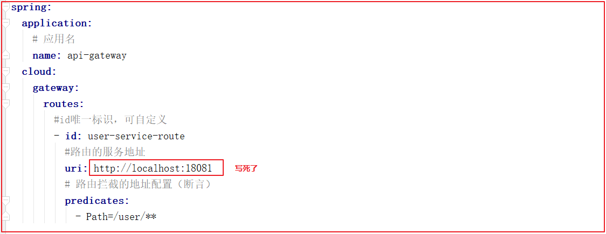

# 第2天 SpringCloud

## 1 Spring Cloud Feign

### 1.1 目标

了解Feign的作用

掌握Feign的使用过程

掌握Feign的负载均衡配置

掌握Feign的熔断配置

掌握Feign的压缩配置

掌握Feign的日志配置

### 1.2 讲解

#### 1.2.1 Feign简介


Feign 的英文表意为“假装，伪装，变形”， 是一个http请求调用的轻量级框架

为什么叫伪装？

Feign可以把HTTP 的请求进行隐藏，伪装成类似 SpringMVC 的 Controller一样。你不用再自己拼接 url，拼接参数等等操作，一切都交给 Feign 去做。

创建好了用户，订单，商品微服务，这三个微服务是互相隔离的，那么微服务和微服务之间如何互相调用呢，显然三个微服务都可以采用http通信，也就是 restTemplate 进行互相访问，但是这种方式对参数传递和使用都不是很方便，所以弃用此方式，采用 feign 进行服务之间的调用，可以简化调用流程，真正感觉到是在同一个项目中调用另一个类的方法

当我们通过RestTemplate调用其它服务的API时，所需要的参数须在请求的URL中进行拼接，如果参数少的话或许我们还可以忍受，一旦有多个参数的话，这时拼接请求字符串就会效率低下，并且显得好傻。

在开发 Spring Cloud 微服务的时候，我们知道，服务之间都是以 HTTP 接口的形式对外提供服务的，因此消费者在进行调用的时候，底层就是通过 HTTP Client 的这种方式进行访问。Spring 的 RestTemplate 去实现服务间的调用。但是最方便、最优雅的方式是通过 Spring Cloud Feign 进行服务间的调用。使用 Feign 只需要创建一个接口加上对应的注解，比如：@FeignClient 注解。

总之总结下：

Feign 是一种声明式、模板化的 HTTP 客户端。在 Spring Cloud 中使用 Feign，可以做到使用 HTTP 请求访问远程服务，就像调用本地方法一样的，开发者完全感知不到这是在调用远程方法，更感知不到在访问 HTTP 请求。

接下来介绍一下 Feign 的特性，具体如下：

集成Ribbon的负载均衡功能
集成了Hystrix的熔断器功能
支持请求压缩
大大简化了远程调用的代码，同时功能还增强啦
Feign以更加优雅的方式编写远程调用代码，并简化重复代码

#### 1.2.2 快速入门

使用 Feign 替代 RestTemplate 发送 HTTP请求。

实现步骤：

1. 导入feign依赖
2. 编写Feign客户端接口-将请求地址写到该接口上
3. 消费者启动引导类开启Feign功能注解
4. 访问接口测试
实现过程：

(1)导入依赖

在user-consumer中添加spring-cloud-starter-openfeign依赖
```xml
<!--配置feign-->
<dependency>
    <groupId>org.springframework.cloud</groupId>
    <artifactId>spring-cloud-starter-openfeign</artifactId>
</dependency>
```
(2)创建Feign客户端

在user-consumer中创建com.atguigu.feign.UserClient接口，代码如下：


```java
package com.atguigu.feign;

import com.atguigu.domain.User;
import org.springframework.cloud.openfeign.FeignClient;
import org.springframework.web.bind.annotation.PathVariable;
import org.springframework.web.bind.annotation.RequestMapping;

/**
 * UserClient
 *
 * @Author: 马伟奇
 * @CreateTime: 2020-03-22
 * @Description:
 */
//@FeignClient(value = "要调用微服务的名字")
@FeignClient(value = "user-provider")
public interface UserClient {
    /***
     * 根据ID查询用户信息
     * @param id
     * @return
     */
    @RequestMapping(value = "/user/find/{id}")
    User findById(@PathVariable(value = "id") Integer id);
}
```

解释：

Feign会通过动态代理，帮我们生成实现类。
注解@FeignClient声明Feign的客户端，注解value指明服务名称
接口定义的方法，采用SpringMVC的注解。Feign会根据注解帮我们生成URL地址
注解@RequestMapping中的/user，不要忘记。因为Feign需要拼接可访问地址
(3)编写控制层

在user-consumer中创建com.atguigu.controller.ConsumerFeignController，在 Controller 中使用@Autowired注入FeignClient ,代码如下：
```java
package com.atguigu.controller;

import com.atguigu.domain.User;
import com.atguigu.feign.UserClient;
import org.springframework.beans.factory.annotation.Autowired;
import org.springframework.web.bind.annotation.PathVariable;
import org.springframework.web.bind.annotation.RequestMapping;
import org.springframework.web.bind.annotation.RestController;

/**
 * ConsumerFeignController
 *
 * @Author: 马伟奇
 * @CreateTime: 2020-03-22
 * @Description:
 */
@RestController
@RequestMapping(value = "/feign")
public class ConsumerFeignController {


    @Autowired
    private UserClient userClient;

    @RequestMapping(value = "/{id}")
    public User queryById(@PathVariable(value = "id")Integer id){
        return userClient.findById(id);
    }
}
```
(4)开启Feign

修改user-consumer的启动类，在启动类上添加@EnableFeignClients注解，开启Feign,代码如下：


(5)测试

请求http://localhost:18082/feign/2，效果如下：


#### 1.2.3 负载均衡

Feign自身已经集成了Ribbon，因此使用Feign的时候，不需要额外引入依赖。


Feign内置的ribbon默认设置了请求超时时长，默认是1000，可以修改

ribbon内部有重试机制，一旦超时，会自动重新发起请求。如果不希望重试可以关闭配置：

在 user-consumer 配置文件添加如下配置


修改服务地址轮询策略，默认是轮询，配置之后变随机

```yaml
user-provider:
  ribbon:
    #轮询
    NFLoadBalancerRuleClassName: com.netflix.loadbalancer.RoundRobinRule
    ConnectTimeout: 1000 # 连接超时时间 没有连接上
    ReadTimeout: 2000 # 数据读取超时时间 连接上了，连上之后开始计时，但读取数据需要花费很长时间
    MaxAutoRetries: 1 # 最大重试次数(第一个服务)在第一次连接超时之后，在重新连接一次
    MaxAutoRetriesNextServer: 0 # 最大重试下一个服务次数(集群的情况才会用到)
    OkToRetryOnAllOperations: false # 是否所有操作都进行重试
```
① 测试 ReadTimeout 读取超时

在 UserController 添加连接超时时间


运行测试连接超时 http://localhost:18082/feign/2

ReadTimeout: 2000 读取超时时间是2秒，休眠10秒，肯定连接超时


ReadTimeout: 15000 读取超时时间是15 秒，休眠10秒，可以读取数据


② 测试 ConnectTimeout 超时 ，随意写一个不存在的IP地址，测试连接超时时间


运行测试连接超时 http://localhost:18082/feign/2


③ 测试 MaxAutoRetries 重试机制

修改 ReadTimeout: 5000 5秒读取超时 ，会重新在连接一次


#### 1.2.4 熔断器支持

feign整合Hystrix熔断器

Feign默认也有对Hystrix的集成!


实现步骤：

1. 在配置文件application.yml中开启feign熔断器支持
2. 编写FallBack处理类，实现FeignClient客户端
3. 在@FeignClient注解中，指定FallBack处理类。
4. 测试
(1)开启Hystrix

在 user-consumer 配置文件 application.yml 中开启 feign 熔断器支持：默认关闭

feign:
  hystrix:
    enabled: true # 开启Feign的熔断功能


(2)熔断降级类创建

修改user-consumer,创建一个类com.atguigu.feign.fallback.UserClientFallback，实现刚才编写的UserClient，作为FallBack的处理类,代码如下：
```java
package com.atguigu.feign.fallback;

import com.atguigu.domain.User;
import com.atguigu.feign.UserClient;
import org.springframework.stereotype.Component;

/**
 * UserClientFallback
 *
 * @Author: 马伟奇
 * @CreateTime: 2020-03-22
 * @Description:
 */
@Component
public class UserClientFallback implements UserClient {
    @Override
    public User findById(Integer id) {
        User user = new User();
        user.setUsername("服务熔断");
        return user;
    }
}
```
(3)指定Fallback处理类

在@FeignClient注解中，指定FallBack处理类


```java
package com.atguigu.feign;

import com.atguigu.domain.User;
import com.atguigu.feign.fallback.UserClientFallback;
import org.springframework.cloud.openfeign.FeignClient;
import org.springframework.web.bind.annotation.PathVariable;
import org.springframework.web.bind.annotation.RequestMapping;

/**
 * UserClient
 *
 * @Author: 马伟奇
 * @CreateTime: 2020-03-22
 * @Description:
 */
//@FeignClient(value = "要调用微服务的名字")
//fallback = UserClientFallback.class 指定当前feign接口发生熔断降级处理类
@FeignClient(value = "user-provider",fallback = UserClientFallback.class)
public interface UserClient {
    /***
     * 根据ID查询用户信息
     * @param id
     * @return
     */
    @RequestMapping(value = "/user/find/{id}")
    User findById(@PathVariable(value = "id") Integer id);
}
```

避免测试干扰注释掉配置文件当中的链接超时时间


(4)测试

关闭服务消费方，请求http://localhost:18082/feign/3，效果如下：


#### 1.2.5 请求压缩

SpringCloudFeign支持对请求和响应进行GZIP压缩，以减少通信过程中的性能损耗。

user-consumer通过配置开启请求与响应的压缩功能：（简单压缩）
```yaml


feign:
	compression:
        request:
            enabled: true # 开启请求压缩
        response:
            enabled: true # 开启响应压缩
```
也可以对请求的数据类型，以及触发压缩的大小下限进行设置（完整压缩）


```yaml
#  Feign配置
feign:
	compression:
		request:
			enabled: true # 开启请求压缩
			mime-types:	text/html,application/xml,application/json # 设置压缩的数据类型
			min-request-size: 2048 # 设置触发压缩的大小下限
			#以上数据类型，压缩大小下限均为默认值
		response:
            enabled: true # 开启响应压缩	
```


#### 1.2.6 Feign的日志级别配置

通过loggin.level.xx=debug来设置日志级别。然而这个对Feign客户端不会产生效果。因为@FeignClient注解修饰的客户端在被代理时，都会创建一个新的Feign.Logger实例。我们需要额外通过配置类的方式指定这个日志的级别才可以。

实现步骤：

1. 在application.yml配置文件中开启日志级别配置
2. 编写配置类，定义日志级别bean。
3. 在接口的@FeignClient中指定配置类
4. 重启项目，测试访问
实现过程：

(1)普通日志等级配置

在user-consumer的配置文件中设置com.atguigu包下的日志级别都为debug


com.atguigu 包下的日志级别都为Debug

```yaml
logging:
  level:
    com.atguigu: debug
```

(2)Feign日志等级配置

在user-consumer中的application启动类com.atguigu.UserConsumerApplication,定义日志级别


```java
package com.atguigu;

import feign.Logger;
import org.springframework.boot.SpringApplication;
import org.springframework.boot.autoconfigure.SpringBootApplication;
import org.springframework.cloud.client.circuitbreaker.EnableCircuitBreaker;
import org.springframework.cloud.client.discovery.EnableDiscoveryClient;
import org.springframework.cloud.client.loadbalancer.LoadBalanced;
import org.springframework.cloud.openfeign.EnableFeignClients;
import org.springframework.context.annotation.Bean;
import org.springframework.web.client.RestTemplate;


/**
 * UserConsumerApplication
 *
 * @Author: 马伟奇
 * @CreateTime: 2020-03-18
 * @Description:
 */
@SpringBootApplication
@EnableDiscoveryClient  //开启Eureka客户端发现功能
@EnableCircuitBreaker
@EnableFeignClients(basePackages = {"com.atguigu.feign"})
public class UserConsumerApplication {
    public static void main(String[] args) {
        SpringApplication.run(UserConsumerApplication.class,args);
    }

    /***
     * 将RestTemplate的实例放到Spring容器中
     * @return
     */
    @Bean
    @LoadBalanced
    public RestTemplate restTemplate(){
        return new RestTemplate();
    }

    /**
     * 配置日志级别
     * @return
     */
    @Bean
    public Logger.Level feignloggerlevel(){
        return Logger.Level.FULL;
    }
}
```
日志级别说明：

Feign支持4中级别：
	NONE：不记录任何日志，默认值
	BASIC：仅记录请求的方法，URL以及响应状态码和执行时间
	HEADERS：在BASIC基础上，额外记录了请求和响应的头信息
	FULL：记录所有请求和响应的明细，包括头信息、请求体、元数据
运行程序 http://localhost:18082/feign/2


重启项目，即可看到每次访问的日志， 文件压缩


1.2.7 Feign 工作原理
① 在开发微服务应用时，我们会在主程序入口添加 @EnableFeignClients 配置的扫描包路径。如果没配置，默认为启动类的包路径。

② 当程序启动时，会进行包扫描，扫描所有 @FeignClient 的注解的类，并将这些信息注入 Spring IOC 容器中。

③ 校验 @FeignClient 修饰的类，包括类必须是 interface ，以及@FeignClient的fallback及fallbackFactory配置的必须是接口的实现类。

### 1.3 小结

Feign的作用:不再使用拼接URL的方式实现远程调用，以接口调用的方式实现远程调用，简化了远程调用的实现方式，增强了远程调用的功能，例如：增加了负载均衡、熔断、压缩、日志启用。

掌握Feign的使用过程

properties
  1.引入Feign依赖包
  2.创建Feign接口,feign接口中需要指定调用的服务名字
  3.使用@EnabledFeignClients启用Feign功能
掌握Feign的负载均衡配置
properties
  在配置文件中配置
  {spring.application.name}:ribbon:负载均衡属性配置
掌握Feign的熔断配置
properties
  1.在application.yml中开启Hystrix
  2.给Feign接口创建一个实现类
  3.给Feign指定fallback类
掌握Feign的压缩配置
properties
  在application.yml中指定压缩属性即可
掌握Feign的日志配置
properties
  1.在application.yml中开启普通日志等级
  2.创建一个类，定义Feign日志等级
  3.在Feign接口中指定定义日志的配置

## 2 网关 Spring Cloud Gateway


### 2.1 目标

网关的作用
会配置动态路由
会配置过滤器
能自定义全局过滤器
API 网关出现的原因是微服务架构的出现，不同的微服务一般会有不同的网络地址，而外部客户端可能需要调用多个服务的接口才能完成一个业务需求，如果让客户端直接与各个微服务通信，会有以下的问题：

客户端会多次请求不同的微服务，增加了客户端的复杂性。
存在跨域请求，在一定场景下处理相对复杂。
认证复杂，每个服务都需要独立认证。
难以重构，随着项目的迭代，可能需要重新划分微服务。例如，可能将多个服务合并成一个或者将一个服务拆分成多个。如果客户端直接与微服务通信，那么重构将会很难实施。
某些微服务可能使用了防火墙 / 浏览器不友好的协议，直接访问会有一定的困难。
以上这些问题可以借助 API 网关解决。API 网关是介于客户端和服务器端之间的中间层，所有的外部请求都会先经过 API 网关这一层。也就是说，API 的实现方面更多的考虑业务逻辑，而安全、性能、监控可以交由 API 网关来做，这样既提高业务灵活性又不缺安全性，典型的架构图如图所示：


使用 API 网关后的优点如下：

易于监控。可以在网关收集监控数据并将其推送到外部系统进行分析。
易于认证。可以在网关上进行认证，然后再将请求转发到后端的微服务，而无须在每个微服务中进行认证。
减少了客户端与各个微服务之间的交互次数。

### 2.2 讲解

#### 2.2.1 Gateway 简介

Spring Cloud Gateway 是Spring Cloud团队的一个全新项目，基于Spring 5.0、SpringBoot2.0、Project Reactor 等技术开发的网关。 旨在为微服务架构提供一种简单有效统一的API路由管理方式。

Spring Cloud Gateway 作为SpringCloud生态系统中的网关，目标是替代Netflix Zuul。Gateway不仅提供统一路由方式，并且基于Filter链的方式提供网关的基本功能。例如：安全，监控/指标，和限流。

本身也是一个微服务，需要注册到Eureka

网关的核心功能：过滤、路由

核心概念：通过画图解释

路由(route)：
断言Predicate函数：路由转发规则
过滤器(Filter)：


#### 2.2.2 快速入门

实现步骤：

1. 创建gateway-service工程SpringBoot
2. 编写基础配置
3. 编写路由规则，配置静态路由策略
4. 启动网关服务进行测试
实现过程：

(1)创建一个子工程 gateway-service


(2)pom.xml依赖
```xml
<?xml version="1.0" encoding="UTF-8"?>
<project xmlns="http://maven.apache.org/POM/4.0.0"
         xmlns:xsi="http://www.w3.org/2001/XMLSchema-instance"
         xsi:schemaLocation="http://maven.apache.org/POM/4.0.0 http://maven.apache.org/xsd/maven-4.0.0.xsd">
    <parent>
        <artifactId>springcloud-parent</artifactId>
        <groupId>com.atguigu</groupId>
        <version>1.0-SNAPSHOT</version>
    </parent>
    <modelVersion>4.0.0</modelVersion>

    <artifactId>gateway-service</artifactId>

    <dependencies>
        <!--网关依赖-->
        <dependency>
            <groupId>org.springframework.cloud</groupId>
            <artifactId>spring-cloud-starter-gateway</artifactId>
        </dependency>
        <!-- Eureka客户端 -->
        <dependency>
            <groupId>org.springframework.cloud</groupId>
            <artifactId>spring-cloud-starter-netflix-eureka-client</artifactId>
        </dependency>
    </dependencies>
</project>
```
(3)启动类

创建启动类com.atguigu.GatewayApplication,代码如下：
```java
package com.atguigu;

import org.springframework.boot.SpringApplication;
import org.springframework.boot.autoconfigure.SpringBootApplication;
import org.springframework.cloud.client.discovery.EnableDiscoveryClient;

/**
 * GatewayApplication
 *
 * @Author: 马伟奇
 * @CreateTime: 2020-03-22
 * @Description:
 */
@SpringBootApplication
@EnableDiscoveryClient
public class GatewayApplication {
    public static void main(String[] args) {
        SpringApplication.run(GatewayApplication.class,args);
    }
}
```
(4) application.yml 配置
```yaml


# 注释版本
server:
  port: 18084
spring:
  application:
    name: api-gateway # 应用名
# Eureka服务中心配置
eureka:
  client:
    service-url:
      # 注册Eureka Server集群
      defaultZone: http://127.0.0.1:7001/eureka
```
#### 2.2.3 路由配置


通过网关配置一个路由功能，用户访问网关的时候,如果用户请求的路径是以/user开始，则路由到user-provider服务去,修改application.yml配置即可实现，配置如下：


```yaml
spring:
  application:
    # 应用名
    name: api-gateway
  cloud:
    gateway:
      routes:
      # 用户所有以/user开始的请求，都给http://localhost:18081服务处理
      #id唯一标识，可自定义 , 随便写，可以写小红，小花都行
      - id: user-service-route
        #路由的服务地址
        uri: http://localhost:18081
        # 路由拦截的地址配置（断言）
        # /user/**所有以/user开始的请求都将被路由到uri指定的服务地址，
        # 将该请求交给uri指定的服务处理，比如请求：http://localhost:18084/user/find/2会把请求交给http://localhost:18081/user/find/2处理
        predicates:
        - Path=/user/**
```
概念解释：

Route（路由）：路由是网关的基本单元，由ID、URI、一组Predicate、一组Filter组成，根据Predicate进行匹配转发。
Predicate（谓语、断言）：路由转发的判断条件
Filter（过滤器）：过滤器是路由转发请求时所经过的过滤逻辑，可用于修改请求、响应内容。
启动GatewayApplication测试

访问http://localhost:18084/user/find/2会访问user-provider服务，效果如下：


#### 2.2.4 动态路由



刚才路由规则中，我们把路径对应服务地址写死了！如果服务提供者集群的话，这样做不合理。应该是**根据服务名称**，去Eureka注册中心查找服务对应的所有实例列表，然后进行动态路由！

修改映射配置：通过服务名称获取：

修改application.yml

因为已经配置了Eureka客户端，可以从Eureka获取服务的地址信息，修改application.yml文件如下:


上图代码如下：
```yaml
spring:
  application:
    # 应用名
    name: api-gateway
  cloud:
    gateway:
      routes:
        #id唯一标识，可自定义
        - id: user-service-route
          #路由的服务地址
          #uri: http://localhost:18081 请求负载均衡算法Load Balance
          #lb协议表示从Eureka注册中心获取服务请求地址
          #user-provider访问的服务名称。
          #路由地址如果通过lb协议加服务名称时，会自动使用负载均衡访问对应服务
          uri: lb://user-provider
          # 路由拦截的地址配置（断言）
          predicates:
            - Path=/user/**
```
路由配置中uri所用的协议为lb时，gateway将把user-provider解析为实际的主机和端口，并通过Ribbon进行负载均衡。http://localhost:18084/user/find/2


#### 2.2.5 过滤器

过滤器作为Gateway的重要功能。常用于请求鉴权、服务调用时长统计、修改请求或响应header、限流、去除路径等等…

##### 2.2.5.1 过滤器的分类

默认过滤器：出厂自带，实现好了拿来就用，不需要实现
  全局默认过滤器
  局部默认过滤器
自定义过滤器：根据需求自己实现，实现后需配置，然后才能用哦。
  全局过滤器：作用在所有路由上。
  局部过滤器：配置在具体路由下，只作用在当前路由上。
默认过滤器几个，常见如下：

过滤器名称	说明
AddRequestHeader	对匹配上的请求加上Header
AddRequestParameters	对匹配上的请求路由
AddResponseHeader	对从网关返回的响应添加Header
StripPrefix	对匹配上的请求路径去除前缀
详细说明官方链接

##### 2.2.5.2 默认过滤器配置

默认过滤器有两个：全局默认过滤器和局部默认过滤器。

全局过滤器：对输出响应头设置属性

对输出的响应设置其头部属性名称为X-Response-Default-MyName,值为atguigu

修改 gateway-service 的 yml 配置文件


```yaml
spring:
  cloud:
    gateway:
     # 配置全局默认过滤器
      default-filters:
      # 往响应过滤器中加入信息
        - AddResponseHeader=X-Response-Default-MyName,atguigu
```
查看浏览器响应头信息!


局部过滤器：通过局部默认过滤器，修改请求路径。局部过滤器在这里介绍两种：添加路径前缀、去除路径前缀。

第一：添加路径前缀：

在gateway中可以通过配置路由的过滤器PrefixPath 实现映射路径中的前缀

配置请求地址添加路径前缀过滤器


上图配置如下：
```yaml
# 注释版本
server:
  port: 18084
spring:
  application:
    name: api-gateway # 应用名
  cloud:
    gateway:
      routes:
      # 用户所有以/user开始的请求，都给http://localhost:18081服务处理
      #id唯一标识，可自定义
        - id: user-service-route
          #路由的服务地址
          uri: lb://user-provider
          # 路由拦截的地址配置（断言）
          # /user/**所有以/user开始的请求都将被路由到uri指定的服务地址，
          # 将该请求交给uri指定的服务处理，比如请求：http://localhost:18084/user/find/2会把请求交给http://localhost:18081/user/find/2处理
          predicates:
          #  - Path=/user/**
            - Path=/**
          # 配置全局默认过滤器
          # 给每次请求都添加一个前缀 /user比如请求：http://localhost:18084/2-->http://localhost:18084/user/2
          filters:
            - PrefixPath=/user
      # 配置全局默认过滤器
      default-filters:
      # 往响应过滤器中加入信息
        - AddResponseHeader=X-Response-Default-MyName,atguigu
```
```yaml
# Eureka服务中心配置
eureka:
  client:
    service-url:
      # 注册Eureka Server集群
      defaultZone: http://127.0.0.1:7001/eureka
```
路由地址信息：

配置	访问地址	路由地址
PrefixPath=/user	http://localhost:18084/find/2	http://localhost:18081/user/find/2
全局和局部的区别：全局是对所有的id有效，局部只是对某一个id有效

请求：http://localhost:18084/find/2 会自动添加/user


第二：去除路径前缀：

在gateway中通过配置路由过滤器StripPrefix，实现映射路径中地址的去除。通过StripPrefix=1来指定路由要去掉的前缀个数。如：路径/api/user/1将会被路由到/user/1。

http://localhost:18084/api/user/2 可以去掉指定个数的前缀 http://localhost:18084/user/2

配置去除路径前缀过滤器


上图配置如下：
```yaml
spring:
  application:
    # 应用名
    name: api-gateway
  cloud:
    gateway:
      routes:
        #id唯一标识，可自定义
        - id: user-service-route
          #路由的服务地址
          #uri: http://localhost:18081
          #lb协议表示从Eureka注册中心获取服务请求地址
          #user-provider访问的服务名称。
          #路由地址如果通过lb协议加服务名称时，会自动使用负载均衡访问对应服务
          uri: lb://user-provider
          # 路由拦截的地址配置（断言）
          predicates:
            - Path=/**
          filters:
            # 请求地址添加路径前缀过滤器
            #- PrefixPath=/user
            # 去除路径前缀过滤器 添加前缀和去掉前缀不要一起使用
            - StripPrefix=1
      default-filters:
        - AddResponseHeader=X-Response-Default-MyName,atguigu
```
路由地址信息：

配置	访问地址	路由地址
StripPrefix=1	http://localhost:18084/api/user/find/2	http://localhost:18081/user/find/2
StripPrefix=2	http://localhost:18084/api/r/user/find/2	http://localhost:18081/user/find/2


##### 2.2.5.3 自定义过滤器案例

自定义过滤器也有两个：全局自定义过滤器，和局部自定义过滤器。

自定义全局过滤器的案例，自定义局部过滤器的案例。

自定义全局过滤器的案例：模拟登陆校验。

基本逻辑：如果请求中有Token参数，则认为请求有效放行，如果没有则拦截提示授权无效

###### 2.2.5.3.1 全局过滤器自定义：

实现步骤：

1.在gateway-service工程编写全局过滤器类GlobalFilter,Ordered
2.编写业务逻辑代码
3.访问接口测试，加token和不加token。
全局过滤器作用范围：所有请求都会被拦截。

实现过程：

在gateway-service中创建com.atguigu.filter.LoginGlobalFilter全局过滤器类,代码如下：
```java

package com.atguigu.filter;

import org.springframework.cloud.gateway.filter.GatewayFilterChain;
import org.springframework.cloud.gateway.filter.GlobalFilter;
import org.springframework.core.Ordered;
import org.springframework.core.annotation.Order;
import org.springframework.http.HttpStatus;
import org.springframework.http.server.reactive.ServerHttpRequest;
import org.springframework.http.server.reactive.ServerHttpResponse;
import org.springframework.stereotype.Component;
import org.springframework.util.StringUtils;
import org.springframework.web.server.ServerWebExchange;
import reactor.core.publisher.Mono;

import java.lang.annotation.Annotation;

/**
 * LoginGlobalFilter
 *
 * @Author: 马伟奇
 * @CreateTime: 2020-03-22
 * @Description:
 *   如果项目只有一个过滤器，只需要实现GlobalFilter接口
 *   Ordered：表示项目有多个过滤器的时候，过滤器执行的先后顺序
 */
@Component
public class LoginGlobalFilter implements GlobalFilter, Ordered {


    /**
     * 过滤拦截
     * @param exchange
     * @param chain
     * @return
     */
    @Override
    public Mono<Void> filter(ServerWebExchange exchange, GatewayFilterChain chain) {
        System.out.println("全局拦截器");
        //  request获取
        ServerHttpRequest request = exchange.getRequest();
        // response获取
        ServerHttpResponse response = exchange.getResponse();
        // 获取请求参数
        String token = request.getQueryParams().getFirst("token");
        // 判断token是否为null,如果用户请求参数中没有token，则表示用户未登录
        if (StringUtils.isEmpty(token)){
            // 没有登录，状态设置401
            response.setStatusCode(HttpStatus.UNAUTHORIZED);
            // 结束请求
            return response.setComplete();
        }
        // 如果用户传递了一个token，则表示用户已经登录 ,直接放行
        return chain.filter(exchange);
    }

    /***
     * 定义过滤器执行顺序
     * 返回值越小，越靠前执行
     * @return
     */
    @Override
    public int getOrder() {
        return 0;
    }
}
```
测试：不携带token http://localhost:18084/hahah/user/find/2效果如下：


测试：携带token http://localhost:18084/hahah/user/find/2?token=abc 此时可以正常访问。


###### 2.2.5.3.2 局部过滤器定义

自定义局部过滤器，该过滤器在控制台输出配置文件中指定名称的请求参数及参数的值

实现步骤：

1. 在gateway-service中编写MyParamGatewayFilterFactory类 继承AbstractGatewayFilterFactory类
2. 实现业务代码：循环请求参数中是否包含name，如果包含则输出参数值
3. 修改配置文件
4. 访问请求测试，带name参数
局部过滤器作用范围：该局部过滤器在哪个id下配置，则该局部过滤器只针对该id的路由规则有效。

实现过程：

在gateway_service中编写MyParamGatewayFilterFactory类
```java
package com.atguigu.filter;

import org.springframework.cloud.gateway.filter.GatewayFilter;
import org.springframework.cloud.gateway.filter.GatewayFilterChain;
import org.springframework.cloud.gateway.filter.factory.AbstractGatewayFilterFactory;
import org.springframework.stereotype.Component;
import org.springframework.web.server.ServerWebExchange;
import reactor.core.publisher.Mono;

/**
 * MyParamGatewayFilterFactory
 *
 * @Author: 马伟奇
 * @CreateTime: 2020-03-22
 * @Description:
 */
@Component
public class MyParamGatewayFilterFactory extends AbstractGatewayFilterFactory {

    /**
     * 拦截当前id对应的请求
     * @param config
     * @return
     */
    @Override
    public GatewayFilter apply(Object config) {
        return new GatewayFilter() {
            @Override
            public Mono<Void> filter(ServerWebExchange exchange, GatewayFilterChain chain) {
                System.out.println("局部拦截器");
                return chain.filter(exchange);
            }
        };
    }

    /***
     * 构造函数
     */
    public MyParamGatewayFilterFactory() {
        super(MyParamGatewayFilterFactory.Config.class);
    }


    /****
     * 在该类执行初始化后，可以在这里执行相关初始化操作
     */
    public static class Config {
    }
}
```
修改application.yml配置文件


测试访问，访问http://localhost:18084/hahah/user/find/2?token=aaa会输出。


#### 2.2.6 微服务架构加入Gateway后

.jpg)

不管是来自客户端的请求，还是服务内部调用。一切对服务的请求都可经过网关。

网关实现鉴权、动态路由等等操作。

Gateway就是我们服务的统一入口

### 2.3 小结

网关的作用

properties

  1.为微服务架构提供一种简单有效统一的API路由管理方式
  2.可以在网关中实现微服务鉴权、安全控制、请求监控、限流
会配置动态路由
properties
  使用lb配置，能根据服务名字动态请求。
会配置过滤器
properties
  默认过滤器：default-filters:
能自定义全局过滤器
properties
  编写过滤器类，实现GlobalFilter和Ordered，在filter方法中实现过滤。

## 3 配置中心

参考阿里讲义