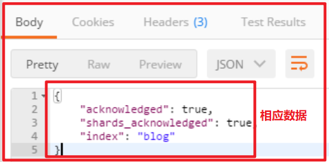

# ElasticSearch第一天

## 第一章 ElasticSearch简介

### 1.1 什么是ElasticSearch

Elaticsearch，简称为es， es是一个开源的高扩展的分布式全文检索引擎，它可以近乎实时的存储、检索数据；本身扩展性很好，可以扩展到上百台服务器，处理PB级别的数据。es也使用Java开发并使用Lucene作为其核心来实现所有索引和搜索的功能，但是它的目的是通过简单的RESTful API来隐藏Lucene的复杂性，从而让全文搜索变得简单。

Elasticsearch与mysql的区别

响应时间

MySQL

背景：

当数据库中的文档数仅仅上万条时，关键词查询就比较慢了。如果一旦到企业级的数据，响应速度就会更加不可接受。

原因：

在数据库做模糊查询时，如LIKE语句，它会遍历整张表，同时进行字符串匹配。

例如，在数据库查询“市场”时，数据库会在每一条记录去匹配“市场”这两字是否出现。实际上，并不是所有记录都包含“市场”，所以做了很多无用功。

这个步骤都不高效，而且随着数据量的增大，消耗的资源和时间都会线性的增长。

Elasticsearch

提升：小章使用了ES搜索服务后，发现这个问题被很好解决，TB级数据在毫秒级就能返回检索结果，很好地解决了痛点。

原因：而Elasticsearch是基于倒排索引的，例子如下。


这里写图片描述

当搜索“手机”时，Elasticsearch就会立即返回文档F，G，H。这样就不用花多余的时间在其他文档上了，因此检索速度得到了数量级的提升。

分词
MySQL

背景：
在做中文搜索时，组合词检索在数据库是很难完成的。

例如，当用户在搜索框输入“四川火锅”时，数据库通常只能把这四个字去进行全部匹配。可是在文本中，可能会出现“推荐四川好吃的火锅”，这时候就没有结果了。

原因：
数据库并不支持分词。如果人工去开发分词功能，费时费精力。

Elasticsearch

提升：
使用ES搜索服务后，就不用太过于关注分词了，因为Elasticsearch支持中文分词插件，很好地解决了问题。

原因：
当用户使用Elasticsearch时进行搜索时，Elasticsearch就自动帮他分好词了。

例如 输入“四川火锅”时，Elasticsearch会自动做下面两件事

（1） 将“四川火锅”分词成“四川”和“火锅”

（2） 查找包含这两个词的文档

相关性

MySQL

背景：
在用数据库做搜索时，结果经常会出现一系列不匹配的文档。思考：
· 到底什么文档是用户真正想要的呢？
· 怎么才能把用户想看的文档放在搜索列表最前面呢？

原因：
数据库并不支持相关性搜索。

例如，当用户搜索“咖啡厅”的时候，他很可能更想知道附近哪里可以喝咖啡，而不是怎么开咖啡厅。

Elasticsearch

提升：
使用了ES搜索服务后，发现Elasticsearch能很好地支持相关性评分。通过合理的优化，ES搜索服务能够返回精准的结果，满足用户的需求。

原因：
Elasticsearch支持全文搜索和相关度评分。这样在返回结果就会根据分数由高到低排列。分数越高，意味着和查询语句越相关。

例如，当用户搜索“星巴克咖啡”，带有“星巴克咖啡”的信息就要比只包含“咖啡”的信息靠前。

总结

1.传统数据库在全文检索方面很鸡肋，海量数据下的查询很慢，对非结构化文本数据的不支持，ES支持非结构化数据的存储和查询。

2.ES支持分布式文档存储。

3.ES是分布式实时搜索，并且响应时间比关系型数据库快。

4.ES在分词方面比关系型好，能做到精确分词。

5.ES对已有的数据，在数据匹配性方面比关系型数据库好， 例如：搜索“星巴克咖啡”，ES会优先返回带有“星巴克咖啡”的数据，不会优先返回带有“咖啡”的数据。

ElasticSearch和MySql分工不同，MySQL负责存储数据，ElasticSearch负责搜索数据。

#### 1.1.1 什么是全文检索

##### 1.1.1.1 数据分类

我们生活中的数据总体分为两种：结构化数据和非结构化数据。

结构化数据：指具有固定格式或有限长度的数据，如数据库，元数据等。

非结构化数据：指不定长或无固定格式的数据，如邮件，word文档等磁盘上的文件

##### 1.1.1.2 结构化数据搜索

常见的结构化数据也就是数据库中的数据。在数据库中搜索很容易实现，通常都是使用sql语句进行查询，而且能很快的得到查询结果。

为什么数据库搜索很容易？

因为数据库中的数据存储是有规律的，有行有列而且数据格式、数据长度都是固定的。

##### 1.1.1.3 非结构化数据查询方法

（1）顺序扫描法

所谓顺序扫描，比如要找内容包含某一个字符串的文件，就是一个文档一个文档的看，对于每一个文档，从头看到尾，如果此文档包含此字符串，则此文档为我们要找的文件，接着看下一个文件，直到扫描完所有的文件。如利用windows的搜索也可以搜索文件内容，只是相当的慢。

（2）全文检索

将非结构化数据中的一部分信息提取出来，重新组织，使其变得有一定结构，然后对此有一定结构的数据进行搜索，从而达到搜索相对较快的目的。这部分从非结构化数据中提取出的然后重新组织的信息，我们称之索引。

例如：字典。字典的拼音表和部首检字表就相当于字典的索引，对每一个字的解释是非结构化的，如果字典没有音节表和部首检字表，在茫茫辞海中找一个字只能顺序扫描。然而字的某些信息可以提取出来进行结构化处理，比如读音，就比较结构化，分声母和韵母，于是将读音拿出来按一定的顺序排列，每一项读音都指向此字的详细解释的页数。我们搜索时按结构化的拼音搜到读音，然后按其指向的页数，便可找到我们的非结构化数据——也即对字的解释。

这种先建立索引，再对索引进行搜索的过程就叫全文检索

虽然创建索引的过程也是非常耗时的，但是索引一旦创建就可以多次使用，全文检索主要处理的是查询，所以耗时间创建索引是值得的。

#### 1.1.2 如何实现全文检索

可以使用Lucene实现全文检索。Lucene是apache下的一个开放源代码的全文检索引擎工具包。提供了完整的查询引擎和索引引擎，部分文本分析引擎。Lucene的目的是为软件开发人员提供一个简单易用的工具包，以方便的在目标系统中实现全文检索的功能。

#### 1.1.3 全文检索的应用场景

对于数据量大、数据结构不固定的数据可采用全文检索方式搜索，比如百度、Google等搜索引擎、论坛站内搜索、电商网站站内搜索等。

#### 1.1.4 全文检索的实现流程

##### 1.1.4.1 索引和搜索流程图


1、绿色表示索引过程，对要搜索的原始内容进行索引构建一个索引库，索引过程包括：

确定原始内容即要搜索的内容 —->采集文档—->创建文档—->分析文档—->索引文档

2、红色表示搜索过程，从索引库中搜索内容，搜索过程包括：

用户通过搜索界面—->创建查询—->执行搜索，从索引库搜索—->渲染搜索结果

全文检索大体分两个过程，索引创建 (Indexing) 和搜索索引 (Search) 。

索引创建：将现实世界中所有的结构化和非结构化数据提取信息，创建索引的过程。

搜索索引：就是得到用户的查询请求，搜索创建的索引，然后返回结果的过程。

##### 1.1.4.2 创建索引

对文档索引的过程，将用户要搜索的文档内容进行索引，索引存储在索引库（index）中。

索引里面究竟需要存些什么呢？

首先我们来看为什么顺序扫描的速度慢：

其实是由于我们想要搜索的信息和非结构化数据中所存储的信息不一致造成的。

非结构化数据中所存储的信息是每个文件包含哪些字符串，也即已知文件，欲求字符串相对容易，也即是从文件到字符串的映射。而我们想搜索的信息是哪些文件包含此字符串，也即已知字符串，欲求文件，也即从字符串到文件的映射。两者恰恰相反。于是如果索引总能够保存从字符串到文件的映射，则会大大提高搜索速度。

##### 1.1.4.3 创建文档对象

获取原始内容的目的是为了索引，在索引前需要将原始内容创建成文档（Document），文档中包括一个一个的域（Field），域中存储内容。

这里我们可以将磁盘上的一个文件当成一个document，Document中包括一些Field（file_name文件名称、file_path文件路径、file_size文件大小、file_content文件内容），如下图：


注意：每个Document可以有多个Field，不同的Document可以有不同的Field，同一个Document可以有相同的Field（域名和域值都相同）

每个文档都有一个唯一的编号，就是文档id。

##### 1.1.4.4 分析文档

将原始内容创建为包含域（Field）的文档（document），需要再对域中的内容进行分析

##### 1.1.4.5 创建索引

索引的目的是为了搜索，最终要实现只搜索被索引的语汇单元从而找到Document（文档）。

注意：创建索引是对语汇单元索引，通过词语找文档，这种索引的结构叫**倒排索引结构**。

传统方法是根据文件找到该文件的内容，在文件内容中匹配搜索关键字，这种方法是顺序扫描方法，数据量大、搜索慢。

倒排索引结构是根据内容（词语）找文档，如下图：

正排索引：


转化成倒排索引：


说明：

“单词ID”一栏记录了每个单词的单词编号；

第二栏是对应的单词；

第三栏即每个单词对应的倒排列表；

比如单词“谷歌”，其单词编号为1，倒排列表为{1,2,3,4,5}，说明文档集合中每个文档都包含了这个单词。

而事实上，索引系统还可以记录除此之外的更多信息，在单词对应的倒排列表中不仅记录了文档编号，还记载了单词频率信息（TF），

即这个单词在某个文档中的出现次数，之所以要记录这个信息，是因为词频信息在搜索结果排序时，计算查询和文档相似度是很重要的一个计算因子，所以将其记录在倒排列表中，以方便后续排序时进行分值计算。


倒排索引结构也叫反向索引结构，包括索引和文档两部分，索引即词汇表，它的规模较小，而文档集合较大。

##### 1.1.4.6 查询索引

查询索引也是搜索的过程。搜索就是用户输入关键字，从索引（index）中进行搜索的过程。根据关键字搜索索引，根据索引找到对应的文档，从而找到要搜索的内容（这里指磁盘上的文件）。

##### 1.1.4.7 用户查询接口

全文检索系统提供用户搜索的界面供用户提交搜索的关键字，搜索完成展示搜索结果。

比如：


##### 1.1.4.8 创建查询

用户输入查询关键字执行搜索之前需要先构建一个查询对象，查询对象中可以指定查询要搜索的Field文档域、查询关键字等，查询对象会生成具体的查询语法，

##### 1.1.4.9 执行查询

搜索索引过程：

根据查询语法在倒排索引词典表中分别找出对应搜索词的索引，从而找到索引所链接的文档链表。

##### 1.1.4.10 渲染结果

以一个友好的界面将查询结果展示给用户，用户根据搜索结果找自己想要的信息，为了帮助用户很快找到自己的结果，提供了很多展示的效果，比如搜索结果中将关键字高亮显示，百度提供的快照等。


### 1.2 ElasticSearch的使用案例

2013年初，GitHub抛弃了Solr，采取ElasticSearch 来做PB级的搜索。 “GitHub使用ElasticSearch搜索20TB的数据，包括13亿文件和1300亿行代码”

维基百科：启动以elasticsearch为基础的核心搜索架构SoundCloud：“SoundCloud使用ElasticSearch为1.8亿用户提供即时而精准的音乐搜索服务”

百度：百度目前广泛使用ElasticSearch作为文本数据分析，采集百度所有服务器上的各类指标数据及用户自定义数据，
通过对各种数据进行多维分析展示，辅助定位分析实例异常或业务层面异常。目前覆盖百度内部20多个业务线
（包括casio、云分析、网盟、预测、文库、直达号、钱包、风控等），单集群最大100台机器，200个ES节点，每天导入30TB+数据

新浪使用ES 分析处理32亿条实时日志

阿里使用ES 构建挖财自己的日志采集和分析体系

## 第二章 ElasticSearch安装与启动

### 2.1 windows版本安装

### 2.1 下载ES压缩包

ElasticSearch分为Linux和Window版本，基于我们主要学习的是ElasticSearch的Java客户端的使用，所以我们课程中使用的是安装较为简便的Window版本，项目上线后，公司的运维人员会安装Linux版的ES供我们连接使用。

ElasticSearch的官方地址： https://www.elastic.co/products/elasticsearch

在资料中已经提供了下载好的7.4.0的压缩包：


### 2.2 安装ES服务

Window版的ElasticSearch的安装很简单，类似Window版的Tomcat，解压开即安装完毕，解压后的ElasticSearch的目录结构如下：


修改elasticsearch配置文件：config/elasticsearch.yml，增加以下两句命令：

http.cors.enabled: true

http.cors.allow-origin: "*"

xpack.ml.enabled: false

此步为允许elasticsearch跨越访问，如果不安装后面的elasticsearch-head是可以不修改，直接启动。

### 2.3 启动ES服务

点击ElasticSearch下的bin目录下的elasticsearch.bat启动，控制台显示的日志信息如下：


注意：9300是tcp通讯端口，集群间和TCPClient都执行该端口，9200是http协议的RESTful接口 。

通过浏览器访问ElasticSearch服务器，看到如下返回的json信息，代表服务启动成功：


注意事项一：ElasticSearch是使用java开发的，且本版本的es需要的jdk版本要是1.8以上，所以安装ElasticSearch之前保证JDK1.8+安装完毕，并正确的配置好JDK环境变量，否则启动ElasticSearch失败。

注意事项二：出现闪退，通过路径访问发现“空间不足”


【解决方案】


修改jvm.options文件的22行23行，把2改成1，让Elasticsearch启动的时候占用1个G的内存。


如果1个g还是不行：


-Xmx512m：设置JVM最大可用内存为512M。
-Xms512m：设置JVM初始内存为512m。此值可以设置与-Xmx相同，以避免每次垃圾回收完成后JVM重新分配内存。

### 2.4 安装ES的图形化界面插件

ElasticSearch不同于Solr自带图形化界面，我们可以通过安装ElasticSearch的head插件，完成图形化界面的效果，完成索引数据的查看。安装插件的方式有两种，在线安装和本地安装。本文档采用本地安装方式进行head插件的安装。elasticsearch-5-*以上版本安装head需要安装node和grunt

1）下载head插件：https://github.com/mobz/elasticsearch-head

在资料中已经提供了elasticsearch-head-master插件压缩包：


2）将elasticsearch-head-master压缩包解压到任意目录，但是要和elasticsearch的安装目录区别开

3）下载nodejs：https://nodejs.org/en/download/


在资料中已经提供了nodejs安装程序：


双击安装程序，步骤截图如下：


安装完毕，可以通过cmd控制台输入：node -v 查看版本号

5）将grunt安装为全局命令 ，Grunt是基于Node.js的项目构建工具

在cmd控制台中输入如下执行命令：

npm install -g grunt-cli
-g表示全局（globle）变量，让grunt-cli的客户端使用全局安装

执行结果如下图：


6）进入elasticsearch-head-master目录启动head，在命令提示符下输入命令：

```shell
npm install
grunt server
```


如果出现如下问题，就需要重装grunt


7）打开浏览器，输入 http://localhost:9100，看到如下页面：


如果不能成功连接到es服务，需要修改ElasticSearch的config目录下的配置文件：config/elasticsearch.yml，配置文件末尾，增加以下两句命令：


http.cors.enabled: true

http.cors.allow-origin: "*"

在elasticsearch-head-master文件夹，右键启动cmd命令行窗口，然后重新启动ElasticSearch服务。


【了解淘宝镜像安装】

ps:如果安装不成功或者安装速度慢，可以使用淘宝的镜像进行安装：如果上面安装成功了，后面的就不用关注,直接进入第三章

npm install -g cnpm –registry=https://registry.npm.taobao.org

后续使用的时候，只需要把npm xxx 换成 cnpm xxx 即可

执行以下命令（比较慢，需耐心等待）

cnpm install grunt

再次启动grunt server


上面问题解决方法，将下面命令分别执行安装：

```shell
cnpm install grunt-contrib-clean
cnpm install grunt-contrib-concat
cnpm install grunt-contrib-watch
cnpm install grunt-contrib-connect
cnpm install grunt-contrib-copy
cnpm install grunt-contrib-jasmine
```

2.2 Linux版本安装

2.2.1 下载地址
地址：https://www.elastic.co/cn/downloads/elasticsearch


2.2.2 Linux安装

参考linux安装讲义

2.3 docker版本安装

拉取镜像

docker pull elasticsearch:7.4.0

创建容器

docker create --name elasticsearch --net host -e "discovery.type=single-node" -e
"network.host=192.168.211.144" elasticsearch:7.4.0

启动

docker start elasticsearch

查看日志

docker logs elasticsearch

## 第三章 ElasticSearch相关概念(术语)

### 3.1 概述

先说Elasticsearch的文件存储，Elasticsearch是面向文档型数据库，一条数据在这里就是一个文档，用JSON作为文档序列化的格式，比如下面这条用户数据：

{
    "name" :     "John",
    "sex" :      "Male",
    "age" :      25,
    "birthDate": "1990/05/01",
    "about" :    "I love to go rock climbing",
    "interests": [ "sports", "music" ]
}
Elasticsearch可以看成是一个数据库，只是和关系型数据库比起来数据格式和功能不一样而已


### 3.2 Elasticsearch核心概念

#### 3.2.1 索引 index

文档存储的地方，类似于MySQL数据库中的数据库概念

#### 3.2.2 类型 type

如果按照关系型数据库中的对应关系，还应该有表的概念。ES中没有表的概念，这是ES和数据库的一个区别，在我们建立*索引*之后，可以直接往 索引 中写入*文档*。在6.0版本之前，ES中有Type的概念，可以理解成关系型数据库中的表，但是官方说这是一个设计上的失误，所以在6.0版本之后Type就被废弃了。

#### 3.2.3 字段Field

相当于是数据表的字段，字段在ES中可以理解为JSON数据的键，下面的JSON数据中，*name* 就是一个字段。

{
    "name":"jack"
}

#### 3.2.4 映射 mapping

映射 是对*文档*中每个*字段*的类型进行定义，每一种数据类型都有对应的使用场景。

每个*文档*都有映射，但是在大多数使用场景中，我们并不需要显示的创建映射，因为ES中实现了动态映射。我们在索引中写入一个下面的JSON文档，在动态映射的作用下，name会映射成text类型，age会映射成long类型。

```json
{
    "name":"jack",
    "age":18,
}
```

自动判断的规则如下：


Elasticsearch中支持的类型如下：


string类型在ElasticSearch 旧版本中使用较多，从ElasticSearch 5.x开始不再支持string，由text和

keyword类型替代。（已经废弃）

text 类型，需要分词设置text类型，比如Email内容、产品描述，应该使用text类型。

keyword类型 ，不需要分词设置keyword类型，比如email地址、主机名、状态码和标签。


#### 3.2.5 文档 document

文档 在ES中相当于传统数据库中的*行*的概念，ES中的数据都以JSON的形式来表示，在MySQL中插入一行数据和ES中插入一个JSON文档是一个意思。下面的JSON数据表示，一个包含3个字段的*文档*。
```json
{
    "name":"jack",
    "age":18,
    "gender":1
}
```

一个文档不只有数据。它还包含了元数据(metadata)——关于文档的信息。三个必须的元数据节点是：

节点	说明
_index | 文档存储的地方 |
| _type | 文档代表的对象的类 |
| _id | 文档的唯一标识 |

## 第四章 ElasticSearch的客户端操作

实际开发中，主要有三种方式可以作为elasticsearch服务的客户端：

第一种，elasticsearch-head插件

第二种，使用elasticsearch提供的Restful接口直接访问

第三种，使用elasticsearch提供的API进行访问

### 4.1 安装Postman工具

Postman中文版是postman这款强大网页调试工具的windows客户端，提供功能强大的Web API & HTTP 请求调试。软件功能非常强大，界面简洁明晰、操作方便快捷，设计得很人性化。Postman中文版能够发送任何类型的HTTP 请求 (GET, HEAD, POST, PUT..)，且可以附带任何数量的参数。

4.1 下载Postman工具

Postman官网：https://www.getpostman.com

课程资料中已经提供了安装包


4.2 注册Postman工具


### 4.2 用Postman进行Restful接口访问

#### 4.2.1 ElasticSearch的接口语法


#### 4.2.2 操作索引index


请求url：


PUT		localhost:9200/blog
发送请求，响应数据



elasticsearch-head查看：请求localhost:9100


注意：在创建索引的时候，有可能会报406错误 ，或者说，直接发送不了创建索引的 http请求，

head 连接Elasticsearch6是 【数据浏览模块不能显示数据了】

看一下网络发现406 错误
```json
{
  "error":"Content-Type header [application/x-www-form-urlencoded] is not supported",
  "status":406
}
```


解决方案：

1、进入head安装目录；

2、cd _site/

3、编辑vendor.js 共有两处

①  6886行 /contentType: "application/x-www-form-urlencoded
改成
contentType: "application/json;charset=UTF-8"

② 7574行 var inspectData = s.contentType === "application/x-www-form-urlencoded" &&
改成
var inspectData = s.contentType === "application/json;charset=UTF-8" &&

4.2.2 创建索引index和映射mapping

请求url：

PUT	localhost:9200/blog1


请求体：

```json
{
    "mappings": {
            "properties": {
                "id": {
                	"type": "long",
                    "store": true,
                    "index":true
                },
                "title": {
                	"type": "text",
                    "store": true,
                    "index":true,
                    "analyzer":"standard"
                },
                "content": {
                	"type": "text",
                    "store": true,
                    "index":true,
                    "analyzer":"standard"
                }
            }
        }
}
```

postman截图：


elasticsearch-head查看：


kibana安装和使用

Kibana是一个针对Elasticsearch的开源分析及可视化平台，用来搜索、查看交互存储在Elasticsearch索引中的数据。

kibana安装

进入kibana的bin目录，双击kibana.bat


访问：http://localhost:5601，出现以下界面即完成安装。


#### 4.2.3 操作映射


创建索引

`PUT person`

查询索引

`GET person`

删除索引

`DELETE person`

查询映射

`GET person/_mapping`

添加映射
```shell script
PUT person/_mapping
{
  "properties":{
    "name":{
      "type":"keyword"
    },
    "age":{
      "type":"integer"
    }
  }
}
```

创建索引并添加映射
```shell script
PUT person
{
  "mappings": {
    "properties": {
      "name":{
        "type": "keyword"
      },
      "age":{
        "type":"integer"
      }
    }
    
  }
}
```

索引库中添加字段

PUT person/_mapping
{
  "properties":{
    "address":{
      "type":"text"
    }
  }
}

kibana 截图


#### 4.2.5 操作文档document

• 添加文档
• 查询文档
• 修改文档
• 删除文档

请求url：

查询索引

GET person

添加文档，指定id

PUT person/_doc/1
{
  "name":"张三",
  "age":20,
  "address":"深圳宝安区"
}

查询文档

GET person/_doc/1

添加文档,不指定id

POST person/_doc/
{
  "name":"李四",
  "age":20,
  "address":"深圳南山区"
}

查询文档

GET person/_doc/u8b2QHUBCR3n8iTZ8-Vk

添加文档,不指定id

POST person/_doc/
{
  "name":"李四",
  "age":20,
  "address":"深圳南山区"
}

查询文档

GET person/_doc/u8b2QHUBCR3n8iTZ8-Vk

查询所有文档

GET person/_search

删除文档

DELETE person/_doc/1

修改文档 根据id，id存在就是修改，id不存在就是添加

PUT person/_doc/2
{
  "name":"硅谷",
  "age":20,
  "address":"深圳福田保税区"
}


#### 4.2.9 全文查询-match查询

全文查询会分析查询条件，先将查询条件进行分词，然后查询，求并集

请求体：

match 先会对查询的字符串进行分词，在查询，求交集

GET person/_search
{
  "query": {
    "match": {
      "address": "华为手机"
    }
  }
}
截图：


#### 4.2.10 查询文档-term查询

词条查询不会分析查询条件，只有当词条和查询字符串完全匹配时才匹配搜索

请求url：

POST	person/_search
请求体：

查询所有数据

GET person/_search

查0询 深开头的数据

GET person/_search
{
  "query": {
    "term": {
      "address": {
        "value": "深"
      }
    }
  }
}


截图：


#### 4.2.11 查询全部

请求url：

GET  person/_search
截图：


#### 4.2.12 关键字搜索数据

请求url：

查询名字等于张三的用户

GET  person/_search?q=name:张三
截图：


#### 4.2.13 DSL 查询

url地址请求体，多添加几条数据，方便做查询

PUT  shangguigu/_doc/1001
{
	"id":"1001",
	"name":"张三",
	"age":20,
	"sex":"男"
}

PUT  shangguigu/_doc/1002
{
	"id":"1002",
	"name":"李四",
	"age":25,
	"sex":"女"
}

PUT  shangguigu/_doc/1003
{
	"id":"1003",
	"name":"王五",
	"age":30,
	"sex":"女"
}

PUT  shangguigu/_doc/1004
{
	"id":"1004",
	"name":"赵六",
	"age":30,
	"sex":"男"
}

GET shangguigu/_search
添加结果：


① 根据年龄查询

请求体

POST  shangguigu/_doc/_search
{
  "query":{
      "match":{
          "age":20
      }
  }
}
请求结果：


② 查询年龄大于20岁的女性用户

请求URL地址：

GET  shangguigu/_search
{
  "query":{
    "bool":{
      "filter":{
        "range":{
          "age":{
            "gt":20
          }
        }
      },
      "must":{
        "match":{
          "sex":"女"
        }
      }
    }
  }
}
相应结果：


③ 全文搜索

请求URL地址

GET  shangguigu/_search
{
    "query":{
       "match":{
           "name": "张三 李四"
       }
    }
}
响应数据


#### 4.2.14 高亮显示


请求URL地址

请求体

GET  shangguigu/_search
{
    "query":{
       "match":{
           "name": "张三 李四"
       }
    },
    "highlight": {
        "fields": {
        "name": {}
        }
    }
}


#### 4.2.15 聚合

在Elasticsearch中，支持聚合操作，类似SQL中的group by操作。

请求URL地址

请求体

GET  shangguigu/_search
{
    "aggs": {
        "all_interests": {
            "terms": {
                "field": "age"
            }
         }
    }
}
响应体


如果聚合查询报错：


修改下查询语句

请求体：

{
    "aggs": {
        "all_interests": {
            "terms": {
                "field": "age.keyword"
            }
         }
    }
}
4.2.16 指定响应字段
在响应的数据中，如果我们不需要全部的字段，可以指定某些需要的字段进行返回

GET  shangguigu/_doc/1001?_source=id,name


#### 4.2.17 判断文档是否存在

如果我们只需要判断文档是否存在，而不是查询文档内容，那么可以这样：

HEAD  shangguigu/_doc/1001
存在返回200 - OK

不存在返回404

#### 4.2.18 批量操作

有些情况下可以通过批量操作以减少网络请求。如：批量查询、批量插入数据。

##### 4.2.18.1 批量查询

请求体

POST  shangguigu/_doc/_mget
{
  "ids" : [ "1001", "1003" ]
}
响应


如果，某一条数据不存在，不影响整体响应，需要通过found的值进行判断是否查询到数据。

请求体：

{
  "ids" : [ "1001", "1006" ]
}
响应


##### 4.2.18.2 _bulk操作

在Elasticsearch中，支持批量的插入、修改、删除操作，都是通过_bulk的api完成的。
请求格式如下：（请求格式不同寻常）

{ action: { metadata }}\n
{ request body    }\n
{ action: { metadata }}\n
{ request body    }\n
...
批量插入数据：

POST _bulk
{"create":{"_index":"atguigu","_id":2001}}
{"id":2001,"name":"name1","age": 20,"sex": "男"}
{"create":{"_index":"atguigu","_id":2002}}
{"id":2002,"name":"name2","age": 20,"sex": "男"}
{"create":{"_index":"atguigu","_id":2003}}
{"id":2003,"name":"name3","age": 20,"sex": "男"}


批量删除：

POST _bulk
{"delete":{"_index":"atguigu","_id":2001}}
{"delete":{"_index":"atguigu","_id":2002}}
{"delete":{"_index":"atguigu","_id":2003}}


由于delete没有请求体，所以，action的下一行直接就是下一个action。

#### 4.2.19 分页

和SQL使用 LIMIT 关键字返回只有一页的结果一样，Elasticsearch接受 from 和 size 参数：

size: 结果数，默认10
from: 跳过开始的结果数，默认0
如果你想每页显示5个结果，页码从1到3，那请求如下：

GET /_search?size=5
GET /_search?size=5&from=5
GET /_search?size=5&from=10
请求路径

GET shangguigu/_search?size=1&from=2
响应体


POST maweiqi/_bulk
{"index":{"_index":"maweiqi"}}
{"name":"张三","age": 20,"mail": "111@qq.com","hobby":"羽毛球、乒乓球、足球"}
{"index":{"_index":"maweiqi"}}
{"name":"李四","age": 21,"mail": "222@qq.com","hobby":"羽毛球、乒乓球、足球、篮球"}
{"index":{"_index":"maweiqi"}}
{"name":"王五","age": 22,"mail": "333@qq.com","hobby":"羽毛球、篮球、游泳、听音乐"}
{"index":{"_index":"maweiqi"}}
{"name":"赵六","age": 23,"mail": "444@qq.com","hobby":"跑步、游泳"}
{"index":{"_index":"maweiqi"}}
{"name":"孙七","age": 24,"mail": "555@qq.com","hobby":"听音乐、看电影"}


测试搜索：

POST maweiqi/_search
{
  "query" : {
    "match" : { 
    "hobby" : "音乐"
    }
  }
}


terms查询
terms 跟 term 有点类似，但 terms 允许指定多个匹配条件。 如果某个字段指定了多个值，那么文档需要一
起去做匹配：

POST maweiqi/_search
{
  "query" : {
      "terms" : { 
      "age" : [20,21]
    }
  }
}
示例


range查询
range 过滤允许我们按照指定范围查找一批数据：

范围操作符包含：

gt :: 大于
gte :: 大于等于
lt :: 小于
lte :: 小于等于
示例

POST maweiqi/_search
{
  "query": {
    "range": {
      "age": {
      "gte": 20,
      "lte": 22
    }
  }
}


exists 查询

exists 查询可以用于查找文档中是否包含指定字段或没有某个字段，类似于SQL语句中的 IS_NULL 条件

"exists":  必须包含

POST maweiqi/_search
{
  "query": {
    "exists": { 
      "field": "mail"
    }
  }
}


## 第五章 IK 分词器和ElasticSearch集成使用

分词就是指将一个文本转化成一系列单词的过程，也叫文本分析，在Elasticsearch中称之为Analysis。
举例：我是中国人 –> 我/是/中国人

### 5.1 上述查询存在问题分析

ElasticSearch的标准分词器导致的，当我们创建索引时，字段使用的是标准分词器：

{
    "mappings": {
        "article": {
            "properties": {
                "id": {
                	"type": "long",
                    "store": true,
                    "index":"not_analyzed"
                },
                "title": {
                	"type": "text",
                    "store": true,
                    "index":"analyzed",
                    "analyzer":"standard"	//标准分词器
                },
                "content": {
                	"type": "text",
                    "store": true,
                    "index":"analyzed",
                    "analyzer":"standard"	//标准分词器
                }
            }
        }
    }
}
例如对 “我是程序员” 进行分词

标准分词器分词效果测试：

POST  _analyze
{
  "text":"我是程序员"
}
分词结果：


而我们需要的分词效果是：我、是、程序、程序员

Standard
Standard 标准分词，按单词切分，并且会转化成小写

POST _analyze
{
 "analyzer": "standard",
 "text": "A man becomes learned by asking questions."
}
结果：


### 5.2 IK分词器简介

IKAnalyzer是一个开源的，基于java语言开发的轻量级的中文分词工具包。从2006年12月推出1.0版开始，IKAnalyzer已经推出 了3个大版本。最初，它是以开源项目Lucene为应用主体的，结合词典分词和文法分析算法的中文分词组件。新版本的IKAnalyzer3.0则发展为 面向Java的公用分词组件，独立于Lucene项目，同时提供了对Lucene的默认优化实现。

IK分词器3.0的特性如下：

1）采用了特有的“正向迭代最细粒度切分算法“，具有60万字/秒的高速处理能力。
2）采用了多子处理器分析模式，支持：英文字母（IP地址、Email、URL）、数字（日期，常用中文数量词，罗马数字，科学计数法），中文词汇（姓名、地名处理）等分词处理。
3）对中英联合支持不是很好,在这方面的处理比较麻烦.需再做一次查询,同时是支持个人词条的优化的词典存储，更小的内存占用。
4）支持用户词典扩展定义。
5）针对Lucene全文检索优化的查询分析器IKQueryParser；采用歧义分析算法优化查询关键字的搜索排列组合，能极大的提高Lucene检索的命中率。

### 5.3 ElasticSearch集成IK分词器

#### 5.3.1 IK分词器的安装

1）下载地址：https://github.com/medcl/elasticsearch-analysis-ik/releases 

课程资料也提供了IK分词器的压缩包：


2）解压，将解压后的elasticsearch文件夹拷贝到elasticsearch-7.4.0\plugins下，并重命名文件夹为ik


3）重新启动ElasticSearch，即可加载IK分词器


#### 5.3.2 IK分词器测试

IK提供了两个分词算法ik_smart 和 ik_max_word

其中 ik_smart 为最少切分，ik_max_word为最细粒度划分

我们分别来试一下

1）最小切分：在浏览器地址栏输入地址

POST  _analyze
{
    "analyzer":"ik_smart",
    "text":"我是程序员"
}
输出的结果为：


2）最细切分：在浏览器地址栏输入地址

POST  _analyze
{
    "analyzer":"ik_max_word",
    "text":"我是程序员"
}
输出的结果为：


### 5.4 修改索引映射mapping

#### 5.4.1 重建索引

删除原有blog1索引

删除索引

DELETE person
创建索引，此时分词器使用ik_max_word

创建索引，添加映射，指定使用ik分词器

```shell
PUT person
{
  "mappings": {
    "properties": {
      "name":{
        "type": "keyword"
      },
      "address":{
        "type":"text",
        "analyzer": "ik_max_word"
      }
    }
  }
}
```

查询索引

GET person
创建文档

添加文档

PUT person/_doc/1
{
  "name":"张三",
  "age":30,
  "address": "华为5G手机"
}

添加文档

PUT person/_doc/2
{
  "name":"李四",
  "age":20,
  "address": "深圳宝安"
}

添加文档

PUT person/_doc/3
{
  "name":"张三",
  "age":29,
  "address": "深圳南山"
}

查询所有数据

GET person/_search

#### 5.4.3 再次测试term测试

请求体：

使用term查询 深圳开头的数据

GET person/_search
{
  "query": {
    "term": {
      "address": {
        "value": "深圳"
      }
    }
  }
}

截图：

