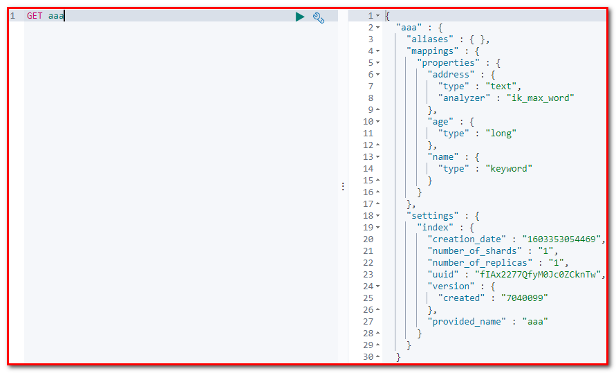
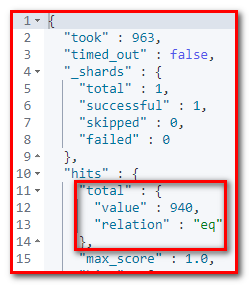
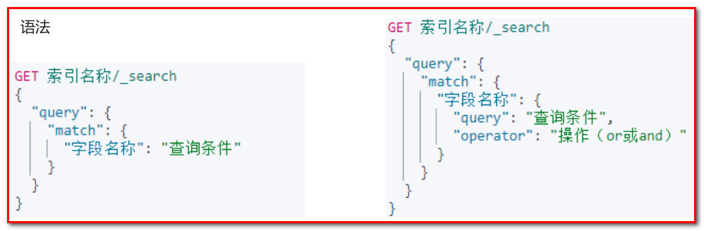
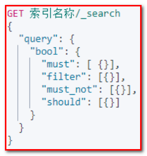

# ElasticSearch第二天

高级客户端
创建项目 elasticsearch-demo

导入pom文件

```xml
 <parent>
        <groupId>org.springframework.boot</groupId>
        <artifactId>spring-boot-starter-parent</artifactId>
        <version>2.2.1.RELEASE</version>
        <relativePath/> <!-- lookup parent from repository -->
    </parent>

    <properties>
        <project.build.sourceEncoding>UTF-8</project.build.sourceEncoding>
        <project.reporting.outputEncoding>UTF-8</project.reporting.outputEncoding>
        <java.version>1.8</java.version>
    </properties>

    <dependencies>
        <dependency>
            <groupId>org.springframework.boot</groupId>
            <artifactId>spring-boot-starter</artifactId>
        </dependency>

        <dependency>
            <groupId>org.springframework.boot</groupId>
            <artifactId>spring-boot-starter-test</artifactId>
            <scope>test</scope>
        </dependency>

        <!--引入es的坐标-->
        <dependency>
            <groupId>org.elasticsearch.client</groupId>
            <artifactId>elasticsearch-rest-high-level-client</artifactId>
            <version>7.4.0</version>
        </dependency>
        <dependency>
            <groupId>org.elasticsearch.client</groupId>
            <artifactId>elasticsearch-rest-client</artifactId>
            <version>7.4.0</version>
        </dependency>
        <dependency>
            <groupId>org.elasticsearch</groupId>
            <artifactId>elasticsearch</artifactId>
            <version>7.4.0</version>
        </dependency>

        <dependency>
            <groupId>com.alibaba</groupId>
            <artifactId>fastjson</artifactId>
            <version>1.2.4</version>
        </dependency>

    </dependencies>
```
① 在 resource 文件夹下面创建 application.yml 文件
```yaml
elasticsearch:
  host: 127.0.0.1
  port: 9200
```

② 创建启动类

```java
package com.atguigu;

import org.springframework.boot.SpringApplication;
import org.springframework.boot.autoconfigure.SpringBootApplication;

@SpringBootApplication
public class ElasticsearchDemoApplication {

    public static void main(String[] args) {
        SpringApplication.run(ElasticsearchDemoApplication.class, args);
    }

}
```

③ 创建 com.atguigu.config. ElasticSearchConfig

```java
package com.atguigu.config; 

import org.apache.http. HttpHost; 
import org.elasticsearch.client. RestClient; 
import org.elasticsearch.client. RestHighLevelClient; 
import org.springframework.boot.context.properties. ConfigurationProperties; 
import org.springframework.context.annotation. Bean; 
import org.springframework.context.annotation. Configuration; 

@Configuration
@ConfigurationProperties(prefix = "elasticsearch")
public class ElasticSearchConfig {

    private String host;
    private int port;

    public String getHost() {
        return host;

    }

    public void setHost(String host) {
        this.host = host;

    }

    public int getPort() {
        return port;

    }

    public void setPort(int port) {
        this.port = port;

    }

    @Bean
    public RestHighLevelClient client(){
        return new RestHighLevelClient(RestClient.builder(
                new HttpHost(
                        host,
                        port,
                        "http"
                )
        ));

    }

}
```

④ 新建测试类

```java
package com.atguigu.test; 

import org.apache.http. HttpHost; 
import org.elasticsearch.action.admin.indices.delete. DeleteIndexRequest; 
import org.elasticsearch.action.delete. DeleteRequest; 
import org.elasticsearch.action.delete. DeleteResponse; 
import org.elasticsearch.action.get. GetRequest; 
import org.elasticsearch.action.get. GetResponse; 
import org.elasticsearch.action.index. IndexRequest; 
import org.elasticsearch.action.index. IndexResponse; 
import org.elasticsearch.action.support.master. AcknowledgedResponse; 
import org.elasticsearch.client.*; 
import org.elasticsearch.client.indices. CreateIndexRequest; 
import org.elasticsearch.client.indices. CreateIndexResponse; 
import org.elasticsearch.client.indices. GetIndexRequest; 
import org.elasticsearch.client.indices. GetIndexResponse; 
import org.elasticsearch.cluster.metadata. MappingMetaData; 
import org.elasticsearch.common.xcontent. XContentType; 
import org.junit. After; 
import org.junit. Before; 
import org.junit. Test; 
import org.springframework.beans.factory.annotation. Autowired; 
import org.springframework.boot.test.context. SpringBootTest; 

import java.io. IOException; 
import java.util. HashMap; 
import java.util. Map; 
/**
 * ElasticsearchTest
 *
 * @Author: 马伟奇
 * @Description:
 */
@RunWith(SpringRunner.class)
@SpringBootTest
public class ElasticsearchTest {

    @Autowired
    private RestHighLevelClient client;

    @Test
    void contextLoads() {
        //1.创建ES客户端对象

//           client = new RestHighLevelClient(RestClient.builder(
//           new HttpHost(
//                   "127.0.0.1", 
//                   9200, 
//                   "http"
//           )
//        )); 

        System.out.println(client);

    }
```

创建索引

```java
import org.apache.http. HttpHost; 
import org.elasticsearch.action.admin.indices.delete. DeleteIndexRequest; 
import org.elasticsearch.action.delete. DeleteRequest; 
import org.elasticsearch.action.delete. DeleteResponse; 
import org.elasticsearch.action.get. GetRequest; 
import org.elasticsearch.action.get. GetResponse; 
import org.elasticsearch.action.index. IndexRequest; 
import org.elasticsearch.action.index. IndexResponse; 
import org.elasticsearch.action.support.master. AcknowledgedResponse; 
import org.elasticsearch.client.*; 
import org.elasticsearch.client.indices. CreateIndexRequest; 
import org.elasticsearch.client.indices. CreateIndexResponse; 
import org.elasticsearch.client.indices. GetIndexRequest; 
import org.elasticsearch.client.indices. GetIndexResponse; 
import org.elasticsearch.cluster.metadata. MappingMetaData; 
import org.elasticsearch.common.xcontent. XContentType; 
import org.junit.jupiter.api. Test; 
import org.springframework.beans.factory.annotation. Autowired; 
import org.springframework.boot.test.context. SpringBootTest; 

import java.io. IOException; 
import java.util. HashMap; 
import java.util. Map; 

@SpringBootTest
public class ElasticsearchTest {

    @Autowired
    private RestHighLevelClient client;

   /**

     * 添加索引
     */
    @Test
    public void addIndex() throws Exception {
        //1.使用client获取操作索引的对象
        IndicesClient indicesClient = client.indices();
        //2.具体操作，获取返回值
        CreateIndexRequest createRequest = new CreateIndexRequest("abc");

        CreateIndexResponse response = indicesClient.create(createRequest, RequestOptions.DEFAULT);

        //3.根据返回值判断结果

        System.out.println(response.isAcknowledged());

    }
```

kibana 查询


添加索引和映射

```java
package com.atguigu.test; 

/**
 * ElasticsearchTest
 *
 * @Author: 马伟奇
 * @Description:
 */
@SpringBootTest
public class ElasticsearchTest {

    @Autowired
    private RestHighLevelClient client;

    /**
     * 添加索引
     */
    @Test
    public void addIndexAndMapping() throws IOException {
        //1.使用client获取操作索引的对象
        IndicesClient indicesClient = client.indices();
        //2.具体操作，获取返回值
        CreateIndexRequest createRequest = new CreateIndexRequest("aaa");
        //2.1 设置mappings
        String mapping = "{\n" +
                "      \"properties\" : {\n" +
                "        \"address\" : {\n" +
                "          \"type\" : \"text\",\n" +
                "          \"analyzer\" : \"ik_max_word\"\n" +
                "        },\n" +
                "        \"age\" : {\n" +
                "          \"type\" : \"long\"\n" +
                "        },\n" +
                "        \"name\" : {\n" +
                "          \"type\" : \"keyword\"\n" +
                "        }\n" +
                "      }\n" +
                "    }";
        createRequest.mapping(mapping,XContentType.JSON);

        CreateIndexResponse response = indicesClient.create(createRequest, RequestOptions.DEFAULT);

        //3.根据返回值判断结果

        System.out.println(response.isAcknowledged());

    }

}
```



查询索引

```java
   /**

     * 查询索引
     */
    @Test
    public void queryIndex() throws IOException {
        IndicesClient indices = client.indices();

        GetIndexRequest getReqeust = new GetIndexRequest("aaa");
        GetIndexResponse response = indices.get(getReqeust, RequestOptions.DEFAULT);

        //获取结果
        Map<String, MappingMetaData> mappings = response.getMappings();
        for (String key : mappings.keySet()) {
            System.out.println(key+":" + mappings.get(key).getSourceAsMap());

        }

    }
```


删除索引

```java
/**

     * 删除索引
     */
    @Test
    public void deleteIndex() throws IOException {
        IndicesClient indices = client.indices();

        DeleteIndexRequest deleteRequest = new DeleteIndexRequest("abc");
        AcknowledgedResponse response = indices.delete(deleteRequest, RequestOptions.DEFAULT);

        System.out.println(response.isAcknowledged());

    }
```

判断索引是否存在

```java
/**

     * 判断索引是否存在
     */
    @Test
    public void existIndex() throws IOException {
        IndicesClient indices = client.indices();

        GetIndexRequest getRequest = new GetIndexRequest("aaa");
        boolean exists = indices.exists(getRequest, RequestOptions.DEFAULT);

        System.out.println(exists);

    }
```

添加文档, 使用map作为数据

```java
/**

     * 添加文档,使用map作为数据
     */
    @Test
    public void addDoc() throws IOException {
        //数据对象，map
        Map data = new HashMap();
        data.put("address","深圳宝安");
        data.put("name","尚硅谷");
        data.put("age",20);

        //1.获取操作文档的对象
        IndexRequest request = new IndexRequest("aaa").id("1").source(data);
        //添加数据，获取结果
        IndexResponse response = client.index(request, RequestOptions.DEFAULT);

        //打印响应结果
        System.out.println(response.getId());

    }
```

创建 com.atguigu.domain. Person

```java
public class Person {

    private String id;
    private String name;
    private int age;
    private String address;
    // 设置 set get 和tostring方法

}    
```

添加文档, 使用对象作为数据

```java
/**

     * 添加文档,使用对象作为数据
     */
    @Test
    public void addDoc2() throws IOException {
        //数据对象，javaObject
        Person p = new Person();
        p.setId("2");
        p.setName("硅谷2222");
        p.setAge(30);
        p.setAddress("北京昌平区");

        //将对象转为json
        String data = JSON.toJSONString(p);

        //1.获取操作文档的对象
        IndexRequest request = new IndexRequest("aaa").id(p.getId()).source(data,XContentType.JSON);
        //添加数据，获取结果
        IndexResponse response = client.index(request, RequestOptions.DEFAULT);

        //打印响应结果
        System.out.println(response.getId());

    }
```


修改文档

```java
 /**

     * 修改文档：添加文档时，如果id存在则修改，id不存在则添加
     */
    @Test
    public void updateDoc() throws IOException {

//数据对象，javaObject

        Person p = new Person();
        p.setId("2");
        p.setName("硅谷");
        p.setAge(30);
        p.setAddress("北京昌平区");

        //将对象转为json
        String data = JSON.toJSONString(p);

        //1.获取操作文档的对象
        IndexRequest request = new IndexRequest("aaa").id(p.getId()).source(data,XContentType.JSON);
        //添加数据，获取结果
        IndexResponse response = client.index(request, RequestOptions.DEFAULT);

        //打印响应结果
        System.out.println(response.getId());

    }
```

根据id查询文档

```java
/**

     * 根据id查询文档
     */
    @Test
    public void findDocById() throws IOException {

        GetRequest getReqeust = new GetRequest("aaa","1");
        //getReqeust.id("1");
        GetResponse response = client.get(getReqeust, RequestOptions.DEFAULT);
        //获取数据对应的json
        System.out.println(response.getSourceAsString());

    }
```

根据id删除文档

```java
/**

     * 根据id删除文档
     */
    @Test
    public void delDoc() throws IOException {

        DeleteRequest deleteRequest = new DeleteRequest("aaa","1");
        DeleteResponse response = client.delete(deleteRequest, RequestOptions.DEFAULT);
        System.out.println(response.getId());

    }
```

批量操作-脚本
Bulk 批量操作是将文档的增删改查一些列操作，通过一次请求全都做完。减少网络传输次数。


GET person/_search

批量操作

1 删除1号记录

2 添加8号记录

3 修改2号记录 名称为二号

POST _bulk
{"delete":{"_index":"person", "_id":"1"}}
{"create":{"_index":"person", "_id":"8"}}
{"name":"8号", "age":80, "address":"北京"}
{"update":{"_index":"person", "_id":"2"}}
{"doc":{"name":"2号"}}

```java
package com.atguigu.test; 
import com.alibaba.fastjson. JSON; 
import org.elasticsearch.action. DocWriteRequest; 
import org.elasticsearch.action.bulk. BulkRequest; 
import org.elasticsearch.action.bulk. BulkResponse; 
import org.elasticsearch.action.delete. DeleteRequest; 
import org.elasticsearch.action.index. IndexRequest; 
import org.elasticsearch.action.search. SearchRequest; 
import org.elasticsearch.action.search. SearchResponse; 
import org.elasticsearch.action.update. UpdateRequest; 
import org.elasticsearch.client. RequestOptions; 
import org.elasticsearch.client. RestHighLevelClient; 
import org.elasticsearch.common.text. Text; 
import org.elasticsearch.common.xcontent. XContentType; 
import org.elasticsearch.index.query.*; 
import org.elasticsearch.rest. RestStatus; 
import org.elasticsearch.search. SearchHit; 
import org.elasticsearch.search. SearchHits; 
import org.elasticsearch.search.aggregations. Aggregation; 
import org.elasticsearch.search.aggregations. AggregationBuilder; 
import org.elasticsearch.search.aggregations. AggregationBuilders; 
import org.elasticsearch.search.aggregations. Aggregations; 
import org.elasticsearch.search.aggregations.bucket.terms. Terms; 
import org.elasticsearch.search.builder. SearchSourceBuilder; 
import org.elasticsearch.search.fetch.subphase.highlight. HighlightBuilder; 
import org.elasticsearch.search.fetch.subphase.highlight. HighlightField; 
import org.elasticsearch.search.sort. SortOrder; 
import org.junit.jupiter.api. Test; 
import org.springframework.beans.factory.annotation. Autowired; 
import org.springframework.boot.test.context. SpringBootTest; 

import java.io. IOException; 
import java.util. ArrayList; 
import java.util. HashMap; 
import java.util. List; 
import java.util. Map; 
import java.io. IOException; 
import java.util. HashMap; 
import java.util. Map; 
/**
 * ElasticsearchTest2
 *
 * @Author: 马伟奇
 * @Description:
 */
@SpringBootTest
public class ElasticsearchTest2 {

    @Autowired
    private RestHighLevelClient client;

    @Test
    void contextLoads() {
        System.out.println(client); 

    }

    /**
     * 1. 批量操作 bulk
     */
    @Test
    public void testBulk() throws IOException {
        //创建bulkrequest对象，整合所有操作
        BulkRequest bulkRequest = new BulkRequest();

        /*
        # 1. 删除1号记录
        # 2. 添加6号记录
        # 3. 修改3号记录 名称为 “三号”
         */
        //添加对应操作
        //1. 删除1号记录
        DeleteRequest deleteRequest = new DeleteRequest("person","1");
        bulkRequest.add(deleteRequest);

        //2. 添加6号记录
        Map map = new HashMap();
        map.put("name","六号");
        IndexRequest indexRequest = new IndexRequest("person").id("6").source(map);
        bulkRequest.add(indexRequest);

        Map map2 = new HashMap();
        map2.put("name","三号");
        //3. 修改3号记录 名称为 “三号”
        UpdateRequest updateReqeust = new UpdateRequest("person","3").doc(map2);
        bulkRequest.add(updateReqeust);

        //执行批量操作
        BulkResponse response = client.bulk(bulkRequest, RequestOptions.DEFAULT);
        RestStatus status = response.status();
        System.out.println(status);

    }

}
```

导入数据
将数据库中Goods表的数据导入到ElasticSearch中

① 将数据库中Goods表的数据导入到ElasticSearch中

② 创建索引

```
PUT goods
{

	"mappings": {
		"properties": {
			"title": {
				"type": "text",
				"analyzer": "ik_smart"
			},
			"price": { 
				"type": "double"
			},
			"createTime": {
				"type": "date"
			},
			"categoryName": {	
				"type": "keyword"
			},
			"brandName": {	
				"type": "keyword"
			},
	
			"spec": {		
				"type": "object"
			},
			"saleNum": {	
				"type": "integer"
			},
			
			"stock": {	
				"type": "integer"
			}
		}
	}

}
```

查询索引

GET goods
title: 商品标题
price: 商品价格
createTime: 创建时间
categoryName: 分类名称。如：家电，手机
brandName: 品牌名称。如：华为，小米
spec: 商品规格。如： spec:{“屏幕尺寸”, “5寸”，“内存大小”, “128G”}
saleNum: 销量
stock: 库存量
添加文档数据

```
POST goods/_doc/1
{
  "title":"小米手机", 
  "price":1000, 
  "createTime":"2019-12-01", 
  "categoryName":"手机", 
  "brandName":"小米", 
  "saleNum":3000, 
  "stock":10000, 
  "spec":{

    "网络制式":"移动4G",
    "屏幕尺寸":"4.5"
  }
}
```

查询文档数据

GET goods/_search
添加坐标

```xml
<!--mybatis-->
<dependency>

    <groupId>org.mybatis.spring.boot</groupId>
    <artifactId>mybatis-spring-boot-starter</artifactId>
    <version>2.1.0</version>

</dependency>

<dependency>

    <groupId>mysql</groupId>
    <artifactId>mysql-connector-java</artifactId>

</dependency>
```

添加 application.yml 配置文件

```yaml
# datasource

spring:
  datasource:

    url: jdbc:mysql:///es?serverTimezone=UTC
    username: root
    password: root
    driver-class-name: com.mysql.cj.jdbc.Driver

# mybatis

mybatis:
  mapper-locations: classpath:mapper/*Mapper.xml # mapper映射文件路径
  type-aliases-package: com.atguigu.domain
```

添加 javabean

```java
package com.atguigu.domain; 

import com.alibaba.fastjson.annotation. JSONField; 

import java.util. Date; 
import java.util. Map; 

public class Goods {

    private int id;
    private String title;
    private double price;
    private int stock;
    private int saleNum;
    private Date createTime;
    private String categoryName;
    private String brandName;
    private Map spec;

   // @JSONField(serialize = false)//在转换JSON时，忽略该字段

    private String specStr;//接收数据库的信息 "{}"
    
    // 生成set  get  和 toString方法
    

}    
```

创建 dao

```java
package com.atguigu.mapper; 

import com.atguigu.domain. Goods; 
import org.apache.ibatis.annotations. Mapper; 
import org.springframework.stereotype. Repository; 

import java.util. List; 

@Repository
@Mapper
public interface GoodsMapper {

    /**
     * 查询所有
     */
    public List<Goods> findAll();

}
```

在 resource 文件夹下面 创建 mapper/GoodMapper.xml 配置文件

```xml
<?xml version="1.0" encoding="UTF-8" ?>
<! DOCTYPE mapper PUBLIC "-//mybatis.org//DTD Mapper 3.0//EN" "http://mybatis.org/dtd/mybatis-3-mapper.dtd">

<mapper namespace="com.atguigu.mapper. GoodsMapper">

    <select id="findAll" resultType="goods">
        select
        `id` ,
        `title` ,
        `price` ,
        `stock` ,
        `saleNum` ,
        `createTime` ,
        `categoryName` ,
        `brandName` ,
        `spec` as specStr
        from goods
    </select>
</mapper>
```

添加测试方法

```java
@SpringBootTest
public class ElasticsearchTest2 {

    @Autowired
    private GoodsMapper goodsMapper;
    /**
     * 批量导入
     */
    @Test
    public void importData() throws IOException {
        //1.查询所有数据，mysql
        List<Goods> goodsList = goodsMapper.findAll();

        //System.out.println(goodsList.size());
        //2.bulk导入
        BulkRequest bulkRequest = new BulkRequest();

        //2.1 循环goodsList，创建IndexRequest添加数据
        for (Goods goods : goodsList) {
            //2.2 设置spec规格信息 Map的数据   specStr:{}
            //goods.setSpec(JSON.parseObject(goods.getSpecStr(),Map.class));

            String specStr = goods.getSpecStr(); 
            //将json格式字符串转为Map集合
            Map map = JSON.parseObject(specStr, Map.class); 
            //设置spec map
            goods.setSpec(map); 
            //将goods对象转换为json字符串
            String data = JSON.toJSONString(goods); //map --> {}
            IndexRequest indexRequest = new IndexRequest("goods"); 
            indexRequest.id(goods.getId()+"").source(data, XContentType. JSON); 
            bulkRequest.add(indexRequest); 

        }

        BulkResponse response = client.bulk(bulkRequest, RequestOptions.DEFAULT);
        System.out.println(response.status());

 }

}
```

查询数据是否导入

GET goods/_search



查询所有matchAll查询
matchAll查询：查询所有文档

kibana 演示

查询

```
GET goods/_search
{
  "query": {

    "match_all": {}

  }, 
  "from": 0, 
  "size": 100
}
```


```java
@SpringBootTest
public class ElasticsearchTest2 {

   /**

     * 查询所有
     *  1. matchAll
     *  2. 将查询结果封装为Goods对象，装载到List中
     *  3. 分页。默认显示10条
     */
    @Test
    public void testMatchAll() throws IOException {
        //2. 构建查询请求对象，指定查询的索引名称

        SearchRequest searchRequest = new SearchRequest("goods");

        //4. 创建查询条件构建器SearchSourceBuilder
        SearchSourceBuilder sourceBuilder = new SearchSourceBuilder();

        //6. 查询条件
        QueryBuilder query = QueryBuilders.matchAllQuery();//查询所有文档
        //5. 指定查询条件
        sourceBuilder.query(query);

        //3. 添加查询条件构建器 SearchSourceBuilder
        searchRequest.source(sourceBuilder);

        // 8 . 添加分页信息
        sourceBuilder.from(0);
        sourceBuilder.size(100);

        //1. 查询,获取查询结果

        SearchResponse searchResponse = client.search(searchRequest, RequestOptions.DEFAULT);

        //7. 获取命中对象 SearchHits
        SearchHits searchHits = searchResponse.getHits();
        //7.1 获取总记录数
        long value = searchHits.getTotalHits().value;
        System.out.println("总记录数："+value);

        List<Goods> goodsList = new ArrayList<>();
        //7.2 获取Hits数据  数组
        SearchHit[] hits = searchHits.getHits();
        for (SearchHit hit : hits) {
            //获取json字符串格式的数据
            String sourceAsString = hit.getSourceAsString();
            //转为java对象
            Goods goods = JSON.parseObject(sourceAsString, Goods.class);

            goodsList.add(goods);

        }

        for (Goods goods : goodsList) {
            System.out.println(goods); 

        }

    }

}    
```

term 查询
term查询：不会对查询条件进行分词。

kibana 演示

GET goods

term 查询手机51条数据，查询华为手机没有数据，不能分词

```
GET goods/_search
{
  "query": {

    "term": {
      "title": {
        "value": "手机"
    
      }
    
    }

  }
}
```


```java
@SpringBootTest
public class ElasticsearchTest2 {
   /**

     * termQuery:词条查询
     */
    @Test
    public void testTermQuery() throws IOException {

        SearchRequest searchRequest = new SearchRequest("goods");

        SearchSourceBuilder sourceBulider = new SearchSourceBuilder();

        QueryBuilder query = QueryBuilders.termQuery("title","华为");//term词条查询

        sourceBulider.query(query);

        searchRequest.source(sourceBulider);

        SearchResponse searchResponse = client.search(searchRequest, RequestOptions.DEFAULT);

        SearchHits searchHits = searchResponse.getHits();
        //获取记录数
        long value = searchHits.getTotalHits().value;
        System.out.println("总记录数："+value);

        List<Goods> goodsList = new ArrayList<>();
        SearchHit[] hits = searchHits.getHits();
        for (SearchHit hit : hits) {
            String sourceAsString = hit.getSourceAsString();

            //转为java
            Goods goods = JSON.parseObject(sourceAsString, Goods.class);

            goodsList.add(goods);

        }

        for (Goods goods : goodsList) {
            System.out.println(goods); 

        }

    }

 } 
```
matchQuery: 词条分词查询
match查询：
• 会对查询条件进行分词。
• 然后将分词后的查询条件和词条进行等值匹配
• 默认取并集（OR）



kibana 演示

match 查询 "title": "华为"有51条数据，查询华为手机717条数据，因为先分词华为和手机，在求并集，match查询的是等值匹配，类似像精确查询

```
GET goods/_search
{
  "query": {
    "match": {
      "title": "华为"
    }
  }
}
```

match 查询  "operator": "or"

```
GET goods/_search
{
  "query": {
    "match": {
      "title": {
        "query": "华为手机", 
        "operator": "and"
      }
    }
  }
}
```


```java
 /**

     * matchQuery:词条分词查询，分词之后的等值匹配
     */
    @Test
    public void testMatchQuery() throws IOException {

        SearchRequest searchRequest = new SearchRequest("goods");

        SearchSourceBuilder sourceBulider = new SearchSourceBuilder();

        MatchQueryBuilder query = QueryBuilders.matchQuery("title", "华为手机");
        query.operator(Operator.AND);//求交集

        sourceBulider.query(query);

        searchRequest.source(sourceBulider);

        SearchResponse searchResponse = client.search(searchRequest, RequestOptions.DEFAULT);

        SearchHits searchHits = searchResponse.getHits();
        //获取记录数
        long value = searchHits.getTotalHits().value;
        System.out.println("总记录数："+value);

        List<Goods> goodsList = new ArrayList<>();
        SearchHit[] hits = searchHits.getHits();
        for (SearchHit hit : hits) {
            String sourceAsString = hit.getSourceAsString();

            //转为java
            Goods goods = JSON.parseObject(sourceAsString, Goods.class);

            goodsList.add(goods);

        }

        for (Goods goods : goodsList) {
            System.out.println(goods); 

        }

    }
```

模糊查询-脚本
wildcard查询：会对查询条件进行分词。还可以使用通配符 ?（任意单个字符） 和 * （0个或多个字符）
prefix查询：前缀查询

wildcard 查询。查询条件分词，模糊查询 华为，华，*华* 华?

```
GET goods/_search
{
  "query": {
    "wildcard": {
      "title": {
        "value": "华*" 
      }
    }
  }
}
```

前缀查询

```
GET goods/_search
{
  "query": {

    "prefix": {
      "brandName": {
        "value": "三"
      }
    }
  }
}
```


```java
 /**

     * 模糊查询:WildcardQuery
     */
    @Test
    public void testWildcardQuery() throws IOException {

        SearchRequest searchRequest = new SearchRequest("goods");

        SearchSourceBuilder sourceBulider = new SearchSourceBuilder();

        WildcardQueryBuilder query = QueryBuilders.wildcardQuery("title", "华*");

        sourceBulider.query(query);

        searchRequest.source(sourceBulider);

        SearchResponse searchResponse = client.search(searchRequest, RequestOptions.DEFAULT);

        SearchHits searchHits = searchResponse.getHits();
        //获取记录数
        long value = searchHits.getTotalHits().value;
        System.out.println("总记录数："+value);

        List<Goods> goodsList = new ArrayList<>();
        SearchHit[] hits = searchHits.getHits();
        for (SearchHit hit : hits) {
            String sourceAsString = hit.getSourceAsString();

            //转为java
            Goods goods = JSON.parseObject(sourceAsString, Goods.class);

            goodsList.add(goods);

        }

        for (Goods goods : goodsList) {
            System.out.println(goods); 

        }

    }

 /**

     * 模糊查询:perfixQuery
     */
    @Test
    public void testPrefixQuery() throws IOException {

        SearchRequest searchRequest = new SearchRequest("goods");

        SearchSourceBuilder sourceBulider = new SearchSourceBuilder();

        PrefixQueryBuilder query = QueryBuilders.prefixQuery("brandName", "三");

        sourceBulider.query(query);

        searchRequest.source(sourceBulider);

        SearchResponse searchResponse = client.search(searchRequest, RequestOptions.DEFAULT);

        SearchHits searchHits = searchResponse.getHits();
        //获取记录数
        long value = searchHits.getTotalHits().value;
        System.out.println("总记录数："+value);

        List<Goods> goodsList = new ArrayList<>();
        SearchHit[] hits = searchHits.getHits();
        for (SearchHit hit : hits) {
            String sourceAsString = hit.getSourceAsString();

            //转为java
            Goods goods = JSON.parseObject(sourceAsString, Goods.class);

            goodsList.add(goods);

        }

        for (Goods goods : goodsList) {
            System.out.println(goods); 

        }

    }
```

范围查询-脚本
range 范围查询：查找指定字段在指定范围内包含值

范围查询 gte 大于等于 lte小于等于

```
GET goods/_search
{
  "query": {
    "range": {
      "price": {
        "gte": 2000, 
        "lte": 3000    
      }    
    }
  }
}
```

范围查询 gte 大于等于 lte小于等于

```
GET goods/_search
{
  "query": {
    "range": {
      "price": {
        "gte": 2000, 
        "lte": 3000    
      }    
    }
  }, 
  "sort": [
    {
      "price": {
        "order": "desc"    
      }    
    }
  ]
}
```


```java
/**

     * 1. 范围查询：rangeQuery
     * 2. 排序
     */
    @Test
    public void testRangeQuery() throws IOException {

        SearchRequest searchRequest = new SearchRequest("goods");

        SearchSourceBuilder sourceBulider = new SearchSourceBuilder();

        //范围查询
        RangeQueryBuilder query = QueryBuilders.rangeQuery("price");

        //指定下限 gte大于等于
        query.gte(2000);
        //指定上限 小于等于
        query.lte(3000);

        sourceBulider.query(query);

        //排序
        sourceBulider.sort("price", SortOrder.DESC);

        searchRequest.source(sourceBulider);

        SearchResponse searchResponse = client.search(searchRequest, RequestOptions.DEFAULT);

        SearchHits searchHits = searchResponse.getHits();
        //获取记录数
        long value = searchHits.getTotalHits().value;
        System.out.println("总记录数："+value);

        List<Goods> goodsList = new ArrayList<>();
        SearchHit[] hits = searchHits.getHits();
        for (SearchHit hit : hits) {
            String sourceAsString = hit.getSourceAsString();

            //转为java
            Goods goods = JSON.parseObject(sourceAsString, Goods.class);

            goodsList.add(goods);

        }

        for (Goods goods : goodsList) {
            System.out.println(goods); 

        }

    }
```

queryString查询-脚本
queryString：
• 会对查询条件进行分词。
• 然后将分词后的查询条件和词条进行等值匹配
• 默认取并集（OR）
• 可以指定多个查询字段


queryString

```
GET goods/_search
{
  "query": {
    "query_string": {
      "fields": ["title", "categoryName", "brandName"], 
      "query": "华为"    
    }
  }
}
```


```java
/**

     * queryString
     */
    @Test
    public void testQueryStringQuery() throws IOException {

        SearchRequest searchRequest = new SearchRequest("goods");

        SearchSourceBuilder sourceBulider = new SearchSourceBuilder();

        //queryString
        QueryStringQueryBuilder query = QueryBuilders.queryStringQuery("华为手机")
                .field("title")
                .field("categoryName")
                .field("brandName")
                .defaultOperator(Operator.AND);

        sourceBulider.query(query);

        searchRequest.source(sourceBulider);

        SearchResponse searchResponse = client.search(searchRequest, RequestOptions.DEFAULT);

        SearchHits searchHits = searchResponse.getHits();
        //获取记录数
        long value = searchHits.getTotalHits().value;
        System.out.println("总记录数："+value);

        List<Goods> goodsList = new ArrayList<>();
        SearchHit[] hits = searchHits.getHits();
        for (SearchHit hit : hits) {
            String sourceAsString = hit.getSourceAsString();

            //转为java
            Goods goods = JSON.parseObject(sourceAsString, Goods.class);

            goodsList.add(goods);

        }

        for (Goods goods : goodsList) {
            System.out.println(goods); 

        }

    }
```

布尔查询
boolQuery：对多个查询条件连接。连接方式：
• must（and）：条件必须成立
• must_not（not）：条件必须不成立
• should（or）：条件可以成立
• filter：条件必须成立，性能比must高。不会计算得分



```
GET goods/_search
{
  "query": {
    "match": {
      "title": "华为手机"    
    }
  }, 
  "size": 500
}
```


计算得分

```
GET goods/_search
{
  "query": {
    "bool": {
      "must": [
        {
          "term": {
            "brandName": {
              "value": "华为"
            }
          }    
        }    
      ]    
    }
  }
}
```

不计算得分

```
GET goods/_search
{
  "query": {
    "bool": {
      "filter": [
        {
          "term": {
            "brandName": {
              "value": "华为"
            }
          }
        }
      ]
    }
  }
}
```

计算得分 品牌是三星，标题还得电视

```
GET goods/_search
{
  "query": {
    "bool": {
      "must": [
        {
          "term": {
            "brandName": {
              "value": "三星"
            }
          }   
        }    
      ], 
      "filter": {
        "term": {
          "title": "电视"    
        }    
      }    
    }
  }
}
```


```java
/**

     * 布尔查询：boolQuery
     * 1. 查询品牌名称为:华为
     * 2. 查询标题包含：手机
     * 3. 查询价格在：2000-3000
     */
    @Test
    public void testBoolQuery() throws IOException {

        SearchRequest searchRequest = new SearchRequest("goods");

        SearchSourceBuilder sourceBulider = new SearchSourceBuilder();

        //1.构建boolQuery
        BoolQueryBuilder query = QueryBuilders.boolQuery();

        //2.构建各个查询条件
        //2.1 查询品牌名称为:华为
        QueryBuilder termQuery = QueryBuilders.termQuery("brandName","华为");
        query.must(termQuery);

        //2.2. 查询标题包含：手机
        QueryBuilder matchQuery = QueryBuilders.matchQuery("title","手机");
        query.filter(matchQuery);

        //2.3 查询价格在：2000-3000
        QueryBuilder rangeQuery = QueryBuilders.rangeQuery("price");
        ((RangeQueryBuilder) rangeQuery).gte(2000);
        ((RangeQueryBuilder) rangeQuery).lte(3000);
        query.filter(rangeQuery);

        //3.使用boolQuery连接

        sourceBulider.query(query);

        searchRequest.source(sourceBulider);

        SearchResponse searchResponse = client.search(searchRequest, RequestOptions.DEFAULT);

        SearchHits searchHits = searchResponse.getHits();
        //获取记录数
        long value = searchHits.getTotalHits().value;
        System.out.println("总记录数："+value);

        List<Goods> goodsList = new ArrayList<>();
        SearchHit[] hits = searchHits.getHits();
        for (SearchHit hit : hits) {
            String sourceAsString = hit.getSourceAsString();

            //转为java
            Goods goods = JSON.parseObject(sourceAsString, Goods.class);

            goodsList.add(goods);

        }

        for (Goods goods : goodsList) {
            System.out.println(goods); 

        }

    }
```

聚合查询
透过聚合，我们可以得到一个数据的概览，聚合能做的是分析和总结全套的数据，而不是查找单个文档(这是搜索做的事)

聚合的两个主要的概念，分别是 桶 和 指标

桶(Buckets) : 满足特定条件的文档的集合
当聚合开始被执行，每个文档会决定符合哪个桶的条件，如果匹配到，文档将放入相应的桶并接着进行聚合操作
像是一个员工属于男性桶或者女性桶，日期2014-10-28属于十月桶，也属于2014年桶
桶可以被嵌套在其他桶里面
像是北京能放在中国桶裡，而中国桶能放在亚洲桶裡
Elasticsearch提供了很多种类型的桶，像是时间、最受欢迎的词、年龄区间、地理位置桶等等，不过他们在根本上都是通过同样的原理进行操作，也就是基于条件来划分文档，一个文档只要符合条件，就可以加入那个桶，因此一个文档可以同时加入很多桶
指标(Metrics) : 对桶内的文档进行统计计算
指标通常是简单的数学运算(像是min、max、avg、sum），而这些是通过当前桶中的文档的值来计算的，利用指标能让你计算像平均薪资、最高出售价格、95%的查询延迟这样的数据
桶能让我们划分文档到有意义的集合， 但是最终我们需要的是对这些桶内的文档进行一些指标的计算
aggs 聚合的模板

当query和aggs一起存在时，会先执行query的主查询，主查询query执行完后会搜出一批结果，而这些结果才会被拿去aggs拿去做聚合
另外要注意aggs后面会先接一层自定义的这个聚合的名字，然后才是接上要使用的聚合桶
如果有些情况不在意查询结果是什麽，而只在意aggs的结果，可以把size设为0，如此可以让返回的hits结果集是0，加快返回的速度
一个aggs裡可以有很多个聚合，每个聚合彼此间都是独立的，因此可以一个聚合拿来统计数量、一个聚合拿来分析数据、一个聚合拿来计算标准差…，让一次搜索就可以把想要做的事情一次做完

像是此例就定义了3个聚合，分别是custom_name1、custom_name2、custom_name3
aggs可以嵌套在其他的aggs裡面，而嵌套的桶能作用的文档集范围，是外层的桶所输出的结果集

语法：

```
GET 127.0.0.1/mytest/doc/_search
{
    "query": { ... }, 
    "size": 0, 
    "aggs": {
        "custom_name1": {  //aggs后面接著的是一个自定义的name
            "桶": { ... }  //再来才是接桶
        }, 
        "custom_name2": {  //一个aggs裡可以有很多聚合
            "桶": { ... }
        }, 
        "custom_name3": {
            "桶": {
               .....
            }, 
            "aggs": {  //aggs可以嵌套在别的aggs裡面
                "in_name": { //记得使用aggs需要先自定义一个name
                    "桶": { ... } //in_name的桶作用的文档是custom_name3的桶的结果
                }
            }
        }
    }
}
```

结果：

```
{
   "hits": {
       "total": 8,
       "max_score": 0,
       "hits": [] //因为size设为0，所以没有查询结果返回
   }, 
   "aggregations": {
       "custom_name1": {
           ...
       },
       "custom_name2": {
           ...
       },
       "custom_name3": {
           ... ,
           "in_name": {
              ....
           }
       }
   }
  }
```

• 指标聚合：相当于MySQL的聚合函数。max、min、avg、sum等
• 桶聚合：相当于MySQL的 group by 操作。不要对text类型的数据进行分组，会失败。

查询最贵的华为手机，max_price命名随便取，取一个有意义的名字

```
GET goods/_search
{
  "query": {
    "match": {
      "title": "手机" 
    }
  }, 
  "aggs": {
    "max_price":{
      "max": {
        "field": "price"    
      }    
    }
  }
}
```

桶聚合 分组

```
GET goods/_search
{
  "query": {
    "match": {
      "title": "手机"
    }
  }, 
  "aggs": {
    "goods_brands": {
      "terms": {
        "field": "brandName",
        "size": 100
      }
    }
  }
}
```


```java
  /**

     * 聚合查询：桶聚合，分组查询
     * 1. 查询title包含手机的数据
     * 2. 查询品牌列表
     */
    @Test
    public void testAggQuery() throws IOException {

        SearchRequest searchRequest = new SearchRequest("goods");

        SearchSourceBuilder sourceBulider = new SearchSourceBuilder();

        // 1. 查询title包含手机的数据
        MatchQueryBuilder query = QueryBuilders.matchQuery("title", "手机");

        sourceBulider.query(query);

        // 2. 查询品牌列表
        /*
        参数：

            1. 自定义的名称，将来用于获取数据
            2. 分组的字段
         */
        AggregationBuilder agg = AggregationBuilders.terms("goods_brands").field("brandName").size(100);
        sourceBulider.aggregation(agg);

        searchRequest.source(sourceBulider);

        SearchResponse searchResponse = client.search(searchRequest, RequestOptions.DEFAULT);

        SearchHits searchHits = searchResponse.getHits();
        //获取记录数
        long value = searchHits.getTotalHits().value;
        System.out.println("总记录数："+value);

        List<Goods> goodsList = new ArrayList<>();
        SearchHit[] hits = searchHits.getHits();
        for (SearchHit hit : hits) {
            String sourceAsString = hit.getSourceAsString();

            //转为java
            Goods goods = JSON.parseObject(sourceAsString, Goods.class);

            goodsList.add(goods);

        }

        for (Goods goods : goodsList) {
            System.out.println(goods); 

        }

        // 获取聚合结果
        Aggregations aggregations = searchResponse.getAggregations();

        Map<String, Aggregation> aggregationMap = aggregations.asMap();
        // 打印自定义名称
        //System.out.println(aggregationMap);
        Terms goods_brands = (Terms) aggregationMap.get("goods_brands");

        List<? extends Terms.Bucket> buckets = goods_brands.getBuckets();

        List brands = new ArrayList(); 
        for (Terms. Bucket bucket : buckets) {
            Object key = bucket.getKey(); 
            brands.add(key); 

        }

        for (Object brand : brands) {
            System.out.println(brand); 

        }

    }
```

高亮查询
高亮三要素：
• 高亮字段
• 前缀
• 后缀


```
GET goods/_search
{
  "query": {
    "match": {
      "title": "电视"   
    }
  },
  "highlight": {
    "fields": {
      "title": {
        "pre_tags": "<font color='red'>", 
        "post_tags": "</font>"
      }
    }
  }
}
```


```java
 /**

     *
     * 高亮查询：
     *  1. 设置高亮
     *      * 高亮字段
     *      * 前缀
     *      * 后缀
     *  2. 将高亮了的字段数据，替换原有数据
     */
    @Test
    public void testHighLightQuery() throws IOException {

        SearchRequest searchRequest = new SearchRequest("goods");

        SearchSourceBuilder sourceBulider = new SearchSourceBuilder();

        // 1. 查询title包含手机的数据
        MatchQueryBuilder query = QueryBuilders.matchQuery("title", "手机");

        sourceBulider.query(query);

        //设置高亮
        HighlightBuilder highlighter = new HighlightBuilder();
        //设置三要素
        highlighter.field("title");
        highlighter.preTags("<font color='red'>");
        highlighter.postTags("</font>");

        sourceBulider.highlighter(highlighter);

        // 2. 查询品牌列表
        /*
        参数：

            1. 自定义的名称，将来用于获取数据
            2. 分组的字段
         */
        AggregationBuilder agg = AggregationBuilders.terms("goods_brands").field("brandName").size(100);
        sourceBulider.aggregation(agg);

        searchRequest.source(sourceBulider);

        SearchResponse searchResponse = client.search(searchRequest, RequestOptions.DEFAULT);

        SearchHits searchHits = searchResponse.getHits();
        //获取记录数
        long value = searchHits.getTotalHits().value;
        System.out.println("总记录数："+value);

        List<Goods> goodsList = new ArrayList<>();
        SearchHit[] hits = searchHits.getHits();
        for (SearchHit hit : hits) {
            String sourceAsString = hit.getSourceAsString();

            //转为java
            Goods goods = JSON.parseObject(sourceAsString, Goods.class);

            // 获取高亮结果，替换goods中的title
            Map<String, HighlightField> highlightFields = hit.getHighlightFields();
            HighlightField HighlightField = highlightFields.get("title");
            Text[] fragments = HighlightField.fragments();
            //替换
            goods.setTitle(fragments[0].toString());

            goodsList.add(goods);

        }

        for (Goods goods : goodsList) {
            System.out.println(goods); 

        }

    }
```

重建索引
随着业务需求的变更，索引的结构可能发生改变。
ElasticSearch的索引一旦创建，只允许添加字段，不允许改变字段。因为改变字段，需要重建倒排索引，影响内部缓
存结构，性能太低。
那么此时，就需要重建一个新的索引，并将原有索引的数据导入到新索引中。

原索引库 ：student_index_v1

新索引库 ：student_index_v2

新建student_index_v1索引，索引名称必须全部小写

```
PUT student_index_v1 
{
  "mappings": {
    "properties": {
      "birthday":{
        "type": "date"
      }
    }
  }
}
```

查询索引

GET student_index_v1

添加数据

PUT student_index_v1/_doc/1
{
  "birthday":"2020-11-11"
}

查询数据

GET student_index_v1/_search

随着业务的变更，换种数据类型进行添加数据，程序会直接报错

PUT student_index_v1/_doc/1
{
  "birthday":"2020年11月11号"
}

业务变更，需要改变birthday数据类型为text

1：创建新的索引 student_index_v2

2：将student_index_v1 数据拷贝到 student_index_v2

创建新的索引

```
PUT student_index_v2 
{
  "mappings": {
    "properties": {
      "birthday":{
        "type": "text" 
      }
    }
  }
}
```

DELETE student_index_v2

2：将student_index_v1 数据拷贝到 student_index_v2

```
POST _reindex
{
  "source": {
    "index": "student_index_v1"
  }, 
  "dest": {
    "index": "student_index_v2"
  }
}
```

查询新索引库数据

GET student_index_v2/_search

在新的索引库里面添加数据

PUT student_index_v2/_doc/2
{
  "birthday":"2020年11月13号"
}

## 2 SpringData Elasticsearch客户端

### 2.1 目标

SpringData的作用: 简化了数据库的增删改查操作
SpringDataElasticsearch入门[掌握]
SpringDataElasticsearch查询命名规则[掌握]

### 2.2 讲解

#### 2.2.1 SpringDataJpa介绍[集成]

JPA是一个规范，真正操作数据库的是Hibernate（实现数据库增删改查框架[ORM框架], 操作数据库采用的方式是面向对象[不写SQL语句]），而springdatajpa是对jpa的封装，将CRUD的方法封装到指定的方法中，操作的时候，只需要调用方法即可。

Spring Data Jpa的实现过程：

1：定义实体，实体类添加Jpa的注解  @Entity  @Talbe @Cloumn @Id
2：定义接口，接口要继承JpaRepository的接口
3：配置spring容器，applicationContext.xml/SpringApplication.run(T.class, args)
2.2.2 Spring Data ElasticSearch简介
(1)SpringData介绍

Spring Data是一个用于简化数据库、非关系型数据库、索引库访问，并支持云服务的开源框架。其主要目标是使得对数据的访问变得方便快捷，并支持map-reduce框架和云计算数据服务。 Spring Data可以极大的简化JPA（Elasticsearch…）的写法，可以在几乎不用写实现的情况下，实现对数据的访问和操作。除了CRUD外，还包括如分页、排序等一些常用的功能。

Spring Data的官网：http://projects.spring.io/spring-data/

Spring Data常用的功能模块如下：


(2)SpringData Elasticsearch介绍

Spring Data ElasticSearch 基于 spring data API 简化 elasticSearch操作，将原始操作elasticSearch的客户端API 进行封装 。Spring Data为Elasticsearch项目提供集成搜索引擎。Spring Data Elasticsearch POJO的关键功能区域为中心的模型与Elastichsearch交互文档和轻松地编写一个存储索引库数据访问层。

官方网站：http://projects.spring.io/spring-data-elasticsearch/

#### 2.2.3 SpringData Elasticsearch入门

##### 2.2.3.1 搭建工程

(1)搭建工程

创建项目 elasticsearch-springdata-es

(2)pom.xml依赖

```xml

<?xml version="1.0" encoding="UTF-8"?>
<project xmlns="http://maven.apache.org/POM/4.0.0"
         xmlns:xsi="http://www.w3.org/2001/XMLSchema-instance"
         xsi:schemaLocation="http://maven.apache.org/POM/4.0.0 http://maven.apache.org/xsd/maven-4.0.0.xsd">
    <modelVersion>4.0.0</modelVersion>

    <groupId>com.atguigu</groupId>
    <artifactId>elasticsearch-springdata-es</artifactId>
    <version>1.0-SNAPSHOT</version>

     <parent>
        <groupId>org.springframework.boot</groupId>
        <artifactId>spring-boot-starter-parent</artifactId>
        <version>2.2.1.RELEASE</version>
    </parent>

    <dependencies>
        <dependency>
            <groupId>org.springframework.boot</groupId>
            <artifactId>spring-boot-starter-data-elasticsearch</artifactId>
        </dependency>

        <dependency>
            <groupId>org.springframework.boot</groupId>
            <artifactId>spring-boot-starter-test</artifactId>
            <scope>test</scope>
        </dependency>
        <dependency>
            <groupId>junit</groupId>
            <artifactId>junit</artifactId>
            <version>4.12</version>
            <scope>test</scope>
        </dependency>
    </dependencies>

    <build>
        <plugins>
            <!-- java编译插件 -->
            <plugin>
                <groupId>org.apache.maven.plugins</groupId>
                <artifactId>maven-compiler-plugin</artifactId>
                <version>3.2</version>
                <configuration>
                    <source>1.8</source>
                    <target>1.8</target>
                    <encoding>UTF-8</encoding>
                </configuration>
            </plugin>
        </plugins>
    </build>
</project>
```

##### 2.2.3.2 增加索引数据

(1)编写实体类

创建com.atguigu.domain. Item，代码如下：

```java
package com.atguigu.pojo; 
import org.springframework.data.annotation. Id; 
import org.springframework.data.elasticsearch.annotations. Document; 
import org.springframework.data.elasticsearch.annotations. Field; 
import org.springframework.data.elasticsearch.annotations. FieldType; 

/**
 * Item
 *
 * @Author: 马伟奇
 * @Description:
 */
@Document(indexName = "item", shards = 1, replicas = 1)
public class Item {

    @Id
    private Long id;

    @Field(type = FieldType.Text, analyzer = "ik_max_word")
    private String title; //标题

    @Field(type = FieldType.Keyword)
    private String category;// 分类

    @Field(type = FieldType.Keyword)
    private String brand; // 品牌

    @Field(type = FieldType.Double)
    private Double price; // 价格

    @Field(index = false, type = FieldType.Keyword)
    private String images; // 图片地址

    public Item() {

    }

    public Item(Long id, String title, String category, String brand, Double price, String images) {
        this.id = id; 
        this.title = title; 
        this.category = category; 
        this.brand = brand; 
        this.price = price; 
        this.images = images; 

    }

    public Long getId() {
        return id; 

    }

    public void setId(Long id) {
        this.id = id; 

    }

    public String getTitle() {
        return title; 

    }

    public void setTitle(String title) {
        this.title = title; 

    }

    public String getCategory() {
        return category; 

    }

    public void setCategory(String category) {
        this.category = category; 

    }

    public String getBrand() {
        return brand; 

    }

    public void setBrand(String brand) {
        this.brand = brand; 

    }

    public Double getPrice() {
        return price; 

    }

    public void setPrice(Double price) {
        this.price = price; 

    }

    public String getImages() {
        return images; 

    }

    public void setImages(String images) {
        this.images = images; 

    }

    @Override
    public String toString() {
        return "Item{" +
                "id=" + id +
                ", title='" + title + '\'' +
                ", category='" + category + '\'' +
                ", brand='" + brand + '\'' +
                ", price=" + price +
                ", images='" + images + '\'' +
                '}'; 

    }

}
```

映射

Spring Data通过注解来声明字段的映射属性，有下面的三个注解：

@Document 作用在类，标记实体类为文档对象，一般有四个属性
indexName：对应索引库名称
shards：分片数量，默认5
replicas：副本数量，默认1
@Id 作用在成员变量，标记一个字段作为id主键
@Field 作用在成员变量，标记为文档的字段，并指定字段映射属性：
type：字段类型，取值是枚举：FieldType
index：是否索引，布尔类型，默认是true
store：是否存储，布尔类型，默认是false
analyzer：分词器名称：ik_max_word

配置 application.yml 文件

```yaml
spring:
  data:

    elasticsearch:
      cluster-name: elasticsearch
      cluster-nodes: 127.0.0.1:9300
```

```java
package com.atguigu; 

import com.atguigu.com. ItemRepository; 
import com.atguigu.pojo. Item; 
import org.junit. Test; 
import org.junit.runner. RunWith; 
import org.springframework.beans.factory.annotation. Autowired; 
import org.springframework.boot.test.context. SpringBootTest; 
import org.springframework.data.elasticsearch.core. ElasticsearchTemplate; 
import org.springframework.test.context.junit4. SpringRunner; 

@RunWith(SpringRunner.class)
@SpringBootTest
public class TestSpringBootES {

    @Autowired
    private ElasticsearchTemplate elasticsearchTemplate;

    @Autowired
    private ItemRepository itemRepository;

    @Test
    public void testCreate() {
        // 创建索引，会根据Item类的@Document注解信息来创建
        elasticsearchTemplate.createIndex(Item.class); 
        // 配置映射，会根据Item类中的id、Field等字段来自动完成映射
        elasticsearchTemplate.putMapping(Item.class); 

    }
```

使用 kibana 查询

GET item
增删改操作

Spring Data 的强大之处，就在于你不用写任何DAO处理，自动根据方法名或类的信息进行CRUD操作。只要你定义一个接口，然后继承Repository提供的一些子接口，就能具备各种基本的CRUD功能。

编写 ItemRepository

```java
package com.atguigu.com; 

import com.atguigu.pojo. Item; 
import org.springframework.data.elasticsearch.repository. ElasticsearchRepository; 

/**
 * ItemRepository
 *
 * @Author: 马伟奇
 * @Description:
 */
public interface ItemRepository extends ElasticsearchRepository<Item, Long> {
}
增加

package com.atguigu; 

import com.atguigu.com. ItemRepository; 
import com.atguigu.pojo. Item; 
import org.junit. Test; 
import org.junit.runner. RunWith; 
import org.springframework.beans.factory.annotation. Autowired; 
import org.springframework.boot.test.context. SpringBootTest; 
import org.springframework.data.elasticsearch.core. ElasticsearchTemplate; 
import org.springframework.test.context.junit4. SpringRunner; 

@RunWith(SpringRunner.class)
@SpringBootTest
public class TestSpringBootES {

    @Autowired
    private ElasticsearchTemplate elasticsearchTemplate;

    @Autowired
    private ItemRepository itemRepository;

    @Test
    public void testAdd() {
        Item item = new Item(1L, "小米手机7", " 手机", 
                "小米", 3499.00, "http://image.leyou.com/13123.jpg"); 
        itemRepository.save(item); 

    }

}
```

GET item/_search
修改(id存在就是修改，否则就是插入)

```java
@Test
public void testUpdate() {

    Item item = new Item(1L, "小米手机7777", " 手机",
                         "小米", 9499.00, "http://image.leyou.com/13123.jpg");
    itemRepository.save(item);

}
```

GET item/_search
批量新增

```java
 @Test

    public void indexList() {
        List<Item> list = new ArrayList<>(); 
        list.add(new Item(2L, "坚果手机R1", " 手机", "锤子", 3699.00, "http://image.leyou.com/123.jpg")); 
        list.add(new Item(3L, "华为META10", " 手机", "华为", 4499.00, "http://image.leyou.com/3.jpg")); 
        // 接收对象集合，实现批量新增
        itemRepository.saveAll(list); 

    }
```

GET item/_search
删除操作

```java
@Test
public void testDelete() {

    itemRepository.deleteById(1L);

}
```

根据id查询

```java
@Test

    public void testQuery(){
        Optional<Item> optional = itemRepository.findById(2L); 
        System.out.println(optional.get()); 

    }
```

查询全部，并按照价格降序排序

```java
  @Test

    public void testFind(){
        // 查询全部，并按照价格降序排序
        Iterable<Item> items = this.itemRepository.findAll(Sort.by(Sort. Direction. DESC, "price")); 
        items.forEach(item-> System.out.println(item)); 

    }
```

自定义方法

Spring Data 的另一个强大功能，是根据方法名称自动实现功能。
比如：你的方法名叫做：findByTitle，那么它就知道你是根据title查询，然后自动帮你完成，无需写实现类。
当然，方法名称要符合一定的约定：

```shell
Keyword	Sample	Elasticsearch Query String
And	findByNameAndPrice	{"bool" : {"must" : [ {"field" : {"name" : "?"}}, {"field" : {"price" : "?"}} ]}}
Or	findByNameOrPrice	{"bool" : {"should" : [ {"field" : {"name" : "?"}}, {"field" : {"price" : "?"}} ]}}
Is	findByName	{"bool" : {"must" : {"field" : {"name" : "?"}}}}
Not	findByNameNot	{"bool" : {"must_not" : {"field" : {"name" : "?"}}}}
Between	findByPriceBetween	{"bool" : {"must" : {"range" : {"price" : {"from" : ?, "to" : ?, "include_lower" : true, "include_upper" : true}}}}}
LessThanEqual	findByPriceLessThan	{"bool" : {"must" : {"range" : {"price" : {"from" : null, "to" : ?, "include_lower" : true, "include_upper" : true}}}}}
GreaterThanEqual	findByPriceGreaterThan	{"bool" : {"must" : {"range" : {"price" : {"from" : ?, "to" : null, "include_lower" : true, "include_upper" : true}}}}}
Before	findByPriceBefore	{"bool" : {"must" : {"range" : {"price" : {"from" : null, "to" : ?, "include_lower" : true, "include_upper" : true}}}}}
After	findByPriceAfter	{"bool" : {"must" : {"range" : {"price" : {"from" : ?, "to" : null, "include_lower" : true, "include_upper" : true}}}}}
Like	findByNameLike	{"bool" : {"must" : {"field" : {"name" : {"query" : "?*", "analyze_wildcard" : true}}}}}
StartingWith	findByNameStartingWith	{"bool" : {"must" : {"field" : {"name" : {"query" : "?*", "analyze_wildcard" : true}}}}}
EndingWith	findByNameEndingWith	{"bool" : {"must" : {"field" : {"name" : {"query" : "*?", "analyze_wildcard" : true}}}}}
Contains/Containing	findByNameContaining	{"bool" : {"must" : {"field" : {"name" : {"query" : "**?**", "analyze_wildcard" : true}}}}}
In	 `findByNameIn(Collection<String>names)` 	{"bool" : {"must" : {"bool" : {"should" : [ {"field" : {"name" : "?"}}, {"field" : {"name" : "?"}} ]}}}}
NotIn	 `findByNameNotIn(Collection<String>names)` 	{"bool" : {"must_not" : {"bool" : {"should" : {"field" : {"name" : "?"}}}}}}
Near	findByStoreNear	Not Supported Yet !
True	findByAvailableTrue	{"bool" : {"must" : {"field" : {"available" : true}}}}
False	findByAvailableFalse	{"bool" : {"must" : {"field" : {"available" : false}}}}
OrderBy	findByAvailableTrueOrderByNameDesc	{"sort" : [{ "name" : {"order" : "desc"} }], "bool" : {"must" : {"field" : {"available" : true}}}}
```


例如，我们来按照价格区间查询，定义这样的一个方法：

```java
package com.atguigu.com; 

import com.atguigu.pojo. Item; 
import org.springframework.data.elasticsearch.repository. ElasticsearchRepository; 

import java.util. List; 

/**
 * ItemRepository
 *
 * @Author: 马伟奇
 * @Description:
 */
public interface ItemRepository extends ElasticsearchRepository<Item, Long> {

    /**
     * 根据价格区间查询
     * @param price1
     * @param price2
     * @return
     */
    List<Item> findByPriceBetween(double price1, double price2);

}
```

然后添加一些测试数据：

```java
@Test
public void indexList() {

    List<Item> list = new ArrayList<>();
    list.add(new Item(1L, "小米手机7", "手机", "小米", 3299.00, "http://image.leyou.com/13123.jpg"));
    list.add(new Item(2L, "坚果手机R1", "手机", "锤子", 3699.00, "http://image.leyou.com/13123.jpg"));
    list.add(new Item(3L, "华为META10", "手机", "华为", 4499.00, "http://image.leyou.com/13123.jpg"));
    list.add(new Item(4L, "小米Mix2S", "手机", "小米", 4299.00, "http://image.leyou.com/13123.jpg"));
    list.add(new Item(5L, "荣耀V10", "手机", "华为", 2799.00, "http://image.leyou.com/13123.jpg"));
    // 接收对象集合，实现批量新增
    itemRepository.saveAll(list);

}
```

不需要写实现类，然后我们直接去运行：

```java
@Test

    public void queryByPriceBetween(){
        List<Item> list = this.itemRepository.findByPriceBetween(2000.00, 3500.00); 
        for (Item item : list) {
            System.out.println("item = " + item); 

        }

    }
```

虽然基本查询和自定义方法已经很强大了，但是如果是复杂查询（模糊、通配符、词条查询等）就显得力不从心了。此时，我们只能使用原生查询。
