# Nginx

## 一、简介


| 产地     | 俄罗斯                                         |
| -------- | ---------------------------------------------- |
| 父亲     | Igor Sysoev                                    |
| 开发语言 | C                                              |
| 生日     | 第一个公开版本0.1.0发布于2004年10月4日         |
| 特长     | 能够支撑5万并发，CPU、内存资源占用小，运行稳定 |


::: tip 提示

Nginx 名称来自于：engine X，意为“X 引擎”。主要功能包括：

* 提供 HTTP 服务。
* 提供基于反向代理的负载均衡服务。
* 提供动静分离服务。
* 基于 Lua 脚本编写脚本程序提供缓存服务。
* 还可以通过安装模块整合其他技术或提供特定功能，为数众多的 Nginx 模块构成了繁荣的 Nginx 生态。

国内网站使用 Nginx 有：百度、京东、新浪、网易、腾讯、淘宝等等。

:::

## 二、Nginx 安装

### 1、准备工作

①下载所需 tar 包

```shell
wget -P /opt http://nginx.org/download/nginx-1.12.2.tar.gz
wget -P /opt http://downloads.sourceforge.net/project/pcre/pcre/8.37/pcre-8.37.tar.gz
```

②确认 gcc 是否已安装

```shell
gcc -v
```

如果没有安装，那么可以使用下面命令：

```shell
yum install -y gcc-c++
```

### 2、安装 PCRE

PCRE(Perl Compatible Regular Expressions)是一个Perl库，包括 Perl 兼容的正则表达式库。安装步骤如下：

```shell
# ●第一步：进入/opt目录
cd /opt

# ●第二步：解压到当前目录
tar -zxvf pcre-8.37.tar.gz

# ●第三步：进入解压目录
cd /opt/pcre-8.37/

# ●第四步：生成Makefile文件
./configure

# ●第五步：编译
make

# ●第六步：安装
make install

# ●第七步：验证
pcre-config --version
```

### 3、安装环境依赖

```shell
yum -y install make zlib zlib-devel gcc-c++ libtool openssl openssl-devel
```

### 4、正式安装Nginx

```shell
# ●第一步：进入/opt目录
cd /opt

# ●第二步：解压到当前目录
tar -zxvf /opt/nginx-1.12.2.tar.gz

# ●第三步：进入解压目录
cd /opt/nginx-1.12.2

# ●第四步：生成Makefile文件
./configure

# ●第五步：编译
make

# ●第六步：安装
make install

# ●第七步：验证
/usr/local/nginx/sbin/nginx -v
```

安装完成后可以到 /usr/local/nginx 这里查看 Nginx 的安装目录：

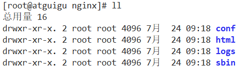

### 5、启动访问首页

①启动 Nginx 服务器

```shell
/usr/local/nginx/sbin/nginx
```

②访问 Nginx 服务器

Nginx 服务器默认监听 80 端口。

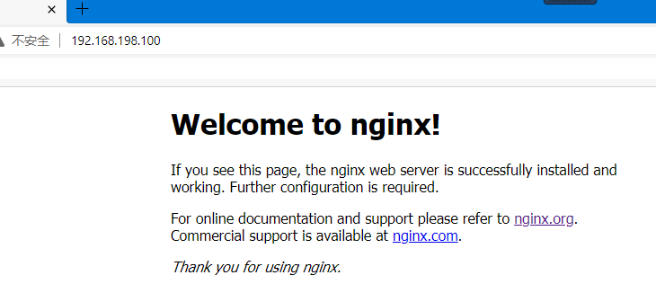

③停止 Nginx 服务器

```shell
/usr/local/nginx/sbin/nginx -s stop
```

④重新加载配置文件

```shell
/usr/local/nginx/sbin/nginx -s reload
```

## 三、Nginx 配置文件

### 1、大致说明

Nginx 包含很多配置文件，但是主要配置文件是：/usr/local/nginx/conf/nginx.conf。去掉全部注释后，配置文件的主体结构为：

```
worker_processes  1;

events {
    worker_connections  1024;
}

http {
    include       mime.types;
    default_type  application/octet-stream;

    sendfile        on;
    keepalive_timeout  65;

    server {
        listen       80;
        server_name  localhost;
        location / {
            root   html;
            index  index.html index.htm;
        }
        error_page   500 502 503 504  /50x.html;
        location = /50x.html {
            root   html;
        }
    }
}
```

### 2、全局块

从配置文件开始到 events 块之间的内容，主要会设置一些影响 Nginx 服务器整体运行的配置指令。主要包括配置运行 Nginx 服务器的用户（组）、允许生成的 worker process 数，进程 PID 文件存放路径、日志文件存放路径和类型以及配置文件的引入等。
比如上面第一行配置的：

```
worker_processes  1;
```

这是 Nginx 服务器并发处理服务的关键配置，制约。

配置举例：

```
#user  nobody;
worker_processes  1;

# 错误日志文件保存的位置以及日志的级别
#error_log  logs/error.log;
error_log  logs/error.log  notice;
#error_log  logs/error.log  info;

# PID 文件保存的位置
pid        logs/nginx.pid;
```

### 3、events 块

events 块涉及的指令主要影响 Nginx 服务器与用户的网络连接，常用的设置包括是否开启对多 work process 下的网络连接进行序列化，是否允许同时接收多个网络连接，选取哪种事件驱动模型来处理连接请求，每个 work process 可以同时支持的最大连接数等。这部分的配置对 Nginx 的性能影响较大，在实际中应该灵活配置。

```
events {
    worker_connections  1024;
}
```

上述例子就表示每个 work process 支持的最大连接数为 1024。

当前 Nginx 服务器能够处理的并发请求数量 = 每个工作进程能够处理的最大连接数 × 工作进程数量

### 4、http 块

Nginx 服务器配置中最频繁的部分，代理、缓存和日志定义等绝大多数功能和第三方模块的配置都在这里。

①http 全局块

http 全局块配置的指令包括文件引入、MIME-TYPE 定义、日志自定义、连接超时时间、单链接请求数上限等。

②server 块

#### [1]虚拟主机

虚拟主机字面意思就是虚拟出来的主机。而这里的主机指的是网站服务器。小型、微型的网站考虑成本没有必要租用整台主机，所以虚拟主机提供了运行小型网站的基本配置，可以用来直接部署运行小型网站（PHP 网站或静态网站）。虚拟主机从用户角度看，和一台独立的硬件主机是完全一样的，该技术的产生是为了节省互联网服务器硬件成本。

而 server 块就是主要负责配置虚拟主机。每个 http 块可以包括多个 server 块，而每个 server 块就相当于一个虚拟主机。

每个 server 块又分成『location 块』部分。

#### [2]server 全局块

配置举例如下：

```
    server {
    	# 本虚拟主机监听的端口号
        listen       80;
        
        # 本虚拟主机的名称
        server_name  localhost;

		# 本虚拟主机的字符集设置
        #charset koi8-r;

		# 本虚拟主机专属的访问日志设置
        #access_log  logs/host.access.log  main;
```

#### [3]location 块

一个 server 块可以配置多个 location 块。这块的主要作用是基于 Nginx  服务器接收到的请求字符串（例如 server_name/uri-string），对虚拟主机名称（也可以是IP别名）之外的字符串（例如 前面的 /uri-string）进行匹配，对特定的请求进行处理。地址定向、数据缓存和应答控制等功能，还有许多第三方模块的配置也在这里进行。


### 5、小结

配置文件结构：

* 全局块
* events 块
* http 块
  + http 全局块
  + server 块（可以有多个）
    - server 全局块
    - location 块（可以有多个）
## 四、反向代理

### 1、概念

①正向代理

代理内网，访问外网

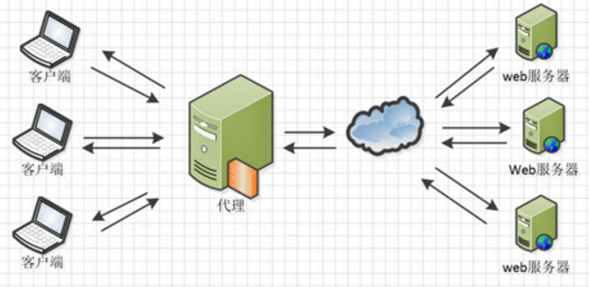

::: tip 提示

局域网中只有一台电脑能够上外网，那么就在这台电脑上安装代理服务器端程序。不能上外网的电脑连到这个代理程序，通过代理服务器上外网。

这里代理服务器做的是一个『请求转发』的操作。

:::

②反向代理

代理外网，访问内网。

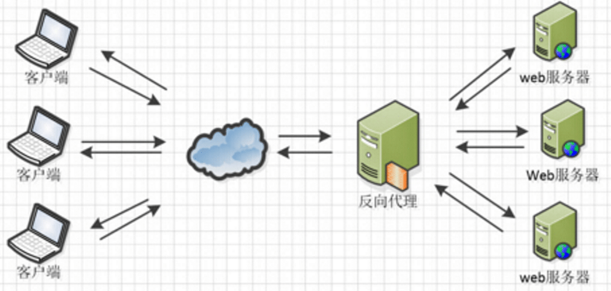

::: tip 提示

其实客户端对代理是无感知的，因为客户端不需要任何配置就可以访问，我们只需要将请求发送到反向代理服务器，由反向代理服务器去选择目标服务器获取数据后，再返回给客户端，此时反向代理服务器和目标服务器对外就是一个服务器，暴露的是代理服务器地址，隐藏了真实服务器IP地址。

:::

### 2、操作

①简单配置

让 Nginx 为 Tomcat 做代理，也就是通过 Nginx 访问 Tomcat。

#### [1]启动Tomcat

在 Linux 系统中，Tomcat 的 tar 包解压即可启动。但是前提是必须正确配置了 JDK。JDK所需配置如下：

```shell
# 在/etc/profile文件末尾加入如下配置：
# 声明 JAVA_HOME 环境变量，等号两边不能有空格
JAVA_HOME=/opt/jdk1.8.0_121

# 给 PATH 环境变量附加 $JAVA_HOME/bin 部分
# $PATH 表示引用 PATH 环境变量以前的旧值
# 使用英文冒号连接
# $JAVA_HOME 表示对 JAVA_HOME 变量的引用
# $JAVA_HOME/bin 表示指向可执行文件
PATH=$JAVA_HOME/bin:$PATH

# 发布
# 发布是发布变量名，不是引用变量的值，所以前面不写 $ 符号
export JAVA_HOME PATH
```

启动 Tomcat 的命令：

```shell
/opt/apache-tomcat-7.0.75/bin/startup.sh
```

通过浏览器访问：

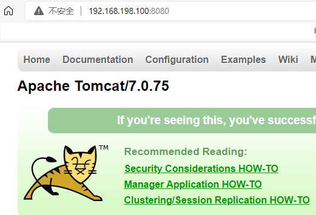

#### [2]配置Nginx

```shell
# 实验一：配置简单的反向代理
server {
    # 监听的端口号
    listen 1111;
    
    # server_name 不仅仅是当前虚拟主机的名称，而且是要和请求地址的IP地址部分进行匹配
    # localhost 和 127.0.0.1 都代表本机；也可以写域名。
    server_name www.atguigu.shuai;

    # 配置 location 部分
    # / 代表域名（或IP地址）:端口号之后服务器的根目录
    location / {
        # proxy是代理的意思；pass是传送的意思；合起来，proxy_pass是请求转发的意思。
        # 现在这个具体配置的意思就是 Nginx 接收到请求后，将这个请求转发给 Linux 本机的 Tomcat 服务器。
        proxy_pass http://localhost:8080;
        
        # index 配置默认的欢迎页
        index index.jsp index.html index.htm;
    }
}
```

::: warning 注意

编写配置文件时，注意 Nginx 要求的语法：

* 大括号必须成对出现。
* 每一行单独的配置结尾都必须有分号。

如果分号缺失会提示：nginx: [emerg] unexpected "}" in /usr/local/nginx/conf/nginx.conf:136

如果大括号缺失会提示：nginx: [emerg] unexpected end of file, expecting "}" in /usr/local/nginx/conf/nginx.conf:139

:::

#### [3]配置域名映射

本来应该是由 DNS 服务器来实现从域名到 IP 地址的映射。我们自己搭建 DNS 服务器又太麻烦，所以我们直接在 Windows 本地来直接配置。

这个功能本来应该通过 C:\Windows\System32\drivers\etc 文件来配置。但是这个文件所在目录很深，又需要管理员权限，所以操作很不方便。所以借助一个工具软件完成：SwitchHosts.exe

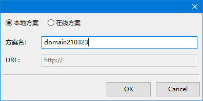

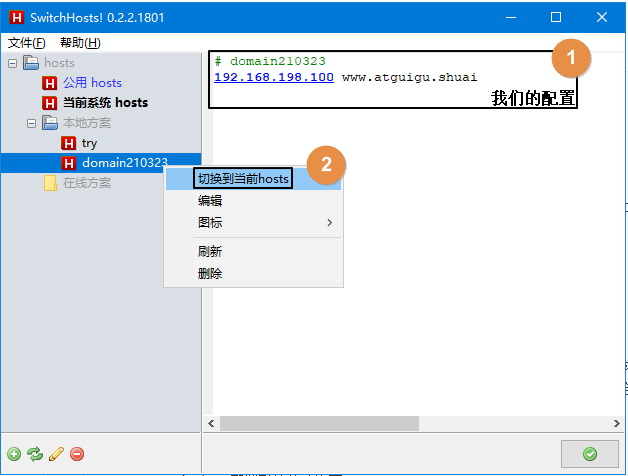

②进阶配置

location 块的进一步语法：

```shell
location [ = | ~ | ~* | ^~ ] uri {

}
```

::: tip 提示

1、= ：用于不含正则表达式的 uri 前，要求请求字符串与 uri 严格匹配，如果匹配成功，就停止继续向下搜索并立即处理该请求。

2、~：用于表示 uri 区分大小写。

3、~*：用于表示 uri 不区分大小写。

4、^~：用于不含正则表达式的 uri 前，要求 Nginx 服务器找到标识 uri 和请求字符串匹配度最高的 location 后，立即使用此 location 处理请求，而不再使用 location 块中的正则 uri 和请求字符串做匹配。

注意：如果 uri 包含正则表达式，则必须要有 ~ 或者 ~* 标识。

:::

#### [1]使用等号的情况

```shell
    # 实验二：使用=形式的location
    server {
        listen 2222;
        server_name www.atguigu.shuai;

        # = 号表示请求地址和后面的 / 完全相等时，匹配当前location
        location = / {
            proxy_pass http://localhost:8080;
            index index.jsp;
        }
    }
```

效果是：能够访问 Tomcat 首页，其他资源无法访问。

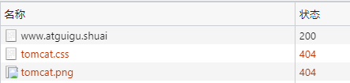

#### [2]使用正则表达式的情况

##### (1)配置Tomcat

启动两个 Tomcat，为了端口号不重复，需要设计两套：

Tomcat A：8180、8105、8109

Tomcat B：8280、8205、8209

具体操作是：

* 先把纯净的 Tomcat 解压目录复制出来两套。

* 分别修改两个 Tomcat 的端口号。
* 然后在 webapps 目录下根据测算需要创建所需资源。

最终需要达到的效果是有如下访问地址：

http://192.168.198.100:8180/aaa/one/

http://192.168.198.100:8180/aaa/two/

http://192.168.198.100:8280/bbb/one/

http://192.168.198.100:8280/bbb/two/

##### (2)配置Nginx

```shell
    # 实验三：使用~匹配正则表达式的location
    server {
        listen 3333;
        server_name www.atguigu.shuai;
    
        # ~ 表示解析后面 URI 地址中的正则表达式
        # 这里要求先有可以访问的资源，然后再用正则表达式匹配资源的访问地址
        location ~ /aaa/ {
            proxy_pass http://localhost:8180;
            index index.jsp;
        }
    
        location ~ /bbb/ {
            proxy_pass http://localhost:8280;
            index index.jsp;
        }
    }
```

通过 Nginx 访问 Tomcat 资源时使用的地址：

http://www.atguigu.shuai:3333/aaa/one/

http://www.atguigu.shuai:3333/aaa/two/

http://www.atguigu.shuai:3333/bbb/one/

http://www.atguigu.shuai:3333/bbb/two/

#### [3]不用正则表达式的情况

Tomcat 还是访问实验一的 8080 的 Tomcat。下面是 Nginx 的配置：

```shell
    # 实验四：测试 ^~ 符号，表示不匹配正则表达式的情况
    server {
        listen 4444;
        server_name www.atgugu.shuai;

        # 表示匹配 / 地址，而且可以访问 / 下的资源
        location ^~ / {
            proxy_pass http://localhost:8080;
            index index.jsp;
        }
    }
```

## 五、负载均衡

### 1、概念

访问量太大，一个 Tomcat 扛不住，所以就搭建 Tomcat 集群。让集群中的多个 Tomcat 服务器实例分担负载。

::: tip 提示

纵向扩容和横向扩容：

* 纵向扩容：给单台服务器提升硬件的配置。例如：提升 CPU、增加内存、扩大带宽、扩大硬盘容量等等。有极限存在，很容易就达到瓶颈。所以系统整体的性能不能单独靠纵向扩容来实现。
* 横向扩容：为了更进一步突破系统整体的瓶颈，增加服务器实例，构成集群，实现横向扩容。

集群和分布式：

* 相同点：都需要用到多台服务器
* 不同点：
  + 集群 cluster（同构）：每个服务器实例上运行的是项目的同一个模块
  + 分布式 distribution（异构）：项目整体拆分模块后，每个模块在自己独立的服务器上运行，而且模块之间可以互相访问

:::

### 2、搭建

①计划

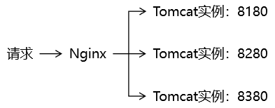

②准备 Tomcat

略

③配置 Nginx

```shell
    # 实验五：测试负载均衡
    server {
        listen 5555;
        server_name www.atguigu.shuai;
        location / {
            proxy_pass http://yanzu_balance;
            index index.jsp;
        }
    }

    # upstream 代表上游服务器
    upstream yanzu_balance {
        server localhost:8180;
        server localhost:8280;
        server localhost:8380;
    }
```

### 3、负载均衡策略

①轮询（默认）

每个请求按时间顺序逐一分配到不同的后端服务器，如果后端服务器down掉，能自动剔除。

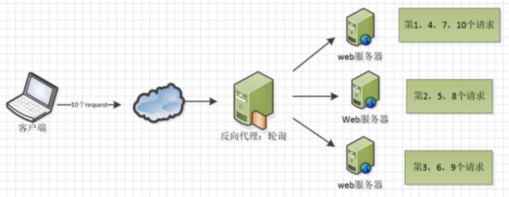

②权重

权重越高的服务器实例，分担越大的负载量。所以硬件配置较好的服务器应该设置较高的权重。

```shell
    # upstream 代表上游服务器
    upstream yanzu_balance {
        # 负载均衡策略：weight 配置指定当前服务器实例的权重
        server localhost:8180 weight=1;
        server localhost:8280 weight=2;
        server localhost:8380 weight=70;
    }
```

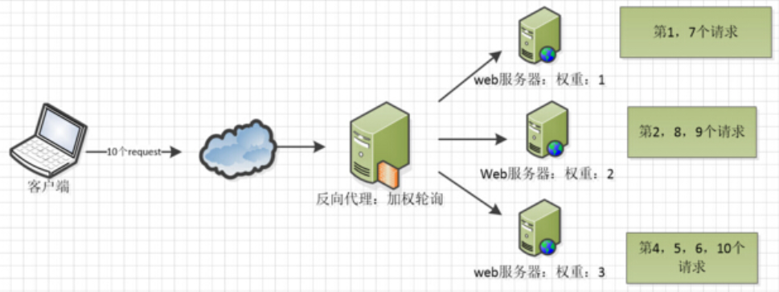

③ip_hash

根据每个请求的 IP 地址，进行哈希运算，得到一个固定值。再根据这个固定值，唯一定位到一个具体的服务器实例。这样一来，这个用户的请求就是由一个固定的服务器实例来处理。

* 优势：没有 Session 不一致问题。
* 局限性：固定服务器实例如果宕机，那么这台服务器上保存的 Session 信息会丢失。

```shell
    # upstream 代表上游服务器
    upstream yanzu_balance {

        # 负载均衡策略：ip_hash，固定ip由固定服务器实例处理
        ip_hash;
        server localhost:8180;
        server localhost:8280;
        server localhost:8380;
    }
```

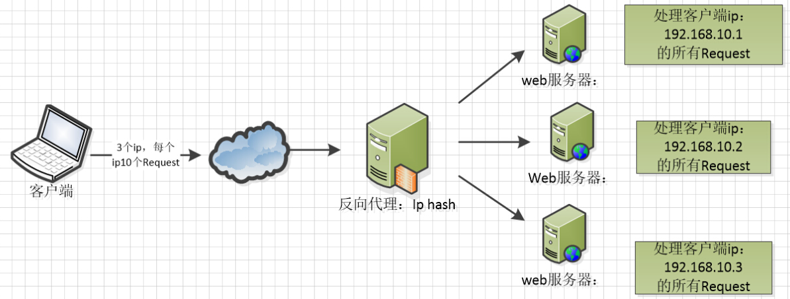

④fair

需要借助其他 Nginx 模块实现功能。fair 采用的不是内建负载均衡使用的轮换的均衡算法，而是可以根据页面大小、加载时间长短智能的进行负载均衡。需额外安装模块。最终效果是能够按后端服务器的响应时间来分配请求，响应时间短的优先分配。

```shell
    upstream yanzu_balance {

        # 负载均衡策略：fair
        fair;
        server localhost:8180;
        server localhost:8280;
        server localhost:8380;
    }
```

⑤其他参数

* down

```shell
    upstream yanzu_balance {
        server localhost:8180 down;
        server localhost:8280;
        server localhost:8380;
    }
```

表示当前服务器实例处于宕机状态，不工作，不参与负载均衡。

* backup

```shell
    upstream yanzu_balance {
        server localhost:8180;
        server localhost:8280 backup;
        server localhost:8380;
    }
```

表示当前服务器是备份机，在其他非备份机停止工作时，才工作。所以通常情况下它的负载压力最小。

## 六、动静分离

### 1、概念

①动态请求和静态请求

* 动态请求：需要由 Java 程序来处理的请求。
* 静态请求：访问静态资源，不需要 Java 程序处理的请求。

②实现方案

* 方案一：纯粹把静态文件独立成单独的域名，放在独立的服务器上，也是目前主流推崇的方案。
* 方案二：动态跟静态文件混合在一起发布，通过 Nginx 来分开。

### 2、操作

①准备工作

* 在 Linux 系统中创建目录用来保存静态资源文件。
  + /data/images/mi.jpg
  + /data/www/index.html

* 在 Nginx 中配置对这些静态资源的映射

```shell
    # 实验六：动静分离
    # 配置对静态资源的映射
    server {
        listen 7777;
        server_name www.atguigu.shuai;

        location / {
            root html;
            index index.html;
        }

        # 当用户通过 Nginx 访问 /images/ 目录下的内容时，参考这个 location 配置
        location /images/ {
            # root 表示指定静态资源所在的根目录 
            root /data/;

            # 开启 autoindex 功能，可以在页面上显示目录的内容
            autoindex on;
        }

        # 当用户通过 Nginx 访问 /www/ 目录下的内容时，参考这个 location 配置
        location /www/ {
            root /data/;
            autoindex on;
            index index.html index.htm;
        }

    }
```

* 在 Tomcat 中准备 JSP 页面

```
<%@ page contentType="text/html;charset=UTF-8" language="java" %>
<html>
<head>
    <title>Title</title>
</head>
<body>

    <h1>JSP 页面</h1>
    

</body>
</html>
```

现在在这个 JSP 页面中，/images/mi.jpg 路径并不是按照 Tomcat 上运行的 Web 应用来编写的。而是按照通过 Nginx 访问静态资源的规则，编写的路径。

②配置 Nginx 访问动态资源

```shell
        # 配置 location 访问 Tomcat
        location / {
            proxy_pass http://localhost:8080;
            index index.jsp;
        }
```

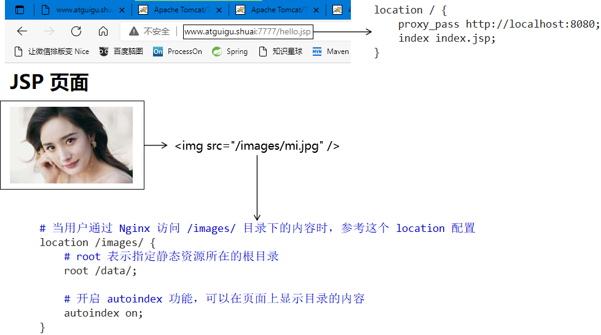

③Nginx 中的总体配置

```shell
    # 实验六：动静分离
    # 配置对静态资源的映射
    server {
        listen 7777;
        server_name www.atguigu.shuai;

        # 配置 location 访问 Tomcat
        location / {
            proxy_pass http://localhost:8080;
            index index.jsp;
        }

        # 当用户通过 Nginx 访问 /images/ 目录下的内容时，参考这个 location 配置
        location /images/ {
            # root 表示指定静态资源所在的根目录 
            root /data/;

            # 开启 autoindex 功能，可以在页面上显示目录的内容
            autoindex on;
        }

        # 当用户通过 Nginx 访问 /www/ 目录下的内容时，参考这个 location 配置
        location /www/ {
            root /data/;
            autoindex on;
            index index.html index.htm;
        }

    }
```
