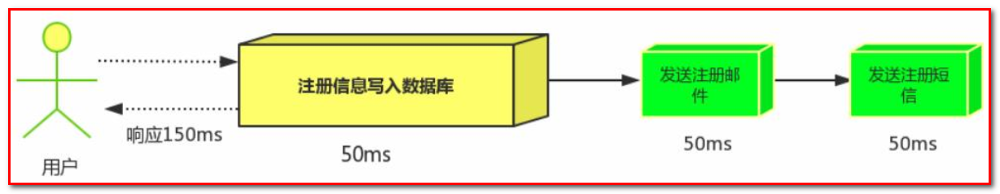
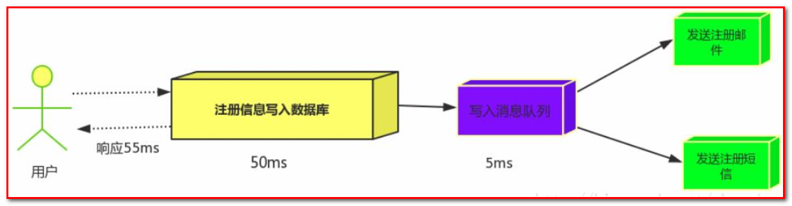
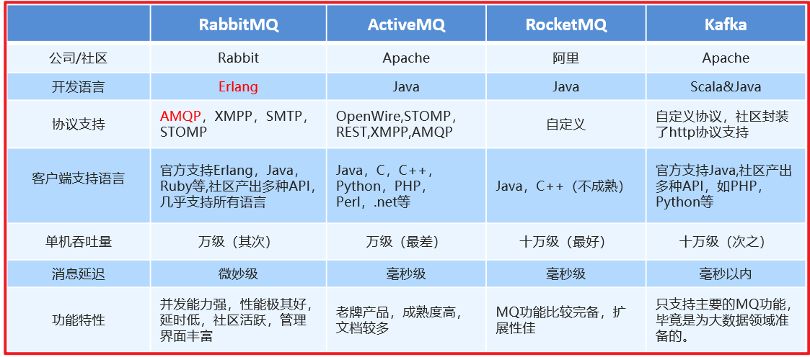
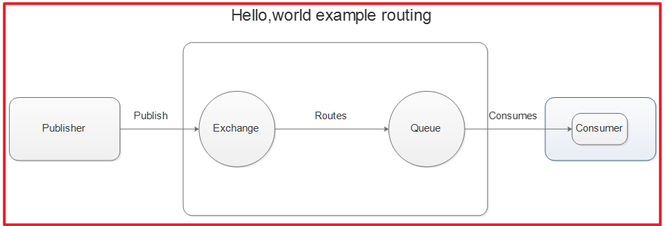
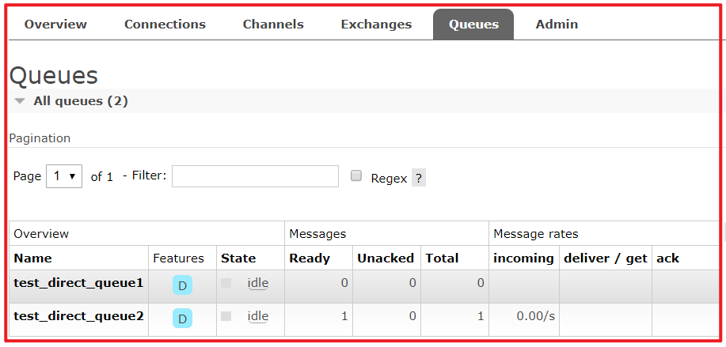
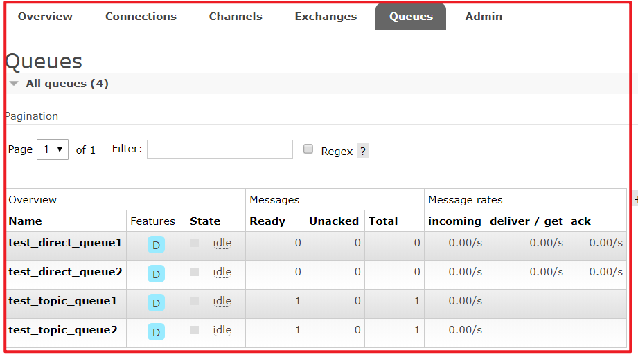
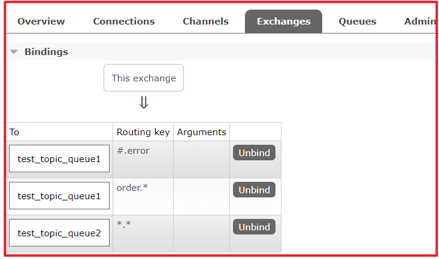

# RabbitMQ 第一天

百度华为面试题
MQ适用于哪些业务场景？MQ有什么用？MQ的优点和缺点都有哪些？

啥是MQ

A：你能给我解释了下MQ吗？

B：MQ就是消息队列。

A：嗯，不错，然后呢？

B：没了。

A：……

MQ，英文全拼为message queue，直译为消息队列。简单的理解，它就是一个容器。但是，当它作为一门技术时，就有了一些展开的问题。比如说，怎么存放？谁往进放？放进去又有什么用呢？Java里，MQ代表的是一门完整的技术。

那么，如何在深入技术之前，有逼格的介绍一下MQ呢？不妨从以下几个问题入手：

1． MQ经常应用于哪些业务场景？

2． MQ的缺点有哪些？

3． 常用的MQ组件有哪些？

MQ（消息队列）
MQ全称为Message Queue, 消息队列(MQ)是一种应用程序对应用程序的通信方法。

介绍：消息队列就是基础数据结构中的“先进先出”的一种数据机构。想一下，生活中买东西，需要排队，先排的人先买消费，就是典型的“先进先出”。


消息传递：指的是程序之间通过在消息中发送数据进行通信，而不是通过直接调用彼此来通信，直接调用通常是用于诸如远程过程调用的技术。

排队：指的是应用程序通过队列来通信。

为什么会产生消息MQ
随着微服务架构的流行，MQ成了解决微服务之间问题的常用工具。

以电商应用为例，应用中有订单系统、库存系统、物流系统、支付系统。用户创建订单后，如果耦合调用库存系统、物流系统、支付系统，任何一个子系统出了故障，都会造成下单操作异常。

当转变成基于消息队列的方式后，系统间调用的问题会减少很多，比如物流系统因为发生故障，需要几分钟来修复。在这几分钟的时间里，物流系统要处理的内存被缓存在消息队列中，用户的下单操作可以正常完成。当物流系统恢复后，继续处理订单信息即可，中单用户感受不到物流系统的故障。提升系统的可用性。


不同进程（process）之间传递消息时，两个进程之间耦合程度过高，改动一个进程，引发必须修改另一个进程，为了隔离这两个进程，在两进程间抽离出一层（一个模块），所有两进程之间传递的消息，都必须通过消息队列来传递，单独修改某一个进程，不会影响另一个；

不同进程（process）之间传递消息时，为了实现标准化，将消息的格式规范化了，并且，某一个进程接受的消息太多，一下子无法处理完，并且也有先后顺序，必须对收到的消息进行排队，因此诞生了事实上的消息队列；

在项目中，可将一些无需即时返回且耗时的操作提取出来，进行**异步处理**，而这种异步处理的方式大大的节省了服务器的请求响应时间，从而**提高**了**系统**的**吞吐量**。

消息队列应用场景
首先我们先说一下消息中间件的主要的作用:

　　[1]异步处理

　　[2]解耦服务

　　[3]流量削峰

上面的三点是我们使用消息中间件最主要的目的.

应用解耦
以电商应用为例，应用中有订单系统、库存系统、物流系统、支付系统。用户创建订单后，如果耦合调用库存系统、物流系统、支付系统，任何一个子系统出了故障，都会造成下单操作异常。

当转变成基于消息队列的方式后，系统间调用的问题会减少很多，比如物流系统因为发生故障，需要几分钟来修复。在这几分钟的时间里，物流系统要处理的内存被缓存在消息队列中，用户的下单操作可以正常完成。当物流系统恢复后，继续处理订单信息即可，中单用户感受不到物流系统的故障。提升系统的可用性。

传统模式:


传统模式的缺点：

系统间耦合性太强，如上图所示，系统A在代码中直接调用系统B和系统C的代码，如果将来D系统接入，系统A还需要修改代码，过于麻烦！
中间件模式:


中间件模式的的优点：

将消息写入消息队列，需要消息的系统自己从消息队列中订阅，从而系统A不需要做任何修改。
异步处理
场景说明：用户注册后，需要发注册邮件和注册短信, 传统的做法有两种

1. 串行的方式; 

2. 并行的方式

(1)串行方式: 将注册信息写入数据库后, 发送注册邮件, 再发送注册短信, 以上三个任务全部完成后才返回给客户端。 这有一个问题是, 邮件, 短信并不是必须的, 它只是一个通知, 而这种做法让客户端等待没有必要等待的东西.



(2)并行方式: 将注册信息写入数据库后, 发送邮件的同时, 发送短信, 以上三个任务完成后, 返回给客户端, 并行的方式能提高处理的时间。


假设三个业务节点分别使用50ms, 串行方式使用时间150ms, 并行使用时间100ms。虽然并性已经提高的处理时间, 但是, 前面说过, 邮件和短信对我正常的使用网站没有任何影响，客户端没有必要等着其发送完成才显示注册成功, 英爱是写入数据库后就返回.

(3)消息队列
引入消息队列后，把发送邮件, 短信不是必须的业务逻辑异步处理



由此可以看出, 引入消息队列后，用户的响应时间就等于写入数据库的时间+写入消息队列的时间(可以忽略不计), 

引入消息队列后处理后, 响应时间是串行的3倍, 是并行的2倍。

传统模式的缺点：

一些非必要的业务逻辑以同步的方式运行，太耗费时间。
中间件模式的的优点：

将消息写入消息队列，非必要的业务逻辑以异步的方式运行，加快响应速度
流量削峰
流量削峰一般在秒杀活动中应用广泛
场景: 秒杀活动，一般会因为流量过大，导致应用挂掉, 为了解决这个问题，一般在应用前端加入消息队列。
作用:

1. 可以控制活动人数，超过此一定阀值的订单直接丢弃(我为什么秒杀一次都没有成功过呢^^)

2. 可以缓解短时间的高流量压垮应用(应用程序按自己的最大处理能力获取订单)

以电商中的秒杀场景为例，采用同步处理：

用户点击秒杀
调用订单服务，验证库存、锁定库存
跳转到支付页面进行支付
分析一下，存在的问题：

验证库存、锁定库存会访问数据库
秒杀场景，商品数量有限，请求量非常大，每个请求来了都做以上处理，直接会把数据库压垮，导致数据库无法对外提供服务，数据库的不可用直接导致整个业务的不可用，秒杀活动打水漂。
大量请求会同时到达，同时去访问数据库，数据库连接有限，导致很多请求会处于等待状态，导致并发性能急剧下降
大量用户同时操作库存，存在争抢数据库锁的情况，容易导致死锁
秒杀中数量一般是有限，大量用户抢购，其实最终只有很少的用户能够抢购到
大家都有在银行办理业务的经验，银行处理业务的流程：**领号、排队、等待叫号办理业务**。

秒杀中我们也可以参考银行办理业务的流程：

用户点击描述
系统接受到用户请求后，生成一个唯一的编号，然后投递一条消息（秒杀下单）到mq
响应用户：秒杀正在处理中
秒杀系统从mq中拉取消息进行处理，处理完成之后告知用户，这步操作对于用户来说是异步处理的过程
从上面可以看出，从接受用户请求到响应用户请求，未访问数据库，只有生成编号和发送消息的操作，这部分处理速度是非常快的，不存在性能的问题，数据库也不存在压力的问题了，所有用户的请求都被作为一条消息投递到mq进行异步处理；从而解决了秒杀中同步处理遇到的各种问题。

传统模式

如订单系统，在下单的时候就会往数据库写数据。但是数据库只能支撑每秒1000左右的并发写入，并发量再高就容易宕机。低峰期的时候并发也就100多个，但是在高峰期时候，并发量会突然激增到5000以上，这个时候数据库肯定卡死了。


传统模式的缺点：

并发量大的时候，所有的请求直接怼到数据库，造成数据库连接异常
中间件模式:

消息被MQ保存起来了，然后系统就可以按照自己的消费能力来消费，比如每秒1000个数据，这样慢慢写入数据库，这样就不会卡死数据库了。


中间件模式的的优点：

系统A慢慢的按照数据库能处理的并发量，从消息队列中慢慢拉取消息。在生产中，这个短暂的高峰期积压是允许的。

流量削峰也叫做削峰填谷

使用了MQ之后，限制消费消息的速度为1000，但是这样一来，高峰期产生的数据势必会被积压在MQ中，高峰就被“削”掉了。但是因为消息积压，在高峰期过后的一段时间内，消费消息的速度还是会维持在1000QPS，直到消费完积压的消息, 这就叫做“填谷”


### 1.1.1 什么是QPS, PV
QPS

QPS即每秒查询率，是对一个特定的查询服务器在规定时间内所处理流量多少的衡量标准。

每秒查询率

因特网上，经常用每秒查询率来衡量域名系统服务器的机器的性能，即为QPS。

或者理解：每秒的响应请求数，也即是最大吞吐能力。

计算关系：

QPS = 并发量 / 平均响应时间

并发量 = QPS * 平均响应时间

原理：每天80%的访问集中在20%的时间里，这20%时间叫做峰值时间。

公式：( 总PV数*80%)/(每天秒数*20% ) = 峰值时间每秒请求数(QPS) 。

机器：峰值时间每秒QPS / 单台机器的QPS = 需要的机器 。

### 1.1.2 什么是PV , UV , PR
① 什么是pv　　

PV(page view)，即页面浏览量，或点击量；通常是衡量一个网络新闻频道或网站甚至一条网络新闻的主要指标。

对pv的解释是，一个访问者在24小时(0点到24点)内到底看了你网站几个页面。这里需要强调：同一个人浏览你网站同一个页面，不重复计算pv量，点100次也算1次。说白了，pv就是一个访问者打开了你的几个页面。

PV之于网站，就像收视率之于电视，从某种程度上已成为投资者衡量商业网站表现的最重要尺度。

pv的计算：当一个访问着访问的时候，记录他所访问的页面和对应的IP，然后确定这个IP今天访问了这个页面没有。如果你的网站到了23点，单纯IP有60万条的话，每个访问者平均访问了3个页面，那么pv表的记录就要有180万条。

② 什么是uv
uv(unique visitor)，指访问某个站点或点击某条新闻的不同IP地址的人数。

在同一天内，uv只记录第一次进入网站的具有独立IP的访问者，在同一天内再次访问该网站则不计数。独立IP访问者提供了一定时间内不同观众数量的统计指标，而没有反应出网站的全面活动。

③ 什么是ＰＲ值
　　PR值，即PageRank，网页的级别技术，用来标识网页的等级/重要性。级别从1到10级，10级为满分。PR值越高说明该网页越受欢迎（越重要）。

　　例如：一个PR值为1的网站表明这个网站不太具有流行度，而PR值为7到10则表明这个网站非常受欢迎（或者说极其重要）。

MQ有哪些缺点？
了解了MQ的主要应用场景，那么，其缺点也是显而易见的。

1． 系统复杂性增加。毕竟是增加了一个中间件MQ，那么系统变得更复杂，就是不可避免的。但是，与其说是系统复杂性增加，不如说是给相关开发人员带来的新的学习成本。但是，一项技术本身就是这样，学时很痛苦，学会了，它就会变成一把利剑，帮助您开疆辟土。

2． 系统可用性降低。假设一个系统由若干个节点链式组成，每个节点出问题的概率是相同的，那么，20个节点的系统出问题的概率显然要高于10个节点的系统。所以，从这个角度来看，毕竟是增加了一个MQ中间件，出问题的概率显然会增大，系统可用性就会降低。

1.2. AMQP 和 JMS
MQ是消息通信的模型；实现MQ的大致有两种主流方式：AMQP、JMS。

### 1.2.1. AMQP
AMQP是一种协议，更准确的说是一种binary wire-level protocol（链接协议）。这是其和JMS的本质差别，AMQP不从API层进行限定，而是直接定义网络交换的数据格式。

### 1.2.2. JMS
JMS即Java消息服务（JavaMessage Service）应用程序接口，是一个Java平台中关于面向消息中间件（MOM）的API，用于在两个应用程序之间，或分布式系统中发送消息，进行异步通信。

### 1.2.3. AMQP 与 JMS 区别
JMS是定义了统一的接口，来对消息操作进行统一；AMQP是通过规定协议来统一数据交互的格式
JMS限定了必须使用Java语言；AMQP只是协议，不规定实现方式，因此是跨语言的。
JMS规定了两种消息模式；而AMQP的消息模式更加丰富
1.3. 消息队列产品
市场上常见的消息队列有如下：

ActiveMQ：基于JMS
ZeroMQ：基于C语言开发
RabbitMQ：基于AMQP协议，erlang语言开发，稳定性好
RocketMQ：基于JMS，阿里巴巴产品
Kafka：类似MQ的产品；分布式消息系统，高吞吐量



1.4. RabbitMQ
RabbitMQ是由erlang语言开发，基于AMQP（Advanced Message Queue 高级消息队列协议）协议实现的消息队列，它是一种应用程序之间的通信方法，消息队列在分布式系统开发中应用非常广泛。

RabbitMQ官方地址： `http://www.rabbitmq.com/`

RabbitMQ提供了6种模式：简单模式，work模式，Publish/Subscribe发布与订阅模式，Routing路由模式，Topics主题模式，RPC远程调用模式（远程调用，不太算MQ；暂不作介绍）；

官网对应模式介绍： `https://www.rabbitmq.com/getstarted.html`


### 1.4.1 RabbitMQ简介
AMQP，即 Advanced
Message Queuing Protocol（高级消息队列协议），是一个网络协议，是应用层协议的一个开放标准，为面向消息的中间件设计。基于此协议的客户端与消息中间件可传递消息，并不受客户端/中间件不同产品，不同的开发语言等条件的限制。2006年，AMQP 规范发布。类比HTTP。



2007年，Rabbit 技术公司基于 AMQP 标准开发的 RabbitMQ 1.0 发布。RabbitMQ 采用 Erlang 语言开发。Erlang 语言由 Ericson 设计，专门为开发高并发和分布式系统的一种语言，在电信领域使用广泛。

RabbitMQ 基础架构如下图：


### 1.4.2 RabbitMQ 中的相关概念：
Broker：接收和分发消息的应用，RabbitMQ Server就是 Message Broker

Virtual host：出于多租户和安全因素设计的，把 AMQP 的基本组件划分到一个虚拟的分组中，类似于网络中的 namespace 概念。当多个不同的用户使用同一个 RabbitMQ server 提供的服务时，可以划分出多个vhost，每个用户在自己的 vhost 创建 exchange／queue 等

Connection：publisher／consumer 和 broker 之间的 TCP 连接

Channel：如果每一次访问 RabbitMQ 都建立一个 Connection，在消息量大的时候建立 TCP Connection的开销将是巨大的，效率也较低。Channel 是在 connection 内部建立的逻辑连接，如果应用程序支持多线程，通常每个thread创建单独的 channel 进行通讯，AMQP method 包含了channel id 帮助客户端和message broker 识别 channel，所以 channel 之间是完全隔离的。Channel 作为轻量级的 Connection 极大减少了操作系统建立 TCP connection 的开销

Exchange：message 到达 broker 的第一站，根据分发规则，匹配查询表中的 routing key，分发消息到queue 中去。常用的类型有：direct (point-to-point), topic (publish-subscribe) and fanout (multicast)

Queue：消息最终被送到这里等待 consumer 取走

Binding：exchange 和 queue 之间的虚拟连接，binding 中可以包含 routing key。Binding 信息被保存到 exchange 中的查询表中，用于 message 的分发依据

2. 安装及配置RabbitMQ

详细查看 资料/软件/安装RabbitMQ.md 文档。

安装完成访问：http://127.0.0.1:15672

3. RabbitMQ入门

官网： https://www.rabbitmq.com/

需求：使用简单模式完成消息传递

步骤：

① 创建工程（生成者、消费者）

② 分别添加依赖

③ 编写生产者发送消息

④ 编写消费者接收消息

## 3.1. 搭建示例工程
### 3.1.1. 创建工程
创建项目：rabbitmq-producer


创建项目：rabbitmq-consumer


### 3.1.2. 添加依赖
往两个rabbitmq的pom.xml文件中添加如下依赖：

```xml
<dependencies>

        <dependency>
            <groupId>com.rabbitmq</groupId>
            <artifactId>amqp-client</artifactId>
            <version>5.6.0</version>
        </dependency>
    </dependencies>

    <build>
        <plugins>
            <plugin>
                <groupId>org.apache.maven.plugins</groupId>
                <artifactId>maven-compiler-plugin</artifactId>
                <version>3.8.0</version>
                <configuration>
                    <source>1.8</source>
                    <target>1.8</target>
                </configuration>
            </plugin>
        </plugins>
    </build>
```

## 3.2. 编写生产者
编写消息生产者 com.atguigu.rabbitmq.simple. Producer

```java
package com.atguigu.rabbitmq.simple; 

import com.rabbitmq.client. Channel; 
import com.rabbitmq.client. Connection; 
import com.rabbitmq.client. ConnectionFactory; 

import java.util. Map; 

/**
 * Producer
 *
 * @Author: 马伟奇
 * @CreateTime: 2020-04-16
 * @Description:
 */
public class Producer {

    public static void main(String[] args) throws Exception {

        //创建连接工厂
        ConnectionFactory connectionFactory = new ConnectionFactory();
        //主机地址;默认为 localhost
        connectionFactory.setHost("localhost");
        //连接端口;默认为 5672
        connectionFactory.setPort(5672);
        //虚拟主机名称;默认为 /
        connectionFactory.setVirtualHost("/");
        //连接用户名；默认为guest
        connectionFactory.setUsername("guest");
        //连接密码；默认为guest
        connectionFactory.setPassword("guest");

        //创建连接
        Connection connection = connectionFactory.newConnection();

        // 创建频道
        Channel channel = connection.createChannel();

        // 声明（创建）队列
        /**
         * queue      参数1：队列名称
         * durable    参数2：是否定义持久化队列,当mq重启之后，还在
         * exclusive  参数3：是否独占本次连接
         *            ① 是否独占，只能有一个消费者监听这个队列
         *            ② 当connection关闭时，是否删除队列
         * autoDelete 参数4：是否在不使用的时候自动删除队列，当没有consumer时，自动删除
         * arguments  参数5：队列其它参数
         */

        channel.queueDeclare("simple_queue", true, false, false, null);

        // 要发送的信息
        String message = "你好；小兔子！";
        /**
         * 参数1：交换机名称，如果没有指定则使用默认Default Exchage
         * 参数2：路由key,简单模式可以传递队列名称
         * 参数3：配置信息
         * 参数4：消息内容
         */
        channel.basicPublish("", "simple_queue", null, message.getBytes());
        System.out.println("已发送消息：" + message);

        // 关闭资源
        channel.close();
        connection.close();
    }

}
```

运行程序：http://127.0.0.1:15672

在执行上述的消息发送之后；可以登录rabbitMQ的管理控制台，可以发现队列和其消息：


## 3.3. 编写消费者
编写消息的消费者 com.atguigu.rabbitmq.simple. Consumer

```java
package com.atguigu.rabbitmq.simple; 

import com.rabbitmq.client.*; 

import java.io. IOException; 
import java.util.concurrent. TimeoutException; 

/**
 * Consumer
 *
 * @Author: 马伟奇
 * @CreateTime: 2020-04-16
 * @Description:
 */
public class Consumer {

    public static void main(String[] args) throws Exception {

        //1.创建连接工厂
        ConnectionFactory factory = new ConnectionFactory();
        //2. 设置参数
        factory.setHost("localhost");//ip  默认值 localhost
        factory.setPort(5672); //端口  默认值 5672
        factory.setVirtualHost("/");//虚拟机 默认值/
        factory.setUsername("guest");//用户名 默认 guest
        factory.setPassword("guest");//密码 默认值 guest

        //3. 创建连接 Connection
        Connection connection = factory.newConnection();

        //4. 创建Channel
        Channel channel = connection.createChannel();

        //5. 创建队列Queue
        /*
        queueDeclare(String queue, boolean durable, boolean exclusive, boolean autoDelete, Map<String, Object> arguments)
        参数：

            1. queue：队列名称
            2. durable:是否持久化，当mq重启之后，还在
            3. exclusive：
                * 是否独占。只能有一个消费者监听这队列
                * 当Connection关闭时，是否删除队列
                *

            4. autoDelete:是否自动删除。当没有Consumer时，自动删除掉
            5. arguments：参数。
         */
        //如果没有一个名字叫hello_world的队列，则会创建该队列，如果有则不会创建
        channel.queueDeclare("simple_queue",true,false,false,null);

        // 接收消息
        DefaultConsumer consumer = new DefaultConsumer(channel){
            /*
               回调方法，当收到消息后，会自动执行该方法

               1. consumerTag：标识
               2. envelope：获取一些信息，交换机，路由key...
               3. properties:配置信息
               4. body：数据

            */
            @Override
            public void handleDelivery(String consumerTag, Envelope envelope, AMQP.BasicProperties properties, byte[] body) throws IOException {
                System.out.println("consumerTag："+consumerTag);
                System.out.println("Exchange："+envelope.getExchange());
                System.out.println("RoutingKey："+envelope.getRoutingKey());
                System.out.println("properties："+properties);
                System.out.println("body："+new String(body));
            }
        };
          /*
        basicConsume(String queue, boolean autoAck, Consumer callback)
        参数：

            1. queue：队列名称
            2. autoAck：是否自动确认 ,类似咱们发短信，发送成功会收到一个确认消息
            3. callback：回调对象
         */
        // 消费者类似一个监听程序，主要是用来监听消息
        channel.basicConsume("simple_queue",true,consumer);

   }
}
```

运行程序


## 3.4. 小结
上述的入门案例中中其实使用的是如下的简单模式：


在上图的模型中，有以下概念：

P：生产者，也就是要发送消息的程序
C：消费者：消息的接受者，会一直等待消息到来。
queue：消息队列，图中红色部分。类似一个邮箱，可以缓存消息；生产者向其中投递消息，消费者从其中取出消息。
4. AMQP
## 4.1. 相关概念介绍
AMQP 一个提供统一消息服务的应用层标准高级消息队列协议，是应用层协议的一个开放标准，为面向消息的中间件设计。

AMQP是一个二进制协议，拥有一些现代化特点：多信道、协商式，异步，安全，扩平台，中立，高效。

RabbitMQ是AMQP协议的Erlang的实现。

概念	说明
连接Connection	一个网络连接，比如TCP/IP套接字连接。
会话Session	端点之间的命名对话。在一个会话上下文中，保证“恰好传递一次”。
信道Channel	多路复用连接中的一条独立的双向数据流通道。为会话提供物理传输介质。
客户端Client	AMQP连接或者会话的发起者。AMQP是非对称的，客户端生产和消费消息，服务器存储和路由这些消息。
服务节点Broker	消息中间件的服务节点；一般情况下可以将一个RabbitMQ Broker看作一台RabbitMQ 服务器。
端点	AMQP对话的任意一方。一个AMQP连接包括两个端点（一个是客户端，一个是服务器）。
消费者Consumer	一个从消息队列里请求消息的客户端程序。
生产者Producer	一个向交换机发布消息的客户端应用程序。
## 4.2. RabbitMQ运转流程
在入门案例中：

生产者发送消息
生产者创建连接（Connection），开启一个信道（Channel），连接到RabbitMQ Broker；
声明队列并设置属性；如是否排它，是否持久化，是否自动删除；
将路由键（空字符串）与队列绑定起来；
发送消息至RabbitMQ Broker；
关闭信道；
关闭连接；
消费者接收消息
消费者创建连接（Connection），开启一个信道（Channel），连接到RabbitMQ Broker
向Broker 请求消费相应队列中的消息，设置相应的回调函数；
等待Broker回应闭关投递响应队列中的消息，消费者接收消息；
确认（ack，自动确认）接收到的消息；
RabbitMQ从队列中删除相应已经被确认的消息；
关闭信道；
关闭连接；


5. RabbitMQ工作模式
## 4.1. Work queues工作队列模式
### 4.1.1. 模式说明


Work Queues与入门程序的简单模式相比，多了一个或一些消费端，多个消费端共同消费同一个队列中的消息。

应用场景：对于 任务过重或任务较多情况使用工作队列可以提高任务处理的速度。

### 4.1.2. 代码
Work Queues与入门程序的简单模式的代码是几乎一样的；可以完全复制，并复制多一个消费者进行多个消费者同时消费消息的测试。

1）生产者

```java
package com.atguigu.rabbitmq.work; 

import com.rabbitmq.client. Channel; 
import com.rabbitmq.client. Connection; 
import com.rabbitmq.client. ConnectionFactory; 

/**
 * Producer
 *
 * @Author: 马伟奇
 * @CreateTime: 2020-04-16
 * @Description:
 */
public class Producer {

    static final String QUEUE_NAME = "work_queue"; 

    public static void main(String[] args) throws Exception {

        //创建连接工厂
        ConnectionFactory connectionFactory = new ConnectionFactory(); 
        //主机地址; 默认为 localhost
        connectionFactory.setHost("localhost"); 
        //连接端口; 默认为 5672
        connectionFactory.setPort(5672); 
        //虚拟主机名称; 默认为 /
        connectionFactory.setVirtualHost("/"); 
        //连接用户名；默认为guest
        connectionFactory.setUsername("guest"); 
        //连接密码；默认为guest
        connectionFactory.setPassword("guest"); 

        //创建连接
        Connection connection = connectionFactory.newConnection();

        // 创建频道
        Channel channel = connection.createChannel();

        //5. 创建队列Queue
        /*
        queueDeclare(String queue, boolean durable, boolean exclusive, boolean autoDelete, Map<String, Object> arguments)
        参数：

            1. queue：队列名称
            2. durable:是否持久化，当mq重启之后，还在
            3. exclusive：
                * 是否独占。只能有一个消费者监听这队列
                * 当Connection关闭时，是否删除队列
                *

            4. autoDelete:是否自动删除。当没有Consumer时，自动删除掉
            5. arguments：参数。
         */
        //如果没有一个名字叫hello_world的队列，则会创建该队列，如果有则不会创建
        channel.queueDeclare("work_queues",true,false,false,null);

        /*
        basicPublish(String exchange, String routingKey, BasicProperties props, byte[] body)
        参数：

            1. exchange：交换机名称。简单模式下交换机会使用默认的 ""
            2. routingKey：路由名称
            3. props：配置信息
            4. body：发送消息数据
         */
        for (int i = 1; i <= 10; i++) {
            String body = i+"hello rabbitmq```";

            //6. 发送消息
            channel.basicPublish("","work_queues",null,body.getBytes());
        }

        //7.释放资源
        channel.close();
        connection.close();
    }

}
```


2）消费者1

```java
package com.atguigu.rabbitmq.work; 

import com.rabbitmq.client.*; 

import java.io. IOException; 

/**
 * Consumer1
 *
 * @Author: 马伟奇
 * @CreateTime: 2020-04-16
 * @Description:
 */
public class Consumer1 {

    static final String QUEUE_NAME = "work_queue"; 

    public static void main(String[] args) throws Exception {

        //1.创建连接工厂
        ConnectionFactory factory = new ConnectionFactory();
        //2. 设置参数
        factory.setHost("localhost");//ip  默认值 localhost
        factory.setPort(5672); //端口  默认值 5672
        factory.setVirtualHost("/");//虚拟机 默认值/
        factory.setUsername("guest");//用户名 默认 guest
        factory.setPassword("guest");//密码 默认值 guest

        //3. 创建连接 Connection
        Connection connection = factory.newConnection();

        //4. 创建Channel
        Channel channel = connection.createChannel();

        //5. 创建队列Queue
        /*
        queueDeclare(String queue, boolean durable, boolean exclusive, boolean autoDelete, Map<String, Object> arguments)
        参数：

            1. queue：队列名称
            2. durable:是否持久化，当mq重启之后，还在
            3. exclusive：
                * 是否独占。只能有一个消费者监听这队列
                * 当Connection关闭时，是否删除队列
                *

            4. autoDelete:是否自动删除。当没有Consumer时，自动删除掉
            5. arguments：参数。
         */
        //如果没有一个名字叫hello_world的队列，则会创建该队列，如果有则不会创建
        channel.queueDeclare("work_queues",true,false,false,null);

        /*
        basicConsume(String queue, boolean autoAck, Consumer callback)
        参数：

            1. queue：队列名称
            2. autoAck：是否自动确认
            3. callback：回调对象
         */
        // 接收消息
        Consumer consumer = new DefaultConsumer(channel){
            /*
                回调方法，当收到消息后，会自动执行该方法

                1. consumerTag：标识
                2. envelope：获取一些信息，交换机，路由key...
                3. properties:配置信息
                4. body：数据
             */
            @Override
            public void handleDelivery(String consumerTag, Envelope envelope, AMQP.BasicProperties properties, byte[] body) throws IOException {
              /*  System.out.println("consumerTag："+consumerTag);
                System.out.println("Exchange："+envelope.getExchange());
                System.out.println("RoutingKey："+envelope.getRoutingKey());
                System.out.println("properties："+properties);*/
                System.out.println("body："+new String(body));
            }
        };
        channel.basicConsume("work_queues",true,consumer);
    }

}
```

3）消费者2

```java
package com.atguigu.rabbitmq.work; 

import com.rabbitmq.client.*; 

import java.io. IOException; 

/**
 * Consumer1
 *
 * @Author: 马伟奇
 * @CreateTime: 2020-04-16
 * @Description:
 */
public class Consumer2 {

    static final String QUEUE_NAME = "work_queue"; 

    public static void main(String[] args) throws Exception {

        //1.创建连接工厂
        ConnectionFactory factory = new ConnectionFactory();
        //2. 设置参数
        factory.setHost("localhost");//ip  默认值 localhost
        factory.setPort(5672); //端口  默认值 5672
        factory.setVirtualHost("/");//虚拟机 默认值/
        factory.setUsername("guest");//用户名 默认 guest
        factory.setPassword("guest");//密码 默认值 guest

        //3. 创建连接 Connection
        Connection connection = factory.newConnection();

        //4. 创建Channel
        Channel channel = connection.createChannel();

        //5. 创建队列Queue
        /*
        queueDeclare(String queue, boolean durable, boolean exclusive, boolean autoDelete, Map<String, Object> arguments)
        参数：

            1. queue：队列名称
            2. durable:是否持久化，当mq重启之后，还在
            3. exclusive：
                * 是否独占。只能有一个消费者监听这队列
                * 当Connection关闭时，是否删除队列
                *

            4. autoDelete:是否自动删除。当没有Consumer时，自动删除掉
            5. arguments：参数。
         */
        //如果没有一个名字叫hello_world的队列，则会创建该队列，如果有则不会创建
        channel.queueDeclare("work_queues",true,false,false,null);

        /*
        basicConsume(String queue, boolean autoAck, Consumer callback)
        参数：

            1. queue：队列名称
            2. autoAck：是否自动确认
            3. callback：回调对象
         */
        // 接收消息
        Consumer consumer = new DefaultConsumer(channel){
            /*
                回调方法，当收到消息后，会自动执行该方法

                1. consumerTag：标识
                2. envelope：获取一些信息，交换机，路由key...
                3. properties:配置信息
                4. body：数据
             */
            @Override
            public void handleDelivery(String consumerTag, Envelope envelope, AMQP.BasicProperties properties, byte[] body) throws IOException {
              /*  System.out.println("consumerTag："+consumerTag);
                System.out.println("Exchange："+envelope.getExchange());
                System.out.println("RoutingKey："+envelope.getRoutingKey());
                System.out.println("properties："+properties);*/
                System.out.println("body："+new String(body));
            }
        };
        channel.basicConsume("work_queues",true,consumer);
    }

}
```

运行两个消费者


### 4.1.3. 测试
启动两个消费者，然后再启动生产者发送消息；到IDEA的两个消费者对应的控制台查看是否竞争性的接收到消息。


### 4.1.4. 小结
在一个队列中如果有多个消费者，那么消费者之间对于同一个消息的关系是**竞争**的关系。
2. Work Queues 对于任务过重或任务较多情况使用工作队列可以提高任务处理的速度。例如：短信服务部署多个，只需要有一个节点成功发送即可。

## 4.2. 订阅模式类型
订阅模式示例图：


前面2个案例中，只有3个角色：

P：生产者，也就是要发送消息的程序
C：消费者：消息的接受者，会一直等待消息到来。
queue：消息队列，图中红色部分
而在订阅模型中，多了一个exchange角色，而且过程略有变化：

P：生产者，也就是要发送消息的程序，但是不再发送到队列中，而是发给X（交换机）
C：消费者，消息的接受者，会一直等待消息到来。
Queue：消息队列，接收消息、缓存消息。
Exchange：交换机，图中的X。一方面，接收生产者发送的消息。另一方面，知道如何处理消息，例如递交给某个特别队列、递交给所有队列、或是将消息丢弃。到底如何操作，取决于Exchange的类型。Exchange有常见以下3种类型：
Fanout：广播，将消息交给所有绑定到交换机的队列
Direct：定向，把消息交给符合指定routing key 的队列
Topic：通配符，把消息交给符合routing pattern（路由模式） 的队列
Exchange（交换机）只负责转发消息，不具备存储消息的能力，因此如果没有任何队列与Exchange绑定，或者没有符合路由规则的队列，那么消息会丢失！

## 4.3. Publish/Subscribe发布与订阅模式
### 4.3.1. 模式说明


发布订阅模式：
1、每个消费者监听自己的队列。
2、生产者将消息发给broker，由交换机将消息转发到绑定此交换机的每个队列，每个绑定交换机的队列都将接收
到消息

### 4.3.2. 代码
1）生产者

```java
package com.atguigu.rabbitmq.ps; 

import com.rabbitmq.client. BuiltinExchangeType; 
import com.rabbitmq.client. Channel; 
import com.rabbitmq.client. Connection; 
import com.rabbitmq.client. ConnectionFactory; 

/**
 * Producer
 *
 * @Author: 马伟奇
 * @CreateTime: 2020-04-16
 * @Description:
 */
public class Producer {
   

    public static void main(String[] args) throws Exception {

        //1.创建连接工厂
        ConnectionFactory factory = new ConnectionFactory();
        //2. 设置参数
        factory.setHost("localhost");//ip  默认值 localhost
        factory.setPort(5672); //端口  默认值 5672
        factory.setVirtualHost("/");//虚拟机 默认值/
        factory.setUsername("guest");//用户名 默认 guest
        factory.setPassword("guest");//密码 默认值 guest

        //3. 创建连接 Connection
        Connection connection = factory.newConnection();

        //4.  创建频道
        Channel channel = connection.createChannel();

           /*

       exchangeDeclare(String exchange, BuiltinExchangeType type, boolean durable, boolean autoDelete, boolean internal, Map<String, Object> arguments)
       参数：

        1. exchange:交换机名称
        2. type:交换机类型
            DIRECT("direct"),：定向
            FANOUT("fanout"),：扇形（广播），发送消息到每一个与之绑定队列。
            TOPIC("topic"),通配符的方式
            HEADERS("headers");参数匹配

        3. durable:是否持久化
        4. autoDelete:自动删除
        5. internal：内部使用。 一般false
        6. arguments：参数
        */

        String exchangeName = "test_fanout";
        //5. 创建交换机
        channel.exchangeDeclare(exchangeName, BuiltinExchangeType.FANOUT,true,false,false,null);
        //6. 创建队列
        String queue1Name = "test_fanout_queue1";
        String queue2Name = "test_fanout_queue2";
        channel.queueDeclare(queue1Name,true,false,false,null);
        channel.queueDeclare(queue2Name,true,false,false,null);
        //7. 绑定队列和交换机
        /*
        queueBind(String queue, String exchange, String routingKey)
        参数：

            1. queue：队列名称
            2. exchange：交换机名称
            3. routingKey：路由键，绑定规则
                如果交换机的类型为fanout ，routingKey设置为""
         */
        channel.queueBind(queue1Name,exchangeName,"");
        channel.queueBind(queue2Name,exchangeName,"");

        String body = "日志信息：张三调用了findAll方法...日志级别：info...";
        //8. 发送消息
        channel.basicPublish(exchangeName,"",null,body.getBytes());

        //9. 释放资源
        channel.close();
        connection.close();
    }

}
```

运行


2）消费者1

```java
package com.atguigu.rabbitmq.ps; 

import com.rabbitmq.client.*; 

import java.io. IOException; 

/**
 * Consumer1
 *
 * @Author: 马伟奇
 * @CreateTime: 2020-04-16
 * @Description:
 */
public class Consumer1 {

    //队列名称
    static final String FANOUT_QUEUE_1 = "fanout_queue_1"; 

    public static void main(String[] args) throws Exception {

        //1.创建连接工厂
        ConnectionFactory factory = new ConnectionFactory();
        //2. 设置参数
        factory.setHost("localhost");//ip  默认值 localhost
        factory.setPort(5672); //端口  默认值 5672
        factory.setVirtualHost("/");//虚拟机 默认值/
        factory.setUsername("guest");//用户名 默认 guest
        factory.setPassword("guest");//密码 默认值 guest

        //3. 创建连接 Connection
        Connection connection = factory.newConnection();

        //4. 创建Channel
        Channel channel = connection.createChannel(); 

        String queue1Name = "test_fanout_queue1"; 

        /*
        basicConsume(String queue, boolean autoAck, Consumer callback)
        参数：

            1. queue：队列名称
            2. autoAck：是否自动确认
            3. callback：回调对象
         */
        // 接收消息
        Consumer consumer = new DefaultConsumer(channel){
            /*
                回调方法，当收到消息后，会自动执行该方法

                1. consumerTag：标识
                2. envelope：获取一些信息，交换机，路由key...
                3. properties:配置信息
                4. body：数据
             */
            @Override
            public void handleDelivery(String consumerTag, Envelope envelope, AMQP.BasicProperties properties, byte[] body) throws IOException {
              /*  System.out.println("consumerTag："+consumerTag);
                System.out.println("Exchange："+envelope.getExchange());
                System.out.println("RoutingKey："+envelope.getRoutingKey());
                System.out.println("properties："+properties);*/
                System.out.println("body："+new String(body));
                System.out.println("将日志信息打印到控制台.....");
            }
        };
        channel.basicConsume(queue1Name,true,consumer);
    }

}
```

3）消费者2

```java
package com.atguigu.rabbitmq.ps; 

import com.rabbitmq.client.*; 

import java.io. IOException; 

/**
 * Consumer1
 *
 * @Author: 马伟奇
 * @CreateTime: 2020-04-16
 * @Description:
 */
public class Consumer1 {

    //队列名称
    static final String FANOUT_QUEUE_1 = "fanout_queue_1"; 

    public static void main(String[] args) throws Exception {

        //1.创建连接工厂
        ConnectionFactory factory = new ConnectionFactory();
        //2. 设置参数
        factory.setHost("localhost");//ip  默认值 localhost
        factory.setPort(5672); //端口  默认值 5672
        factory.setVirtualHost("/");//虚拟机 默认值/
        factory.setUsername("guest");//用户名 默认 guest
        factory.setPassword("guest");//密码 默认值 guest

        //3. 创建连接 Connection
        Connection connection = factory.newConnection();

        //4. 创建Channel
        Channel channel = connection.createChannel(); 

        String queue2Name = "test_fanout_queue2"; 

        /*
        basicConsume(String queue, boolean autoAck, Consumer callback)
        参数：

            1. queue：队列名称
            2. autoAck：是否自动确认
            3. callback：回调对象
         */
        // 接收消息
        Consumer consumer = new DefaultConsumer(channel){
            /*
                回调方法，当收到消息后，会自动执行该方法

                1. consumerTag：标识
                2. envelope：获取一些信息，交换机，路由key...
                3. properties:配置信息
                4. body：数据
             */
            @Override
            public void handleDelivery(String consumerTag, Envelope envelope, AMQP.BasicProperties properties, byte[] body) throws IOException {
              /*  System.out.println("consumerTag："+consumerTag);
                System.out.println("Exchange："+envelope.getExchange());
                System.out.println("RoutingKey："+envelope.getRoutingKey());
                System.out.println("properties："+properties);*/
                System.out.println("body："+new String(body));
                System.out.println("将日志信息打印到控制台.....");
            }
        };
        channel.basicConsume(queue2Name,true,consumer);
    }

}
```

### 4.3.3. 测试
启动所有消费者，然后使用生产者发送消息；在每个消费者对应的控制台可以查看到生产者发送的所有消息；到达**广播**的效果。

在执行完测试代码后，其实到RabbitMQ的管理后台找到Exchanges选项卡，点击 fanout_exchange 的交换机，可以查看到如下的绑定：


### 4.3.4. 小结
交换机需要与队列进行绑定，绑定之后；一个消息可以被多个消费者都收到。

发布订阅模式与工作队列模式的区别

1、工作队列模式不用定义交换机，而发布/订阅模式需要定义交换机。

2、发布/订阅模式的生产方是面向交换机发送消息，工作队列模式的生产方是面向队列发送消息(底层使用默认交换机)。

3、发布/订阅模式需要设置队列和交换机的绑定，工作队列模式不需要设置，实际上工作队列模式会将队列绑 定到默认的交换机 。

## 4.4. Routing路由模式
### 4.4.1. 模式说明
路由模式特点：

队列与交换机的绑定，不能是任意绑定了，而是要指定一个RoutingKey（路由key）
消息的发送方在 向 Exchange发送消息时，也必须指定消息的 RoutingKey。
Exchange不再把消息交给每一个绑定的队列，而是根据消息的Routing Key进行判断，只有队列的Routingkey与消息的 Routing key完全一致，才会接收到消息


图解：

P：生产者，向Exchange发送消息，发送消息时，会指定一个routing key。
X：Exchange（交换机），接收生产者的消息，然后把消息递交给 与routing key完全匹配的队列
C1：消费者，其所在队列指定了需要routing key 为 error 的消息
C2：消费者，其所在队列指定了需要routing key 为 info、error、warning 的消息
### 4.4.2. 代码
在编码上与 Publish/Subscribe发布与订阅模式 的区别是交换机的类型为：Direct，还有队列绑定交换机的时候需要指定routing key。

1）生产者

```java
package com.atguigu.rabbitmq.routing; 

import com.rabbitmq.client. BuiltinExchangeType; 
import com.rabbitmq.client. Channel; 
import com.rabbitmq.client. Connection; 
import com.rabbitmq.client. ConnectionFactory; 

/**
 * Producer
 *
 * @Author: 马伟奇
 * @CreateTime: 2020-04-16
 * @Description: 路由模式的交换机类型为：direct
 */
public class Producer {

    public static void main(String[] args) throws Exception {

        //1.创建连接工厂
        ConnectionFactory factory = new ConnectionFactory();
        //2. 设置参数
        factory.setHost("localhost");//ip  默认值 localhost
        factory.setPort(5672); //端口  默认值 5672
        factory.setVirtualHost("/");//虚拟机 默认值/
        factory.setUsername("guest");//用户名 默认 guest
        factory.setPassword("guest");//密码 默认值 guest

        //3. 创建连接 Connection
        Connection connection = factory.newConnection();

        //4. 创建Channel频道
        Channel channel = connection.createChannel(); 
       /*

       exchangeDeclare(String exchange, BuiltinExchangeType type, boolean durable, boolean autoDelete, boolean internal, Map<String, Object> arguments)
       参数：

        1. exchange:交换机名称
        2. type:交换机类型
            DIRECT("direct"),：定向
            FANOUT("fanout"),：扇形（广播），发送消息到每一个与之绑定队列。
            TOPIC("topic"),通配符的方式
            HEADERS("headers");参数匹配

        3. durable:是否持久化
        4. autoDelete:自动删除
        5. internal：内部使用。 一般false
        6. arguments：参数
        */

       String exchangeName = "test_direct"; 
       // 创建交换机
       channel.exchangeDeclare(exchangeName, BuiltinExchangeType. DIRECT, true, false, false, null); 
       // 创建队列
       String queue1Name = "test_direct_queue1"; 
       String queue2Name = "test_direct_queue2"; 
        // 声明（创建）队列
        /**
         * 参数1：队列名称
         * 参数2：是否定义持久化队列
         * 参数3：是否独占本次连接
         * 参数4：是否在不使用的时候自动删除队列
         * 参数5：队列其它参数
         */
       channel.queueDeclare(queue1Name, true, false, false, null); 
       channel.queueDeclare(queue2Name, true, false, false, null); 
       // 队列绑定交换机
        // 队列1绑定error
        channel.queueBind(queue1Name, exchangeName, "error"); 
        // 队列2绑定info error warning
        channel.queueBind(queue2Name, exchangeName, "info"); 
        channel.queueBind(queue2Name, exchangeName, "error"); 
        channel.queueBind(queue2Name, exchangeName, "warning"); 

        String message = "日志信息：张三调用了delete方法.错误了,日志级别error";
        // 发送消息
        /**
         * 参数1：交换机名称，如果没有指定则使用默认Default Exchage
         * 参数2：路由key,简单模式可以传递队列名称
         * 参数3：消息其它属性
         * 参数4：消息内容
         */
        channel.basicPublish(exchangeName,"warning",null,message.getBytes());
        System.out.println(message);

        //9. 释放资源
        channel.close();
        connection.close();
    }

}
```

运行




2）消费者1

```java
package com.atguigu.rabbitmq.routing; 

import com.rabbitmq.client.*; 

import java.io. IOException; 

/**
 * Consumer1
 *
 * @Author: 马伟奇
 * @CreateTime: 2020-04-16
 * @Description:
 */
public class Consumer1 {

    public static void main(String[] args) throws Exception {

        //1.创建连接工厂
        ConnectionFactory factory = new ConnectionFactory();
        //2. 设置参数
        factory.setHost("localhost");//ip  默认值 localhost
        factory.setPort(5672); //端口  默认值 5672
        factory.setVirtualHost("/");//虚拟机 默认值/
        factory.setUsername("guest");//用户名 默认 guest
        factory.setPassword("guest");//密码 默认值 guest

        //3. 创建连接 Connection
        Connection connection = factory.newConnection();

        //4. 创建Channel
        Channel channel = connection.createChannel(); 

        String queue1Name = "test_direct_queue1"; 

        String queue2Name = "test_direct_queue2"; 
      /*
        basicConsume(String queue, boolean autoAck, Consumer callback)
        参数：

            1. queue：队列名称
            2. autoAck：是否自动确认
            3. callback：回调对象
         */
        // 接收消息
        Consumer consumer = new DefaultConsumer(channel){
            /*
               回调方法，当收到消息后，会自动执行该方法

               1. consumerTag：标识
               2. envelope：获取一些信息，交换机，路由key...
               3. properties:配置信息
               4. body：数据

            */
            @Override
            public void handleDelivery(String consumerTag, Envelope envelope, AMQP. BasicProperties properties, byte[] body) throws IOException {
                System.out.println("body："+new String(body)); 
                System.out.println("将日志信息打印到控制台....."); 
            }
        }; 
        channel.basicConsume(queue1Name, true, consumer); 
    }

}
```

3）消费者2

```java
package com.atguigu.rabbitmq.routing; 

import com.rabbitmq.client.*; 

import java.io. IOException; 

/**
 * Consumer1
 *
 * @Author: 马伟奇
 * @CreateTime: 2020-04-16
 * @Description:
 */
public class Consumer2 {

    public static void main(String[] args) throws Exception {

        //1.创建连接工厂
        ConnectionFactory factory = new ConnectionFactory();
        //2. 设置参数
        factory.setHost("localhost");//ip  默认值 localhost
        factory.setPort(5672); //端口  默认值 5672
        factory.setVirtualHost("/");//虚拟机 默认值/
        factory.setUsername("guest");//用户名 默认 guest
        factory.setPassword("guest");//密码 默认值 guest

        //3. 创建连接 Connection
        Connection connection = factory.newConnection();

        //4. 创建Channel
        Channel channel = connection.createChannel(); 

        String queue2Name = "test_direct_queue2"; 
      /*
        basicConsume(String queue, boolean autoAck, Consumer callback)
        参数：

            1. queue：队列名称
            2. autoAck：是否自动确认
            3. callback：回调对象
         */
        // 接收消息
        Consumer consumer = new DefaultConsumer(channel){
            /*
               回调方法，当收到消息后，会自动执行该方法

               1. consumerTag：标识
               2. envelope：获取一些信息，交换机，路由key...
               3. properties:配置信息
               4. body：数据

            */
            @Override
            public void handleDelivery(String consumerTag, Envelope envelope, AMQP. BasicProperties properties, byte[] body) throws IOException {
                System.out.println("body："+new String(body)); 
                System.out.println("将日志信息存储到数据库....."); 
            }
        }; 
        channel.basicConsume(queue2Name, true, consumer); 
    }

}
```

### 4.4.3. 测试
启动所有消费者，然后使用生产者发送消息；在消费者对应的控制台可以查看到生产者发送对应routing key对应队列的消息；到达**按照需要接收**的效果。


### 4.4.4. 小结
Routing模式要求队列在绑定交换机时要指定routing key，消息会转发到符合routing key的队列。

## 4.5. Topics通配符模式
### 4.5.1. 模式说明
Topic类型与Direct相比，都是可以根据RoutingKey把消息路由到不同的队列。只不过Topic类型Exchange可以让队列在绑定Routing key 的时候**使用通配符**！

Routingkey 一般都是有一个或多个单词组成，多个单词之间以”.”分割，例如： item.insert

通配符规则：

#：匹配一个或多个词

*：匹配不多不少恰好1个词

举例：

item.#：能够匹配item.insert.abc 或者 item.insert

item.*：只能匹配item.insert


图解：

红色Queue：绑定的是usa.# ，因此凡是以 usa. 开头的routing key 都会被匹配到
黄色Queue：绑定的是#.news ，因此凡是以 .news结尾的 routing key 都会被匹配
### 4.5.2. 代码
1）生产者
使用topic类型的Exchange，发送消息的routing key有3种： order.info

```java
package com.atguigu.rabbitmq.topic; 

import com.rabbitmq.client. BuiltinExchangeType; 
import com.rabbitmq.client. Channel; 
import com.rabbitmq.client. Connection; 
import com.rabbitmq.client. ConnectionFactory; 

/**
 * Producer
 *
 * @Author: 马伟奇
 * @CreateTime: 2020-04-16
 * @Description:
 */
public class Producer {

    public static void main(String[] args) throws Exception {

        //1.创建连接工厂
        ConnectionFactory factory = new ConnectionFactory();
        //2. 设置参数
        factory.setHost("localhost");//ip  默认值 localhost
        factory.setPort(5672); //端口  默认值 5672
        factory.setVirtualHost("/");//虚拟机 默认值/
        factory.setUsername("guest");//用户名 默认 guest
        factory.setPassword("guest");//密码 默认值 guest

        Connection connection = factory.newConnection();
        Channel channel = connection.createChannel();
         /*
       参数：

        1. exchange:交换机名称
        2. type:交换机类型
            DIRECT("direct"),：定向
            FANOUT("fanout"),：扇形（广播），发送消息到每一个与之绑定队列。
            TOPIC("topic"),通配符的方式
            HEADERS("headers");参数匹配

        3. durable:是否持久化
        4. autoDelete:自动删除
        5. internal：内部使用。 一般false
        6. arguments：参数
        */

         String exchangeName = "test_topic"; 
         // 创建交换机
         channel.exchangeDeclare(exchangeName, BuiltinExchangeType. TOPIC, true, false, false, null); 
         // 创建队列

        String queue1Name = "test_topic_queue1"; 

        String queue2Name = "test_topic_queue2"; 

        channel.queueDeclare(queue1Name, true, false, false, null); 
        channel.queueDeclare(queue2Name, true, false, false, null); 
        // 绑定队列和交换机
        /**
         *  参数：
             1. queue：队列名称
             2. exchange：交换机名称
             3. routingKey：路由键，绑定规则
                 如果交换机的类型为fanout ，routingKey设置为""
         */
        // routing key  系统的名称. 日志的级别。
        //=需求： 所有error级别的日志存入数据库，所有order系统的日志存入数据库
        channel.queueBind(queue1Name, exchangeName, "#.error"); 
        channel.queueBind(queue1Name, exchangeName, "order.*"); 
        channel.queueBind(queue2Name, exchangeName, "*.*"); 
        String body = "日志信息：张三调用了findAll方法... 日志级别：info..."; 
        //8. 发送消息goods.info，goods.error
        channel.basicPublish(exchangeName, "order.info", null, body.getBytes()); 
       //9. 释放资源
        channel.close(); 
        connection.close(); 
    }

}
```

运行程序





2）消费者1
接收两种类型的消息：更新商品和删除商品

```java
package com.atguigu.rabbitmq.topic; 

import com.rabbitmq.client.*; 

import java.io. IOException; 

/**
 * Consumer1
 *
 * @Author: 马伟奇
 * @CreateTime: 2020-04-16
 * @Description:
 */
public class Consumer1 {

    public static void main(String[] args) throws Exception {

        //1.创建连接工厂
        ConnectionFactory factory = new ConnectionFactory();
        //2. 设置参数
        factory.setHost("localhost");//ip  默认值 localhost
        factory.setPort(5672); //端口  默认值 5672
        factory.setVirtualHost("/");//虚拟机 默认值/
        factory.setUsername("guest");//用户名 默认 guest
        factory.setPassword("guest");//密码 默认值 guest

        //3. 创建连接 Connection
        Connection connection = factory.newConnection();

        //4. 创建Channel
        Channel channel = connection.createChannel(); 

        String queue1Name = "test_topic_queue1"; 

        /*
        basicConsume(String queue, boolean autoAck, Consumer callback)
        参数：

            1. queue：队列名称
            2. autoAck：是否自动确认
            3. callback：回调对象
         */
        // 接收消息
        Consumer consumer = new DefaultConsumer(channel){
            /*
                回调方法，当收到消息后，会自动执行该方法

                1. consumerTag：标识
                2. envelope：获取一些信息，交换机，路由key...
                3. properties:配置信息
                4. body：数据
             */
            @Override
            public void handleDelivery(String consumerTag, Envelope envelope, AMQP.BasicProperties properties, byte[] body) throws IOException {
              /*  System.out.println("consumerTag："+consumerTag);
                System.out.println("Exchange："+envelope.getExchange());
                System.out.println("RoutingKey："+envelope.getRoutingKey());
                System.out.println("properties："+properties);*/
                System.out.println("body："+new String(body));
            }
        };
        channel.basicConsume(queue1Name,true,consumer);
    }

}
```

3）消费者2
接收所有类型的消息：新增商品，更新商品和删除商品。

```java
package com.atguigu.rabbitmq.topic; 

import com.rabbitmq.client.*; 

import java.io. IOException; 

/**
 * Consumer1
 *
 * @Author: 马伟奇
 * @CreateTime: 2020-04-16
 * @Description:
 */
public class Consumer2 {

    public static void main(String[] args) throws Exception {

        //1.创建连接工厂
        ConnectionFactory factory = new ConnectionFactory();
        //2. 设置参数
        factory.setHost("localhost");//ip  默认值 localhost
        factory.setPort(5672); //端口  默认值 5672
        factory.setVirtualHost("/");//虚拟机 默认值/
        factory.setUsername("guest");//用户名 默认 guest
        factory.setPassword("guest");//密码 默认值 guest

        //3. 创建连接 Connection
        Connection connection = factory.newConnection();

        //4. 创建Channel
        Channel channel = connection.createChannel(); 

        String queue2Name = "test_topic_queue2"; 

        /*
        basicConsume(String queue, boolean autoAck, Consumer callback)
        参数：

            1. queue：队列名称
            2. autoAck：是否自动确认
            3. callback：回调对象
         */
        // 接收消息
        Consumer consumer = new DefaultConsumer(channel){
            /*
                回调方法，当收到消息后，会自动执行该方法

                1. consumerTag：标识
                2. envelope：获取一些信息，交换机，路由key...
                3. properties:配置信息
                4. body：数据
             */
            @Override
            public void handleDelivery(String consumerTag, Envelope envelope, AMQP.BasicProperties properties, byte[] body) throws IOException {
              /*  System.out.println("consumerTag："+consumerTag);
                System.out.println("Exchange："+envelope.getExchange());
                System.out.println("RoutingKey："+envelope.getRoutingKey());
                System.out.println("properties："+properties);*/
                System.out.println("body："+new String(body));
            }
        };
        channel.basicConsume(queue2Name,true,consumer);
    }

}
```

### 4.5.3. 测试
启动所有消费者，然后使用生产者发送消息；在消费者对应的控制台可以查看到生产者发送对应routing key对应队列的消息；到达**按照需要接收**的效果；并且这些routing key可以使用通配符。


### 4.5.4. 小结
Topic主题模式可以实现 Publish/Subscribe发布与订阅模式 和 Routing路由模式 的功能；只是Topic在配置routing key 的时候可以使用通配符，显得更加灵活。

## 4.6. 模式总结
RabbitMQ工作模式：
1、简单模式 HelloWorld
一个生产者、一个消费者，不需要设置交换机（使用默认的交换机）

2、工作队列模式 Work Queue
一个生产者、多个消费者（竞争关系），不需要设置交换机（使用默认的交换机）

3、发布订阅模式 Publish/subscribe
需要设置类型为fanout的交换机，并且交换机和队列进行绑定，当发送消息到交换机后，交换机会将消息发送到绑定的队列

4、路由模式 Routing
需要设置类型为direct的交换机，交换机和队列进行绑定，并且指定routing key，当发送消息到交换机后，交换机会根据routing key将消息发送到对应的队列

5、通配符模式 Topic
需要设置类型为topic的交换机，交换机和队列进行绑定，并且指定通配符方式的routing key，当发送消息到交换机后，交换机会根据routing key将消息发送到对应的队列

6 Spring 整合RabbitMQ
## 6.1. 搭建生产者工程
### 6.1.1. 创建工程
### 6.1.2. 添加依赖
修改pom.xml文件内容为如下：

```xml
<?xml version="1.0" encoding="UTF-8"?>
<project xmlns="http://maven.apache.org/POM/4.0.0"

         xmlns:xsi="http://www.w3.org/2001/XMLSchema-instance"
         xsi:schemaLocation="http://maven.apache.org/POM/4.0.0 http://maven.apache.org/xsd/maven-4.0.0.xsd">
    <modelVersion>4.0.0</modelVersion>

    <groupId>com.atguigu</groupId>
    <artifactId>spring-rabbitmq-producer</artifactId>
    <version>1.0-SNAPSHOT</version>

    <dependencies>
        <dependency>
            <groupId>org.springframework</groupId>
            <artifactId>spring-context</artifactId>
            <version>5.1.7.RELEASE</version>
        </dependency>

        <dependency>
            <groupId>org.springframework.amqp</groupId>
            <artifactId>spring-rabbit</artifactId>
            <version>2.1.8.RELEASE</version>
        </dependency>

        <dependency>
            <groupId>junit</groupId>
            <artifactId>junit</artifactId>
            <version>4.12</version>
        </dependency>

        <dependency>
            <groupId>org.springframework</groupId>
            <artifactId>spring-test</artifactId>
            <version>5.1.7.RELEASE</version>
        </dependency>

    </dependencies>
    
     <build>
        <plugins>
            <plugin>
                <groupId>org.apache.maven.plugins</groupId>
                <artifactId>maven-compiler-plugin</artifactId>
                <version>3.8.0</version>
                <configuration>
                    <source>1.8</source>
                    <target>1.8</target>
                </configuration>
            </plugin>
        </plugins>
    </build>

</project>
```

### 6.1.3. 配置整合
1 创建spring-rabbitmq-producer\src\main\resources\properties\rabbitmq.properties连接参数等配置文件；

```properties
rabbitmq.host=localhost
rabbitmq.port=5672
rabbitmq.username=guest
rabbitmq.password=guest
rabbitmq.virtual-host=/
```

2 创建 spring-rabbitmq-producer\src\main\resources\spring\spring-rabbitmq.xml 整合配置文件；

```xml
<?xml version="1.0" encoding="UTF-8"?>
<beans xmlns="http://www.springframework.org/schema/beans"

       xmlns:xsi="http://www.w3.org/2001/XMLSchema-instance"
       xmlns:context="http://www.springframework.org/schema/context"
       xmlns:rabbit="http://www.springframework.org/schema/rabbit"
       xsi:schemaLocation="http://www.springframework.org/schema/beans
       http://www.springframework.org/schema/beans/spring-beans.xsd
       http://www.springframework.org/schema/context
       https://www.springframework.org/schema/context/spring-context.xsd
       http://www.springframework.org/schema/rabbit
       http://www.springframework.org/schema/rabbit/spring-rabbit.xsd">
    <!--加载配置文件-->
    <context:property-placeholder location="classpath:rabbitmq.properties"/>

    <!-- 定义rabbitmq connectionFactory -->
    <rabbit:connection-factory id="connectionFactory" host="${rabbitmq.host}"
                               port="${rabbitmq.port}"
                               username="${rabbitmq.username}"
                               password="${rabbitmq.password}"
                               virtual-host="${rabbitmq.virtual-host}"/>

    <!--定义管理交换机、队列-->
    <rabbit:admin connection-factory="connectionFactory"/>

    <!--定义持久化队列，不存在则自动创建；不绑定到交换机则绑定到默认交换机
    默认交换机类型为direct，名字为：""，路由键为队列的名称
    -->
    <rabbit:queue id="spring_queue" name="spring_queue" auto-declare="true"/>

    <!-- ```````````````````````````~广播；所有队列都能收到消息````````````````````````~```-->
    <!--定义广播交换机中的持久化队列，不存在则自动创建-->
    <rabbit:queue id="spring_fanout_queue_1" name="spring_fanout_queue_1" auto-declare="true"/>

    <!--定义广播交换机中的持久化队列，不存在则自动创建-->
    <rabbit:queue id="spring_fanout_queue_2" name="spring_fanout_queue_2" auto-declare="true"/>

    <!--定义广播类型交换机；并绑定上述两个队列-->
    <rabbit:fanout-exchange id="spring_fanout_exchange" name="spring_fanout_exchange" auto-declare="true">
        <rabbit:bindings>
            <rabbit:binding queue="spring_fanout_queue_1"/>
            <rabbit:binding queue="spring_fanout_queue_2"/>
        </rabbit:bindings>
    </rabbit:fanout-exchange>

    <!-- ```````````````````````````~通配符；*匹配一个单词，#匹配多个单词 ````````````````````````~```-->
    <!--定义广播交换机中的持久化队列，不存在则自动创建-->
    <rabbit:queue id="spring_topic_queue_star" name="spring_topic_queue_star" auto-declare="true"/>
    <!--定义广播交换机中的持久化队列，不存在则自动创建-->
    <rabbit:queue id="spring_topic_queue_well" name="spring_topic_queue_well" auto-declare="true"/>
    <!--定义广播交换机中的持久化队列，不存在则自动创建-->
    <rabbit:queue id="spring_topic_queue_well2" name="spring_topic_queue_well2" auto-declare="true"/>

    <rabbit:topic-exchange id="spring_topic_exchange" name="spring_topic_exchange" auto-declare="true">
        <rabbit:bindings>
            <rabbit:binding pattern="atguigu.*" queue="spring_topic_queue_star"/>
            <rabbit:binding pattern="atguigu.#" queue="spring_topic_queue_well"/>
            <rabbit:binding pattern="guigu.#" queue="spring_topic_queue_well2"/>
        </rabbit:bindings>
    </rabbit:topic-exchange>

    <!--定义rabbitTemplate对象操作可以在代码中方便发送消息-->
    <rabbit:template id="rabbitTemplate" connection-factory="connectionFactory"/>

</beans>
```

### 6.1.4. 发送消息
创建测试文件 spring-rabbitmq-producer\src\test\java\com\atguigu\rabbitmq\ProducerTest.java

```java
package com.atguigu.rabbitmq; 

import org.junit. Test; 
import org.junit.runner. RunWith; 
import org.springframework.amqp.rabbit.core. RabbitTemplate; 
import org.springframework.beans.factory.annotation. Autowired; 
import org.springframework.test.context. ContextConfiguration; 
import org.springframework.test.context.junit4. SpringRunner; 

@RunWith(SpringRunner.class)
@ContextConfiguration(locations = "classpath:spring-rabbitmq.xml")
public class ProducerTest {

    @Autowired
    private RabbitTemplate rabbitTemplate;

    /**
     * 只发队列消息
     * 默认交换机类型为 direct
     * 交换机的名称为空，路由键为队列的名称
     */
    @Test
    public void queueTest(){
        //路由键与队列同名
        rabbitTemplate.convertAndSend("spring_queue", "只发队列spring_queue的消息。");
    }

    /**
     * 发送广播
     * 交换机类型为 fanout
     * 绑定到该交换机的所有队列都能够收到消息
     */
    @Test
    public void fanoutTest(){
        /**
         * 参数1：交换机名称
         * 参数2：路由键名（广播设置为空）
         * 参数3：发送的消息内容
         */
        rabbitTemplate.convertAndSend("spring_fanout_exchange", "", "发送到spring_fanout_exchange交换机的广播消息");
    }

    /**
     * 通配符
     * 交换机类型为 topic
     * 匹配路由键的通配符，*表示一个单词，#表示多个单词
     * 绑定到该交换机的匹配队列能够收到对应消息
     */
    @Test
    public void topicTest(){
        /**
         * 参数1：交换机名称
         * 参数2：路由键名
         * 参数3：发送的消息内容
         */
        rabbitTemplate.convertAndSend("spring_topic_exchange", "atguigu.bj", "发送到spring_topic_exchange交换机atguigu.bj的消息");
        rabbitTemplate.convertAndSend("spring_topic_exchange", "atguigu.bj.1", "发送到spring_topic_exchange交换机atguigu.bj.1的消息");
        rabbitTemplate.convertAndSend("spring_topic_exchange", "atguigu.bj.2", "发送到spring_topic_exchange交换机atguigu.bj.2的消息");
        rabbitTemplate.convertAndSend("spring_topic_exchange", "guigu.cn", "发送到spring_topic_exchange交换机guigu.cn的消息");
    }

}
```

## 6.2. 搭建消费者工程
### 6.2.1. 创建工程
### 6.2.2. 添加依赖
修改pom.xml文件内容为如下：

```xml
<?xml version="1.0" encoding="UTF-8"?>
<project xmlns="http://maven.apache.org/POM/4.0.0"

         xmlns:xsi="http://www.w3.org/2001/XMLSchema-instance"
         xsi:schemaLocation="http://maven.apache.org/POM/4.0.0 http://maven.apache.org/xsd/maven-4.0.0.xsd">
    <modelVersion>4.0.0</modelVersion>

    <groupId>com.atguigu</groupId>
    <artifactId>spring-rabbitmq-consumer</artifactId>
    <version>1.0-SNAPSHOT</version>

    <dependencies>
        <dependency>
            <groupId>org.springframework</groupId>
            <artifactId>spring-context</artifactId>
            <version>5.1.7.RELEASE</version>
        </dependency>

        <dependency>
            <groupId>org.springframework.amqp</groupId>
            <artifactId>spring-rabbit</artifactId>
            <version>2.1.8.RELEASE</version>
        </dependency>

    </dependencies>
    
     <build>
        <plugins>
            <plugin>
                <groupId>org.apache.maven.plugins</groupId>
                <artifactId>maven-compiler-plugin</artifactId>
                <version>3.8.0</version>
                <configuration>
                    <source>1.8</source>
                    <target>1.8</target>
                </configuration>
            </plugin>
        </plugins>
    </build>

</project>
```

### 6.2.3. 配置整合
创建spring-rabbitmq-consumer\src\main\resources\properties\rabbitmq.properties连接参数等配置文件；

```properties
rabbitmq.host=localhost
rabbitmq.port=5672
rabbitmq.username=guest
rabbitmq.password=guest
rabbitmq.virtual-host=/
```

创建 spring-rabbitmq-consumer\src\main\resources\spring\spring-rabbitmq.xml 整合配置文件；

```xml
<?xml version="1.0" encoding="UTF-8"?>
<beans xmlns="http://www.springframework.org/schema/beans"

       xmlns:xsi="http://www.w3.org/2001/XMLSchema-instance"
       xmlns:context="http://www.springframework.org/schema/context"
       xmlns:rabbit="http://www.springframework.org/schema/rabbit"
       xsi:schemaLocation="http://www.springframework.org/schema/beans
       http://www.springframework.org/schema/beans/spring-beans.xsd
       http://www.springframework.org/schema/context
       https://www.springframework.org/schema/context/spring-context.xsd
       http://www.springframework.org/schema/rabbit
       http://www.springframework.org/schema/rabbit/spring-rabbit.xsd">
    <!--加载配置文件-->
    <context:property-placeholder location="classpath:rabbitmq.properties"/>

    <!-- 定义rabbitmq connectionFactory -->
    <rabbit:connection-factory id="connectionFactory" host="${rabbitmq.host}"
                               port="${rabbitmq.port}"
                               username="${rabbitmq.username}"
                               password="${rabbitmq.password}"
                               virtual-host="${rabbitmq.virtual-host}"/>

    <bean id="springQueueListener" class="com.atguigu.rabbitmq.listener.SpringQueueListener"/>
    <bean id="fanoutListener1" class="com.atguigu.rabbitmq.listener.FanoutListener1"/>
    <bean id="fanoutListener2" class="com.atguigu.rabbitmq.listener.FanoutListener2"/>
    <bean id="topicListenerStar" class="com.atguigu.rabbitmq.listener.TopicListenerStar"/>
    <bean id="topicListenerWell" class="com.atguigu.rabbitmq.listener.TopicListenerWell"/>
    <bean id="topicListenerWell2" class="com.atguigu.rabbitmq.listener.TopicListenerWell2"/>

    <rabbit:listener-container connection-factory="connectionFactory" auto-declare="true">
        <rabbit:listener ref="springQueueListener" queue-names="spring_queue"/>
        <rabbit:listener ref="fanoutListener1" queue-names="spring_fanout_queue_1"/>
        <rabbit:listener ref="fanoutListener2" queue-names="spring_fanout_queue_2"/>
        <rabbit:listener ref="topicListenerStar" queue-names="spring_topic_queue_star"/>
        <rabbit:listener ref="topicListenerWell" queue-names="spring_topic_queue_well"/>
        <rabbit:listener ref="topicListenerWell2" queue-names="spring_topic_queue_well2"/>
    </rabbit:listener-container>

</beans>
```

### 5.2.4. 消息监听器
1）队列监听器
创建 spring-rabbitmq-consumer\src\main\java\com\atguigu\rabbitmq\listener\SpringQueueListener.java

```java
package com.atguigu.rabbitmq.listener; 

import org.springframework.amqp.core. Message; 
import org.springframework.amqp.core. MessageListener; 

public class SpringQueueListener implements MessageListener {

    public void onMessage(Message message) {
        try {
            String msg = new String(message.getBody(), "utf-8");

            System.out.printf("接收路由名称为：%s，路由键为：%s，队列名为：%s的消息：%s \n",
                    message.getMessageProperties().getReceivedExchange(),
                    message.getMessageProperties().getReceivedRoutingKey(),
                    message.getMessageProperties().getConsumerQueue(),
                    msg);
        } catch (Exception e) {
            e.printStackTrace();

        }
    }

}
```

添加一个测试类，进行测试

```java
import org.junit. Test; 
import org.junit.runner. RunWith; 
import org.springframework.test.context. ContextConfiguration; 
import org.springframework.test.context.junit4. SpringJUnit4ClassRunner; 

@RunWith(SpringJUnit4ClassRunner.class)
@ContextConfiguration(locations = "classpath:spring-rabbitmq.xml")
public class ConsumerTest {

    @Test
    public void test1(){
        boolean flag = true;
        while (true){

        }
    }

}
```

2）广播监听器1
创建 spring-rabbitmq-consumer\src\main\java\com\atguigu\rabbitmq\listener\FanoutListener1.java

```java
public class FanoutListener1 implements MessageListener {

    public void onMessage(Message message) {
        try {
            String msg = new String(message.getBody(), "utf-8");

            System.out.printf("广播监听器1：接收路由名称为：%s，路由键为：%s，队列名为：%s的消息：%s \n", 
                    message.getMessageProperties().getReceivedExchange(), 
                    message.getMessageProperties().getReceivedRoutingKey(), 
                    message.getMessageProperties().getConsumerQueue(), 
                    msg); 
        } catch (Exception e) {
            e.printStackTrace(); 

        }
    }

}
```

3）广播监听器2
创建 spring-rabbitmq-consumer\src\main\java\com\atguigu\rabbitmq\listener\FanoutListener2.java

```java
public class FanoutListener2 implements MessageListener {

    public void onMessage(Message message) {
        try {
            String msg = new String(message.getBody(), "utf-8");

            System.out.printf("广播监听器2：接收路由名称为：%s，路由键为：%s，队列名为：%s的消息：%s \n", 
                    message.getMessageProperties().getReceivedExchange(), 
                    message.getMessageProperties().getReceivedRoutingKey(), 
                    message.getMessageProperties().getConsumerQueue(), 
                    msg); 
        } catch (Exception e) {
            e.printStackTrace(); 

        }
    }

}
```

4）星号通配符监听器
创建 spring-rabbitmq-consumer\src\main\java\com\atguigu\rabbitmq\listener\TopicListenerStar.java

```java
public class TopicListenerStar implements MessageListener {

    public void onMessage(Message message) {
        try {
            String msg = new String(message.getBody(), "utf-8");

            System.out.printf("通配符*监听器：接收路由名称为：%s，路由键为：%s，队列名为：%s的消息：%s \n", 
                    message.getMessageProperties().getReceivedExchange(), 
                    message.getMessageProperties().getReceivedRoutingKey(), 
                    message.getMessageProperties().getConsumerQueue(), 
                    msg); 
        } catch (Exception e) {
            e.printStackTrace(); 

        }
    }

}
```

5）井号通配符监听器
创建 spring-rabbitmq-consumer\src\main\java\com\atguigu\rabbitmq\listener\TopicListenerWell.java

```java
public class TopicListenerWell implements MessageListener {

    public void onMessage(Message message) {
        try {
            String msg = new String(message.getBody(), "utf-8");

            System.out.printf("通配符#监听器：接收路由名称为：%s，路由键为：%s，队列名为：%s的消息：%s \n", 
                    message.getMessageProperties().getReceivedExchange(), 
                    message.getMessageProperties().getReceivedRoutingKey(), 
                    message.getMessageProperties().getConsumerQueue(), 
                    msg); 
        } catch (Exception e) {
            e.printStackTrace(); 
        }
    }
}
```

6）井号通配符监听器2
创建 spring-rabbitmq-consumer\src\main\java\com\atguigu\rabbitmq\listener\TopicListenerWell2.java

```java
public class TopicListenerWell2 implements MessageListener {

    public void onMessage(Message message) {
        try {
            String msg = new String(message.getBody(), "utf-8");

            System.out.printf("通配符#监听器2：接收路由名称为：%s，路由键为：%s，队列名为：%s的消息：%s \n", 
                    message.getMessageProperties().getReceivedExchange(), 
                    message.getMessageProperties().getReceivedRoutingKey(), 
                    message.getMessageProperties().getConsumerQueue(), 
                    msg); 
        } catch (Exception e) {
            e.printStackTrace(); 

        }
    }

}
```
