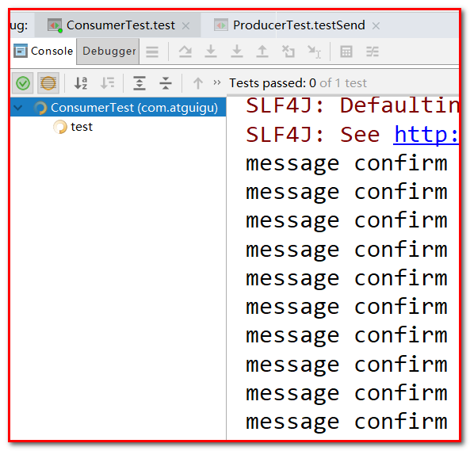
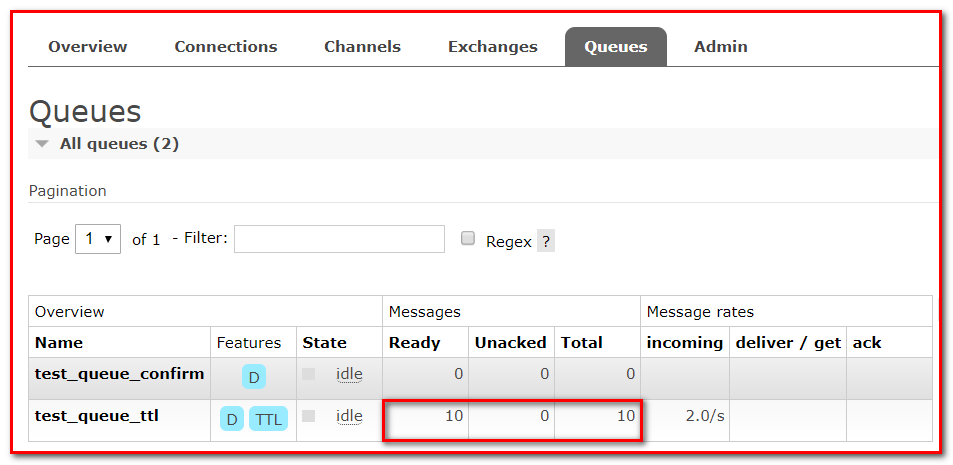

# RabbitMQ 第二天

## 1.1 消息的可靠投递

在使用 RabbitMQ 的时候，作为消息发送方希望杜绝任何消息丢失或者投递失败场景。RabbitMQ 为我们提供了消息的确认机制，用来控制消息投递的可靠性模式。

消息的确认，是指生产者投递消息后，如果 Broker 收到消息，则会给我们生产这一个应答。

生产者进行接收应答，用来确定这条消息是否正常的发送到 Broker，这种方式也是消息的可靠性投递的核心保障。


如何实现 Confirm 确认消息？

第一步：在 channel 上开启确认模式：channel.confirmSelect()

第二步：在 channel 上添加监听：addConfirmListener，监听成功和失败的返回结果，

根据具体的结果对消息进行重新发送、或者记录日志等后续处理。

rabbitmq 整个消息投递的路径为：

producer—>rabbitmq broker—>exchange—>queue—>consumer

消息从 producer 到 exchange 则会返回一个 confirmCallback 。

消息从 exchange–>queue 投递失败则会返回一个 returnCallback 。

我们将利用这两个 callback 控制消息的可靠性投递

### 1.1.1 Confirm 确认机制

① 创建项目 rabbitmq-producer-spring

② 添加 pom 文件

```xml
 <dependencies>
        <dependency>
            <groupId>org.springframework</groupId>
            <artifactId>spring-context</artifactId>
            <version>5.1.7.RELEASE</version>
        </dependency>

        <dependency>
            <groupId>org.springframework.amqp</groupId>
            <artifactId>spring-rabbit</artifactId>
            <version>2.1.8.RELEASE</version>
        </dependency>

        <dependency>
            <groupId>junit</groupId>
            <artifactId>junit</artifactId>
            <version>4.12</version>
        </dependency>

        <dependency>
            <groupId>org.springframework</groupId>
            <artifactId>spring-test</artifactId>
            <version>5.1.7.RELEASE</version>
        </dependency>
    </dependencies>

    <build>
        <plugins>
            <plugin>
                <groupId>org.apache.maven.plugins</groupId>
                <artifactId>maven-compiler-plugin</artifactId>
                <version>3.8.0</version>
                <configuration>
                    <source>1.8</source>
                    <target>1.8</target>
                </configuration>
            </plugin>
        </plugins>
    </build>
```

③ 在 resource 文件夹下面添加 配置文件 rabbitmq.properties

```properties
rabbitmq.host=localhost
rabbitmq.port=5672
rabbitmq.username=guest
rabbitmq.password=guest
rabbitmq.virtual-host=/
```

在 resource 文件夹下面添加 配置文件 spring-rabbitmq-producer.xml

```xml
<?xml version="1.0" encoding="UTF-8"?>
<beans xmlns="http://www.springframework.org/schema/beans"

       xmlns:xsi="http://www.w3.org/2001/XMLSchema-instance"
       xmlns:context="http://www.springframework.org/schema/context"
       xmlns:rabbit="http://www.springframework.org/schema/rabbit"
       xsi:schemaLocation="http://www.springframework.org/schema/beans
       http://www.springframework.org/schema/beans/spring-beans.xsd
       http://www.springframework.org/schema/context
       https://www.springframework.org/schema/context/spring-context.xsd
       http://www.springframework.org/schema/rabbit
       http://www.springframework.org/schema/rabbit/spring-rabbit.xsd">
    <!--加载配置文件-->
    <context:property-placeholder location="classpath:rabbitmq.properties"/>

    <!-- 定义rabbitmq connectionFactory
     确认模式开启:publisher-confirms="true"

    -->

    <rabbit:connection-factory id="connectionFactory" host="${rabbitmq.host}"
                               port="${rabbitmq.port}"
                               username="${rabbitmq.username}"
                               password="${rabbitmq.password}"
                               virtual-host="${rabbitmq.virtual-host}"
                               publisher-confirms="true"
                               publisher-returns="true"
    />
    <!--定义管理交换机、队列-->
    <rabbit:admin connection-factory="connectionFactory"/>

    <!--定义rabbitTemplate对象操作可以在代码中方便发送消息-->
    <rabbit:template id="rabbitTemplate" connection-factory="connectionFactory"/>

    <!--消息可靠性投递（生产端）-->
    <rabbit:queue id="test_queue_confirm" name="test_queue_confirm"></rabbit:queue>
    <rabbit:direct-exchange name="test_exchange_confirm">
        <rabbit:bindings>
            <rabbit:binding queue="test_queue_confirm" key="confirm"></rabbit:binding>
        </rabbit:bindings>
    </rabbit:direct-exchange>

</beans>
```

④ 创建测试类 ， 添加确认模式

```java
package com.atguigu;

import org.junit. Test;
import org.junit.runner. RunWith;
import org.springframework.amqp. AmqpException;
import org.springframework.amqp.core. Message;
import org.springframework.amqp.core. MessagePostProcessor;
import org.springframework.amqp.rabbit.connection. CorrelationData;
import org.springframework.amqp.rabbit.core. RabbitTemplate;
import org.springframework.beans.factory.annotation. Autowired;
import org.springframework.test.context. ContextConfiguration;
import org.springframework.test.context.junit4. SpringJUnit4ClassRunner;
import org.springframework.test.context.junit4. SpringRunner;

@RunWith(SpringJUnit4ClassRunner.class)
@ContextConfiguration(locations = "classpath:spring-rabbitmq-producer.xml")
public class ProducerTest {

    @Autowired
    private RabbitTemplate rabbitTemplate;

    /**
     * 确认模式：
     * 步骤：
     * 1. 确认模式开启：ConnectionFactory中开启publisher-confirms="true"
     * 2. 在rabbitTemplate定义ConfirmCallBack回调函数
     */
    @Test
    public void testConfirm() {
        //2. 定义回调
        rabbitTemplate.setConfirmCallback(new RabbitTemplate.ConfirmCallback() {

            @Override
            public void confirm(CorrelationData correlationData, boolean ack, String cause) {

                if (ack){
                    //接收成功
                    System.out.println("接收成功消息" + cause);
                }else {
                    //接收失败
                    System.out.println("接收失败消息" + cause);
                    //做一些处理，让消息再次发送。
                }
            }
        });

        //3. 发送消息
        rabbitTemplate.convertAndSend("test_exchange_confirm000", "confirm", "message confirm....");

    }

}
```

运行程序


### 1.1.2 Return 回退机制

Return Listener 用于处理一些不可路由的消息。

我们的消息生产者，通过指定一个 Exchange 和 Routingkey，把消息送到某一个队列中，

然后我们的消费者监听队列，进行消息处理操作。

但是在某些情况下，如果我们在发送消息的时候，当前的 exchange 不存在或者指定的路由 key 路由不到，

这个时候我们需要监听这种不可达的消息，就要使用 return listener。

在基础 API 中有一个关键的配置项：

Mandatory：如果为 true，则监听会接收到路由不可达的消息，然后进行后续处理，

如果为 false，那么 broker 端自动删除该消息。（默认 false）


```java
package com.atguigu;

import org.junit. Test;
import org.junit.runner. RunWith;
import org.springframework.amqp. AmqpException;
import org.springframework.amqp.core. Message;
import org.springframework.amqp.core. MessagePostProcessor;
import org.springframework.amqp.rabbit.connection. CorrelationData;
import org.springframework.amqp.rabbit.core. RabbitTemplate;
import org.springframework.beans.factory.annotation. Autowired;
import org.springframework.test.context. ContextConfiguration;
import org.springframework.test.context.junit4. SpringJUnit4ClassRunner;
import org.springframework.test.context.junit4. SpringRunner;

@RunWith(SpringJUnit4ClassRunner.class)
@ContextConfiguration(locations = "classpath:spring-rabbitmq-producer.xml")
public class ProducerTest {

    @Autowired
    private RabbitTemplate rabbitTemplate;

    /**
     * 回退模式： 当消息发送给Exchange后，Exchange路由到Queue失败是 才会执行 ReturnCallBack
     * 步骤：
     * 1. 开启回退模式:publisher-returns="true"
     * 2. 设置ReturnCallBack
     * 3. 设置Exchange处理消息的模式：
     * 1. 如果消息没有路由到Queue，则丢弃消息（默认）
     * 2. 如果消息没有路由到Queue，返回给消息发送方ReturnCallBack
     */

    @Test
    public void testReturn() {

        //交换机设置强制处理失败消息的模式
        rabbitTemplate.setMandatory(true);

        //2.设置ReturnCallBack
        rabbitTemplate.setReturnCallback(new RabbitTemplate.ReturnCallback() {
            /**
             *
             * @param message   消息对象
             * @param replyCode 错误码
             * @param replyText 错误信息
             * @param exchange  交换机
             * @param routingKey 路由键
             */
            @Override
            public void returnedMessage(Message message, int replyCode, String replyText, String exchange, String routingKey) {
                System.out.println("return 执行了....");

                System.out.println(message);
                System.out.println(replyCode);
                System.out.println(replyText);
                System.out.println(exchange);
                System.out.println(routingKey);

                //处理
            }
        });

        //3. 发送消息
        rabbitTemplate.convertAndSend("test_exchange_confirm", "confirm", "message confirm....");

    }

}
```

### 1.1.3 消息的可靠投递小结

设置 ConnectionFactory 的 publisher-confirms="true" 开启 确认模式。

使用 rabbitTemplate.setConfirmCallback 设置回调函数。当消息发送到 exchange 后回调 confirm 方法。在方法中判断 ack，如果为 true，则发送成功，如果为 false，则发送失败，需要处理。

设置 ConnectionFactory 的 publisher-returns="true" 开启 退回模式。

使用 rabbitTemplate.setReturnCallback 设置退回函数，当消息从 exchange 路由到 queue 失败后，如果设置了 rabbitTemplate.setMandatory(true) 参数，则会将消息退回给 producer 并执行回调函数 returnedMessage

### 1.1.4 Consumer Ack

ack 指 Acknowledge，确认。 表示消费端收到消息后的确认方式。

有二种确认方式：

自动确认：acknowledge=“none”

手动确认：acknowledge=“manual”

其中自动确认是指，当消息一旦被 Consumer 接收到，则自动确认收到，并将相应 message 从 RabbitMQ 的消息缓存中移除。但是在实际业务处理中，很可能消息接收到，业务处理出现异常，那么该消息就会丢失。如果设置了手动确认方式，则需要在业务处理成功后，调用 channel.basicAck()，手动签收，如果出现异常，则调用 channel.basicNack()方法，让其自动重新发送消息。

① 创建项目 rabbitmq-consumer-spring

② 添加 pom 文件

```xml
<dependencies>

        <dependency>
            <groupId>org.springframework</groupId>
            <artifactId>spring-context</artifactId>
            <version>5.1.7.RELEASE</version>
        </dependency>

        <dependency>
            <groupId>org.springframework.amqp</groupId>
            <artifactId>spring-rabbit</artifactId>
            <version>2.1.8.RELEASE</version>
        </dependency>

        <dependency>
            <groupId>junit</groupId>
            <artifactId>junit</artifactId>
            <version>4.12</version>
        </dependency>

        <dependency>
            <groupId>org.springframework</groupId>
            <artifactId>spring-test</artifactId>
            <version>5.1.7.RELEASE</version>
        </dependency>
    </dependencies>

    <build>
        <plugins>
            <plugin>
                <groupId>org.apache.maven.plugins</groupId>
                <artifactId>maven-compiler-plugin</artifactId>
                <version>3.8.0</version>
                <configuration>
                    <source>1.8</source>
                    <target>1.8</target>
                </configuration>
            </plugin>
        </plugins>
    </build>
```

③ 在 resource 文件夹下面新建 rabbitmq.properties 文件 和 spring-rabbitmq-consumer.xml 文件

```properties
rabbitmq.properties 文件

rabbitmq.host=localhost
rabbitmq.port=5672
rabbitmq.username=guest
rabbitmq.password=guest
rabbitmq.virtual-host=/
spring-rabbitmq-consumer.xml 文件
```

```xml
<?xml version="1.0" encoding="UTF-8"?>
<beans xmlns="http://www.springframework.org/schema/beans"

       xmlns:xsi="http://www.w3.org/2001/XMLSchema-instance"
       xmlns:context="http://www.springframework.org/schema/context"
       xmlns:rabbit="http://www.springframework.org/schema/rabbit"
       xsi:schemaLocation="http://www.springframework.org/schema/beans
       http://www.springframework.org/schema/beans/spring-beans.xsd
       http://www.springframework.org/schema/context
       https://www.springframework.org/schema/context/spring-context.xsd
       http://www.springframework.org/schema/rabbit
       http://www.springframework.org/schema/rabbit/spring-rabbit.xsd">
    <!--加载配置文件-->
    <context:property-placeholder location="classpath:rabbitmq.properties"/>

    <!-- 定义rabbitmq connectionFactory -->

    <rabbit:connection-factory id="connectionFactory" host="${rabbitmq.host}"
                               port="${rabbitmq.port}"
                               username="${rabbitmq.username}"
                               password="${rabbitmq.password}"
                               virtual-host="${rabbitmq.virtual-host}"/>

    <context:component-scan base-package="com.atguigu.listener" />

    <!--定义监听器容器
    acknowledge="manual": 手动签收

    -->

    <rabbit:listener-container connection-factory="connectionFactory" acknowledge="manual">

        <!--延迟队列效果实现：  一定要监听的是 死信队列！！！-->
        <rabbit:listener ref="ackListener" queue-names="test_queue_confirm"></rabbit:listener>
    </rabbit:listener-container>

</beans>
```

### 1.4.1 自动确认

④ 添加监听器

```java
package com.atguigu.listener;

import org.springframework.amqp.core. Message;
import org.springframework.amqp.core. MessageListener;
import org.springframework.stereotype. Component;

/**
 * AckListener
 *
 * @Author: 马伟奇
 * @CreateTime: 2020-05-31
 * @Description:
 */
@Component
public class AckListener implements MessageListener {

    @Override
    public void onMessage(Message message) {
        System.out.println(new String(message.getBody()));

    }

}
```

### 1.4.2 手动确认

④ 添加监听器

```java
package com.atguigu.listener;

import com.rabbitmq.client. Channel;
import org.springframework.amqp.core. Message;
import org.springframework.amqp.rabbit.listener.api. ChannelAwareMessageListener;
import org.springframework.stereotype. Component;

import java.io. IOException;

/**
 * Consumer ACK机制：
 *  1. 设置手动签收。acknowledge="manual"
 *  2. 让监听器类实现ChannelAwareMessageListener接口
 *  3. 如果消息成功处理，则调用channel的 basicAck()签收
 *  4. 如果消息处理失败，则调用channel的basicNack()拒绝签收，broker重新发送给consumer
 *
 *
 */

@Component
public class AckListener implements ChannelAwareMessageListener {

    @Override
    public void onMessage(Message message, Channel channel) throws Exception {
        Thread.sleep(1000);
        // 获取消息传递标记
        long deliveryTag = message.getMessageProperties().getDeliveryTag();
        try {

            // ① 接收消息
            System.out.println(new String(message.getBody()));
            // ② 处理业务逻辑
            System.out.println("处理业务逻辑");
            int i = 3/0;//出现错误
            // ③ 手动签收
            /**
             * 第一个参数：表示收到的标签
             * 第二个参数：如果为true表示可以签收所有的消息
             */
            channel.basicAck(deliveryTag,true);
        } catch (Exception e) {
            e.printStackTrace();
            // ④ 拒绝签收
             /*
            第三个参数：requeue：重回队列。
            设置为true，则消息重新回到queue，broker会重新发送该消息给消费端
             */
            channel.basicNack(deliveryTag,true,true);

        }

    }

}
```

⑤ 添加测试类

```java
package com.atguigu;

import org.junit. Test;
import org.junit.runner. RunWith;
import org.springframework.test.context. ContextConfiguration;
import org.springframework.test.context.junit4. SpringJUnit4ClassRunner;

@RunWith(SpringJUnit4ClassRunner.class)
@ContextConfiguration(locations = "classpath:spring-rabbitmq-consumer.xml")
public class ConsumerTest {

    @Test
    public void test(){
        while (true){

        }

    }

}
```

运行测试类 ，会一直监听消息 ，查看后台 http://localhost:15672/#/queues


当程序报错，程序会拒绝签收，直到修改错误，修改上面的监听器，注释 除 0 错误 ，重新运行程序


Consumer Ack 小结

在 rabbit:listener-container 标签中设置 acknowledge 属性，设置 ack 方式 none：自动确认，manual：手动确认

如果在消费端没有出现异常，则调用 channel.basicAck(deliveryTag, true); 方法确认签收消息

如果出现异常，则在 catch 中调用 basicNack，拒绝消息，让 MQ 重新发送消息。

## 1.2 消费端限流


在项目 rabbitmq-consumer-spring , 新建 com.atguigu.listener. QosListener

```java
package com.atguigu.listener;

import com.rabbitmq.client. Channel;
import org.springframework.amqp.core. Message;
import org.springframework.amqp.rabbit.listener.api. ChannelAwareMessageListener;

/**
 * Consumer 限流机制
 *  1. 确保ack机制为手动确认。
 *  2. listener-container配置属性
 *      perfetch = 1, 表示消费端每次从mq拉去一条消息来消费，直到手动确认消费完毕后，才会继续拉去下一条消息。
 */
public class QosListener implements ChannelAwareMessageListener {

    @Override
    public void onMessage(Message message, Channel channel) throws Exception {
        //1. 获取消息
        System.out.println(new String(message.getBody()));

    }

}
```

修改 spring-rabbitmq-consumer.xml 配置文件


运行消费者

在项目 spring-rabbitmq-producers , ProducerTest 测试方法

```java
package com.atguigu;

import org.junit. Test;
import org.junit.runner. RunWith;
import org.springframework.amqp.core. Message;
import org.springframework.amqp.rabbit.connection. CorrelationData;
import org.springframework.amqp.rabbit.core. RabbitTemplate;
import org.springframework.beans.factory.annotation. Autowired;
import org.springframework.test.context. ContextConfiguration;
import org.springframework.test.context.junit4. SpringRunner;

/**
 * ProducerTest
 *
 * @Author: 马伟奇
 * @CreateTime: 2020-05-31
 * @Description:
 */
@RunWith(SpringRunner.class)
@ContextConfiguration(locations = "classpath:spring-rabbitmq-producer.xml")
public class ProducerTest {

    @Test
    public void testSend() {

        for (int i = 0; i < 10; i++) {
            rabbitTemplate.convertAndSend("test_exchange_confirm", "confirm", "message confirm");

        }

    }

}
```

运行提供者


查看后台 ，有 9 条消息待消费 ，有 1 条消息未确认


修改消费者配置文件 ，去掉 prefetch="1" 会发现一次就可以消费所有消息


运行消费者测试类 ConsumerTest



修改 QosListener , 添加手动签收方法 ，这样就可以确认消费限流


运行程序

消费端限流小结

在 <rabbit:listener-container>中配置 prefetch 属性设置消费端一次拉取多少消息

消费端的确认模式一定为手动确认。acknowledge="manual"

## 1.3TTL

TTL 全称 Time To Live（存活时间/过期时间）。

当消息到达存活时间后，还没有被消费，会被自动清除。

RabbitMQ 可以对消息设置过期时间，也可以对整个队列（Queue）设置过期时间。


### 1.3.1 控制后台演示

修改管理后台界面，增加队列

参数：表示过期时间，单位毫秒 ，10000 表示 10 秒


增加交换机


绑定队列


发送消息

Delivery mode：表示需要进行持久化


查看消息，可以看到消息，但十秒之后，消息自动消失，因为我们设置了十秒消息过期


### 1.3.2 代码实现

#### 1.3.2.1 队列统一过期

修改 rabbitmq-producer-spring 项目的 配置文件 spring-rabbitmq-producer.xml


```xml
<?xml version="1.0" encoding="UTF-8"?>
<beans xmlns="http://www.springframework.org/schema/beans"

       xmlns:xsi="http://www.w3.org/2001/XMLSchema-instance"
       xmlns:context="http://www.springframework.org/schema/context"
       xmlns:rabbit="http://www.springframework.org/schema/rabbit"
       xsi:schemaLocation="http://www.springframework.org/schema/beans
       http://www.springframework.org/schema/beans/spring-beans.xsd
       http://www.springframework.org/schema/context
       https://www.springframework.org/schema/context/spring-context.xsd
       http://www.springframework.org/schema/rabbit
       http://www.springframework.org/schema/rabbit/spring-rabbit.xsd">
    <!--加载配置文件-->
    <context:property-placeholder location="classpath:rabbitmq.properties"/>

    <!-- 定义rabbitmq connectionFactory -->

    <rabbit:connection-factory id="connectionFactory" host="${rabbitmq.host}"
                               port="${rabbitmq.port}"
                               username="${rabbitmq.username}"
                               password="${rabbitmq.password}"
                               virtual-host="${rabbitmq.virtual-host}"
                               publisher-confirms="true"
                               publisher-returns="true"
    />
    <!--定义管理交换机、队列-->
    <rabbit:admin connection-factory="connectionFactory"/>

    <!--定义rabbitTemplate对象操作可以在代码中方便发送消息-->
    <rabbit:template id="rabbitTemplate" connection-factory="connectionFactory"/>

    <!--消息可靠性投递（生产端）-->
    <rabbit:queue id="test_queue_confirm" name="test_queue_confirm"></rabbit:queue>
    <rabbit:direct-exchange name="test_exchange_confirm">
        <rabbit:bindings>
            <rabbit:binding queue="test_queue_confirm" key="confirm"></rabbit:binding>
        </rabbit:bindings>
    </rabbit:direct-exchange>

    <!--TTL 队列-->
    <rabbit:queue name="test_queue_ttl" id="test_queue_ttl">
        <!--设置queue的参数-->
         <rabbit:queue-arguments>
             <!--
               设置x-message-ttl队列的过期时间
               默认情况下value-type的类型是String类型，但时间的类型是number类型，所以需要设置成integer类型
             -->
             <entry key="x-message-ttl" value="10000" value-type="java.lang.Integer"></entry>
         </rabbit:queue-arguments>
    </rabbit:queue>

    <!--设置交换机-->
    <rabbit:topic-exchange name="test_exchange_ttl">
        <!--交换机绑定队列-->
        <rabbit:bindings>
            <rabbit:binding pattern="ttl.#" queue="test_queue_ttl"></rabbit:binding>
        </rabbit:bindings>
    </rabbit:topic-exchange>

</beans>
```

在测试类 ProducerTest 中，添加测试方法，发送消息 ，十秒之后自动过期

```java
@Test
public void testTTL() {

     for (int i = 0; i < 10; i++) {
       rabbitTemplate.convertAndSend("test_exchange_ttl","ttl.hehe","message ttl");
     }

}
```

查看控制台，发现有 10 条消息



### 1.3.2.2 消息过期

```java
/**

     * TTL:过期时间
     *  1. 队列统一过期
     *
     *  2. 消息单独过期
     *
     *
     * 如果设置了消息的过期时间，也设置了队列的过期时间，它以时间短的为准。
     *
     */
    @Test
    public void testTtl() {

      /*  for (int i = 0; i < 10; i++) {
            // 发送消息
            rabbitTemplate.convertAndSend("test_exchange_ttl", "ttl.hehe", "message ttl....");
        }*/

        // 消息后处理对象，设置一些消息的参数信息
        MessagePostProcessor messagePostProcessor = new MessagePostProcessor() {

            @Override
            public Message postProcessMessage(Message message) throws AmqpException {
                //1.设置message的信息
                // 第二个方法：消息的过期时间 ，5秒之后过期
                message.getMessageProperties().setExpiration("5000");
                //2.返回该消息
                return message;
            }
        };

        //消息单独过期
        rabbitTemplate.convertAndSend("test_exchange_ttl", "ttl.hehe", "message ttl....",messagePostProcessor);

    }
```

运行程序，查看后台管理系统


## 1.4 死信队列

死信队列，英文缩写：DLX 。DeadLetter Exchange（死信交换机），当消息成为 Dead message 后，可以被重新发送到另一个交换机，这个交换机就是 DLX。

什么是死信队列

先从概念解释上搞清楚这个定义，死信，顾名思义就是无法被消费的消息，字面意思可以这样理解，一般来说，producer 将消息投递到 broker 或者直接到 queue 里了，consumer 从 queue 取出消息进行消费，但某些时候由于特定的原因导致 queue 中的某些消息无法被消费，这样的消息如果没有后续的处理，就变成了死信，有死信，自然就有了死信队列；


消息成为死信的三种情况：

队列消息长度到达限制；比如给队列最大只能存储 10 条消息，当第 11 条消息进来的时候存不下了，第 11 条消息就被称为死信

消费者拒接消费消息，basicNack/basicReject, 并且不把消息重新放入原目标队列, requeue=false；

原队列存在消息过期设置，消息到达超时时间未被消费；

死信的处理方式

死信的产生既然不可避免，那么就需要从实际的业务角度和场景出发，对这些死信进行后续的处理，常见的处理方式大致有下面几种，

① 丢弃，如果不是很重要，可以选择丢弃

② 记录死信入库，然后做后续的业务分析或处理

③ 通过死信队列，由负责监听死信的应用程序进行处理

综合来看，更常用的做法是第三种，即通过死信队列，将产生的死信通过程序的配置路由到指定的死信队列，然后应用监听死信队列，对接收到的死信做后续的处理，

队列绑定死信交换机：

给队列设置参数： x-dead-letter-exchange 和 x-dead-letter-routing-key


### 1.4.1 过期时间代码实现

修改生产者项目的配置文件 spring-rabbitmq-producer.xml ，增加如下代码


```xml
<!--

       死信队列：
           1. 声明正常的队列(test_queue_dlx)和交换机(test_exchange_dlx)
           2. 声明死信队列(queue_dlx)和死信交换机(exchange_dlx)
           3. 正常队列绑定死信交换机
               设置两个参数：
                   * x-dead-letter-exchange：死信交换机名称
                   * x-dead-letter-routing-key：发送给死信交换机的routingkey

   -->

    <!--

        1. 声明正常的队列(test_queue_dlx)和交换机(test_exchange_dlx)

    -->

    <rabbit:queue name="test_queue_dlx" id="test_queue_dlx">
        <!--3. 正常队列绑定死信交换机-->
        <rabbit:queue-arguments>
            <!--3.1 x-dead-letter-exchange：死信交换机名称-->
            <entry key="x-dead-letter-exchange" value="exchange_dlx"/>
            <!--3.2 x-dead-letter-routing-key：发送给死信交换机的routingkey-->
            <entry key="x-dead-letter-routing-key" value="dlx.hehe"></entry>
            <!--4.1 设置队列的过期时间 ttl-->
            <entry key="x-message-ttl" value="10000" value-type="java.lang.Integer"/>
            <!--4.2 设置队列的长度限制 max-length -->
            <entry key="x-max-length" value="10" value-type="java.lang.Integer"/>
        </rabbit:queue-arguments>
    </rabbit:queue>
    <!--正常交换机-->
    <rabbit:topic-exchange name="test_exchange_dlx">
        <rabbit:bindings>
            <rabbit:binding pattern="test.dlx.#" queue="test_queue_dlx">                         </rabbit:binding>
        </rabbit:bindings>
    </rabbit:topic-exchange>
    <!--
       2. 声明死信队列(queue_dlx)和死信交换机(exchange_dlx)

   -->

    <rabbit:queue name="queue_dlx" id="queue_dlx"></rabbit:queue>
    <rabbit:topic-exchange name="exchange_dlx">
        <rabbit:bindings>
            <rabbit:binding pattern="dlx.#" queue="queue_dlx"></rabbit:binding>
        </rabbit:bindings>
    </rabbit:topic-exchange>
```

在测试类中，添加如下方法，进行测试

```java
/**

     * 发送测试死信消息：
     *  1. 过期时间
     *  2. 长度限制
     *  3. 消息拒收
     */
    @Test
    public void testDlx(){
        //1. 测试过期时间，死信消息
        rabbitTemplate.convertAndSend("test_exchange_dlx","test.dlx.haha","我是一条消息，我会死吗？");

    }
```

运行测试，查看管理台界面


### 1.4.2 长度限制代码实现

修改测试类，添加测试方法

```java
/**

     * 发送测试死信消息：
     *  1. 过期时间
     *  2. 长度限制
     *  3. 消息拒收
     */
    @Test
    public void testDlx(){
        //1. 测试过期时间，死信消息
        //rabbitTemplate.convertAndSend("test_exchange_dlx","test.dlx.haha","我是一条消息，我会死吗？");

        //2. 测试长度限制后，消息死信

        for (int i = 0; i < 20; i++) {
            rabbitTemplate.convertAndSend("test_exchange_dlx", "test.dlx.haha", "我是一条消息，我会死吗？");

        }

    }
```

运行测试方法，进行测试


### 1.4.3 测试消息拒收

在消费者工程 创建 com.atguigu.listener. DlxListener

```java
package com.atguigu.listener;

import com.rabbitmq.client. Channel;
import org.springframework.amqp.core. Message;
import org.springframework.amqp.rabbit.listener.api. ChannelAwareMessageListener;
import org.springframework.stereotype. Component;

@Component
public class DlxListener implements ChannelAwareMessageListener {

    @Override
    public void onMessage(Message message, Channel channel) throws Exception {
        long deliveryTag = message.getMessageProperties().getDeliveryTag();

        try {
            //1.接收转换消息
            System.out.println(new String(message.getBody()));

            //2. 处理业务逻辑
            System.out.println("处理业务逻辑...");
            int i = 3/0; //出现错误
            //3. 手动签收
            channel.basicAck(deliveryTag, true);
        } catch (Exception e) {
            //e.printStackTrace();
            System.out.println("出现异常，拒绝接受");
            //4. 拒绝签收，不重回队列 requeue=false
            channel.basicNack(deliveryTag, true, false);

        }

    }

}
```

修改消费者配置文件 spring-rabbitmq-consumer.xml


```xml
<rabbit:listener-container connection-factory="connectionFactory" acknowledge="manual">

        <!--<rabbit:listener ref="ackListener" queue-names="test_queue_confirm"></rabbit:listener>-->
        <!--<rabbit:listener ref="qosListener" queue-names="test_queue_confirm"></rabbit:listener>-->
        <!--定义监听器，监听正常队列-->
        <rabbit:listener ref="dlxListener" queue-names="test_queue_dlx"></rabbit:listener>
    </rabbit:listener-container>
```

运行消费者测试类

修改生产者测试代码

```java
/**

     * 发送测试死信消息：
     *  1. 过期时间
     *  2. 长度限制
     *  3. 消息拒收
     */
    @Test
    public void testDlx(){
        //1. 测试过期时间，死信消息
        //rabbitTemplate.convertAndSend("test_exchange_dlx","test.dlx.haha","我是一条消息，我会死吗？");

        //2. 测试长度限制后，消息死信

//        for (int i = 0; i < 20; i++) {
//            rabbitTemplate.convertAndSend("test_exchange_dlx", "test.dlx.haha", "我是一条消息，我会死吗？");
//        }

        //3. 测试消息拒收
        rabbitTemplate.convertAndSend("test_exchange_dlx",
                                     "test.dlx.haha",
                                         "我是一条消息，我会死吗？");

    }
```

发送消息，运行程序，查看后台管理界面

死信队列小结

死信交换机和死信队列和普通的没有区别

当消息成为死信后，如果该队列绑定了死信交换机，则消息会被死信交换机重新路由到死信队列

消息成为死信的三种情况：

队列消息长度到达限制；

消费者拒接消费消息，并且不重回队列；

原队列存在消息过期设置，消息到达超时时间未被消费；

## 1.5 延迟队列

延迟队列存储的对象肯定是对应的延时消息，所谓”延时消息”是指当消息被发送以后，并不想让消费者立即拿到消息，而是等待指定时间后，消费者才拿到这个消息进行消费。

场景一：在订单系统中，一个用户下单之后通常有 30 分钟的时间进行支付，如果 30 分钟之内没有支付成功，那么这个订单将进行一场处理。这是就可以使用延时队列将订单信息发送到延时队列。

场景二：用户希望通过手机远程遥控家里的智能设备在指定的时间进行工作。这时候就可以将用户指令发送到延时队列，当指令设定的时间到了再将指令推送到只能设备。

需求：

下单后，30 分钟未支付，取消订单，回滚库存。

新用户注册成功 30 分钟后，发送短信问候。

实现方式：

延迟队列


很可惜，在 RabbitMQ 中并未提供延迟队列功能。

但是可以使用：TTL+死信队列 组合实现延迟队列的效果。


### 1.5.1 代码实现

1.5.1.1 生产者
修改生产者代码 ，修改生产者配置文件 spring-rabbitmq-producer.xml


修改生产者，添加测试方法

```java
@Test

    public  void testDelay() throws InterruptedException {
        //1.发送订单消息。 将来是在订单系统中，下单成功后，发送消息
        rabbitTemplate.convertAndSend("order_exchange",
                "order.msg",
                "订单信息：id=1,time=2020年4月30日16:41:47");

        //2. 打印倒计时10秒
        for (int i = 10; i > 0 ; i--) {
            System.out.println(i+"...");
            Thread.sleep(1000);

        }

    }
```

运行程序创建订单延时队列

1.5.1.2 消费者
修改消费者项目，添加 com.atguigu.listener. OrderListener

消费者

```java
package com.atguigu.listener;

import com.rabbitmq.client. Channel;
import org.springframework.amqp.core. Message;
import org.springframework.amqp.rabbit.listener.api. ChannelAwareMessageListener;
import org.springframework.stereotype. Component;

@Component
public class OrderListener implements ChannelAwareMessageListener {

    @Override
    public void onMessage(Message message, Channel channel) throws Exception {
        long deliveryTag = message.getMessageProperties().getDeliveryTag();

        try {
            //1.接收转换消息
            System.out.println(new String(message.getBody()));

            //2. 处理业务逻辑
            System.out.println("处理业务逻辑...");
            System.out.println("根据订单id查询其状态...");
            System.out.println("判断状态是否为支付成功");
            System.out.println("取消订单，回滚库存....");
            //3. 手动签收
            channel.basicAck(deliveryTag, true);
        } catch (Exception e) {
            //e.printStackTrace();
            System.out.println("出现异常，拒绝接受");
            //4. 拒绝签收，不重回队列 requeue=false
            channel.basicNack(deliveryTag, true, false);

        }

    }

}
```

修改消费者配置文件 spring-rabbitmq-consumer.xml


```xml
<?xml version="1.0" encoding="UTF-8"?>
<beans xmlns="http://www.springframework.org/schema/beans"

       xmlns:xsi="http://www.w3.org/2001/XMLSchema-instance"
       xmlns:context="http://www.springframework.org/schema/context"
       xmlns:rabbit="http://www.springframework.org/schema/rabbit"
       xsi:schemaLocation="http://www.springframework.org/schema/beans
       http://www.springframework.org/schema/beans/spring-beans.xsd
       http://www.springframework.org/schema/context
       https://www.springframework.org/schema/context/spring-context.xsd
       http://www.springframework.org/schema/rabbit
       http://www.springframework.org/schema/rabbit/spring-rabbit.xsd">
    <!--加载配置文件-->
    <context:property-placeholder location="classpath:rabbitmq.properties"/>

    <!-- 定义rabbitmq connectionFactory -->

    <rabbit:connection-factory id="connectionFactory" host="${rabbitmq.host}"
                               port="${rabbitmq.port}"
                               username="${rabbitmq.username}"
                               password="${rabbitmq.password}"
                               virtual-host="${rabbitmq.virtual-host}"/>

    <context:component-scan base-package="com.atguigu.listener" />

    <!--定义监听器容器
    acknowledge="manual": 手动签收

    acknowledge="auto" 自动签收

    -->

    <rabbit:listener-container connection-factory="connectionFactory" acknowledge="manual">

        <!--<rabbit:listener ref="ackListener" queue-names="test_queue_confirm"></rabbit:listener>-->
        <!--<rabbit:listener ref="qosListener" queue-names="test_queue_confirm"></rabbit:listener>-->
        <!--定义监听器，监听正常队列-->
        <!--<rabbit:listener ref="dlxListener" queue-names="test_queue_dlx"></rabbit:listener>-->
        <!--延迟队列效果实现：  一定要监听的是 死信队列！！！-->
        <rabbit:listener ref="orderListener" queue-names="order_queue_dlx"></rabbit:listener>
    </rabbit:listener-container>

</beans>
```

运行消费者测试类

第二章 RabbitMQ 集成微服务

## 2.1RabbitAdmin 应用

RabbitAdmin 的作用：
① 底层实现就是从 Spring 容器中获取 Exchange，Bingding，Routingkey 以及 Queue 的@bean 声明
② 使用 RabbitAdmin 的 execute 方法执行对应的声明，修改和删除等一系列 MQ 的操作者
比如：添加一个交换机，删除一个绑定， 清空一个队列里面的消息等等

① 新建项目 rabbitmq-spring-rabbitadmin

② 添加 pom 文件

```xml
  <parent>

        <groupId>org.springframework.boot</groupId>
        <artifactId>spring-boot-starter-parent</artifactId>
        <version>2.1.6.RELEASE</version>
        <relativePath/> <!-- lookup parent from repository -->
    </parent>

    <properties>
        <project.build.sourceEncoding>UTF-8</project.build.sourceEncoding>
        <project.reporting.outputEncoding>UTF-8</project.reporting.outputEncoding>
        <java.version>1.8</java.version>
    </properties>

    <dependencies>
        <dependency>
            <groupId>org.springframework.boot</groupId>
            <artifactId>spring-boot-starter</artifactId>
        </dependency>

        <dependency>
            <groupId>org.springframework.boot</groupId>
            <artifactId>spring-boot-starter-test</artifactId>
        </dependency>
        <dependency>
            <groupId>com.rabbitmq</groupId>
            <artifactId>amqp-client</artifactId>
        </dependency>
        <dependency>
            <groupId>org.springframework.boot</groupId>
            <artifactId>spring-boot-starter-amqp</artifactId>
        </dependency>
    </dependencies>

    <build>
        <plugins>
            <plugin>
                <groupId>org.springframework.boot</groupId>
                <artifactId>spring-boot-maven-plugin</artifactId>
            </plugin>
        </plugins>
    </build>
```

③ 添加程序入口类

```java
package com.atguigu;
import org.springframework.boot. SpringApplication;
import org.springframework.boot.autoconfigure. SpringBootApplication;
/**
 * Application
 *
 * @Author: 马伟奇
 * @CreateTime: 2020-05-24
 * @Description:
 */

@SpringBootApplication
public class Application {

    public static void main(String[] args) {
        SpringApplication.run(Application.class, args);

    }

}
```

④ 添加配置类

```java
package com.atguigu.config;

import java.util. UUID;

import org.springframework.amqp.core. AcknowledgeMode;
import org.springframework.amqp.core. Binding;
import org.springframework.amqp.core. BindingBuilder;
import org.springframework.amqp.core. Queue;
import org.springframework.amqp.core. TopicExchange;
import org.springframework.amqp.rabbit.connection. CachingConnectionFactory;
import org.springframework.amqp.rabbit.connection. ConnectionFactory;
import org.springframework.amqp.rabbit.core. RabbitAdmin;
import org.springframework.amqp.rabbit.core. RabbitTemplate;
import org.springframework.amqp.rabbit.listener. SimpleMessageListenerContainer;
import org.springframework.amqp.rabbit.listener.adapter. MessageListenerAdapter;
import org.springframework.amqp.support. ConsumerTagStrategy;
import org.springframework.amqp.support.converter. ContentTypeDelegatingMessageConverter;
import org.springframework.amqp.support.converter. Jackson2JsonMessageConverter;
import org.springframework.context.annotation. Bean;
import org.springframework.context.annotation. ComponentScan;
import org.springframework.context.annotation. Configuration;

@Configuration
@ComponentScan({"com.atguigu.*"})
public class RabbitMQConfig {

	@Bean
	public ConnectionFactory connectionFactory(){
		CachingConnectionFactory connectionFactory = new CachingConnectionFactory();
		connectionFactory.setAddresses("localhost:5672");
		connectionFactory.setUsername("guest");
		connectionFactory.setPassword("guest");
		connectionFactory.setVirtualHost("/");
		return connectionFactory;
	}
	/**
     * RabbitAdmin:
       ① 底层实现就是从Spring容器中获取Exchange，Bingding，Routingkey以及Queue的@bean声明
       ② 使用RabbitAdmin的execute方法执行对应的声明，修改和删除等一系列MQ的操作者
       比如：添加一个交换机，删除一个绑定， 清空一个队列里面的消息等等
     */
	@Bean
	public RabbitAdmin rabbitAdmin(ConnectionFactory connectionFactory) {
		RabbitAdmin rabbitAdmin = new RabbitAdmin(connectionFactory);
        // 必须要设置为true，否则Spring容器不会加载RabbitAdmin类
		rabbitAdmin.setAutoStartup(true);
		return rabbitAdmin;
	}

}
```

⑤ 在 test 文件夹下面添加测试类

```java
package com.atguigu;

import org.junit. Test;
import org.junit.runner. RunWith;
import org.springframework.amqp.core.*;
import org.springframework.amqp.rabbit.core. RabbitAdmin;
import org.springframework.beans.factory.annotation. Autowired;
import org.springframework.boot.test.context. SpringBootTest;
import org.springframework.test.context.junit4. SpringRunner;

import java.util. HashMap;

/**
 * ApplicationTests
 *
 * @Author: 马伟奇
 * @CreateTime: 2020-06-04
 * @Description:
 */
@RunWith(SpringRunner.class)
@SpringBootTest
public class ApplicationTests {

    @Autowired
    private RabbitAdmin rabbitAdmin;

    @Test
    public void testAdmin() throws Exception{
        /**
         * 声明交换机
         * 声明一个定向交换机，通配符模式，广播模式
         * 第一个参数：交换机的名字
         * 第二个参数：是否需要进行持久化
         * 第三个参数：是否需要自动删除
         */
        rabbitAdmin.declareExchange(new DirectExchange("test.direct",true,false));
        rabbitAdmin.declareExchange(new DirectExchange("test.topic",true,false));
        rabbitAdmin.declareExchange(new DirectExchange("test.fanout",true,false));

        /**
         * 声明队列
         * 第一个参数：表示队列的名字
         * 第二个参数：表示是否需要进行持久化
         */
        rabbitAdmin.declareQueue(new Queue("test.direct.queue",true));
        rabbitAdmin.declareQueue(new Queue("test.topic.queue",true));
        rabbitAdmin.declareQueue(new Queue("test.fanout.queue",true));

        /**
         * 交换机和队列进行绑定
         */
        rabbitAdmin.declareBinding(
                BindingBuilder.bind(new Queue("test.direct.queue",true))
                        .to(new DirectExchange("test.direct",true,false))
                        .with("direct"));

        rabbitAdmin.declareBinding(
                BindingBuilder.bind(new Queue("test.topic.queue",true))
                        .to(new DirectExchange("test.topic",true,false))
                        .with("user.#"));

        // 广播模式是没有路由key
        rabbitAdmin.declareBinding(
                BindingBuilder.bind(new Queue("test.topic.queue",true))
                        .to(new FanoutExchange("test.topic",true,false))
                        );

        //清空队列数据
        rabbitAdmin.purgeQueue("test.topic.queue", false);

    }

}
```

运行程序测试，进入后台管理系统

## 2.2RabbitAdmin 源码分析

① 注意：autoStartup 必须要设置为 true ，否则 Spring 容器不会加载 RabbitAdmin 类

② RabbitAdmin 底层实现就是从 Spring 容器中获取 Exchange ，bingding ，RoutingKey 以及 Queue 的 @Bean 声明

③ 然后使用 RabbitTemplate 的 execute 方法执行对应的声明，修改，删除等一系列 RabbitMQ 基础功能操作

① 点击 RabbitAdmin 实现初始化 bean

```java
public class RabbitAdmin implements InitializingBean{


}
```

② 进入 InitializingBean 接口 ，在 bean 加载之后，可以加载一些设置

```java
public interface InitializingBean {

    void afterPropertiesSet() throws Exception;

}
```

③ 查看 RabbitAdmin 里面的 afterPropertiesSet 源码，发现如果 autoStartup 不设置为 true，直接 return

```java
@Override
public void afterPropertiesSet() {

    synchronized (this.lifecycleMonitor) {
        // autoStartup设置为true
        if (this.running || !this.autoStartup) {
            return;

        }

        // 做一些配置
        if (this.retryTemplate == null && !this.retryDisabled) {
				this.retryTemplate = new RetryTemplate();
				this.retryTemplate.setRetryPolicy(new SimpleRetryPolicy(DECLARE_MAX_ATTEMPTS));
				ExponentialBackOffPolicy backOffPolicy = new ExponentialBackOffPolicy();
				backOffPolicy.setInitialInterval(DECLARE_INITIAL_RETRY_INTERVAL);
				backOffPolicy.setMultiplier(DECLARE_RETRY_MULTIPLIER);
				backOffPolicy.setMaxInterval(DECLARE_MAX_RETRY_INTERVAL);
				this.retryTemplate.setBackOffPolicy(backOffPolicy);
			}
        // 添加监听器，最核心的方法是添加一个initialize方法
        this.connectionFactory.addConnectionListener(connection -> {

					if (this.retryTemplate != null) {
						this.retryTemplate.execute(c -> {
                            // 点击进源码
							initialize();
							return null;
						});
					}
					else {
						initialize();
					}
			});
```

④ 点击 initialize() 源码

```java
@Override // NOSONAR complexity
public void initialize() {

    //  根据获取bean的类型，判断是交换机，队列和绑定
    Collection<Exchange> contextExchanges = new LinkedList<Exchange>(
				this.applicationContext.getBeansOfType(Exchange.class).values());
		Collection<Queue> contextQueues = new LinkedList<Queue>(
				this.applicationContext.getBeansOfType(Queue.class).values());
		Collection<Binding> contextBindings = new LinkedList<Binding>(
				this.applicationContext.getBeansOfType(Binding.class).values());
        // 定义交换机，队列和绑定集合
        final Collection<Exchange> exchanges = filterDeclarables(contextExchanges);
		final Collection<Queue> queues = filterDeclarables(contextQueues);
		final Collection<Binding> bindings = filterDeclarables(contextBindings);
    // 执行rabbitmq
    this.rabbitTemplate.execute(channel -> {
			declareExchanges(channel, exchanges.toArray(new Exchange[exchanges.size()]));
			declareQueues(channel, queues.toArray(new Queue[queues.size()]));
			declareBindings(channel, bindings.toArray(new Binding[bindings.size()]));
			return null;
		});

}
```

## 2.3RabbitMQ 声明式配置使用

在 Rabbit 基础 API 里面声明一个 Exchange ，声明一个绑定，一个队列


使用 SpringAMQP 去声明，就需要使用 SpringAMQP 的如下模式，即声明 Bean 方式


在 RabbitMQConfig 类里面添加交换机，队列和绑定代码

```java
package com.atguigu.config;

import java.util. UUID;

import org.springframework.amqp.core. AcknowledgeMode;
import org.springframework.amqp.core. Binding;
import org.springframework.amqp.core. BindingBuilder;
import org.springframework.amqp.core. Queue;
import org.springframework.amqp.core. TopicExchange;
import org.springframework.amqp.rabbit.connection. CachingConnectionFactory;
import org.springframework.amqp.rabbit.connection. ConnectionFactory;
import org.springframework.amqp.rabbit.core. RabbitAdmin;
import org.springframework.amqp.rabbit.core. RabbitTemplate;
import org.springframework.amqp.rabbit.listener. SimpleMessageListenerContainer;
import org.springframework.amqp.rabbit.listener.adapter. MessageListenerAdapter;
import org.springframework.amqp.support. ConsumerTagStrategy;
import org.springframework.amqp.support.converter. ContentTypeDelegatingMessageConverter;
import org.springframework.amqp.support.converter. Jackson2JsonMessageConverter;
import org.springframework.context.annotation. Bean;
import org.springframework.context.annotation. ComponentScan;
import org.springframework.context.annotation. Configuration;

@Configuration
@ComponentScan({"com.atguigu.*"})
public class RabbitMQConfig {

	@Bean
	public ConnectionFactory connectionFactory(){
		CachingConnectionFactory connectionFactory = new CachingConnectionFactory();
		connectionFactory.setAddresses("localhost:5672");
		connectionFactory.setUsername("guest");
		connectionFactory.setPassword("guest");
		connectionFactory.setVirtualHost("/");
		return connectionFactory;
	}

	@Bean
	public RabbitAdmin rabbitAdmin(ConnectionFactory connectionFactory) {
		RabbitAdmin rabbitAdmin = new RabbitAdmin(connectionFactory);
		// 必须要设置为true，否则Spring容器不会加载RabbitAdmin类
		rabbitAdmin.setAutoStartup(true);
		return rabbitAdmin;
	}

    /**
     * 针对消费者配置
     * 1. 设置交换机类型
     * 2. 将队列绑定到交换机
        FanoutExchange: 将消息分发到所有的绑定队列，无routingkey的概念
        HeadersExchange ：通过添加属性key-value匹配
        DirectExchange:按照routingkey分发到指定队列
        TopicExchange:多关键字匹配
     */
    @Bean
    public TopicExchange exchange001() {
        return new TopicExchange("topic001", true, false);
    }

    @Bean
    public Queue queue001() {
        return new Queue("queue001", true); //队列持久
    }


    @Bean
    public Binding binding001() {
        return BindingBuilder.bind(queue001()).to(exchange001()).with("spring.*");
    }


    @Bean
    public TopicExchange exchange002() {
        return new TopicExchange("topic002", true, false);
    }


    @Bean
    public Queue queue002() {
        return new Queue("queue002", true); //队列持久

    }


    @Bean
    public Binding binding002() {
        return BindingBuilder.bind(queue002()).to(exchange002()).with("rabbit.*");
    }


    @Bean
    public Queue queue003() {
        return new Queue("queue003", true); //队列持久

    }


    @Bean
    public Binding binding003() {
        return BindingBuilder.bind(queue003()).to(exchange001()).with("mq.*");
    }


    @Bean
    public Queue queue_image() {
        return new Queue("image_queue", true); //队列持久

    }


    @Bean
    public Queue queue_pdf() {
        return new Queue("pdf_queue", true); //队列持久

    }


}
```

运行程序，查看后台系统

## 2.4RabbitMQ 与 SpringBoot 整合

2.1. 搭建生产者工程
实现步骤：

创建生产者 SpringBoot 工程
引入依赖坐标
编写 yml 配置，基本信息配置
定义交换机，队列以及绑定关系的配置类
注入 RabbitTemplate，调用方法，完成消息发送
2.1.1. 创建工程
项目名字 ：producer-springboot


2.1.2. 添加依赖
修改 pom.xml 文件内容为如下：

```xml
  <!--
        1. 父工程依赖

    -->

<parent>

    <groupId>org.springframework.boot</groupId>
    <artifactId>spring-boot-starter-parent</artifactId>
    <version>2.1.6.RELEASE</version>

</parent>

<dependencies>

    <!--2. rabbitmq-->
    <dependency>
        <groupId>org.springframework.boot</groupId>
        <artifactId>spring-boot-starter-amqp</artifactId>
    </dependency>
    <dependency>
        <groupId>org.springframework.boot</groupId>
        <artifactId>spring-boot-starter-test</artifactId>
    </dependency>

</dependencies>
```

2.1.3. 配置整合
创建 application.yml 连接参数等配置文件；

```yaml
# 配置RabbitMQ的基本信息  ip 端口 username  password..
spring:
  rabbitmq:
    host: localhost # ip
    port: 5672
    username: guest
    password: guest
    virtual-host: /
```

### 2.1.4 创建配置类

```java
package com.atguigu.config;

import org.springframework.amqp.core.*;
import org.springframework.beans.factory.annotation. Qualifier;
import org.springframework.context.annotation. Bean;
import org.springframework.context.annotation. Configuration;

/**
 * RabbitMQConfig
 *
 * @Author: 马伟奇
 * @Description:
 */
@Configuration
public class RabbitMQConfig {

    public static final String EXCHANGE_NAME = "boot_topic_exchange";
    public static final String QUEUE_NAME = "boot_queue";

    // 1 交换机
    @Bean("bootExchange")
    public Exchange bootExchange(){
        return ExchangeBuilder.topicExchange(EXCHANGE_NAME).durable(true).build();

    }

    //2. Queue 队列
    @Bean("bootQueue")
    public Queue bootQueue(){
        return QueueBuilder.durable(QUEUE_NAME).build();

    }

    //3. 队列和交互机绑定关系 Binding
    /*

        1. 知道哪个队列
        2. 知道哪个交换机
        3. routing key
        noargs(): 表示不指定参数
     */
    @Bean
    public Binding bindQueueExchange(@Qualifier("bootQueue")Queue queue,
                                     @Qualifier("bootExchange") Exchange exchange){
        return BindingBuilder.bind(queue).to(exchange).with("boot.#").noargs();

    }

}
```

### 2.1.4 创建入口类

```java
package com.atguigu;

import org.springframework.boot. SpringApplication;
import org.springframework.boot.autoconfigure. SpringBootApplication;

/**
 * ProducerApplication
 *
 * @Author: 马伟奇
 * @Description:
 */
@SpringBootApplication
public class ProducerApplication {

    public static void main(String[] args) {
        SpringApplication.run(ProducerApplication.class);

    }

}
```

2.1.4. 发送消息
创建测试文件 com.atguigu. ProducerTest.java

```java
package com.atguigu;

import com.atguigu.config. RabbitMQConfig;
import org.junit. Test;
import org.junit.runner. RunWith;
import org.springframework.amqp.rabbit.core. RabbitTemplate;
import org.springframework.beans.factory.annotation. Autowired;
import org.springframework.boot.test.context. SpringBootTest;
import org.springframework.test.context.junit4. SpringRunner;

/**
 * ProducerTest
 *
 * @Author: 马伟奇
 * @Description:
 */
@SpringBootTest
@RunWith(SpringRunner.class)
public class ProducerTest {

    @Autowired
    private RabbitTemplate rabbitTemplate;

    /**
     * 第一个参数：交换机名字
     * 第二个参数：routingKey
     * 第三个参数：发送的消息
     */
    @Test
    public void testSend(){
        rabbitTemplate.convertAndSend(RabbitMQConfig. EXCHANGE_NAME, "boot.haha", "mq hello");

    }

}
```

运行测试类，发送消息


2.2. 搭建消费者工程
实现步骤

创建消费者 SpringBoot 工程
引入 start，依赖坐标
编写 yml 配置，基本信息配置
定义监听类，使用@RabbitListener 注解完成队列监听。
2.2.1. 创建工程
创建项目 consumber-springboot


2.2.2. 添加依赖
修改 pom.xml 文件内容为如下：

```xml
  <parent>

        <groupId>org.springframework.boot</groupId>
        <artifactId>spring-boot-starter-parent</artifactId>
        <version>2.1.6.RELEASE</version>
    </parent>
    <dependencies>
        <!--RabbitMQ 启动依赖-->
        <dependency>
            <groupId>org.springframework.boot</groupId>
            <artifactId>spring-boot-starter-amqp</artifactId>
        </dependency>
    </dependencies>
```

2.2.3. 配置整合
创建 application.yml 连接参数等配置文件；

```yaml
spring:
  rabbitmq:
    host: localhost #主机ip
    port: 5672 #端口
    username: guest
    password: guest
    virtual-host: /
```

2.2.4. 消息监听器
队列监听器

创建 com.atguigu.listener. RabbimtMQListener

```java
package com.atguigu.listener;

import org.springframework.amqp.core. Message;
import org.springframework.amqp.rabbit.annotation. RabbitListener;
import org.springframework.stereotype. Component;

/**
 * RabbimtMQListener
 *
 * @Author: 马伟奇
 * @CreateTime: 2020-04-16
 * @Description:
 */
@Component
public class RabbimtMQListener {

    @RabbitListener(queues = "boot_queue")
    public void listenerQueue(Message message){
        System.out.println(new String(message.getBody()));

    }

}
```

创建入口类

```java
package com.atguigu;

import org.springframework.boot. SpringApplication;
import org.springframework.boot.autoconfigure. SpringBootApplication;

@SpringBootApplication
public class ConsumerSpringbootApplication {

    public static void main(String[] args) {
        SpringApplication.run(ConsumerSpringbootApplication.class, args);

    }

}
```

运行 applicaion：


小结：

SpringBoot 提供了快速整合 RabbitMQ 的方式

基本信息再 yml 中配置，队列交互机以及绑定关系在配置类中使用 Bean 的方式配置

生产端直接注入 RabbitTemplate 完成消息发送

消费端直接使用@RabbitListener 完成消息接收

第三章 消息百分百成功投递
谈到消息的可靠性投递，无法避免的，在实际的工作中会经常碰到，比如一些核心业务需要保障消息不丢失，接下来我们看一个可靠性投递的流程图，说明可靠性投递的概念：


Step 1： 首先把消息信息(业务数据）存储到数据库中，紧接着，我们再把这个消息记录也存储到一张消息记录表里（或者另外一个同源数据库的消息记录表）

Step 2：发送消息到 MQ Broker 节点（采用 confirm 方式发送，会有异步的返回结果）

Step 3、4：生产者端接受 MQ Broker 节点返回的 Confirm 确认消息结果，然后进行更新消息记录表里的消息状态。比如默认 Status = 0 当收到消息确认成功后，更新为 1 即可！

Step 5：但是在消息确认这个过程中可能由于网络闪断、MQ Broker 端异常等原因导致 回送消息失败或者异常。这个时候就需要发送方（生产者）对消息进行可靠性投递了，保障消息不丢失，100%的投递成功！（有一种极限情况是闪断，Broker 返回的成功确认消息，但是生产端由于网络闪断没收到，这个时候重新投递可能会造成消息重复，需要消费端去做幂等处理）所以我们需要有一个定时任务，（比如每 5 分钟拉取一下处于中间状态的消息，当然这个消息可以设置一个超时时间，比如超过 1 分钟 Status = 0 ，也就说明了 1 分钟这个时间窗口内，我们的消息没有被确认，那么会被定时任务拉取出来）

Step 6：接下来我们把中间状态的消息进行重新投递 retry send，继续发送消息到 MQ ，当然也可能有多种原因导致发送失败

Step 7：我们可以采用设置最大努力尝试次数，比如投递了 3 次，还是失败，那么我们可以将最终状态设置为 Status = 2 ，最后 交由人工解决处理此类问题（或者把消息转储到失败表中）。

## 3.1 数据库文件

```sql
-- ----------------------------
-- Table structure for broker_message_log
-- ----------------------------
DROP TABLE IF EXISTS `broker_message_log` ;
CREATE TABLE `broker_message_log` (
`message_id` varchar(255) NOT NULL COMMENT '消息唯一ID',
`message` varchar(4000) NOT NULL COMMENT '消息内容',
`try_count` int(4) DEFAULT '0' COMMENT '重试次数',
`status` varchar(10) DEFAULT '' COMMENT '消息投递状态 0投递中，1投递成功，2投递失败',
`next_retry` timestamp NOT NULL DEFAULT '0000-00-00 00:00:00' ON UPDATE CURRENT_TIMESTAMP COMMENT '下一次重试时间',
`create_time` timestamp NOT NULL DEFAULT '0000-00-00 00:00:00' ON UPDATE CURRENT_TIMESTAMP,
`update_time` timestamp NOT NULL DEFAULT '0000-00-00 00:00:00' ON UPDATE CURRENT_TIMESTAMP,
  PRIMARY KEY ( `message_id` )
) ENGINE=InnoDB DEFAULT CHARSET=utf8;

-- ----------------------------
-- Table structure for t_order
-- ----------------------------
DROP TABLE IF EXISTS `t_order` ;
CREATE TABLE `t_order` (
`id` int(11) NOT NULL AUTO_INCREMENT,
`name` varchar(255) DEFAULT NULL,
`message_id` varchar(255) DEFAULT NULL,
  PRIMARY KEY ( `id` )
) ENGINE=InnoDB AUTO_INCREMENT=2018091102 DEFAULT CHARSET=utf8;
```

第四章 消息幂等性保障
幂等性指一次和多次请求某一个资源，对于资源本身应该具有同样的结果。也就是说，其任意多次执行对资源本身所产生的影响均与一次执行的影响相同。


在 MQ 中指，消费多条相同的消息，得到与消费该消息一次相同的结果。

消息幂等性保障 乐观锁机制

生产者发送消息：

id=1, money=500, version=1

消费者接收消息

id=1, money=500, version=1
id=1, money=500, version=1

消费者需要保证幂等性：第一次执行 SQL 语句

第一次执行：version=1

```sql
update account set money = money - 500 , version = version + 1
where id = 1 and version = 1
```

消费者需要保证幂等性：第一次执行 SQL 语句

第二次执行：version=2

```sql
update account set money = money - 500 , version = version + 1
where id = 1 and version = 1
```
