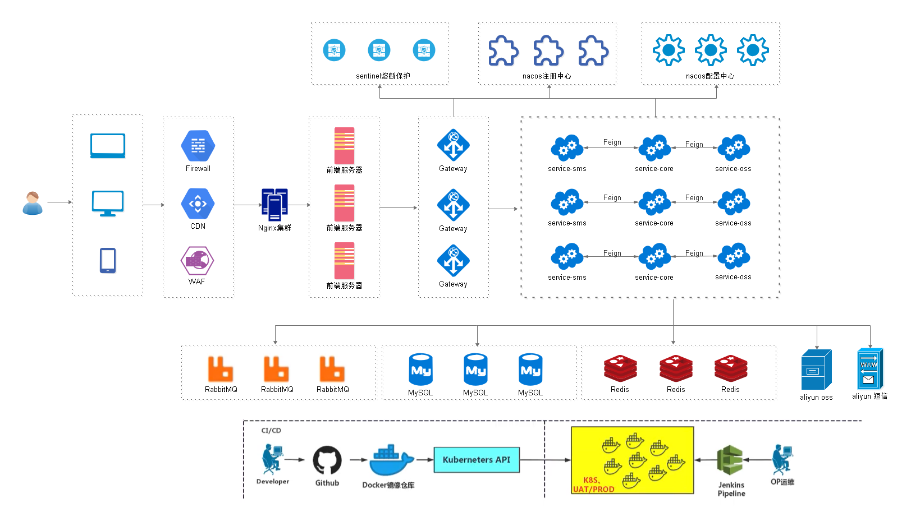
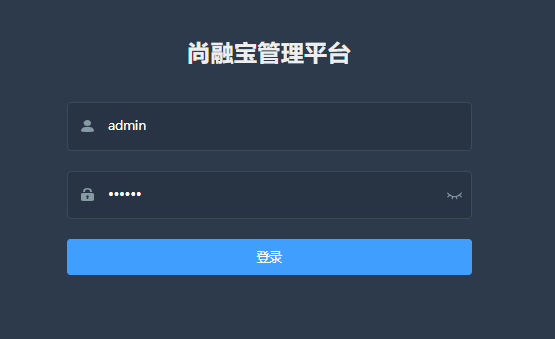
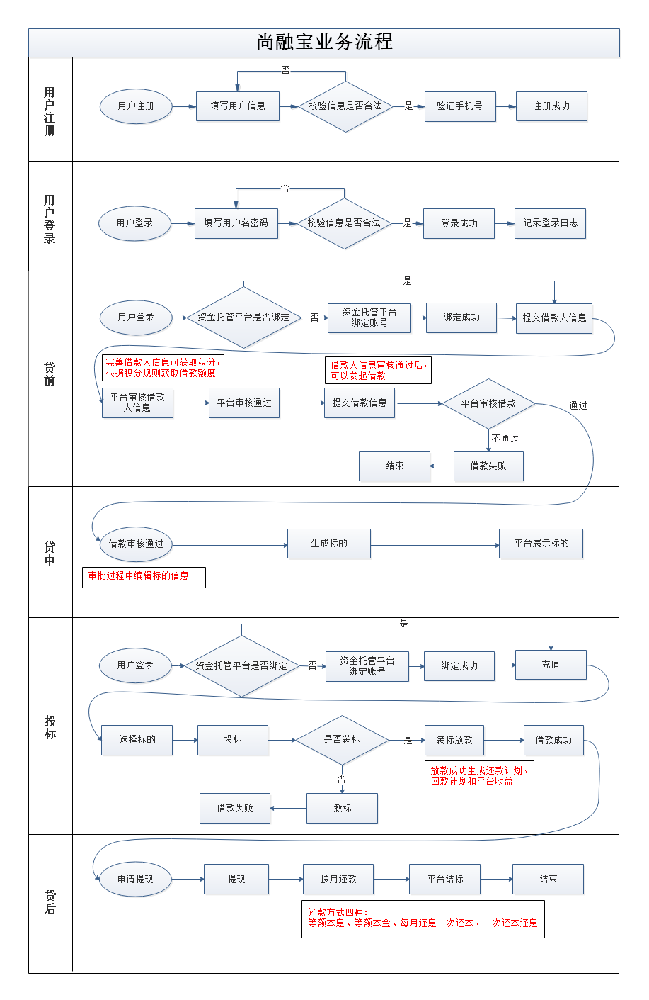

# 01-尚融宝课程介绍

## 一、项目简介

尚融宝是一个网络借贷信息中介服务平台，为个人投资者、个人融资用户和小微企业提供专业的上信贷及出借撮合服务。

行业案例：人人贷`https://www.renrendai.com/、拍拍贷https://www.paipaidai.com/`

## 二、课程介绍

## 三、项目架构

## 四、项目功能演示

### 1、后台管理系统

### 2、前台网站系统

## 五、业务流程总结

