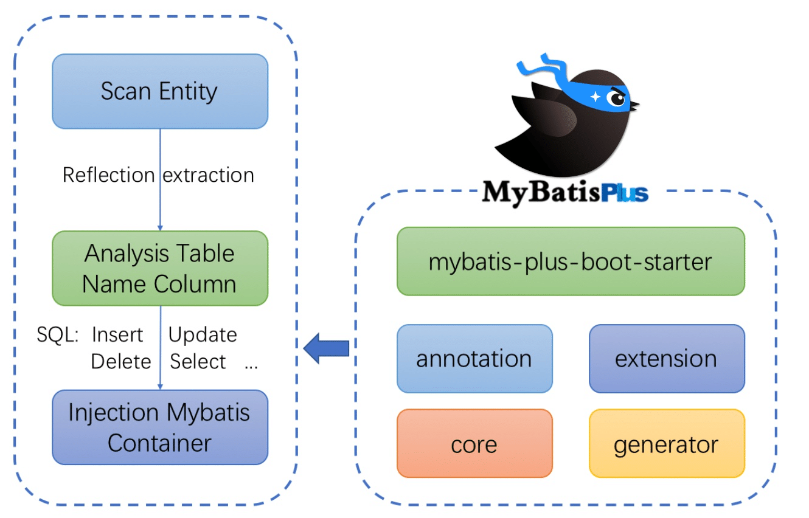
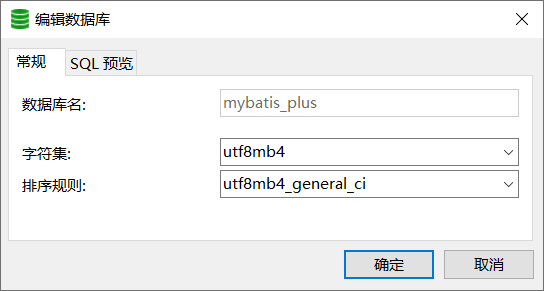
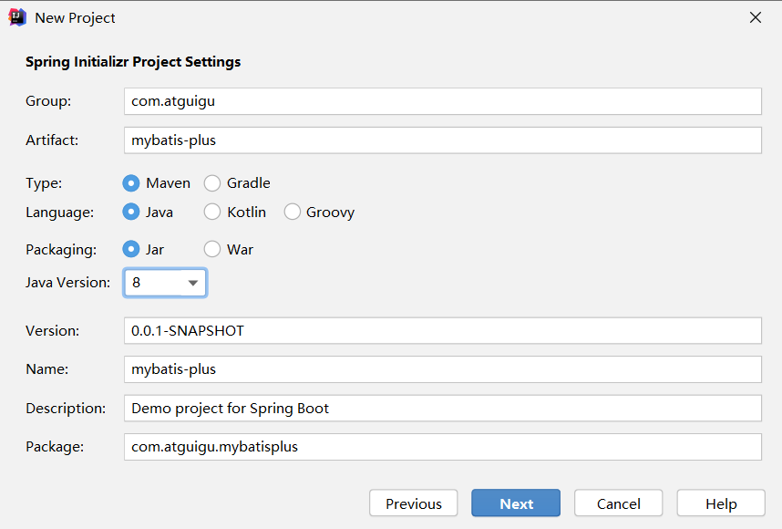
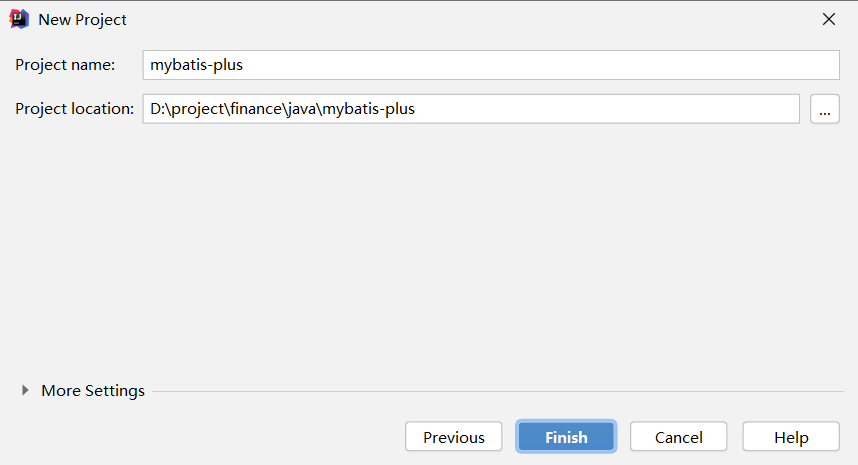
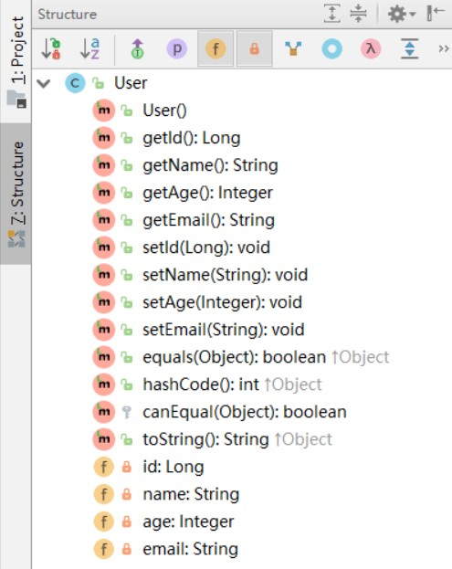

# 01-MyBatis-Plus 入门

## 一、简介

### 1、官网

<http://mp.baomidou.com>

### 2、特点

MyBatis-Plus（简称 MP）是一个MyBatis的增强工具，在 MyBatis 的基础上只做增强不做改变，为简化开发、提高效率而生。


### 3、支持数据库

mysql 、mariadb 、oracle 、db2 、h2 、hsql 、sqlite 、postgresql 、sqlserver 、presto 、Gauss 、Firebird

Phoenix 、clickhouse 、Sybase ASE 、 OceanBase 、达梦数据库 、虚谷数据库 、人大金仓数据库 、南大通用数据库、

### 4、框架结构



## 二、快速入门

### 1、创建数据库

创建数据库：mybatis_plus



创建数据表：user

```sql
CREATE TABLE user
(
 id BIGINT(20) NOT NULL COMMENT '主键ID',
 name VARCHAR(30) NULL DEFAULT NULL COMMENT '姓名',
 age INT(11) NULL DEFAULT NULL COMMENT '年龄',
 email VARCHAR(50) NULL DEFAULT NULL COMMENT '邮箱',
 PRIMARY KEY (id)
);
INSERT INTO user (id, name, age, email) VALUES
(1, 'Jone', 18, 'test1@baomidou.com'),
(2, 'Jack', 20, 'test2@baomidou.com'),
(3, 'Tom', 28, 'test3@baomidou.com'),
(4, 'Sandy', 21, 'test4@baomidou.com'),
(5, 'Billie', 24, 'test5@baomidou.com');
```

### 2、创建SpringBoot工程





### 3、引入依赖

注意： SpringBoot版本修改为2.3.4

```xml
<dependencies>
    <dependency>
        <groupId>org.springframework.boot</groupId>
        <artifactId>spring-boot-starter</artifactId>
    </dependency>

    <dependency>
        <groupId>com.baomidou</groupId>
        <artifactId>mybatis-plus-boot-starter</artifactId>
        <version>3.4.1</version>
    </dependency>
    
    <dependency>
        <groupId>mysql</groupId>
        <artifactId>mysql-connector-java</artifactId>
        <scope>runtime</scope>
    </dependency>
    
    <dependency>
        <groupId>org.projectlombok</groupId>
        <artifactId>lombok</artifactId>
        <optional>true</optional>
    </dependency>
    
    <dependency>
        <groupId>org.springframework.boot</groupId>
        <artifactId>spring-boot-starter-test</artifactId>
        <scope>test</scope>
        <exclusions>
            <exclusion>
                <groupId>org.junit.vintage</groupId>
                <artifactId>junit-vintage-engine</artifactId>
            </exclusion>
        </exclusions>
    </dependency>
    
</dependencies>
```

### 4、修改配置文件

在application.properties配置文件中添加 MySQL 数据库的相关配置：

```properties
#mysql数据库连接
spring.datasource.driver-class-name=com.mysql.cj.jdbc.Driver
spring.datasource.url=jdbc:mysql://localhost:3306/mybatis_plus?serverTimezone=GMT%2B8&characterEncoding=utf-8
spring.datasource.username=root
spring.datasource.password=123456
```

注意： 如果定义了mysql驱动的依赖的版本为5，例如

```xml<version>5.1.47</version>```

则数据库连接配置为

```properties
#mysql数据库连接
spring.datasource.driver-class-name=com.mysql.jdbc.Driver
spring.datasource.url=jdbc:mysql://localhost:3306/mybatis_plus?characterEncoding=utf-8&useSSL=true
spring.datasource.username=root
spring.datasource.password=123456
```

### 5、创建实体类

创建包 entity，编写实体类

User.java，并使用lombok简化

实体类的编写

```java
package com.atguigu.mybatisplus.entity;

@Data
public class User {
    private Long id;
    private String name;
    private Integer age;
    private String email;
}
```

查看编译结果



### 6、创建mapper接口

创建包mapper， 编写Mapper接口：UserMapper.java

```java
package com.atguigu.mybatisplus.mapper;

public interface UserMapper extends BaseMapper<User> {
    
}
```

### 7、启动类添加注解

在 Spring Boot 启动类中添加 @MapperScan注解，扫描 Mapper文件夹

```java
package com.atguigu.mybatisplus;

@SpringBootApplication
@MapperScan("com.atguigu.mybatisplus.mapper")
public class MybatisPlusApplication {
    ......
}
```

### 8、测试

添加测试类，进行功能测试：

```java
package com.atguigu.mybatisplus;

@SpringBootTest
class MybatisPlusApplicationTests {

 //@Autowired //默认按类型装配。是spring的注解
 @Resource //默认按名称装配，找不到与名称匹配的bean，则按照类型装配。是J2EE的注解
 private UserMapper userMapper;
 
 @Test
 void testSelectList() {
  //selectList()方法的参数：封装了查询条件
  //null：无任何查询条件
  List<User> users = userMapper.selectList(null);
  users.forEach(System.out::println);
 }

}
```

通过以上几个简单的步骤，我们就实现了 User 表的 CRUD 功能，甚至连 XML 文件都不用编写！

补充、查看sql输出日志

```properties
#mybatis日志
mybatis-plus.configuration.log-impl=org.apache.ibatis.logging.stdout.StdOutImpl
```
