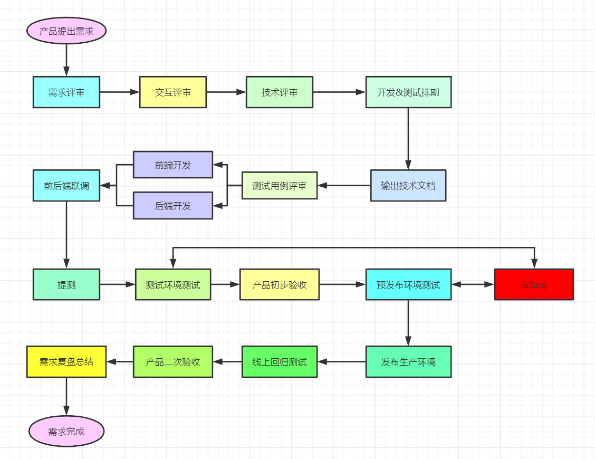
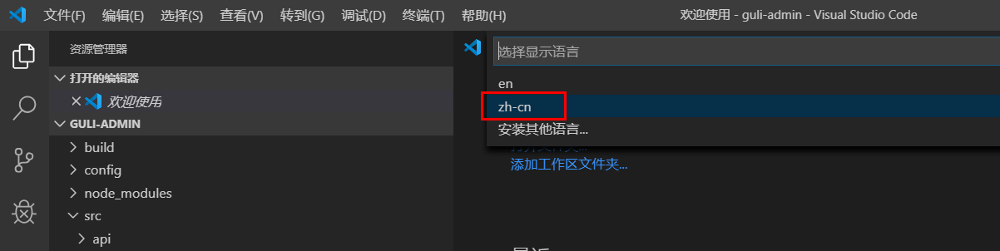
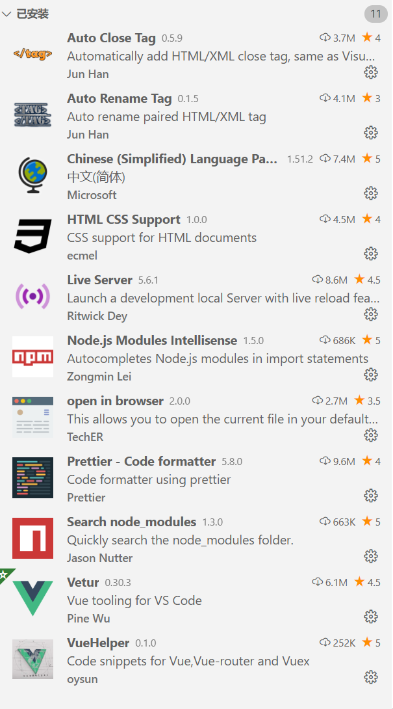

# 00-前端开发和前端开发工具

## 一、软件开发流程

最初所有的开发工作都是由后端工程师完成的，随着业务越来越繁杂，工作量变大，于是我们将项目中的可视化部分和一部分交互功能的开发工作剥离出来，形成了前端开发。

大约从2005年开始正式的前端工程师角色被行业所认可，到了2010年，互联网开始全面进入移动时代，前端开发的工作越来越重要。



## 二、VS Code

### 1、下载和安装

https://code.visualstudio.com/Download

### 2、配置中文插件

* 首先安装中文插件：Chinese (Simplified) Language Pack for Visual Studio Code

* 右下角弹出是否重启vs，点击“yes”

* 有些机器重启后如果界面还是英文，则 点击左边栏Manage -> Command Paletet...【Ctrl+Shift+p】

* 在搜索框中输入“configure display language”，回车

* 选择 zh-cn



### 3、其他插件安装

为方便后续开发，建议安装如下插件



### 4、设置字体大小

左边栏 管理-> 设置->搜索“font”->Font size

### 5、其他设置

vscode配置信息

```json
{
  "editor.fontSize": 14, 
  "editor.tabSize": 2, 
  "editor.defaultFormatter": "esbenp.prettier-vscode", 
  "editor.formatOnSave": true, 
  "prettier.semi": false, 
  "prettier.singleQuote": true, 
  "workbench.colorTheme": "Default Light+", 
}
```
