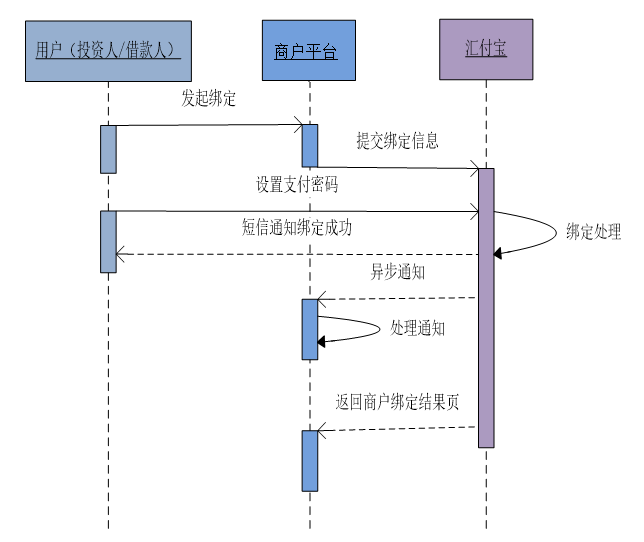
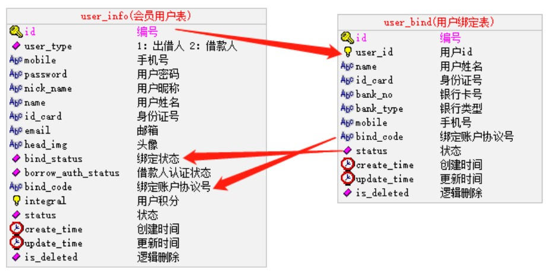

# 01-需求介绍

## 一、运行汇付宝

1、数据库

hfb.sql

2、程序

hfb

3、数据库配置

application-dev.yml 中修改数据库配置

4、启动程序

端口：9999

## 二、参考文档

1、传入参数

参考《汇付宝商户账户技术文档》业务接口 3.1 参数说明

2、返回结果

参考《汇付宝商户账户技术文档》业务接口 3.2 返回/通知结果

3、数据接口

参考《汇付宝商户账户技术文档》业务接口 3.3 账户绑定

## 三、账户绑定

1、账户绑定流程

尚融宝应该在网站引导客户在“资金托管平台“开设账户。也就是说投资人和借款人必须在资金托管平台页面上自主开户，与尚融宝建立对应的账户体系。

以后所有的资金操作都会到“资金托管平台”进行，绑定账户流程如图：



2、相关数据库表(srb 项目)



四，用户中心界面

pages/user/index.vue

```vue
<template>
  <div class="personal-main">
    <div class="pmain-profile">
      <div class="pmain-welcome">
        <span class="fr">上次登录时间： 2020-09-11 14:05:07 </span>
      </div>
      <div class="pmain-user">
        <div class="user-head">
          <span class="head-img" title="点击更换头像">
            <span>
              
              <i class="headframe" style="z-index:0;"></i>
            </span>
          </span>
        </div>
        <div class="user-info">
          <ul>
            <li>
              用户名<span>tg_gpdt0139</span>
              <NuxtLink v-if="$parent.userType === 2" to="/user/borrower">
                立即借款
              </NuxtLink>
            </li>
            <li>
              您还未开通第三方支付账户，请
              <NuxtLink to="/user/bind">立即开通</NuxtLink>
              以确保您的正常使用和资金安全。
            </li>
          </ul>
        </div>
      </div>
      <div class="pmain-money">
        <ul v-if="$parent.userType === 1">
          <li class="none">
            <span>
              <em>账户余额</em>
              <i class="markicon"></i>
            </span>
            <span class="truemoney"><i class="f26 fb">0.00 </i> 元</span>
          </li>
          <li>
            <span>
              <em>冻结金额</em>
              <i class="markicon"></i>
            </span>
            <span class="truemoney"><i class="f26 fb">0.00 </i>元</span>
          </li>
          <li>
            <span>
              <em>累计收益</em>
              <i class="markicon"></i>
            </span>
            <span class="truemoney"><i class="f26 fb c-pink">0.00 </i> 元</span>
          </li>
        </ul>
        <ul v-if="$parent.userType === 2">
          <li class="none">
            <span>
              <em>账户余额</em>
              <i class="markicon"></i>
            </span>
            <span class="truemoney"><i class="f26 fb">0.00 </i> 元</span>
          </li>
          <li>
            <span>
              <em>当前借款金额</em>
              <i class="markicon"></i>
            </span>
            <span class="truemoney"><i class="f26 fb">0.00 </i> 元</span>
          </li>
          <li>
            <span>
              <em>累计借款金额</em>
              <i class="markicon"></i>
            </span>
            <span class="truemoney"><i class="f26 fb c-pink">0.00 </i> 元</span>
          </li>
        </ul>
      </div>
    </div>
  </div>
</template>

<script>
export default {};
</script>
```
