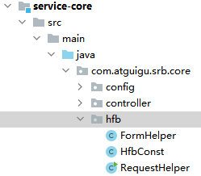

# 02-调用汇付宝实现账户创建

## 一、准备

1、引入 HttpUtils

guigu-common 中引入 HttpUtils 工具类

这个工具类使用了另一个常见的远程连接工具：
java.net.HttpURLConnection

2、添加依赖

service-base 中添加依赖

```xml
<!-- json解析 -->
<dependency>
    <groupId>com.alibaba</groupId>
    <artifactId>fastjson</artifactId>
</dependency>
```

3、添加辅助类 service-core 中添加

FormHelper：构建表单工具

service-core 中添加 HfbConst：常量定义

service-core中添加RequestHelper：签名工具



4、定义 UserBindVO

service-core 中添加

```java
package com.atguigu.srb.core.pojo.vo;

@Data
@ApiModel(description = "账户绑定")
public class UserBindVO {

    @ApiModelProperty(value = "身份证号")
    private String idCard;

    @ApiModelProperty(value = "用户姓名")
    private String name;

    @ApiModelProperty(value = "银行类型")
    private String bankType;

    @ApiModelProperty(value = "银行卡号")
    private String bankNo;

    @ApiModelProperty(value = "手机号")
    private String mobile;

}
```

5、创建枚举

service-core 中创建包 enums，创建枚举 UserBindEnum

```java
package com.atguigu.srb.core.enums;

@AllArgsConstructor
@Getter
public enum UserBindEnum {

    NO_BIND(0, "未绑定"),
    BIND_OK(1, "绑定成功"),
    BIND_FAIL(-1, "绑定失败"),
    ;

    private Integer status;
    private String msg;

}
```

完整的枚举源代码：资料中 java 代码\service-core\enums 目录

## 二、后端接口实现

1、要动态构建的表单模板

pages/user/bind.vue

# 构建一个类似如下内容的模板

```html
<!DOCTYPE html>
<html lang="en" xmlns:th="http://www.thymeleaf.org">
  <head> </head>
  <body>
    <form name="form" action="远程地址" method="post">
      <!-- 参数 -->
      <input type="text" name="mobile" value="13900000000" />
      <input type="text" name="sign" value="123456" />
    </form>
    <script>
      document.form.submit();
    </script>
  </body>
</html>
```

动态模板代码

```vue
<template>
  <div class="personal-main">
    <div class="personal-pay">
      <h3><i>开通第三方账户</i></h3>
      <div class="pay-notice">
        <p>请开通汇付宝存管账户以便于您正常理财</p>
      </div>
      <div class="pay-form">
        <ul>
          <li>
            <label>真实姓名</label>
            <input
              v-model="userBind.name"
              type="text"
              class="pay-txt"
              maxlength="16"
              placeholder="您的真实姓名"
            />
          </li>
          <li>
            <label>身份证号</label>
            <input
              v-model="userBind.idCard"
              type="text"
              class="pay-txt"
              maxlength="18"
              placeholder="您的身份证号"
            />
            <div id="idCardErrorDiv">
              <p style="margin-top: 10px">
                身份证信息认证后将不可修改，请您仔细填写
              </p>
            </div>
          </li>
          <li>
            <label>绑定银行</label>
            <input
              v-model="userBind.bankType"
              type="text"
              class="pay-txt"
              placeholder="银行名称"
            />
          </li>
          <li>
            <label>银行卡号</label>
            <input
              v-model="userBind.bankNo"
              type="text"
              class="pay-txt"
              placeholder="本人持有的银行卡"
            />
          </li>
          <li>
            <label>预留手机</label>
            <input
              v-model="userBind.mobile"
              type="text"
              class="pay-txt"
              placeholder="银行卡预留手机号"
            />
          </li>
          <li>
            <label>&nbsp;</label>
            <input v-model="agree" type="checkbox" />
            我已阅读并同意
            <a href="#" class="c-orange" target="_blank">
              《汇付宝托管账户协议》
            </a>
          </li>
          <li>
            <label>&nbsp;</label>
            <el-button :disabled="!agree" @click="commitBind()" type="primary">
              开户
            </el-button>
          </li>
        </ul>
      </div>
    </div>
  </div>
</template>
```

# js

```js
<script>
export default {
  data() {
    return {
      agree: false,
      userBind: {},
    }
  },

  methods: {
    commitBind() {
      this.$alert(
        '<div style="size: 18px;color: red;">您即将前往汇付宝绑定账号</div>',
        '前往汇付宝资金托管平台',
        {
          dangerouslyUseHTMLString: true,
          confirmButtonText: '立即前往',
          callback: (action) => {
            if (action === 'confirm') {
              this.$axios
                .$post('/api/core/userBind/auth/bind', this.userBind)
                .then((response) => {
                  document.write(response.data.formStr)
                })
            }
          },
        }
      )
    },
  },
}
</script>
```

2、Controller

UserBindController

```java
package com.atguigu.srb.core.controller.api;

@Api(tags = "会员账号绑定")
@RestController
@RequestMapping("/api/core/userBind")
@Slf4j
public class UserBindController {

    @Resource
    private UserBindService userBindService;

    @ApiOperation("账户绑定提交数据")
    @PostMapping("/auth/bind")
    public R bind(@RequestBody UserBindVO userBindVO, HttpServletRequest request) {
        String token = request.getHeader("token");
        Long userId = JwtUtils.getUserId(token);
        String formStr = userBindService.commitBindUser(userBindVO, userId);
        return R.ok().data("formStr", formStr);
    }

}
```

3、Service

接口：UserBindService

````java
/**
**账户绑定提交到托管平台的数据
*/
String commitBindUser(UserBindVO userBindVO, Long userId);
``
相关常量：HfbConst
​```java
/**
* 用户绑定
*/

  //用户绑定汇付宝平台 url 地址
  public static final String USERBIND_URL = "http://localhost:9999/userBind/BindAgreeUserV2";
  //用户绑定异步回调
  public static final String USERBIND_NOTIFY_URL = "http://localhost/api/core/userBind/notify";
  //用户绑定同步回调
  public static final String USERBIND_RETURN_URL = "http://localhost:3000/user";
```
实现：UserBindServiceImpl

```java
@Override
public String commitBindUser(UserBindVO userBindVO, Long userId) {

    //查询身份证号码是否绑定
    QueryWrapper<UserBind> userBindQueryWrapper = new QueryWrapper<>();
    userBindQueryWrapper
        .eq("id_card", userBindVO.getIdCard())
        .ne("user_id", userId);
    UserBind userBind = baseMapper.selectOne(userBindQueryWrapper);
    //USER_BIND_IDCARD_EXIST_ERROR(-301, "身份证号码已绑定"),
    Assert.isNull(userBind, ResponseEnum.USER_BIND_IDCARD_EXIST_ERROR);

    //查询用户绑定信息
    userBindQueryWrapper = new QueryWrapper<>();
    userBindQueryWrapper.eq("user_id", userId);
    userBind = baseMapper.selectOne(userBindQueryWrapper);

    //判断是否有绑定记录
    if(userBind == null) {
        //如果未创建绑定记录，则创建一条记录
        userBind = new UserBind();
        BeanUtils.copyProperties(userBindVO, userBind);
        userBind.setUserId(userId);
        userBind.setStatus(UserBindEnum.NO_BIND.getStatus());
        baseMapper.insert(userBind);
    } else {
        //曾经跳转到托管平台，但是未操作完成，此时将用户最新填写的数据同步到userBind对象
        BeanUtils.copyProperties(userBindVO, userBind);
        baseMapper.updateById(userBind);
    }

    Map<String, Object> paramMap = new HashMap<>();
    paramMap.put("agentId", HfbConst.AGENT_ID);
    paramMap.put("agentUserId", userId);
    paramMap.put("idCard",userBindVO.getIdCard());
    paramMap.put("personalName", userBindVO.getName());
    paramMap.put("bankType", userBindVO.getBankType());
    paramMap.put("bankNo", userBindVO.getBankNo());
    paramMap.put("mobile", userBindVO.getMobile());
    paramMap.put("returnUrl", HfbConst.USERBIND_RETURN_URL);
    paramMap.put("notifyUrl", HfbConst.USERBIND_NOTIFY_URL);
    paramMap.put("timestamp", RequestHelper.getTimestamp());
    paramMap.put("sign", RequestHelper.getSign(paramMap));

    //构建充值自动提交表单
    String formStr = FormHelper.buildForm(HfbConst.USERBIND_URL, paramMap);
    return formStr;

}
````

## 三、前端整合

pages/user/bind.vue

```js
commitBind() {
      this.$alert(
        '<div style="size: 18px;color: red;">您即将前往汇付宝绑定账号</div>',
        '前往汇付宝资金托管平台',{
          dangerouslyUseHTMLString: true,
          confirmButtonText: '立即前往',
          callback: (action) => {
            if (action === 'confirm') {
              this.$axios
                .$post('/api/core/userBind/auth/bind', this.userBind)
                .then((response) => {
                  document.write(response.data.formStr)
                })
            }
          },
        }
      )
},
```

## 四、测试

1、登录

使用借款人账号登录

2、测试

访问http://127.0.0.1:3000/user/bind

3、结果

尚融宝数据库中创建了 user_bind 记录

汇付宝数据库中创建了 user_bind 和 user_account 两条数据记录
