## 1 项目简介

### 1.1 为什么我们要讲电商 ？

因为就互联网平台来说，电商网站有很多典型的特征：

-  访问量大
-  数据量大
- 有一定的业务复杂性
-  涉及支付考虑一定安全性{幂等性}

### 1.2 电商的主要模式

**B2B**

```
B2B （ Business to Business）是指进行电子商务交易的供需双方都是商家（或企业、公司），她（他）们使用了互联网的技术或各种商务网络平台，完成商务交易的过程。电子商务是现代 B2B marketing的一种具体主要的表现形式。

案例：阿里巴巴、慧聪网
```

**C2C**

```
C2C即 Customer（Consumer） to Customer（Consumer），意思就是消费者个人间的电子商务行为。比如一个消费者有一台电脑，通过网络进行交易，把它出售给另外一个消费者，此种交易类型就称为C2C电子商务。

案例：淘宝、易趣、瓜子二手车、闲鱼
```

**B2C**

```
B2C是Business-to-Customer的缩写，而其中文简称为“商对客”。“商对客”是电子商务的一种模式，也就是通常说的直接面向消费者销售产品和服务商业零售模式。这种形式的电子商务一般以网络零售业为主，主要借助于互联网开展在线销售活动。B2C即企业通过互联网为消费者提供一个新型的购物环境——网上商店，消费者通过网络在网上购物、网上支付等消费行为。

案例：唯品会、乐蜂网
```

**C2B**

```
C2B（Consumer to Business，即消费者到企业），是互联网经济时代新的商业模式。这一模式改变了原有生产者（企业和机构）和消费者的关系，是一种消费者贡献价值（Create Value）， 企业和机构消费价值（Consume Value）。

C2B模式和我们熟知的供需模式（DSM, Demand SupplyModel）恰恰相反，真正的C2B 应该先有消费者需求产生而后有企业生产，即先有消费者提出需求，后有生产企业按需求组织生产。通常情况为消费者根据自身需求定制产品和价格，或主动参与产品设计、生产和定价，产品、价格等彰显消费者的个性化需求，生产企业进行定制化生产。

案例：海尔商城、 尚品宅配
```

**O2O**

```
O2O即Online To Offline（在线离线/线上到线下），是指将线下的商务机会与互联网结合，让互联网成为线下交易的平台，这个概念最早来源于美国。O2O的概念非常广泛，既可涉及到线上，又可涉及到线下,可以通称为O2O。主流商业管理课程均对O2O这种新型的商业模式有所介绍及关注。

案例：美团、饿了吗
```

**B2B2C**

```
B2B2C是一种电子商务类型的网络购物商业模式，B是BUSINESS的简称，C是CUSTOMER的简称，第一个B指的是商品或服务的供应商，第二个B指的是从事电子商务的企业，C则是表示消费者。

案例：京东商城、天猫商城
```

**F2C**

### 1.3 项目介绍

#### 1.3.1 技术架构

SpringBoot：简化新Spring应用的初始搭建以及开发过程

SpringCloud：基于Spring Boot实现的云原生应用开发工具，SpringCloud使用的技术：（Spring Cloud Gateway、Spring Cloud Alibaba Nacos、Spring Cloud Alibaba Sentinel、Spring Cloud Task和Spring Cloud Feign等）

MyBatis-Plus：持久层框架

Redis：内存缓存

Redisson：基于redis的Java驻内存数据网格 - 框架

RabbitMQ：消息中间件

ElasticSearch+Kibana: 全文检索服务器+可视化数据监控

ThreadPoolExecutor：线程池来实现异步操作，提供效率

Thymeleaf:页面模板技术

Swagger2：Api接口文档工具

Fastdfs：分布式文件存储 类似于oss

支付宝支付：alipay.com

Mysql：关系型数据库 {mycat/sharding-jdbc 进行分库，分表}

Lombok: 实体类的中get，set 生成的jar包

ngrok：内网穿透

Docker：容器技术

Git：代码管理工具

DockerFile：管理Docker镜像命令文本

Jenkins：持续集成工具

Vue.js：web 界面的渐进式框架

Node.js： JavaScript 运行环境

NPM：包管理器

#### 1.3.2 技术亮点

分布式架构、缓存管理、分布式事务、单点登录、商品后台管理、文件管理系统

#### 1.3.3 硬件配置

1. 建议内存8个G以上

### 1.4 项目架构

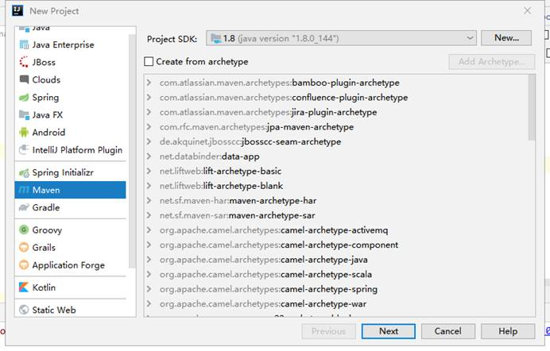

**服务器端：**

SpringBoot + SpringCloudAlibaba + MyBatis-Plus + Redis + RabbitMQ + Fastdfs+ MySQL + Elasticsearch

**前端：**

管理后台：vue + element-ui + nodejs + npm

电商网站：spring boot + thymeleaf + vue

**其他：**

Redisson实现分异步编排

分布式布式锁

三方支付使用支付宝

使用Swagger生成接口文档

部署方案：

Jenkins+docker+maven+git

### 1.5 业务简介

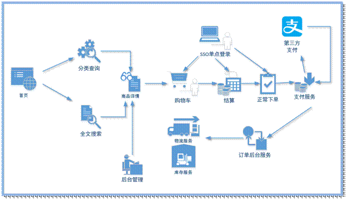

| 首页     | 静态页面，包含了商品分类，搜索栏，商品广告位。 |
| -------- | ---------------------------------------------- |
| 全文搜索 | 通过搜索栏填入的关键字进行搜索，并列表展示     |
| 分类查询 | 根据首页的商品类目进行查询                     |
| 商品详情 | 商品的详细信息展示                             |
| 购物车   | 将有购买意向的商品临时存放的地方               |
| 单点登录 | 用户统一登录的管理                             |
| 结算     | 将购物车中勾选的商品初始化成要填写的订单       |
| 下单     | 填好的订单提交                                 |
| 支付服务 | 下单后，用户点击支付，负责对接第三方支付系统。 |
| 订单服务 | 负责确认订单是否付款成功，并对接仓储物流系统。 |
| 仓储物流 | 独立的管理系统，负责商品的库存。               |
| 后台管理 | 主要维护类目、商品、库存单元、广告位等信息。   |
| 秒杀     | 秒杀抢购完整方案                               |

## 2 环境设置

### 2.1 maven配置

基本设置

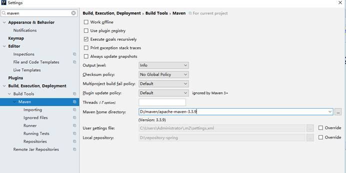

默认设置

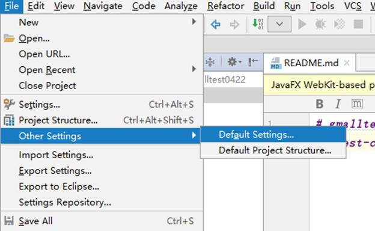

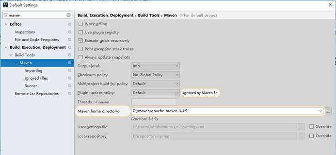


以后不管在idea 中开启多少个窗口，则maven 的仓库地址不会发生变化！

### 2.2 虚拟机配置

#### 2.2.1 配置虚拟机

第一步：


第二步：改NAT模式的子网IP：192.168.200.0

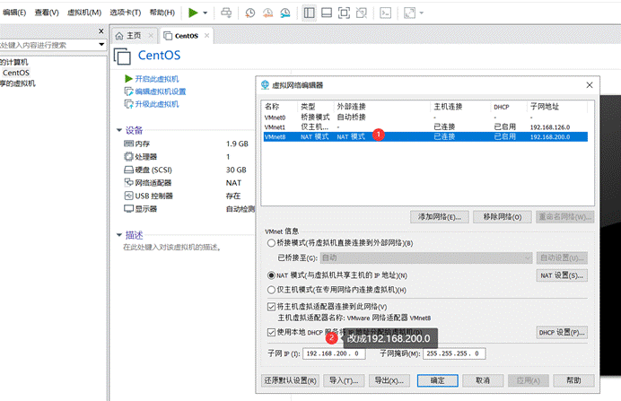

第三步：确定

第四步：启动虚拟机

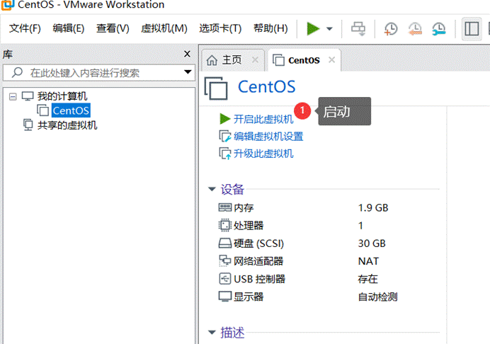

#### 2.2.2登录虚拟机

Ip:192.168.200.128

登录用户：root

登录密码：123456

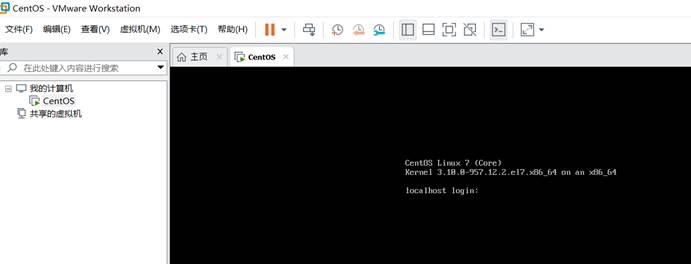


#### 2.2.3 查看虚拟机中安装的软件

查看所有安装的软件命令如下

docker ps -a

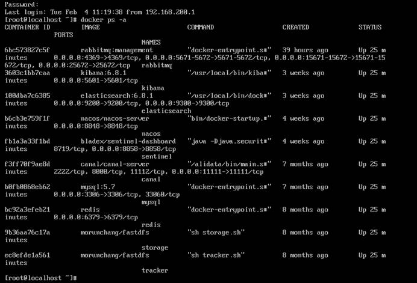

#### 2.2.4 连接虚拟机

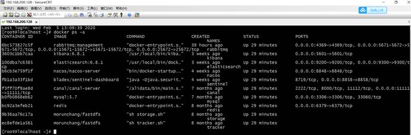

使用第三方工具连接mysql 用户名/密码：root/123456

nacos: http://192.168.200.128:8848/nacos

sentinel: http://192.168.200.128:8858/#/dashboard

用户名：密码：sentinel

rabbitmq: http://192.168.200.128:15672/#/ 用户名/密码 guest/guest

es: http://192.168.200.128:9200/

kibana：http://192.168.200.128:5601/app/kibana

Zikpkin: http://192.168.200.128:9411/zipkin/

### 2.3 本地Hosts修改

修改系统C:\Windows\System32\drivers\etc\hosts文件

```
192.168.200.128 file.service.com
192.168.200.128 www.gmall.com
192.168.200.128 item.gmall.com
192.168.200.128 order.gmall.com
192.168.200.128 payment.gmall.com
192.168.200.128 activity.gmall.com
192.168.200.128 passport.gmall.com
192.168.200.128 cart.gmall.com
192.168.200.128 list.gmall.com
192.168.200.128 api.gmall.com
```

## 3 初始工程搭建

### 3.1 搭建gmall-parent

打开idea，选择File–>New–>Project,操作如下


选择下一步

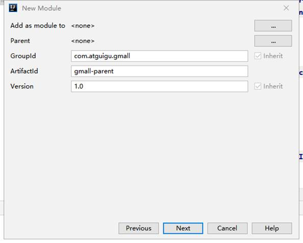

配置：

groupId：com.atguigu.gmall

artifactId：gmall-parent

选择下一步

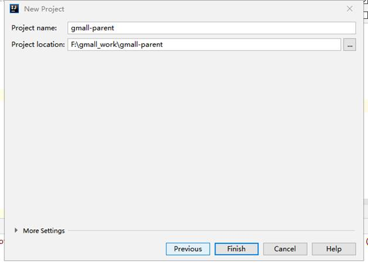

完成

工程结构如下

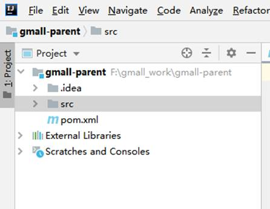

由于这是一个父工程，删除src目录

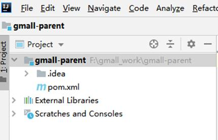

```xml
<?xml version="1.0" encoding="UTF-8"?>
<project xmlns="http://maven.apache.org/POM/4.0.0"
         xmlns:xsi="http://www.w3.org/2001/XMLSchema-instance"
         xsi:schemaLocation="http://maven.apache.org/POM/4.0.0 http://maven.apache.org/xsd/maven-4.0.0.xsd">
    <modelVersion>4.0.0</modelVersion>
    <modules>
        <module>common</module>
        <module>model</module>
        <module>service</module>
    </modules>

    <!--引入spring boot 版本依赖-->
    <parent>
        <groupId>org.springframework.boot</groupId>
        <artifactId>spring-boot-starter-parent</artifactId>
        <version>2.2.1.RELEASE</version>
    </parent>
    <groupId>com.atguigu.gmall</groupId>
    <artifactId>gmall-parent</artifactId>
    <version>1.0</version>

    <!--规定是一个父工程-->
    <packaging>pom</packaging>
    <!--添加依赖-->
    <!--定义jar包的版本号-->
    <properties>
        <java.version>1.8</java.version>
        <cloud.version>Hoxton.RELEASE</cloud.version>
        <cloud.alibaba.version>0.2.2.RELEASE</cloud.alibaba.version>
        <gmall.version>1.0</gmall.version>
        <mybatis-plus.version>3.0.5</mybatis-plus.version>
        <mysql.version>5.1.46</mysql.version>
        <swagger.version>2.7.0</swagger.version>
        <fastdfs.version>1.27.0.0</fastdfs.version>
        <lombok.version>1.18.10</lombok.version>
    </properties>
    <!--配置dependencyManagement锁定依赖的版本 并不是实际的依赖。-->
    <dependencyManagement>
        <dependencies>
            <dependency>
                <groupId>org.springframework.cloud</groupId>
                <artifactId>spring-cloud-dependencies</artifactId>
                <version>${cloud.version}</version>
                <type>pom</type>
                <scope>import</scope>
            </dependency>

            <dependency>
                <groupId>org.springframework.cloud</groupId>
                <artifactId>spring-cloud-alibaba-dependencies</artifactId>
                <version>${cloud.alibaba.version}</version>
                <type>pom</type>
                <scope>import</scope>
            </dependency>

            <!--mybatis-plus 持久层-->
            <dependency>
                <groupId>com.baomidou</groupId>
                <artifactId>mybatis-plus-boot-starter</artifactId>
                <version>${mybatis-plus.version}</version>
            </dependency>

            <dependency>
                <groupId>mysql</groupId>
                <artifactId>mysql-connector-java</artifactId>
                <version>${mysql.version}</version>
            </dependency>

            <!--swagger-->
            <dependency>
                <groupId>io.springfox</groupId>
                <artifactId>springfox-swagger2</artifactId>
                <version>${swagger.version}</version>
            </dependency>
            <!--swagger ui-->
            <dependency>
                <groupId>io.springfox</groupId>
                <artifactId>springfox-swagger-ui</artifactId>
                <version>${swagger.version}</version>
            </dependency>

            <dependency>
                <groupId>net.oschina.zcx7878</groupId>
                <artifactId>fastdfs-client-java</artifactId>
                <version>${fastdfs.version}</version>
            </dependency>

            <dependency>
                <groupId>org.projectlombok</groupId>
                <artifactId>lombok</artifactId>
                <version>${lombok.version}</version>
            </dependency>
        </dependencies>
    </dependencyManagement>

    <!--maven 的中央仓库？ 私服{nexus}？ setting.xml-->
    <repositories>
        <repository>
            <id>nexus-aliyun</id>
            <name>Nexus aliyun</name>
            <layout>default</layout>
            <url>http://maven.aliyun.com/nexus/content/groups/public</url>
            <snapshots>
                <enabled>false</enabled>
            </snapshots>
            <releases>
                <enabled>true</enabled>
            </releases>
        </repository>
    </repositories>

</project>
```


### 3.2 搭建common父模块

common：公共模块父节点

common-util：工具类模块，所有模块都可以依赖于它

service-util：service服务的工具包，包含service服务的公共配置类，所有service模块依赖于它

点击gmall-parent，选择New–>Module,操作如下


选择下一步

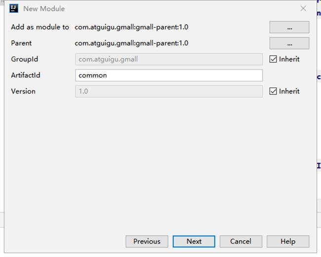

选择下一步

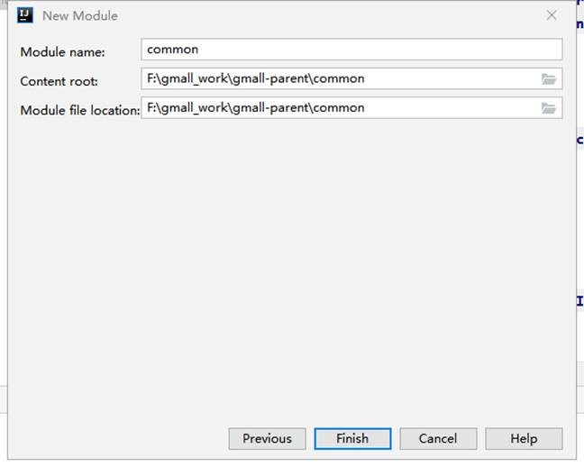

完成，删除src目录，结构如下

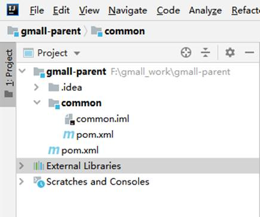

```xml
<?xml version="1.0" encoding="UTF-8"?>
<project xmlns="http://maven.apache.org/POM/4.0.0"
         xmlns:xsi="http://www.w3.org/2001/XMLSchema-instance"
         xsi:schemaLocation="http://maven.apache.org/POM/4.0.0 http://maven.apache.org/xsd/maven-4.0.0.xsd">
    <parent>
        <artifactId>gmall-parent</artifactId>
        <groupId>com.atguigu.gmall</groupId>
        <version>1.0</version>
    </parent>
    <modelVersion>4.0.0</modelVersion>

    <artifactId>common</artifactId>
    <!--父项目-->
    <packaging>pom</packaging>
    <modules>
        <module>common-util</module>
        <module>service-util</module>
    </modules>
    <dependencies>
        <dependency>
            <groupId>org.springframework.boot</groupId>
            <artifactId>spring-boot-starter-web</artifactId>
            <scope>provided </scope>
        </dependency>

        <!--lombok用来简化实体类：需要安装lombok插件-->
        <dependency>
            <groupId>org.projectlombok</groupId>
            <artifactId>lombok</artifactId>
        </dependency>

        <!--swagger-->
        <dependency>
            <groupId>io.springfox</groupId>
            <artifactId>springfox-swagger2</artifactId>
        </dependency>

        <dependency>
            <groupId>io.springfox</groupId>
            <artifactId>springfox-swagger-ui</artifactId>
        </dependency>
        <!--用来转换json使用 {JavaObject - json | json - JavaObject}-->
        <dependency>
            <groupId>com.alibaba</groupId>
            <artifactId>fastjson</artifactId>
            <version>1.2.29</version>
        </dependency>

        <!-- 服务调用feign -->
        <dependency>
            <groupId>org.springframework.cloud</groupId>
            <artifactId>spring-cloud-starter-openfeign</artifactId>
            <scope>provided </scope>
        </dependency>

    </dependencies>

</project>
```


### 3.3 搭建common-util模块

点击common，选择New–>Module,操作如下

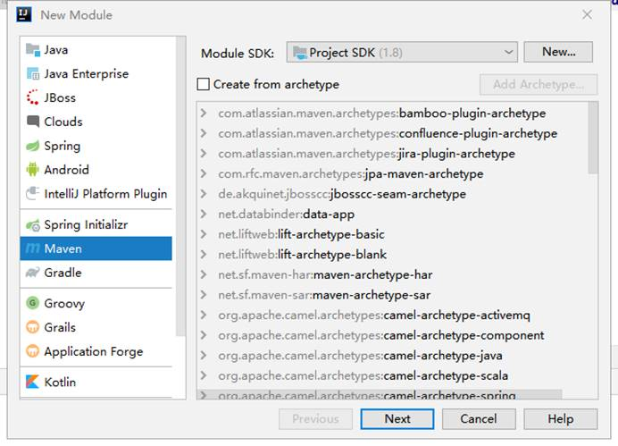

选择下一步

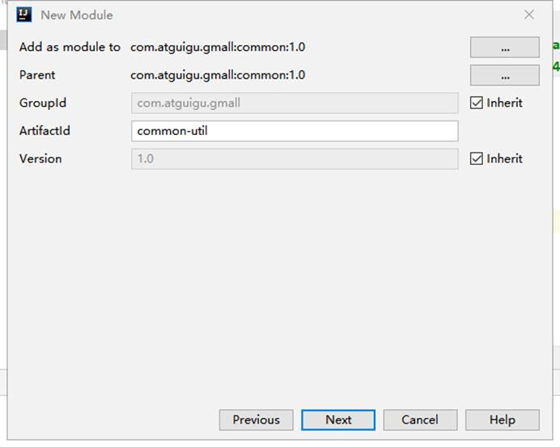

选择下一步

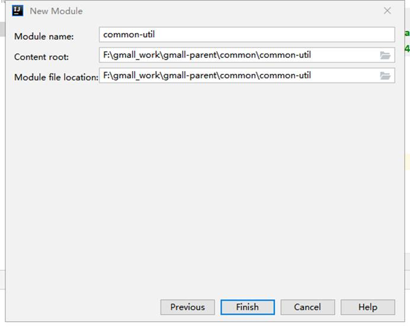

完成，结构如下

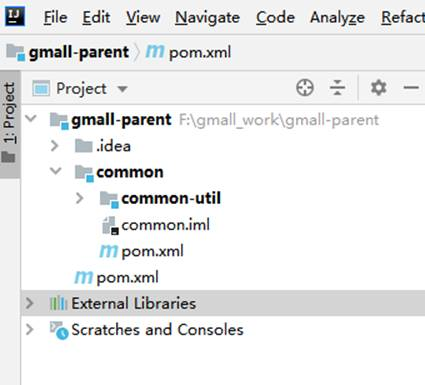

```xml
<?xml version="1.0" encoding="UTF-8"?>
<project xmlns="http://maven.apache.org/POM/4.0.0"
         xmlns:xsi="http://www.w3.org/2001/XMLSchema-instance"
         xsi:schemaLocation="http://maven.apache.org/POM/4.0.0 http://maven.apache.org/xsd/maven-4.0.0.xsd">
    <parent>
        <artifactId>common</artifactId>
        <groupId>com.atguigu.gmall</groupId>
        <version>1.0</version>
    </parent>
    <modelVersion>4.0.0</modelVersion>

    <artifactId>common-util</artifactId>
    <!--添加依赖-->
    <dependencies>
        <dependency>
            <groupId>org.apache.httpcomponents</groupId>
            <artifactId>httpclient</artifactId>
        </dependency>
    </dependencies>

</project>
```

 添加公共工具类


| `GmallException`  | 自定义全局异常              |
| ----------------- | --------------------------- |
| Result            | API统一返回结果封装类       |
| ResultCodeEnum    | API统一返回结果状态信息     |
| AuthContextHolder | 获取登录用户信息类          |
| `HttpClientUtil`  | http客户端类                |
| `MD5`             | 通过MD5给字符串加密的工具类 |
| `IpUtil`          | 获取Ip地址的工具类          |


### 3.4 搭建service-util模块

搭建过程同common-util

如图


```xml
<?xml version="1.0" encoding="UTF-8"?>
<project xmlns="http://maven.apache.org/POM/4.0.0"
         xmlns:xsi="http://www.w3.org/2001/XMLSchema-instance"
         xsi:schemaLocation="http://maven.apache.org/POM/4.0.0 http://maven.apache.org/xsd/maven-4.0.0.xsd">
    <parent>
        <artifactId>common</artifactId>
        <groupId>com.atguigu.gmall</groupId>
        <version>1.0</version>
    </parent>
    <modelVersion>4.0.0</modelVersion>

    <artifactId>service-util</artifactId>
    <dependencies>
        <dependency>
            <groupId>com.atguigu.gmall</groupId>
            <artifactId>common-util</artifactId>
            <version>1.0</version>
        </dependency>

        <!-- redis -->
        <dependency>
            <groupId>org.springframework.boot</groupId>
            <artifactId>spring-boot-starter-data-redis</artifactId>
        </dependency>

        <!-- spring2.X集成redis所需common-pool2-->
        <dependency>
            <groupId>org.apache.commons</groupId>
            <artifactId>commons-pool2</artifactId>
            <version>2.6.0</version>
        </dependency>

        <!-- redisson 分布式锁-->
        <dependency>
            <groupId>org.redisson</groupId>
            <artifactId>redisson</artifactId>
            <version>3.11.2</version>
        </dependency>

        <!--mybatis-plus-->
        <dependency>
            <groupId>com.baomidou</groupId>
            <artifactId>mybatis-plus-boot-starter</artifactId>
            <scope>provided</scope>
        </dependency>

    </dependencies>

</project>
```

添加service-util公共类

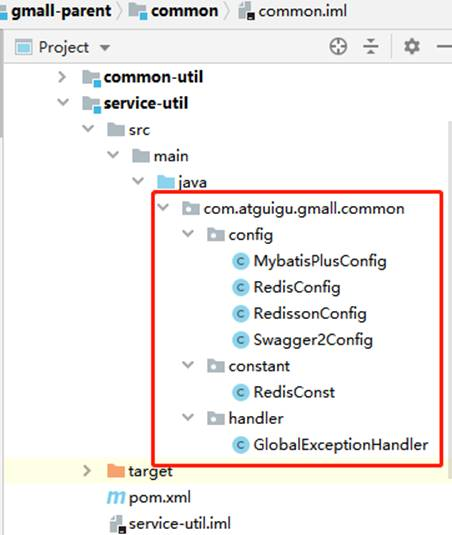

| `MybatisPlusConfig`      | MybatisPlus配置类 |
| ------------------------ | ----------------- |
| `RedisConfig`            | Redis配置类       |
| `RedissonConfig`         | Redisson配置类    |
| `Swagger2Config`         | Swagger2配置类    |
| `RedisConst`             | Redis常量配置类   |
| `GlobalExceptionHandler` | 全局异常处理类    |


### 3.5 搭建model模块

点击gmall-parent 父工程 选择module

导入实体类：

搭建过程同common父模块

```xml
<?xml version="1.0" encoding="UTF-8"?>
<project xmlns="http://maven.apache.org/POM/4.0.0"
         xmlns:xsi="http://www.w3.org/2001/XMLSchema-instance"
         xsi:schemaLocation="http://maven.apache.org/POM/4.0.0 http://maven.apache.org/xsd/maven-4.0.0.xsd">
    <parent>
        <artifactId>gmall-parent</artifactId>
        <groupId>com.atguigu.gmail</groupId>
        <version>1.0-SNAPSHOT</version>
    </parent>
    <modelVersion>4.0.0</modelVersion>

    <artifactId>model</artifactId>

    <description>实体模块</description>

    <!--引入相关依赖-->
    <dependencies>
        <dependency>
            <groupId>org.projectlombok</groupId>
            <artifactId>lombok</artifactId>
        </dependency>

        <!--mybatis-plus-->
        <dependency>
            <groupId>com.baomidou</groupId>
            <artifactId>mybatis-plus-boot-starter</artifactId>
            <scope>provided </scope>
        </dependency>

        <!--swagger-->
        <dependency>
            <groupId>io.springfox</groupId>
            <artifactId>springfox-swagger2</artifactId>
            <scope>provided </scope>
        </dependency>

        <!--引入es 相关配置jar-->
        <dependency>
            <groupId>org.springframework.boot</groupId>
            <artifactId>spring-boot-starter-data-elasticsearch</artifactId>
            <scope>provided </scope>
        </dependency>
    </dependencies>
</project>
```

### 3.6 搭建service父模块

搭建过程同common父模块

```xml
<?xml version="1.0" encoding="UTF-8"?>
<project xmlns="http://maven.apache.org/POM/4.0.0"
         xmlns:xsi="http://www.w3.org/2001/XMLSchema-instance"
         xsi:schemaLocation="http://maven.apache.org/POM/4.0.0 http://maven.apache.org/xsd/maven-4.0.0.xsd">
    <parent>
        <artifactId>gmall-parent</artifactId>
        <groupId>com.atguigu.gmall</groupId>
        <version>1.0</version>
    </parent>
    <modelVersion>4.0.0</modelVersion>

    <artifactId>service</artifactId>
    <packaging>pom</packaging>
    <modules>
        <module>service-product</module>
    </modules>

    <dependencies>
        <!--依赖服务的工具类-->
        <dependency>
            <groupId>com.atguigu.gmall</groupId>
            <artifactId>service-util</artifactId>
            <version>1.0</version>
        </dependency>
        <!--数据载体-->
        <dependency>
            <groupId>com.atguigu.gmall</groupId>
            <artifactId>model</artifactId>
            <version>1.0</version>
        </dependency>

        <!--web 需要启动项目-->
        <dependency>
            <groupId>org.springframework.boot</groupId>
            <artifactId>spring-boot-starter-web</artifactId>
        </dependency>

        <!--mybatis-plus-->
        <dependency>
            <groupId>com.baomidou</groupId>
            <artifactId>mybatis-plus-boot-starter</artifactId>
        </dependency>

        <!--mysql-->
        <dependency>
            <groupId>mysql</groupId>
            <artifactId>mysql-connector-java</artifactId>
        </dependency>

        <!-- 服务注册 -->
        <dependency>
            <groupId>org.springframework.cloud</groupId>
            <artifactId>spring-cloud-starter-alibaba-nacos-discovery</artifactId>
        </dependency>

        <!-- 服务调用feign -->
        <dependency>
            <groupId>org.springframework.cloud</groupId>
            <artifactId>spring-cloud-starter-openfeign</artifactId>
        </dependency>

        <!-- 流量控制 -->
        <dependency>
            <groupId>org.springframework.cloud</groupId>
            <artifactId>spring-cloud-starter-alibaba-sentinel</artifactId>
        </dependency>

        <!--开发者工具-->
        <dependency>
            <groupId>org.springframework.boot</groupId>
            <artifactId>spring-boot-devtools</artifactId>
            <optional>true</optional>
        </dependency>

        <!--链路追踪-->
        <dependency>
            <groupId>org.springframework.cloud</groupId>
            <artifactId>spring-cloud-starter-zipkin</artifactId>
        </dependency>
    </dependencies>
</project>
```

## 4 分类管理

### 4.1 搭建service-product

修改pom.xml

```xml
<?xml version="1.0" encoding="UTF-8"?>
<project xmlns="http://maven.apache.org/POM/4.0.0"
         xmlns:xsi="http://www.w3.org/2001/XMLSchema-instance"
         xsi:schemaLocation="http://maven.apache.org/POM/4.0.0 http://maven.apache.org/xsd/maven-4.0.0.xsd">
    <parent>
        <artifactId>service</artifactId>
        <groupId>com.atguigu.gmall</groupId>
        <version>1.0</version>
    </parent>
    <modelVersion>4.0.0</modelVersion>

    <artifactId>service-product</artifactId>
    <!--添加的分布式文件系统jar-->
    <dependencies>
        <dependency>
            <groupId>net.oschina.zcx7878</groupId>
            <artifactId>fastdfs-client-java</artifactId>
        </dependency>
    </dependencies>

</project>
```

application.yml

```yml
spring:
  application:
    name: service-product
  profiles:
    active: dev
  cloud:
    nacos:
      discovery:
        server-addr: 192.168.200.128:8848
```

application-dev.yml

```yml
server:
  port: 8206

mybatis-plus:
  configuration:
    log-impl: org.apache.ibatis.logging.stdout.StdOutImpl
  mapper-locations: classpath:mapper/*.xml # 编写复杂的sql 语句 ，mybatis-plus 对多表关联支持性差。手写xml文件{sql语句}

spring:
  zipkin:
    base-url: http://192.168.200.128:9411
    discovery-client-enabled: false
    sender:
      type: web
  sleuth:
    sampler:
      probability: 1
  cloud:
    sentinel:
      transport:
        dashboard: http://192.168.200.128:8858
  rabbitmq:
    host: 192.168.200.128
    port: 5672
    username: guest
    password: guest
  redis:
    host: 192.168.200.128
    port: 6379
    database: 0
    timeout: 1800000
    password:
    lettuce:
      pool:
        max-active: 20 #最大连接数
        max-wait: -1    #最大阻塞等待时间(负数表示没限制)
        max-idle: 5    #最大空闲
        min-idle: 0     #最小空闲
  datasource:
    type: com.zaxxer.hikari.HikariDataSource
    driver-class-name: com.mysql.jdbc.Driver
    url: jdbc:mysql://192.168.200.128:3306/gmall_product?characterEncoding=utf-8&useSSL=false
    username: root
    password: root
    hikari:
      connection-test-query: SELECT 1 # 自动检测连接
      connection-timeout: 60000 #数据库连接超时时间,默认30秒
      idle-timeout: 500000 #空闲连接存活最大时间，默认600000（10分钟）
      max-lifetime: 540000 #此属性控制池中连接的最长生命周期，值0表示无限生命周期，默认1800000即30分钟
      maximum-pool-size: 12 #连接池最大连接数，默认是10
      minimum-idle: 10 #最小空闲连接数量
      pool-name: SPHHikariPool # 连接池名称
  jackson:
    date-format: yyyy-MM-dd HH:mm:ss
    time-zone: GMT+8
fileServer:
  url: http://192.168.200.128:8080/ # fastDFS 分布式文件系统的 ip:port
```

### 4.2 代码实现

8个基本操作:

- id查询
- 查询全部
- 新增
- 修改
- 删除
- 条件查询
- 分页查询
- 分页条件查询

Mapper

```java
package com.atguigu.gmall.product.mapper;

import com.atguigu.gmall.model.product.BaseCategory1;
import com.baomidou.mybatisplus.core.mapper.BaseMapper;
import org.apache.ibatis.annotations.Mapper;

/**
 * 一级分类的Mapper映射
 */
@Mapper
public interface BaseCategory1Mapper extends BaseMapper<BaseCategory1> {
}
```

service

```java
package com.atguigu.gmall.product.service;

import com.atguigu.gmall.model.product.BaseCategory1;
import com.baomidou.mybatisplus.extension.service.IService;

import java.util.List;

/**
 * 一级分类信息的service接口类
 */
public interface BaseCategory1Service extends IService<BaseCategory1>{
    /**
     * 条件查询
     * @param baseCategory1
     * @return
     */
    public List<BaseCategory1> search(BaseCategory1 baseCategory1);

    /**
     * 分页查询
     * @param page
     * @param size
     * @return
     */
    public List<BaseCategory1> pageSearch(Integer page, Integer size);

    /**
     * 条件分页查询
     * @param baseCategory1
     * @param page
     * @param size
     * @return
     */
    public List<BaseCategory1> search(BaseCategory1 baseCategory1,
                                      Integer page,
                                      Integer size);
}
```

实现类

```java
package com.atguigu.gmall.product.service.impl;

import com.atguigu.gmall.model.product.BaseCategory1;
import com.atguigu.gmall.product.mapper.BaseCategory1Mapper;
import com.atguigu.gmall.product.service.BaseCategory1Service;
import com.baomidou.mybatisplus.core.conditions.query.LambdaQueryWrapper;
import com.baomidou.mybatisplus.core.metadata.IPage;
import com.baomidou.mybatisplus.extension.plugins.pagination.Page;
import com.baomidou.mybatisplus.extension.service.impl.ServiceImpl;
import org.apache.commons.lang3.StringUtils;
import org.springframework.beans.factory.annotation.Autowired;
import org.springframework.stereotype.Service;

import java.util.List;

/**
 * 一级分类的实现类
 */
@Service
public class BaseCategory1ServiceImpl
        extends ServiceImpl<BaseCategory1Mapper, BaseCategory1>
        implements BaseCategory1Service {

    @Autowired
    private BaseCategory1Mapper baseCategory1Mapper;

    /**
     * 条件查询
     *
     * @param baseCategory1
     * @return
     */
    @Override
    public List<BaseCategory1> search(BaseCategory1 baseCategory1) {
        //判断查询参数是否为空
        if(baseCategory1 == null){
            //若没有条件查询全部
            return baseCategory1Mapper.selectList(null);
        }
        LambdaQueryWrapper wrapper = getCondition(baseCategory1);
        //执行查询
        List<BaseCategory1> baseCategory1s = baseCategory1Mapper.selectList(wrapper);
        //返回结果
        return baseCategory1s;
    }

    /**
     * 分页查询
     *
     * @param page
     * @param size
     * @return
     */
    @Override
    public List<BaseCategory1> pageSearch(Integer page, Integer size) {
        //执行查询
        IPage<BaseCategory1> resutl = baseCategory1Mapper.selectPage(new Page<>(page, size), null);
        //返回结果
        return resutl.getRecords();
    }

    /**
     * 条件分页查询
     *
     * @param baseCategory1
     * @param page
     * @param size
     * @return
     */
    @Override
    public List<BaseCategory1> search(BaseCategory1 baseCategory1, Integer page, Integer size) {
        //构建查询条件
        LambdaQueryWrapper wrapper = getCondition(baseCategory1);
        //分页查询
        IPage<BaseCategory1> resutl = baseCategory1Mapper.selectPage(new Page<>(page, size), wrapper);
        //获取结果
        return resutl.getRecords();
    }

    /**
     * 构建查询条件
     * @param baseCategory1
     * @return
     */
    private LambdaQueryWrapper getCondition(BaseCategory1 baseCategory1){
        //定义条件构造器
        LambdaQueryWrapper<BaseCategory1> wrapper = new LambdaQueryWrapper<>();
        //若id不为空
        if(baseCategory1.getId() != null){
            wrapper.eq(BaseCategory1::getId, baseCategory1.getId());
        }
        //若name不为空
        if(StringUtils.isNotEmpty(baseCategory1.getName())){
            wrapper.like(BaseCategory1::getName, baseCategory1.getName());
        }
        return wrapper;
    }
}
```

Controller

```java
package com.atguigu.gmall.product.controller;

import com.atguigu.gmall.common.result.Result;
import com.atguigu.gmall.model.product.BaseCategory1;
import com.atguigu.gmall.product.service.BaseCategory1Service;
import org.springframework.beans.factory.annotation.Autowired;
import org.springframework.web.bind.annotation.*;

import java.util.List;

/**
 * 一级分类的controller层
 */
@RestController
@RequestMapping(value = "/category1")
public class BaseCategory1Controller {

    @Autowired
    private BaseCategory1Service baseCategory1Service;

    /**
     * 根据id查询
     * @param id
     * @return
     */
    @GetMapping(value = "/findById/{id}")
    public Result<BaseCategory1> findById(@PathVariable(value = "id") Integer id){
        BaseCategory1 category1 = baseCategory1Service.getById(id);
        return Result.ok(category1);
    }

    /**
     * 查询所有的一级分类
     * @return
     */
    @GetMapping(value = "/findAll")
    public Result<List<BaseCategory1>> findAll(){
        List<BaseCategory1> baseCategory1s = baseCategory1Service.list(null);
        return Result.ok(baseCategory1s);
    }

    /**
     * 新增
     * @param baseCategory1
     * @return
     */
    @PostMapping(value = "/save")
    public Result save(@RequestBody BaseCategory1 baseCategory1){
        baseCategory1Service.save(baseCategory1);
        return Result.ok();
    }

    /**
     * 修改
     * @param baseCategory1
     * @return
     */
    @PutMapping(value = "/update")
    public Result update(@RequestBody BaseCategory1 baseCategory1){
        baseCategory1Service.updateById(baseCategory1);
        return Result.ok();
    }

    /**
     * 删除
     * @param id
     * @return
     */
    @DeleteMapping(value = "/delete/{id}")
    public Result delete(@PathVariable(value = "id") Long id){
        baseCategory1Service.removeById(id);
        return Result.ok();
    }

    /**
     * 条件查询
     * @return
     */
    @PostMapping(value = "/search")
    public Result<List<BaseCategory1>> search(@RequestBody BaseCategory1 baseCategory1){
        return Result.ok(baseCategory1Service.search(baseCategory1));
    }

    /**
     * 分页查询
     * @return
     */
    @GetMapping(value = "/getPage/{page}/{size}")
    public Result<List<BaseCategory1>> getPage(@PathVariable(value = "page")Integer page,
                                               @PathVariable(value = "size")Integer size){
        return Result.ok(baseCategory1Service.pageSearch(page, size));
    }

    /**
     * 分页条件查询
     * @return
     */
    @PostMapping(value = "/search/{page}/{size}")
    public Result<List<BaseCategory1>> search(@RequestBody BaseCategory1 baseCategory1,
                                              @PathVariable(value = "page")Integer page,
                                              @PathVariable(value = "size")Integer size){
        return Result.ok(baseCategory1Service.search(baseCategory1, page, size));
    }
}
```
