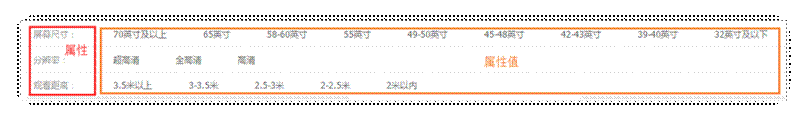
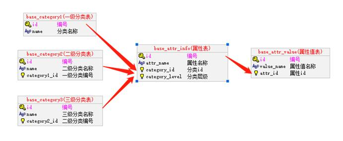
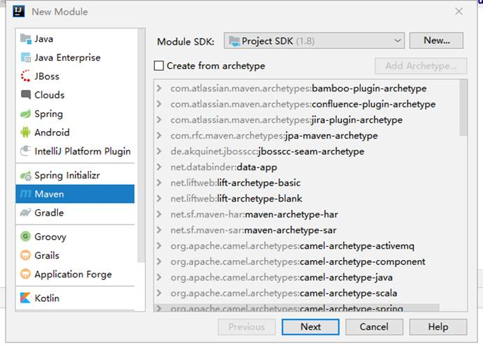
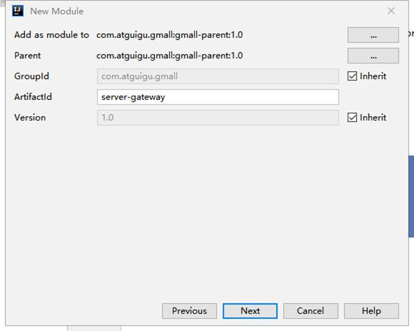
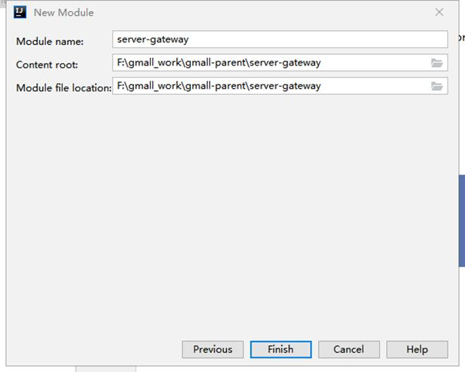
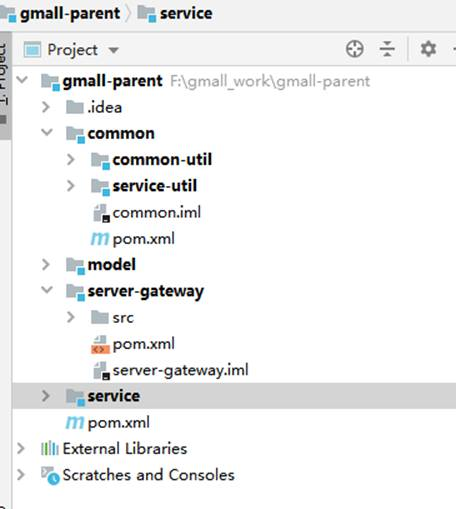

# 一 商品的基本知识

## 1. 基本信息—平台属性

 平台属性和平台属性值



平台属性和平台属性值主要用于商品的检索，每个分类对应的**属性**都不同，分类包含一级分类、二级分类和三级分类，分类层级区分对应分类。





## 2. 基本信息—销售属性与销售属性值

   销售属性，就是商品详情页右边，可以通过销售属性来定位一组spu下的哪款sku。可以让当前的商品详情页，跳转到自己的“兄弟”商品。

   一般每种商品的销售属性不会太多，大约1-4种。整个平台的属性种类也不会太多，大概10种以内。比如：颜色、尺寸、版本、套装等等。


## 3 基本信息—spu与 sku

  SKU=Stock Keeping Unit（库存量单位）。即库存进出计量的基本单元，可以是以件，盒，托盘等为单位。SKU这是对于大型连锁超市DC（配送中心）物流管理的一个必要的方法。现在已经被引申为产品**统一编号**的简称，**每种产品均对应有唯一的SKU**。

SPU(Standard Product Unit)：标准化产品单元。是商品信息聚合的最小单位，是一组**可复用、易检索**的标准化信息的集合，该集合描述了一个产品的**特性**。

首先通过检索搜索出来的商品列表中，每个商品都是一个sku。每个sku都有自己独立的库存数。也就是说每一个商品详情展示都是一个sku。

那spu又是干什么的呢？


如上图，一般的电商系统你点击进去以后，都能看到这个商品关联了其他好几个类似的商品，而且这些商品很多的信息都是共用的，比如商品图片，海报、销售属性等。

   那么系统是靠什么把这些sku识别为一组的呢，那是这些sku都有一个公用的spu信息。而它们公共的信息，都放在spu信息下。

  所以，sku与spu的结构如下：


图中有两个图片信息表，其中spu_image表示整个spu相关下的所有图片信息，而sku_image表示这个spu下的某个sku使用的图片。sku_image中的图片是从spu_image中选取的。

但是由于一个spu下的所有sku的海报都是一样，所以只存一份spu_poster就可以了。


# 二 商品管理模块开发

## 1 属性管理功能

### 1.1 分类信息及属性的查询

#### 1.1.1 service-product中创建Mapper

BaseCategory1Mapper

```java
package com.atguigu.gmall.product.dao;

import com.atguigu.gmall.model.product.BaseCategory1;
import com.baomidou.mybatisplus.core.mapper.BaseMapper;
import org.apache.ibatis.annotations.Mapper;


/**
 * 一级分类Dao层
 */
@Mapper
public interface BaseCategory1Mapper extends BaseMapper<BaseCategory1> {
}

```

BaseCategory2Mapper

```java
package com.atguigu.gmall.product.dao;

import com.atguigu.gmall.model.product.BaseCategory2;
import com.baomidou.mybatisplus.core.mapper.BaseMapper;
import org.apache.ibatis.annotations.Mapper;


/**
 * 二级分类Dao层
 */
@Mapper
public interface BaseCategory2Mapper extends BaseMapper<BaseCategory2> {
}

```

BaseCategory3Mapper

```java
package com.atguigu.gmall.product.dao;

import com.atguigu.gmall.model.product.BaseCategory3;
import com.baomidou.mybatisplus.core.mapper.BaseMapper;
import org.apache.ibatis.annotations.Mapper;


/**
 * 三级分类Dao层
 */
@Mapper
public interface BaseCategory3Mapper extends BaseMapper<BaseCategory3> {
}

```

BaseAttrInfoMapper

```java
package com.atguigu.gmall.product.dao;

import com.atguigu.gmall.model.product.BaseAttrInfo;
import com.baomidou.mybatisplus.core.mapper.BaseMapper;
import org.apache.ibatis.annotations.Mapper;

/**
 * 商品规格属性名dao层
 */
@Mapper
public interface BaseAttrInfoMapper extends BaseMapper<BaseAttrInfo> {
}

```

BaseAttrValueMapper

```java
package com.atguigu.gmall.product.dao;

import com.atguigu.gmall.model.product.BaseAttrValue;
import com.baomidou.mybatisplus.core.mapper.BaseMapper;
import org.apache.ibatis.annotations.Mapper;

/**
 * 商品规格属性值dao层
 */
@Mapper
public interface BaseAttrValueMapper extends BaseMapper<BaseAttrValue> {
}

```

#### 1.1.2 在service-product中 增加service接口

```java
package com.atguigu.gmall.product.service;

import com.atguigu.gmall.model.product.BaseAttrInfo;
import com.atguigu.gmall.model.product.BaseCategory1;
import com.atguigu.gmall.model.product.BaseCategory2;
import com.atguigu.gmall.model.product.BaseCategory3;

import java.util.List;

/**
 * 分类与属性管理service接口类
 */
public interface ManageService {

    /**
     * 查询所有一级分类列表
     * @return
     */
    public List<BaseCategory1> getCategory1List();

    /**
     * 根据一级分类查询二级分类列表
     * @param category1Id
     * @return
     */
    public List<BaseCategory2> getCategory2List(Long category1Id);

    /**
     * 根据二级分类查询三级分类列表
     * @param category2Id
     * @return
     */
    public List<BaseCategory3> getCategory3List(Long category2Id);

    /**
     * 根据分类查询所有规格信息列表:查询1 2 3级分类对应的规格信息列表,若只查询某一个分类下的规格列表则其他分类的值传0
     * @param category1Id
     * @param category2Id
     * @param category3Id
     * @return
     */
    public List<BaseAttrInfo> getBaseAttrInfoList(Long category1Id, Long category2Id, Long category3Id);
}

```


#### 1.1.3 在service-product添加实现类

增加实现类

```java
package com.atguigu.gmall.product.service.impl;

import com.atguigu.gmall.model.product.BaseAttrInfo;
import com.atguigu.gmall.model.product.BaseCategory1;
import com.atguigu.gmall.model.product.BaseCategory2;
import com.atguigu.gmall.model.product.BaseCategory3;
import com.atguigu.gmall.product.dao.*;
import com.atguigu.gmall.product.service.ManageService;
import com.baomidou.mybatisplus.core.conditions.query.LambdaQueryWrapper;
import org.springframework.beans.factory.annotation.Autowired;
import org.springframework.stereotype.Service;

import java.util.List;

/**
 * 分类与属性管理service实现类
 */
@Service
public class ManageServiceImpl implements ManageService {

    @Autowired
    private BaseCategory1Mapper baseCategory1Mapper;

    @Autowired
    private BaseCategory2Mapper baseCategory2Mapper;

    @Autowired
    private BaseCategory3Mapper baseCategory3Mapper;

    @Autowired
    private BaseAttrInfoMapper baseAttrInfoMapper;

    /**
     * 查询所有一级分类列表
     *
     * @return
     */
    @Override
    public List<BaseCategory1> getCategory1List() {
        return baseCategory1Mapper.selectList(null);
    }

    /**
     * 根据一级分类查询二级分类列表
     *
     * @param category1Id
     * @return
     */
    @Override
    public List<BaseCategory2> getCategory2List(Long category1Id) {
        //参数判断
        if(category1Id == null){
            throw new RuntimeException("二级分类查询失败,一级分类不能为空");
        }
        //条件构建
        LambdaQueryWrapper<BaseCategory2> wrapper = new LambdaQueryWrapper<>();
        wrapper.eq(BaseCategory2::getCategory1Id, category1Id);
        //查询二级分类列表返回
        return baseCategory2Mapper.selectList(wrapper);
    }

    /**
     * 根据二级分类查询三级分类列表
     *
     * @param category2Id
     * @return
     */
    @Override
    public List<BaseCategory3> getCategory3List(Long category2Id) {
        //参数判断
        if(category2Id == null){
            throw new RuntimeException("三级分类查询失败,二级分类不能为空");
        }
        //条件构建
        LambdaQueryWrapper<BaseCategory3> wrapper = new LambdaQueryWrapper<>();
        wrapper.eq(BaseCategory3::getCategory2Id, category2Id);
        //查询二级分类列表返回
        return baseCategory3Mapper.selectList(wrapper);
    }

    /**
     * 根据分类查询所有规格信息列表:查询1 2 3级分类对应的规格信息列表,若只查询某一个分类下的规格列表则其他分类的值传0
     *
     * @param category1Id
     * @param category2Id
     * @param category3Id
     * @return
     */
    @Override
    public List<BaseAttrInfo> getBaseAttrInfoList(Long category1Id, Long category2Id, Long category3Id) {
        return baseAttrInfoMapper.selectBaseAttrInfoList(category1Id, category2Id, category3Id);
    }
}

```

#### 1.1.4 BaseAttrInfoMapper类添加方法

```java
package com.atguigu.gmall.product.dao;

import com.atguigu.gmall.model.product.BaseAttrInfo;
import com.baomidou.mybatisplus.core.mapper.BaseMapper;
import org.apache.ibatis.annotations.Mapper;
import org.apache.ibatis.annotations.Param;

import java.util.List;

/**
 * 商品规格属性名dao层
 */
@Mapper
public interface BaseAttrInfoMapper extends BaseMapper<BaseAttrInfo> {

    /**
     * 根据分类id查询商品规格列表
     * @param category1Id
     * @param category2Id
     * @param category3Id
     * @return
     */
    public List<BaseAttrInfo> selectBaseAttrInfoList(@Param("category1Id") Long category1Id,
                                                     @Param("category2Id") Long category2Id,
                                                     @Param("category3Id") Long category3Id);
}

```


#### 1.1.5 BaseAttrInfoMapper.xml添加查询方法

在resources目录添加mapper文件夹，添加 BaseAttrInfoMapper.xml文件

```xml
<?xml version="1.0" encoding="UTF-8"?>
<!DOCTYPE mapper SYSTEM "http://mybatis.org/dtd/mybatis-3-mapper.dtd" >
<mapper namespace="com.atguigu.gmall.product.dao.BaseAttrInfoMapper">
    <!-- autoMapping自动映射数据库中表的列与java实体的关系,若不添加的话,实体嵌套时可能导致数据绑定失败-->
    <resultMap id="baseAttrInfoMap" type="com.atguigu.gmall.model.product.BaseAttrInfo" autoMapping="true">
        <!--
            column:数据库对应的列明
            property:java中pojo对应的属性名
        -->
        <id column="id" property="id"></id>
        <!--定义内嵌实体集合-->
        <collection property="attrValueList" ofType="com.atguigu.gmall.model.product.BaseAttrValue" autoMapping="true">
            <!--防止id重复,将值的属性id进行重命名-->
            <id property="id" column="attr_value_id"></id>
        </collection>
    </resultMap>
    <!-- 根据类别id查询商品规格列表信息-->
    <select id="selectBaseAttrInfoList" resultMap="baseAttrInfoMap">
        select
            bai.id,
            bai.attr_name,
            bai.category_id,
            bai.category_level,
            bav.id as attr_value_id,
            bav.value_name,
            bav.attr_id
        from
            base_attr_info bai
        inner join
            base_attr_value bav
        on
            bai.id = bav.attr_id
        <where>
            <if test="category1Id != null and category1Id != 0">
                or (bai.category_id = #{category1Id} and bai.category_level = 1)
            </if>
            <if test="category2Id != null and category2Id != 0">
                or (bai.category_id = #{category2Id} and bai.category_level = 2)
            </if>
            <if test="category3Id != null and category3Id != 0">
                or (bai.category_id = #{category3Id} and bai.category_level = 3)
            </if>
        </where>
        order by bai.category_level,bai.id
    </select>
</mapper>
```

#### 1.1.6 service-prodect的controller中BaseManageController 中增加方法

ManageController : 针对平台属性的操作！

```java
package com.atguigu.gmall.product.controller;

import com.atguigu.gmall.common.result.Result;
import com.atguigu.gmall.model.product.BaseAttrInfo;
import com.atguigu.gmall.model.product.BaseCategory1;
import com.atguigu.gmall.model.product.BaseCategory2;
import com.atguigu.gmall.model.product.BaseCategory3;
import com.atguigu.gmall.product.service.ManageService;
import io.swagger.annotations.Api;
import io.swagger.annotations.ApiOperation;
import org.springframework.beans.factory.annotation.Autowired;
import org.springframework.web.bind.annotation.GetMapping;
import org.springframework.web.bind.annotation.PathVariable;
import org.springframework.web.bind.annotation.RequestMapping;
import org.springframework.web.bind.annotation.RestController;

import java.util.List;

/**
 * 分类与属性管理控制层
 */
@Api(value = "ManageController", tags = "分类与属性管理控制层" )
@RestController
@RequestMapping(value = "/admin/product")
public class ManageController {

    @Autowired
    private ManageService manageService;


    /**
     * 查询所有一级分类列表
     * @return
     */
    @ApiOperation("查询所有一级分类列表")
    @GetMapping(value = "/getCategory1List")
    public Result<List<BaseCategory1>> getCategory1List(){
        List<BaseCategory1> category1List = manageService.getCategory1List();
        return Result.ok(category1List);
    }

    /**
     * 根据一级分类查询二级分类列表
     * @param category1Id
     * @return
     */
    @ApiOperation("根据一级分类查询二级分类列表")
    @GetMapping(value = "/getCategory2List/{category1Id}")
    public Result<List<BaseCategory2>> getCategory2List(@PathVariable(value = "category1Id") Long category1Id){
        List<BaseCategory2> category2List = manageService.getCategory2List(category1Id);
        return Result.ok(category2List);
    }

    /**
     * 根据二级分类查询三级分类列表
     * @param category2Id
     * @return
     */
    @ApiOperation("根据二级分类查询三级分类列表")
    @GetMapping(value = "/getCategory3List/{category2Id}")
    public Result<List<BaseCategory3>> getCategory3List(@PathVariable(value = "category2Id") Long category2Id){
        List<BaseCategory3> category3List = manageService.getCategory3List(category2Id);
        return Result.ok(category3List);
    }

    /**
     * 根据分类查询所有规格信息列表:查询1 2 3级分类对应的规格信息列表,若只查询某一个分类下的规格列表则其他分类的值传0
     * @param category1Id
     * @param category2Id
     * @param category3Id
     * @return
     */
    @ApiOperation("根据分类查询所有规格信息列表")
    @GetMapping(value = "/getBaseAttrInfoList/{category1Id}/{category2Id}/{category3Id}")
    public Result<List<BaseAttrInfo>> getBaseAttrInfoList(@PathVariable(value = "category1Id") Long category1Id,
                                                          @PathVariable(value = "category2Id") Long category2Id,
                                                          @PathVariable(value = "category3Id") Long category3Id){
        List<BaseAttrInfo> baseAttrInfoList = manageService.getBaseAttrInfoList(category1Id, category2Id, category3Id);
        return Result.ok(baseAttrInfoList);
    }
}

```

### 1.2 属性的添加


#### 1.2.1 service

```java
/**
     * 新增规格
     * @param baseAttrInfo
     */
    public BaseAttrInfo saveAttrInfo(BaseAttrInfo baseAttrInfo);
```

实现类:

```java
/**
     * 新增规格
     *
     * @param baseAttrInfo
     */
    @Override
    public BaseAttrInfo saveAttrInfo(BaseAttrInfo baseAttrInfo) {
        //参数校验
        if(baseAttrInfo == null){
            throw new RuntimeException("参数为空");
        }
        //根据id是否已为空,判断为新增还是修改
        if(baseAttrInfo.getId() == null){
            //新增的场合insert info的信息
            baseAttrInfoMapper.insert(baseAttrInfo);
        }else{
            //修改的场合update info的信息
            baseAttrInfoMapper.updateById(baseAttrInfo);
            //删除旧的value表的数据
            LambdaQueryWrapper<BaseAttrValue> wrapper = new LambdaQueryWrapper<>();
            wrapper.eq(BaseAttrValue::getAttrId, baseAttrInfo.getId());
            baseAttrValueMapper.delete(wrapper);
        }
        //获取即将保存的value表的数据
        List<BaseAttrValue> attrValueList = baseAttrInfo.getAttrValueList();
//        // 方式一:保存value表数据前填充info表的id字段(推荐,效率高)
        attrValueList = attrValueList.stream().map(c -> {
            //补全info表的id字段
            c.setAttrId(baseAttrInfo.getId());
            //保存value表数据
            baseAttrValueMapper.insert(c);
            //返回结果
            return c;
        }).collect(Collectors.toList());
        //方式二
//        for (BaseAttrValue baseAttrValue : attrValueList) {
//            //补全info表的id字段
//            baseAttrValue.setAttrId(baseAttrInfo.getId());
//            //保存value表数据
//            baseAttrValueMapper.insert(baseAttrValue);
//        }
        //重新填充value数据
        baseAttrInfo.setAttrValueList(attrValueList);
        //返回结果
        return baseAttrInfo;
    }
```

注意：

实现类添加：@Transactional

#### 1.2.2 controller

```java
/**
     * 新增规格
     * @param baseAttrInfo
     * @return
     */
    @PostMapping("/saveAttrInfo")
    public Result saveAttrInfo(@RequestBody BaseAttrInfo baseAttrInfo){
        baseAttrInfo = manageService.saveAttrInfo(baseAttrInfo);
        return Result.ok(baseAttrInfo);
    }
```


## 2 搭建后台页面

1. 拷贝资料中的前段项目页面，放入一个没有中文目录的文件下

2. 在gmall-admin当前目录下cmd 回车

- 安装python
- node_modules文件夹和package-lock.json文件
- 执行命令:npm install -g cnpm --registry=https://registry.npm.taobao.org
- 执行命令: cnpm install
- 启动:cnpm run dev

3. 将两个配置文件

- dev.env.js http://api.gmall.com
-  index.js host: 'localhost', port: 8888

==**注：第一个为网关地址，第二个为项目访问地址**==

## 3 搭建server-gateway模块

服务网关

### 3.1 搭建server-gateway

点击gmall-parent，选择New–>Module,操作如下



点击下一步



点击下一步



点击完成



### 3.2 修改配置pom.xml

修改pom.xml

```xml
<?xml version="1.0" encoding="UTF-8"?>
<project xmlns="http://maven.apache.org/POM/4.0.0"
         xmlns:xsi="http://www.w3.org/2001/XMLSchema-instance"
         xsi:schemaLocation="http://maven.apache.org/POM/4.0.0 http://maven.apache.org/xsd/maven-4.0.0.xsd">
    <parent>
        <artifactId>service</artifactId>
        <groupId>com.atguigu.gmail</groupId>
        <version>1.0-SNAPSHOT</version>
    </parent>
    <modelVersion>4.0.0</modelVersion>

    <artifactId>server-gateway</artifactId>

    <description>商品微服务网关模块</description>

    <dependencies>
        <!-- 服务注册 -->
        <dependency>
            <groupId>org.springframework.cloud</groupId>
            <artifactId>spring-cloud-starter-alibaba-nacos-discovery</artifactId>
        </dependency>
        <dependency>
            <groupId>org.springframework.cloud</groupId>
            <artifactId>spring-cloud-starter-gateway</artifactId>
        </dependency>
    </dependencies>

</project>
```


### 3.3 在resources下添加配置文件

application.yml

```yml
server:
  port: 80
spring:
  application:
    name: api-gateway
  cloud:
    nacos:
      discovery:
        server-addr: 192.168.200.128:8848
    gateway:
      discovery:      #是否与服务发现组件进行结合，通过 serviceId(必须设置成大写) 转发到具体的服务实例。默认为false，设为true便开启通过服务中心的自动根据 serviceId 创建路由的功能。
        locator:      #路由访问方式：http://Gateway_HOST:Gateway_PORT/大写的serviceId/**，其中微服务应用名默认大写访问。
          enabled: true
      routes:
        - id: service-product
          uri: lb://service-product
          predicates:
            - Path=/*/product/** # 路径匹配
```

启动类

```java
package com.atguigu.gmall;

import org.springframework.boot.SpringApplication;
import org.springframework.boot.autoconfigure.SpringBootApplication;
import org.springframework.cloud.client.discovery.EnableDiscoveryClient;

@SpringBootApplication
@EnableDiscoveryClient
public class ServerGatewayApplication {

    public static void main(String[] args) {
        SpringApplication.run(ServerGatewayApplication.class, args);
    }
}

```


### 3.4 跨域处理

跨域：浏览器对于javascript的同源策略的限制 。

以下情况都属于跨域：

| **跨域原因说明**   | **示例**                               |
| ------------------ | -------------------------------------- |
| 域名不同           | `www.jd.com` 与 `www.taobao.com`       |
| 域名相同，端口不同 | `www.jd.com:8080` 与 `www.jd.com:8081` |
| 二级域名不同       | `item.jd.com` 与 `miaosha.jd.com`      |

如果**域名和端口都相同，但是请求路径不同**，不属于跨域，如：

```
www.jd.com/item
www.jd.com/goods
```

http和https也属于跨域

而我们刚才是从`localhost:1000`去访问`localhost:8888`，这属于端口不同，跨域了。

**3.4.1** **为什么有跨域问题？**

跨域不一定都会有跨域问题。

因为跨域问题是浏览器对于ajax请求的一种安全限制：**一个页面发起的ajax请求，只能是与当前页域名相同的路径**，这能有效的阻止跨站攻击。

因此：**跨域问题 是针对ajax的一种限制**。

但是这却给我们的开发带来了不便，而且在实际生产环境中，肯定会有很多台服务器之间交互，地址和端口都可能不同，怎么办？

**方式一：gateway **配置类

全局配置类实现

```java
package com.atguigu.gmall.config;

import org.springframework.context.annotation.Bean;
import org.springframework.context.annotation.Configuration;
import org.springframework.web.cors.CorsConfiguration;
import org.springframework.web.cors.reactive.CorsWebFilter;
import org.springframework.web.cors.reactive.UrlBasedCorsConfigurationSource;

/**
 * 跨域配置类
 */
@Configuration
public class CorsConfig {

    @Bean
    public CorsWebFilter corsWebFilter(){

        // cors跨域配置对象
        CorsConfiguration configuration = new CorsConfiguration();
        configuration.addAllowedOrigin("*"); //设置允许访问的网络
        configuration.setAllowCredentials(true); // 设置是否从服务器获取cookie
        configuration.addAllowedMethod("*"); // 设置请求方法 * 表示任意
        configuration.addAllowedHeader("*"); // 所有请求头信息 * 表示任意

        // 配置源对象
        UrlBasedCorsConfigurationSource configurationSource = new UrlBasedCorsConfigurationSource();
        configurationSource.registerCorsConfiguration("/**", configuration);
        // cors过滤器对象
        return new CorsWebFilter(configurationSource);
    }
}
```

**方式二：不推荐使用！了解**

```yml
server:
  port: 80
spring:
  application:
    name: api-gateway
  cloud:
    nacos:
      discovery:
        server-addr: 192.168.200.128:8848
    gateway:
      discovery:      #是否与服务发现组件进行结合，通过 serviceId(必须设置成大写) 转发到具体的服务实例。默认为false，设为true便开启通过服务中心的自动根据 serviceId 创建路由的功能。
        locator:      #路由访问方式：http://Gateway_HOST:Gateway_PORT/大写的serviceId/**，其中微服务应用名默认大写访问。
          enabled: true
      globalcors:
        cors-configurations:
          '[/**]': # 匹配所有请求
            allowedOrigins: "*" #跨域处理 允许所有的域
            allowedMethods: # 支持的方法
              - GET
              - POST
              - PUT
              - DELETE
      routes:
        - id: service-product
          uri: lb://service-product
          predicates:
            - Path=/*/product/** # 路径匹配
```
