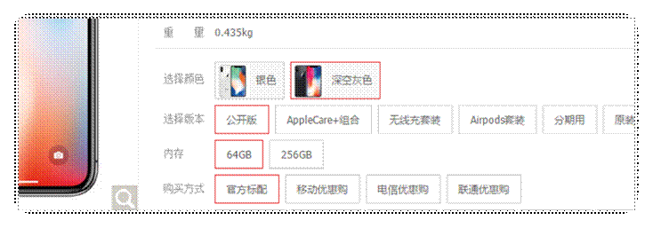
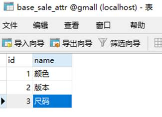
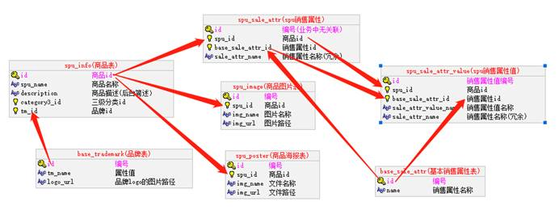
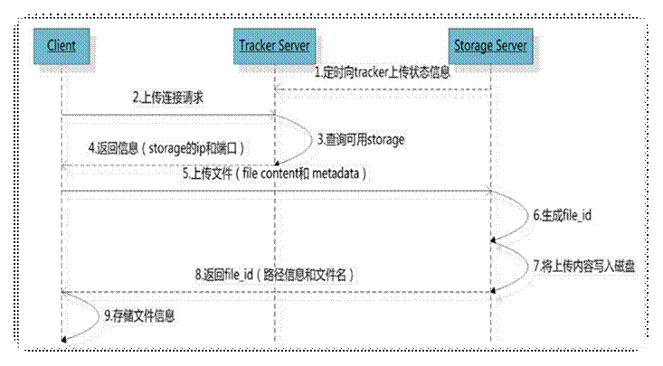
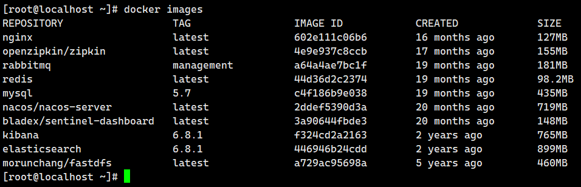
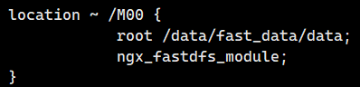

# 一. 业务介绍

## 1 SPU与SKU

SPU(Standard Product Unit)：标准化产品单元。是商品信息聚合的最小单位，是一组**可复用、易检索**的标准化信息的集合，该集合描述了一个产品的特性。

‘Stock Keeping Unit（库存量单位）。即库存进出计量的基本单元，可以是以件，盒，托盘等为单位。

SKU这是对于大型连锁超市DC（配送中心）物流管理的一个必要的方法。现在已经被引申为产品统一编号的简称，每种产品均对应有唯一的SKU号。

比如，咱们购买一台iPhoneX手机，iPhoneX手机就是一个SPU，但是你购买的时候，不可能是以iPhoneX手机为单位买的，商家也不可能以iPhoneX为单位记录库存。必须要以什么颜色什么版本的iPhoneX为单位。比如，你购买的是一台银色、128G内存的、支持联通网络的iPhoneX ，商家也会以这个单位来记录库存数。那这个更细致的单位就叫库存单元（SKU）。




销售属性与平台属性

销售属性，就是商品详情页右边，可以通过销售属性来定位一组spu下的哪款sku。可以让当前的商品详情页，跳转到自己的“兄弟”商品。

   一般每种商品的销售属性不会太多，大约1-4种。整个电商的销售属性种类也不会太多，大概10种以内。比如：颜色、尺寸、版本、套装等等。不同销售属性的组合也就构成了一个spu下多个sku的结构。





平台属性， 就是之前分类下面，辅助搜索的，类似于条件的属性。


销售属性与平台属性各自独立。一个SPU会决定一个商品都有哪些销售属性，比如iPhonx会有颜色、版本、内存的销售属性，某个T桖衫只有尺寸这个销售属性。

而某个商品有什么平台属性，由他的3级分类决定。比如笔记本包括：运行内存、cpu、显卡、硬盘、屏幕尺寸等等。


## 2 SKU与SPU的图片资源

另外同一个SPU下的SKU可以共用一些资源，比如商品图片，海报等等。毕竟同一种商品，大部分图片都是共用的只有因为颜色尺寸等，很少的差别。那么一般来说商品图片都是在新增SPU时上传的，在新增SKU时从该SPU已上传的图片中选择。

而海报几乎是所有SPU下的SKU都一样。

## 3 数据结构图

根据以上的需求，以此将SPU关联的数据库表结构设计为如下：




# 二、列表查询功能开发

## 1 mapper

```java
package com.atguigu.gmall.product.dao;

import com.atguigu.gmall.model.product.SpuInfo;
import com.baomidou.mybatisplus.core.mapper.BaseMapper;
import org.apache.ibatis.annotations.Mapper;

/**
 * 商品spu信息dao层
 */
@Mapper
public interface SpuInfoMapper extends BaseMapper<SpuInfo> {
}

```

## 2 ManageService

ManageService

```java
/**
     * 分页查询SpuInfo的信息
     * @param category3Id
     * @param page
     * @param size
     * @return
     */
    public IPage<SpuInfo> getSpuInfoList(Long category3Id, Integer page, Integer size);
```

ManageServiceImpl

```java
/**
     * 分页查询SpuInfo的信息
     *
     * @param category3Id
     * @param page
     * @param size
     * @return
     */
    @Override
    public IPage<SpuInfo> getSpuInfoList(Long category3Id, Integer page, Integer size) {
        //条件构造器
        LambdaQueryWrapper<SpuInfo> wrapper = new LambdaQueryWrapper<>();
        //category3Id
        if(category3Id != null){
            wrapper.eq(SpuInfo::getCategory3Id, category3Id);
        }
        //执行查询
        IPage<SpuInfo> spuInfoIPage = spuInfoMapper.selectPage(new Page<>(page, size), wrapper);
        //返回结果
        return spuInfoIPage;
    }
```

## 3 controller

SpuManageController

```java
/**
     * 分页查询SpuInfo的信息
     * @param page
     * @param size
     * @return
     */
    @GetMapping(value = "/{page}/{size}")
    public Result<IPage<SpuInfo>> getSpuInfoList(Long category3Id,
                                        @PathVariable(value = "page") Integer page,
                                        @PathVariable(value = "size") Integer size){
        IPage<SpuInfo> spuInfoList = manageService.getSpuInfoList(category3Id, page, size);
        return Result.ok(spuInfoList);
    }
```

# 三、商标品牌管理

## 1 mapper

```java
package com.atguigu.gmall.product.dao;

import com.atguigu.gmall.model.product.BaseTrademark;
import com.baomidou.mybatisplus.core.mapper.BaseMapper;
import org.apache.ibatis.annotations.Mapper;

/**
 * 品牌管理dao层
 */
@Mapper
public interface BaseTrademarkMapper extends BaseMapper<BaseTrademark> {
}

```

## 2 service

```java
/**
     * 分页查询品牌信息
     * @param page
     * @param size
     * @return
     */
    public IPage<BaseTrademark> getTrademarkList(Integer page, Integer size);
```

BaseTrademarkServiceImpl

```java
/**
     * 分页查询品牌信息
     *
     * @param page
     * @param size
     * @return
     */
    @Override
    public IPage<BaseTrademark> getTrademarkList(Integer page, Integer size) {
        return baseTrademarkMapper.selectPage(new Page<>(page, size), null);
    }
```

## 3 controller

```java
/**
     * 分页查询SpuInfo的信息
     * @param page
     * @param size
     * @return
     */
    @GetMapping(value = "/baseTrademark/{page}/{size}")
    public Result<IPage<BaseTrademark>> baseTrademark(@PathVariable(value = "page") Integer page,
                                                 @PathVariable(value = "size") Integer size){
        IPage<BaseTrademark> baseTrademarkIPage = manageService.getTrademarkList(page, size);
        return Result.ok(baseTrademarkIPage);
    }
```


# 四 spu的保存功能中的图片上传

## 1 FastDFS介绍

FastDFS 是一个由 C 语言实现的开源轻量级**分布式文件系统**，作者余庆(happyfish100)，支持 Linux、FreeBSD、AID 等 Unix 系统，解决了大数据存储和读写负载均衡等问题，适合存储 4KB~500MB 之间的小文件，如图片网站、短视频网站、文档、app 下载站等，UC、京东、支付宝、迅雷、酷狗等都有使用。

该软件作者是**阿里巴巴**大牛、chinaUnix版主**余庆**个人独立开发的。


## 2 FastDFS上传的流程



只要 storage 返回图片的路径图片名称，我们就能通过浏览器来访问图片了？

## 3. 创建fastdfs

我们使用Docker搭建FastDFS的开发环境,虚拟机中已经下载了fastdfs的镜像，可以通过`docker images`查看，如下图：



拉取镜像(已经下载了该镜像，大家无需下载了)

```properties
docker pull morunchang/fastdfs
```

运行tracker

```properties
docker run -d --name tracker --net=host morunchang/fastdfs sh tracker.sh
```

运行storage

```properties
docker run -d --name storage --net=host -e TRACKER_IP=192.168.200.128:22122 -e GROUP_NAME=group1 morunchang/fastdfs sh storage.sh
```

- 使用的网络模式是–net=host, 此时会将宿主机的网络应用于容器，链接容器就可以直接使用宿主机的IP192.168.200.128
- `sh tracker.sh`运行tracker.sh脚本文件
- group1是组名，即storage的组
- 如果想要增加新的storage服务器，再次运行该命令，注意更换 新组名

**配置Nginx**

Nginx在这里主要提供对FastDFS图片访问的支持，Docker容器中已经集成了Nginx，我们需要修改nginx的配置,进入storage的容器内部，修改nginx.conf

```properties
docker exec -it storage  /bin/bash
```

进入后

```properties
vi /etc/nginx/conf/nginx.conf
```

添加以下内容：



上图配置如下：

```properties
location ~ /M00 {
     ngx_fastdfs_module;
}
```

访问图片的时候，浏览器通常都会对图片进行缓存，如果有禁止缓存，可以设置nginx配置添加禁止缓存即可。

禁止缓存：

```properties
add_header Cache-Control no-store;
```

退出容器：

```properties
exit
```

重启storage容器：

```properties
docker restart storage
```

查看启动容器`docker ps`

```properties
9f2391f73d97 morunchang/fastdfs "sh storage.sh" 12 minutes ago Up 12 seconds storage
e22a3c7f95ea morunchang/fastdfs "sh tracker.sh" 13 minutes ago Up 13 minutes tracker
```

开启启动设置：

```properties
docker update --restart=always tracker
docker update --restart=always storage
```

安装Nginx目的：

```properties
nginx集成了FastDFS，可以通过它的ngx_fastdfs_module模块，可以通过该模块访问Tracker获取图片所存储的Storage信息，然后访问Storage信息获取图片信息。
```

## 4 利用Java客户端调用FastDFS

在项目resource中添加tracker.conf 配置文件


```properties
tracker_server=192.168.200.128:22122
# 连接超时时间，针对socket套接字函数connect，默认为30秒
connect_timeout=30000
# 网络通讯超时时间，默认是60秒
network_timeout=60000
```

打印结果


这个打印结果实际上就是我们访问的路径，加上服务器地址我们可以拼接成一个字符串

  http://file.gmall.com/group1/M00/00/00/wKhDyVsLn96APCdkAACGx2c4tJ4983.jpg

直接放到浏览器去访问


上传成功！


对接到业务模块中

在修改FileUploadController的方法

```java
package com.atguigu.gmall.product.controller;

import com.atguigu.gmall.common.fastdfs.FastDfsClient;
import com.atguigu.gmall.common.result.Result;
import org.springframework.beans.factory.annotation.Autowired;
import org.springframework.beans.factory.annotation.Value;
import org.springframework.web.bind.annotation.PostMapping;
import org.springframework.web.bind.annotation.RequestMapping;
import org.springframework.web.bind.annotation.RequestParam;
import org.springframework.web.bind.annotation.RestController;
import org.springframework.web.multipart.MultipartFile;

@RestController
@RequestMapping(value = "/file")
public class FileUploadController {

    @Value("${fileServer.url}")
    private String fileUrl;

    @Autowired
    private FastDfsClient fastDfsClient;

    /**
     * 文件上传
     * @param file
     * @return
     */
    @PostMapping(value = "/upload")
    public Result upload(@RequestParam("file") MultipartFile file) throws Exception{
//        //加载配置文件
//        ClassPathResource classPathResource = new ClassPathResource("tracker.properties");
//        //初始化fastdfs对象
//        ClientGlobal.init(classPathResource.getPath());
//        //初始化trackerclient
//        TrackerClient trackerClient = new TrackerClient();
//        //获取服务连接信息
//        TrackerServer connection = trackerClient.getConnection();
//        //初始化storageClient
//        StorageClient storageClient = new StorageClient(connection, null);
//        //获取文件拓展名
//        String fileName = StringUtils.getFilenameExtension(file.getOriginalFilename());
//        /**
//         * 1.文件字节码
//         * 2.文件拓展名
//         * 3.附加参数
//         * 4.返回结果为数组:0:组名  1:文件的完全路径名+文件名
//         */
//        String[] strings = storageClient.upload_file(file.getBytes(), fileName, null);
//        //返回文件全量访问路径
//        return Result.ok(fileUrl + strings[0] + "/" + strings[1]);
        String path = fastDfsClient.upload(file);
        return Result.ok(fileUrl + path);
    }
}

```

测试结果：


至此我们解决了文件上传的功能。

拓展配置

```xml
<!--fastdfs-->
<dependency>
    <groupId>com.github.tobato</groupId>
    <artifactId>fastdfs-client</artifactId>
    <version>1.27.2</version>
</dependency>
```

fast_dfs.properties

```properties
#socket连接超时时长
fdfs.soTimeout=1500
#连接tracker服务器超时时长
fdfs.connectTimeout=600
fdfs.trackerList=192.168.200.128:22122
```

 工具类FastDfsClient

```java
package com.atguigu.gmall.common.fastdfs;

import com.github.tobato.fastdfs.domain.fdfs.StorePath;
import com.github.tobato.fastdfs.domain.proto.storage.DownloadCallback;
import com.github.tobato.fastdfs.service.FastFileStorageClient;
import org.springframework.beans.factory.annotation.Autowired;
import org.springframework.stereotype.Component;
import org.springframework.util.StringUtils;
import org.springframework.web.multipart.MultipartFile;

import java.io.ByteArrayOutputStream;
import java.io.IOException;
import java.io.InputStream;

/**
 * 操作fastdsf的工具类
 */
@Component//交给spring管理
public class FastDfsClient {

    @Autowired
    private FastFileStorageClient fastFileStorageClient;

    /**
     * 文件上传
     */
    public String upload(MultipartFile file) throws Exception{
        StorePath storePath = fastFileStorageClient.uploadFile(file.getInputStream(), //文件数据流
                file.getSize(),//文件大小
                StringUtils.getFilenameExtension(file.getOriginalFilename()),//文件拓展名
                null);//附加参数
        //返回全量路径
        return storePath.getFullPath();
    }

    /**
     * 文件下载
     * @return
     */
    public byte[] download(String groupName, String path) throws Exception{
        //下载文件
        InputStream inputStream = fastFileStorageClient.downloadFile(groupName, path, new DownloadCallback<InputStream>() {
            //下载发生异常返回异常数据流
            @Override
            public InputStream recv(InputStream ins) throws IOException {
                return ins;
            }
        });
        //声明输出流
        ByteArrayOutputStream byteArrayOutputStream = new ByteArrayOutputStream();
        //声明缓冲区
        byte[] buffer = new byte[1024];
        //定义每次读取的数据长度
        int lengh = 0;
        //输入流转输出流
        while ((lengh = inputStream.read(buffer)) != -1){
            //输出流写入
            byteArrayOutputStream.write(buffer, 0, lengh);
        }
        //返回字节码
        return byteArrayOutputStream.toByteArray();
    }

    /**
     * 文件删除
     */
    public void delete(String groupName, String path){
        fastFileStorageClient.deleteFile(groupName, path);
    }
}

```

配置类

```java
package com.atguigu.gmall.common.fastdfs;

import org.springframework.context.annotation.Configuration;
import org.springframework.context.annotation.Import;
import org.springframework.context.annotation.PropertySource;

@Configuration
@Import(FastDfsClient.class)
@PropertySource("classpath:fast_dfs.properties")
public class FastDfsConfig {
}

```

项目使用时注入

```java
package com.atguigu.gmall.proudct.config;

import org.springframework.context.annotation.ComponentScan;
import org.springframework.context.annotation.Configuration;

@Configuration
@ComponentScan("com.atguigu.gmall.common.fastdfs")
public class FastDfsImport {
}
```

# 五、spu保存

## 1 加载销售属性

mapper

```java
package com.atguigu.gmall.product.dao;

import com.atguigu.gmall.model.product.BaseSaleAttr;
import com.baomidou.mybatisplus.core.mapper.BaseMapper;
import org.apache.ibatis.annotations.Mapper;

/**
 * 基本销售属性dao
 */
@Mapper
public interface BaseSaleAttrMapper extends BaseMapper<BaseSaleAttr> {
}

```

service

```java
/**
     * 查询所有销售属性信息
     * @return
     */
    public List<BaseSaleAttr> getBaseSaleAttr();
```

实现方法

```java
/**
     * 查询所有销售属性信息
     *
     * @return
     */
@Override
public List<BaseSaleAttr> getBaseSaleAttr() {
    return baseSaleAttrMapper.selectList(null);
}
```

 controller

```java
/**
* 查询所有的销售属性
* @return
*/
@GetMapping(value = "/baseSaleAttrList")
public Result<List<BaseSaleAttr>> baseSaleAttrList(){
    List<BaseSaleAttr> baseSaleAttr = manageService.getBaseSaleAttr();
    return Result.ok(baseSaleAttr);
}
```

## 2 加载品牌

service

```java
/**
     * 查询所有品牌信息
     * @return
     */
    public List<BaseTrademark> getTrademark();
```

实现类

```java
/**
 * 查询所有品牌信息
 *
 * @return
 */
@Override
public List<BaseTrademark> getTrademark() {
    return baseTrademarkMapper.selectList(null);
}
```

controller

```java
/**
* 查询所有的品牌列表
* @return
*/
@GetMapping(value = "/baseTrademark/getTrademarkList")
public Result<List<BaseTrademark>> baseTrademark(){
    List<BaseTrademark> trademark = manageService.getTrademark();
    return Result.ok(trademark);
}
```


## 3 保存Spu

### 3.1 mapper

建立对应的mapper 文件

```java
package com.atguigu.gmall.product.dao;

import com.atguigu.gmall.model.product.SpuImage;
import com.baomidou.mybatisplus.core.mapper.BaseMapper;
import org.apache.ibatis.annotations.Mapper;

/**
 * spu商品图片
 */
@Mapper
public interface SpuImageMapper extends BaseMapper<SpuImage> {
}

```


```java
package com.atguigu.gmall.product.dao;

import com.atguigu.gmall.model.product.SpuSaleAttr;
import com.baomidou.mybatisplus.core.mapper.BaseMapper;
import org.apache.ibatis.annotations.Mapper;

/**
 * spu规格属性
 */
@Mapper
public interface SpuSaleAttrMapper extends BaseMapper<SpuSaleAttr> {
}

```


```java
package com.atguigu.gmall.product.dao;

import com.atguigu.gmall.model.product.SpuSaleAttrValue;
import com.baomidou.mybatisplus.core.mapper.BaseMapper;
import org.apache.ibatis.annotations.Mapper;

/**
 * spu规格值
 */
@Mapper
public interface SpuSaleAttrValueMapper extends BaseMapper<SpuSaleAttrValue> {
}

```


### 3.2 service

接口类

```java
/**
     * 保存spu
     * @param spuInfo
     */
    public SpuInfo saveSpuInfo(SpuInfo spuInfo);
```

实现类

```java
/**
     * 保存spu
     *
     * @param spuInfo
     */
    @Override
    public SpuInfo saveSpuInfo(SpuInfo spuInfo) {
        //保存spu信息
        spuInfoMapper.insert(spuInfo);
        //获取spu的id
        Long spuId = spuInfo.getId();
        //保存spu图片信息
        List<SpuImage> spuImageList = spuInfo.getSpuImageList();
        List<SpuImage> dbImage = spuImageList.stream().map(i -> {
            //补全spuId
            i.setSpuId(spuId);
            //新增图片
            spuImageMapper.insert(i);
            return i;
        }).collect(Collectors.toList());
        spuInfo.setSpuImageList(dbImage);
        //保存spu的销售属性信息
        List<SpuSaleAttr> spuSaleAttrList = spuInfo.getSpuSaleAttrList();
        List<SpuSaleAttr> newSpuSaleAttrList =
                spuSaleAttrList.stream().map(s -> {
                    //获取销售属性值
                    List<SpuSaleAttrValue> spuSaleAttrValueList = s.getSpuSaleAttrValueList();
                    //补全spuid
                    s.setSpuId(spuId);
                    //新增销售属性
                    spuSaleAttrMapper.insert(s);
                    //新增销售属性值
                    List<SpuSaleAttrValue> newSpuSaleAttrValueList =
                            spuSaleAttrValueList.stream().map(v -> {
                                //补全信息spuid
                                v.setSpuId(spuId);
                                //销售属性名称
                                v.setSaleAttrName(s.getSaleAttrName());
                                //新增销售属性值
                                spuSaleAttrValueMapper.insert(v);
                                return v;
                            }).collect(Collectors.toList());
                    s.setSpuSaleAttrValueList(newSpuSaleAttrValueList);
                    return s;
                }).collect(Collectors.toList());
        spuInfo.setSpuSaleAttrList(newSpuSaleAttrList);
        //返回对象
        return spuInfo;
    }
```

### 3.3 controller

```java
/**
     * 新增spu
     * @param spuInfo
     * @return
     */
    @PostMapping(value = "/saveSpuInfo")
    public Result saveSpuInfo(@RequestBody SpuInfo spuInfo){
        spuInfo = manageService.saveSpuInfo(spuInfo);
        return Result.ok(spuInfo);
    }
```


