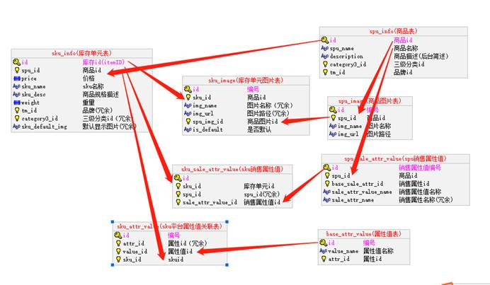
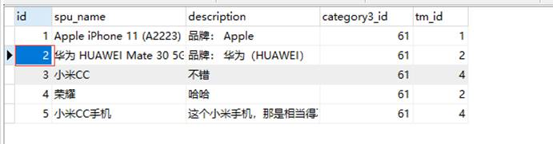
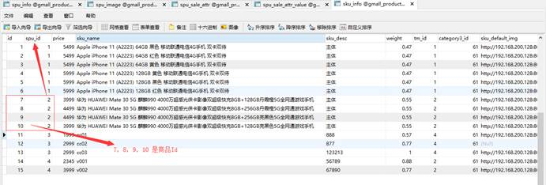
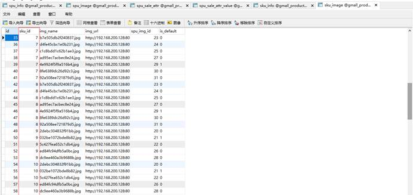
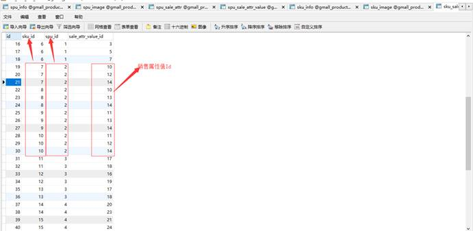
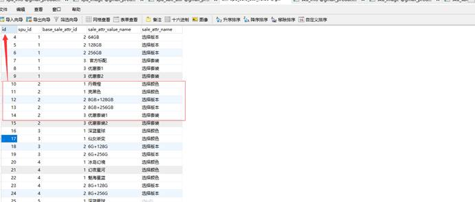
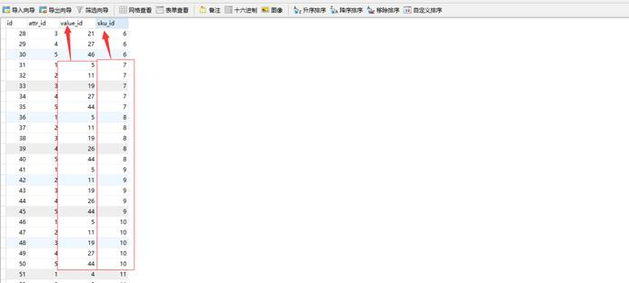
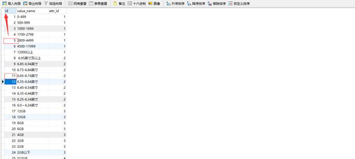

# 一  业务介绍

## 1  SKU与SPU的图片资源

另外同一个SPU下的SKU可以共用一些资源，比如商品图片，海报等等。毕竟同一种商品，大部分图片都是共用的只有因为颜色尺寸等，很少的差别。那么一般来说商品图片都是在新增SPU时上传的，在新增SKU时从该SPU已上传的图片中选择。

而海报几乎是所有SPU下的SKU都一样。

## 2 数据库表结构

根据以上的需求，以此将SKU关联的数据库表结构设计为如下：




spuInfo {spuId =2 }



skuInfo {spuId=2}



skuImage {skuId = 7,8,9,10}



skuSaleAttrValue {skuId = 7,8,9,10} {spuId=2}

记录的商品与销售属性的关系！



spuSaleAttrVAlue {id =10,11,12,13,14}



skuAttrVAlue {skuId = 7,8,9,10}

记录的商品与平台属性的关系



baseAttrValue {id = 5,11....}




# 二 为spu添加sku

## 1 页面


## 2 准备工作

### 2.1 图片加载功能

功能分析：图片列表是根据spuId得来，涉及到的数据库表spu_image

service

```java
/**
     * 查询spu的图片列表
     * @param spuId
     * @return
     */
    List<SpuImage> getSpuImageList(Long spuId);
```

实现类

```java
@Autowired
    private SpuImageMapper spuImageMapper;
    /**
     * 查询spu的图片列表
     *
     * @param spuId
     * @return
     */
    @Override
    public List<SpuImage> getSpuImageList(Long spuId) {
        //拼接条件
        LambdaQueryWrapper<SpuImage> wrapper = new LambdaQueryWrapper<>();
        wrapper.eq(SpuImage::getSpuId, spuId);
        //查询列表
        List<SpuImage> spuImages = spuImageMapper.selectList(wrapper);
        return spuImages;
    }
```

 controller

```java
/**
     * 查询所有的spu图片列表
     * @return
     */
    @GetMapping(value = "/spuImageList/{id}")
    public Result<List<SpuImage>> spuImageList(@PathVariable(value = "id") Long id){
        List<SpuImage> spuImages = manageService.getSpuImageList(id);
        return Result.ok(spuImages);
    }
```

### 2.2 平台属性查询

在前面讲解平台属性时已经有过相应接口，直接使用，如下：

```java
/**
     * 查询平台属性信息
     * @param category1
     * @param category2
     * @param category3
     * @return
     */
    @GetMapping(value = "/attrInfoList/{category1}/{category2}/{category3}")
    public Result<List<BaseAttrInfo>> selectBaseAttrInfo(@PathVariable(value = "category1") Long category1,
                                                         @PathVariable(value = "category2") Long category2,
                                                         @PathVariable(value = "category3") Long category3) {
        List<BaseAttrInfo> baseAttrInfos = manageService.selectBaseAttrInfo(category1, category2, category3);
        return Result.ok(baseAttrInfos);
    }
```

### 2.3 销售属性查询

service

sql

```xml
<?xml version="1.0" encoding="UTF-8"?>
<!DOCTYPE mapper SYSTEM "http://mybatis.org/dtd/mybatis-3-mapper.dtd" >
<mapper namespace="com.atguigu.gmall.product.dao.SpuSaleAttrMapper">
    <!-- autoMapping自动映射数据库中表的列与java实体的关系,若不添加的话,实体嵌套时可能导致数据绑定失败-->
    <resultMap id="spuAttrInfoMap" type="com.atguigu.gmall.model.product.SpuSaleAttr" autoMapping="true">
        <!--
            column:数据库对应的列明
            property:java中pojo对应的属性名
        -->
        <id column="id" property="id"></id>
        <!--定义内嵌实体集合-->
        <collection property="spuSaleAttrValueList" ofType="com.atguigu.gmall.model.product.SpuSaleAttrValue" autoMapping="true">
            <!--防止id重复,将值的属性id进行重命名-->
            <id property="id" column="sale_attr_value_id"></id>
        </collection>
    </resultMap>
    <!-- 根据类别id查询商品规格列表信息-->
    <select id="spuSaleAttr" resultMap="spuAttrInfoMap">
        select
            sa.id ,
            sa.spu_id,
            sa.sale_attr_name,
            sa.base_sale_attr_id,
            sv.id as sale_attr_value_id,
            sv.sale_attr_value_name
        from
            spu_sale_attr sa
        inner join
            spu_sale_attr_value  sv
        on
            sa.spu_id=sv.spu_id and
            sa.base_sale_attr_id=sv.base_sale_attr_id
        where
            sa.spu_id=#{spu_id}
    </select>
</mapper>
```

dao

```java
package com.atguigu.gmall.product.dao;

import com.atguigu.gmall.model.product.SpuSaleAttr;
import com.baomidou.mybatisplus.core.mapper.BaseMapper;
import org.apache.ibatis.annotations.Mapper;
import org.apache.ibatis.annotations.Param;

import java.util.List;

/**
 * spu规格属性
 */
@Mapper
public interface SpuSaleAttrMapper extends BaseMapper<SpuSaleAttr> {

    /**
     * 查询spu销售属性列表
     * @param spuId
     * @return
     */
    List<SpuSaleAttr> selectSpuSaleAttrList(@Param("spu_id") Long spuId);
}

```

service

```java
/**
     * 查询销售属性列表
     * @param spuId
     * @return
     */
    List<SpuSaleAttr> getSpuSaleAttrList(Long spuId);
```

实现类

```java
/**
     * 查询销售属性列表
     *
     * @param spuId
     * @return
     */
    @Override
    public List<SpuSaleAttr> getSpuSaleAttrList(Long spuId) {
        List<SpuSaleAttr> spuSaleAttrs = spuSaleAttrMapper.selectSpuSaleAttrList(spuId);
        return spuSaleAttrs;
    }
```

Controller

```java
/**
     * 格努spuId查询销售属性列表
     * @return
     */
    @GetMapping(value = "/spuSaleAttrList/{id}")
    public Result<List<SpuSaleAttr>> spuSaleAttrList(@PathVariable(value = "id") Long id){
        List<SpuSaleAttr> spuSaleAttrList = manageService.getSpuSaleAttrList(id);
        return Result.ok(spuSaleAttrList);
    }
```


## 3 点击保存按钮

### 3.1 创建mapper

SkuAttrValueMapper

```java
package com.atguigu.gmall.proudct.mapper;

import com.atguigu.gmall.model.product.SkuAttrValue;
import com.baomidou.mybatisplus.core.mapper.BaseMapper;
import org.apache.ibatis.annotations.Mapper;

/**
 * sku平台属性值dao
 */
@Mapper
public interface SkuAttrValueMapper extends BaseMapper<SkuAttrValue> {
}

```

SkuImageMapper

```java
package com.atguigu.gmall.product.dao;

import com.atguigu.gmall.model.product.SkuImage;
import com.baomidou.mybatisplus.core.mapper.BaseMapper;
import org.apache.ibatis.annotations.Mapper;

/**
 * sku图片dao
 */
@Mapper
public interface SkuImageMapper extends BaseMapper<SkuImage> {
}

```

SkuInfoMapper

```java
package com.atguigu.gmall.product.dao;

import com.atguigu.gmall.model.product.SkuInfo;
import com.baomidou.mybatisplus.core.mapper.BaseMapper;
import org.apache.ibatis.annotations.Mapper;

/**
 * sku信息处理dao
 */
@Mapper
public interface SkuInfoMapper extends BaseMapper<SkuInfo> {
}

```

SkuSaleAttrValueMapper

```java
package com.atguigu.gmall.product.dao;

import com.atguigu.gmall.model.product.SkuSaleAttrValue;
import com.baomidou.mybatisplus.core.mapper.BaseMapper;
import org.apache.ibatis.annotations.Mapper;

/**
 * sku销售属性值关系dao
 */
@Mapper
public interface SkuSaleAttrValueMapper extends BaseMapper<SkuSaleAttrValue> {
}

```

### 3.2 编写接口与实现

接口类

```java
/**
     * 保存sku信息
     * @param skuInfo
     */
    public SkuInfo saveSkuInfo(SkuInfo skuInfo);
```

实现类

```java
@Autowired
    private SkuInfoMapper skuInfoMapper;

    @Autowired
    private SkuImageMapper skuImageMapper;

    @Autowired
    private SkuAttrValueMapper skuAttrValueMapper;

    @Autowired
    private SkuSaleAttrValueMapper skuSaleAttrValueMapper;
    /**
     * 保存sku
     *
     * @param skuInfo
     */
    @Override
    public SkuInfo saveSkuInfo(SkuInfo skuInfo) {
        //保存skuinfo数据
        skuInfoMapper.insert(skuInfo);
        //获取skuid
        Long skuId = skuInfo.getId();
        //保存skuImage数据
        List<SkuImage> skuImageList = skuInfo.getSkuImageList();
        List<SkuImage> newSkuImageList =
                skuImageList.stream().map(./image -> {
                    //补全数据
                    image.setSkuId(skuId);
                    //新增sku图片
                    skuImageMapper.insert(./image);
                    return image;
                }).collect(Collectors.toList());
        skuInfo.setSkuImageList(newSkuImageList);
        //保存skuAttrValue数据
        List<SkuAttrValue> skuAttrValueList = skuInfo.getSkuAttrValueList();
        List<SkuAttrValue> newSkuAttrValueList = skuAttrValueList.stream().map(attrValue -> {
            //补全数据
            attrValue.setSkuId(skuId);
            //新增数据
            skuAttrValueMapper.insert(attrValue);
            return attrValue;
        }).collect(Collectors.toList());
        skuInfo.setSkuAttrValueList(newSkuAttrValueList);
        //保存skuSaleAttrValue数据
        List<SkuSaleAttrValue> skuSaleAttrValueList = skuInfo.getSkuSaleAttrValueList();
        List<SkuSaleAttrValue> newSkuSaleAttrValueList = skuSaleAttrValueList.stream().map(sale -> {
            //补全spu
            sale.setSpuId(skuInfo.getSpuId());
            //补全sku
            sale.setSkuId(skuId);
            //新增
            skuSaleAttrValueMapper.insert(sale);
            return sale;
        }).collect(Collectors.toList());
        skuInfo.setSkuSaleAttrValueList(newSkuSaleAttrValueList);
        //返回结果
        return skuInfo;
    }
```

### 3.3 编写控制器

```java
/**
     * 新增spu
     * @param skuInfo
     * @return
     */
    @PostMapping(value = "/saveSkuInfo")
    public Result saveSkuInfo(@RequestBody SkuInfo skuInfo){
        skuInfo = manageService.saveSkuInfo(skuInfo);
        return Result.ok(skuInfo);
    }
```


## 4 查询sku列表以及上下架处理

### 4.1 编写接口与实现类

在ManageService 中添加

```java
	/**
     * 分页查询skuinfo信息
     */
    public IPage<SkuInfo> list(Page pageParam);

    /**
     * sku商品上架/下架
     * status:1-上架 0-下架
     */
    public void UpOrDown(Long skuId, Short status);
```

实现类

```java

/**
     * 分页查询skuinfo信息
     *
     * @param pageParam
     */
    @Override
    public IPage<SkuInfo> list(Page pageParam) {
        //分页查询skuinfo信息,并按照id降序
        IPage page =
                skuInfoMapper.selectPage(pageParam,
                        new LambdaQueryWrapper<SkuInfo>().orderByDesc(SkuInfo::getId));
        return page;
    }
/**
     * sku商品上架/下架
     * status:1-上架 0-下架
     *
     * @param skuId
     * @param status
     */
    @Override
    public void UpOrDown(Long skuId, Short status) {
        //查询skuinfo的信息
        SkuInfo skuInfo = skuInfoMapper.selectById(skuId);
        //若为空则直接失败
        if(skuInfo == null || skuInfo.getId() == null){
            throw new RuntimeException("商品不存在,无法进行上下架操作");
        }
        //设置skuinfo的状态
        skuInfo.setIsSale(status);
        //修改skuinfo的上下架状态
        skuInfoMapper.updateById(skuInfo);
    }
```

### 4.2 控制器

BaseManageController 控制器

```java
	/**
     * 分页查询sku信息
     * @param page
     * @param size
     * @return
     */
    @GetMapping(value = "/list/{page}/{size}")
    public Result<IPage<SkuInfo>> list(@PathVariable(value = "page") Integer page,
                                       @PathVariable(value = "size") Integer size){
        IPage<SkuInfo> list = manageService.list(page, size);
        return Result.ok(list);
    }

	/**
     * sku下架
     * @param id
     * @return
     */
    @GetMapping(value = "/cancelSale/{id}")
    public Result cancelSale(@PathVariable(value = "id") Long id){
        manageService.upOrDown(id, 0);
        return Result.ok();
    }

    /**
     * sku上架
     * @param id
     * @return
     */
    @GetMapping(value = "/onSale/{id}")
    public Result onSale(@PathVariable(value = "id") Long id){
        manageService.upOrDown(id, 1);
        return Result.ok();
    }
```

