# 一 业务介绍

   商品详情页，简单说就是以购物者的 角度展现一个sku的详情信息。

   这个页面不同于传统的crud的详情页，使用者并不是管理员，需要对信息进行查删改查，取而代之的是点击购买、放入购物车、切换颜色等等。

   另外一个特点就是该页面的高访问量，虽然只是一个查询操作，但是由于频繁的访问所以我们必须对其性能进行最大程度的优化。

# 二 难点分析

  1  光从功能角度上来说，并没有太多难点，唯一实现起来麻烦的就是用户对于不同销售属性的切换操作。


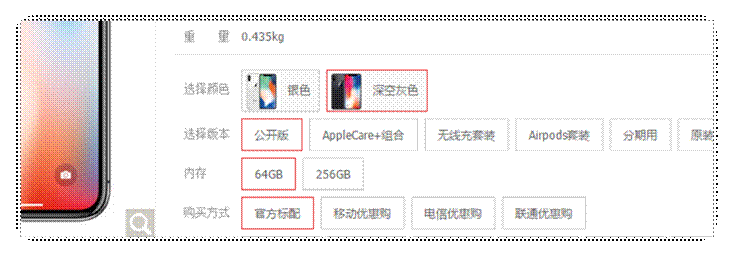

2 从性能角度来看，需要最大程度的提升页面的访问速度。

难点：

1.skuInfo 表中一些基本信息。

2.销售属性展示：应该从spu_sale_attr,spu_sale_attr_value

3.通过选择销售属性，来切换商品，实际上：通过选择销售属性展示不同的商品。

# 三 Thymeleaf(了解)

## 1 模板技术

把页面中的静态数据替换成从后台数据库中的数据。这种操作用jsp就可以实现。但是Spring boot 的架构不推荐使用Jsp，而且支持也不好，所以如果你是用springboot的话，一般使用Freemarker或者Thymeleaf。

而官方也是推荐使用**Thymeleaf**。

关于与前端有关的技术的比较

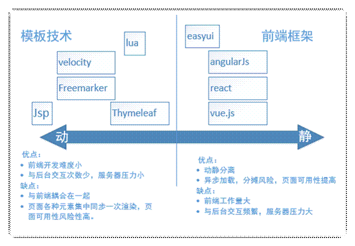

## 2 Thymeleaf 简介

Thymeleaf的主要目标是提供一个优雅和高度可维护的创建模板的方式。为了实现这一点，它建立在*自然*模板的概念上，将其逻辑注入到模板文件中，不会影响模板被用作设计原型。这改善了设计的沟通，弥合了设计和开发团队之间的差距。

比Jsp和Freemarker的优势，一般的模板技术都会在页面加各种表达式、标签甚至是java代码，而这些都必须要经过后台服务器的渲染才能打开。

但如果前端开发人员做页面调整，双击打开某个jsp或者ftl来查看效果，基本上是打不开的。

那么Thymeleaf的优势就出来了，因为Thymeleaf没有使用自定义的标签或语法，所有的模板语言都是扩展了标准H5标签的属性

## 3 快速入门

项目创建，依赖模块web，Thymeleaf模板

```xml
 <parent>
     <groupId>org.springframework.boot</groupId>
     <artifactId>spring-boot-starter-parent</artifactId>
     <version>2.1.4.RELEASE</version>
</parent>
<dependencies>
     <!--web起步依赖-->
     <dependency>
         <groupId>org.springframework.boot</groupId>
         <artifactId>spring-boot-starter-web</artifactId>
     </dependency>

     <!--thymeleaf配置-->
     <dependency>
         <groupId>org.springframework.boot</groupId>
         <artifactId>spring-boot-starter-thymeleaf</artifactId>
     </dependency>
</dependencies>
```

新建html页面

```html
<!DOCTYPE html>
<html xmlns:th="http://www.thymeleaf.org">
<head>
    <title>Thymeleaf的入门</title>
    <meta http-equiv="Content-Type" content="text/html; charset=UTF-8"/>
</head>
<body>
<!--输出hello数据-->
<p th:text="${hello}"></p>
</body>
</html>
```

(1)文本输出

普通文本输出

```html
<p th:text="${description}"></p
```

`th:utext`输出文本可以识别html标签：

```html
<p th:utext="${description}"></p>
```

(2)th:each

对象遍历，功能类似jstl中的`<c:forEach>`标签。

```java
public class User {
    private Integer id;
    private String name;
    private String address;

    public User() {
    }
    public User(Integer id, String name, String address) {
        this.id = id;
        this.name = name;
        this.address = address;
    }
    //..get..set
}
```

页面输出

```html
<table>
    <tr>
        <td>下标</td>
        <td>编号</td>
        <td>姓名</td>
        <td>住址</td>
    </tr>
    <tr th:each="user,userStat:${users}">
        <td>
            下标:<span th:text="${userStat.index}"></span>,
        </td>
        <td th:text="${user.id}"></td>
        <td th:text="${user.name}"></td>
        <td th:text="${user.address}"></td>
    </tr>
</table>
```

(3)Date输出

后台添加日期

```java
//日期
model.addAttribute("now",new Date());
```

页面输出

```HTML
<div>
    <span th:text="${#dates.format(now,'yyyy-MM-dd hh:ss:mm')}"></span>
</div>
```

(4)条件判断

th:if条件判断

```java
  //if条件
model.addAttribute("age",22);
```

```html
<div>
    <span th:if="${(age>=18)}">成年人</span>
</div>
```


反向判断`th:unless`，代码如下：

```html
<p>th:unless 反向判断age小于18岁的条件不成立的时候输出成年人</p>
<div>
    <span th:unless="${age<18}">成年人</span>
</div>
```

(4)Map输出

后台添加Map

```java
//Map定义
Map<String,Object> dataMap = new HashMap<String,Object>();
dataMap.put("no","1");
dataMap.put("address","武汉");
model.addAttribute("data",dataMap);
```

页面输出

```html
<div th:each="map,mapStat:${data}">
    <div th:text="${map}"></div>
    key:<span th:text="${mapStat.current.key}"></span><br/>
    value:<span th:text="${mapStat.current.value}"></span><br/>
</div>
```

判断Map是否存在某个Key

```html
<p>if判断Map中是否包含某个key</p>
<div th:if="${#maps.containsKey(data,'address')}">
    <span th:text="${data.address}"></span>
</div>
```

(5)字符处理

在后台存储一个name数据：

```java
//字符判断和处理
model.addAttribute("name","atguigu_深圳");
```

以指定字符开始判断:

```html
<p>判断是否以atguigu_开始，如果是，则输出name值</p>
<div th:if="${#strings.startsWith(name,'atguigu_')}">
    <span th:text="${name}"></span>
</div>
```

去掉字符中指定字符串:

```html
<p>将name中的atguigu_替换成空数据</p>
<div th:text="${#strings.replace(name,'atguigu_','')}"></div>
```

(6)超链接处理

超链接使用`th:href`语法是`th:href="@{url(name=xx,age=xx)}"`，案例如下：

在后台添加一个url参数

```java
//添加一个地址
model.addAttribute("url", "/test/jump");
```

在后台添加一个`/test/add`的跳转地址方法

```java
/**
 * 重定向跳转
 * @return
 */
@RequestMapping("/jump")
public String add(String name,String address,Model model) {
    System.out.println(name+"  住址是 "+address);
    return "redirect:http://www.atguigu.com";
}
```

前端跳转配置：

```html
<p>跳转地址</p>
<a th:href="@{${url}(name='尚硅谷',address='北京')}">跳转到/test/jump</a>
```

(7)图片

```html
<p>图片显示</p>

```

(8)递增输出

输出1-10的数据

```html
<p>输出1-10的数据</p>
<div th:each="i:${#numbers.sequence(1,10,1)}">
    <span th:text="${i}"></span>
</div>
```


# 四 商品详情业务需求分析

## 1 详情渲染介绍

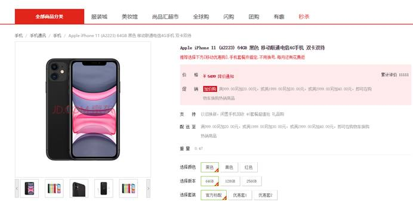

商品详情所需构建的数据如下：

1，Sku基本信息

2，Sku图片信息

3，Sku分类信息

4，Sku销售属性相关信息

5，Sku价格信息（平台可以单独修改价格，sku后续会放入缓存，为了回显最新价格，所以单独获取）

...

## 2 详情模块规划

模块规划思路：

1，service-item微服务模块封装详情页面所需数据接口；

2，service-item通过feign client调用其他微服务数据接口进行数据汇总；

3，Pc端前台页面通过web-all调用service-item数据接口渲染页面；

4，service-item可以为ps端、H5、安卓与ios等前端应用提供数据接口，web-all为ps端页面渲染形式

5，service-item获取商品信息需要调用service-product服务sku信息等；

6，由于service各微服务可能会相互调用，调用方式都是通过feign client调用，所以我们把feign client api接口单独封装出来，需要时直接引用feign client api模块接口即可，即需创建service-client父模块，管理各service微服务feign client api接口
 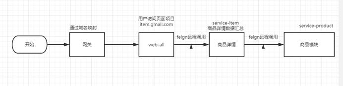


# 五 商品详情实现

## 1 搭建service-item

点击service，选择New–>Module,操作如下

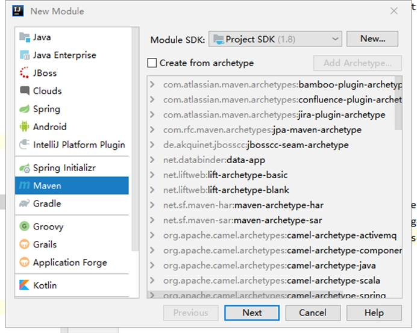

下一步


下一步

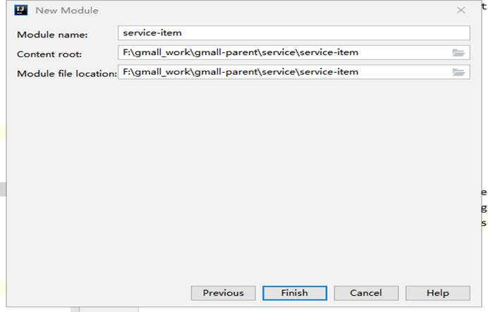

完成，结构如下

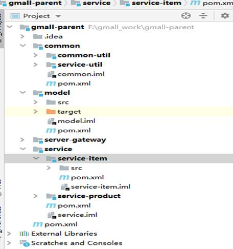

修改配置pom.xml

```xml
<?xml version="1.0" encoding="UTF-8"?>
<project xmlns="http://maven.apache.org/POM/4.0.0"
         xmlns:xsi="http://www.w3.org/2001/XMLSchema-instance"
         xsi:schemaLocation="http://maven.apache.org/POM/4.0.0 http://maven.apache.org/xsd/maven-4.0.0.xsd">
    <parent>
        <artifactId>service</artifactId>
        <groupId>com.atguigu.gmail</groupId>
        <version>1.0-SNAPSHOT</version>
    </parent>
    <modelVersion>4.0.0</modelVersion>

    <artifactId>service-item</artifactId>

    <description>商品详情微服务</description>

    <dependencies>
        <dependency>
            <groupId>com.atguigu.gmail</groupId>
            <artifactId>service-product</artifactId>
            <version>1.0-SNAPSHOT</version>
        </dependency>
    </dependencies>

    <build>
        <finalName>service-item</finalName>
        <plugins>
            <plugin>
                <groupId>org.springframework.boot</groupId>
                <artifactId>spring-boot-maven-plugin</artifactId>
            </plugin>
        </plugins>
    </build>
</project>
```

添加配置文件application.yml

```yml
spring:
  application:
    name: service-item
  profiles:
    active: dev
  cloud:
    nacos:
      discovery:
        server-addr: 192.168.200.128:8848
```

添加配置文件application-dev.yml

```yml
server:
  port: 8202
spring:
  zipkin:
    base-url: http://192.168.200.128:9411
    discovery-client-enabled: false
    sender:
      type: web
  sleuth:
    sampler:
      probability: 1
  cloud:
    sentinel:
      transport:
        dashboard: 192.168.200.128:8858
  redis:
    host: 192.168.200.128
    port: 6379
    database: 0
    timeout: 1800000
    password:
    lettuce:
      pool:
        max-active: 20 #最大连接数
        max-wait: -1    #最大阻塞等待时间(负数表示没限制)
        max-idle: 5    #最大空闲
        min-idle: 0     #最小空闲
feign:
  sentinel:
    enabled: true
  client:
    config:
      default:
        readTimeout: 3000
        connectTimeout: 1000
```

添加启动类

```java
package com.atguigu.gmall.item;

import org.springframework.boot.SpringApplication;
import org.springframework.boot.autoconfigure.SpringBootApplication;
import org.springframework.boot.autoconfigure.jdbc.DataSourceAutoConfiguration;
import org.springframework.cloud.client.discovery.EnableDiscoveryClient;
import org.springframework.cloud.openfeign.EnableFeignClients;
import org.springframework.context.annotation.ComponentScan;

@SpringBootApplication(exclude = DataSourceAutoConfiguration.class)
@EnableDiscoveryClient
@EnableFeignClients(basePackages = "com.atguigu.gmall.item.feign")
@ComponentScan("com.atguigu.gmall")
public class ItemApplication {

    public static void main(String[] args) {
        SpringApplication.run(ItemApplication.class, args);
    }
}

```

## 2 product微服务提供api接口

### 2.1 获取sku信息

接口类

```java
/**
* 查询sku的详细信息
* @param skuId
* @return
*/
public SkuInfo getSkuInfo(Long skuId);
```

实现类

```java
/**
     * 查询sku的详细信息
     *
     * @param skuId
     * @return
     */
    @Override
    public SkuInfo getSkuInfo(Long skuId) {
        //根据id查询sku信息
        SkuInfo skuInfo = skuInfoMapper.selectById(skuId);
        //查询sku的图片信息
        List<SkuImage> skuImages =
                skuImageMapper.selectList(new LambdaQueryWrapper<SkuImage>().eq(SkuImage::getSkuId, skuId));
        //保存图片信息
        skuInfo.setSkuImageList(skuImages);
        //返回结果
        return skuInfo;
    }
```

```java
/**
     * 根据skuId获取sku信息
     * @param skuId
     * @return
     */
    @GetMapping("/getSkuInfo/{skuId}")
    public SkuInfo getAttrValueList(@PathVariable("skuId") Long skuId){
        SkuInfo skuInfo = manageService.getSkuInfo(skuId);
        return skuInfo;
    }
```

### 2.2 获取分类信息

#### 2.2.1 需求分析

sku是挂在三级分类下面的，我们的分类信息分别在base_category1、base_category2、base_category3这三张表里面，目前需要通过sku表的三级分类id获取一级分类名称、二级分类名称和三级分类名称

解决方案：

我们可以建立一个**视图**(view)，把三张表关联起来，视图id就是三级分类id，这样通过三级分类id就可以查询到相应数据，效果如下：

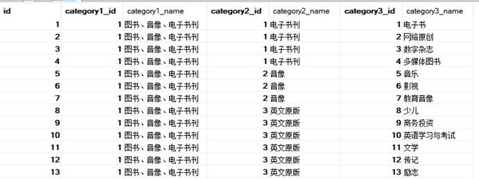

  创建视图

```sql
CREATE VIEW base_category_view AS SELECT
c3.id AS id,
c1.id AS category1_id,
c1.NAME AS category1_name,
c2.id AS category2_id,
c2.NAME AS category2_name,
c3.id AS category3_id,
c3.NAME AS category3_name
FROM
	base_category1 c1
	INNER JOIN base_category2 c2 ON c2.category1_id = c1.id
	INNER JOIN base_category3 c3 ON c3.category2_id = c2.id
```

#### 2.2.2 实现代码

```java
package com.atguigu.gmall.product.dao;

import com.atguigu.gmall.model.product.BaseCategoryView;
import com.baomidou.mybatisplus.core.mapper.BaseMapper;
import org.apache.ibatis.annotations.Mapper;

/**
 * 查询类别视图dao层
 */
@Mapper
public interface BaseCategoryViewMapper extends BaseMapper<BaseCategoryView> {
}

```

service

```java
/**
     * 根据第三级分类的id查询所有类别的信息(包含一级 二级 三级分类的完整的id和name属性)
     * @param category3Id
     * @return
     */
    BaseCategoryView getCategoryViewByCategory3Id(Long category3Id);
```

实现类

```java
	@Autowired
    private BaseCategoryViewMapper baseCategoryViewMapper;
    /**
     * 根据第三级分类的id查询所有类别的信息(包含一级 二级 三级分类的完整的id和name属性)
     *
     * @param category3Id
     * @return
     */
    @Override
    public BaseCategoryView getCategoryViewByCategory3Id(Long category3Id) {
        BaseCategoryView baseCategoryView = baseCategoryViewMapper.selectById(category3Id);
        return baseCategoryView;
    }
```

```java
/**
     * 通过三级分类id查询分类信息
     * @param category3Id
     * @return
     */
    @GetMapping("/getCategoryView/{category3Id}")
    public BaseCategoryView getCategoryView(@PathVariable("category3Id")Long category3Id){
        return manageService.getCategoryViewByCategory3Id(category3Id);
    }
```


### 2.3 获取价格信息

接口类

```java
/**
     * 获取sku价格
     * @param skuId
     * @return
     */
    BigDecimal getSkuPrice(Long skuId);
```

实现类

```java
/**
     * 获取sku价格
     *
     * @param skuId
     * @return
     */
    @Override
    public BigDecimal getSkuPrice(Long skuId) {
        //查询sku的详细信息
        SkuInfo skuInfo = skuInfoMapper.selectById(skuId);
        //若sku不存在直接返回0
        if(skuInfo == null || skuInfo.getId() == null){
            return BigDecimal.valueOf(0);
        }
        //若sku存在则返回价格
        return skuInfo.getPrice();
    }
```

```java
/**
     * 获取sku最新价格
     * @param skuId
     * @return
     */
    @GetMapping("/getSkuPrice/{skuId}")
    public BigDecimal getSkuPrice(@PathVariable Long skuId){
        return manageService.getSkuPrice(skuId);
    }
```

### 2.4 获取销售信息

思路：

1、查出该商品的spu的所有销售属性和属性值

2、标识出本商品对应的销售属性

3、点击其他销售属性值的组合，跳转到另外的sku页面

#### 2.4.1 实现代码

第1、2条通过此sql实现

```sql
SELECT
	sa.id,
	sa.spu_id,
	sa.sale_attr_name,
	sa.base_sale_attr_id,
	sv.id sale_attr_value_id,
	sv.sale_attr_value_name,
	skv.sku_id,
IF
	( skv.sku_id IS NULL, 0, 1 ) is_checked
FROM
	spu_sale_attr sa
	INNER JOIN spu_sale_attr_value sv ON sa.spu_id = sv.spu_id
	AND sa.base_sale_attr_id = sv.base_sale_attr_id
	LEFT JOIN sku_sale_attr_value skv ON skv.sale_attr_value_id = sv.id
	AND skv.sku_id = #{skuId}
    WHERE sa.spu_id=#{spuId}
    ORDER BY sv.base_sale_attr_id,sv.id
```

此sql列出所有该spu的销售属性和属性值，并关联某skuid如果能关联上is_check设为1，否则设为0。

在对应的实体类中【SpuSaleAttrValue】添加属性字段

```java
@TableField(exist = false)
String isChecked;
```

2.4.2 在SpuSaleAttrMapper 接口中添加的方法

dao

```java
/**
     * 根据spuid和skuid获取商品的销售属性
     * @param spuId
     * @param skuId
     * @return
     */
    List<SpuSaleAttr> selectSpuSaleAttrListCheckBySku(@Param("spuId")Long spuId, @Param("skuId")Long skuId);
```

xml

```xml
<!-- 根据spuid和skuid获取商品的销售属性-->
    <select id="spuSaleAttr" resultType="spuSaleAttrResultMap">
        SELECT
            sksav.sku_id,
            ssa.spu_id,
            ssa.id,
            ssa.base_sale_attr_id,
            ssa.sale_attr_name,
            ssav.sale_attr_value_name,
            ssav.id AS sale_attr_value_id,
            IF(sksav.sku_id is null, 0, 1) is_check
        FROM
            spu_sale_attr ssa
            INNER JOIN spu_sale_attr_value ssav ON ssa.spu_id = ssav.spu_id
            AND ssa.base_sale_attr_id = ssav.base_sale_attr_id
            LEFT JOIN sku_sale_attr_value sksav ON sksav.sale_attr_value_id = ssav.id
            AND sksav.sku_id = #{skuId}
        WHERE
            ssa.spu_id = #{spuId}
        ORDER BY ssa.base_sale_attr_id,ssav.id
    </select>
```

接口类

```java
/**
     * 查询指定商品的销售属性
     * @param skuId
     * @param spuId
     * @return
     */
    List<SpuSaleAttr> getSpuSaleAttrListCheckBySku(Long skuId, Long spuId);
```

实现类

```java
/**
     * 查询指定商品的销售属性
     *
     * @param skuId
     * @param spuId
     * @return
     */
    @Override
    public List<SpuSaleAttr> getSpuSaleAttrListCheckBySku(Long skuId, Long spuId) {
        List<SpuSaleAttr> spuSaleAttrs = spuSaleAttrMapper.selectSpuSaleAttrListCheckBySku(spuId, skuId);
        return spuSaleAttrs;
    }
```

```java
/**
     * 根据spuId，skuId 查询销售属性集合
     * @param skuId
     * @param spuId
     * @return
     */
    @GetMapping("/getSpuSaleAttrListCheckBySku/{skuId}/{spuId}")
    public List<SpuSaleAttr> getSpuSaleAttrListCheckBySku(@PathVariable("skuId") Long skuId,@PathVariable("spuId") Long spuId){
        return manageService.getSpuSaleAttrListCheckBySku(skuId, spuId);
    }
```


### 2.5 商品切换


实现思路：


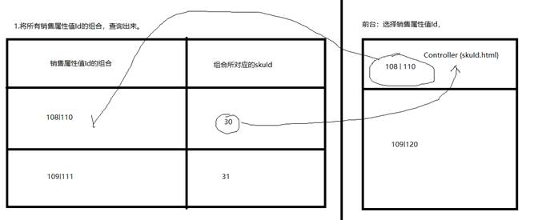

1 、从页面中获得得所有选中的销售属性进行组合比如：

“属性值1|属性值2|属性值3” 用这个字符串匹配一个对照表，来获得skuId。并进行跳转，或者告知无货。

2、后台要生成一个“属性值1|属性值2|属性值3：skuId”的一个json串以提供页面进行匹配。如

3、需要从后台数据库查询出该spu下的所有skuId和属性值关联关系。然后加工成如上的Json串，用该json串，跟前台匹配。

实现：

使用sql 语句来解决：

GROUP_CONCAT：group_concat( [distinct] 要连接的字段 [order by 排序字段 asc/desc ] [separator '分隔符'] )

#### 2.5.1 实现代码

dao

```java
package com.atguigu.gmall.proudct.mapper;

import com.atguigu.gmall.model.product.SkuSaleAttrValue;
import com.baomidou.mybatisplus.core.mapper.BaseMapper;
import org.apache.ibatis.annotations.Mapper;
import org.apache.ibatis.annotations.Param;

import java.util.List;
import java.util.Map;

/**
 * sku销售属性值关系dao
 */
@Mapper
public interface SkuSaleAttrValueMapper extends BaseMapper<SkuSaleAttrValue> {

    /**
     * 查询指定spu的所有skuid:销售属性键值对
     * @param spuId
     * @return
     */
    List<Map> selectSkuMap(@Param("spuId") Long spuId);
}

```

sql

```xml
<?xml version="1.0" encoding="UTF-8"?>
<!DOCTYPE mapper SYSTEM "http://mybatis.org/dtd/mybatis-3-mapper.dtd" >
<mapper namespace="com.atguigu.gmall.proudct.mapper.SkuSaleAttrValueMapper">

    <select id="selectSkuMap" resultType="java.util.Map">
        SELECT
            t1.sku_id,
            GROUP_CONCAT( t2.sale_attr_value_name ORDER BY t2.base_sale_attr_id SEPARATOR '|' ) as value_id
        FROM
            sku_sale_attr_value t1
            INNER JOIN spu_sale_attr_value t2 ON t1.sale_attr_value_id = t2.id
            WHERE t1.spu_id = #{spuId}
        GROUP BY
            t1.sku_id
    </select>
</mapper>
```


接口类

```java
/**
* 查询指定spu的所有销售属性值与sku对应关系
* @param spuId
* @return
*/
public Map getSkuValueIdsMap(Long spuId);
```

实现类

```java
@Autowired
private SkuSaleAttrValueMapper skuSaleAttrValueMapper;
/**
* 查询指定spu的所有销售属性值与sku对应关系
*
* @param spuId
* @return
*/
@Override
public Map getSkuValueIdsMap(Long spuId) {
    //初始化
    Map<Object, Object> result = new HashMap<>();
    //查询所有的键值对
    List<Map> maps = skuSaleAttrValueMapper.selectSkuMap(spuId);
    //遍历处理
    for (Map map : maps) {
        result.put(map.get("sku_id"), map.get("value_id"));
    }
    return result;
}
```

```java
/**
* 根据spuId 查询map 集合属性
* @param spuId
* @return
*/
@GetMapping("/getSkuValueIdsMap/{spuId}")
public Map getSkuValueIdsMap(@PathVariable("spuId") Long spuId){
    return manageService.getSkuValueIdsMap(spuId);
}
```

说明：目前我们在service-product里面把数据模型已经封装好了，接下封装feign client api接口，提供给service-item微服务调用汇总数据模型

### 2.6 service-item调用

service

```java
package com.atguigu.gmall.item.service;

import java.util.Map;

/**
 * 商品详情service接口类
 */
public interface ItemService {

    /**
     * 根据skuId查询sku的详细信息,用于生成sku的详情页面
     * @param skuId
     * @return
     */
    public Map<String, Object> getSkuDetail(Long skuId);
}
```

实现类

```java
package com.atguigu.gmall.item.service.impl;

import com.atguigu.gmall.item.service.ItemService;
import org.springframework.stereotype.Service;

import java.util.Map;

/**
 * 商品详情服务service的实现类
 */
@Service
public class ItemServiceImpl implements ItemService {

    /**
     * 根据skuId查询sku的详细信息,用于生成sku的详情页面
     *
     * @param skuId
     * @return
     */
    @Override
    public Map<String, Object> getSkuDetail(Long skuId) {
        //远程调用商品微服务service-product,获取sku的info  image 销售属性 平台属性信息

        return null;
    }
}
```

controller

```java
package com.atguigu.gmall.item.controller;

import com.atguigu.gmall.common.result.Result;
import com.atguigu.gmall.item.service.ItemService;
import org.springframework.beans.factory.annotation.Autowired;
import org.springframework.web.bind.annotation.GetMapping;
import org.springframework.web.bind.annotation.PathVariable;
import org.springframework.web.bind.annotation.RequestMapping;
import org.springframework.web.bind.annotation.RestController;

import java.util.Map;

@RestController
@RequestMapping(value = "/item")
public class ItemController {

    @Autowired
    private ItemService itemService;

    /**
     * 查询sku的详细信息,用于生成sku的详情页面
     * @param skuId
     * @return
     */
    @GetMapping(value = "/getSkuDetail/{item}")
    public Result getSkuDetail(@PathVariable(value = "item") Long skuId){
        Map<String, Object> skuDetail = itemService.getSkuDetail(skuId);
        return Result.ok(skuDetail);
    }
}
```

说明：商品详情相关信息在service-product微服务都可以获取，所以我们在service-product模块编写所需要的接口


## 3 搭建service-client父模块

该模块管理所有微服务feign client api模块

搭建方式如：common父模块

 修改pom.xml文件

```xml
<?xml version="1.0" encoding="UTF-8"?>
<project xmlns="http://maven.apache.org/POM/4.0.0"
         xmlns:xsi="http://www.w3.org/2001/XMLSchema-instance"
         xsi:schemaLocation="http://maven.apache.org/POM/4.0.0 http://maven.apache.org/xsd/maven-4.0.0.xsd">
    <parent>
        <artifactId>gmall-parent</artifactId>
        <groupId>com.atguigu.gmail</groupId>
        <version>1.0-SNAPSHOT</version>
    </parent>
    <modelVersion>4.0.0</modelVersion>

    <artifactId>service-client</artifactId>

    <description>微服务feign远程调用接口管理模块</description>

    <dependencies>
        <dependency>
            <groupId>com.atguigu.gmail</groupId>
            <artifactId>common-util</artifactId>
            <version>1.0-SNAPSHOT</version>
        </dependency>

        <dependency>
            <groupId>com.atguigu.gmail</groupId>
            <artifactId>model</artifactId>
            <version>1.0-SNAPSHOT</version>
        </dependency>

        <dependency>
            <groupId>org.springframework.boot</groupId>
            <artifactId>spring-boot-starter-web</artifactId>
        </dependency>

        <!-- 服务调用feign -->
        <dependency>
            <groupId>org.springframework.cloud</groupId>
            <artifactId>spring-cloud-starter-openfeign</artifactId>
            <scope>provided </scope>
        </dependency>
    </dependencies>
</project>
```


## 4 搭建service-product-client

在service-client 模块下创建

修改pom.xml

```xml
<?xml version="1.0" encoding="UTF-8"?>
<project xmlns="http://maven.apache.org/POM/4.0.0"
         xmlns:xsi="http://www.w3.org/2001/XMLSchema-instance"
         xsi:schemaLocation="http://maven.apache.org/POM/4.0.0 http://maven.apache.org/xsd/maven-4.0.0.xsd">
    <parent>
        <artifactId>service-client</artifactId>
        <groupId>com.atguigu.gmail</groupId>
        <version>1.0-SNAPSHOT</version>
    </parent>
    <modelVersion>4.0.0</modelVersion>

    <artifactId>service-product-client</artifactId>

    <description>商品管理微服务feign接口管理模块</description>

</project>
```

封装service-product-client接口

feign接口类

```java
package com.atguigu.gmall.product.client;

import com.atguigu.gmall.common.result.Result;
import com.atguigu.gmall.model.product.BaseCategoryView;
import com.atguigu.gmall.model.product.SkuInfo;
import com.atguigu.gmall.model.product.SpuSaleAttr;
import org.springframework.cloud.openfeign.FeignClient;
import org.springframework.web.bind.annotation.GetMapping;
import org.springframework.web.bind.annotation.PathVariable;

import java.math.BigDecimal;
import java.util.List;
import java.util.Map;

/**
 * 商品管理微服务远程feign接口
 */
@FeignClient(name = "service-product", path = "/admin/product")
public interface ProductFeignClient {

    /**
     * 通过三级分类id查询分类信息
     * @param category3Id
     * @return
     */
    @GetMapping("/getCategoryView/{category3Id}")
    public BaseCategoryView getCategoryView(@PathVariable("category3Id")Long category3Id);

    /**
     * 根据spuId，skuId 查询销售属性集合
     * @param skuId
     * @param spuId
     * @return
     */
    @GetMapping("/getSpuSaleAttrListCheckBySku/{skuId}/{spuId}")
    public List<SpuSaleAttr> getSpuSaleAttrListCheckBySku(@PathVariable("skuId") Long skuId,@PathVariable("spuId") Long spuId);

    /**
     * 根据spuId 查询map 集合属性
     * @param spuId
     * @return
     */
    @GetMapping("/getSkuValueIdsMap/{spuId}")
    public Map getSkuValueIdsMap(@PathVariable("spuId") Long spuId);

    /**
     * 获取sku最新价格
     * @param skuId
     * @return
     */
    @GetMapping("/getSkuPrice/{skuId}")
    public BigDecimal getSkuPrice(@PathVariable Long skuId);

    /**
     * 根据skuId获取sku信息
     * @param skuId
     * @return
     */
    @GetMapping("/getSkuInfo/{skuId}")
    public SkuInfo getSkuInfo(@PathVariable("skuId") Long skuId);

}

```

feign降级类

```java
package com.atguigu.gmall.product.client.fallback;

import com.atguigu.gmall.model.product.BaseCategoryView;
import com.atguigu.gmall.model.product.SkuInfo;
import com.atguigu.gmall.model.product.SpuSaleAttr;
import com.atguigu.gmall.product.client.ProductFeignClient;
import org.springframework.stereotype.Component;

import java.math.BigDecimal;
import java.util.List;
import java.util.Map;

/**
 * 降级类
 */
@Component
public class ProductFeignClientFallBack implements ProductFeignClient {

    /**
     * 通过三级分类id查询分类信息
     *
     * @param category3Id
     * @return
     */
    @Override
    public BaseCategoryView getCategoryView(Long category3Id) {
        return null;
    }

    /**
     * 根据spuId，skuId 查询销售属性集合
     *
     * @param skuId
     * @param spuId
     * @return
     */
    @Override
    public List<SpuSaleAttr> getSpuSaleAttrListCheckBySku(Long skuId, Long spuId) {
        return null;
    }

    /**
     * 根据spuId 查询map 集合属性
     *
     * @param spuId
     * @return
     */
    @Override
    public Map getSkuValueIdsMap(Long spuId) {
        return null;
    }

    /**
     * 获取sku最新价格
     *
     * @param skuId
     * @return
     */
    @Override
    public BigDecimal getSkuPrice(Long skuId) {
        return null;
    }

    /**
     * 根据skuId获取sku信息
     *
     * @param skuId
     * @return
     */
    @Override
    public SkuInfo getSkuInfo(Long skuId) {
        return null;
    }
}

```

说明：接下来service-item引用service-product-client模块，就可以调用相应接口

在service-item pom.xml引用依赖：

```xml
<dependency>
   <groupId>com.atguigu.gmall</groupId>
   <artifactId>service-product-client</artifactId>
   <version>1.0</version>
</dependency>
```

## 5 service-item模块汇总数据

```java
package com.atguigu.gmall.item.service.impl;

import com.alibaba.fastjson.JSONObject;
import com.atguigu.gmall.item.service.ItemService;
import com.atguigu.gmall.model.product.BaseCategoryView;
import com.atguigu.gmall.model.product.SkuInfo;
import com.atguigu.gmall.model.product.SpuSaleAttr;
import com.atguigu.gmall.product.client.ProductFeignClient;
import org.springframework.beans.factory.annotation.Autowired;
import org.springframework.stereotype.Service;

import java.math.BigDecimal;
import java.util.HashMap;
import java.util.List;
import java.util.Map;

/**
 * 商品详情服务service的实现类
 */
@Service
public class ItemServiceImpl implements ItemService {

    @Autowired
    private ProductFeignClient productFeignClient;

    /**
     * 根据skuId查询sku的详细信息,用于生成sku的详情页面
     *
     * @param skuId
     * @return
     */
    @Override
    public Map<String, Object> getSkuDetail(Long skuId) {
        //远程调用商品微服务service-product,获取sku的info
        SkuInfo skuInfo = productFeignClient.getSkuInfo(skuId);
        //类别
        BaseCategoryView categoryView = productFeignClient.getCategoryView(skuInfo.getCategory3Id());
        //价格
        BigDecimal skuPrice = productFeignClient.getSkuPrice(skuId);
        //获取所有销售属性值与sku的键值对
        Map skuValueIdsMap = productFeignClient.getSkuValueIdsMap(skuInfo.getSpuId());
        //获取指定spu与sku的商品的销售属性值信息
        List<SpuSaleAttr> spuSaleAttrListCheckBySku = productFeignClient.getSpuSaleAttrListCheckBySku(skuId, skuInfo.getSpuId());
        //包装返回结果
        Map<String, Object> result = new HashMap<>();
        result.put("skuInfo", skuInfo);
        result.put("categoryView", categoryView);
        result.put("skuPrice", skuPrice);
        //map类型最好进行json串转换,方便前端进行处理
        result.put("skuValueIdsMap", JSONObject.toJSONString(skuValueIdsMap));
        result.put("spuSaleAttrListCheckBySku", spuSaleAttrListCheckBySku);
        //返回结果
        return result;
    }
}
```

## 6 商品详情页面渲染(了解)

### 6.1 搭建web-util模块

搭建方式如service-util

```xml
<?xml version="1.0" encoding="UTF-8"?>
<project xmlns="http://maven.apache.org/POM/4.0.0"
         xmlns:xsi="http://www.w3.org/2001/XMLSchema-instance"
         xsi:schemaLocation="http://maven.apache.org/POM/4.0.0 http://maven.apache.org/xsd/maven-4.0.0.xsd">
    <parent>
        <artifactId>common</artifactId>
        <groupId>com.atguigu.gmail</groupId>
        <version>1.0-SNAPSHOT</version>
    </parent>
    <modelVersion>4.0.0</modelVersion>

    <artifactId>web-util</artifactId>

    <description>web页面微服务相关工具管理模块</description>

    <dependencies>
        <dependency>
            <groupId>com.atguigu.gmail</groupId>
            <artifactId>common-util</artifactId>
            <version>1.0-SNAPSHOT</version>
        </dependency>
        <!-- 服务调用feign -->
        <dependency>
            <groupId>org.springframework.cloud</groupId>
            <artifactId>spring-cloud-starter-openfeign</artifactId>
            <scope>provided</scope>
        </dependency>
        <dependency>
            <groupId>org.springframework.boot</groupId>
            <artifactId>spring-boot-starter-web</artifactId>
            <scope>provided </scope>
        </dependency>
    </dependencies>


</project>
```

### 6.2 构建web父模块

构建方式如：common父模块

修改配置pom.xml

```xml
<?xml version="1.0" encoding="UTF-8"?>
<project xmlns="http://maven.apache.org/POM/4.0.0"
         xmlns:xsi="http://www.w3.org/2001/XMLSchema-instance"
         xsi:schemaLocation="http://maven.apache.org/POM/4.0.0 http://maven.apache.org/xsd/maven-4.0.0.xsd">
    <parent>
        <artifactId>gmall-parent</artifactId>
        <groupId>com.atguigu.gmail</groupId>
        <version>1.0-SNAPSHOT</version>
    </parent>
    <modelVersion>4.0.0</modelVersion>

    <artifactId>web</artifactId>

    <description>页面相关微服务父工程</description>

    <dependencies>
        <dependency>
            <groupId>com.atguigu.gmail</groupId>
            <artifactId>web-util</artifactId>
            <version>1.0-SNAPSHOT</version>
        </dependency>

        <dependency>
            <groupId>org.springframework.boot</groupId>
            <artifactId>spring-boot-starter-web</artifactId>
        </dependency>

        <dependency>
            <groupId>org.springframework.boot</groupId>
            <artifactId>spring-boot-starter-thymeleaf</artifactId>
        </dependency>
        <!-- 服务注册 -->
        <dependency>
            <groupId>org.springframework.cloud</groupId>
            <artifactId>spring-cloud-starter-alibaba-nacos-discovery</artifactId>
        </dependency>
        <!-- 服务调用feign -->
        <dependency>
            <groupId>org.springframework.cloud</groupId>
            <artifactId>spring-cloud-starter-openfeign</artifactId>
        </dependency>
        <!-- 流量控制 -->
        <dependency>
            <groupId>org.springframework.cloud</groupId>
            <artifactId>spring-cloud-starter-alibaba-sentinel</artifactId>
        </dependency>
    </dependencies>
</project>
```

### 6.3 构建web-all模块

搭建方式在web模块下创建

```xml
<?xml version="1.0" encoding="UTF-8"?>
<project xmlns="http://maven.apache.org/POM/4.0.0"
         xmlns:xsi="http://www.w3.org/2001/XMLSchema-instance"
         xsi:schemaLocation="http://maven.apache.org/POM/4.0.0 http://maven.apache.org/xsd/maven-4.0.0.xsd">
    <parent>
        <artifactId>web</artifactId>
        <groupId>com.atguigu.gmail</groupId>
        <version>1.0-SNAPSHOT</version>
    </parent>
    <modelVersion>4.0.0</modelVersion>

    <artifactId>web-all</artifactId>

    <description>商品管理相关的前端页面工程</description>

    <build>
        <finalName>web-all</finalName>
        <plugins>
            <plugin>
                <groupId>org.springframework.boot</groupId>
                <artifactId>spring-boot-maven-plugin</artifactId>
            </plugin>
        </plugins>
    </build>

</project>
```

application.yml

```yml
spring:
  application:
    name: web-all
  profiles:
    active: dev
  cloud:
    nacos:
      discovery:
        server-addr: 192.168.200.128:8848
```

application-dev.yml

```yml
server:
  port: 8300

spring:
  thymeleaf:
    mode: LEGACYHTML5
    #编码 可不用配置
    encoding: UTF-8
    #开发配置为false,避免修改模板还要重启服务器
    cache: false
    #配置模板路径，默认是templates，可以不用配置
    prefix: classpath:/templates/
  cloud:
    sentinel:
      transport:
        dashboard: 192.168.200.128:8858
  jackson:
    date-format: yyyy-MM-dd HH:mm:ss
    time-zone: GMT+8
feign:
  sentinel:
    enabled: true
  client:
    config
      default:
        readTimeout: 30000
        connectTimeout: 10000
```

启动类

```java
package com.atguigu.gmall.all;

import org.springframework.boot.SpringApplication;
import org.springframework.boot.autoconfigure.SpringBootApplication;
import org.springframework.boot.autoconfigure.jdbc.DataSourceAutoConfiguration;
import org.springframework.cloud.client.discovery.EnableDiscoveryClient;
import org.springframework.cloud.openfeign.EnableFeignClients;
import org.springframework.context.annotation.ComponentScan;

@SpringBootApplication(exclude = DataSourceAutoConfiguration.class)
@EnableDiscoveryClient
@EnableFeignClients
@ComponentScan("com.atguigu.gmall")
public class WebAllApplication {
    public static void main(String[] args) {
        SpringApplication.run(WebAllApplication.class, args);
    }
}
```

**将web-all 模块添加到网关**

```yml
server:
  port: 80
spring:
  application:
    name: api-gateway
  cloud:
    nacos:
      discovery:
        server-addr: 192.168.200.128:8848
    gateway:
      discovery:      #是否与服务发现组件进行结合，通过 serviceId(必须设置成大写) 转发到具体的服务实例。默认为false，设为true便开启通过服务中心的自动根据 serviceId 创建路由的功能。
        locator:      #路由访问方式：http://Gateway_HOST:Gateway_PORT/大写的serviceId/**，其中微服务应用名默认大写访问。
          enabled: true
      globalcors:
        cors-configurations:
          '[/**]': # 匹配所有请求
            allowedOrigins: "*" #跨域处理 允许所有的域
            allowedMethods: # 支持的方法
              - GET
              - POST
              - PUT
              - DELETE
      routes:
        - id: service-product
          uri: lb://service-product
          predicates:
            - Path=/*/product/** # 路径匹配
        - id: service-item
          uri: lb://service-item
          predicates:
            - Path=/*/item/**
        - id: web-item
          uri: lb://web-all
          predicates:
            - Host=item.gmall.com
```

**导入静态资源**

在web-all 工具类中 有static,templates ,将这两个文件夹放入到resouces 文件夹中。

导入之后，可能发送异常警告

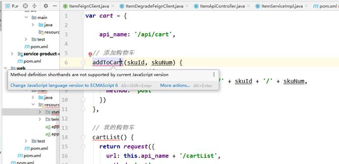

解决方案：

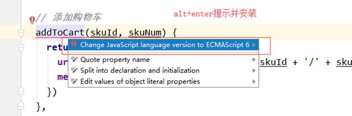

### 6.4 搭建service-item-client模块

在service-client 目录下创建。

搭建方式同service-product-client

pom.xml

```xml
<?xml version="1.0" encoding="UTF-8"?>
<project xmlns="http://maven.apache.org/POM/4.0.0"
         xmlns:xsi="http://www.w3.org/2001/XMLSchema-instance"
         xsi:schemaLocation="http://maven.apache.org/POM/4.0.0 http://maven.apache.org/xsd/maven-4.0.0.xsd">
    <parent>
        <artifactId>service-client</artifactId>
        <groupId>com.atguigu.gmail</groupId>
        <version>1.0-SNAPSHOT</version>
    </parent>
    <modelVersion>4.0.0</modelVersion>

    <artifactId>service-item-client</artifactId>

    <description>商品详情远程调用feign接口管理模块</description>

</project>
```

接口类

ItemFeignClient

```java
package com.atguigu.gmall.item.client;

import com.atguigu.gmall.common.result.Result;
import com.atguigu.gmall.item.client.fallback.ItemFeignClientFallback;
import org.springframework.cloud.openfeign.FeignClient;
import org.springframework.web.bind.annotation.GetMapping;
import org.springframework.web.bind.annotation.PathVariable;

/**
 * 商品详情微服务远程调用feign管理接口
 */
@FeignClient(name = "service-item", path = "/item", fallback = ItemFeignClientFallback.class)
public interface ItemFeignClient {

    /**
     * 查询sku的详细信息,用于生成sku的详情页面
     * @param skuId
     * @return
     */
    @GetMapping(value = "/getSkuDetail/{item}")
    public Result getSkuDetail(@PathVariable(value = "item") Long skuId);
}
```

 降级类

```java
package com.atguigu.gmall.item.client.fallback;

import com.atguigu.gmall.common.result.Result;
import com.atguigu.gmall.item.client.ItemFeignClient;
import org.springframework.stereotype.Component;

/**
 * 降级类
 */
@Component
public class ItemFeignClientFallback implements ItemFeignClient {

    /**
     * 查询sku的详细信息,用于生成sku的详情页面
     *
     * @param skuId
     * @return
     */
    @Override
    public Result getSkuDetail(Long skuId) {
        return null;
    }
}
```

```xml
<dependencies>
    <dependency>
        <groupId>com.atguigu.gmail</groupId>
        <artifactId>service-item-client</artifactId>
        <version>1.0-SNAPSHOT</version>
    </dependency>
</dependencies>
```

定义调用controller

```java
package com.atguigu.gmall.all.controller;

import com.atguigu.gmall.common.result.Result;
import com.atguigu.gmall.item.client.ItemFeignClient;
import org.springframework.beans.factory.annotation.Autowired;
import org.springframework.stereotype.Controller;
import org.springframework.ui.Model;
import org.springframework.web.bind.annotation.PathVariable;
import org.springframework.web.bind.annotation.RequestMapping;

import java.util.Map;

@Controller
@RequestMapping
public class ItemController {

    @Autowired
    private ItemFeignClient itemFeignClient;

    /**
     * sku详情页面
     * @param skuId
     * @param model
     * @return
     */
    @RequestMapping("{skuId}.html")
    public String getItem(@PathVariable Long skuId, Model model){
        // 通过skuId 查询skuInfo
        Result<Map> result = itemFeignClient.getSkuDetail(skuId);
        model.addAllAttributes(result.getData());
        return "item/index";
    }
}
```

```java
package com.atguigu.gmall.all;

import org.springframework.boot.SpringApplication;
import org.springframework.boot.autoconfigure.SpringBootApplication;
import org.springframework.boot.autoconfigure.jdbc.DataSourceAutoConfiguration;
import org.springframework.cloud.client.discovery.EnableDiscoveryClient;
import org.springframework.cloud.openfeign.EnableFeignClients;
import org.springframework.context.annotation.ComponentScan;

@SpringBootApplication(exclude = DataSourceAutoConfiguration.class)
@EnableDiscoveryClient
@EnableFeignClients(basePackages = "com.atguigu.gmall.item.client")
@ComponentScan("com.atguigu.gmall")
public class WebAllApplication {
    public static void main(String[] args) {
        SpringApplication.run(WebAllApplication.class, args);
    }
}
```

### 6.5 页面渲染

页面资源：web-all 有两个文件夹 ，把他们放入resource目录下：

gmall-parent\web\web-all\src\main\resources\templates\item\index1.html

该目录有两个文件：

==item/index.html：提取了公共头信息，登录讲解后提取==

**item/index1.html: 没提取公共信息页面**(当前使用的静态模板)

1. 分类信息

```html
<ul class="sui-breadcrumb">
    <li>
        <a th:href="@{http://list.gmall.com/list.html?category1Id={category1Id}(category1Id=${categoryView.category1Id})}" th:text="${categoryView.category1Name}">手机、数码、通讯</a>
    </li>
    <li>
        <a th:href="@{http://list.gmall.com/list.html?category2Id={category2Id}(category2Id=${categoryView.category2Id})}" th:text="${categoryView.category2Name}">手机</a>
    </li>
    <li>
        <a th:href="@{http://list.gmall.com/list.html?category3Id={category3Id}(category3Id=${categoryView.category3Id})}" th:text="${categoryView.category3Name}">Apple苹果</a>
    </li>
    <li class="active" th:text="${skuInfo.skuName}">iphone 6S系类</li>
</ul>
```

2，图片信息

```html
<div class="zoom">
             <!--默认第一个预览-->
             <div id="preview" class="spec-preview">
<span class="jqzoom">
   
</span>
             </div>
             <!--下方的缩略图-->
             <div class="spec-scroll">
                 <a class="prev">&lt;</a>
                 <!--左右按钮-->
                 <div class="items">
                     <ul>
                         <li th:each="skuImage: ${skuInfo.skuImageList}">
                             
                         </li>
                     </ul>
                 </div>
                 <a class="next">&gt;</a>
             </div>
         </div>
```


3，销售属性

```html
<dl v-for="spuSaleAttr in spuSaleAttrList" :key="spuSaleAttr.id">
    <dt>
    <div class="fl title">
        <i>{{spuSaleAttr.saleAttrName}}</i>
    </div>
    </dt>
    <dd v-for="spuSaleAttrValue in spuSaleAttr.spuSaleAttrValueList" :key="spuSaleAttrValue.id" @click="spuSaleAttrFun(spuSaleAttr.index, spuSaleAttrValue.id)">
        <a href="javascript:;" :class="{'selected':spuSaleAttrValue.isChecked == 1}">{{spuSaleAttrValue.saleAttrValueName}}<span title="点击取消选择">&nbsp;</span></a>
    </dd>
</dl>
```


```html
<script th:inline="javascript">
    var item = new Vue({
        el: '#itemArray',
        data: {
            skuId: [[${skuInfo.id}]],
            valuesSku: '',
            skuNum: 1,

            selectValuesSkus: [],
            isAddCart: true,

            spuSaleAttrList: [[${spuSaleAttrList}]],
            valuesSkuJson: [[${valuesSkuJson}]]
        },

        created() {
            this.init()
        },

        methods: {
            init() {
                debugger
                this.spuSaleAttrList.forEach((spuSaleAttr, index) => {
                    spuSaleAttr.index = index
                    spuSaleAttr.spuSaleAttrValueList.forEach((spuSaleAttrValue) => {
                        if (spuSaleAttrValue.isChecked == 1) {
                            this.selectValuesSkus.push(spuSaleAttrValue.id)
                        }
                    })
                })
                console.log('this.valuesSku:' + this.valuesSku)
            },

            addToCart() {
                // 判断是否登录和是否存在临时用户，如果都没有，添加临时用户
                if(!auth.isTokenExist() && !auth.isUserTempIdExist()) {
                    auth.setUserTempId()
                }
                window.location.href = 'http://cart.gmall.com/addCart.html?skuId=' + this.skuId + '&skuNum=' + this.skuNum
            },

            spuSaleAttrFun(index, spuSaleAttrValueId) {
                debugger
                this.isAddCart = true
                var valuesSkuJson = JSON.parse(this.valuesSkuJson);

                //根据索引替换已选中的spuSaleAttrValueId
                this.selectValuesSkus[index] = spuSaleAttrValueId

                var valuesSku = this.selectValuesSkus.join('|')
                //查看新组装的数据是否存在skuId，如果存在跳到该页面，如果不存在控制选中状态
                var curSkuId = valuesSkuJson[valuesSku]

                if (curSkuId) {
                    if(curSkuId != this.skuId) {
                        window.location.href = '/' + curSkuId + '.html'
                    } else {
                        this.isAddCart = true
                    }
                } else {
                    //控制购物车是否可选
                    this.isAddCart = false
                }

                //控制销售属性是否选中
                this.spuSaleAttrList.forEach((spuSaleAttr, i) => {
                    spuSaleAttr.spuSaleAttrValueList.forEach((spuSaleAttrValue) => {
                        if (index == i) {
                            if (spuSaleAttrValueId == spuSaleAttrValue.id) {
                                spuSaleAttrValue.isChecked = 1
                            } else {
                                spuSaleAttrValue.isChecked = 0
                            }
                        }
                    })
                })
            }
        }
    })
</script>
```


