# 一 商品详情页进阶

## 1 思路：

  虽然咱们实现了页面需要的功能，但是考虑到该页面是被用户高频访问的，所以性能需要优化。

一般一个系统最大的性能瓶颈，就是数据库的io操作。从数据库入手也是调优性价比最高的切入点。

一般分为两个层面，一是提高数据库sql本身的性能，二是尽量避免直接查询数据库。

提高数据库本身的性能首先是优化sql，包括：使用索引，减少不必要的大表关联次数，控制查询字段的行数和列数。另外当数据量巨大是可以考虑分库分表，以减轻单点压力。

这部分知识在mysql高级已有讲解，这里大家可以以详情页中的sql作为练习，尝试进行优化，这里不做赘述。

重点要讲的是另外一个层面：尽量避免直接查询数据库。

解决办法就是：缓存

缓存可以理解是数据库的一道保护伞，任何请求只要能在缓存中命中，都不会直接访问数据库。而缓存的处理性能是数据库10-100倍。

咱们就用Redis作为缓存系统进行优化。Redis在虚拟机中已经装好了

## 2 整合redis到工程。

由于redis作为缓存数据库，要被多个项目使用，所以要制作一个通用的工具类，方便工程中的各个模块使用。

而主要使用redis的模块，都是后台服务的模块，service工程。所以咱们把redis的工具类放到service-util模块中，这样所有的后台服务模块都可以使用redis。

首先在service-util引入依赖包

```xml
<!-- redis -->
<dependency>
   <groupId>org.springframework.boot</groupId>
   <artifactId>spring-boot-starter-data-redis</artifactId>
</dependency>

<!-- spring2.X集成redis所需common-pool2-->
<dependency>
   <groupId>org.apache.commons</groupId>
   <artifactId>commons-pool2</artifactId>
   <version>2.6.0</version>
</dependency>
```

添加redis配置类

```java
package com.atguigu.gmall.common.config;

import com.fasterxml.jackson.annotation.JsonAutoDetect;
import com.fasterxml.jackson.annotation.PropertyAccessor;
import com.fasterxml.jackson.databind.ObjectMapper;
import org.springframework.cache.CacheManager;
import org.springframework.cache.annotation.EnableCaching;
import org.springframework.cache.interceptor.KeyGenerator;
import org.springframework.context.annotation.Bean;
import org.springframework.context.annotation.Configuration;
import org.springframework.data.redis.cache.RedisCacheConfiguration;
import org.springframework.data.redis.cache.RedisCacheManager;
import org.springframework.data.redis.connection.RedisConnectionFactory;
import org.springframework.data.redis.core.RedisTemplate;
import org.springframework.data.redis.serializer.Jackson2JsonRedisSerializer;
import org.springframework.data.redis.serializer.RedisSerializationContext;
import org.springframework.data.redis.serializer.RedisSerializer;
import org.springframework.data.redis.serializer.StringRedisSerializer;

import java.lang.reflect.Method;
import java.time.Duration;

/**
 * Redis配置类
 *
 */
@Configuration
@EnableCaching
public class RedisConfig {

    // 使用默认标签做缓存
    @Bean
    public KeyGenerator wiselyKeyGenerator() {
        return new KeyGenerator() {
            @Override
            public Object generate(Object target, Method method, Object... params) {
                StringBuilder sb = new StringBuilder();
                sb.append(target.getClass().getName());
                sb.append(method.getName());
                for (Object obj : params) {
                    sb.append(obj.toString());
                }
                return sb.toString();
            }
        };
    }

    // 声明模板
    @Bean
    public RedisTemplate<Object, Object> redisTemplate(RedisConnectionFactory redisConnectionFactory) {
        RedisTemplate<Object, Object> redisTemplate = new RedisTemplate<>();
        redisTemplate.setConnectionFactory(redisConnectionFactory);
        Jackson2JsonRedisSerializer jackson2JsonRedisSerializer = new Jackson2JsonRedisSerializer(Object.class);
        ObjectMapper objectMapper = new ObjectMapper();
        objectMapper.setVisibility(PropertyAccessor.ALL, JsonAutoDetect.Visibility.ANY);
        objectMapper.enableDefaultTyping(ObjectMapper.DefaultTyping.NON_FINAL);
        jackson2JsonRedisSerializer.setObjectMapper(objectMapper);

        redisTemplate.setKeySerializer(new StringRedisSerializer());
        redisTemplate.setValueSerializer(jackson2JsonRedisSerializer);
        redisTemplate.setHashKeySerializer(new StringRedisSerializer());
        redisTemplate.setHashValueSerializer(jackson2JsonRedisSerializer);

        redisTemplate.afterPropertiesSet();
        return redisTemplate;
    }

    @Bean
    public CacheManager cacheManager(RedisConnectionFactory factory) {
        RedisSerializer<String> redisSerializer = new StringRedisSerializer();
        Jackson2JsonRedisSerializer jackson2JsonRedisSerializer = new Jackson2JsonRedisSerializer(Object.class);

        //解决查询缓存转换异常的问题
        ObjectMapper om = new ObjectMapper();
        om.setVisibility(PropertyAccessor.ALL, JsonAutoDetect.Visibility.ANY);
        om.enableDefaultTyping(ObjectMapper.DefaultTyping.NON_FINAL);
        jackson2JsonRedisSerializer.setObjectMapper(om);

        // 配置序列化（解决乱码的问题）,过期时间600秒
        RedisCacheConfiguration config = RedisCacheConfiguration.defaultCacheConfig()
                .entryTtl(Duration.ofSeconds(600))
                .serializeKeysWith(RedisSerializationContext.SerializationPair.fromSerializer(redisSerializer))
                .serializeValuesWith(RedisSerializationContext.SerializationPair.fromSerializer(jackson2JsonRedisSerializer))
                .disableCachingNullValues();

        RedisCacheManager cacheManager = RedisCacheManager.builder(factory)
                .cacheDefaults(config)
                .build();
        return cacheManager;
    }
}

```

说明：由于service-util属于公共模块，所以我们把它引入到service父模块，其他service子模块都自动引入了

## 3 使用redis进行业务开发

开始开发先说明redis key的命名规范，由于Redis不像数据库表那样有结构，其所有的数据全靠key进行索引，所以redis数据的可读性，全依靠key。

企业中最常用的方式就是：object:对象id:field

比如：sku:1314:info

​            user:1092:info

定义常量类

```java
package com.atguigu.gmall.common.constant;

/**
 * Redis常量配置类
 *
 */
public class RedisConst {

    public static final String SKUKEY_PREFIX = "sku:";
    public static final String SKUKEY_SUFFIX = ":info";
    //单位：秒
    public static final long SKUKEY_TIMEOUT = 24 * 60 * 60;
    //单位：秒 尝试获取锁的最大等待时间
    public static final long SKULOCK_EXPIRE_PX1 = 1;
    //单位：秒 锁的持有时间
    public static final long SKULOCK_EXPIRE_PX2 = 1;
    public static final String SKULOCK_SUFFIX = ":lock";

    public static final String USER_KEY_PREFIX = "user:";
    public static final String USER_CART_KEY_SUFFIX = ":cart";
    public static final long USER_CART_EXPIRE = 60 * 60 * 24 * 7;

    //用户登录
    public static final String USER_LOGIN_KEY_PREFIX = "user:login:";
    //    public static final String userinfoKey_suffix = ":info";
    public static final int USERKEY_TIMEOUT = 60 * 60 * 24 * 7;

    //秒杀商品前缀
    public static final String SECKILL_GOODS = "seckill:goods";
    public static final String SECKILL_ORDERS = "seckill:orders";
    public static final String SECKILL_ORDERS_USERS = "seckill:orders:users";
    public static final String SECKILL_STOCK_PREFIX = "seckill:stock:";
    public static final String SECKILL_USER = "seckill:user:";
    //用户锁定时间 单位：秒
    public static final int SECKILL__TIMEOUT = 60 * 60 * 1;


}

```


如何使用缓存：

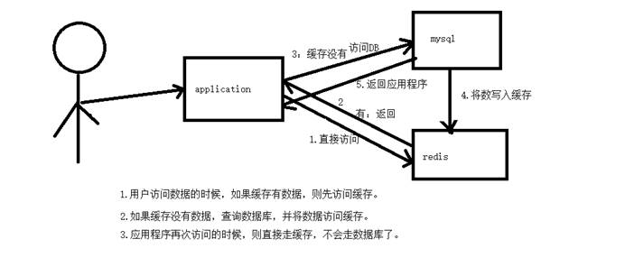

以上基本实现使用缓存的方案。

## 4 缓存常见问题(面试)

缓存最常见的3个问题：

1. **缓存穿透**

   缓存穿透: 是指查询一个不存在的数据，由于缓存无法命中，将去查询数据库，但是数据库也无此记录，并且出于容错考虑，我们没有将这次查询的null写入缓存，这将导致这个不存在的数据每次请求都要到存储层去查询，失去了缓存的意义。在流量大时，可能DB就挂掉了，要是有人利用不存在的key频繁攻击我们的应用，这就是漏洞。

   **解决方案：空结果也进行缓存，但它的过期时间会很短，最长不超过五分钟。**布隆过滤器

2. **缓存雪崩**

   缓存雪崩:是指在我们设置缓存时采用了相同的过期时间，导致缓存在某一时刻同时失效，请求全部转发到DB，DB瞬时压力过重雪崩。

   **解决方案：原有的失效时间基础上增加一个随机值，比如1-5分钟随机，这样每一个缓存的过期时间的重复率就会降低，就很难引发集体失效的事件。**

3. **缓存击穿**

   缓存击穿: 是指对于一些设置了过期时间的key，如果这些key可能会在某些时间点被超高并发地访问，是一种非常“热点”的数据。这个时候，需要考虑一个问题：如果这个key在大量请求同时进来之前正好失效，那么所有对这个key的数据查询都落到db，我们称为缓存击穿。

   ==注意: 与缓存雪崩的区别：==

   - 击穿是一个热点key失效

   - 雪崩是很多key集体失效

   **解决方案：锁**

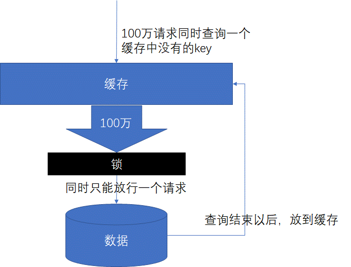


# 二 分布式锁

## 1 本地锁的局限性

之前，我们学习过synchronized及lock锁，这些锁都是本地锁。接下来写一个案例，演示本地锁的问题

### 1.1 编写测试代码

在service-product中的TestController中添加测试方法

```java
package com.atguigu.gmall.product.service;

public interface RedisTestService {

    /**
     * redis的锁测试demo1
     */
    public void lockDemo1();
}

```

```java
package com.atguigu.gmall.product.service.impl;

import com.atguigu.gmall.product.service.RedisTestService;
import org.springframework.beans.factory.annotation.Autowired;
import org.springframework.data.redis.core.StringRedisTemplate;
import org.springframework.stereotype.Service;
import org.springframework.util.StringUtils;

@Service
public class RedisTestServiceImpl implements RedisTestService {

    @Autowired
    private StringRedisTemplate stringRedisTemplate;

    /**
     * redis的锁测试demo1
     */
    @Override
    public void lockDemo1() {
        //从缓存中获取key
        String s = stringRedisTemplate.boundValueOps("demo1_num").get();
        //判断是否为空
        if(StringUtils.isEmpty(s)){
            return;
        }
        //若不为空
        Integer num = Integer.parseInt(s);
        //自增保存
        stringRedisTemplate.boundValueOps("demo1_num").set(++num + "");
    }
}

```

```java
package com.atguigu.gmall.product.controller;

import com.atguigu.gmall.common.result.Result;
import com.atguigu.gmall.product.service.RedisTestService;
import org.springframework.beans.factory.annotation.Autowired;
import org.springframework.web.bind.annotation.GetMapping;
import org.springframework.web.bind.annotation.RequestMapping;
import org.springframework.web.bind.annotation.RestController;

@RestController
@RequestMapping(value = "/redis/product/test")
public class RedisTestController {

    @Autowired
    private RedisTestService redisTestService;

    @GetMapping(value = "/demo1")
    public Result demo1(){
        redisTestService.lockDemo1();
        return Result.ok();
    }
}

```

说明：通过reids客户端设置**num**=0

### 1.2 使用ab工具测试

之前在redis中，玩过ab测试工具：httpd-tools（yum install -y httpd-tools）

```
ab  -n（一次发送的请求数）  -c（请求的并发数） 访问路径
ab -n 5000 -c 100 http://192.168.200.1:8206/api/test
```

测试如下：5000请求，100并发


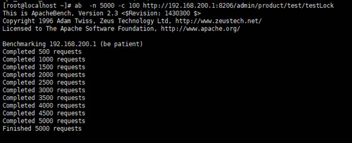

查看redis中的值：

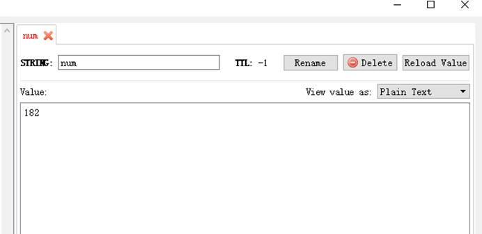

### 1.3 使用本地锁

```java
package com.atguigu.gmall.product.service.impl;

import com.atguigu.gmall.product.service.RedisTestService;
import org.springframework.beans.factory.annotation.Autowired;
import org.springframework.data.redis.core.StringRedisTemplate;
import org.springframework.stereotype.Service;
import org.springframework.util.StringUtils;

@Service
public class RedisTestServiceImpl implements RedisTestService {

    @Autowired
    private StringRedisTemplate stringRedisTemplate;

    /**
     * redis的锁测试demo1
     */
    @Override
    public synchronized void lockDemo1() {
        //从缓存中获取key
        String s = stringRedisTemplate.boundValueOps("demo1_num").get();
        //判断是否为空
        if(StringUtils.isEmpty(s)){
            return;
        }
        //若不为空
        Integer num = Integer.parseInt(s);
        //自增保存
        stringRedisTemplate.boundValueOps("demo1_num").set(++num + "");
    }
}

```

使用ab工具压力测试：5000次请求，并发100

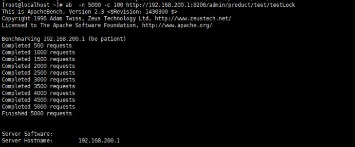

查看redis中的结果：

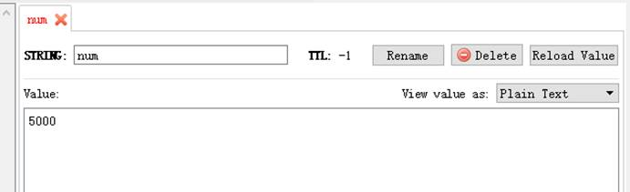

完美！与预期一致，是否真的完美？

接下来再看集群情况下，会怎样？

### 1.4 本地锁问题演示锁

接下来启动8206 8216 8226 三个运行实例。

运行多个service-product实例：


**通过网关压力测试**：

启动网关：

ab -n 5000 -c 100 http://192.168.200.1/redis/product/test/demo1


查看redis中的值：

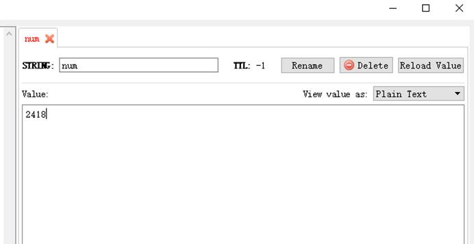

集群情况下又出问题了！！！

以上测试，可以发现：

 本地锁只能锁住同一工程内的资源，在分布式系统里面都存在局限性。

此时需要分布式锁

## 2 分布式锁实现

随着业务发展的需要，原单体单机部署的系统被演化成分布式集群系统后，由于分布式系统多线程、多进程并且分布在不同机器上，这将使原单机部署情况下的并发控制锁策略失效，单纯的Java API并不能提供分布式锁的能力。为了解决这个问题就需要一种跨JVM的互斥机制来控制共享资源的访问，这就是分布式锁要解决的问题！

**分布式锁主流的实现方案：**

1. 基于数据库实现分布式锁(悲观锁 乐观锁)

2. 基于缓存（Redis等）

3. 基于Zookeeper

**每一种分布式锁解决方案都有各自的优缺点：**

1. 性能：redis最高

2. 可靠性：zookeeper最高

==这里，我们就基于redis实现分布式锁。==

## 3 使用redis实现分布式锁

redis命令

set sku:1:info “OK” NX PX 10000

EX second ：设置键的过期时间为 second 秒。 SET key value EX second 效果等同于 SETEX key second value 。

PX millisecond ：设置键的过期时间为 millisecond 毫秒。 SET key value PX millisecond 效果等同于 SETEX key millisecond value 。

NX ：只在键不存在时，才对键进行设置操作。 SET key value NX 效果等同于 SETNX key value 。

XX ：只在键已经存在时，才对键进行设置操作。

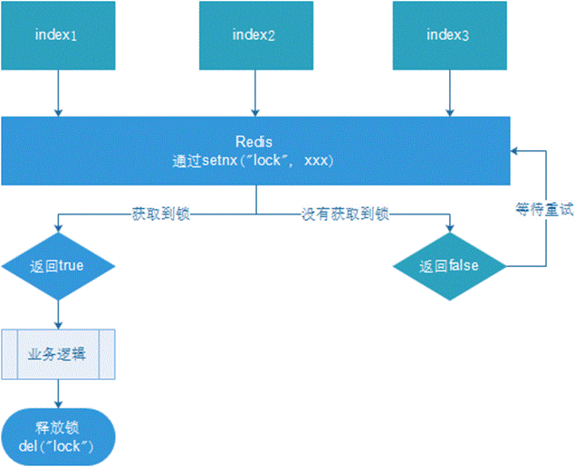

1. 多个客户端同时获取锁（setnx）
2.  获取成功，执行业务逻辑，执行完成释放锁（del）

3. 其他客户端等待重试

### 3.1 编写代码

```java
package com.atguigu.gmall.product.service.impl;

import com.atguigu.gmall.product.service.RedisTestService;
import org.springframework.beans.factory.annotation.Autowired;
import org.springframework.data.redis.core.StringRedisTemplate;
import org.springframework.stereotype.Service;
import org.springframework.util.StringUtils;

@Service
public class RedisTestServiceImpl implements RedisTestService {

    @Autowired
    private StringRedisTemplate stringRedisTemplate;

    /**
     * redis的锁测试demo1
     */
    @Override
    public void lockDemo1() {
        Boolean lock = stringRedisTemplate.opsForValue().setIfAbsent("lock", "111");
        //lock为true的时候代表获取到了锁
        if(lock){
            //从缓存中获取key
            String s = stringRedisTemplate.boundValueOps("demo1_num").get();
            //判断是否为空
            if(StringUtils.isEmpty(s)){
                return;
            }
            //若不为空
            Integer num = Integer.parseInt(s);
            //自增保存
            stringRedisTemplate.boundValueOps("demo1_num").set(++num + "");
            //释放锁
            stringRedisTemplate.delete("lock");
        }else{
            try {
                //没有获取到锁,线程睡觉1秒
                Thread.sleep(1000);
                //重试:递归
                lockDemo1();
            }catch (Exception e){
                e.printStackTrace();
            }
        }

    }
}
```

重启，服务集群，通过网关压力测试：

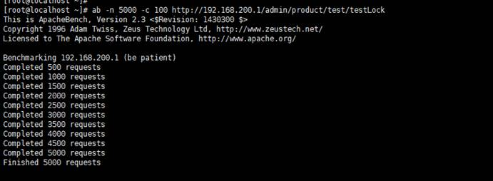

查看redis中num的值：

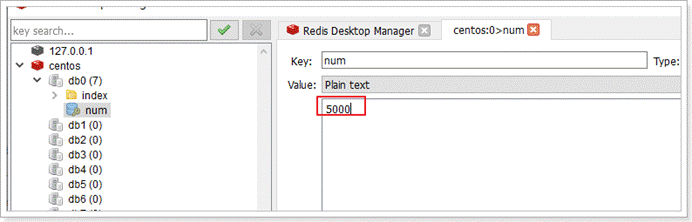

基本实现。

**问题：setnx刚好获取到锁，业务逻辑出现异常，导致锁无法释放**

==解决：设置过期时间，自动释放锁。==

### 3.2 优化之设置锁的过期时间

**设置过期时间有两种方式：**

1. 首先想到通过expire设置过期时间（缺乏原子性：如果在setnx和expire之间出现异常，锁也无法释放）

2. 在set时指定过期时间（推荐）

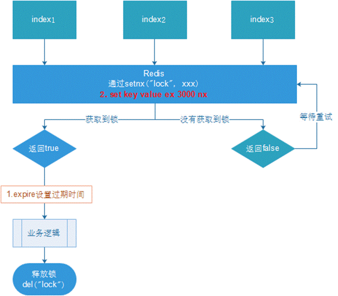

设置过期时间：

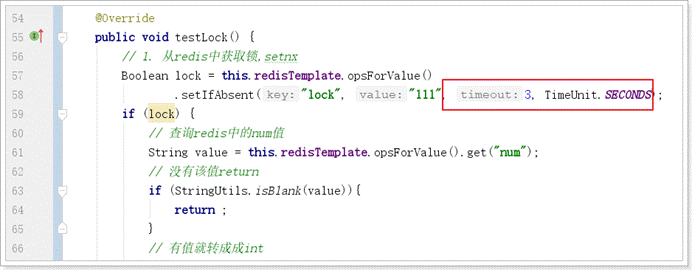

压力测试肯定也没有问题。自行测试

**问题：可能会释放其他服务器的锁。**

==场景：如果业务逻辑的执行时间是7s。执行流程如下==

1. index1业务逻辑没执行完，3秒后锁被自动释放。

2. index2获取到锁，执行业务逻辑，3秒后锁被自动释放。

3. index3获取到锁，执行业务逻辑

4. index1业务逻辑执行完成，开始调用del释放锁，这时释放的是index3的锁，导致index3的业务只执行1s就被别人释放。

最终等于没锁的情况。

==解决：setnx获取锁时，设置一个指定的唯一值（例如：uuid）；释放前获取这个值，判断是否自己的锁==

### 3.3 优化之UUID防误删

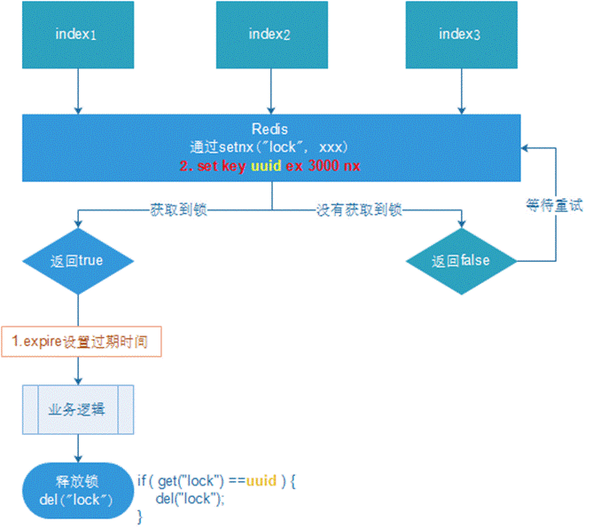

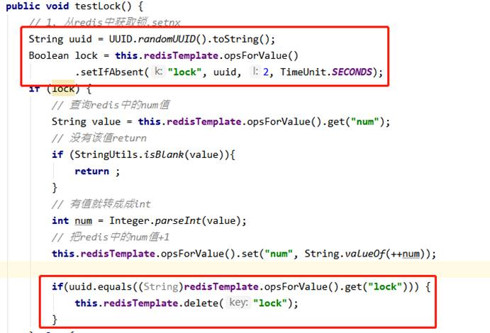

==**问题：删除操作缺乏原子性。**==

场景：

1. index1执行删除时，查询到的lock值确实和uuid相等

uuid=v1

set(lock,uuid)；

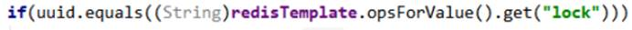

2. index1执行删除前，lock刚好过期时间已到，被redis自动释放

在redis中没有了lock，没有了锁。


3. index2获取了lock

index2线程获取到了cpu的资源，开始执行方法

uuid=v2

set(lock,uuid)；

4. index1执行删除，此时会把index2的lock删除

index1 因为已经在方法中了，所以不需要重新上锁。index1有执行的权限。index1已经比较完成了，这个时候，开始执行


删除的index2的锁！

### 3.4 优化之LUA脚本保证删除的原子性

lua脚本

```lua
if redis.call('get', KEYS[1]) == ARGV[1] then
    return redis.call('del', KEYS[1])
else
    return 0
end
```

代码

```java
package com.atguigu.gmall.product.service.impl;

import com.atguigu.gmall.product.service.RedisTestService;
import org.springframework.beans.factory.annotation.Autowired;
import org.springframework.data.redis.core.StringRedisTemplate;
import org.springframework.data.redis.core.script.DefaultRedisScript;
import org.springframework.stereotype.Service;
import org.springframework.util.StringUtils;

import java.util.Arrays;
import java.util.UUID;
import java.util.concurrent.TimeUnit;

@Service
public class RedisTestServiceImpl implements RedisTestService {

    @Autowired
    private StringRedisTemplate stringRedisTemplate;

    /**
     * redis的锁测试demo1
     */
    @Override
    public void lockDemo1() {
        String uuid = UUID.randomUUID().toString();
        Boolean lock = stringRedisTemplate.opsForValue().setIfAbsent("lock", uuid, 3, TimeUnit.SECONDS);
        //lock为true的时候代表获取到了锁
        if(lock){
            //从缓存中获取key
            String s = stringRedisTemplate.boundValueOps("demo1_num").get();
            //判断是否为空
            if(StringUtils.isEmpty(s)){
                return;
            }
            //若不为空
            Integer num = Integer.parseInt(s);
            //自增保存
            stringRedisTemplate.boundValueOps("demo1_num").set(++num + "");
//            //判断是否为本身的锁
//            if(stringRedisTemplate.opsForValue().get("lock").equals(uuid)){
////                stringRedisTemplate.delete("lock");
//
//            }
            DefaultRedisScript<Long> script = new DefaultRedisScript();
            //设置lua脚本
            script.setScriptText("if redis.call('get', KEYS[1]) == ARGV[1] then return redis.call('del', KEYS[1]) else return 0 end");
            //设置返回类型
            script.setResultType(Long.class);
            //执行脚本释放锁
            stringRedisTemplate.execute(script, Arrays.asList("lock"), uuid);
        }else{
            try {
                //没有获取到锁,线程睡觉1秒
                Thread.sleep(1000);
                //重试:递归
                lockDemo1();
            }catch (Exception e){
                e.printStackTrace();
            }
        }

    }
}

```

Lua 脚本详解：

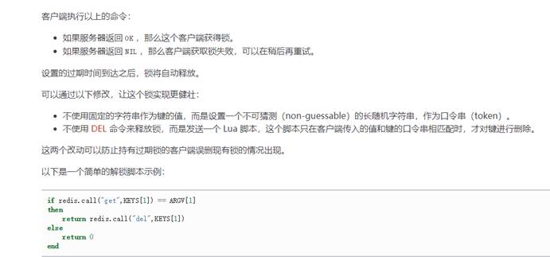

### 3.5 总结

1. 加锁

```java
// 1. 从redis中获取锁,set k1 v1 px 20000 nx
String uuid = UUID.randomUUID().toString();
Boolean lock = this.redisTemplate.opsForValue()
      .setIfAbsent("lock", uuid, 2, TimeUnit.SECONDS);
```

2. 使用lua释放锁

```java
// 2. 释放锁 del
String script = "if redis.call('get', KEYS[1]) == ARGV[1] then return redis.call('del', KEYS[1]) else return 0 end";
// 设置lua脚本返回的数据类型
DefaultRedisScript<Long> redisScript = new DefaultRedisScript<>();
// 设置lua脚本返回类型为Long
redisScript.setResultType(Long.class);
redisScript.setScriptText(script);
redisTemplate.execute(redisScript, Arrays.asList("lock"),uuid);
```

3. 重试

```java
Thread.sleep(1000);
testLock();
```

**为了确保分布式锁可用，我们至少要确保锁的实现同时满足以下四个条件：**

- ==互斥性: 在任意时刻，只有一个客户端能持有锁;==

- ==不会发生死锁: 即使有一个客户端在持有锁的期间崩溃而没有主动解锁，也能保证后续其他客户端能加锁;==

- ==解铃还须系铃人: 加锁和解锁必须是同一个客户端，客户端自己不能把别人加的锁给解了;==

-  ==加锁和解锁必须具有原子性;==

**redis集群状态下的问题：**

1. 客户端A从master获取到锁

2. 在master将锁同步到slave之前，master宕掉了。

3. slave节点被晋级为master节点

4. 客户端B取得了同一个资源被客户端A已经获取到的另外一个锁。

安全失效！

解决方案：

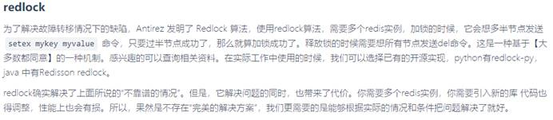


## 4 使用redisson 解决分布式锁

Github 地址：https://github.com/redisson/redisson

Redisson是一个在Redis的基础上实现的Java驻内存数据网格（In-Memory Data Grid）。它不仅提供了一系列的分布式的Java常用对象，还提供了许多分布式服务。其中包括(BitSet, Set, Multimap, SortedSet, Map, List, Queue, BlockingQueue, Deque, BlockingDeque, Semaphore, Lock, AtomicLong, CountDownLatch, Publish / Subscribe, Bloom filter, Remote service, Spring cache, Executor service, Live Object service, Scheduler service) Redisson提供了使用Redis的最简单和最便捷的方法。Redisson的宗旨是促进使用者对Redis的关注分离（Separation of Concern），从而让使用者能够将精力更集中地放在处理业务逻辑上。


官方文档地址：https://github.com/redisson/redisson/wiki

### 4.1 实现代码

```xml
<!-- redisson 分布式锁-->
<dependency>
    <groupId>org.redisson</groupId>
    <artifactId>redisson</artifactId>
    <version>3.11.2</version>
</dependency>
```


```java
package com.atguigu.gmall.common.config;

import lombok.Data;
import org.redisson.Redisson;
import org.redisson.api.RedissonClient;
import org.redisson.config.Config;
import org.redisson.config.SingleServerConfig;
import org.springframework.boot.context.properties.ConfigurationProperties;
import org.springframework.context.annotation.Bean;
import org.springframework.context.annotation.Configuration;
import org.springframework.util.StringUtils;

/**
 * redisson配置信息
 */
@Data
@Configuration
@ConfigurationProperties("spring.redis")
public class RedissonConfig {

    private String host;

    private String addresses;

    private String password;

    private String port;

    private int timeout = 3000;
    private int connectionPoolSize = 64;
    private int connectionMinimumIdleSize=10;
    private int pingConnectionInterval = 60000;
    private static String ADDRESS_PREFIX = "redis://";

    /**
     * 自动装配
     *
     */
    @Bean
    RedissonClient redissonSingle() {
        Config config = new Config();

        if(StringUtils.isEmpty(host)){
            throw new RuntimeException("host is  empty");
        }
        SingleServerConfig serverConfig = config.useSingleServer()
                .setAddress(ADDRESS_PREFIX + this.host + ":" + port)
                .setTimeout(this.timeout)
                .setPingConnectionInterval(pingConnectionInterval)
                .setConnectionPoolSize(this.connectionPoolSize)
                .setConnectionMinimumIdleSize(this.connectionMinimumIdleSize);
        if(!StringUtils.isEmpty(this.password)) {
            serverConfig.setPassword(this.password);
        }
        return Redisson.create(config);
    }
}
```

### 4.2 可重入锁（Reentrant Lock）

基于 Redis 的 Redisson 分布式可重入锁`RLock` Java对象实现了`java.util.concurrent.locks.Lock`接口。

大家都知道，如果负责储存这个分布式锁的Redisson节点宕机以后，而且这个锁正好处于锁住的状态时，这个锁会出现锁死的状态。为了避免这种情况的发生，Redisson内部提供了一个监控锁的看门狗，它的作用是在Redisson实例被关闭前，不断的延长锁的有效期。默认情况下，看门狗的检查锁的超时时间是30秒钟，也可以通过修改`Config.lockWatchdogTimeout`来另行指定。

另外Redisson还通过加锁的方法提供了`leaseTime`的参数来指定加锁的时间。超过这个时间后锁便自动解开了。

快速入门使用的就是可重入锁。也是最常使用的锁。

```java
最常见的使用：
RLock lock =  redisson.getLock("anyLock");
// 最常使用
lock.lock();
// 加锁以后10秒钟自动解锁  // 无需调用unlock方法手动解锁
lock.lock(10, TimeUnit.SECONDS);
// 尝试加锁，最多等待100秒，上锁以后10秒自动解锁
boolean res = lock.tryLock(100, 10,  TimeUnit.SECONDS);
if (res) {     try {      ...     } finally {       lock.unlock();     }  }
```

改造程序：

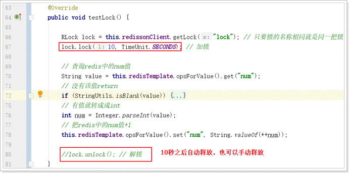

重启后在浏览器测试：

### 4.3 读写锁（ReadWriteLock）

基于Redis的Redisson分布式可重入读写锁`RReadWriteLock` Java对象实现了`java.util.concurrent.locks.ReadWriteLock`接口。其中读锁和写锁都继承了RLock接口。

分布式可重入读写锁允许同时有多个读锁和一个写锁处于加锁状态。

```java
RReadWriteLock rwlock = redisson.getReadWriteLock("anyRWLock");
// 最常见的使用方法
rwlock.readLock().lock();
// 或
rwlock.writeLock().lock();

// 10秒钟以后自动解锁
// 无需调用unlock方法手动解锁
rwlock.readLock().lock(10, TimeUnit.SECONDS);
// 或
rwlock.writeLock().lock(10, TimeUnit.SECONDS);

// 尝试加锁，最多等待100秒，上锁以后10秒自动解锁
boolean res = rwlock.readLock().tryLock(100, 10, TimeUnit.SECONDS);
// 或
boolean res = rwlock.writeLock().tryLock(100, 10, TimeUnit.SECONDS);
...
lock.unlock();

```

测试

```java
/**
 * 读锁
 *
 * @return
 */
@Override
public String readLock() {
    RReadWriteLock lock = redissonClient.getReadWriteLock("lock");
    //读锁:3秒
    lock.readLock().lock(10, TimeUnit.SECONDS);
    //redis读数据
    String s = stringRedisTemplate.boundValueOps("msg").get();
    return s;
}

/**
     * 写锁
     */
@Override
public String writeLock() {
    RReadWriteLock lock = redissonClient.getReadWriteLock("lock");
    //写锁
    lock.writeLock().lock(10, TimeUnit.SECONDS);
    //写数据
    stringRedisTemplate.boundValueOps("msg").set(UUID.randomUUID().toString());

    return "写完了";
}
```

打开开两个浏览器窗口测试：

localhost:8206/admin/product/test/read

http://localhost:8206/admin/product/test/write

\- 同时访问写：一个写完之后，等待一会儿（约10s），另一个写开始

\- 同时访问读：不用等待

\- 先写后读：读要等待（约10s）写完成

\- 先读后写：写要等待（约10s）读完成

# 三 分布式锁改造获取sku信息

### 3.1 使用redis

RedisConst 类中追加一个变量

```java
// 商品如果在数据库中不存在那么会缓存一个空对象进去，但是这个对象是没有用的，所以这个对象的过期时间应该不能太长，
// 如果太长会占用内存。
// 定义变量，记录空对象的缓存过期时间
public static final long SKUKEY_TEMPORARY_TIMEOUT = 5 * 60;
```


```java
@Autowired
private StringRedisTemplate stringRedisTemplate;
/**
     * 通过redis中获取sku的信息
     * @param skuId
     * @return
     */
private SkuInfo getSkuByRedis(Long skuId){
    //sku:123:info
    String key = RedisConst.SKUKEY_PREFIX + skuId + RedisConst.SKUKEY_SUFFIX;
    //从缓存中获取sku的信息
    String s = stringRedisTemplate.boundValueOps(key).get();
    //缓存中没有数据
    if(StringUtils.isEmpty(s)){
        //定义锁 sku:123:lock
        String lockKey = RedisConst.SKUKEY_PREFIX + skuId + RedisConst.SKULOCK_SUFFIX;
        //随机串
        String uuid = UUID.randomUUID().toString();
        //加锁
        Boolean res = stringRedisTemplate.opsForValue().setIfAbsent(lockKey, uuid, RedisConst.SKULOCK_EXPIRE_PX2, TimeUnit.SECONDS);
        //判断是否加锁成功
        if(res){
            SkuInfo skuInfo = getSkuFromDb(skuId);
            //判断数据库是否为空
            if(skuInfo == null || skuInfo.getId() == null){
                skuInfo = new SkuInfo();
                //缓存空值,防止穿透,3秒过期
                stringRedisTemplate.boundValueOps("key").set(JSONObject.toJSONString(skuInfo), 3, TimeUnit.SECONDS);
                return skuInfo;
            }
            //若不为空
            stringRedisTemplate.boundValueOps("key").set(JSONObject.toJSONString(skuInfo), RedisConst.SKUKEY_TIMEOUT, TimeUnit.SECONDS);
            //释放锁
            DefaultRedisScript<Long> redisScript = new DefaultRedisScript<>();
            //设置释放脚本
            redisScript.setScriptText("if redis.call('get', KEYS[1]) == ARGV[1] then return redis.call('del', KEYS[1]) else return 0 end ");
            //设置返回类型
            redisScript.setResultType(Long.class);
            stringRedisTemplate.execute(redisScript, Arrays.asList(lockKey), uuid);
            //返回结果
            return skuInfo;
        }else{
            try {
                //获取锁失败:线程睡觉1秒,再次尝试
                Thread.sleep(1000);
                return getSkuInfo(skuId);
            }catch (Exception e){
                e.printStackTrace();
                return null;
            }
        }
    }else{
        //有数据直接返回
        return JSONObject.parseObject(s, SkuInfo.class);
    }
}
```


### 3.2 使用redisson

```java
@Autowired
private RedissonClient redissonClient;
/**
* 通过redisson获取sku的信息
* @param skuId
* @return
*/
private SkuInfo getSkuByRedisson(Long skuId){
    //sku:123:info
    String key = RedisConst.SKUKEY_PREFIX + skuId + RedisConst.SKUKEY_SUFFIX;
    //从缓存中获取sku的信息
    String s = stringRedisTemplate.boundValueOps(key).get();
    //缓存中没有数据
    if(StringUtils.isEmpty(s)){
        //定义锁 sku:123:lock
        String lockKey = RedisConst.SKUKEY_PREFIX + skuId + RedisConst.SKULOCK_SUFFIX;
        //获取锁
        RLock lock = redissonClient.getLock(lockKey);
        try{
            //尝试加锁
            boolean flag = lock.tryLock(RedisConst.SKULOCK_EXPIRE_PX1, RedisConst.SKULOCK_EXPIRE_PX2, TimeUnit.SECONDS);
            //判断是否加锁成功
            if(flag){
                SkuInfo skuInfo = getSkuFromDb(skuId);
                //判断数据库是否为空
                if(skuInfo == null || skuInfo.getId() == null){
                    skuInfo = new SkuInfo();
                    //缓存空值,防止穿透,3秒过期
                    stringRedisTemplate.boundValueOps("key").set(JSONObject.toJSONString(skuInfo), 3, TimeUnit.SECONDS);
                    return skuInfo;
                }
                //若不为空
                stringRedisTemplate.boundValueOps("key").set(JSONObject.toJSONString(skuInfo), RedisConst.SKUKEY_TIMEOUT, TimeUnit.SECONDS);
                //返回结果
                return skuInfo;
            }else{
                try {
                    //获取锁失败:线程睡觉1秒,再次尝试
                    Thread.sleep(1000);
                    return getSkuInfo(skuId);
                }catch (Exception e){
                    e.printStackTrace();
                    return null;
                }
            }
        }catch (Exception e){
            e.printStackTrace();
        }finally {
            lock.unlock();
            return null;
        }
    }else{
        //有数据直接返回
        return JSONObject.parseObject(s, SkuInfo.class);
    }
}
```


### 3.3 在getSkuInfo 中调用上述两个方法进行测试

```java
/**
     * 查询sku的详细信息
     *
     * @param skuId
     * @return
     */
    @Override
    public SkuInfo getSkuInfo(Long skuId) {
        //redis或redisson两种方案任选其一
//        SkuInfo skuInfo = getSkuByRedis(skuId);
        SkuInfo skuInfo = getSkuByRedisson(skuId);
        if(skuInfo == null || skuInfo.getId() == null){
            //防止缓存宕机
            skuInfo = getSkuFromDb(skuId);
        }
        //返回结果
        return skuInfo;
    }
```


# 四 分布式锁 + AOP实现缓存

随着业务中缓存及分布式锁的加入，业务代码变的复杂起来，除了需要考虑业务逻辑本身，还要考虑缓存及分布式锁的问题，增加了程序员的工作量及开发难度。而缓存的玩法套路特别类似于事务，而声明式事务就是用了aop的思想实现的。

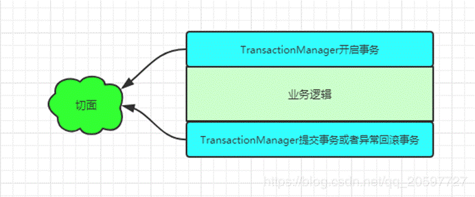

1. 以 @Transactional 注解为植入点的切点，这样才能知道@Transactional注解标注的方法需要被代理。

2. @Transactional注解的切面逻辑类似于@Around

模拟事务，缓存可以这样实现：

1. 自定义缓存注解@GmallCache（类似于事务@Transactional）

2. 编写切面类，使用环绕通知实现缓存的逻辑封装

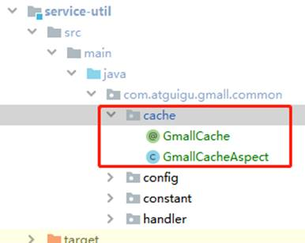

### 4.1 定义一个注解

```java
package com.atguigu.gmall.common.cache;


import java.lang.annotation.*;

@Target(ElementType.METHOD)
@Retention(RetentionPolicy.RUNTIME)
@Documented
public @interface GmallCache {
    String prefix() default "cache";
}

```

### 4.2 定义一个切面类加上注解

Spring aop 参考文档：

https://docs.spring.io/spring/docs/5.2.6.BUILD-SNAPSHOT/spring-framework-reference/core.html#aop-api-pointcuts-aspectj

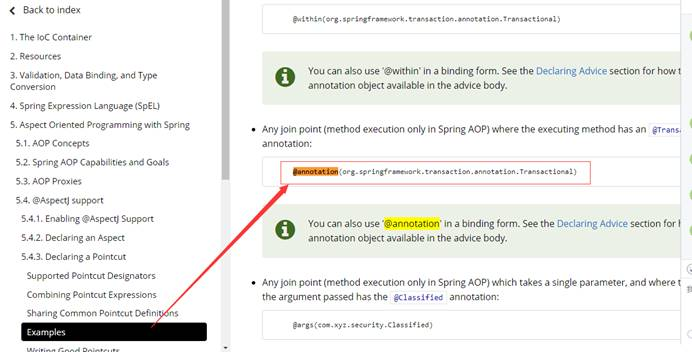

```java
package com.atguigu.gmall.common.cache;

import com.alibaba.fastjson.JSONObject;
import org.apache.commons.lang.StringUtils;
import org.aspectj.lang.ProceedingJoinPoint;
import org.aspectj.lang.annotation.Around;
import org.aspectj.lang.annotation.Aspect;
import org.aspectj.lang.reflect.MethodSignature;
import org.redisson.api.RLock;
import org.redisson.api.RedissonClient;
import org.springframework.beans.factory.annotation.Autowired;
import org.springframework.data.redis.core.StringRedisTemplate;
import org.springframework.stereotype.Component;

import java.util.Arrays;
import java.util.concurrent.TimeUnit;

@Component
@Aspect
public class GmallCacheAspect {

    @Autowired
    private StringRedisTemplate redisTemplate;

    @Autowired
    private RedissonClient redissonClient;


    /**
     * 增强方法
     * @param point
     * @return
     */
    @Around("@annotation(com.atguigu.gmall.common.cache.GmallCache)")
    public Object cacheAroundAdvice(ProceedingJoinPoint point){

        /*
        1.  获取参数列表
        2.  获取方法上的注解
        3.  获取前缀
        4.  获取目标方法的返回值
         */
        Object result = null;
        try {
            Object[] args = point.getArgs();
//            System.out.println("gmallCache:"+args);
            MethodSignature signature = (MethodSignature) point.getSignature();
            GmallCache gmallCache = signature.getMethod().getAnnotation(GmallCache.class);
            // 前缀
            String prefix = gmallCache.prefix();
            String suffix = gmallCache.suffix();
            // 从缓存中获取数据
            String key = prefix + Arrays.asList(args).toString() + suffix;
            // 获取缓存数据
            result = cacheHit(signature, key);
            if (result!=null){
                // 缓存有数据
                return result;
            }
            // 初始化分布式锁
            RLock lock = redissonClient.getLock(key);
            boolean flag = lock.tryLock(100, 100, TimeUnit.SECONDS);
            if (flag){
               try {
                   try {
                       result = point.proceed(point.getArgs());
                       // 防止缓存穿透
                       if (null==result){
                           // 并把结果放入缓存
                           Object o = new Object();
                           this.redisTemplate.opsForValue().set(key, JSONObject.toJSONString(o));
                           return null;
                       }
                   } catch (Throwable throwable) {
                       throwable.printStackTrace();
                   }
                   // 并把结果放入缓存
                   this.redisTemplate.opsForValue().set(key, JSONObject.toJSONString(result));
                   return result;
               }catch (Exception e){
                   e.printStackTrace();
               }finally {
                   // 释放锁
                   lock.unlock();
               }
            }
        }catch (Exception e){
            e.printStackTrace();
        }
        //boolean flag = lock.tryLock(10L, 10L, TimeUnit.SECONDS);
        return result;
    }
    // 获取缓存数据
    private Object cacheHit(MethodSignature signature, String key) {
        // 1. 查询缓存
        String cache = redisTemplate.opsForValue().get(key);
        if (StringUtils.isNotBlank(cache)) {
            // 有，则反序列化，直接返回
            Class returnType = signature.getReturnType(); // 获取方法返回类型
            // 不能使用parseArray<cache, T>，因为不知道List<T>中的泛型
            return JSONObject.parseObject(cache, returnType);
        }
        return null;
    }

}

```


### 4.3 使用注解完成缓存

修改方法

```java
/**
 * 查询sku的详细信息
 *
 * @param skuId
 * @return
 */
@GmallCache(prefix = RedisConst.SKUKEY_PREFIX)
@Override
public SkuInfo getSkuInfo(Long skuId) {
    //防止缓存宕机
    SkuInfo skuInfo = getSkuFromDb(skuId);
    //返回结果
    return skuInfo;
}
```

```java
@GmallCache(prefix = "saleAttrValuesBySpu:")
public Map getSaleAttrValuesBySpu(Long spuId)

@GmallCache(prefix = "spuSaleAttrListCheckBySku:")
public List<SpuSaleAttr> getSpuSaleAttrListCheckBySku(Long skuId, Long spuId)

@GmallCache(prefix = "skuPrice:")
public BigDecimal getSkuPrice(Long skuId)

@GmallCache(prefix = "categoryViewByCategory3Id:")
public BaseCategoryView getCategoryViewByCategory3Id(Long category3Id)
```

测试效果：

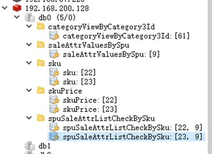