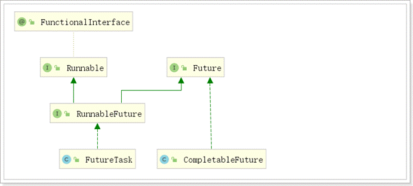
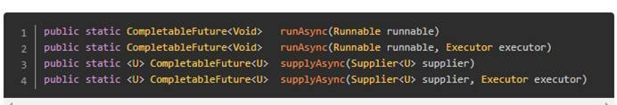
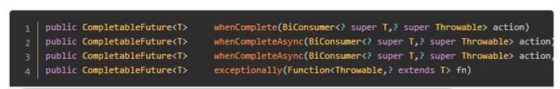
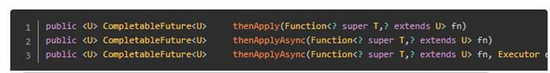
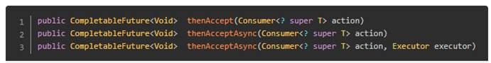
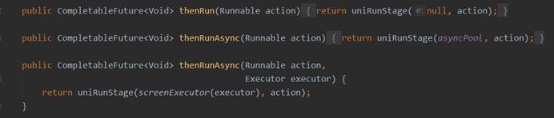
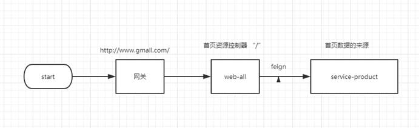
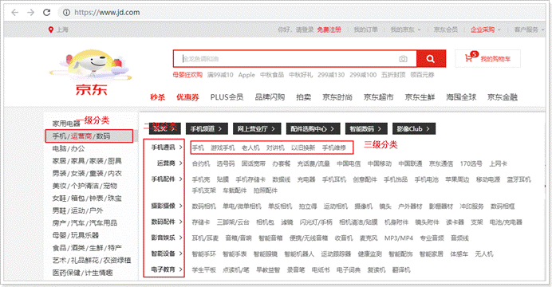

# 一 CompletableFuture异步编排

问题：查询商品详情页的逻辑非常复杂，数据的获取都需要远程调用，必然需要花费更多的时间。

假如商品详情页的每个查询，需要如下标注的时间才能完成

1. 获取sku的基本信息 1.5s

2. 获取sku的图片信息 0.5s

3. 获取spu的所有销售属性   1s

4. sku价格   1.5s  ...

那么，用户需要4.5s后才能看到商品详情页的内容。很显然是不能接受的。

如果有多个线程同时完成这4步操作，也许只需要1.5s即可完成响应。

## 1 CompletableFuture介绍

Future是Java 5添加的类，用来描述**一个异步计算**的结果。你可以使用`isDone`方法检查计算是否完成，或者使用`get`阻塞住调用线程，直到计算完成返回结果，你也可以使用`cancel`方法停止任务的执行。

虽然`Future`以及相关使用方法提供了异步执行任务的能力，但是对于结果的获取却是很不方便，只能通过阻塞或者轮询的方式得到任务的结果。阻塞的方式显然和我们的异步编程的初衷相违背，轮询的方式又会耗费无谓的CPU资源，而且也不能及时地得到计算结果，为什么不能用观察者设计模式当计算结果完成及时通知监听者呢？

很多语言，比如Node.js，采用回调的方式实现异步编程。Java的一些框架，比如Netty，自己扩展了Java的 `Future`接口，提供了`addListener`等多个扩展方法；Google guava也提供了通用的扩展Future；Scala也提供了简单易用且功能强大的Future/Promise异步编程模式。

作为正统的Java类库，是不是应该做点什么，加强一下自身库的功能呢？

在Java 8中, 新增加了一个包含50个方法左右的类: CompletableFuture，提供了非常强大的Future的扩展功能，可以帮助我们**简化异步编程的复杂性**，提供了函数式编程的能力，可以通过回调的方式处理计算结果，并且提供了转换和组合CompletableFuture的方法。

CompletableFuture类实现了Future接口，所以你还是可以像以前一样通过`get`方法阻塞或者轮询的方式获得结果，但是这种方式不推荐使用。

CompletableFuture和FutureTask同属于Future接口的实现类，都可以获取线程的执行结果。



## 2 创建异步对象

CompletableFuture 提供了四个静态方法来创建一个**异步**操作。



没有指定Executor的方法会使用**ForkJoinPool.commonPool()** 作为它的线程池执行异步代码。如果指定线程池，则使用指定的线程池运行。以下所有的方法都类同。

\- runAsync方法不支持返回值。

\- supplyAsync可以支持返回值。

## 3 计算完成时回调方法

当CompletableFuture的计算结果完成，或者抛出异常的时候，可以执行特定的Action。主要是下面的方法：



whenComplete可以处理正常或异常的计算结果

exceptionally处理异常情况

BiConsumer<? super T,? super Throwable>可以定义处理业务

**whenComplete 和 whenCompleteAsync 的区别：**

- whenComplete：是执行当前任务的线程执行继续执行 whenComplete 的任务。

- whenCompleteAsync：是执行把 whenCompleteAsync 这个任务继续提交给线程池来进行执行。

==**注意:方法不以Async结尾，意味着Action使用相同的线程执行，而Async可能会使用其他线程执行（如果是使用相同的线程池，也可能会被同一个线程选中执行）**==

代码示例：

```java
package com.atguigu.gmall.product;

import java.util.concurrent.CompletableFuture;
import java.util.function.BiConsumer;
import java.util.function.Function;
import java.util.function.Supplier;

public class TestDemo {

    /**
     * CompletableFuture测试案列
     * @param args
     * @throws Exception
     */
    public static void main(String[] args)  throws Exception{
        CompletableFuture completableFuture = CompletableFuture.supplyAsync(new Supplier<Object>() {
            /**
             * 返回一个执行完的结果
             *
             * @return a result
             */
            @Override
            public Object get() {
                int i = 1/0;
                return 1024;
            }
        }).whenComplete(new BiConsumer<Object, Throwable>() {
            /**
             * 当执行完成时触发
             *
             * @param o         the first input argument
             * @param throwable the second input argument
             */
            @Override
            public void accept(Object o, Throwable throwable) {
                System.out.println(o.toString());
                System.out.println(throwable);
            }
        }).exceptionally(new Function<Throwable, Object>() {
            /**
             * 当发生异常时触发
             *
             * @param throwable the function argument
             * @return the function result
             */
            @Override
            public Object apply(Throwable throwable) {
                throwable.printStackTrace();
                return "发生异常";
            }
        });
        System.out.println(completableFuture.get());
    }
}
```

## 4 线程串行化与并行化方法

thenApply 方法：当一个线程依赖另一个线程时，获取上一个任务返回的结果，**并返回当前任务的返回值**。



thenAccept方法：消费处理结果。接收任务的处理结果，并消费处理，**无返回结果。**



thenRun方法：只要上面的任务执行完成，就开始执行thenRun，**只是处理完任务后，执行 thenRun的后续操作**



**带有Async默认是异步执行的。这里所谓的异步指的是不在当前线程内执行。**

Function<? super T,? extends U>

T：上一个任务返回结果的类型

U：当前任务的返回值类型

代码演示：串行化(一个执行完进行下一个)

```java
public static void main(String[] args) throws ExecutionException, InterruptedException {
    CompletableFuture<Integer> future = CompletableFuture.supplyAsync(new Supplier<Integer>() {
        @Override
        public Integer get() {
            System.out.println(Thread.currentThread().getName() + "\t completableFuture");
            //int i = 10 / 0;
            return 1024;
        }
    }).thenApply(new Function<Integer, Integer>() {
        @Override
        public Integer apply(Integer o) {
            System.out.println("thenApply方法，上次返回结果：" + o);
            return  o * 2;
        }
    }).whenComplete(new BiConsumer<Integer, Throwable>() {
        @Override
        public void accept(Integer o, Throwable throwable) {
            System.out.println("-------o=" + o);
            System.out.println("-------throwable=" + throwable);
        }
    }).exceptionally(new Function<Throwable, Integer>() {
        @Override
        public Integer apply(Throwable throwable) {
            System.out.println("throwable=" + throwable);
            return 6666;
        }
    });
    System.out.println(future.get());
}

```

 并行化(同时执行)

```java
ThreadPoolExecutor threadPoolExecutor = new ThreadPoolExecutor(50, 500, 30, TimeUnit.SECONDS, new ArrayBlockingQueue<>(10000));
// 线程1执行返回的结果：hello
CompletableFuture<String> futureA = CompletableFuture.supplyAsync(() -> "hello");

// 线程2 获取到线程1执行的结果
CompletableFuture<Void> futureB = futureA.thenAcceptAsync((s) -> {
    delaySec(1);
    printCurrTime(s+" 第一个线程");
}, threadPoolExecutor);

CompletableFuture<Void> futureC = futureA.thenAcceptAsync((s) -> {
    delaySec(3);
    printCurrTime(s+" 第二个线程");
}, threadPoolExecutor);

private static void printCurrTime(String str) {
    System.out.println(str);
}

private static void delaySec(int i) {
    try {
        Thread.sleep(i*1000);
    } catch (InterruptedException e) {
        e.printStackTrace();
    }
}
```

## 5 多任务组合

 ```java
 public static CompletableFuture<Void> allOf(CompletableFuture<?>... cfs);

 public static CompletableFuture<Object> anyOf(CompletableFuture<?>... cfs);
 ```

allOf：等待所有任务完成返回

anyOf：只要有一个任务完成立即返回

## 6 优化商品详情页

核心线程池类

```java
package com.atguigu.gmall.item.config;


import org.springframework.context.annotation.Bean;
import org.springframework.context.annotation.Configuration;

import java.util.concurrent.ArrayBlockingQueue;
import java.util.concurrent.ThreadPoolExecutor;
import java.util.concurrent.TimeUnit;

/**
 * 自定义线程池
 */
@Configuration
public class ThreadPoolConfig {

    @Bean
    public ThreadPoolExecutor threadPoolExecutor(){
        /**
         * 核心线程数
         * 拥有最多线程数
         * 表示空闲线程的存活时间
         * 存活时间单位
         * 用于缓存任务的阻塞队列
         * 省略：
         *  threadFactory：指定创建线程的工厂
         *  handler：表示当workQueue已满，且池中的线程数达到maximumPoolSize时，线程池拒绝添加新任务时采取的策略。
         */
        return new ThreadPoolExecutor(50,500,30, TimeUnit.SECONDS,new ArrayBlockingQueue<>(10000));
    }
}
```

详情页优化

```java
@Autowired
    private ThreadPoolExecutor threadPoolExecutor;

    /**
     * 获取商品的详细信息: 基本信息 图片信息 类别信息 销售属性  销售属性键值对
     *
     * @param skuId
     * @return
     */
    @Override
    public Map<String, Object> getSkuInfoAsync(Long skuId) {
        Map<String, Object> result = new HashMap<>();
        //查询sku信息
        CompletableFuture<SkuInfo> skuInfoCompletableFuture =
                CompletableFuture.supplyAsync(() -> {
            //查询基本信息和图片列表
            SkuInfo skuInfo = productFeign.getSkuInfo(skuId);
            //设置值
            result.put("skuInfo",skuInfo);
            //返回结果
            return skuInfo;
        }, threadPoolExecutor);
        //获取分类信息
        CompletableFuture<Void> categoryViewCompletableFuture =
                skuInfoCompletableFuture.thenAcceptAsync(new Consumer<SkuInfo>() {
            @Override
            public void accept(SkuInfo skuInfo) {
                BaseCategoryView category = productFeign.getCategory(skuInfo.getCategory3Id());
                result.put("categoryView", category);
            }
        }, threadPoolExecutor);
        //获取价格信息
        CompletableFuture<Void> priceCompletableFuture =
                skuInfoCompletableFuture.thenAcceptAsync(new Consumer<SkuInfo>() {
            @Override
            public void accept(SkuInfo skuInfo) {
                BigDecimal price = productFeign.getPrice(skuId);
                result.put("price", price);
            }
        }, threadPoolExecutor);
        //通过skuid和spuid查询当前商品的销售属性和当前spu的所有的销售属性
        CompletableFuture<Void> spuSaleAttrListCompletableFuture =
                skuInfoCompletableFuture.thenAcceptAsync(new Consumer<SkuInfo>() {
            @Override
            public void accept(SkuInfo skuInfo) {
                List<SpuSaleAttr> saltAttrBySpuAndSku = productFeign.getSaltAttrBySpuAndSku(skuId, skuInfo.getSpuId());
                result.put("spuSaleAttrList", saltAttrBySpuAndSku);
            }
        }, threadPoolExecutor);
        //键值对
        CompletableFuture<Void> skuSaleAttrListBySpuIdCompletableFuture =
                skuInfoCompletableFuture.thenAcceptAsync(new Consumer<SkuInfo>() {
            @Override
            public void accept(SkuInfo skuInfo) {
                Map skuSaleAttrListBySpuId = productFeign.getSkuSaleAttrListBySpuId(skuInfo.getSpuId());
                result.put("valuesSkuJson", JSONObject.toJSONString(skuSaleAttrListBySpuId));
            }
        }, threadPoolExecutor);
        //等待所有任务完成
        CompletableFuture.allOf(skuInfoCompletableFuture,
                categoryViewCompletableFuture,
                priceCompletableFuture,
                spuSaleAttrListCompletableFuture,
                skuSaleAttrListBySpuIdCompletableFuture)
                .join();
        //返回结果
        return result;
    }
```


# 二、首页商品分类实现



前面做了商品详情，我们现在来做首页分类，我先看看京东的首页分类效果，我们如何实现类似效果：



思路：

1，首页属于并发量比较高的访问页面，我看可以采取页面静态化方式实现，或者把数据放在缓存中实现

2，我们把生产的静态文件可以放在nginx访问或者放在web-index模块访问


## 1 修改web-all模块

### 1.1  修改pom.xml

```xml
<?xml version="1.0" encoding="UTF-8"?>
<project xmlns="http://maven.apache.org/POM/4.0.0"
         xmlns:xsi="http://www.w3.org/2001/XMLSchema-instance"
         xsi:schemaLocation="http://maven.apache.org/POM/4.0.0 http://maven.apache.org/xsd/maven-4.0.0.xsd">
    <parent>
        <artifactId>web</artifactId>
        <groupId>com.atguigu.gmail</groupId>
        <version>1.0-SNAPSHOT</version>
    </parent>
    <modelVersion>4.0.0</modelVersion>

    <artifactId>web-all</artifactId>

    <description>商品管理相关的前端页面工程</description>

    <dependencies>

        <dependency>
            <groupId>com.atguigu.gmail</groupId>
            <artifactId>service-item-client</artifactId>
            <version>1.0-SNAPSHOT</version>
        </dependency>

        <dependency>
            <groupId>com.atguigu.gmail</groupId>
            <artifactId>service-product-client-demo</artifactId>
            <version>1.0-SNAPSHOT</version>
        </dependency>
    </dependencies>
    <build>
        <finalName>web-all</finalName>
        <plugins>
            <plugin>
                <groupId>org.springframework.boot</groupId>
                <artifactId>spring-boot-maven-plugin</artifactId>
            </plugin>
        </plugins>
    </build>

</project>
```

## 2 封装数据接口

由于商品分类信息在service-product模块，我们在该模块封装数据，数据结构为父子层级

商品分类保存在base_category1、base_category2和base_category3表中，由于需要静态化页面，我们需要一次性加载所有数据，前面我们使用了一个视图base_category_view，所有我从视图里面获取数据，然后封装为父子层级

数据结构如下：json 数据结构

```json
[
  {
    "index": 1,
    "categoryChild": [
      {
        "categoryChild": [
          {
            "categoryName": "电子书", # 三级分类的name
            "categoryId": 1
          },
          {
            "categoryName": "网络原创", # 三级分类的name
            "categoryId": 2
          },
          ...
        ],
        "categoryName": "电子书刊", #二级分类的name
        "categoryId": 1
      },
     ...
    ],
    "categoryName": "图书、音像、电子书刊", # 一级分类的name
    "categoryId": 1
  },
  ...
"index": 2,
    "categoryChild": [
      {
        "categoryChild": [
          {
            "categoryName": "超薄电视", # 三级分类的name
            "categoryId": 1
          },
          {
            "categoryName": "全面屏电视", # 三级分类的name
            "categoryId": 2
          },
          ...
        ],
        "categoryName": "电视", #二级分类的name
        "categoryId": 1
      },
     ...
    ],
    "categoryName": "家用电器", # 一级分类的name
    "categoryId": 2
  }
]
```


### 2.1 ManageService接口

```java
/**
 * 获取全部分类信息
 * @return
 */
List<JSONObject> getBaseCategoryList();

```


### 2.2 ManageServiceImpl 实现类

```java
/**
     * 获取全部分类信息
     *
     * @return
     */
    @Override
    public List<JSONObject> getBaseCategoryList() {
        List<JSONObject> result = new ArrayList<>();
        //查询视图获取所有的分类信息
        List<BaseCategoryView> baseCategoryViews = baseCategoryViewMapper.selectList(null);
        //根据一级分类进行归类:此时所有的key都为1级分类的id, value为二级与三级分类的数据
        Map<Long, List<BaseCategoryView>> category1Map =
                baseCategoryViews.stream().collect(Collectors.groupingBy(BaseCategoryView::getCategory1Id));
        //遍历解析各个一级分类的二级分类信息
        for (Map.Entry<Long, List<BaseCategoryView>> category1 : category1Map.entrySet()) {
            JSONObject category1Child = new JSONObject();
            //获取一级分类id
            Long category1Id = category1.getKey();
            //获取一级分类的名字
            String category1Name = category1.getValue().get(0).getCategory1Name();
            //获取所有的二级分类
            List<BaseCategoryView> category2List = category1.getValue();
            //根据二级分类再进行聚合
            Map<Long, List<BaseCategoryView>> category2Map =
                    category2List.stream().collect(Collectors.groupingBy(BaseCategoryView::getCategory2Id));
            //存放当前一级分类的所有的二级分类
            List<JSONObject> category2ChildList = new ArrayList<>();
            for (Map.Entry<Long, List<BaseCategoryView>> category2 : category2Map.entrySet()) {
                JSONObject category2Child = new JSONObject();
                //获取二级分类id
                Long category2Id = category2.getKey();
                //获取二级分类的名字
                String category2Name = category2.getValue().get(0).getCategory2Name();
                //获取所有的三级分类
                List<BaseCategoryView> category3List = category2.getValue();
                //三级分类只保留id和name
                List<JSONObject> category3ChildList = category3List.stream().map(category3 -> {
                    //创建三级分类
                    JSONObject category3Child = new JSONObject();
                    //保存id
                    category3Child.put("categoryId", category3.getCategory3Id());
                    //保存名字
                    category3Child.put("categoryName", category3.getCategory3Name());
                    return category3Child;
                }).collect(Collectors.toList());
                //保存二级与三级分类的关系
                category2Child.put("categoryId", category2Id);
                category2Child.put("categoryName", category2Name);
                category2Child.put("categoryChild", category3ChildList);
                //保存二级分类
                category2ChildList.add(category2Child);
            }
            //保存二级与一级的关系
            category1Child.put("categoryId", category1Id);
            category1Child.put("categoryName", category1Name);
            category1Child.put("categoryChild", category2ChildList);
            //保存结果
            result.add(category1Child);
        }
        return result;
    }
```


### 2.3 控制器

```java
/**
 * 获取全部分类信息
 * @return
 */
@GetMapping("/getBaseCategoryList")
public Result getBaseCategoryList(){
    List<JSONObject> list = manageService.getBaseCategoryList();
    return Result.ok(list);
}

```


## 3 service-product-client添加接口

```java
/**
 * 获取全部分类信息
 * @return
 */
@GetMapping("/api/product/getBaseCategoryList")
Result getBaseCategoryList();
```

## 4 生成静态页面

实现类

```java
	/**
     * 打开首页
     * @return
     */
    @GetMapping(value = "/index")
    public String index(Model model){
        List<JSONObject> baseCategoryList = productFeign.getBaseCategoryList();

        model.addAttribute("list", baseCategoryList);
        return "index/index.html";
    }
```

配置网关使用域名访问

Server-gateway 项目中配置

```yml
server:
  port: 80
spring:
  application:
    name: api-gateway
  cloud:
    nacos:
      discovery:
        server-addr: 192.168.200.128:8848
    gateway:
      discovery:      #是否与服务发现组件进行结合，通过 serviceId(必须设置成大写) 转发到具体的服务实例。默认为false，设为true便开启通过服务中心的自动根据 serviceId 创建路由的功能。
        locator:      #路由访问方式：http://Gateway_HOST:Gateway_PORT/大写的serviceId/**，其中微服务应用名默认大写访问。
          enabled: true
      routes:
        - id: service-product
          uri: lb://service-product
          predicates:
            - Path=/*/product/** # 路径匹配
        - id: service-item
          uri: lb://service-item
          predicates:
            - Path=/*/item/**
        - id: web-item
          uri: lb://web-all
          predicates:
            - Host=item.gmall.com
        - id: web-index
          uri: lb://web-all
          predicates:
            - Host=www.gmall.com
```

## 5 安装openresty

linux安装openresty:

1.添加仓库执行命令

```shell
 #安装 yum插件工具 进行openresty的下载
 yum install yum-utils
 yum-config-manager --add-repo https://openresty.org/package/centos/openresty.repo
```

2.执行安装

```properties
#安装
yum install openresty
```

3.安装成功后 会在默认的目录如下：

```properties
/usr/local/openresty
./sbin/nginx
./sbin/nginx -s reload
```

4 发布页面

```
server {
        listen       80;
        server_name  page.gmall.com;
        location / {
            root   /usr/local/openresty/page;
        }
}
```


# 总结

1.thenRun方法:不接受参数,也没有返回结果

2.thenAccept:接受参数,但是没有返回值


