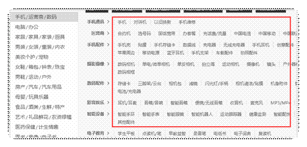
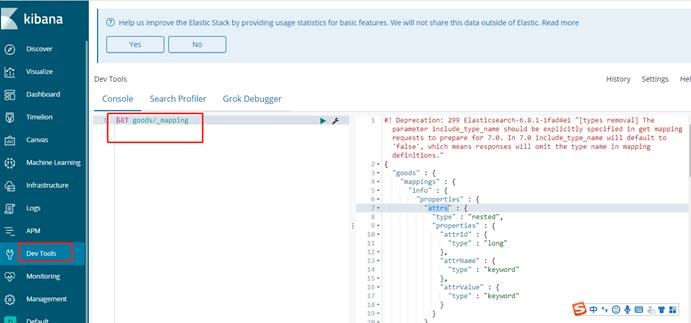

# 一 商品检索功能介绍

## 1 功能简介

根据用户输入的检索条件，查询出对用的商品

### 1.1 入口：两个

首页的分类



搜索栏


### 1.2 列表展示页面


## 2 根据业务搭建数据结构

### 2.1 建立mapping

这时我们要思考三个问题：

1. 哪些字段需要分词:
   - 商品名称

2. 我们用哪些字段进行过滤
   -  平台属性值
   - 分类Id

3. 哪些字段我们需要通过搜索查询出来
   - 商品名称,价格,图片等。

以上分析的所有显示，以及分词，过滤的字段都应该在es中出现。Es中如何保存这些数据呢？

根据上述的字段描述，应该建立一个mappings对应的存上上述字段描述的信息！

根据以上制定出如下结构：

mappings

Index：goods

type：info

document: properties - rows

field: id,price,title…

Es中index默认是true。

info= Type

对应的mapping 结构：

```json
{
  "goods" : {
    "mappings" : {
      "info" : {
        "properties" : {
          "attrs" : {
            "type" : "nested",
            "properties" : {
              "attrId" : {
                "type" : "long"
              },
              "attrName" : {
                "type" : "keyword"
              },
              "attrValue" : {
                "type" : "keyword"
              }
            }
          },
          "category1Id" : {
            "type" : "long"
          },
          "category1Name" : {
            "type" : "keyword"
          },
          "category2Id" : {
            "type" : "long"
          },
          "category2Name" : {
            "type" : "keyword"
          },
          "category3Id" : {
            "type" : "long"
          },
          "category3Name" : {
            "type" : "keyword"
          },
          "createTime" : {
            "type" : "date"
          },
          "defaultImg" : {
            "type" : "keyword",
            "index" : false
          },
          "hotScore" : {
            "type" : "long"
          },
          "id" : {
            "type" : "long"
          },
          "price" : {
            "type" : "double"
          },
          "title" : {
            "type" : "text",
            "analyzer" : "ik_max_word"
          },
          "tmId" : {
            "type" : "long"
          },
          "tmLogoUrl" : {
            "type" : "keyword"
          },
          "tmName" : {
            "type" : "keyword"
          }
        }
      }
    }
  }
}
```

注意：ik_max_word 中文词库必须有！

attrs：平台属性值的集合，主要用于平台属性值过滤。

### 2.2 nested介绍

`nested`：类型是一种特殊的对象`object`数据类型(specialised version of the object datatype )，允许对象数组彼此独立地进行索引和查询。

demo： 建立一个普通的index

如果linux 中有这个my_index 先删除！DELETE /my_index

```json
步骤1：建立一个index
PUT my_index/_doc/1
{
  "group" : "fans",
  "user" : [
    {
      "first" : "John",
      "last" :  "Smith"
    },
    {
      "first" : "Alice",
      "last" :  "White"
    }
  ]
}

步骤2 : 执行查询
GET my_index/_search
{
  "query": {
    "bool": {
      "must": [
        { "match": { "user.first": "Alice" }},
        { "match": { "user.last":  "Smith" }}
      ]
    }
  }
}

步骤3：删除当前索引
DELETE /my_index

步骤4：建立一个nested 类型的
PUT my_index
{
  "mappings": {
    "_doc": {
      "properties": {
        "user": {
          "type": "nested"
        }
      }
    }
  }
}
user字段映射为nested类型，而不是默认的object类型

重新执行步骤1，使用nested 查询
GET /my_index/_search
{
  "query": {
    "nested": {
      "path": "user",
      "query": {
        "bool": {
          "must": [
            {"match": {"user.first": "Alice"}},
            {"match": {"user.last": "Smith"}}
          ]
        }
      }
    }
  }
}
此查询得不到匹配，是因为Alice和Smith不在同一个嵌套对象中。
{"match": {"user.last": "White"}} 此时就会有数据：

使用nested 聚合：
GET my_index/_search
{
  "query": {
    "match": {
      "group": "fans"
    }
  },
  "aggs": {
    "fan": {
      "nested": {
        "path": "user"
      }
    }
  }
}
```

## 3 搭建service-list服务

在service模块下搭建，搭建方式如service-list

### 3.1 修改配置pom.xml

```xml
<?xml version="1.0" encoding="UTF-8"?>
<project xmlns="http://maven.apache.org/POM/4.0.0"
         xmlns:xsi="http://www.w3.org/2001/XMLSchema-instance"
         xsi:schemaLocation="http://maven.apache.org/POM/4.0.0 http://maven.apache.org/xsd/maven-4.0.0.xsd">
    <parent>
        <artifactId>service</artifactId>
        <groupId>com.atguigu.gmail</groupId>
        <version>1.0-SNAPSHOT</version>
    </parent>
    <modelVersion>4.0.0</modelVersion>

    <artifactId>service-list</artifactId>

    <dependencies>
        <dependency>
            <groupId>org.springframework.boot</groupId>
            <artifactId>spring-boot-starter-data-elasticsearch</artifactId>
        </dependency>
    </dependencies>
</project>
```

说明：

1，引入service-product-client模块

2，引入spring-boot-starter-data-elasticsearch依赖

### 3.2 添加配置文件

application.yml

```yml
spring:
  application:
    name: service-list
  profiles:
    active: dev
  cloud:
    nacos:
      discovery:
        server-addr: 192.168.200.128:8848

```

application-dev.yml

```yml
server:
  port: 8203

spring:
  cloud:
    sentinel:
      transport:
        dashboard: 192.168.200.128:8858
  zipkin:
    base-url: http://192.168.200.128:9411
    discovery-client-enabled: false
    sender:
      type: web
    sleuth:
      sampler:
        probability: 1
  elasticsearch:
    rest:
      uris: http://192.168.200.128:9200
  redis:
    host: 192.168.200.128
    port: 6379
    database: 0
    timeout: 1800000
    password:
    lettuce:
      pool:
        max-active: 20 #最大连接数
        max-wait: -1    #最大阻塞等待时间(负数表示没限制)
        max-idle: 5    #最大空闲
        min-idle: 0     #最小空闲

feign:
  sentinel:
    enabled: true
  client:
    config:
      default:
        readTimeout: 3000
        connectTimeout: 1000
```

说明：添加es配置

### 3.3 构建实体与es mapping建立映射关系

 文档映射对象

```java
package com.atguigu.gmall.model.list;

@Document(indexName = "goods", type = "info", shards = 3, replicas = 2)
@Data
public class Goods {

    @Id
    private Long id;

    @Field(type = FieldType.Keyword, index = false)
    private String defaultImg;

    @Field(type = FieldType.Text, analyzer = "ik_max_word")
    private String title;

    @Field(type = FieldType.Double)
    private Double price;

    @Field(type = FieldType.Date)
    private Date createTime; // 新品

       @Field(type = FieldType.Long)
    private Long tmId;

    @Field(type = FieldType.Keyword)
    private String tmName;

    @Field(type = FieldType.Keyword)
    private String tmLogoUrl;


    @Field(type = FieldType.Long)
    private Long category1Id;

    @Field(type = FieldType.Keyword)
    private String category1Name;

    @Field(type = FieldType.Long)
    private Long category2Id;

    @Field(type = FieldType.Keyword)
    private String category2Name;

    @Field(type = FieldType.Long)
    private Long category3Id;

    @Field(type = FieldType.Keyword)
    private String category3Name;

    @Field(type = FieldType.Long)
    private Long hotScore = 0L;

    @Field(type = FieldType.Nested)
    private List<SearchAttr> attrs;

}

```

SearchAttr实体

```java
@Data
public class SearchAttr {

    @Field(type = FieldType.Long)
    private Long attrId;
    @Field(type = FieldType.Keyword)
    private String attrName;
    @Field(type = FieldType.Keyword)
    private String attrValue;
}
```

### 3.4 初始化mapping结构到es中

```java
package com.atguigu.gmall.list.controller;

import com.atguigu.gmall.common.result.Result;
import com.atguigu.gmall.model.list.Goods;
import org.springframework.beans.factory.annotation.Autowired;
import org.springframework.data.elasticsearch.core.ElasticsearchRestTemplate;
import org.springframework.web.bind.annotation.GetMapping;
import org.springframework.web.bind.annotation.RequestMapping;
import org.springframework.web.bind.annotation.RestController;

@RestController
@RequestMapping("/api/list")
public class ListApiController {

    @Autowired
    private ElasticsearchRestTemplate restTemplate;

    /**
     *
     * @return
     */
    @GetMapping("/createIndex")
    public Result createIndex() {
        restTemplate.createIndex(Goods.class);
        restTemplate.putMapping(Goods.class);
        return Result.ok();
    }
}
```

添加主启动类

```java
package com.atguigu.gmall.list;

import org.springframework.boot.SpringApplication;
import org.springframework.boot.autoconfigure.SpringBootApplication;
import org.springframework.boot.autoconfigure.jdbc.DataSourceAutoConfiguration;
import org.springframework.cloud.client.discovery.EnableDiscoveryClient;
import org.springframework.cloud.openfeign.EnableFeignClients;
import org.springframework.context.annotation.ComponentScan;


@SpringBootApplication(exclude = DataSourceAutoConfiguration.class)
@ComponentScan({"com.atguigu.gmall"})
@EnableDiscoveryClient
@EnableFeignClients(basePackages= {"com.atguigu.gmall"})
public class ServiceListApplication {
    public static void main(String[] args) {

        SpringApplication.run(ServiceListApplication.class,args);
    }
}

```

在浏览器运行：

http://localhost:8203/api/list/inner/createIndex

通过kibana查看mapping




# 二 商品上架/下架

构建goods数据模型分析

1. Sku基本信息（详情业务已封装了接口）

2. Sku分类信息（详情业务已封装了接口）

3. Sku对应的平台属性（无）

4. Sku的品牌信息（无）

## 2.1 在service-product封装接口

### 2.1.1 Sku的品牌接口

接口类

```java
/**
 * 通过品牌Id 来查询数据
 * @param tmId
 * @return
 */
BaseTrademark getTrademarkByTmId(Long tmId);
```

实现类

```java
@Autowired
private BaseTrademarkMapper baseTrademarkMapper;
/**
 * 通过品牌Id 来查询数据
 *
 * @param tmId
 * @return
 */
@Override
public BaseTrademark getTrademarkByTmId(Long tmId) {
    BaseTrademark baseTrademark = baseTrademarkMapper.selectById(tmId);
    return baseTrademark;
}
```

controller

```java
/**
 * 通过品牌Id 集合来查询数据
 * @param tmId
 * @return
 */
@GetMapping("inner/getTrademark/{tmId}")
public BaseTrademark getTrademark(@PathVariable("tmId")Long tmId){
    return manageService.getTrademarkByTmId(tmId);
}
```

### 2.1.2 Sku对应的平台属性

dao

```java
/**
     *
     * @param skuId
     */
    List<BaseAttrInfo> selectBaseAttrInfoListBySkuId(@Param("skuId")Long skuId);
```

sql

```xml
<select id="selectBaseAttrInfoListBySkuId" resultMap="baseAttrInfoMap">
        SELECT
            bai.id,
            bai.attr_name,
            bai.category_id,
            bai.category_level,
            bav.id attr_value_id,
            bav.value_name,
            bav.attr_id
        FROM
            base_attr_info bai
        INNER JOIN base_attr_value bav ON bai.id = bav.attr_id
        INNER JOIN sku_attr_value sav ON sav.value_id = bav.id
        WHERE
            sav.sku_id = #{skuId}
    </select>
```

接口类

```java
/**
 * 通过skuId 集合来查询数据
 * @param skuId
 * @return
 */
List<BaseAttrInfo> getAttrList(Long skuId);
```

实现类

```java
/**
 * 通过skuId 集合来查询数据
 *
 * @param skuId
 * @return
 */
@Override
public List<BaseAttrInfo> getAttrList(Long skuId) {
    List<BaseAttrInfo> baseAttrInfos = baseAttrInfoMapper.selectBaseAttrInfoListBySkuId(skuId);
    return baseAttrInfos;
}
```

 controller

```java
/**
 * 通过skuId 集合来查询数据
 * @param skuId
 * @return
 */
@GetMapping("inner/getAttrList/{skuId}")
public List<BaseAttrInfo> getAttrList(@PathVariable("skuId") Long skuId){
    return manageService.getAttrList(skuId);
}
```

## 2.2 在service-product-client添加接口

```java
/**
 * 通过品牌Id 集合来查询数据
 * @param tmId
 * @return
 */
@GetMapping("/getTrademark/{tmId}")
public BaseTrademark getTrademark(@PathVariable("tmId")Long tmId);

/**
 * 通过skuId 集合来查询数据
 * @param skuId
 * @return
 */
@GetMapping("/getAttrList/{skuId}")
public List<BaseAttrInfo> getAttrList(@PathVariable("skuId") Long skuId);
```


## 2.3 实现商品上架，下架功能

### 2.3.1 封装接口

```java
package com.atguigu.gmall.list.service;

public interface SearchService {

    /**
     * 上架商品
     * @param skuId
     */
    void upperGoods(Long skuId);

    /**
     * 下架商品
     * @param skuId
     */
    void lowerGoods(Long skuId);

}
```

### 2.3.2 制作操作es的接口

```java
package com.atguigu.gmall.list.dao;

import com.atguigu.gmall.model.list.Goods;
import org.springframework.data.elasticsearch.repository.ElasticsearchRepository;
import org.springframework.stereotype.Repository;

@Repository
public interface GoodsRepository extends ElasticsearchRepository<Goods,Long> {
}
```

### 2.3.3 接口实现类

```java
package com.atguigu.gmall.list.service.impl;

import com.atguigu.gmall.list.dao.GoodsRepository;
import com.atguigu.gmall.list.service.SearchService;
import com.atguigu.gmall.model.list.Goods;
import com.atguigu.gmall.model.list.SearchAttr;
import com.atguigu.gmall.model.product.BaseAttrInfo;
import com.atguigu.gmall.model.product.BaseCategoryView;
import com.atguigu.gmall.model.product.BaseTrademark;
import com.atguigu.gmall.model.product.SkuInfo;
import com.atguigu.gmall.product.client.ProductFeignClient;
import org.springframework.beans.factory.annotation.Autowired;
import org.springframework.stereotype.Service;

import java.math.BigDecimal;
import java.util.Date;
import java.util.List;
import java.util.stream.Collectors;

@Service
public class SearchServiceImpl implements SearchService {

    @Autowired
    private ProductFeignClient productFeignClient;

    @Autowired
    private GoodsRepository goodsRepository;


    /**
     * 上架商品列表
     *
     * @param skuId
     */
    @Override
    public void upperGoods(Long skuId) {
        //对象初始化
        Goods goods = new Goods();
        //根据skuid查询商品的平台属性
        List<BaseAttrInfo> baseAttrInfos = productFeignClient.getAttrList(skuId);
        //循环遍历将属性进行类型转换
        List<SearchAttr> searchAttrs = baseAttrInfos.stream().map(c -> {
            SearchAttr searchAttr = new SearchAttr();
            //获取属性id
            searchAttr.setAttrId(c.getId());
            //获取属性的名字
            searchAttr.setAttrName(c.getAttrName());
            //获取属性的值
            searchAttr.setAttrValue(c.getAttrValueList().get(0).getValueName());
            //返回SearchAttr
            return searchAttr;
        }).collect(Collectors.toList());
        //设置属性
        goods.setAttrs(searchAttrs);
        //获取skuinfo的信息
        SkuInfo skuInfo = productFeignClient.getSkuInfo(skuId);
        //获取分类信息
        BaseCategoryView categoryView = productFeignClient.getCategoryView(skuInfo.getCategory3Id());
        //设置分类信息
        goods.setCategory1Id(categoryView.getCategory1Id());
        goods.setCategory1Name(categoryView.getCategory1Name());
        goods.setCategory2Id(categoryView.getCategory2Id());
        goods.setCategory2Name(categoryView.getCategory2Name());
        goods.setCategory3Id(categoryView.getCategory3Id());
        goods.setCategory3Name(categoryView.getCategory3Name());
        //获取sku的价格
        BigDecimal skuPrice = productFeignClient.getSkuPrice(skuId);
        goods.setPrice(skuPrice.doubleValue());
        //品牌信息
        BaseTrademark trademark = productFeignClient.getTrademark(skuInfo.getTmId());
        goods.setTmId(trademark.getId());
        goods.setTmName(trademark.getTmName());
        goods.setTmLogoUrl(trademark.getLogoUrl());
        //补全其他信息
        goods.setId(skuId);
        goods.setDefaultImg(skuInfo.getSkuDefaultImg());
        goods.setTitle(skuInfo.getSkuName());
        goods.setCreateTime(new Date());
        //保存goods信息
        goodsRepository.save(goods);
    }

    /**
     * 下架商品列表
     *
     * @param skuId
     */
    @Override
    public void lowerGoods(Long skuId) {
        goodsRepository.deleteById(skuId);
    }
}
```

### 2.3.4 控制器

```java
	@Autowired
    private SearchService searchService;
	/**
     * 上架商品
     * @param skuId
     * @return
     */
    @GetMapping("/upperGoods/{skuId}")
    public Result upperGoods(@PathVariable("skuId") Long skuId) {
        searchService.upperGoods(skuId);
        return Result.ok();
    }

    /**
     * 下架商品
     * @param skuId
     * @return
     */
    @GetMapping("/lowerGoods/{skuId}")
    public Result lowerGoods(@PathVariable("skuId") Long skuId) {
        searchService.lowerGoods(skuId);
        return Result.ok();
    }
```

添加数据

通过kibana查看数据

说明：后期学习了mq，我们可以根据后台系统添加和修改等操作，发送mq消息自动上下架商品

http://localhost:8203/api/list/inner/upperGoods/10

http://localhost:8203/api/list/inner/lowerGoods/10


# 三 商品热度排名

搜索商品时，后面我们会根据热点排序，何时更新热点？我们在获取商品详情时调用更新

## 3.1 封装接口与实现类与控制器

接口类

```java
/**
 * 更新热点
 * @param skuId
 */
void incrHotScore(Long skuId);
```

实现类

```java
@Autowired
private StringRedisTemplate stringRedisTemplate;

/**
 * 更新热点
 *
 * @param skuId
 */
@Override
public void incrHotScore(Long skuId) {
    String hotKey = "hotScore";
    //每访问一次商品详情,对商品的热度值进行+1
    Double aDouble = stringRedisTemplate.boundZSetOps(hotKey).incrementScore("sku:" + skuId, 1);
    //每访问10次同步一次es的数据
    if(aDouble % 10 == 0){
        //获取es中的goods数据
        Goods goods = goodsRepository.findById(skuId).get();
        //设置热度值
        goods.setHotScore(aDouble.longValue());
        //同步至es
        goodsRepository.save(goods);
    }
}
```

控制器

```java
/**
     * 更新商品incrHotScore
     *
     * @param skuId
     * @return
     */
    @GetMapping("/incrHotScore/{skuId}")
    public Result incrHotScore(@PathVariable("skuId") Long skuId) {
        // 调用服务层
        searchService.incrHotScore(skuId);
        return Result.ok();
    }
```


## 3.2 在service-list-client封装接口

### 3.2.1 搭建service-list-client

搭建方式如service-item-client

### 3.2.2 修改pom.xml

```xml
<?xml version="1.0" encoding="UTF-8"?>
<project xmlns="http://maven.apache.org/POM/4.0.0"
         xmlns:xsi="http://www.w3.org/2001/XMLSchema-instance"
         xsi:schemaLocation="http://maven.apache.org/POM/4.0.0 http://maven.apache.org/xsd/maven-4.0.0.xsd">
    <parent>
        <artifactId>service-client</artifactId>
        <groupId>com.atguigu.gmail</groupId>
        <version>1.0-SNAPSHOT</version>
    </parent>
    <modelVersion>4.0.0</modelVersion>

    <artifactId>service-list-client</artifactId>

    <description>搜索微服务feign接口管理模块</description>

</project>
```


### 3.2.3 添加接口

```java
package com.atguigu.gmall.list.client;

import com.atguigu.gmall.common.result.Result;
import org.springframework.cloud.openfeign.FeignClient;
import org.springframework.web.bind.annotation.GetMapping;
import org.springframework.web.bind.annotation.PathVariable;

@FeignClient(name = "service-list", path = "/api/list")
public interface ListFeignClient {

    /**
     * 上架商品
     * @param skuId
     * @return
     */
    @GetMapping("/upperGoods/{skuId}")
    public Result upperGoods(@PathVariable("skuId") Long skuId);

    /**
     * 下架商品
     * @param skuId
     * @return
     */
    @GetMapping("/lowerGoods/{skuId}")
    public Result lowerGoods(@PathVariable("skuId") Long skuId);

    /**
     * 更新商品incrHotScore
     *
     * @param skuId
     * @return
     */
    @GetMapping("/incrHotScore/{skuId}")
    public Result incrHotScore(@PathVariable("skuId") Long skuId);
}
```


## 3.3 在service-item模块调用接口

引入依赖

```xml
<dependency>
    <groupId>com.atguigu.gmail</groupId>
    <artifactId>service-list-client</artifactId>
    <version>1.0-SNAPSHOT</version>
</dependency>
```

接口调用

```java
/**
     * 获取商品的详细信息: 基本信息 图片信息 类别信息 销售属性  销售属性键值对
     *
     * @param skuId
     * @return
     */
    @Override
    public Map<String, Object> getSkuInfoAsync(Long skuId) {
        Map<String, Object> result = new HashMap<>();
        //查询sku信息
        CompletableFuture<SkuInfo> skuInfoCompletableFuture =
                CompletableFuture.supplyAsync(() -> {
            //查询基本信息和图片列表
            SkuInfo skuInfo = productFeign.getSkuInfo(skuId);
            //设置值
            result.put("skuInfo",skuInfo);
            //返回结果
            return skuInfo;
        }, threadPoolExecutor);
        //获取分类信息
        CompletableFuture<Void> categoryViewCompletableFuture =
                skuInfoCompletableFuture.thenAcceptAsync(new Consumer<SkuInfo>() {
            @Override
            public void accept(SkuInfo skuInfo) {
                BaseCategoryView category = productFeign.getCategory(skuInfo.getCategory3Id());
                result.put("categoryView", category);
            }
        }, threadPoolExecutor);
        //获取价格信息
        CompletableFuture<Void> priceCompletableFuture =
                skuInfoCompletableFuture.thenAcceptAsync(new Consumer<SkuInfo>() {
            @Override
            public void accept(SkuInfo skuInfo) {
                BigDecimal price = productFeign.getPrice(skuId);
                result.put("price", price);
            }
        }, threadPoolExecutor);
        //通过skuid和spuid查询当前商品的销售属性和当前spu的所有的销售属性
        CompletableFuture<Void> spuSaleAttrListCompletableFuture =
                skuInfoCompletableFuture.thenAcceptAsync(new Consumer<SkuInfo>() {
            @Override
            public void accept(SkuInfo skuInfo) {
                List<SpuSaleAttr> saltAttrBySpuAndSku = productFeign.getSaltAttrBySpuAndSku(skuId, skuInfo.getSpuId());
                result.put("spuSaleAttrList", saltAttrBySpuAndSku);
            }
        }, threadPoolExecutor);
        //键值对
        CompletableFuture<Void> skuSaleAttrListBySpuIdCompletableFuture =
                skuInfoCompletableFuture.thenAcceptAsync(new Consumer<SkuInfo>() {
            @Override
            public void accept(SkuInfo skuInfo) {
                Map skuSaleAttrListBySpuId = productFeign.getSkuSaleAttrListBySpuId(skuInfo.getSpuId());
                result.put("valuesSkuJson", JSONObject.toJSONString(skuSaleAttrListBySpuId));
            }
        }, threadPoolExecutor);
        //等待所有任务完成
        CompletableFuture.allOf(skuInfoCompletableFuture,
                categoryViewCompletableFuture,
                priceCompletableFuture,
                spuSaleAttrListCompletableFuture,
                skuSaleAttrListBySpuIdCompletableFuture)
                .join();
        //异步更新热度值
        CompletableFuture.runAsync(()->{
            //更新热度值
            listFeign.incrHotScore(skuId);
        }, threadPoolExecutor);
        //返回结果
        return result;
    }
```
