# 第十天 登录

# 1 用户认证流程

## 1.1 认证和授权

**身份认证**

用户身份认证即用户去访问系统资源时系统要求验证用户的身份信息，身份合法方可继续访问。

常见的用户身份认证表现形式有：用户名密码登录，指纹打卡等方式。说通俗点，就相当于校验用户账号密码是否正确。

**用户授权**

用户认证通过后去访问系统的资源，系统会判断用户是否拥有访问资源的权限，只允许访问有权限的系统资源，没有权限的资源将无法访问，这个过程叫用户授权。

## 1.2 单点登录

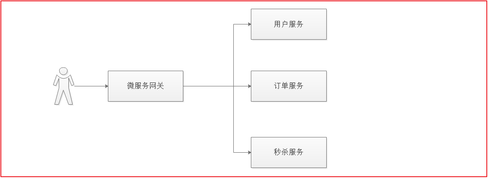

用户访问的项目中，至少有3个微服务需要识别用户身份，如果用户访问每个微服务都登录一次就太麻烦，为了提高用户的体验，我们需要实现让用户在一个系统中登录，其他任意受信任的系统都可以访问，这个功能就叫单点登录。

单点登录（Single Sign On），简称为 SSO，是目前比较流行的企业业务整合的解决方案之一。 SSO的定义是在多个应用系统中，用户只需要登录一次就可以访问所有相互信任的应用系统.

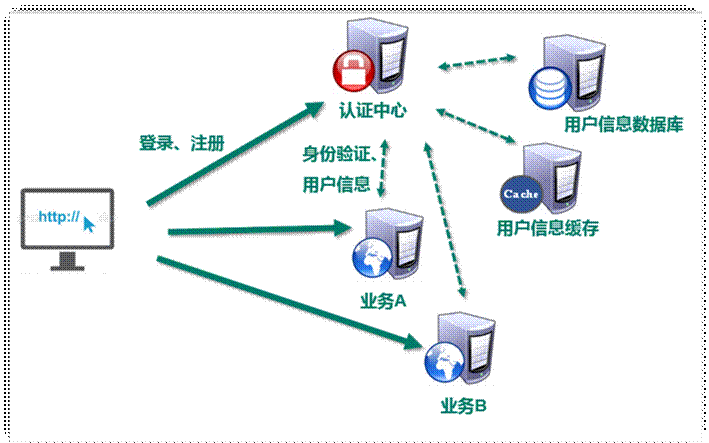

单点登录业务流程如下:

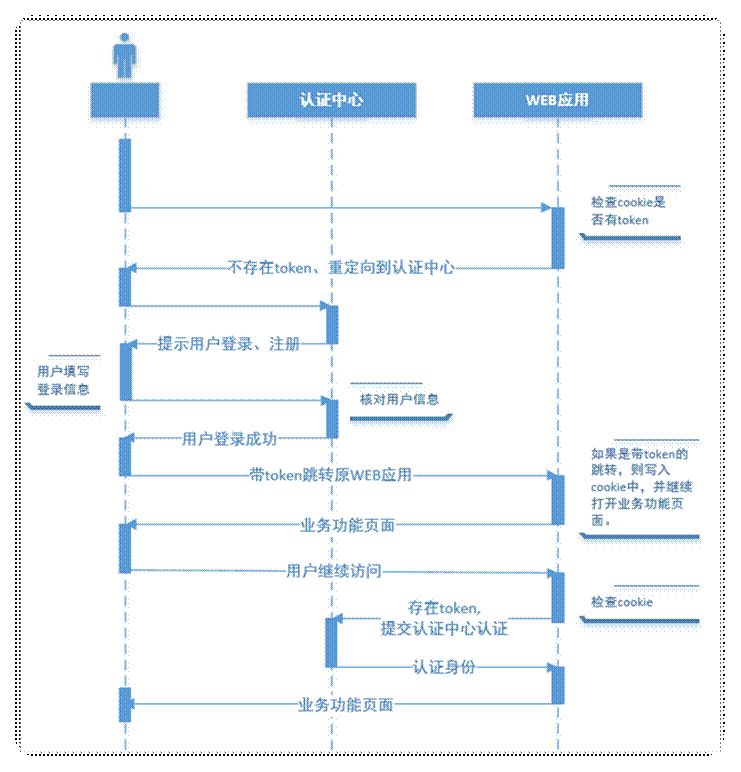

## 1.3 第三方登录

随着国内及国外巨头们的平台开放战略以及移动互联网的发展，第三方登录已经不是一个陌生的产品设计概念了。 所谓的第三方登录，是说基于用户在第三方平台上已有的账号和密码来快速完成己方应用的登录或者注册的功能。而这里的第三方平台，一般是已经拥有大量用户的平台，国外的比如Facebook，Twitter等，国内的比如微博、微信、QQ等。

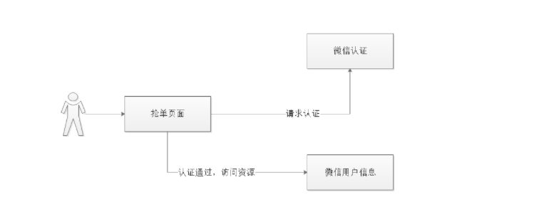

# 2 认证技术方案

## 2.1 单点登录技术方案

分布式系统要实现单点登录，通常将认证系统独立抽取出来，并且将用户身份信息存储在单独的存储介质，比如： MySQL、Redis，考虑性能要求，通常存储在Redis中.

单点登录的特点是：

- 认证系统为独立的系统
- 各子系统通过Http或其它协议与认证系统通信，完成用户认证
- 用户身份信息存储在Redis

## 2.2 Spring Security Oauth2.0

OAuth（开放授权）是一个开放标准，允许用户授权第三方移动应用访问他们存储在另外的服务提供者上的信息，而不需要将用户名和密码提供给第三方移动应用或分享他们数据的所有内容，OAuth2.0是OAuth协议的延续版本, Spring security 是一个强大的和高度可定制的身份验证和访问控制框架，Spring security 框架集成了Oauth2协议，下图是项目认证架构图

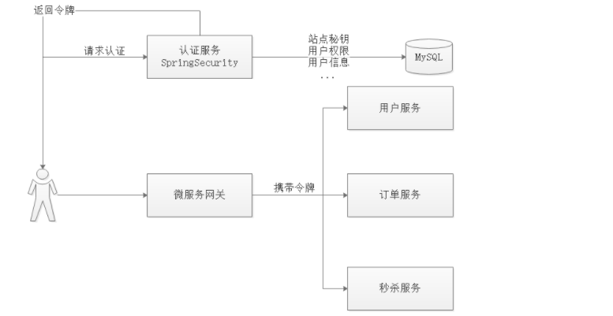

- 用户请求认证服务完成认证
- 认证服务下发用户身份令牌，拥有身份令牌表示身份合法
- 用户携带令牌请求资源服务，请求资源服务必先经过网关
- 网关校验用户身份令牌的合法，不合法表示用户没有登录，如果合法则放行继续访问
- 资源服务获取令牌，根据令牌完成授权
- 资源服务完成授权则响应资源信息

# 3 认证服务导入

## 3.1 数据库准备

```sql
/*
 Navicat Premium Data Transfer

 Source Server         : 192.168.200.128
 Source Server Type    : MySQL
 Source Server Version : 50729
 Source Host           : 192.168.200.128:3306
 Source Schema         : gmall_oauth

 Target Server Type    : MySQL
 Target Server Version : 50729
 File Encoding         : 65001

 Date: 12/08/2021 11:36:09
*/

SET NAMES utf8mb4;
SET FOREIGN_KEY_CHECKS = 0;

-- ----------------------------
-- Table structure for oauth_client_details
-- ----------------------------
DROP TABLE IF EXISTS `oauth_client_details`;
CREATE TABLE `oauth_client_details`  (
  `client_id` varchar(48) CHARACTER SET utf8 COLLATE utf8_general_ci NOT NULL COMMENT '客户端ID，主要用于标识对应的应用',
  `resource_ids` varchar(256) CHARACTER SET utf8 COLLATE utf8_general_ci NULL DEFAULT NULL,
  `client_secret` varchar(256) CHARACTER SET utf8 COLLATE utf8_general_ci NULL DEFAULT NULL COMMENT '客户端秘钥，BCryptPasswordEncoder加密算法加密',
  `scope` varchar(256) CHARACTER SET utf8 COLLATE utf8_general_ci NULL DEFAULT NULL COMMENT '对应的范围',
  `authorized_grant_types` varchar(256) CHARACTER SET utf8 COLLATE utf8_general_ci NULL DEFAULT NULL COMMENT '认证模式',
  `web_server_redirect_uri` varchar(256) CHARACTER SET utf8 COLLATE utf8_general_ci NULL DEFAULT NULL COMMENT '认证后重定向地址',
  `authorities` varchar(256) CHARACTER SET utf8 COLLATE utf8_general_ci NULL DEFAULT NULL,
  `access_token_validity` int(11) NULL DEFAULT NULL COMMENT '令牌有效期',
  `refresh_token_validity` int(11) NULL DEFAULT NULL COMMENT '令牌刷新周期',
  `additional_information` varchar(4096) CHARACTER SET utf8 COLLATE utf8_general_ci NULL DEFAULT NULL,
  `autoapprove` varchar(256) CHARACTER SET utf8 COLLATE utf8_general_ci NULL DEFAULT NULL,
  PRIMARY KEY (`client_id`) USING BTREE
) ENGINE = InnoDB CHARACTER SET = utf8 COLLATE = utf8_general_ci ROW_FORMAT = Dynamic;

-- ----------------------------
-- Records of oauth_client_details
-- ----------------------------
INSERT INTO `oauth_client_details` VALUES ('atguigu', NULL, '$2a$10$2vw2YIncNtMxCu89avASJ.fXSGRDVNUM4qaAgmSK16RVrTfjY5JQa', 'app', 'authorization_code,password,refresh_token,client_credentials', 'http://localhost', NULL, 432000000, 432000000, NULL, NULL);

SET FOREIGN_KEY_CHECKS = 1;

```

## 3.2 认证工程初始化

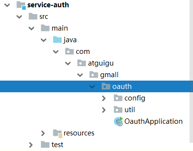

配置文件

application.yml

```yml
spring:
  application:
    name: service-oauth
  profiles:
    active: dev
  cloud:
    nacos:
      discovery:
        server-addr: 192.168.200.128:8848
```

application-dev.yml

```yml
server:
  port: 8208
mybatis-plus:
  configuration:
    log-impl: org.apache.ibatis.logging.stdout.StdOutImpl
  mapper-locations: classpath:com/atguigu/gmall/*/mapper/*.xml
spring:
  zipkin:
    base-url: http://192.168.200.128:9411
    discovery-client-enabled: false
    sender:
      type: web
    sleuth:
      sampler:
        probability: 1
  cloud:
    sentinel:
      transport:
        dashboard: http://192.168.200.128:8858
  redis:
    host: 192.168.200.128
    port: 6379
    database: 0
    timeout: 1800000
    password:
    lettuce:
      pool:
        max-active: 20 #最大连接数
        max-wait: -1    #最大阻塞等待时间(负数表示没限制)
        max-idle: 5    #最大空闲
        min-idle: 0     #最小空闲
  datasource:
    type: com.zaxxer.hikari.HikariDataSource
    driver-class-name: com.mysql.jdbc.Driver
    url: jdbc:mysql://192.168.200.128:3306/gmall_oauth?characterEncoding=utf-8&useSSL=false
    username: root
    password: root
    hikari:
      connection-test-query: SELECT 1
      connection-timeout: 60000
      idle-timeout: 500000
      max-lifetime: 540000
      maximum-pool-size: 12
      minimum-idle: 10
      pool-name: GuliHikariPool
  jackson:
    date-format: yyyy-MM-dd HH:mm:ss
    time-zone: GMT+8
auth:
  ttl: 3600  #token存储到redis的过期时间
  clientId: atguigu
  clientSecret: atguigu
  cookieDomain: localhost
  cookieMaxAge: -1
encrypt:
  key-store:
    location: classpath:/atguigu.jks
    secret: atguigu
    alias: atguigu
    password: atguigu
```

## 3.3 公钥和私钥

### 3.3.1 生成公钥和私钥

生成密钥证书 下边命令生成密钥证书，采用RSA 算法每个证书包含公钥和私钥

Keytool 是一个java提供的证书管理工具, 创建一个文件夹，在该文件夹下执行如下命令行

```properties
keytool -genkeypair -alias atguigu -keyalg RSA -keypass atguigu -keystore atguigu.jks -storepass atguigu

#说明
#-alias：密钥的别名
#-keyalg：使用的hash算法
#-keypass：密钥的访问密码
#-keystore：密钥库文件名，xc.keystore保存了生成的证书
#-storepass：密钥库的访问密码
```

### 3.3.2 导出公钥

1.安装资料目录下的Win64OpenSSL-1_1_0g.exe

2.配置环境变量

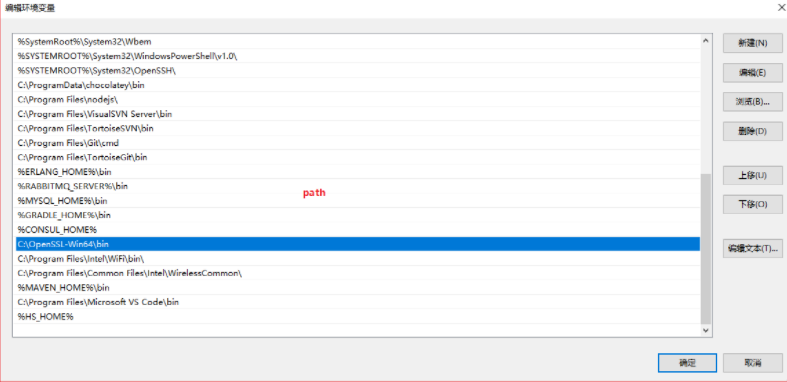

3.cmd进入atguigu.jks文件所在目录执行如下命令(如下命令在windows下执行

```
keytool -list -rfc --keystore atguigu.jks | openssl x509 -inform pem -pubkey
```

## 3.4 密码模式

密码模式（Resource Owner Password Credentials）是直接 通过用户名和密码即可申请令牌

测试如下：

Post请求：http://localhost:9001/oauth/token

参数：

grant_type：密码模式授权填写password

username：账号 -用户账号-atguigu

password：密码 -用户密码-atguigu

即便用密码授权，客户端ID和客户端秘钥也必须要传到后台认证。

并且此链接需要使用 http Basic认证

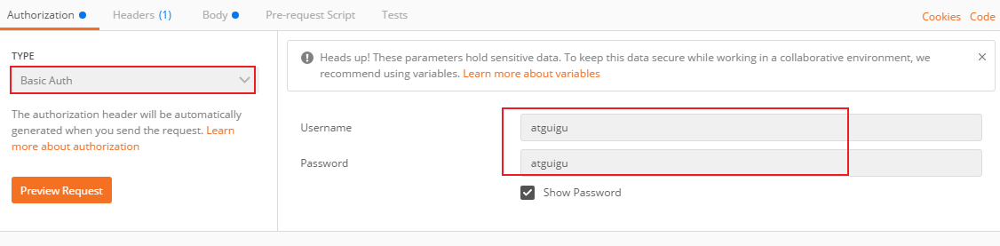

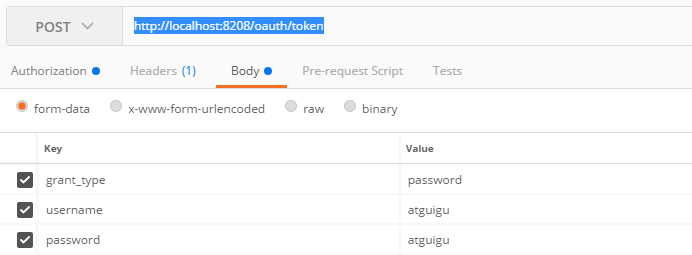

## 3.5 用户微服务搭建

pom.xml

```xml
<?xml version="1.0" encoding="UTF-8"?>
<project xmlns="http://maven.apache.org/POM/4.0.0"
         xmlns:xsi="http://www.w3.org/2001/XMLSchema-instance"
         xsi:schemaLocation="http://maven.apache.org/POM/4.0.0 http://maven.apache.org/xsd/maven-4.0.0.xsd">
    <parent>
        <artifactId>service</artifactId>
        <groupId>com.atguigu.gmail</groupId>
        <version>1.0-SNAPSHOT</version>
    </parent>
    <modelVersion>4.0.0</modelVersion>

    <artifactId>service-user</artifactId>
    <description>用户认证微服务模块</description>

    <build>
        <finalName>service-user</finalName>
        <plugins>
            <plugin>
                <groupId>org.springframework.boot</groupId>
                <artifactId>spring-boot-maven-plugin</artifactId>
            </plugin>
        </plugins>
    </build>
</project>
```

配置文件

application.yml

```yml
spring:
  application:
    name: service-user
  profiles:
    active: dev
  cloud:
    nacos:
      discovery:
        server-addr: 192.168.200.128:8848
```

application-dev.yml

```yml
server:
  port: 8208
mybatis-plus:
  configuration:
    log-impl: org.apache.ibatis.logging.stdout.StdOutImpl
  mapper-locations: classpath:com/atguigu/gmall/*/mapper/*.xml
spring:
  zipkin:
    base-url: http://192.168.200.128:9411
    discovery-client-enabled: false
    sender:
      type: web
    sleuth:
      sampler:
        probability: 1
  cloud:
    sentinel:
      transport:
        dashboard: http://192.168.200.128:8858
  redis:
    host: 192.168.200.128
    port: 6379
    database: 0
    timeout: 1800000
    password:
    lettuce:
      pool:
        max-active: 20 #最大连接数
        max-wait: -1    #最大阻塞等待时间(负数表示没限制)
        max-idle: 5    #最大空闲
        min-idle: 0     #最小空闲
  datasource:
    type: com.zaxxer.hikari.HikariDataSource
    driver-class-name: com.mysql.jdbc.Driver
    url: jdbc:mysql://192.168.200.128:3306/gmall_user?characterEncoding=utf-8&useSSL=false
    username: root
    password: root
    hikari:
      connection-test-query: SELECT 1
      connection-timeout: 60000
      idle-timeout: 500000
      max-lifetime: 540000
      maximum-pool-size: 12
      minimum-idle: 10
      pool-name: GuliHikariPool
  jackson:
    date-format: yyyy-MM-dd HH:mm:ss
    time-zone: GMT+8

```

启动类

```java
package com.atguigu.gmall.user;

import org.springframework.boot.SpringApplication;
import org.springframework.boot.autoconfigure.SpringBootApplication;
import org.springframework.cloud.client.discovery.EnableDiscoveryClient;
import org.springframework.context.annotation.ComponentScan;

@SpringBootApplication
@ComponentScan({"com.atguigu.gmall"})
@EnableDiscoveryClient
public class ServiceUserApplication {

    public static void main(String[] args) {
        SpringApplication.run(ServiceUserApplication.class, args);
    }
}
```

# 4 登录认证开发

## 4.1 查询用户信息接口

mapper

```java
package com.atguigu.gmall.user.mapper;

import com.atguigu.gmall.model.user.UserInfo;
import com.baomidou.mybatisplus.core.mapper.BaseMapper;
import org.apache.ibatis.annotations.Mapper;

@Mapper
public interface UserInfoMapper extends BaseMapper<UserInfo> {
}
```

service

```java
package com.atguigu.gmall.user.service;

import com.atguigu.gmall.model.user.UserInfo;

public interface UserInfoService {

    /**
     * 查询用户信息
     * @param username
     * @return
     */
    public UserInfo getUserInfo(String username);
}
```

实现类

```java
package com.atguigu.gmall.user.service.impl;

import com.atguigu.gmall.model.user.UserInfo;
import com.atguigu.gmall.user.mapper.UserInfoMapper;
import com.atguigu.gmall.user.service.UserInfoService;
import com.baomidou.mybatisplus.core.conditions.query.LambdaQueryWrapper;
import org.springframework.beans.factory.annotation.Autowired;
import org.springframework.stereotype.Service;
import org.springframework.util.StringUtils;

@Service
public class UserInfoServiceImpl implements UserInfoService {

    @Autowired
    private UserInfoMapper userInfoMapper;

    /**
     * 查询用户信息
     *
     * @param username
     * @return
     */
    @Override
    public UserInfo getUserInfo(String username) {
        //参数校验
        if(StringUtils.isEmpty(username)){
            return null;
        }
        return userInfoMapper.selectOne(new LambdaQueryWrapper<UserInfo>().eq(UserInfo::getLoginName, username));
    }
}

```

controller

```java
package com.atguigu.gmall.user.controller;

import com.atguigu.gmall.model.user.UserInfo;
import com.atguigu.gmall.user.service.UserInfoService;
import org.springframework.beans.factory.annotation.Autowired;
import org.springframework.web.bind.annotation.GetMapping;
import org.springframework.web.bind.annotation.PathVariable;
import org.springframework.web.bind.annotation.RequestMapping;
import org.springframework.web.bind.annotation.RestController;

@RestController
@RequestMapping(value = "/api/user")
public class UserController {

    @Autowired
    private UserInfoService userInfoService;
    /**
     * 查询用户信息
     * @return
     */
    @GetMapping(value = "/getUserInfo/{username}")
    public UserInfo getUserInfo(@PathVariable(value = "username") String username){
        return userInfoService.getUserInfo(username);
    }
}

```

## 4.2 认证微服务校验密码登录

### 4.2.1 用户微服务feign接口准备

service-user-client工程搭建

pom.xml

```xml
<?xml version="1.0" encoding="UTF-8"?>
<project xmlns="http://maven.apache.org/POM/4.0.0"
         xmlns:xsi="http://www.w3.org/2001/XMLSchema-instance"
         xsi:schemaLocation="http://maven.apache.org/POM/4.0.0 http://maven.apache.org/xsd/maven-4.0.0.xsd">
    <parent>
        <artifactId>service-client</artifactId>
        <groupId>com.atguigu</groupId>
        <version>1.0-SNAPSHOT</version>
    </parent>
    <modelVersion>4.0.0</modelVersion>

    <artifactId>service-user-client</artifactId>

    <description>用户微服务feign接口工程</description>

</project>
```

feign

```java
package com.atguigu.gmall.user.feign;

import com.atguigu.gmall.model.user.UserInfo;
import org.springframework.cloud.openfeign.FeignClient;
import org.springframework.web.bind.annotation.GetMapping;
import org.springframework.web.bind.annotation.PathVariable;

@FeignClient(name = "service-user", path = "/api/user")
public interface UserFeign {

    /**
     * 查询用户信息
     * @return
     */
    @GetMapping(value = "/getUserInfo/{username}")
    public UserInfo getUserInfo(@PathVariable(value = "username") String username);
}
```

### 4.2.2 认证微服务远程调用

pom文件引入用户feign服务

```xml
<dependency>
    <groupId>com.atguigu</groupId>
    <artifactId>service-user-client</artifactId>
    <version>1.0-SNAPSHOT</version>
</dependency>
```

启动类开启feign调用

```java
package com.atguigu.gmall.oauth;

import org.springframework.boot.SpringApplication;
import org.springframework.boot.autoconfigure.SpringBootApplication;
import org.springframework.cloud.client.discovery.EnableDiscoveryClient;
import org.springframework.cloud.openfeign.EnableFeignClients;
import org.springframework.context.annotation.ComponentScan;

/**
 * 认证微服务
 */
@SpringBootApplication
@EnableDiscoveryClient
@ComponentScan("com.atguigu.gmall")
@EnableFeignClients("com.atguigu.gmall.user.feign")
public class OauthApplication {

    public static void main(String[] args) {
        SpringApplication.run(OauthApplication.class, args);
    }
}
```

固定密码修改为远程

```java
UserInfo userInfo = userFeign.getUserInfo(username);
if(userInfo == null || userInfo.getId() == null){
    return null;
}
//创建User对象,校验用户名密码
UserJwt userDetails = new UserJwt(username,
        userInfo.getPasswd(),
        AuthorityUtils.commaSeparatedStringToAuthorityList(""));
```

测试

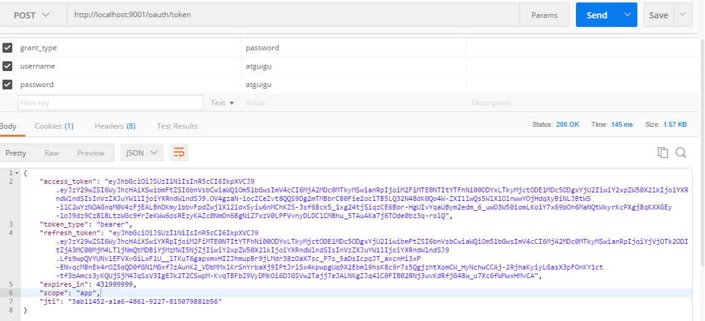

## 4.3 自定义用户登录流程实现

登录后返回实体

```java
package com.atguigu.gmall.oauth.util;

import lombok.Data;

import java.io.Serializable;

/**
 * 令牌实体类
 */
@Data
public class AuthToken implements Serializable{
    //令牌信息
    String accessToken;
    //刷新token(refresh_token)
    String refreshToken;
    //jwt短令牌
    String jti;
}
```

LoginService

```java
package com.atguigu.gmall.oauth;

import com.atguigu.gmall.oauth.util.AuthToken;

public interface LoginService {

    /**
     * 用户登录
     * @param username
     * @param password
     * @return
     */
    public AuthToken login(String username, String password);
}
```

实现类

```java
package com.atguigu.gmall.oauth.service.impl;

import com.atguigu.gmall.oauth.service.LoginService;
import com.atguigu.gmall.oauth.util.AuthToken;
import org.springframework.beans.factory.annotation.Autowired;
import org.springframework.beans.factory.annotation.Value;
import org.springframework.cloud.client.ServiceInstance;
import org.springframework.cloud.client.loadbalancer.LoadBalancerClient;
import org.springframework.http.HttpEntity;
import org.springframework.http.HttpHeaders;
import org.springframework.http.HttpMethod;
import org.springframework.http.ResponseEntity;
import org.springframework.stereotype.Service;
import org.springframework.util.Base64Utils;
import org.springframework.util.MultiValueMap;
import org.springframework.util.StringUtils;
import org.springframework.web.client.RestTemplate;

import java.util.Map;

@Service
public class LoginServiceImpl implements LoginService {

    @Autowired
    private LoadBalancerClient loadBalancerClient;

    @Autowired
    private RestTemplate restTemplate;


    /**
     * 用户登录
     *
     * @param username
     * @param password
     * @return
     */
    @Override
    public AuthToken login(String username, String password) {
        //参数校验
        if(StringUtils.isEmpty(username) || StringUtils.isEmpty(password)){
            return null;
        }
        //获取服务实体
        ServiceInstance instance = loadBalancerClient.choose("service-oauth");
        //获取请求地址
        String url = instance.getUri() + "/oauth/token";
        //定义请求头
        MultiValueMap<String, String> headers = new HttpHeaders();
        headers.add("Authorization",getHeadInfo());
        //定义请求body
        MultiValueMap<String, String> body = new HttpHeaders();
        body.add("grant_type", "password");
        body.add("username", username);
        body.add("password", password);
        //定义请对象
        HttpEntity objectHttpEntity = new HttpEntity<>(body, headers);
        //发起请求
        ResponseEntity<Map> exchange =
                restTemplate.exchange(url, HttpMethod.POST, objectHttpEntity, Map.class);
        //解析结果
        Map result = exchange.getBody();
        if(result == null || result.size() <= 0){
            return null;
        }
        //获取令牌信息
        AuthToken authToken = new AuthToken();
        authToken.setAccessToken((String)result.get("access_token"));
        authToken.setJti((String)result.get("jti"));
        authToken.setRefreshToken((String)result.get("refresh_token"));

        //返回结果
        return authToken;
    }

    @Value("${auth.clientId}")
    private String clientId;
    @Value("${auth.clientSecret}")
    private String clientSecret;

    /**
     * 获取请求头的拼接参数
     * @return
     */
    private String getHeadInfo(){
        try {
            String param = clientId + ":" + clientSecret;
            byte[] encode = Base64Utils.encode(param.getBytes());
            return "Basic " + new String(encode, "UTF-8");
        }catch (Exception e){
            e.printStackTrace();
        }
        return null;
    }
}
```

controller

```java
package com.atguigu.gmall.oauth.controller;

import com.atguigu.gmall.common.result.Result;
import com.atguigu.gmall.oauth.service.LoginService;
import com.atguigu.gmall.oauth.util.AuthToken;
import org.springframework.beans.factory.annotation.Autowired;
import org.springframework.web.bind.annotation.PostMapping;
import org.springframework.web.bind.annotation.RequestMapping;
import org.springframework.web.bind.annotation.RestController;

@RestController
@RequestMapping(value = "/user")
public class LoginController {

    @Autowired
    private LoginService loginService;

    /**
     * 登录
     * @param username
     * @param password
     * @return
     */
    @PostMapping(value = "/login")
    public Result<AuthToken> login(String username, String password){
        AuthToken login = loginService.login(username, password);
        return Result.ok(login);
    }

}

```

# 5 服务登录校验

## 5.1 授权配置

在user服务的pom中添加引用

```xml
<dependencies>
    <dependency>
        <groupId>org.springframework.cloud</groupId>
        <artifactId>spring-cloud-starter-oauth2</artifactId>
    </dependency>
</dependencies>
```

资源授权类

```java
package com.atguigu.gmall.user.config;

import org.springframework.context.annotation.Bean;
import org.springframework.context.annotation.Configuration;
import org.springframework.core.io.ClassPathResource;
import org.springframework.core.io.Resource;
import org.springframework.security.config.annotation.method.configuration.EnableGlobalMethodSecurity;
import org.springframework.security.config.annotation.web.builders.HttpSecurity;
import org.springframework.security.oauth2.config.annotation.web.configuration.EnableResourceServer;
import org.springframework.security.oauth2.config.annotation.web.configuration.ResourceServerConfigurerAdapter;
import org.springframework.security.oauth2.provider.token.TokenStore;
import org.springframework.security.oauth2.provider.token.store.JwtAccessTokenConverter;
import org.springframework.security.oauth2.provider.token.store.JwtTokenStore;

import java.io.BufferedReader;
import java.io.IOException;
import java.io.InputStreamReader;
import java.util.stream.Collectors;


@Configuration
@EnableResourceServer
@EnableGlobalMethodSecurity(prePostEnabled = true, securedEnabled = true)//激活方法上的PreAuthorize注解
public class GmallResourceServerConfig extends ResourceServerConfigurerAdapter {

    //公钥
    private static final String PUBLIC_KEY = "public.key";

    /***
     * 定义JwtTokenStore
     * @param jwtAccessTokenConverter
     * @return
     */
    @Bean
    public TokenStore tokenStore(JwtAccessTokenConverter jwtAccessTokenConverter) {
        return new JwtTokenStore(jwtAccessTokenConverter);
    }

    /***
     * 定义JJwtAccessTokenConverter
     * @return
     */
    @Bean
    public JwtAccessTokenConverter jwtAccessTokenConverter() {
        JwtAccessTokenConverter converter = new JwtAccessTokenConverter();
        converter.setVerifierKey(getPubKey());
        return converter;
    }
    /**
     * 获取非对称加密公钥 Key
     * @return 公钥 Key
     */
    private String getPubKey() {
        Resource resource = new ClassPathResource(PUBLIC_KEY);
        try {
            InputStreamReader inputStreamReader = new InputStreamReader(resource.getInputStream());
            BufferedReader br = new BufferedReader(inputStreamReader);
            return br.lines().collect(Collectors.joining("\n"));
        } catch (IOException ioe) {
            return null;
        }
    }

    /***
     * Http安全配置，对每个到达系统的http请求链接进行校验
     * @param http
     * @throws Exception
     */
    @Override
    public void configure(HttpSecurity http) throws Exception {
        //所有请求必须认证通过
        http.authorizeRequests()
                //下边的路径放行
                .antMatchers(). //配置地址放行
                permitAll()
                .anyRequest().
                authenticated();    //其他地址需要认证授权
    }
}
```

**在resource目录下添加公钥文件**

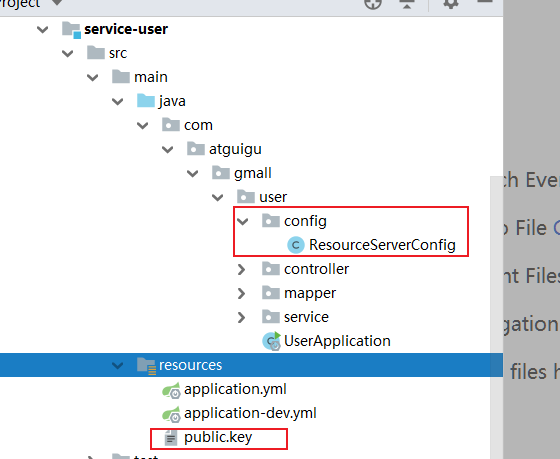

测试

## 5.2 管理员令牌

引入临时令牌工具类

```java
package com.atguigu.gmall.oauth.util;

import com.alibaba.fastjson.JSON;
import org.springframework.core.io.ClassPathResource;
import org.springframework.core.io.Resource;
import org.springframework.security.jwt.Jwt;
import org.springframework.security.jwt.JwtHelper;
import org.springframework.security.jwt.crypto.sign.RsaSigner;
import org.springframework.security.oauth2.provider.token.store.KeyStoreKeyFactory;

import java.security.KeyPair;
import java.security.PrivateKey;
import java.security.interfaces.RSAPrivateKey;
import java.util.HashMap;
import java.util.Map;

public class AdminJwtUtil {

    /***
     * 获取管理员令牌
     * @return
     */
    public static String adminJwt(){
        //秘钥->私钥
        Resource resource = new ClassPathResource("atguigu.jks");

        /***
         * 加载证书,读取证书数据
         * 1:证书对象
         * 2:证书的密码
         */
        KeyStoreKeyFactory keyStoreKeyFactory = new KeyStoreKeyFactory(resource,"atguigu".toCharArray());

        //把私钥信息当做秘钥
        KeyPair keyPair = keyStoreKeyFactory.getKeyPair("atguigu","atguigu".toCharArray());
        PrivateKey privateKey = keyPair.getPrivate();
        RSAPrivateKey rsaPrivateKey = (RSAPrivateKey) privateKey;
        //并指定加密算法
        RsaSigner rsaSigner = new RsaSigner(rsaPrivateKey);

        //添加载荷数据 payload
        Map<String,Object> map = new HashMap<String,Object>();
        map.put("authorities",new String[]{"admin"});

        //生成令牌 JwtHelper生成令牌/解析令牌
        Jwt jwt = JwtHelper.encode(JSON.toJSONString(map), rsaSigner);
        return jwt.getEncoded();
    }
}
```

添加拦截器

```java
package com.atguigu.gmall.oauth.interceptor;

import com.atguigu.gmall.oauth.util.AdminJwtUtil;
import feign.RequestInterceptor;
import feign.RequestTemplate;
import org.springframework.context.annotation.Configuration;

@Configuration
public class GmallAuthRequestInterceptor implements RequestInterceptor {

    /**
     * feign发起远程调用前拦截请求,在请求头中添加临时令牌,访问用户信息
     */
    @Override
    public void apply(RequestTemplate requestTemplate) {
        //创建令牌信息
        String token ="Bearer "+ AdminJwtUtil.adminJwt();
        //将令牌添加到头文件中
        requestTemplate.header("Authorization", token);
    }
}
```

取消用户微服务的放行

```java
package com.atguigu.gmall.user.config;

import org.springframework.context.annotation.Bean;
import org.springframework.context.annotation.Configuration;
import org.springframework.core.io.ClassPathResource;
import org.springframework.core.io.Resource;
import org.springframework.security.config.annotation.method.configuration.EnableGlobalMethodSecurity;
import org.springframework.security.config.annotation.web.builders.HttpSecurity;
import org.springframework.security.oauth2.config.annotation.web.configuration.EnableResourceServer;
import org.springframework.security.oauth2.config.annotation.web.configuration.ResourceServerConfigurerAdapter;
import org.springframework.security.oauth2.provider.token.TokenStore;
import org.springframework.security.oauth2.provider.token.store.JwtAccessTokenConverter;
import org.springframework.security.oauth2.provider.token.store.JwtTokenStore;

import java.io.BufferedReader;
import java.io.IOException;
import java.io.InputStreamReader;
import java.util.stream.Collectors;


@Configuration
@EnableResourceServer
@EnableGlobalMethodSecurity(prePostEnabled = true, securedEnabled = true)//激活方法上的PreAuthorize注解
public class ResourceServerConfig extends ResourceServerConfigurerAdapter {

    //公钥
    private static final String PUBLIC_KEY = "public.key";

    /***
     * 定义JwtTokenStore
     * @param jwtAccessTokenConverter
     * @return
     */
    @Bean
    public TokenStore tokenStore(JwtAccessTokenConverter jwtAccessTokenConverter) {
        return new JwtTokenStore(jwtAccessTokenConverter);
    }

    /***
     * 定义JJwtAccessTokenConverter
     * @return
     */
    @Bean
    public JwtAccessTokenConverter jwtAccessTokenConverter() {
        JwtAccessTokenConverter converter = new JwtAccessTokenConverter();
        converter.setVerifierKey(getPubKey());
        return converter;
    }
    /**
     * 获取非对称加密公钥 Key
     * @return 公钥 Key
     */
    private String getPubKey() {
        Resource resource = new ClassPathResource(PUBLIC_KEY);
        try {
            InputStreamReader inputStreamReader = new InputStreamReader(resource.getInputStream());
            BufferedReader br = new BufferedReader(inputStreamReader);
            return br.lines().collect(Collectors.joining("\n"));
        } catch (IOException ioe) {
            return null;
        }
    }

    /***
     * Http安全配置，对每个到达系统的http请求链接进行校验
     * @param http
     * @throws Exception
     */
    @Override
    public void configure(HttpSecurity http) throws Exception {
        //所有请求必须认证通过
        http.authorizeRequests()
                //下边的路径放行
                .antMatchers(). //配置地址放行
                permitAll()
                .anyRequest().
                authenticated();    //其他地址需要认证授权
    }
}
```

测试

# 6 对接网关

## 6.1 将用户登录ip存入redis

登录服务pom添加

```xml
<dependency>
    <groupId>com.atguigu</groupId>
    <artifactId>common-util</artifactId>
    <version>1.0-SNAPSHOT</version>
</dependency>
```

修改登录逻辑

```java
package com.atguigu.gmall.oauth.controller;

import com.alibaba.fastjson.JSONObject;
import com.atguigu.gmall.common.result.Result;
import com.atguigu.gmall.common.util.IpUtil;
import com.atguigu.gmall.oauth.service.LoginService;
import com.atguigu.gmall.oauth.util.AuthToken;
import org.springframework.beans.factory.annotation.Autowired;
import org.springframework.data.redis.core.RedisTemplate;
import org.springframework.data.redis.core.StringRedisTemplate;
import org.springframework.web.bind.annotation.PostMapping;
import org.springframework.web.bind.annotation.RequestMapping;
import org.springframework.web.bind.annotation.RestController;

import javax.servlet.http.HttpServletRequest;

@RestController
@RequestMapping(value = "/user")
public class LoginController {

    @Autowired
    private LoginService loginService;

    @Autowired
    private HttpServletRequest request;

    @Autowired
    private StringRedisTemplate stringRedisTemplate;

    /**
     * 登录
     * @param username
     * @param password
     * @return
     */
    @PostMapping(value = "/login")
    public Result<AuthToken> login(String username, String password){
        AuthToken login = loginService.login(username, password);
        //保存用户ip地址
        String ipAddress = IpUtil.getIpAddress(request);
        //将用户ip地址存到redis中
        stringRedisTemplate.boundValueOps("ip:" + ipAddress).set(login.getAccessToken());
        //返回用户登录结果
        return Result.ok(login);
    }
}
```

## 6.2 网关全局过滤器

网关pom添加引用

```xml
<!-- redis -->
<dependency>
    <groupId>org.springframework.boot</groupId>
    <artifactId>spring-boot-starter-data-redis</artifactId>
</dependency>
<dependency>
    <groupId>com.atguigu</groupId>
    <artifactId>common-util</artifactId>
    <version>1.0-SNAPSHOT</version>
</dependency>
```

全局过滤器

```java
package com.atguigu.gmall.gateway.filter;

import com.atguigu.gmall.common.util.IpUtil;
import org.springframework.beans.factory.annotation.Autowired;
import org.springframework.cloud.gateway.filter.GatewayFilterChain;
import org.springframework.cloud.gateway.filter.GlobalFilter;
import org.springframework.core.Ordered;
import org.springframework.data.redis.core.StringRedisTemplate;
import org.springframework.http.HttpCookie;
import org.springframework.http.HttpStatus;
import org.springframework.http.server.reactive.ServerHttpRequest;
import org.springframework.http.server.reactive.ServerHttpResponse;
import org.springframework.stereotype.Component;
import org.springframework.util.MultiValueMap;
import org.springframework.util.StringUtils;
import org.springframework.web.server.ServerWebExchange;
import reactor.core.publisher.Mono;

@Component
public class GmallGlobalFilter implements GlobalFilter, Ordered {

    /**
     * 全局过滤逻辑
     * @param exchange
     * @param chain
     * @return
     */
    @Override
    public Mono<Void> filter(ServerWebExchange exchange, GatewayFilterChain chain) {
        ServerHttpRequest request = exchange.getRequest();
        ServerHttpResponse response = exchange.getResponse();
        //获取用户的请求地址
        String path = request.getURI().getPath().toString();
        //登录地址放行
        if(path.contains("/login")){
            return chain.filter(exchange);
        }
        //获取用户令牌信息---url中
        String token = request.getQueryParams().getFirst("token");
        if(StringUtils.isEmpty(token)){
            //head中获取
            token = request.getHeaders().getFirst("token");
            if(StringUtils.isEmpty(token)){
                //从cookie中获取
                MultiValueMap<String, HttpCookie> cookies = request.getCookies();
                if(cookies == null || cookies.size() == 0){
                    //401,未授权,无法访问
                    response.setStatusCode(HttpStatus.UNAUTHORIZED);
                    //拒绝请求
                    return response.setComplete();
                }
                token = request.getCookies().getFirst("token").getValue();
            }
        }
        //校验令牌是否盗用
        if(!checkIpAddress(request, token)){
            //401,未授权,无法访问
            response.setStatusCode(HttpStatus.UNAUTHORIZED);
            //拒绝请求
            return response.setComplete();
        }
        //将令牌存入请求的head中,以便于微服务校验
        request.mutate().header("Authorization", "Bearer " + token);
        //放行
        return chain.filter(exchange);
    }

    @Autowired
    private StringRedisTemplate stringRedisTemplate;
    /**
     * 校验令牌和ip是否匹配
     * @return
     */
    private Boolean checkIpAddress(ServerHttpRequest request, String userToken) {
        //获取ip地址
        String gatwayIpAddress = IpUtil.getGatwayIpAddress(request);
        //获取redis中的token信息
        String token = stringRedisTemplate.boundValueOps("ip:" + gatwayIpAddress).get();
        //判断是否一致,不一致则为盗用
        if(token == null || !token.equals(userToken)){
            return false;
        }
        //未盗用
        return true;
    }

    /**
     * 过滤器执行顺序
     * @return
     */
    @Override
    public int getOrder() {
        return 0;
    }
}
```

配置文件

```yml
server:
  port: 80
spring:
  application:
    name: api-gateway
  cloud:
    nacos:
      discovery:
        server-addr: 192.168.200.128:8848
    gateway:
      discovery:      #是否与服务发现组件进行结合，通过 serviceId(必须设置成大写) 转发到具体的服务实例。默认为false，设为true便开启通过服务中心的自动根据 serviceId 创建路由的功能。
        locator:      #路由访问方式：http://Gateway_HOST:Gateway_PORT/大写的serviceId/**，其中微服务应用名默认大写访问。
          enabled: true
      routes:
        - id: service-product
          uri: lb://service-product
          predicates:
            - Path=/**/product/** # 路径匹配
        - id: service-user
          uri: lb://service-user
          predicates:
            - Path=/**/user/** # 路径匹配
        - id: service-oauth
          uri: lb://service-oauth
          predicates:
            - Path=/**/login/** # 路径匹配
  redis:
    host: 192.168.200.128
    port: 6379
```

