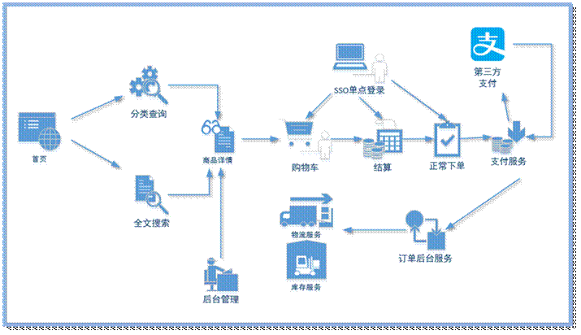
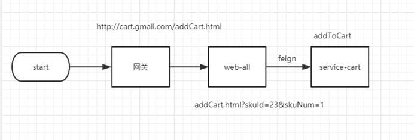
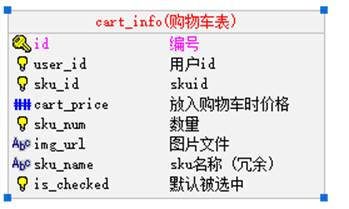

# 一 购物车业务简介



购物车模块要能过存储顾客所选的的商品，记录下所选商品，还要能随时更新，当用户决定购买时，用户可以选择决定购买的商品进入结算页面。

   功能要求：

1)   要持久化，保存到数据库中。Mysql -- cartInfo

2)   利用缓存提高性能。Redis

3)   未登录状态也可以存入购物车，一旦用户登录要进行合并操作。

4)   同步保存Redis，异步更新Mysql

# 二 购物车模块搭建

购物车添加展示流程：



## 2 搭建service-cart

### 2.1 搭建service-cart服务

搭建方式如service-item

### 2.2 修改配置pom.xml

```xml
<?xml version="1.0" encoding="UTF-8"?>
<project xmlns="http://maven.apache.org/POM/4.0.0"
         xmlns:xsi="http://www.w3.org/2001/XMLSchema-instance"
         xsi:schemaLocation="http://maven.apache.org/POM/4.0.0 http://maven.apache.org/xsd/maven-4.0.0.xsd">
    <parent>
        <artifactId>service</artifactId>
        <groupId>com.atguigu.gmail</groupId>
        <version>1.0-SNAPSHOT</version>
    </parent>
    <modelVersion>4.0.0</modelVersion>

    <artifactId>service-cart</artifactId>

    <description>购物车微服务模块</description>

    <build>
        <finalName>service-cart</finalName>
        <plugins>
            <plugin>
                <groupId>org.springframework.boot</groupId>
                <artifactId>spring-boot-maven-plugin</artifactId>
            </plugin>
        </plugins>
    </build>
</project>
```


### 2.3 添加配置文件

application.yml

```yml
spring:
  application:
    name: service-cart
  profiles:
    active: dev
  cloud:
    nacos:
      discovery:
        server-addr: 192.168.200.128:8848
```

application-dev.yml

```yml
server:
  port: 8201
mybatis-plus:
  configuration:
    log-impl: org.apache.ibatis.logging.stdout.StdOutImpl
  mapper-locations: classpath:com/atguigu/gmall/*/mapper/*.xml
feign:
  sentinel:
    enabled: true
  client:
    config:
      default:
        readTimeout: 3000
        connectTimeout: 1000
spring:
  zipkin:
    base-url: http://192.168.200.128:9411
    discovery-client-enabled: false
    sender:
      type: web
  sleuth:
    sampler:
      probability: 1
  cloud:
    sentinel:
      transport:
        dashboard: http://192.168.200.128:8858
  redis:
    host: 192.168.200.128
    port: 6379
    database: 0
    timeout: 1800000
    password:
    lettuce:
      pool:
        max-active: 20 #最大连接数
        max-wait: -1    #最大阻塞等待时间(负数表示没限制)
        max-idle: 5    #最大空闲
        min-idle: 0     #最小空闲
  datasource:
    type: com.zaxxer.hikari.HikariDataSource
    driver-class-name: com.mysql.jdbc.Driver
    url: jdbc:mysql://192.168.200.128:3306/gmall_order?characterEncoding=utf-8&useSSL=false
    username: root
    password: root
    hikari:
      connection-test-query: SELECT 1
      connection-timeout: 60000
      idle-timeout: 500000
      max-lifetime: 540000
      maximum-pool-size: 12
      minimum-idle: 10
      pool-name: GuliHikariPool
  jackson:
    date-format: yyyy-MM-dd HH:mm:ss
    time-zone: GMT+8
```

### 2.4 配置主类

```java
package com.atguigu.gmall.cart;

import org.springframework.boot.SpringApplication;
import org.springframework.boot.autoconfigure.SpringBootApplication;
import org.springframework.cloud.client.discovery.EnableDiscoveryClient;
import org.springframework.cloud.openfeign.EnableFeignClients;
import org.springframework.context.annotation.ComponentScan;
import org.springframework.scheduling.annotation.EnableAsync;

@SpringBootApplication
@ComponentScan(basePackages = "com.atguigu.gmall")
@EnableDiscoveryClient
@EnableFeignClients(basePackages = "com.atguigu.gmall")
@EnableAsync
public class ServiceCartApplication {
    public static void main(String[] args) {
        SpringApplication.run(ServiceCartApplication.class,args);
    }
}
```

# 三 功能—添加入购物车

## 3.1 添加购物车实现

涉及到的表



为数据添加一个字段为 is_checked

```java
package com.atguigu.gmall.model.cart;

@Data
@ApiModel(description = "购物车")
public class CartInfo extends BaseEntity {

   private static final long serialVersionUID = 1L;

   @ApiModelProperty(value = "用户id")
   @TableField("user_id")
   private String userId;

   @ApiModelProperty(value = "skuid")
   @TableField("sku_id")
   private Long skuId;

   @ApiModelProperty(value = "放入购物车时价格")
   @TableField("cart_price")
   private BigDecimal cartPrice;

   @ApiModelProperty(value = "数量")
   @TableField("sku_num")
   private Integer skuNum;

   @ApiModelProperty(value = "图片文件")
   @TableField("img_url")
   private String imgUrl;

   @ApiModelProperty(value = "sku名称 (冗余)")
   @TableField("sku_name")
   private String skuName;

   @ApiModelProperty(value = "isChecked")
   @TableField("is_checked")
   private Integer isChecked = 1;

   // 实时价格 skuInfo.price
   @TableField(exist = false)
   BigDecimal skuPrice;

}
```

创建CartInfoMapper

```java
package com.atguigu.gmall.cart.dao;

import com.atguigu.gmall.model.cart.CartInfo;
import com.baomidou.mybatisplus.core.mapper.BaseMapper;
import org.apache.ibatis.annotations.Mapper;

/**
 * 购物车dao层
 */
@Mapper
public interface CartInfoMapper extends BaseMapper<CartInfo> {
}

```

常量类添加

```java
public static final String USER_KEY_PREFIX = "user:";
public static final String USER_CART_KEY_SUFFIX = ":cart";
public static final long USER_CART_EXPIRE = 30000;
```

实现类

```java
package com.atguigu.gmall.cart.service.impl;

import com.alibaba.fastjson.JSONObject;
import com.atguigu.gmall.cart.dao.CartInfoMapper;
import com.atguigu.gmall.cart.service.CartService;
import com.atguigu.gmall.common.constant.RedisConst;
import com.atguigu.gmall.model.cart.CartInfo;
import com.atguigu.gmall.model.product.SkuInfo;
import com.atguigu.gmall.product.client.ProductFeignClient;
import com.baomidou.mybatisplus.core.conditions.query.LambdaQueryWrapper;
import org.springframework.beans.factory.annotation.Autowired;
import org.springframework.data.redis.core.StringRedisTemplate;
import org.springframework.stereotype.Service;

import java.math.BigDecimal;
import java.util.concurrent.TimeUnit;

@Service
public class CartServiceImpl implements CartService {

    @Autowired
    private CartInfoMapper cartInfoMapper;

    @Autowired
    private ProductFeignClient productFeignClient;

    @Autowired
    private StringRedisTemplate stringRedisTemplate;
            ;
    /**
     * 新增购物车
     *
     * @param skuId
     * @param userId
     * @param skuNum
     */
    @Override
    public void addToCart(Long skuId, String userId, Integer skuNum) {

        //拼接条件
        LambdaQueryWrapper<CartInfo> wrapper = new LambdaQueryWrapper<>();
        wrapper.eq(CartInfo::getUserId, userId).eq(CartInfo::getSkuId, skuId);
        //从数据库中查询购物车信息
        CartInfo cartInfo = cartInfoMapper.selectOne(wrapper);
        BigDecimal skuPrice = productFeignClient.getSkuPrice(skuId);
        if(cartInfo == null || cartInfo.getId() == null){
            //若不存在数据,则新增购物车信息,并同步到redis缓存
            cartInfo = new CartInfo();
            //查询sku的详细信息
            SkuInfo skuInfo = productFeignClient.getSkuInfo(skuId);
            cartInfo.setImgUrl(skuInfo.getSkuDefaultImg());
            cartInfo.setSkuId(skuId);
            cartInfo.setSkuName(skuInfo.getSkuName());
            cartInfo.setSkuNum(skuNum);
            cartInfo.setSkuPrice(skuPrice);
            cartInfo.setUserId(userId);
            cartInfo.setCartPrice(skuInfo.getPrice());
            //保存数据库
            cartInfoMapper.insert(cartInfo);
        }else{
            //若存在数据则更新数量和价格,更新reids的缓存信息
            cartInfo.setSkuNum(cartInfo.getSkuNum() + skuNum);
            cartInfo.setSkuPrice(skuPrice);
            cartInfoMapper.updateById(cartInfo);
        }
        //同步数据到缓存
        stringRedisTemplate
                .boundHashOps("User_Cart_Info_" + userId)
                .put(skuId, JSONObject.toJSONString(cartInfo));
        //设置过期时间
        stringRedisTemplate.expire("User_Cart_Info_" + userId, RedisConst.USER_CART_EXPIRE, TimeUnit.SECONDS);
    }
}
```

## 3.2 异步处理

目前添加购物车我们使用的是同步操作redis与mysql，这样效率比较低，并发量不高，如何优化呢？我们可以采取同步操作reids，异步更新mysql的方式，如何实现呢？其实很简单

```java
package com.atguigu.gmall.cart.service;

import com.atguigu.gmall.model.cart.CartInfo;

/**
 * 异步购物车处理接口类
 */
public interface CartAsyncService {

    /**
     * 修改购物车
     * @param cartInfo
     */
    void updateCartInfo(CartInfo cartInfo);

    /**
     * 保存购物车
     * @param cartInfo
     */
    void saveCartInfo(CartInfo cartInfo);
}

```

添加异步处理service接口实现类

```java
package com.atguigu.gmall.cart.service.impl;

import com.atguigu.gmall.cart.dao.CartInfoMapper;
import com.atguigu.gmall.cart.service.CartAsyncService;
import com.atguigu.gmall.model.cart.CartInfo;
import org.springframework.beans.factory.annotation.Autowired;
import org.springframework.scheduling.annotation.Async;
import org.springframework.stereotype.Service;

@Service
public class CartAsyncServiceImpl implements CartAsyncService {

    @Autowired
    private CartInfoMapper cartInfoMapper;
    /**
     * 修改购物车
     *
     * @param cartInfo
     */
    @Async
    @Override
    public void updateCartInfo(CartInfo cartInfo) {
        cartInfoMapper.updateById(cartInfo);
    }

    /**
     * 保存购物车
     *
     * @param cartInfo
     */
    @Async
    @Override
    public void saveCartInfo(CartInfo cartInfo) {
        cartInfoMapper.insert(cartInfo);
    }
}
```

改造添加购物车service方法

```java
package com.atguigu.gmall.cart.service.impl;

import com.alibaba.fastjson.JSONObject;
import com.atguigu.gmall.cart.dao.CartInfoMapper;
import com.atguigu.gmall.cart.service.CartAsyncService;
import com.atguigu.gmall.cart.service.CartService;
import com.atguigu.gmall.common.constant.RedisConst;
import com.atguigu.gmall.model.cart.CartInfo;
import com.atguigu.gmall.model.product.SkuInfo;
import com.atguigu.gmall.product.client.ProductFeignClient;
import com.baomidou.mybatisplus.core.conditions.query.LambdaQueryWrapper;
import org.springframework.beans.factory.annotation.Autowired;
import org.springframework.data.redis.core.StringRedisTemplate;
import org.springframework.stereotype.Service;

import java.math.BigDecimal;
import java.util.concurrent.TimeUnit;

@Service
public class CartServiceImpl implements CartService {

    @Autowired
    private CartInfoMapper cartInfoMapper;

    @Autowired
    private ProductFeignClient productFeignClient;

    @Autowired
    private StringRedisTemplate stringRedisTemplate;

    @Autowired
    private CartAsyncService cartAsyncService;
            ;
    /**
     * 新增购物车
     *
     * @param skuId
     * @param userId
     * @param skuNum
     */
    @Override
    public void addToCart(Long skuId, String userId, Integer skuNum) {

        //拼接条件
        LambdaQueryWrapper<CartInfo> wrapper = new LambdaQueryWrapper<>();
        wrapper.eq(CartInfo::getUserId, userId).eq(CartInfo::getSkuId, skuId);
        //从数据库中查询购物车信息
        CartInfo cartInfo = cartInfoMapper.selectOne(wrapper);
        BigDecimal skuPrice = productFeignClient.getSkuPrice(skuId);
        if(cartInfo == null || cartInfo.getId() == null){
            //若不存在数据,则新增购物车信息,并同步到redis缓存
            cartInfo = new CartInfo();
            //查询sku的详细信息
            SkuInfo skuInfo = productFeignClient.getSkuInfo(skuId);
            cartInfo.setImgUrl(skuInfo.getSkuDefaultImg());
            cartInfo.setSkuId(skuId);
            cartInfo.setSkuName(skuInfo.getSkuName());
            cartInfo.setSkuNum(skuNum);
            cartInfo.setSkuPrice(skuPrice);
            cartInfo.setUserId(userId);
            cartInfo.setCartPrice(skuInfo.getPrice());
            //保存数据库
            cartAsyncService.saveCartInfo(cartInfo);
        }else{
            //若存在数据则更新数量和价格,更新reids的缓存信息
            cartInfo.setSkuNum(cartInfo.getSkuNum() + skuNum);
            cartInfo.setSkuPrice(skuPrice);
            cartAsyncService.updateCartInfo(cartInfo);
        }
        //同步数据到缓存
        stringRedisTemplate
                .boundHashOps("User_Cart_Info_" + userId)
                .put(skuId, JSONObject.toJSONString(cartInfo));
        //设置过期时间
        stringRedisTemplate.expire("User_Cart_Info_" + userId, RedisConst.USER_CART_EXPIRE, TimeUnit.SECONDS);
    }
}
```

添加购物车控制器

```java
package com.atguigu.gmall.cart.controller;


@RestController
@RequestMapping("/api/cart")
public class CartApiController {

    @Autowired
    private CartService cartService;

    /**
     * 添加购物车
     *
     * @param skuId
     * @param skuNum
     * @param request
     * @return
     */
    @PostMapping("/addToCart/{skuId}/{skuNum}")
    public Result addToCart(@PathVariable("skuId") Long skuId,
                            @PathVariable("skuNum") Integer skuNum,
                            HttpServletRequest request) {
        // 如何获取userId
        String userId = AuthContextHolder.getUserId(request);
        if (StringUtils.isEmpty(userId)) {
            // 获取临时用户Id
            userId = AuthContextHolder.getUserTempId(request);
        }
        cartService.addToCart(skuId, userId, skuNum);
        return Result.ok();
    }
}
```

# 四 功能—展示购物车列表

## 4.1 功能解析

1、 购物车列表先从缓存中获取购物车列表，如果缓存没有，加载数据库，并放入缓存。

## 4.2 购物车列表接口：CartService

```java
/**
     * 通过用户Id 查询购物车列表
     * @param userId
     * @param userTempId
     * @return
     */
    List<CartInfo> getCartList(String userId, String userTempId);
```

## 4.3 实现类：CartServiceImpl

```java
/**
     * 通过用户Id 查询购物车列表
     *
     * @param userId
     * @param userTempId
     * @return
     */
    @Override
    public List<CartInfo> getCartList(String userId, String userTempId) {
        //参数检查
        if(StringUtils.isEmpty(userId) && StringUtils.isEmpty(userTempId)){
            return null;
        }
        //查看用户的登录状态
        if(!StringUtils.isEmpty(userId)){
            //根据用户id查询购物车信息
            List<CartInfo> cartInfoList = getCart(userId);
        }else{
            //根据临时用户id查询购物车信息
            List<CartInfo> cartInfoList = getCart(userTempId);
        }
        return null;
    }

    /**
     * 查询用户购物车数据
     * @param userId
     * @return
     */
    private List<CartInfo> getCart(String userId) {
        //查询redis中是否存在购物车数据
        List<CartInfo> cartInfoList = redisTemplate.boundHashOps("User_Cart_Info_" + userId).values();
        //若有数据直接返回
        if(!cartInfoList.isEmpty() && cartInfoList.size() > 0){
            return cartInfoList;
        }
        //若没有则从数据库查询数据并缓存到redis中去
        LambdaQueryWrapper<CartInfo> wrapper = new LambdaQueryWrapper<>();
        wrapper.eq(CartInfo::getUserId, userId);
        cartInfoList = cartInfoMapper.selectList(wrapper);
        if(cartInfoList.isEmpty() || cartInfoList.size() == 0){
            return null;
        }
        //有数据的话缓存到redis中
        Map<Long, CartInfo> collect = cartInfoList.stream().sorted(new Comparator<CartInfo>() {
            /**
             * 排序:降序
             * @param o1
             * @param o2
             * @return
             */
            @Override
            public int compare(CartInfo o1, CartInfo o2) {
                return o1.getId().compareTo(o2.getSkuId());
            }
        }).collect(Collectors.toMap(CartInfo::getSkuId, c -> c));
        redisTemplate.boundHashOps("User_Cart_Info_" + userId).putAll(collect);
        //设置过期时间
        redisTemplate.expire("User_Cart_Info_" + userId, RedisConst.USER_CART_EXPIRE, TimeUnit.SECONDS);

        //返回购物车数据
        return cartInfoList;
    }
```


## 4.4 控制器：CartApiController

```java
/**
 * 查询购物车
 *
 * @param request
 * @return
 */
@GetMapping("cartList")
public Result cartList(HttpServletRequest request) {
    // 获取用户Id
    String userId = AuthContextHolder.getUserId(request);
    // 获取临时用户Id
    String userTempId = AuthContextHolder.getUserTempId(request);
    List<CartInfo> cartInfoList = cartService.getCartList(userId, userTempId);
    return Result.ok(cartInfoList);
}
```

# 五 功能--合并购物车

功能分析：

1. 当用户登录以后，先判断未登录的时候，用户是否购买了商品。

   ​	a)   如果用户购买了商品，则找到对应的商品Id，对数量进行合并。

   ​	b)   没有找到的商品,则直接添加到数据。

2. 合并完成之后，删除未登录数据。

## 5.1 更改实现类：CartServiceImpl

```java
/**
 * 通过用户Id 查询购物车列表
 *
 * @param userId
 * @param userTempId
 * @return
 */
@Override
public List<CartInfo> getCartList(String userId, String userTempId) {
    List<CartInfo> cartInfoList = new ArrayList<>();
    //参数检查
    if(StringUtils.isEmpty(userId) && StringUtils.isEmpty(userTempId)){
        return null;
    }
    //若未登录则直接返回临时用户的购物车数据
    if(StringUtils.isEmpty(userId)){
        cartInfoList = getCart(userTempId);
        return cartInfoList;
    }
    //查看用户的登录状态
    if(!StringUtils.isEmpty(userId)){
        //查询临时用户id是否存在购物车数据,若存在则进行合并
        List<CartInfo> unloginCartInfoList = getCart(userTempId);
        if(!unloginCartInfoList.isEmpty() && unloginCartInfoList.size() > 0){
            //合并临时用户购物车数据到当前登录用户的购车中
            mergeCartList(unloginCartInfoList, userId);
            //删除临时用户的购物车数据
            redisTemplate.delete("User_Cart_Info_" + userTempId);
            //异步删除临时用户数据库中的数据
            cartAsyncService.delCartInfo(userTempId);
        }
    }
    //查询数据库数据
    cartInfoList = getCart(userId);
    //返回
    return cartInfoList;
}

/**
 * 并临时用户购物车数据到当前登录用户的购车中
 * @param unloginCartInfoList
 * @param userId
 */
private void mergeCartList(List<CartInfo> unloginCartInfoList, String userId) {
    //获取当前登录用户的购物车信息
    List<CartInfo> cartInfoList = redisTemplate.boundHashOps("User_Cart_Info_" + userId).values();
    //循环遍历,根据skuid进行对比
    unloginCartInfoList.stream().map(c -> {
        Boolean flag = false;
        //循环对比
        for (CartInfo cartInfo : cartInfoList) {
            //对比是否购物车中已经有了该商品,有则合并
            if(cartInfo.getSkuId().equals(c.getSkuId())){
                flag = true;
                //数量合并
                cartInfo.setSkuNum(cartInfo.getSkuNum() + c.getSkuNum());
                //更新数据库数据
                cartAsyncService.updateCartInfo(cartInfo);
                //更新redis数据
                redisTemplate.boundHashOps("User_Cart_Info_" + userId).put(cartInfo.getSkuId(), cartInfo);
                //循环中止,进行下一轮循环
                break;
            }
        }
        //否则新增
        if(!flag){
            //新增数据库数据
            cartAsyncService.saveCartInfo(c);
            //新增redis数据
            redisTemplate.boundHashOps("User_Cart_Info_" + userId).put(c.getSkuId(), c);
        }
        return c;
    }).collect(Collectors.toList());
}
```

## 5.2 添加异步删除service接口

```java
/**
 * 删除购物车
 * @param userId
 */
void delCartInfo(String userId);
```

## 5.3 调整删除购物车方法

```java
/**
     * 删除购物车
     *
     * @param userId
     */
    @Async
    @Override
    public void delCartInfo(String userId) {
        cartInfoMapper.delete(new LambdaQueryWrapper<CartInfo>().eq(CartInfo::getUserId, userId));
    }
```

# 六 删除购物车

## 6.1 封装业务接口与实现

接口类

```java
/**
 * 删除购物车数据
 * @param userId
 * @param skuId
 */
void deleteCartList(String userId, Long skuId);
```

实现类

```java
/**
 * 删除购物车数据
 *
 * @param userId
 * @param skuId
 */
@Override
public void deleteCartList(String userId, Long skuId) {
    //删除数据库数据
    cartAsyncService.delCartInfo(userId);
    //删除redis中数据
    redisTemplate.boundHashOps("User_Cart_Info_" + userId).delete(skuId);
}
```

## 6.3 编写控制器

```java
/**
     * 删除
     *
     * @param skuId
     * @param request
     * @return
     */
    @DeleteMapping("deleteCart/{skuId}")
    public Result deleteCart(@PathVariable("skuId") Long skuId,
                             HttpServletRequest request) {
        // 如何获取userId
        String userId = AuthContextHolder.getUserId(request);
        if (StringUtils.isEmpty(userId)) {
            // 获取临时用户Id
            userId = AuthContextHolder.getUserTempId(request);
        }
        cartService.deleteCartList(userId, skuId);
        return Result.ok();
    }
```

# 七 获取用户信息

创建工具类

```java
package com.atguigu.gmall.user.util;

import com.alibaba.fastjson.JSON;
import org.springframework.core.io.ClassPathResource;
import org.springframework.core.io.Resource;
import org.springframework.security.core.context.SecurityContextHolder;
import org.springframework.security.jwt.Jwt;
import org.springframework.security.jwt.JwtHelper;
import org.springframework.security.jwt.crypto.sign.RsaVerifier;
import org.springframework.security.oauth2.provider.authentication.OAuth2AuthenticationDetails;
import org.springframework.util.StringUtils;

import java.io.BufferedReader;
import java.io.IOException;
import java.io.InputStreamReader;
import java.util.Map;
import java.util.stream.Collectors;

public class TokenUtil {

    //公钥
    private static final String PUBLIC_KEY = "public.key";

    private static String publickey="";


    /**
     * 获取非对称加密公钥 Key
     * @return 公钥 Key
     */
    public static String getPubKey() {
        if(!StringUtils.isEmpty(publickey)){
            return publickey;
        }
        Resource resource = new ClassPathResource(PUBLIC_KEY);
        try {
            InputStreamReader inputStreamReader = new InputStreamReader(resource.getInputStream());
            BufferedReader br = new BufferedReader(inputStreamReader);
            publickey = br.lines().collect(Collectors.joining("\n"));
            return publickey;
        } catch (IOException ioe) {
            return null;
        }
    }

    /***
     * 读取令牌数据
     */
    public static Map<String,String> dcodeToken(String token){
        //校验Jwt
        Jwt jwt = JwtHelper.decodeAndVerify(token, new RsaVerifier(getPubKey()));

        //获取Jwt原始内容
        String claims = jwt.getClaims();
        return JSON.parseObject(claims,Map.class);
    }

    /***
     * 获取用户信息
     * @return
     */
    public static Map<String,String> getUserInfo(){
        //获取授权信息
        OAuth2AuthenticationDetails details = (OAuth2AuthenticationDetails) SecurityContextHolder.getContext().getAuthentication().getDetails();
        //令牌解码
        return dcodeToken(details.getTokenValue());
    }
}
```

添加本地线程类

```java
package com.atguigu.gmall.user.util;


/**
 * 本地线程类
 */
public class GmallThreadLocalUtils {

    private final  static ThreadLocal<String> userThreadLocal = new ThreadLocal<>();

    /**
     * 设置当前线程中的用户
     * @param username
     */
    public static void setUserName(String username){
        userThreadLocal.set(username);
    }

    /**
     * 获取线程中的用户
     * @return
     */
    public static String getUserName( ){
        return userThreadLocal.get();
    }
}
```

添加过滤器

```java
package com.atguigu.gmall.user.filter;

import com.atguigu.gmall.user.util.GmallThreadLocalUtils;
import com.atguigu.gmall.user.util.TokenUtil;
import org.springframework.core.annotation.Order;
import org.springframework.web.filter.GenericFilterBean;

import javax.servlet.FilterChain;
import javax.servlet.ServletException;
import javax.servlet.ServletRequest;
import javax.servlet.ServletResponse;
import javax.servlet.annotation.WebFilter;
import java.io.IOException;
import java.util.Map;

/**
 * 过滤器
 */
@Order(1)
@WebFilter(filterName = "appTokenFilter", urlPatterns = "/*")
public class AppTokenFilter extends GenericFilterBean {

    @Override
    public void doFilter(ServletRequest req, ServletResponse res, FilterChain chain) throws IOException, ServletException {
        //从令牌中获取用户的基本信息
        Map<String, String> userInfo = TokenUtil.getUserInfo();
        //判断是否为空
        if(userInfo != null && userInfo.size() > 0){
            //将用户的名字存入本地线程
            GmallThreadLocalUtils.setUserName(userInfo.get("username"));
        }
        chain.doFilter(req,res);
    }
}
```

启动类添加注解开启Servlet过滤器服务

```java
package com.atguigu.gmall.user;

import org.springframework.boot.SpringApplication;
import org.springframework.boot.autoconfigure.SpringBootApplication;
import org.springframework.boot.web.servlet.ServletComponentScan;
import org.springframework.cloud.client.discovery.EnableDiscoveryClient;
import org.springframework.context.annotation.ComponentScan;

@SpringBootApplication
@EnableDiscoveryClient
@ComponentScan("com.atguigu.gmall")
@ServletComponentScan
public class UserApplication {

    public static void main(String[] args) {
        SpringApplication.run(UserApplication.class,args);
    }
}
```

测试

```java
@GetMapping(value = "/test")
public String test(){
    String userName = GmallThreadLocalUtils.getUserName();
    return userName;
}
```
