# 项目概述

# 1. **第一章**. 项目概述

### 【目标】

美年旅游的项目总体的业务和技术

### 【路径】

1：项目介绍

2：原型展示

3：技术架构

4：功能架构

5：软件开发流程

### 【讲解】

## 1.1. 项目介绍（项目背景）

​美年旅游管理系统是一款应用于旅游管理机构的业务系统。

## 1.2. **原型展示**

微信端

index.html

 

后台：

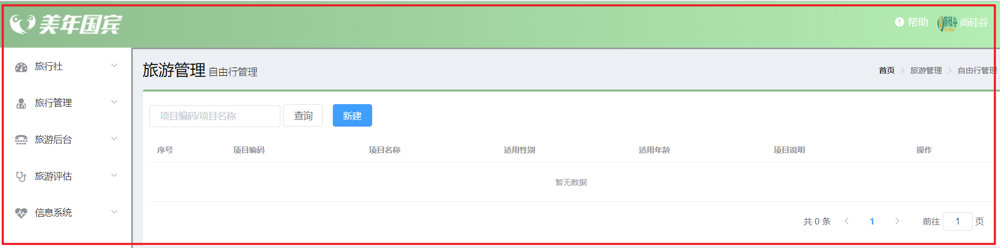 

## 1.3. **接口文档**

新浪开放平台： http://open.weibo.com/wiki/Error_code

微信开放平台： https://developers.weixin.qq.com/doc/offiaccount/Getting_Started/Overview.html

### 【小结】

1：掌握项目的功能介绍

2：项目中的2套系统

PC端管理系统（后台人员），移动端系统（客户）

3：技术架构

* 掌握项目开发技术

4：功能架构

* 掌握项目的业务功能

# 2. **第二章**. 环境搭建

### 【目标】

使用maven搭建系统环境


### 【路径】

0：项目结构

1：父工程 `meinian_parent`

2：子工程 `meinian_common`（工具类）

3：子工程 `meinian_pojo`（实体类）

4：子工程 `meinian_dao`（Dao类）

5：子工程 `meinian_interface`（接口方法，用在dubbo数据调用）

6：子工程 `meinian_service`（Service类）

7：子工程 `meinian_web`（表现层）

8：测试

其中web是war项目，service是war项目，实现服务间的调用

搭建完成之后如下：

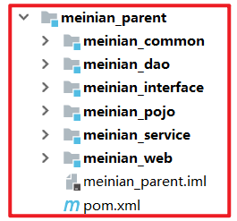

### 【讲解】

## 2.1. **项目结构**

### 2.1.1 分模块构建maven工程分析

在现实生活中，汽车厂家进行汽车生产时，由于整个生产过程非常复杂和繁琐，工作量非常大，所以车场都会将整个汽车的部件分开生产，最终再将生产好的部件进行组装，形成一台完整的汽车。

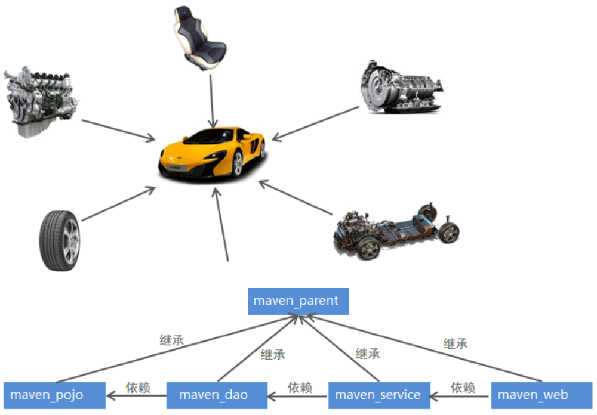

### 2.2.2 maven工程的继承

在Java语言中，类之间是可以继承的，通过继承，子类就可以引用父类中非private的属性和方法。同样，在maven工程之间也可以继承，子工程继承父工程后，就可以使用在父工程中引入的依赖。继承的目的是为了消除重复代码。

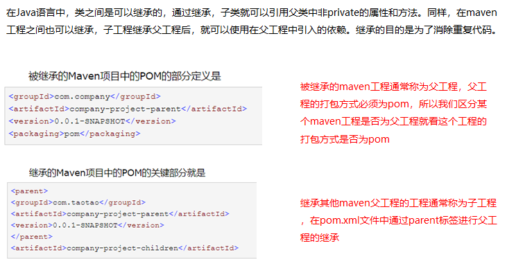


### 2.2.3 项目结构分析

本项目采用maven分模块开发方式，即对整个项目拆分为几个maven工程，每个maven工程存放特定的一类代码，具体如下：

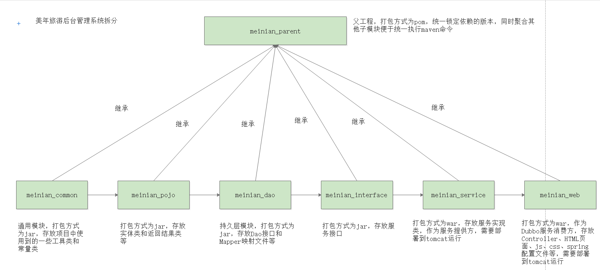 

各模块职责定位：

meinian_parent：父工程，打包方式为pom，统一锁定依赖的版本，同时聚合其他子模块便于统一执行maven命令

meinian_common：通用模块，打包方式为jar，存放项目中使用到的一些工具类和常量类

meinian_pojo：打包方式为jar，存放实体类和返回结果类等

meinian_dao：持久层模块，打包方式为jar，存放Dao接口和Mapper映射文件等

meinian_interface：打包方式为jar，存放服务接口

meinian_service：Dubbo服务模块，打包方式为war，存放服务实现类，作为服务提供方，需要部署到tomcat运行

meinian_web：打包方式为war，作为Dubbo服务消费方，存放Controller、HTML页面、js、css、spring配置文件等，需要部署到tomcat运行

## 2.2. **maven项目搭建**

通过前面的项目功能架构图可以知道本项目分为美年国宾管理后台和美年国宾管理前台（微信端，本小节我们先搭建管理后台项目

### 2.2.1. **meinian_parent**

【路径】

1：创建工程

2：导入坐标

【讲解】

1：创建meinian_parent，父工程，打包方式为pom，用于统一管理依赖版本

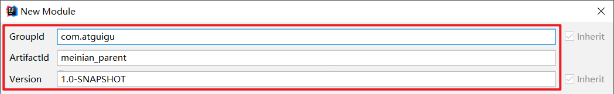 

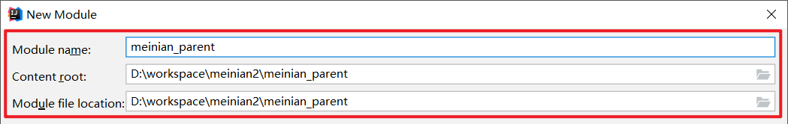

2：pom.xml

```xml
<?xml version="1.0" encoding="UTF-8"?>
<project xmlns="http://maven.apache.org/POM/4.0.0"
         xmlns:xsi="http://www.w3.org/2001/XMLSchema-instance"
         xsi:schemaLocation="http://maven.apache.org/POM/4.0.0 http://maven.apache.org/xsd/maven-4.0.0.xsd">
    <modelVersion>4.0.0</modelVersion>

    <groupId>com.atguigu</groupId>
    <artifactId>meinian_parent</artifactId>
    <version>1.0-SNAPSHOT</version>

    <packaging>pom</packaging>

    <!-- 集中定义依赖版本号 -->
    <properties>
        <junit.version>4.12</junit.version>
        <spring.version>5.0.5.RELEASE</spring.version>
        <pagehelper.version>4.1.4</pagehelper.version>
        <servlet-api.version>2.5</servlet-api.version>
        <dubbo.version>2.6.0</dubbo.version>
        <zookeeper.version>3.4.7</zookeeper.version>
        <zkclient.version>0.1</zkclient.version>
        <mybatis.version>3.4.5</mybatis.version>
        <mybatis.spring.version>1.3.1</mybatis.spring.version>
        <mybatis.paginator.version>1.2.15</mybatis.paginator.version>
        <mysql.version>5.1.32</mysql.version>
        <druid.version>1.0.9</druid.version>
        <commons-fileupload.version>1.3.1</commons-fileupload.version>
        <spring.security.version>5.0.5.RELEASE</spring.security.version>
        <poi.version>3.14</poi.version>
        <jedis.version>2.9.0</jedis.version>
        <quartz.version>2.2.1</quartz.version>
    </properties>
    <!-- 依赖管理标签  必须加 -->
    <dependencyManagement>
        <dependencies>
            <!-- Spring -->
            <dependency>
                <groupId>org.springframework</groupId>
                <artifactId>spring-context</artifactId>
                <version>${spring.version}</version>
            </dependency>
            <dependency>
                <groupId>org.springframework</groupId>
                <artifactId>spring-beans</artifactId>
                <version>${spring.version}</version>
            </dependency>
            <!--springmvc-->
            <dependency>
                <groupId>org.springframework</groupId>
                <artifactId>spring-web</artifactId>
                <version>${spring.version}</version>
            </dependency>
            <dependency>
                <groupId>org.springframework</groupId>
                <artifactId>spring-webmvc</artifactId>
                <version>${spring.version}</version>
            </dependency>
            <dependency>
                <groupId>org.springframework</groupId>
                <artifactId>spring-jdbc</artifactId>
                <version>${spring.version}</version>
            </dependency>
            <dependency>
                <groupId>org.springframework</groupId>
                <artifactId>spring-aspects</artifactId>
                <version>${spring.version}</version>
            </dependency>
            <dependency>
                <groupId>org.springframework</groupId>
                <artifactId>spring-jms</artifactId>
                <version>${spring.version}</version>
            </dependency>
            <dependency>
                <groupId>org.springframework</groupId>
                <artifactId>spring-context-support</artifactId>
                <version>${spring.version}</version>
            </dependency>
            <dependency>
                <groupId>org.springframework</groupId>
                <artifactId>spring-test</artifactId>
                <version>${spring.version}</version>
            </dependency>
            <!-- dubbo相关 -->
            <dependency>
                <groupId>com.alibaba</groupId>
                <artifactId>dubbo</artifactId>
                <version>${dubbo.version}</version>
            </dependency>
            <dependency>
                <groupId>org.apache.zookeeper</groupId>
                <artifactId>zookeeper</artifactId>
                <version>${zookeeper.version}</version>
            </dependency>
            <dependency>
                <groupId>com.github.sgroschupf</groupId>
                <artifactId>zkclient</artifactId>
                <version>${zkclient.version}</version>
            </dependency>
            <dependency>
                <groupId>junit</groupId>
                <artifactId>junit</artifactId>
                <version>4.12</version>
            </dependency>
            <dependency>
                <groupId>com.alibaba</groupId>
                <artifactId>fastjson</artifactId>
                <version>1.2.47</version>
            </dependency>
            <dependency>
                <groupId>javassist</groupId>
                <artifactId>javassist</artifactId>
                <version>3.12.1.GA</version>
            </dependency>
            <dependency>
                <groupId>commons-codec</groupId>
                <artifactId>commons-codec</artifactId>
                <version>1.10</version>
            </dependency>
            <!--mybatis的分页插件-->
            <dependency>
                <groupId>com.github.pagehelper</groupId>
                <artifactId>pagehelper</artifactId>
                <version>${pagehelper.version}</version>
            </dependency>
            <!-- Mybatis -->
            <dependency>
                <groupId>org.mybatis</groupId>
                <artifactId>mybatis</artifactId>
                <version>${mybatis.version}</version>
            </dependency>
            <dependency>
                <groupId>org.mybatis</groupId>
                <artifactId>mybatis-spring</artifactId>
                <version>${mybatis.spring.version}</version>
            </dependency>
            <dependency>
                <groupId>com.github.miemiedev</groupId>
                <artifactId>mybatis-paginator</artifactId>
                <version>${mybatis.paginator.version}</version>
            </dependency>
            <!-- MySql -->
            <dependency>
                <groupId>mysql</groupId>
                <artifactId>mysql-connector-java</artifactId>
                <version>${mysql.version}</version>
            </dependency>
            <!-- 连接池 -->
            <dependency>
                <groupId>com.alibaba</groupId>
                <artifactId>druid</artifactId>
                <version>${druid.version}</version>
            </dependency>
            <!-- 文件上传组件 -->
            <dependency>
                <groupId>commons-fileupload</groupId>
                <artifactId>commons-fileupload</artifactId>
                <version>${commons-fileupload.version}</version>
            </dependency>
            <!--任务调度-->
            <dependency>
                <groupId>org.quartz-scheduler</groupId>
                <artifactId>quartz</artifactId>
                <version>${quartz.version}</version>
            </dependency>
            <dependency>
                <groupId>org.quartz-scheduler</groupId>
                <artifactId>quartz-jobs</artifactId>
                <version>${quartz.version}</version>
            </dependency>
            <dependency>
                <groupId>com.sun.jersey</groupId>
                <artifactId>jersey-client</artifactId>
                <version>1.18.1</version>
            </dependency>
            <!--七牛云服务平台，第三方服务（图片上传）-->
            <dependency>
                <groupId>com.qiniu</groupId>
                <artifactId>qiniu-java-sdk</artifactId>
                <version>7.2.0</version>
            </dependency>
            <!--POI报表（EXCEL）-->
            <dependency>
                <groupId>org.apache.poi</groupId>
                <artifactId>poi</artifactId>
                <version>${poi.version}</version>
            </dependency>
            <dependency>
                <groupId>org.apache.poi</groupId>
                <artifactId>poi-ooxml</artifactId>
                <version>${poi.version}</version>
            </dependency>
            <!--redis-->
            <dependency>
                <groupId>redis.clients</groupId>
                <artifactId>jedis</artifactId>
                <version>${jedis.version}</version>
            </dependency>
            <!-- spring security安全框架 -->
            <dependency>
                <groupId>org.springframework.security</groupId>
                <artifactId>spring-security-web</artifactId>
                <version>${spring.security.version}</version>
            </dependency>
            <dependency>
                <groupId>org.springframework.security</groupId>
                <artifactId>spring-security-config</artifactId>
                <version>${spring.security.version}</version>
            </dependency>
            <dependency>
                <groupId>org.springframework.security</groupId>
                <artifactId>spring-security-taglibs</artifactId>
                <version>${spring.security.version}</version>
            </dependency>
            <dependency>
                <groupId>com.github.penggle</groupId>
                <artifactId>kaptcha</artifactId>
                <version>2.3.2</version>
                <exclusions>
                    <exclusion>
                        <groupId>javax.servlet</groupId>
                        <artifactId>javax.servlet-api</artifactId>
                    </exclusion>
                </exclusions>
            </dependency>
            <dependency>
                <groupId>dom4j</groupId>
                <artifactId>dom4j</artifactId>
                <version>1.6.1</version>
            </dependency>
            <dependency>
                <groupId>xml-apis</groupId>
                <artifactId>xml-apis</artifactId>
                <version>1.4.01</version>
            </dependency>
              <!--阿里云服务器短信平台-->
            <dependency>
                <groupId>com.aliyun</groupId>
                <artifactId>aliyun-java-sdk-core</artifactId>
                <version>3.3.1</version>
            </dependency>
            <dependency>
                <groupId>com.aliyun</groupId>
                <artifactId>aliyun-java-sdk-dysmsapi</artifactId>
                <version>1.0.0</version>
            </dependency>
        </dependencies>
    </dependencyManagement>
    <dependencies>
        <dependency>
            <groupId>javax.servlet</groupId>
            <artifactId>servlet-api</artifactId>
            <version>${servlet-api.version}</version>
            <scope>provided</scope>
        </dependency>
    </dependencies>
    <build>
        <plugins>
            <!-- java编译插件 -->
            <plugin>
                <groupId>org.apache.maven.plugins</groupId>
                <artifactId>maven-compiler-plugin</artifactId>
                <version>3.2</version>
                <configuration>
                    <source>1.8</source>
                    <target>1.8</target>
                    <encoding>UTF-8</encoding>
                </configuration>
            </plugin>
        </plugins>
    </build>

</project>
```

 

### 2.2.2. **meinian_common**

【路径】

1：创建工程

2：导入坐标（继承父工程、导入所有jar包）

【讲解】

1：创建meinian_common，子工程，打包方式为jar，存放通用组件，例如工具类等

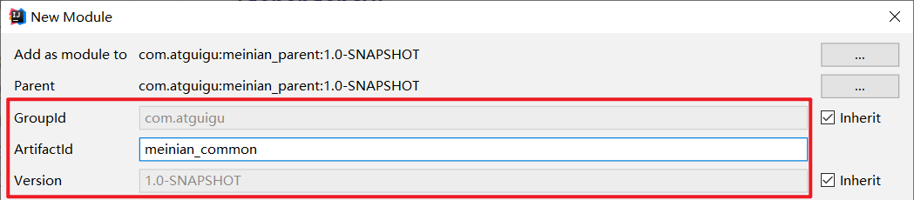 

2：pom.xml

```xml
<?xml version="1.0" encoding="UTF-8"?>
<project xmlns="http://maven.apache.org/POM/4.0.0"
         xmlns:xsi="http://www.w3.org/2001/XMLSchema-instance"
         xsi:schemaLocation="http://maven.apache.org/POM/4.0.0 http://maven.apache.org/xsd/maven-4.0.0.xsd">
    <parent>
        <artifactId>meinian_parent</artifactId>
        <groupId>com.atguigu</groupId>
        <version>1.0-SNAPSHOT</version>
    </parent>
    <modelVersion>4.0.0</modelVersion>

    <artifactId>meinian_common</artifactId>

    <packaging>jar</packaging>

    <dependencies>
         <dependency>
           <groupId>com.aliyun</groupId>
           <artifactId>aliyun-java-sdk-core</artifactId>
       </dependency>
       <dependency>
           <groupId>com.aliyun</groupId>
           <artifactId>aliyun-java-sdk-dysmsapi</artifactId>
       </dependency>
        <dependency>
            <groupId>com.github.pagehelper</groupId>
            <artifactId>pagehelper</artifactId>
        </dependency>
        <!-- Mybatis -->
        <dependency>
            <groupId>org.mybatis</groupId>
            <artifactId>mybatis</artifactId>
        </dependency>
        <dependency>
            <groupId>org.mybatis</groupId>
            <artifactId>mybatis-spring</artifactId>
        </dependency>
        <dependency>
            <groupId>com.github.miemiedev</groupId>
            <artifactId>mybatis-paginator</artifactId>
        </dependency>
        <!-- MySql -->
        <dependency>
            <groupId>mysql</groupId>
            <artifactId>mysql-connector-java</artifactId>
        </dependency>
        <!-- 连接池 -->
        <dependency>
            <groupId>com.alibaba</groupId>
            <artifactId>druid</artifactId>
        </dependency>
        <dependency>
            <groupId>commons-fileupload</groupId>
            <artifactId>commons-fileupload</artifactId>
        </dependency>
        <!-- Spring -->
        <dependency>
            <groupId>org.springframework</groupId>
            <artifactId>spring-context</artifactId>
        </dependency>
        <dependency>
            <groupId>org.springframework</groupId>
            <artifactId>spring-beans</artifactId>
        </dependency>
        <dependency>
            <groupId>org.springframework</groupId>
            <artifactId>spring-web</artifactId>
        </dependency>
        <dependency>
            <groupId>org.springframework</groupId>
            <artifactId>spring-webmvc</artifactId>
        </dependency>
        <dependency>
            <groupId>org.springframework</groupId>
            <artifactId>spring-jdbc</artifactId>
        </dependency>
        <dependency>
            <groupId>org.springframework</groupId>
            <artifactId>spring-aspects</artifactId>
        </dependency>
        <dependency>
            <groupId>org.springframework</groupId>
            <artifactId>spring-jms</artifactId>
        </dependency>
        <dependency>
            <groupId>org.springframework</groupId>
            <artifactId>spring-context-support</artifactId>
        </dependency>
        <dependency>
            <groupId>org.springframework</groupId>
            <artifactId>spring-test</artifactId>
        </dependency>
        <!-- dubbo相关 -->
        <dependency>
            <groupId>com.alibaba</groupId>
            <artifactId>dubbo</artifactId>
        </dependency>
        <dependency>
            <groupId>org.apache.zookeeper</groupId>
            <artifactId>zookeeper</artifactId>
        </dependency>
        <dependency>
            <groupId>com.github.sgroschupf</groupId>
            <artifactId>zkclient</artifactId>
        </dependency>
        <dependency>
            <groupId>junit</groupId>
            <artifactId>junit</artifactId>
        </dependency>
        <dependency>
            <groupId>com.alibaba</groupId>
            <artifactId>fastjson</artifactId>
        </dependency>
        <dependency>
            <groupId>javassist</groupId>
            <artifactId>javassist</artifactId>
        </dependency>
        <dependency>
            <groupId>commons-codec</groupId>
            <artifactId>commons-codec</artifactId>
        </dependency>
        <!--POI报表-->
        <dependency>
            <groupId>org.apache.poi</groupId>
            <artifactId>poi</artifactId>
        </dependency>
        <dependency>
            <groupId>org.apache.poi</groupId>
            <artifactId>poi-ooxml</artifactId>
        </dependency>
        <!--Redis-->
        <dependency>
            <groupId>redis.clients</groupId>
            <artifactId>jedis</artifactId>
        </dependency>
        <!--七牛-->
        <dependency>
            <groupId>com.qiniu</groupId>
            <artifactId>qiniu-java-sdk</artifactId>
        </dependency>
        <dependency>
            <groupId>com.sun.jersey</groupId>
            <artifactId>jersey-client</artifactId>
        </dependency>
        <!--springSecurity-->
        <dependency>
            <groupId>org.springframework.security</groupId>
            <artifactId>spring-security-web</artifactId>
        </dependency>
        <dependency>
            <groupId>org.springframework.security</groupId>
            <artifactId>spring-security-config</artifactId>
        </dependency>
        <dependency>
            <groupId>org.springframework.security</groupId>
            <artifactId>spring-security-taglibs</artifactId>
        </dependency>
        <dependency>
            <groupId>javax.servlet</groupId>
            <artifactId>servlet-api</artifactId>
            <version>2.5</version>
            
        </dependency>
        <dependency>
            <groupId>javax.servlet</groupId>
            <artifactId>jsp-api</artifactId>
            <version>2.0</version>
            
        </dependency>
        <!-- jstl -->
        <dependency>
            <groupId>javax.servlet</groupId>
            <artifactId>jstl</artifactId>
            <version>1.2</version>
        </dependency>
    </dependencies>
</project>
```

 

### 2.2.3. **meinian_pojo**

【路径】

1：创建工程

2：导入坐标（继承父工程、依赖health_common）

【讲解】

1：创建meinian_pojo，子工程，打包方式为jar，存放POJO实体类

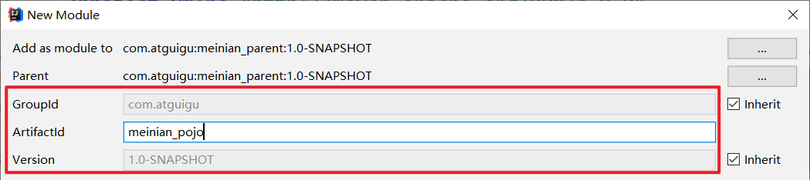 

2：pom.xml

```xml
<?xml version="1.0" encoding="UTF-8"?>
<project xmlns="http://maven.apache.org/POM/4.0.0"
         xmlns:xsi="http://www.w3.org/2001/XMLSchema-instance"
         xsi:schemaLocation="http://maven.apache.org/POM/4.0.0 http://maven.apache.org/xsd/maven-4.0.0.xsd">
    <parent>
        <artifactId>meinian_parent</artifactId>
        <groupId>com.atguigu</groupId>
        <version>1.0-SNAPSHOT</version>
    </parent>
    <modelVersion>4.0.0</modelVersion>

    <artifactId>meinian_pojo</artifactId>

    <packaging>jar</packaging>
    <dependencies>
        <dependency>
            <groupId>com.atguigu</groupId>
            <artifactId>meinian_common</artifactId>
            <version>1.0-SNAPSHOT</version>
        </dependency>
    </dependencies>
</project>
```

 

### 2.2.4. **meinian_dao**

【路径】

1：创建工程

2：导入坐标（继承父工程、依赖meinian_pojo）

3：log4j.properties

4：sqlMapConfig.xml（mybatis的配置文件）

5：applicationContext-dao.xml（spring整合mybatis,配置Druid数据源）

6：接口类（后续添加实体后，再创建）

7：接口类对应的映射文件（后续添加实体后，再创建）

【讲解】

1：创建meinian_dao，子工程，打包方式为jar，存放Dao接口和Mybatis映射文件

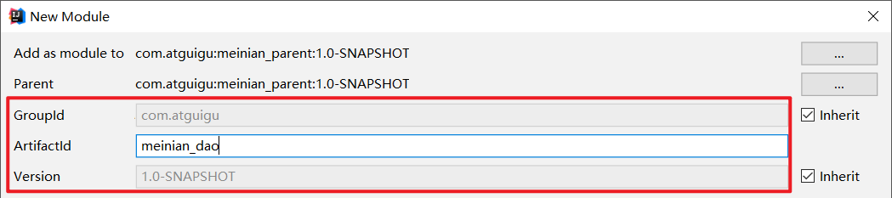 

2：pom.xml

```xml
<?xml version="1.0" encoding="UTF-8"?>
<project xmlns="http://maven.apache.org/POM/4.0.0"
         xmlns:xsi="http://www.w3.org/2001/XMLSchema-instance"
         xsi:schemaLocation="http://maven.apache.org/POM/4.0.0 http://maven.apache.org/xsd/maven-4.0.0.xsd">
    <parent>
        <artifactId>meinian_parent</artifactId>
        <groupId>com.atguigu</groupId>
        <version>1.0-SNAPSHOT</version>
    </parent>
    <modelVersion>4.0.0</modelVersion>

    <artifactId>meinian_dao</artifactId>

    <packaging>jar</packaging>
    
    <dependencies>
        <dependency>
            <groupId>com.atguigu</groupId>
            <artifactId>meinian_pojo</artifactId>
            <version>1.0-SNAPSHOT</version>
        </dependency>
    </dependencies>
</project>
```

 

3：log4j.properties

在 resources 目录下面 新建 `log4j.properties` 日志文件

```properties
### direct log messages to stdout ###
log4j.appender.stdout=org.apache.log4j.ConsoleAppender
log4j.appender.stdout.Target=System.err
log4j.appender.stdout.layout=org.apache.log4j.PatternLayout
log4j.appender.stdout.layout.ConversionPattern=%d{ABSOLUTE} %5p %c{1}:%L - %m%n

### direct messages to file mylog.log ###
log4j.appender.file=org.apache.log4j.FileAppender
log4j.appender.file.File=c:\\mylog.log
log4j.appender.file.layout=org.apache.log4j.PatternLayout
log4j.appender.file.layout.ConversionPattern=%d{ABSOLUTE} %5p %c{1}:%L - %m%n

### set log levels - for more verbose logging change 'info' to 'debug' ###

log4j.rootLogger=debug, stdout
```

 

4：sqlMapConfig.xml

```xml
<?xml version="1.0" encoding="UTF-8" ?>
<!DOCTYPE configuration PUBLIC "-//mybatis.org//DTD Config 3.0//EN"
        "http://mybatis.org/dtd/mybatis-3-config.dtd">
<configuration>
    <plugins>
        <!-- com.github.pagehelper 为 PageHelper 类所在包名 -->
        <plugin interceptor="com.github.pagehelper.PageHelper">
            <!-- 设置数据库类型 Oracle,Mysql,MariaDB,SQLite,Hsqldb,PostgreSQL 六种数据库-->
            <property name="dialect" value="mysql"/>
        </plugin>
    </plugins>
</configuration>
```

分页插件网址：<https://pagehelper.github.io/>

 

5：applicationContext-dao.xml

```xml
<?xml version="1.0" encoding="UTF-8"?>
<beans xmlns="http://www.springframework.org/schema/beans"
       xmlns:context="http://www.springframework.org/schema/context"
       xmlns:p="http://www.springframework.org/schema/p"
       xmlns:aop="http://www.springframework.org/schema/aop"
       xmlns:tx="http://www.springframework.org/schema/tx"
       xmlns:xsi="http://www.w3.org/2001/XMLSchema-instance"
       xsi:schemaLocation="http://www.springframework.org/schema/beans
                     http://www.springframework.org/schema/beans/spring-beans.xsd
                     http://www.springframework.org/schema/context
                     http://www.springframework.org/schema/context/spring-context.xsd
                     http://www.springframework.org/schema/aop
                     http://www.springframework.org/schema/aop/spring-aop.xsd
                     http://www.springframework.org/schema/tx
                     http://www.springframework.org/schema/tx/spring-tx.xsd
                     http://www.springframework.org/schema/util
                     http://www.springframework.org/schema/util/spring-util.xsd">

   <bean id="dataSource"
          class="com.alibaba.druid.pool.DruidDataSource" destroy-method="close">
        <property name="username" value="root" />
        <property name="password" value="root" />
        <property name="driverClassName" value="com.mysql.jdbc.Driver" />
        <property name="url" value="jdbc:mysql://127.0.0.1:3306/meinian?characterEncoding=utf8" />
    </bean>
    <!--spring和mybatis整合的工厂bean-->
    <bean id="sqlSessionFactory" class="org.mybatis.spring.SqlSessionFactoryBean">
        <property name="dataSource" ref="dataSource" />
        <property name="typeAliasesPackage" value="com.atguigu.pojo"></property>
        <property name="configLocation" value="classpath:sqlMapConfig.xml" />
    </bean>
    <!--批量扫描接口生成代理对象-->
    <bean class="org.mybatis.spring.mapper.MapperScannerConfigurer">
        <!--指定接口所在的包-->
        <property name="basePackage" value="com.atguigu.dao" />
    </bean>
</beans>
```


### 2.2.5. **meinian_interface**

【路径】

1：创建工程

2：导入坐标（继承父工程，依赖health_pojo）

【讲解】

1：创建meinian_interface，子工程，打包方式为jar，存放服务接口

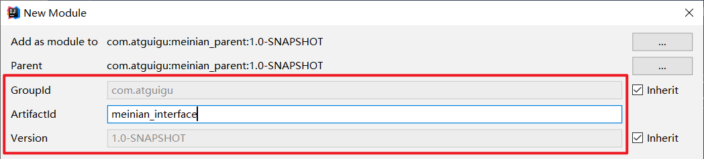 

2：pom.xml

```xml
<?xml version="1.0" encoding="UTF-8"?>
<project xmlns="http://maven.apache.org/POM/4.0.0"
         xmlns:xsi="http://www.w3.org/2001/XMLSchema-instance"
         xsi:schemaLocation="http://maven.apache.org/POM/4.0.0 http://maven.apache.org/xsd/maven-4.0.0.xsd">
   <parent>
        <artifactId>meinian_parent</artifactId>
        <groupId>com.atguigu</groupId>
        <version>1.0-SNAPSHOT</version>
    </parent>
    <modelVersion>4.0.0</modelVersion>

    <artifactId>meinian_interface</artifactId>
    <packaging>jar</packaging>
    
    <dependencies>
        <dependency>
            <groupId>com.atguigu</groupId>
            <artifactId>meinian_pojo</artifactId>
            <version>1.0-SNAPSHOT</version>
        </dependency>
    </dependencies>

</project>
```


### 2.2.6. **meinian_service**

【路径】

1：创建工程

2：导入坐标（继承父工程、依赖meinian_interface、meinian_dao）（war包）

3：log4j.properties

4：applicationContext-tx.xml（spring的声明式事务处理，配置DataSource数据源事务管理器）

5：applicationContext-service.xml（spring整合dubbo，服务提供者）

6：web.xml（spring的监听器，当web容器启动的时候，自动加载spring容器）

【讲解】

1：创建meinian_service，子工程，打包方式为war，作为服务单独部署，存放服务类

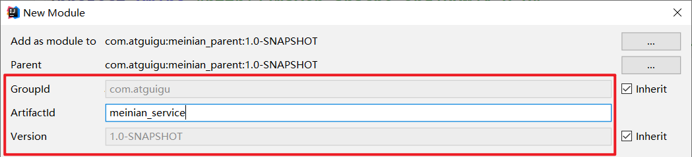 

2：pom.xml

需要设置 `<packaging>war</packaging>`

```xml
<?xml version="1.0" encoding="UTF-8"?>
<project xmlns="http://maven.apache.org/POM/4.0.0"
         xmlns:xsi="http://www.w3.org/2001/XMLSchema-instance"
         xsi:schemaLocation="http://maven.apache.org/POM/4.0.0 http://maven.apache.org/xsd/maven-4.0.0.xsd">
    <parent>
        <artifactId>meinian_parent</artifactId>
        <groupId>com.atguigu</groupId>
        <version>1.0-SNAPSHOT</version>
    </parent>
    <modelVersion>4.0.0</modelVersion>

    <artifactId>meinian_service</artifactId>
    
    <packaging>war</packaging>
    <dependencies>
       <dependency>
            <groupId>com.atguigu</groupId>
            <artifactId>meinian_interface</artifactId>
            <version>1.0-SNAPSHOT</version>
        </dependency>
        <dependency>
            <groupId>com.atguigu</groupId>
            <artifactId>meinian_dao</artifactId>
            <version>1.0-SNAPSHOT</version>
        </dependency>
    </dependencies>
    <build>
        <plugins>
            <plugin>
                <groupId>org.apache.tomcat.maven</groupId>
                <artifactId>tomcat7-maven-plugin</artifactId>
                <configuration>
                    <!-- 指定端口 -->
                    <port>81</port>
                    <!-- 请求路径 -->
                    <path>/</path>
                </configuration>
            </plugin>
        </plugins>
    </build>

</project>
```

 

3：log4j.properties

```properties
### direct log messages to stdout ###
log4j.appender.stdout=org.apache.log4j.ConsoleAppender
log4j.appender.stdout.Target=System.err
log4j.appender.stdout.layout=org.apache.log4j.PatternLayout
log4j.appender.stdout.layout.ConversionPattern=%d{ABSOLUTE} %5p %c{1}:%L - %m%n

### direct messages to file mylog.log ###
log4j.appender.file=org.apache.log4j.FileAppender
log4j.appender.file.File=c:\\mylog.log
log4j.appender.file.layout=org.apache.log4j.PatternLayout
log4j.appender.file.layout.ConversionPattern=%d{ABSOLUTE} %5p %c{1}:%L - %m%n

### set log levels - for more verbose logging change 'info' to 'debug' ###

log4j.rootLogger=debug, stdout
```

 

4：applicationContext-tx.xml

```xml
<?xml version="1.0" encoding="UTF-8"?>
<beans xmlns="http://www.springframework.org/schema/beans"
       xmlns:xsi="http://www.w3.org/2001/XMLSchema-instance"
       xmlns:context="http://www.springframework.org/schema/context"
       xmlns:tx="http://www.springframework.org/schema/tx"
       xmlns:mvc="http://www.springframework.org/schema/mvc"
       xsi:schemaLocation="http://www.springframework.org/schema/beans
                        http://www.springframework.org/schema/beans/spring-beans.xsd
                        http://www.springframework.org/schema/mvc
                        http://www.springframework.org/schema/mvc/spring-mvc.xsd
                        http://www.springframework.org/schema/tx
                        http://www.springframework.org/schema/tx/spring-tx.xsd
                        http://www.springframework.org/schema/context
                        http://www.springframework.org/schema/context/spring-context.xsd">
    <!-- 事务管理器  -->
    <bean id="transactionManager"
          class="org.springframework.jdbc.datasource.DataSourceTransactionManager">
        <property name="dataSource" ref="dataSource"/>
    </bean>
    <!--
        开启事务控制的注解支持
        注意：此处必须加入proxy-target-class="true"，
              需要进行事务控制，会由Spring框架产生代理对象，
              Dubbo需要将Service发布为服务，要求必须使用cglib创建代理对象。
    -->
    <tx:annotation-driven transaction-manager="transactionManager" proxy-target-class="true"/>
</beans>
```

 

5：applicationContext-service.xml

```xml
<?xml version="1.0" encoding="UTF-8"?>
<beans xmlns="http://www.springframework.org/schema/beans"
       xmlns:xsi="http://www.w3.org/2001/XMLSchema-instance"
       xmlns:context="http://www.springframework.org/schema/context"
       xmlns:dubbo="http://code.alibabatech.com/schema/dubbo"
       xmlns:mvc="http://www.springframework.org/schema/mvc"
       xsi:schemaLocation="http://www.springframework.org/schema/beans
                            http://www.springframework.org/schema/beans/spring-beans.xsd
                            http://www.springframework.org/schema/mvc
                            http://www.springframework.org/schema/mvc/spring-mvc.xsd
                            http://code.alibabatech.com/schema/dubbo
                            http://code.alibabatech.com/schema/dubbo/dubbo.xsd
                            http://www.springframework.org/schema/context
                            http://www.springframework.org/schema/context/spring-context.xsd">
    <!-- 指定应用名称 -->
    <dubbo:application name="meinian_service"/>
    <!--指定暴露服务的端口，如果不指定默认为20880-->
    <dubbo:protocol name="dubbo" port="20887"/>
    <!--指定服务注册中心地址-->
    <dubbo:registry address="zookeeper://127.0.0.1:2181"/>
    <!--批量扫描，发布服务-->
    <dubbo:annotation package="com.atguigu.service"/>
</beans>
```

 

6：web.xml

```xml
<?xml version="1.0" encoding="UTF-8"?>
<web-app xmlns:xsi="http://www.w3.org/2001/XMLSchema-instance"
         xmlns="http://java.sun.com/xml/ns/javaee"
         xsi:schemaLocation="http://java.sun.com/xml/ns/javaee http://java.sun.com/xml/ns/javaee/web-app_3_0.xsd"
         id="WebApp_ID" version="3.0">
    
    <!-- 加载spring容器 ，没有*表示当前项目的根路径，有*表示依赖所有项目的根路径-->
    <context-param>
        <param-name>contextConfigLocation</param-name>
        <param-value>classpath*:applicationContext*.xml</param-value>
    </context-param>
    <listener>
        <listener-class>org.springframework.web.context.ContextLoaderListener</listener-class>
    </listener>
</web-app>
```

 

### 2.2.7. **meinian_web**

【路径】

1：创建工程

2：导入坐标（继承父工程、依赖meinian_interface）

3：log4j.properties

4：springmvc.xml（spring整合dubbo，服务消费者；springmvc的配置、上传组件）

5：web.xml（springmvc的核心控制器，当web容器启动的时候，自动加载springmvc.xml）

【讲解】

1：创建meinian_web，子工程，打包方式为war，单独部署，存放Controller

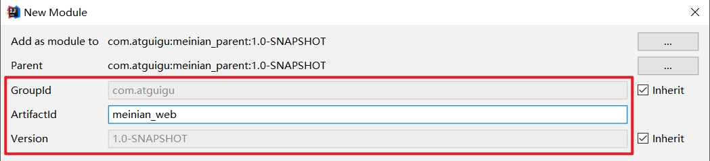 

2：pom.xml

```xml
<?xml version="1.0" encoding="UTF-8"?>
<project xmlns="http://maven.apache.org/POM/4.0.0"
         xmlns:xsi="http://www.w3.org/2001/XMLSchema-instance"
         xsi:schemaLocation="http://maven.apache.org/POM/4.0.0 http://maven.apache.org/xsd/maven-4.0.0.xsd">
    <parent>
        <artifactId>meinian_parent</artifactId>
        <groupId>com.atguigu</groupId>
        <version>1.0-SNAPSHOT</version>
    </parent>
    <modelVersion>4.0.0</modelVersion>

    <artifactId>meinian_web</artifactId>
    
    <packaging>war</packaging>
   <dependencies>
        <dependency>
            <groupId>com.atguigu</groupId>
            <artifactId>meinian_interface</artifactId>
            <version>1.0-SNAPSHOT</version>
        </dependency>
    </dependencies>
    <build>
        <plugins>
            <plugin>
                <groupId>org.apache.tomcat.maven</groupId>
                <artifactId>tomcat7-maven-plugin</artifactId>
                <configuration>
                    <!-- 指定端口 -->
                    <port>82</port>
                    <!-- 请求路径 -->
                    <path>/</path>
                </configuration>
            </plugin>
        </plugins>
    </build>

</project>
```

3：log4j.properties

```properties
### direct log messages to stdout ###
log4j.appender.stdout=org.apache.log4j.ConsoleAppender
log4j.appender.stdout.Target=System.err
log4j.appender.stdout.layout=org.apache.log4j.PatternLayout
log4j.appender.stdout.layout.ConversionPattern=%d{ABSOLUTE} %5p %c{1}:%L - %m%n

### direct messages to file mylog.log ###
log4j.appender.file=org.apache.log4j.FileAppender
log4j.appender.file.File=c:\\mylog.log
log4j.appender.file.layout=org.apache.log4j.PatternLayout
log4j.appender.file.layout.ConversionPattern=%d{ABSOLUTE} %5p %c{1}:%L - %m%n

### set log levels - for more verbose logging change 'info' to 'debug' ###

log4j.rootLogger=info, stdout
```

 

4：springmvc.xml

```xml
<?xml version="1.0" encoding="UTF-8"?>
<beans xmlns="http://www.springframework.org/schema/beans"
       xmlns:xsi="http://www.w3.org/2001/XMLSchema-instance"
       xmlns:context="http://www.springframework.org/schema/context"
       xmlns:dubbo="http://code.alibabatech.com/schema/dubbo"
       xmlns:mvc="http://www.springframework.org/schema/mvc"
       xsi:schemaLocation="http://www.springframework.org/schema/beans
                  http://www.springframework.org/schema/beans/spring-beans.xsd
                  http://www.springframework.org/schema/mvc
                  http://www.springframework.org/schema/mvc/spring-mvc.xsd
                  http://code.alibabatech.com/schema/dubbo
                  http://code.alibabatech.com/schema/dubbo/dubbo.xsd
                  http://www.springframework.org/schema/context
                  http://www.springframework.org/schema/context/spring-context.xsd">
    <mvc:annotation-driven>
        <!-- register-defaults="true"将我们配置文件创建的bean设置为默认的,springmvc就不会再后台创建了 -->
    <!-- 属性解释:
        1.register-defaults=true:告诉Springmvc使用我们配置文件创建的对象,不再自己创建(框架自己创建,是通过无参构造,会使用默认的字符集)
      
     -->

        <mvc:message-converters register-defaults="true">
             <!--项目使用vuejs中的axios异步访问数据，传递json数据，响应json数据-->
            <!--不需要视图解析器，项目中的所有的请求都返回json数据结构-->
         
            <bean class="com.alibaba.fastjson.support.spring.FastJsonHttpMessageConverter">
                <property name="supportedMediaTypes" value="application/json"/>
                <property name="features">
                    <list>
                        <!--Map类型格式化，接收参数允许空值-->
                        <value>WriteMapNullValue</value>
                        <!--日期类型格式化-->
                        <value>WriteDateUseDateFormat</value>
                    </list>
                </property>
            </bean>
        </mvc:message-converters>
    </mvc:annotation-driven>
    <!-- 指定应用名称 -->
    <dubbo:application name="meinian_web" />
    <!--指定服务注册中心地址-->
    <dubbo:registry address="zookeeper://127.0.0.1:2181"/>
    <!--批量扫描-->
    <dubbo:annotation package="com.atguigu.controller" />
    <!--
        超时全局设置 10分钟
        check=false 不检查服务提供方，开发阶段建议设置为false
        check=true 启动时检查服务提供方，如果服务提供方没有启动则报错
    -->
    <dubbo:consumer timeout="600000" check="false"/>
    <!--文件上传组件-->
    <bean id="multipartResolver"
          class="org.springframework.web.multipart.commons.CommonsMultipartResolver">
         <!-- 设定文件上传的最大值为100MB，10*1024*1024 -->
        <property name="maxUploadSize" value="104857600" />
         <!-- 设定文件上传时写入内存的最大值，如果小于这个参数不会生成临时文件，默认为10240 -->
        <property name="maxInMemorySize" value="4096" />
        <!-- 设定默认编码 -->
        <property name="defaultEncoding" value="UTF-8"/>
    </bean>
</beans>
```

FastJsonHttpMessageConverter配置定义了 @ResponseBody 支持的返回类型， json对空键值的处理方式 和 统一的日期返回格式（格式：yyyy-MM-dd）

5：web.xml

```xml
<?xml version="1.0" encoding="UTF-8"?>
<web-app xmlns:xsi="http://www.w3.org/2001/XMLSchema-instance"
         xmlns="http://java.sun.com/xml/ns/javaee"
         xsi:schemaLocation="http://java.sun.com/xml/ns/javaee http://java.sun.com/xml/ns/javaee/web-app_3_0.xsd"
         id="WebApp_ID" version="3.0">
  
    <!-- 解决post乱码
 Spring里的字符过滤器CharacterEncodingFilter是针对请求的，forceEncoding=true是意思是指无论客户端请求是否包含了编码，都用过滤器里的编码来解析请求 .-->
    <filter>
        <filter-name>CharacterEncodingFilter</filter-name>
        <filter-class>org.springframework.web.filter.CharacterEncodingFilter</filter-class>
        <init-param>
            <param-name>encoding</param-name>
            <param-value>utf-8</param-value>
        </init-param>
        <init-param>
            <param-name>forceEncoding</param-name>
            <param-value>true</param-value>
        </init-param>
    </filter>
    <filter-mapping>
        <filter-name>CharacterEncodingFilter</filter-name>
        <url-pattern>/*</url-pattern>
    </filter-mapping>
    <servlet>
        <servlet-name>springmvc</servlet-name>
        <servlet-class>org.springframework.web.servlet.DispatcherServlet</servlet-class>
        <!-- 指定加载的配置文件 ，通过参数contextConfigLocation加载 -->
        <init-param>
            <param-name>contextConfigLocation</param-name>
            <param-value>classpath:springmvc.xml</param-value>
        </init-param>
        <load-on-startup>1</load-on-startup>
    </servlet>
    <servlet-mapping>
        <servlet-name>springmvc</servlet-name>
        <url-pattern>*.do</url-pattern>
    </servlet-mapping>
</web-app>
```

 这里，我们使用 `<url-pattern>*.do</url-pattern>` 的方式，表示只拦截.do结尾的url。


 

### 2.2.8. **测试**

拷贝zookeeper-3.4.5.tar.gz

 

我们可以不发布到linux上，放置到window上也是可以的。可以放置到D盘sortware上，避免出现中文。

解压

 

第1步：创建data 文件夹

第2步：修改conf下的zoo_simple.cfg文件，改名为zoo.cfg

第3步：配置zoo.cfg

 

第4步：启动Zookeeper后，然后启动 `meinian_service`和 `meinian_web`

运行程序报错

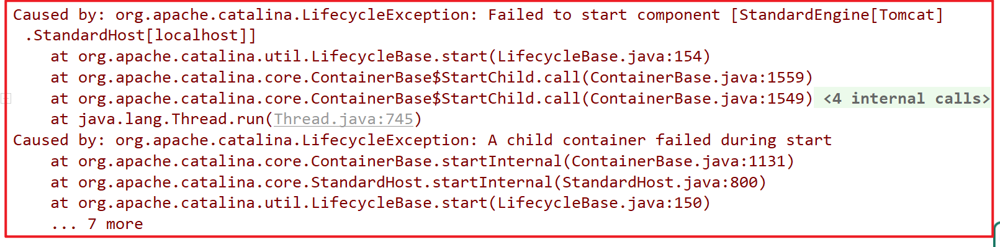


### 【小结】

0：项目结构

1：父工程meinian_parent

2：子工程meinian_common（工具类）

3：子工程meinian_pojo（实体类）

4：子工程meinian_dao（Dao类）

5：子工程meinian_interface（接口方法，用在dubbo数据调用）

6：子工程meinian_service（Service类）

7：子工程meinian_web（表现层）

8：测试

# 3. **第三章**. Vue.JS

参考vue.js讲义


# 4. **第四章**. ElementUI

### 【目标】

ElementUI介绍，及学习和使用方法

### 【路径】

1：ElementUI介绍

2：常用组件

（1）Container布局容器（用于页面布局）

（2）Dropdown下拉菜单（用于首页退出菜单）

（3）NavMenu导航菜单（用于左侧菜单）

（4）Tabel表格（用于列表展示）

（5）Pagination分页（用于列表分页展示）

（6）Message消息提示（用于保存、修改、删除的时候成功或失败提示）

（7）Tabs标签页（用于一个页面多个业务功能）

（8）Form表单（新增、修改时的表单，及表单验证）

### 【讲解】

## 4.1. **ElementUI介绍**

ElementUI是一套基于VUE2.0的桌面端组件库，ElementUI提供了丰富的组件帮助开发人员快速构建功能强大、风格统一的页面。

官网地址：[http://element-cn.eleme.io/#/zh-CN](#/zh-CN)

美年旅游项目后台系统就是使用ElementUI来构建页面，在页面上引入 js 和 css 文件即可开始使用，如下：

```html
<!-- 引入ElementUI样式 -->
<link rel="stylesheet" href="https://unpkg.com/element-ui/lib/theme-chalk/index.css">
<script src="https://unpkg.com/vue/dist/vue.js"></script>
<!-- 引入ElementUI组件库 -->
<script src="https://unpkg.com/element-ui/lib/index.js"></script>
```

入门案例：

```html
<!DOCTYPE html>
<html>
	<head>
	  <meta charset="UTF-8">
	  <!-- import CSS -->
	  <link rel="stylesheet" href="https://unpkg.com/element-ui/lib/theme-chalk/index.css">
	</head>
	
	<body>
	  <div id="app">
	    <el-button @click="fun">Button</el-button>
	    <el-dialog :visible.sync="visible" title="Hello world">
	      <p>尚硅谷</p>
	    </el-dialog>
	  </div>
	</body>

	  <!-- import Vue before Element -->
	  <script src="https://unpkg.com/vue/dist/vue.js"></script>
	  <!-- import JavaScript -->
	  <script src="https://unpkg.com/element-ui/lib/index.js"></script>
	  
	  <script>
	    new Vue({
	      el: '#app',
	      data: {
	        visible: false 
	      },
	      methods:{
	      	 fun:function(){
	      	 	this.visible = true
	      	 }
	      	 
	      }
	    })
	  </script>
  
</html>
```


## 4.2. **常用组件**


### 4.2.1. **Container 布局容器**

用于布局的容器组件，方便快速搭建页面的基本结构：

 

`<el-container>`：外层容器。当子元素中包含 `<el-header>` 或 `<el-footer>` 时，全部子元素会垂直上下排列，否则会水平左右排列

`<el-header>`：顶栏容器

`<el-aside>`：侧边栏容器

`<el-main>`：主要区域容器

`<el-footer>`：底栏容器

```html
<!DOCTYPE html>
<html lang="en">
<head>
    <meta charset="UTF-8">
    <title>Title</title>
</head>
<!-- 引入ElementUI样式 -->
<link rel="stylesheet" href="https://unpkg.com/element-ui/lib/theme-chalk/index.css">
<script src="https://unpkg.com/vue/dist/vue.js"></script>
<!-- 引入ElementUI组件库 -->
<script src="https://unpkg.com/element-ui/lib/index.js"></script>
<style>
    .el-header, .el-footer {
        background-color: #B3C0D1;
        color: #333;
        text-align: center;
        line-height: 60px;
    }

    .el-aside {
        background-color: #D3DCE6;
        color: #333;
        text-align: center;
        line-height: 200px;
    }

    .el-main {
        background-color: #E9EEF3;
        color: #333;
        text-align: center;
        line-height: 160px;
    }

    body > .el-container {
        margin-bottom: 40px;
    }

    .el-container:nth-child(5) .el-aside,
    .el-container:nth-child(6) .el-aside {
        line-height: 260px;
    }

    .el-container:nth-child(7) .el-aside {
        line-height: 320px;
    }
</style>
<body>
    <div id="app">
        <el-container>
            <el-header>
                标题
            </el-header>
            <el-container>
                <el-aside width="200px">
                    菜单
                </el-aside>
                <el-container>
                    <el-main>
                        功能区域
                    </el-main>
                    <el-footer>
                        底部
                    </el-footer>
                </el-container>
            </el-container>
        </el-container>
    </div>
</body>
</html>
<script>
    new Vue({
        el:"#app"
    })
</script>
```

 

### 4.2.2. **Dropdown 下拉菜单**

将动作或菜单折叠到下拉菜单中。

- 方式一：hover激活事件


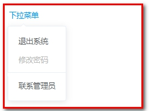 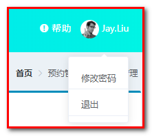

```html
<!DOCTYPE html>
<html lang="en">
<head>
    <meta charset="UTF-8">
    <title>Title</title>
</head>
<!-- 引入ElementUI样式 -->
<link rel="stylesheet" href="https://unpkg.com/element-ui/lib/theme-chalk/index.css">
<script src="https://unpkg.com/vue/dist/vue.js"></script>
<!-- 引入ElementUI组件库 -->
<script src="https://unpkg.com/element-ui/lib/index.js"></script>
<style>
    .el-dropdown-link {
        cursor: pointer;
        color: #409EFF;
    }
    .el-icon-arrow-down {
        font-size: 12px;
    }
</style>
<body>
    <div id="app">
        <el-dropdown>
            <span class="el-dropdown-link">
               下拉菜单<i class="el-icon-arrow-down el-icon--right"></i>
            </span>
            <el-dropdown-menu slot="dropdown">
                <el-dropdown-item>退出系统</el-dropdown-item>
                <el-dropdown-item disabled>修改密码</el-dropdown-item>
                <el-dropdown-item divided>联系管理员</el-dropdown-item>
            </el-dropdown-menu>
        </el-dropdown>
    </div>
</body>
</html>
<script>
    new Vue({
        el:"#app"
    })
</script>
```

 

- 方式二：click点击事件


 

```html
<el-dropdown trigger="click">
    <span class="el-dropdown-link">
       下拉菜单<i class="el-icon-arrow-down el-icon--right"></i>
    </span>
    <el-dropdown-menu slot="dropdown">
        <el-dropdown-item>退出系统</el-dropdown-item>
        <el-dropdown-item disabled>修改密码</el-dropdown-item>
        <el-dropdown-item divided>联系管理员</el-dropdown-item>
    </el-dropdown-menu>
</el-dropdown>
```

添加：trigger="click"

- 方式三：按钮下拉菜单


 

```html
<el-dropdown split-button trigger="click">
    <span class="el-dropdown-link">
       下拉菜单<!--<i class="el-icon-arrow-down el-icon--right"></i>-->
    </span>
    <el-dropdown-menu slot="dropdown">
        <el-dropdown-item>退出系统</el-dropdown-item>
        <el-dropdown-item disabled>修改密码</el-dropdown-item>
        <el-dropdown-item divided>联系管理员</el-dropdown-item>
    </el-dropdown-menu>
</el-dropdown>
```

添加：split-button trigger="click"

### 4.2.3. **NavMenu 导航菜单**

为网站提供导航功能的菜单。

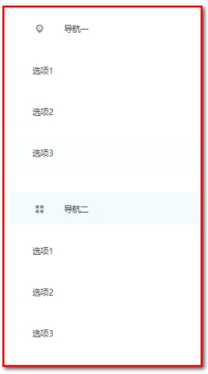 

```html
<!DOCTYPE html>
<html lang="en">
<head>
    <meta charset="UTF-8">
    <title>Title</title>
</head>
<!-- 引入ElementUI样式 -->
<link rel="stylesheet" href="https://unpkg.com/element-ui/lib/theme-chalk/index.css">
<script src="https://unpkg.com/vue/dist/vue.js"></script>
<!-- 引入ElementUI组件库 -->
<script src="https://unpkg.com/element-ui/lib/index.js"></script>

<body>
    <div id="app">
        <el-menu>
             <el-submenu index="1">
               <template slot="title">
                 <i class="el-icon-location"></i>
                 <span slot="title">导航一</span>
               </template>
               <el-menu-item>选项1</el-menu-item>
               <el-menu-item>选项2</el-menu-item>
               <el-menu-item>选项3</el-menu-item>
             </el-submenu>
             <el-submenu index="2">
               <template slot="title">
                 <i class="el-icon-menu"></i>
                 <span slot="title">导航二</span>
               </template>
               <el-menu-item>选项1</el-menu-item>
               <el-menu-item>选项2</el-menu-item>
               <el-menu-item>选项3</el-menu-item>
             </el-submenu>
        </el-menu>
    </div>
</body>
</html>
<script>
    new Vue({
        el:"#app"
    })
</script>
```

 

### 4.2.4. **Table 表格**

 

用于展示多条结构类似的数据，可对数据进行排序、筛选、对比或其他自定义操作。

```html
<!DOCTYPE html>
<html lang="en">
<head>
    <meta charset="UTF-8">
    <title>Title</title>
</head>
<!-- 引入ElementUI样式 -->
<link rel="stylesheet" href="https://unpkg.com/element-ui/lib/theme-chalk/index.css">
<script src="https://unpkg.com/vue/dist/vue.js"></script>
<!-- 引入ElementUI组件库 -->
<script src="https://unpkg.com/element-ui/lib/index.js"></script>

<body>
    <div id="app">
        <el-table :data="tableData" stripe>
             <el-table-column prop="date" label="日期"></el-table-column>
             <el-table-column prop="name" label="姓名"></el-table-column>
             <el-table-column prop="address" label="地址"></el-table-column>
             <el-table-column label="操作" align="center">
               <!--
        slot-scope：作用域插槽，可以获取表格数据
        scope：代表表格数据，可以通过scope.row来获取表格当前行数据，scope不是固定写法
    -->
               <template slot-scope="scope">
                 <el-button type="primary" size="mini" @click="handleUpdate(scope.row)">编辑</el-button>
                 <el-button type="danger" size="mini"  @click="handleDelete(scope.row)">删除</el-button>
               </template>
             </el-table-column>
        </el-table>

    </div>
</body>
</html>
<script>
    new Vue({
        el:'#app',
        data:{
            tableData: [{
                date: '2016-05-02',
                name: '王小虎',
                address: '上海市普陀区金沙江路 1518 弄'
            }, {
                date: '2016-05-04',
                name: '王小虎',
                address: '上海市普陀区金沙江路 1517 弄'
            }, {
                date: '2016-05-01',
                name: '王小虎',
                address: '上海市普陀区金沙江路 1519 弄'
            }]
        },
        methods:{
            handleDelete(row){
                alert(row.date);
            },
            handleUpdate(row){
                alert(row.date);
            }
        }
    });
</script>
```

其中：

```html
handleDelete(row){
	alert(row.date);
},
handleUpdate(row){
    alert(row.date);
}
```

为ES6的语法

修改:


 

### 4.2.5. **Pagination 分页**

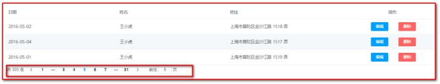 

当数据量过多时，使用分页分解数据。

```html
<!DOCTYPE html>
<html lang="en">
<head>
    <meta charset="UTF-8">
    <title>Title</title>
</head>
<!-- 引入ElementUI样式 -->
<link rel="stylesheet" href="https://unpkg.com/element-ui/lib/theme-chalk/index.css">
<script src="https://unpkg.com/vue/dist/vue.js"></script>
<!-- 引入ElementUI组件库 -->
<script src="https://unpkg.com/element-ui/lib/index.js"></script>

<body>
    <div id="app">
        <el-table :data="tableData" stripe>
             <el-table-column prop="date" label="日期"></el-table-column>
             <el-table-column prop="name" label="姓名"></el-table-column>
             <el-table-column prop="address" label="地址"></el-table-column>
             <el-table-column label="操作" align="center">
               <!--
        slot-scope：作用域插槽，可以获取表格数据
        scope：代表表格数据，可以通过scope.row来获取表格当前行数据，scope不是固定写法
    -->
               <template slot-scope="scope">
                 <el-button type="primary" size="mini" @click="handleUpdate(scope.row)">编辑</el-button>
                 <el-button type="danger" size="mini"  @click="handleDelete(scope.row)">删除</el-button>
               </template>
             </el-table-column>
        </el-table>
        <el-pagination @current-change="handleCurrentChange"
                       current-page="5"
                       page-size="10"
                       layout="total, prev, pager, next, jumper"
                       :total="305">
        </el-pagination>
    </div>
</body>
</html>
<script>
    new Vue({
        el:'#app',
        data:{
            tableData: [{
                date: '2016-05-02',
                name: '王小虎',
                address: '上海市普陀区金沙江路 1518 弄'
            }, {
                date: '2016-05-04',
                name: '王小虎',
                address: '上海市普陀区金沙江路 1517 弄'
            }, {
                date: '2016-05-01',
                name: '王小虎',
                address: '上海市普陀区金沙江路 1519 弄'
            }]
        },
        methods:{
            handleDelete:function(row){
                alert(row.date);
            },
            handleUpdate:function(row){
                alert(row.date);
            },
            handleCurrentChange(page){
                alert(page);
            }
        }
    });
</script>
```

 

### 4.2.6. **Message 消息提示**

常用于主动操作后的反馈提示。

 

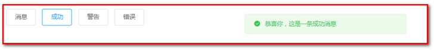 

 

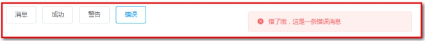 

```html
<!DOCTYPE html>
<html lang="en">
<head>
    <meta charset="UTF-8">
    <title>Title</title>
</head>
<!-- 引入ElementUI样式 -->
<link rel="stylesheet" href="https://unpkg.com/element-ui/lib/theme-chalk/index.css">
<script src="https://unpkg.com/vue/dist/vue.js"></script>
<!-- 引入ElementUI组件库 -->
<script src="https://unpkg.com/element-ui/lib/index.js"></script>

<body>
    <div id="app">
        <el-button :plain="true" @click="open1">消息</el-button>
        <el-button :plain="true" @click="open2">成功</el-button>
        <el-button :plain="true" @click="open3">警告</el-button>
        <el-button :plain="true" @click="open4">错误</el-button>
    </div>
</body>
</html>
<script>
    new Vue({
        el:'#app',
        data:{

        },
        methods: {
            open1() {
                this.$message('这是一条消息提示');
            },
            open2() {
                this.$message({
                    message: '恭喜你，这是一条成功消息',
                    type: 'success'
                });
            },
            open3() {
                this.$message({
                    message: '警告哦，这是一条警告消息',
                    type: 'warning'
                });
            },
            open4() {
                this.$message.error('错了哦，这是一条错误消息');
            }
        }
    });
</script>
```

 

### 4.2.7. **Tabs 标签页**

分隔内容上有关联但属于不同类别的数据集合。

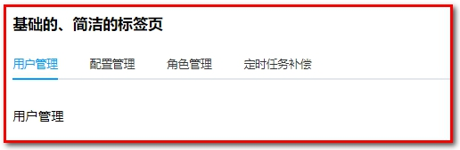 

 

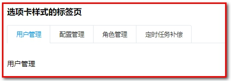 

 

 

```html
<!DOCTYPE html>
<html lang="en">
<head>
    <meta charset="UTF-8">
    <title>Title</title>
</head>
<!-- 引入ElementUI样式 -->
<link rel="stylesheet" href="https://unpkg.com/element-ui/lib/theme-chalk/index.css">
<script src="https://unpkg.com/vue/dist/vue.js"></script>
<!-- 引入ElementUI组件库 -->
<script src="https://unpkg.com/element-ui/lib/index.js"></script>

<body>
    <div id="app">
        <h3>基础的、简洁的标签页</h3>
        <!--
            通过value属性来指定当前选中的标签页
        -->
        <el-tabs value="first">
             <el-tab-pane label="用户管理" name="first">用户管理</el-tab-pane>
             <el-tab-pane label="配置管理" name="second">配置管理</el-tab-pane>
             <el-tab-pane label="角色管理" name="third">角色管理</el-tab-pane>
             <el-tab-pane label="定时任务补偿" name="fourth">定时任务补偿</el-tab-pane>
        </el-tabs>
        <h3>选项卡样式的标签页</h3>
        <el-tabs value="first" type="card">
             <el-tab-pane label="用户管理" name="first">用户管理</el-tab-pane>
             <el-tab-pane label="配置管理" name="second">配置管理</el-tab-pane>
             <el-tab-pane label="角色管理" name="third">角色管理</el-tab-pane>
             <el-tab-pane label="定时任务补偿" name="fourth">定时任务补偿</el-tab-pane>
        </el-tabs>
        <h3>卡片化的标签页</h3>
        <el-tabs value="first" type="border-card">
             <el-tab-pane label="用户管理" name="first">用户管理</el-tab-pane>
             <el-tab-pane label="配置管理" name="second">配置管理</el-tab-pane>
             <el-tab-pane label="角色管理" name="third">角色管理</el-tab-pane>
             <el-tab-pane label="定时任务补偿" name="fourth">定时任务补偿</el-tab-pane>
        </el-tabs>
    </div>
</body>
</html>
<script>
    new Vue({
        el:'#app'
    });
</script>
```

 

### 4.2.8. **Form 表单**

由输入框、选择器、单选框、多选框等控件组成，用以收集、校验、提交数据。在 Form 组件中，每一个表单域由一个 Form-Item 组件构成，表单域中可以放置各种类型的表单控件，包括 Input、Select、Checkbox、Radio、Switch、DatePicker、TimePicker。

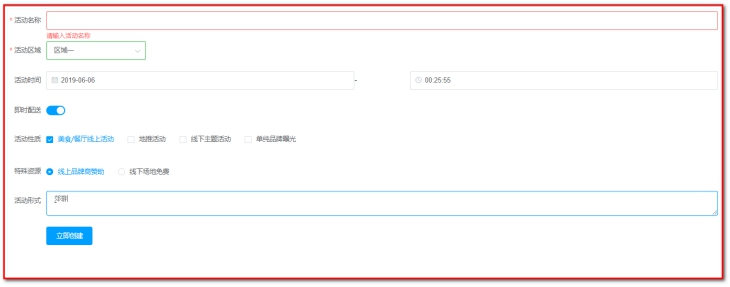 

```html
<!DOCTYPE html>
<html lang="en">
<head>
    <meta charset="UTF-8">
    <title>Title</title>
</head>
<!-- 引入ElementUI样式 -->
<link rel="stylesheet" href="https://unpkg.com/element-ui/lib/theme-chalk/index.css">
<script src="https://unpkg.com/vue/dist/vue.js"></script>
<!-- 引入ElementUI组件库 -->
<script src="https://unpkg.com/element-ui/lib/index.js"></script>

<body>
    <div id="app">
        <!--
   rules：表单验证规则
-->
        <el-form ref="form" :model="form" :rules="rules" label-width="80px">
            <!--
                prop：表单域 model 字段，在使用 validate、resetFields 方法的情况下，该属性是必填的
            -->
            <el-form-item label="活动名称" prop="name">
                <el-input v-model="form.name"></el-input>
            </el-form-item>
            <el-form-item label="活动区域" prop="region">
                <el-select v-model="form.region" placeholder="请选择活动区域">
                    <el-option label="区域一" value="shanghai"></el-option>
                    <el-option label="区域二" value="beijing"></el-option>
                </el-select>
            </el-form-item>
            <el-form-item label="活动时间">
                <el-col :span="11">
                    <el-date-picker type="date" placeholder="选择日期" v-model="form.date1" style="width: 100%;"></el-date-picker>
                </el-col>
                <el-col class="line" :span="2">-</el-col>
                <el-col :span="11">
                    <el-time-picker type="fixed-time" placeholder="选择时间" v-model="form.date2" style="width: 100%;"></el-time-picker>
                </el-col>
            </el-form-item>
            <el-form-item label="即时配送">
                <el-switch v-model="form.delivery"></el-switch>
            </el-form-item>
            <el-form-item label="活动性质">
                <el-checkbox-group v-model="form.type">
                    <el-checkbox label="美食/餐厅线上活动" name="type"></el-checkbox>
                    <el-checkbox label="地推活动" name="type"></el-checkbox>
                    <el-checkbox label="线下主题活动" name="type"></el-checkbox>
                    <el-checkbox label="单纯品牌曝光" name="type"></el-checkbox>
                </el-checkbox-group>
            </el-form-item>
            <el-form-item label="特殊资源">
                <el-radio-group v-model="form.resource">
                    <el-radio label="线上品牌商赞助"></el-radio>
                    <el-radio label="线下场地免费"></el-radio>
                </el-radio-group>
            </el-form-item>
            <el-form-item label="活动形式">
                <el-input type="textarea" v-model="form.desc"></el-input>
            </el-form-item>
            <el-form-item>
                <el-button type="primary" @click="onSubmit('form')">立即创建</el-button>
            </el-form-item>
        </el-form>
    </div>
</body>
</html>
<script>
    new Vue({
        el:'#app',
        data:{
            form: {
                name: '',
                region: '',
                date1: '',
                date2: '',
                delivery: false,
                type: [],
                resource: '',
                desc: ''
            },
            //定义校验规则
            rules: {
                // name对应prop="name"
                name: [
                    { required: true, message: '请输入活动名称', trigger: 'blur' },
                    { min: 3, max: 5, message: '长度在 3 到 5 个字符', trigger: 'blur' }
                ],
                region: [
                    { required: true, message: '请选择活动区域', trigger: 'change' }
                ]
            }
        },
       methods:{
	      	 //validate：对整个表单进行校验的方法，参数为一个回调函数。
                //该回调函数会在校验结束后被调用，并传入两个参数：是否校验成功和未通过校验的字段。
                // $refs['form']对应el-form ref="form"
			 onSubmit(formName) {
			        this.$refs[formName].validate((valid) => {
			          if (valid) {
			            alert('submit!');
			          } else {
			            console.log('error submit!!');
			            return false;
			          }
			        });
			      },
			      resetForm(formName) {
			        this.$refs[formName].resetFields();
			      
			    }
			}
    });
</script>
```

 

作业：

删除的时候，用到

 

实现一个删除的确认

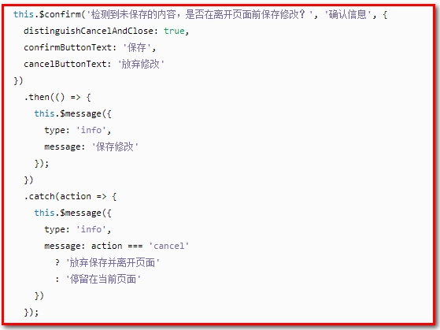 


### 【小结】


1：ElementUI介绍

ElementUI是一套基于VUE2.0的桌面端组件库，ElementUI提供了丰富的组件帮助开发人员快速构建功能强大、风格统一的页面。

2：常用组件

（1）Container布局容器（用于页面布局）

（2）Dropdown下拉菜单（用于首页退出菜单）

（3）NavMenu导航菜单（用于左侧菜单）

（4）Tabel表格（用于列表展示）

（5）Pagination分页（用于列表分页展示）

（6）Message消息提示（用于保存、修改、删除的时候成功或失败提示）

（7）Tabs标签页（用于一个页面多个业务功能）

（8）Form表单（新增、修改时的表单，及表单验证）

【学习方法】

看官网，看案例，根据需求复制、粘贴、改，看效果。


# 5.第五章 IDEA中EnableAuto-Import如何取消

 在idea中创建maven工程后会有pom.xml文件，但在每次修改完pom文件并保存的时候，经常会在idea的右下角提示“Maven projects need to be imported”，同时在该文字的下面一行有两个选项供选择："Import Changes"和“Enable Auto-Import”。入下图所示：

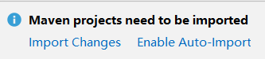

但有时候如果手贱或者手抖，误操作了点击了“Enable Auto-Import”后怎么还原或者取消呢？下面就跟大家介绍一下取消Auto-Import的方法。

File->Settings->Maven->Importing->Import Maven projects automatically

截图如下所示：

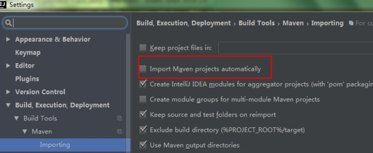