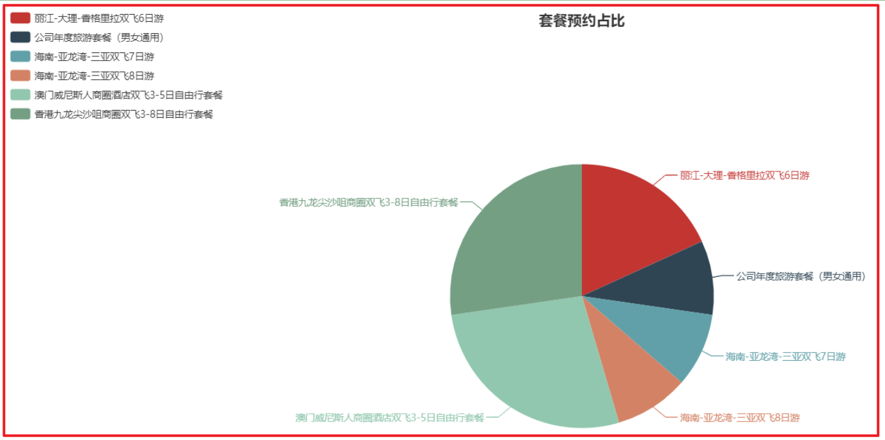
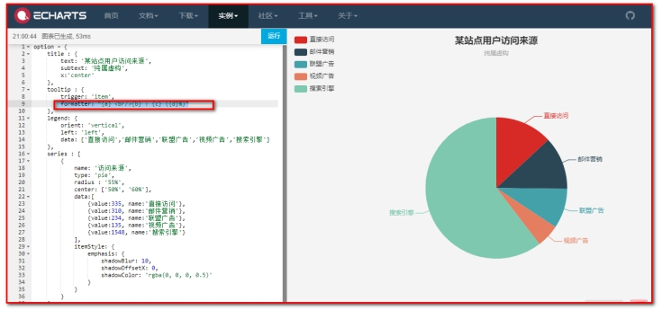
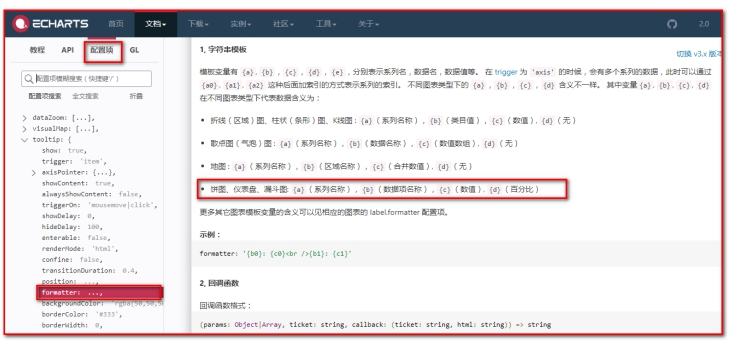
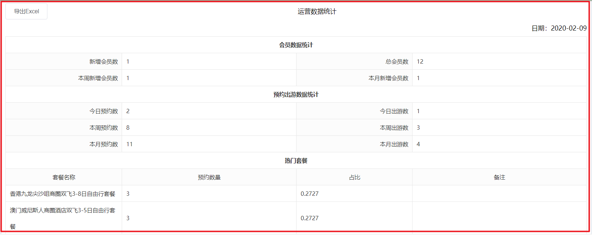
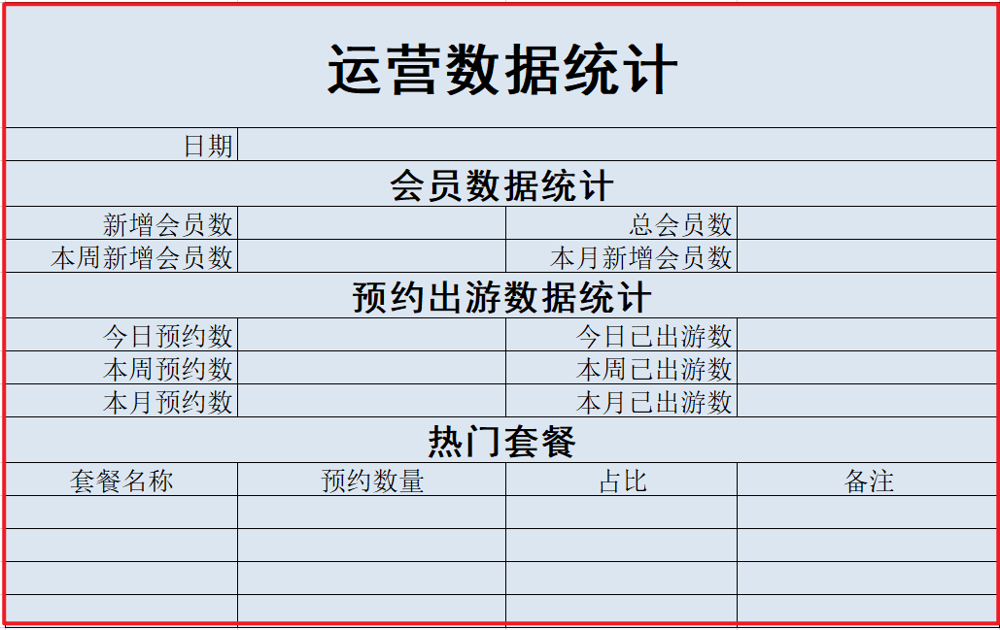
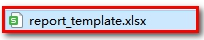
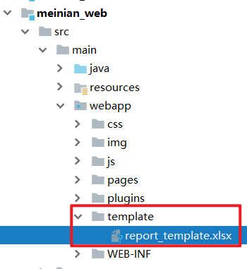

# 图形报表，POI报表

1：掌握Echarts实现套餐预约占比饼形图的实现过程

2：掌握运营数据统计的实现过程

3：掌握运营数据统计报表导出的实现过程

# 1. **套餐预约占比饼形图**

## 1.1. **需求分析**

### 【目标】

会员可以通过移动端自助进行预约，在预约时需要选择预约的旅游套餐。本章节我们需要通过饼形图直观的展示出会员预约的各个套餐占比情况。统计订单中每个套餐的数量，展示效果如下图：



 

### 【路径】

1：前台页面

（1）修改main.html

（2）导入ECharts库

（3）参照官方实例导入饼形图

（4）分析需要构造的数据格式和sql语句

（5）饼图API介绍

2：后台代码

（1）ReportController

（2）SetmealService

（3）SetmealServiceImpl

（4）SetmealDao.java

（5）SetmealDao.xml

### 【讲解】

## 1.2. **前台页面**

套餐预约占比饼形图对应的页面为/pages/report_setmeal.html。


 

### 1.2.1. **修改main.html**

添加 `report_setmeal.html` 的 url

```json
{
    "path": "/5-1",
    "title": "会员数量统计",
    "linkUrl":"report_member.html",
    "children":[]
},
{
    "path": "/5-2",
    "title": "预约套餐占比统计",
    "linkUrl":"report_setmeal.html",
    "children":[]
}
```

 

### 1.2.2. 导入ECharts库

```html
<script src="../js/echarts.js"></script>
```

### 1.2.3. 参照官方实例导入饼形图

```html
<div class="app-container">
    <div class="box">
        <!-- 为 ECharts 准备一个具备大小（宽高）的 DOM -->
        <div id="chart1" style="height:600px;"></div>
    </div>
</div>
```

Js代码：

```js
< script type = "text/javascript" >
    // 基于准备好的dom，初始化echarts实例
    var myChart1 = echarts.init(document.getElementById('chart1'));

// 使用刚指定的配置项和数据显示图表。
//myChart.setOption(option);

axios.get("/report/getSetmealReport.do").then((res) => {
    myChart1.setOption({
        title: {
            text: '套餐预约占比',
            subtext: '',
            x: 'center'
        },
        tooltip: { //提示框组件
            trigger: 'item', //触发类型，在饼形图中为item
            formatter: "{a} <br/>{b} : {c} ({d}%)" //提示内容格式
        },
        legend: {
            orient: 'vertical',
            left: 'left',
            data: res.data.data.setmealNames
        },
        series: [{
            name: '套餐预约占比',
            type: 'pie',
            radius: '55%',
            center: ['50%', '60%'],
            data: res.data.data.setmealCount,
            itemStyle: {
                emphasis: {
                    shadowBlur: 10,
                    shadowOffsetX: 0,
                    shadowColor: 'rgba(0, 0, 0, 0.5)'
                }
            }
        }]
    });
}); <
/script>
```

### 1.2.4 . 分析需要构造的数据格式和sql语句

导入 SQL 订单表 和 套餐表(之前 已经导入)

```sql
DROP TABLE IF EXISTS `t_setmeal`;
CREATE TABLE `t_setmeal` (
  `id` int(11) NOT NULL AUTO_INCREMENT,
  `name` varchar(1000) DEFAULT NULL,
  `code` varchar(8) DEFAULT NULL,
  `helpCode` varchar(16) DEFAULT NULL,
  `sex` char(1) DEFAULT NULL,
  `age` varchar(32) DEFAULT NULL,
  `price` float DEFAULT NULL,
  `remark` varchar(3000) DEFAULT NULL,
  `attention` varchar(128) DEFAULT NULL,
  `img` varchar(128) DEFAULT NULL,
  PRIMARY KEY (`id`)
) ENGINE=InnoDB AUTO_INCREMENT=16 DEFAULT CHARSET=utf8;

-- ----------------------------
-- Records of t_setmeal
-- ----------------------------
INSERT INTO `t_setmeal` VALUES ('12', '公司年度旅游套餐（男女通用）', '0001', 'RZTJ', '0', '18-60', '300', '公司年度旅游套餐', null, 'a5e8e729-74ce-4939-bf36-9cdc02fb2ae51.jpg');
INSERT INTO `t_setmeal` VALUES ('13', '广州长隆酒店+珠海长隆企鹅酒店双飞5日自由行套餐', '0002', 'FHZA', '2', '18-60', '1200', '长隆酒店(广州长隆野生动物世界店)位于广州长隆旅游度假区中心地段，毗邻长隆欢乐世界、长隆水上乐园、长隆野生动物世界、长隆飞鸟乐园和长隆国际大马戏等主题乐园。交通便捷，多条园区穿梭巴往返长隆酒店和各大园区之间。珠海园区、机场快线、香港直通巴汇集其中，广州地铁3号线/7号线让您的度假娱乐更快捷方便。 长隆酒店作为大型的生态主题酒店，主要以热带区域的人文文化风情为主基调。客房的摆设装修以客为主，温馨舒适，并有多种客房和套房类型选择。酒店绿植围绕，种类繁多，动物岛置身于酒店之中，珍稀动物随处可见。 酒店内配套多间风味各异的餐厅，让你足不出户品尝环球美食。酒店配套室外泳池、室内四季恒温泳池、健身房、童趣乐园、康体中心等，都是您商旅或者度假的上佳消遣地方。 国际会展中心更有可容纳3,000人的6,000平方米宴会厅，拥有12米无柱高楼顶，配备LED屏幕，及大型内置8米升降舞台、先进的多媒体视听、通讯系统等商务会议设施。39个不同规格的豪华多功能会议厅。专业的销售、服务团队和完善的会议设施设备随时准备为您提供一流的会议、展览和宴会服务，打造一流的商务会议品牌。', null, 'd7114f3d-35bd-4e52-b0b5-9dfc83d54af72.jpg');
INSERT INTO `t_setmeal` VALUES ('14', '厦门+鼓浪屿双飞5日自由行套餐', '0003', 'YGBM', '0', '55-100', '1400', '鼓浪屿的生活，是慵懒而优雅的，像极了欧洲某个古老的城市，不张扬，却有着致命的吸引力——温柔的阳光，蔚蓝的大海，美妙的琴声，静静矗立的老建筑，悠然自得的猫咪，所有的一切，总让人忍不住想好好的，再谈一场恋爱。 　　所以做了这样的主题，就是想把所谓浪漫，狠狠地，彻底地，进行下去。要华丽，因为青春理应肆意和张扬；要低调，因为在心底，总有一个最柔软最隐秘的角落，是只属于你的。最重要的，是要浪漫。在流淌着音乐的房间里，看点点烛光摇曳，撒在床上的玫瑰花瓣香味隐约扑来，举起手中的红酒杯，两个人，相视无语。cheers. 感谢你们，与我们分享这美好。也但愿我能，一直见证你们的幸福。', null, '1291b1fb-40c2-4558-b102-02e05c4cff6c3.jpg');
INSERT INTO `t_setmeal` VALUES ('15', '云南-昆明-大理-丽江-香格里拉双飞8日游套餐', '0004', 'ZAGD', '0', '14-20', '2400', '今日行程无导游陪同，如您当日抵昆时间较早，可自行将行李寄存在入住酒店（贵重物品请自行保管好）；随后，自由活动（如抵达昆明时间尚早，可自行前往云南师范大学（西南联合大学旧址）、昆明金马碧鸡坊、南屏街、、陆军讲武堂等景点游览、（外出酒店时贵重物品请自行保管好，请到酒店前台带上酒店名片，方便打车回酒店）', null, '68c7c13f-8fc2-46c3-b5d6-f7ec7992dc6e1.jpg');
INSERT INTO `t_setmeal` VALUES ('3', '澳门威尼斯人商圈酒店双飞3-5日自由行套餐', '0001', 'RZTJ', '0', '18-60', '300', '澳门巴黎人是全澳门乃至亚洲的一颗闪耀新星，您可以在此感受“光之城”巴黎的独特艺术气息与迷人魅力。这里有约2千余间法式客房及套房供您选择，还有依照巴黎埃菲尔铁塔1/2比例建造的巴黎铁塔，让您体验独特的浪漫风情。您还可以于170家精品名店享受购物乐趣，或是品尝经典法式美食，欣赏精彩的娱乐表演，畅游水世界、儿童王国等各种娱乐项目，像巴黎人一样体验无处不在的浪漫与惊喜！', null, 'a5e8e729-74ce-4939-bf36-9cdc02fb2ae51.jpg');
INSERT INTO `t_setmeal` VALUES ('4', '香港九龙尖沙咀商圈双飞3-8日自由行套餐', '0001', 'RZTJ', '0', '18-60', '300', '香港九龙珀丽酒店(Rosedale Hotel Kowloon)位于市中心繁华闹市，地处九龙中心地带，毗邻多个购物、娱乐中心；酒店提供班车来往旺角、尖沙嘴和“圆方”购物区，方便宾客出行。 香港九龙珀丽酒店(Rosedale Hotel Kowloon) 设计精巧、新颖独特，拥有精致、高雅的各式客房。酒店客房均配有LED智能电视、iPod/ iPhone 底座，让您尽享便捷、舒适生活。', null, 'a5e8e729-74ce-4939-bf36-9cdc02fb2ae51.jpg');
INSERT INTO `t_setmeal` VALUES ('5', '海南-亚龙湾-三亚双飞7日游', '0001', 'RZTJ', '0', '18-60', '300', '全程由旅游局指定餐厅用餐，严格把控餐饮质量，让您安心享用每一顿饮食，尽情尝特色美食，让味蕾绽放在路上，品味舌尖上的海南 。', null, 'a5e8e729-74ce-4939-bf36-9cdc02fb2ae51.jpg');
INSERT INTO `t_setmeal` VALUES ('6', '丽江-大理-香格里拉双飞6日游', '0001', 'RZTJ', '0', '18-60', '300', '云南地处高原，老年人体温调节功能较差，易受凉感冒，所以衣服要带得够，以便随时增减，行走出汗时，不要马上脱衣敞怀。高原地区昼夜温差大，睡前要盖好被毯，夜间风起雨来时要关好门窗。', null, 'a5e8e729-74ce-4939-bf36-9cdc02fb2ae51.jpg');
INSERT INTO `t_setmeal` VALUES ('7', '海南-亚龙湾-三亚双飞8日游', '0001', 'RZTJ', '0', '18-60', '300', '旅游中要有充足的休息和睡眠，若感到体力不支，可略着休息或减缓旅行。在长时间步行游览时应随时坐下小憩。', null, 'a5e8e729-74ce-4939-bf36-9cdc02fb2ae51.jpg');

DROP TABLE IF EXISTS `t_order`;
CREATE TABLE `t_order` (
  `id` int(11) NOT NULL AUTO_INCREMENT,
  `member_id` int(11) DEFAULT NULL COMMENT '员会id',
  `orderDate` date DEFAULT NULL COMMENT '约预日期',
  `orderType` varchar(8) DEFAULT NULL COMMENT '约预类型 电话预约/微信预约',
  `orderStatus` varchar(8) DEFAULT NULL COMMENT '预约状态（是否旅游）',
  `setmeal_id` int(11) DEFAULT NULL COMMENT '餐套id',
  PRIMARY KEY (`id`),
  KEY `key_member_id` (`member_id`),
  KEY `key_setmeal_id` (`setmeal_id`),
  CONSTRAINT `key_member_id` FOREIGN KEY (`member_id`) REFERENCES `t_member` (`id`),
  CONSTRAINT `key_setmeal_id` FOREIGN KEY (`setmeal_id`) REFERENCES `t_setmeal` (`id`)
) ENGINE=InnoDB AUTO_INCREMENT=18 DEFAULT CHARSET=utf8;

-- ----------------------------
-- Records of t_order
-- ----------------------------
INSERT INTO `t_order` VALUES ('17', '84', '2019-04-28', '微信预约', '已出游', '12');
INSERT INTO `t_order` VALUES ('1', '84', '2019-04-28', '微信预约', '已出游', '3');
INSERT INTO `t_order` VALUES ('2', '84', '2019-04-28', '微信预约', '未出游', '3');
INSERT INTO `t_order` VALUES ('3', '84', '2019-04-28', '微信预约', '未出游', '3');
INSERT INTO `t_order` VALUES ('4', '84', '2019-04-28', '微信预约', '未出游', '4');
INSERT INTO `t_order` VALUES ('5', '84', '2019-04-28', '微信预约', '未出游', '4');
INSERT INTO `t_order` VALUES ('6', '84', '2019-04-28', '微信预约', '未出游', '4');
INSERT INTO `t_order` VALUES ('7', '84', '2019-04-28', '微信预约', '未出游', '5');
INSERT INTO `t_order` VALUES ('8', '84', '2019-04-28', '微信预约', '未出游', '6');
INSERT INTO `t_order` VALUES ('9', '84', '2019-04-28', '微信预约', '未出游', '6');
INSERT INTO `t_order` VALUES ('10', '84', '2019-04-28', '微信预约', '未出游', '7');
```

1：根据饼形图对数据格式的要求，我们发送ajax请求，服务端需要返回如下格式的数据：

```json
{
    "data":{
            "setmealNames":["套餐1","套餐2","套餐3"],
            "setmealCount":[
                            {"name":"套餐1","value":10},
                            {"name":"套餐2","value":30},
                            {"name":"套餐3","value":25}
                           ]
           },
    "flag":true,
    "message":"获取套餐统计数据成功"
}
```

2：组织数据结构：

```java
Map<String,Object>;
map.put(“setmealNames”,List<String>);
map.put(“setmealCount”,List<Map>)

```

3：只需要把List `<Map>` setmealCount查询出来, `setmealNames` 的数据也就有了

注意：sql 语句，我们对某个字段做统计，就应该分组 ，不分组，就是对整个表做统计

```sql
SELECT s.name name,COUNT(o.id) value
        FROM t_setmeal s,t_order o WHERE s.id = o.setmeal_id
        GROUP BY s.name
```

### 1.2.5 . 饼图：API介绍：

第一步：查看图例


 

第二步：查看代码



 

第三步：查看api



 

## 1.3. **后台代码**

### 1.3.1. **Controller**

在 `meinian_web` 工程的 `ReportController` 中提供 `getSetmealReport` 方法

```java
package com.atguigu.controller;

import com.alibaba.dubbo.config.annotation.Reference;
import com.atguigu.constant.MessageConstant;
import com.atguigu.entity.Result;
import com.atguigu.service.MemberService;
import com.atguigu.service.SetmealService;
import org.jboss.netty.util.internal.ReusableIterator;
import org.springframework.test.context.testng.AbstractTestNGSpringContextTests;
import org.springframework.web.bind.annotation.RequestMapping;
import org.springframework.web.bind.annotation.RestController;

import java.text.SimpleDateFormat;
import java.util.*;
import java.util.ArrayList;
import java.util.Calendar;
import java.util.List;

/**
 * ReportController
 *
 * @Author: 马伟奇
 * @CreateTime: 2020-02-06
 * @Description:
 */
@RestController
@RequestMapping("/report")
public class ReportController {

    @Reference
    private MemberService memberService;

    @Reference
    SetmealService setmealService;

    // 统计套餐预约人数占比（饼图）
    @RequestMapping("/getSetmealReport")
    public Result getSetmealReport(){
        /**
         * Result(flag,message,data)
             data = Map<String,Object>
             map
             key                                      value
             setmealNames                List<String>
             setmealCount                List<Map<String,Object>>
             key:value,name
             value:3                     尚硅谷三八节福利套餐
         */
        // 组织套餐名称+套餐名称对应的数据
        List<Map<String,Object>> list =  setmealService.findSetmealCount();

        Map<String, Object> map = new HashMap<>();
        map.put("setmealCount",list);
        // 组织套餐名称集合（格式：List<"尚硅谷三八节福利套餐","尚硅谷旅游套餐">）
        List<String> setmealNames = new ArrayList<>();

        for (Map<String, Object> m : list) {
            String name = (String) m.get("name");
            setmealNames.add(name);
        }

        map.put("setmealNames",setmealNames);

        return new Result(true,MessageConstant.QUERY_SETMEALLIST_SUCCESS,map);

    }
```

### 1.3.2. **服务接口**

在 `SetmealService` 服务接口中扩展方法 `findSetmealCount`

```java
package com.atguigu.service;

import java.util.List;
import java.util.Map;

/**
 * SetmealService
 *
 * @Author: 马伟奇
 * @CreateTime: 2020-02-08
 * @Description:
 */
public interface SetmealService {
    List<Map<String, Object>> findSetmealCount();
}

```

### 1.3.3. **服务实现类**

在 `SetmealServiceImpl` 服务实现类中实现 `findSetmealCount` 方法

```java
package com.atguigu.service.impl;

import com.alibaba.dubbo.config.annotation.Service;
import com.atguigu.dao.SetmealDao;
import com.atguigu.service.SetmealService;
import org.springframework.beans.factory.annotation.Autowired;
import org.springframework.transaction.annotation.Transactional;

import java.util.List;
import java.util.Map;

/**
 * SetmealServiceImpl
 *
 * @Author: 马伟奇
 * @CreateTime: 2020-02-08
 * @Description:
 */
@Service(interfaceClass = SetmealService.class)
@Transactional
public class SetmealServiceImpl implements SetmealService {

    @Autowired
    private SetmealDao setmealDao;

    @Override
    public List<Map<String, Object>> findSetmealCount() {
        return setmealDao.findSetmealCount();
    }
}
```

 

### 1.3.4. **Dao接口**

在 `SetmealDao` 接口中扩展方法 `findSetmealCount`

```java
package com.atguigu.dao;

import java.util.List;
import java.util.Map;

/**
 * SetmealDao
 *
 * @Author: 马伟奇
 * @CreateTime: 2020-02-08
 * @Description:
 */
public interface SetmealDao {

    List<Map<String, Object>> findSetmealCount();
}
```

 

### 1.3.5. **Mapper映射文件**

在 `SetmealDao.xml` 映射文件中提供SQL语句

```xml
<?xml version="1.0" encoding="UTF-8" ?>
<!DOCTYPE mapper PUBLIC "-//mybatis.org//DTD Mapper 3.0//EN"
        "http://mybatis.org/dtd/mybatis-3-mapper.dtd" >
<mapper namespace="com.atguigu.dao.SetmealDao">

    <select id="findSetmealCount" resultType="map">
    select s.name name,count(o.id) value
    from t_setmeal s,t_order o where s.id = o.setmeal_id
    group BY s.name
</select>

</mapper>
```

### 【小结】

核心地方（ECharts图形报表）

1. 分析出数据格式

```json
{
	flag:true,
	message:'成功',
	data:{
		setmealNames:['套餐A','套餐B','套餐C'],
		setmealCount:[
			 {value:1, name:'套餐A'},
			 {value:2, name:'套餐B'},
			 {value:1, name:'套餐C'},
		]
	
	}
}
```

1. 数据封装

```json
data--->Map
setmealNames--->List<String>
setmealCount--->List<Map>
```

2. 数据怎么来

```sql
SELECT s.name name,COUNT(o.id) value
        FROM t_setmeal s,t_order o WHERE s.id = o.setmeal_id
        GROUP BY s.name
```

注意事项

在 `SetmealDao.xml` 映射文件中提供SQL语句

写SQL的返回值的时候，resultType="对象实体", 也可以使用resultType="map"

```xml
<select id="findSetmealCount" resultType="map">
   SELECT s.name name,COUNT(o.id) value
        FROM t_setmeal s,t_order o WHERE s.id = o.setmeal_id
        GROUP BY s.name
</select>
```

# 2. **运营数据统计**

## 2.1. **需求分析**

### 【目标】

通过运营数据统计可以展示出旅游机构的运营情况，包括会员数据、预约已出游数据、热门套餐（前4）等信息。本章节就是要通过一个表格的形式来展示这些运营数据。效果如下图：



 

### 【路径】

1：前台代码

（1）修改main.html

（2）定义数据模型

（3）对应后台sql语句

（4）发送请求获取动态数据

2：后台代码

（1）ReportController.java

（2）ReportService.java

（3）ReportServiceImpl.java

（4）OrderDao.java

​         MemberDao.java

（5）OrderDao.xml

​         MemberDao.xml

### 【讲解】

## 2.2. **前台代码**

运营数据统计对应的页面为/pages/report_business.html。


 

### 2.2.1. **修改main.html**

```json
{
    "path": "/5-1",
    "title": "会员数量统计",
    "linkUrl":"report_member.html",
    "children":[]
},
{
    "path": "/5-2",
    "title": "预约套餐占比统计",
    "linkUrl":"report_setmeal.html",
    "children":[]
},
{
    "path": "/5-3",
    "title": "运营数据统计",
    "linkUrl":"report_business.html",
    "children":[]
}
```

### 2.2.2. **定义模型数据**

（1）：定义数据模型，通过VUE的数据绑定展示数据

```html
<script>
    var vue = new Vue({
        el: '#app',
        data: {
            reportData: {
                reportDate: null,
                todayNewMember: 0,
                totalMember: 0,
                thisWeekNewMember: 0,
                thisMonthNewMember: 0,
                todayOrderNumber: 0,
                todayVisitsNumber: 0,
                thisWeekOrderNumber: 0,
                thisWeekVisitsNumber: 0,
                thisMonthOrderNumber: 0,
                thisMonthVisitsNumber: 0,
                hotSetmeal: [{
                        name: '海南7天6晚游套餐',
                        setmeal_count: 200,
                        proportion: 0.222
                    },
                    {
                        name: '深圳3天2晚游套餐',
                        setmeal_count: 200,
                        proportion: 0.222
                    }
                ]
            }
        }
    })
</script>
```

（2）：数据展示

```html
<div class="app-container">
    <div class="box" style="height: 900px">
        <div class="excelTitle">
            <el-button @click="exportExcel">导出Excel</el-button>运营数据统计
        </div>
        <div class="excelTime">日期：{{reportData.reportDate}}</div>
        <table class="exceTable" cellspacing="0" cellpadding="0">
            <tr>
                <td colspan="4" class="headBody">会员数据统计</td>
            </tr>
            <tr>
                <td width='20%' class="tabletrBg">新增会员数</td>
                <td width='30%'>{{reportData.todayNewMember}}</td>
                <td width='20%' class="tabletrBg">总会员数</td>
                <td width='30%'>{{reportData.totalMember}}</td>
            </tr>
            <tr>
                <td class="tabletrBg">本周新增会员数</td>
                <td>{{reportData.thisWeekNewMember}}</td>
                <td class="tabletrBg">本月新增会员数</td>
                <td>{{reportData.thisMonthNewMember}}</td>
            </tr>
            <tr>
                <td colspan="4" class="headBody">预约出游数据统计</td>
            </tr>
            <tr>
                <td class="tabletrBg">今日预约数</td>
                <td>{{reportData.todayOrderNumber}}</td>
                <td class="tabletrBg">今日出游数</td>
                <td>{{reportData.todayVisitsNumber}}</td>
            </tr>
            <tr>
                <td class="tabletrBg">本周预约数</td>
                <td>{{reportData.thisWeekOrderNumber}}</td>
                <td class="tabletrBg">本周出游数</td>
                <td>{{reportData.thisWeekVisitsNumber}}</td>
            </tr>
            <tr>
                <td class="tabletrBg">本月预约数</td>
                <td>{{reportData.thisMonthOrderNumber}}</td>
                <td class="tabletrBg">本月出游数</td>
                <td>{{reportData.thisMonthVisitsNumber}}</td>
            </tr>
            <tr>
                <td colspan="4" class="headBody">热门套餐</td>
            </tr>
            <tr class="tabletrBg textCenter">
                <td>套餐名称</td>
                <td>预约数量</td>
                <td>占比</td>
                <td>备注</td>
            </tr>
            <tr v-for="s in reportData.hotSetmeal">
                <td>{{s.name}}</td>
                <td>{{s.setmeal_count}}</td>
                <td>{{s.proportion}}</td>
                <td></td>
            </tr>
        </table>
    </div>
</div>
```

### 2.2.3. 对应后台sql语句

```sql
-- 今天新增会员数

-- 总会员数

-- 本周新增会员数(>=本周的周一的日期)

-- 本月新增会员数(>=本月的第一天的日期)

-------------------------------------------------------------------------------
-- 今日预约数

-- 今日已出游数

-- 本周预约数(>=本周的周一的日期 <=本周的周日的日期)  

-- 本周已出游数

-- 本月预约数(>=每月的第一天的日期 <=每月的最后一天的日期)

-- 本月已出游数

-- 热门套餐
```

```sql
-- 今天新增会员数
SELECT COUNT(*) FROM t_member WHERE regTime = '2019-06-26'
-- 总会员数
SELECT COUNT(*) FROM t_member
-- 本周新增会员数(>=本周的周一的日期)
SELECT COUNT(*) FROM t_member WHERE regTime >= '2019-06-24'
-- 本月新增会员数(>=本月的第一天的日期)
SELECT COUNT(*) FROM t_member WHERE regTime >= '2019-06-01'
-------------------------------------------------------------------------------
-- 今日预约数
SELECT COUNT(*) FROM t_order WHERE orderDate = '2019-06-26'
-- 今日已出游数
SELECT COUNT(*) FROM t_order WHERE orderDate = '2019-06-26' AND orderStatus = '已出游'
-- 本周预约数(>=本周的周一的日期 <=本周的周日的日期)  
SELECT COUNT(*) FROM t_order WHERE orderDate between '2019-06-24' and '2019-06-31'  
-- 本周已出游数
SELECT COUNT(*) FROM t_order WHERE orderDate between '2019-06-24' and '2019-06-31' AND orderStatus = '已出游'
-- 本月预约数(>=每月的第一天的日期 <=每月的最后一天的日期)
SELECT COUNT(*) FROM t_order WHERE orderDate between '2019-06-01' and '2019-06-31'
-- 本月已出游数
SELECT COUNT(*) FROM t_order WHERE orderDate between '2019-06-01' and '2019-06-31' AND orderStatus = '已出游'

-- 热门套餐
SELECT s.name, COUNT(o.id) setmeal_count, COUNT(o.id)/(SELECT COUNT(id) FROM t_order ) proportion FROM t_setmeal s, t_order o WHERE s.id = o.setmeal_id
GROUP BY s.name ORDER BY  setmeal_count DESC LIMIT 0,4
```

### 2.2.4. **发送请求获取动态数据**

（1）在VUE的钩子函数中发送ajax请求获取动态数据，通过VUE的数据绑定将数据展示到页面

```html
<script>
    var vue = new Vue({
        el: '#app',
        data: {
            reportData: {
                reportDate: null,
                todayNewMember: 0,
                totalMember: 0,
                thisWeekNewMember: 0,
                thisMonthNewMember: 0,
                todayOrderNumber: 0,
                todayVisitsNumber: 0,
                thisWeekOrderNumber: 0,
                thisWeekVisitsNumber: 0,
                thisMonthOrderNumber: 0,
                thisMonthVisitsNumber: 0,
                hotSetmeal: [{
                        name: '海南7天6晚游套餐',
                        setmeal_count: 200,
                        proportion: 0.222
                    },
                    {
                        name: '深圳3天2晚游套餐',
                        setmeal_count: 200,
                        proportion: 0.222
                    }
                ]
            }
        },
        created() {
            axios.get("/report/getBusinessReportData.do").then((res) => {
                this.reportData = res.data.data;
            });
        }
    })
</script>
```

（2）根据页面对数据格式的要求，我们发送ajax请求，服务端需要返回如下格式的数据：

```json
{
  "data":{
    "todayVisitsNumber":0,
    "reportDate":"2019-04-25",
    "todayNewMember":0,
    "thisWeekVisitsNumber":0,
    "thisMonthNewMember":2,
    "thisWeekNewMember":0,
    "totalMember":10,
    "thisMonthOrderNumber":2,
    "thisMonthVisitsNumber":0,
    "todayOrderNumber":0,
    "thisWeekOrderNumber":0,
    "hotSetmeal":[
      {"proportion":0.4545,"name":"尚硅谷旅游套餐","setmeal_count":5},
      {"proportion":0.1818,"name":"新疆西藏10天10晚旅游套餐","setmeal_count":2},
      {"proportion":0.1818,"name":"乌鲁木齐旅游套餐","setmeal_count":2},
      {"proportion":0.0909,"name":"东北旅游套餐","setmeal_count":1}
    ],
  },
  "flag":true,
  "message":"获取运营统计数据成功"
}
```

## 2.3. **后台代码**

### 2.3.1. **Controller**

在 `ReportController` 中提供 `getBusinessReportData` 方法

```java
package com.atguigu.controller;

import com.alibaba.dubbo.config.annotation.Reference;
import com.atguigu.constant.MessageConstant;
import com.atguigu.entity.Result;
import com.atguigu.service.MemberService;
import com.atguigu.service.ReportService;
import com.atguigu.service.SetmealService;
import org.jboss.netty.util.internal.ReusableIterator;
import org.springframework.test.context.testng.AbstractTestNGSpringContextTests;
import org.springframework.web.bind.annotation.RequestMapping;
import org.springframework.web.bind.annotation.RestController;

import java.text.SimpleDateFormat;
import java.util.*;
import java.util.ArrayList;
import java.util.Calendar;
import java.util.List;

/**
 * ReportController
 *
 * @Author: 马伟奇
 * @CreateTime: 2020-02-06
 * @Description:
 */
@RestController
@RequestMapping("/report")
public class ReportController {

    @Reference
    ReportService reportService;

    // 运营数据统计（页面）
    @RequestMapping(value = "/getBusinessReportData")
    public Result getBusinessReportData(){
        try {
            Map<String,Object> map = reportService.getBusinessReportData();
            // 成功
            return new Result(true, MessageConstant.GET_BUSINESS_REPORT_SUCCESS,map);
        } catch (Exception e) {
            e.printStackTrace();
            // 成功
            return new Result(false, MessageConstant.GET_BUSINESS_REPORT_FAIL);
        }

    }
```

 

### 2.3.2. **服务接口**

在 `meinian_interface` 工程中创建 `ReportService` 服务接口并声明 `getBusinessReport` 方法

```java
public interface ReportService {

    /**
     * 获得运营统计数据
     * Map数据格式：
     *      reportDate（当前时间）--String
     *      todayNewMember（今日新增会员数） -> number
     *      totalMember（总会员数） -> number
     *      thisWeekNewMember（本周新增会员数） -> number
     *      thisMonthNewMember（本月新增会员数） -> number
     *      todayOrderNumber（今日预约数） -> number
     *      todayVisitsNumber（今日出游数） -> number
     *      thisWeekOrderNumber（本周预约数） -> number
     *      thisWeekVisitsNumber（本周出游数） -> number
     *      thisMonthOrderNumber（本月预约数） -> number
     *      thisMonthVisitsNumber（本月出游数） -> number
     *      hotSetmeal（热门套餐（取前4）） -> List<Setmeal>
     */
    public Map<String,Object> getBusinessReport();
}
```

 

### 2.3.3. **服务实现类**

在 `meinian_service` 工程中创建服务实现类 `ReportServiceImpl` 并实现 `ReportService` 接口

```java
package com.atguigu.service.impl;

import com.alibaba.dubbo.config.annotation.Service;
import com.atguigu.dao.MemberDao;
import com.atguigu.dao.OrderDao;
import com.atguigu.service.ReportService;
import com.atguigu.utils.DateUtils;
import org.springframework.beans.factory.annotation.Autowired;
import org.springframework.transaction.annotation.Transactional;

import java.util.HashMap;
import java.util.List;
import java.util.Map;

@Service(interfaceClass = ReportService.class)
@Transactional
public class ReportServiceImpl implements ReportService {

    @Autowired
    OrderDao orderDao;

    @Autowired
    MemberDao memberDao;

    // 运营统计数据
    @Override
    public Map<String, Object> getBusinessReportData() {
        Map<String,Object> map = null;
        try {
            // 日期工具类
            // 1：当前时间
            String today = DateUtils.parseDate2String(DateUtils.getToday());
            // 2：本周（周一）
            String weekMonday = DateUtils.parseDate2String(DateUtils.getThisWeekMonday());
            // 3：本周（周日）
            String weekSunday = DateUtils.parseDate2String(DateUtils.getSundayOfThisWeek());
            // 4：本月（1号）
            String monthFirst = DateUtils.parseDate2String(DateUtils.getFirstDay4ThisMonth());
            // 5：本月（31号）
            String monthLast = DateUtils.parseDate2String(DateUtils.getLastDay4ThisMonth());
            // （1）今日新增会员数
            int todayNewMember = memberDao.getTodayNewMember(today);
            // （2）总会员数
            int totalMember = memberDao.getTotalMember();
            // （3）本周新增会员数
            int thisWeekNewMember = memberDao.getThisWeekAndMonthNewMember(weekMonday);
            // （4）本月新增会员数
            int thisMonthNewMember = memberDao.getThisWeekAndMonthNewMember(monthFirst);
            // （5）今日预约数
            int todayOrderNumber = orderDao.getTodayOrderNumber(today);
            // （6）今日出游数
            int todayVisitsNumber = orderDao.getTodayVisitsNumber(today);
            // （7）本周预约数
            Map<String,Object> paramWeek = new HashMap<String,Object>();
            paramWeek.put("begin",weekMonday);
            paramWeek.put("end",weekSunday);
            int thisWeekOrderNumber = orderDao.getThisWeekAndMonthOrderNumber(paramWeek);
            // （9）本月预约数
            Map<String,Object> paramMonth = new HashMap<String,Object>();
            paramMonth.put("begin",monthFirst);
            paramMonth.put("end",monthLast);
            int thisMonthOrderNumber = orderDao.getThisWeekAndMonthOrderNumber(paramMonth);
            // （8）本周出游数
            Map<String,Object> paramWeekVisit = new HashMap<String,Object>();
            paramWeekVisit.put("begin",weekMonday);
            paramWeekVisit.put("end",weekSunday);
            int thisWeekVisitsNumber = orderDao.getThisWeekAndMonthVisitsNumber(paramWeekVisit);
            // （10）本月出游数
            Map<String,Object> paramMonthVisit = new HashMap<String,Object>();
            paramMonthVisit.put("begin",monthFirst);
            paramMonthVisit.put("end",monthLast);
            int thisMonthVisitsNumber = orderDao.getThisWeekAndMonthVisitsNumber(paramMonthVisit);
            // （11）热门套餐
            List<Map<String,Object>> hotSetmeal = orderDao.findHotSetmeal();

            map = new HashMap<String,Object>();
          /*
                *      reportDate（当前时间）--String
                *      todayNewMember（今日新增会员数） -> number
                *      totalMember（总会员数） -> number
                *      thisWeekNewMember（本周新增会员数） -> number
                *      thisMonthNewMember（本月新增会员数） -> number
                *      todayOrderNumber（今日预约数） -> number
                *      todayVisitsNumber（今日出游数） -> number
                *      thisWeekOrderNumber（本周预约数） -> number
                *      thisWeekVisitsNumber（本周出游数） -> number
                *      thisMonthOrderNumber（本月预约数） -> number
                *      thisMonthVisitsNumber（本月出游数） -> number
                *      hotSetmeal（热门套餐（取前4）） -> List<Setmeal>
                **/
            map.put("reportDate",today);
            map.put("todayNewMember",todayNewMember);
            map.put("totalMember",totalMember);
            map.put("thisWeekNewMember",thisWeekNewMember);
            map.put("thisMonthNewMember",thisMonthNewMember);
            map.put("todayOrderNumber",todayOrderNumber);
            map.put("todayVisitsNumber",todayVisitsNumber);
            map.put("thisWeekOrderNumber",thisWeekOrderNumber);
            map.put("thisWeekVisitsNumber",thisWeekVisitsNumber);
            map.put("thisMonthOrderNumber",thisMonthOrderNumber);
            map.put("thisMonthVisitsNumber",thisMonthVisitsNumber);
            map.put("hotSetmeal",hotSetmeal);
        } catch (Exception e) {
            e.printStackTrace();
        }
        return map;
    }
}
```

 

### 2.3.4. **Dao接口**

在 `OrderDao` 和 `MemberDao` 中声明相关统计查询方法

#### 2.3.4.1. **OrderDao.java**

```java
package com.atguigu.dao;

import com.atguigu.pojo.Order;
import org.springframework.stereotype.Repository;

import java.util.List;
import java.util.Map;

public interface OrderDao {

    int getTodayOrderNumber(String date);

    int getTodayVisitsNumber(String date);

    int getThisWeekAndMonthOrderNumber(Map<String, Object> map);

    int getThisWeekAndMonthVisitsNumber(Map<String, Object> map);

    List<Map<String,Object>> findHotSetmeal();
}

```

 

#### 2.3.4.2. **MemberDao.java**

```java
package com.atguigu.dao;

import java.util.List;
import java.util.Map;

/**
 * MemberDao
 *
 * @Author: 马伟奇
 * @CreateTime: 2020-02-06
 * @Description:
 */
public interface MemberDao {
    public Integer findMemberCountBeforeDate(String date);

    List<Map<String, Object>> findSetmealCount();

    int getTodayNewMember(String date);

    int getTotalMember();

    int getThisWeekAndMonthNewMember(String date);
}

```

 

### 2.3.5. Mapper映射文件

在 `OrderDao.xml` 和 `MemberDao.xml` 中定义SQL语句

#### 2.3.5.1. **OrderDao.xml：**

```xml
<?xml version="1.0" encoding="UTF-8" ?>
<!DOCTYPE mapper PUBLIC "-//mybatis.org//DTD Mapper 3.0//EN"
        "http://mybatis.org/dtd/mybatis-3-mapper.dtd" >
<mapper namespace="com.atguigu.dao.OrderDao">

    <!--今日预约数-->
    <select id="getTodayOrderNumber" parameterType="string" resultType="int">
        SELECT COUNT(id) FROM t_order WHERE orderDate = #{date}
    </select>

    <!--今日已出游数-->
    <select id="getTodayVisitsNumber" parameterType="string" resultType="int">
        SELECT COUNT(id) FROM t_order WHERE orderDate = #{date} AND orderStatus = '已出游'
    </select>

    <!--本周/本月，预约数-->
    <select id="getThisWeekAndMonthOrderNumber" parameterType="map" resultType="int">
        SELECT COUNT(id) FROM t_order WHERE orderDate BETWEEN #{begin} AND  #{end}
    </select>
    <!--本周/本月，已出游数-->
    <select id="getThisWeekAndMonthVisitsNumber" parameterType="map" resultType="int">
        SELECT COUNT(id) FROM t_order WHERE orderDate BETWEEN #{begin} AND  #{end} AND orderStatus = '已出游'
    </select>

    <!--热门套餐-->
    <select id="findHotSetmeal" resultType="map">
        SELECT s.name name,COUNT(o.id) setmeal_count,COUNT(o.id)/(SELECT COUNT(id) FROM t_order) proportion
        FROM t_setmeal s,t_order o WHERE s.id = o.setmeal_id
        GROUP BY s.name
        ORDER BY COUNT(o.id) DESC
        LIMIT 0,4
    </select>

</mapper>
```

 

#### 2.3.5.2. **MemberDao.xml：**

```xml
<?xml version="1.0" encoding="UTF-8" ?>
<!DOCTYPE mapper PUBLIC "-//mybatis.org//DTD Mapper 3.0//EN"
        "http://mybatis.org/dtd/mybatis-3-mapper.dtd" >
<mapper namespace="com.atguigu.dao.MemberDao">

    <!--根据日期统计会员数，统计指定日期之前的会员数
    注意：上午已经实现了这个方法
    -->
    <select id="findMemberCountBeforeDate" parameterType="string" resultType="int">
    select count(id) from t_member where regTime &lt;= #{value}
</select>

    <!--今日新增会员数-->
    <select id="getTodayNewMember" parameterType="string" resultType="int">
        SELECT COUNT(id) FROM t_member WHERE regTime = #{date}
    </select>

    <!--总会员数-->
    <select id="getTotalMember" resultType="int">
        SELECT COUNT(id) FROM t_member
    </select>

    <!--本周/本月新增会员数-->
    <select id="getThisWeekAndMonthNewMember" parameterType="string" resultType="int">
        SELECT COUNT(id) FROM t_member WHERE regTime &gt;= #{date}
    </select>

</mapper>
```

###  【小结】

1. 数据查询的比较多, 数据怎么封装 --->选择Map
2. 数据怎么查询出来

```sql
-- 今天新增会员数
SELECT COUNT(*) FROM t_member WHERE regTime = '2019-06-26'
-- 总会员数
SELECT COUNT(*) FROM t_member
-- 本周新增会员数(>=本周的周一的日期)
SELECT COUNT(*) FROM t_member WHERE regTime >= '2019-06-24'
-- 本月新增会员数(>=本月的第一天的日期)

SELECT COUNT(*) FROM t_member WHERE regTime >= '2019-06-01'

-- 今日预约数
SELECT COUNT(*) FROM t_order WHERE orderDate = '2019-06-26'
-- 今日已出游数
SELECT COUNT(*) FROM t_order WHERE orderDate = '2019-06-26' AND orderStatus = '已出游'
-- 本周预约数(>=本周的周一的日期 <=本周的周日的日期)  
SELECT COUNT(*) FROM t_order WHERE orderDate between '2019-06-24' and '2019-06-31'  
-- 本周已出游数
SELECT COUNT(*) FROM t_order WHERE orderDate between '2019-06-24' and '2019-06-31' AND orderStatus = '已出游'
-- 本月预约数(>=每月的第一天的日期 <=每月的最后一天的日期)
SELECT COUNT(*) FROM t_order WHERE orderDate between '2019-06-01' and '2019-06-31'
-- 本月已出游数
SELECT COUNT(*) FROM t_order WHERE orderDate between '2019-06-01' and '2019-06-31' AND orderStatus = '已出游'

-- 热门套餐
SELECT s.name, COUNT(o.id) setmeal_count, COUNT(o.id)/(SELECT COUNT(id) FROM t_order ) proportion FROM t_setmeal s, t_order o WHERE s.id = o.setmeal_id
GROUP BY s.name ORDER BY  setmeal_count DESC LIMIT 0,4
```

# 3. **运营数据统计报表导出**

## 3.1. **需求分析**

### 【目标】

运营数据统计报表导出就是将统计数据==写入到Excel==并提供给客户端浏览器进行下载，以便机构管理人员对运营数据的查看和存档。

### 【路径】

1：提供模板文件

2：前台代码

在report_business.html页面提供“导出”按钮并绑定事件

3：后台代码

（1）ReportController.java

（2）ReportService.java

（3）ReportServiceImpl.java

### 【讲解】

## 3.2. **提供模板文件**

本章节我们需要将运营统计数据通过POI写入到Excel文件，对应的Excel效果如下：



 

通过上面的Excel效果可以看到，表格比较复杂，涉及到合并单元格、字体、字号、字体加粗、对齐方式等的设置。如果我们通过POI编程的方式来设置这些效果代码会非常繁琐。

在企业实际开发中，对于这种比较复杂的表格导出一般我们会==提前设计一个Excel模板文件==，在这个模板文件中提前将表格的结构和样式设置好，我们的程序只需要读取这个文件并在文件中的相应位置写入具体的值就可以了。

在本章节资料中已经提供了一个名为 `report_template.xlsx` 的模板文件



 

需要将这个文件复制到	 `web_web` 工程中



 

## 3.3. **前台代码**

（1）在report_business.html页面提供“导出”按钮并绑定事件

```html
<div class="excelTitle">
    <el-button @click="exportExcel">导出Excel</el-button>运营数据统计
</div>
```

（2）导出方法

```html
methods:{
exportExcel(){
window.location.href = '/report/exportBusinessReport.do';
}
}
```

 

## 3.4. **后台代码**

在 `ReportController` 中提供 `exportBusinessReport` 方法，基于POI将数据写入到Excel中并通过输出流下载到客户端

```java
/**
 * 导出Excel报表
 * @return
 */
@RequestMapping("/exportBusinessReport")
public Result exportBusinessReport(HttpServletRequest request, HttpServletResponse response){
    try{
        //远程调用报表服务获取报表数据
        Map<String, Object> result = reportService.getBusinessReportData();

        //取出返回结果数据，准备将报表数据写入到Excel文件中
        String reportDate = (String) result.get("reportDate");
        Integer todayNewMember = (Integer) result.get("todayNewMember");
        Integer totalMember = (Integer) result.get("totalMember");
        Integer thisWeekNewMember = (Integer) result.get("thisWeekNewMember");
        Integer thisMonthNewMember = (Integer) result.get("thisMonthNewMember");
        Integer todayOrderNumber = (Integer) result.get("todayOrderNumber");
        Integer thisWeekOrderNumber = (Integer) result.get("thisWeekOrderNumber");
        Integer thisMonthOrderNumber = (Integer) result.get("thisMonthOrderNumber");
        Integer todayVisitsNumber = (Integer) result.get("todayVisitsNumber");
        Integer thisWeekVisitsNumber = (Integer) result.get("thisWeekVisitsNumber");
        Integer thisMonthVisitsNumber = (Integer) result.get("thisMonthVisitsNumber");
        List<Map> hotSetmeal = (List<Map>) result.get("hotSetmeal");

        //获得Excel模板文件绝对路径
        //file.separator这个代表系统目录中的间隔符，说白了就是斜线，不过有时候需要双线，有时候是单线，你用这个静态变量就解决兼容问题了。
        String temlateRealPath = request.getSession().getServletContext().getRealPath("template") +
                File.separator + "report_template.xlsx";

        //读取模板文件创建Excel表格对象
        XSSFWorkbook workbook = new XSSFWorkbook(new FileInputStream(new File(temlateRealPath)));
        XSSFSheet sheet = workbook.getSheetAt(0);

        XSSFRow row = sheet.getRow(2);
        row.getCell(5).setCellValue(reportDate);//日期

        row = sheet.getRow(4);
        row.getCell(5).setCellValue(todayNewMember);//新增会员数（本日）
        row.getCell(7).setCellValue(totalMember);//总会员数

        row = sheet.getRow(5);
        row.getCell(5).setCellValue(thisWeekNewMember);//本周新增会员数
        row.getCell(7).setCellValue(thisMonthNewMember);//本月新增会员数

        row = sheet.getRow(7);
        row.getCell(5).setCellValue(todayOrderNumber);//今日预约数
        row.getCell(7).setCellValue(todayVisitsNumber);//今日出游数

        row = sheet.getRow(8);
        row.getCell(5).setCellValue(thisWeekOrderNumber);//本周预约数
        row.getCell(7).setCellValue(thisWeekVisitsNumber);//本周出游数

        row = sheet.getRow(9);
        row.getCell(5).setCellValue(thisMonthOrderNumber);//本月预约数
        row.getCell(7).setCellValue(thisMonthVisitsNumber);//本月出游数

        int rowNum = 12;
        for(Map map : hotSetmeal){//热门套餐
            String name = (String) map.get("name");
            Long setmeal_count = (Long) map.get("setmeal_count");
            BigDecimal proportion = (BigDecimal) map.get("proportion");
            row = sheet.getRow(rowNum ++);
            row.getCell(4).setCellValue(name);//套餐名称
            row.getCell(5).setCellValue(setmeal_count);//预约数量
            row.getCell(6).setCellValue(proportion.doubleValue());//占比
        }

        //通过输出流进行文件下载
        ServletOutputStream out = response.getOutputStream();
        // 下载的数据类型（excel类型）
        response.setContentType("application/vnd.ms-excel");
        // 设置下载形式(通过附件的形式下载)
        response.setHeader("content-Disposition", "attachment;filename=report.xlsx");
        workbook.write(out);

        out.flush();
        out.close();
        workbook.close();

        return null;
    }catch (Exception e){
        return new Result(false, MessageConstant.GET_BUSINESS_REPORT_FAIL,null);
    }
}
```

 

### 【小结】

​	如果发现导出Excel有些复杂, 一般先把Excel制作一个模版. 把模版通过POI读取到内存里面. 获得数据, 动态的给模版里面填充数据, 再响应(Response)文件
