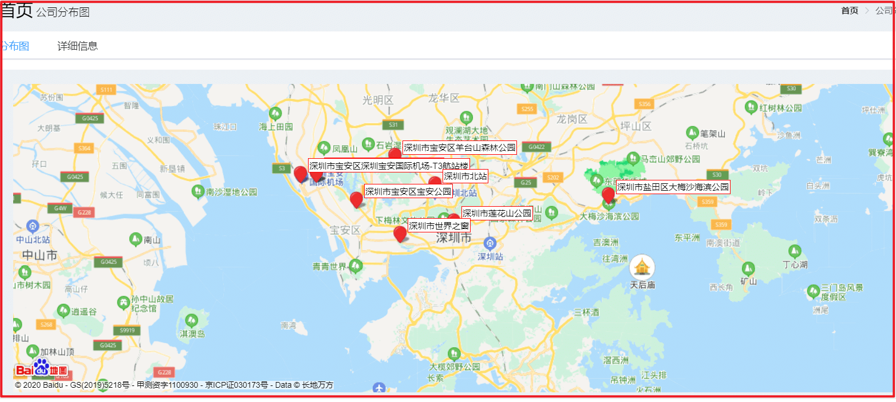
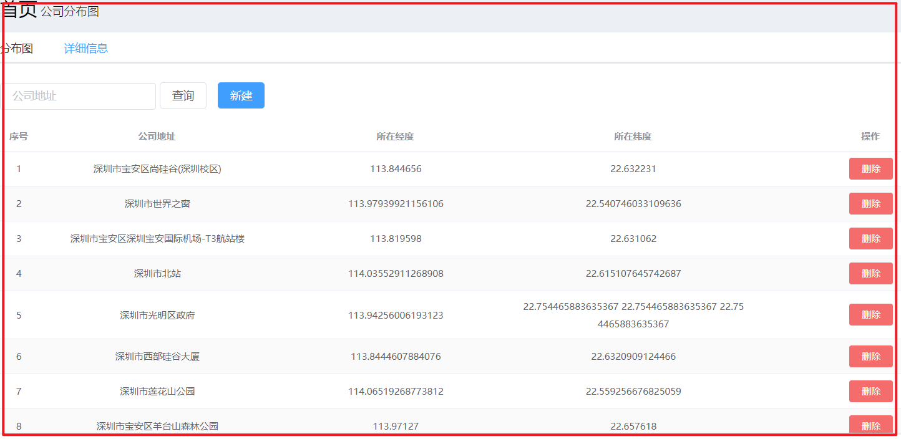
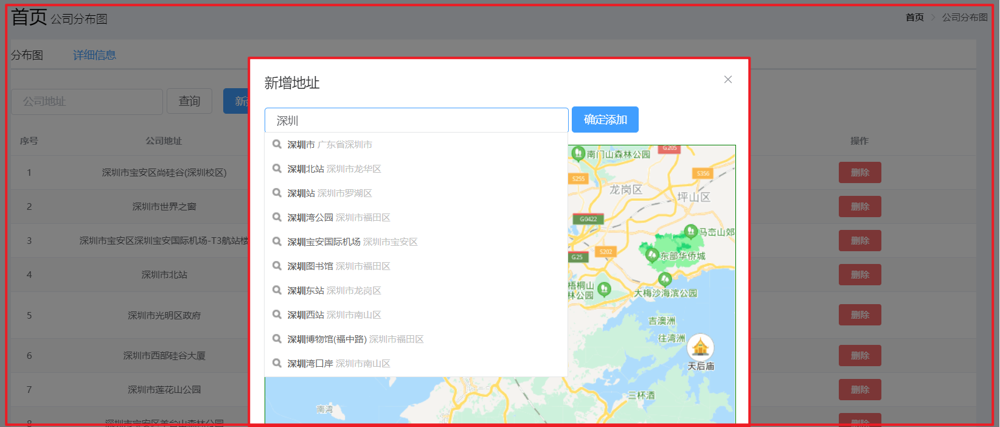

# 第一章 分店地址管理

### 1.1 拷贝页面

拷贝资料里面的页面 `address.html` 和 `map.html` 到 pages 文件夹







### 1.2 导入数据

导入数据到数据库

```sql
DROP TABLE IF EXISTS `t_address`;
CREATE TABLE `t_address`  (
  `id` int(11) NOT NULL AUTO_INCREMENT,
  `addressName` varchar(255) CHARACTER SET utf8 COLLATE utf8_general_ci NULL DEFAULT NULL,
  `lng` varchar(255) CHARACTER SET utf8 COLLATE utf8_general_ci NULL DEFAULT NULL,
  `lat` varchar(255) CHARACTER SET utf8 COLLATE utf8_general_ci NULL DEFAULT NULL,
  PRIMARY KEY (`id`) USING BTREE
) ENGINE = InnoDB AUTO_INCREMENT = 27 CHARACTER SET = utf8 COLLATE = utf8_general_ci ROW_FORMAT = Compact;

-- ----------------------------
-- Records of t_address
-- ----------------------------
INSERT INTO `t_address` VALUES (1, '深圳市宝安区尚硅谷(深圳校区)', '113.844656', '22.632231');
INSERT INTO `t_address` VALUES (2, '深圳市世界之窗', '113.97939921156106', '22.540746033109636');
INSERT INTO `t_address` VALUES (3, '深圳市宝安区深圳宝安国际机场-T3航站楼', '113.819598', '22.631062');
INSERT INTO `t_address` VALUES (6, '深圳市北站', '114.03552911268908', '22.615107645742687');
INSERT INTO `t_address` VALUES (8, '深圳市光明区政府', '113.94256006193123', '22.754465883635367');
INSERT INTO `t_address` VALUES (9, '深圳市西部硅谷大厦', '113.8444607884076', '22.6320909124466');
INSERT INTO `t_address` VALUES (10, '深圳市莲花山公园', '114.06519268773812', '22.559256676825059');
INSERT INTO `t_address` VALUES (18, '深圳市宝安区羊台山森林公园', '113.97127', '22.657618');
INSERT INTO `t_address` VALUES (24, '深圳市宝安区宝安公园', '113.909263', '22.592267');
INSERT INTO `t_address` VALUES (26, '深圳市盐田区大梅沙海滨公园', '114.314011', '22.598196');

SET FOREIGN_KEY_CHECKS = 1;
```

# 第二章 分布图和详细信息

点击选项卡 ，加载分布图 ，加载 `map.html` 页面

### 2.1 加载分店地址

前端

```js
$.ajax({
  type: "GET",
  url: "/address/findAllMaps.do",
  // data:JSON.stringify(userList),
  async: false,
  contentType: "application/json;charset=utf-8",
  success: function(data) {
    for (var x = 0; x < data.gridnMaps.length; x++) {
      adds.push(new BMap.Point(data.gridnMaps[x].lng, data.gridnMaps[x].lat));
      addNames.push(data.nameMaps[x].addressName);
    }
  },
});
```

服务端

创建 `AddressController.java`

```java
package com.atguigu.controller;

import com.alibaba.dubbo.config.annotation.Reference;
import com.atguigu.entity.PageResult;
import com.atguigu.entity.QueryPageBean;
import com.atguigu.entity.Result;
import com.atguigu.pojo.Address;
import com.atguigu.service.AddressService;
import org.springframework.web.bind.annotation.RequestBody;
import org.springframework.web.bind.annotation.RequestMapping;
import org.springframework.web.bind.annotation.RestController;

import java.util.ArrayList;
import java.util.HashMap;
import java.util.List;
import java.util.Map;

@RestController
@RequestMapping("/address")
public class AddressController {

    @Reference
    private AddressService addressService;

    @RequestMapping("/findAllMaps")
    public Map findAll(){
        Map map=new HashMap();
        List<Address> addressList = addressService.findAll();

        //1、定义分店坐标集合
        List<Map> gridnMaps=new ArrayList<>();
        //2、定义分店名称集合
        List<Map> nameMaps=new ArrayList();
        for (Address address : addressList) {
            Map gridnMap=new HashMap();
            // 获取经度
            gridnMap.put("lng",address.getLng());
            // 获取纬度
            gridnMap.put("lat",address.getLat());
            gridnMaps.add(gridnMap);

            Map nameMap=new HashMap();
            // 获取地址的名字
            nameMap.put("addressName",address.getAddressName());
            nameMaps.add(nameMap);
        }
        // 存放经纬度
        map.put("gridnMaps",gridnMaps);
        // 存放名字
        map.put("nameMaps",nameMaps);
        return map;
    }

    @RequestMapping("/findPage")
    public PageResult findPage(@RequestBody QueryPageBean queryPageBean){
        PageResult pageResult=null;
        try{
            pageResult= addressService.findPage(queryPageBean);
        }catch (Exception e){
            e.printStackTrace();
        }
        return pageResult;
    }


    @RequestMapping("/addAddress")
    public Result addAddress(@RequestBody Address address){
//        System.out.println(address.toString());
        addressService.addAddress(address);
        return new Result(true,"地址保存成功");
    }

    @RequestMapping("/deleteById")
    public Result deleteById(Integer id){
        addressService.deleteById(id);
        return new Result(true,"已删除地址");
    }
}

```

创建 `AddressService.java` 和 `AddressServiceImpl.java`

```java
package com.atguigu.service;


import com.atguigu.entity.PageResult;
import com.atguigu.entity.QueryPageBean;
import com.atguigu.pojo.Address;

import java.util.List;

public interface AddressService {
    List<Address> findAll();
    void addAddress(Address address);
    PageResult findPage(QueryPageBean queryPageBean);
    void deleteById(Integer id);
}


package com.atguigu.service.impl;

import com.alibaba.dubbo.config.annotation.Service;
import com.atguigu.dao.AddressDao;
import com.atguigu.entity.PageResult;
import com.atguigu.entity.QueryPageBean;
import com.atguigu.pojo.Address;
import com.atguigu.pojo.Member;
import com.atguigu.service.AddressService;
import com.github.pagehelper.Page;
import com.github.pagehelper.PageHelper;
import org.springframework.beans.factory.annotation.Autowired;

import java.util.List;

@Service(interfaceClass = AddressService.class)
public class AddressServiceImpl implements AddressService {
    @Autowired
    private AddressDao addressDao;

    @Override
    public List<Address> findAll() {
        return addressDao.findAll();
    }

    @Override
    public void addAddress(Address address) {
        addressDao.addAddress(address);
    }

    @Override
    public PageResult findPage(QueryPageBean queryPageBean) {
        PageHelper.startPage(queryPageBean.getCurrentPage(),queryPageBean.getPageSize());
        Page<Member> page = addressDao.selectByCondition(queryPageBean.getQueryString());
        return new PageResult(page.getTotal(),page.getResult());
    }

    @Override
    public void deleteById(Integer id) {
        addressDao.deleteById(id);
    }
}

```

创建 `AddressDao.java`

```java
package com.atguigu.dao;

import com.atguigu.pojo.Address;
import com.atguigu.pojo.Member;
import com.github.pagehelper.Page;

import java.util.List;

public interface AddressDao {
    List<Address> findAll();
    void addAddress(Address address);
    Page<Member> selectByCondition(String queryString);
    void deleteById(Integer id);
}

```

创建 `AddressDao.xml`

```xml
<?xml version="1.0" encoding="UTF-8" ?>
<!DOCTYPE mapper
        PUBLIC "-//mybatis.org//DTD Mapper 3.0//EN"
        "http://mybatis.org/dtd/mybatis-3-mapper.dtd">
<mapper namespace="com.atguigu.dao.AddressDao">

    <select id="findAll" resultType="address">
        select * from t_address
    </select>

    <!--根据条件查询-->
    <select id="selectByCondition" parameterType="string" resultType="address">
        select * from t_address
        <if test="value != null and value.length > 0">
            where addressName = #{value}
        </if>
    </select>

    <insert id="addAddress" parameterType="address">
        insert into t_address(addressName,lng,lat)
        values
        (#{addressName},#{lng},#{lat})
    </insert>

    <delete id="deleteById" parameterType="int">
        delete from t_address where id=#{id}
    </delete>
</mapper>
```

运行程序 `http://localhost:82/pages/main.html`
