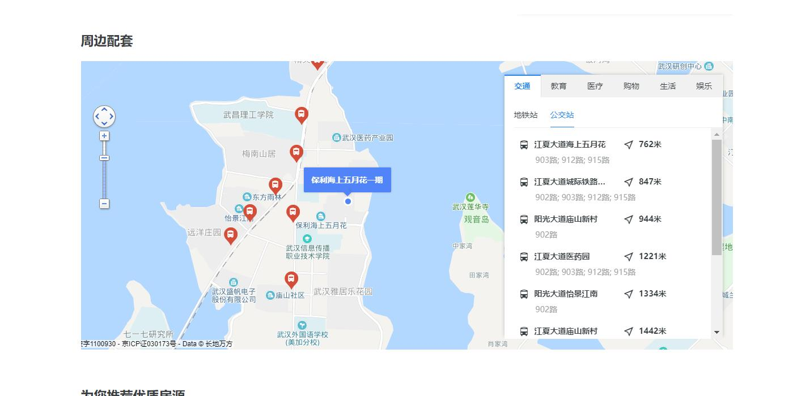
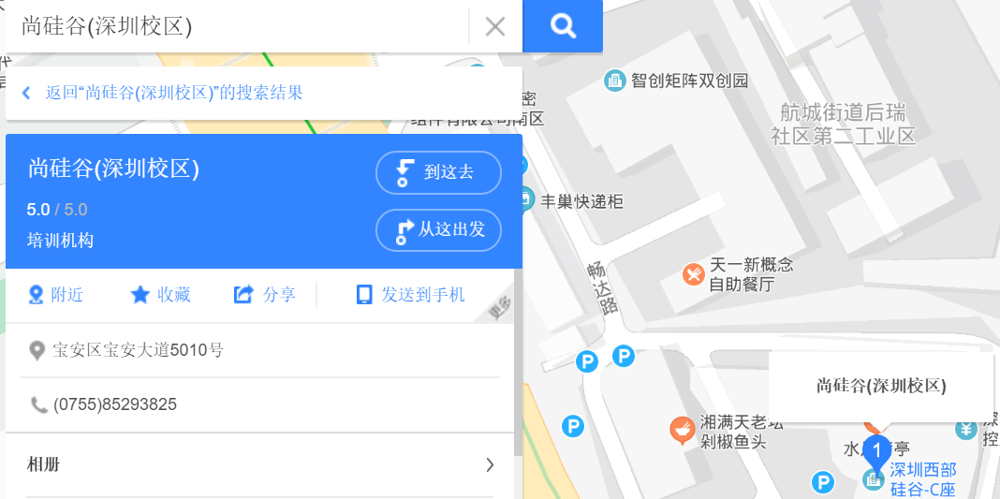
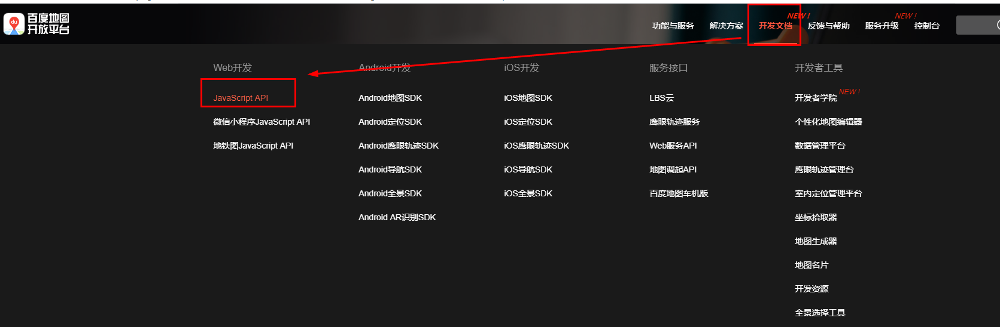
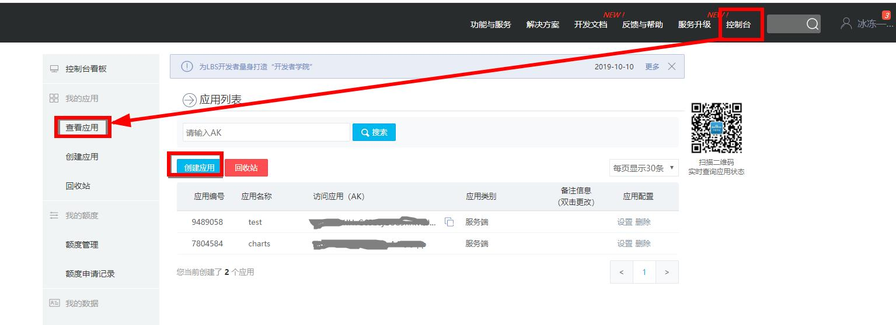
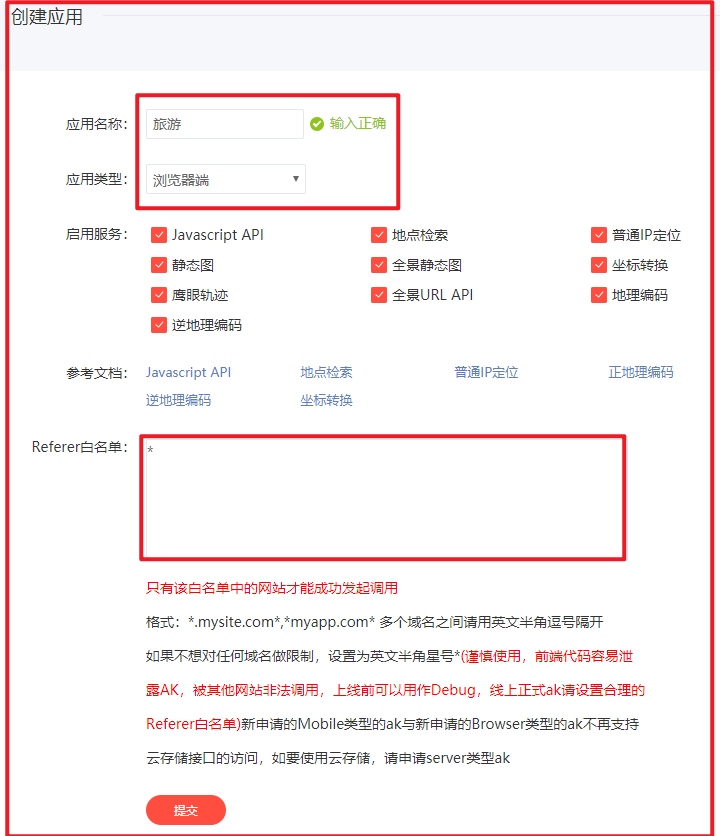
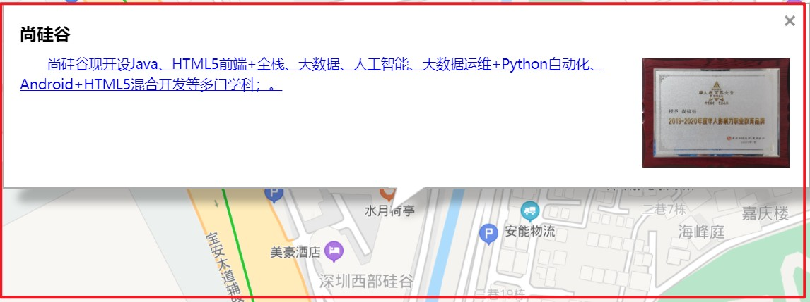

# 百度地图

## 内容介绍

1.了解地图的使用场景

2.百度地图介绍

3.显示公司地址案例

4.展示到公司路线案例

## 一、使用场景

​        地图的使用场景非常广泛。地图定位可以更直观的说明位置及周边环境，让用户更好的了解地理位置信息，导航功能更好的规划路径，以方便出行。定位，导航等成功互联网上最常见的功能之一。

例如：

链家地产：

https://wh.lianjia.com/ershoufang/104103030107.html



尚硅谷官网：

http://www.atguigu.com/teacher_sz.shtml



这是一个很常见的技术，公司地址，房产位置，饭店，酒店等行业，只要是用户需要找地方的时候，就可能出现地图技术的身影。涉及到我们生活的方方面面。

- 定位

- 地图

- 轨迹

- 路线规划

- 导航

- 路况

  `影音娱乐`：

  ​	利用精准定位服务，获取用户位置，为用户推荐基于LBS的相关内容，推荐周边其他用户，增强用户社交属性，助力开发者为用户进行精准化营销推送。 例如：斗鱼，唱吧，爱奇艺等

  `社交通讯`：

  ​	为基于位置的社交应用提供附近的人、位置分享、个性化推荐，根据好友位置计算距离、路线规划等位置服务。 例如：陌陌，探探等

  `智能硬件`：

  ​	以智能可穿戴、智能家居、智能交通设备和VR设备为代表，解决用户定位难题，助力开发者实现用户精准定位、远程定位、地理围栏监控提醒等功能。例如：小天才等

  ​	支持在APP端和可穿戴设备端同步显示导航信息，可查看清晰的路线指引及语音导航提示。 手机APP端同时可以看到导航过程中的实时移动轨迹，实现全程守护。 

  ​	存储海量轨迹、展示精准轨迹并记录行车图像，基于鹰眼为用户提供驾驶行为分析、车家互联等智能服务。 例如：滴滴打车等

  `电商购物`：

  ​	基于用户的精确位置，为用户推荐商品，为用户自动填写收货地址，优化送货体验，通过精准定位实时查看运输位置。 例如：小米，苏宁等
  `用车服务`： 

  ​	提供出行用车服务，利用精准定位和位置描述，明确用车起点，帮助司机更好的找到用车用户。

  ​	用地图服务，用户能够快速寻车、用车、还车，有效助力开发者提升整备车辆、运力调度、精准投放的效果。

  ​	专业的轨迹纠偏和里程计算服务帮助网约车平台校正用车计费 。

  ​	构建车队管理和运维平台，实现车辆轨迹追踪、车辆运行和停放区域监控、运维任务指派等自动化管理，提升运营效率。

  例如:膜拜单车，邦德，货拉拉,曹操专车等。

  `生活服务`：

  ​	利用精准定位服务，获取用户位置，推送周边服务。 例如：饿了么等

  ​	用地图服务找吃的、找玩的、找房子、找办事网点 。例如：美团。

  `在线旅游`：

  ​	酒旅及智慧景区业务，支持各种方式导航前往目的地 。例如：携程。
  共享出行： 例如：膜拜单车。
  资讯娱乐：基于用户当前位置推荐同城／附近的资讯信息，实现基于位置的娱乐互动。 例如：快手。
  智能穿戴： 例如：小天才。

  `物流`：

  ​	物流车辆和快递员实时轨迹接入鹰眼，结合鹰眼地理围栏进行运输时效性考核、驾驶安全监控、道路收费校验、快递员行为考核，提升物流配送准时性和安全性。

  ​	利用驾车和电动车路线规划，为支干线物流和末端配送提供准确的路线规划、耗时预估和道路收费预测。 		例如：圆通，邦德等

  `房产`:

  ​	用户在查看房源时，通过路线规划查看房源与地铁、公交站、商场等生活设施的路线和距离，帮助用户合理置业。例如：贝壳，房天下。
  `旅游`:

  ​	用户在预定酒店、设计旅游线路时，通过路线规划分析酒店、景点、交通站点之间的路线距离，帮助用户更高效规划行程。例如：携程，航班管家等

  `智慧景区`：

  ​	为新型智慧景区提供AR步行导航服务，开发者可自定义设置导航人物，让用户获得不同寻常的全新体验。

## 二、技术介绍

​	市面常见的地图API有很多，例如：

​	百度地图API ：http://lbsyun.baidu.com

​	高德地图API：https://lbs.amap.com

​	腾讯地图API：https://lbs.qq.com

​	搜狗地图API：http://map.sogou.com/api/

​	其中最常用的是高德地图API(阿里)和百度地图API。

​	这里要说的是百度地图API。

## 三、技术使用

我们主要学习几个技术的简单应用：定位技术、主要讲路径规划和导航。

#### 1.账号说明

 查看API地址：http://lbsyun.baidu.com



**要先进行注册账号和申请密钥（ak）才可使用该服务，接口无使用次数限制，请放心使用**





#### 2.入门小DEMO

**准备页面**

```html
<!DOCTYPE html>
```

您也可以根据需要选择其他类型的文档声明，这样浏览器会以标准的方式对页面进行渲染，保证页面最大的兼容性。我们不建议您使用quirks模式进行开发。

**适应移动端页面展示**

```html
<meta name="viewport" content="initial-scale=1.0, user-scalable=no" />  
```

**设置容器样式**

```html
<style type="text/css">  
    html{height:100%}    
    body{height:100%;margin:0px;padding:0px}    
    #container{height:100%}    
</style> 
```

**引用百度地图API文件**

```html
<script type="text/javascript" src="http://api.map.baidu.com/api?v=3.0&ak=您的密钥"></script>
```

**创建地图容器元素**

```html
<div id="container"></div> 
```

**创建地图实例**

```html
var map = new BMap.Map("container"); 
```

注意：

​	1.在调用此构造函数时应确保容器元素已经添加到地图上。

​	2.命名空间 API使用BMap作为命名空间，所有类均在该命名空间之下，比如：BMap.Map、BMap.Control、BMap.Overlay。

**设置点坐标**

```html
var point = new BMap.Point(113.844656, 22.632231); 
```

注意：在使用百度地图JavaScript API服务时，需使用百度BD09坐标，如使用其他坐标（ WGS84、GCJ02）进行展示，需先将其他坐标转换为BD09，详细说明请参考坐标转换说明，请勿使用非官方的转换方法！！！

**地图初始化，同时设置地图展示级别**

```html
map.centerAndZoom(point, 15);  
```

至此，我们就快速创建了一张以天安门为中心的地图~

```html
<!DOCTYPE html>  
<html>
<head>  
    <meta name="viewport" content="initial-scale=1.0, user-scalable=no" />  
    <meta http-equiv="Content-Type" content="text/html; charset=utf-8" />  
    <title>Hello, World</title>  
    <style type="text/css">  
    html{height:100%}  
    body{height:100%;margin:0px;padding:0px}  
    #container{height:100%}  
    </style>  
    <script type="text/javascript" src="http://api.map.baidu.com/api?v=3.0&ak=1yGIc901IHvG65b3jGUu5nrkWUOYpT3c">
</script>
</head>  
 
    <body>  
        <div id="container">
        </div> 
        <script type="text/javascript"> 
        var map = new BMap.Map("container");
        // 创建地图实例  
        var point = new BMap.Point(113.844656, 22.632231);
        // 创建点坐标  
        map.centerAndZoom(point, 15);
        // 初始化地图，设置中心点坐标和地图级别  
        </script>  
    </body>  
</html>
```

#### 3.常见API

这样的一个地图并不能**缩放**，可以进行如下设置

```html
map.enableScrollWheelZoom(true);     //开启鼠标滚轮缩放
```

可以给地图中的点**添加标注**,添加标注的时候要一个point(坐标)对象，把标注添加到坐标位置。

```html
var marker = new BMap.Marker(point);        // 创建标注    
map.addOverlay(marker);                     // 将标注添加到地图中 
```

可以给当前**标注添加点击事件**

```html
marker.addEventListener("click", function(){    
    alert("您点击了标注");    
}); 
```

也可以把标注拖走

```html
marker.enableDragging();    
marker.addEventListener("dragend", function(e){    
    alert("当前位置：" + e.point.lng + ", " + e.point.lat);    
}) 
```

可以添加信息窗口

```html
var opts = {    
    width : 250,     // 信息窗口宽度    
    height: 100,     // 信息窗口高度    
    title : "Hello"  // 信息窗口标题   
}    
var infoWindow = new BMap.InfoWindow("World", opts);  // 创建信息窗口对象    
map.openInfoWindow(infoWindow, map.getCenter());      // 打开信息窗口
```

注意：相关的API有很多，并不需要我们全部都劳记，只要学会使用API文档，知道怎么样进行使用百度提供的对象就可以了。

## 四、案例说明

我们用现有的百度API做两个案例：

#### 1.**显示公司地址信息**

`步骤`

1.得到公司的坐标。

2.当页面打开的时候，显示公司信息的窗口。

`开发`：

1.可以用标注拖拽的拖动事件得到坐标。

也可以用地址解析服务从地址转换到经纬度，也可以用点击事件来得到坐标。

```html
// 创建地址解析器实例     
var myGeo = new BMap.Geocoder();      
// 将地址解析结果显示在地图上，并调整地图视野    
myGeo.getPoint("深圳市宝安区宝安大道5010号", function(point){      
    if (point) {      
        map.centerAndZoom(point, 16);      
        map.addOverlay(new BMap.Marker(point));
		console.log(point.lng+" === "+point.lat);
    }else{
		console.log("没找到地址。");
	}   
 }, 
"深圳市");
```

这里采用地址解析服务从地址转换到经纬度。

```html
var map = new BMap.Map("container");    
map.centerAndZoom(new BMap.Point(113.844656, 22.632231), 11);    
map.addEventListener("click", function(e){    
		alert("当前位置：" + e.point.lng + ", " + e.point.lat);    
	}
);
map.enableScrollWheelZoom(true);     //开启鼠标滚轮缩放
```

得到的坐标是：

```
113.844656, 22.632231
```

参照Demo中的**信息窗口示例**案例，开发如下代码：

```html
    var map = new BMap.Map("container");
	var point = new BMap.Point(113.844656, 22.632231);
	map.centerAndZoom(point, 18);
	
	var sContent =
	"<h4 style='margin:0 0 5px 0;padding:0.2em 0'>尚硅谷</h4>" + 
	"" + 
	"<p style='margin:0;line-height:1.5;font-size:13px;text-indent:2em'><a href='http://www.atguigu.com/'>尚硅谷现开设Java、HTML5前端+全栈、大数据、人工智能、大数据运维+Python自动化、Android+HTML5混合开发等多门学科；。</a></p>" + 
	"</div>";
	var infoWindow = new BMap.InfoWindow(sContent);  // 创建信息窗口对象
	map.openInfoWindow(infoWindow,point); //开启信息窗口
	map.enableScrollWheelZoom(true);     //开启鼠标滚轮缩放
```

结果如下：




## 五、总结

地图应用在当前网络中，使用范围非常之广泛，百度地图API也日益受到开发者的青睐。其使用简单，在开发中只要创建一个map对象,其它的就可以进行可选择设置

```html
var map = new BMap.Map("l-map");
var point = new BMap.Point(113.844656, 22.632231);
map.centerAndZoom(point, 18);
```

百度地图API为我们提供的功能也是非常丰富。学会查看API文档，总结学习套路还是很重要的。

