# 2. 基础环境搭建

### 【目标】

基础环境搭建

### 【路径】

1：导入旅游管理模块数据表

2：导入旅游管理模块实体类

3：导入项目所需公共资源

### 【讲解】

## 2.1. **导入旅游管理模块数据表**

操作步骤：

（1）导入 SQL 语句

```sql
DROP TABLE IF EXISTS `t_travelgroup`;
CREATE TABLE `t_travelgroup` (
  `id` int(11) NOT NULL AUTO_INCREMENT,
  `code` varchar(32) DEFAULT NULL,
  `name` varchar(1000) DEFAULT NULL,
  `helpCode` varchar(32) DEFAULT NULL,
  `sex` char(1) DEFAULT NULL,
  `remark` varchar(1000) DEFAULT NULL,
  `attention` varchar(1000) DEFAULT NULL,
  PRIMARY KEY (`id`)
) ENGINE=InnoDB AUTO_INCREMENT=16 DEFAULT CHARSET=utf8;

DROP TABLE IF EXISTS `t_travelitem`;
CREATE TABLE `t_travelitem` (
  `id` int(11) NOT NULL AUTO_INCREMENT,
  `code` varchar(16) DEFAULT NULL,
  `name` varchar(32) DEFAULT NULL,
  `sex` char(1) DEFAULT NULL,
  `age` varchar(32) DEFAULT NULL,
  `price` float DEFAULT NULL,
  `type` char(1) DEFAULT NULL COMMENT '自由行类型,分为自由和跟团两种',
  `attention` varchar(128) DEFAULT NULL,
  `remark` varchar(128) DEFAULT NULL,
  PRIMARY KEY (`id`)
) ENGINE=InnoDB AUTO_INCREMENT=98 DEFAULT CHARSET=utf8;


DROP TABLE IF EXISTS `t_travelgroup_travelitem`;
CREATE TABLE `t_travelgroup_travelitem` (
  `travelgroup_id` int(11) NOT NULL DEFAULT '0',
  `travelitem_id` int(11) NOT NULL DEFAULT '0',
  PRIMARY KEY (`travelgroup_id`,`travelitem_id`),
  KEY `item_id` (`travelitem_id`),
  CONSTRAINT `group_id` FOREIGN KEY (`travelgroup_id`) REFERENCES `t_travelgroup` (`id`),
  CONSTRAINT `item_id` FOREIGN KEY (`travelitem_id`) REFERENCES `t_travelitem` (`id`)
) ENGINE=InnoDB DEFAULT CHARSET=utf8;
```

（2）在 SQL 客户端中，执行 SQL 语句

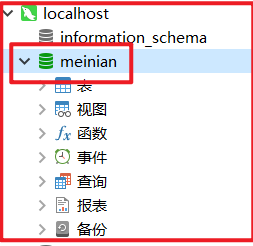

## 2.2. **导入旅游管理模块实体类**

新建包名 `com.atguigu.pojo` 将资料中提供的 `POJO` 实体类复制到 `meinian_pojo`工程中。

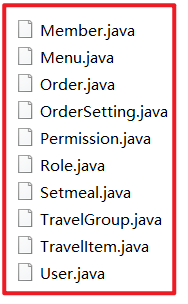

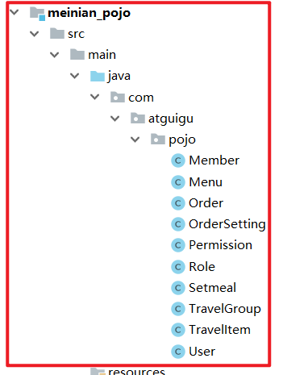

## 2.3. **导入项目所需公共资源**

项目开发过程中一般会提供一些公共资源，供多个模块或者系统来使用。

本章节我们导入的公共资源有：

（1）返回消息常量类 MessageConstant.java，放到 meinian_common 工程中

```java
package com.atguigu.constant;

/**
 * 消息常量
 */
public class MessageConstant {
    public static final String DELETE_TRAVELITEM_FAIL = "删除自由行失败";
    public static final String DELETE_TRAVELITEM_SUCCESS = "删除自由行成功";
    public static final String ADD_TRAVELITEM_SUCCESS = "新增自由行成功";
    public static final String ADD_TRAVELITEM_FAIL = "新增自由行失败";
    public static final String EDIT_TRAVELITEM_FAIL = "编辑自由行失败";
    public static final String EDIT_TRAVELITEM_SUCCESS = "编辑自由行成功";
    public static final String QUERY_TRAVELITEM_SUCCESS = "查询自由行成功";
    public static final String QUERY_TRAVELITEM_FAIL = "查询自由行失败";
    public static final String UPLOAD_SUCCESS = "上传成功";
    public static final String ADD_TRAVELGROUP_FAIL = "新增报团游失败";
    public static final String ADD_TRAVELGROUP_SUCCESS = "新增报团游成功";
    public static final String DELETE_TRAVELGROUP_FAIL = "删除报团游失败";
    public static final String DELETE_TRAVELGROUP_SUCCESS = "删除报团游成功";
    public static final String QUERY_TRAVELGROUP_SUCCESS = "查询报团游成功";
    public static final String QUERY_TRAVELGROUP_FAIL = "查询报团游失败";
    public static final String EDIT_TRAVELGROUP_FAIL = "编辑报团游失败";
    public static final String EDIT_TRAVELGROUP_SUCCESS = "编辑报团游成功";
    public static final String PIC_UPLOAD_SUCCESS = "图片上传成功";
    public static final String PIC_UPLOAD_FAIL = "图片上传失败";
    public static final String ADD_SETMEAL_FAIL = "新增套餐失败";
    public static final String ADD_SETMEAL_SUCCESS = "新增套餐成功";
    public static final String IMPORT_ORDERSETTING_FAIL = "批量导入预约设置数据失败";
    public static final String IMPORT_ORDERSETTING_SUCCESS = "批量导入预约设置数据成功";
    public static final String GET_ORDERSETTING_SUCCESS = "获取预约设置数据成功";
    public static final String GET_ORDERSETTING_FAIL = "获取预约设置数据失败";
    public static final String ORDERSETTING_SUCCESS = "预约设置成功";
    public static final String ORDERSETTING_FAIL = "预约设置失败";
    public static final String ADD_MEMBER_FAIL = "新增会员失败";
    public static final String ADD_MEMBER_SUCCESS = "新增会员成功";
    public static final String DELETE_MEMBER_FAIL = "删除会员失败";
    public static final String DELETE_MEMBER_SUCCESS = "删除会员成功";
    public static final String EDIT_MEMBER_FAIL = "编辑会员失败";
    public static final String EDIT_MEMBER_SUCCESS = "编辑会员成功";
    public static final String TELEPHONE_VALIDATECODE_NOTNULL = "手机号和验证码都不能为空";
    public static final String LOGIN_SUCCESS = "登录成功";
    public static final String VALIDATECODE_ERROR = "验证码输入错误";
    public static final String QUERY_ORDER_SUCCESS = "查询预约信息成功";
    public static final String QUERY_ORDER_FAIL = "查询预约信息失败";
    public static final String QUERY_SETMEALLIST_SUCCESS = "查询套餐列表数据成功";
    public static final String QUERY_SETMEALLIST_FAIL = "查询套餐列表数据失败";
    public static final String QUERY_SETMEAL_SUCCESS = "查询套餐数据成功";
    public static final String QUERY_SETMEAL_FAIL = "查询套餐数据失败";
    public static final String SEND_VALIDATECODE_FAIL = "验证码发送失败";
    public static final String SEND_VALIDATECODE_SUCCESS = "验证码发送成功";
    public static final String SELECTED_DATE_CANNOT_ORDER = "所选日期不能进行旅游预约";
    public static final String ORDER_FULL = "预约已满";
    public static final String HAS_ORDERED = "已经完成预约，不能重复预约";
    public static final String ORDER_SUCCESS = "预约成功";
    public static final String GET_USERNAME_SUCCESS = "获取当前登录用户名称成功";
    public static final String GET_USERNAME_FAIL = "获取当前登录用户名称失败";
    public static final String GET_MENU_SUCCESS = "获取当前登录用户菜单成功";
    public static final String GET_MENU_FAIL = "获取当前登录用户菜单失败";
    public static final String GET_MEMBER_NUMBER_REPORT_SUCCESS = "获取会员统计数据成功";
    public static final String GET_MEMBER_NUMBER_REPORT_FAIL = "获取会员统计数据失败";
    public static final String GET_SETMEAL_COUNT_REPORT_SUCCESS = "获取套餐统计数据成功";
    public static final String GET_SETMEAL_COUNT_REPORT_FAIL = "获取套餐统计数据失败";
    public static final String GET_BUSINESS_REPORT_SUCCESS = "获取运营统计数据成功";
    public static final String GET_BUSINESS_REPORT_FAIL = "获取运营统计数据失败";
    public static final String GET_SETMEAL_LIST_SUCCESS = "查询套餐列表数据成功";
    public static final String GET_SETMEAL_LIST_FAIL = "查询套餐列表数据失败";
}

```

（2）返回结果 `Result` 和 `PageResult`类，放到 `meinian_pojo`工程中

【1】`Result.java`

| 名称    | 类型    | 说明                                       |
| ------- | ------- | ------------------------------------------ |
| flag    | boolean | 执行结果，true 为执行成功 false 为执行失败 |
| message | String  | 返回结果信息                               |
| data    | Object  | 返回数据                                   |

处理响应结果集

```java
package com.atguigu.entity;

import java.io.Serializable;

/**
 * Result
 *
 * @Author: 马伟奇
 * @Description: 封装返回结果
 */
public class Result implements Serializable {
    private boolean flag;//执行结果，true为执行成功 false为执行失败
    private String message;//返回结果信息
    private Object data;//返回数据
    public Result(boolean flag, String message) {
        super();
        this.flag = flag;
        this.message = message;
    }

    public Result(boolean flag, String message, Object data) {
        this.flag = flag;
        this.message = message;
        this.data = data;
    }

    public boolean isFlag() {
        return flag;
    }
    public void setFlag(boolean flag) {
        this.flag = flag;
    }
    public String getMessage() {
        return message;
    }
    public void setMessage(String message) {
        this.message = message;
    }

    public Object getData() {
        return data;
    }

    public void setData(Object data) {
        this.data = data;
    }
}
```

【2】`PageResult.java`

处理分页列表结果集。

| 名称  | 类型 | 说明       |
| ----- | ---- | ---------- |
| total | Long | 总记录数   |
| rows  | List | 当前页结果 |

```java
package com.atguigu.entity;

import java.io.Serializable;
import java.util.List;

/**
 * PageResult
 *
 * @Author: 马伟奇
 * @Description: 分页结果封装对象
 */
public class PageResult implements Serializable {
    private Long total;//总记录数
    private List rows;//当前页结果
    public PageResult(Long total, List rows) {
        super();
        this.total = total;
        this.rows = rows;
    }
    public Long getTotal() {
        return total;
    }
    public void setTotal(Long total) {
        this.total = total;
    }
    public List getRows() {
        return rows;
    }
    public void setRows(List rows) {
        this.rows = rows;
    }
}
```

（3）封装分页查询条件的 `QueryPageBean` 类，放到 `meinian_pojo` 工程中

用于封装查询条件

| 名称        | 类型    | 说明       |
| ----------- | ------- | ---------- |
| currentPage | Integer | 页码       |
| pageSize    | Integer | 每页记录数 |
| queryString | String  | 查询条件   |

```java
package com.atguigu.entity;

import java.io.Serializable;

/**
 * QueryPageBean
 *
 * @Author: 马伟奇
 * @Description: 封装查询条件
 */
public class QueryPageBean implements Serializable {
    private Integer currentPage;//页码
    private Integer pageSize;//每页记录数
    private String queryString;//查询条件

    public Integer getCurrentPage() {
        return currentPage;
    }

    public void setCurrentPage(Integer currentPage) {
        this.currentPage = currentPage;
    }

    public Integer getPageSize() {
        return pageSize;
    }

    public void setPageSize(Integer pageSize) {
        this.pageSize = pageSize;
    }

    public String getQueryString() {
        return queryString;
    }

    public void setQueryString(String queryString) {
        this.queryString = queryString;
    }
}
```

（4）html、js、css、图片等静态资源，放到 meinian_web 工程的 webapp 文件夹下面


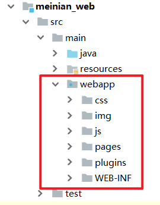

① 启动 `zkServer` 服务器

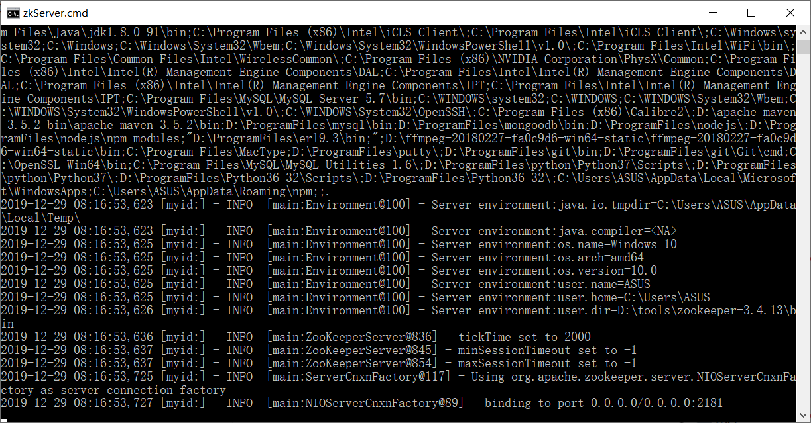

② 启动并且运行程序

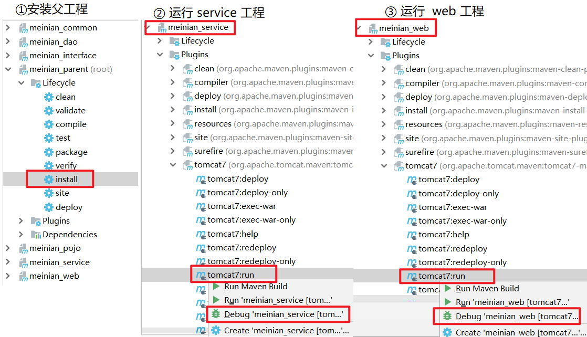

③ 请求地址 `http://localhost:82/pages/main.html`

注意：后续随着项目开发还会陆续导入其他一些公共资源。

可能出现的错误：

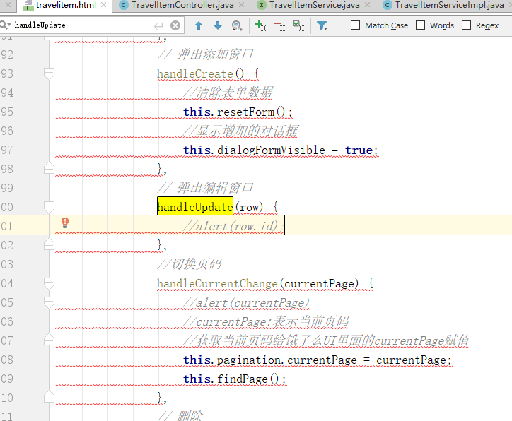

解决方案：

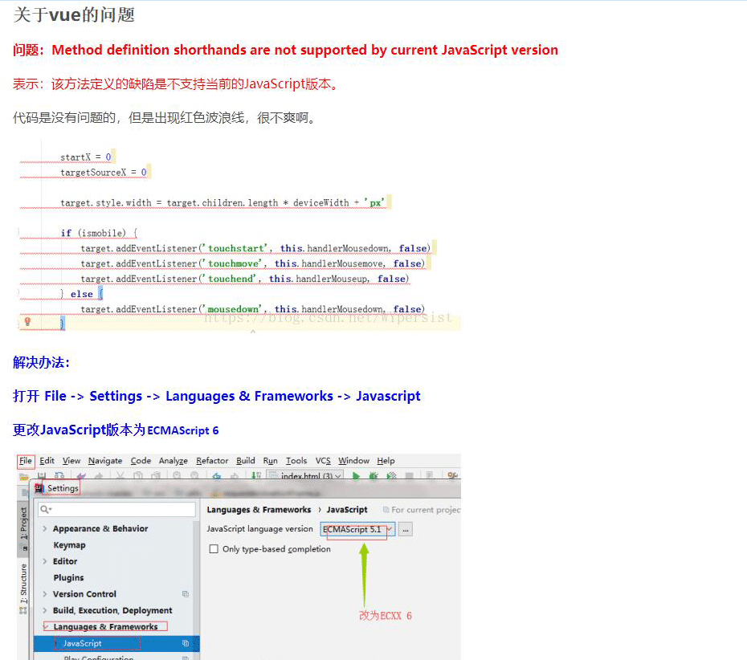

### 【小结】

1：导入旅游管理模块数据表

2：导入旅游管理模块实体类

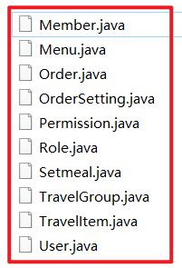

其中 TravelItem.java 表示自由行。

3：导入项目所需公共资源

（1）MessageConstant.java：返回消息常量类

（2）Result.java：处理响应结果集

（3）PageResult.java：处理分页列表结果集。

（4）QueryPageBean.java：封装查询条件

# 3. **第三章**. 新增自由行

main.html 页面介绍：

### 【目标】

新增自由行

### 【路径】

1：前台代码

（1）弹出新增窗口

（2）输入校验

（3）提交表单数据

- ajax 提交

```html
axios.post("/travelItem/add.do",this.formData).then((response)=> { })
```

2：后台代码

（1）TravelItemController.java （控制器，meinian_web 里面实现）

（2）TravelItemService.java（服务接口，meinian_interface 里面实现）

（3）TravelItemServiceImpl.java（服务实现类，meinian_service 里面实现）

（4）TravelItemDao.java（Dao 接口，meinian_dao 里面实现）

（5）TravelItemDao.xml（Mapper 映射文件，）

3：创建数据库和表

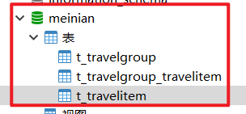

打开 `mysql` 客户端，创建数据库 `meinian`

```sql
DROP TABLE IF EXISTS `t_travelgroup`;
CREATE TABLE `t_travelgroup` (
  `id` int(11) NOT NULL AUTO_INCREMENT,
  `code` varchar(32) DEFAULT NULL,
  `name` varchar(1000) DEFAULT NULL,
  `helpCode` varchar(32) DEFAULT NULL,
  `sex` char(1) DEFAULT NULL,
  `remark` varchar(1000) DEFAULT NULL,
  `attention` varchar(1000) DEFAULT NULL,
  PRIMARY KEY (`id`)
) ENGINE=InnoDB AUTO_INCREMENT=16 DEFAULT CHARSET=utf8;

DROP TABLE IF EXISTS `t_travelitem`;
CREATE TABLE `t_travelitem` (
  `id` int(11) NOT NULL AUTO_INCREMENT,
  `code` varchar(16) DEFAULT NULL,
  `name` varchar(32) DEFAULT NULL,
  `sex` char(1) DEFAULT NULL,
  `age` varchar(32) DEFAULT NULL,
  `price` float DEFAULT NULL,
  `type` char(1) DEFAULT NULL COMMENT '自由行类型,分为自由和跟团两种',
  `attention` varchar(128) DEFAULT NULL,
  `remark` varchar(128) DEFAULT NULL,
  PRIMARY KEY (`id`)
) ENGINE=InnoDB AUTO_INCREMENT=98 DEFAULT CHARSET=utf8;


DROP TABLE IF EXISTS `t_travelgroup_travelitem`;
CREATE TABLE `t_travelgroup_travelitem` (
  `travelgroup_id` int(11) NOT NULL DEFAULT '0',
  `travelitem_id` int(11) NOT NULL DEFAULT '0',
  PRIMARY KEY (`travelgroup_id`,`travelitem_id`),
  KEY `item_id` (`travelitem_id`),
  CONSTRAINT `group_id` FOREIGN KEY (`travelgroup_id`) REFERENCES `t_travelgroup` (`id`),
  CONSTRAINT `item_id` FOREIGN KEY (`travelitem_id`) REFERENCES `t_travelitem` (`id`)
) ENGINE=InnoDB DEFAULT CHARSET=utf8;
```

### 【接口文档】

调用方 requestparams 子成员：

| 名称     | 类型   | 必要 | 说明                |
| -------- | ------ | ---- | ------------------- |
| formData | object | 是   | TravelItem 表单数据 |

formData 子成员如下：

| 名称      | 类型   | 必要 | 说明                          |
| --------- | ------ | ---- | ----------------------------- |
| code      | String | 是   | 自由行项目编号                |
| name      | String | 是   | 项目名称                      |
| sex       | String | 是   | 适用性别                      |
| age       | String | 是   | 适用年龄（范围），例如：20-50 |
| price     | Float  | 是   | 价格                          |
| type      | String | 是   | 参团类型                      |
| remark    | String | 是   | 项目说明                      |
| attention | String | 是   | 注意事项                      |

请求方式 ：post 请求

请求地址

```properties
/travelItem/add.do
```

### 【讲解】

## 3.1. **前台代码**

自由行管理页面对应的是 travelItem.html 页面，根据产品设计的原型已经完成了页面基本结构的编写，现在需要完善页面动态效果。

### 3.1.1. **弹出新增窗口**

页面中已经提供了新增窗口，只是处于隐藏状态。只需要将控制展示状态的属性 dialogFormVisible 改为 true 就可以显示出新增窗口。

新建按钮绑定的方法为 handleCreate，所以在 handleCreate 方法中修改 dialogFormVisible 属性的值为 true 即可。同时为了增加用户体验度，需要每次点击新建按钮时清空表单输入项。

```html
// 重置表单 resetForm() { this.formData = {}; }, // 弹出添加窗口 handleCreate()
{ this.resetForm(); this.dialogFormVisible = true; },
```

### 3.1.2. 输入校验

```json
rules: {//校验规则
    code: [{ required: true, message: '项目编码为必填项', trigger: 'blur' }],
    name: [{ required: true, message: '项目名称为必填项', trigger: 'blur' }]
}
```

### 3.1.3. **提交表单数据**

点击新增窗口中的确定按钮时，触发 handleAdd 方法，所以需要在 handleAdd 方法中进行完善。

```html
//添加 handleAdd () { //校验表单输入项是否合法
this.$refs['dataAddForm'].validate((valid) => { if (valid) {
//表单数据校验通过，发送ajax请求将表单数据提交到后台
axios.post("/travelItem/add.do",this.formData).then((response)=> {
//隐藏新增窗口 this.dialogFormVisible = false;
//判断后台返回的flag值，true表示添加操作成功，false为添加操作失败
if(response.data.flag){ this.$message({ message: response.data.message, type:
'success' }); }else{ this.$message.error(response.data.message); }
}).finally(()=> { // 刷新页面（列表查询） this.findPage(); }); } else {
this.$message.error("表单数据校验失败"); return false; } }); }, //分页查询
findPage() { },
```

## 3.2. **后台代码**

### 3.2.1. **Controller**

在 `meinian_web` 工程中创建 `TravelItemController`

```java
package com.atguigu.controller;

import com.alibaba.dubbo.config.annotation.Reference;
import com.atguigu.constant.MessageConstant;
import com.atguigu.entity.Result;
import com.atguigu.pojo.TravelItem;
import com.atguigu.service.TravelItemService;
import org.springframework.web.bind.annotation.RequestBody;
import org.springframework.web.bind.annotation.RequestMapping;
import org.springframework.web.bind.annotation.RestController;

/**
 * TravelItemController
 *
 * @Author: 马伟奇
 * @CreateTime: 2019-12-17
 * @Description:
 */
@RestController
@RequestMapping(value = "/travelItem")
public class TravelItemController {
   @Reference
    private TravelItemService travelItemService;

    //新增
    @RequestMapping("/add")
    public Result add(@RequestBody TravelItem travelItem){
        try {
            travelItemService.add(travelItem);
        }catch (Exception e){
            return new Result(false, MessageConstant.ADD_TRAVELITEM_FAIL);
        }
        return new Result(true,MessageConstant.ADD_TRAVELITEM_SUCCESS);
    }
}
```

### 3.2.2. **服务接口**

在 `meinian_interface` 工程中创建 `TravelItemService` 接口

```java
package com.atguigu.service;

import com.atguigu.pojo.TravelItem;

/**
 * TravelItemService
 *
 * @Author: 马伟奇
 * @Description:
 */
public interface TravelItemService {
    void add(TravelItem travelItem);
}


```

### 3.2.3. **服务实现类**

在 `meinian_service` 工程中创建 `TravelItemServiceImpl` 实现类

```java
package com.atguigu.service.impl;

import com.alibaba.dubbo.config.annotation.Service;
import com.atguigu.dao.TravelItemDao;
import com.atguigu.pojo.TravelItem;
import com.atguigu.service.TravelItemService;
import org.springframework.beans.factory.annotation.Autowired;
import org.springframework.transaction.annotation.Transactional;


/**
 * CheckItemServiceImpl
 *
 * @Author: 马伟奇
 * @CreateTime: 2019-12-17
 * @Description:
 * // dubbo（整合声明式事务处理
 * 1：配置applicationContext-tx.xml对类代理，
 * 2：@Service(interfaceClass = TravelItemService.class)）
 */

@Service(interfaceClass = TravelItemService.class)
@Transactional
public class TravelItemServiceImpl implements TravelItemService {

    @Autowired
    private TravelItemDao travelItemDao;

    @Override
    public void add(TravelItem travelItem) {
        travelItemDao.add(travelItem);
    }
}
```

### 3.2.4. **Dao 接口**

在 meinian_dao 工程中创建 TravelItemDao 接口，本项目是基于 Mybatis 的 Mapper 代理技术实现持久层操作，故只需要提供接口和 Mapper 映射文件，无须提供实现类

```java
package com.atguigu.dao;

import com.atguigu.pojo.TravelItem;

/**
 * TravelItemDao
 *
 * @Author: 马伟奇
 * @CreateTime: 2019-12-29
 * @Description:
 */
public interface TravelItemDao {
    void add(TravelItem travelItem);
}
```

### 3.2.5. **Mapper 映射文件**

在`meinian_dao` 工程中创建 `TravelItemDao.xml` 映射文件，需要和 `TravelItemDao` 接口在同一目录下

新建文件夹的时候，一定一定要注意，在 `resources` 文件夹下面新建文件夹 , 注意中间通过 / 分割

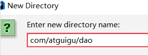

```xml
<?xml version="1.0" encoding="UTF-8" ?>
<!DOCTYPE mapper PUBLIC "-//mybatis.org//DTD Mapper 3.0//EN"
        "http://mybatis.org/dtd/mybatis-3-mapper.dtd" >
<mapper namespace="com.atguigu.dao.TravelItemDao">
    <!--新增-->
    <insert id="add" parameterType="travelItem">
        insert into t_travelitem(code,name,sex,age,price,type,remark,attention)
        values
        (#{code},#{name},#{sex},#{age},#{price},#{type},#{remark},#{attention})
    </insert>
</mapper>
```

运行程序 `http://localhost:82/pages/main.html`

### 【小结】

1：前台代码

（1）弹出新增窗口

只需要将控制展示状态的属性 `dialogFormVisible` 改为 true 就可以显示出新增窗口。

（2）输入校验

使用 ElementUI 的 Form 表单校验

（3）提交表单数据

- ajax 提交

```html
axios.post("/travelItem/add.do",this.formData).then((response)=> { })
```

2：后台代码

（1）TravelItemController.java

（2）TravelItemService.java（服务接口）

（3）TravelItemServiceImpl.java（服务实现类）

（4）TravelItemDao.java（Dao 接口）

（5）TravelItemDao.xml（Mapper 映射文件）

### 【错误】

错误 ①

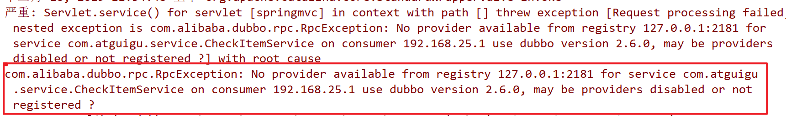

解决办法

```properties
1.对应的dubbo服务未启动，或者是dubbo没有连上Zookeeper注册中心。
2.controller层 ，引入远程service的时候，impl没有添加注解 dubbo的@Service 注解（加上@Service(@Service(interfaceClass = CheckItemService.class))之后，就可以了）
```

错误 ②

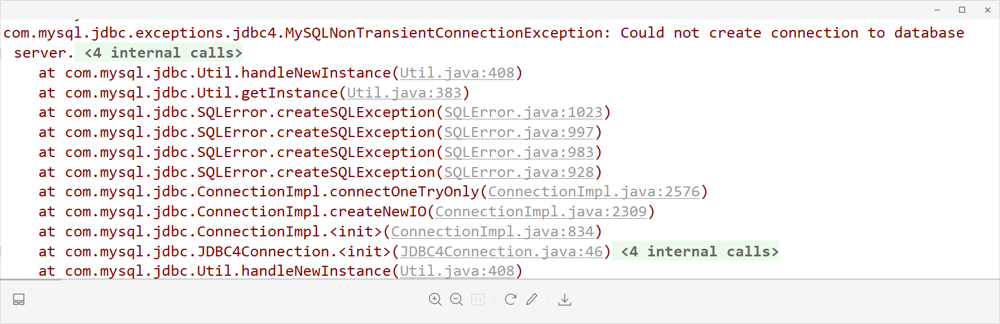

解决办法

```sql
<!--查看数据库驱动是否有问题，数据源-->
    <bean id="dataSource"
          class="com.alibaba.druid.pool.DruidDataSource" destroy-method="close">
        <property name="username" value="root" />
        <property name="password" value="root" />
        <property name="driverClassName" value="com.mysql.cj.jdbc.Driver" />
        <property name="url" value="jdbc:mysql://127.0.0.1:3306/meinian?useUnicode=true&amp;characterEncoding=utf8&amp;serverTimezone=GMT%2B8" />
    </bean>
```

错误 ③

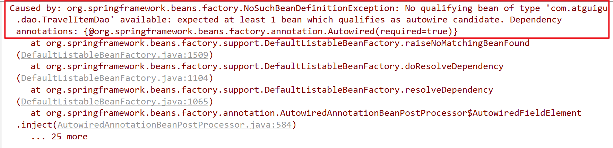

解决办法

① 先看注解是否添加，service 注解，controller 注解，各种注解

② 导注解的包有没有倒错，特别是 service，需要导入 dubbo 注解

③ 如果包没有倒错，注解也添加了，在看看配置文件扫包的时候，包是不是写错了

# 4. **第四章**. 自由行分页

### 【目标】

1：熟悉分页功能中的请求参数

2：熟悉分页功能中的响应数据

3：自由行分页功能实现

### 【路径】

1：前台代码

（1）定义分页相关模型数据 , 参数通过 json 传递

（2）定义分页方法

- 使用钩子函数，初始化数据

（3）完善分页方法执行时机

2：后台代码

（1）TravelItemController.java

（2）TravelItemService.java（服务接口）

（3）TravelItemServiceImpl.java（服务实现类）

（4）TravelItemDao.java（Dao 接口）

（5）TravelItemDao.xml（Mapper 映射文件）

### 【讲解】

本项目所有分页功能都是基于 ajax 的异步请求来完成的，请求参数和后台响应数据格式都使用 json 数据格式。

1：请求参数包括页码、每页显示记录数、查询条件。

请求参数的 json 格式为：{currentPage:1,pageSize:10,queryString:''atguigu''}

2：后台响应数据包括总记录数、当前页需要展示的数据集合。

响应数据的 json 格式为：{total:1000,rows:[]}

如下图：

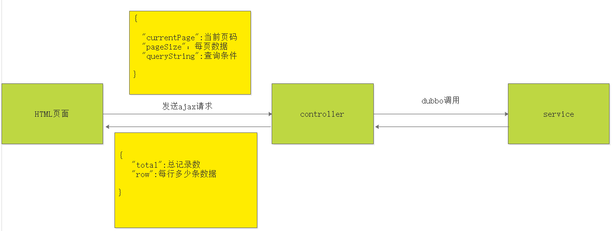

## 4.1. 前台代码

调用方 requestparams 子成员：

| 名称        | 类型    | 必要 | 说明       |
| ----------- | ------- | ---- | ---------- |
| currentPage | Integer | 是   | 页码       |
| pageSize    | Integer | 是   | 每页记录数 |
| queryString | String  | 是   | 查询条件   |

返回方 PageResult 子成员：

| 名称  | 类型 | 必要 | 说明       |
| ----- | ---- | ---- | ---------- |
| total | Long | 是   | 总记录数   |
| rows  | List | 是   | 当前页结果 |

调用地址

```properties
/travelItem/findPage.do
```

### 4.1.1. 定义分页相关模型数据

```json
pagination: {//分页相关模型数据
     currentPage: 1,//当前页码
     pageSize:10,//每页显示的记录数
     total:0,//总记录数
     queryString:null//查询条件
},
dataList: [],//当前页要展示的分页列表数据
```

### 4.1.2. **定义分页方法**

在页面中提供了 findPage 方法用于分页查询，为了能够在 travelitem.html 页面加载后直接可以展示分页数据，可以在 VUE 提供的钩子函数 created 中调用 findPage 方法

```html
//钩子函数，VUE对象初始化完成后自动执行 created() { this.findPage(); },
```

```html
//分页查询 findPage() { //分页参数 var param = {
currentPage:this.pagination.currentPage,//页码
pageSize:this.pagination.pageSize,//每页显示的记录数
queryString:this.pagination.queryString//查询条件 }; //请求后台
axios.post("/travel/findPage.do",param).then((response)=> {
//为模型数据赋值，基于VUE的双向绑定展示到页面 this.dataList =
response.data.rows; this.pagination.total = response.data.total; }); },
```

### 4.1.3. **完善分页方法执行时机**

除了在 created 钩子函数中调用 findPage 方法查询分页数据之外，当用户点击查询按钮或者点击分页条中的页码时也需要调用 findPage 方法重新发起查询请求。

为查询按钮绑定单击事件，调用 findPage 方法

```html
<el-button @click="handleCurrentChange(1)" class="dalfBut">查询</el-button>
```

为分页条组件绑定 current-change 事件，此事件是分页条组件自己定义的事件，当页码改变时触发，对应的处理函数为 handleCurrentChange

```html
<div class="pagination-container">
  <el-pagination
    class="pagiantion"
    @current-change="handleCurrentChange"
    :current-page="pagination.currentPage"
    :page-size="pagination.pageSize"
    layout="total, prev, pager, next, jumper"
    :total="pagination.total"
  >
  </el-pagination>
</div>
```

定义 handleCurrentChange 方法

```html
//切换页码 handleCurrentChange(currentPage) { // currentPage为切换后的页码
this.pagination.currentPage = currentPage; this.findPage(); },
```

## 4.2. **后台代码**

### 4.2.1. **Controller**

在 `TravelItemController`中增加分页查询方法

```java
package com.atguigu.controller;

import com.alibaba.dubbo.config.annotation.Reference;
import com.atguigu.constant.MessageConstant;
import com.atguigu.entity.PageResult;
import com.atguigu.entity.QueryPageBean;
import com.atguigu.entity.Result;
import com.atguigu.pojo.TravelItem;
import com.atguigu.service.TravelItemService;
import org.springframework.web.bind.annotation.RequestBody;
import org.springframework.web.bind.annotation.RequestMapping;
import org.springframework.web.bind.annotation.RestController;

/**
 * CheckItemController
 *
 * @Author: 马伟奇
 * @Description:
 */
@RestController
@RequestMapping(value = "/travel")
public class TravelItemController {

    @Reference
    private TravelItemService travelItemService;


    @RequestMapping("/findPage")
    public PageResult findPage(@RequestBody QueryPageBean queryPageBean){
        PageResult pageResult = travelItemService.findPage(
            queryPageBean.getCurrentPage(),
            queryPageBean.getPageSize(),
            queryPageBean.getQueryString());
        return pageResult;

    }
}
```

### 4.2.2. **服务接口**

在 `TravelItemService` 服务接口中扩展分页查询方法

```java
package com.atguigu.service;

import com.atguigu.entity.PageResult;
import com.atguigu.pojo.CheckItem;

/**
 * TravelItemService
 *
 * @Author: 马伟奇
 * @Description:
 */
public interface TravelItemService {


    PageResult findPage(Integer currentPage, Integer pageSize, String queryString);
}


```

### 4.2.3. **服务实现类**

在 `TravelItemServiceImpl`服务实现类中实现分页查询方法，基于 `Mybatis` 分页助手插件实现分页

```java
package com.atguigu.service.impl;

import com.alibaba.dubbo.config.annotation.Service;
import com.atguigu.dao.CheckItemDao;
import com.atguigu.entity.PageResult;
import com.atguigu.pojo.TravelItem;
import com.atguigu.service.CheckItemService;
import com.github.pagehelper.Page;
import com.github.pagehelper.PageHelper;
import org.springframework.beans.factory.annotation.Autowired;
import org.springframework.transaction.annotation.Transactional;


/**
 * TravelItemServiceImpl
 *
 * @Author: 马伟奇
 * @Description:
 * // dubbo（整合声明式事务处理
 * 1：配置applicationContext-tx.xml对类代理，
 * 2：@Service(interfaceClass = TravelItemService.class)）
 */

@Service(interfaceClass = TravelItemService.class)
@Transactional
public class TravelItemServiceImpl implements TravelItemService {

    @Autowired
    private TravelItemDao travelItemDao;

    @Override
    public PageResult findPage(Integer currentPage, Integer pageSize, String queryString) {
         // 不使用分页插件PageHelper
        // 至少写2条sql语句完成查询
        // 第1条，select count(*) from t_travelitem，查询的结果封装到PageResult中的total
        // 第2条，select * from t_travelitem where NAME = '001' OR CODE = '001' limit ?,?  （0,10）（10,10）(（currentPage-1)*pageSize,pageSize）
        // 使用分页插件PageHelper（简化上面的操作）
        // 1：初始化分页操作
        PageHelper.startPage(currentPage,pageSize);
         // 2：使用sql语句进行查询（不必在使用mysql的limit了）
        Page<TravelItem> page = travelItemDao.findPage(queryString);
        // 3：封装
        return new PageResult(page.getTotal(),page.getResult());
    }
}
```

### 4.2.4. **Dao 接口**

在 `TravelItemDao` 接口中扩展分页查询方法

```java
package com.atguigu.dao;

import com.atguigu.pojo.TravelItem;
import com.github.pagehelper.Page;

/**
 * TravelItemDao
 *
 * @Author: 马伟奇
 * @Description:
 */
public interface TravelItemDao {

     Page<TravelItem> findPage(String queryString);
}


```

### 4.2.5. **Mapper 映射文件**

在 `TravelItemDao.xml` 文件中增加 `SQL` 定义

```xml
<select id="findPage" parameterType="string" resultType="travelItem">
     <!--或者使用 ， 模糊查询-->
    select * from t_travelitem
        <where>
            <if test="value!=null and value.length>0">
                name like "%"#{value}"%" or code=#{value}
            </if>
        </where>

</select>
```

如果使用 if 进行判断，这里需要是 value 读取值，不能改成其他参数。

导入查询语句到 mysql 数据库

```sql
INSERT INTO `t_travelitem` VALUES ('28', '0001', '三亚呀诺达享浪漫5日蜜月游', '0', '0-100', '5', '1', '无', '三亚呀诺达享浪漫5日蜜月游');
INSERT INTO `t_travelitem` VALUES ('29', '0002', '5天4晚，海南三亚自由行玩法', '0', '0-100', '5', '1', '无', '5天4晚，海南三亚自由行玩法');
INSERT INTO `t_travelitem` VALUES ('30', '0003', '5天4晚，三亚玩法，带着爸妈去旅行', '0', '0-100', '5', '1', '无', '5天4晚，三亚玩法，带着爸妈去旅行');
INSERT INTO `t_travelitem` VALUES ('31', '0004', '三亚大东海风景迷人5日家庭游', '0', '0-100', '5', '1', '无', '三亚大东海风景迷人5日家庭游');
INSERT INTO `t_travelitem` VALUES ('32', '0005', '4天3晚厦门玩法，热恋在土楼与都市沿岸', '0', '0-100', '5', '1', '无', '4天3晚厦门玩法，热恋在土楼与都市沿岸');
INSERT INTO `t_travelitem` VALUES ('33', '0006', '4日3晚，厦门亲子玩法', '0', '0-100', '5', '1', '无', '4日3晚，厦门亲子玩法');
INSERT INTO `t_travelitem` VALUES ('34', '0007', '厦门风灌醉鼓浪屿的海4日浪漫游', '0', '0-100', '5', '1', '无', '厦门风灌醉鼓浪屿的海4日浪漫游');
INSERT INTO `t_travelitem` VALUES ('35', '0008', '4天3晚，海上花园城市，厦门玩法', '0', '0-100', '5', '1', '无', '4天3晚，海上花园城市，厦门玩法');
INSERT INTO `t_travelitem` VALUES ('36', '0009', '香港迪士尼里追童梦5日亲子游', '0', '0-100', '5', '1', '无', '香港迪士尼里追童梦5日亲子游');
INSERT INTO `t_travelitem` VALUES ('37', '0010', '香港铜锣湾处处风情5日休闲游', '0', '0-100', '5', '1', '无', '香港铜锣湾处处风情5日休闲游');
INSERT INTO `t_travelitem` VALUES ('38', '0011', '5天4晚寻味香港玩法，回忆记忆中的“港味儿”', '0', '0-100', '10', '2', '无', '5天4晚寻味香港玩法，回忆记忆中的“港味儿”');
INSERT INTO `t_travelitem` VALUES ('39', '0012', '版纳傣族园丽江古城8日三地连线游', '0', '0-100', '10', '2', null, '版纳傣族园丽江古城 8日三地连线游');
INSERT INTO `t_travelitem` VALUES ('40', '0013', '6天5晚，丽江香格里拉蜜月玩法，意外的遇见，刚刚好！', '0', '0-100', '10', '2', null, '6天5晚，丽江香格里拉蜜月玩法，意外的遇见，刚刚好！');
INSERT INTO `t_travelitem` VALUES ('41', '0014', '4天3晚，云南丽江大众玩法', '0', '0-100', '10', '2', null, '4天3晚，云南丽江大众玩法');
INSERT INTO `t_travelitem` VALUES ('42', '0015', '丽江古城佳肴诱惑5日美食游', '0', '0-100', '10', '2', null, '丽江古城佳肴诱惑5日美食游');
INSERT INTO `t_travelitem` VALUES ('43', '0016', '成都九寨沟五彩天堂7日深度游', '0', '0-100', '10', '2', null, '成都九寨沟五彩天堂7日深度游');
INSERT INTO `t_travelitem` VALUES ('44', '0017', '成都九寨沟黄龙远离喧嚣6日风光游', '0', '0-100', '10', '2', null, '成都九寨沟黄龙远离喧嚣6日风光游');
INSERT INTO `t_travelitem` VALUES ('45', '0018', '7天6晚，四川玩法', '0', '0-100', '10', '2', null, '7天6晚，四川玩法');
INSERT INTO `t_travelitem` VALUES ('46', '0019', '4天3晚，大连玩法，阳光明媚去看海', '0', '0-100', '10', '2', null, '4天3晚，大连玩法，阳光明媚去看海');
INSERT INTO `t_travelitem` VALUES ('47', '0020', '4天3晚，浪漫之都大连玩法', '0', '0-100', '10', '2', null, '4天3晚，浪漫之都大连玩法');
INSERT INTO `t_travelitem` VALUES ('48', '0021', '4天3晚大连海滨玩法', '0', '0-100', '10', '2', null, '4天3晚大连海滨玩法');
INSERT INTO `t_travelitem` VALUES ('49', '0022', '大连美丽不过滨海路 4日经典游', '0', '0-100', '10', '2', null, '大连美丽不过滨海路4日经典游');
INSERT INTO `t_travelitem` VALUES ('50', '0023', '1天，尽览东方巴黎风采，哈尔滨玩法', '0', '0-100', '10', '2', null, '1天，尽览东方巴黎风采，哈尔滨玩法');
INSERT INTO `t_travelitem` VALUES ('51', '0024', '5天4晚哈尔滨+吉林双城玩法', '0', '0-100', '10', '2', null, '5天4晚哈尔滨+吉林双城玩法');
INSERT INTO `t_travelitem` VALUES ('52', '0025', '哈尔滨老道外风情建筑 5日魅力游', '0', '0-100', '10', '2', null, '哈尔滨老道外风情建筑5日魅力游');
INSERT INTO `t_travelitem` VALUES ('53', '0026', '哈尔滨雪博会一头栽雪堆 5日狂欢游', '0', '0-100', '10', '2', null, '哈尔滨雪博会一头栽雪堆5日狂欢游');
INSERT INTO `t_travelitem` VALUES ('54', '0027', '大阪东京夜景艾特你了6日连线游', '0', '0-100', '10', '2', null, '大阪东京夜景艾特你了6日连线游');
INSERT INTO `t_travelitem` VALUES ('55', '0028', '东京大阪一秒钟嗨翻乐园 6日亲子游', '0', '0-100', '10', '2', null, '东京大阪一秒钟嗨翻乐园6日亲子游');
INSERT INTO `t_travelitem` VALUES ('56', '0029', '东京扫货扫到手抽筋5日购物游', '0', '0-100', '10', '2', null, '东京扫货扫到手抽筋5日购物游');
INSERT INTO `t_travelitem` VALUES ('57', '0030', '东京富士山温泉5日泡汤游', '0', '0-100', '10', '2', null, '东京富士山温泉 5日泡汤游');
INSERT INTO `t_travelitem` VALUES ('58', '0031', '巴厘岛梦幻海滩分享甜蜜 5日蜜月游', '0', '0-100', '10', '2', null, '巴厘岛梦幻海滩分享甜蜜5日蜜月游');
INSERT INTO `t_travelitem` VALUES ('59', '0032', '6天5晚千岛之国，万般风情，印尼海岛玩法。', '0', '0-100', '10', '2', null, '6天5晚千岛之国，万般风情，印尼海岛玩法。');
INSERT INTO `t_travelitem` VALUES ('60', '0033', '5天4晚巴厘岛玩法，拥抱理想国的阳光', '0', '0-100', '10', '2', null, '5天4晚巴厘岛玩法，拥抱理想国的阳光');
INSERT INTO `t_travelitem` VALUES ('61', '0034', '巴厘岛金巴兰海滩享SPA6日悠闲游', '0', '0-100', '10', '2', null, '巴厘岛金巴兰海滩享SPA6日悠闲游');
INSERT INTO `t_travelitem` VALUES ('62', '0035', '巴厘岛乌布皇宫如梦如幻 5日蜜月游', '0', '0-100', '10', '2', null, '巴厘岛乌布皇宫如梦如幻 5日蜜月游');
INSERT INTO `t_travelitem` VALUES ('63', '0036', '巴厘岛海神庙全家出行8日亲子游', '0', '0-100', '10', '2', null, '巴厘岛海神庙全家出行8日亲子游');
INSERT INTO `t_travelitem` VALUES ('64', '0037', '巴厘岛金银岛悠然自得6日经典游', '0', '0-100', '10', '2', null, '巴厘岛金银岛悠然自得6日经典游');
INSERT INTO `t_travelitem` VALUES ('65', '0038', '巴厘岛蓝点教堂SPA专享7日休闲游', '0', '0-100', '10', '2', null, '巴厘岛蓝点教堂SPA专享7日休闲游');
INSERT INTO `t_travelitem` VALUES ('66', '0039', '大阪东京夜景艾特你了6日连线游', '0', '0-100', '10', '2', null, '大阪东京夜景艾特你了6日连线游');
INSERT INTO `t_travelitem` VALUES ('67', '0040', '东京大阪一秒钟嗨翻乐园6日亲子游', '0', '0-100', '10', '2', null, '东京大阪一秒钟嗨翻乐园6日亲子游');
INSERT INTO `t_travelitem` VALUES ('68', '0041', '6天5晚最牛的日本本州玩法', '0', '0-100', '10', '2', null, '6天5晚最牛的日本本州玩法');
INSERT INTO `t_travelitem` VALUES ('69', '0042', '日本京都箱根东瀛和风7日风情游', '0', '0-100', '10', '2', null, '日本京都箱根东瀛和风7日风情游');
INSERT INTO `t_travelitem` VALUES ('70', '0043', '日本箱根大涌谷6日关东关西游', '0', '0-100', '10', '2', null, '日本箱根大涌谷6日关东关西游');
INSERT INTO `t_travelitem` VALUES ('71', '0044', '日本伏见稻荷朱红色6日古都游', '0', '0-100', '10', '2', null, '日本伏见稻荷朱红色6日古都游');
INSERT INTO `t_travelitem` VALUES ('72', '0045', '大阪环球影城一键收藏5日亲子游', '0', '0-100', '10', '2', null, '大阪环球影城一键收藏5日亲子游');
INSERT INTO `t_travelitem` VALUES ('73', '0046', '大阪黑门市场吃海鲜5日美食游', '0', '0-100', '10', '2', null, '大阪黑门市场吃海鲜5日美食游');
INSERT INTO `t_travelitem` VALUES ('74', '0047', '大阪城公园樱花美成画5日经典游', '0', '0-100', '10', '2', null, '大阪城公园樱花美成画5日经典游');
INSERT INTO `t_travelitem` VALUES ('75', '0048', '大阪海游馆亲密接触5日休闲游', '0', '0-100', '10', '2', null, '大阪海游馆亲密接触5日休闲游');
INSERT INTO `t_travelitem` VALUES ('76', '0049', '日本奈良公园小鹿乱撞7日古都游', '0', '0-100', '10', '2', null, '日本奈良公园小鹿乱撞7日古都游');
INSERT INTO `t_travelitem` VALUES ('77', '0050', '大阪道顿堀小吃嘴不停6日美食游', '0', '0-100', '10', '2', null, '大阪道顿堀小吃嘴不停6日美食游');
INSERT INTO `t_travelitem` VALUES ('78', '0051', '大阪梅田空中庭院漫步6日休闲游', '0', '0-100', '10', '2', null, '大阪梅田空中庭院漫步6日休闲游');
INSERT INTO `t_travelitem` VALUES ('79', '0052', '大阪奈良赴一场盛宴6日深度游', '0', '0-100', '10', '2', null, '大阪奈良赴一场盛宴6日深度游');
INSERT INTO `t_travelitem` VALUES ('80', '0053', '日本繁华都市闲逛6日深度游', '0', '0-100', '10', '2', null, '日本繁华都市闲逛6日深度游');
INSERT INTO `t_travelitem` VALUES ('81', '0054', '毛里求斯鹿岛享沙滩阳光6日蜜月游', '0', '0-100', '10', '2', null, '毛里求斯鹿岛享沙滩阳光6日蜜月游');
INSERT INTO `t_travelitem` VALUES ('82', '0055', '7天6晚毛里求斯360度多情与激情玩法', '0', '0-100', '10', '2', null, '7天6晚毛里求斯360度多情与激情玩法');
INSERT INTO `t_travelitem` VALUES ('83', '0056', '毛里求斯迪拜享浪漫10日蜜月游', '0', '0-100', '10', '2', null, '毛里求斯迪拜享浪漫10日蜜月游');
INSERT INTO `t_travelitem` VALUES ('84', '0057', '毛里求斯迪拜两国畅玩9日经典游', '0', '0-100', '10', '2', null, '毛里求斯迪拜两国畅玩9日经典游');
INSERT INTO `t_travelitem` VALUES ('85', '0058', '毛里求斯蓝湾纯净浪漫8日蜜月游', '0', '0-100', '10', '2', null, '毛里求斯蓝湾纯净浪漫8日蜜月游');
INSERT INTO `t_travelitem` VALUES ('86', '0059', '毛里求斯七色土绚烂多姿8日蜜月游', '0', '0-100', '10', '2', null, '毛里求斯七色土绚烂多姿8日蜜月游');
INSERT INTO `t_travelitem` VALUES ('87', '0060', '5天4晚四川成都大众玩法', '0', '0-100', '10', '2', null, '5天4晚四川成都大众玩法');
INSERT INTO `t_travelitem` VALUES ('88', '0061', '成都杜甫草堂历史悠久5日访古游', '2', '0-100', '10', '2', null, '成都杜甫草堂历史悠久5日访古游');
INSERT INTO `t_travelitem` VALUES ('89', '0062', '成都人民公园享欢乐时光5日亲子游', '2', '0-100', '10', '2', null, '成都人民公园享欢乐时光5日亲子游');
INSERT INTO `t_travelitem` VALUES ('90', '0063', '成都锦里小吃很地道4日美食游', '0', '0-100', '10', '2', null, '成都锦里小吃很地道4日美食游');
INSERT INTO `t_travelitem` VALUES ('91', '0064', '成都锦里感受慢生活4日经典游', '0', '0-100', '10', '2', null, '成都锦里感受慢生活4日经典游');
INSERT INTO `t_travelitem` VALUES ('92', '0065', '成都春熙路吃货天堂4日美食游', '0', '0-100', '10', '2', null, '成都春熙路吃货天堂4日美食游');
```

运行程序 `http://localhost:82/pages/main.html`

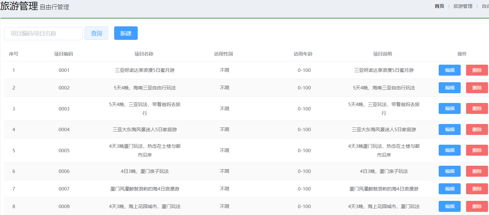

### 【小结】

1：前台代码

（1）定义分页相关模型数据

（2）定义分页方法

- 使用钩子函数，初始化数据

（3）完善分页方法执行时机

- 查询按钮

2：后台代码

（1）TravelItemController.java

（2）TravelItemService.java（服务接口）

（3）TravelItemServiceImpl.java（服务实现类）

在 TravelItemServiceImpl 服务实现类中实现分页查询方法，基于 Mybatis 分页助手插件实现分页

```java
public PageResult pageQuery(Integer currentPage, Integer pageSize, String queryString) {
    PageHelper.startPage(currentPage,pageSize);
    Page<TravelItem> page = checkItemDao.selectByCondition(queryString);
    return new PageResult(page.getTotal(),page.getResult());
}
```

（4）TravelItemDao.java（Dao 接口）

（5）TravelItemDao.xml（Mapper 映射文件）

```sql
<!--条件查询-->
<select id="selectByCondition" parameterType="string" resultType="travelItem">

    select * from t_travelitem
    <if test="value != null and value.length > 0">
        where code = #{value} or name = #{value}
    </if>

</select>
```

# 5. **第五章. 删除自由行**

调用方 requestparams 子成员：

| 名称 | 类型 | 必要 | 说明 |
| ---- | ---- | ---- | ---- |
| id   | int  | 是   | ID   |

调用地址

```properties
/travelItem/delete.do
```

请求方式 get 请求

### 【目标】

删除自由行

### 【路径】

1：前台代码

（1）：绑定删除单击事件

（2）：弹出确认操作提示（在 ElementUI 中查找）

（3）：发送 ajax 请求，执行删除

2：后台代码

（1）TravelItemController.java

（2）TravelItemService.java（服务接口）

（3）TravelItemServiceImpl.java（服务实现类）

（4）TravelItemDao.java（Dao 接口）

（5）TravelItemDao.xml（Mapper 映射文件）

### 【讲解】

## 5.1. 前台代码

为了防止用户误操作，点击删除按钮时需要弹出确认删除的提示，用户点击取消则不做任何操作，用户点击确定按钮再提交删除请求。

### 5.1.1. **绑定单击事件**

需要为删除按钮绑定单击事件，并且将当前行数据作为参数传递给处理函数

```html
<el-button size="mini" type="danger" @click="handleDelete(scope.row)"
  >删除</el-button
>
```

调用的方法

```js
// 删除
handleDelete(row) {
    alert(row.id);
}
```

### 5.1.2. **弹出确认操作提示**

用户点击删除按钮会执行 handleDelete 方法，此处需要完善 handleDelete 方法，弹出确认提示信息。ElementUI 提供了\$confirm 方法来实现确认提示信息弹框效果

```html
// 删除 handleDelete(row) { // alert(row.id);
this.$confirm("确认删除当前选中记录吗？","提示",{type:'warning'}).then(()=>{
//点击确定按钮时只需此处代码 alert('用户点击的是确定按钮'); }); }
```

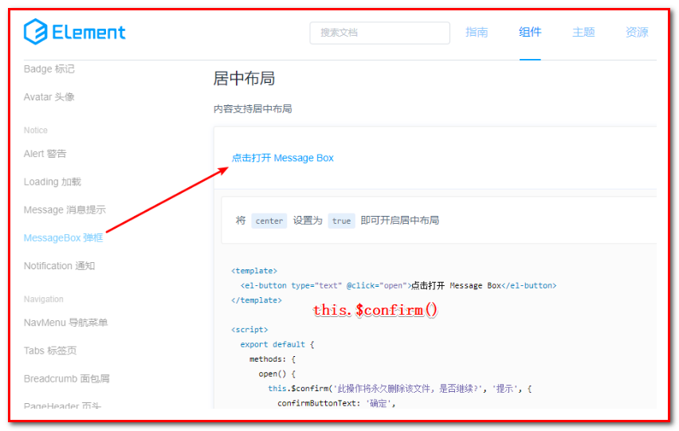

### 5.1.3. **发送请求**

如果用户点击确定按钮就需要发送 ajax 请求，并且将当前自由行的 id 作为参数提交到后台进行删除操作

```html
// 删除 handleDelete(row) { // alert(row.id);
this.$confirm("确认删除当前选中记录吗？","提示",{type:'warning'}).then(()=>{
//点击确定按钮时只需此处代码 // alert('用户点击的是确定按钮');
axios.get("/travelItem/delete.do?id=" + row.id).then((res)=> {
if(res.data.flag){ //删除成功 this.$message({ message: res.data.message, type:
'success' }); //调用分页，获取最新分页数据 this.findPage(); }else{ //删除失败
this.$message.error(res.data.message); } }); }); }
```

## 5.2. **后台代码**

### 5.2.1. **Controller**

在 `TravelItemController` 中增加删除方法

```java
package com.atguigu.controller;

import com.alibaba.dubbo.config.annotation.Reference;
import com.atguigu.constant.MessageConstant;
import com.atguigu.entity.PageResult;
import com.atguigu.entity.QueryPageBean;
import com.atguigu.entity.Result;
import com.atguigu.pojo.TravelItem;
import com.atguigu.service.TravelItemService;
import org.springframework.web.bind.annotation.RequestBody;
import org.springframework.web.bind.annotation.RequestMapping;
import org.springframework.web.bind.annotation.RestController;

/**
 * TravelItemController
 *
 * @Author: 马伟奇
 * @Description:
 */
@RequestMapping("/travel")
@RestController
public class TravelItemController {

    @Reference
    private TravelItemService travelItemService;

    @RequestMapping("/delete")
    public Result delete(Integer id){
        try {
            travelItemService.deleteById(id);
            return new Result(true,MessageConstant.DELETE_TRAVELITEM_SUCCESS);
        }catch (RuntimeException e){
            // 运行时异常，表示自由行和跟团游的关联表中存在数据
            return new Result(false,e.getMessage());
        }catch (Exception e) {
            e.printStackTrace();
            return new Result(false,MessageConstant.DELETE_TRAVELITEM_FAIL);
        }
    }
```

### 5.2.2. **服务接口**

在 `TravelItemService` 服务接口中扩展删除方法

```java
package com.atguigu.service;

import com.atguigu.entity.PageResult;
import com.atguigu.pojo.TravelItem;

/**
 * TravelItemService
 *
 * @Author: 马伟奇
 * @Description:
 */
public interface TravelItemService {

    void deleteById(Integer id);
}


```

### 5.2.3. **服务实现类**

注意：不能直接删除，需要判断当前自由行是否和跟团游关联，如果已经和跟团游进行了关联则不允许删除

```java
package com.atguigu.service.impl;

import com.alibaba.dubbo.config.annotation.Service;
import com.atguigu.dao.TravelItemDao;
import com.atguigu.entity.PageResult;
import com.atguigu.pojo.TravelItem;
import com.atguigu.service.TravelItemService;
import com.github.pagehelper.Page;
import com.github.pagehelper.PageHelper;
import org.springframework.beans.factory.annotation.Autowired;
import org.springframework.transaction.annotation.Transactional;

/**
 * TravelItemServiceImpl
 *
 * @Author: 马伟奇
 * @Description:
 */
@Service(interfaceClass = TravelItemService.class)
@Transactional
public class TravelItemServiceImpl implements TravelItemService {

    @Autowired
    private TravelItemDao travelItemDao;

    @Override
    public void deleteById(Integer id) {
        // 在删除自由行之前，先判断自由行的id，在中间表中是否存在数据
        long count =  travelItemDao.findCountByTravelItemItemId(id);
        // 中间表如果有数据，不要往后面执行，直接抛出异常
      // 如果非要删除也可以：delete from t_travelgroup_travelitem where travelitem_id = 1
        if (count > 0){
            throw new RuntimeException("不允许删除");
        }
        // 使用自由行的id进行删除
        travelItemDao.deleteById(id);
    }
```

### 5.2.4. **Dao 接口**

在 `TravelItemDao` 接口中扩展方法 `findCountByTravelItemItemId`和 `deleteById`

```java
package com.atguigu.dao;

import com.atguigu.pojo.TravelItem;
import com.github.pagehelper.Page;

/**
 * CheckItemDao
 *
 * @Author: 马伟奇
 * @Description:
 */
public interface TravelItemDao {

    void deleteById(Integer id);

    long findCountByTravelItemItemId(Integer id);
}


```

### 5.2.5. **Mapper 映射文件**

在 `TravelItemDao.xml` 中扩展 SQL 语句

```xml
<!--根据自由行id查询中间关系表-->
 <select id="findCountByTravelItemItemId" parameterType="int" resultType="long">
       select count(*) from t_travelgroup_travelitem where travelitem_id =#{id}
</select>
<!--删除-->
<delete id="deleteById" parameterType="int">
       delete from t_travelitem where id=#{id}
</delete>
```

### 【小结】

1：前台代码

（1）：绑定删除单击事件

（2）：弹出确认操作提示

（3）：发送 ajax 请求，执行删除

2：后台代码

（1）TravelItemController.java

（2）TravelItemService.java（服务接口）

（3）TravelItemServiceImpl.java（服务实现类）

（4）TravelItemDao.java（Dao 接口）

（5）TravelItemDao.xml（Mapper 映射文件）

# 6. **第六章. 编辑自由行**

① 根据 id 查询

调用方 requestparams 子成员：

| 名称 | 类型 | 必要 | 说明 |
| ---- | ---- | ---- | ---- |
| id   | int  | 是   | id   |

返回方 result 子成员：

| 名称      | 名称    | 名称 | 名称                          |
| --------- | ------- | ---- | ----------------------------- |
| id        | Integer | 是   | 主键                          |
| code      | String  | 是   | 项目编码                      |
| name      | String  | 是   | 项目名称                      |
| sex       | String  | 是   | 适用性别                      |
| age       | String  | 是   | 适用年龄（范围），例如：20-50 |
| price     | Float   | 是   | 价格                          |
| type      | String  | 是   | 自由行类型                    |
| remark    | String  | 是   | 项目说明                      |
| attention | String  | 是   | 注意事项                      |

调用地址

```properties
/travelItem/findById.do
```

② 编辑更新

调用方 requestparams 子成员：

| 名称      | 名称    | 名称 | 名称                          |
| --------- | ------- | ---- | ----------------------------- |
| id        | Integer | 是   | 主键                          |
| code      | String  | 是   | 项目编码                      |
| name      | String  | 是   | 项目名称                      |
| sex       | String  | 是   | 适用性别                      |
| age       | String  | 是   | 适用年龄（范围），例如：20-50 |
| price     | Float   | 是   | 价格                          |
| type      | String  | 是   | 自由行类型                    |
| remark    | String  | 是   | 项目说明                      |
| attention | String  | 是   | 注意事项                      |

调用地址

```properties
/travelItem/edit.do
```

### 【目标】

1：编辑自由行（ID 查询，回显）

2：编辑自由行（更新保存，执行 update）

### 【路径】

1：前台代码

（1）：点击编辑按钮，绑定单击事件

（2）：弹出编辑窗口回显数据

（3）：发送 ajax 请求，更改数据保存

2：后台代码

（1）TravelItemController.java

- 跳转到自由行编辑页面
- 编辑保存

（2）TravelItemService.java（服务接口）

（3）TravelItemServiceImpl.java（服务实现类）

（4）TravelItemDao.java（Dao 接口）

（5）TravelItemDao.xml（Mapper 映射文件）

### 【讲解】

## 6.1. 前台代码

用户点击编辑按钮时，需要弹出编辑窗口并且将当前记录的数据进行回显，用户修改完成后点击确定按钮将修改后的数据提交到后台进行数据库操作。

### 6.1.1. **绑定单击事件**

需要为编辑按钮绑定单击事件，并且将当前行数据作为参数传递给处理函数

```html
<el-button type="primary" size="mini" @click="handleUpdate(scope.row)"
  >编辑</el-button
>
```

处理事件：handleUpdate();

```html
// 弹出编辑窗口 handleUpdate(row) { alert(row.id); },
```

### 6.1.2. **弹出编辑窗口回显数据**

当前页面中的编辑窗口已经提供好了，默认处于隐藏状态。在 handleUpdate 方法中需要将编辑窗口展示出来，并且需要发送 ajax 请求查询当前自由行数据用于回显

```html
// 弹出编辑窗口 handleUpdate(row) { // alert(row.id); //发送请求获取自由行信息
axios.get("/travelItem/findById.do?id=" + row.id).then((res)=>{
if(res.data.flag){ //设置编辑窗口属性，dialogFormVisible4Edit为true表示显示
this.dialogFormVisible4Edit = true;
//为模型数据设置值，基于VUE双向数据绑定回显到页面 this.formData = res.data.data;
}else{ this.$message.error("获取数据失败，请刷新当前页面"); } }); },
```

### 6.1.3. 发送请求更改数据

在编辑窗口中修改完成后，点击确定按钮需要提交请求，所以需要为确定按钮绑定事件并提供处理函数 handleEdit

```html
<div slot="footer" class="dialog-footer">
  <el-button @click="dialogFormVisible4Edit = false">取消</el-button>
  <el-button type="primary" @click="handleEdit()">确定</el-button>
</div>
```

handleEdit()方法

```html
//编辑 handleEdit() { //表单校验 this.$refs['dataEditForm'].validate((valid)=>{
if(valid){ //表单校验通过，发送请求
axios.post("/travelItem/edit.do",this.formData).then((response)=> {
//隐藏编辑窗口 this.dialogFormVisible4Edit = false; if(response.data.flag){
//编辑成功，弹出成功提示信息 this.$message({ message: response.data.message,
type: 'success' }); }else{ //编辑失败，弹出错误提示信息
this.$message.error(response.data.message); } }).finally(()=> {
//重新发送请求查询分页数据 this.findPage(); }); }else{ //表单校验失败
this.$message.error("表单数据校验失败"); return false; } }); },
```

## 6.2. **后台代码**

### 6.2.1. **Controller**

在 `TravelItemController` 中增加编辑方法

```java
package com.atguigu.controller;

import com.alibaba.dubbo.config.annotation.Reference;
import com.atguigu.constant.MessageConstant;
import com.atguigu.entity.PageResult;
import com.atguigu.entity.QueryPageBean;
import com.atguigu.entity.Result;
import com.atguigu.pojo.TravelItem;
import com.atguigu.service.TravelItemService;
import org.springframework.web.bind.annotation.RequestBody;
import org.springframework.web.bind.annotation.RequestMapping;
import org.springframework.web.bind.annotation.RestController;

/**
 * TravelItemController
 *
 * @Author: 马伟奇
 * @Description:
 */
@RestController
@RequestMapping(value = "/travelItem")
public class TravelItemController {

    @Reference
    private TravelItemService travelItemService;

    @RequestMapping("/findById")
    public Result findById(Integer id){
        TravelItem travelItem =  travelItemService.findById(id);
        return new Result(true,MessageConstant.DELETE_TRAVELITEM_SUCCESS,travelItem);
    }

    @RequestMapping("/edit")
    public Result edit(@RequestBody TravelItem travelItem){
        travelItemService.edit(travelItem);
        return new Result(true,MessageConstant.EDIT_TRAVELITEM_SUCCESS);
    }


```

### 6.2.2. **服务接口**

在 `TravelItemService` 服务接口中扩展编辑方法

```java
package com.atguigu.service;

import com.atguigu.entity.PageResult;
import com.atguigu.pojo.TravelItem;

/**
 * TravelItemService
 *
 * @Author: 马伟奇
 * @Description:
 */
public interface TravelItemService {

    TravelItem findById(Integer id);

    void edit(TravelItem travelItem);
```

### 6.2.3. **服务实现类**

在 `TravelItemServiceImpl` 实现类中实现编辑方法

```java
package com.atguigu.service.impl;

import com.alibaba.dubbo.config.annotation.Service;
import com.atguigu.dao.TravelItemDao;
import com.atguigu.entity.PageResult;
import com.atguigu.pojo.TravelItem;
import com.atguigu.service.TravelItemService;
import com.github.pagehelper.Page;
import com.github.pagehelper.PageHelper;
import org.springframework.beans.factory.annotation.Autowired;
import org.springframework.transaction.annotation.Transactional;


/**
 * CheckItemServiceImpl
 *
 * @Author: 马伟奇
 * @Description:
 * // dubbo（整合声明式事务处理
 * 1：配置applicationContext-tx.xml对类代理，
 * 2：@Service(interfaceClass = TravelItemService.class)）
 */

@Service(interfaceClass = TravelItemService.class)
@Transactional
public class TravelItemServiceImpl implements CheckItemService {

    @Autowired
    private TravelItemDao travelItemDao;

   @Override
    public TravelItem findById(Integer id) {
        return travelItemDao.findById(id);
    }

    @Override
    public void edit(TravelItem travelItem) {
        travelItemDao.edit(travelItem);
    }
```

### 6.2.4. **Dao 接口**

在 `TravelItemDao` 接口中扩展 edit 方法

```java
package com.atguigu.dao;

import com.atguigu.pojo.TravelItem;
import com.github.pagehelper.Page;

/**
 * TravelItemDao
 *
 * @Author: 马伟奇
 * @Description:
 */
public interface TravelItemDao {
    TravelItem findById(Integer id);

    void edit(TravelItem travelItem);
}
```

### 6.2.5. **Mapper 映射文件**

在 `TravelItemDao.xml` 中扩展 SQL 语句

```xml
<!--根据自由行id查询自由行信息-->
<select id="findById" resultType="travelItem" parameterType="int">
    select * from t_travelitem where id = #{id}
</select>

<!--
  编辑 update t_travelitem set code=#{code},name=#{name} where id=#{id}

-->
<update id="edit" parameterType="travelItem">
    update t_travelitem
    <set>
        <if test="code!=null and code.length>0">
          code=#{code},
        </if>
        <if test="name!=null and name.length>0">
          name=#{name},
        </if>
        <if test="sex!=null and sex.length>0">
          sex=#{sex},
        </if>
        <if test="age!=null and age.length>0">
          age=#{age},
        </if>
        <if test="price!=null">
          price=#{price},
        </if>
        <if test="type!=null and type.length>0">
          type=#{type},
        </if>
        <if test="remark!=null and remark.length>0">
          remark=#{remark},
        </if>
        <if test="attention!=null and attention.length>0">
          attention=#{attention},
        </if>
  	</set>
    where id = #{id}
</update>
```

运行程序 `http://localhost:82/pages/main.html`

### 【错误】

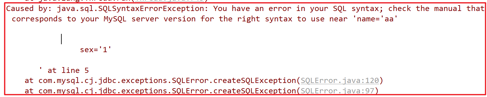

解决方案

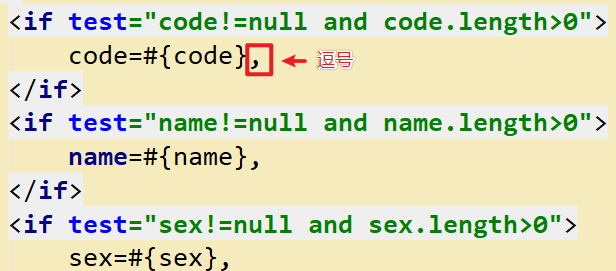

### 【小结】

1：前台代码

（1）：点击编辑按钮，绑定单击事件

（2）：弹出编辑窗口回显数据

（3）：发送 ajax 请求，更改数据保存

2：后台代码

（1）TravelItemController.java

- 跳转到自由行编辑页面
- 编辑保存

（2）TravelItemService.java（服务接口）

（3）TravelItemServiceImpl.java（服务实现类）

（4）TravelItemDao.java（Dao 接口）

（5）TravelItemDao.xml（Mapper 映射文件）

在 TravelItemDao.xml 中扩展 SQL 语句

```xml
<!--根据自由行id查询自由行信息-->
<select id="findById" resultType="TravelItem" parameterType="int">
    select * from t_travelitem where id = #{id}
</select>

<!--编辑-->
<update id="edit" parameterType="travelItem">
    update t_travelitem
    <set>
        <if test="code!=null and code.length>0">
          code=#{code},
        </if>
        <if test="name!=null and name.length>0">
          name=#{name},
        </if>
        <if test="sex!=null and sex.length>0">
          sex=#{sex},
        </if>
        <if test="age!=null and age.length>0">
          age=#{age},
        </if>
        <if test="price!=null">
          price=#{price},
        </if>
        <if test="type!=null and type.length>0">
          type=#{type},
        </if>
        <if test="remark!=null and remark.length>0">
          remark=#{remark},
        </if>
        <if test="attention!=null and attention.length>0">
          attention=#{attention},
        </if>
  	</set>
    where id = #{id}
</update>
```

扩充内容：使用 idea 批量操作对象属性

第一步：复制代码：

```java
private String code;//项目编码
private String name;//项目名称
private String sex;//适用性别
private String age;//适用年龄（范围），例如：20-50
private Float price;//价格
private String type;//自由行类型，
private String remark;//项目说明
private String attention;//注意事项
```

第二步：使用 Alt+鼠标拖动

```java
|private String code;//项目编码
|private String name;//项目名称
|private String sex;//适用性别
|private String age;//适用年龄（范围），例如：20-50
|private Float price;//价格
|private String type;//自由行类型
|private String remark;//项目说明
|private String attention;//注意事项
```

第三步：使用 Ctrl+Shift（跳一个单词），使用 Backspace 删除，private String/Float

```java
    code;//项目编码
    name;//项目名称
    sex;//适用性别
    age;//适用年龄（范围），例如：20-50
    price;//价格
    type;//自由行类型
    remark;//项目说明
    attention;//注意事项
```

第四步：使用 Shitf+End（跳到最后），使用 Backspace 删除，;//项目编码等

```java
code,
name,
sex,
age,
price,
type,
remark,
attention,
```

第五步：使用 Ctrl+Backspace，回到一行

```java
code,name,sex,age,price,type,remark,attention,
```
