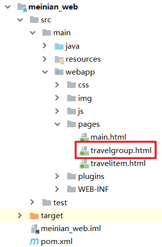
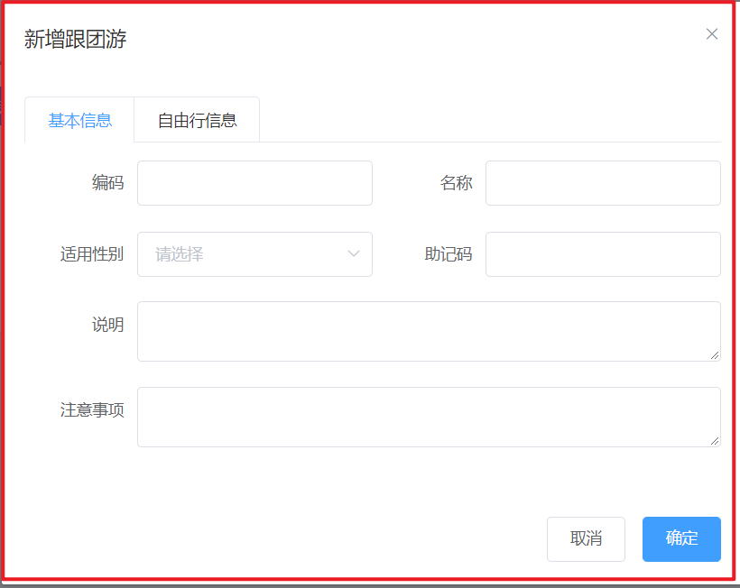
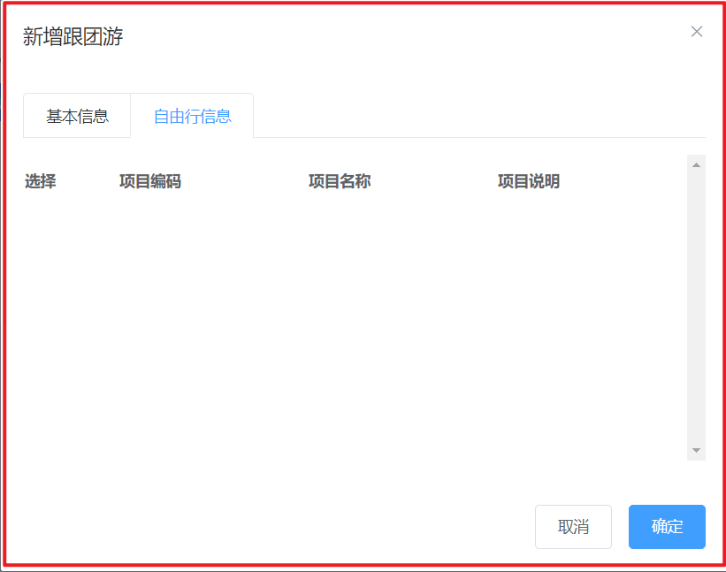
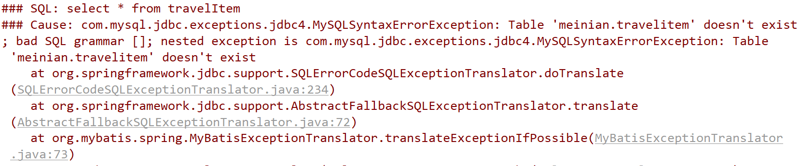
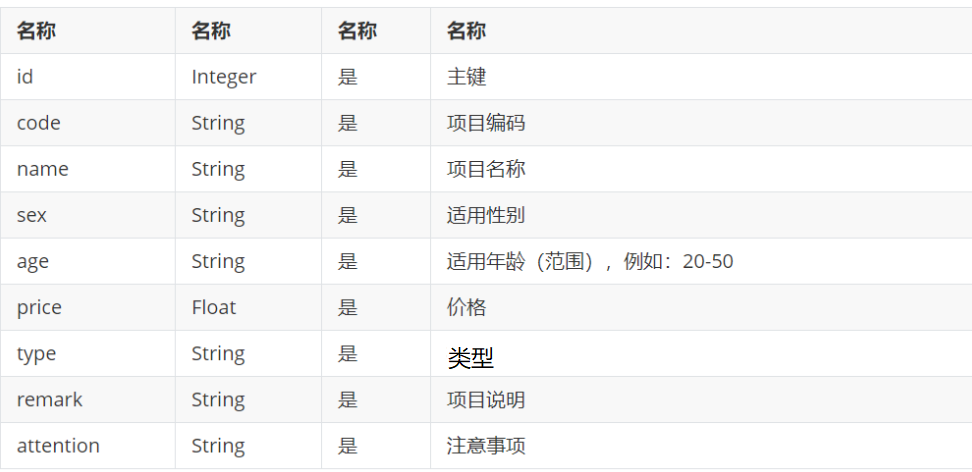

# 需求分析与跟团游

【需求】

报团游其实就是多个自由行的集合。

报团游对应的实体类为 `TravelGroup` ，对应的数据表为 `t_travelgroup`。报团游和自由行为多对多关系，所以需要中间表 `t_travelgroup_travelitem` 进行关联。

## 新增报团游

### 【目标】

新增报团游

### 【路径】

1：前台代码

（1）弹出新增窗口

（2）新增窗口中，动态展示自由行列表

（3）提交请求，执行保存

2：后台代码

执行

- 保存报团游数据
- 保存报团游和自由行中间表数据

（1）TravelGroupController.java（Controller）

（2）TravelGroupService.java（服务接口）

（3）TravelGroupServiceImpl.java（服务实现类）

（4）TravelGroupDao.java（Dao 接口）

（5）TravelGroupDao.xml（Mapper 映射文件）

### 【接口文档】

获取自由行信息

返回方 result 子成员：

请求方式 get

| 名称      | 类型    | 必要 | 说明                             |
| --------- | ------- | ---- | -------------------------------- |
| id        | Integer | 是   | 主键                             |
| code      | String  | 是   | 项目编码                         |
| name      | String  | 是   | 项目名称                         |
| sex       | String  | 是   | 适用性别                         |
| age       | String  | 是   | 适用年龄（范围），例如：20-50    |
| price     | Float   | 是   | 价格                             |
| type      | String  | 是   | 类型，分为自由行和跟团游两种类型 |
| remark    | String  | 是   | 项目说明                         |
| attention | String  | 是   | 注意事项                         |

调用地址

```properties
/travelItem/findAll.do
```

新增跟团游

调用方 requestparams 子成员：

请求方式 post

| 名称          | 类型   | 必要 | 说明                     |
| :------------ | ------ | ---- | ------------------------ |
| TravelItemIds | array  | 是   | 自由行 id 数组           |
| formData      | object | 是   | 表单数据，跟团游基本信息 |

formData 子成员如下：

| 名称      | 类型   | 必要 | 说明     |
| --------- | ------ | ---- | -------- |
| code      | String | 是   | 编码     |
| name      | String | 是   | 名称     |
| helpCode  | String | 是   | 助记     |
| sex       | String | 是   | 适用性别 |
| remark    | String | 是   | 介绍     |
| attention | String | 是   | 注意事项 |

调用地址

```properties
/travelgroup/add.do
```

### 【讲解】

## 2.1. **前台代码**

跟团游管理页面对应的是 `travelgroup.html` 页面，根据产品设计的原型已经完成了页面基本结构的编写，现在需要完善页面动态效果。



### 2.1.1. **弹出新增窗口**

页面中已经提供了新增窗口，只是出于隐藏状态。只需要将控制展示状态的属性 `dialogFormVisible` 改为`true` 即可显示出新增窗口。点击新建按钮时绑定的方法为 `handleCreate`，所以在 `handleCreate` 方法中修改`dialogFormVisible` 属性的值为 true 即可。同时为了增加用户体验度，需要每次点击新建按钮时清空表单输入项。

由于新增跟团游时还需要选择此跟团游包含的自由行，所以新增跟团游窗口分为两部分信息：基本信息和自由行信息，如下图：





（1）新建按钮绑定单击事件，对应的处理函数为 handleCreate

```html
<el-button type="primary" class="butT" @click="handleCreate()">新建</el-button>
```

（2）handleCreate()方法

```html
// 重置表单 resetForm() { this.formData = {}; }, // 弹出添加窗口 handleCreate()
{ this.resetForm(); this.dialogFormVisible = true; //
每次在新增窗口，都看到的都是第一个选项卡内容 this.activeName="first"; },
```

### 2.1.2. 新增窗口中，动态展示自由行列表

现在虽然已经完成了新增窗口的弹出，但是在自由行信息标签页中需要动态展示所有的自由行信息列表数据，并且可以进行勾选。具体操作步骤如下：

（1）定义模型数据

```html
tableData:[],//新增和编辑表单中对应的自由行列表数据
travelItemIds:[],//新增和编辑表单中自由行对应的复选框，基于双向绑定可以进行回显和数据提交，传递自由行id
```

（2）动态展示自由行列表数据，数据来源于上面定义的 `tableData` 模型数据

```html
<el-tab-pane label="自由行信息" name="second">
  <div class="checkScrol">
    <table class="datatable">
      <thead>
        <tr>
          <th>选择</th>
          <th>项目编码</th>
          <th>项目名称</th>
          <th>项目说明</th>
        </tr>
      </thead>
      <tbody>
        <tr v-for="c in tableData">
          <td>
            <input
              :id="c.id"
              v-model="travelItemIds"
              type="checkbox"
              :value="c.id"
            />
          </td>
          <td><label :for="c.id">{{c.code}}</label></td>
          <td><label :for="c.id">{{c.name}}</label></td>
          <td><label :for="c.id">{{c.remark}}</label></td>
        </tr>
      </tbody>
    </table>
  </div>
</el-tab-pane>
```

（3）完善 `handleCreate` 方法，发送 `ajax` 请求查询所有自由行数据并将结果赋值给 `tableData` 模型数据用于页面表格展示

```html
// 弹出添加窗口 handleCreate() { this.resetForm(); this.dialogFormVisible =
true; //默认切换到第一个标签页（基本信息） this.activeName='first'; //重置
this.travelItemIds = []; //发送ajax请求查询所有自由行信息
axios.get("/travelItem/findAll.do").then((res)=> { if(res.data.flag){
//将自由行列表数据赋值给模型数据用于页面表格展示 this.tableData = res.data.data;
}else{ this.$message.error(res.data.message); } }); },
```

（4）分别在 `TravelItemController` 、`TravelItemService` 、`TravelItemServiceImpl` 、`TravelItemDao`、`TravelItemDao.xml` 中扩展方法查询所有自由行数据

【1】：`TravelItemController` ：

```java
package com.atguigu.controller;

import com.alibaba.dubbo.config.annotation.Reference;
import com.atguigu.constant.MessageConstant;
import com.atguigu.entity.PageResult;
import com.atguigu.entity.QueryPageBean;
import com.atguigu.entity.Result;
import com.atguigu.pojo.TravelItem;
import com.atguigu.service.TravelItemService;
import org.springframework.web.bind.annotation.RequestBody;
import org.springframework.web.bind.annotation.RequestMapping;
import org.springframework.web.bind.annotation.RestController;

import java.util.List;

/**
 * TravelItemController
 *
 * @Author: 马伟奇
 * @Description:
 */
@RequestMapping("/travelItem")
@RestController
public class TravelItemController {

    @Reference
    private TravelItemService travelItemService;

    @RequestMapping("/findAll")
    public Result findAll(){
        List<TravelItem> lists =  travelItemService.findAll();
        return new Result(true, MessageConstant.QUERY_CHECKGROUP_SUCCESS,lists);
    }
```

【2】：`TravelItemService`：

```java
package com.atguigu.service;

import com.atguigu.entity.PageResult;
import com.atguigu.pojo.TravelItem;

import java.util.List;

/**
 * TravelItemService
 *
 * @Author: 马伟奇
 * @Description:
 */
public interface TravelItemService {

    List<TravelItem> findAll();
```

【3】：`TravelItemServiceImpl：`

```java
package com.atguigu.service.impl;

import com.alibaba.dubbo.config.annotation.Service;
import com.atguigu.dao.TravelItemDao;
import com.atguigu.entity.PageResult;
import com.atguigu.pojo.TravelItem;
import com.atguigu.service.TravelItemService;
import com.github.pagehelper.Page;
import com.github.pagehelper.PageHelper;
import org.springframework.beans.factory.annotation.Autowired;
import org.springframework.transaction.annotation.Transactional;

import java.util.List;

/**
 * TravelItemServiceImpl
 *
 * @Author: 马伟奇
 * @Description:
 */
@Service(interfaceClass = TravelItemService.class)
@Transactional
public class TravelItemServiceImpl implements TravelItemService {

    @Autowired
    private TravelItemDao travelItemDao;

    @Override
    public List<TravelItem> findAll() {
        return travelItemDao.findAll();
    }
```

【4】：`TravelItemDao：`

```java
package com.atguigu.dao;

import com.atguigu.pojo.TravelItem;
import com.github.pagehelper.Page;

import java.util.List;

/**
 * TravelItemDao
 *
 * @Author: 马伟奇
 * @Description:
 */
public interface TravelItemDao {
    List<TravelItem> findAll();
```

【5】：`TravelItemDao.xml：`

```xml
<select id="findAll" resultType="travelItem">
     select * from t_travelitem
</select>
```

运行程序 `http://localhost:82/pages/main.html`

常见错误：

数据库表名错误



### 2.1.3. **提交请求，执行保存**

当用户点击新增窗口中的确定按钮时发送 ajax 请求将数据提交到后台进行数据库操作。提交到后台的数据分为两部分：跟团游基本信息（对应的模型数据为 formData）和自由行 id 数组（对应的模型数据为`travelItemIds`）。

（1）为确定按钮绑定单击事件，对应的处理函数为`handleAdd`

```html
<el-button type="primary" @click="handleAdd()">确定</el-button>
```

（2）完善`handleAdd`方法

```html
//添加 handleAdd () { //发送ajax请求将模型数据提交到后台处理 axios.post(
"/travelgroup/add.do?travelItemIds=" + this.travelItemIds, this.formData
).then((response)=> { //关闭新增窗口 this.dialogFormVisible = false;
if(response.data.flag){ //新增成功，弹出成功提示 this.$message({ message:
response.data.message, type: 'success' }); }else{ //新增失败，弹出错误提示
this.$message.error(response.data.message); } }).finally(()=> { //
刷新首页列表数据 this.findPage(); }); },
```

## 2.2. **后台代码**

### 2.2.1. **Controller**

在 `meinian_web` 工程中创建 `TravelGroupController`

```java
package com.atguigu.controller;

import com.alibaba.dubbo.config.annotation.Reference;
import com.atguigu.constant.MessageConstant;
import com.atguigu.entity.Result;
import com.atguigu.pojo.TravelGroup;
import com.atguigu.pojo.TravelItem;
import com.atguigu.service.TravelGroupService;
import org.springframework.web.bind.annotation.RequestBody;
import org.springframework.web.bind.annotation.RequestMapping;
import org.springframework.web.bind.annotation.RestController;

import java.util.List;

/**
 * TravelGroupController
 *
 * @Author: 马伟奇
 * @Description:
 */
@RequestMapping("/travelgroup")
@RestController
public class TravelGroupController {

    @Reference
    private TravelGroupService travelGroupService;


    @RequestMapping("/add")
    public Result add(@RequestBody TravelGroup travelGroup,Integer[] travelItemIds){
        travelGroupService.add(travelGroup,travelItemIds);
        return new Result(true, MessageConstant.ADD_CHECKGROUP_SUCCESS);
    }
}
```

### 2.2.2. **服务接口**

在 `meinian_interface` 工程中创建 `TravelGroupService` 接口

```java
package com.atguigu.service;

import com.atguigu.pojo.TravelGroup;
import com.atguigu.pojo.TravelItem;

import java.util.List;

/**
 * TravelGroupService
 *
 * @Author: 马伟奇
 * @Description:
 */
public interface TravelGroupService {


    void add(TravelGroup travelGroup, Integer[] travelItemIds);
}


```

### 2.2.3. **服务实现类**

在 `meinian_service`工程中创建 `TravelGroupServiceImpl` 实现类

```java
package com.atguigu.service.impl;

import com.alibaba.dubbo.config.annotation.Service;
import com.atguigu.dao.TravelGroupDao;
import com.atguigu.pojo.TravelGroup;
import com.atguigu.pojo.TravelItem;
import com.atguigu.service.TravelGroupService;
import org.springframework.beans.factory.annotation.Autowired;
import org.springframework.transaction.annotation.Transactional;

import java.util.HashMap;
import java.util.List;
import java.util.Map;

/**
 * TravelGroupServiceImpl
 *
 * @Author: 马伟奇
 * @Description:
 */
@Service(interfaceClass = TravelGroupService.class)
@Transactional
public class TravelGroupServiceImpl implements TravelGroupService {

    @Autowired
    private TravelGroupDao travelGroupDao;


    @Override
    public void add(TravelGroup travelGroup, Integer[] travelItemIds) {
        // 1 新增跟团游，想t_travelgroup中添加数据，新增后返回新增的id
        travelGroupDao.add(travelGroup);
        // 2 新增跟团游和自由行中间表t_travelgroup_travelitem新增数据(新增几条，由travelItemIds决定)
        setTravelGroupAndTravelItem(travelGroup.getId(),travelItemIds);

    }

    private void setTravelGroupAndTravelItem(Integer travelGroupId, Integer[] travelItemIds) {
        // 新增几条数据，由travelItemIds的长度决定
        if (travelItemIds!=null && travelItemIds.length>0){
            for (Integer travelItemId : travelItemIds) {
                // 如果有多个参数使用map
                Map<String, Integer> map = new HashMap<>();
                map.put("travelGroup",travelGroupId);
                map.put("travelItem",travelItemId);
                travelGroupDao.setCheckGroupAndCheckItem(map);
            }
        }


    }
}
```

### 2.2.4. **Dao 接口**

在 `meinian_dao`工程中创建 `TravelGroupDao` 接口

```java
package com.atguigu.dao;

import com.atguigu.pojo.TravelGroup;
import com.atguigu.pojo.TravelItem;

import java.util.List;
import java.util.Map;

/**
 * TravelGroupDao
 *
 * @Author: 马伟奇
 * @Description:
 */
public interface TravelGroupDao {

    void add(TravelGroup travelGroup);

    void setTravelGroupAndTravelItem(Map<String, Integer> map);
}


```

### 2.2.5. **Mapper 映射文件**

在 `meinian_dao` 工程中创建 `TravelGroupDao.xml` 映射文件，需要和 `TravelGroupDao` 接口在同一目录下

```xml
<?xml version="1.0" encoding="UTF-8" ?>
<!DOCTYPE mapper PUBLIC "-//mybatis.org//DTD Mapper 3.0//EN"
        "http://mybatis.org/dtd/mybatis-3-mapper.dtd" >
<mapper namespace="com.atguigu.dao.TravelGroupDao">


    <insert id="add" parameterType="travelGroup">
        <!--在新增SQL语句之后执行select last_insert_id(), 返回int类型的值，封装到travelGroup中的id属性中-->
        <selectKey keyProperty="id" resultType="int" order="AFTER">
            select last_insert_id()
        </selectKey>
        insert into t_travelgroup(code,name,helpCode,sex,remark,attention) values (#{code},#{name},#{helpCode},#{sex},#{remark},#{attention})
    </insert>

    <insert id="setTravelGroupAndTravelItem" parameterType="map">
        insert into t_travelgroup_travelitem(travelgroup_id,travelitem_id) values (#{travelGroup},#{travelItem})
    </insert>


</mapper>
```

运行程序 `http://localhost:82/pages/main.html`

### 【小结】

1：前台代码

（1）弹出新增窗口

- 使用选项卡
- 选项卡一：跟团游信息
- 选项卡二：自由行列表，并提供复选框

（2）新增窗口中，动态展示自由行列表

- 查询所有自由行

（3）提交请求，执行保存

2：后台代码

执行

- 保存跟团游数据
- 保存跟团游和自由行中间表数据

（1）TravelGroupController.java（Controller）

（2）TravelGroupService.java（服务接口）

（3）TravelGroupServiceImpl.java（服务实现类）

（4）TravelGroupDao.java（Dao 接口）

（5）TravelGroupDao.xml（Mapper 映射文件）

# 3. **第三章**. 跟团游查询、分页

### 【目标】

检查跟团游、分页

### 【路径】

1：前台代码

（1）定义分页相关模型数据

（2）定义分页方法

（3）完善分页方法执行时机（点击“查询”，点击“分页”）

2：后台代码

执行

- 跟团游分页查询
- 保存跟团游和自由行中间表数据

（1）TravelGroupController.java（Controller）

（2）TravelGroupService.java（服务接口）

（3）TravelGroupServiceImpl.java（服务实现类）

（4）TravelGroupDao.java（Dao 接口）

（5）TravelGroupDao.xml（Mapper 映射文件）

### 【接口文档】

调用方 requestparams 子成员：

| 名称        | 类型    | 必要 | 说明       |
| ----------- | ------- | ---- | ---------- |
| currentPage | Integer | 是   | 页码       |
| pageSize    | Integer | 是   | 每页记录数 |
| queryString | String  | 是   | 查询条件   |

返回方 result 子成员：

| 名称  | 类型 | 必要 | 说明       |
| ----- | ---- | ---- | ---------- |
| rows  | List | 是   | 当前页结果 |
| total | Long | 是   | 总记录数   |

调用地址

```properties
/travelgroup/findPage.do
```

### 【讲解】

## 3.1. 前台代码

### 3.1.1. 定义分页相关模型数据

```html
pagination: {//分页相关模型数据 currentPage: 1,//当前页码
pageSize:10,//每页显示的记录数 total:0,//总记录数 queryString:null//查询条件 },
dataList: [],//当前页要展示的分页列表数据
```

### 3.1.2. **定义分页方法**

在页面中提供了 `findPage` 方法用于分页查询，为了能够在 `travelgroup.html` 页面加载后直接可以展示分页数据，可以在 `VUE` 提供的钩子函数`created` 中调用 `findPage`方法

```html
//钩子函数，VUE对象初始化完成后自动执行 created() { this.findPage(); },
```

`findPage()`方法。

```html
//分页查询 findPage() { //分页参数 var param = {
currentPage:this.pagination.currentPage,//页码
pageSize:this.pagination.pageSize,//每页显示的记录数
queryString:this.pagination.queryString//查询条件 }; //请求后台
axios.post("/travelgroup/findPage.do",param).then((response)=> {
//为模型数据赋值，基于VUE的双向绑定展示到页面 this.dataList =
response.data.rows;//数据集 this.pagination.total =
response.data.total;//总记录数 }); },
```

### 3.1.3. **完善分页方法执行时机**

除了在`created`钩子函数中调用`findPage`方法查询分页数据之外，当用户点击查询按钮或者点击分页条中的页码时也需要调用`findPage`方法重新发起查询请求。

（1）为查询按钮绑定单击事件，调用 `findPage` 方法

```html
<el-button @click="handleCurrentChange(1)" class="dalfBut">查询</el-button>
```

（2）为分页条组件绑定 `current-change` 事件，此事件是分页条组件自己定义的事件，当页码改变时触发，对应的处理函数为 `handleCurrentChange`

```html
<div class="pagination-container">
  <el-pagination
    class="pagiantion"
    @current-change="handleCurrentChange"
    :current-page="pagination.currentPage"
    :page-size="pagination.pageSize"
    layout="total, prev, pager, next, jumper"
    :total="pagination.total"
  >
  </el-pagination>
</div>
```

（3）定义 `handleCurrentChange` 方法

```html
//切换页码 handleCurrentChange(currentPage) { //currentPage为切换后的页码
this.pagination.currentPage = currentPage; this.findPage(); },
```

## 3.2. **后台代码**

### 3.2.1. **Controller**

在 `TravelGroupController` 中增加分页查询方法

```java
package com.atguigu.controller;

import com.alibaba.dubbo.config.annotation.Reference;
import com.atguigu.constant.MessageConstant;
import com.atguigu.entity.PageResult;
import com.atguigu.entity.QueryPageBean;
import com.atguigu.entity.Result;
import com.atguigu.pojo.TravelGroup;
import com.atguigu.pojo.TravelItem;
import com.atguigu.service.TravelGroupService;
import org.springframework.web.bind.annotation.RequestBody;
import org.springframework.web.bind.annotation.RequestMapping;
import org.springframework.web.bind.annotation.RestController;

import java.util.List;

/**
 * TravelGroupController
 *
 * @Author: 马伟奇
 * @CreateTime: 2019-12-29
 * @Description:
 */
@RequestMapping("/travelgroup")
@RestController
public class TravelGroupController {

    @Reference
    private TravelGroupService travelGroupService;
    // 传递当前页，每页显示的记录数，查询条件
    // 响应PageResult，封装总记录数，结果集
    @RequestMapping("/findPage")
    public PageResult findPage(@RequestBody QueryPageBean queryPageBean){
        PageResult pageResult =  travelGroupService.findPage(
                queryPageBean.getCurrentPage(),
                queryPageBean.getPageSize(),
                queryPageBean.getQueryString());
        return pageResult;
    }

```

### 3.2.2. **服务接口**

在`TravelGroupService`服务接口中扩展分页查询方法

```java
package com.atguigu.service;

import com.atguigu.entity.PageResult;
import com.atguigu.pojo.TravelGroup;
import com.atguigu.pojo.TravelItem;

import java.util.List;

/**
 * TravelGroupService
 *
 * @Author: 马伟奇
 * @CreateTime: 2019-12-29
 * @Description:
 */
public interface TravelGroupService {
    PageResult findPage(Integer currentPage, Integer pageSize, String queryString);
```

### 3.2.3. **服务实现类**

在 `TravelGroupServiceImpl` 服务实现类中实现分页查询方法，基于 `Mybatis` 分页助手插件实现分页

```java
package com.atguigu.service.impl;

import com.alibaba.dubbo.config.annotation.Service;
import com.atguigu.dao.TravelGroupDao;
import com.atguigu.entity.PageResult;
import com.atguigu.pojo.TravelGroup;
import com.atguigu.pojo.TravelItem;
import com.atguigu.service.TravelGroupService;
import com.github.pagehelper.Page;
import com.github.pagehelper.PageHelper;
import org.springframework.beans.factory.annotation.Autowired;
import org.springframework.transaction.annotation.Transactional;

import java.util.HashMap;
import java.util.List;
import java.util.Map;

/**
 * TravelGroupServiceImpl
 *
 * @Author: 马伟奇
 * @CreateTime: 2019-12-29
 * @Description:
 */
@Service(interfaceClass = TravelGroupService.class)
@Transactional
public class TravelGroupServiceImpl implements TravelGroupService {

    @Autowired
    private TravelGroupDao travelGroupDao;

    @Override
    public PageResult findPage(Integer currentPage, Integer pageSize, String queryString) {
        // 使用分页插件PageHelper，设置当前页，每页最多显示的记录数
        PageHelper.startPage(currentPage,pageSize);
        // 响应分页插件的Page对象
        Page<TravelGroup> page = travelGroupDao.findPage(queryString);
        return new PageResult(page.getTotal(),page.getResult());
    }
```

### 3.2.4. **Dao 接口**

在 `TravelGroupDao` 接口中扩展分页查询方法

```java
package com.atguigu.dao;

import com.atguigu.pojo.TravelGroup;
import com.atguigu.pojo.TravelItem;
import com.github.pagehelper.Page;

import java.util.List;
import java.util.Map;

/**
 * TravelGroupDao
 *
 * @Author: 马伟奇
 * @CreateTime: 2019-12-29
 * @Description:
 */
public interface TravelGroupDao {
    Page<TravelGroup> findPage(String queryString);
```

### 3.2.5. **Mapper 映射文件**

在 `TravelGroupDao.xml` 文件中增加 SQL 定义

```xml
<!--
   分页查询   concat: 在mysql的语法中，表示字符串的连接符，like %#{value}%
-->
<select id="findPage" parameterType="string" resultType="travelGroup">
    select * from t_travelgroup
    <where>
        <if test="value!=null and value.length>0">
            code =#{value} or name like "%"#{value}"%" or helpCode=#{value}
        </if>
    </where>
</select>
```

导入数据到 mysql

```sql
INSERT INTO `t_travelgroup` VALUES ('5', '0001', '昆明、大理、丽江双飞单动6日经典游', 'YBJC', '0', '春节昆明-大理-丽江双飞6日游牛新品/18人小团0购物+5A石林+玉龙雪山大索登顶+洱海Jeep旅拍+南诏风情岛+非遗白族扎染体验+彝族特色长街宴 ', '无');
INSERT INTO `t_travelgroup` VALUES ('6', '0002', '三亚-蜈支洲岛-亚龙湾双飞5日4晚跟团游', 'SLSJ', '0', '华东五市-乌镇-南浔-杭州双飞6日游>全新升级4晚维也纳系列酒店，全程0自费，观水乡婚礼，登雷峰塔，品金陵十六味，含宋城/上海夜景', null);
INSERT INTO `t_travelgroup` VALUES ('7', '0003', '重庆、武隆仙女山、天坑三硚、龙水峡地缝、洪崖洞、磁器口古镇双飞5日经典游', 'XCG', '0', '春节南宁-越南-下龙湾-北海双飞7日游>0购0自费/境外国际4星/1晚希尔顿/168元海鲜自助/奥巴马米粉/赠越式按摩/可升涠洲岛/全程领队/双口岸进出', null);
INSERT INTO `t_travelgroup` VALUES ('8', '0004', '印度尼西亚巴厘岛7日5晚半自助跟团游', 'NCG', '0', '春节海南三亚双飞5日游17万人游玩0购物，180度海景房(华美达/明申/维景/唐拉雅秀)，赠全海景玻璃栈道+蟹鲍海鲜餐，20年出游去南山看108米海上观音', null);
INSERT INTO `t_travelgroup` VALUES ('9', '0005', '厦门-鼓浪屿-云水谣土楼双飞5日4晚跟团游', 'GGSX', '0', '厦门-鼓浪屿双飞5日游臻品9人团0购0自，全程五星华邑/万豪海景房，高标佳丽自助/地标全海景餐厅，人气日光岩植物园鹭江夜游，接送0等待', null);
INSERT INTO `t_travelgroup` VALUES ('10', '0006', '越南芽庄6日5晚自由行', 'NGSX', '0', '土耳其10日游超6000人选择牛人专线/五星航空直飞内陆双飞/费特希耶/网红景点齐打卡/五星酒店升1晚真洞穴酒店/升级4特色餐/2顿中餐', null);
INSERT INTO `t_travelgroup` VALUES ('11', '0007', '印度尼西亚巴厘岛7日5晚半自助跟团游', 'XZSX', '0', '春节埃及-迪拜-阿布扎比10日游A380或波音787/埃及全程五星/红海两晚/宿卢克索/吉萨金字塔群/埃及博物馆/马车巡游/风帆船', null);
INSERT INTO `t_travelgroup` VALUES ('12', '0008', '泰国普吉岛7日5晚跟团游', 'XJMSX', '0', '春节埃及+土耳其11-14日游埃及卢克索/亚历山大/红海,土耳其伊斯坦布尔/圣索菲亚大教堂,内陆4段飞,含卡帕和棉花堡,TK', null);
INSERT INTO `t_travelgroup` VALUES ('13', '0009', '悉尼-黄金海岸 汉密尔顿8日6晚品质游', 'JGSX', '0', '南美印象5国+巴西+阿根廷+秘鲁+智利+乌拉圭16-20日游>纯玩无购物/雨林/伊瓜苏瀑布/纳斯卡地画/四到五星酒店/部分增游马丘比丘', null);
INSERT INTO `t_travelgroup` VALUES ('14', '0010', '柬埔寨吴哥6日4晚跟团游', 'ZGFJCC', '2', '春节美国东西海岸11-13日游游多款产品可选/迪士尼一日双园过大年/环球影城/峡谷/羚羊彩穴/马蹄湾/部分团期升级纯玩团/保证拼住', null);
INSERT INTO `t_travelgroup` VALUES ('15', '0011', '张家界、玻璃桥、天门山、芙蓉镇、凤凰古城双飞5日跟团游', 'DHSSX', '0', '美国西雅图-波特兰6晚8日自由行西雅图进波特兰出，精选全程6晚酒店，行程天数可随意增减', null);
```

运行程序 `http://localhost:82/pages/main.html`

### 【小结】

1：前台代码

（1）定义分页相关模型数据

（2）定义分页方法

findPage()方法。

```js
//分页查询 findPage() { //分页参数
 var param = {
currentPage:this.pagination.currentPage,//页码
pageSize:this.pagination.pageSize,//每页显示的记录数
queryString:this.pagination.queryString//查询条件 }; //请求后台
axios.post("/travelgroup/findPage.do",param).then((response)=> {
//为模型数据赋值，基于VUE的双向绑定展示到页面
this.dataList =
response.data.rows;//数据集
this.pagination.total =
response.data.total;//总记录数
}); },
```

（3）完善分页方法执行时机（点击“查询”，点击“分页”）

2：后台代码

执行

- 跟团游分页查询

（1）TravelGroupController.java（Controller）

（2）TravelGroupService.java（服务接口）

（3）TravelGroupServiceImpl.java（服务实现类）

（4）TravelGroupDao.java（Dao 接口）

（5）TravelGroupDao.xml（Mapper 映射文件）

# 4. **第四章. 编辑跟团游**

### 【目标】

编辑跟团游

### 【路径】

1：前台页面

（1）绑定“编辑”单击事件

（2）弹出编辑窗口回显数据

- 回显跟团游数据
- 查询自由行列表
- 当前跟团游具有的自由行的复选框需要选中

（3）发送请求，编辑保存跟团游

- 编辑跟团游

2：后台页面

执行

- 编辑跟团游保存
- 删除自由行和跟团游中间表数据
- 重新新增自由行和跟团游中间表数据

（1）TravelGroupController.java（Controller）

（2）TravelGroupService.java（服务接口）

（3）TravelGroupServiceImpl.java（服务实现类）

（4）TravelGroupDao.java（Dao 接口）

（5）TravelGroupDao.xml（Mapper 映射文件）

### 【接口文档】

① 根据 id 查询跟团游信息

请求方式：get 请求

调用方 requestparams 子成员：

| 名称 | 类型 | 必要 | 说明 |
| ---- | ---- | ---- | ---- |
| id   | int  | 是   | id   |

返回方 result 子成员：

| 名称      | 类型   | 必要 | 说明     |
| --------- | ------ | ---- | -------- |
| code      | String | 是   | 编码     |
| name      | String | 是   | 名称     |
| helpCode  | String | 是   | 助记     |
| sex       | String | 是   | 适用性别 |
| remark    | String | 是   | 介绍     |
| attention | String | 是   | 注意事项 |

调用地址

```properties
/travelgroup/findById.do
```

② 查询所有的自由行信息

请求方式：get 请求

调用地址

```properties
/travelItem/findAll.do
```

返回方 result 子成员：


③ 使用跟团游 id，查询当前跟团游具有的自由行的 id 集合

请求方式：get 请求

调用地址

```properties
/travelgroup/findTravelItemIdByTravelgroupId.do
```

调用方 requestparams 子成员：

| 名称 | 类型 | 必要 | 说明 |
| ---- | ---- | ---- | ---- |
| id   | int  | 是   | id   |

返回方 result 子成员：

| 名称          | 类型 | 必要 | 说明             |
| ------------- | ---- | ---- | ---------------- |
| travelItemIds | list | 是   | 自由行的 id 集合 |

### 【讲解】

## 4.1. 前台页面

用户点击编辑按钮时，需要弹出编辑窗口并且将当前记录的数据进行回显，用户修改完成后点击确定按钮将修改后的数据提交到后台进行数据库操作。此处进行数据回显的时候，除了需要跟团游基本信息的回显之外，还需要回显当前跟团游包含的自由行（以复选框勾选的形式回显）。

### 4.1.1. **绑定单击事件**

（1）需要为编辑按钮绑定单击事件，并且将当前行数据作为参数传递给处理函数

```xml
<el-table-column label="操作" align="center">
    <template slot-scope="scope">
        <el-button type="primary" size="mini" @click="handleUpdate(scope.row)">编辑</el-button>
        <el-button size="mini" type="danger" @click="handleDelete(scope.row)">删除</el-button>
    </template>
</el-table-column>
```

（2）handleUpdate 事件

```html
// 弹出编辑窗口 handleUpdate(row) { alert(row.id); },
```

### 4.1.2. **弹出编辑窗口回显数据**

当前页面的编辑窗口已经提供好了，默认处于隐藏状态。在 handleUpdate 方法中需要将编辑窗口展示出来，并且需要发送多个 ajax 请求分别查询当前跟团游数据、所有自由行数据、当前跟团游包含的自由行 id 用于基本数据回显

```html
// 弹出编辑窗口 handleUpdate(row) { //alert(row.id); //1
发送ajax请求根据id查询跟团游信息，用于基本信息回显
axios.get("/travelgroup/findById.do?id=" + row.id).then((res)=>{
if(res.data.flag){ //弹出编辑窗口 this.dialogFormVisible4Edit = true;
//默认选中第一个标签页 this.activeName='first';
//为模型数据赋值，通过VUE数据双向绑定进行信息的回显 this.formData =
res.data.data; this.$message({ type:"success", message: response.data.message })
// 2：查询自由行列表 发送ajax请求查询所有的自由行信息，用于自由行表格展示
axios.get("/travelItem/findAll.do").then((res)=> { if(res.data.flag){
//为模型数据赋值，通过VUE数据双向绑定进行信息的回显 this.tableData =
res.data.data; // 3：当前跟团游具有的自由行的复选框需要选中 //
使用跟团游id，查询当前跟团游具有的自由行的id集合 // this.checkitemIds =
[28,29,30]; // 如果返回Result(flag,message,data)对应写法： // this.checkitemIds
= response.data.data; // 如果返回List<Integer
  >对应写法：this.checkitemIds = response.data;
  //查询当前跟团游包含的所有自由行id，用于页面回显
  axios.get("/travelgroup/findTravelItemIdByTravelgroupId.do?id=" +
  row.id).then((res)=> { //为模型数据赋值，通过VUE数据双向绑定进行信息的回显
  this.travelItemIds = res.data; }); }else{
  this.$message.error(res.data.message); } }); }else{
  this.$message.error("获取数据失败，请刷新当前页面"); } }); },</Integer
>
```

### 4.1.3. **发送请求，编辑保存跟团游**

保存跟团游

请求方式：post 请求

请求地址

```properties
/travelgroup/edit.do
```

调用方 requestparams 子成员：

| 名称          | 类型   | 必要 | 说明             |
| ------------- | ------ | ---- | ---------------- |
| travelItemIds | int    | 是   | 自由行 id 的集合 |
| formData      | object | 是   | 自由行表单数据   |

formData 子成员如下：



（1）在编辑窗口中修改完成后，点击确定按钮需要提交请求，所以需要为确定按钮绑定事件并提供处理函数 handleEdit

```html
<el-button type="primary" @click="handleEdit()">确定</el-button>
```

（2）handleEdit()方法

```html
//编辑 handleEdit() { //发送ajax请求，提交模型数据
axios.post("/travelgroup/edit.do?travelItemIds="+this.travelItemIds,this.formData).then((response)=>
{ //隐藏编辑窗口 this.dialogFormVisible4Edit = false; //
返回true，表示成功，否则表示失败 if(response.data.flag){ this.$message({
message: response.data.message, type: 'success' }); }else{
this.$message.error(response.data.message); } }).finally(()=> { this.findPage();
}); },
```

## 4.2. **后台代码**

### 4.2.1. **Controller**

在 `TravelGroupController` 中增加方法

```java
package com.atguigu.controller;

import com.alibaba.dubbo.config.annotation.Reference;
import com.atguigu.constant.MessageConstant;
import com.atguigu.entity.PageResult;
import com.atguigu.entity.QueryPageBean;
import com.atguigu.entity.Result;
import com.atguigu.pojo.TravelGroup;
import com.atguigu.pojo.TravelItem;
import com.atguigu.service.TravelGroupService;
import org.springframework.web.bind.annotation.RequestBody;
import org.springframework.web.bind.annotation.RequestMapping;
import org.springframework.web.bind.annotation.RestController;

import java.util.List;

/**
 * TravelGroupController
 *
 * @Author: 马伟奇
 * @CreateTime: 2019-12-29
 * @Description:
 */
@RequestMapping("/travelgroup")
@RestController
public class TravelGroupController {

    @Reference
    private TravelGroupService travelGroupService;
    // 使用自由行id，查询跟团游和自由行的中间表，获取自由行的集合，存放id的值
    @RequestMapping("/findTravelItemIdByTravelgroupId")
    public List<Integer> findTravelItemIdByTravelgroupId(Integer id){
        List<Integer> list =  travelGroupService.findTravelItemIdByTravelgroupId(id);
        return list;
    }


    // 使用id查询跟团游，进行表单回显
    @RequestMapping("/findById")
    public Result findById(Integer id){
       TravelGroup travelGroup =  travelGroupService.findById(id);
       return new Result(true,MessageConstant.QUERY_TRAVELGROUP_SUCCESS,travelGroup);
    }

     // 编辑跟团游（返回 public Result(boolean flag, String message)）
   @RequestMapping("/edit")
   public Result edit(Integer[] travelItemIds,@RequestBody TravelGroup travelGroup ){
        travelGroupService.edit(travelItemIds,travelGroup);
        return new Result(true,MessageConstant.EDIT_TRAVELGROUP_SUCCESS);
    }
```

### 4.2.2. **服务接口**

在 `TravelGroupService` 服务接口中扩展方法

```java
package com.atguigu.service;

import com.atguigu.entity.PageResult;
import com.atguigu.pojo.TravelGroup;
import com.atguigu.pojo.TravelItem;

import java.util.List;

/**
 * TravelGroupService
 *
 * @Author: 马伟奇
 * @CreateTime: 2019-12-29
 * @Description:
 */
public interface TravelGroupService {
    TravelGroup findById(Integer id);

    void edit(Integer[] travelItemIds, TravelGroup travelGroup);

    List<Integer> findTravelItemIdByTravelgroupId(Integer id);


```

### 4.2.3. **服务实现类**

在 `TravelGroupServiceImpl` 实现类中实现编辑方法

```java
package com.atguigu.service.impl;

import com.alibaba.dubbo.config.annotation.Service;
import com.atguigu.dao.TravelGroupDao;
import com.atguigu.entity.PageResult;
import com.atguigu.pojo.TravelGroup;
import com.atguigu.pojo.TravelItem;
import com.atguigu.service.TravelGroupService;
import com.github.pagehelper.Page;
import com.github.pagehelper.PageHelper;
import org.springframework.beans.factory.annotation.Autowired;
import org.springframework.transaction.annotation.Transactional;

import java.util.HashMap;
import java.util.List;
import java.util.Map;

/**
 * TravelGroupServiceImpl
 *
 * @Author: 马伟奇
 * @CreateTime: 2019-12-29
 * @Description:
 */
@Service(interfaceClass = TravelGroupService.class)
@Transactional
public class TravelGroupServiceImpl implements TravelGroupService {

    @Autowired
    private TravelGroupDao travelGroupDao;

    @Override
    public TravelGroup findById(Integer id) {
        return travelGroupDao.findById(id);
    }

    @Override
    public List<Integer> findTravelItemIdByTravelgroupId(Integer id) {
        return travelGroupDao.findTravelItemIdByTravelgroupId(id);
    }


    @Override
    public void edit(Integer[] travelitemIds, TravelGroup travelGroup) {
        // 1：修改跟团游的基本信息
        travelGroupDao.edit(travelGroup);
        /**
         * 2：修改跟团游和自由行的中间表（先删除，再创建）
         * 之前的数据删除
         * 再新增页面选中的数据
         */
        // 删除之前中间表的数据
            travelGroupDao.deleteTravelGroupAndTravelItemByTravelGroupId(travelGroup.getId());
        // 再新增页面选中的数据
        setTravelGroupAndTravelItem(travelGroup.getId(),travelitemIds);
    }
```

### 4.2.4. **Dao 接口**

在`TravelGroupDao`接口中扩展方法

```java
package com.atguigu.dao;

import com.atguigu.pojo.TravelGroup;
import com.github.pagehelper.Page;

import java.util.List;
import java.util.Map;

/**
 * TravelGroupDao
 *
 * @Author: 马伟奇
 * @CreateTime: 2019-12-19
 * @Description:
 */
public interface TravelGroupDao {

    TravelGroup findById(Integer id);


    List<Integer> findTravelItemIdByTravelgroupId(Integer id);

    void deleteTravelGroupAndTravelItemByTravelGroupId(Integer id);
```

### 4.2.5. **Mapper 映射文件**

在 `TravelGroupDao.xml` 中扩展 SQL 语句

```xml
<?xml version="1.0" encoding="UTF-8" ?>
<!DOCTYPE mapper PUBLIC "-//mybatis.org//DTD Mapper 3.0//EN"
        "http://mybatis.org/dtd/mybatis-3-mapper.dtd" >
<mapper namespace="com.atguigu.dao.TravelGroupDao">

    <!--使用id查询跟团游-->
    <select id="findById" parameterType="int" resultType="travelGroup">
        select * from t_travelgroup where id =#{id}
    </select>


    <!--使用跟团游id，查询跟团游和自由行中间表，获取自由行id的集合-->
    <select id="findTravelItemIdByTravelgroupId" resultType="int">
        select travelitem_id from t_travelgroup_travelitem where travelgroup_id =#{id}

    </select>

     <!--编辑跟团游-->
    <update id="edit" parameterType="travelGroup">
        update t_travelgroup
        <set>
            <if test="code!=null and code.length>0">
                code = #{code},
            </if>
            <if test="name!=null and name.length>0">
                name = #{name},
            </if>
            <if test="helpCode!=null and helpCode.length>0">
                helpCode = #{helpCode},
            </if>
            <if test="sex!=null and sex.length>0">
                sex = #{sex},
            </if>
            <if test="remark!=null and remark.length>0">
                remark = #{remark},
            </if>
            <if test="attention!=null and attention.length>0">
                attention = #{attention},
            </if>
        </set>
        where id = #{id}
    </update>


    <!--使用跟团游id，删除自由行和跟团游中间表数据-->
    <delete id="deleteTravelGroupAndTravelItemByTravelGroupId" parameterType="int">
        delete from t_travelgroup_travelitem where travelgroup_id =#{id}
    </delete>

</mapper>
```

运行程序 `http://localhost:82/pages/main.html`

### 【小结】

1：前台页面

（1）绑定“编辑”单击事件

（2）弹出编辑窗口回显数据

- 回显跟团游数据
- 查询自由行列表
- 当前跟团游具有的自由行的复选框需要选中

（3）发送请求，编辑保存跟团游

- 编辑跟团游

2：后台页面

执行

- 编辑跟团游保存
- 删除自由行和跟团游中间表数据
- 重新新增自由行和跟团游中间表数据

（1）TravelGroupController.java（Controller）

（2）TravelGroupService.java（服务接口）

（3）TravelGroupServiceImpl.java（服务实现类）

（4）TravelGroupDao.java（Dao 接口）

（5）TravelGroupDao.xml（Mapper 映射文件）
