# 预约管理-套餐管理

学习目标：

1：了解常见的图片存储方案

2：掌握新增套餐实现过程

3：掌握套餐分页查询实现过程

4：掌握 Quartz 使用方式

# 1. 第一章. 图片存储方案

### 【目标】

美年旅游项目，图片存储方案

### 【路径】

1：介绍

（1）文件上传功能介绍

2：七牛云存储

（1）注册

（2）新建存储空间

（3）查看存储空间信息

（4）开发者中心

- 文件上传
- 文件删除

（5）鉴权

（6）Java SDK 操作七牛云

（7）封装工具类

### 【讲解】

## 1.1. **介绍**

在实际开发中，我们会有很多处理不同功能的服务器。例如：

应用服务器：负责部署我们的应用

数据库服务器：运行我们的数据库

文件服务器：负责存储用户上传文件的服务器


分服务器处理的目的是让服务器各司其职，从而提高我们项目的运行效率。

常见的图片存储方案：

方案一：使用 nginx 搭建图片服务器

方案二：使用开源的分布式文件存储系统，例如 Fastdfs、HDFS 等

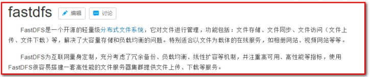

方案三：使用云存储，例如阿里云、==七牛云==等

## 1.2. **七牛云存储**

七牛云（隶属于上海七牛信息技术有限公司）是国内领先的以视觉智能和数据智能为核心的企业级云计算服务商，同时也是国内知名智能视频云服务商，累计为 70 多万家企业提供服务，覆盖了国内 80%网民。围绕富媒体场景推出了==对象存储==、融合 CDN 加速、容器云、大数据平台、深度学习平台等产品、并提供一站式智能视频云解决方案。为各行业及应用提供可持续发展的智能视频云生态，帮助企业快速上云，创造更广阔的商业价值。

官网：<https://www.qiniu.com/>

通过七牛云官网介绍我们可以知道其提供了多种服务，==我们主要使用的是七牛云提供的对象存储服务来存储图片。==

### 1.2.1. **注册、登录**

要使用七牛云的服务，首先需要注册成为会员。地址：<https://portal.qiniu.com/signup>


注册完成后就可以使用刚刚注册的邮箱和密码登录到七牛云：

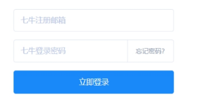

登录成功后点击页面右上角管理控制台：

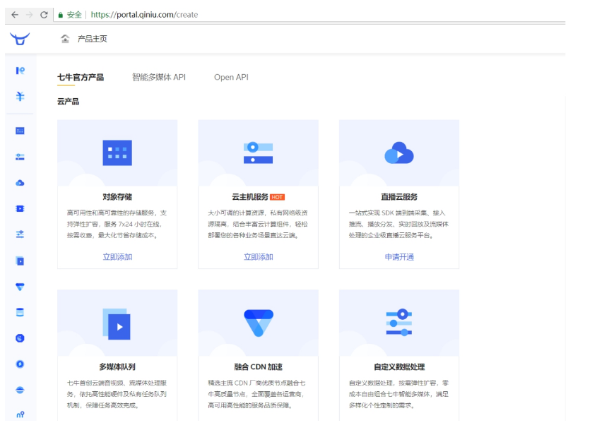

==注意：登录成功后还需要进行实名认证才能进行相关操作。==

### 1.2.2. **新建存储空间**

要进行图片存储，我们需要在七牛云管理控制台新建存储空间。点击管理控制台首页对象存储下的立即添加按钮，页面跳转到新建存储空间页面：

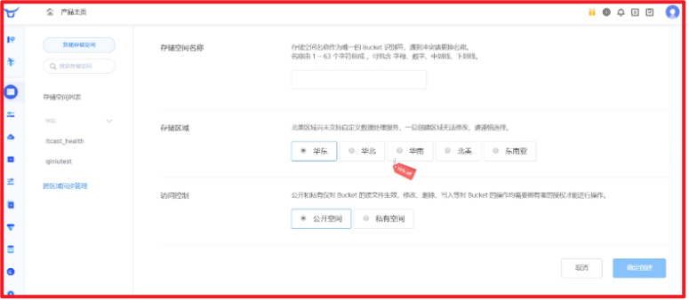

可以创建多个存储空间，各个存储空间是相互独立的。

### 1.2.3. **查看存储空间信息**

存储空间创建后，会在左侧的存储空间列表菜单中展示创建的存储空间名称，点击存储空间名称可以查看当前存储空间的相关信息

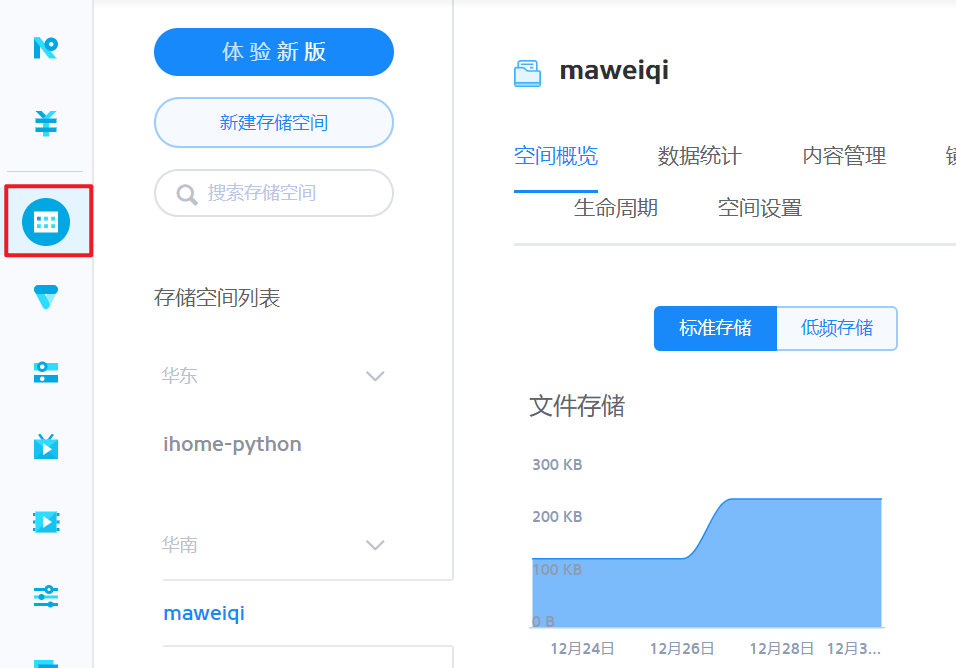

==课程中重点关注【内容管理】中的信息。==

### 1.2.4. **开发者中心**

可以通过七牛云提供的开发者中心学习如何操作七牛云服务，地址：<https://developer.qiniu.com/>

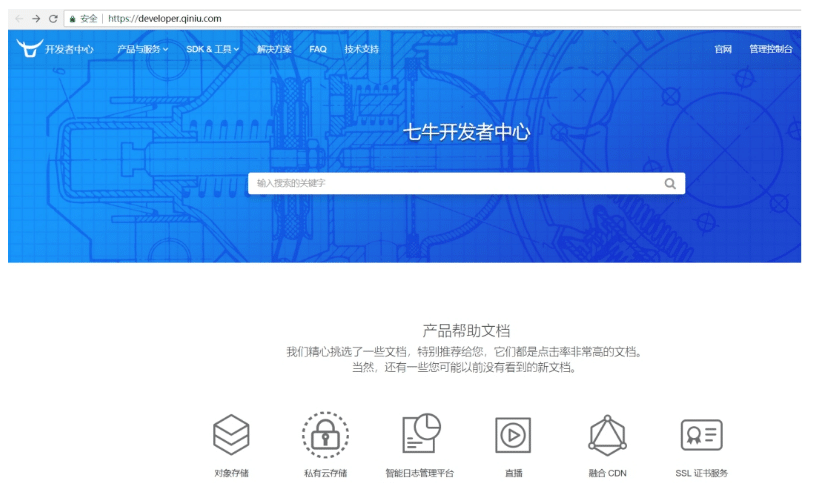

点击对象存储，跳转到对象存储开发页面，地址：<https://developer.qiniu.com/kodo>


操作步骤：

第一步：导入 jar 包：


第二步：鉴权


点击“管理控制台”，点击右上图标

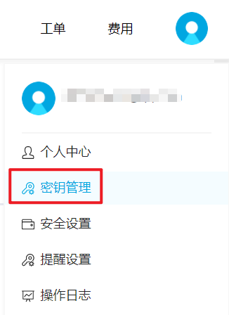

可根据文档中提供的上传文件和删除文件进行测试：

在 `meinian_common` 中测试

#### 1.2.4.1.文件上传


```java
package com.atguigu;

import com.google.gson.Gson;
import com.qiniu.common.Zone;
import com.qiniu.http.Response;
import com.qiniu.storage.Configuration;
import com.qiniu.storage.UploadManager;
import com.qiniu.storage.model.DefaultPutRet;
import com.qiniu.util.Auth;
import org.junit.Test;

public class TestQiniu {

    // 上传本地文件
    @Test
    public void uploadFile(){
        //构造一个带指定Zone对象的配置类
        Configuration cfg = new Configuration(Zone.zone2());
        //...其他参数参考类注释
        UploadManager uploadManager = new UploadManager(cfg);
        //...生成上传凭证，然后准备上传
        String accessKey = "dzpXBDSa3musX6U7Nq8v0fzv921stt-NnRLGhACK";
        String secretKey = "AB90WSgUo32gY87jOyOW2zVH97fz9wT9JWCpKEm-";
        String bucket = "maweiqi";
        //如果是Windows情况下，格式是 D:\\qiniu\\test.png，可支持中文
        String localFilePath = "D:/2.jpg";
        //默认不指定key的情况下，以文件内容的hash值作为文件名
        String key = null;
        Auth auth = Auth.create(accessKey, secretKey);
        String upToken = auth.uploadToken(bucket);
        try {
            Response response = uploadManager.put(localFilePath, key, upToken);
            //解析上传成功的结果
            DefaultPutRet putRet = new Gson().fromJson(response.bodyString(), DefaultPutRet.class);
            System.out.println(putRet.key);
            System.out.println(putRet.hash);
        } catch (QiniuException ex) {
            Response r = ex.response;
            System.err.println(r.toString());
            try {
                System.err.println(r.bodyString());
            } catch (QiniuException ex2) {
                //ignore
            }
        }
    }
}
```

#### 1.2.4.2.文件删除

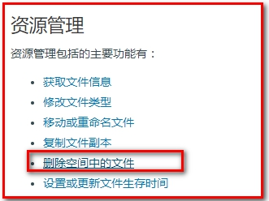

```java
    // 删除空间中的文件
    @Test
    public void deleteFile(){
        //构造一个带指定Zone对象的配置类
        Configuration cfg = new Configuration(Zone.zone0());
        //...其他参数参考类注释
        String accessKey = "dzpXBDSa3musX6U7Nq8v0fzv921stt-NnRLGhACK";
        String secretKey = "AB90WSgUo32gY87jOyOW2zVH97fz9wT9JWCpKEm-";
        String bucket = "maweiqi";
        String key = "Fu3Ic6TV6wIbJt793yaGeBmCkzTX";
        Auth auth = Auth.create(accessKey, secretKey);
        BucketManager bucketManager = new BucketManager(auth, cfg);
        try {
            bucketManager.delete(bucket, key);
        } catch (QiniuException ex) {
            //如果遇到异常，说明删除失败
            System.err.println(ex.code());
            System.err.println(ex.response.toString());
        }
    }
```

七牛云提供了多种方式操作对象存储服务，本项目采用 Java SDK 方式，地址：<https://developer.qiniu.com/kodo/sdk/1239/java>


使用 Java SDK 操作七牛云需要导入如下 maven 坐标：（项目已经引入）

```xml
<dependency>
    <groupId>com.qiniu</groupId>
    <artifactId>qiniu-java-sdk</artifactId>
    <version>7.2.0</version>
</dependency>
```

### 1.2.5. **鉴权**

Java SDK 的所有的功能，都需要合法的授权。授权凭证的签算需要七牛账号下的一对==有效的 Access Key 和 Secret Key==，这对密钥可以在七牛云管理控制台的个人中心（<https://portal.qiniu.com/user/key>）获得，如下图：


### 1.2.6. **Java SDK 操作七牛云**

本章节我们就需要使用七牛云提供的 Java SDK 完成图片上传和删除，我们可以参考官方提供的例子。

==上传文件==：

```java
//构造一个带指定Zone对象的配置类，zone0表示华东地区（默认）
Configuration cfg = new Configuration(Zone.zone0());
//...其他参数参考类注释

UploadManager uploadManager = new UploadManager(cfg);
//...生成上传凭证，然后准备上传
String accessKey = "your access key";
String secretKey = "your secret key";
String bucket = "your bucket name";

//默认不指定key的情况下，以文件内容的hash值作为文件名
String key = null;

try {
    byte[] uploadBytes = "hello qiniu cloud".getBytes("utf-8");
    ByteArrayInputStream byteInputStream=new ByteArrayInputStream(uploadBytes);
    Auth auth = Auth.create(accessKey, secretKey);
    String upToken = auth.uploadToken(bucket);

    try {
        Response response = uploadManager.put(byteInputStream,key,upToken,null, null);
        //解析上传成功的结果
        DefaultPutRet putRet = new Gson().fromJson(response.bodyString(), DefaultPutRet.class);
        System.out.println(putRet.key);
        System.out.println(putRet.hash);
    } catch (QiniuException ex) {
        Response r = ex.response;
        System.err.println(r.toString());
        try {
            System.err.println(r.bodyString());
        } catch (QiniuException ex2) {
            //ignore
        }
    }
} catch (UnsupportedEncodingException ex) {
    //ignore
}
```

==删除文件==：

```java
//构造一个带指定Zone对象的配置类，zone0表示华东地区（默认）
Configuration cfg = new Configuration(Zone.zone0());
//...其他参数参考类注释

String accessKey = "your access key";
String secretKey = "your secret key";

String bucket = "your bucket name";
String key = "your file key";

Auth auth = Auth.create(accessKey, secretKey);
BucketManager bucketManager = new BucketManager(auth, cfg);
try {
    bucketManager.delete(bucket, key);
} catch (QiniuException ex) {
    //如果遇到异常，说明删除失败
    System.err.println(ex.code());
    System.err.println(ex.response.toString());
}
```

### 1.2.7. **封装工具类**

为了方便操作七牛云存储服务，我们可以将官方提供的案例简单改造成一个工具类，在我们的项目中直接使用此工具类来操作就可以：

```java
package com.atguigu.utils;

import com.google.gson.Gson;
import com.qiniu.common.QiniuException;
import com.qiniu.common.Zone;
import com.qiniu.http.Response;
import com.qiniu.storage.BucketManager;
import com.qiniu.storage.Configuration;
import com.qiniu.storage.UploadManager;
import com.qiniu.storage.model.DefaultPutRet;
import com.qiniu.util.Auth;
import java.io.File;
import java.io.FileInputStream;
import java.io.InputStream;

/**
 * 七牛云工具类
 */
public class QiniuUtils {
    public  static String accessKey = "dzpXBDSa3musX6U7Nq8v0fzv921stt-NnRLGhACK";
    public  static String secretKey = "AB90WSgUo32gY87jOyOW2zVH97fz9wT9JWCpKEm-";
    public  static String bucket = "maweiqi";

    public static void upload2Qiniu(String filePath,String fileName){
        //构造一个带指定Zone对象的配置类
        Configuration cfg = new Configuration(Zone.zone2());
        UploadManager uploadManager = new UploadManager(cfg);
        Auth auth = Auth.create(accessKey, secretKey);
        String upToken = auth.uploadToken(bucket);
        try {
            Response response = uploadManager.put(filePath, fileName, upToken);
            //解析上传成功的结果
            DefaultPutRet putRet = new Gson().fromJson(response.bodyString(), DefaultPutRet.class);
        } catch (QiniuException ex) {
            Response r = ex.response;
            try {
                System.err.println(r.bodyString());
            } catch (QiniuException ex2) {
                //ignore
            }
        }
    }

    //上传文件
    public static void upload2Qiniu(byte[] bytes, String fileName){
        //构造一个带指定Zone对象的配置类
        Configuration cfg = new Configuration(Zone.zone2());
        //...其他参数参考类注释
        UploadManager uploadManager = new UploadManager(cfg);

        //默认不指定key的情况下，以文件内容的hash值作为文件名
        String key = fileName;
        Auth auth = Auth.create(accessKey, secretKey);
        String upToken = auth.uploadToken(bucket);
        try {
            Response response = uploadManager.put(bytes, key, upToken);
            //解析上传成功的结果
            DefaultPutRet putRet = new Gson().fromJson(response.bodyString(), DefaultPutRet.class);
            System.out.println(putRet.key);
            System.out.println(putRet.hash);
        } catch (QiniuException ex) {
            Response r = ex.response;
            System.err.println(r.toString());
            try {
                System.err.println(r.bodyString());
            } catch (QiniuException ex2) {
                //ignore
            }
        }
    }

    //删除文件
    public static void deleteFileFromQiniu(String fileName){
        //构造一个带指定Zone对象的配置类
        Configuration cfg = new Configuration(Zone.zone2());
        String key = fileName;
        Auth auth = Auth.create(accessKey, secretKey);
        BucketManager bucketManager = new BucketManager(auth, cfg);
        try {
            bucketManager.delete(bucket, key);
        } catch (QiniuException ex) {
            //如果遇到异常，说明删除失败
            System.err.println(ex.code());
            System.err.println(ex.response.toString());
        }
    }
}

```

将此工具类放在 `meinian_common` 工程中，后续会使用到。

### 【小结】

1：介绍

（1）文件上传功能介绍

2：七牛云存储

（1）注册

（2）新建存储空间

（3）查看存储空间信息

（4）开发者中心

（5）鉴权

（6）Java SDK 操作七牛云

（7）封装工具类

# 2. **第二章. 新增套餐**

### 【目标】

新增套餐

### 【路径】

1：需求分析

2：前台代码

（1）弹出新增窗口

（2）动态展示跟团游列表

（3）图片上传并预览

- 使用七牛云存储图片

（4）提交请求

- 使用数据库存储图片名称
- 使用 springmvc 的文件上传技术

3：后台代码

业务：

- 新增套餐

（1）SetmealController.java（Controller）

（2）SetmealService.java（服务接口）

（3）SetmealServiceImpl.java（服务实现类）

（4）SetmealDao.java（Dao 接口）

（5）SetmealDao.xml（Mapper 映射文件）

4：完善文件上传，Redis 存储图片名称（一会说）

### 【接口文档】

请求方式 get 请求

请求地址

```properties
/travelgroup/findAll.do
```

返回方 result 子成员：

| 名称      | 类型   | 必要 | 说明     |
| --------- | ------ | ---- | -------- |
| tableData | object | 是   | 表单数据 |

tableData 子成员如下：

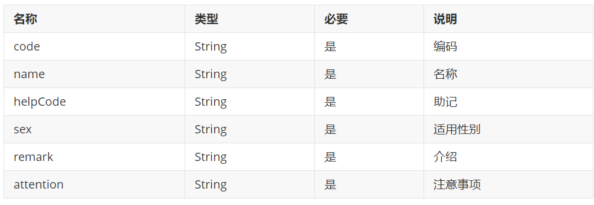

创建表

```sql
DROP TABLE IF EXISTS `t_setmeal`;
CREATE TABLE `t_setmeal` (
  `id` int(11) NOT NULL AUTO_INCREMENT,
  `name` varchar(1000) DEFAULT NULL,
  `code` varchar(8) DEFAULT NULL,
  `helpCode` varchar(16) DEFAULT NULL,
  `sex` char(1) DEFAULT NULL,
  `age` varchar(32) DEFAULT NULL,
  `price` float DEFAULT NULL,
  `remark` varchar(3000) DEFAULT NULL,
  `attention` varchar(128) DEFAULT NULL,
  `img` varchar(128) DEFAULT NULL,
  PRIMARY KEY (`id`)
) ENGINE=InnoDB AUTO_INCREMENT=16 DEFAULT CHARSET=utf8;


DROP TABLE IF EXISTS `t_setmeal_travelgroup`;
CREATE TABLE `t_setmeal_travelgroup` (
  `setmeal_id` int(11) NOT NULL DEFAULT '0',
  `travelgroup_id` int(11) NOT NULL DEFAULT '0',
  PRIMARY KEY (`setmeal_id`,`travelgroup_id`),
  KEY `travelgroup_key` (`travelgroup_id`),
  CONSTRAINT `travelgroup_key` FOREIGN KEY (`travelgroup_id`) REFERENCES `t_travelgroup` (`id`),
  CONSTRAINT `setmeal_key` FOREIGN KEY (`setmeal_id`) REFERENCES `t_setmeal` (`id`)
) ENGINE=InnoDB DEFAULT CHARSET=utf8;
```

### 【讲解】

## 2.1. **需求分析**

套餐其实就是跟团游的集合，例如有一个套餐为“北京深圳双飞套餐”，这个套餐可以包括多个跟团游。

所以在添加套餐时需要选择这个套餐包括的跟团游。

套餐对应的实体类为 Setmeal，

```java
public class Setmeal implements Serializable {
    private Integer id;
    private String name;
    private String code;
    private String helpCode;
    private String sex;//套餐适用性别：0不限 1男 2女
    private String age;//套餐适用年龄
    private Float price;//套餐价格
    private String remark;
    private String attention;
    private String img;//套餐对应图片存储路径（用于存放七牛云上的图片名称）
    private List<TravelGroup> travelGroups;//体检套餐对应的跟团游，多对多关系
}
```

其中 img 字段表示套餐对应图片存储路径（用于存放七牛云上的图片名称）

对应的数据表为 `t_setmeal`。套餐和跟团游为多对多关系，所以需要中间表 `t_setmeal_travelgroup` 进行关联。

`t_setmeal` 表

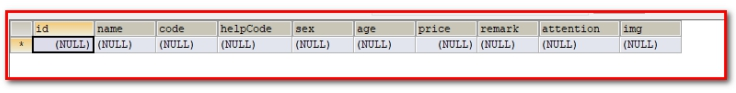

`t_setmeal_travelgroup` 表

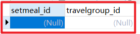

## 2.2. 前台代码

套餐管理页面对应的是 `setmeal.html` 页面，根据产品设计的原型已经完成了页面基本结构的编写，现在需要完善页面动态效果。


### 2.2.1. **弹出新增窗口**

页面中已经提供了新增窗口，只是出于隐藏状态。只需要将控制展示状态的属性 `dialogFormVisible` 改为 true 接口显示出新增窗口。点击新建按钮时绑定的方法为 `handleCreate` ，所以在 `handleCreate` 方法中修改`dialogFormVisible` 属性的值为 true 即可。同时为了增加用户体验度，需要每次点击新建按钮时清空表单输入项。

由于新增套餐时还需要选择此套餐包含的跟团游，所以新增套餐窗口分为两部分信息：基本信息和跟团游信息，如下图：

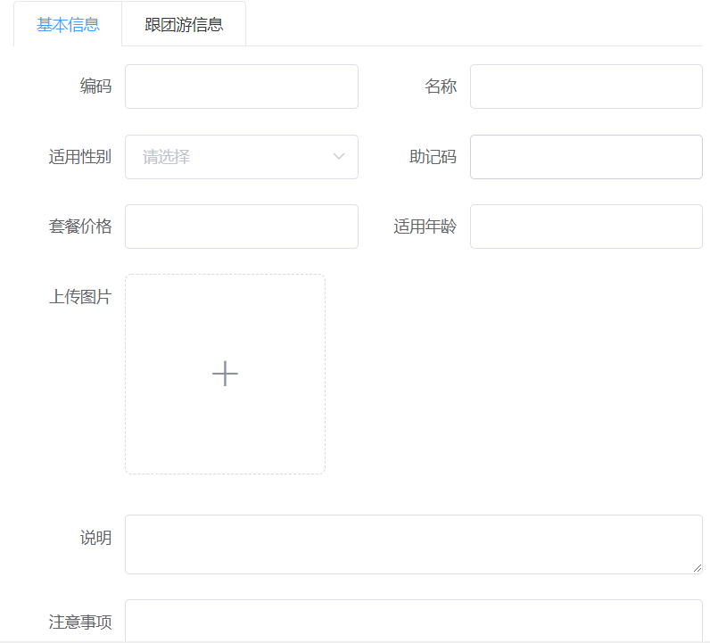

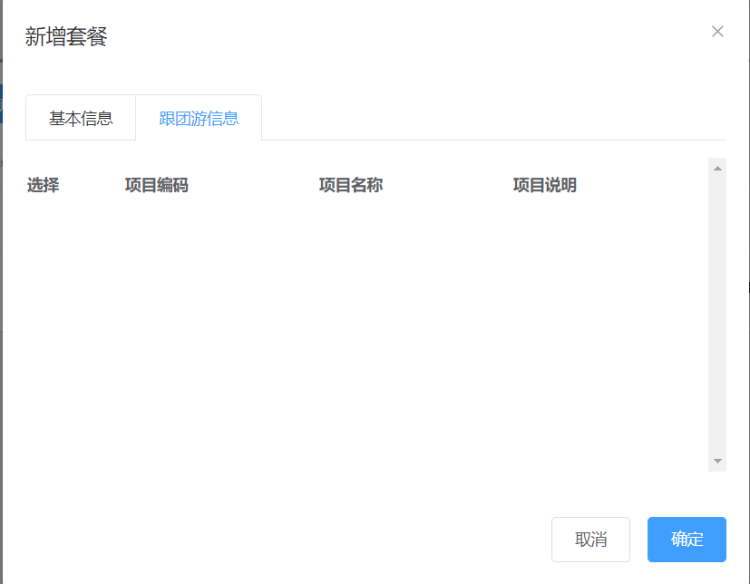

（1）：新建按钮绑定单击事件，对应的处理函数为 handleCreate

```html
<el-button type="primary" class="butT" @click="handleCreate()">新建</el-button>
```

（2）：handleCreate()方法：

```html
// 重置表单 resetForm() { // 清空套餐基本信息 this.formData = {}; //
选项卡设置成第一个 this.activeName='first'; // 重置跟团游的复选框
this.travelgroupIds = []; // 重置上传的图片路径 this.imageUrl = null; }, //
弹出添加窗口 handleCreate() { this.dialogFormVisible = true; this.resetForm();
},
```

### 2.2.2. **动态展示跟团游列表**

现在虽然已经完成了新增窗口的弹出，但是在跟团游信息标签页中需要动态展示所有的跟团游信息列表数据，并且可以进行勾选。具体操作步骤如下：

（1）定义模型数据

```html
tableData:[],//添加表单窗口中跟团游列表数据
travelgroupIds:[],//添加表单窗口中跟团游复选框对应id
```

（2）动态展示跟团游列表数据，数据来源于上面定义的 tableData 模型数据

```html
<el-tab-pane label="跟团游信息" name="second">
  <div class="checkScrol">
    <table class="datatable">
      <thead>
        <tr>
          <th>选择</th>
          <th>项目编码</th>
          <th>项目名称</th>
          <th>项目说明</th>
        </tr>
      </thead>
      <tbody>
        <!--循环遍历tableData-->
        <tr v-for="c in tableData">
          <td>
            <!--复选框绑定travelgroupIds，存放到值是id-->
            <input
              :id="c.id"
              v-model="travelgroupIds"
              type="checkbox"
              :value="c.id"
            />
          </td>
          <td><label :for="c.id">{{c.code}}</label></td>
          <td><label :for="c.id">{{c.name}}</label></td>
          <td><label :for="c.id">{{c.remark}}</label></td>
        </tr>
      </tbody>
    </table>
  </div>
</el-tab-pane>
```

其中：v-model="travelgroupIds"，用于回显复选框。

（3）完善 `handleCreate` 方法，发送 ajax 请求查询所有跟团游数据并将结果赋值给 tableData 模型数据用于页面表格展示

```html
// 弹出添加窗口 handleCreate() { this.dialogFormVisible = true;
this.resetForm(); axios.get("/travelgroup/findAll.do").then((res)=> {
if(res.data.flag){ this.tableData = res.data.data; }else{
this.$message.error(res.data.message); } }); },
```

（4）分别在 `TravelGroupController` 、`TravelGroupService` 、`TravelGroupServiceImpl` 、`TravelGroupDao` 、`TravelGroupDao.xml` 中扩展方法查询所有跟团游数据

1：`TravelGroupController：`

```java
package com.atguigu.controller;

import com.alibaba.dubbo.config.annotation.Reference;
import com.atguigu.constant.MessageConstant;
import com.atguigu.entity.PageResult;
import com.atguigu.entity.QueryPageBean;
import com.atguigu.entity.Result;
import com.atguigu.pojo.TravelGroup;
import com.atguigu.pojo.TravelItem;
import com.atguigu.service.TravelGroupService;
import org.springframework.web.bind.annotation.RequestBody;
import org.springframework.web.bind.annotation.RequestMapping;
import org.springframework.web.bind.annotation.RestController;

import java.util.List;

/**
 * TravelGroupController
 *
 * @Author: 马伟奇
 * @Description:
 */
@RequestMapping("/travelgroup")
@RestController
public class TravelGroupController {

    @Reference
    private TravelGroupService travelGroupService;

    //查询所有
    @RequestMapping("/findAll")
    public Result findAll(){
        // 查询所有的跟团游
        List<TravelGroup> travelGroupList = travelGroupService.findAll();
        if(travelGroupList != null && travelGroupList.size() > 0){
            Result result = new Result(true, MessageConstant.QUERY_SETMEAL_SUCCESS,travelGroupList);
            return result;
        }
        return new Result(false,MessageConstant.QUERY_SETMEAL_FAIL);
    }
```

2：`TravelGroupService：`

```java
package com.atguigu.service;

import com.atguigu.entity.PageResult;
import com.atguigu.pojo.TravelGroup;
import com.atguigu.pojo.TravelItem;

import java.util.List;

/**
 * TravelGroupService
 *
 * @Author: 马伟奇
 * @Description:
 */
public interface TravelGroupService {

    List<TravelGroup> findAll();
```

3：`TravelGroupServiceImpl：`

```java
package com.atguigu.service.impl;

import com.alibaba.dubbo.config.annotation.Service;
import com.atguigu.dao.TravelGroupDao;
import com.atguigu.entity.PageResult;
import com.atguigu.pojo.TravelGroup;
import com.atguigu.pojo.TravelItem;
import com.atguigu.service.TravelGroupService;
import com.github.pagehelper.Page;
import com.github.pagehelper.PageHelper;
import org.springframework.beans.factory.annotation.Autowired;
import org.springframework.transaction.annotation.Transactional;

import java.util.HashMap;
import java.util.List;
import java.util.Map;

/**
 * TravelGroupServiceImpl
 *
 * @Author: 马伟奇
 * @Description:
 */
@Service(interfaceClass = TravelGroupService.class)
@Transactional
public class TravelGroupServiceImpl implements TravelGroupService {

    @Autowired
    private TravelGroupDao travelGroupDao;

    @Override
    public List<TravelGroup> findAll() {
        return travelGroupDao.findAll();
    }
```

4：`TravelGroupDao：`

```java
package com.atguigu.dao;

import com.atguigu.pojo.TravelGroup;
import com.atguigu.pojo.TravelItem;
import com.github.pagehelper.Page;

import java.util.List;
import java.util.Map;

/**
 * TravelGroupDao
 *
 * @Author: 马伟奇
 * @Description:
 */
public interface TravelGroupDao {
    List<TravelGroup> findAll();
```

5：`TravelGroupDao.xml：`

```xml
<?xml version="1.0" encoding="UTF-8" ?>
<!DOCTYPE mapper PUBLIC "-//mybatis.org//DTD Mapper 3.0//EN"
        "http://mybatis.org/dtd/mybatis-3-mapper.dtd" >
<mapper namespace="com.atguigu.dao.TravelGroupDao">

    <select id="findAll" resultType="travelGroup">
       select * from t_travelgroup
    </select>
</mapper>
```

运行程序 `http://localhost:82/pages/main.html`

### 2.2.3. **图片上传并预览**

此处使用的是 ElementUI 提供的上传组件 el-upload，提供了多种不同的上传效果，上传成功后可以进行预览。

实现步骤：

（1）定义模型数据，用于后面上传文件的图片预览：

```html
imageUrl:null,//模型数据，用于上传图片完成后图片预览
```

（2）定义上传组件：

```html
<!--
  el-upload：上传组件
  action：上传的提交地址（七牛云服务器）
  auto-upload：选中文件后是否自动上传
  name：上传文件的名称，服务端可以根据名称获得上传的文件对象
  show-file-list：是否显示已上传文件列表
  on-success：文件上传成功时的钩子
  before-upload：上传文件之前的钩子
-->
<el-upload
  class="avatar-uploader"
  action="/setmeal/upload.do"
  :auto-upload="autoUpload"
  name="imgFile"
  :show-file-list="false"
  :on-success="handleAvatarSuccess"
  :before-upload="beforeAvatarUpload"
>
  <!--用于上传图片预览-->
  
  <!--用于展示上传图标-->
  <i v-else class="el-icon-plus avatar-uploader-icon"></i>
</el-upload>
```

（3）定义对应的钩子函数：

```html
// 注意axios执行url的时候，响应是通过resposne.data实现 //
注意elementUI执行url的时候，响应是通过resposne实现
//文件上传成功后的钩子，response为服务端返回的值，file为当前上传的文件封装成的js对象
handleAvatarSuccess(response, file) { //
对imageUrl赋值，将图片显示到文件上传的框中，进行浏览 this.imageUrl =
"http://q2t6dfukt.bkt.clouddn.com/"+response.data; // 用于显示 this.$message({
message: response.message, type: response.flag ? 'success' : 'error' });
//设置模型数据（图片名称），后续提交ajax请求时会提交到后台最终保存到数据库
this.formData.img = response.data; // 用于保存 }, //上传图片之前执行
beforeAvatarUpload(file) { const isJPG = file.type === 'image/jpeg'; const
isLt2M = file.size / 1024 / 1024 < 2; if (!isJPG) {
this.$message.error('上传套餐图片只能是 JPG 格式!'); } if (!isLt2M) {
this.$message.error('上传套餐图片大小不能超过 2MB!'); } return isJPG && isLt2M;
},
```

（4）创建 SetmealController，接收上传的文件

```java
package com.atguigu.controller;

import com.alibaba.dubbo.config.annotation.Reference;
import com.atguigu.constant.MessageConstant;
import com.atguigu.entity.Result;
import com.atguigu.service.SetmealService;
import com.atguigu.utils.QiniuUtils;
import org.springframework.web.bind.annotation.RequestMapping;
import org.springframework.web.bind.annotation.RestController;
import org.springframework.web.multipart.MultipartFile;

import java.io.IOException;
import java.util.UUID;

/**
 * SetmealController
 *
 * @Author: 马伟奇
 * @Description:
 */
@RestController
@RequestMapping("/setmeal")
public class SetmealController {

    @Reference
    private SetmealService setmealService;
    // imgFile:需要跟页面el-upload里面的name保持一致
    @RequestMapping("/upload")
    public Result upload(MultipartFile imgFile) {
        try {
            //获取原始文件名
            String originalFilename = imgFile.getOriginalFilename();
            // 找到.最后出现的位置
            int lastIndexOf = originalFilename.lastIndexOf(".");
            //获取文件后缀
            String suffix = originalFilename.substring(lastIndexOf);
            //使用UUID随机产生文件名称，防止同名文件覆盖
            String fileName = UUID.randomUUID().toString() + suffix;
            QiniuUtils.upload2Qiniu(imgFile.getBytes(),fileName);
            //图片上传成功
            Result result = new Result(true, MessageConstant.PIC_UPLOAD_SUCCESS, fileName);
            return result;
        } catch (IOException e) {
            e.printStackTrace();
        }
        return new Result(false,MessageConstant.PIC_UPLOAD_FAIL);
    }
}
```

注意：别忘了在 spring 配置文件中配置文件上传组件

已在 springmvc.xml 中配置

```xml
<!--文件上传组件-->
<bean id="multipartResolver"
      class="org.springframework.web.multipart.commons.CommonsMultipartResolver">
    <property name="maxUploadSize" value="104857600" /><!--最大上传文件大小-->
    <property name="maxInMemorySize" value="4096" />
    <property name="defaultEncoding" value="UTF-8"/>
</bean>
```

错误

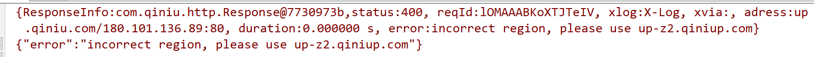

解决方案

地区设置错误

```java
// Zone.zone2():表示华南，设置对应的地区
Configuration cfg = new Configuration(Zone.zone2());
```

### 2.2.4. **提交请求**

请求方式 post

调用地址

```properties
/setmeal/add.do
```

调用方 requestparams 子成员：

| 名称           | 类型   | 必要 | 说明      |
| -------------- | ------ | ---- | --------- |
| travelgroupIds | int    | 是   | 跟团游 id |
| formData       | object | 是   | 表单数据  |

formData 子成员如下：

| 名称      | 类型   | 必要 | 说明                           |
| --------- | ------ | ---- | ------------------------------ |
| name      | String | 是   | 名称                           |
| code      | String | 是   | 编码                           |
| helpCode  | String | 是   | 助记码                         |
| sex       | String | 是   | 套餐适用性别：0 不限 1 男 2 女 |
| age       | String | 是   | 套餐适用年龄                   |
| price     | Float  | 是   | 套餐价格                       |
| remark    | String | 是   | 评论                           |
| attention | String | 是   | 注意                           |
| img       | String | 是   | 套餐对应图片存储路径           |

当用户点击新增窗口中的确定按钮时发送 `ajax`请求将数据提交到后台进行数据库操作。提交到后台的数据分为两部分：套餐基本信息（对应的模型数据为 `formData`）和跟团游 `id`数组（对应的模型数据为`travelgroupIds`）。

（1）为确定按钮绑定单击事件，对应的处理函数为`handleAdd`

```html
<div slot="footer" class="dialog-footer">
  <el-button @click="dialogFormVisible = false">取消</el-button>
  <el-button type="primary" @click="handleAdd()">确定</el-button>
</div>
```

（2）完善`handleAdd`方法

```html
//添加 handleAdd () { axios.post("/setmeal/add.do?travelgroupIds=" +
this.travelgroupIds,this.formData).then((response)=> { this.dialogFormVisible =
false; if(response.data.flag){ this.$message({ message: response.data.message,
type: 'success' }); }else{ this.$message.error(response.data.message); }
}).finally(()=> { this.findPage(); }); },
```

## 2.3. **后台代码**

### 2.3.1. **Controller**

在 SetmealController 中增加方法

```java
package com.atguigu.controller;

import com.alibaba.dubbo.config.annotation.Reference;
import com.atguigu.constant.MessageConstant;
import com.atguigu.entity.Result;
import com.atguigu.pojo.Setmeal;
import com.atguigu.service.SetmealService;
import com.atguigu.utils.QiniuUtils;
import org.springframework.web.bind.annotation.RequestBody;
import org.springframework.web.bind.annotation.RequestMapping;
import org.springframework.web.bind.annotation.RestController;
import org.springframework.web.multipart.MultipartFile;

import java.io.IOException;
import java.util.UUID;

/**
 * SetmealController
 *
 * @Author: 马伟奇
 * @Description:
 */
@RestController
@RequestMapping("/setmeal")
public class SetmealController {
        @Reference
        private SetmealService setmealService;

        //新增
        @RequestMapping("/add")
        public Result add(@RequestBody Setmeal setmeal, Integer[] travelgroupIds){
            try {
                setmealService.add(setmeal,travelgroupIds);
            }catch (Exception e){
                //新增套餐失败
                return new Result(false,MessageConstant.ADD_SETMEAL_FAIL);
            }
            //新增套餐成功
            return new Result(true,MessageConstant.ADD_SETMEAL_SUCCESS);
        }
```

### 2.3.2. **服务接口**

创建 `SetmealService` 接口并提供新增方法

```java
package com.atguigu.service;

import com.atguigu.pojo.Setmeal;

/**
 * SetmealService
 *
 * @Author: 马伟奇
 * @Description:
 */
public interface SetmealService {
    public void add(Setmeal setmeal, Integer[] travelgroupIds);
}
```

### 2.3.3. **服务实现类**

创建 `SetmealServiceImpl` 服务实现类并实现新增方法

```java
package com.atguigu.service.impl;

import com.alibaba.dubbo.config.annotation.Service;
import com.atguigu.dao.SetmealDao;
import com.atguigu.pojo.Setmeal;
import com.atguigu.service.SetmealService;
import org.springframework.beans.factory.annotation.Autowired;
import org.springframework.transaction.annotation.Transactional;

import java.util.HashMap;
import java.util.Map;

/**
 * SetmealServiceImpl
 *
 * @Author: 马伟奇
 * @Description:
 */
@Service(interfaceClass = SetmealService.class)
@Transactional
public class SetmealServiceImpl implements SetmealService {

    @Autowired
    private SetmealDao setmealDao;

    @Override
    public void add(Setmeal setmeal,Integer[] travelgroupId) {
        // 新增套餐
        setmealDao.add(setmeal);
        // 2：向套餐和跟团游的中间表中插入数据
        if(travelgroupId != null && travelgroupId.length > 0){
            //绑定套餐和跟团游的多对多关系
            setSetmealAndTravelGroup(setmeal.getId(),travelgroupId);
        }
    }
    //绑定套餐和跟团游的多对多关系
     private void setSetmealAndTravelGroup(Integer id, Integer[] travelgroupId) {
        for (Integer checkgroupId : travelgroupId) {
            Map<String, Integer> map = new HashMap<>();
            map.put("travelgroup_id",checkgroupId);
            map.put("setmeal_id",id);
            setmealDao.setSetmealAndTravelGroup(map);
        }
    }
}
```

### 2.3.4. **Dao 接口**

创建 `SetmealDao` 接口并提供相关方法

```java
package com.atguigu.dao;

import com.atguigu.pojo.Setmeal;

import java.util.Map;

/**
 * SetmealDao
 *
 * @Author: 马伟奇
 * @Description:
 */
public interface SetmealDao {
    void add(Setmeal setmeal);

    void setSetmealAndTravelGroup(Map<String, Integer> map);

}

```

### 2.3.5. **Mapper 映射文件**

创建 `SetmealDao.xml` 文件并定义相关 SQL 语句

```xml
<?xml version="1.0" encoding="UTF-8" ?>
<!DOCTYPE mapper PUBLIC "-//mybatis.org//DTD Mapper 3.0//EN"
        "http://mybatis.org/dtd/mybatis-3-mapper.dtd" >
<mapper namespace="com.atguigu.dao.SetmealDao">

    <!--新增-->
    <insert id="add" parameterType="setmeal">
        <selectKey resultType="int" order="AFTER" keyProperty="id">
            SELECT LAST_INSERT_ID()

        </selectKey>
        insert into t_setmeal(name,code,helpCode,sex,age,price,remark,attention,img) values (#{name},#{code},#{helpCode},#{sex},#{age},#{price},#{remark},#{attention},#{img})

    </insert>

    <!--绑定套餐和跟团游多对多关系-->
     <insert id="setSetmealAndTravelGroup" parameterType="map">
        insert into
        t_setmeal_travelgroup(setmeal_id,travelgroup_id)
        values (#{setmeal_id},#{travelgroup_id})
    </insert>

</mapper>
```

运行程序 `http://localhost:82/pages/main.html`

## 2.4. 完善文件上传，Redis 存储图片名称（一会说）

前面我们已经完成了文件上传，将图片存储在了七牛云服务器中。但是这个过程存在一个问题，就是如果用户只上传了图片而没有最终保存套餐信息到我们的数据库，这时我们上传的图片就变为了垃圾图片。对于这些垃圾图片我们需要定时清理来释放磁盘空间。这就需要我们能够区分出来哪些是垃圾图片，哪些不是垃圾图片。如何实现呢？

方案就是利用 redis 来保存图片名称，具体做法为：

1、当用户上传图片后，将图片名称保存到 redis 的一个 Set 集合中，例如集合名称为 `setmealPicResources`

2、当用户添加套餐后，将图片名称保存到 redis 的另一个 Set 集合中，例如集合名称为`setmealPicDbResources`

3、计算 `setmealPicResources`集合与 `setmealPicDbResources`集合的差值，结果就是垃圾图片的名称集合，清理这些图片即可

`redis` 和 `mysql` 绝对不是竞争的关系，就好像你拿`485`和 `86` 去秋名山飙车，他们应该是一对好基友，在工作中合理运用两者才能达到更好的效果。


本小节我们先来完成前面 2 个环节，第 3 个环节（清理图片环节）在后面会通过定时任务再实现。

实现步骤：

（1）在 `meinian_web` 项目中提供 Spring 配置文件 `spring-redis.xml`

```xml
<?xml version="1.0" encoding="UTF-8"?>
<beans xmlns="http://www.springframework.org/schema/beans"
       xmlns:xsi="http://www.w3.org/2001/XMLSchema-instance"
       xmlns:p="http://www.springframework.org/schema/p"
       xmlns:context="http://www.springframework.org/schema/context"
       xmlns:dubbo="http://code.alibabatech.com/schema/dubbo"
       xmlns:mvc="http://www.springframework.org/schema/mvc"
       xsi:schemaLocation="http://www.springframework.org/schema/beans
                         http://www.springframework.org/schema/beans/spring-beans.xsd
                    http://www.springframework.org/schema/mvc
                         http://www.springframework.org/schema/mvc/spring-mvc.xsd
                    http://code.alibabatech.com/schema/dubbo
                         http://code.alibabatech.com/schema/dubbo/dubbo.xsd
                    http://www.springframework.org/schema/context
                         http://www.springframework.org/schema/context/spring-context.xsd">

    <!--Jedis连接池的相关配置-->
    <bean id="jedisPoolConfig" class="redis.clients.jedis.JedisPoolConfig">
        <!--最大连接数, 默认8个-->
        <property name="maxTotal" value="100"></property>
        <!--最大空闲连接数, 默认8个-->
        <property name="maxIdle" value="50"></property>
       <!--允许借调 在获取连接的时候检查有效性, 默认false-->
        <property name="testOnBorrow" value="true"/>
         <!--允许归还 在return给pool时，是否提前进行validate操作-->
        <property name="testOnReturn" value="true"/>
    </bean>
    <bean id="jedisPool" class="redis.clients.jedis.JedisPool">
        <constructor-arg name="poolConfig" ref="jedisPoolConfig" />
        <constructor-arg name="host" value="127.0.0.1" />
        <constructor-arg name="port" value="6379" type="int" />
        <constructor-arg name="timeout" value="30000" type="int" />
    </bean>
</beans>
```

同时在`springmvc.xml`中使用`<import>`标签引入

```xml
<import resource="classpath:spring-redis.xml"></import>
```

（2）在 `meinian_common`工程中提供 Redis 常量类

```java
package com.atguigu.constant;

/**
 * RedisConstant
 *
 * @Author: 马伟奇
 * @Description:
 */
public class RedisConstant {
    //套餐图片所有图片名称(七牛)
    public static final String SETMEAL_PIC_RESOURCES = "setmealPicResources";
    //套餐图片保存在数据库中的图片名称(数据库)
    public static final String SETMEAL_PIC_DB_RESOURCES = "setmealPicDbResources";
}
```

（3）完善`SetmealController`，在文件上传成功后将图片名称保存到 `redis` 集合中

```java
@Autowired
private JedisPool jedisPool;

//图片上传
@RequestMapping("/upload")
public Result upload(@RequestParam("imgFile")MultipartFile imgFile){
    try{
        //获取原始文件名
        String originalFilename = imgFile.getOriginalFilename();
        int lastIndexOf = originalFilename.lastIndexOf(".");
        //获取文件后缀
        String suffix = originalFilename.substring(lastIndexOf);
        //使用UUID随机产生文件名称，防止同名文件覆盖
        String fileName = UUID.randomUUID().toString() + suffix;
        QiniuUtils.upload2Qiniu(imgFile.getBytes(),fileName);
        //图片上传成功
        Result result = new Result(true, MessageConstant.PIC_UPLOAD_SUCCESS,fileName);
        //将上传图片名称存入Redis，基于Redis的Set集合存储
        jedisPool.getResource().sadd(RedisConstant.SETMEAL_PIC_RESOURCES,fileName);
        return result;
    }catch (Exception e){
        e.printStackTrace();
        //图片上传失败
        return new Result(false,MessageConstant.PIC_UPLOAD_FAIL);
    }
}
```

添加：

```java
//将上传图片名称存入Redis，基于Redis的Set集合存储
jedisPool.getResource().sadd(RedisConstant.SETMEAL_PIC_RESOURCES,fileName);
```

（4）在 `meinian_service`项目中提供 Spring 配置文件 `applicationContext-redis.xml`

`meinian_service` 里面的启动方式在 `web.xml` 如下：所以可以直接加载 `redis` 配置文件

```xml
<context-param>
        <param-name>contextConfigLocation</param-name>
        <param-value>classpath*:applicationContext*.xml</param-value>
    </context-param>
```

`applicationContext-redis.xml` 配置文件如下

```xml
<?xml version="1.0" encoding="UTF-8"?>
<beans xmlns="http://www.springframework.org/schema/beans"
       xmlns:xsi="http://www.w3.org/2001/XMLSchema-instance"
       xmlns:p="http://www.springframework.org/schema/p"
       xmlns:context="http://www.springframework.org/schema/context"
       xmlns:dubbo="http://code.alibabatech.com/schema/dubbo"
       xmlns:mvc="http://www.springframework.org/schema/mvc"
       xsi:schemaLocation="http://www.springframework.org/schema/beans
                         http://www.springframework.org/schema/beans/spring-beans.xsd
                        http://www.springframework.org/schema/mvc
                         http://www.springframework.org/schema/mvc/spring-mvc.xsd
                        http://code.alibabatech.com/schema/dubbo
                         http://code.alibabatech.com/schema/dubbo/dubbo.xsd
                        http://www.springframework.org/schema/context
                         http://www.springframework.org/schema/context/spring-context.xsd">

    <!--Jedis连接池的相关配置-->
    <bean id="jedisPoolConfig" class="redis.clients.jedis.JedisPoolConfig">
        <property name="maxTotal">
            <value>200</value>
        </property>
        <property name="maxIdle">
            <value>50</value>
        </property>
        <property name="testOnBorrow" value="true"/>
        <property name="testOnReturn" value="true"/>
    </bean>
    <bean id="jedisPool" class="redis.clients.jedis.JedisPool">
        <constructor-arg name="poolConfig" ref="jedisPoolConfig" />
        <constructor-arg name="host" value="127.0.0.1" />
        <constructor-arg name="port" value="6379" type="int" />
        <constructor-arg name="timeout" value="30000" type="int" />
    </bean>
</beans>
```

（5）完善 `SetmealServiceImpl` 服务类，在保存完成套餐信息后将图片名称存储到 `redis` 集合中

```java
@Autowired
private JedisPool jedisPool;

//新增套餐
public void add(Setmeal setmeal, Integer[] travelgroupIds) {
    setmealDao.add(setmeal);
    if(travelgroupIds != null && travelgroupIds.length > 0){
        //绑定套餐和跟团游的多对多关系
        setSetmealAndTravelGroup(setmeal.getId(),travelgroupIds);
    }
    //将图片名称保存到Redis
    savePic2Redis(setmeal.getImg());
}
//将图片名称保存到Redis
private void savePic2Redis(String pic){
    jedisPool.getResource().sadd(RedisConstant.SETMEAL_PIC_DB_RESOURCES,pic);
}
```

测试：


### 【小结】

1：需求分析

2：前台代码

（1）弹出新增窗口

（2）动态展示跟团游列表

（3）图片上传并预览

- 使用七牛云存储图片

（4）提交请求

- 使用数据库存储图片名称

- 使用 springmvc 的文件上传技术

  第一步：页面定义上传组件：

  ```html
  <!--
    el-upload：上传组件
    action：上传的提交地址（七牛云服务器）
    auto-upload：选中文件后是否自动上传
    name：上传文件的名称，服务端可以根据名称获得上传的文件对象
    show-file-list：是否显示已上传文件列表
    on-success：文件上传成功时的钩子
    before-upload：上传文件之前的钩子
  -->
  <el-upload
    class="avatar-uploader"
    action="/setmeal/upload.do"
    :auto-upload="autoUpload"
    name="imgFile"
    :show-file-list="false"
    :on-success="handleAvatarSuccess"
    :before-upload="beforeAvatarUpload"
  >
    <!--用于上传图片预览-->
    
    <!--用于展示上传图标-->
    <i v-else class="el-icon-plus avatar-uploader-icon"></i>
  </el-upload>
  ```

  第二步：使用 springmvc 跳转 Controller，接收文件参数

  ```java
  @RequestMapping("/upload")
  public Result upload(@RequestParam("imgFile")MultipartFile imgFile){
  }
  ```

  第三步：配置 springmvc.xml

  ```xml
  <!--文件上传组件-->
  <bean id="multipartResolver"
        class="org.springframework.web.multipart.commons.CommonsMultipartResolver">
      <property name="maxUploadSize" value="104857600" /><!--最大上传文件大小-->
      <property name="maxInMemorySize" value="4096" />
      <property name="defaultEncoding" value="UTF-8"/>
  </bean>
  ```

3：后台代码

业务：

- 新增套餐

（1）SetmealController.java（Controller）

（1）SetmealService.java（服务接口）

（1）SetmealServiceImpl.java（服务实现类）

（1）SetmealDao.java（Dao 接口）

（1）SetmealDao.xml（Mapper 映射文件）

4：完善文件上传，Redis 存储图片名称（一会说）

# 3. **第三章**. 旅游套餐分页

### 【目标】

旅游套餐列表分页

### 【路径】

1：前台代码

（1）定义分页相关模型数据

（2）定义分页方法

（3）完善分页方法执行时机

2：后台代码

业务：

- 旅游套餐分页列表展示

（1）SetmealController.java（Controller）

（2）SetmealService.java（服务接口）

（3）SetmealServiceImpl.java（服务实现类）

（4）SetmealDao.java（Dao 接口）

（5）SetmealDao.xml（Mapper 映射文件）

导入分页数据

```sql
INSERT INTO `t_setmeal` VALUES ('12', '公司年度旅游套餐（男女通用）', '0001', 'RZTJ', '0', '18-60', '300', '公司年度旅游套餐', null, 'a5e8e729-74ce-4939-bf36-9cdc02fb2ae51.jpg');
INSERT INTO `t_setmeal` VALUES ('13', '广州长隆酒店+珠海长隆企鹅酒店双飞5日自由行套餐', '0002', 'FHZA', '2', '18-60', '1200', '长隆酒店(广州长隆野生动物世界店)位于广州长隆旅游度假区中心地段，毗邻长隆欢乐世界、长隆水上乐园、长隆野生动物世界、长隆飞鸟乐园和长隆国际大马戏等主题乐园。交通便捷，多条园区穿梭巴往返长隆酒店和各大园区之间。珠海园区、机场快线、香港直通巴汇集其中，广州地铁3号线/7号线让您的度假娱乐更快捷方便。 长隆酒店作为大型的生态主题酒店，主要以热带区域的人文文化风情为主基调。客房的摆设装修以客为主，温馨舒适，并有多种客房和套房类型选择。酒店绿植围绕，种类繁多，动物岛置身于酒店之中，珍稀动物随处可见。 酒店内配套多间风味各异的餐厅，让你足不出户品尝环球美食。酒店配套室外泳池、室内四季恒温泳池、健身房、童趣乐园、康体中心等，都是您商旅或者度假的上佳消遣地方。 国际会展中心更有可容纳3,000人的6,000平方米宴会厅，拥有12米无柱高楼顶，配备LED屏幕，及大型内置8米升降舞台、先进的多媒体视听、通讯系统等商务会议设施。39个不同规格的豪华多功能会议厅。专业的销售、服务团队和完善的会议设施设备随时准备为您提供一流的会议、展览和宴会服务，打造一流的商务会议品牌。', null, 'd7114f3d-35bd-4e52-b0b5-9dfc83d54af72.jpg');
INSERT INTO `t_setmeal` VALUES ('14', '厦门+鼓浪屿双飞5日自由行套餐', '0003', 'YGBM', '0', '55-100', '1400', '鼓浪屿的生活，是慵懒而优雅的，像极了欧洲某个古老的城市，不张扬，却有着致命的吸引力——温柔的阳光，蔚蓝的大海，美妙的琴声，静静矗立的老建筑，悠然自得的猫咪，所有的一切，总让人忍不住想好好的，再谈一场恋爱。 　　所以做了这样的主题，就是想把所谓浪漫，狠狠地，彻底地，进行下去。要华丽，因为青春理应肆意和张扬；要低调，因为在心底，总有一个最柔软最隐秘的角落，是只属于你的。最重要的，是要浪漫。在流淌着音乐的房间里，看点点烛光摇曳，撒在床上的玫瑰花瓣香味隐约扑来，举起手中的红酒杯，两个人，相视无语。cheers. 感谢你们，与我们分享这美好。也但愿我能，一直见证你们的幸福。', null, '1291b1fb-40c2-4558-b102-02e05c4cff6c3.jpg');
INSERT INTO `t_setmeal` VALUES ('15', '云南-昆明-大理-丽江-香格里拉双飞8日游套餐', '0004', 'ZAGD', '0', '14-20', '2400', '今日行程无导游陪同，如您当日抵昆时间较早，可自行将行李寄存在入住酒店（贵重物品请自行保管好）；随后，自由活动（如抵达昆明时间尚早，可自行前往云南师范大学（西南联合大学旧址）、昆明金马碧鸡坊、南屏街、、陆军讲武堂等景点游览、（外出酒店时贵重物品请自行保管好，请到酒店前台带上酒店名片，方便打车回酒店）', null, '68c7c13f-8fc2-46c3-b5d6-f7ec7992dc6e1.jpg');
INSERT INTO `t_setmeal` VALUES ('3', '澳门威尼斯人商圈酒店双飞3-5日自由行套餐', '0001', 'RZTJ', '0', '18-60', '300', '澳门巴黎人是全澳门乃至亚洲的一颗闪耀新星，您可以在此感受“光之城”巴黎的独特艺术气息与迷人魅力。这里有约2千余间法式客房及套房供您选择，还有依照巴黎埃菲尔铁塔1/2比例建造的巴黎铁塔，让您体验独特的浪漫风情。您还可以于170家精品名店享受购物乐趣，或是品尝经典法式美食，欣赏精彩的娱乐表演，畅游水世界、儿童王国等各种娱乐项目，像巴黎人一样体验无处不在的浪漫与惊喜！', null, 'a5e8e729-74ce-4939-bf36-9cdc02fb2ae51.jpg');
INSERT INTO `t_setmeal` VALUES ('4', '香港九龙尖沙咀商圈双飞3-8日自由行套餐', '0001', 'RZTJ', '0', '18-60', '300', '香港九龙珀丽酒店(Rosedale Hotel Kowloon)位于市中心繁华闹市，地处九龙中心地带，毗邻多个购物、娱乐中心；酒店提供班车来往旺角、尖沙嘴和“圆方”购物区，方便宾客出行。 香港九龙珀丽酒店(Rosedale Hotel Kowloon) 设计精巧、新颖独特，拥有精致、高雅的各式客房。酒店客房均配有LED智能电视、iPod/ iPhone 底座，让您尽享便捷、舒适生活。', null, 'a5e8e729-74ce-4939-bf36-9cdc02fb2ae51.jpg');
INSERT INTO `t_setmeal` VALUES ('5', '海南-亚龙湾-三亚双飞7日游', '0001', 'RZTJ', '0', '18-60', '300', '全程由旅游局指定餐厅用餐，严格把控餐饮质量，让您安心享用每一顿饮食，尽情尝特色美食，让味蕾绽放在路上，品味舌尖上的海南 。', null, 'a5e8e729-74ce-4939-bf36-9cdc02fb2ae51.jpg');
INSERT INTO `t_setmeal` VALUES ('6', '丽江-大理-香格里拉双飞6日游', '0001', 'RZTJ', '0', '18-60', '300', '云南地处高原，老年人体温调节功能较差，易受凉感冒，所以衣服要带得够，以便随时增减，行走出汗时，不要马上脱衣敞怀。高原地区昼夜温差大，睡前要盖好被毯，夜间风起雨来时要关好门窗。', null, 'a5e8e729-74ce-4939-bf36-9cdc02fb2ae51.jpg');
INSERT INTO `t_setmeal` VALUES ('7', '海南-亚龙湾-三亚双飞8日游', '0001', 'RZTJ', '0', '18-60', '300', '旅游中要有充足的休息和睡眠，若感到体力不支，可略着休息或减缓旅行。在长时间步行游览时应随时坐下小憩。', null, 'a5e8e729-74ce-4939-bf36-9cdc02fb2ae51.jpg');


INSERT INTO `t_setmeal_travelgroup` VALUES ('12', '5');
INSERT INTO `t_setmeal_travelgroup` VALUES ('12', '6');
INSERT INTO `t_setmeal_travelgroup` VALUES ('12', '7');
INSERT INTO `t_setmeal_travelgroup` VALUES ('12', '8');
INSERT INTO `t_setmeal_travelgroup` VALUES ('12', '9');
INSERT INTO `t_setmeal_travelgroup` VALUES ('12', '10');
INSERT INTO `t_setmeal_travelgroup` VALUES ('14', '10');
INSERT INTO `t_setmeal_travelgroup` VALUES ('15', '10');
INSERT INTO `t_setmeal_travelgroup` VALUES ('12', '11');
INSERT INTO `t_setmeal_travelgroup` VALUES ('14', '11');
INSERT INTO `t_setmeal_travelgroup` VALUES ('15', '11');
INSERT INTO `t_setmeal_travelgroup` VALUES ('14', '12');
INSERT INTO `t_setmeal_travelgroup` VALUES ('14', '13');
INSERT INTO `t_setmeal_travelgroup` VALUES ('15', '13');
INSERT INTO `t_setmeal_travelgroup` VALUES ('13', '14');
INSERT INTO `t_setmeal_travelgroup` VALUES ('15', '14');
INSERT INTO `t_setmeal_travelgroup` VALUES ('13', '15');
INSERT INTO `t_setmeal_travelgroup` VALUES ('3', '5');
INSERT INTO `t_setmeal_travelgroup` VALUES ('3', '6');
INSERT INTO `t_setmeal_travelgroup` VALUES ('3', '7');
INSERT INTO `t_setmeal_travelgroup` VALUES ('3', '8');
INSERT INTO `t_setmeal_travelgroup` VALUES ('3', '9');
INSERT INTO `t_setmeal_travelgroup` VALUES ('3', '10');
INSERT INTO `t_setmeal_travelgroup` VALUES ('4', '10');
INSERT INTO `t_setmeal_travelgroup` VALUES ('15', '10');
INSERT INTO `t_setmeal_travelgroup` VALUES ('3', '11');
INSERT INTO `t_setmeal_travelgroup` VALUES ('4', '11');
INSERT INTO `t_setmeal_travelgroup` VALUES ('5', '11');
INSERT INTO `t_setmeal_travelgroup` VALUES ('4', '12');
INSERT INTO `t_setmeal_travelgroup` VALUES ('4', '13');
INSERT INTO `t_setmeal_travelgroup` VALUES ('5', '13');
INSERT INTO `t_setmeal_travelgroup` VALUES ('6', '14');
INSERT INTO `t_setmeal_travelgroup` VALUES ('5', '14');
INSERT INTO `t_setmeal_travelgroup` VALUES ('6', '15');


```

### 【讲解】

## 3.1. 前台代码

### 3.1.1. **定义分页相关模型数据**

```html
pagination: {//分页相关模型数据 currentPage: 1,//当前页码
pageSize:10,//每页显示的记录数 total:0,//总记录数 queryString:null//查询条件 },
dataList: [],//当前页要展示的分页列表数据
```

### 3.1.2. **定义分页方法**

请求方式 post

请求地址

```properties
/setmeal/findPage.do
```

调用方 requestparams 子成员：

| 名称        | 类型    | 必要 | 说明       |
| ----------- | ------- | ---- | ---------- |
| currentPage | Integer | 是   | 页码       |
| pageSize    | Integer | 是   | 每页记录数 |
| queryString | String  | 是   | 查询条件   |

返回方 result 子成员：

| 名称     | 类型 | 必要 | 说明       |
| -------- | ---- | ---- | ---------- |
| dataList | List | 是   | 当前页结果 |
| total    | Long | 是   | 总记录数   |

（1）在页面中提供了 findPage 方法用于分页查询，为了能够在 setmeal.html 页面加载后直接可以展示分页数据，可以在 VUE 提供的钩子函数 created 中调用 findPage 方法

```html
//钩子函数，VUE对象初始化完成后自动执行 created() { this.findPage(); },
```

（2）findPage()方法：

```html
//分页查询 findPage() { //分页参数 var param = {
currentPage:this.pagination.currentPage,//页码
pageSize:this.pagination.pageSize,//每页显示的记录数
queryString:this.pagination.queryString//查询条件 }; //请求后台
axios.post("/setmeal/findPage.do",param).then((response)=> {
//为模型数据赋值，基于VUE的双向绑定展示到页面 this.dataList =
response.data.rows; this.pagination.total = response.data.total; }); },
```

### 3.1.3. **完善分页方法执行时机**

除了在 created 钩子函数中调用 findPage 方法查询分页数据之外，当用户点击查询按钮或者点击分页条中的页码时也需要调用 findPage 方法重新发起查询请求。

（1）为查询按钮绑定单击事件，调用 findPage 方法

```html
<el-button @click="handleCurrentChange(1)" class="dalfBut">查询</el-button>
```

（2）为分页条组件绑定 current-change 事件，此事件是分页条组件自己定义的事件，当页码改变时触发，对应的处理函数为 handleCurrentChange

```html
<div class="pagination-container">
  <el-pagination
    class="pagiantion"
    @current-change="handleCurrentChange"
    :current-page="pagination.currentPage"
    :page-size="pagination.pageSize"
    layout="total, prev, pager, next, jumper"
    :total="pagination.total"
  >
  </el-pagination>
</div>
```

定义 handleCurrentChange 方法

```html
//切换页码 handleCurrentChange(currentPage) { //currentPage为切换后的页码
this.pagination.currentPage = currentPage; this.findPage(); }
```

## 3.2. **后台代码**

### 3.2.1. **Controller**

在 `SetmealController` 中增加分页查询方法

```java
package com.atguigu.controller;

import com.alibaba.dubbo.config.annotation.Reference;
import com.atguigu.constant.MessageConstant;
import com.atguigu.entity.PageResult;
import com.atguigu.entity.QueryPageBean;
import com.atguigu.entity.Result;
import com.atguigu.pojo.Setmeal;
import com.atguigu.service.SetmealService;
import com.atguigu.utils.QiniuUtils;
import org.springframework.web.bind.annotation.RequestBody;
import org.springframework.web.bind.annotation.RequestMapping;
import org.springframework.web.bind.annotation.RestController;
import org.springframework.web.multipart.MultipartFile;

import java.io.IOException;
import java.util.List;
import java.util.UUID;

/**
 * SetmealController
 *
 * @Author: 马伟奇
 * @Description:
 */
@RestController
@RequestMapping("/setmeal")
public class SetmealController {

//分页查询
@RequestMapping("/findPage")
public PageResult findPage(@RequestBody QueryPageBean queryPageBean){
    PageResult pageResult = setmealService.findPage(
            queryPageBean.getCurrentPage(),
            queryPageBean.getPageSize(),
            queryPageBean.getQueryString()
    );
    return pageResult;
}
```

### 3.2.2. **服务接口**

在 `SetmealService` 服务接口中扩展分页查询方法

```java
package com.atguigu.service;

import com.atguigu.entity.PageResult;
import com.atguigu.pojo.Setmeal;

/**
 * SetmealService
 *
 * @Author: 马伟奇
 * @Description:
 */
public interface SetmealService {
	PageResult findPage(Integer currentPage, Integer pageSize, String queryString);
```

### 3.2.3. **服务实现类**

在 `SetmealServiceImpl` 服务实现类中实现分页查询方法，基于`Mybatis`分页助手插件实现分页

```java
package com.atguigu.service.impl;

import com.alibaba.dubbo.config.annotation.Service;
import com.atguigu.dao.SetmealDao;
import com.atguigu.entity.PageResult;
import com.atguigu.pojo.Setmeal;
import com.atguigu.service.SetmealService;
import com.github.pagehelper.Page;
import com.github.pagehelper.PageHelper;
import org.springframework.beans.factory.annotation.Autowired;
import org.springframework.transaction.annotation.Transactional;

import java.util.HashMap;
import java.util.Map;

/**
 * SetmealServiceImpl
 *
 * @Author: 马伟奇
 * @Description:
 */
@Service(interfaceClass = SetmealService.class)
@Transactional
public class SetmealServiceImpl implements SetmealService {

    @Autowired
    private SetmealDao setmealDao;

public PageResult findPage(Integer currentPage, Integer pageSize, String queryString) {
    PageHelper.startPage(currentPage,pageSize);
    Page<Setmeal> page = setmealDao.findPage(queryString);
    return new PageResult(page.getTotal(),page.getResult());
}
```

### 3.2.4. **Dao 接口**

在 `SetmealDao` 接口中扩展分页查询方法

```java
package com.atguigu.dao;

import com.atguigu.pojo.Setmeal;
import com.github.pagehelper.Page;

import java.util.Map;

/**
 * SetmealDao
 *
 * @Author: 马伟奇
 * @Description:
 */
public interface SetmealDao {
		Page<Setmeal> findPage(String queryString);
```

### 3.2.5. **Mapper 映射文件**

在 `SetmealDao.xml` 文件中增加 SQL 定义

```xml
<select id="findPage" parameterType="string" resultType="setmeal">
    select * from t_setmeal
    <where>
        <if test="value!=null and value.length>0">
            code=#{value} or name like concat('%',#{value},'%') or helpCode=#{value}
        </if>
    </where>
</select>
```

程序运行 `http://localhost:82/pages/main.html`

### 【小结】

1：前台代码

（1）定义分页相关模型数据

（2）定义分页方法

（3）完善分页方法执行时机

2：后台代码

业务：

- 体检套餐分页列表展示

（1）SetmealController.java（Controller）

（2）SetmealService.java（服务接口）

（3）SetmealServiceImpl.java（服务实现类）

（4）SetmealDao.java（Dao 接口）

（5）SetmealDao.xml（Mapper 映射文件）

# 4. **第四章. 定时任务组件 Quartz**

### 【目标】

定时任务组件 Quartz

- 清除文件上传所产生的垃圾图片

### 【路径】

1：Quart 介绍

- 掌握场景（定时任务）

2：Quartz 入门案例

- spring 整合 Quartz（spring 中配置）

3：cron 表达式

4：cron 表达式在线生成器

### 【讲解】

## 4.1. **Quartz 介绍**

Quartz 是 Job scheduling（作业调度）领域的一个开源项目，Quartz 既可以单独使用也可以跟 spring 框架整合使用，在实际开发中一般会使用后者。使用 Quartz 可以开发一个或者多个定时任务，每个定时任务可以单独指定执行的时间，例如每隔 1 小时执行一次、每个月第一天上午 10 点执行一次、每个月最后一天下午 5 点执行一次等。

官网：<https://www.w3cschool.cn/quartz_doc/>

简单来说，就是可以帮助我们设置一个有规律的或者在某个具体的时间点干点想干的事的一个开源框架。

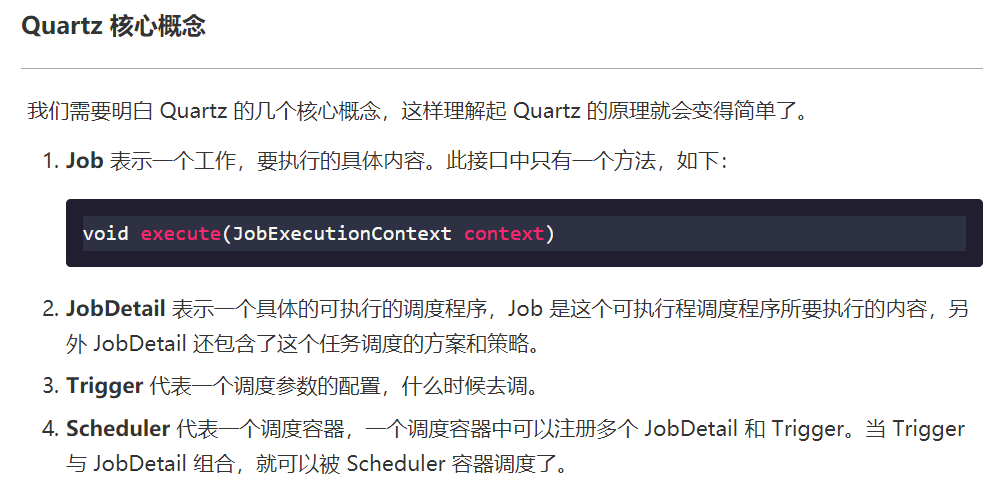

在使用 Scheduler 之前，需要实例化 , scheduler 实例化后，可以启动(start)、暂停(stand-by)、停止(shutdown)。

Quartz API 的关键接口是：

- Scheduler：任务调度器，所有的任务都是从这里开始。
- Trigger：触发器，定义任务执行的方式、间隔。
- JobDetail & Job ： 定义任务具体执行的逻辑。

Scheduler 的生命期，从 SchedulerFactory 创建它时开始，到 Scheduler 调用 shutdown()方法时结束；Scheduler 被创建后，可以增加、删除和列举 Job 和 Trigger，以及执行其它与调度相关的操作（如暂停 Trigger）。但是，Scheduler 只有在调用 start()方法后，才会真正地触发 trigger（即执行 job）

创建项目 `quartz_demo` 导入 `maven` 坐标：

```xml
<dependencies>
        <!--引入Quartz的依赖-->
        <dependency>
            <groupId>org.quartz-scheduler</groupId>
            <artifactId>quartz</artifactId>
            <version>2.2.1</version>
        </dependency>
        <dependency>
            <groupId>org.quartz-scheduler</groupId>
            <artifactId>quartz-jobs</artifactId>
            <version>2.2.1</version>
        </dependency>
    </dependencies>
```

Quartz 入门案例

① 创建 QuartzTest

```java
package com.atguigu;

import org.quartz.*;
import org.quartz.impl.StdSchedulerFactory;

/**
 * QuartzTest
 *
 * @Author: 马伟奇
 * @Description:
 */
public class QuartzTest {
    public static void main(String[] args) {


            try {
                //定义一个JobDetail
                JobDetail jobDetail = JobBuilder.newJob(HelloQuartz.class)
                        //定义name和group 给触发器一些属性 比如名字，组名。
                        .withIdentity("job1", "group1")
                        //job需要传递的内容 具体job传递参数。
                        .usingJobData("name", "sdas")
                        .build();
                //定义一个Trigger
                Trigger trigger = TriggerBuilder.newTrigger().withIdentity("trigger1", "group1")
                        //加入 scheduler之后立刻执行 立刻启动
                        .startNow()
                        //定时 ，每隔1秒钟执行一次 以某种触发器触发。
                        .withSchedule(SimpleScheduleBuilder.simpleSchedule().withIntervalInSeconds(1)
                                //重复执行
                                .repeatForever()).build();
                //创建scheduler
                Scheduler scheduler = StdSchedulerFactory.getDefaultScheduler();
                scheduler.scheduleJob(jobDetail, trigger);
                // Scheduler只有在调用start()方法后，才会真正地触发trigger（即执行job）
                scheduler.start(); //运行一段时间后关闭
                try {
                    Thread.sleep(8000);
                } catch (InterruptedException e) {
                    e.printStackTrace();
                }
                //Scheduler调用shutdown()方法时结束
                scheduler.shutdown();
            } catch (Exception e) {
                e.printStackTrace();
            }


    }
}
```

② 创建 HelloQuartz

```java
package com.atguigu;
import org.quartz.Job;
import org.quartz.JobDetail;
import org.quartz.JobExecutionContext;

import java.util.Date;
/**
 * HelloQuartz
 *
 * @Author: 马伟奇
 * @Description:
 */
public class HelloQuartz implements Job {

    public void execute(JobExecutionContext jobExecutionContext) {
        JobDetail detail = jobExecutionContext.getJobDetail();
        String name = detail.getJobDataMap().getString("name");
        System.out.println("my job name is  " + name + " at " + new Date());
    }
}
```

执行程序

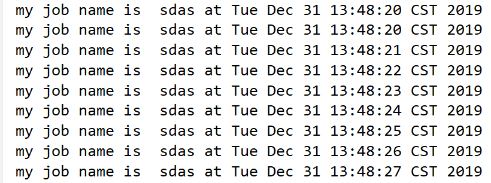

```xml
<!--spring整合Quartz-->
<dependency>
    <groupId>org.springframework</groupId>
    <artifactId>spring-context-support</artifactId>
    <version>5.0.2.RELEASE</version>
</dependency>
```

## 4.2. **Quartz 整合 springboot**

创建项目 `quartz_demo`

添加 pom 文件

```xml
<!--父工程-->
    <parent>
        <groupId>org.springframework.boot</groupId>
        <artifactId>spring-boot-starter-parent</artifactId>
        <version>2.1.6.RELEASE</version>
        <relativePath/> <!-- lookup parent from repository -->
    </parent>

    <dependencies>
        <dependency>
            <groupId>org.springframework.boot</groupId>
            <artifactId>spring-boot-starter-web</artifactId>
        </dependency>

        <dependency>
            <groupId>org.springframework.boot</groupId>
            <artifactId>spring-boot-starter-test</artifactId>
            <scope>test</scope>
        </dependency>
        <!-- 添加 Scheduled 坐标 -->
        <dependency>
            <groupId>org.springframework</groupId>
            <artifactId>spring-context-support</artifactId>
            <version>5.0.5.RELEASE</version>
        </dependency>
    </dependencies>
```

创建 `BootApplication`

```java
package com.atguigu;

import org.springframework.boot.SpringApplication;
import org.springframework.boot.autoconfigure.SpringBootApplication;
import org.springframework.scheduling.annotation.EnableScheduling;

/**
 * BootApplication
 *
 * @Author: 马伟奇
 * @Description:
 */
@SpringBootApplication
@EnableScheduling
public class BootApplication {
    public static void main(String[] args) {
        SpringApplication.run(BootApplication.class, args);
    }
}
```

创建 `TaskController`

```java
package com.atguigu.controller;
import java.text.SimpleDateFormat;
import java.util.Date;

import org.slf4j.Logger;
import org.slf4j.LoggerFactory;
import org.springframework.scheduling.annotation.Scheduled;
import org.springframework.stereotype.Controller;
/**
 * TaskController
 *
 * @Author: 马伟奇
 * @Description:
 */


@Controller("Task")
public class TaskController{

    @Scheduled(fixedDelay = 3000)
    public void myTask1(){
        SimpleDateFormat simpleDateFormat = new SimpleDateFormat("yyyy-MM-dd HH:mm:ss");
        System.out.println(simpleDateFormat.format(new Date()));
        try {
            Thread.sleep(3000);
        } catch (InterruptedException e) {
            e.printStackTrace();
        }
    }

    @Scheduled(fixedRate = 3000)
    public void myTask2(){
        SimpleDateFormat simpleDateFormat = new SimpleDateFormat("yyyy-MM-dd HH:mm:ss");
        System.out.println(simpleDateFormat.format(new Date()));
        try {
            Thread.sleep(5000);
        } catch (InterruptedException e) {
            e.printStackTrace();
        }
    }


    /**
     *       cron:,项目启动后每5秒执行一次
     *       fixedDelay:距离上一次定时任务执行完毕后N毫秒在执行，
     *       比如参数是3000，上次执行A任务花了5秒，执行完成之后在过3秒执行
     *       fixedRate:执行周期，执行频率，
     *       上一个定时任务执行开始，在过N毫秒后执行，比如参数是3000，上次执行A任务花了2秒，在过1秒后执行，
     *       上次执行A任务花了15秒，任务执行后，直接执行
     *
     * @auther
     * @return void
     */
    @Scheduled(cron = "0/5 * * * * ?")
    public void cronTask()
    {
        logger.info("Cron方式-定时任务执行时间："+ dateFormat.format(new Date()));
    }


}
```

## 4.2. **Quartz 整合 spring**

【路径】

1：创建 maven 工程 quartzdemo，打包方式为 war，导入 jar 包

2：自定义一个 Job

3：提供 Spring 配置文件 application-jobs.xml，配置自定义 Job、任务描述、触发器、调度工厂等

4：web.xml 中定义

5：启动 tomcat 完成测试

【讲解】

本案例基于 Quartz 和 spring 整合的方式使用。具体步骤：

（1）创建 maven 工程 quartz_demo，打包方式为 war，导入 Quartz 和 spring 相关坐标，pom.xml 文件如下


导入 jar 包

```xml
<?xml version="1.0" encoding="UTF-8"?>
<project xmlns="http://maven.apache.org/POM/4.0.0"
         xmlns:xsi="http://www.w3.org/2001/XMLSchema-instance"
         xsi:schemaLocation="http://maven.apache.org/POM/4.0.0 http://maven.apache.org/xsd/maven-4.0.0.xsd">
    <modelVersion>4.0.0</modelVersion>

    <groupId>com.atguigu</groupId>
    <artifactId>quartz_demo</artifactId>
    <version>1.0-SNAPSHOT</version>

    <packaging>war</packaging>

    <dependencies>
        <dependency>
            <groupId>org.springframework</groupId>
            <artifactId>spring-context-support</artifactId>
            <version>5.0.2.RELEASE</version>
        </dependency>
        <dependency>
            <groupId>org.springframework</groupId>
            <artifactId>spring-tx</artifactId>
            <version>5.0.2.RELEASE</version>
        </dependency>
        <dependency>
            <groupId>org.springframework</groupId>
            <artifactId>spring-web</artifactId>
            <version>5.0.2.RELEASE</version>
        </dependency>
        <dependency>
            <groupId>org.quartz-scheduler</groupId>
            <artifactId>quartz</artifactId>
            <version>2.2.1</version>
        </dependency>
        <dependency>
            <groupId>org.quartz-scheduler</groupId>
            <artifactId>quartz-jobs</artifactId>
            <version>2.2.1</version>
        </dependency>
    </dependencies>
    <build>
        <plugins>
            <plugin>
                <groupId>org.apache.tomcat.maven</groupId>
                <artifactId>tomcat7-maven-plugin</artifactId>
                <configuration>
                    <!-- 指定端口 -->
                    <port>8080</port>
                    <!-- 请求路径 -->
                    <path>/</path>
                </configuration>
            </plugin>
        </plugins>
    </build>
</project>
```

（2）自定义一个 Job

```java
package com.atguigu;

/**
 * JobDemo
 *
 * @Author: 马伟奇
 * @Description:
 */
// 任务调度类
public class JobDemo {
    // 提供方法（备份数据库，清理日志，清理图片）
    public void run(){
        // 完成业务
        System.out.println(new Date());
    }
}
```

（3）提供 Spring 配置文件 application-jobs.xml，配置自定义 Job、任务描述、触发器、调度工厂等

【路径】

1：创建 JobDetail 对象,作用是负责通过反射调用指定的 Job，注入目标对象，注入目标方法

2：注册一个触发器，指定任务触发的时间

3：注册一个统一的调度工厂，通过这个调度工厂调度任务

```xml
<?xml version="1.0" encoding="UTF-8"?>
<beans xmlns="http://www.springframework.org/schema/beans"
       xmlns:xsi="http://www.w3.org/2001/XMLSchema-instance"
       xmlns:context="http://www.springframework.org/schema/context"
       xsi:schemaLocation="http://www.springframework.org/schema/beans
                  http://www.springframework.org/schema/beans/spring-beans.xsd
                  http://www.springframework.org/schema/context
                  http://www.springframework.org/schema/context/spring-context.xsd">
    <!-- 注册自定义Job -->
    <bean id="jobDemo" class="com.atguigu.JobDemo"></bean>
    <!-- 1：创建JobDetail对象,作用是负责通过反射调用指定的Job，注入目标对象，注入目标方法 -->
    <bean id="jobDetail"
          class="org.springframework.scheduling.quartz.MethodInvokingJobDetailFactoryBean">
        <!-- 注入目标对象 -->
        <property name="targetObject" ref="jobDemo"/>
        <!-- 注入目标方法 -->
        <property name="targetMethod" value="run"/>
    </bean>
    <!-- 2：注册一个触发器，指定任务触发的时间 -->
    <bean id="myTrigger" class="org.springframework.scheduling.quartz.CronTriggerFactoryBean">
        <!-- 注入JobDetail -->
        <property name="jobDetail" ref="jobDetail"/>
        <!-- 指定触发的时间，基于Cron表达式（0/10表示从0秒开始，每10秒执行一次） -->
        <property name="cronExpression">
            <value>0/10 * * * * ?</value>
        </property>
    </bean>
    <!-- 3：注册一个统一的调度工厂，通过这个调度工厂调度任务 -->
    <bean id="scheduler" class="org.springframework.scheduling.quartz.SchedulerFactoryBean">
        <!-- 注入多个触发器 -->
        <property name="triggers">
            <list>
                <ref bean="myTrigger"/>
            </list>
        </property>
    </bean>
</beans>
```

（4）web.xml 中定义

启动 web，自动加载 spring 容器。

```xml
<?xml version="1.0" encoding="UTF-8"?>
<web-app xmlns:xsi="http://www.w3.org/2001/XMLSchema-instance"
         xmlns="http://java.sun.com/xml/ns/javaee"
         xsi:schemaLocation="http://java.sun.com/xml/ns/javaee http://java.sun.com/xml/ns/javaee/web-app_3_0.xsd"
         id="WebApp_ID" version="3.0">

    <listener>
        <listener-class>org.springframework.web.context.ContextLoaderListener</listener-class>
    </listener>
    <context-param>
        <param-name>contextConfigLocation</param-name>
        <param-value>classpath:application-jobs.xml</param-value>
    </context-param>
</web-app>
```

执行上面 main 方法观察控制台，可以发现每隔 10 秒会输出一次，说明每隔 10 秒自定义 Job 被调用一次。

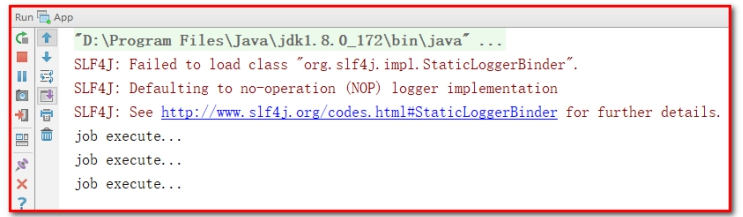

## 4.3. **cron 表达式**

上面的入门案例中我们指定了一个表达式：0/10 \* \* \* \* ?

这种表达式称为 cron 表达式，通过 cron 表达式可以灵活的定义出符合要求的程序执行的时间。本小节我们就来学习一下 cron 表达式的使用方法。如下图：


cron 表达式分为七个域，之间使用空格分隔。其中最后一个域（年）可以为空。每个域都有自己允许的值和一些特殊字符构成。使用这些特殊字符可以使我们定义的表达式更加灵活。

下面是对这些特殊字符的介绍：

逗号（,）：指定一个值列表，例如使用在月域上 1,4,5,7 表示 1 月、4 月、5 月和 7 月

横杠（-）：指定一个范围，例如在时域上 3-6 表示 3 点到 6 点（即 3 点、4 点、5 点、6 点）

星号（\*）：表示这个域上包含所有合法的值。例如，在月份域上使用星号意味着每个月都会触发

斜线（/）：表示递增，例如使用在秒域上 0/15 表示每 15 秒

问号（?）：只能用在日和周域上，但是不能在这两个域上同时使用。表示不指定，例如想在每月的 20 日触发调度，不管 20 日到底是星期几，则只能使用如下写法： 13 13 15 20 _ ?, 其中最后一位只能用？，而不能使用 _，如果使用 \* 表示不管星期几都会触发，实际上并不是这样。

井号（#）：只能使用在周域上，用于指定月份中的第几周的哪一天，例如 6#3，意思是某月的第三个周五 (6=星期五，3 意味着月份中的第三周)

L：某域上允许的最后一个值。只能使用在日和周域上。当用在日域上，表示的是在月域上指定的月份的最后一天。用于周域上时，表示周的最后一天，就是星期六

W：W 字符代表着工作日 (星期一到星期五)，只能用在日域上，它用来指定离指定日的最近的一个工作日

### 4.3.1 **常用表达式例子**

```properties
   （1）0 0 2 1 * ? *   表示在每月的1日的凌晨2点调整任务

　　（2）0 15 10 ? * MON-FRI   表示周一到周五每天上午10:15执行作业

　　（3）0 0 10,14,16 * * ?   每天上午10点，下午2点，4点

　　（4）0 0 12 ? * WED    表示每个星期三中午12点

　　（5）0 0 12 * * ?   每天中午12点触发

　　（6）0 15 10 ? * *    每天上午10:15触发

　　（7）0 15 10 * * ?     每天上午10:15触发

　　（8）0 15 10 * * ? *    每天上午10:15触发

　　（9）0 15 10 * * ? 2005    2005年的每天上午10:15触发

　　（10）0 * 14 * * ?     在每天下午2点到下午2:59期间的每1分钟触发

　　（11）0 0/5 14 * * ?    在每天下午2点到下午2:55期间的每5分钟触发

　　（12）0 0/5 14,18 * * ?     在每天下午2点到2:55期间和下午6点到6:55期间的每5分钟触发

　　（13）0 0-5 14 * * ?    在每天下午2点到下午2:05期间的每1分钟触发

　　（14）0 10,44 14 ? 3 WED    每年三月的星期三的下午2:10和2:44触发

　　（15）0 15 10 ? * MON-FRI    周一至周五的上午10:15触发

　　（16）0 15 10 15 * ?    每月15日上午10:15触发

　　（17）0 15 10 L * ?    每月最后一日的上午10:15触发

　　（18）0 15 10 ? * 6L    每月的最后一个星期五上午10:15触发

　　（19）0 15 10 ? * 6L 2002-2005   2002年至2005年的每月的最后一个星期五上午10:15触发

　　（20）0 15 10 ? * 6#3   每月的第三个星期五上午10:15触发
　　
　　（21）0 15 10 ? 6L 2002-2006   表示2002-2006年的每个月的最后一个星期五上午10:15执行作

　　（22）0 0/30 9-17 * * ?   朝九晚五工作时间内每半小时


```

## 4.4. **cron 表达式在线生成器**

前面介绍了 cron 表达式，但是自己编写表达式还是有一些困难的，我们可以借助一些 cron 表达式在线生成器来根据我们的需求生成表达式即可。

<http://cron.qqe2.com/>


### 【小结】

1：Quart 介绍

- 掌握场景（定时任务）

2：Quartz 入门案例

- spring 整合 Quartz（spring 中配置）

3：cron 表达式

4：cron 表达式在线生成器

<http://cron.qqe2.com/>

# 5. **第五章**. 定时清理垃圾图片

### 【目标】

Quartz 整合项目，完成定时清理垃圾图片

### 【路径】

1：创建 maven 聚合工程 meinian_jobs，打包方式为 war，导入 Quartz 等相关坐标

2：配置 web.xml

- web 容器启动，加载 spring 容器

3：配置 log4j.properties

4：配置 applicationContext-redis.xml

- spring 整合 redis

5：配置 applicationContext-jobs.xml

- spring 整合 Quartz

6：创建 ClearImgJob 定时任务类

- 使用 Quartz 清理垃圾图片

### 【讲解】

前面我们已经完成了旅游套餐的管理，在新增套餐时套餐的基本信息和图片是分两次提交到后台进行操作的。也就是用户首先将图片上传到七牛云服务器，然后再提交新增窗口中录入的其他信息。如果用户只是上传了图片而没有提交录入的其他信息，此时的图片就变为了垃圾图片，因为在数据库中并没有记录它的存在。此时我们要如何处理这些垃圾图片呢？

解决方案就是通过定时任务组件定时清理这些垃圾图片。为了能够区分出来哪些图片是垃圾图片，我们在文件上传成功后将图片保存到了一个 `redis` 集合中，当套餐数据插入到数据库后我们又将图片名称保存到了另一个 redis 集合中，通过计算这两个集合的差值就可以获得所有垃圾图片的名称。

本章节我们就会基于`Quartz` 定时任务，通过计算 `redis` 两个集合的差值找出所有的垃圾图片，就可以将垃圾图片清理掉。

操作步骤：

（1）创建 maven 聚合工程 `meinian_jobs` ，打包方式为 war，导入 Quartz 等相关坐标

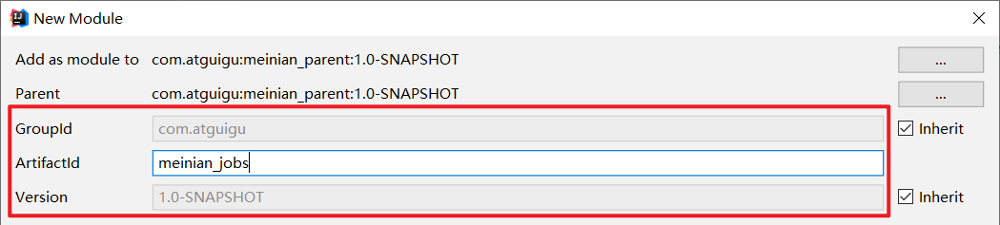

```xml
<?xml version="1.0" encoding="UTF-8"?>
<project xmlns="http://maven.apache.org/POM/4.0.0"
         xmlns:xsi="http://www.w3.org/2001/XMLSchema-instance"
         xsi:schemaLocation="http://maven.apache.org/POM/4.0.0 http://maven.apache.org/xsd/maven-4.0.0.xsd">
    <parent>
        <artifactId>meinian_parent</artifactId>
        <groupId>com.atguigu</groupId>
        <version>1.0-SNAPSHOT</version>
    </parent>
    <modelVersion>4.0.0</modelVersion>

    <artifactId>meinian_jobs</artifactId>

    <packaging>war</packaging>

    <properties>
        <project.build.sourceEncoding>UTF-8</project.build.sourceEncoding>
        <maven.compiler.source>1.8</maven.compiler.source>
        <maven.compiler.target>1.8</maven.compiler.target>
    </properties>
    <dependencies>
        <dependency>
            <groupId>com.atguigu</groupId>
            <artifactId>meinian_interface</artifactId>
            <version>1.0-SNAPSHOT</version>
        </dependency>
        <dependency>
            <groupId>org.quartz-scheduler</groupId>
            <artifactId>quartz</artifactId>
        </dependency>
        <dependency>
            <groupId>org.quartz-scheduler</groupId>
            <artifactId>quartz-jobs</artifactId>
        </dependency>
    </dependencies>
    <build>
        <plugins>
            <plugin>
                <groupId>org.apache.tomcat.maven</groupId>
                <artifactId>tomcat7-maven-plugin</artifactId>
                <configuration>
                    <!-- 指定端口 -->
                    <port>83</port>
                    <!-- 请求路径 -->
                    <path>/</path>
                </configuration>
            </plugin>
        </plugins>
    </build>
</project>
```

（2）配置 web.xml

```xml
<?xml version="1.0" encoding="UTF-8"?>
<web-app xmlns:xsi="http://www.w3.org/2001/XMLSchema-instance"
         xmlns="http://java.sun.com/xml/ns/javaee"
         xsi:schemaLocation="http://java.sun.com/xml/ns/javaee http://java.sun.com/xml/ns/javaee/web-app_3_0.xsd"
         id="WebApp_ID" version="3.0">
    <display-name>Archetype Created Web Application</display-name>
    <!-- 加载spring容器 -->
    <context-param>
        <param-name>contextConfigLocation</param-name>
        <param-value>classpath*:applicationContext*.xml</param-value>
    </context-param>
    <listener>
        <listener-class>org.springframework.web.context.ContextLoaderListener</listener-class>
    </listener>
</web-app>
```

（3）配置 log4j.properties

```properties
### direct log messages to stdout ###
log4j.appender.stdout=org.apache.log4j.ConsoleAppender
log4j.appender.stdout.Target=System.err
log4j.appender.stdout.layout=org.apache.log4j.PatternLayout
log4j.appender.stdout.layout.ConversionPattern=%d{ABSOLUTE} %5p %c{1}:%L - %m%n

### direct messages to file mylog.log ###
log4j.appender.file=org.apache.log4j.FileAppender
log4j.appender.file.File=c:\\mylog.log
log4j.appender.file.layout=org.apache.log4j.PatternLayout
log4j.appender.file.layout.ConversionPattern=%d{ABSOLUTE} %5p %c{1}:%L - %m%n

### set log levels - for more verbose logging change 'info' to 'debug' ###

log4j.rootLogger=debug, stdout
```

（4）配置 applicationContext-redis.xml

```xml
<?xml version="1.0" encoding="UTF-8"?>
<beans xmlns="http://www.springframework.org/schema/beans"
       xmlns:xsi="http://www.w3.org/2001/XMLSchema-instance"
       xmlns:p="http://www.springframework.org/schema/p"
       xmlns:context="http://www.springframework.org/schema/context"
       xmlns:dubbo="http://code.alibabatech.com/schema/dubbo"
       xmlns:mvc="http://www.springframework.org/schema/mvc"
       xsi:schemaLocation="http://www.springframework.org/schema/beans
                         http://www.springframework.org/schema/beans/spring-beans.xsd
                        http://www.springframework.org/schema/mvc
                         http://www.springframework.org/schema/mvc/spring-mvc.xsd
                        http://code.alibabatech.com/schema/dubbo
                         http://code.alibabatech.com/schema/dubbo/dubbo.xsd
                        http://www.springframework.org/schema/context
                         http://www.springframework.org/schema/context/spring-context.xsd">

    <!--Jedis连接池的相关配置-->
    <bean id="jedisPoolConfig" class="redis.clients.jedis.JedisPoolConfig">
        <!--在指定时刻通过pool能够获取到的最大的连接的jedis个数-->
        <property name="maxTotal">
            <value>200</value>
        </property>
         <!--最大能够保持idle的数量-->
        <property name="maxIdle">
            <value>50</value>
        </property>
        <!--表示连接池在创建链接的时候会先测试一下链接是否可用，这样可以保证连接池中的链接都可用的。-->
        <property name="testOnBorrow" value="true"/>
        <property name="testOnReturn" value="true"/>
    </bean>
    <bean id="jedisPool" class="redis.clients.jedis.JedisPool">
        <constructor-arg name="poolConfig" ref="jedisPoolConfig" />
        <constructor-arg name="host" value="127.0.0.1" />
        <constructor-arg name="port" value="6379" type="int" />
        <constructor-arg name="timeout" value="30000" type="int" />
    </bean>
</beans>
```

（5）配置 `applicationContext-jobs.xml`

使用组件：

```xml
<!--组件的扫描 开启注解配置支持，否则在ClearImgJob不能使用@Autowired-->
<context:component-scan base-package="com.atguigu"></context:component-scan>
```

```xml
<?xml version="1.0" encoding="UTF-8"?>
<beans xmlns="http://www.springframework.org/schema/beans"
       xmlns:xsi="http://www.w3.org/2001/XMLSchema-instance"
       xmlns:context="http://www.springframework.org/schema/context"
       xsi:schemaLocation="http://www.springframework.org/schema/beans
                  http://www.springframework.org/schema/beans/spring-beans.xsd
                  http://www.springframework.org/schema/context
                  http://www.springframework.org/schema/context/spring-context.xsd">
    <!--开启注解配置支持，否则在ClearImgJob不能使用@Autowired-->
    <context:component-scan base-package="com.atguigu"></context:component-scan>

    <!-- 注册自定义Job -->
    <bean id="jobDemo" class="com.atguigu.job.ClearImgJob"></bean>
    <!-- 注册JobDetail,作用是负责通过反射调用指定的Job -->
    <bean id="jobDetail"
          class="org.springframework.scheduling.quartz.MethodInvokingJobDetailFactoryBean">
        <!-- 注入目标对象 -->
        <property name="targetObject" ref="jobDemo"/>
        <!-- 注入目标方法 -->
        <property name="targetMethod" value="clearImg"/>
    </bean>
    <!-- 注册一个触发器，指定任务触发的时间 -->
    <bean id="myTrigger" class="org.springframework.scheduling.quartz.CronTriggerFactoryBean">
        <!-- 注入JobDetail -->
        <property name="jobDetail" ref="jobDetail"/>
        <!-- 指定触发的时间，基于Cron表达式（0 0 2 * * ?表示凌晨2点执行） -->
        <!-- 指定触发的时间，基于Cron表达式（0 25 12 * * ?表示12点25分执行） -->
        <property name="cronExpression">
            <value>0 0 2 * * ?</value>
        </property>
    </bean>
    <!-- 注册一个统一的调度工厂，通过这个调度工厂调度任务 -->
    <bean id="scheduler" class="org.springframework.scheduling.quartz.SchedulerFactoryBean">
        <!-- 注入多个触发器 -->
        <property name="triggers">
            <list>
                <ref bean="myTrigger"/>
            </list>
        </property>
    </bean>
</beans>
```

（6）创建 ClearImgJob 定时任务类

```java
package com.atguigu.job;

import com.atguigu.constant.RedisConstant;
import com.atguigu.utils.QiniuUtils;
import org.springframework.beans.factory.annotation.Autowired;
import redis.clients.jedis.JedisPool;

import java.util.Iterator;
import java.util.Set;

/**
 * ClearImgJob
 *
 * @Author: 马伟奇
 * @Description:
 */
public class ClearImgJob {
    @Autowired
    private JedisPool jedisPool;
    //清理图片
    public void clearImg(){
        //计算redis中两个集合的差值，获取垃圾图片名称
        // 需要注意：在比较的时候，数据多的放到前面，如果pic多，那么pic放到前面，db多，db放到前面
        Set<String> set = jedisPool.getResource().sdiff(
                RedisConstant.SETMEAL_PIC_RESOURCES,
                RedisConstant.SETMEAL_PIC_DB_RESOURCES);
        Iterator<String> iterator = set.iterator();
        while(iterator.hasNext()){
            String pic = iterator.next();
            System.out.println("删除图片的名称是："+pic);
            //删除图片服务器中的图片文件
            QiniuUtils.deleteFileFromQiniu(pic);
            //删除redis中的数据
            jedisPool.getResource().srem(RedisConstant.SETMEAL_PIC_RESOURCES,pic);
        }
    }
}
```

测试：


注意：如果 `redis` 服务端启动如下，不需要担心，直接使用 , 只是没有图标而已。

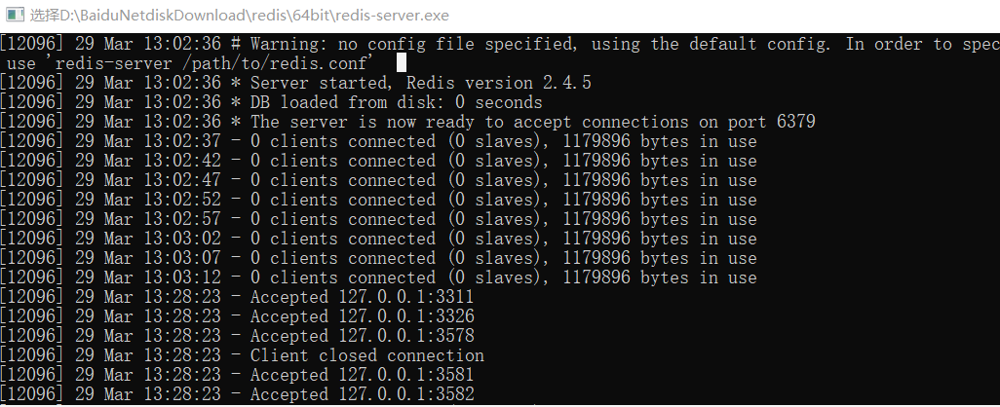

### 【小结】

1：创建 maven 聚合工程 `meinian_jobs` ，打包方式为 war，导入 Quartz 等相关坐标

2：配置 web.xml

- web 容器启动，加载 spring 容器

3：配置 log4j.properties

4：配置 applicationContext-redis.xml

- spring 整合 redis

5：配置 applicationContext-jobs.xml

- spring 整合 Quartz

6：创建 ClearImgJob 定时任务类

- 使用 Quartz 清理垃圾图片
