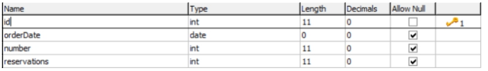
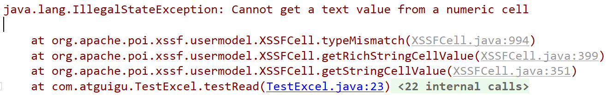
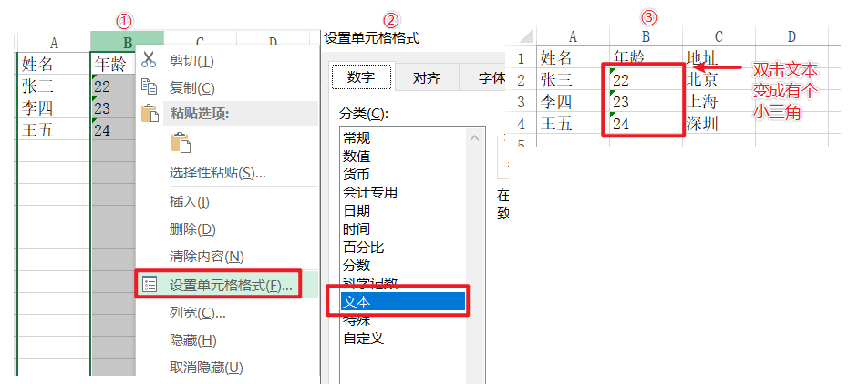
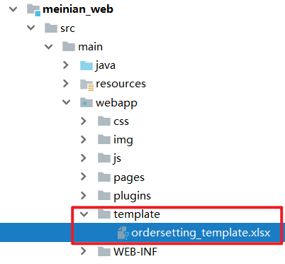
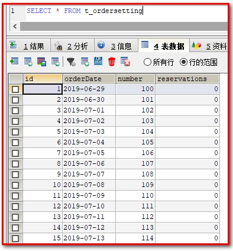
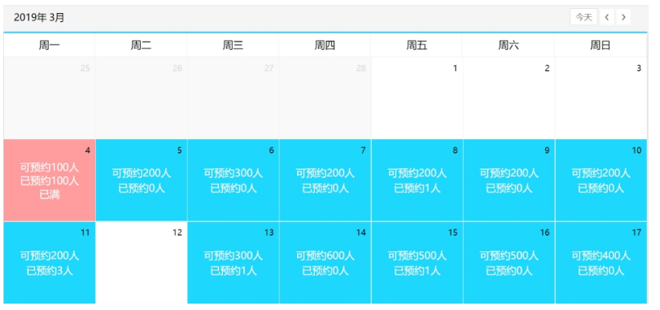
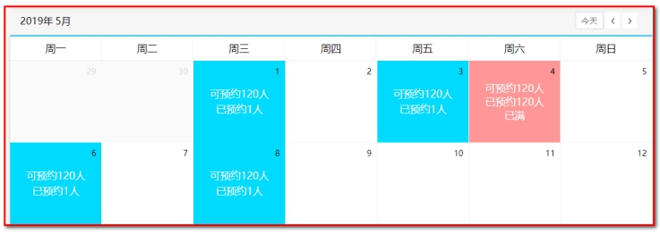
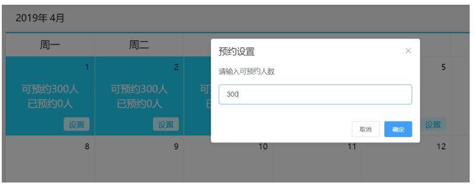
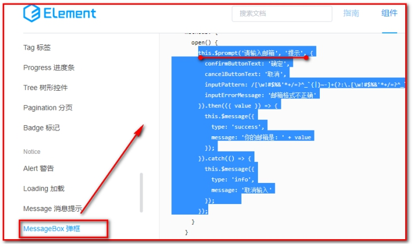

# 预约管理-预约设置

目标：

1：了解什么是Apache POI

2：掌握Apache POI的使用方法

3：掌握批量导入预约设置信息的实现过程

4：掌握日历方式展示预约设置信息的实现过程

5：掌握基于日历实现预约设置信息的实现过程

# 1. **第一章**. 需求分析

### 【目标】

- 掌握预约设置的需求

### 【路径】

1. 预约设置需求分析
2. 对应的表结构和实体类

### 【讲解】

1.预约设置需求分析

前面我们已经完成了自由行管理、跟团游管理、套餐管理等。接下来我们需要进行预约设置，其实就是设置每一天的旅游预约最大数量。客户可以通过微信端在线预约，在线预约时需要选择旅游的时间，使得选择旅游时间的已预约人数加1，如果客户选择的时间已经预约满则无法进行预约。

2.t_ordersetting表结构：

 

orderDate：预约日期 

number：最多可预约人数 

reservations：已预约人数

### 【小结】

1. 预约设置 就是设置一天最大预约旅游人数（number字段）
2. 客户预约的时候，需要更新当前预约人数+1（reservations字段）

# 2. **第二章. Apache POI**

### 【目标】

了解什么是Apache POI

掌握Apache POI的使用方法

### 【路径】

1. POI介绍

2. POI入门案例

   （1）从Excel文件读取数据

   （2）向Excel文件写入数据

3. POI工具类的介绍

### 【讲解】

## 2.1. **POI介绍**

### 2.1.1 简介

​    开发中经常会设计到excel的处理，如导出Excel，导入Excel到数据库中，操作Excel目前有两个框架，一个是apache 的poi， 另一个是 Java Excel

​    Apache POI 是用Java编写的免费开源的跨平台的 Java API，Apache POI提供API给Java程式对Microsoft Office（Excel、WORD、PowerPoint、Visio等）格式档案读和写的功能。

​    官方主页： http://poi.apache.org/index.html
​    API文档： http://poi.apache.org/apidocs/index.html


maven坐标：

```xml
<dependency>
  <groupId>org.apache.poi</groupId>
  <artifactId>poi</artifactId>
  <version>3.14</version>
</dependency>
<dependency>
  <groupId>org.apache.poi</groupId>
  <artifactId>poi-ooxml</artifactId>
  <version>3.14</version>
</dependency>
```

### 2.1.2 Apache POI常用的类

POI结构：

```
HSSF － 提供读写Microsoft Excel XLS格式档案的功能
XSSF － 提供读写Microsoft Excel OOXML XLSX格式档案的功能（我们使用）
HWPF － 提供读写Microsoft Word DOC格式档案的功能
HSLF － 提供读写Microsoft PowerPoint格式档案的功能
HDGF － 提供读Microsoft Visio格式档案的功能
HPBF － 提供读Microsoft Publisher格式档案的功能
HSMF － 提供读Microsoft Outlook格式档案的功能
```

我们使用：XSSF － 提供读写Microsoft Excel OOXML XLSX格式档案的功能

## 2.2. **入门案例**

### 2.2.1. **从Excel文件读取数据**

【需求】

使用POI可以从一个已经存在的Excel文件中读取数据

【路径】

1：创建工作簿对象

2：获得工作表对象

3：遍历工作表对象 获得行对象

4：遍历行对象 获得单元格（列）对象

5：获得数据

6：关闭

【讲解】

1. 实现

使用POI可以从一个已经存在的Excel文件中读取数据

在meinian_common中建立测试类，TestPoi.java

```java
package com.atguigu;

import org.apache.poi.ss.usermodel.Cell;
import org.apache.poi.ss.usermodel.Row;
import org.apache.poi.xssf.usermodel.XSSFSheet;
import org.apache.poi.xssf.usermodel.XSSFWorkbook;
import org.junit.Test;

/**
 * TestExcel
 *
 * @Author: 马伟奇
 * @Description:
 */
// 导出excel
public class TestPoi {
        @Test
        public void exportExcel() throws IOException {
            //创建工作簿
            XSSFWorkbook workbook = new XSSFWorkbook("D:\\hello.xlsx");
            //获取工作表，既可以根据工作表的顺序获取，也可以根据工作表的名称获取
            XSSFSheet sheet = workbook.getSheetAt(0);
            //遍历工作表获得行对象
            for (Row row : sheet) {
                //遍历行对象获取单元格对象
                for (Cell cell : row) {
                    //获得单元格中的值
                    String value = cell.getStringCellValue();
                    System.out.println(value);
                }
            }
            workbook.close();
        }
```

【小结】

通过上面的入门案例可以看到，POI操作Excel表格封装了几个核心对象：

```
XSSFWorkbook：工作簿
XSSFSheet：工作表
XSSFRow：行
XSSFCell：单元格
```

上面案例是通过遍历工作表获得行，遍历行获得单元格，最终获取单元格中的值。

错误



解决方案




还有一种方式就是获取工作表最后一个行号，从而根据行号获得行对象，通过行获取最后一个单元格索引，从而根据单元格索引获取每行的一个单元格对象，代码如下：

```java
public class TestPoi {
    // 导出excel，获取最后一行
    @Test
    public void exportExcel_lastRow() throws IOException {
        //创建工作簿
        XSSFWorkbook workbook = new XSSFWorkbook("D:\\hello.xlsx");
        //获取工作表，既可以根据工作表的顺序获取，也可以根据工作表的名称获取
        XSSFSheet sheet = workbook.getSheetAt(0);
        //获取当前工作表最后一行的行号，行号从0开始
        int lastRowNum = sheet.getLastRowNum();
        for(int i=0;i<=lastRowNum;i++){
            //根据行号获取行对象
            XSSFRow row = sheet.getRow(i);
             // 再获取单元格对象
            short lastCellNum = row.getLastCellNum();
            for(short j=0;j<lastCellNum;j++){
                 // 获取单元格对象的值
                String value = row.getCell(j).getStringCellValue();
                System.out.println(value);
            }
        }
        workbook.close();
    }
```

 

### 2.2.2. **向Excel文件写入数据**

【需求】

 使用POI可以在内存中创建一个Excel文件并将数据写入到这个文件，最后通过输出流将内存中的Excel文件下载到磁盘

【路径】

```
1.创建工作簿对象
2.创建工作表对象
3.创建行对象
4.创建列(单元格)对象, 设置内容
5.通过输出流将workbook对象下载到磁盘
```

【实现】

使用POI可以在内存中创建一个Excel文件并将数据写入到这个文件，最后通过输出流将内存中的Excel文件下载到磁盘

```java
// 导入excel
@Test
public void importExcel() throws IOException {
    //在内存中创建一个Excel文件
    XSSFWorkbook workbook = new XSSFWorkbook();
    //创建工作表，指定工作表名称
    XSSFSheet sheet = workbook.createSheet("尚硅谷");

    //创建行，0表示第一行
    XSSFRow row = sheet.createRow(0);
    //创建单元格，0表示第一个单元格
    row.createCell(0).setCellValue("编号");
    row.createCell(1).setCellValue("姓名");
    row.createCell(2).setCellValue("年龄");

    XSSFRow row1 = sheet.createRow(1);
    row1.createCell(0).setCellValue("1");
    row1.createCell(1).setCellValue("小明");
    row1.createCell(2).setCellValue("10");

    XSSFRow row2 = sheet.createRow(2);
    row2.createCell(0).setCellValue("2");
    row2.createCell(1).setCellValue("小王");
    row2.createCell(2).setCellValue("20");

    //通过输出流将workbook对象下载到磁盘
    FileOutputStream out = new FileOutputStream("D:\\atguigu.xlsx");
    workbook.write(out);
    out.flush();//刷新
    out.close();//关闭
    workbook.close();
}
```

 

小结：POI技术

- 创建工作簿的时候, 不需要传入参数(excel不存在的)
- 使用输出流，输出excel

应用场景：

1：从excel中读取数据，写入到数据库（导入）；

2：从数据库查询数据，写入到excel文件（导出）

### 2.2.3.POI工具类的介绍

将资料中的POIUtils工具类复制到 `meinian_common` 工程

 

### 【小结】

1.POI介绍

​	POI就是一个工具, 用来操作Office, 主要用来操作Excel

2.POI入门案例

​	（1）从Excel文件读取数据

​	（2）向Excel文件写入数据

3.POI工具类的介绍

​	使用工具类, 读取Excel, 每一行读取到了String[] 里面, 多行就是多个String[] , 最终封装到List

# 3. **第三章. 批量导入预约设置信息**

### 【目标】

批量导入预约设置信息

### 【路径】

1：前台代码

（1）提供模板文件

（2）实现模板文件下载

（3）文件上传

2：后台代码

业务：

- 从excel中读取预约设置信息，批量导入到数据库

（1）OrderSettingController.java（Controller）

（2）OrderSettingService.java（服务接口）

（3）OrderSettingServiceImpl.java（服务实现类）

（4）OrderSettingDao.java（Dao接口）

（5）OrderSettingDao.xml（Mapper映射文件）

### 【讲解】

【需求】

从Excel读取预约设置的数据，批量导入到数据库


【设计】

预约设置信息对应的数据表为t_ordersetting，预约设置操作对应的页面为ordersetting.html

1：t_ordersetting表结构：

 

orderDate：预约日期 

number：可预约人数 

reservations：已预约人数


导入mysql数据

```sql
DROP TABLE IF EXISTS `t_ordersetting`;
CREATE TABLE `t_ordersetting` (
  `id` int(11) NOT NULL AUTO_INCREMENT,
  `orderDate` date DEFAULT NULL COMMENT '约预日期',
  `number` int(11) DEFAULT NULL COMMENT '可预约人数',
  `reservations` int(11) DEFAULT NULL COMMENT '已预约人数',
  PRIMARY KEY (`id`)
) ENGINE=InnoDB AUTO_INCREMENT=69 DEFAULT CHARSET=utf8;


```


【路径】

批量导入预约设置信息操作过程：

​	第一步、点击模板下载按钮下载Excel模板文件【文件下载】

​	第二步、将预约设置信息录入到模板文件中

​	第三步、点击上传文件按钮将录入完信息的模板文件上传到服务器【文件上传】

​	第四步、通过POI读取上传文件的数据并保存到数据库【poi导入】

2：将 `ordersetting.html` 放置到 `meinian_web` 中

 

## 3.1. **前台代码**

### 3.1.1. **提供模板文件**

资料中已经提供了Excel模板文件ordersetting_template.xlsx，将文件放在meinian_web工程的template目录下

 

### 3.1.2. **实现模板文件下载**

（1）为模板下载按钮绑定事件实现模板文件下载

```html
<el-button style="margin-bottom: 20px;margin-right: 20px" type="primary" @click="downloadTemplate()">模板下载</el-button>
```

（2）downloadTemplate()

```html
//下载模板文件
downloadTemplate(){
    window.location.href="../../template/ordersetting_template.xlsx";
},
```


### 3.1.3. **文件上传**

（1）使用ElementUI的上传组件实现文件上传并绑定相关事件

```html
<el-upload action="/ordersetting/upload.do"
           name="excelFile"
           :show-file-list="false"
           :on-success="handleSuccess"
           :before-upload="beforeUpload">
    <el-button type="primary">上传文件</el-button>
</el-upload>
```

（2）handleSuccess方法：用于显示上传成功或者失败信息。

```html
//上传成功提示
handleSuccess(response, file) {
    if(response.flag){
         this.$message({
              message: response.message,
              type: 'success'
         });
    }else{
         this.$message.error(response.message);
    }
},
```

 

（3）beforeUpload方法：用于校验上传的文件是否是excel文件

```html
//上传之前进行文件格式校验
beforeUpload(file){
    //alert("文件名：" + file.name);
	//alert("文件类型：" + file.type);
	var f_index = file.name.lastIndexOf(".");

	if(f_index != -1){
		var f_type = file.name.substring(f_index+1, file.name.length).toLowerCase();

        if(f_type == 'xls' || f_type == 'xlsx'){
            return true;
        }
	}
    const isXLS = file.type === 'application/vnd.ms-excel';
    if(isXLS){
        return true;
    }
    const isXLSX = file.type === 'application/vnd.openxmlformats-officedocument.spreadsheetml.sheet';
    if (isXLSX) {
        return true;
    }
    this.$message.error('上传文件只能是xls或者xlsx格式!');
    return false;
},
```


## 3.2. **后台代码**

### 3.2.1. **Controller**

【路径】

1.点击上传文件, 把编写好的Excel上传到OrderSettingController

2.创建OrderSettingController, 创建upload()方法

```
//1.使用POI解析文件 得到List<String[]> list
//2.把List<String[]> list转成 List<OrderSetting> list
//3.调用业务 进行保存
```

3.创建OrderSettingService

```
//1.遍历List<OrderSetting> list
//2.判断当前的日期之前是否设置过
		//2.1 如果设置过, 更新数量
		//2.2 没有设置过, 保存
```

4.创建OrderSettingDao  

```
//根据日期查询

//根据日期更新number

//保存OrderSetting
```


在 `meinian_web` 工程创建 `OrderSettingController` 并提供upload方法

```java
package com.atguigu.controller;

import com.alibaba.dubbo.config.annotation.Reference;
import com.atguigu.constant.MessageConstant;
import com.atguigu.entity.Result;
import com.atguigu.pojo.OrderSetting;
import com.atguigu.service.OrdersettingService;
import com.atguigu.utils.POIUtils;
import org.springframework.web.bind.annotation.RequestMapping;
import org.springframework.web.bind.annotation.RestController;
import org.springframework.web.multipart.MultipartFile;

import java.io.IOException;
import java.util.ArrayList;
import java.util.Date;
import java.util.List;

/**
 * OrdersettingController
 *
 * @Author: 马伟奇
 * @Description:
 */
@RestController
@RequestMapping("/ordersetting")
public class OrdersettingController {

    @Reference
    private OrdersettingService ordersettingService;

    @RequestMapping("/upload")
    public Result upload(MultipartFile excelFile){
        try {
            // 使用poi工具类解析excel文件，读取里面的内容
            List<String[]> lists = POIUtils.readExcel(excelFile);
            // 把List<String[]> 数据转换成 List<OrderSetting>数据
            List<OrderSetting> orderSettings = new ArrayList<>();
            //  迭代里面的每一行数据，进行封装到集合里面
            for (String[] str : lists) {
                // 获取到一行里面，每个表格数据，进行封装
                OrderSetting orderSetting = new OrderSetting(new Date(str[0]),Integer.parseInt(str[1]));
                orderSettings.add(orderSetting);
            }
            // 调用业务进行保存
            ordersettingService.add(orderSettings);
            return new Result(true, MessageConstant.ORDERSETTING_SUCCESS);
        } catch (Exception e) {
            e.printStackTrace();
            return new Result(true, MessageConstant.ORDERSETTING_FAIL);
        }

    }
}
```

 

### 3.2.2. **服务接口**

创建OrderSettingService服务接口并提供新增方法

```java
package com.atguigu.service;

import com.atguigu.pojo.OrderSetting;

import java.util.List;

/**
 * OrdersettingService
 *
 * @Author: 马伟奇
 * @Description:
 */
public interface OrdersettingService {
    void add(List<OrderSetting> orderSettings);
}


```

 

### 3.2.3. **服务实现类**

创建服务实现类OrderSettingServiceImpl并实现新增方法

```java
package com.atguigu.service.impl;

import com.alibaba.dubbo.config.annotation.Service;
import com.atguigu.dao.OrdersettingDao;
import com.atguigu.pojo.OrderSetting;
import com.atguigu.service.OrdersettingService;
import org.springframework.beans.factory.annotation.Autowired;
import org.springframework.transaction.annotation.Transactional;

import java.util.List;

/**
 * OrdersettingServiceImpl
 *
 * @Author: 马伟奇
 * @Description:
 */
@Service(interfaceClass = OrdersettingService.class)
@Transactional
public class OrdersettingServiceImpl implements OrdersettingService {

    @Autowired
    private OrdersettingDao ordersettingDao;

    @Override
    public void add(List<OrderSetting> orderSettings) {
        // 1：遍历List<OrderSetting>
        for (OrderSetting orderSetting : orderSettings) {
            // 判断当前的日期之前是否已经被设置过预约日期，使用当前时间作为条件查询数量
            long count = ordersettingDao.findCountByOrderDate(orderSetting.getOrderDate());
            // 如果设置过预约日期，更新number数量
            if (count>0){
                ordersettingDao.editNumberByOrderDate(orderSetting);
            }else {
                // 如果没有设置过预约日期，执行保存
                ordersettingDao.add(orderSetting);
            }
        }
    }
}
```

 

### 3.2.4. **Dao接口**

创建Dao接口OrderSettingDao并提供更新和新增方法

```java
package com.atguigu.dao;

import com.atguigu.pojo.OrderSetting;

import java.util.Date;

/**
 * OrdersettingDao
 *
 * @Author: 马伟奇
 * @Description:
 */
public interface OrdersettingDao {
    void add(OrderSetting orderSetting);

    long findCountByOrderDate(Date orderDate);

    void editNumberByOrderDate(OrderSetting orderSetting);
}


```

 

### 3.2.5. **Mapper映射文件**

创建Mapper映射文件OrderSettingDao.xml并提供相关SQL

```xml
<?xml version="1.0" encoding="UTF-8" ?>
<!DOCTYPE mapper PUBLIC "-//mybatis.org//DTD Mapper 3.0//EN"
        "http://mybatis.org/dtd/mybatis-3-mapper.dtd" >
<mapper namespace="com.atguigu.dao.OrdersettingDao">
    <!--根据预约日期查询
如果是mysql8.0以上的版本，请使用下面的SQL语句
select count(*) from t_ordersetting where orderDate = DATE_FORMAT(#{orderDate}, '%Y-%m-%d')
    -->
    <select id="findCountByOrderDate" parameterType="java.util.Date" resultType="long">
        select count(*) from t_ordersetting where orderDate = #{orderDate}
        
    </select>
  
    <!--新增-->
    <insert id="add" parameterType="ordersetting">
        insert into t_ordersetting
            (orderDate,number,reservations)
        values
            (#{orderDate},#{number},#{reservations})
    </insert>
  
    <!--根据日期更新预约人数-->
    <update id="editNumberByOrderDate" parameterType="orderSetting">
        update t_ordersetting set number = #{number} where orderDate = #{orderDate}
    </update>
    
</mapper>
```

查看t_ordersetting表

 

### 【小结】

1：前台代码

（1）提供模板文件

（2）实现模板文件下载

（3）文件上传

2：后台代码

业务：

- 从excel中读取预约设置信息，批量导入到数据库

（1）OrderSettingController.java（Controller）

（2）OrderSettingService.java（服务接口）

（3）OrderSettingServiceImpl.java（服务实现类）

（4）OrderSettingDao.java（Dao接口）

（5）OrderSettingDao.xml（Mapper映射文件）

# 4. **第四章. 日历展示预约设置信息**

### 【目标】

日历展示预约设置信息

### 【路径】

1：前台代码

（1）使用静态数据调试

（2）发送ajax获取动态数据

2：后台代码

业务：

- 在页面上，使用日历展示预约设置信息

（1）OrderSettingController.java（Controller）

（2）OrderSettingService.java（服务接口）

（3）OrderSettingServiceImpl.java（服务实现类）

（4）OrderSettingDao.java（Dao接口）

（5）OrderSettingDao.xml（Mapper映射文件）

3：初始化下个月，上个月数据

### 【讲解】

【需求】

前面已经完成了预约设置功能，现在就需要通过日历的方式展示出来每天设置的预约人数。

在页面中已经完成了日历的动态展示，我们只需要查询当前月份的预约设置信息并展示到日历中即可，同时在日历中还需要展示已经预约的人数，效果如下：

 

## 4.1. **前台代码**

### 4.1.1. **使用静态数据调试**

为了能够快速看到效果，我们可以先使用静态数据模拟，然后再改为发送ajax请求查询数据库。

实现步骤：

（1）预约设置数据对应的模型数据为leftobj，在initData方法最后为leftobj模型数据赋值：

```html
this.leftobj = [
    { date: 1, number: 120, reservations: 1 },
    { date: 3, number: 120, reservations: 1 },
    { date: 4, number: 120, reservations: 120 },
    { date: 6, number: 120, reservations: 1 },
    { date: 8, number: 120, reservations: 1 }
];
```

 

其中date表示日期，number表示可预约人数，reservations表示已预约人数

（2）使用VUE的v-for标签遍历上面的leftobj模型数据，展示到日历上：

```html
<template>
    <template v-for="obj in leftobj">
        <template v-if="obj.date == dayobject.day.getDate()">
            <template v-if="obj.number > obj.reservations">
                <div class="usual">
                     <p>可预约{{obj.number}}人</p>
                     <p>已预约{{obj.reservations}}人</p>
                </div>
            </template>
            <template v-else>
                <div class="fulled">
                    <p>可预约{{obj.number}}人</p>
                    <p>已预约{{obj.reservations}}人</p>
                    <p>已满</p>
                </div>
            </template>
        </template>
    </template>
    <button v-if="dayobject.day > today" @click="handleOrderSet(dayobject.day)" class="orderbtn">设置</button>
</template>
```

 

 

### 4.1.2. **发送ajax获取动态数据**

请求方式  get

请求地址

```properties
/ordersetting/getOrderSettingByMonth.do
```

请求参数

| 名称 | 类型   | 必要 | 说明                                 |
| ---- | ------ | ---- | ------------------------------------ |
| date | string | 是   | 注意：需要传入年和月的时间，两个数字 |

返回方result子成员：

| 名称    | 类型      | 必要 | 说明 |
| ------- | --------- | ---- | ---- |
| leftobj | `List<Map>` | 是   |      |

leftobj子成员如下：

| 名称         | 类型 | 必要 | 说明         |
| ------------ | ---- | ---- | ------------ |
| orderDate    | Date | 是   | 预约设置日期 |
| number       | int  | 是   | 可预约人数   |
| reservations | int  | 是   | 已预约人数   |


将上面的静态模拟数据去掉，改为发送ajax请求，根据当前页面对应的月份查询数据库获取预约设置信息，将查询结果赋值给leftobj模型数据

（1）在钩子函数created中添加：

```html
created: function () {//在vue初始化时调用
    this.initData(null);
    this.createdData();
},
```

 （2）创建函数createData()

组织this.leftobj的数据，返回 `List<Map>`

```html
//发送ajax请求，根据当前页面对应的月份查询预约设置信息
methods: {
    createdData(){
        axios.get("/ordersetting/getOrderSettingByMonth.do?date="+this.currentYear+"-"+this.currentMonth).then((response)=>{
            if(response.data.flag){
                this.leftobj = response.data.data;
                this.$message({
                    message:response.data.message,
                    type:"success"
                })
            }else{
                this.$message.error(response.data.message);
            }
        })
    },
    ...
}
```

 

## 4.2. **后台代码**

【路径】

1.OrderSettingController.java

2.OrderSettingServiceImpl.java

```java
// 1.组织查询Map，dateBegin表示月份开始时间，dateEnd月份结束时间
// 2.查询当前月份的预约设置
// 3.将List<OrderSetting>，组织成List<Map>
```
3.OrderSettingDao.java

查询当前月份的预约设置

4.OrderSettingDao.xml

查询当前月份的预约设置（使用between and）

### 4.2.1. **Controller**

在OrderSettingController中提供getOrderSettingByMonth方法，根据月份查询预约设置信息

```java
package com.atguigu.controller;

import com.alibaba.dubbo.config.annotation.Reference;
import com.atguigu.constant.MessageConstant;
import com.atguigu.entity.Result;
import com.atguigu.pojo.OrderSetting;
import com.atguigu.service.OrdersettingService;
import com.atguigu.utils.POIUtils;
import org.springframework.web.bind.annotation.RequestMapping;
import org.springframework.web.bind.annotation.RestController;
import org.springframework.web.multipart.MultipartFile;

import java.io.IOException;
import java.util.ArrayList;
import java.util.Date;
import java.util.List;
import java.util.Map;

/**
 * OrdersettingController
 *
 * @Author: 马伟奇
 * @Description:
 */
@RestController
@RequestMapping("/ordersetting")
public class OrdersettingController {

    /**
     * 根据日期查询预约设置数据(获取指定日期所在月份的预约设置数据)
     * @param date
     * @return
     */
    @RequestMapping("/getOrderSettingByMonth")
    public Result getOrderSettingByMonth(String date){//参数格式为：2019-03
        try{
            List<Map> list = orderSettingService.getOrderSettingByMonth(date);
            //获取预约设置数据成功
            return new Result(true,MessageConstant.GET_ORDERSETTING_SUCCESS,list);
        }catch (Exception e){
            e.printStackTrace();
            //获取预约设置数据失败
            return new Result(false,MessageConstant.GET_ORDERSETTING_FAIL);
        }
    }
```


### 4.2.2. **服务接口**

在OrderSettingService服务接口中扩展方法getOrderSettingByMonth

```java
List<Map> getOrderSettingByMonth(String date); //参数格式为：2019-03
```

 

### 4.2.3. **服务实现类**

在OrderSettingServiceImpl服务实现类中实现方法getOrderSettingByMonth

```java
package com.atguigu.service.impl;

import com.alibaba.dubbo.config.annotation.Service;
import com.atguigu.dao.OrdersettingDao;
import com.atguigu.pojo.OrderSetting;
import com.atguigu.service.OrdersettingService;
import org.springframework.beans.factory.annotation.Autowired;
import org.springframework.transaction.annotation.Transactional;

import java.util.ArrayList;
import java.util.HashMap;
import java.util.List;
import java.util.Map;

/**
 * OrdersettingServiceImpl
 *
 * @Author: 马伟奇
 * @Description:
 */
@Service(interfaceClass = OrdersettingService.class)
@Transactional
public class OrdersettingServiceImpl implements OrdersettingService {

    @Autowired
    private OrdersettingDao ordersettingDao;
/**  传递的参数
     *   date（格式：2019-8）
     *  构建的数据List<Map>
     *    map.put(“date”,1);
          map.put(“number”,120);
          map.put(“reservations”,10);

     *  查询方案：SELECT * FROM t_ordersetting WHERE orderDate LIKE '2019-08-%'
     *  查询方案：SELECT * FROM t_ordersetting WHERE orderDate BETWEEN '2019-9-1' AND '2019-9-31'
     */
//根据日期查询预约设置数据
public List<Map> getOrderSettingByMonth(String date) {//2019-3
    // 1.组织查询Map，dateBegin表示月份开始时间，dateEnd月份结束时间
    String dateBegin = date + "-1";//2019-3-1
    String dateEnd = date + "-31";//2019-3-31
    Map<String,Object>  map = new HashMap();
    map.put("dateBegin",dateBegin);
    map.put("dateEnd",dateEnd);
    // 2.查询当前月份的预约设置
    List<OrderSetting> list = orderSettingDao.getOrderSettingByMonth(map);
    List<Map> data = new ArrayList<>();
    // 3.将List<OrderSetting>，组织成List<Map>
    for (OrderSetting orderSetting : list) {
        Map orderSettingMap = new HashMap();
        orderSettingMap.put("date",orderSetting.getOrderDate().getDate());//获得日期（几号）
        orderSettingMap.put("number",orderSetting.getNumber());//可预约人数
        orderSettingMap.put("reservations",orderSetting.getReservations());//已预约人数
        data.add(orderSettingMap);
    }
    return data;
}
```

 

### 4.2.4. **Dao接口**

在OrderSettingDao接口中扩展方法getOrderSettingByMonth

```java
List<OrderSetting> getOrderSettingByMonth(Map map);
```

 

### 4.2.5. **Mapper映射文件**

在OrderSettingDao.xml文件中扩展SQL

```xml
<!--根据月份查询预约设置信息
也可以使用sql语句：SELECT * FROM t_ordersetting WHERE orderDate LIKE '2019-08-%'
-->
<select id="getOrderSettingByMonth"
        parameterType="hashmap"
        resultType="orderSetting">
    select * from t_ordersetting where orderDate between #{dateBegin} and #{dateEnd}
</select>
```


## 4.3. **初始化下个月，上个月数据**

 

（1）点击事件

```xml
<div class="choose">
    <span @click="goCurrentMonth(currentYear,currentMonth)" class="gotoday">今天</span>
    <span @click="pickPre(currentYear,currentMonth)">❮</span>
    <span @click="pickNext(currentYear,currentMonth)">❯</span>
</div>
```

（2）初始化日期数据（今天、上个月、下个月）：

```html
//切换到当前月份
goCurrentMonth: function (year, month) {
  	var d = new Date();
  	this.initData(this.formatDate(d.getFullYear(), d.getMonth() + 1, 1));
  	this.createDate();
},
//向前一个月
pickPre: function (year, month) {
    // setDate(0); 上月最后一天
    // setDate(-1); 上月倒数第二天
    // setDate(dx) 参数dx为 上月最后一天的前后dx天
    var d = new Date(this.formatDate(year, month, 1));
    d.setDate(0);
    this.initData(this.formatDate(d.getFullYear(), d.getMonth() + 1, 1));
    this.createDate();
},
//向后一个月
pickNext: function (year, month) {
    var d = new Date(this.formatDate(year, month, 1));
    d.setDate(35);////获取指定天之后的日期
    this.initData(this.formatDate(d.getFullYear(), d.getMonth() + 1, 1));
    this.createDate();
},
```

 分别执行this.createDate();表示初始化数据。

###  【小结】

1：前台代码

（1）使用静态数据调试

 预约设置数据对应的模型数据为leftobj，在initData方法最后为leftobj模型数据赋值：

```html
this.leftobj = [
    { date: 1, number: 120, reservations: 1 },
    { date: 3, number: 120, reservations: 1 },
    { date: 4, number: 120, reservations: 120 },
    { date: 6, number: 120, reservations: 1 },
    { date: 8, number: 120, reservations: 1 }
];
```

 

其中date表示日期，number表示可预约人数，reservations表示已预约人数

使用VUE的v-for标签遍历上面的leftobj模型数据，展示到日历上：

```html
<template>
    <template v-for="obj in leftobj">
        <template v-if="obj.date == dayobject.day.getDate()">
            <template v-if="obj.number > obj.reservations">
                <div class="usual">
                     <p>可预约{{obj.number}}人</p>
                     <p>已预约{{obj.reservations}}人</p>
                </div>
            </template>
            <template v-else>
                <div class="fulled">
                    <p>可预约{{obj.number}}人</p>
                    <p>已预约{{obj.reservations}}人</p>
                    <p>已满</p>
                </div>
            </template>
        </template>
    </template>
    <button v-if="dayobject.day > today" @click="handleOrderSet(dayobject.day)" class="orderbtn">设置</button>
</template>
```

 

（2）发送ajax获取动态数据

2：后台代码

业务：

- 在页面上，使用日历展示预约设置信息

（1）OrderSettingController.java（Controller）

（2）OrderSettingService.java（服务接口）

（3）OrderSettingServiceImpl.java（服务实现类）

（4）OrderSettingDao.java（Dao接口）

（5）OrderSettingDao.xml（Mapper映射文件）

查询当前月份的预约设置(前端传递当前的年-月: 2019-06)

```sql
SELECT * FROM t_ordersetting WHERE orderDate LIKE '2019-06-%'
或者
SELECT * FROM t_ordersetting WHERE orderDate BETWEEN '2019-06-01' AND '2019-06-31'
```

页面需要的数据，使用`List<Map>`

```json
[
    {date: 1, number: 120, reservations: 1},
    {date: 3, number: 120, reservations: 1},
    {date: 4, number: 120, reservations: 120},
    {date: 6, number: 120, reservations: 1},
    {date: 8, number: 120, reservations: 1}
]
```

3：初始化下个月，上个月数据

# 5. **第五章**. 基于日历实现预约设置

### 【目标】

日历展示预约设置信息

### 【路径】

1：前台代码

（1）为设置按钮绑定事件

（2）弹出预约设置窗口，并发送ajax请求

2：后台代码

业务：

- 在页面上，基于日历实现预约设置

（1）OrderSettingController.java（Controller）

（2）OrderSettingService.java（服务接口）

（3）OrderSettingServiceImpl.java（服务实现类）

（4）OrderSettingDao.java（Dao接口）

（5）OrderSettingDao.xml（Mapper映射文件）

### 【讲解】

【需求】

本章节要完成的功能为通过点击日历中的设置按钮来设置对应日期的可预约人数。效果如下：

 

## 5.1. 前台代码

### 5.1.1. **为设置按钮绑定事件**

（1）为日历中的设置按钮绑定单击事件，当前日期作为参数

```html
<button v-if="dayobject.day > today" @click="handleOrderSet(dayobject.day)" class="orderbtn">设置</button>
```

（2）handleOrderset()方法

```html
//预约设置
handleOrderSet(day){
    alert(day);
},
```


### 5.1.2. **弹出预约设置窗口并发送ajax请求**

完善handleOrderSet方法，弹出预约设置窗口，用户点击确定按钮则发送ajax请求

参考：$prompt  提交内容

 

```html
//预约设置
handleOrderSet(day){
    //alert(day); //day表示日期类型
    //alert(day.getFullYear()); // 2019
    //alert(day.getMonth()+1); // 8
    //alert(day.getDate()); // 26
                   //alert(this.formatDate(day.getFullYear(),day.getMonth()+1,day.getDate()));
   /**
    * /^[0-9]*[1-9][0-9]*$/
   * ^ 这表示以其后面的字符开头
    * [0-9]* 这个匹配0个或0个以上的0-9之间的数字
   * [1-9] 匹配一个1-9之间的数字
   * $ 这表示以其前面的字符结尾
   */ 

    this.$prompt('请输入可预约人数', '预约设置', {
         confirmButtonText: '确定',
         cancelButtonText: '取消',
         inputPattern: /^[0-9]*[1-9][0-9]*$/,
         inputErrorMessage: '只能输入正整数'
    }).then(({ value }) => {
         //发送ajax请求根据日期修改可预约人数
         axios.post("/ordersetting/editNumberByDate.do",{
                            orderDate:this.formatDate(day.getFullYear(),day.getMonth()+1,day.getDate()), //日期
                            number:value   //可预约人数
                        }).then((response)=>{
             if(response.data.flag){
                  this.createdData();
                  this.$message({
                       type: 'success',
                       message: response.data.message
                  });
             }else{
                  this.$message.error(response.data.message);
             }
        });
    }).catch(() => {
        this.$message({
             type: 'info',
             message: '已取消'
        });
    });
},
```

 

## 5.2. **后台代码**

### 5.2.1. **Controller**

在OrderSettingController中提供方法editNumberByDate

```java
package com.atguigu.controller;

import com.alibaba.dubbo.config.annotation.Reference;
import com.atguigu.constant.MessageConstant;
import com.atguigu.entity.Result;
import com.atguigu.pojo.OrderSetting;
import com.atguigu.service.OrdersettingService;
import com.atguigu.utils.POIUtils;
import org.springframework.web.bind.annotation.RequestBody;
import org.springframework.web.bind.annotation.RequestMapping;
import org.springframework.web.bind.annotation.RestController;
import org.springframework.web.multipart.MultipartFile;

import java.io.IOException;
import java.util.ArrayList;
import java.util.Date;
import java.util.List;
import java.util.Map;

/**
 * OrdersettingController
 *
 * @Author: 马伟奇
 * @Description:
 */
@RestController
@RequestMapping("/ordersetting")
public class OrdersettingController {

    @Reference
    private OrdersettingService ordersettingService;

    /**
     * 根据指定日期修改可预约人数
     * @param orderSetting
     * @return
     */
    @RequestMapping("/editNumberByDate")
    public Result editNumberByDate(@RequestBody OrderSetting orderSetting){
        try{
            orderSettingService.editNumberByDate(orderSetting);
            //预约设置成功
            return new Result(true,MessageConstant.ORDERSETTING_SUCCESS);
        }catch (Exception e){
            e.printStackTrace();
            //预约设置失败
            return new Result(false,MessageConstant.ORDERSETTING_FAIL);
        }
}
```

 

### 5.2.2. **服务接口**

在OrderSettingService服务接口中提供方法editNumberByDate

```java
void editNumberByDate(OrderSetting orderSetting);
```

 

### 5.2.3. **服务实现类**

在OrderSettingServiceImpl服务实现类中实现editNumberByDate

```java
package com.atguigu.service.impl;

import com.alibaba.dubbo.config.annotation.Service;
import com.atguigu.dao.OrdersettingDao;
import com.atguigu.pojo.OrderSetting;
import com.atguigu.service.OrdersettingService;
import org.springframework.beans.factory.annotation.Autowired;
import org.springframework.transaction.annotation.Transactional;

import java.util.ArrayList;
import java.util.HashMap;
import java.util.List;
import java.util.Map;

/**
 * OrdersettingServiceImpl
 *
 * @Author: 马伟奇
 * @Description:
 */
@Service(interfaceClass = OrdersettingService.class)
@Transactional
public class OrdersettingServiceImpl implements OrdersettingService {

    @Autowired
    private OrdersettingDao orderSettingDao;

//根据日期修改可预约人数
public void editNumberByDate(OrderSetting orderSetting) {
    long count = orderSettingDao.findCountByOrderDate(orderSetting.getOrderDate());
    if(count > 0){
        //当前日期已经进行了预约设置，需要进行修改操作
        orderSettingDao.editNumberByOrderDate(orderSetting);
    }else{
        //当前日期没有进行预约设置，进行添加操作
        orderSettingDao.add(orderSetting);
    }
}
```

 

### 5.2.4. **Dao接口**

在OrderSettingDao接口中提供方法

```java
long findCountByOrderDate(Date orderDate);

void editNumberByOrderDate(OrderSetting orderSetting);
```


### 5.2.5. **Mapper映射文件**

在OrderSettingDao.xml映射文件中提供SQL

```xml
<!--根据日期更新预约人数-->
<update id="editNumberByOrderDate" parameterType="orderSetting">
    update t_ordersetting set number = #{number} where orderDate = #{orderDate}
</update>
<!--根据预约日期查询-->
<select id="findCountByOrderDate" parameterType="java.util.Date" resultType="long">
    select count(*) from t_ordersetting where orderDate = #{orderDate}
</select>
```

 

### 【小结】

1：前台代码

（1）为设置按钮绑定事件

（2）弹出预约设置窗口，并发送ajax请求

2：后台代码

业务：

- 在页面上，基于日历实现预约设置

（1）OrderSettingController.java（Controller）

（2）OrderSettingService.java（服务接口）

（3）OrderSettingServiceImpl.java（服务实现类）

（4）OrderSettingDao.java（Dao接口）

（5）OrderSettingDao.xml（Mapper映射文件）