# 移动端开发-旅游预约

## 1. **第一章**. 移动端开发

#### 1.1. **移动端开发方式**

###### 【目标】

了解常见的移动端开发方式

###### 【路径】

* 基于手机API开发
* 基于手机浏览器开发
* 混合开发

随着移动互联网的兴起和手机的普及，目前移动端应用变得愈发重要，成为了各个商家的必争之地。例如，我们可以使用手机购物、支付、打车、玩游戏、订酒店、购票等，以前只能通过PC端完成的事情，现在通过手机都能够实现，而且更加方便，而这些都需要移动端开发进行支持，那如何进行移动端开发呢？

移动端开发主要有三种方式：

1、基于手机API开发（原生APP）

2、基于手机浏览器开发（移动web）

3、混合开发（混合APP）

###### 【讲解】

###### 1.1.1. 基于手机API开发

手机端使用手机API，例如使用Android、ios 等进行开发，服务端只是一个数据提供者。手机端请求服务端获取数据（json、xml格式）并在界面进行展示。这种方式相当于传统开发中的C/S模式，即需要在手机上安装一个客户端软件。

这种方式需要针对不同的手机系统分别进行开发，目前主要有以下几个平台：

1、苹果ios系统版本，开发语言是Objective-C

2、安卓Android系统版本，开发语言是Java

3、微软Windows phone系统版本，开发语言是C##

4、塞班symbian系统版本，开发语言是C++

此种开发方式举例：手机淘宝、抖音、今日头条、大众点评

###### 1.1.2. 基于手机浏览器开发

生存在浏览器中的应用，基本上可以说是触屏版的网页应用。这种开发方式相当于传统开发中的B/S模式，也就是手机上不需要额外安装软件，直接基于手机上的浏览器进行访问。这就需要我们编写的html页面需要根据不同手机的尺寸进行自适应调节，目前比较流行的是html5开发。除了直接通过手机浏览器访问，还可以将页面内嵌到一些应用程序中，例如通过微信公众号访问html5页面。

这种开发方式不需要针对不同的手机系统分别进行开发，只需要开发一个版本，就可以在不同的手机上正常访问。

本项目会通过将我们开发的html5页面内嵌到微信公众号这种方式进行开发。

###### 1.1.3. 混合开发

是半原生半Web的混合类App。需要下载安装，看上去类似原生App，访问的内容是Web网页。其实就是把HTML5页面嵌入到一个原生容器里面。

###### 【小结】

1. 基于手机API开发: 原生App  
   - 优点: 用户体验特别好, 调用手机硬件方便
   - 缺点: 不跨平台, 每一个系统都需要独立开发
2. 基于手机浏览器开发  : webApp
   - 优点: 跨平台, 只需要开发一套
   - 缺点: 用户体验不是特别好, 调用手机硬件不方便
3. 混合开发: 原生+ webApp 

## 2. **第二章. 需求分析和环境搭建**

#### 2.1. **需求分析**

###### 【目标】

* 能够搭建移动端开发环境

###### 【路径】

* 开发需求
* 环境搭建

###### 【讲解】

###### 2.1.1 移动端开发需求分析

用户在旅游之前需要进行预约，可以通过电话方式进行预约，此时会由客服人员通过后台系统录入预约信息。用户也可以通过手机端自助预约。本章节开发的功能为用户通过手机自助预约。

预约流程如下：

1、访问移动端首页

2、点击旅游预约进入旅游套餐列表页面

3、在旅游套餐列表页面点击具体套餐进入套餐详情页面

4、在套餐详情页面点击立即预约进入预约页面

5、在预约页面录入旅游人相关信息点击提交预约

效果如下图：

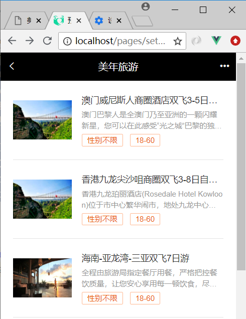

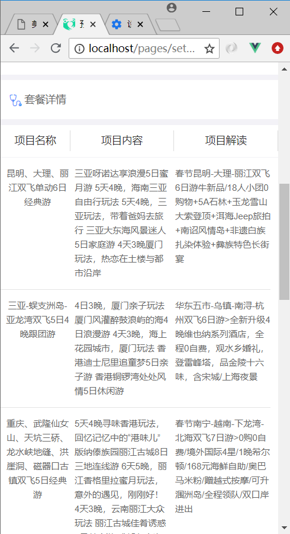

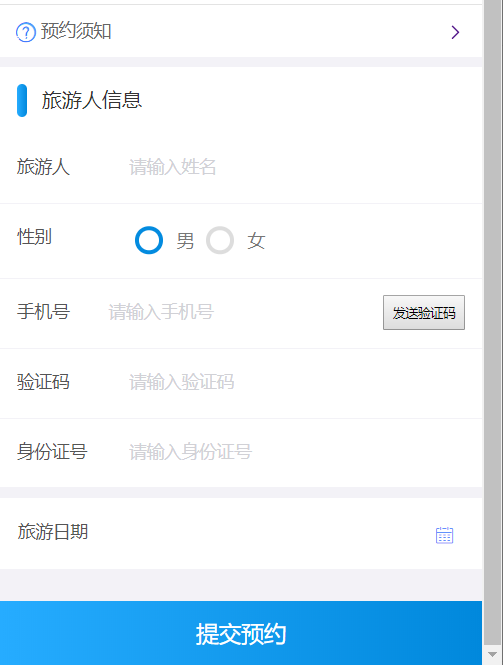

###### 【小结】

旅游预约-->套餐列表-->套餐详情-->立即预约（发送手机验证码+Redis）

#### 2.2. **搭建移动端工程**

###### 【目标】

移动端工程搭建

###### 【路径】

1. 创建 `meinian_mobile_web` 工程, 导入坐标(依赖 `meinian_interface` )
2. 导入页面
3. 配置 `web.xml`（`springmvc`的核心控制器+post请求乱码过滤器）
4. 创建 `springmvc.xml `(配置`dubbo`, 驱动注解)
5. 导入通用组件

###### 【讲解】

本项目是基于 `SOA` 架构进行开发，前面我们已经完成了后台系统的部分功能开发，在后台系统中都是通过 `Dubbo` 调用服务层发布的服务进行相关的操作。本章节我们开发移动端工程也是同样的模式，所以我们也需要在移动端工程中通过 `Dubbo` 调用服务层发布的服务

导入数据库

```sql
DROP TABLE IF EXISTS `t_setmeal`;
CREATE TABLE `t_setmeal` (
  `id` int(11) NOT NULL AUTO_INCREMENT,
  `name` varchar(1000) DEFAULT NULL,
  `code` varchar(8) DEFAULT NULL,
  `helpCode` varchar(16) DEFAULT NULL,
  `sex` char(1) DEFAULT NULL,
  `age` varchar(32) DEFAULT NULL,
  `price` float DEFAULT NULL,
  `remark` varchar(3000) DEFAULT NULL,
  `attention` varchar(128) DEFAULT NULL,
  `img` varchar(128) DEFAULT NULL,
  PRIMARY KEY (`id`)
) ENGINE=InnoDB AUTO_INCREMENT=16 DEFAULT CHARSET=utf8;

INSERT INTO `t_setmeal` VALUES ('12', '公司年度旅游套餐（男女通用）', '0001', 'RZTJ', '0', '16-33', '300', '公司年度旅游套餐', null, 'a5e8e729-74ce-4939-bf36-9cdc02fb2ae51.jpg');
INSERT INTO `t_setmeal` VALUES ('13', '广州长隆酒店+珠海长隆企鹅酒店双飞5日自由行套餐', '0002', 'FHZA', '2', '25-44', '1200', '长隆酒店(广州长隆野生动物世界店)位于广州长隆旅游度假区中心地段，毗邻长隆欢乐世界、长隆水上乐园、长隆野生动物世界、长隆飞鸟乐园和长隆国际大马戏等主题乐园。交通便捷，多条园区穿梭巴往返长隆酒店和各大园区之间。珠海园区、机场快线、香港直通巴汇集其中，广州地铁3号线/7号线让您的度假娱乐更快捷方便。 长隆酒店作为大型的生态主题酒店，主要以热带区域的人文文化风情为主基调。客房的摆设装修以客为主，温馨舒适，并有多种客房和套房类型选择。酒店绿植围绕，种类繁多，动物岛置身于酒店之中，珍稀动物随处可见。 酒店内配套多间风味各异的餐厅，让你足不出户品尝环球美食。酒店配套室外泳池、室内四季恒温泳池、健身房、童趣乐园、康体中心等，都是您商旅或者度假的上佳消遣地方。 国际会展中心更有可容纳3,000人的6,000平方米宴会厅，拥有12米无柱高楼顶，配备LED屏幕，及大型内置8米升降舞台、先进的多媒体视听、通讯系统等商务会议设施。39个不同规格的豪华多功能会议厅。专业的销售、服务团队和完善的会议设施设备随时准备为您提供一流的会议、展览和宴会服务，打造一流的商务会议品牌。', null, 'd7114f3d-35bd-4e52-b0b5-9dfc83d54af72.jpg');
INSERT INTO `t_setmeal` VALUES ('14', '厦门+鼓浪屿双飞5日自由行套餐', '0003', 'YGBM', '0', '55-100', '1400', '鼓浪屿的生活，是慵懒而优雅的，像极了欧洲某个古老的城市，不张扬，却有着致命的吸引力——温柔的阳光，蔚蓝的大海，美妙的琴声，静静矗立的老建筑，悠然自得的猫咪，所有的一切，总让人忍不住想好好的，再谈一场恋爱。 　　所以做了这样的主题，就是想把所谓浪漫，狠狠地，彻底地，进行下去。要华丽，因为青春理应肆意和张扬；要低调，因为在心底，总有一个最柔软最隐秘的角落，是只属于你的。最重要的，是要浪漫。在流淌着音乐的房间里，看点点烛光摇曳，撒在床上的玫瑰花瓣香味隐约扑来，举起手中的红酒杯，两个人，相视无语。cheers. 感谢你们，与我们分享这美好。也但愿我能，一直见证你们的幸福。', null, '1291b1fb-40c2-4558-b102-02e05c4cff6c3.jpg');
INSERT INTO `t_setmeal` VALUES ('15', '云南-昆明-大理-丽江-香格里拉双飞8日游套餐', '0004', 'ZAGD', '0', '14-20', '2400', '今日行程无导游陪同，如您当日抵昆时间较早，可自行将行李寄存在入住酒店（贵重物品请自行保管好）；随后，自由活动（如抵达昆明时间尚早，可自行前往云南师范大学（西南联合大学旧址）、昆明金马碧鸡坊、南屏街、、陆军讲武堂等景点游览、（外出酒店时贵重物品请自行保管好，请到酒店前台带上酒店名片，方便打车回酒店）', null, '68c7c13f-8fc2-46c3-b5d6-f7ec7992dc6e1.jpg');
INSERT INTO `t_setmeal` VALUES ('3', '澳门威尼斯人商圈酒店双飞3-5日自由行套餐', '0001', 'RZTJ', '0', '35-55', '300', '澳门巴黎人是全澳门乃至亚洲的一颗闪耀新星，您可以在此感受“光之城”巴黎的独特艺术气息与迷人魅力。这里有约2千余间法式客房及套房供您选择，还有依照巴黎埃菲尔铁塔1/2比例建造的巴黎铁塔，让您体验独特的浪漫风情。您还可以于170家精品名店享受购物乐趣，或是品尝经典法式美食，欣赏精彩的娱乐表演，畅游水世界、儿童王国等各种娱乐项目，像巴黎人一样体验无处不在的浪漫与惊喜！', null, 'a5e8e729-74ce-4939-bf36-9cdc02fb2ae51.jpg');
INSERT INTO `t_setmeal` VALUES ('4', '香港九龙尖沙咀商圈双飞3-8日自由行套餐', '0001', 'RZTJ', '0', '22-45', '300', '香港九龙珀丽酒店(Rosedale Hotel Kowloon)位于市中心繁华闹市，地处九龙中心地带，毗邻多个购物、娱乐中心；酒店提供班车来往旺角、尖沙嘴和“圆方”购物区，方便宾客出行。 香港九龙珀丽酒店(Rosedale Hotel Kowloon) 设计精巧、新颖独特，拥有精致、高雅的各式客房。酒店客房均配有LED智能电视、iPod/ iPhone 底座，让您尽享便捷、舒适生活。', null, 'a5e8e729-74ce-4939-bf36-9cdc02fb2ae51.jpg');
INSERT INTO `t_setmeal` VALUES ('5', '海南-亚龙湾-三亚双飞7日游', '0001', 'RZTJ', '0', '18-60', '300', '全程由旅游局指定餐厅用餐，严格把控餐饮质量，让您安心享用每一顿饮食，尽情尝特色美食，让味蕾绽放在路上，品味舌尖上的海南 。', null, 'a5e8e729-74ce-4939-bf36-9cdc02fb2ae51.jpg');
INSERT INTO `t_setmeal` VALUES ('6', '丽江-大理-香格里拉双飞6日游', '0001', 'RZTJ', '0', '44-64', '300', '云南地处高原，老年人体温调节功能较差，易受凉感冒，所以衣服要带得够，以便随时增减，行走出汗时，不要马上脱衣敞怀。高原地区昼夜温差大，睡前要盖好被毯，夜间风起雨来时要关好门窗。', null, 'a5e8e729-74ce-4939-bf36-9cdc02fb2ae51.jpg');
INSERT INTO `t_setmeal` VALUES ('7', '海南-亚龙湾-三亚双飞8日游', '0001', 'RZTJ', '0', '33-76', '300', '旅游中要有充足的休息和睡眠，若感到体力不支，可略着休息或减缓旅行。在长时间步行游览时应随时坐下小憩。', null, 'a5e8e729-74ce-4939-bf36-9cdc02fb2ae51.jpg');

DROP TABLE IF EXISTS `t_setmeal_travelgroup`;
CREATE TABLE `t_setmeal_travelgroup` (
  `setmeal_id` int(11) NOT NULL DEFAULT '0',
  `travelgroup_id` int(11) NOT NULL DEFAULT '0',
  PRIMARY KEY (`setmeal_id`,`travelgroup_id`),
  KEY `travelgroup_key` (`travelgroup_id`),
  CONSTRAINT `travelgroup_key` FOREIGN KEY (`travelgroup_id`) REFERENCES `t_travelgroup` (`id`),
  CONSTRAINT `setmeal_key` FOREIGN KEY (`setmeal_id`) REFERENCES `t_setmeal` (`id`)
) ENGINE=InnoDB DEFAULT CHARSET=utf8;

INSERT INTO `t_setmeal_travelgroup` VALUES ('12', '5');
INSERT INTO `t_setmeal_travelgroup` VALUES ('12', '6');
INSERT INTO `t_setmeal_travelgroup` VALUES ('12', '7');
INSERT INTO `t_setmeal_travelgroup` VALUES ('12', '8');
INSERT INTO `t_setmeal_travelgroup` VALUES ('12', '9');
INSERT INTO `t_setmeal_travelgroup` VALUES ('12', '10');
INSERT INTO `t_setmeal_travelgroup` VALUES ('14', '10');
INSERT INTO `t_setmeal_travelgroup` VALUES ('15', '10');
INSERT INTO `t_setmeal_travelgroup` VALUES ('12', '11');
INSERT INTO `t_setmeal_travelgroup` VALUES ('14', '11');
INSERT INTO `t_setmeal_travelgroup` VALUES ('15', '11');
INSERT INTO `t_setmeal_travelgroup` VALUES ('14', '12');
INSERT INTO `t_setmeal_travelgroup` VALUES ('14', '13');
INSERT INTO `t_setmeal_travelgroup` VALUES ('15', '13');
INSERT INTO `t_setmeal_travelgroup` VALUES ('13', '14');
INSERT INTO `t_setmeal_travelgroup` VALUES ('15', '14');
INSERT INTO `t_setmeal_travelgroup` VALUES ('13', '15');
INSERT INTO `t_setmeal_travelgroup` VALUES ('3', '5');
INSERT INTO `t_setmeal_travelgroup` VALUES ('3', '6');
INSERT INTO `t_setmeal_travelgroup` VALUES ('3', '7');
INSERT INTO `t_setmeal_travelgroup` VALUES ('3', '8');
INSERT INTO `t_setmeal_travelgroup` VALUES ('3', '9');
INSERT INTO `t_setmeal_travelgroup` VALUES ('3', '10');
INSERT INTO `t_setmeal_travelgroup` VALUES ('4', '10');
INSERT INTO `t_setmeal_travelgroup` VALUES ('15', '10');
INSERT INTO `t_setmeal_travelgroup` VALUES ('3', '11');
INSERT INTO `t_setmeal_travelgroup` VALUES ('4', '11');
INSERT INTO `t_setmeal_travelgroup` VALUES ('5', '11');
INSERT INTO `t_setmeal_travelgroup` VALUES ('4', '12');
INSERT INTO `t_setmeal_travelgroup` VALUES ('4', '13');
INSERT INTO `t_setmeal_travelgroup` VALUES ('5', '13');
INSERT INTO `t_setmeal_travelgroup` VALUES ('6', '14');
INSERT INTO `t_setmeal_travelgroup` VALUES ('5', '14');
INSERT INTO `t_setmeal_travelgroup` VALUES ('6', '15');
```

###### 2.2.1. **导入maven坐标**

在 `meinian_parent` 工程的 `pom.xml` 文件中导入阿里短信发送的maven坐标（没有添加，需要添加）

```xml
<!--阿里云服务器短信平台-->
<dependency>
    <groupId>com.aliyun</groupId>
    <artifactId>aliyun-java-sdk-core</artifactId>
    <version>3.3.1</version>
</dependency>
<dependency>
    <groupId>com.aliyun</groupId>
    <artifactId>aliyun-java-sdk-dysmsapi</artifactId>
    <version>1.0.0</version>
</dependency>
```

 在 `meinian_common` 工程中添加引入的依赖（没有添加，需要添加）

```xml
<dependency>
    <groupId>com.aliyun</groupId>
    <artifactId>aliyun-java-sdk-core</artifactId>
</dependency>
<dependency>
    <groupId>com.aliyun</groupId>
    <artifactId>aliyun-java-sdk-dysmsapi</artifactId>
</dependency>
```

###### 2.2.2. meinian_mobile_web

【路径】

1：pom.xml

2：静态资源（CSS、html、img等）

3：web.xml

4：springmvc.xml

5：spring-jedis.xml

6：redis.properties

7：log4j.properties

移动端工程，打包方式为war，用于存放Controller，在Controller中通过Dubbo可以远程访问服务层相关服务，所以需要依赖 `meinian_interface` 接口工程。

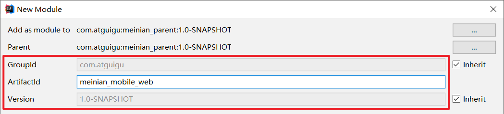

 

######## 2.2.2.1.pom.xml：

```xml
<?xml version="1.0" encoding="UTF-8"?>
<project xmlns="http://maven.apache.org/POM/4.0.0"
         xmlns:xsi="http://www.w3.org/2001/XMLSchema-instance"
         xsi:schemaLocation="http://maven.apache.org/POM/4.0.0 http://maven.apache.org/xsd/maven-4.0.0.xsd">
     <parent>
        <artifactId>meinian_parent</artifactId>
        <groupId>com.atguigu</groupId>
        <version>1.0-SNAPSHOT</version>
    </parent>
    <modelVersion>4.0.0</modelVersion>

    <artifactId>meinian_mobile_web</artifactId>
    <packaging>war</packaging>

   
    <properties>
        <project.build.sourceEncoding>UTF-8</project.build.sourceEncoding>
        <maven.compiler.source>1.8</maven.compiler.source>
        <maven.compiler.target>1.8</maven.compiler.target>
    </properties>
   <dependencies>
        <dependency>
            <groupId>com.atguigu</groupId>
            <artifactId>meinian_interface</artifactId>
            <version>1.0-SNAPSHOT</version>
        </dependency>
      
    </dependencies>
    <build>
        <plugins>
            <plugin>
                <groupId>org.apache.tomcat.maven</groupId>
                <artifactId>tomcat7-maven-plugin</artifactId>
                <configuration>
                    <!-- 指定端口，给客户端使用的端口，尽量用80端口，因为80端口是默认端口 -->
                    <port>80</port>
                    <!-- 请求路径 -->
                    <path>/</path>
                </configuration>
            </plugin>
        </plugins>
    </build>

</project>
```

 

######## 2.2.2.2. 静态资源（CSS、html、img等，详见资料）：

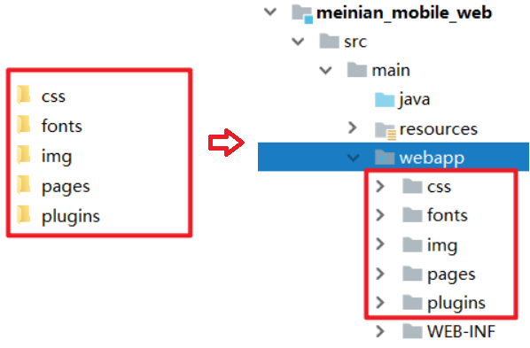

 

 

######## 2.2.2.3.web.xml：

```xml
<?xml version="1.0" encoding="UTF-8"?>
<web-app xmlns:xsi="http://www.w3.org/2001/XMLSchema-instance"
         xmlns="http://java.sun.com/xml/ns/javaee"
         xsi:schemaLocation="http://java.sun.com/xml/ns/javaee http://java.sun.com/xml/ns/javaee/web-app_3_0.xsd"
         id="WebApp_ID" version="3.0">
    <display-name>Archetype Created Web Application</display-name>
    <!-- 解决post乱码 -->
    <filter>
        <filter-name>CharacterEncodingFilter</filter-name>
        <filter-class>org.springframework.web.filter.CharacterEncodingFilter</filter-class>
        <init-param>
            <param-name>encoding</param-name>
            <param-value>utf-8</param-value>
        </init-param>
        <init-param>
            <param-name>forceEncoding</param-name>
            <param-value>true</param-value>
        </init-param>
    </filter>
    <filter-mapping>
        <filter-name>CharacterEncodingFilter</filter-name>
        <url-pattern>/*</url-pattern>
    </filter-mapping>
    <servlet>
        <servlet-name>springmvc</servlet-name>
        <servlet-class>org.springframework.web.servlet.DispatcherServlet</servlet-class>
        <!-- 指定加载的配置文件 ，通过参数contextConfigLocation加载 -->
        <init-param>
            <param-name>contextConfigLocation</param-name>
            <param-value>classpath:springmvc.xml</param-value>
        </init-param>
        <load-on-startup>1</load-on-startup>
    </servlet>
    <servlet-mapping>
        <servlet-name>springmvc</servlet-name>
        <url-pattern>*.do</url-pattern>
    </servlet-mapping>
    <welcome-file-list>
        <welcome-file>/pages/index.html</welcome-file>
    </welcome-file-list>
</web-app>
```

 

######## 2.2.2.4.springmvc.xml：

```xml
<?xml version="1.0" encoding="UTF-8"?>
<beans xmlns="http://www.springframework.org/schema/beans"
       xmlns:xsi="http://www.w3.org/2001/XMLSchema-instance"
       xmlns:p="http://www.springframework.org/schema/p"
       xmlns:context="http://www.springframework.org/schema/context"
       xmlns:dubbo="http://code.alibabatech.com/schema/dubbo"
       xmlns:mvc="http://www.springframework.org/schema/mvc"
       xsi:schemaLocation="http://www.springframework.org/schema/beans
       http://www.springframework.org/schema/beans/spring-beans.xsd
          http://www.springframework.org/schema/mvc
          http://www.springframework.org/schema/mvc/spring-mvc.xsd
          http://code.alibabatech.com/schema/dubbo
          http://code.alibabatech.com/schema/dubbo/dubbo.xsd
          http://www.springframework.org/schema/context
          http://www.springframework.org/schema/context/spring-context.xsd">

    <mvc:annotation-driven>
      
        <!-- 属性解释:
            1.register-defaults=true:告诉Springmvc使用我们配置文件创建的对象,不再自己创建(框架自己创建,是通过无参构造,会使用默认的字符集)

         -->
        <mvc:message-converters register-defaults="true">
            <!--项目使用vuejs中的axios异步访问数据，传递json数据，响应json数据-->
            <!--不需要视图解析器，项目中的所有的请求都返回json数据结构-->
            <bean class="com.alibaba.fastjson.support.spring.FastJsonHttpMessageConverter">
                <property name="supportedMediaTypes" value="application/json"/>
                <property name="features">
                    <list>
                        <!--Map类型格式化，接收参数允许空值-->
                        <value>WriteMapNullValue</value>
                        <!--日期类型格式化-->
                        <value>WriteDateUseDateFormat</value>
                    </list>
                </property>
            </bean>
        </mvc:message-converters>
    </mvc:annotation-driven>
    <!-- 指定应用名称 -->
    <dubbo:application name="meinian_mobile_web" />
    <!--指定服务注册中心地址-->
    <dubbo:registry address="zookeeper://127.0.0.1:2181"/>
    <!--批量扫描-->
    <dubbo:annotation package="com.atguigu.controller" />
    <!--
        超时全局设置 10分钟
        check=false 不检查服务提供方，开发阶段建议设置为false
        check=true 启动时检查服务提供方，如果服务提供方没有启动则报错
    -->
    <dubbo:consumer timeout="600000" check="false"/>
    <import resource="spring-jedis.xml"></import>
</beans>
```

 

######## 2.2.2.5.spring-jedis.xml：

```xml
<?xml version="1.0" encoding="UTF-8"?>
<beans xmlns="http://www.springframework.org/schema/beans"
       xmlns:xsi="http://www.w3.org/2001/XMLSchema-instance"
       xmlns:p="http://www.springframework.org/schema/p"
       xmlns:context="http://www.springframework.org/schema/context"
       xmlns:dubbo="http://code.alibabatech.com/schema/dubbo"
       xmlns:mvc="http://www.springframework.org/schema/mvc"
       xsi:schemaLocation="http://www.springframework.org/schema/beans
       http://www.springframework.org/schema/beans/spring-beans.xsd
          http://www.springframework.org/schema/mvc
          http://www.springframework.org/schema/mvc/spring-mvc.xsd
          http://code.alibabatech.com/schema/dubbo
          http://code.alibabatech.com/schema/dubbo/dubbo.xsd
          http://www.springframework.org/schema/context
          http://www.springframework.org/schema/context/spring-context.xsd">

    <context:property-placeholder location="classpath:redis.properties" />

    <!--Jedis连接池的相关配置-->
    <bean id="jedisPoolConfig" class="redis.clients.jedis.JedisPoolConfig">
        <property name="maxTotal">
            <value>${redis.pool.maxActive}</value>
        </property>
        <property name="maxIdle">
            <value>${redis.pool.maxIdle}</value>
        </property>
        <property name="testOnBorrow" value="true"/>
        <property name="testOnReturn" value="true"/>
    </bean>

    <bean id="jedisPool" class="redis.clients.jedis.JedisPool">
        <constructor-arg name="poolConfig" ref="jedisPoolConfig" />
        <constructor-arg name="host" value="${redis.host}" />
        <constructor-arg name="port" value="${redis.port}" type="int" />
        <constructor-arg name="timeout" value="${redis.timeout}" type="int" />
    </bean>
</beans>
```

 

######## 2.2.2.6.redis.properties：

```properties
##最大分配的对象数
redis.pool.maxActive=200
##最大能够保持idel状态的对象数
redis.pool.maxIdle=50
redis.pool.minIdle=10
redis.pool.maxWaitMillis=20000
##当池内没有返回对象时，最大等待时间
redis.pool.maxWait=300

##格式：redis://:[密码]@[服务器地址]:[端口]/[db index]
##redis.uri = redis://:12345@127.0.0.1:6379/0

redis.host = 127.0.0.1
redis.port = 6379
redis.timeout = 30000
```

######## 2.2.2.7.log4j.properties：

```properties

###### direct log messages to stdout ######

log4j.appender.stdout=org.apache.log4j.ConsoleAppender
log4j.appender.stdout.Target=System.err
log4j.appender.stdout.layout=org.apache.log4j.PatternLayout
log4j.appender.stdout.layout.ConversionPattern=%d{ABSOLUTE} %5p %c{1}:%L - %m%n

###### direct messages to file mylog.log ######

log4j.appender.file=org.apache.log4j.FileAppender
log4j.appender.file.File=c:\\mylog.log
log4j.appender.file.layout=org.apache.log4j.PatternLayout
log4j.appender.file.layout.ConversionPattern=%d{ABSOLUTE} %5p %c{1}:%L - %m%n

###### set log levels - for more verbose logging change 'info' to 'debug' ######

log4j.rootLogger=info, stdout
```

######  2.2.3. **导入通用组件**

【路径】

1：ValidateCodeUtils工具类：（产生验证码）

2：SMSUtils工具类：（短信服务，用于发送短消息服务（SMS））

3：RedisMessageConstant常量类：

【讲解】

在 meinian_common 工程中导入如下通用组件

1：ValidateCodeUtils工具类：（产生验证码）

```java
package com.atguigu.utils;

import java.util.Random;

/**
 * ValidateCodeUtils
 *
 * @Author: 马伟奇
 * @CreateTime: 2019-12-23
 * @Description:
 */
public class ValidateCodeUtils {
    /**
     * 随机生成验证码
     * @param length 长度为4位或者6位
     * @return
     */
    public static Integer generateValidateCode(int length){
        Integer code =null;
        if(length == 4){
            code = new Random().nextInt(9999);//生成随机数，最大为9999
            if(code < 1000){
                code = code + 1000;//保证随机数为4位数字
            }
        }else if(length == 6){
            code = new Random().nextInt(999999);//生成随机数，最大为999999
            if(code < 100000){
                code = code + 100000;//保证随机数为6位数字
            }
        }else{
            throw new RuntimeException("只能生成4位或6位数字验证码");
        }
        return code;
    }

    /**
     * 随机生成指定长度字符串验证码
     * @param length 长度
     * @return
     */
    public static String generateValidateCode4String(int length){
        Random rdm = new Random();
        String hash1 = Integer.toHexString(rdm.nextInt());
        String capstr = hash1.substring(0, length);
        return capstr;
    }
}
```

 

2：SMSUtils工具类：（短信服务，用于发送短消息服务（SMS））

```java
package com.atguigu.utils;

import com.aliyuncs.DefaultAcsClient;
import com.aliyuncs.IAcsClient;
import com.aliyuncs.dysmsapi.model.v20170525.SendSmsRequest;
import com.aliyuncs.dysmsapi.model.v20170525.SendSmsResponse;
import com.aliyuncs.exceptions.ClientException;
import com.aliyuncs.http.MethodType;
import com.aliyuncs.profile.DefaultProfile;
import com.aliyuncs.profile.IClientProfile;

/**
 * SMSUtils
 *
 * @Author: 马伟奇
 * @CreateTime: 2019-12-23
 * @Description:
 */
public class SMSUtils {
    public static final String VALIDATE_CODE = "SMS_159620392";//发送短信验证码
    public static final String ORDER_NOTICE = "SMS_159771588";//旅游预约成功通知

    /**
     * 发送短信
     * @param phoneNumbers
     * @param param
     */
    public static void sendShortMessage(String templateCode,String phoneNumbers,String param) throws Exception{
        // 设置超时时间-可自行调整
        System.setProperty("sun.net.client.defaultConnectTimeout", "10000");
        System.setProperty("sun.net.client.defaultReadTimeout", "10000");
        // 初始化ascClient需要的几个参数
        final String product = "Dysmsapi";// 短信API产品名称（短信产品名固定，无需修改）
        final String domain = "dysmsapi.aliyuncs.com";// 短信API产品域名（接口地址固定，无需修改）
        // 替换成你的AK
        final String accessKeyId = "accessKeyId";// 你的accessKeyId,参考本文档步骤2
        final String accessKeySecret = "accessKeySecret";// 你的accessKeySecret，参考本文档步骤2
        // 初始化ascClient,暂时不支持多region（请勿修改）
        IClientProfile profile = DefaultProfile.getProfile("cn-hangzhou", accessKeyId, accessKeySecret);
        DefaultProfile.addEndpoint("cn-hangzhou", "cn-hangzhou", product, domain);
        IAcsClient acsClient = new DefaultAcsClient(profile);
        // 组装请求对象
        SendSmsRequest request = new SendSmsRequest();
        // 使用post提交
        request.setMethod(MethodType.POST);
        // 必填:待发送手机号。支持以逗号分隔的形式进行批量调用，批量上限为1000个手机号码,批量调用相对于单条调用及时性稍有延迟,验证码类型的短信推荐使用单条调用的方式
        request.setPhoneNumbers(phoneNumbers);
        // 必填:短信签名-可在短信控制台中找到
        request.setSignName("美年国宾");
        // 必填:短信模板-可在短信控制台中找到
        request.setTemplateCode(templateCode);
        // 可选:模板中的变量替换JSON串,如模板内容为"亲爱的${name},您的验证码为${code}"时,此处的值为
        // 友情提示:如果JSON中需要带换行符,请参照标准的JSON协议对换行符的要求,比如短信内容中包含\r\n的情况在JSON中需要表示成\\r\\n,否则会导致JSON在服务端解析失败
        request.setTemplateParam("{\"code\":\""+param+"\"}");
        // 可选-上行短信扩展码(扩展码字段控制在7位或以下，无特殊需求用户请忽略此字段)
        // request.setSmsUpExtendCode("90997");
        // 可选:outId为提供给业务方扩展字段,最终在短信回执消息中将此值带回给调用者
        // request.setOutId("yourOutId");
        // 请求失败这里会抛ClientException异常
        SendSmsResponse sendSmsResponse = acsClient.getAcsResponse(request);
        if (sendSmsResponse.getCode() != null && sendSmsResponse.getCode().equals("OK")) {
            // 请求成功
            System.out.println("请求成功");
        }
    }
}
```

3：RedisMessageConstant常量类：

```java
package com.atguigu.constant;

/**
 * RedisMessageConstant
 *
 * @Author: 马伟奇
 * @CreateTime: 2019-12-23
 * @Description:
 */
public class RedisMessageConstant {
    public static final String SENDTYPE_ORDER = "001";//用于缓存旅游预约时发送的验证码
    public static final String SENDTYPE_LOGIN = "002";//用于缓存手机号快速登录时发送的验证码
    public static final String SENDTYPE_GETPWD = "003";//用于缓存找回密码时发送的验证码
}
```

###### 【小结】

步骤：

-->创建工程-->导入坐标-->配置文件（web.xml、springmvc.xml、spring-jedis.xml）

-->导入通用组件（生成验证码、发送短信工具类、Redis存储常量类）

## 3. **第三章**. 套餐列表页面动态展示

###### 【目标】

实现套餐列表功能

访问：首页http://localhost:80

点击“旅游预约”，跳转到“套餐列表”页面

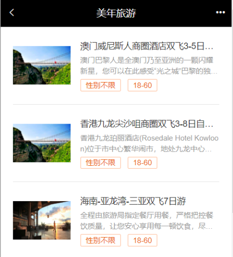

 

###### 【路径】

1：前台代码编写

1. 在/pages/setmeal.html , 在mounted()钩子函数里面

```
完成需求：
1.使用axios请求服务器, 获得数据 进行模型绑定
2.数据遍历(`v-for`)
```

2：后台代码编写

​    1. 创建类 `SetmealMobileController.java`

​    2. 创建类 `SetmealService.java`

​    3. 创建类 `SetmealServiceImpl.java`

​    4. 创建类 `SetmealDao.java`

​    5. 创建配置文件 `SetmealDao.xml`

```
完成需求：
1：查询所有的套餐
```

###### 【讲解-需求】

移动端首页为/pages/index.html，效果如下：

（1）在web.xml中配置：

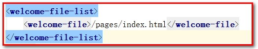

 

（2）访问：首页http://localhost:80

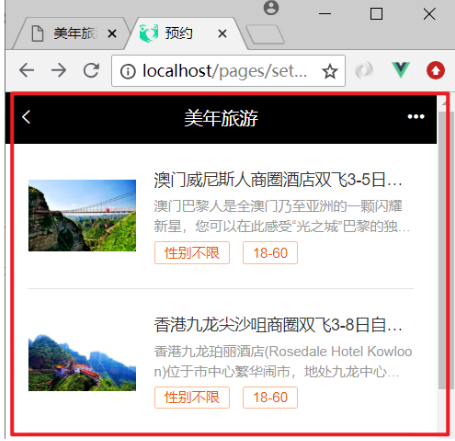

 

（3）点击旅游预约直接跳转到旅游套餐列表页面（/pages/setmeal.html）

```html
<a href="/pages/setmeal.html" class="link-page">
    <div class="type-title">
        <h3>旅游预约</h3>
        <p>实时预约</p>
    </div>
    <div class="type-icon">
        <i class="icon-zhen">
            <span class="path1"></span><span class="path2"></span>
        </i>
    </div>
</a>
```

 

#### 3.1. 前台代码

###### 3.1.1. **展示套餐信息**

（1） `setmeal.html` ，遍历 `v-for="setmeal in setmealList"`

```html
<ul class="list">
    <li class="list-item" v-for="setmeal in setmealList">
        <a class="link-page" :href="'setmeal_detail.html?id='+setmeal.id">
            
            <div class="item-body">
                <h4 class="ellipsis item-title">{{setmeal.name}}</h4>
                <p class="ellipsis-more item-desc">{{setmeal.remark}}</p>
                <p class="item-keywords">
                    <span>{{setmeal.sex == '0' ? '性别不限' : setmeal.sex == '1' ? '男':'女'}}</span>
                    <span>{{setmeal.age}}</span>
                </p>
            </div>
        </a>
    </li>
</ul>
```

（2）其中：img标签中的src需要指定七牛云的空间地址。

```html

```

###### 3.1.2. **获取套餐列表数据**

######## 3.1.2.1 接口文档

请求URL地址：

```html
/setmeal/getSetmeal.do
```

请求方式：get请求

```html
<script>
    var vue = new Vue({
        el: '##app',
        data: {
            setmealList: []
        },
        mounted() {
            axios.post("/setmeal/getSetmeal.do").then((response) => {
                if (response.data.flag) {
                    this.setmealList = response.data.data;
                }
            });
        }
    });
</script>
```

`mounted` 钩子和 `created` 钩子

`mounted ` 钩子：页面被初始化后执行

`created` 钩子： `vue` 模型被初始化后执行

`mounted ` 钩子是在 `created ` 钩子后面执行的。

#### 3.2. **后台代码**

###### 3.2.1. **Controller**

在 `meinian_mobile_web` 工程中创建 `SetmealMobileController` 并提供 `getSetmeal` 方法，在此方法中通过 `Dubbo` 远程调用套餐服务获取套餐列表数据

```java
package com.atguigu.controller;

import com.alibaba.dubbo.config.annotation.Reference;
import com.atguigu.constant.MessageConstant;
import com.atguigu.entity.Result;
import com.atguigu.pojo.Setmeal;
import com.atguigu.service.SetmealService;
import org.springframework.web.bind.annotation.RequestMapping;
import org.springframework.web.bind.annotation.RestController;

import java.util.List;

/**
 * SetmealMobileController
 *
 * @Author: 马伟奇
 * @CreateTime: 2019-12-23
 * @Description:
 */
@RestController
@RequestMapping("/setmeal")
public class SetmealMobileController {
    @Reference
    private SetmealService setmealService;

    //获取所有套餐信息
    @RequestMapping("/getSetmeal")
    public Result getSetmeal(){
        try{
            List<Setmeal> list = setmealService.findAll();
            return new Result(true, MessageConstant.GET_SETMEAL_LIST_SUCCESS,list);
        }catch (Exception e){
            e.printStackTrace();
            return new Result(false,MessageConstant.GET_SETMEAL_LIST_FAIL);
        }
    }
}
```

###### 3.2.2. **服务接口**

在 `SetmealService` 服务接口中扩展 `findAll` 方法

```java
package com.atguigu.service;

import com.atguigu.entity.PageResult;
import com.atguigu.pojo.Setmeal;

import java.util.List;

/**
 * SetmealService
 *
 * @Author: 马伟奇
 * @CreateTime: 2019-12-21
 * @Description:
 */
public interface SetmealService {

    List<Setmeal> findAll();
```

 

###### 3.2.3. **服务实现类**

在 `SetmealServiceImpl` 服务实现类中实现 `findAll` 方法

```java
package com.atguigu.service.impl;

import com.alibaba.dubbo.config.annotation.Service;
import com.atguigu.constant.RedisConstant;
import com.atguigu.dao.SetmealDao;
import com.atguigu.entity.PageResult;
import com.atguigu.pojo.Setmeal;
import com.atguigu.service.SetmealService;
import com.github.pagehelper.Page;
import com.github.pagehelper.PageHelper;
import org.springframework.beans.factory.annotation.Autowired;
import org.springframework.transaction.annotation.Transactional;
import redis.clients.jedis.JedisPool;

import java.util.HashMap;
import java.util.List;
import java.util.Map;

/**
 * SetmealServiceImpl
 *
 * @Author: 马伟奇
 * @CreateTime: 2019-12-21
 * @Description:
 */
@Service(interfaceClass = SetmealService.class)
@Transactional
public class SetmealServiceImpl implements SetmealService {

    @Autowired
    private SetmealDao setmealDao;

    @Autowired
    private JedisPool jedisPool;

    @Override
    public List<Setmeal> findAll() {
        return setmealDao.findAll();
    }
```

 

###### 3.2.4. **Dao接口**

在 `SetmealDao` 接口中扩展 `findAll` 方法

```java
package com.atguigu.dao;

import com.atguigu.pojo.Setmeal;
import com.github.pagehelper.Page;

import java.util.List;
import java.util.Map;

/**
 * SetmealDao
 *
 * @Author: 马伟奇
 * @CreateTime: 2019-12-21
 * @Description:
 */
public interface SetmealDao {
    List<Setmeal> findAll();
```

 

###### 3.2.5. **Mapper映射文件**

在 `SetmealDao.xml` 映射文件中扩展SQL语句

```html
 <!--查询所有-->
 <select id="findAll" resultType="setmeal">
     select * from t_setmeal
 </select>
```

修改 `meinian_mobile_web` 项目 下面 `setmeal.html` 的地址

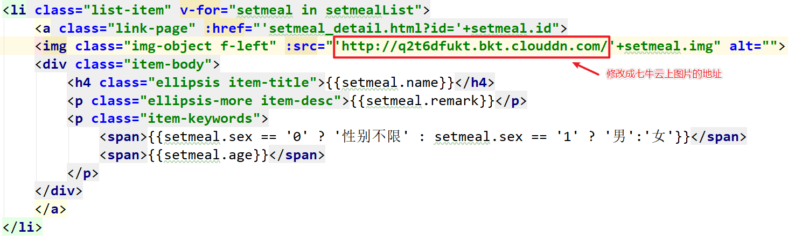

查看效果

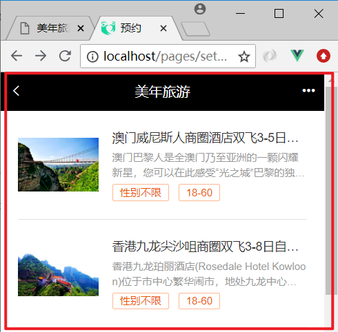

 

###### 【小结】

套餐列表功能需要展示发布的所有套餐，用于旅游人选择指定套餐。

## 4. **第四章**. 套餐详情页面动态展示

###### 【目标】

套餐详情页面动态展示

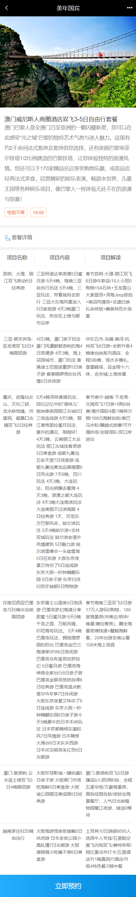

在套餐详情页面需要展示当前套餐的信息（包括图片、套餐名称、套餐介绍、适用性别、适用年龄）、此套餐包含的跟团游信息、跟团游包含的自由行信息等。

###### 【路径】

前台代码编写

1. 在/pages/setmeal_detail.html 

完成需求：
1. 获取请求参数中套餐id的值
2. 获取套餐详细信息
3. 展示套餐信息（套餐信息、跟团游集合、自由行集合）

后台代码编写

​    1. 类 ` SetmealMobileController.java`

​    2. 类 `SetmealService.java`

​    3. 类 `SetmealServiceImpl.java`

​    4. 类 `SetmealDao.java`

​       类 `TravelGroupDao`

​       类 `TravelItemDao`

​    5. 配置文件 `SetmealDao.xml`

​       配置文件 `TravelGroupDao.xml`

​       配置文件 `TravelItemDao.xml`

完成需求：
1：根据套餐id查询对应的套餐信息
2：查询每个套餐对应的跟团游集合
3：查询每个跟团游对应的自由行集合

###### 【讲解-需求】

前面我们已经完成了旅游套餐列表页面动态展示，点击其中任意一个套餐则跳转到对应的套餐详情页面（/pages/setmeal_detail.html），并且会携带此套餐的id作为参数提交。


请求路径格式：<http://localhost/pages/setmeal_detail.html?id=10>

在套餐详情页面需要展示当前套餐的信息（包括图片、套餐名称、套餐介绍、适用性别、适用年龄）、此套餐包含的跟团游信息、跟团游包含的自由行信息等。

#### 4.1. 前台代码

###### 4.1.1. **获取请求参数中套餐id**

（1）在页面中已经引入了healthmobile.js文件，此文件中已经封装了getUrlParam方法可以根据URL请求路径中的参数名获取对应的值

```html
//获取指定的URL参数值 http://localhost/pages/setmeal_detail.html?id=3&name=jack
function getUrlParam(paraName) {
var url = document.location.toString();
//alert(url);
var arrObj = url.split("?");
if (arrObj.length > 1) {
var arrPara = arrObj[1].split("&");
var arr;
for (var i = 0; i < arrPara.length; i++) { arr=arrPara[i].split("=");
            if (arr != null && arr[0] == paraName) {
                return arr[1];
            }
        }
        return "";
    }
    else {
        return "";
    }
}
```

 （2）在setmeal_detail.html中调用上面定义的方法获取套餐id的值

```html
<script src="../plugins/healthmobile.js"></script>
<script>
    var id = getUrlParam("id");
    //alert(id);  
</script>
```

###### 4.1.2. **获取套餐详细信息**

```html
<script>
    var vue = new Vue({
        el: '##app',
        data: {
            imgUrl: null, //套餐对应的图片链接
            setmeal: {}
        },
        methods: {
            toOrderInfo() {
                window.location.href = "orderInfo.html?id=" + id;
            }
        },
        mounted() {
            // 发送ajax请求，根据套餐id查询套餐详情（套餐基本信息、套餐关联的多个跟团游信息、跟团游关联的多个自由行信息）
            axios.post("/setmeal/findById.do?id=" + id).then((response) => {
                if (response.data.flag) {
                    this.setmeal = response.data.data;
                    this.imgUrl = 'http://q4x3lzs4r.bkt.clouddn.com/' + this.setmeal.img;
                }
            });
        }
    });
</script>
```

其中：imgUrl要指定犀牛云的空间地址

###### 4.1.3. 展示套餐信息

```
1： {{setmeal.name}} ：套餐信息

2： v-for="travelGroupin setmeal.travelGroups ：跟团游信息

3： v-for="travelItem travelGroupin.travelItems" ：自由行信息
```

```html
<!-- 页面内容 -->
<div class="contentBox">
    <div class="card">
        <div class="project-img">
            
        </div>
        <div class="project-text">
            <h4 class="tit">{{setmeal.name}}</h4>
            <p class="subtit">{{setmeal.remark}}</p>
            <p class="keywords">
                <span>{{setmeal.sex == '0' ? '性别不限' : setmeal.sex == '1' ? '男':'女'}}</span>
                <span>{{setmeal.age}}</span>
            </p>
        </div>
    </div>
    <div class="table-listbox">
        <div class="box-title">
            <i class="icon-zhen"><span class="path1"></span><span class="path2"></span></i>
            <span>套餐详情</span>
        </div>
        <div class="box-table">
            <div class="table-title">
                <div class="tit-item flex2">项目名称</div>
                <div class="tit-item  flex3">项目内容</div>
                <div class="tit-item  flex3">项目解读</div>
            </div>
            <div class="table-content">
                <ul class="table-list">
                    <li class="table-item" v-for="travelGroup in setmeal.travelGroups">
                        <div class="item flex2">{{travelGroup.name}}</div>
                        <div class="item flex3">
                            <label v-for="travelItem in travelGroup.travelItems">
                                {{travelItem.name}}
                            </label>
                        </div>
                        <div class="item flex3">{{travelGroup.remark}}</div>
                    </li>
                </ul>
            </div>
            <div class="box-button">
                <a @click="toOrderInfo()" class="order-btn">立即预约</a>
            </div>
        </div>
    </div>
</div>
```

 

#### 4.2. **后台代码**

###### 4.2.1. **Controller**

在 `SetmealMobileController` 中提供 `findById` 方法

```java
package com.atguigu.controller;

import com.alibaba.dubbo.config.annotation.Reference;
import com.atguigu.constant.MessageConstant;
import com.atguigu.entity.Result;
import com.atguigu.pojo.Setmeal;
import com.atguigu.service.SetmealService;
import org.apache.poi.hpsf.ReadingNotSupportedException;
import org.springframework.web.bind.annotation.RequestMapping;
import org.springframework.web.bind.annotation.RestController;

import java.util.List;

/**
 * SetmealMobileController
 *
 * @Author: 马伟奇
 * @CreateTime: 2020-02-01
 * @Description:
 */
@RestController
@RequestMapping("/setmeal")
public class SetmealMobileController {

    @Reference
    private SetmealService setmealService;

    //根据id查询套餐信息
    @RequestMapping("/findById")
    public Result findById(int id){
        try{
            Setmeal setmeal = setmealService.findById(id);
            return new Result(true,MessageConstant.QUERY_SETMEAL_SUCCESS,setmeal);
        }catch (Exception e){
            e.printStackTrace();
            return new Result(false,MessageConstant.QUERY_SETMEAL_FAIL);
        }
    }
```

###### 4.2.2. **服务接口**

在 `SetmealService` 服务接口中提供 `findById` 方法

```java
Setmeal findById(int id);
```

###### 4.2.3. **服务实现类**

在 `SetmealServiceImpl` 服务实现类中实现 `findById` 方法

```java
public Setmeal findById(int id) {
    return setmealDao.findById(id);
}
```

 

###### 4.2.4. **Dao接口**

1：在 ` SetmealDao` 接口中提供 `findById` 方法

```java
Setmeal findById(int id);
```

2：在 `TravelGroupDao` 接口中提供 `findTravelGroupListById` 方法

```java
List<TravelGroup> findTravelGroupListById(Integer id);
```

3：在 `TravelItemDao` 接口中提供 `findTravelItemListById` 方法

```java
List<TravelItem> findTravelItemListById(Integer id);
```

 

###### 4.2.5. **Mapper映射文件**

此处会使用 `mybatis` 提供的关联查询，在根据id查询套餐时，同时将此套餐包含的跟团游都查询出来，并且将跟团游包含的自由行都查询出来。

1： `SetmealDao.xml ` 文件：

```xml
<?xml version="1.0" encoding="UTF-8" ?>
    <!DOCTYPE mapper PUBLIC "-//mybatis.org//DTD Mapper 3.0//EN"
    "http://mybatis.org/dtd/mybatis-3-mapper.dtd" >
    <mapper namespace="com.atguigu.dao.SetmealDao">

    <resultMap type="setmeal" id="findByIdResultMap">
        <id column="id" property="id"/>
        <result column="name" property="name"/>
        <result column="code" property="code"/>
        <result column="helpCode" property="helpCode"/>
        <result column="sex" property="sex"/>
        <result column="age" property="age"/>
        <result column="price" property="price"/>
        <result column="remark" property="remark"/>
        <result column="attention" property="attention"/>
        <result column="img" property="img"/>
        <collection property="travelGroups" column="id"
                    select="com.atguigu.dao.TravelGroupDao.findTravelGroupListById">
        </collection>
    </resultMap>

    <select id="findById" resultMap="findByIdResultMap" parameterType="int">
       select * from t_setmeal  where id=##{id}
    </select>
```

 2： `TravelGroupDao.xml` 文件：

```xml
<?xml version="1.0" encoding="UTF-8" ?>
<!DOCTYPE mapper PUBLIC "-//mybatis.org//DTD Mapper 3.0//EN"
        "http://mybatis.org/dtd/mybatis-3-mapper.dtd" >
<mapper namespace="com.atguigu.dao.TravelGroupDao">

    <resultMap type="travelGroup" id="findByIdResultMap">
        <id column="id" property="id"/>
        <result column="name" property="name"/>
        <result column="code" property="code"/>
        <result column="helpCode" property="helpCode"/>
        <result column="sex" property="sex"/>
        <result column="remark" property="remark"/>
        <result column="attention" property="attention"/>
        <collection property="travelItems" column="id"
                    select="com.atguigu.dao.TravelItemDao.findTravelItemListById">
        </collection>
    </resultMap>

    <!--根据套餐id查询自由行信息-->
    <select id="findTravelGroupListById" resultMap="findByIdResultMap" parameterType="int">
    select * from t_travelgroup  where id
    in (select travelgroup_id from t_setmeal_travelgroup where setmeal_id=##{id})
</select>

```

 

或者使用联合查询的sql语句

```sql
SELECT c.* FROM t_travelgroup c,t_setmeal_travelgroup sc WHERE c.id = sc.travelgroup_id AND sc.setmeal_id = ##{id}
```

3： `TravelItemDao.xml` 文件：

```xml
<?xml version="1.0" encoding="UTF-8" ?>
<!DOCTYPE mapper PUBLIC "-//mybatis.org//DTD Mapper 3.0//EN"
        "http://mybatis.org/dtd/mybatis-3-mapper.dtd" >
<mapper namespace="com.atguigu.dao.TravelItemDao">

    <!--根据跟团游id查询自由行信息-->
    <select id="findTravelItemListById" resultType="travelItem" parameterType="int">
    select * from t_travelitem  where id
    in (select travelitem_id from t_travelgroup_travelitem where travelgroup_id=##{id})
</select>
```

 或者使用联合查询的sql语句

```sql
SELECT ci.* FROM t_travelitem ci,t_travelgroup_travelitem cgci WHERE ci.id = cgci.travelitem_id AND travelgroup_id = ##{id}
```

测试效果：

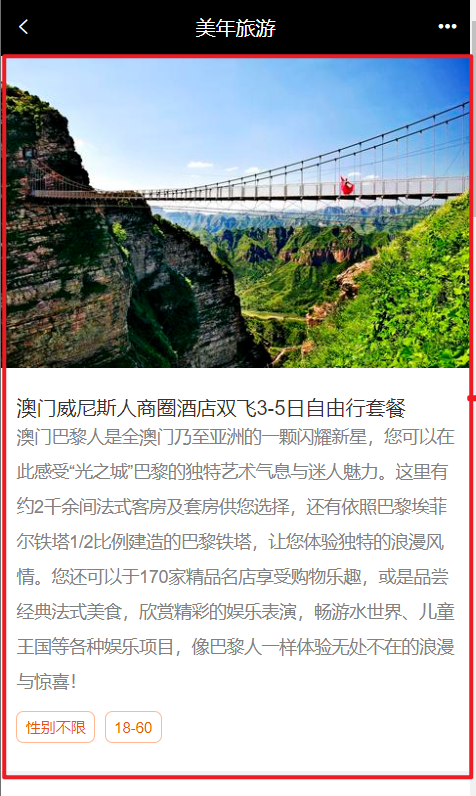

 

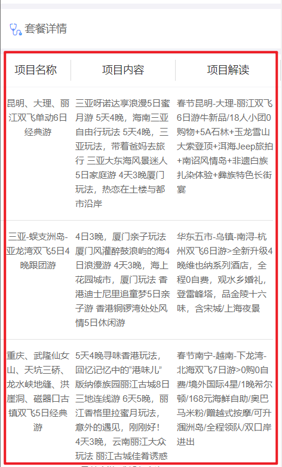

 

###### 【小结】

```
1：掌握sql语句的联合查询（sql语句的嵌套查询），应用在多对多场景
2：掌握使用<resultMap>完成映射
3：掌握使用<collection>完成集合的封装
```
