# 移动端开发-旅游预约

学习目标：

1：了解旅游预约流程业务

2：能够基于阿里云短信服务实现短信发送

3：掌握旅游预约的实现过程

4：掌握预约成功页面展示的实现过程

# 1. **第一章. 旅游预约流程需求**

用户可以通过如下操作流程进行旅游预约：

1、在移动端首页点击旅游预约，页面跳转到套餐列表页面

2、在套餐列表页面点击要预约的套餐，页面跳转到套餐详情页面

3、在套餐详情页面点击立即预约，页面跳转到预约页

4、在预约页面录入旅游人信息，包括手机号，点击发送验证

5、在预约页面录入收到的手机短信验证码，点击提交预约，完成旅游预约

效果如下图： 


 

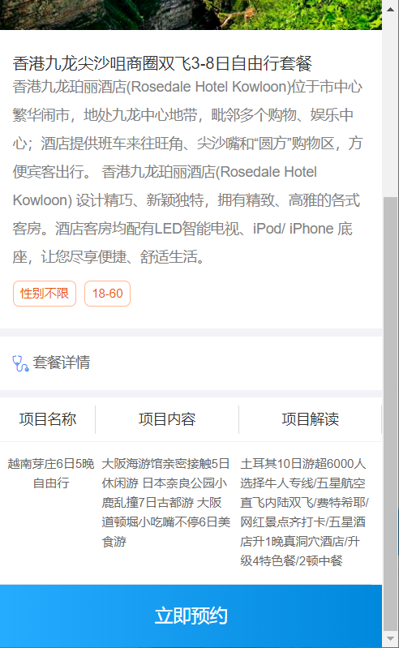 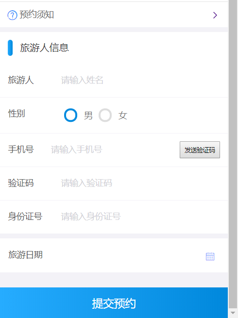

点击【提交预约】完成预约。

# 2. 第二章. 短信发送

### 【目标】

能够基于阿里云短信服务实现短信发送

### 【路径】

1. 短信服务介绍
2. 注册阿里云账号
3. 设置短信签名
4. 设置短信模板
5. 设置access keys
6. 短信服务API
7. 发送短信

### 【讲解】

## 2.1. **短信服务介绍**

目前市面上有很多第三方提供的短信服务，这些第三方短信服务会和各个运营商（移动、联通、电信）对接，我们只需要注册成为会员并且按照提供的开发文档进行调用就可以发送短信。需要说明的是这些短信服务都是收费的服务。

本项目短信发送我们选择的是阿里云提供的短信服务。

短信服务（Short Message Service）是阿里云为用户提供的一种通信服务的能力，支持快速发送短信验证码、短信通知等。 三网合一专属通道，与工信部携号转网平台实时互联。电信级运维保障，实时监控自动切换，到达率高达99%。短信服务API提供短信发送、发送状态查询、短信批量发送等能力，在短信服务控制台上添加签名、模板并通过审核之后，可以调用短信服务API完成短信发送等操作。

## 2.2. **注册阿里云账号**

阿里云官网：<https://www.aliyun.com/>

点击官网首页免费注册跳转到如下注册页面：

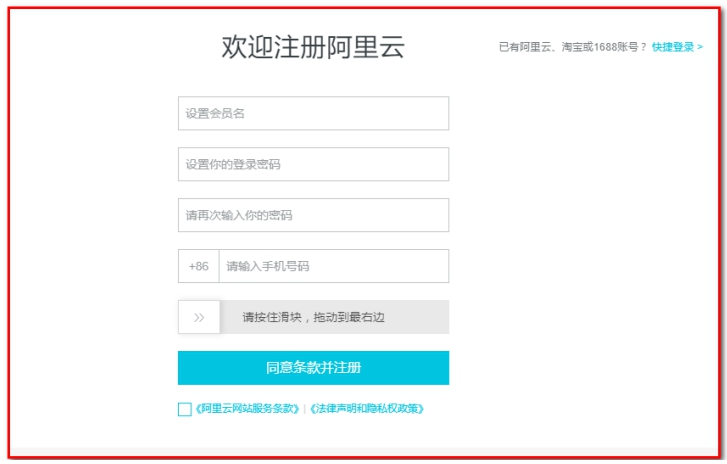

 

注册后，使用账号名登录

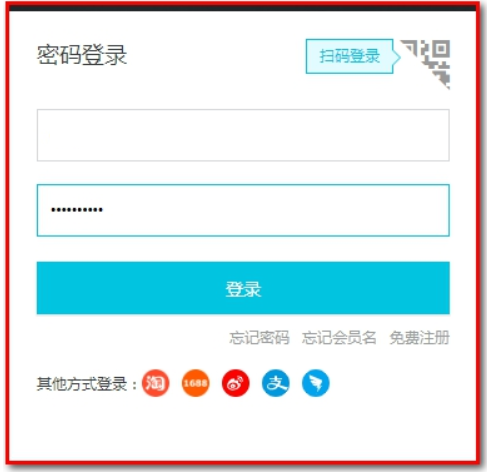

 

## 2.3. **设置短信签名**

注册成功后，点击登录按钮进行登录。登录后进入短信服务管理页面，选择国内消息菜单：

点击产品分类->云计算基础->云通信->短信服务

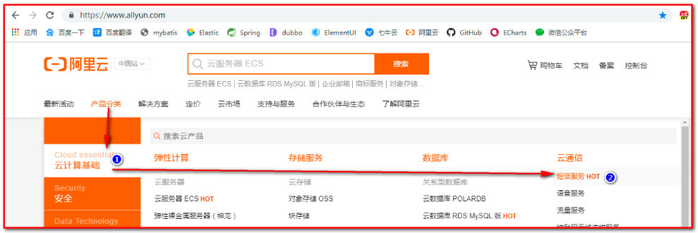

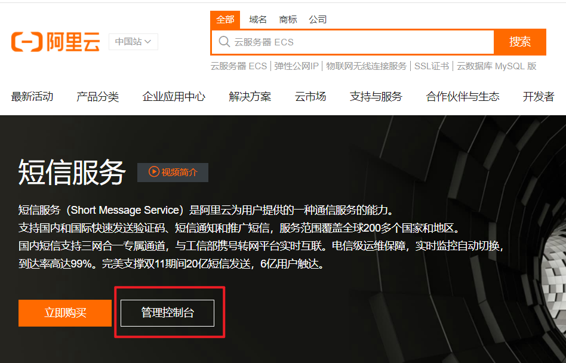

【签名】：

选择签名管理

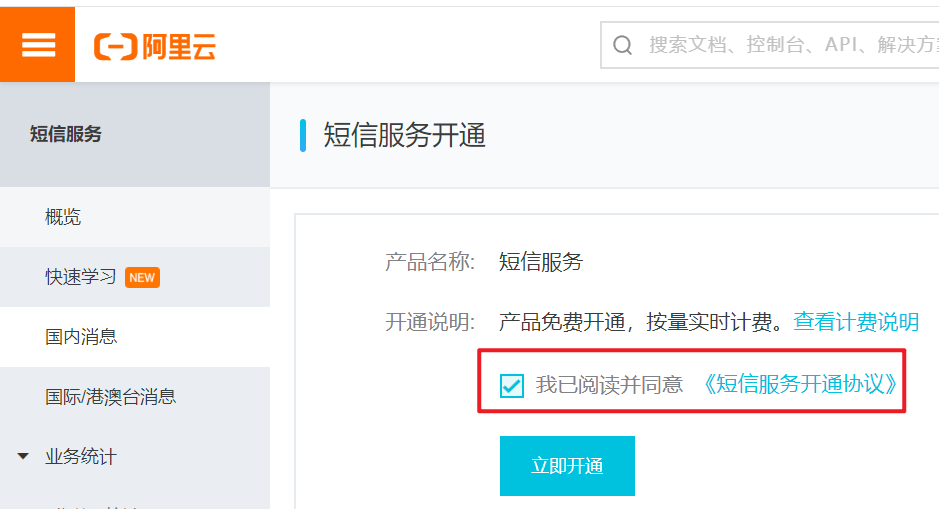

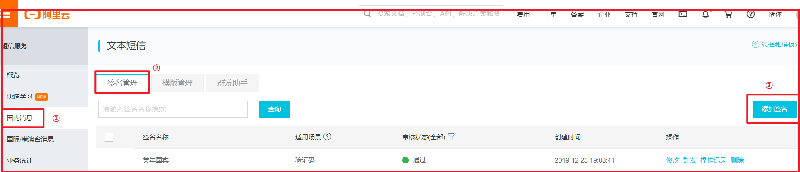

 

点击添加签名按钮：

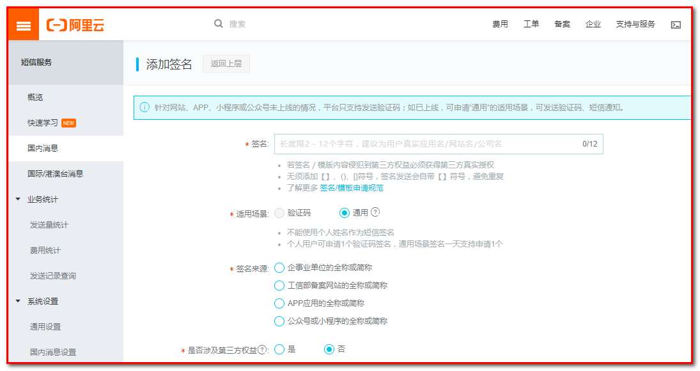

 

目前个人用户只能申请适用场景为验证码的签名，通用需要企业认证。

## 2.4. **设置短信模板**

在国内消息菜单页面中，点击模板管理标签页：

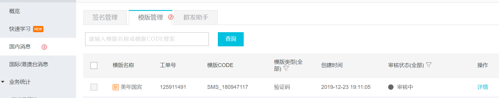

 

点击添加模板按钮：

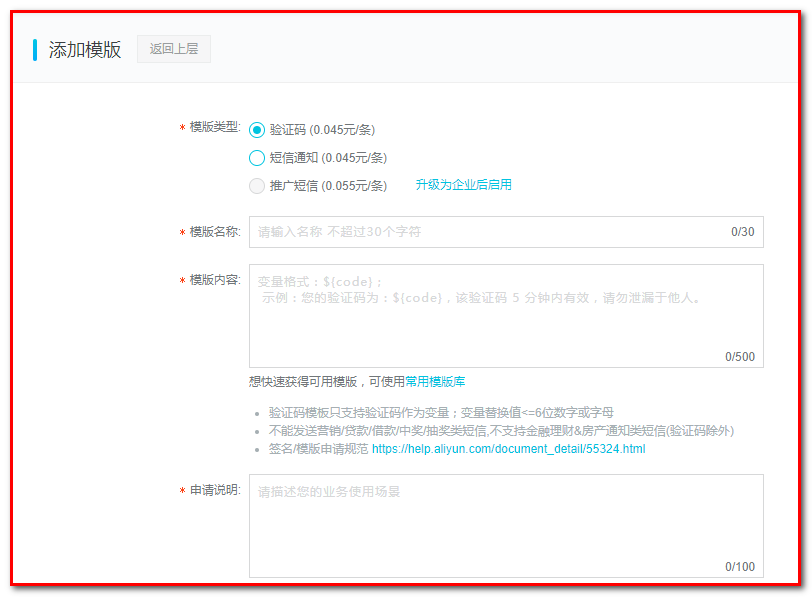

 

我的模板内容是：美年国宾 验证码${number}，您正进行美年国宾系统的身份验证，打死不告诉别人！

其中${number}为动态参数，需要我们后续在代码中控制。

## 2.5. **设置access keys**

在发送短信时需要进行身份认证，只有认证通过才能发送短信。本小节就是要设置用于发送短信时进行身份认证的key和密钥。鼠标放在页面右上角当前用户头像上，会出现下拉菜单：

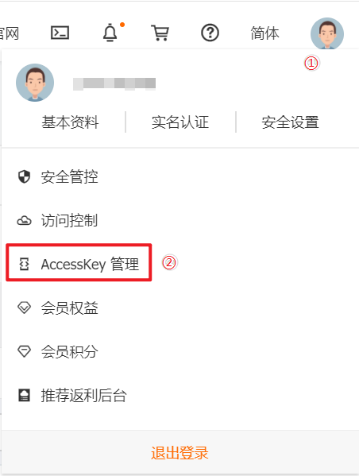

 

点击accesskeys：


 

点击“开始使用子用户AccessKey”按钮，指定用户权限，而不是分配所有权限。

第一步：新建用户

输入登录名称和显示名称，点击【确认】

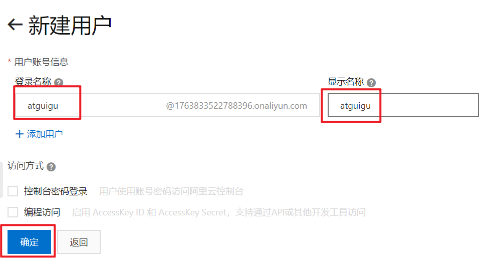

接收短信，防止信息泄露 ，输入验证码即可。

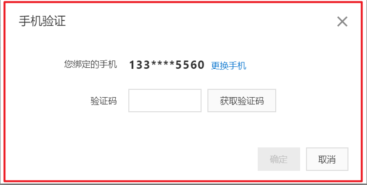

新建用户成功，成功之后，发现 ak 没有授权

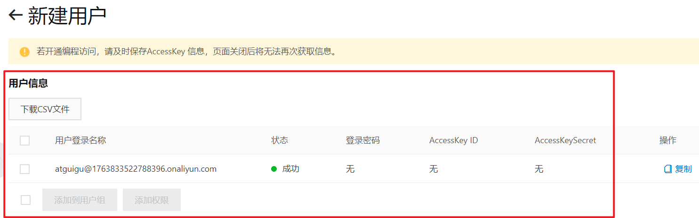

第二步：授权

选择用户，添加权限

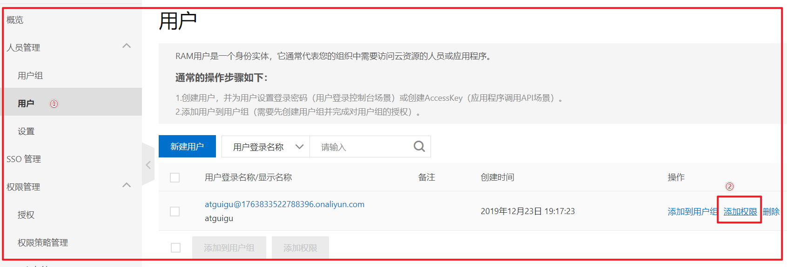

搜索“SMS”，表示短信服务，选择权限，点击“开始创建”。

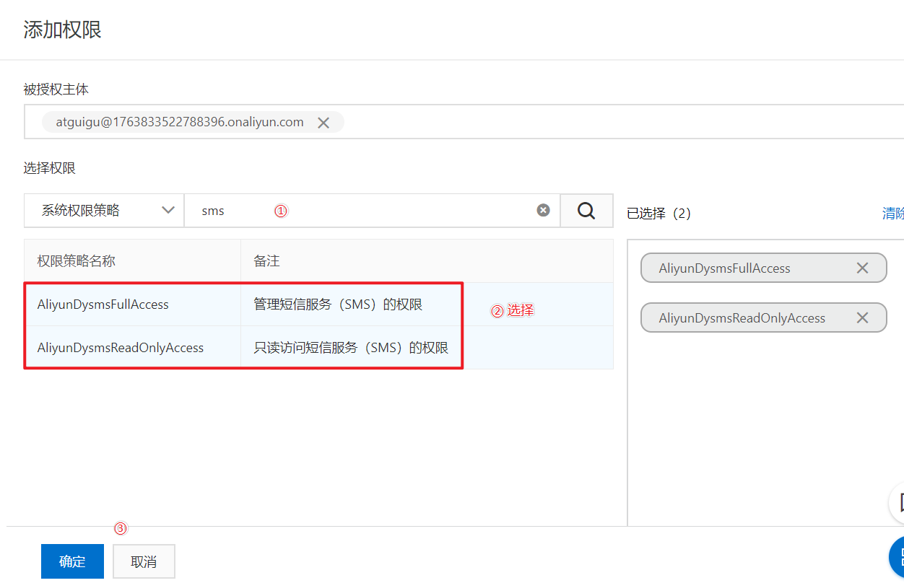

 

第三步：创建AccessKeyID

点击创建的用户，进入到详情页面。

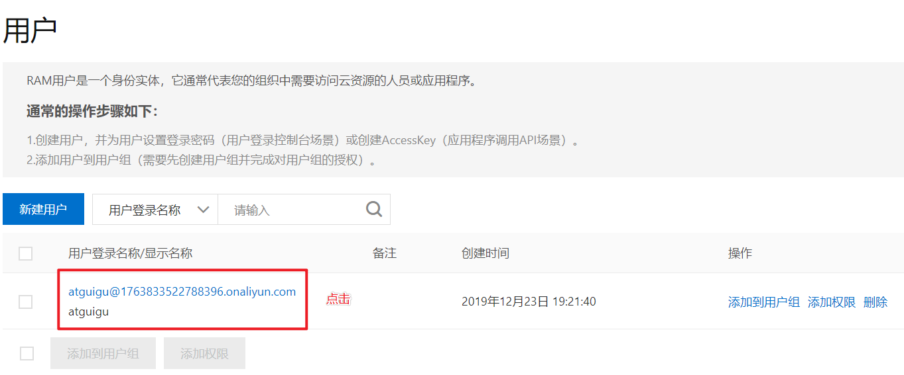

创建成功，其中AccessKeyID为访问短信服务时使用的ID，AccessKeySecret为密钥。

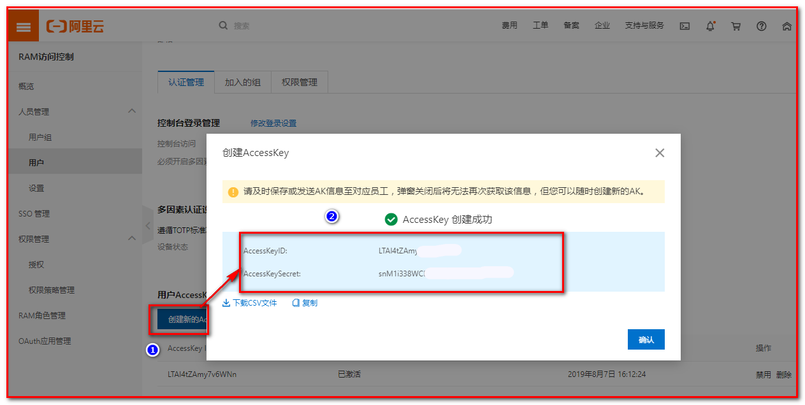

注意：一定，一定，需要马上保存AccessKeyID和AccessKeySecret，因为处于安全考虑，这个只显示1次，一旦退出页面就不再显示了。如果没有保存，那么久删除，重新创建

 

点击 查看用户详情，可以在用户详情页面下禁用刚刚创建的AccessKey

在短信服务中，点击“国内消息设置”。可以设置每日和每月短信发送上限：


 

由于短信服务是收费服务，所以还需要进行充值才能发送短信：

在费用中，点击“充值”，一般充 5 毛钱 ，就够用了。


 


 

## 2.6. 短信服务API

点击帮助文档

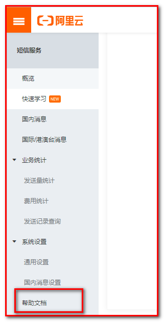

找到短信服务中的“短信发送API”


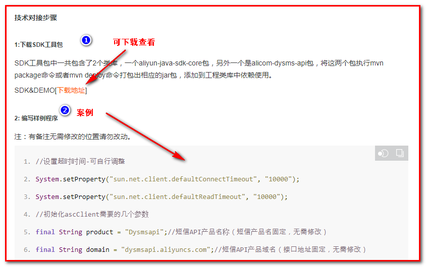

将代码可以拷贝到工程中测试：

需要修改：

1：accessKeyId和accessKeySecret

```java
final String accessKeyId = "LTAI4Fbws3CCEzKx3JPHqXQC";//你的accessKeyId,参考本文档步骤2
final String accessKeySecret = "3XFb3eNq6IDZ5Ik3x10vo9YHHzMGBz";//你的accessKeySecret，参考本文档步骤2
```

2：手机号

```java
request.setPhoneNumbers("1326921xxxx");
```

3：签名和模板

```java
request.setSignName("美年国宾");
//必填:短信模板-可在短信控制台中找到，发送国际/港澳台消息时，请使用国际/港澳台短信模版
request.setTemplateCode("SMS_180947117");
```

4：发送的验证码及参数number（根据模板短信内容）

```java
String params = "111111";
request.setTemplateParam("{\"number\":\""+params+"\"}");
```

## 2.7. **发送短信**

### 2.7.1. **导入maven坐标**

在 `meinian_common` 中导入坐标

```xml
<dependency>
  <groupId>com.aliyun</groupId>
  <artifactId>aliyun-java-sdk-core</artifactId>
  <version>3.3.1</version>
</dependency>
<dependency>
  <groupId>com.aliyun</groupId>
  <artifactId>aliyun-java-sdk-dysmsapi</artifactId>
  <version>1.0.0</version>
</dependency>
```

### 2.7.2. **封装工具类**

在 `meinian_common` 中添加工具类

1：签名

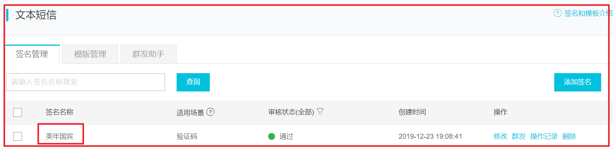

 

2：模板code

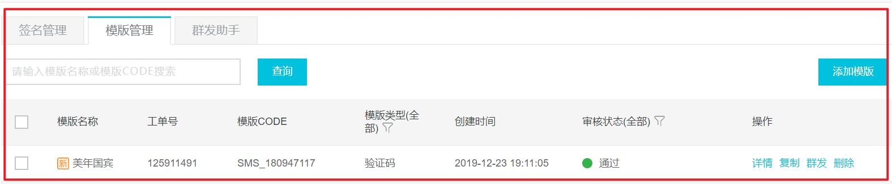

 

在 `meinian_common` 中，封装 `SMSUtils.java`

传递验证码和手机号

```java
package com.atguigu.utils;

import com.aliyuncs.DefaultAcsClient;
import com.aliyuncs.IAcsClient;
import com.aliyuncs.dysmsapi.model.v20170525.SendSmsRequest;
import com.aliyuncs.dysmsapi.model.v20170525.SendSmsResponse;
import com.aliyuncs.exceptions.ClientException;
import com.aliyuncs.http.MethodType;
import com.aliyuncs.profile.DefaultProfile;
import com.aliyuncs.profile.IClientProfile;

/**
 * SMSUtils
 *
 * @Author: 马伟奇
 * @Description:
 */
public class SMSUtils {
	public static final String VALIDATE_CODE = "SMS_159620392";//发送短信验证码
	public static final String ORDER_NOTICE = "SMS_159771588";//预约成功通知

	/**
	 * 发送短信
	 * @param phoneNumbers
	 * @param param
	 * AccessKeyID:
	 *          LTAI4Fbws3CCEzKx3JPHqXQC
	 * AccessKeySecret:
	 *          3XFb3eNq6IDZ5Ik3x10vo9YHHzMGBz
	 */
	public static void sendShortMessage(String phoneNumbers,String param) throws Exception{
		// 设置超时时间-可自行调整
		System.setProperty("sun.net.client.defaultConnectTimeout", "10000");
		System.setProperty("sun.net.client.defaultReadTimeout", "10000");
		// 初始化ascClient需要的几个参数
		final String product = "Dysmsapi";// 短信API产品名称（短信产品名固定，无需修改）
		final String domain = "dysmsapi.aliyuncs.com";// 短信API产品域名（接口地址固定，无需修改）
		// 替换成你的AK
		final String accessKeyId = "LTAI4Fbws3CCEzKx3JPHqXQC";// 你的accessKeyId,参考本文档步骤2
		final String accessKeySecret = "3XFb3eNq6IDZ5Ik3x10vo9YHHzMGBz";// 你的accessKeySecret，参考本文档步骤2
		// 初始化ascClient,暂时不支持多region（请勿修改）
		IClientProfile profile = DefaultProfile.getProfile("cn-hangzhou", accessKeyId, accessKeySecret);
		DefaultProfile.addEndpoint("cn-hangzhou", "cn-hangzhou", product, domain);
		IAcsClient acsClient = new DefaultAcsClient(profile);
		// 组装请求对象
		SendSmsRequest request = new SendSmsRequest();
		// 使用post提交
		request.setMethod(MethodType.POST);
		// 必填:待发送手机号。支持以逗号分隔的形式进行批量调用，批量上限为1000个手机号码,批量调用相对于单条调用及时性稍有延迟,验证码类型的短信推荐使用单条调用的方式
		request.setPhoneNumbers(phoneNumbers);
		// 必填:短信签名-可在短信控制台中找到
		request.setSignName("美年国宾");
		// 必填:短信模板-可在短信控制台中找到
		request.setTemplateCode("SMS_180947117");
		// 可选:模板中的变量替换JSON串,如模板内容为"亲爱的${name},您的验证码为${code}"时,此处的值为
		// 友情提示:如果JSON中需要带换行符,请参照标准的JSON协议对换行符的要求,比如短信内容中包含\r\n的情况在JSON中需要表示成\\r\\n,否则会导致JSON在服务端解析失败
		request.setTemplateParam("{\"number\":\""+param+"\"}");
		// 可选-上行短信扩展码(扩展码字段控制在7位或以下，无特殊需求用户请忽略此字段)
		// request.setSmsUpExtendCode("90997");
		// 可选:outId为提供给业务方扩展字段,最终在短信回执消息中将此值带回给调用者
		// request.setOutId("yourOutId");
		// 请求失败这里会抛ClientException异常
		SendSmsResponse sendSmsResponse = acsClient.getAcsResponse(request);
		if (sendSmsResponse.getCode() != null && sendSmsResponse.getCode().equals("OK")) {
			// 请求成功
			System.out.println("请求成功"+sendSmsResponse.getCode());
		}
	}
}
```

 

### 2.7.3. 测试短信发送

```java
package com.atguigu;

import com.atguigu.utils.SMSUtils;
import com.atguigu.utils.ValidateCodeUtils;
import org.junit.Test;

/**
 * TestSms
 *
 * @Author: 马伟奇
 * @Description:
 */
public class TestSms {

    @Test
    public void test()  throws Exception{
        Integer code = ValidateCodeUtils.generateValidateCode(4);
        SMSUtils.sendShortMessage("133****5560",String.valueOf(code));
    }
}
```

测试：查看手机

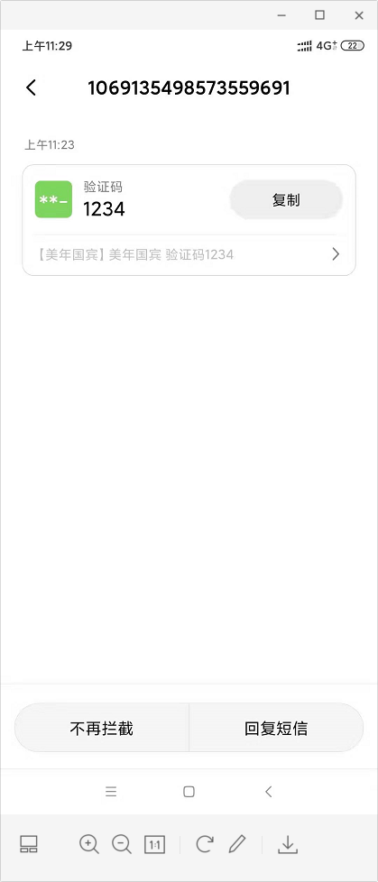

 

### 【小结】

阿里云使用步骤

1. 注册, 登录
2. 搜索 短信服务, 开通短信服务
3. 进入短信控制台
4. 申请 `签名` , `模版`
5. 充钱(5块左右), 查看access keys
6. 添加依赖, 拷贝工具类到项目
7. 测试

注意事项

​	工具类里面(需要改 模版code, 签名, access keys，验证码code==>number)

# 3. **第三章. 旅游预约**

### 【目标】

实现旅游预约

需求：

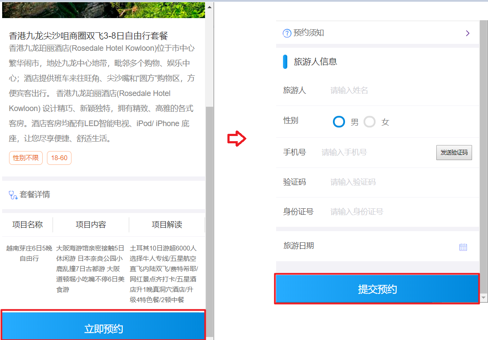

1. 在套餐详情页面(setmeal_detail.html)点击立即预约，页面跳转到预约页面(orderInfo.html)
2. 在预约页面(orderInfo.html)录入旅游人信息，包括手机号，点击发送验证码
3. 在预约页面录入收到的手机短信验证码，点击提交预约，完成预约

### 【路径】

前台代码编写

1. 在/pages/orderInfo.html 

```
完成需求：
1.展示预约套餐信息
2.手机号校验
3.30秒倒计时效果
4.发送ajax请求，完成【发送验证码】功能
5.日期中使用日历插件
6.【提交预约】请求
```

后台代码编写

​    1. 类OrderController.java

​    2. 类OrderService.java

​    3. 类OrderServiceImpl.java

​    4. 类OrderDao.java

​          OrderSettingDao.java

​          MemeberDao.java

​    5. 配置文件OrderDao.xml

​          OrderSettingDao.xml

​          MemeberDao.xml

```
完成需求：
后台代码1：短信验证码
1. 填写 手机号码, 点击发送验证码 请求服务器(携带手机号码)
2. 在后台
   - 获得手机号码
   - 生成验证码
   - 使用阿里云服务发送验证码
   - 把生成验证码存到redis里面(存5分钟)

提交预约
后台代码2
1：Controller

点击提交预约, 把用户信息 提交到服务器
在Controller里面
   - 获得用户信息
   - 校验验证码(redis里面存的和用户输入的比较)
   - 调用业务, 进行预约, 响应

2：Servie

1. 判断当前的日期是否可以预约(根据orderDate查询t_ordersetting, 能查询出来可以预约;查询不出来,不能预约)
2. 判断当前日期是否预约已满(判断reservations（已经预约人数）是否等于number（最多预约人数）)
3. 判断是否是会员(根据手机号码查询t_member)
  - 如果是会员(能够查询出来), 防止重复预约(根据member_id,orderDate,setmeal_id查询t_order)
  - 如果不是会员(不能够查询出来),自动注册为会员(直接向t_member插入一条记录)

4.进行预约
   - 向t_order表插入一条记录
   - t_ordersetting表里面预约的人数reservations+1

```

导入数据库

```sql
DROP TABLE IF EXISTS `t_member`;
CREATE TABLE `t_member` (
  `id` int(11) NOT NULL AUTO_INCREMENT,
  `fileNumber` varchar(32) DEFAULT NULL,
  `name` varchar(32) DEFAULT NULL,
  `sex` varchar(8) DEFAULT NULL,
  `idCard` varchar(18) DEFAULT NULL,
  `phoneNumber` varchar(11) DEFAULT NULL,
  `regTime` date DEFAULT NULL,
  `password` varchar(32) DEFAULT NULL,
  `email` varchar(32) DEFAULT NULL,
  `birthday` date DEFAULT NULL,
  `remark` varchar(128) DEFAULT NULL,
  PRIMARY KEY (`id`)
) ENGINE=InnoDB AUTO_INCREMENT=93 DEFAULT CHARSET=utf8;

-- ----------------------------
-- Records of t_member
-- ----------------------------
INSERT INTO `t_member` VALUES ('82', null, '小明', '1', '123456789000999999', '18544279942', '2020-02-08', null, null, null, null);
INSERT INTO `t_member` VALUES ('83', null, '美丽', '1', '132333333333333', '13412345678', '2020-02-11', null, null, null, null);
INSERT INTO `t_member` VALUES ('84', null, '小星星', null, null, '18343569942', '2020-02-13', null, null, null, null);
INSERT INTO `t_member` VALUES ('85', null, '小强', null, null, 18344249942, '2020-02-06', null, null, null, null);
INSERT INTO `t_member` VALUES ('86', null, '红康', null, null, 18544579942, '2020-02-04', null, null, null, null);
INSERT INTO `t_member` VALUES ('87', null, '大海', null, null, 18544274442, '2020-02-06', null, null, null, null);
INSERT INTO `t_member` VALUES ('88', null, '小婷', null, null, 18544269942, '2020-02-10', null, null, null, null);
INSERT INTO `t_member` VALUES ('89', null, '晓晓', null, null, 18544339942, '2020-02-01', null, null, null, null);
INSERT INTO `t_member` VALUES ('90', null, '纯生', null, null, 18544669942, '2020-02-02', null, null, null, null);
INSERT INTO `t_member` VALUES ('91', null, '闰土', null, null, 18544779942, '2020-02-01', null, null, null, null);
INSERT INTO `t_member` VALUES ('92', null, '波波', '2', '234234145432121345', '18019286521', '2020-02-19', null, null, null, null);

DROP TABLE IF EXISTS `t_order`;
CREATE TABLE `t_order` (
  `id` int(11) NOT NULL AUTO_INCREMENT,
  `member_id` int(11) DEFAULT NULL COMMENT '员会id',
  `orderDate` date DEFAULT NULL COMMENT '约预日期',
  `orderType` varchar(8) DEFAULT NULL COMMENT '约预类型 电话预约/微信预约',
  `orderStatus` varchar(8) DEFAULT NULL COMMENT '预约状态（是否旅游）',
  `setmeal_id` int(11) DEFAULT NULL COMMENT '餐套id',
  PRIMARY KEY (`id`),
  KEY `key_member_id` (`member_id`),
  KEY `key_setmeal_id` (`setmeal_id`),
  CONSTRAINT `key_member_id` FOREIGN KEY (`member_id`) REFERENCES `t_member` (`id`),
  CONSTRAINT `key_setmeal_id` FOREIGN KEY (`setmeal_id`) REFERENCES `t_setmeal` (`id`)
) ENGINE=InnoDB AUTO_INCREMENT=18 DEFAULT CHARSET=utf8;

-- ----------------------------
-- Records of t_order
-- ----------------------------
INSERT INTO `t_order` VALUES (1, 84, '2020-02-01', '微信预约', '已出游', 3);
INSERT INTO `t_order` VALUES (2, 84, '2020-02-17', '微信预约', '未出游', 3);
INSERT INTO `t_order` VALUES (3, 84, '2020-02-01', '微信预约', '未出游', 3);
INSERT INTO `t_order` VALUES (4, 84, '2020-02-17', '微信预约', '已出游', 4);
INSERT INTO `t_order` VALUES (5, 84, '2020-02-09', '微信预约', '未出游', 4);
INSERT INTO `t_order` VALUES (6, 84, '2020-02-09', '微信预约', '已出游', 4);
INSERT INTO `t_order` VALUES (7, 84, '2020-02-18', '微信预约', '未出游', 5);
INSERT INTO `t_order` VALUES (8, 84, '2020-02-10', '微信预约', '未出游', 6);
INSERT INTO `t_order` VALUES (9, 84, '2020-02-10', '微信预约', '未出游', 6);
INSERT INTO `t_order` VALUES (10, 84, '2020-02-13', '微信预约', '未出游', 7);
INSERT INTO `t_order` VALUES (17, 84, '2020-02-06', '微信预约', '已出游', 12);
```

### 【讲解】

## 3.1. 前端代码

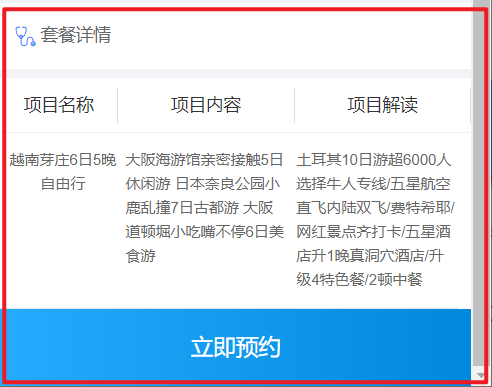

 

1：在详情页面（/pages/setmeal_detail.html）点击预约

```html
<div class="box-button">
    <a @click="toOrderInfo()" class="order-btn">立即预约</a>
</div>
```

2：toOrderInfo()方法：

```html
toOrderInfo(){
window.location.href = "orderInfo.html?id=" + id;
}
```

 

3：在预约页面（/pages/orderInfo.html）进行调整

### 3.1.1. **展示预约的套餐信息**

第一步：从请求路径中获取当前==套餐的id==

```html
<script>
    var id = getUrlParam("id");
</script>
```

 

第二步：定义模型数据setmeal，用于套餐数据展示

```html
<script>
    var vue = new Vue({
        el: '#app',
        data: {
            imgUrl: null, //套餐对应的图片链接
            setmeal: {}, //套餐信息
            orderInfo: {
                setmealId: id, // 用于传递套餐id
                sex: '1' // 用于默认显示性别男
            } //预约信息
        }
    });
</script>
```

 第三步：显示套餐信息

```html
<div class="card">
    <div class="project-img">
        
    </div>

    <div class="project-text">
        <h4 class="tit">{{setmeal.name}}</h4>
        <p class="subtit">{{setmeal.remark}}</p>
        <p class="keywords">
            <span>{{setmeal.sex == '0' ? '性别不限' : setmeal.sex == '1' ? '男':'女'}}</span>
            <span>{{setmeal.age}}</span>
        </p>
    </div>
    <div class="project-know">
        <a href="orderNotice.html" class="link-page">
            <i class="icon-ask-circle"><span class="path1"></span><span class="path2"></span></i>
            <span class="word">预约须知</span>
            <span class="arrow"><i class="icon-rit-arrow"></i></span>
        </a>
    </div>
</div>
```

 

第四步：在VUE的钩子函数中发送ajax请求，根据id查询套餐信息，修改七牛云图片地址

```html
mounted(){
axios.post("/setmeal/findById.do?id=" + id).then((response) => {
this.setmeal = response.data.data;
this.imgUrl = 'http://pspmuf4c3.bkt.clouddn.com/' + this.setmeal.img;
});
}
```

 第五步：修改七牛云图片地址

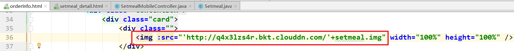

### 3.1.2. **手机号校验**

回顾：正则表达式简单语法及常用正则表达式

```properties
基本符号：
^  表示匹配字符串的开始位置  (例外  用在中括号中[ ] 时,可以理解为取反,表示不匹配括号中字符串)
$  表示匹配字符串的结束位置
*  表示匹配 零次到多次
+  表示匹配 一次到多次 (至少有一次)
?  表示匹配零次或一次
.  表示匹配单个字符 
|  表示为或者,两项中取一项
(  ) 小括号表示匹配括号中全部字符
[  ] 中括号表示匹配括号中一个字符 范围描述 如[0-9 a-z A-Z]
{  } 大括号用于限定匹配次数  如 {n}表示匹配n个字符  {n,}表示至少匹配n个字符  {n,m}表示至少n,最多m
\  转义字符 如上基本符号匹配都需要转义字符   如 \*  表示匹配*号
\w 表示英文字母和数字  \W  非字母和数字
\d  表示数字   \D  非数字
```

栗子：

```html
<!DOCTYPE html>
<html>

<head>
    <meta charset="UTF-8">
    <title></title>
</head>

<body>

</body>
<script type="text/javascript">
    // 邮箱："^[a-zA-Z0-9-_]+@[a-zA-Z0-9-_]+([.][a-zA-Z0-9-_]+)+$"
    var reg = new RegExp("1[345678]\\d{9}")
    var tel = "13123462789";
    var result = reg.test(tel);
    console.log(result)
</script>

</html>
```

第一步：在 `orderInfo.html` 页面导入的healthmobile.js文件中已经定义了校验手机号的方法

```html
<script src="../plugins/healthmobile.js"></script>
```

healthmobile.js：

```html
/**
* 手机号校验
1--以1为开头；
2--第二位可为3,4,5,7,8,中的任意一位；
3--最后以0-9的9个整数结尾。
*/
function checkTelephone(telephone) {
var reg=/^[1][3,4,5,7,8][0-9]{9}$/;
if (!reg.test(telephone)) {
return false;
} else {
return true;
}
}
```

 

第二步：为发送验证码按钮绑定事件 `sendValidateCode()`

```html
<div class="input-row">
    <label>手机号</label>
    <input v-model="orderInfo.telephone" type="text" class="input-clear" placeholder="请输入手机号">
    <input style="font-size: x-small;" id="validateCodeButton" @click="sendValidateCode()" type="button" value="发送验证码">
</div>
<div class="input-row">
    <label>验证码</label>
    <input v-model="orderInfo.validateCode" type="text" class="input-clear" placeholder="请输入验证码">
</div>
```

 

`sendValidateCode()` 方法：

对手机号进行校验

```html
//发送验证码
sendValidateCode(){
//获取用户输入的手机号
var telephone = this.orderInfo.telephone;
//校验手机号输入是否正确
if (!checkTelephone(telephone)) {
this.$message.error('请输入正确的手机号');
return false;
}
},
```

 

### 3.1.3. **30秒倒计时效果**

第一步：前面在 `sendValidateCode` 方法中进行了手机号校验，如果校验通过，需要显示30秒倒计时效果

```html
//发送验证码
sendValidateCode(){
//获取用户输入的手机号
var telephone = this.orderInfo.telephone;
//校验手机号输入是否正确
if (!checkTelephone(telephone)) {
this.$message.error('请输入正确的手机号');
return false;
}
validateCodeButton = $("#validateCodeButton")[0];
clock = window.setInterval(doLoop, 1000); //一秒执行一次
},
```

 

第二步：其中， `validateCodeButton` 和 `clock` 是在 `healthmobile.js` 文件中定义的属性。

`doLoop` 是在 `healthmobile.js` 文件中定义的方法

```html
var clock = '';//定时器对象，用于页面30秒倒计时效果
var nums = 30;
var validateCodeButton;
//基于定时器实现30秒倒计时效果
function doLoop() {
validateCodeButton.disabled = true;//将按钮置为不可点击
nums--;
if (nums > 0) {
validateCodeButton.value = nums + '秒后重新获取';
} else {
clearInterval(clock); //清除js定时器
validateCodeButton.disabled = false;
validateCodeButton.value = '重新获取验证码';
nums = 30; //重置时间
}
}
```

 

### 3.1.4. **发送ajax请求**

接口文档：

请求方式：get 请求

请求路径 ：

```xml
"/validateCode/send4Order.do?telephone=" + telephone
```

第一步：发送ajax请求

```html
//发送验证码
sendValidateCode(){
//获取用户输入的手机号
var telephone = this.orderInfo.telephone;
//校验手机号输入是否正确
if (!checkTelephone(telephone)) {
this.$message.error('请输入正确的手机号');
return false;
}
validateCodeButton = $("#validateCodeButton")[0];
clock = window.setInterval(doLoop, 1000); //一秒执行一次
axios.post("/validateCode/send4Order.do?telephone=" + telephone).then((response) => {
if(!response.data.flag){
//验证码发送失败
this.$message.error('验证码发送失败，请检查手机号输入是否正确');
}
});
},
```

 

第二步：创建 `ValidateCodeController` ，提供方法发送短信验证码，并将验证码保存到redis

```java
package com.atguigu.controller;

import com.atguigu.constant.MessageConstant;
import com.atguigu.constant.RedisConstant;
import com.atguigu.constant.RedisMessageConstant;
import com.atguigu.entity.Result;
import com.atguigu.utils.SMSUtils;
import com.atguigu.utils.ValidateCodeUtils;
import org.springframework.beans.factory.annotation.Autowired;
import org.springframework.web.bind.annotation.RequestMapping;
import org.springframework.web.bind.annotation.RestController;
import redis.clients.jedis.JedisPool;

/**
 * ValidateCodeController
 *
 * @Author: 马伟奇
 * @Description:
 */
@RestController
@RequestMapping("/validateCode")
public class ValidateCodeController {
  
    @Autowired
    private JedisPool jedisPool;

    //预约时发送手机验证码
    @RequestMapping("/send4Order")
    public Result send4Order(String telephone){
        Integer code = ValidateCodeUtils.generateValidateCode(4);//生成4位数字验证码
        try {
            //发送短信
            SMSUtils.sendShortMessage(telephone,code.toString());
        } catch (ClientException e) {
            e.printStackTrace();
            //验证码发送失败
            return new Result(false, MessageConstant.SEND_VALIDATECODE_FAIL);
        }
        System.out.println("发送的手机验证码为：" + code);
        //将生成的验证码缓存到redis
        jedisPool.getResource().setex(
                telephone + RedisMessageConstant.SENDTYPE_ORDER,5 * 60,code.toString());
        //验证码发送成功
        return new Result(true,MessageConstant.SEND_VALIDATECODE_SUCCESS);
    }
}
```

### 3.1.5. **日历展示**

页面中使用DatePicker控件来展示日历。根据需求，最多可以提前一个月进行预约，所以日历控件只展示未来一个月的日期

第一步：引入dataPicker.js

```html
<script src="../plugins/datapicker/datePicker.js"></script>
```

第二步：定义日期

通过样式：.picktime，对应input组件中的class="picktime"

```html
<div class="date">
    <label>旅游日期</label>
    <i class="icon-date" class="picktime"></i>
    <input v-model="orderInfo.orderDate" type="text" class="picktime" readonly>
</div>
```

第三步：定义日期控件

.picktime表示通过样式查找输入框。

```html
<script>
    //日期控件
    var calendar = new datePicker();
    calendar.init({
        'trigger': '.picktime',
        /*按钮选择器，用于触发弹出插件*/
        'type': 'date',
        /*模式：date日期；datetime日期时间；time时间；ym年月；*/
        'minDate': getSpecifiedDate(new Date(), 1),
        /*最小日期*/
        'maxDate': getSpecifiedDate(new Date(), 30),
        /*最大日期*/
        'onSubmit': function() {
            /*确认时触发事件*/
            //var theSelectData = calendar.value;
        },
        'onClose': function() {
            /*取消时触发事件*/ }
    });
</script>
```

其中getSpecifiedDate方法定义在healthmobile.js文件中

```html
//获得指定日期后指定天数的日期
function getSpecifiedDate(date,days) {
date.setDate(date.getDate() + days);//获取指定天之后的日期
var year = date.getFullYear();
var month = date.getMonth() + 1;
var day = date.getDate();
return (year + "-" + month + "-" + day);
}
```

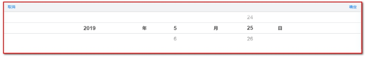

 

### 3.1.6. **提交预约请求（身份证校验）**

为提交预约按钮绑定事件

第一步：定义“旅游预约”

```html
<div class="box-button">
    <button @click="submitOrder()" type="button" class="btn order-btn">提交预约</button>
</div>
```

第二步：submitOrder()方法

```html
//提交预约
submitOrder(){
//校验身份证号格式
if(!checkIdCard(this.orderInfo.idCard)){
this.$message.error('身份证号码输入错误，请重新输入');
return ;
}
axios.post("/order/submit.do",this.orderInfo).then((response) => {
if(response.data.flag){
//预约成功，跳转到预约成功页面
window.location.href="orderSuccess.html?orderId=" + response.data.data.id;
}else{
//预约失败，提示预约失败信息
this.$message.error(response.data.message);
}
});
}
```

第三步：其中checkIdCard方法是在healthmobile.js文件中定义的，用来验证身份证的js

```html
/**
* 身份证号码校验
* 身份证号码为15位或者18位，15位时全为数字，18位前17位为数字，最后一位是校验位，可能为数字或字符X
*/
function checkIdCard(idCard){
var reg = /(^\d{15}$)|(^\d{18}$)|(^\d{17}(\d|X|x)$)/;
if(reg.test(idCard)){
return true;
}else{
return false;
}
}
```

 

## 3.2. **后台代码**

### 3.2.1. **Controller**

在 `meinian_mobile_web` 工程中创建 `OrderMobileController` 并提供 `submitOrder` 方法

```java
package com.atguigu.controller;

import com.alibaba.dubbo.config.annotation.Reference;
import com.atguigu.constant.MessageConstant;
import com.atguigu.constant.RedisMessageConstant;
import com.atguigu.entity.Result;
import com.atguigu.pojo.Order;
import com.atguigu.service.OrderService;
import com.atguigu.utils.SMSUtils;
import org.springframework.beans.factory.annotation.Autowired;
import org.springframework.web.bind.annotation.RequestBody;
import org.springframework.web.bind.annotation.RequestMapping;
import org.springframework.web.bind.annotation.RestController;
import redis.clients.jedis.JedisPool;

import java.util.Map;

/**
 * OrderController
 *
 * @Author: 马伟奇
 * @Description:
 */
@RestController
@RequestMapping("/order")
public class OrderMobileController {
    @Reference
    private OrderService orderService;
    @Autowired
    private JedisPool jedisPool;

    /**
     * 旅游预约
     * @param map
     * @return
     */
    @RequestMapping("/submit")
    public Result submitOrder(@RequestBody Map map){
        // ①  在页面获取手机号
        String telephone = (String) map.get("telephone");
         // ②  在页面获取验证码
        String validateCode = (String) map.get("validateCode");
        //从Redis中获取缓存的验证码，key为手机号+RedisConstant.SENDTYPE_ORDER
        String codeInRedis = jedisPool.getResource().get(
                telephone + RedisMessageConstant.SENDTYPE_ORDER);
       
        //校验手机验证码
        if(codeInRedis == null || !codeInRedis.equals(validateCode)){
            return new Result(false, MessageConstant.VALIDATECODE_ERROR);
        }
        Result result =null;
        //调用旅游预约服务
        try{
            map.put("orderType", Order.ORDERTYPE_WEIXIN);
            // 断点调试，查看map里面封装了哪些数据
            result = orderService.order(map);
        }catch (Exception e){
            e.printStackTrace();
            //预约失败
            return result;
        }
        if(result.isFlag()){
            //预约成功，发送短信通知，短信通知内容可以是“预约时间”，“预约人”，“预约地点”，“预约事项”等信息。
            String orderDate = (String) map.get("orderDate");
            try {
                SMSUtils.sendShortMessage(telephone,orderDate);
            } catch (ClientException e) {
                e.printStackTrace();
            }
        }
        return result;
    }
}
```

 

### 3.2.2. **服务接口**

在 `meinian_interface` 工程中创建旅游预约服务接口 `OrderService` 并提供预约方法

```java
package com.atguigu.service;

import com.atguigu.entity.Result;

import java.util.Map;

/**
 * OrderService
 *
 * @Author: 马伟奇
 * @CreateTime: 2019-12-24
 * @Description:
 */
public interface OrderService {
    Result order(Map map) throws Exception;
}
```

 

### 3.2.3. **服务实现类**

在 `meinian_service` 工程中创建旅游预约服务实现类 `OrderServiceImpl` 并实现旅游预约方法。

旅游预约方法处理逻辑比较复杂，需要进行如下业务处理：

【路径】

1、检查用户所选择的预约日期是否已经提前进行了预约设置，如果没有设置则无法进行预约

2、检查用户所选择的预约日期是否已经约满，如果已经约满则无法预约

3、检查用户是否重复预约（同一个用户在同一天预约了同一个套餐），如果是重复预约则无法完成再次预约

4、检查当前用户是否为会员，如果是会员则直接完成预约，如果不是会员则自动完成注册并进行预约

5、预约成功，更新当日的已预约人数

实现代码如下：

```java
package com.atguigu.service.impl;

import com.alibaba.dubbo.config.annotation.Service;
import com.atguigu.constant.MessageConstant;
import com.atguigu.dao.MemberDao;
import com.atguigu.dao.OrderDao;
import com.atguigu.dao.OrdersettingDao;
import com.atguigu.entity.Result;
import com.atguigu.pojo.Member;
import com.atguigu.pojo.Order;
import com.atguigu.pojo.OrderSetting;
import com.atguigu.service.CheckItemService;
import com.atguigu.service.OrderService;
import com.atguigu.utils.DateUtils;
import org.apache.poi.ss.usermodel.DateUtil;
import org.springframework.beans.factory.annotation.Autowired;
import org.springframework.transaction.annotation.Transactional;

import java.util.Date;
import java.util.List;
import java.util.Map;

/**
 * OrderServiceImpl
 *
 * @Author: 马伟奇
 * @CreateTime: 2019-12-24
 * @Description:
 */
@Service(interfaceClass = OrderService.class)
@Transactional
public class OrderServiceImpl implements OrderService {

    @Autowired
    private OrderSettingDao orderSettingDao;
    @Autowired
    private MemberDao memberDao;
    @Autowired
    private OrderDao orderDao;

    //旅游预约
    public Result order(Map map) throws Exception {
        //检查当前日期是否进行了预约设置
        String orderDate = (String) map.get("orderDate");
        // 因为数据库预约设置表里面的时间是date类型，http协议传递的是字符串类型，所以需要转换
        Date date = DateUtils.parseString2Date(orderDate);
        // 使用预约时间查询预约设置表，看看是否可以 进行预约
         //（1）使用预约时间，查询预约设置表，判断是否有该记录
        OrderSetting orderSetting = orderSettingDao.findByOrderDate(date);
        // 如果预约设置表等于null，说明不能进行预约，压根就没有开团
        if (orderSetting == null) {
            // 如果没有说明预约设置表没有进行设置，此时不能预约
            return new Result(false,MessageConstant.SELECTED_DATE_CANNOT_ORDER);
        }else{
               //如果有，说明预约可以进行预约，//可预约人数
                int number = orderSetting.getNumber();
               //已预约人数
                int reservations = orderSetting.getReservations();
            //如果预约人数大于等于最大预约数，此时不能预约，提示“预约已满”
                if(reservations>=number){
                    return new Result(false, MessageConstant.ORDER_FULL);
                }
         }

        //获取手机号
        String telephone = (String) map.get("telephone");
       //（2）使用手机号，查询会员表，判断当前预约人是否是会员
        // 根据手机号，查询会员表，判断当前预约人是否是会员
        Member member = memberDao.findByTelephone(telephone);
        //如果是会员，防止重复预约（一个会员、一个时间、一个套餐不能重复，否则是重复预约）
        if (member != null) {
            Integer memberId = member.getId();
            // 获取套餐id
            int setmealId = Integer.parseInt((String) map.get("setmealId"));
            Order order = new Order(memberId, date, null, null, setmealId);
            // 根据预约信息查询是否已经预约
            List<Order> list = orderDao.findByCondition(order);
            // 判断是否已经预约list不等于null，说明已经预约，不能重复预约
            if (list != null && list.size() > 0) {
                //已经完成了预约，不能重复预约
                return new Result(false, MessageConstant.HAS_ORDERED);
            }
        }else{
                // 如果不是会员：注册会员，向会员表中添加数据
                member = new Member();
                member.setName((String)map.get("name"));
                member.setSex((String)map.get("sex"));
                member.setPhoneNumber((String)map.get("telephone"));
                member.setIdCard((String)map.get("idCard"));
                member.setRegTime(new Date()); // 会员注册时间，当前时间
                memberDao.add(member);
            }
         //（3）可以进行预约，更新预约设置表中预约人数的值，使其的值+1
        //可以预约，设置预约人数加一
        orderSetting.setReservations(orderSetting.getReservations() + 1);
        orderSettingDao.editReservationsByOrderDate(orderSetting);

       
        //（4）可以进行预约，向预约表中添加1条数据
        //保存预约信息到预约表
        Order order = new Order();
        order.setMemberId(member.getId()); //会员id
        order.setOrderDate(date); // 预约时间
        order.setOrderStatus(Order.ORDERSTATUS_NO); // 预约状态（已出游/未出游）
        order.setOrderType((String)map.get("orderType"));
        order.setSetmealId(Integer.parseInt((String)map.get("setmealId")));
        orderDao.add(order);

        return new Result(true, MessageConstant.ORDER_SUCCESS, order);
    }
}
```

导入DateUtils放置到meinian_common中

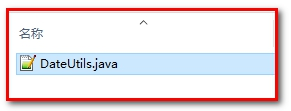

 

### 3.2.4. **Dao接口**

#### 3.2.4.1. **OrderSettingDao.java**

```java
package com.atguigu.dao;

import com.atguigu.pojo.OrderSetting;

import java.util.Date;
import java.util.List;
import java.util.Map;

/**
 * OrdersettingDao
 *
 * @Author: 马伟奇
 * @Description:
 */
public interface OrderSettingDao {
    //根据预约日期查询预约设置信息
    OrderSetting findByOrderDate(Date date);
    //更新已预约人数
    void editReservationsByOrderDate(OrderSetting orderSetting);
}
```

#### 3.2.4.2. **MemberDao.java**

```java
package com.atguigu.dao;

import com.atguigu.pojo.Member;

/**
 * MemberDao
 *
 * @Author: 马伟奇
 * @Description:
 */
public interface MemberDao {
    // 添加会员
    public void add(Member member);
    // 根据手机号查询会员信息（唯一）
    public Member findByTelephone(String telephone);
}
```

#### 3.2.4.3. OrderDao.java

```java
package com.atguigu.dao;

import com.atguigu.pojo.Order;

import java.util.List;

/**
 * OrderDao
 *
 * @Author: 马伟奇
 * @Description:
 */
public interface OrderDao {

    List<Order> findByCondition(Order order);

    void add(Order order);
}
```

 

### 3.2.5. **Mapper映射文件**

#### 3.2.5.1. OrderSettingDao.xml

```xml
<!--根据日期查询预约设置信息-->
<select id="findByOrderDate" parameterType="date" resultType="orderSetting">
    select * from t_ordersetting where orderDate = #{orderDate}
</select>
<!--更新已预约人数-->
<update id="editReservationsByOrderDate" parameterType="orderSetting">
    update t_ordersetting set reservations = #{reservations} where orderDate = #{orderDate}
</update>
```

 

#### 3.2.5.2. **MemberDao.xml**

```xml
<?xml version="1.0" encoding="UTF-8" ?>
<!DOCTYPE mapper PUBLIC "-//mybatis.org//DTD Mapper 3.0//EN"
        "http://mybatis.org/dtd/mybatis-3-mapper.dtd" >
<mapper namespace="com.atguigu.dao.MemberDao">

    <!--新增会员-->
    <insert id="add" parameterType="member">
        <selectKey resultType="java.lang.Integer" order="AFTER" keyProperty="id">
            SELECT LAST_INSERT_ID()
        </selectKey>
        insert into
        t_member
        (fileNumber,name,sex,idCard,phoneNumber,
        regTime,password,email,birthday,remark)
        values
        (#{fileNumber},#{name},#{sex},#{idCard},#{phoneNumber},
        #{regTime},#{password},#{email},#{birthday},#{remark})
    </insert>

    <!--根据手机号查询会员-->
    <select id="findByTelephone" parameterType="string" resultType="member">
        select * from t_member where phoneNumber = #{phoneNumber}
    </select>
</mapper>
```

 

#### 3.2.5.3. OrderDao.xml

```xml
<?xml version="1.0" encoding="UTF-8" ?>
<!DOCTYPE mapper PUBLIC "-//mybatis.org//DTD Mapper 3.0//EN"
        "http://mybatis.org/dtd/mybatis-3-mapper.dtd" >
<mapper namespace="com.atguigu.dao.OrderDao">
   
    
     <!--组织预约的查询条件，查询预约信息，
       因为目前是三个预约条件查询，那么以后可能有4个，5个，甚至更多的条件查询，所以使用动态sql，全部查询
    -->
    <select id="findByCondition" parameterType="order" resultType="order">
        SELECT * FROM t_order
        <where>
            <if test="id != null">
                and id = #{id}
            </if>
            <if test="memberId != null">
                and member_id = #{memberId}
            </if>
            <if test="orderDate != null">
                and orderDate = #{orderDate}
            </if>
            <if test="orderType != null">
                and orderType = #{orderType}
            </if>
            <if test="orderStatus != null">
                and orderStatus = #{orderStatus}
            </if>
            <if test="setmealId != null">
                and setmeal_id = #{setmealId}
            </if>
        </where>
    </select>

    
    
    <!--新增-->
    <insert id="add" parameterType="order">
        <selectKey resultType="java.lang.Integer" order="AFTER" keyProperty="id">
            SELECT LAST_INSERT_ID()
        </selectKey>
        insert into
        t_order
        (member_id,orderDate,orderType,orderStatus,setmeal_id)
        values
        (#{memberId},#{orderDate},#{orderType},#{orderStatus},#{setmealId})
    </insert>

   
</mapper>
```

 

测试：

细节注意：

SQL语句 里面 为什么有and 不受影响

```sql
 <select id="findByCondition" parameterType="order" resultType="order">
        SELECT * FROM t_order
        <where>
            <if test="id != null">
                and id = #{id}
            </if>
         </where>
 </select>
 
 有where标签，and会自动识别，where类似于where 1=1，这样后面就可以添加and了，SQL语句就变成如下：
 select * from t_order where 1=1 and member_id =#{memberId}
```

### 【小结】

验证码

1. 调用阿里服务, 发送成功后, 验证码存到Redis(存5分钟)
2. 用户点击了预约, 需要把用户输入的验证码和redis里面存的验证码进行校验

预约业务

1. 判断当前的日期是否可以预约
2. 判断当前的日期预约是否已满
3. 判断是否 是会员
   - 如果是会员, 避免重复预约
   - 不是会员, 自动注册成会员，t_member 表插入一条记录
4. 进行预约
   - 向t_order 表插入一条记录
   - 向t_ordersetting更新reservations+1

# 4. **第四章. 预约成功页面展示**

### 【目标】

前面已经完成了旅游预约，预约成功后页面会跳转到成功提示页面（ `orderSuccess.html` ）并展示预约的相关信息（会员姓名、旅游套餐、旅游时间等）。

使用订单id，查询订单详细信息
在 `OrderDao.xml` 中会使用联合查询的 `sql` ，关联订单表，会员表，套餐表，以map数据结构返回。

 `orderSuccess.html`

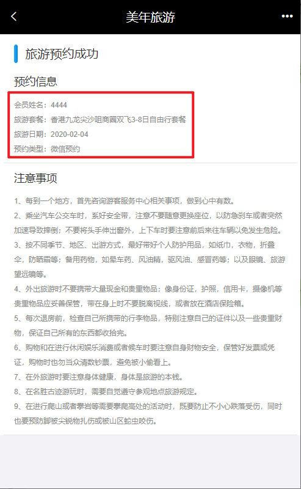

跳转到 `orderSuccess.html` ，传递预约成功的订单id。

```html
axios.post("/order/submit.do",this.orderInfo).then((response) => {
if(response.data.flag){
//预约成功，跳转到预约成功页面
window.location.href="orderSuccess.html?orderId=" + response.data.data.id;
}else{
//预约失败，提示预约失败信息
this.$message.error(response.data.message);
}
});
```

###  【路径】

前台代码编写

1. 在/pages/orderSuccess.html 

```
   <p>会员姓名：{{orderInfo.member}}</p>
   <p>旅游套餐：{{orderInfo.setmeal}}</p>
   <p>旅游日期：{{orderInfo.orderDate}}</p>
   <p>预约类型：{{orderInfo.orderType}}</p>
```

```
完成需求：
1.页面输出订单相关人的信息
2.使用订单id，查询订单详细信息。存放到orderInfo的模型中。
```

后台代码编写：

​    1. 类OrderController.java

​    2. 类OrderService.java

​    3. 类OrderServiceImpl.java

​    4. 类OrderDao.java

​    5. 配置文件OrderDao.xml

```
使用订单id，查询订单详细信息
在OrderDao.xml中会使用联合查询的sql，关联订单表，会员表，套餐表，以map数据结构返回。
```

### 【讲解】

## 4.1. **页面调整**

提供orderSuccess.html页面，展示预约成功后相关信息

第一步：页面输出订单相关人的信息

```html
<div class="info-title">
    <span class="name">旅游预约成功</span>
</div>
<div class="notice-item">
    <div class="item-title">旅游信息</div>
    <div class="item-content">
        <p>会员姓名：{{orderInfo.member}}</p>
        <p>旅游套餐：{{orderInfo.setmeal}}</p>
        <p>旅游日期：{{orderInfo.orderDate}}</p>
        <p>预约类型：{{orderInfo.orderType}}</p>
    </div>
</div>
```

第二步：使用订单id，查询订单详细信息。存放到orderInfo的变量中。

```html
<script>
    var vue = new Vue({
        el: '#app',
        data: {
            orderInfo: {}
        },
        mounted() {
            axios.post("/order/findById.do?id=" + id).then((response) => {
                this.orderInfo = response.data.data;
            });
        }
    });
</script>
```

## 4.2. **后台代码**

### 4.2.1. **Controller**

在OrderController中提供findById方法，根据预约id查询预约相关信息

```java
package com.atguigu.controller;

import com.alibaba.dubbo.config.annotation.Reference;
import com.atguigu.constant.MessageConstant;
import com.atguigu.constant.RedisMessageConstant;
import com.atguigu.entity.Result;
import com.atguigu.pojo.Order;
import com.atguigu.service.OrderService;
import com.atguigu.utils.SMSUtils;
import org.springframework.beans.factory.annotation.Autowired;
import org.springframework.web.bind.annotation.RequestBody;
import org.springframework.web.bind.annotation.RequestMapping;
import org.springframework.web.bind.annotation.RestController;
import redis.clients.jedis.JedisPool;

import java.util.Map;

/**
 * OrderController
 *
 * @Author: 马伟奇
 * @Description: 根据id查询预约信息，包括套餐信息和会员信息
 */
@RestController
@RequestMapping("/order")
public class OrderController {

    @Autowired
    private JedisPool jedisPool;

    @Reference
    private OrderService orderService;

    @RequestMapping("/findById")
    public Result findById(Integer id){
        Map map =null;
        try{
            map = orderService.findById4Detail(id);
            //查询预约信息成功
            return new Result(true,MessageConstant.QUERY_ORDER_SUCCESS,map);
        }catch (Exception e){
            e.printStackTrace();
            //查询预约信息失败
            return new Result(false,MessageConstant.QUERY_ORDER_FAIL);
        }
    }
```

### 4.2.2. **服务接口**

在OrderService服务接口中扩展findById4Detail方法

```java
//根据id查询预约信息，包括人信息、套餐信息
Map findById4Detail(Integer id);
```

 

### 4.2.3. **服务实现类**

在 `OrderServiceImpl` 服务实现类中实现 `findById4Detail` 方法

```java
package com.atguigu.service.impl;

import com.alibaba.dubbo.config.annotation.Service;
import com.atguigu.constant.MessageConstant;
import com.atguigu.dao.MemberDao;
import com.atguigu.dao.OrderDao;
import com.atguigu.dao.OrdersettingDao;
import com.atguigu.entity.Result;
import com.atguigu.pojo.Member;
import com.atguigu.pojo.Order;
import com.atguigu.pojo.OrderSetting;
import com.atguigu.service.CheckItemService;
import com.atguigu.service.OrderService;
import com.atguigu.utils.DateUtils;
import org.apache.poi.ss.usermodel.DateUtil;
import org.springframework.beans.factory.annotation.Autowired;
import org.springframework.transaction.annotation.Transactional;

import java.util.Date;
import java.util.List;
import java.util.Map;

/**
 * OrderServiceImpl
 *
 * @Author: 马伟奇
 * @Description:
 */
@Service(interfaceClass = OrderService.class)
@Transactional
public class OrderServiceImpl implements OrderService {

    @Autowired
    private OrdersettingDao ordersettingDao;

    @Autowired
    private MemberDao memberDao;

    @Autowired
    private OrderDao orderDao;

    //根据id查询预约信息，包括旅游人信息、套餐信息
    public Map findById4Detail(Integer id) throws Exception {
        Map map = orderDao.findById4Detail(id);
        if(map != null){
            //处理日期格式
            Date orderDate = (Date) map.get("orderDate");
            map.put("orderDate",DateUtils.parseDate2String(orderDate));
            return map
        }
        return map;
    }
```

 

### 4.2.4. **Dao接口**

在 `OrderDao` 接口中扩展 `findById4Detail` 方法

```java
Map findById4Detail(Integer id);
```

 

### 4.2.5. **Mapper映射文件**

在 `OrderDao.xml` 映射文件中提供SQL语句

```xml
<!--根据预约id查询预约信息，包括旅游人信息、套餐信息-->
<select id="findById4Detail" parameterType="int" resultType="map">
    select m.name member ,s.name setmeal,o.orderDate orderDate,o.orderType orderType
    from
    t_order o,
    t_member m,
    t_setmeal s
    where o.member_id=m.id and o.setmeal_id=s.id and o.id=#{id}
</select>
```

m.name member , s.name setmeal, o.orderDate orderDate, o.orderType orderType

对应：

页面内容

```html
<p>会员姓名：{{orderInfo.member}}</p>
<p>旅游套餐：{{orderInfo.setmeal}}</p>
<p>旅游日期：{{orderInfo.orderDate}}</p>
<p>预约类型：{{orderInfo.orderType}}</p>
```

###  【小结】

使用订单id，查询订单详细信息
在OrderDao.xml中会使用联合查询的sql，关联订单表，会员表，套餐表，以map数据结构返回。

 
