# 移动端开发-手机快速登录

1：了解移动端手机快速登录需求

2：掌握手机快速登录实现过程

3：了解认证和授权的概念

4：掌握Spring Security入门案例开发过程

# 1. **第一章. 需求分析**

手机快速登录功能，就是通过短信验证码的方式进行登录。这种方式相对于用户名密码登录方式，用户不需要记忆自己的密码，只需要通过输入手机号并获取验证码就可以完成登录，是目前比较流行的登录方式。

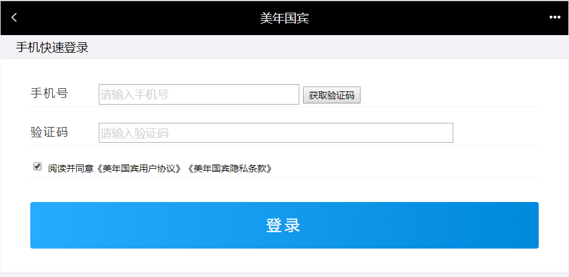 

# 2. **第二章**. 手机快速登录

### 【目标】

实现手机快速登录

### 【路径】

（1）发送验证码

1. 获得用户输入的手机号码
2. 生成动态验证码(4或者6位)
3. 使用阿里云发送短信验证码
4. 把验证码存到redis(存5分钟)

（2）登录

1. 获得用户输入的信息(Map)
2. 取出redis里面的验证码和用户输入的验证码进行校验
3. 如果校验通过
   - 判断是否是会员, 不是会员, 自动注册为会员
   - 保存用户的登录状态( CAS或者自己手动签发token ，我们这里可以使用Cookie存储用户信息)  

### 【讲解】

## 2.1. **前台代码**

登录页面为/pages/login.html

### 2.1.1. **发送验证码**

（1）为获取验证码按钮绑定事件，并在事件对应的处理函数中校验手机号，如果手机号输入正确则显示30秒倒计时效果并发送ajax请求，发送短信验证码

```html
<div class="input-row">
    <label>手机号</label>
    <div class="loginInput">
        <input v-model="loginInfo.telephone" id='account' type="text" placeholder="请输入手机号">
        <input id="validateCodeButton" @click="sendValidateCode()" type="button" style="font-size: 12px" value="获取验证码">
    </div>
</div>
```

（2）调用sendValidateCode()方法

```html
//发送验证码
sendValidateCode(){
    var telephone = this.loginInfo.telephone;
    if (!checkTelephone(telephone)) {
        this.$message.error('请输入正确的手机号');
        return false;
    }
    validateCodeButton = $("#validateCodeButton")[0];
    clock = window.setInterval(doLoop, 1000); //一秒执行一次
    axios.post("/validateCode/send4Login.do?telephone=" + telephone).then((response) => {
        if(!response.data.flag){
            //验证码发送失败
            this.$message.error('验证码发送失败，请检查手机号输入是否正确');
        }
    });
},
```

（3）在 `ValidateCodeController` 中提供 `send4Login`方法，调用短信服务发送验证码并将验证码保存到redis

注意：存放到redis的可以值：手机号+002（RedisMessageConstant.SENDTYPE_LOGIN）

```java
package com.atguigu.controller;

import com.atguigu.constant.MessageConstant;
import com.atguigu.constant.RedisConstant;
import com.atguigu.constant.RedisMessageConstant;
import com.atguigu.entity.Result;
import com.atguigu.utils.SMSUtils;
import com.atguigu.utils.ValidateCodeUtils;
import org.springframework.beans.factory.annotation.Autowired;
import org.springframework.web.bind.annotation.RequestMapping;
import org.springframework.web.bind.annotation.RestController;
import redis.clients.jedis.JedisPool;

/**
 * ValidateCodeController
 *
 * @Author: 马伟奇
 * @CreateTime: 2019-12-24
 * @Description:
 */
@RestController
@RequestMapping("/validateCode")
public class ValidateCodeController {

    @Autowired
    private JedisPool jedisPool;

    //手机快速登录时发送手机验证码
    @RequestMapping("/send4Login")
    public Result send4Login(String telephone){
        Integer code = ValidateCodeUtils.generateValidateCode(4);//生成4位数字验证码
        try {
            //发送短信
            SMSUtils.sendShortMessage(SMSUtils.VALIDATE_CODE,telephone,code.toString());
        } catch (ClientException e) {
            e.printStackTrace();
            //验证码发送失败
            return new Result(false, MessageConstant.SEND_VALIDATECODE_FAIL);
        }
        System.out.println("发送的手机验证码为：" + code);
        //将生成的验证码缓存到redis
        jedisPool.getResource().setex(telephone+RedisMessageConstant.SENDTYPE_LOGIN,
                5 * 60,
                code.toString());
        //验证码发送成功
        return new Result(true,MessageConstant.SEND_VALIDATECODE_SUCCESS);
    }
```

 

### 2.1.2. **提交登录请求**

（1）为登录按钮绑定事件

```html
<div class="btn yes-btn"><a @click="login()" href="#">登录</a></div>
```

（2）点击登录，login方法：

```html
//登录
login(){
    var telephone = this.loginInfo.telephone;
    if (!checkTelephone(telephone)) {
        this.$message.error('请输入正确的手机号');
        return false;
    }
    axios.post("/login/check.do",this.loginInfo).then((response) => {
        if(response.data.flag){
            //登录成功,跳转到index.html
            window.location.href="index.html";
        }else{
            //失败，提示失败信息
            this.$message.error(response.data.message);
        }
    });
}
```

 

## 2.2. **后台代码**


### 2.2.1. **Controller**

在`meinian_mobile_web`工程中创建`LoginController`并提供`check方`法进行登录检查，处理逻辑为：

【路径】

1、校验用户输入的短信验证码是否正确，如果验证码错误则登录失败

2、如果验证码正确，则判断当前用户是否为会员，如果不是会员则自动完成会员注册

3、向客户端写入Cookie，内容为用户手机号

```java
package com.atguigu.controller;

import com.alibaba.dubbo.config.annotation.Reference;
import com.atguigu.constant.MessageConstant;
import com.atguigu.constant.RedisMessageConstant;
import com.atguigu.entity.Result;
import com.atguigu.pojo.Member;
import com.atguigu.service.MemberService;
import org.springframework.beans.factory.annotation.Autowired;
import org.springframework.web.bind.annotation.RequestBody;
import org.springframework.web.bind.annotation.RequestMapping;
import org.springframework.web.bind.annotation.RestController;
import redis.clients.jedis.JedisPool;

import javax.servlet.http.Cookie;
import javax.servlet.http.HttpServletResponse;
import java.util.Date;
import java.util.Map;

/**
 * 用户登录
 */
@RestController
@RequestMapping("/login")
public class LoginController {

    @Reference
    private MemberService memberService;

    @Autowired
    private JedisPool jedisPool;

    //使用手机号和验证码登录
    @RequestMapping("/check")
    public Result check(HttpServletResponse response, @RequestBody Map map){
        String telephone = (String) map.get("telephone");
        String validateCode = (String) map.get("validateCode");
        //1：从Redis中获取缓存的验证码，判断验证码输入是否正确
        String codeInRedis = jedisPool.getResource().get(
                telephone + RedisMessageConstant.SENDTYPE_LOGIN);
        if(codeInRedis == null || !codeInRedis.equals(validateCode)){
            //验证码输入错误
            return new Result(false, MessageConstant.VALIDATECODE_ERROR);
        }else{
            //验证码输入正确
            //2：判断当前用户是否为会员
            Member member = memberService.findByTelephone(telephone);
            if(member == null){
                //当前用户不是会员，自动完成注册
                member = new Member();
                member.setPhoneNumber(telephone);
                member.setRegTime(new Date());
                memberService.add(member);
            }
            //3：:登录成功
            //写入Cookie，跟踪用户
            Cookie cookie = new Cookie("login_member_telephone",telephone);
            cookie.setPath("/");//路径
            cookie.setMaxAge(60*60*24*30);//有效期30天（单位秒）
            response.addCookie(cookie);
            return new Result(true,MessageConstant.LOGIN_SUCCESS);
        }
    }
}
```

 

### 2.2.2. **服务接口**

在`MemberService`服务接口中提供`findByTelephone`和`add`方法

```java
package com.atguigu.service;

import com.atguigu.pojo.Member;

/**
 * 会员服务
 */
public interface MemberService {

    Member findByTelephone(String telephone);

    void add(Member member);
}
```

 

### 2.2.3. **服务实现类**

在 `MemberServiceImpl` 服务实现类中实现 `findByTelephone` 和 `add` 方法

【路径】

1：使用手机号查询会议

2：新增会员

```java
package com.atguigu.service.impl;

import com.alibaba.dubbo.config.annotation.Service;
import com.atguigu.dao.MemberDao;
import com.atguigu.pojo.Member;
import com.atguigu.service.MemberService;
import org.springframework.beans.factory.annotation.Autowired;
import org.springframework.transaction.annotation.Transactional;

/**
 * 会员服务
 */
@Service(interfaceClass = MemberService.class)
@Transactional
public class MemberServiceImpl implements MemberService {


    @Autowired
    private MemberDao memberDao;


    public Member findByTelephone(String telephone) {
        return memberDao.findByTelephone(telephone);
    }


    public void add(Member member) {
        if(member.getPassword() != null){
            member.setPassword(MD5Utils.md5(member.getPassword()));
        }
        memberDao.add(member);
    }
}
```

 

导入`MD5Utils.java`

 

### 2.2.4. **Dao接口**

在	`MemberDao`接口中声明`findByTelephone`和`add`方法

```java
public void add(Member member);
public Member findByTelephone(String telephone);
```

 

### 2.2.5. **Mapper映射文件**

在 `MemberDao.xml` 映射文件中定义SQL语句

```xml
<?xml version="1.0" encoding="UTF-8" ?>
<!DOCTYPE mapper PUBLIC "-//mybatis.org//DTD Mapper 3.0//EN"
        "http://mybatis.org/dtd/mybatis-3-mapper.dtd" >
<mapper namespace="com.atguigu.dao.MemberDao">


    <!--新增会员-->
    <insert id="add" parameterType="member">
        <selectKey resultType="java.lang.Integer" order="AFTER" keyProperty="id">
            SELECT LAST_INSERT_ID()
        </selectKey>
        insert into
        t_member
        (fileNumber,name,sex,idCard,phoneNumber,
        regTime,password,email,birthday,remark)
        values
        (#{fileNumber},#{name},#{sex},#{idCard},#{phoneNumber},
        #{regTime},#{password},#{email},#{birthday},#{remark})
    </insert>

    <!--根据手机号查询会员-->
    <select id="findByTelephone" parameterType="string" resultType="member">
        select * from t_member where phoneNumber = #{phoneNumber}
    </select>


</mapper>
```

登录：` http://localhost/pages/login.html `

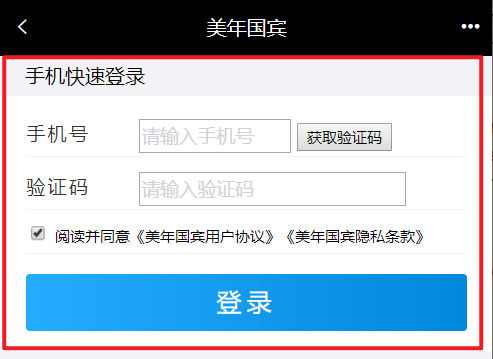


登录成功之后可以查看浏览器Cookie是否写入成功。

 

### 【小结】

1. 发送验证码
   - 获得用户输入的手机号码
   - 生成验证码
   - 阿里云发送验证码
   - 把验证码存到redis(5分钟)
2. 登录
   - 获得用户输入的信息(Map)
   - 取出redis里面存的验证码和用户输入的验证码进行比较
   - 判断是否是会员
     - 不是会员, 自动注册为会员

# 3. **第三章. 权限控制**

### 【目标】

了解认证和授权的概念

### 【路径】

1：认证和授权的概念

* 认证：登录（用户名和密码）
* 授权：访问系统功能的权限

2：权限模块的数据模型

- 用户表
- 角色表
- 权限表

用户,角色是多对多

权限,角色是多对多


### 【讲解】

## 3.1. **认证和授权概念**

前面我们已经完成了旅游后台管理系统的部分功能，例如自由行管理、跟团游管理、套餐管理、预约设置等。接下来我们需要思考2个问题：

问题1：在生产环境下我们如果不登录后台系统就可以完成这些功能操作吗？

答案显然是否定的，要操作这些功能必须首先登录到系统才可以。（用户登录系统-->认证）

问题2：是不是所有用户，只要登录成功就都可以操作所有功能呢？

答案是否定的，并不是所有的用户都可以操作这些功能。不同的用户可能拥有不同的权限，这就需要进行授权了。（用户登录之后，对每个用户进行授权，通过授权去访问系统中不同的功能-->授权）

==认证：系统提供的用于识别用户身份的功能，通常提供用户名和密码进行登录其实就是在进行认证，认证的目的是让系统知道你是谁。==

==授权：用户认证成功后，需要为用户授权，其实就是指定当前用户可以操作哪些功能。==

本章节就是要对后台系统进行权限控制，其本质就是对用户进行认证和授权。

## 3.2. **权限模块数据模型**

前面已经分析了认证和授权的概念，要实现最终的权限控制，需要有一套表结构支撑：

用户表t_user、权限表t_permission、角色表t_role、用户角色关系表t_user_role、角色权限关系表t_role_permission、

RBAC（Role-Based Access Control，基于角色的访问控制），就是用户通过角色与权限进行关联。简单地说，一个用户拥有若干角色，每一个角色拥有若干权限。这样，就构造成“用户-角色-权限”的授权模型。在这种模型中，用户与角色之间，角色与权限之间，一般者是多对多的关系。（如下图）

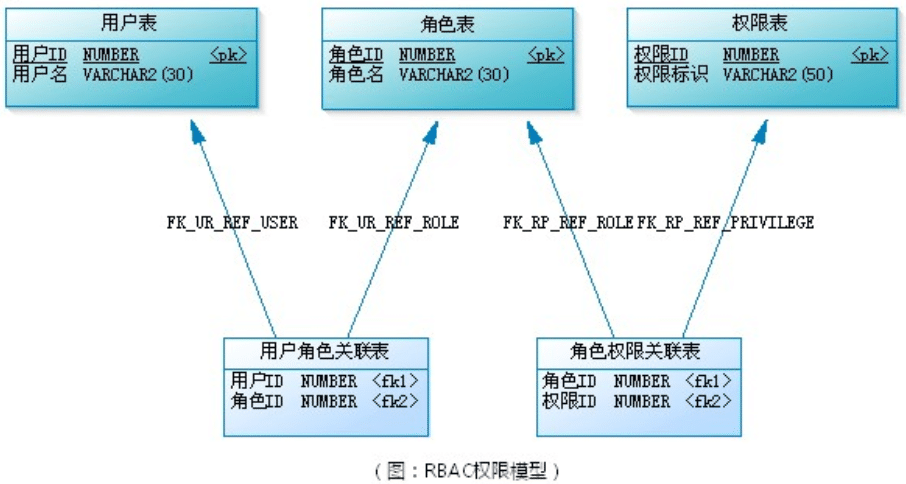 

我们把基于角色的权限控制叫做RBAC

角色是什么？可以理解为一定数量的权限的集合，权限的载体。例如：一个论坛系统，“超级管理员”、“版主”都是角色。版主可管理版内的帖子、可管理版内的用户等，这些是权限。要给某个用户授予这些权限，不需要直接将权限授予用户，可将“版主”这个角色赋予该用户。

在应用系统中，权限表现成什么？对功能模块的操作，对上传文件的删改，菜单的访问，甚至页面上某个按钮、某个图片的可见性控制，都可属于权限的范畴。

 

接下来我们可以分析一下在认证和授权过程中分别会使用到哪些表：

认证过程：只需要用户表就可以了，在用户登录时可以查询用户表t_user进行校验，判断用户输入的用户名和密码是否正确。

 

授权过程：用户必须完成认证之后才可以进行授权，首先可以根据用户查询其角色，再根据角色查询对应的菜单，这样就确定了用户能够看到哪些菜单。然后再根据用户的角色查询对应的权限，这样就确定了用户拥有哪些权限。所以授权过程会用到上面5张表。

 

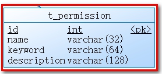 

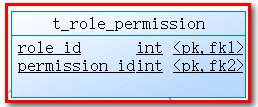 

### 【小结】

1. 认证和授权

   - 认证: 提供账号和密码进行登录认证, 系统知道你的身份
   - 授权: 根据不同的身份, 赋予不同的权限，不同的权限，可访问系统不同的功能

2. RBAC权限模块数据模型（基于角色的权限控制）

   - 用户表
   - 角色表
   - 权限表
   - 菜单表

   用户,角色是多对多

   权限,角色是多对多

   

   

## 3.3. **Spring Security简介**

### 【目标】

知道什么是Spring Security

### 【路径】

1. Spring Security简介
2. Spring Security使用需要的坐标

### 【讲解】

Spring Security是 Spring提供的安全认证服务的框架。 使用Spring Security可以帮助我们来简化认证和授权的过程。官网：<https://spring.io/projects/spring-security>

中文官网：https://www.w3cschool.cn/springsecurity/

 

对应的maven坐标：

```xml
<dependency>
  <groupId>org.springframework.security</groupId>
  <artifactId>spring-security-web</artifactId>
  <version>5.0.5.RELEASE</version>
</dependency>
<dependency>
  <groupId>org.springframework.security</groupId>
  <artifactId>spring-security-config</artifactId>
  <version>5.0.5.RELEASE</version>
</dependency>
```

常用的权限框架除了Spring Security，还有Apache的shiro框架。

### 【小结】

1. SpringSecurity是Spring家族的一个安全框架, 简化我们开发里面的认证和授权过程
2. SpringSecurity内部封装了Filter（只需要在web.xml容器中配置一个过滤器--代理过滤器，真实的过滤器在spring的容器中配置）
3. 常见的安全框架 
   - Spring的  ` SpringSecurity`
   - Apache的Shiro  `http://shiro.apache.org/`

## 3.4. **Spring Security入门案例**

### 【目标】

【需求】

​	使用Spring Security进行控制: 网站(一些页面)需要登录才能访问（认证）

### 【路径】

1. 创建Maven工程 `spring_security_demo`,导入坐标
2. 配置 `web.xml` (前端控制器, `SpringSecurity`相关的过滤器)
3. 创建 `spring-security.xml`（核心）

### 【讲解】

### 3.4.1. **工程搭建**

创建maven工程，打包方式为war。

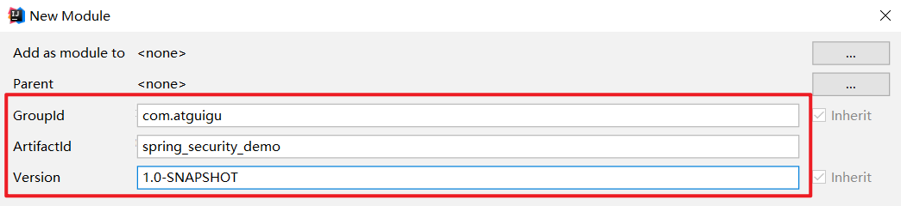 

pom.xml

```xml
<packaging>war</packaging>

    <properties>
        <spring.version>5.0.5.RELEASE</spring.version>
        <project.build.sourceEncoding>UTF-8</project.build.sourceEncoding>
        <maven.compiler.source>1.8</maven.compiler.source>
        <maven.compiler.target>1.8</maven.compiler.target>
    </properties>

    <dependencies>
        <dependency>
            <groupId>org.springframework</groupId>
            <artifactId>spring-core</artifactId>
            <version>${spring.version}</version>
        </dependency>
        <dependency>
            <groupId>org.springframework</groupId>
            <artifactId>spring-web</artifactId>
            <version>${spring.version}</version>
        </dependency>
        <dependency>
            <groupId>org.springframework</groupId>
            <artifactId>spring-webmvc</artifactId>
            <version>${spring.version}</version>
        </dependency>
        <dependency>
            <groupId>org.springframework</groupId>

            <artifactId>spring-context-support</artifactId>
            <version>${spring.version}</version>
        </dependency>
        <dependency>
            <groupId>org.springframework</groupId>
            <artifactId>spring-test</artifactId>
            <version>${spring.version}</version>
        </dependency>
        <dependency>
            <groupId>org.springframework</groupId>
            <artifactId>spring-jdbc</artifactId>
            <version>${spring.version}</version>
        </dependency>
        <dependency>
            <groupId>org.springframework.security</groupId>
            <artifactId>spring-security-web</artifactId>
            <version>5.0.5.RELEASE</version>
        </dependency>
        <dependency>
            <groupId>org.springframework.security</groupId>
            <artifactId>spring-security-config</artifactId>
            <version>5.0.5.RELEASE</version>
        </dependency>
        <dependency>
            <groupId>javax.servlet</groupId>
            <artifactId>servlet-api</artifactId>
            <version>2.5</version>
            <scope>provided</scope>
        </dependency>
    </dependencies>
    <build>
        <plugins>
            <plugin>
                <groupId>org.apache.tomcat.maven</groupId>
                <artifactId>tomcat7-maven-plugin</artifactId>
                <configuration>
                    <!-- 指定端口 -->
                    <port>85</port>
                    <!-- 请求路径 -->
                    <path>/</path>
                </configuration>
            </plugin>
        </plugins>
    </build>

```

内置提供 `index.html` 页面，内容为“登录成功”!!

### 3.4.2. **配置web.xml**

【路径】

==1：DelegatingFilterProxy用于整合第三方框架（代理过滤器，非真正的过滤器，真正的过滤器需要在spring的配置文件）==

2：springmvc的核心控制器

在`web.xml ` 中主要配置  `SpringMVC  `  的  `DispatcherServlet`   和用于整合第三方框架的`DelegatingFilterProxy`（代理过滤器，真正的过滤器在spring的配置文件），用于整合`Spring Security`。

```xml
<?xml version="1.0" encoding="UTF-8"?>
<web-app xmlns:xsi="http://www.w3.org/2001/XMLSchema-instance"
         xmlns="http://java.sun.com/xml/ns/javaee"
         xsi:schemaLocation="http://java.sun.com/xml/ns/javaee http://java.sun.com/xml/ns/javaee/web-app_3_0.xsd"
         id="WebApp_ID" version="3.0">


    <filter>
        <!--
         1：DelegatingFilterProxy用于整合第三方框架（代理过滤器，非真正的过滤器，真正的过滤器需要在spring的配置文件）
          整合Spring Security时过滤器的名称必须为springSecurityFilterChain，
          否则会抛出NoSuchBeanDefinitionException异常
        -->
        <filter-name>springSecurityFilterChain</filter-name>
        <filter-class>org.springframework.web.filter.DelegatingFilterProxy</filter-class>
    </filter>
    <filter-mapping>
        <filter-name>springSecurityFilterChain</filter-name>
        <url-pattern>/*</url-pattern>
    </filter-mapping>
    <!-- 2：springmvc的核心控制器-->
    <servlet>
        <servlet-name>springmvc</servlet-name>
        <servlet-class>org.springframework.web.servlet.DispatcherServlet</servlet-class>
        <!-- 指定加载的配置文件 ，通过参数contextConfigLocation加载 -->
        <init-param>
            <param-name>contextConfigLocation</param-name>
            <param-value>classpath:spring-security.xml</param-value>
        </init-param>
        <load-on-startup>1</load-on-startup>
    </servlet>
    <servlet-mapping>
        <servlet-name>springmvc</servlet-name>
        <url-pattern>*.do</url-pattern>
    </servlet-mapping>
</web-app>
```

 

### 3.4.3. **配置spring-security.xml**

【路径 】

1：定义哪些链接可以放行

2：定义哪些链接不可以放行，即需要有角色、权限才可以放行

3：认证管理，定义登录账号名和密码，并授予访问的角色、权限

在 `spring-security.xml` 中主要配置 `Spring Security` 的拦截规则和认证管理器。

```xml
<?xml version="1.0" encoding="UTF-8"?>
<beans xmlns="http://www.springframework.org/schema/beans"
       xmlns:xsi="http://www.w3.org/2001/XMLSchema-instance"
       xmlns:context="http://www.springframework.org/schema/context"
       xmlns:dubbo="http://code.alibabatech.com/schema/dubbo"
       xmlns:mvc="http://www.springframework.org/schema/mvc"
       xmlns:security="http://www.springframework.org/schema/security"
       xsi:schemaLocation="http://www.springframework.org/schema/beans
                  http://www.springframework.org/schema/beans/spring-beans.xsd
                  http://www.springframework.org/schema/mvc
                  http://www.springframework.org/schema/mvc/spring-mvc.xsd
                  http://code.alibabatech.com/schema/dubbo
                  http://code.alibabatech.com/schema/dubbo/dubbo.xsd
                  http://www.springframework.org/schema/context
                  http://www.springframework.org/schema/context/spring-context.xsd
                          http://www.springframework.org/schema/security
                          http://www.springframework.org/schema/security/spring-security.xsd">

     <!--
       ① 配置哪些链接可以放行(没有认证通过也可以访问的资源)
       security="none"：没有权限
       pattern="/login.html"：没有任何权限，可以访问login.html
     -->
    <!--<security:http security="none" pattern="/login.html"></security:http>-->

    <!--
    ② 定义哪些链接不可以放行(必须通过认证才能访问的资源)，及需要有角色，有权限才可以放行访问资源
    <security:http auto-config="true" use-expressions="true">
          auto-config="true":开启自动配置 由springsecurity提供登录页面，提供登录的url地址，退出的url地址
          use-expressions="true"：使用表达式的方式控制权限
             security:intercept-url：定义哪些链接不可以放行，需要当前角色和权限才能放行
                pattern="/**"：要求系统中的所有资源，都必须通过角色和权限才能访问
                access：指定角色和权限
                   如果使用表达式use-expressions="true"
                       access="hasRole('ROLE_ADMIN')：表示具有ROLE_ADMIN的角色才能访问系统的资源
                   如果不使用表达式use-expressions="false"
                       access="ROLE_ADMIN：表示具有ROLE_ADMIN的角色才能访问系统的资源
    -->
    <security:http auto-config="true" use-expressions="true">
        <security:intercept-url pattern="/**" access="hasRole('ROLE_ADMIN')"></security:intercept-url>
    </security:http>

    <!--
      ③ 认证管理：定义登录账号和密码，并授予当前用户访问的角色或权限
        （1）：将用户名和密码：当前用户具有的角色，写死到配置文件中（现在:入门）
                security:user name="admin" :登录名
                authorities="ROLE_ADMIN"   ：角色(ROLE_ADMIN),权限
                password="admin"          ：密码
         （2）：用户名和密码，当前用户具有的角色，从数据库中查询（后续）
    -->
    <security:authentication-manager>
        <security:authentication-provider>
            <security:user-service>
                <security:user name="admin" authorities="ROLE_ADMIN" password="admin"></security:user>
            </security:user-service>
        </security:authentication-provider>
    </security:authentication-manager>


</beans>
```

请求 url 地址：`http://localhost:85/`


自动调整到登录页面（springSecurity自动提供的）

 

输入错误用户名和密码

 

输入正确用户名和密码（admin/admin），因为 spring security 提供了一套安全机制，登录的时候进行了拦截，参考系统源码`PasswordEncoderFactories` 

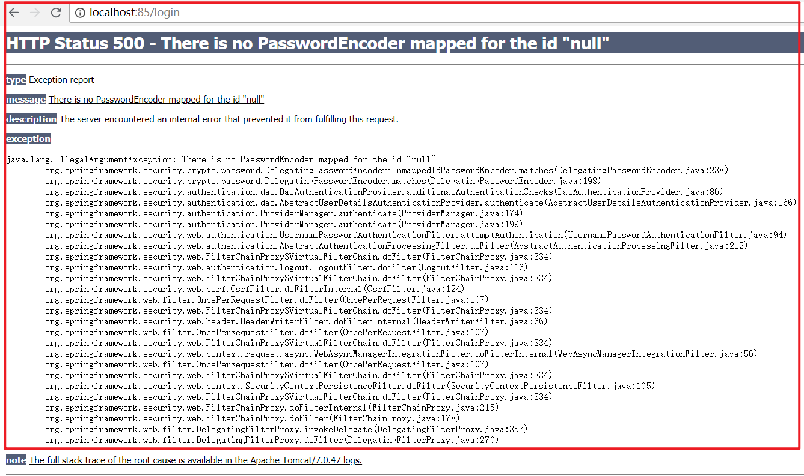

需要修改配置文件

```xml
<security:user name="admin" authorities="ROLE_ADMIN" password="{noop}admin"></security:user>

```

输入正确用户名和密码（admin/admin），缺少资源

 

此时说明没有登录成功的页面。

{noop}：表示当前使用的密码为明文。表示当前密码不需要加密 `PasswordEncoderFactories`

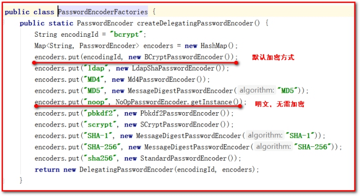


在 `webapp` 文件夹下面，新建 `index.html` ，可以正常访问 `index.html`

 


### 【小结】

使用步骤

1. 创建Maven工程, 添加坐标
2. 配置web.xml(前端控制器,==springSecurity权限相关的过滤器==)
3. 创建spring-security.xml(自动配置,使用表达式的方式完成授权，只要具有ROLE_ADMIN的角色权限才能访问系统中的所有功能； 授权管理器，指定用户名admin，密码admin，具有ROLE_ADMIN的角色权限)

注意实现

​    1.在web.xml里面配置的权限相关的过滤器名字==不能改==（springSecurityFilterChain）

```xml
<filter>   
   <filter-name>springSecurityFilterChain</filter-name>
   <filter-class>org.springframework.web.filter.DelegatingFilterProxy</filter-class>
</filter>
<filter-mapping>
   <filter-name>springSecurityFilterChain</filter-name>
   <url-pattern>/*</url-pattern>
</filter-mapping>
```
​    2.入门案例里面没有指定密码加密方式的. 配置密码的时候的加=={noop}==

```xml
<security:user-service>
   <security:user name="admin" password="{noop}admin" authorities="ROLE_ADMIN"/>
</security:user-service>
```
## 3.5. **Spring Security进阶**

### 【目标】

前面我们已经完成了Spring Security的入门案例，通过入门案例我们可以看到，Spring Security将我们项目中的所有资源都保护了起来，要访问这些资源必须要完成认证而且需要具有ROLE_ADMIN角色。

==但是入门案例中的使用方法离我们真实生产环境还差很远，还存在如下一些问题：==

1、项目中我们将所有的资源（所有请求URL）都保护起来，实际环境下往往有一些资源不需要认证也可以访问，也就是可以匿名访问。

2、登录页面是由框架生成的，而我们的项目往往会使用自己的登录页面。

3、直接将用户名和密码配置在了配置文件中，而真实生产环境下的用户名和密码往往保存在数据库中。

4、在配置文件中配置的密码使用明文，这非常不安全，而真实生产环境下密码需要进行加密。

本章节需要对这些问题进行改进。

### 【路径】

1：配置可匿名访问的资源(不需要登录,权限 角色 就可以访问的资源)

2：使用指定的登录页面（login.html)

3：从数据库查询用户信息

4：对密码进行加密

5：配置多种校验规则（对访问的页面做权限控制）

6：注解方式权限控制（对访问的Controller类做权限控制）

7：退出登录

### 【讲解】

### 3.5.1. **配置可匿名访问的资源**

【路径】

1：在项目中创建js、css目录并在两个目录下提供任意一些测试文件

2：在spring-security.xml文件中配置，指定哪些资源可以匿名访问

第一步：在项目中创建js、css目录并在两个目录下提供任意一些测试文件

把 meinian_web 项目里面的 js 和 css 文件夹 拷贝到项目中

 

访问http://localhost:85/js/vue.js 

请求 vue.js   文件 ，发现被拦截不能访问

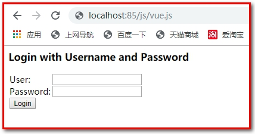 

第二步：在spring-security.xml文件中配置，指定哪些资源可以匿名访问

```xml
<!--
  http：用于定义相关权限控制
  指定哪些资源不需要进行权限校验，可以使用通配符
-->
<security:http security="none" pattern="/js/**" />
<security:http security="none" pattern="/css/**" />
```

通过上面的配置可以发现，js和css目录下的文件可以在没有认证的情况下任意访问。

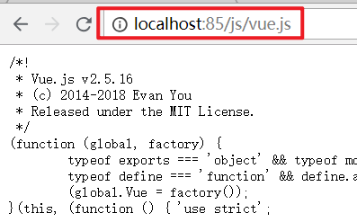

### 3.5.2. **使用指定的登录页面**

【路径】

1：在webapp文件夹下面，提供login.html作为项目的登录页面

2：修改spring-security.xml文件，指定login.html页面可以匿名访问

3：修改spring-security.xml文件，加入表单登录信息的配置

4：修改spring-security.xml文件，关闭csrfFilter过滤器

【讲解】

第一步：提供login.html作为项目的登录页面

1：用户名是username

2：密码是password

3：登录的url是login.do

```html
<!DOCTYPE html>
<html>
<head>
<meta charset="UTF-8">
    <title>登录</title>
</head>
<body>
<form action="/login.do" method="post">
    username:<input type="text" name="username"><br>
    password:<input type="password" name="password"><br>
    <input type="submit" value="submit">
</form>
</body>
</html>
```

 

第二步：修改spring-security.xml文件，指定login.html页面可以匿名访问，否则无法访问。

```html
<security:http security="none" pattern="/login.html" />
```

第三步：修改spring-security.xml文件，加入表单登录信息的配置

```xml
<?xml version="1.0" encoding="UTF-8"?>
<beans xmlns="http://www.springframework.org/schema/beans"
       xmlns:xsi="http://www.w3.org/2001/XMLSchema-instance"
       xmlns:context="http://www.springframework.org/schema/context"
       xmlns:dubbo="http://code.alibabatech.com/schema/dubbo"
       xmlns:mvc="http://www.springframework.org/schema/mvc"
       xmlns:security="http://www.springframework.org/schema/security"
       xsi:schemaLocation="http://www.springframework.org/schema/beans
                  http://www.springframework.org/schema/beans/spring-beans.xsd
                  http://www.springframework.org/schema/mvc
                  http://www.springframework.org/schema/mvc/spring-mvc.xsd
                  http://code.alibabatech.com/schema/dubbo
                  http://code.alibabatech.com/schema/dubbo/dubbo.xsd
                  http://www.springframework.org/schema/context
                  http://www.springframework.org/schema/context/spring-context.xsd
                          http://www.springframework.org/schema/security
                          http://www.springframework.org/schema/security/spring-security.xsd">
     <!--
      ① 配置哪些链接可以放行(没有认证通过也可以访问的资源)
      security="none"：没有权限
      pattern="/login.html"：没有任何权限，可以访问login.html
    -->
    <!--<security:http security="none" pattern="/login.html"></security:http>-->
    <security:http security="none" pattern="/login.html" />
    <!--
  http：用于定义相关权限控制
  指定哪些资源不需要进行权限校验，可以使用通配符
-->
    <security:http security="none" pattern="/js/**" />
    <security:http security="none" pattern="/css/**" />
<!--
  form-login：定义表单登录信息
            login-page="/login.html"：表示指定登录页面
            username-parameter="username"：使用登录名的名称，默认值是username
            password-parameter="password"：使用登录名的密码，默认值是password
            login-processing-url="/login.do"：表示登录的url地址
            default-target-url="/index.html"：登录成功后的url地址
            authentication-failure-url="/login.html"：认证失败后跳转的url地址，失败后指定/login.html
            always-use-default-target="true"：登录成功后，始终跳转到default-target-url指定的地址，即登录成功的默认地址
-->
    <security:http auto-config="true" use-expressions="true">
        <security:intercept-url pattern="/**" access="hasRole('ROLE_ADMIN')"></security:intercept-url>
        <security:form-login login-page="/login.html"
                             username-parameter="username"
                             password-parameter="password"
                             login-processing-url="/login.do"
                             default-target-url="/index.html"
                             authentication-failure-url="/login.html"
                              always-use-default-target="true"
        />
        <!--
  csrf：对应CsrfFilter过滤器
  disabled：是否启用CsrfFilter过滤器，如果使用自定义登录页面需要关闭此项，否则登录操作会被禁用（403）
-->
      <security:csrf disabled="true"></security:csrf>
      </security:http>
```


#### 3.5.2.1. **注意1：**

如果用户名和密码输入正确。抛出异常：

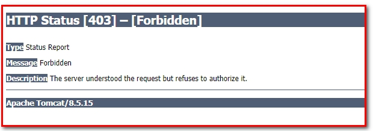 

分析原因：

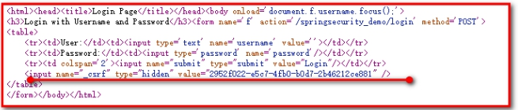 

Spring-security采用盗链机制，其中_csrf使用token标识和随机字符，每次访问页面都会随机生成，然后和服务器进行比较，成功可以访问，不成功不能访问。

解决方案：

```html
<!--关闭盗链安全请求-->
<security:csrf disabled="true" />
```

 

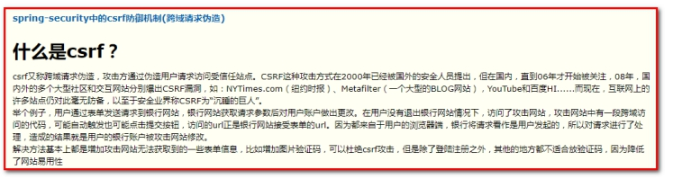 


### 3.5.3. **从数据库查询用户信息**

【路径】

1：定义UserService类，实现UserDetailsService接口。

2：修改spring-security.xml配置（注入UserService）

如果我们要从数据库动态查询用户信息，就必须按照spring security框架的要求提供一个实现UserDetailsService接口的实现类，并按照框架的要求进行配置即可。框架会自动调用实现类中的方法并自动进行密码校验。

第一步：创建java bean对象

```java
package com.atguigu.pojo;

/**
 * User
 *
 * @Author: 马伟奇
 * @CreateTime: 2020-02-04
 * @Description:
 */
public class User {
    private String username;
    private String password;
    private String telephone;
    // 生成set get 和 tostring 方法
```


第二步：定义UserService类，实现UserDetailsService接口。

实现类代码：

```java
package com.atguigu.service;

import org.springframework.security.core.GrantedAuthority;
import org.springframework.security.core.authority.SimpleGrantedAuthority;
import org.springframework.security.core.userdetails.User;
import org.springframework.security.core.userdetails.UserDetails;
import org.springframework.security.core.userdetails.UserDetailsService;
import org.springframework.security.core.userdetails.UsernameNotFoundException;
import org.springframework.stereotype.Component;

import java.util.ArrayList;
import java.util.HashMap;
import java.util.List;
import java.util.Map;

/**
 * UserServiceDetail
 *
 * @Author: 马伟奇
 * @CreateTime: 2020-02-04
 * @Description:
 */
@Component
public class UserService implements UserDetailsService {
    //模拟数据库中的用户数据
   static Map<String,com.atguigu.pojo.User> map =   new HashMap<String,com.atguigu.pojo.User>();

   static {
       com.atguigu.pojo.User user1 =  new com.atguigu.pojo.User();
       user1.setUsername("admin");
       user1.setPassword("admin");
       user1.setTelephone("123");

       com.atguigu.pojo.User user2 =  new com.atguigu.pojo.User();
       user2.setUsername("zhangsan");
       user2.setPassword("123");
       user2.setTelephone("321");

       map.put(user1.getUsername(),user1);
       map.put(user2.getUsername(),user2);
   }

    /**
     * 根据用户名加载用户信息
     *
     * @param username
     * @return
     * @throws UsernameNotFoundException
     */
    @Override
    public UserDetails loadUserByUsername(String username) throws UsernameNotFoundException {
        System.out.println("username"+username);
        //模拟根据用户名查询数据库
        com.atguigu.pojo.User userInDb = map.get(username);

        if (userInDb==null){
            //根据用户名没有查询到用户，抛出异常，表示登录名输入有误
            return  null;
        }
        //模拟数据库中的密码，后期需要查询数据库
        String passwordInDb ="{noop}" + userInDb.getPassword();
        //授权，后期需要改为查询数据库动态获得用户拥有的权限和角色
        List<GrantedAuthority> lists = new ArrayList<>();
        lists.add(new SimpleGrantedAuthority("add"));
        lists.add(new SimpleGrantedAuthority("delete"));
        lists.add(new SimpleGrantedAuthority("ROLE_ADMIN"));

//public User(String username, String password,
//                Collection<? extends GrantedAuthority > authorities)
        //返回User，参数一：存放登录名，
        // 参数二：存放数据库查询的密码（数据库获取的密码，默认会和页面获取的密码进行比对，成功跳转到成功页面，失败回到登录页面，并抛出异常表示失败），存放当前用户具有的角色
        return new User(username,passwordInDb,lists);
    }
}
```

 

第二步：spring-security.xml：

```xml
<!--
    三：认证管理，定义登录账号名和密码，并授予访问的角色、权限
    authentication-manager：认证管理器，用于处理认证操作
-->
<security:authentication-manager>
    <!--
        authentication-provider：认证提供者，执行具体的认证逻辑
    -->
    <security:authentication-provider user-service-ref="userService">
    </security:authentication-provider>
</security:authentication-manager>

<context:component-scan base-package="com"/>
```

本章节我们提供了UserService实现类，并且按照框架的要求实现了UserDetailsService接口。在spring配置文件中注册UserService，指定其作为认证过程中根据用户名查询用户信息的处理类。当我们进行登录操作时，spring security框架会调用UserService的loadUserByUsername方法查询用户信息，并根据此方法中提供的密码和用户页面输入的密码进行比对来实现认证操作。

### 3.5.4. **对密码进行加密**

前面我们使用的密码都是明文的，这是非常不安全的。一般情况下用户的密码需要进行加密后再保存到数据库中。

常见的密码加密方式有：

3DES、AES、DES：使用对称加密算法，可以通过解密来还原出原始密码

MD5、SHA1：使用单向HASH算法，无法通过计算还原出原始密码，但是可以建立彩虹表进行查表破解

MD5可进行==加盐==加密，保证安全

```java
public class TestMD5 {

    @Test
    public void testMD5(){
        // 密码同样是1234却变成了密码不相同
        System.out.println(MD5Utils.md5("1234xiaowang")); //a8231077b3d5b40ffadee7f4c8f66cb7
        System.out.println(MD5Utils.md5("1234xiaoli")); //7d5250d8620fcdb53b25f96a1c7be591
    }
}
```

 

同样的密码值，盐值不同，加密的结果不同。

bcrypt：将salt随机并混入最终加密后的密码，验证时也无需单独提供之前的salt，从而无需单独处理salt问题

==spring security中的BCryptPasswordEncoder方法采用SHA-256 +随机盐+密钥对密码进行加密==。SHA系列是Hash算法，不是加密算法，使用加密算法意味着可以解密（这个与编码/解码一样），但是采用Hash处理，其过程是不可逆的。

==（1）加密(encode)==：注册用户时，使用SHA-256+随机盐+密钥把用户输入的密码进行hash处理，得到密码的hash值，然后将其存入数据库中。

==（2）密码匹配(matches)==：用户登录时，密码匹配阶段并没有进行密码解密（因为密码经过Hash处理，是不可逆的），而是使用相同的算法把用户输入的密码进行hash处理，得到密码的hash值，然后将其与从数据库中查询到的密码hash值进行比较。如果两者相同，说明用户输入的密码正确。

这正是为什么处理密码时要用hash算法，而不用加密算法。因为这样处理即使数据库泄漏，黑客也很难破解密码。

在 `meinian_common `项目的 `test` 文件夹下面新建测试代码

```java
package com.atguigu.security.test;

import org.junit.Test;
import org.springframework.security.crypto.bcrypt.BCryptPasswordEncoder;

public class TestSpringSecurity {
    // SpringSecurity加盐加密
    @Test
    public void testSpringSecurity(){
        // $2a$10$dyIf5fOjCRZs/pYXiBYy8uOiTa1z7I.mpqWlK5B/0icpAKijKCgxe
        // $2a$10$OphM.agzJ55McriN2BzCFeoLZh/z8uL.8dcGx.VCnjLq01vav7qEm

        BCryptPasswordEncoder encoder = new BCryptPasswordEncoder();
        String s = encoder.encode("abc");
        System.out.println(s);
        String s1 = encoder.encode("abc");
        System.out.println(s1);

        // 进行判断
        boolean b = encoder.matches("abc", "$2a$10$dyIf5fOjCRZs/pYXiBYy8uOiTa1z7I.mpqWlK5B/0icpAKijKCgxe");
        System.out.println(b);
    }
}
```

 

加密后的格式一般为：

```
$2a$10$/bTVvqqlH9UiE0ZJZ7N2Me3RIgUCdgMheyTgV0B4cMCSokPa.6oCa
```

加密后字符串的长度为固定的60位。其中：

```properties
$是分割符，无意义；

2a是bcrypt加密版本号；

10是cost的值；

而后的前22位是salt值；

再然后的字符串就是密码的密文了。
```


实现步骤：

【路径】

1：在spring-security.xml文件中指定密码加密对象

2：修改UserService实现类

【讲解】

第一步：在spring-security.xml文件中指定密码加密对象

```xml
<!--
    三：认证管理，定义登录账号名和密码，并授予访问的角色、权限
    authentication-manager：认证管理器，用于处理认证操作
-->
<security:authentication-manager>
    <!--
        authentication-provider：认证提供者，执行具体的认证逻辑
    -->
    <security:authentication-provider user-service-ref="userService">
        <!--指定密码加密策略-->
        <security:password-encoder ref="passwordEncoder"></security:password-encoder>
    </security:authentication-provider>
</security:authentication-manager>

<!--配置密码加密对象-->
<bean id="passwordEncoder"
      class="org.springframework.security.crypto.bcrypt.BCryptPasswordEncoder" />
```

第二步：修改UserService实现类

```java
package com.atguigu.service;

import org.springframework.security.core.GrantedAuthority;
import org.springframework.security.core.authority.SimpleGrantedAuthority;
import org.springframework.security.core.userdetails.User;
import org.springframework.security.core.userdetails.UserDetails;
import org.springframework.security.core.userdetails.UserDetailsService;
import org.springframework.security.core.userdetails.UsernameNotFoundException;
import org.springframework.stereotype.Component;

import java.util.ArrayList;
import java.util.HashMap;
import java.util.List;
import java.util.Map;

/**
 * UserServiceDetail
 *
 * @Author: 马伟奇
 * @CreateTime: 2020-02-04
 * @Description:
 */
@Component
public class UserService implements UserDetailsService {
    //模拟数据库中的用户数据
   static Map<String,com.atguigu.pojo.User> map =   new HashMap<String,com.atguigu.pojo.User>();

   static {
       com.atguigu.pojo.User user1 =  new com.atguigu.pojo.User();
       user1.setUsername("admin");
       user1.setPassword("$2a$10$kRdUwbkOu8f.TRNHthPKquJE5yObiKov29Fo5qrnQK2j2qkjZLuEG");
       user1.setTelephone("123");

       com.atguigu.pojo.User user2 =  new com.atguigu.pojo.User();
       user2.setUsername("zhangsan");
       user2.setPassword("$2a$10$ay1JuL6FQHEVq7HorZGWZ.W0HgvXtwtfmzbe8R5H3on5nUtG/ZXDK");
       user2.setTelephone("321");

       map.put(user1.getUsername(),user1);
       map.put(user2.getUsername(),user2);
   }

    /**
     * 根据用户名加载用户信息
     *
     * @param username
     * @return
     * @throws UsernameNotFoundException
     */
    @Override
    public UserDetails loadUserByUsername(String username) throws UsernameNotFoundException {
        System.out.println("username"+username);
        //模拟根据用户名查询数据库
        com.atguigu.pojo.User userInDb = map.get(username);

        if (userInDb==null){
            //根据用户名没有查询到用户，抛出异常，表示登录名输入有误
            return  null;
        }
        //模拟数据库中的密码，后期需要查询数据库
//        String passwordInDb ="{noop}" + userInDb.getPassword();
        String passwordInDb = userInDb.getPassword();
        //授权，后期需要改为查询数据库动态获得用户拥有的权限和角色
        List<GrantedAuthority> lists = new ArrayList<>();
        lists.add(new SimpleGrantedAuthority("add"));
        lists.add(new SimpleGrantedAuthority("delete"));
        lists.add(new SimpleGrantedAuthority("ROLE_ADMIN"));

//public User(String username, String password,
//                Collection<? extends GrantedAuthority > authorities)
        //返回User，参数一：存放登录名，
        // 参数二：存放数据库查询的密码（数据库获取的密码，默认会和页面获取的密码进行比对，成功跳转到成功页面，失败回到登录页面，并抛出异常表示失败），存放当前用户具有的角色
        return new User(username,passwordInDb,lists);
    }
}
```

 

### 3.5.5.  配置多种校验规则（对页面）

为了测试方便，首先在项目的`webapp`文件夹下面创建 a.html、b.html、c.html、d.html几个页面

修改spring-security.xml文件：

==前提：<security:http auto-config="true" use-expressions="true">==

```xml
<security:http auto-config="true" use-expressions="true">
   <!--<security:intercept-url pattern="/**" access="hasRole('ROLE_ADMIN')"></security:intercept-url>-->
    <!--只要认证通过就可以访问-->
    <security:intercept-url pattern="/index.html"  access="isAuthenticated()" />
    <security:intercept-url pattern="/a.html"  access="isAuthenticated()" />

    <!--拥有add权限就可以访问b.html页面-->
    <security:intercept-url pattern="/b.html"  access="hasAuthority('add')" />

    <!--拥有ROLE_ADMIN角色就可以访问c.html页面，
        注意：此处虽然写的是ADMIN角色，框架会自动加上前缀ROLE_-->
    <security:intercept-url pattern="/c.html"  access="hasRole('ROLE_ADMIN')" />

    <!--拥有ROLE_ADMIN角色就可以访问d.html页面-->
    <security:intercept-url pattern="/d.html"  access="hasRole('ABC')" />
</security:http>
```

测试：

登录后可以访问a.html,b.html,c.html，不能访问d.html

### 3.5.6. 注解方式权限控制（对类）

Spring Security除了可以在配置文件中配置权限校验规则，还可以使用注解方式控制类中方法的调用。例如Controller中的某个方法要求必须具有某个权限才可以访问，此时就可以使用Spring Security框架提供的注解方式进行控制。

【路径】

1：在spring-security.xml文件中配置组件扫描和mvc的注解驱动，用于扫描Controller

2：在spring-security.xml文件中开启权限注解支持

3：创建Controller类并在Controller的方法上加入注解（@PreAuthorize）进行权限控制

实现步骤：

第一步：在spring-security.xml文件中配置组件扫描，用于扫描Controller

```xml
<context:component-scan base-package="com"/>
<mvc:annotation-driven></mvc:annotation-driven>
```

第二步：在spring-security.xml文件中开启权限注解支持

```xml
<!--开启注解方式权限控制-->
<security:global-method-security pre-post-annotations="enabled" />
```

第三步：创建Controller类并在Controller的方法上加入注解（@PreAuthorize）进行权限控制

```java
package com.atguigu.controller;

/**
 * HelloController
 *
 * @Author: 马伟奇
 * @Description:
 */
import org.springframework.security.access.prepost.PreAuthorize;
import org.springframework.stereotype.Controller;
import org.springframework.web.bind.annotation.RequestMapping;
import org.springframework.web.bind.annotation.RestController;

@RestController
@RequestMapping("/hello")
public class HelloController {

    @RequestMapping("/add")
    @PreAuthorize("hasAuthority('add')")//表示用户必须拥有add权限才能调用当前方法
    public String add(){
        System.out.println("add...");
        return "success";
    }

    @RequestMapping("/update")
    @PreAuthorize("hasRole('ROLE_ADMIN')")//表示用户必须拥有ROLE_ADMIN角色才能调用当前方法
    public String update(){
        System.out.println("update...");
        return "success";
    }

    @RequestMapping("/delete")
    @PreAuthorize("hasRole('ABC')")//表示用户必须拥有ABC角色才能调用当前方法
    public String delete(){
        System.out.println("delete...");
        return "success";
    }
}
```

测试delete方法不能访问

 

### 3.5.7. **退出登录**

用户完成登录后Spring Security框架会记录当前用户认证状态为已认证状态，即表示用户登录成功了。那用户如何退出登录呢？我们可以在spring-security.xml文件中进行如下配置：

【路径】

1：index.html定义退出登录链接

2：在spring-security.xml定义

【讲解】

第一步：index.html定义退出登录链接

```html
<!DOCTYPE html>
<html lang="en">
<head>
    <meta charset="UTF-8">
    <title>Title</title>
</head>
<body>
    登录成功！<br>
    <a href="/logout.do">退出登录</a>
</body>
</html>
```

第二步：在spring-security.xml定义：

```xml
<!--
  logout：退出登录
  logout-url：退出登录操作对应的请求路径
  logout-success-url：退出登录后的跳转页面
  invalidate-session="true" 默认为true,用户在退出后Http session失效
-->
<security:logout logout-url="/logout.do"
                 logout-success-url="/login.html" invalidate-session="true"/>
```

 

​	通过上面的配置可以发现，如果用户要退出登录，只需要请求/logout.do这个URL地址就可以，同时会将当前session失效，最后页面会跳转到login.html页面。

###  【小结】

1：配置可匿名访问的资源(不需要登录,权限 角色 就可以访问)

```xml
<security:http security="none" pattern="/js/**"></security:http>
<security:http security="none" pattern="/css/**"></security:http>
<security:http security="none" pattern="/login.html"></security:http>
```

2：使用指定的登录页面（login.html)

```xml
<security:form-login login-page="/login.html"
                     username-parameter="username"
                     password-parameter="password"
                     login-processing-url="/login.do"
                     default-target-url="/index.html"
                     authentication-failure-url="/login.html"
                     always-use-default-target="true"/>
```

3：从数据库查询用户信息

```xml
<security:authentication-manager>
    <security:authentication-provider user-service-ref="userService">
        <security:password-encoder ref="bCryptPasswordEncoder"></security:password-encoder>
    </security:authentication-provider>
</security:authentication-manager>
```

4：对密码进行加密

```xml
<bean id="bCryptPasswordEncoder" class="org.springframework.security.crypto.bcrypt.BCryptPasswordEncoder"></bean>
```

5：配置多种校验规则（对访问的页面做权限控制）

```xml
<security:intercept-url pattern="/index.html" access="isAuthenticated()"></security:intercept-url>
<security:intercept-url pattern="/a.html" access="isAuthenticated()"></security:intercept-url>
<security:intercept-url pattern="/b.html" access="hasAuthority('add')"></security:intercept-url>
<security:intercept-url pattern="/c.html" access="hasRole('ROLE_ADMIN')"></security:intercept-url>
<security:intercept-url pattern="/d.html" access="hasRole('ABC')"></security:intercept-url>
```

6：注解方式权限控制（对访问的Controller类做权限控制）

```xml
<security:global-method-security pre-post-annotations="enabled"></security:global-method-security>
```

7：退出登录

```xml
<security:logout logout-url="/logout.do" logout-success-url="/login.html" invalidate-session="true"></security:logout>
```