# 权限控制、图形报表

1：掌握Spring Security实现认证的过程

2：掌握Spring Security实现授权的过程

3：了解Echarts

4：掌握Echarts实现会员数量折线图的实现过程

# 1. **第一章**. 在项目中使用Spring Security

前面我们已经学习了Spring Security框架的使用方法，本章节我们就需要将Spring Security框架应用到后台系统中进行权限控制，其本质就是认证和授权。

要进行认证和授权需要前面课程中提到的权限模型涉及的7张表支撑，因为用户信息、权限信息、菜单信息、角色信息、关联信息等都保存在这7张表中，也就是这些表中的数据是我们进行认证和授权的依据。所以在真正进行认证和授权之前需要对这些数据进行管理，即我们需要开发如下一些功能：

1、用户数据管理（增删改查、用户关联角色）

2、角色数据管理（增删改查、角色关联权限、角色关联菜单）

3、权限数据管理（增删改查）

鉴于时间关系，我们不再实现这些数据管理的代码开发。我们可以直接将数据导入到数据库中即可。

## 导入用户、角色、权限 的初始数据 

 

 

```sql
DROP TABLE IF EXISTS `t_user`;
CREATE TABLE `t_user` (
  `id` int(11) NOT NULL AUTO_INCREMENT,
  `birthday` date DEFAULT NULL,
  `gender` varchar(1) DEFAULT NULL,
  `username` varchar(32) DEFAULT NULL,
  `password` varchar(256) DEFAULT NULL,
  `remark` varchar(32) DEFAULT NULL,
  `station` varchar(1) DEFAULT NULL,
  `telephone` varchar(11) DEFAULT NULL,
  PRIMARY KEY (`id`)
) ENGINE=InnoDB AUTO_INCREMENT=4 DEFAULT CHARSET=utf8;

INSERT INTO `t_user` VALUES ('1', null, null, 'admin', '$2a$10$Uviz/YD2jAsLw4o8QpgCtutfIgnmX/szGJbo.3/Q95qpN0AZ3nYty', null, null, null);
INSERT INTO `t_user` VALUES ('2', null, null, 'xiaoming', '$2a$10$arnOa3z7f1swsWCFit3IJObYm6dUXYEy3S7py8w.OoR8Z9B.3nhcO', null, null, null);
INSERT INTO `t_user` VALUES ('3', null, null, 'test', '$2a$10$pP.RWewbbNJUewQnRynoqejxAOyU48ArrJvNJZpvt0xRcE5Uwc46u', null, null, null);

DROP TABLE IF EXISTS `t_role`;
CREATE TABLE `t_role` (
  `id` int(11) NOT NULL AUTO_INCREMENT,
  `name` varchar(32) DEFAULT NULL,
  `keyword` varchar(64) DEFAULT NULL,
  `description` varchar(128) DEFAULT NULL,
  PRIMARY KEY (`id`)
) ENGINE=InnoDB AUTO_INCREMENT=3 DEFAULT CHARSET=utf8;

INSERT INTO `t_role` VALUES ('1', '系统管理员', 'ROLE_ADMIN', null);
INSERT INTO `t_role` VALUES ('2', '导游', 'ROLE_HEALTH_MANAGER', null);

DROP TABLE IF EXISTS `t_user_role`;
CREATE TABLE `t_user_role` (
  `user_id` int(11) NOT NULL,
  `role_id` int(11) NOT NULL,
  PRIMARY KEY (`user_id`,`role_id`),
  KEY `FK_Reference_8` (`role_id`),
  CONSTRAINT `FK_Reference_7` FOREIGN KEY (`user_id`) REFERENCES `t_user` (`id`),
  CONSTRAINT `FK_Reference_8` FOREIGN KEY (`role_id`) REFERENCES `t_role` (`id`)
) ENGINE=InnoDB DEFAULT CHARSET=utf8;

INSERT INTO `t_user_role` VALUES ('1', '1');
INSERT INTO `t_user_role` VALUES ('2', '2');

DROP TABLE IF EXISTS `t_permission`;
CREATE TABLE `t_permission` (
  `id` int(11) NOT NULL AUTO_INCREMENT,
  `name` varchar(32) DEFAULT NULL,
  `keyword` varchar(64) DEFAULT NULL,
  `description` varchar(128) DEFAULT NULL,
  PRIMARY KEY (`id`)
) ENGINE=InnoDB AUTO_INCREMENT=27 DEFAULT CHARSET=utf8;

INSERT INTO `t_permission` VALUES ('1', '新增自由行', 'TRAVELITEM_ADD', null);
INSERT INTO `t_permission` VALUES ('2', '删除自由行', 'TRAVELITEM_DELETE', null);
INSERT INTO `t_permission` VALUES ('3', '编辑自由行', 'TRAVELITEM_EDIT', null);
INSERT INTO `t_permission` VALUES ('4', '查询自由行', 'TRAVELITEM_QUERY', null);
INSERT INTO `t_permission` VALUES ('5', '新增跟团游', 'TRAVELGROUP_ADD', null);
INSERT INTO `t_permission` VALUES ('6', '删除跟团游', 'TRAVELGROUP_DELETE', null);
INSERT INTO `t_permission` VALUES ('7', '编辑跟团游', 'TRAVELGROUP_EDIT', null);
INSERT INTO `t_permission` VALUES ('8', '查询跟团游', 'TRAVELGROUP_QUERY', null);
INSERT INTO `t_permission` VALUES ('9', '新增套餐', 'SETMEAL_ADD', null);
INSERT INTO `t_permission` VALUES ('10', '删除套餐', 'SETMEAL_DELETE', null);
INSERT INTO `t_permission` VALUES ('11', '编辑套餐', 'SETMEAL_EDIT', null);
INSERT INTO `t_permission` VALUES ('12', '查询套餐', 'SETMEAL_QUERY', null);
INSERT INTO `t_permission` VALUES ('13', '预约设置', 'ORDERSETTING', null);
INSERT INTO `t_permission` VALUES ('14', '查看统计报表', 'REPORT_VIEW', null);
INSERT INTO `t_permission` VALUES ('15', '新增菜单', 'MENU_ADD', null);
INSERT INTO `t_permission` VALUES ('16', '删除菜单', 'MENU_DELETE', null);
INSERT INTO `t_permission` VALUES ('17', '编辑菜单', 'MENU_EDIT', null);
INSERT INTO `t_permission` VALUES ('18', '查询菜单', 'MENU_QUERY', null);
INSERT INTO `t_permission` VALUES ('19', '新增角色', 'ROLE_ADD', null);
INSERT INTO `t_permission` VALUES ('20', '删除角色', 'ROLE_DELETE', null);
INSERT INTO `t_permission` VALUES ('21', '编辑角色', 'ROLE_EDIT', null);
INSERT INTO `t_permission` VALUES ('22', '查询角色', 'ROLE_QUERY', null);
INSERT INTO `t_permission` VALUES ('23', '新增用户', 'USER_ADD', null);
INSERT INTO `t_permission` VALUES ('24', '删除用户', 'USER_DELETE', null);
INSERT INTO `t_permission` VALUES ('25', '编辑用户', 'USER_EDIT', null);
INSERT INTO `t_permission` VALUES ('26', '查询用户', 'USER_QUERY', null);

DROP TABLE IF EXISTS `t_role_permission`;
CREATE TABLE `t_role_permission` (
  `role_id` int(11) NOT NULL,
  `permission_id` int(11) NOT NULL,
  PRIMARY KEY (`role_id`,`permission_id`),
  KEY `FK_Reference_12` (`permission_id`),
  CONSTRAINT `FK_Reference_11` FOREIGN KEY (`role_id`) REFERENCES `t_role` (`id`),
  CONSTRAINT `FK_Reference_12` FOREIGN KEY (`permission_id`) REFERENCES `t_permission` (`id`)
) ENGINE=InnoDB DEFAULT CHARSET=utf8;

INSERT INTO `t_role_permission` VALUES ('1', '1');
INSERT INTO `t_role_permission` VALUES ('2', '1');
INSERT INTO `t_role_permission` VALUES ('1', '2');
INSERT INTO `t_role_permission` VALUES ('2', '2');
INSERT INTO `t_role_permission` VALUES ('1', '3');
INSERT INTO `t_role_permission` VALUES ('2', '3');
INSERT INTO `t_role_permission` VALUES ('1', '4');
INSERT INTO `t_role_permission` VALUES ('2', '4');
INSERT INTO `t_role_permission` VALUES ('1', '5');
INSERT INTO `t_role_permission` VALUES ('2', '5');
INSERT INTO `t_role_permission` VALUES ('1', '6');
INSERT INTO `t_role_permission` VALUES ('2', '6');
INSERT INTO `t_role_permission` VALUES ('1', '7');
INSERT INTO `t_role_permission` VALUES ('2', '7');
INSERT INTO `t_role_permission` VALUES ('1', '8');
INSERT INTO `t_role_permission` VALUES ('2', '8');
INSERT INTO `t_role_permission` VALUES ('1', '9');
INSERT INTO `t_role_permission` VALUES ('2', '9');
INSERT INTO `t_role_permission` VALUES ('1', '10');
INSERT INTO `t_role_permission` VALUES ('2', '10');
INSERT INTO `t_role_permission` VALUES ('1', '11');
INSERT INTO `t_role_permission` VALUES ('2', '11');
INSERT INTO `t_role_permission` VALUES ('1', '12');
INSERT INTO `t_role_permission` VALUES ('2', '12');
INSERT INTO `t_role_permission` VALUES ('1', '13');
INSERT INTO `t_role_permission` VALUES ('2', '13');
INSERT INTO `t_role_permission` VALUES ('1', '14');
INSERT INTO `t_role_permission` VALUES ('2', '14');
INSERT INTO `t_role_permission` VALUES ('1', '15');
INSERT INTO `t_role_permission` VALUES ('1', '16');
INSERT INTO `t_role_permission` VALUES ('1', '17');
INSERT INTO `t_role_permission` VALUES ('1', '18');
INSERT INTO `t_role_permission` VALUES ('1', '19');
INSERT INTO `t_role_permission` VALUES ('1', '20');
INSERT INTO `t_role_permission` VALUES ('1', '21');
INSERT INTO `t_role_permission` VALUES ('1', '22');
INSERT INTO `t_role_permission` VALUES ('1', '23');
INSERT INTO `t_role_permission` VALUES ('1', '24');
INSERT INTO `t_role_permission` VALUES ('1', '25');
INSERT INTO `t_role_permission` VALUES ('1', '26');

```

### 【目标】

在美年健康的项目中使用SpringSecurity完成认证和授权

### 【路径】

1：导入SpringSecurity环境

（1）pom.xml中添加依赖

（2）web.xml添加代理过滤器

2：实现认证和授权

（1）认证：SpringSecurityUserService.java

（2）创建Service类、Dao接口类、Mapper映射文件

（3）springmvc.xml（dubbo注解扫描范围扩大）

（4）spring-security.xml

（5）springmvc.xml（导入spring-security.xml）

（6）TravelItemController类（@PreAuthorize("hasAuthority('CHECKITEM_ADD')")：完成权限）

（7）travelitem.html（如果没有权限，可以提示错误信息）

（8）导入login.html测试登录

3：显示用户名

4：用户退出

### 【讲解】

## 1.1. **导入Spring Security环境**

【路径】

1：pom.xml导入坐标

2：web.xml添加代理过滤器

### 1.1.1. 第一步：pom.xml导入坐标

在meinian_parent父工程的pom.xml中导入Spring Security的maven坐标（已经引入）

```xml
<dependency>
  <groupId>org.springframework.security</groupId>
  <artifactId>spring-security-web</artifactId>
  <version>${spring.security.version}</version>
</dependency>
<dependency>
  <groupId>org.springframework.security</groupId>
  <artifactId>spring-security-config</artifactId>
  <version>${spring.security.version}</version>
</dependency>
```

### 1.1.2. 第二步：web.xml添加代理过滤器

在 `meinian_web` 工程的 `web.xml` 文件中配置用于整合 `Spring Security` 框架的过滤器 `DelegatingFilterProxy`

```xml
<filter>
    <!--
      DelegatingFilterProxy用于整合第三方框架（代理过滤器，非真正的过滤器，真正的过滤器需要在spring的配置文件）
      整合Spring Security时过滤器的名称必须为springSecurityFilterChain，
      否则会抛出NoSuchBeanDefinitionException异常
    -->
    <filter-name>springSecurityFilterChain</filter-name>
    <filter-class>org.springframework.web.filter.DelegatingFilterProxy</filter-class>
</filter>
<filter-mapping>
    <filter-name>springSecurityFilterChain</filter-name>
    <url-pattern>/*</url-pattern>
</filter-mapping>
```

 ### 1.1.3 第三步 ： sql语句

```sql

# 1 使用登录名查询用户信息
SELECT * FROM t_user WHERE username = 'admin'
# 2 传递用户id查询角色集合
SELECT r.* FROM t_role r,t_user_role ur WHERE ur.role_id = r.id AND ur.user_id = 1
# 3 传递角色id查询权限集合
SELECT p.* FROM t_permission p,t_role_permission rp WHERE p.id = rp.permission_id AND rp.role_id = 1

```

## 1.2. **实现认证和授权**

### 1.2.1. 第一步：SpringSecurityUserService.java

在 `meinian_web` 工程中按照 `Spring Security` 框架要求提供 `SpringSecurityUserService` ，并且实现 `UserDetailsService` 接口

```java
package com.atguigu.security;

import com.alibaba.dubbo.config.annotation.Reference;
import com.atguigu.pojo.Permission;
import com.atguigu.pojo.Role;
import com.atguigu.service.UserService;
import org.springframework.security.core.GrantedAuthority;
import org.springframework.security.core.authority.SimpleGrantedAuthority;
import org.springframework.security.core.userdetails.User;
import org.springframework.security.core.userdetails.UserDetails;
import org.springframework.security.core.userdetails.UserDetailsService;
import org.springframework.security.core.userdetails.UsernameNotFoundException;
import org.springframework.stereotype.Component;

import java.util.ArrayList;
import java.util.List;

@Component
public class SpringSecurityUserService implements UserDetailsService {

    @Reference //注意：此处要通过dubbo远程调用用户服务
    private UserService userService;

    //根据用户名查询用户信息
    public UserDetails loadUserByUsername(String username) throws UsernameNotFoundException {
        //远程调用用户服务，根据用户名查询用户信息
        com.atguigu.pojo.User user = userService.findUserByUsername(username);
        if(user == null){
            //用户名不存在，抛出异常UsernameNotFoundException 
            return null;
        }
        List<GrantedAuthority> list = new ArrayList<GrantedAuthority>();
        Set<Role> roles = user.getRoles();
        for(Role role : roles){
            Set<Permission> permissions = role.getPermissions();
            for(Permission permission : permissions){
                //授权
                list.add(new SimpleGrantedAuthority(permission.getKeyword()));
            }
        }
        /**
         * User()
         * 1：指定用户名
         * 2：指定密码（SpringSecurity会自动对密码进行校验）
         * 3：传递授予的角色和权限
         */
        UserDetails userDetails = new User(username,user.getPassword(),list);
        return userDetails;
    }
}
```

使用debug跟踪调试，查看user。

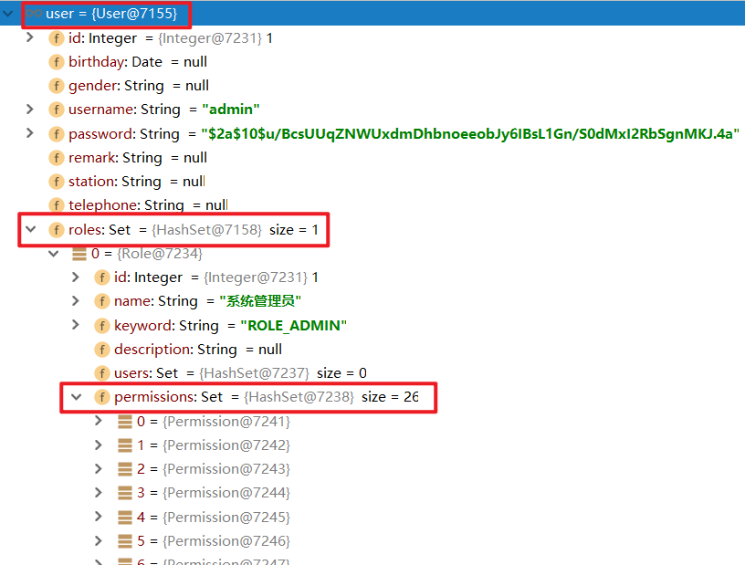

 

### 1.2.2. 第二步：Service、Dao接口、Mapper映射文件

创建UserService服务接口、服务实现类、Dao接口、Mapper映射文件等

【路径】

1：UserService.java接口

2：UserServiceImpl.java类

3：UserDao.java（使用用户id查询用户）

4：RoleDao.java（使用用户id查询角色集合）

5：PermissionDao.java（使用角色id查询权限集合）

6：UserDao.xml（使用用户id查询用户）

7：RoleDao.xml（使用用户id查询角色集合）

8：PermissionDao.xml（使用角色id查询权限集合）

【讲解】

1：服务接口

```java
package com.atguigu.service;

import com.atguigu.pojo.User;

/**
 * 用户服务接口
 */
public interface UserService {

    User findUserByUsername(String username);
}

```

2：服务实现类

```java
package com.atguigu.service;

import com.alibaba.dubbo.config.annotation.Service;
import com.atguigu.dao.UserDao;
import com.atguigu.pojo.User;
import org.springframework.beans.factory.annotation.Autowired;
import org.springframework.transaction.annotation.Transactional;

@Service(interfaceClass = UserService.class)
@Transactional
public class UserServiceImpl implements UserService {

    @Autowired
    private UserDao userDao;

    public User findUserByUsername(String username) {
        User user = userDao.findUserByUsername(username);
        return user;
    }
}
```

3：Dao接口

（1）UserDao

```java
package com.atguigu.dao;

import com.atguigu.pojo.User;
import org.springframework.stereotype.Repository;

/**
 * 持久层Dao接口
 */
@Repository
public interface UserDao {

    User findUserByUsername(String username);
}

```

（2）RoleDao

```java
package com.atguigu.dao;

import com.atguigu.pojo.Role;
import org.springframework.stereotype.Repository;

import java.util.Set;

/**
 * 持久层Dao接口
 */
@Repository
public interface RoleDao {

    Set<Role> findRolesByUserId(Integer userId);

}
```

 

（3）PermissionDao

```java
package com.atguigu.dao;

import com.atguigu.pojo.Permission;
import org.springframework.stereotype.Repository;

import java.util.Set;

/**
 * 持久层Dao接口
 */
@Repository
public interface PermissionDao {

    Set<Permission> findPermissionsByRoleId(Integer roleId);

}
```

 

4：Mapper映射文件

（1）UserDao.xml

```xml
<?xml version="1.0" encoding="UTF-8" ?>
<!DOCTYPE mapper PUBLIC "-//mybatis.org//DTD Mapper 3.0//EN"
        "http://mybatis.org/dtd/mybatis-3-mapper.dtd" >
<mapper namespace="com.atguigu.dao.UserDao">

    <resultMap id="userMap" type="com.atguigu.pojo.User">
        <id column="id" property="id"></id>
        <result column="birthday" property="birthday"></result>
        <result column="gender" property="gender"></result>
        <result column="username" property="username"></result>
        <result column="password" property="password"></result>
        <result column="remark" property="remark"></result>
        <result column="station" property="station"></result>
        <result column="telephone" property="telephone"></result>
        <collection property="roles" column="id" select="com.atguigu.dao.RoleDao.findRolesByUserId"></collection>
    </resultMap>
    <select id="findUserByUsername" parameterType="string" resultMap="userMap">
        select u.* from t_user u where username = #{username}
    </select>
    
</mapper>
```

 

（2）RoleDao.xml

```xml
<?xml version="1.0" encoding="UTF-8" ?>
<!DOCTYPE mapper PUBLIC "-//mybatis.org//DTD Mapper 3.0//EN"
        "http://mybatis.org/dtd/mybatis-3-mapper.dtd" >
<mapper namespace="com.atguigu.dao.RoleDao">

    <resultMap id="roleMap" type="role">
        <id column="id" property="id"></id>
        <result  column="name" property="name"></result>
        <result  column="keyword" property="keyword"></result>
        <result  column="description" property="description"></result>
        <collection property="permissions" column="id" select="com.atguigu.dao.PermissionDao.findPermissionsByRoleId"></collection>
    </resultMap>
    <select id="findRolesByUserId" parameterType="int" resultMap="roleMap">
        SELECT r.* FROM t_role r,t_user_role ur WHERE r.id = ur.role_id AND ur.user_id = #{userId}
    </select>
</mapper>
```

（3）PermissionDao.xml

```xml
<?xml version="1.0" encoding="UTF-8" ?>
<!DOCTYPE mapper PUBLIC "-//mybatis.org//DTD Mapper 3.0//EN"
        "http://mybatis.org/dtd/mybatis-3-mapper.dtd" >
<mapper namespace="com.atguigu.dao.PermissionDao">

    <select id="findPermissionsByRoleId" parameterType="int" resultType="com.atguigu.pojo.Permission">
        SELECT p.* FROM t_permission p,t_role_permission rp WHERE p.id = rp.permission_id AND rp.role_id = #{roleId}
    </select>
</mapper>
```

 

### 1.2.3. 第三步：springmvc.xml

修改meinian_web工程中的springmvc.xml文件，修改dubbo批量扫描的包路径

之前的包扫描

```xml
<!--批量扫描-->
<dubbo:annotation package="com.atguigu.controller" />
```

**现在的包扫描**

```xml
<!--批量扫描-->
<dubbo:annotation package="com.atguigu" />
```

**注意：**此处原来扫描的包为com.atguigu.controller，现在改为com.atguigu包的目的是需要将我们上面定义的SpringSecurityUserService也扫描到，因为在SpringSecurityUserService的loadUserByUsername方法中需要通过dubbo远程调用名称为UserService的服务。

### 1.2.4. 第四步：spring-security.xml

【路径】

1：定义哪些链接可以放行

2：定义哪些链接不可以放行，即需要有角色、权限才可以放行

3：认证管理，定义登录账号名和密码，并授予访问的角色、权限

4：设置在页面可以通过iframe访问受保护的页面，默认为不允许访问，需要添加security:frame-options policy="SAMEORIGIN"

【讲解】

在meinian_web工程中提供spring-security.xml配置文件

```xml
<?xml version="1.0" encoding="UTF-8"?>
<beans xmlns="http://www.springframework.org/schema/beans"
       xmlns:xsi="http://www.w3.org/2001/XMLSchema-instance"
       xmlns:context="http://www.springframework.org/schema/context"
       xmlns:dubbo="http://code.alibabatech.com/schema/dubbo"
       xmlns:mvc="http://www.springframework.org/schema/mvc"
       xmlns:security="http://www.springframework.org/schema/security"
       xsi:schemaLocation="http://www.springframework.org/schema/beans
                  http://www.springframework.org/schema/beans/spring-beans.xsd
                  http://www.springframework.org/schema/mvc
                  http://www.springframework.org/schema/mvc/spring-mvc.xsd
                  http://code.alibabatech.com/schema/dubbo
                  http://code.alibabatech.com/schema/dubbo/dubbo.xsd
                  http://www.springframework.org/schema/context
                  http://www.springframework.org/schema/context/spring-context.xsd
                          http://www.springframework.org/schema/security
                          http://www.springframework.org/schema/security/spring-security.xsd">
    <!--一：定义哪些链接可以放行-->
    <!--
      http：用于定义相关权限控制
      指定哪些资源不需要进行权限校验，可以使用通配符
    -->
    <security:http security="none" pattern="/js/**" />
    <security:http security="none" pattern="/css/**" />
    <security:http security="none" pattern="/img/**" />
    <security:http security="none" pattern="/plugins/**" />
    <security:http security="none" pattern="/login.html"></security:http>
    <!--开启注解方式权限控制-->
    <security:global-method-security pre-post-annotations="enabled" />
    <!--
        二：定义哪些链接不可以放行，即需要有角色、权限才可以放行
        http：用于定义相关权限控制
        auto-config：是否自动配置
                        设置为true时框架会提供默认的一些配置，例如提供默认的登录页面、登出处理等
                        设置为false时需要显示提供登录表单配置，否则会报错
        use-expressions：用于指定intercept-url中的access属性是否使用表达式
    -->
    <security:http auto-config="true" use-expressions="true">

        <!--只要认证通过就可以访问-->
        <!--
            intercept-url：定义一个拦截规则
            pattern：对哪些url进行权限控制
            access：在请求对应的URL时需要什么权限，默认配置时它应该是一个以逗号分隔的角色列表，
              请求的用户只需拥有其中的一个角色就能成功访问对应的URL
            isAuthenticated()：需要经过认证后才能访问（不是匿名用户）
        -->
        <security:intercept-url pattern="/pages/**"  access="isAuthenticated()" />

        <!--
          form-login：定义表单登录信息
        -->
        <security:form-login login-page="/login.html"
                             username-parameter="username"
                             password-parameter="password"
                             login-processing-url="/login.do"
                             default-target-url="/pages/main.html"
                             authentication-failure-url="/login.html"
                             always-use-default-target="true"
        />

        <!--
          csrf：对应CsrfFilter过滤器
          disabled：是否启用CsrfFilter过滤器，如果使用自定义登录页面需要关闭此项，否则登录操作会被禁用（403）
        -->
        <security:csrf disabled="true"></security:csrf>

        <!--
          logout：退出登录
          logout-url：退出登录操作对应的请求路径
          logout-success-url：退出登录后的跳转页面
        -->
        <security:logout logout-url="/logout.do"
                         logout-success-url="/login.html" invalidate-session="true"/>

    </security:http>

    <!--配置密码加密对象-->
    <bean id="passwordEncoder"
          class="org.springframework.security.crypto.bcrypt.BCryptPasswordEncoder" />

    <!--
        三：认证管理，定义登录账号名和密码，并授予访问的角色、权限
        authentication-manager：认证管理器，用于处理认证操作
    -->
    <security:authentication-manager>
        <!--
            authentication-provider：认证提供者，执行具体的认证逻辑
        -->
        <security:authentication-provider user-service-ref="springSecurityUserService">
            <!--指定密码加密策略-->
            <security:password-encoder ref="passwordEncoder"></security:password-encoder>
        </security:authentication-provider>
    </security:authentication-manager>

</beans>
```

这里注意：如果出现以下问题

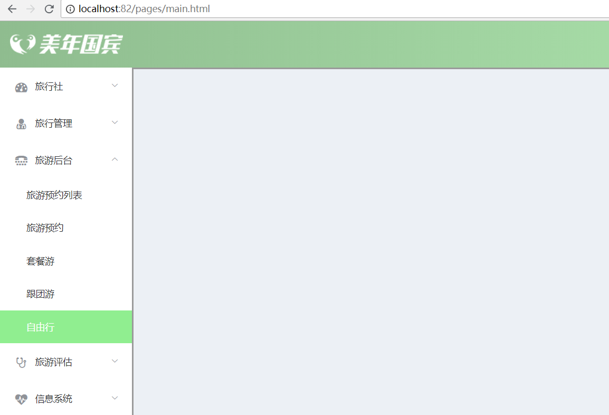

 

使用下面的配置，在spring-security.xml中添加。

放置到<security:http auto-config="true" use-expressions="true">里面

```xml
<security:headers>
    <!--设置在页面可以通过iframe访问受保护的页面，默认为不允许访问-->
    <security:frame-options policy="SAMEORIGIN"></security:frame-options>
</security:headers>
```

是因为我们在main.html中定义：如果不配置springSecurity会认为iframe访问的html页面是收保护的页面，不允许访问。

```html
<el-container>
    <iframe name="right" class="el-main" src="travelitem.html" width="100%" height="580px" frameborder="0"></iframe>
</el-container>
```

备注：


 

### 1.2.5. 第五步：springmvc.xml

在springmvc.xml文件中引入spring-security.xml文件

```xml
<import resource="classpath:spring-security.xml"></import>
```

### 1.2.6. 第六步：TravelItemController类

在Controller的方法上加入权限控制注解，此处以 `TravelItemController` 为例

```java
package com.atguigu.controller;

import com.alibaba.dubbo.config.annotation.Reference;
import com.atguigu.constant.MessageConstant;
import com.atguigu.entity.PageResult;
import com.atguigu.entity.QueryPageBean;
import com.atguigu.entity.Result;
import com.atguigu.pojo.TravelItem;
import com.atguigu.service.TravelItemService;
import com.github.pagehelper.Page;
import org.springframework.security.access.prepost.PreAuthorize;
import org.springframework.ui.freemarker.FreeMarkerTemplateUtils;
import org.springframework.web.bind.annotation.RequestBody;
import org.springframework.web.bind.annotation.RequestMapping;
import org.springframework.web.bind.annotation.RestController;

import java.util.List;

/**
 * TravelItemController
 *
 * @Author: 马伟奇
 * @CreateTime: 2020-01-16
 * @Description:
 * @RestController = @Controller +  @ResponseBody
 *
 *
 */
@RestController
@RequestMapping("/travelItem")
public class TravelItemController {

    @Reference
    private TravelItemService travelItemService;

    @RequestMapping("/findAll")
    public Result findAll(){
        List<TravelItem> lists =  travelItemService.findAll();
        return new Result(true,MessageConstant.QUERY_TRAVELITEM_SUCCESS,lists);
    }

    @RequestMapping("/edit")
    @PreAuthorize("hasAuthority('TRAVELITEM_EDIT')")//权限校验
    public Result edit(@RequestBody TravelItem travelItem){
        travelItemService.edit(travelItem);
        return new Result(true,MessageConstant.EDIT_TRAVELITEM_SUCCESS);
    }

    @RequestMapping("/findById")
    public Result findById(Integer id){
        TravelItem travelItem = travelItemService.findById(id);
        return new Result(true,MessageConstant.QUERY_TRAVELITEM_SUCCESS,travelItem);
    }

    @RequestMapping("/delete")
    @PreAuthorize("hasAuthority('TRAVELITEM_DELETE')")//权限校验，使用TRAVELITEM_DELETE123测试
    public Result delete(Integer id){
        try {
            travelItemService.delete(id);
            return new Result(true,MessageConstant.DELETE_TRAVELITEM_SUCCESS);
        }catch (RuntimeException e){
            return new Result(false,MessageConstant.DELETE_TRAVELITEM_FAIL);
        }catch (Exception e) {
            e.printStackTrace();
        }
        return new Result(false,MessageConstant.DELETE_TRAVELITEM_FAIL);
    }

    @RequestMapping("/findPage")
    @PreAuthorize("hasAuthority('TRAVELITEM_QUERY')")//权限校验
    public PageResult findPage(@RequestBody QueryPageBean queryPageBean){
        PageResult pageResult =  travelItemService.findPage(queryPageBean.getCurrentPage(),
                queryPageBean.getPageSize(),queryPageBean.getQueryString());
        return pageResult;
    }

    //@RequestBody:表示对象和json数据进行互转
    @RequestMapping("/add")
    @PreAuthorize("hasAuthority('TRAVELITEM_ADD')")//权限校验
    public Result add(@RequestBody TravelItem travelItem){
        try {
            // 增加，更新，删除 ，就不需要往data里面添加数据
            // 查询：list 对象
            travelItemService.add(travelItem);
            Result result = new Result(true, MessageConstant.ADD_TRAVELITEM_SUCCESS);
            return result;
        } catch (Exception e) {
            e.printStackTrace();
        }
        return new Result(false, MessageConstant.ADD_TRAVELITEM_SUCCESS);
    }

}
```

### 1.2.7. 第七步：travelitem.html

修改页面，没有权限时提示信息设置，此处以 travelitem.html 中的handleDelete方法为例。

如果权限抛出异常，可以指定showMessage(r)方法进行处理。

```html
// 删除
handleDelete(row) {
// alert(row.id);
this.$confirm("确认删除当前选中记录吗？","提示",{type:'warning'}).then(()=>{
//点击确定按钮时只需此处代码
// alert('用户点击的是确定按钮');
axios.get("/travelItem/delete.do?id=" + row.id).then((res)=> {
if(res.data.flag){
//删除成功
this.$message({
message: res.data.message,
type: 'success'
});
//调用分页，获取最新分页数据
this.findPage();
}else{
//删除失败
this.$message.error(res.data.message);
}
}).catch((error)=>{
this.showMessage(error);
});
}).catch(()=> {
//点击取消按钮执行此代码
this.$message('操作已取消');
});
},
//权限不足提示
showMessage(r){
if(r == 'Error: Request failed with status code 403'){
//权限不足
this.$message.error('无访问权限');
return;
}else{
this.$message.error('未知错误');
return;
}
}
```

### 1.2.8. **第八步：导入login.html页面**

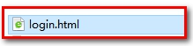

 


 

此时login.html是可放行的页面，而pages下的页面必须认证之后才能访问的页面

## 1.3. **显示用户名**

【路径】

```
1：引入js

2：定义username属性

3：使用钩子函数，调用ajax，查询登录用户（从SpringSecurity中获取），赋值username属性

4：修改页面，使用 `{{username}}` 显示用户信息
```

【讲解】

前面我们已经完成了认证和授权操作，如果用户认证成功后需要在页面展示当前用户的用户名。Spring Security在认证成功后会将用户信息保存到框架提供的上下文对象中，所以此处我们就可以调用Spring Security框架提供的API获取当前用户的username并展示到页面上。

实现步骤：

第一步：在main.html页面中修改，定义username模型数据基于VUE的数据绑定展示用户名，发送ajax请求获取username

（1）：引入js

```xml
<script src="../js/axios-0.18.0.js"></script>
```

（2）：定义username属性

（3）：使用钩子函数，调用ajax

```html
<script>
    new Vue({
        el: '#app',
        data: {
            menuList: [{
                    "path": "1",
                    "title": "旅行社",
                    "icon": "fa-dashboard",
                    "children": []
                },
                {
                    "path": "2",
                    "title": "旅行管理",
                    "icon": "fa-user-md",
                    "children": [{
                            "path": "/2-1",
                            "title": "会员档案",
                            "linkUrl": "member.html",
                            "children": []
                        },
                        {
                            "path": "/2-2",
                            "title": "会员信息上传",
                            "children": []
                        },
                        {
                            "path": "/2-3",
                            "title": "会员统计",
                            "linkUrl": "all-item-list.html",
                            "children": []
                        },
                    ]
                },
                {
                    "path": "3",
                    "title": "旅游后台",
                    "icon": "fa-tty",
                    "children": [{
                            "path": "/3-1",
                            "title": "旅游预约列表",
                            "linkUrl": "ordersettinglist.html",
                            "children": []
                        },
                        {
                            "path": "/3-2",
                            "title": "旅游预约",
                            "linkUrl": "ordersetting.html",
                            "children": []
                        },
                        {
                            "path": "/3-3",
                            "title": "套餐游",
                            "linkUrl": "setmeal.html",
                            "children": []
                        },
                        {
                            "path": "/3-4",
                            "title": "跟团游",
                            "linkUrl": "travelgroup.html",
                            "children": []
                        },
                        {
                            "path": "/3-5",
                            "title": "自由行",
                            "linkUrl": "travelitem.html",
                            "children": []
                        },
                    ]
                },
                {
                    "path": "4",
                    "title": "旅游评估",
                    "icon": "fa-stethoscope",
                    "children": [{
                        "path": "/4-1",
                        "title": "大家一起游",
                        "linkUrl": "all-medical-list.html",
                        "children": []
                    }, ]
                },
                {
                    "path": "5", //菜单项所对应的路由路径
                    "title": "信息系统", //菜单项名称
                    "icon": "fa-heartbeat",
                    "children": [ //是否有子菜单，若没有，则为[]
                        {
                            "path": "/5-1",
                            "title": "注册会员按月份数量统计",
                            "linkUrl": "report_member.html",
                            "children": []
                        }
                    ]
                }
            ],
            username: null // 显示用户名
        },
        //发送请求获取当前登录用户的用户名
        created: function() {

            //发送请求获取当前登录用户的用户名
            // 返回Result(flag,message,data)，data放置User对象
            axios.get("/user/getUsername.do").then((response) => {
                if (response.data.flag) {
                    this.username = response.data.data.username;
                }
            }).catch((error) => {
                this.$message.error("获取用户名失败");
            })
        }
    });
    $(function() {
        var wd = 200;
        $(".el-main").css('width', $('body').width() - wd + 'px');
    });
</script>
```

（4）：修改页面

```html
<div class="avatar-wrapper">
    
    <!--显示用户名-->
    {{username}}
</div>
```

 

第二步：创建UserController并提供getUsername方法

Spring Security使用一个Authentication对象来描述当前用户的相关信息。这个Authentication对象不需要我们自己去创建，在与系统交互的过程中，Spring Security会自动为我们创建相应的Authentication对象，然后赋值给当前的SecurityContext。通过Authentication.getPrincipal()可以获取到代表当前用户的信息。

```java
package com.atguigu.controller;

import com.alibaba.dubbo.config.annotation.Reference;
import com.atguigu.constant.MessageConstant;
import com.atguigu.entity.PageResult;
import com.atguigu.entity.QueryPageBean;
import com.atguigu.entity.Result;
import com.atguigu.service.UserService;
import org.springframework.security.core.context.SecurityContextHolder;
import org.springframework.security.core.userdetails.User;
import org.springframework.web.bind.annotation.RequestBody;
import org.springframework.web.bind.annotation.RequestMapping;
import org.springframework.web.bind.annotation.RestController;
import org.springframework.security.core.userdetails.User;
import java.util.List;

/**
 * CheckGroupController
 *
 * @Author: 马伟奇
 * @CreateTime: 2019-12-19
 * @Description:
 */
@RestController
@RequestMapping("/user")
public class UserController {
    @Reference
    private UserService userService;

    //获取当前登录用户的用户名
    @RequestMapping("/getUsername")
    public Result getUsername()throws Exception{
        try{
        user =SecurityContextHolder.getContext().getAuthentication().getPrincipal();
        return new Result(true, MessageConstant.GET_USERNAME_SUCCESS,user.getUsername());
        }catch (Exception e){
            return new Result(false, MessageConstant.GET_USERNAME_FAIL);
        }
    }
}
```

 

通过debug调试可以看到Spring Security框架在其上下文中保存的用户相关信息：

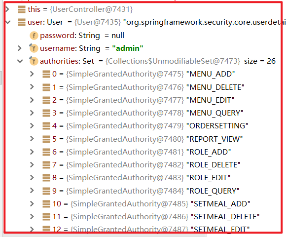

 

显示当前登录人：


 

## 1.4. **用户退出**

【路径】

1：在main.html中提供的退出菜单上加入超链接

2：在spring-security.xml文件中配置

【讲解】

第一步：在main.html中提供的退出菜单上加入超链接

```html
<el-dropdown-item divided>
    退出</a>
</el-dropdown-item>
```

第二步：在spring-security.xml文件中配置

```xml
<!--
  logout：退出登录
  logout-url：退出登录操作对应的请求路径
  logout-success-url：退出登录后的跳转页面
-->
<security:logout logout-url="/logout.do"
                 logout-success-url="/login.html" invalidate-session="true"/>
```

### 【小结】

1：导入SpringSecurity环境

（1）pom.xml中添加依赖

（2）web.xml添加代理过滤器

2：实现认证和授权

（1）认证：SpringSecurityUserService.java，实现UserDetailsService接口

（2）创建Service类、Dao接口类、Mapper映射文件（使用用户名查询当前用户信息，包括角色集合和权限集合）

（3）springmvc.xml（dubbo注解扫描范围扩大）

（4）spring-security.xml（重点）

（5）springmvc.xml（导入spring-security.xml）

（6）CheckItemController类（@PreAuthorize("hasAuthority('CHECKITEM_ADD')")：对类中的方法完成权限控制）

（7）checkitem.html（如果没有权限，可以提示错误信息，通过catch模块提示）

（8）导入login.html测试登录

3：显示用户名

从SecurityContextHolder对象中获取认证的用户信息

```java
@RequestMapping(value = "/getUsername")
public Result getUsername(){
    try {
        // 从SpringSecurity中获取认证用户的信息
        User user = (User)SecurityContextHolder.getContext().getAuthentication().getPrincipal();
        return new Result(true, MessageConstant.GET_USERNAME_SUCCESS,user.getUsername());
    } catch (Exception e) {
        e.printStackTrace();
        return new Result(false, MessageConstant.GET_USERNAME_FAIL);
    }
}
```

4：用户退出

# 2. **第二章. 图形报表ECharts**

jfreechar（api编程）-->HighChart报表-->百度Echarts

### 【目标】

了解Echarts

### 【路径】

1：ECharts简介

2：5分钟上手ECharts

3：查看ECharts官方实例 

### 【讲解】

## 2.1. ECharts简介

ECharts缩写来自Enterprise Charts，商业级数据图表，是百度的一个开源的使用JavaScript实现的数据可视化工具，可以流畅的运行在 PC 和移动设备上，兼容当前绝大部分浏览器（IE8/9/10/11，Chrome，Firefox，Safari等），底层依赖轻量级的矢量图形库 [ZRender](https://github.com/ecomfe/zrender)，提供直观、交互丰富、可高度个性化定制的数据可视化图表。

官网：<https://echarts.baidu.com/>

下载地址：<https://echarts.baidu.com/download.html>

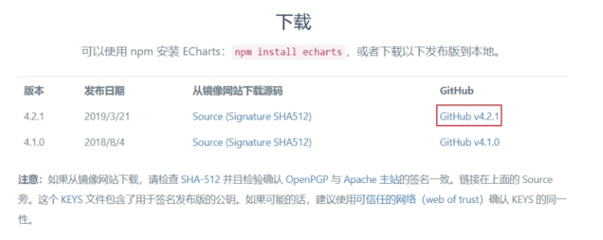

 

下载完成可以得到如下文件：


 

解压上面的zip文件：


 

我们只需要将dist目录下的echarts.js文件（已经压缩）引入到页面上就可以使用了

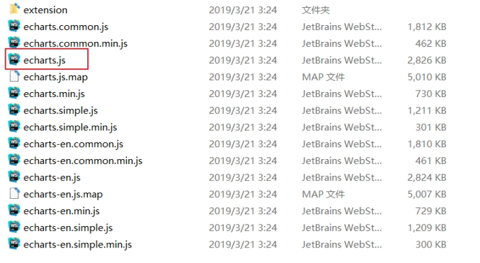

 

## 2.2. **5分钟上手ECharts**

我们可以参考官方提供的5分钟上手ECharts文档感受一下ECharts的使用方式，地址如下：

[https://www.echartsjs.com/tutorial.html#5%20%E5%88%86%E9%92%9F%E4%B8%8A%E6%89%8B%20ECharts](#5 %E5%88%86%E9%92%9F%E4%B8%8A%E6%89%8B ECharts)

第一步：在meinian_web中创建html页面并引入echarts.js文件

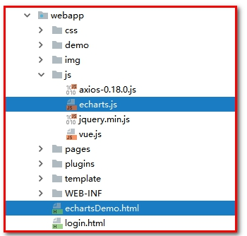

 

echartsDemo.html

```html
<!DOCTYPE html>
<html lang="en">

<head>
    <meta charset="UTF-8">
    <title>Title</title>
</head>
<!-- 引入 ECharts 文件 -->
<script src="js/echarts.js"></script>

<body>

</body>

</html>
```

 

第二步：在页面中准备一个具备宽高的DOM容器。

```html
<body>
    <!-- 为 ECharts 准备一个具备大小（宽高）的 DOM -->
    <div id="main" style="width: 600px;height:400px;"></div>
</body>
```

 

第三步：通过echarts.init方法初始化一个 echarts 实例并通过setOption方法生成一个简单的柱状图

```html
<script type="text/javascript">
    // 基于准备好的dom，初始化echarts实例
    var myChart = echarts.init(document.getElementById('main'));

    // 指定图表的配置项和数据
    var option = {
        title: {
            text: 'ECharts 入门示例'
        },
        tooltip: {},
        legend: {
            data: ['销量']
        },
        xAxis: {
            data: ["衬衫", "羊毛衫", "雪纺衫", "裤子", "高跟鞋", "袜子"]
        },
        yAxis: {},
        series: [{
            name: '销量',
            type: 'bar',
            data: [5, 20, 36, 10, 10, 20]
        }]
    };
    // 使用刚指定的配置项和数据显示图表。
    myChart.setOption(option);
</script>
```

 

效果如下：


 

## 2.3. 查看ECharts官方实例

ECharts提供了很多官方实例，我们可以通过这些官方实例来查看展示效果和使用方法。

官方实例地址：<https://www.echartsjs.com/examples/>

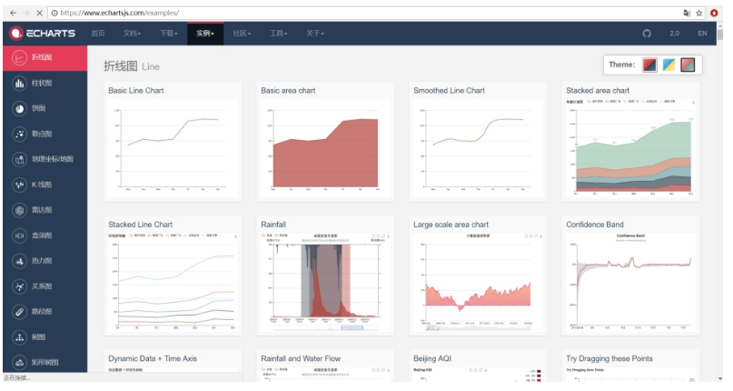

 

可以点击具体的一个图形会跳转到编辑页面，编辑页面左侧展示源码（js部分源码），右侧展示图表效果，如下：


 

要查看完整代码可以点击右下角的Download按钮将完整页面下载到本地。

通过官方案例我们可以发现，使用ECharts展示图表效果，关键点在于确定此图表所需的数据格式，然后按照此数据格式提供数据就可以了，我们无须关注效果是如何渲染出来的。

在实际应用中，我们要展示的数据往往存储在数据库中，所以我们可以发送ajax请求获取数据库中的数据并转为图表所需的数据即可。

### 【小结】

1：ECharts简介

* ECharts百度开发的一套商业报表工具(库)

2：5分钟上手ECharts

3：查看ECharts官方实例  

学习方法

* 看官网, 关注案例，无需关注api，根据项目需求，选择合适报表
# 3. **第三章. 会员数量折线图**

### 【目标】

使用ECharts实现注册会员数量折线图

### 【路径】

1：需求分析

2：前台代码

（1）导入ECharts库

（2）参考官方实例导入折线图

3：后台代码

（1）ReportController类

（2）MemberService服务接口

（3）MemberServiceImpl服务实现类

（4）MemberDao接口

（5）Mapper映射文件（MemberDao.xml）

### 【讲解】

## 3.1. **需求分析**

会员信息是旅游机构的核心数据，其会员数量和增长数量可以反映出机构的部分运营情况。通过折线图可以直观的反映出会员数量的增长趋势。本章节我们==需要展示过去一年时间内每个月的会员总数据量==。展示效果如下图：

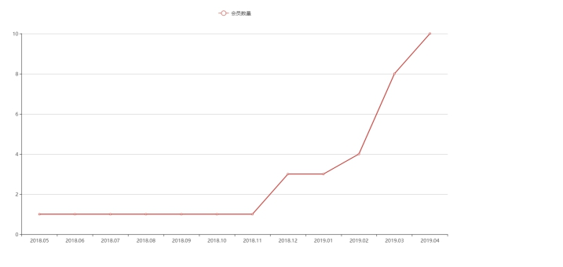

 

导入sql语句

```sql
DROP TABLE IF EXISTS `t_member`;
CREATE TABLE `t_member` (
  `id` int(11) NOT NULL AUTO_INCREMENT,
  `fileNumber` varchar(32) DEFAULT NULL,
  `name` varchar(32) DEFAULT NULL,
  `sex` varchar(8) DEFAULT NULL,
  `idCard` varchar(18) DEFAULT NULL,
  `phoneNumber` varchar(11) DEFAULT NULL,
  `regTime` date DEFAULT NULL,
  `password` varchar(32) DEFAULT NULL,
  `email` varchar(32) DEFAULT NULL,
  `birthday` date DEFAULT NULL,
  `remark` varchar(128) DEFAULT NULL,
  PRIMARY KEY (`id`)
) ENGINE=InnoDB AUTO_INCREMENT=93 DEFAULT CHARSET=utf8;

INSERT INTO `t_member` VALUES ('82', null, '小明', '1', '123456789000999999', '18544279942', '2019-03-08', null, null, null, null);
INSERT INTO `t_member` VALUES ('83', null, '美丽', '1', '132333333333333', '13412345678', '2019-03-11', null, null, null, null);
INSERT INTO `t_member` VALUES ('84', null, '小星星', null, null, '18343569942', '2019-03-13', null, null, null, null);
INSERT INTO `t_member` VALUES ('85', null, '小强', null, null, 18344249942, '2019-03-06', null, null, null, null);
INSERT INTO `t_member` VALUES ('86', null, '红康', null, null, 18544579942, '2019-04-04', null, null, null, null);
INSERT INTO `t_member` VALUES ('87', null, '大海', null, null, 18544274442, '2019-02-06', null, null, null, null);
INSERT INTO `t_member` VALUES ('88', null, '小婷', null, null, 18544269942, '2019-04-10', null, null, null, null);
INSERT INTO `t_member` VALUES ('89', null, '晓晓', null, null, 18544339942, '2019-12-01', null, null, null, null);
INSERT INTO `t_member` VALUES ('90', null, '纯生', null, null, 18544669942, '2019-12-02', null, null, null, null);
INSERT INTO `t_member` VALUES ('91', null, '闰土', null, null, 18544779942, '2019-02-01', null, null, null, null);
INSERT INTO `t_member` VALUES ('92', null, '波波', '2', '234234145432121345', '18019286521', '2019-10-19', null, null, null, null);
```

需要的sql：

```sql
#2019年05月31日之前注册会员的人数(11)

SELECT COUNT(id) FROM t_member WHERE regTime <= '2019-05-31'

#2019年06月31日之前注册会员的人数(12)

SELECT COUNT(id) FROM t_member WHERE regTime <= '2019-06-31'

#2019年07月31日之前注册会员的人数(16)

SELECT COUNT(id) FROM t_member WHERE regTime <= '2019-07-31'
```

## 3.2. **前台代码**

会员数量折线图对应的页面为/pages/report_member.html。

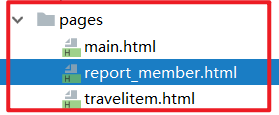

 

### 3.2.1. **导入ECharts库**

第一步：将echarts.js文件复制到health_web工程中

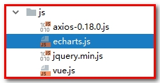

 

第二步：在report_member.html页面引入echarts.js文件

```html
<script src="../js/echarts.js"></script>
```

### 3.2.2. **参照官方实例导入折线图**

1：定义 `<div>`

```html
<div class="app-container">
    <div class="box">
        <!-- 为 ECharts 准备一个具备大小（宽高）的 DOM -->
        <div id="chart1" style="height:600px;"></div>
    </div>
</div>
```

2：定义script

```html
<script type="text/javascript">
    // 基于准备好的dom，初始化echarts实例
    var myChart1 = echarts.init(document.getElementById('chart1'));

    /**
     *返回Result(flag,message,data):data=Map<String,Object>
     *     map：key             value
     *          months          List<String>   (["2018-12","2019-01","2019-02","2019-03","2019-04","2019-05"])
     *          memberCount     List<Integer>  ([5, 20, 36, 40, 50, 60])
     */
    // 使用刚指定的配置项和数据显示图表。
    //myChart.setOption(option);

    axios.get("/report/getMemberReport.do").then((res) => {
        myChart1.setOption({
            title: {
                text: '会员数量'
            },
            tooltip: {},
            legend: {
                data: ['会员数量']
            },
            xAxis: {
                data: res.data.data.months
            },
            yAxis: {
                type: 'value'
            },
            series: [{
                name: '会员数量',
                type: 'line',
                data: res.data.data.memberCount
            }]
        });
    });
</script>
```

 

根据折现图对数据格式的要求，我们发送ajax请求，服务端需要返回如下格式的数据：

其中months和memberCount可以使用hashmap封装

返回Result：data、flag、message

其中data，是map集合

==map集合的key：months；            map集合的值： `List<String>` ==

==map集合的key：memberCount；      map集合的值： `List<Integer>` ==

```json
{
    "data":{
        "months":["2019-01","2019-02","2019-03","2019-04"],
        "memberCount":[3,4,8,10]
    },
    "flag":true,
    "message":"获取会员统计数据成功"
}
```

 

## 3.3. **后台代码**

### 3.3.1. **Controller**

在meinian_web工程中创建ReportController并提供getMemberReport方法

```java
package com.atguigu.controller;

import com.alibaba.dubbo.config.annotation.Reference;
import com.atguigu.constant.MessageConstant;
import com.atguigu.entity.Result;
import com.atguigu.service.MemberService;
import org.springframework.web.bind.annotation.RequestMapping;
import org.springframework.web.bind.annotation.RestController;

import java.text.SimpleDateFormat;
import java.util.*;

/**
 * ReportController
 *
 * @Author: 马伟奇
 * @CreateTime: 2019-12-26
 * @Description:
 */
@RestController
@RequestMapping("/report")
public class ReportController {
    @Reference
    private MemberService memberService;

    /**
     * 会员数量统计
     * @return
     */
    @RequestMapping("/getMemberReport")
    public Result getMemberReport() {
        // 获取日历对象
        Calendar calendar = Calendar.getInstance();
        //根据当前时间，获取前12个月的日历(当前日历2020-02，12个月前，日历时间2019-03)
        //第二个参数，日历字段
        //第二个参数，要添加到字段中的日期或时间
        calendar.add(Calendar.MONTH,-12);
       
        List<String> list = new ArrayList<String>();
        for(int i=0;i<12;i++){
            //第一个参数是月份 2018-7
            //第二个参数是月份+1个月 
            calendar.add(Calendar.MONTH,1);
            list.add(new SimpleDateFormat("yyyy-MM").format(calendar.getTime()));
        }

        Map<String,Object> map = new HashMap<String,Object>();
        // 把过去12个月的日期存储到map里面
        map.put("months",list);
        // 查询所有的会员
        List<Integer> memberCount = memberService.findMemberCountByMonth(list);
        map.put("memberCount",memberCount);

        return new Result(true, MessageConstant.GET_MEMBER_NUMBER_REPORT_SUCCESS,map);
    }
}
```

计算日期，可以使用test方法测试一下

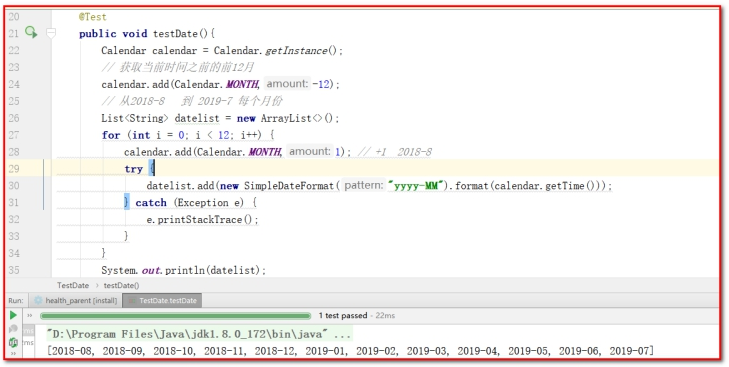

 

### 3.3.2. **服务接口**

在MemberService服务接口中扩展方法findMemberCountByMonth

```java
List<Integer> findMemberCountByMonth(List<String> months);
```

### 3.3.3. **服务实现类**

在MemberServiceImpl服务实现类中实现findMemberCountByMonth方法

```java
package com.atguigu.service.impl;

import com.alibaba.dubbo.config.annotation.Service;
import com.atguigu.dao.MemberDao;
import com.atguigu.service.MemberService;
import com.atguigu.utils.DateUtils;
import org.springframework.beans.factory.annotation.Autowired;
import org.springframework.transaction.annotation.Transactional;

import java.util.ArrayList;
import java.util.List;

/**
 * MemberServiceImpl
 *
 * @Author: 马伟奇
 * @CreateTime: 2020-02-06
 * @Description:
 */
@Service(interfaceClass = MemberService.class)
@Transactional
public class MemberServiceImpl implements MemberService {

    @Autowired
    private MemberDao memberDao;

    // 根据月份统计会员数量
    public List<Integer> findMemberCountByMonth(List<String> months) {
        List<Integer> memeberCountList = new ArrayList<Integer>();
            if(monthsList!=null && monthsList.size()>0){
                for (String months : monthsList) {

                    //String regTime = months+"-31";
                     // 获取指定月份的最后一天
                    String regTime =  DateUtils.getLastDayOfMonth(months);
                    //  迭代过去12个月，每个月注册会员的数量，根据注册日期查询
                    Integer memeberCount = memberDao.findMemberCountBeforeDate(regTime);
                    memeberCountList.add(memeberCount);
                }
            }
            return memeberCountList;
}
```

 

### 3.3.4. **Dao接口**

在MemberDao接口中扩展方法findMemberCountBeforeDate

```java
package com.atguigu.dao;

/**
 * MemberDao
 *
 * @Author: 马伟奇
 * @CreateTime: 2020-02-06
 * @Description:
 */
public interface MemberDao {
    public Integer findMemberCountBeforeDate(String date);
}

```

 

### 3.3.5. **Mapper映射文件**

在MemberDao.xml映射文件中提供SQL语句

```xml
<?xml version="1.0" encoding="UTF-8" ?>
<!DOCTYPE mapper PUBLIC "-//mybatis.org//DTD Mapper 3.0//EN"
        "http://mybatis.org/dtd/mybatis-3-mapper.dtd" >
<mapper namespace="com.atguigu.dao.MemberDao">
    <!--根据日期统计会员数，统计指定日期之前的会员数-->
    <select id="findMemberCountBeforeDate" parameterType="string" resultType="int">
    select count(id) from t_member where regTime &lt;= #{value}
</select>

</mapper>
```

```
注意：在xml文件中 ， <号需要转义”&lt;”
				   >号需要转义”&gt;”
				   &号需要专业 ”&amp;”
```

 

测试

1：修改main.html

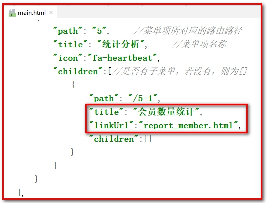

 

2：导入数据

 

3：测试效果

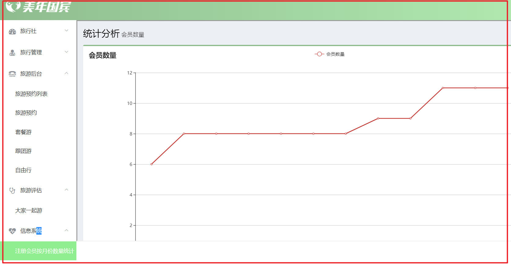

 

###  【小结】

1：需求分析

2：前台页面

（1）导入ECharts库

（2）参考官方实例导入折线图案例（折线图、柱状图、饼图...），参考API完成开发

3：后台代码

（1）ReportController类

（2）MemberService服务接口

（3）MemberServiceImpl服务实现类

（4）MemberDao接口

（5）Mapper映射文件（MemberDao.xml）
