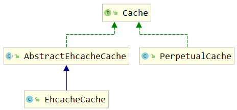

# 第一节 简介

理解缓存的工作机制和缓存的用途。

## 1、缓存机制介绍


## 2、一级缓存和二级缓存

### ①使用顺序


查询的顺序是：

* 先查询二级缓存，因为二级缓存中可能会有其他程序已经查出来的数据，可以拿来直接使用。
* 如果二级缓存没有命中，再查询一级缓存
* 如果一级缓存也没有命中，则查询数据库
* SqlSession关闭之前，一级缓存中的数据会写入二级缓存

### ②效用范围

* 一级缓存：SqlSession级别
* 二级缓存：SqlSessionFactory级别


它们之间范围的大小参考下面图：


# 第二节 一级缓存

## 1、代码验证一级缓存

```java
@Test
public void testFirstLevelCache() {

    EmployeeMapper mapper = session.getMapper(EmployeeMapper.class);

    // 1.第一次查询
    Employee employee1 = mapper.selectEmployeeById(2);

    System.out.println("employee1 = " + employee1);

    // 2.第二次查询
    Employee employee2 = mapper.selectEmployeeById(2);

    System.out.println("employee2 = " + employee2);

    // 3.经过验证发现，两次查询返回的其实是同一个对象
    System.out.println("(employee2 == employee1) = " + (employee2 == employee1));
    System.out.println("employee1.equals(employee2) = " + employee1.equals(employee2));
    System.out.println("employee1.hashCode() = " + employee1.hashCode());
    System.out.println("employee2.hashCode() = " + employee2.hashCode());

}
```

打印结果：

```java
DEBUG 12-01 09:14:48,760 ==>  Preparing: select emp_id,emp_name,emp_salary,emp_gender,emp_age from t_emp where emp_id=?   (BaseJdbcLogger.java:145)
DEBUG 12-01 09:14:48,804 ==> Parameters: 2(Integer)  (BaseJdbcLogger.java:145)
DEBUG 12-01 09:14:48,830 <==      Total: 1  (BaseJdbcLogger.java:145)
employee1 = Employee{empId=2, empName='AAAAAA', empSalary=6666.66, empAge=20, empGender='male'}
employee2 = Employee{empId=2, empName='AAAAAA', empSalary=6666.66, empAge=20, empGender='male'}
(employee2 == employee1) = true
employee1.equals(employee2) = true
employee1.hashCode() = 1131645570
employee2.hashCode() = 1131645570
```

一共只打印了一条SQL语句，两个变量指向同一个对象。

## 2、一级缓存失效的情况

* 不是同一个SqlSession
* 同一个SqlSession但是查询条件发生了变化
* 同一个SqlSession两次查询期间执行了任何一次增删改操作
* 同一个SqlSession两次查询期间手动清空了缓存
* 同一个SqlSession两次查询期间提交了事务


# 第三节 二级缓存

这里我们使用的是Mybatis自带的二级缓存。

## 1、代码测试二级缓存

### ①开启二级缓存功能

在想要使用二级缓存的Mapper配置文件中加入cache标签

```xml
<mapper namespace="com.atguigu.mybatis.EmployeeMapper">

    <!-- 加入cache标签启用二级缓存功能 -->
    <cache/>
```

### ②让实体类支持序列化

```java
public class Employee implements Serializable {
```

### ③junit测试

这个功能的测试操作需要将SqlSessionFactory对象设置为成员变量

```java
@Test
public void testSecondLevelCacheExists() {
    SqlSession session = factory.openSession();

    EmployeeMapper mapper = session.getMapper(EmployeeMapper.class);

    Employee employee = mapper.selectEmployeeById(2);

    System.out.println("employee = " + employee);

    // 在执行第二次查询前，关闭当前SqlSession
    session.close();

    // 开启一个新的SqlSession
    session = factory.openSession();

    mapper = session.getMapper(EmployeeMapper.class);

    employee = mapper.selectEmployeeById(2);

    System.out.println("employee = " + employee);

    session.close();

}
```

打印效果：

```java
DEBUG 12-01 09:44:27,057 Cache Hit Ratio [com.atguigu.mybatis.EmployeeMapper]: 0.0  (LoggingCache.java:62)
DEBUG 12-01 09:44:27,459 ==>  Preparing: select emp_id,emp_name,emp_salary,emp_gender,emp_age from t_emp where emp_id=?   (BaseJdbcLogger.java:145)
DEBUG 12-01 09:44:27,510 ==> Parameters: 2(Integer)  (BaseJdbcLogger.java:145)
DEBUG 12-01 09:44:27,536 <==      Total: 1  (BaseJdbcLogger.java:145)
employee = Employee{empId=2, empName='AAAAAA', empSalary=6666.66, empAge=20, empGender='male'}
DEBUG 12-01 09:44:27,622 Cache Hit Ratio [com.atguigu.mybatis.EmployeeMapper]: 0.5  (LoggingCache.java:62)
employee = Employee{empId=2, empName='AAAAAA', empSalary=6666.66, empAge=20, empGender='male'}
```

### ④缓存命中率

日志中打印的Cache Hit Ratio叫做缓存命中率

```java
    Cache Hit Ratio [com.atguigu.mybatis.EmployeeMapper]: 0.0（0/1)
    Cache Hit Ratio [com.atguigu.mybatis.EmployeeMapper]: 0.5（1/2）
    Cache Hit Ratio [com.atguigu.mybatis.EmployeeMapper]: 0.6666666666666666（2/3）
    Cache Hit Ratio [com.atguigu.mybatis.EmployeeMapper]: 0.75（3/4）
    Cache Hit Ratio [com.atguigu.mybatis.EmployeeMapper]: 0.8（4/5）
```

缓存命中率=命中缓存的次数/查询的总次数

## 2、查询结果存入二级缓存的时机

结论：SqlSession关闭的时候，一级缓存中的内容会被存入二级缓存

```java
// 1.开启两个SqlSession
SqlSession session01 = factory.openSession();
SqlSession session02 = factory.openSession();

// 2.获取两个EmployeeMapper
EmployeeMapper employeeMapper01 = session01.getMapper(EmployeeMapper.class);
EmployeeMapper employeeMapper02 = session02.getMapper(EmployeeMapper.class);

// 3.使用两个EmployeeMapper做两次查询，返回两个Employee对象
Employee employee01 = employeeMapper01.selectEmployeeById(2);
Employee employee02 = employeeMapper02.selectEmployeeById(2);

// 4.比较两个Employee对象
System.out.println("employee02.equals(employee01) = " + employee02.equals(employee01));
```

上面代码打印的结果是：

```java
DEBUG 12-01 10:10:32,209 Cache Hit Ratio [com.atguigu.mybatis.EmployeeMapper]: 0.0  (LoggingCache.java:62)
DEBUG 12-01 10:10:32,570 ==>  Preparing: select emp_id,emp_name,emp_salary,emp_gender,emp_age from t_emp where emp_id=?   (BaseJdbcLogger.java:145)
DEBUG 12-01 10:10:32,624 ==> Parameters: 2(Integer)  (BaseJdbcLogger.java:145)
DEBUG 12-01 10:10:32,643 <==      Total: 1  (BaseJdbcLogger.java:145)
DEBUG 12-01 10:10:32,644 Cache Hit Ratio [com.atguigu.mybatis.EmployeeMapper]: 0.0  (LoggingCache.java:62)
DEBUG 12-01 10:10:32,661 ==>  Preparing: select emp_id,emp_name,emp_salary,emp_gender,emp_age from t_emp where emp_id=?   (BaseJdbcLogger.java:145)
DEBUG 12-01 10:10:32,662 ==> Parameters: 2(Integer)  (BaseJdbcLogger.java:145)
DEBUG 12-01 10:10:32,665 <==      Total: 1  (BaseJdbcLogger.java:145)
employee02.equals(employee01) = false
```

修改代码：

```java
// 1.开启两个SqlSession
SqlSession session01 = factory.openSession();
SqlSession session02 = factory.openSession();

// 2.获取两个EmployeeMapper
EmployeeMapper employeeMapper01 = session01.getMapper(EmployeeMapper.class);
EmployeeMapper employeeMapper02 = session02.getMapper(EmployeeMapper.class);

// 3.使用两个EmployeeMapper做两次查询，返回两个Employee对象
Employee employee01 = employeeMapper01.selectEmployeeById(2);

// ※第一次查询完成后，把所在的SqlSession关闭，使一级缓存中的数据存入二级缓存
session01.close();
Employee employee02 = employeeMapper02.selectEmployeeById(2);

// 4.比较两个Employee对象
System.out.println("employee02.equals(employee01) = " + employee02.equals(employee01));

// 5.另外一个SqlSession用完正常关闭
session02.close();
```

打印结果：

```java
DEBUG 12-01 10:14:06,804 Cache Hit Ratio [com.atguigu.mybatis.EmployeeMapper]: 0.0  (LoggingCache.java:62)
DEBUG 12-01 10:14:07,135 ==>  Preparing: select emp_id,emp_name,emp_salary,emp_gender,emp_age from t_emp where emp_id=?   (BaseJdbcLogger.java:145)
DEBUG 12-01 10:14:07,202 ==> Parameters: 2(Integer)  (BaseJdbcLogger.java:145)
DEBUG 12-01 10:14:07,224 <==      Total: 1  (BaseJdbcLogger.java:145)
DEBUG 12-01 10:14:07,308 Cache Hit Ratio [com.atguigu.mybatis.EmployeeMapper]: 0.5  (LoggingCache.java:62)
employee02.equals(employee01) = false
```

## 3、二级缓存相关配置

在Mapper配置文件中添加的cache标签可以设置一些属性：

* eviction属性：缓存回收策略

  LRU（Least Recently Used） – 最近最少使用的：移除最长时间不被使用的对象。

  FIFO（First in First out） – 先进先出：按对象进入缓存的顺序来移除它们。

  SOFT – 软引用：移除基于垃圾回收器状态和软引用规则的对象。

  WEAK – 弱引用：更积极地移除基于垃圾收集器状态和弱引用规则的对象。

  默认的是 LRU。

* flushInterval属性：刷新间隔，单位毫秒

  默认情况是不设置，也就是没有刷新间隔，缓存仅仅调用语句时刷新

* size属性：引用数目，正整数

  代表缓存最多可以存储多少个对象，太大容易导致内存溢出

* readOnly属性：只读，true/false

  true：只读缓存；会给所有调用者返回缓存对象的相同实例。因此这些对象不能被修改。这提供了很重要的性能优势。

  false：读写缓存；会返回缓存对象的拷贝（通过序列化）。这会慢一些，但是安全，因此默认是 false。


# 第四节 整合EHCache

## 1、EHCache简介

官网地址：https://www.ehcache.org/


> Ehcache is an open source, standards-based cache that boosts performance, offloads your database, and simplifies scalability. It's the most widely-used Java-based cache because it's robust, proven, full-featured, and integrates with other popular libraries and frameworks. Ehcache scales from in-process caching, all the way to mixed in-process/out-of-process deployments with terabyte-sized caches.

## 2、整合操作

### ①Mybatis环境

在Mybatis环境下整合EHCache，Mybatis的环境。

### ②添加依赖

#### [1]依赖信息

```xml
<!-- Mybatis EHCache整合包 -->
<dependency>
    <groupId>org.mybatis.caches</groupId>
    <artifactId>mybatis-ehcache</artifactId>
    <version>1.2.1</version>
</dependency>
<!-- slf4j日志门面的一个具体实现 -->
<dependency>
    <groupId>ch.qos.logback</groupId>
    <artifactId>logback-classic</artifactId>
    <version>1.2.3</version>
</dependency>
```

#### [2]依赖传递情况


#### [3]各主要jar包作用

| jar包名称       | 作用                            |
| --------------- | ------------------------------- |
| mybatis-ehcache | Mybatis和EHCache的整合包        |
| ehcache         | EHCache核心包                   |
| slf4j-api       | SLF4J日志门面包                 |
| logback-classic | 支持SLF4J门面接口的一个具体实现 |

### ③整合EHCache

#### [1]创建EHCache配置文件

ehcache.xml


#### [2]文件内容

```xml
<?xml version="1.0" encoding="utf-8" ?>
<ehcache xmlns:xsi="http://www.w3.org/2001/XMLSchema-instance"
         xsi:noNamespaceSchemaLocation="../config/ehcache.xsd">
    <!-- 磁盘保存路径 -->
    <diskStore path="D:\atguigu\ehcache"/>

    <defaultCache
            maxElementsInMemory="1000"
            maxElementsOnDisk="10000000"
            eternal="false"
            overflowToDisk="true"
            timeToIdleSeconds="120"
            timeToLiveSeconds="120"
            diskExpiryThreadIntervalSeconds="120"
            memoryStoreEvictionPolicy="LRU">
    </defaultCache>
</ehcache>
```

> 引入第三方框架或工具时，配置文件的文件名可以自定义吗？
>
> - 可以自定义：文件名是由我告诉其他环境
> - 不能自定义：文件名是框架内置的、约定好的，就不能自定义，以避免框架无法加载这个文件

#### [3]指定缓存管理器的具体类型

还是到查询操作所的Mapper配置文件中，找到之前设置的cache标签：


```xml
<cache type="org.mybatis.caches.ehcache.EhcacheCache"/>
```

### ④加入logback日志

存在SLF4J时，作为简易日志的log4j将失效，此时我们需要借助SLF4J的具体实现logback来打印日志。

#### [1]各种Java日志框架简介

门面：

| 名称                                                         | 说明             |
| ------------------------------------------------------------ | ---------------- |
| JCL（Jakarta Commons Logging）                               | 陈旧             |
| SLF4J（Simple Logging Facade for Java）★ | 适合             |
| jboss-logging                                                | 特殊专业领域使用 |

实现：

| 名称                                      | 说明                                               |
| ----------------------------------------- | -------------------------------------------------- |
| log4j★   | 最初版                                             |
| JUL（java.util.logging）                  | JDK自带                                            |
| log4j2                                    | Apache收购log4j后全面重构，内部实现和log4j完全不同 |
| logback★ | 优雅、强大                                         |

注：标记★的技术是同一作者。

#### [2]logback配置文件


```xml
<?xml version="1.0" encoding="UTF-8"?>
<configuration debug="true">
	<!-- 指定日志输出的位置 -->
	<appender name="STDOUT"
		class="ch.qos.logback.core.ConsoleAppender">
		<encoder>
			<!-- 日志输出的格式 -->
			<!-- 按照顺序分别是：时间、日志级别、线程名称、打印日志的类、日志主体内容、换行 -->
			<pattern>[%d{HH:mm:ss.SSS}] [%-5level] [%thread] [%logger] [%msg]%n</pattern>
		</encoder>
	</appender>

	<!-- 设置全局日志级别。日志级别按顺序分别是：DEBUG、INFO、WARN、ERROR -->
	<!-- 指定任何一个日志级别都只打印当前级别和后面级别的日志。 -->
	<root level="DEBUG">
		<!-- 指定打印日志的appender，这里通过“STDOUT”引用了前面配置的appender -->
		<appender-ref ref="STDOUT" />
	</root>

	<!-- 根据特殊需求指定局部日志级别 -->
	<logger name="com.atguigu.crowd.mapper" level="DEBUG"/>

</configuration>
```

### ⑤junit测试

正常按照二级缓存的方式测试即可。因为整合EHCache后，其实就是使用EHCache代替了Mybatis自带的二级缓存。

### ⑥EHCache配置文件说明

当借助CacheManager.add("缓存名称")创建Cache时，EhCache便会采用&lt; defalutCache/&gt; 指定的的管理策略。

defaultCache标签各属性说明：

| 属性名                          | 是否必须 | 作用                                                         |
| ------------------------------- | -------- | ------------------------------------------------------------ |
| maxElementsInMemory             | 是       | 在内存中缓存的element的最大数目                              |
| maxElementsOnDisk               | 是       | 在磁盘上缓存的element的最大数目，若是0表示无穷大             |
| eternal                         | 是       | 设定缓存的elements是否永远不过期。<br />如果为true，则缓存的数据始终有效，<br />如果为false那么还要根据timeToIdleSeconds、timeToLiveSeconds判断 |
| overflowToDisk                  | 是       | 设定当内存缓存溢出的时候是否将过期的element缓存到磁盘上      |
| timeToIdleSeconds               | 否       | 当缓存在EhCache中的数据前后两次访问的时间超过timeToIdleSeconds的属性取值时，<br />这些数据便会删除，默认值是0, 也就是可闲置时间无穷大 |
| timeToLiveSeconds               | 否       | 缓存element的有效生命期，默认是0., 也就是element存活时间无穷大 |
| diskSpoolBufferSizeMB           | 否       | DiskStore(磁盘缓存)的缓存区大小。默认是30MB。每个Cache都应该有自己的一个缓冲区 |
| diskPersistent                  | 否       | 在VM重启的时候是否启用磁盘保存EhCache中的数据，默认是false。 |
| diskExpiryThreadIntervalSeconds | 否       | 磁盘缓存的清理线程运行间隔，默认是120秒。每个120s，<br />相应的线程会进行一次EhCache中数据的清理工作 |
| memoryStoreEvictionPolicy       | 否       | 当内存缓存达到最大，有新的element加入的时候， 移除缓存中element的策略。<br />默认是LRU（最近最少使用），可选的有LFU（最不常使用）和FIFO（先进先出） |


# 第五节 缓存的基本原理

## 1、Cache接口

### ①Cache接口的重要地位

org.apache.ibatis.cache. Cache接口：所有缓存都必须实现的顶级接口



### ②Cache接口中的方法


| 方法名         | 作用             |
| -------------- | ---------------- |
| putObject()    | 将对象存入缓存   |
| getObject()    | 从缓存中取出对象 |
| removeObject() | 从缓存中删除对象 |

### ③缓存的本质

根据Cache接口中方法的声明我们能够看到，缓存的本质是一个Map。

## 2、PerpetualCache


org.apache.ibatis.cache.impl. PerpetualCache是Mybatis的默认缓存，也是Cache接口的默认实现。Mybatis一级缓存和自带的二级缓存都是通过PerpetualCache来操作缓存数据的。但是这就奇怪了，同样是PerpetualCache这个类，怎么能区分出来两种不同级别的缓存呢？

其实很简单，调用者不同。

* 一级缓存：由BaseExecutor调用PerpetualCache
* 二级缓存：由CachingExecutor调用PerpetualCache，而CachingExecutor可以看做是对BaseExecutor的装饰

## 3、一级缓存机制


org.apache.ibatis.executor. BaseExecutor类中的关键方法：

### ①query()方法

```java
public <E> List<E> query(MappedStatement ms, Object parameter, RowBounds rowBounds, ResultHandler resultHandler, CacheKey key, BoundSql boundSql) throws SQLException {
    ErrorContext.instance().resource(ms.getResource()).activity("executing a query").object(ms.getId());
    if (closed) {
        throw new ExecutorException("Executor was closed.");
    }
    if (queryStack == 0 && ms.isFlushCacheRequired()) {
        clearLocalCache();
    }
    List<E> list;
    try {
        queryStack++;

        // 尝试从本地缓存中获取数据
        list = resultHandler == null ? (List<E>) localCache.getObject(key) : null;

        if (list != null) {
            handleLocallyCachedOutputParameters(ms, key, parameter, boundSql);
        } else {

            // 如果本地缓存中没有查询到数据，则查询数据库
            list = queryFromDatabase(ms, parameter, rowBounds, resultHandler, key, boundSql);
        }
    } finally {
        queryStack--;
    }
    if (queryStack == 0) {
        for (org.apache.ibatis.executor.BaseExecutor.DeferredLoad deferredLoad : deferredLoads) {
            deferredLoad.load();
        }
        // issue #601
        deferredLoads.clear();
        if (configuration.getLocalCacheScope() == LocalCacheScope.STATEMENT) {
            // issue #482
            clearLocalCache();
        }
    }
    return list;
}
```

### ②queryFromDatabase()方法

```java
private <E> List<E> queryFromDatabase(MappedStatement ms, Object parameter, RowBounds rowBounds, ResultHandler resultHandler, CacheKey key, BoundSql boundSql) throws SQLException {
    List<E> list;
    localCache.putObject(key, EXECUTION_PLACEHOLDER);
    try {

        // 从数据库中查询数据
        list = doQuery(ms, parameter, rowBounds, resultHandler, boundSql);
    } finally {
        localCache.removeObject(key);
    }

    // 将数据存入本地缓存
    localCache.putObject(key, list);
    if (ms.getStatementType() == StatementType.CALLABLE) {
        localOutputParameterCache.putObject(key, parameter);
    }
    return list;
}
```

## 4、二级缓存机制


下面我们来看看CachingExecutor类中的query()方法在不同情况下使用的具体缓存对象：

### ①未开启二级缓存


### ②使用自带二级缓存


### ③使用EHCache


