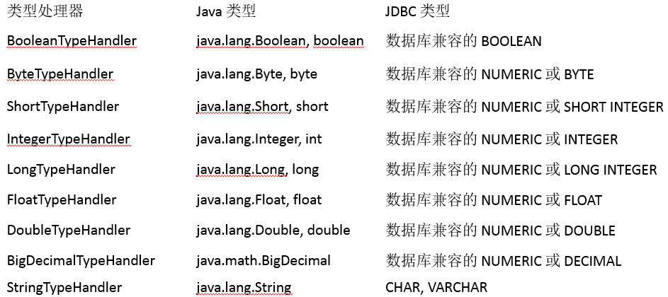
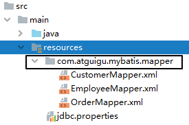
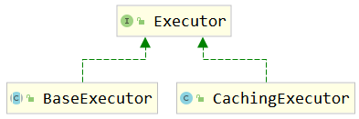
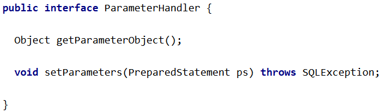
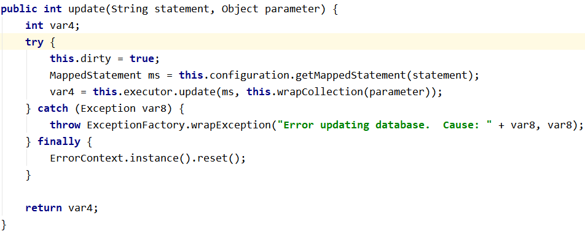
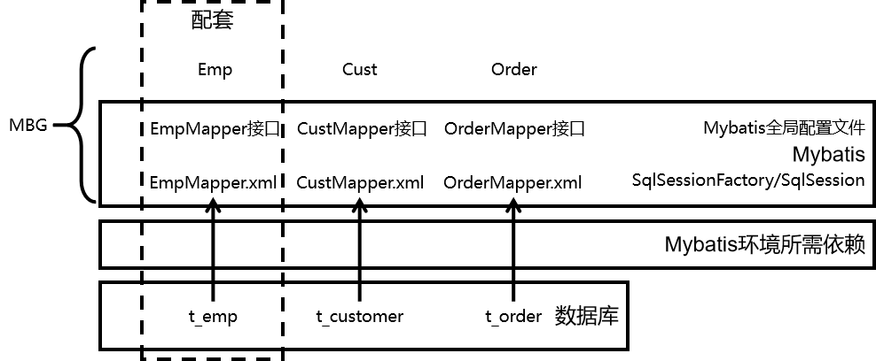

# 第一节 实体类类型别名

## 1、目标

让Mapper配置文件中使用的实体类类型名称更简洁。

## 2、操作

### ①Mybatis全局配置文件

```xml
<!-- 配置类型的别名 -->
<typeAliases>
    <!-- 声明了实体类所在的包之后，在Mapper配置文件中，只需要指定这个包下的简单类名即可 -->
    <package name="com.atguigu.mybatis.entity"/>
</typeAliases>
```

### ②Mapper配置文件

```xml
<!-- Employee selectEmployeeById(Integer empId); -->
<select id="selectEmployeeById" resultType="Employee">
    select emp_id,emp_name,emp_salary,emp_gender,emp_age from t_emp
    where emp_id=#{empId}
</select>
```

## 3、Mybatis内置的类型别名


# 第二节 类型处理器

## 1、Mybatis内置类型处理器

无论是 MyBatis 在预处理语句（PreparedStatement）中设置一个参数时，还是从结果集中取出一个值时，都会用类型处理器将获取的值以合适的方式转换成 Java 类型。

Mybatis提供的内置类型处理器：



## 2、日期时间处理

日期和时间的处理，JDK1.8以前一直是个头疼的问题。我们通常使用 JSR310 规范领导者 Stephen Colebourne 创建的 Joda-Time 来操作。JDK1.8已经实现全部的JSR310 规范了。

Mybatis在日期时间处理的问题上，提供了基于 JSR310（Date and Time API）编写的各种日期时间类型处理器。

MyBatis3.4以前的版本需要我们手动注册这些处理器，以后的版本都是自动注册的。

如需注册，需要下载mybatistypehandlers-jsr310，并通过如下方式注册


## 3、自定义类型处理器

当某个具体类型Mybatis靠内置的类型处理器无法识别时，可以使用Mybatis提供的自定义类型处理器机制。

* 第一步：实现 org.apache.ibatis.type. TypeHandler 接口或者继承 org.apache.ibatis.type. BaseTypeHandler 类。
* 第二步：指定其映射某个JDBC类型（可选操作）。
* 第三步：在Mybatis全局配置文件中注册。

### ①创建自定义类型转换器类

```java
@MappedTypes(value = Address.class)
@MappedJdbcTypes(JdbcType.CHAR)
public class AddressTypeHandler extends BaseTypeHandler<Address> {
    @Override
    public void setNonNullParameter(PreparedStatement preparedStatement, int i, Address address, JdbcType jdbcType) throws SQLException {

    }

    @Override
    public Address getNullableResult(ResultSet resultSet, String columnName) throws SQLException {

        // 1.从结果集中获取原始的地址数据
        String addressOriginalValue = resultSet.getString(columnName);

        // 2.判断原始数据是否有效
        if (addressOriginalValue == null || "".equals(addressOriginalValue))
            return null;

        // 3.如果原始数据有效则执行拆分
        String[] split = addressOriginalValue.split(",");
        String province = split[0];
        String city = split[1];
        String street = split[2];

        // 4.创建Address对象
        Address address = new Address();
        address.setCity(city);
        address.setProvince(province);
        address.setStreet(street);

        return address;
    }

    @Override
    public Address getNullableResult(ResultSet resultSet, int i) throws SQLException {
        return null;
    }

    @Override
    public Address getNullableResult(CallableStatement callableStatement, int i) throws SQLException {
        return null;
    }
}
```

### ②注册自定义类型转换器

在Mybatis全局配置文件中配置：

```xml
<!-- 注册自定义类型转换器 -->
<typeHandlers>
    <typeHandler
                 jdbcType="CHAR"
                 javaType="com.atguigu.mybatis.entity.Address"
                 handler="com.atguigu.mybatis.type.handler.AddressTypeHandler"/>
</typeHandlers>
```


# 第三节 Mapper映射

Mybatis允许在指定Mapper映射文件时，只指定其所在的包：

```xml
<mappers>
		<package name="com.atguigu.mybatis.dao"/>
</mappers>
```

此时这个包下的所有Mapper配置文件将被自动加载、注册，比较方便。

但是，要求是：

* Mapper接口和Mapper配置文件名称一致
* Mapper配置文件放在Mapper接口所在的包内

如果工程是Maven工程，那么Mapper配置文件还是要放在resources目录下：




# 第四节 插件机制

## 1、Mybatis四大对象

### ①Executor



### ②ParameterHandler



### ③ResultSetHandler


### ④StatementHandler


## 2、Mybatis插件机制

插件是MyBatis提供的一个非常强大的机制，我们可以通过插件来修改MyBatis的一些核心行为。插件通过动态代理机制，可以介入四大对象的任何一个方法的执行。著名的Mybatis插件包括 PageHelper（分页插件）、通用 Mapper（SQL生成插件）等。

如果想编写自己的Mybatis插件可以通过实现org.apache.ibatis.plugin. Interceptor接口来完成，表示对Mybatis常规操作进行拦截，加入自定义逻辑。


但是由于插件涉及到Mybatis底层工作机制，在没有足够把握时不要轻易尝试。


# 第五节 Mybatis底层的JDBC封装

org.apache.ibatis.executor.statement. PreparedStatementHandler类：


查找上面目标时，Debug查看源码的切入点是：

org.apache.ibatis.session.defaults. DefaultSqlSession类的update()方法




# 第六节 总结



* Mybatis环境所需依赖 ★
* 配置
  + Mybatis全局配置
  + Mapper配置 ★
* Mapper接口 ★
* API
  + SqlSessionFactory
  + SqlSession
* MBG ★
* 缓存
  + 一级缓存
  + 二级缓存
    - 自带
    - EHCache ☆
* 原理
  + 把配置文件信息封装到Java对象中
  + 缓存底层机制
  + 四大接口
  + Mybatis底层是JDBC

总结的思维导图：

http://naotu.baidu.com/file/3fd32e13c7d4eb4dfadde0544ed905f9?token=27c10bbbf7dfc22e


