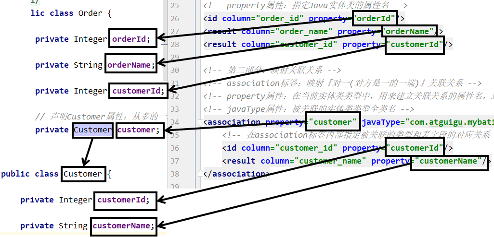
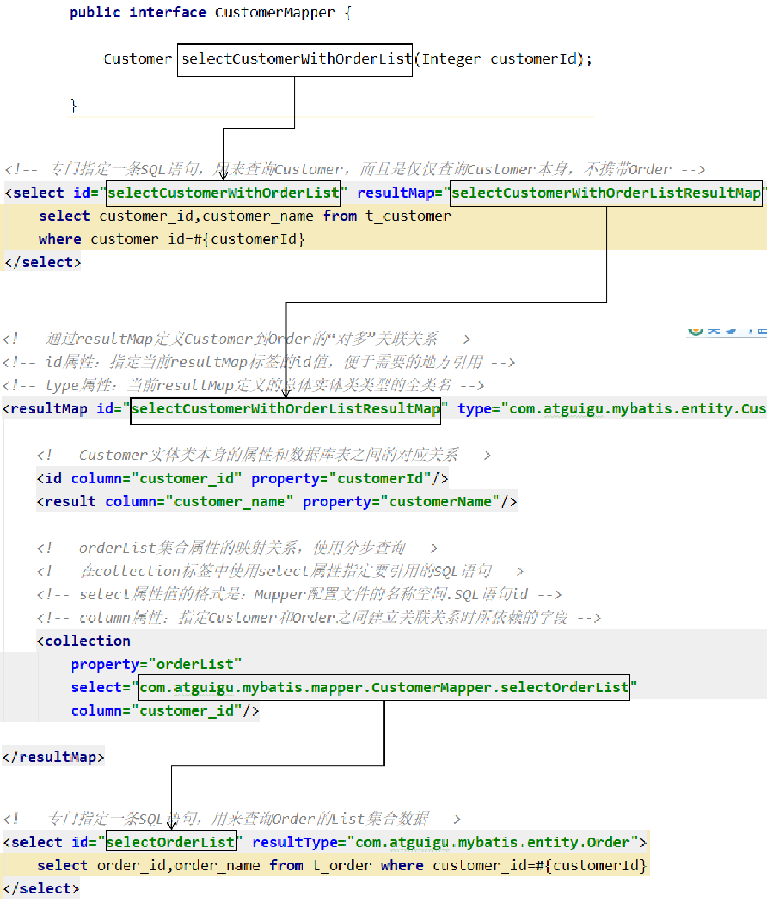

# 第一节 概念

## 1、关联关系概念说明

### ①数量关系

主要体现在数据库表中

* 一对一

  夫妻关系，人和身份证号

* 一对多

  用户和用户的订单，锁和钥匙

* 多对多

  老师和学生，部门和员工

### ②关联关系的方向

主要体现在Java实体类中

* 双向：双方都可以访问到对方
  + Customer：包含Order的集合属性
  + Order：包含单个Customer的属性
* 单向：双方中只有一方能够访问到对方
  + Customer：不包含Order的集合属性，访问不到Order
  + Order：包含单个Customer的属性

## 2、创建模型

### ①创建实体类

```java
public class Customer {

    private Integer customerId;
    private String customerName;
    private List<Order> orderList;// 体现的是对多的关系
```

```java
public class Order {

    private Integer orderId;
    private String orderName;
    private Customer customer;// 体现的是对一的关系
```

### ②创建数据库表插入测试数据

```sql
CREATE TABLE `t_customer` (
	 `customer_id` INT NOT NULL AUTO_INCREMENT,
	 `customer_name` CHAR(100),
	 PRIMARY KEY (`customer_id`)
);
CREATE TABLE `t_order` (
	`order_id` INT NOT NULL AUTO_INCREMENT,
	`order_name` CHAR(100),
	`customer_id` INT,
	PRIMARY KEY (`order_id`)
);
INSERT INTO `t_customer` (`customer_name`) VALUES ('c01');
INSERT INTO `t_order` (`order_name`, `customer_id`) VALUES ('o1', '1');
INSERT INTO `t_order` (`order_name`, `customer_id`) VALUES ('o2', '1');
INSERT INTO `t_order` (`order_name`, `customer_id`) VALUES ('o3', '1');
```

> 实际开发时，一般在开发过程中，不给数据库表设置外键约束。
>
> 原因是避免调试不方便。
>
> 一般是功能开发完成，再加外键约束检查是否有bug。


# 第二节 对一

## 1、创建OrderMapper接口

```java
public interface OrderMapper {

    Order selectOrderWithCustomer(Integer orderId);

}
```

## 2、创建OrderMapper.xml配置文件

```xml
<!-- 创建resultMap实现“对一”关联关系映射 -->
<!-- id属性：通常设置为这个resultMap所服务的那条SQL语句的id加上“ResultMap” -->
<!-- type属性：要设置为这个resultMap所服务的那条SQL语句最终要返回的类型 -->
<resultMap id="selectOrderWithCustomerResultMap" type="com.atguigu.mybatis.entity.Order">

    <!-- 先设置Order自身属性和字段的对应关系 -->
    <id column="order_id" property="orderId"/>
    <result column="order_name" property="orderName"/>

    <!-- 使用association标签配置“对一”关联关系 -->
    <!-- property属性：在Order类中对一的一端进行引用时使用的属性名 -->
    <!-- javaType属性：一的一端类的全类名 -->
    <association property="customer" javaType="com.atguigu.mybatis.entity.Customer">
        <!-- 配置Customer类的属性和字段名之间的对应关系 -->
        <id column="customer_id" property="customerId"/>
        <result column="customer_name" property="customerName"/>
    </association>

</resultMap>

<!-- Order selectOrderWithCustomer(Integer orderId); -->
<select id="selectOrderWithCustomer" resultMap="selectOrderWithCustomerResultMap">
    SELECT order_id,order_name,c.customer_id,customer_name
    FROM t_order o
    LEFT JOIN t_customer c
    ON o.customer_id=c.customer_id
    WHERE o.order_id=#{orderId}
</select>
```

对应关系可以参考下图：



## 3、在Mybatis全局配置文件中注册Mapper配置文件

```xml
<!-- 注册Mapper配置文件：告诉Mybatis我们的Mapper配置文件的位置 -->
<mappers>
    <!-- 在mapper标签的resource属性中指定Mapper配置文件以“类路径根目录”为基准的相对路径 -->
    <mapper resource="com/atguigu/mybatis/mapper/OrderMapper.xml"/>
</mappers>
```

## 4、junit测试程序

```java
@Test
public void testRelationshipToOne() {
    OrderMapper orderMapper = session.getMapper(OrderMapper.class);

    // 查询Order对象，检查是否同时查询了关联的Customer对象
    Order order = orderMapper.selectOrderWithCustomer(2);
    System.out.println("order = " + order);
}
```

## 5、关键词

在“对一”关联关系中，我们的配置比较多，但是关键词就只有：javaType


# 第三节 对多

## 1、创建Mapper接口

```java
public interface CustomerMapper {

    Customer selectCustomerWithOrderList(Integer customerId);

}
```

## 2、创建CustomerMapper.xml配置文件

注意：不要忘记在Mybatis全局配置文件中注册

## 3、配置关联关系和SQL语句

```xml
<!-- 配置resultMap实现从Customer到OrderList的“对多”关联关系 -->
<resultMap id="selectCustomerWithOrderListResultMap"
           type="com.atguigu.mybatis.entity.Customer">

    <!-- 映射Customer本身的属性 -->
    <id column="customer_id" property="customerId"/>
    <result column="customer_name" property="customerName"/>

    <!-- collection标签：映射“对多”的关联关系 -->
    <!-- property属性：在Customer类中，关联“多”的一端的属性名 -->
    <!-- ofType属性：集合属性中元素的类型 -->
    <collection property="orderList" ofType="com.atguigu.mybatis.entity.Order">
        <!-- 映射Order的属性 -->
        <id column="order_id" property="orderId"/>
        <result column="order_name" property="orderName"/>

    </collection>

</resultMap>

<!-- Customer selectCustomerWithOrderList(Integer customerId); -->
<select id="selectCustomerWithOrderList" resultMap="selectCustomerWithOrderListResultMap">
    SELECT c.customer_id,c.customer_name,o.order_id,o.order_name
    FROM t_customer c
    LEFT JOIN t_order o
    ON c.customer_id=o.customer_id
    WHERE c.customer_id=#{customerId}
</select>
```

对应关系可以参考下图：


## 4、junit测试

```java
@Test
public void testRelationshipToMulti() {

    CustomerMapper customerMapper = session.getMapper(CustomerMapper.class);

    // 查询Customer对象同时将关联的Order集合查询出来
    Customer customer = customerMapper.selectCustomerWithOrderList(1);

    System.out.println("customer.getCustomerId() = " + customer.getCustomerId());
    System.out.println("customer.getCustomerName() = " + customer.getCustomerName());

    List<Order> orderList = customer.getOrderList();
    for (Order order : orderList) {
        System.out.println("order = " + order);
    }

}
```

## 5、关键词

在“对多”关联关系中，同样有很多配置，但是提炼出来最关键的就是：“ofType”


# 第四节 分步查询

## 1、概念和需求

为了实现延迟加载，对Customer和Order的查询必须分开，分成两步来做，才能够实现。为此，我们需要单独查询Order，也就是需要在Mapper配置文件中，单独编写查询Order集合数据的SQL语句。

## 2、具体操作

### ①编写查询Customer的SQL语句

```xml
<!-- 专门指定一条SQL语句，用来查询Customer，而且是仅仅查询Customer本身，不携带Order -->
<select id="selectCustomerWithOrderList" resultMap="selectCustomerWithOrderListResultMap">
    select customer_id,customer_name from t_customer
    where customer_id=#{customerId}
</select>
```

### ②编写查询Order的SQL语句

```xml
<select id="selectOrderList" resultType="com.atguigu.mybatis.entity.Order">
    select order_id,order_name from t_order where customer_id=#{customer_id}
</select>
```

### ③引用SQL语句

```xml
<!-- orderList集合属性的映射关系，使用分步查询 -->
<!-- 在collection标签中使用select属性指定要引用的SQL语句 -->
<!-- select属性值的格式是：Mapper配置文件的名称空间.SQL语句id -->
<!-- column属性：指定Customer和Order之间建立关联关系时所依赖的字段 -->
<collection
    property="orderList"
    select="com.atguigu.mybatis.mapper.CustomerMapper.selectOrderList"
    column="customer_id"/>
```

如果Mapper接口中的抽象方法没有改变，那么juni测试也不变。执行结果如下：

```java
DEBUG 11-30 11:10:05,796 ==>  Preparing: select customer_id,customer_name from t_customer where customer_id=?   (BaseJdbcLogger.java:145)
DEBUG 11-30 11:10:05,866 ==> Parameters: 1(Integer)  (BaseJdbcLogger.java:145)
DEBUG 11-30 11:10:05,889 ====>  Preparing: select order_id,order_name from t_order where customer_id=?   (BaseJdbcLogger.java:145)
DEBUG 11-30 11:10:05,890 ====> Parameters: 1(Integer)  (BaseJdbcLogger.java:145)
DEBUG 11-30 11:10:05,895 <====      Total: 3  (BaseJdbcLogger.java:145)
DEBUG 11-30 11:10:05,896 <==      Total: 1  (BaseJdbcLogger.java:145)
customer = c01
order = Order{orderId=1, orderName='o1'}
order = Order{orderId=2, orderName='o2'}
order = Order{orderId=3, orderName='o3'}
```

### ④各个要素之间的对应关系




# 第五节 延迟加载

## 1、概念

查询到Customer的时候，不一定会使用Order的List集合数据。如果Order的集合数据始终没有使用，那么这部分数据占用的内存就浪费了。对此，我们希望不一定会被用到的数据，能够在需要使用的时候再去查询。<br/>

例如：对Customer进行1000次查询中，其中只有15次会用到Order的集合数据，那么就在需要使用时才去查询能够大幅度节约内存空间。<br/>

懒加载。

## 2、配置


### ①较低版本

在Mybatis全局配置文件中配置settings

```xml
<!-- 使用settings对Mybatis全局进行设置 -->
<settings>
    <!-- 开启延迟加载功能：需要配置两个配置项 -->
    <!-- 1、将lazyLoadingEnabled设置为true，开启懒加载功能 -->
    <setting name="lazyLoadingEnabled" value="true"/>

    <!-- 2、将aggressiveLazyLoading设置为false，关闭“积极的懒加载” -->
    <setting name="aggressiveLazyLoading" value="false"/>
</settings>
```

> 官方文档中对aggressiveLazyLoading属性的解释：
>
> When enabled, an object with lazy loaded properties will be loaded entirely upon a call to any of the lazy properties. Otherwise, each property is loaded on demand.

### ②较高版本

```xml
<!-- Mybatis全局配置 -->
<settings>
    <!-- 开启延迟加载功能 -->
    <setting name="lazyLoadingEnabled" value="true"/>
</settings>
```

## 3、修改junit测试

```java
@Test
public void testSelectCustomerWithOrderList() throws InterruptedException {

    CustomerMapper mapper = session.getMapper(CustomerMapper.class);

    Customer customer = mapper.selectCustomerWithOrderList(1);

    // 这里必须只打印“customerId或customerName”这样已经加载的属性才能看到延迟加载的效果
    // 这里如果打印Customer对象整体则看不到效果
    System.out.println("customer = " + customer.getCustomerName());

    // 先指定具体的时间单位，然后再让线程睡一会儿
    TimeUnit.SECONDS.sleep(5);

    List<Order> orderList = customer.getOrderList();

    for (Order order : orderList) {
        System.out.println("order = " + order);
    }
}
```

效果：刚开始先查询Customer本身，需要用到OrderList的时候才发送SQL语句去查询

```java
DEBUG 11-30 11:25:31,127 ==>  Preparing: select customer_id,customer_name from t_customer where customer_id=?   (BaseJdbcLogger.java:145)
DEBUG 11-30 11:25:31,193 ==> Parameters: 1(Integer)  (BaseJdbcLogger.java:145)
DEBUG 11-30 11:25:31,314 <==      Total: 1  (BaseJdbcLogger.java:145)
customer = c01
DEBUG 11-30 11:25:36,316 ==>  Preparing: select order_id,order_name from t_order where customer_id=?   (BaseJdbcLogger.java:145)
DEBUG 11-30 11:25:36,316 ==> Parameters: 1(Integer)  (BaseJdbcLogger.java:145)
DEBUG 11-30 11:25:36,321 <==      Total: 3  (BaseJdbcLogger.java:145)
order = Order{orderId=1, orderName='o1'}
order = Order{orderId=2, orderName='o2'}
order = Order{orderId=3, orderName='o3'}
```

## 4、关键词总结

我们是在“对多”关系中举例说明延迟加载的，在“对一”中配置方式基本一样。

| 关联关系     | 配置项关键词                                                 | 所在配置文件                    |
| ------------ | ------------------------------------------------------------ | ------------------------------- |
| 对一         | association标签/javaType属性                                 | Mapper配置文件中的resultMap     |
| 对多         | collection标签/ofType属性                                    | Mapper配置文件中的resultMap     |
| 对一分步     | association标签/select属性                                   | Mapper配置文件中的resultMap     |
| 对多分步     | collection标签/select属性                                    | Mapper配置文件中的resultMap     |
| 延迟加载[低] | lazyLoadingEnabled设置为true<br />aggressiveLazyLoading设置为false | Mybatis全局配置文件中的settings |
| 延迟加载[高] | lazyLoadingEnabled设置为true                                 | Mybatis全局配置文件中的settings |


# 第六节 多对多关联关系需要中间表

## 1、如果不使用中间表


在某一个表中，使用一个字段保存多个“外键”值，这将导致无法使用SQL语句进行关联查询。

## 2、使用中间表


这样就可以使用SQL进行关联查询了。只是有可能需要三张表进行关联。

## 3、中间表设置主键

### ①方案一：另外设置一个专门的主键字段


### ②方案二：使用联合主键


使用联合主键时，只要多个字段的组合不重复即可，单个字段内部是可以重复的。


