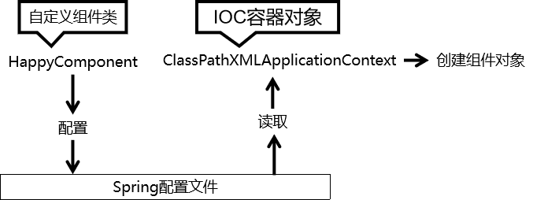
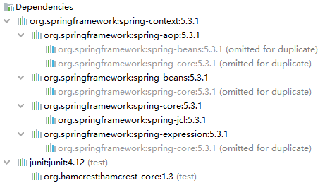
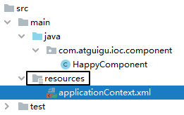
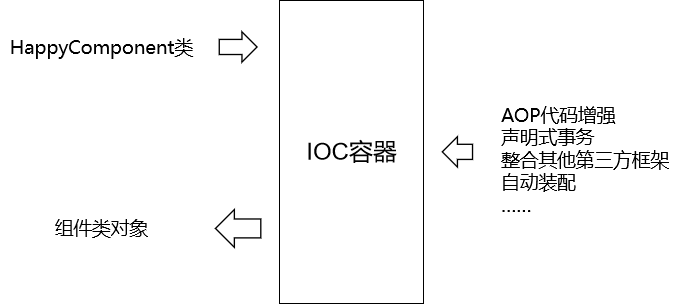
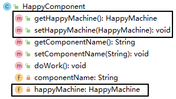
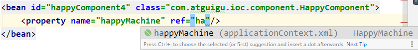
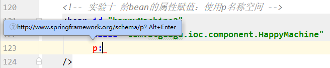
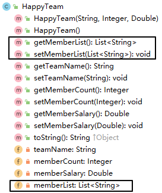

# 实验一 [重要]创建bean

## 1、实验目标和思路

### ①目标

由 Spring 的 IOC 容器创建类的对象。

### ②思路



## 2、创建Maven Module

```xml
<dependencies>
    <!-- 基于Maven依赖传递性，导入spring-context依赖即可导入当前所需所有jar包 -->
    <dependency>
        <groupId>org.springframework</groupId>
        <artifactId>spring-context</artifactId>
        <version>5.3.1</version>
    </dependency>
    <!-- junit测试 -->
    <dependency>
        <groupId>junit</groupId>
        <artifactId>junit</artifactId>
        <version>4.12</version>
        <scope>test</scope>
    </dependency>
</dependencies>
```



## 3、创建组件类

```java
package com.atguigu.ioc.component;

public class HappyComponent {

    public void doWork() {
        System.out.println("component do work ...");
    }

}
```

## 4、创建 Spring 配置文件




## 5、配置组件

```xml
<!-- 实验一 [重要]创建bean -->
<bean id="happyComponent" class="com.atguigu.ioc.component.HappyComponent"/>
```

* bean标签：通过配置bean标签告诉IOC容器需要创建对象的组件是什么
* id属性：bean的唯一标识
* class属性：组件类的全类名

## 6、创建测试类

```java
public class IOCTest {

    // 创建 IOC 容器对象，为便于其他实验方法使用声明为成员变量
    private ApplicationContext iocContainer = new ClassPathXmlApplicationContext("applicationContext.xml");

    @Test
    public void testExperiment01() {

        // 从 IOC 容器对象中获取bean，也就是组件对象
        HappyComponent happyComponent = (HappyComponent) iocContainer.getBean("happyComponent");

        happyComponent.doWork();

    }

}
```

## 7、无参构造器

Spring 底层默认通过反射技术调用组件类的无参构造器来创建组件对象，这一点需要注意。如果在需要无参构造器时，没有无参构造器，则会抛出下面的异常：

> org.springframework.beans.factory. BeanCreationException: Error creating bean with name 'happyComponent1' defined in class path resource [applicationContext.xml]: Instantiation of bean failed;
>
> nested exception is org.springframework.beans. BeanInstantiationException: Failed to instantiate [com.atguigu.ioc.component. HappyComponent]: No default constructor found;
>
> nested exception is java.lang. NoSuchMethodException: `com.atguigu.ioc.component. HappyComponent.<init>()`

所以对一个JavaBean来说，必须存在的，特别是在框架中。

## 8、用IOC容器创建对象和自己建区别



在Spring环境下能够享受到的所有福利，都必须通过 IOC 容器附加到组件类上，所以随着我们在 Spring 中学习的功能越来越多，IOC 容器创建的组件类的对象就会比自己 new 的对象强大的越来越多。


# 实验二 [重要]获取bean

## 1、方式一：根据id获取

由于 id 属性指定了 bean 的唯一标识，所以根据 bean 标签的 id 属性可以精确获取到一个组件对象。上个实验中我们使用的就是这种方式。

## 2、方式二：根据类型获取

### ①指定类型的 bean 唯一

```java
@Test
public void testExperiment02() {

    HappyComponent component = iocContainer.getBean(HappyComponent.class);

    component.doWork();

}
```

### ②指令类型的 bean 不唯一

相同类型的 bean 在IOC容器中一共配置了两个：

```xml
<!-- 实验一 [重要]创建bean -->
<bean id="happyComponent" class="com.atguigu.ioc.component.HappyComponent"/>

<!-- 实验二 [重要]获取bean -->
<bean id="happyComponent2" class="com.atguigu.ioc.component.HappyComponent"/>
```

根据类型获取时会抛出异常：

> org.springframework.beans.factory. NoUniqueBeanDefinitionException: No qualifying bean of type 'com.atguigu.ioc.component. HappyComponent' available: expected single matching bean but found 2: happyComponent, happyComponent2

### ③思考

如果组件类实现了接口，根据接口类型可以获取 bean 吗？

> 可以，前提是bean唯一

如果一个接口有多个实现类，这些实现类都配置了 bean，根据接口类型可以获取 bean 吗？

> 不行，因为bean不唯一

### ④结论

根据类型来获取bean时，在满足bean唯一性的前提下，其实只是看：『对象 instanceof 指定的类型』的返回结果，只要返回的是true就可以认定为和类型匹配，能够获取到。

[上一个实验](experiment01.html) [回目录](../verse03.html) [下一个实验](experiment03.html)

# 实验三 [重要]给bean的属性赋值：setter注入

## 1、给组件类添加一个属性

```java
public class HappyComponent {

    private String componentName;

    public String getComponentName() {
        return componentName;
    }

    public void setComponentName(String componentName) {
        this.componentName = componentName;
    }

    public void doWork() {
        System.out.println("component do work ...");
    }

}
```

## 2、在配置时给属性指定值

通过property标签配置的属性值会通过setXxx()方法注入，大家可以通过debug方式验证一下

```xml
<!-- 实验三 [重要]给bean的属性赋值：setter注入 -->
<bean id="happyComponent3" class="com.atguigu.ioc.component.HappyComponent">

    <!-- property标签：通过组件类的setXxx()方法给组件对象设置属性 -->
    <!-- name属性：指定属性名（这个属性名是getXxx()、setXxx()方法定义的，和成员变量无关） -->
    <!-- value属性：指定属性值 -->
    <property name="componentName" value="veryHappy"/>
</bean>
```

## 3、测试

```java
@Test
public void testExperiment03() {

    HappyComponent happyComponent3 = (HappyComponent) iocContainer.getBean("happyComponent3");

    String componentName = happyComponent3.getComponentName();

    System.out.println("componentName = " + componentName);

}
```

[上一个实验](experiment02.html) [回目录](../verse03.html) [下一个实验](experiment04.html)

# 实验四 [重要]给bean的属性赋值：引用外部已声明的bean

## 1、声明新的组件类

```java
public class HappyMachine {

    private String machineName;

    public String getMachineName() {
        return machineName;
    }

    public void setMachineName(String machineName) {
        this.machineName = machineName;
    }
}
```

## 2、原组件引用新组件



## 3、配置新组件的 bean

```xml
<bean id="happyMachine" class="com.atguigu.ioc.component.HappyMachine">
    <property name="machineName" value="makeHappy"
</bean>
```

## 4、在原组件的 bean 中引用新组件的 bean

```xml
<bean id="happyComponent4" class="com.atguigu.ioc.component.HappyComponent">
    <!-- ref 属性：通过 bean 的 id 引用另一个 bean -->
    <property name="happyMachine" ref="happyMachine"/>
</bean>
```

这个操作在 IDEA 中有提示：



## 5、测试

```java
@Test
public void testExperiment04() {
    HappyComponent happyComponent4 = (HappyComponent) iocContainer.getBean("happyComponent4");

    HappyMachine happyMachine = happyComponent4.getHappyMachine();

    String machineName = happyMachine.getMachineName();

    System.out.println("machineName = " + machineName);
}
```

## 6、易错点

> 如果错把ref属性写成了value属性，会抛出异常：
> Caused by: java.lang. IllegalStateException: Cannot convert value of type 'java.lang. String' to required type 'com.atguigu.ioc.component. HappyMachine' for property 'happyMachine': no matching editors or conversion strategy found
> 意思是不能把String类型转换成我们要的HappyMachine类型
> 说明我们使用value属性时，Spring只把这个属性看做一个普通的字符串，不会认为这是一个bean的id，更不会根据它去找到bean来赋值

[上一个实验](experiment03.html) [回目录](../verse03.html) [下一个实验](experiment05.html)

# 实验五 [重要]给bean的属性赋值：内部bean

## 1、重新配置原组件

在bean里面配置的bean就是内部bean，内部bean只能在当前bean内部使用，在其他地方不能使用。

```xml
<!-- 实验五 [重要]给bean的属性赋值：内部bean -->
<bean id="happyComponent5" class="com.atguigu.ioc.component.HappyComponent">
    <property name="happyMachine">
        <!-- 在一个 bean 中再声明一个 bean 就是内部 bean -->
        <!-- 内部 bean 可以直接用于给属性赋值，可以省略 id 属性 -->
        <bean class="com.atguigu.ioc.component.HappyMachine">
            <property name="machineName" value="makeHappy"/>
        </bean>
    </property>
</bean>
```

## 2、测试

```java
@Test
public void testExperiment04() {
    HappyComponent happyComponent4 = (HappyComponent) iocContainer.getBean("happyComponent4");

    HappyMachine happyMachine = happyComponent4.getHappyMachine();

    String machineName = happyMachine.getMachineName();

    System.out.println("machineName = " + machineName);
}
```

[上一个实验](experiment04.html) [回目录](../verse03.html) [下一个实验](experiment06.html)

# 实验六 [重要]给bean的属性赋值：引入外部属性文件

## 1、加入依赖

```xml
        <!-- MySQL驱动 -->
        <dependency>
            <groupId>mysql</groupId>
            <artifactId>mysql-connector-java</artifactId>
            <version>5.1.3</version>
        </dependency>
        <!-- 数据源 -->
        <dependency>
            <groupId>com.alibaba</groupId>
            <artifactId>druid</artifactId>
            <version>1.0.31</version>
        </dependency>
```

## 2、创建外部属性文件


```properties
jdbc.user=root
jdbc.password=atguigu
jdbc.url=jdbc:mysql://192.168.198.100:3306/mybatis-example
jdbc.driver=com.mysql.jdbc.Driver
```

## 3、引入

```xml
    <!-- 引入外部属性文件 -->
    <context:property-placeholder location="classpath:jdbc.properties"/>
```

## 4、使用

```xml
<!-- 实验六 [重要]给bean的属性赋值：引入外部属性文件 -->
<bean id="druidDataSource" class="com.alibaba.druid.pool.DruidDataSource">
    <property name="url" value="${jdbc.url}"/>
    <property name="driverClassName" value="${jdbc.driver}"/>
    <property name="username" value="${jdbc.user}"/>
    <property name="password" value="${jdbc.password}"/>
</bean>
```

## 5、测试

```java
@Test
public void testExperiment06() throws SQLException {
    DataSource dataSource = iocContainer.getBean(DataSource.class);

    Connection connection = dataSource.getConnection();

    System.out.println("connection = " + connection);
}
```

[上一个实验](experiment05.html) [回目录](../verse03.html) [下一个实验](experiment07.html)

# 实验七 给bean的属性赋值：级联属性赋值

## 1、配置关联对象的 bean

```xml
<bean id="happyMachine2" class="com.atguigu.ioc.component.HappyMachine"/>
```

## 2、装配关联对象并赋值级联属性

关联对象：happyMachine

级联属性：happyMachine.machineName

```xml
<!-- 实验七 给bean的属性赋值：级联属性赋值 -->
<bean id="happyComponent6" class="com.atguigu.ioc.component.HappyComponent">
    <!-- 装配关联对象 -->
    <property name="happyMachine" ref="happyMachine2"/>
    <!-- 对HappyComponent来说，happyMachine的machineName属性就是级联属性 -->
    <property name="happyMachine.machineName" value="cascadeValue"/>
</bean>
```

## 3、测试

```java
@Test
public void testExperiment07() {

    HappyComponent happyComponent6 = (HappyComponent) iocContainer.getBean("happyComponent6");

    String machineName = happyComponent6.getHappyMachine().getMachineName();

    System.out.println("machineName = " + machineName);

}
```

[上一个实验](experiment06.html) [回目录](../verse03.html) [下一个实验](experiment08.html)

# 实验八 给bean的属性赋值：构造器注入

## 1、声明组件类

```java
package com.atguigu.ioc.component;

public class HappyTeam {

    private String teamName;
    private Integer memberCount;
    private Double memberSalary;

    public String getTeamName() {
        return teamName;
    }

    public void setTeamName(String teamName) {
        this.teamName = teamName;
    }

    public Integer getMemberCount() {
        return memberCount;
    }

    public void setMemberCount(Integer memberCount) {
        this.memberCount = memberCount;
    }

    public Double getMemberSalary() {
        return memberSalary;
    }

    public void setMemberSalary(Double memberSalary) {
        this.memberSalary = memberSalary;
    }

    @Override
    public String toString() {
        return "HappyTeam{" +
                "teamName='" + teamName + '\'' +
                ", memberCount=" + memberCount +
                ", memberSalary=" + memberSalary +
                '}';
    }

    public HappyTeam(String teamName, Integer memberCount, Double memberSalary) {
        this.teamName = teamName;
        this.memberCount = memberCount;
        this.memberSalary = memberSalary;
    }

    public HappyTeam() {
    }
}
```

## 2、配置

```xml
<!-- 实验八 给bean的属性赋值：构造器注入 -->
<bean id="happyTeam" class="com.atguigu.ioc.component.HappyTeam">
    <constructor-arg value="happyCorps"/>
    <constructor-arg value="10"/>
    <constructor-arg value="1000.55"/>
</bean>
```

## 3、测试

```java
@Test
public void testExperiment08() {

    HappyTeam happyTeam = iocContainer.getBean(HappyTeam.class);

    System.out.println("happyTeam = " + happyTeam);

}
```

## 4、补充

constructor-arg标签还有两个属性可以进一步描述构造器参数：

* index属性：指定参数所在位置的索引（从0开始）
* name属性：指定参数名

[上一个实验](experiment07.html) [回目录](../verse03.html) [下一个实验](experiment09.html)

# 实验九 给bean的属性赋值：特殊值处理

## 1、声明一个类用于测试

```java
package com.atguigu.ioc.component;

public class PropValue {

    private String commonValue;
    private String expression;

    public String getCommonValue() {
        return commonValue;
    }

    public void setCommonValue(String commonValue) {
        this.commonValue = commonValue;
    }

    public String getExpression() {
        return expression;
    }

    public void setExpression(String expression) {
        this.expression = expression;
    }

    @Override
    public String toString() {
        return "PropValue{" +
                "commonValue='" + commonValue + '\'' +
                ", expression='" + expression + '\'' +
                '}';
    }

    public PropValue(String commonValue, String expression) {
        this.commonValue = commonValue;
        this.expression = expression;
    }

    public PropValue() {
    }
}
```

## 2、字面量

### ①用Java代码举例说明

字面量是相对于变量来说的。看下面的代码：

```java
int a = 10;
```

声明一个变量a，初始化为10，此时a就不代表字母a了，而是作为一个变量的名字。当我们引用a的时候，我们实际上拿到的值是10。

而如果a是带引号的：'a'，那么它现在不是一个变量，它就是代表a这个字母本身，这就是字面量。所以字面量没有引申含义，就是我们看到的这个数据本身。

### ②Spring配置文件中举例

#### [1]字面量举例

```xml
<!-- 使用value属性给bean的属性赋值时，Spring会把value属性的值看做字面量 -->
<property name="commonValue" value="hello"/>
```

#### [2]类似变量举例

```xml
<!-- 使用ref属性给bean的属性复制是，Spring会把ref属性的值作为一个bean的id来处理 -->
<!-- 此时ref属性的值就不是一个普通的字符串了，它应该是一个bean的id -->
<property name="happyMachine" ref="happyMachine"/>
```

## 3、null值

```xml
        <property name="commonValue">
            <!-- null标签：将一个属性值明确设置为null -->
            <null/>
        </property>
```

## 4、XML实体

```xml
<!-- 实验九 给bean的属性赋值：特殊值处理 -->
<bean id="propValue" class="com.atguigu.ioc.component.PropValue">
    <!-- 小于号在XML文档中用来定义标签的开始，不能随便使用 -->
    <!-- 解决方案一：使用XML实体来代替 -->
    <property name="expression" value="a &lt; b"/>
</bean>
```

## 5、CDATA节

```xml
<!-- 实验九 给bean的属性赋值：特殊值处理 -->
<bean id="propValue" class="com.atguigu.ioc.component.PropValue">
    <property name="expression">
        <!-- 解决方案二：使用CDATA节 -->
        <!-- CDATA中的C代表Character，是文本、字符的含义，CDATA就表示纯文本数据 -->
        <!-- XML解析器看到CDATA节就知道这里是纯文本，就不会当作XML标签或属性来解析 -->
        <!-- 所以CDATA节中写什么符号都随意 -->
        <value><![CDATA[a < b]]></value>
    </property>
</bean>
```

[上一个实验](experiment08.html) [回目录](../verse03.html) [下一个实验](experiment10.html)

# 实验十 给bean的属性赋值：使用p名称空间

## 1、配置

使用 p 名称空间的方式可以省略子标签 property，将组件属性的设置作为 bean 标签的属性来完成。

```xml
<!-- 实验十 给bean的属性赋值：使用p名称空间 -->
<bean id="happyMachine3"
      class="com.atguigu.ioc.component.HappyMachine"
      p:machineName="goodMachine"
/>
```

使用 p 名称空间需要导入相关的 XML 约束，在 IDEA 的协助下导入即可：

```xml
<?xml version="1.0" encoding="UTF-8"?>
<beans xmlns="http://www.springframework.org/schema/beans"
       xmlns:xsi="http://www.w3.org/2001/XMLSchema-instance"
       xmlns:context="http://www.springframework.org/schema/context" xmlns:p="http://www.springframework.org/schema/p"
       xsi:schemaLocation="http://www.springframework.org/schema/beans http://www.springframework.org/schema/beans/spring-beans.xsd http://www.springframework.org/schema/context https://www.springframework.org/schema/context/spring-context.xsd">
```

具体操作时，输入p: 稍微等一下，等IDEA弹出下面的提示：



按Alt+Enter即可导入。

## 2、测试

```java
@Test
public void testExperiment10() {
    HappyMachine happyMachine3 = (HappyMachine) iocContainer.getBean("happyMachine3");

    String machineName = happyMachine3.getMachineName();

    System.out.println("machineName = " + machineName);
}
```

[上一个实验](experiment09.html) [回目录](../verse03.html) [下一个实验](experiment11.html)

# 实验十一 给bean的属性赋值：集合属性

## 1、给组件类添加属性



## 2、配置

```xml
<!-- 实验十三 集合类型的bean -->
<bean id="happyTeam2" class="com.atguigu.ioc.component.HappyTeam">
    <property name="memberList">
        <list>
            <value>member01</value>
            <value>member02</value>
            <value>member03</value>
        </list>
    </property>
</bean>
```

## 3、测试

```java
@Test
public void testExperiment13() {

    HappyTeam happyTeam2 = (HappyTeam) iocContainer.getBean("happyTeam2");

    List<String> memberList = happyTeam2.getMemberList();

    for (String member : memberList) {
        System.out.println("member = " + member);
    }

}
```

## 4、其他变化形式

```xml
<!-- 实验十一 给bean的属性赋值：集合属性 -->
<bean id="happyTeam2" class="com.atguigu.ioc.component.HappyTeam">
    <property name="memberNameList">
        <!-- list标签：准备一组集合类型的数据，给集合属性赋值 -->
        <!--<list>
            <value>member01</value>
            <value>member02</value>
            <value>member03</value>
        </list>-->
        <!-- 使用set标签也能实现相同效果，只是附带了去重功能 -->
        <!--<set>
            <value>member01</value>
            <value>member02</value>
            <value>member02</value>
        </set>-->
        <!-- array也同样兼容 -->
        <array>
            <value>member01</value>
            <value>member02</value>
            <value>member02</value>
        </array>
    </property>
    <property name="managerList">
        <!-- 给Map类型的属性赋值 -->
        <!--<map>
            <entry key="财务部" value="张三"/>
            <entry key="行政部" value="李四"/>
            <entry key="销售部" value="王五"/>
        </map>-->
        <!-- 也可以使用props标签 -->
        <props>
            <prop key="财务部">张三2</prop>
            <prop key="行政部">李四2</prop>
            <prop key="销售部">王五2</prop>
        </props>
    </property>
</bean>
```

[上一个实验](experiment12.html) [回目录](../verse03.html) [下一个实验](experiment14.html)

# 实验十二 自动装配

## 1、声明组件类

其中HappyController需要用到HappyService。所谓自动装配就是一个组件需要其他组件时，由 IOC 容器负责找到那个需要的组件，并装配进去。

```java
public class HappyController {

    private HappyService happyService;

    public HappyService getHappyService() {
        return happyService;
    }

    public void setHappyService(HappyService happyService) {
        this.happyService = happyService;
    }
}
```

```java
public class HappyService {
}
```

## 2、配置

```xml
<!-- 实验十二 自动装配 -->
<bean id="happyService3" class="com.atguigu.ioc.component.HappyService"/>
<bean id="happyService2" class="com.atguigu.ioc.component.HappyService"/>

<!-- 使用bean标签的autowire属性设置自动装配效果 -->
<!-- byType表示根据类型进行装配，此时如果类型匹配的bean不止一个，那么会抛NoUniqueBeanDefinitionException -->
<!-- byName表示根据bean的id进行匹配。而bean的id是根据需要装配组件的属性的属性名来确定的 -->
<bean id="happyController"
      class="com.atguigu.ioc.component.HappyController"
      autowire="byName"
>
    <!-- 手动装配：在property标签中使用ref属性明确指定要装配的bean -->
    <!--<property name="happyService" ref="happyService"/>-->
</bean>
```

## 3、测试

```java
@Test
public void testExperiment12() {
    HappyController happyController = iocContainer.getBean(HappyController.class);

    HappyService happyService = happyController.getHappyService();

    System.out.println("happyService = " + happyService);
}
```

[上一个实验](experiment11.html) [回目录](../verse03.html) [下一个实验](experiment13.html)

# 实验十三 集合类型的bean

## 1、配置

```xml
<!-- 实验十一 给bean的属性赋值：集合属性 -->
<util:list id="machineList">
    <bean class="com.atguigu.ioc.component.HappyMachine">
        <property name="machineName" value="machineOne"/>
    </bean>
    <bean class="com.atguigu.ioc.component.HappyMachine">
        <property name="machineName" value="machineTwo"/>
    </bean>
    <bean class="com.atguigu.ioc.component.HappyMachine">
        <property name="machineName" value="machineThree"/>
    </bean>
</util:list>
```

## 2、测试

```java
@Test
public void testExperiment11() {
    List<HappyMachine> machineList = (List<HappyMachine>) iocContainer.getBean("machineList");
    for (HappyMachine happyMachine : machineList) {
        System.out.println("happyMachine = " + happyMachine);
    }
}
```

[上一个实验](experiment10.html) [回目录](../verse03.html) [下一个实验](experiment12.html)

# 实验十四 FactoryBean机制

## 1、简介

FactoryBean是Spring提供的一种整合第三方框架的常用机制。和普通的bean不同，配置一个FactoryBean类型的bean，在获取bean的时候得到的并不是class属性中配置的这个类的对象，而是getObject()方法的返回值。通过这种机制，Spring可以帮我们把复杂组件创建的详细过程和繁琐细节都屏蔽起来，只把最简洁的使用界面展示给我们。

将来我们整合Mybatis时，Spring就是通过FactoryBean机制来帮我们创建SqlSessionFactory对象的。

```java
/*
 * Copyright 2002-2020 the original author or authors.
 *
 * Licensed under the Apache License, Version 2.0 (the "License");
 * you may not use this file except in compliance with the License.
 * You may obtain a copy of the License at
 *
 *      https://www.apache.org/licenses/LICENSE-2.0
 *
 * Unless required by applicable law or agreed to in writing, software
 * distributed under the License is distributed on an "AS IS" BASIS,
 * WITHOUT WARRANTIES OR CONDITIONS OF ANY KIND, either express or implied.
 * See the License for the specific language governing permissions and
 * limitations under the License.
 */

package org.springframework.beans.factory;

import org.springframework.lang.Nullable;

/**
 * Interface to be implemented by objects used within a {@link BeanFactory} which
 * are themselves factories for individual objects. If a bean implements this
 * interface, it is used as a factory for an object to expose, not directly as a
 * bean instance that will be exposed itself.
 *
 * <p><b>NB: A bean that implements this interface cannot be used as a normal bean.</b>
 * A FactoryBean is defined in a bean style, but the object exposed for bean
 * references ({@link #getObject()}) is always the object that it creates.
 *
 * <p>FactoryBeans can support singletons and prototypes, and can either create
 * objects lazily on demand or eagerly on startup. The {@link SmartFactoryBean}
 * interface allows for exposing more fine-grained behavioral metadata.
 *
 * <p>This interface is heavily used within the framework itself, for example for
 * the AOP {@link org.springframework.aop.framework.ProxyFactoryBean} or the
 * {@link org.springframework.jndi.JndiObjectFactoryBean}. It can be used for
 * custom components as well; however, this is only common for infrastructure code.
 *
 * <p><b>{@code FactoryBean} is a programmatic contract. Implementations are not
 * supposed to rely on annotation-driven injection or other reflective facilities.</b>
 * {@link #getObjectType()} {@link #getObject()} invocations may arrive early in the
 * bootstrap process, even ahead of any post-processor setup. If you need access to
 * other beans, implement {@link BeanFactoryAware} and obtain them programmatically.
 *
 * <p><b>The container is only responsible for managing the lifecycle of the FactoryBean
 * instance, not the lifecycle of the objects created by the FactoryBean.</b> Therefore,
 * a destroy method on an exposed bean object (such as {@link java.io.Closeable#close()}
 * will <i>not</i> be called automatically. Instead, a FactoryBean should implement
 * {@link DisposableBean} and delegate any such close call to the underlying object.
 *
 * <p>Finally, FactoryBean objects participate in the containing BeanFactory's
 * synchronization of bean creation. There is usually no need for internal
 * synchronization other than for purposes of lazy initialization within the
 * FactoryBean itself (or the like).
 *
 * @author Rod Johnson
 * @author Juergen Hoeller
 * @since 08.03.2003
 * @param <T> the bean type
 * @see org.springframework.beans.factory.BeanFactory
 * @see org.springframework.aop.framework.ProxyFactoryBean
 * @see org.springframework.jndi.JndiObjectFactoryBean
 */
public interface FactoryBean<T> {

	/**
	 * The name of an attribute that can be
	 * {@link org.springframework.core.AttributeAccessor#setAttribute set} on a
	 * {@link org.springframework.beans.factory.config.BeanDefinition} so that
	 * factory beans can signal their object type when it can't be deduced from
	 * the factory bean class.
	 * @since 5.2
	 */
	String OBJECT_TYPE_ATTRIBUTE = "factoryBeanObjectType";

	/**
	 * Return an instance (possibly shared or independent) of the object
	 * managed by this factory.
	 * <p>As with a {@link BeanFactory}, this allows support for both the
	 * Singleton and Prototype design pattern.
	 * <p>If this FactoryBean is not fully initialized yet at the time of
	 * the call (for example because it is involved in a circular reference),
	 * throw a corresponding {@link FactoryBeanNotInitializedException}.
	 * <p>As of Spring 2.0, FactoryBeans are allowed to return {@code null}
	 * objects. The factory will consider this as normal value to be used; it
	 * will not throw a FactoryBeanNotInitializedException in this case anymore.
	 * FactoryBean implementations are encouraged to throw
	 * FactoryBeanNotInitializedException themselves now, as appropriate.
	 * @return an instance of the bean (can be {@code null})
	 * @throws Exception in case of creation errors
	 * @see FactoryBeanNotInitializedException
	 */
	@Nullable
	T getObject() throws Exception;

	/**
	 * Return the type of object that this FactoryBean creates,
	 * or {@code null} if not known in advance.
	 * <p>This allows one to check for specific types of beans without
	 * instantiating objects, for example on autowiring.
	 * <p>In the case of implementations that are creating a singleton object,
	 * this method should try to avoid singleton creation as far as possible;
	 * it should rather estimate the type in advance.
	 * For prototypes, returning a meaningful type here is advisable too.
	 * <p>This method can be called <i>before</i> this FactoryBean has
	 * been fully initialized. It must not rely on state created during
	 * initialization; of course, it can still use such state if available.
	 * <p><b>NOTE:</b> Autowiring will simply ignore FactoryBeans that return
	 * {@code null} here. Therefore it is highly recommended to implement
	 * this method properly, using the current state of the FactoryBean.
	 * @return the type of object that this FactoryBean creates,
	 * or {@code null} if not known at the time of the call
	 * @see ListableBeanFactory#getBeansOfType
	 */
	@Nullable
	Class<?> getObjectType();

	/**
	 * Is the object managed by this factory a singleton? That is,
	 * will {@link #getObject()} always return the same object
	 * (a reference that can be cached)?
	 * <p><b>NOTE:</b> If a FactoryBean indicates to hold a singleton object,
	 * the object returned from {@code getObject()} might get cached
	 * by the owning BeanFactory. Hence, do not return {@code true}
	 * unless the FactoryBean always exposes the same reference.
	 * <p>The singleton status of the FactoryBean itself will generally
	 * be provided by the owning BeanFactory; usually, it has to be
	 * defined as singleton there.
	 * <p><b>NOTE:</b> This method returning {@code false} does not
	 * necessarily indicate that returned objects are independent instances.
	 * An implementation of the extended {@link SmartFactoryBean} interface
	 * may explicitly indicate independent instances through its
	 * {@link SmartFactoryBean#isPrototype()} method. Plain {@link FactoryBean}
	 * implementations which do not implement this extended interface are
	 * simply assumed to always return independent instances if the
	 * {@code isSingleton()} implementation returns {@code false}.
	 * <p>The default implementation returns {@code true}, since a
	 * {@code FactoryBean} typically manages a singleton instance.
	 * @return whether the exposed object is a singleton
	 * @see #getObject()
	 * @see SmartFactoryBean#isPrototype()
	 */
	default boolean isSingleton() {
		return true;
	}

}
```

## 2、实现FactoryBean接口

```java
// 实现FactoryBean接口时需要指定泛型
// 泛型类型就是当前工厂要生产的对象的类型
public class HappyFactoryBean implements FactoryBean<HappyMachine> {

    private String machineName;

    public String getMachineName() {
        return machineName;
    }

    public void setMachineName(String machineName) {
        this.machineName = machineName;
    }

    @Override
    public HappyMachine getObject() throws Exception {

        // 方法内部模拟创建、设置一个对象的复杂过程
        HappyMachine happyMachine = new HappyMachine();

        happyMachine.setMachineName(this.machineName);

        return happyMachine;
    }

    @Override
    public Class<?> getObjectType() {

        // 返回要生产的对象的类型
        return HappyMachine.class;
    }
}
```

## 3、配置bean

```xml
<!-- 实验十四 FactoryBean机制 -->
<!-- 这个bean标签中class属性指定的是HappyFactoryBean，但是将来从这里获取的bean是HappyMachine对象 -->
<bean id="happyMachine3" class="com.atguigu.ioc.factory.HappyFactoryBean">
    <!-- property标签仍然可以用来通过setXxx()方法给属性赋值 -->
    <property name="machineName" value="iceCreamMachine"/>
</bean>
```

## 4、测试获取bean

* 配置的bean：HappyFactoryBean
* 获取bean后得到的bean：HappyMachine

```java
@Test
public void testExperiment14() {
    HappyMachine happyMachine3 = (HappyMachine) iocContainer.getBean("happyMachine3");

    String machineName = happyMachine3.getMachineName();

    System.out.println("machineName = " + machineName);
}
```

[上一个实验](experiment13.html) [回目录](../verse03.html) [下一个实验](experiment15.html)

# 实验十五 bean的作用域

## 1、概念

在Spring中可以通过配置bean标签的scope属性来指定bean的作用域范围，各取值含义参加下表：

| 取值      | 含义                                    | 创建对象的时机  |
| --------- | --------------------------------------- | --------------- |
| singleton | 在IOC容器中，这个bean的对象始终为单实例 | IOC容器初始化时 |
| prototype | 这个bean在IOC容器中有多个实例           | 获取bean时      |

如果是在WebApplicationContext环境下还会有另外两个作用域（但不常用）：

| 取值    | 含义                 |
| ------- | -------------------- |
| request | 在一个请求范围内有效 |
| session | 在一个会话范围内有效 |

## 2、配置

```xml
<!-- 实验十五 bean的作用域 -->
<!-- scope属性：取值singleton（默认值），bean在IOC容器中只有一个实例，IOC容器初始化时创建对象 -->
<!-- scope属性：取值prototype，bean在IOC容器中可以有多个实例，getBean()时创建对象 -->
<bean id="happyMachine4" scope="prototype" class="com.atguigu.ioc.component.HappyMachine">
    <property name="machineName" value="iceCreamMachine"/>
</bean>
```

## 3、测试

```java
@Test
public void testExperiment15() {
    HappyMachine happyMachine01 = (HappyMachine) iocContainer.getBean("happyMachine4");
    HappyMachine happyMachine02 = (HappyMachine) iocContainer.getBean("happyMachine4");

    System.out.println(happyMachine01 == happyMachine02);

    System.out.println("happyMachine01.hashCode() = " + happyMachine01.hashCode());
    System.out.println("happyMachine02.hashCode() = " + happyMachine02.hashCode());
}
```

[上一个实验](experiment14.html) [回目录](../verse03.html) [下一个实验](experiment16.html)

# 实验十六 bean的生命周期

## 1、bean的生命周期清单

* bean对象创建（调用无参构造器）
* 给bean对象设置属性
* bean对象初始化之前操作（由bean的后置处理器负责）
* bean对象初始化（需在配置bean时指定初始化方法）
* bean对象初始化之后操作（由bean的后置处理器负责）
* bean对象就绪可以使用
* bean对象销毁（需在配置bean时指定销毁方法）
* IOC容器关闭

## 2、指定bean的初始化方法和销毁方法

### ①创建两个方法作为初始化和销毁方法

用com.atguigu.ioc.component. HappyComponent类测试：

```java
public void happyInitMethod() {
    System.out.println("HappyComponent初始化");
}

public void happyDestroyMethod() {
    System.out.println("HappyComponent销毁");
}
```

### ②配置bean时指定初始化和销毁方法

```xml
<!-- 实验十六 bean的生命周期 -->
<!-- 使用init-method属性指定初始化方法 -->
<!-- 使用destroy-method属性指定销毁方法 -->
<bean id="happyComponent"
      class="com.atguigu.ioc.component.HappyComponent"
      init-method="happyInitMethod"
      destroy-method="happyDestroyMethod"
>
    <property name="happyName" value="uuu"/>
</bean>
```

## 3、bean的后置处理器

### ①创建后置处理器类

```java
package com.atguigu.ioc.process;

import org.springframework.beans.BeansException;
import org.springframework.beans.factory.config.BeanPostProcessor;

// 声明一个自定义的bean后置处理器
// 注意：bean后置处理器不是单独针对某一个bean生效，而是针对IOC容器中所有bean都会执行
public class MyHappyBeanProcessor implements BeanPostProcessor {

    @Override
    public Object postProcessBeforeInitialization(Object bean, String beanName) throws BeansException {

        System.out.println("☆☆☆" + beanName + " = " + bean);

        return bean;
    }

    @Override
    public Object postProcessAfterInitialization(Object bean, String beanName) throws BeansException {

        System.out.println("★★★" + beanName + " = " + bean);

        return bean;
    }
}
```

### ②把bean的后置处理器放入IOC容器

```xml
<!-- bean的后置处理器要放入IOC容器才能生效 -->
<bean id="myHappyBeanProcessor" class="com.atguigu.ioc.process.MyHappyBeanProcessor"/>
```

### ③执行效果示例

> HappyComponent创建对象
> HappyComponent要设置属性了
> ☆☆☆happyComponent = com.atguigu.ioc.component. HappyComponent@ca263c2
> HappyComponent初始化
> ★★★happyComponent = com.atguigu.ioc.component. HappyComponent@ca263c2
> HappyComponent销毁

[上一个实验](experiment15.html) [回目录](../verse03.html)
