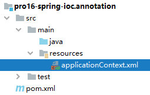
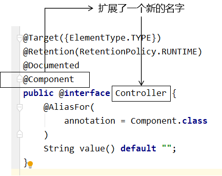
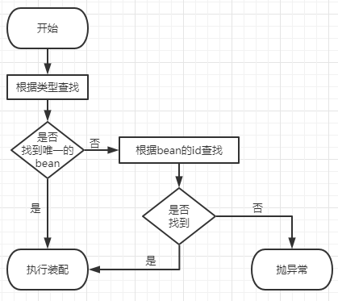

# 第一个实验 [重要]标记与扫描

## 1、注解的作用

### ①注解

和 XML 配置文件一样，注解本身并不能执行，注解本身仅仅只是做一个标记，具体的功能是框架检测到注解标记的位置，然后针对这个位置按照注解标记的功能来执行具体操作。

本质上：所有一切的操作都是Java代码来完成的，XML和注解只是告诉框架中的Java代码如何执行。

举例：元旦联欢会要布置教室，蓝色的地方贴上元旦快乐四个字，红色的地方贴上拉花，黄色的地方贴上气球。


班长做了所有标记，同学们来完成具体工作。墙上的标记相当于我们在代码中使用的注解，后面同学们做的工作，相当于框架的具体操作。

### ②扫描

Spring 为了知道程序员在哪些地方标记了什么注解，就需要通过扫描的方式，来进行检测。然后根据注解进行后续操作。

## 2、新建Module

```xml
<dependencies>

    <!-- 基于Maven依赖传递性，导入spring-context依赖即可导入当前所需所有jar包 -->
    <dependency>
        <groupId>org.springframework</groupId>
        <artifactId>spring-context</artifactId>
        <version>5.3.1</version>
    </dependency>

    <!-- junit测试 -->
    <dependency>
        <groupId>junit</groupId>
        <artifactId>junit</artifactId>
        <version>4.12</version>
        <scope>test</scope>
    </dependency>

</dependencies>
```

## 3、创建Spring配置文件



## 4、创建一组组件类

### ①使用@Component注解标记的普通组件

```java
package com.atguigu.ioc.component;

import org.springframework.stereotype.Component;

@Component
public class CommonComponent {
}
```

### ②使用@Controller注解标记的控制器组件

这个组件就是我们在三层架构中表述层里面，使用的控制器。以前是Servlet，以后我们将会使用Controller来代替Servlet。

```java
package com.atguigu.ioc.component;

import org.springframework.stereotype.Controller;

@Controller
public class SoldierController {
}
```

### ③使用@Service注解标记的业务逻辑组件

这个组件就是我们在三层架构中使用的业务逻辑组件。

```java
package com.atguigu.ioc.component;

import org.springframework.stereotype.Service;

@Service
public class SoldierService {

}
```

### ④使用@Repository注解标记的持久化层组件

这个组件就是我们以前用的Dao类，但是以后我们整合了Mybatis，这里就变成了Mapper接口，而Mapper接口是由Mybatis和Spring的整合包负责扫描的。

由于Mybatis整合包想要把Mapper接口背后的代理类加入Spring的IOC容器需要结合Mybatis对Mapper配置文件的解析，所以这个事情是Mybatis和Spring的整合包来完成，将来由Mybatis负责扫描，也不使用@Repository注解。

```java
package com.atguigu.ioc.component;

import org.springframework.stereotype.Repository;

@Repository
public class SoldierDao {
}
```

## 5、四个典型注解没有本质区别



通过查看源码我们得知，@Controller、@Service、@Repository这三个注解只是在@Component注解的基础上起了三个新的名字。

对于Spring使用IOC容器管理这些组件来说没有区别。所以@Controller、@Service、@Repository这三个注解只是给开发人员看的，让我们能够便于分辨组件的作用。

注意：虽然它们本质上一样，但是为了代码的可读性，为了程序结构严谨我们肯定不能随便胡乱标记。

## 6、扫描

### ①情况一：最基本的扫描方式[常用]

```xml
<!-- 配置自动扫描的包 -->
<!-- 最基本的扫描方式 -->
<context:component-scan base-package="com.atguigu.ioc.component"/>
```

从IOC容器中获取bean：

```java
@Test
public void testAnnotationcScanBean() {
    CommonComponent commonComponent = iocContainer.getBean(CommonComponent.class);

    SoldierController soldierController = iocContainer.getBean(SoldierController.class);

    SoldierService soldierService = iocContainer.getBean(SoldierService.class);

    SoldierDao soldierDao = iocContainer.getBean(SoldierDao.class);

    System.out.println("commonComponent = " + commonComponent);
    System.out.println("soldierController = " + soldierController);
    System.out.println("soldierService = " + soldierService);
    System.out.println("soldierDao = " + soldierDao);
}
```

### ②情况二：指定匹配模式

```xml
    <!-- 情况二：在指定扫描包的基础上指定匹配模式 -->
    <context:component-scan
            base-package="com.atguigu.ioc.component"
            resource-pattern="Soldier*.class"/>
```

### ③情况三：指定要排除的组件

或者也可以说指定不扫描的组件

```xml
<!-- 情况三：指定不扫描的组件 -->
<context:component-scan base-package="com.atguigu.ioc.component">

    <!-- context:exclude-filter标签：指定排除规则 -->
    <!-- type属性：指定根据什么来进行排除，annotation取值表示根据注解来排除 -->
    <!-- expression属性：指定排除规则的表达式，对于注解来说指定全类名即可 -->
    <context:exclude-filter type="annotation" expression="org.springframework.stereotype.Controller"/>
</context:component-scan>
```

### ④情况四：仅扫描指定组件

```xml
<!-- 情况四：仅扫描指定的组件 -->
<!-- 仅扫描 = 关闭默认规则 + 追加规则 -->
<!-- use-default-filters属性：取值false表示关闭默认扫描规则 -->
<context:component-scan base-package="com.atguigu.ioc.component" use-default-filters="false">

    <!-- context:include-filter标签：指定在原有扫描规则的基础上追加的规则 -->
    <context:include-filter type="annotation" expression="org.springframework.stereotype.Controller"/>
</context:component-scan>
```

## 7、组件的beanName

在我们使用XML方式管理bean的时候，每个bean都有一个唯一标识，便于在其他地方引用。现在使用注解后，每个组件仍然应该有一个唯一标识。

### ①默认情况

类名首字母小写就是bean的id。例如：SoldierController类对应的bean的id就是soldierController。

### ②使用value属性指定

```java
@Controller(value = "tianDog")
public class SoldierController {
}
```

当注解中只设置一个属性时，value属性的属性名可以省略：

```java
@Service("smallDog")
public class SoldierService {

}
```


# 第二个实验 [重要]自动装配

## 1、设定情景

* SoldierController需要SoldierService
* SoldierService需要SoldierDao

同时在各个组件中声明要调用的方法。

### ①在SoldierController中声明方法

```java
package com.atguigu.ioc.component;

import org.springframework.stereotype.Controller;

@Controller(value = "tianDog")
public class SoldierController {

    private SoldierService soldierService;

    public void getMessage() {
        soldierService.getMessage();
    }

}
```

### ②在SoldierService中声明方法

```java
@Service("smallDog")
public class SoldierService {

    private SoldierDao soldierDao;

    public void getMessage() {
        soldierDao.getMessage();
    }
}
```

### ③在SoldierDao中声明方法

```java
@Repository
public class SoldierDao {

    public void getMessage() {
        System.out.println("I am a soldier");
    }

}
```

## 2、自动装配的实现

### ①前提

参与自动装配的组件（需要装配别人、被别人装配）全部都必须在IOC容器中。

### ②@Autowired注解

在成员变量上直接标记@Autowired注解即可，不需要提供setXxx()方法。以后我们在项目中的正式用法就是这样。

#### [1]给Controller装配Service

```java
@Controller(value = "tianDog")
public class SoldierController {

    @Autowired
    private SoldierService soldierService;

    public void getMessage() {
        soldierService.getMessage();
    }

}
```

#### [2]给Service装配Dao

```java
@Service("smallDog")
public class SoldierService {

    @Autowired
    private SoldierDao soldierDao;

    public void getMessage() {
        soldierDao.getMessage();
    }
}
```

## 3、@Autowired注解其他细节

### ①标记在其他位置

#### [1]构造器

```java
@Controller(value = "tianDog")
public class SoldierController {

    private SoldierService soldierService;

    @Autowired
    public SoldierController(SoldierService soldierService) {
        this.soldierService = soldierService;
    }
    ……
```

#### [2]setXxx()方法

```java
@Controller(value = "tianDog")
public class SoldierController {

    private SoldierService soldierService;

    @Autowired
    public void setSoldierService(SoldierService soldierService) {
        this.soldierService = soldierService;
    }
    ……
```

### ②@Autowired工作流程



* 首先根据所需要的组件类型到IOC容器中查找
  + 能够找到唯一的bean：直接执行装配
  + 如果完全找不到匹配这个类型的bean：装配失败
  + 和所需类型匹配的bean不止一个
    - 没有@Qualifier注解：根据@Autowired标记位置成员变量的变量名作为bean的id进行匹配
      - 能够找到：执行装配
      - 找不到：装配失败
    - 使用@Qualifier注解：根据@Qualifier注解中指定的名称作为bean的id进行匹配
      - 能够找到：执行装配
      - 找不到：装配失败

```java
@Controller(value = "tianDog")
public class SoldierController {

    @Autowired
    @Qualifier(value = "maomiService222")
    // 根据面向接口编程思想，使用接口类型引入Service组件
    private ISoldierService soldierService;
```

### ③佛系装配

给@Autowired注解设置required = false属性表示：能装就装，装不上就不装。但是实际开发时，基本上所有需要装配组件的地方都是必须装配的，用不上这个属性。

```java
@Controller(value = "tianDog")
public class SoldierController {

    // 给@Autowired注解设置required = false属性表示：能装就装，装不上就不装
    @Autowired(required = false)
    private ISoldierService soldierService;
```

[上一个实验](experiment01.html) [回目录](../verse04.html) [下一个实验](experiment03.html)

# 第三个实验 完全注解开发

体验完全注解开发，是为了给将来学习SpringBoot打基础。因为在SpringBoot中，就是完全舍弃XML配置文件，全面使用注解来完成主要的配置。

## 1、使用配置类取代配置文件

### ①创建配置类

使用@Configuration注解将一个普通的类标记为Spring的配置类。

```java
package com.atguigu.ioc.configuration;

import org.springframework.context.annotation.Configuration;

@Configuration
public class MyConfiguration {
}
```

### ②根据配置类创建IOC容器对象

```java
// ClassPathXmlApplicationContext根据XML配置文件创建IOC容器对象
private ApplicationContext iocContainer = new ClassPathXmlApplicationContext("applicationContext.xml");

// AnnotationConfigApplicationContext根据配置类创建IOC容器对象
private ApplicationContext iocContainerAnnotation = new AnnotationConfigApplicationContext(MyConfiguration.class);
```

## 2、在配置类中配置bean

使用@Bean注解

```java
@Configuration
public class MyConfiguration {

    // @Bean注解相当于XML配置文件中的bean标签
    // @Bean注解标记的方法的返回值会被放入IOC容器
    @Bean
    public CommonComponent getComponent() {

        CommonComponent commonComponent = new CommonComponent();

        commonComponent.setComponentName("created by annotation config");

        return commonComponent;
    }

}
```

## 3、在配置类中配置自动扫描的包

```java
@Configuration
@ComponentScan("com.atguigu.ioc.component")
public class MyConfiguration {
    ……
```

[上一个实验](experiment02.html) [回目录](../verse04.html) [下一个实验](experiment04.html)

# 第四个实验 整合junit4

## 1、整合的好处

* 好处1：不需要自己创建IOC容器对象了
* 好处2：任何需要的bean都可以在测试类中直接享受自动装配

## 2、操作

### ①加入依赖

```xml
<!-- Spring的测试包 -->
<dependency>
    <groupId>org.springframework</groupId>
    <artifactId>spring-test</artifactId>
    <version>5.3.1</version>
</dependency>
```

### ②创建测试类

```java
// junit的@RunWith注解：指定Spring为Junit提供的运行器
@RunWith(SpringJUnit4ClassRunner.class)

// Spring的@ContextConfiguration指定Spring配置文件的位置
@ContextConfiguration(value = {"classpath:applicationContext.xml"})
public class JunitIntegrationSpring {

    @Autowired
    private SoldierController soldierController;

    @Test
    public void testIntegration() {
        System.out.println("soldierController = " + soldierController);
    }

}
```

[上一个实验](experiment03.html) [回目录](../verse04.html)
