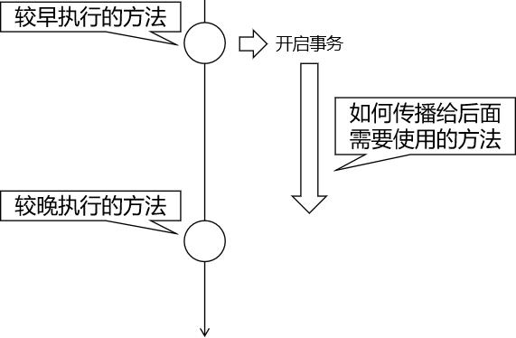
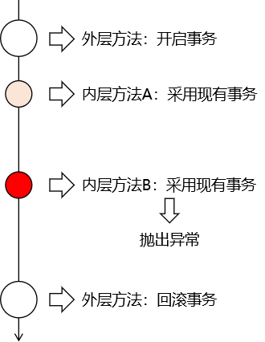

# 实验一 准备工作

## 1、加入依赖

```xml
    <dependencies>

        <!-- 基于Maven依赖传递性，导入spring-context依赖即可导入当前所需所有jar包 -->
        <dependency>
            <groupId>org.springframework</groupId>
            <artifactId>spring-context</artifactId>
            <version>5.3.1</version>
        </dependency>

        <!-- Spring 持久化层支持jar包 -->
        <!-- Spring 在执行持久化层操作、与持久化层技术进行整合过程中，需要使用orm、jdbc、tx三个jar包 -->
        <!-- 导入 orm 包就可以通过 Maven 的依赖传递性把其他两个也导入 -->
        <dependency>
            <groupId>org.springframework</groupId>
            <artifactId>spring-orm</artifactId>
            <version>5.3.1</version>
        </dependency>

        <!-- Spring 测试相关 -->
        <dependency>
            <groupId>org.springframework</groupId>
            <artifactId>spring-test</artifactId>
            <version>5.3.1</version>
        </dependency>

        <!-- junit测试 -->
        <dependency>
            <groupId>junit</groupId>
            <artifactId>junit</artifactId>
            <version>4.12</version>
            <scope>test</scope>
        </dependency>

        <!-- MySQL驱动 -->
        <dependency>
            <groupId>mysql</groupId>
            <artifactId>mysql-connector-java</artifactId>
            <version>5.1.3</version>
        </dependency>
        <!-- 数据源 -->
        <dependency>
            <groupId>com.alibaba</groupId>
            <artifactId>druid</artifactId>
            <version>1.0.31</version>
        </dependency>

    </dependencies>
```

## 2、外部属性文件

```properties
atguigu.url=jdbc:mysql://192.168.198.100:3306/mybatis-example
atguigu.driver=com.mysql.jdbc.Driver
atguigu.username=root
atguigu.password=atguigu
```

## 3、Spring 配置文件

```xml
<!-- 配置自动扫描的包 -->
<context:component-scan base-package="com.atguigu.tx"/>

<!-- 导入外部属性文件 -->
<context:property-placeholder location="classpath:jdbc.properties" />

<!-- 配置数据源 -->
<bean id="druidDataSource" class="com.alibaba.druid.pool.DruidDataSource">
    <property name="url" value="${atguigu.url}"/>
    <property name="driverClassName" value="${atguigu.driver}"/>
    <property name="username" value="${atguigu.username}"/>
    <property name="password" value="${atguigu.password}"/>
</bean>

<!-- 配置 JdbcTemplate -->
<bean id="jdbcTemplate" class="org.springframework.jdbc.core.JdbcTemplate">

    <!-- 装配数据源 -->
    <property name="dataSource" ref="druidDataSource"/>

</bean>
```

## 4、测试类

```java
@RunWith(SpringJUnit4ClassRunner.class)
@ContextConfiguration(value = {"classpath:spring-context.xml"})
public class JDBCTest {

}
```

## 5、创建组件

### ①EmpDao

```java
@Repository
public class EmpDao {

    @Autowired
    private JdbcTemplate jdbcTemplate;

    public void updateEmpNameById(Integer empId, String empName) {
        String sql = "update t_emp set emp_name=? where emp_id=?";
        jdbcTemplate.update(sql, empName, empId);
    }

    public void updateEmpSalaryById(Integer empId, Double salary) {
        String sql = "update t_emp set emp_salary=? where emp_id=?";
        jdbcTemplate.update(sql, salary, empId);
    }

    public String selectEmpNameById(Integer empId) {
        String sql = "select emp_name from t_emp where emp_id=?";

        String empName = jdbcTemplate.queryForObject(sql, String.class, empId);

        return empName;
    }

}
```

EmpDao 准备好之后最好测试一下，确认代码正确。养成随写随测的好习惯。

### ②EmpService

在三层结构中，事务通常都是加到业务逻辑层，针对Service类使用事务。

```java
@Service
public class EmpService {

    @Autowired
    private EmpDao empDao;

    // 为了便于核对数据库操作结果，不要修改同一条记录
    public void updateTwice(
            // 修改员工姓名的一组参数
            Integer empId4EditName, String newName,

            // 修改员工工资的一组参数
            Integer empId4EditSalary, Double newSalary
            ) {

        // 为了测试事务是否生效，执行两个数据库操作，看它们是否会在某一个失败时一起回滚
        empDao.updateEmpNameById(empId4EditName, newName);

        empDao.updateEmpSalaryById(empId4EditSalary, newSalary);

    }

}
```


# 实验二 应用最基本的事务控制

## 1、加事务前状态

### ①搞破坏

修改 EmpDao 中的 updateEmpSalaryById()方法：

```java
public void updateEmpSalaryById(Integer empId, Double salary) {

    // 为了看到操作失败后的效果人为将 SQL 语句破坏
    String sql = "upd222ate t_emp set emp_salary=? where emp_id=?";
    jdbcTemplate.update(sql, salary, empId);
}
```

### ②执行Service方法

```java
@Test
public void testBaseTransaction() {

    Integer empId4EditName = 2;
    String newName = "new-name";

    Integer empId4EditSalary = 3;
    Double newSalary = 444.44;

    empService.updateTwice(empId4EditName, newName, empId4EditSalary, newSalary);

}
```

效果：修改姓名的操作生效了，修改工资的操作没有生效。

## 2、添加事务功能

### ①配置事务管理器


```xml
<!-- 配置事务管理器 -->
<bean id="transactionManager" class="org.springframework.jdbc.datasource.DataSourceTransactionManager">

    <!-- 事务管理器的bean只需要装配数据源，其他属性保持默认值即可 -->
    <property name="dataSource" ref="druidDataSource"/>
</bean>
```

### ②开启基于注解的声明式事务功能


```xml
<!-- 开启基于注解的声明式事务功能 -->
<!-- 使用transaction-manager属性指定当前使用是事务管理器的bean -->
<!-- transaction-manager属性的默认值是transactionManager，如果事务管理器bean的id正好就是这个默认值，则可以省略这个属性 -->
<tx:annotation-driven transaction-manager="transactionManager"/>
```

注意：导入名称空间时有好几个重复的，我们需要的是 tx 结尾的那个。


### ③在需要事务的方法上使用注解


```java
@Transactional
public void updateTwice(
        // 修改员工姓名的一组参数
        Integer empId4EditName, String newName,

        // 修改员工工资的一组参数
        Integer empId4EditSalary, Double newSalary
        ) {

    // 为了测试事务是否生效，执行两个数据库操作，看它们是否会在某一个失败时一起回滚
    empDao.updateEmpNameById(empId4EditName, newName);

    empDao.updateEmpSalaryById(empId4EditSalary, newSalary);

}
```

### ④测试

junit测试方法不需要修改，执行后查看数据是否被修改。

## 3、从日志内容角度查看事务效果

### ①加入依赖

```xml
<!-- 加入日志 -->
<dependency>
    <groupId>ch.qos.logback</groupId>
    <artifactId>logback-classic</artifactId>
    <version>1.2.3</version>
</dependency>
```

### ②加入logback的配置文件

文件名：logback.xml

```xml
<?xml version="1.0" encoding="UTF-8"?>
<configuration debug="true">
    <!-- 指定日志输出的位置 -->
    <appender name="STDOUT"
              class="ch.qos.logback.core.ConsoleAppender">
        <encoder>
            <!-- 日志输出的格式 -->
            <!-- 按照顺序分别是：时间、日志级别、线程名称、打印日志的类、日志主体内容、换行 -->
            <pattern>[%d{HH:mm:ss.SSS}] [%-5level] [%thread] [%logger] [%msg]%n</pattern>
        </encoder>
    </appender>

    <!-- 设置全局日志级别。日志级别按顺序分别是：DEBUG、INFO、WARN、ERROR -->
    <!-- 指定任何一个日志级别都只打印当前级别和后面级别的日志。 -->
    <root level="INFO">
        <!-- 指定打印日志的appender，这里通过“STDOUT”引用了前面配置的appender -->
        <appender-ref ref="STDOUT" />
    </root>

    <!-- 根据特殊需求指定局部日志级别 -->
    <logger name="org.springframework.jdbc.datasource.DataSourceTransactionManager" level="DEBUG"/>
    <logger name="org.springframework.jdbc.core.JdbcTemplate" level="DEBUG" />

</configuration>
```

### ③日志中事务相关内容

#### [1]事务回滚时

> [11:37:36.965] [DEBUG] [main] [org.springframework.jdbc.datasource. DataSourceTransactionManager] [ Creating new transaction with name [com.atguigu.tx.service. EmpService.updateTwice]: PROPAGATION_REQUIRED, ISOLATION_DEFAULT]
> [11:37:37.328] [INFO ] [main] [com.alibaba.druid.pool. DruidDataSource] [{dataSource-1} inited]
> [11:37:37.815] [DEBUG] [main] [org.springframework.jdbc.datasource. DataSourceTransactionManager] [ Acquired Connection [com.mysql.jdbc. JDBC4Connection@6b6776cb] for JDBC transaction]
> [11:37:37.818] [DEBUG] [main] [org.springframework.jdbc.datasource. DataSourceTransactionManager] [ manual commit]
>
> [11:44:32.311] [DEBUG] [main] [org.springframework.jdbc.core. JdbcTemplate] [Executing prepared SQL update]
> [11:44:32.312] [DEBUG] [main] [org.springframework.jdbc.core. JdbcTemplate] [Executing prepared SQL statement [update t_emp set emp_name=? where emp_id=?]]
> [11:44:32.339] [DEBUG] [main] [org.springframework.jdbc.core. JdbcTemplate] [Executing prepared SQL update]
> [11:44:32.339] [DEBUG] [main] [org.springframework.jdbc.core. JdbcTemplate] [Executing prepared SQL statement [upd222ate</span> t_emp set emp_salary=? where emp_id=?]]
>
> [11:37:37.931] [DEBUG] [main] [org.springframework.jdbc.datasource. DataSourceTransactionManager] [Initiating transaction rollback]
> [11:37:37.931] [DEBUG] [main] [org.springframework.jdbc.datasource. DataSourceTransactionManager] [Rolling back JDBC transaction on Connection [com.mysql.jdbc. JDBC4Connection@6b6776cb]]
> [11:37:37.933] [DEBUG] [main] [org.springframework.jdbc.datasource. DataSourceTransactionManager] [Releasing JDBC Connection [com.mysql.jdbc. JDBC4Connection@6b6776cb] after transaction]

#### [2]事务提交时

> [11:42:40.093] [DEBUG] [main] [org.springframework.jdbc.datasource. DataSourceTransactionManager] [Creating new transaction with name [com.atguigu.tx.service. EmpService.updateTwice]: PROPAGATION_REQUIRED, ISOLATION_DEFAULT]
> [11:42:40.252] [INFO ] [main] [com.alibaba.druid.pool. DruidDataSource] [{dataSource-1} inited]
> [11:42:40.655] [DEBUG] [main] [org.springframework.jdbc.datasource. DataSourceTransactionManager] [Acquired Connection [com.mysql.jdbc. JDBC4Connection@6b6776cb] for JDBC transaction]
> [11:42:40.661] [DEBUG] [main] [org.springframework.jdbc.datasource. DataSourceTransactionManager] [manual commit]
> [11:42:40.681] [DEBUG] [main] [org.springframework.jdbc.core. JdbcTemplate] [Executing prepared SQL update]
> [11:42:40.682] [DEBUG] [main] [org.springframework.jdbc.core. JdbcTemplate] [Executing prepared SQL statement [update t_emp set emp_name=? where emp_id=?]]
> [11:42:40.710] [DEBUG] [main] [org.springframework.jdbc.core. JdbcTemplate] [Executing prepared SQL update]
> [11:42:40.711] [DEBUG] [main] [org.springframework.jdbc.core. JdbcTemplate] [Executing prepared SQL statement [update t_emp set emp_salary=? where emp_id=?]]
> [11:42:40.712] [DEBUG] [main] [org.springframework.jdbc.datasource. DataSourceTransactionManager] [Initiating transaction commit]
> [11:42:40.712] [DEBUG] [main] [org.springframework.jdbc.datasource. DataSourceTransactionManager] [Committing JDBC transaction on Connection [com.mysql.jdbc. JDBC4Connection@6b6776cb]]
> [11:42:40.714] [DEBUG] [main] [org.springframework.jdbc.datasource. DataSourceTransactionManager] [Releasing JDBC Connection [com.mysql.jdbc. JDBC4Connection@6b6776cb] after transaction]

## 4、debug查看事务管理器中的关键方法

类：org.springframework.jdbc.datasource. DataSourceTransactionManager

### ①开启事务的方法


### ②提交事务的方法


### ③回滚事务的方法


[上一个实验](experiment01.html) [回目录](../verse03.html) [下一个实验](experiment03.html)

# 实验三 事务属性：只读

## 1、介绍

对一个查询操作来说，如果我们把它设置成只读，就能够明确告诉数据库，这个操作不涉及写操作。这样数据库就能够针对查询操作来进行优化。

## 2、设置方式

```java
// readOnly = true把当前事务设置为只读
@Transactional(readOnly = true)
public String getEmpName(Integer empId) {

    return empDao.selectEmpNameById(empId);
}
```

## 3、针对增删改操作设置只读

会抛出下面异常：

> Caused by: java.sql. SQLException: Connection is read-only. Queries leading to data modification are not allowed

## 4、@Transactional注解放在类上

### ①生效原则

如果一个类中每一个方法上都使用了@Transactional注解，那么就可以将@Transactional注解提取到类上。反过来说：@Transactional注解在类级别标记，会影响到类中的每一个方法。同时，类级别标记的@Transactional注解中设置的事务属性也会延续影响到方法执行时的事务属性。除非在方法上又设置了@Transactional注解。

对一个方法来说，离它最近的@Transactional注解中的事务属性设置生效。

### ②用法举例

在类级别@Transactional注解中设置只读，这样类中所有的查询方法都不需要设置@Transactional注解了。因为对查询操作来说，其他属性通常不需要设置，所以使用公共设置即可。

然后在这个基础上，对增删改方法设置@Transactional注解 readOnly 属性为 false。

```java
@Service
@Transactional(readOnly = true)
public class EmpService {

    // 为了便于核对数据库操作结果，不要修改同一条记录
    @Transactional(readOnly = false)
    public void updateTwice(……) {
		……
    }

    // readOnly = true把当前事务设置为只读
    // @Transactional(readOnly = true)
    public String getEmpName(Integer empId) {
		……
    }

}
```

> PS：Spring 环境下很多场合都有类似设定，一个注解如果标记了类的每一个方法那么通常就可以提取到类级别。

[上一个实验](experiment02.html) [回目录](../verse03.html) [下一个实验](experiment04.html)

# 实验四 事务属性：超时

## 1、需求

事务在执行过程中，有可能因为遇到某些问题，导致程序卡住，从而长时间占用数据库资源。而长时间占用资源，大概率是因为程序运行出现了问题（可能是Java程序或MySQL数据库或网络连接等等）。

此时这个很可能出问题的程序应该被回滚，撤销它已做的操作，事务结束，把资源让出来，让其他正常程序可以执行。

概括来说就是一句话：超时回滚，释放资源。

## 2、设置

### ①@Transactional注解中的设置

```java
@Transactional(readOnly = false, timeout = 3)
public void updateTwice(
        // 修改员工姓名的一组参数
        Integer empId4EditName, String newName,

        // 修改员工工资的一组参数
        Integer empId4EditSalary, Double newSalary
        ) {

    // 为了测试事务是否生效，执行两个数据库操作，看它们是否会在某一个失败时一起回滚
    empDao.updateEmpNameById(empId4EditName, newName);

    empDao.updateEmpSalaryById(empId4EditSalary, newSalary);

}
```

### ②Dao方法中让线程睡眠

```java
public void updateEmpSalaryById(Integer empId, Double salary) {

    try {
        TimeUnit.SECONDS.sleep(5);
    } catch (InterruptedException e) {
        e.printStackTrace();
    }

    // 为了看到操作失败后的效果人为将 SQL 语句破坏
    String sql = "update t_emp set emp_salary=? where emp_id=?";
    jdbcTemplate.update(sql, salary, empId);
}
```

> PS：注意：sleep操作如果放在执行 SQL 语句后面那就不起作用。

### ③执行效果

执行过程中日志和抛出异常的情况：

> [16:25:41.706] [DEBUG] [main] [org.springframework.jdbc.datasource. DataSourceTransactionManager] [Initiating transaction rollback]
> [16:25:41.706] [DEBUG] [main] [org.springframework.jdbc.datasource. DataSourceTransactionManager] [Rolling back JDBC transaction on Connection [com.mysql.jdbc. JDBC4Connection@53b7f657]]
> [16:25:41.709] [DEBUG] [main] [org.springframework.jdbc.datasource. DataSourceTransactionManager] [Releasing JDBC Connection [com.mysql.jdbc. JDBC4Connection@53b7f657] after transaction]
>
> org.springframework.transaction. TransactionTimedOutException: Transaction timed out: deadline was Fri Jun 04 16:25:39 CST 2021

[上一个实验](experiment03.html) [回目录](../verse03.html) [下一个实验](experiment05.html)

# 实验五 事务属性：回滚和不回滚的异常

## 1、默认情况

默认只针对运行时异常回滚，编译时异常不回滚。情景模拟代码如下：

```java
public void updateEmpSalaryById(Integer empId, Double salary) throws FileNotFoundException {

	// 为了看到操作失败后的效果人为将 SQL 语句破坏
	String sql = "update t_emp set emp_salary=? where emp_id=?";
	jdbcTemplate.update(sql, salary, empId);

//  抛出编译时异常测试是否回滚
	new FileInputStream("aaaa.aaa");

//  抛出运行时异常测试是否回滚
//  System.out.println(10 / 0);
}
```

## 2、设置回滚的异常

* rollbackFor属性：需要设置一个Class类型的对象
* rollbackForClassName属性：需要设置一个字符串类型的全类名

```java
@Transactional(rollbackFor = Exception.class)
```

## 3、设置不回滚的异常

在默认设置和已有设置的基础上，再指定一个异常类型，碰到它不回滚。

```java
    @Transactional(
            noRollbackFor = FileNotFoundException.class
    )
```

## 4、回滚和不回滚异常同时设置

### ①范围不同

不管是哪个设置范围大，都是在大范围内在排除小范围的设定。例如：

* rollbackFor = Exception.class
* noRollbackFor = FileNotFoundException.class

意思是除了 FileNotFoundException 之外，其他所有 Exception 范围的异常都回滚；但是碰到 FileNotFoundException 不回滚。

### ②范围一致

回滚和不回滚的异常设置了相同范围（这是有多想不开）：

* noRollbackFor = FileNotFoundException.class
* rollbackFor = FileNotFoundException.class

此时 Spring 采纳了 rollbackFor 属性的设定：遇到 FileNotFoundException 异常会回滚。

[上一个实验](experiment04.html) [回目录](../verse03.html) [下一个实验](experiment06.html)

# 实验六 事务属性：事务隔离级别

## 1、视角需要提升


## 2、测试的准备工作

### ①思路


### ②EmpService中参与测试的方法

```java
// readOnly = true把当前事务设置为只读
// @Transactional(readOnly = true)
public String getEmpName(Integer empId) {

    return empDao.selectEmpNameById(empId);
}

@Transactional(readOnly = false)
public void updateEmpName(Integer empId, String empName) {

    empDao.updateEmpNameById(empId, empName);
}
```

### ③junit中执行测试的方法

```java
@Test
public void testTxReadOnly() {

    String empName = empService.getEmpName(3);

    System.out.println("empName = " + empName);

}

@Test
public void testIsolation() {

    Integer empId = 2;
    String empName = "aaaaaaaa";

    empService.updateEmpName(empId, empName);

}
```

### ④搞破坏

为了让事务B（执行修改操作的事务）能够回滚，在EmpDao中的对应方法中人为抛出异常。

```java
public void updateEmpNameById(Integer empId, String empName) {
    String sql = "update t_emp set emp_name=? where emp_id=?";
    jdbcTemplate.update(sql, empName, empId);
    System.out.println(10 / 0);
}
```

## 3、执行测试

在 @Transactional 注解中使用 isolation 属性设置事务的隔离级别。 取值使用 org.springframework.transaction.annotation. Isolation 枚举类提供的数值。

### ①测试读未提交

```java
@Transactional(isolation = Isolation.READ_UNCOMMITTED)
public String getEmpName(Integer empId) {

    return empDao.selectEmpNameById(empId);
}

@Transactional(isolation = Isolation.READ_UNCOMMITTED, readOnly = false)
public void updateEmpName(Integer empId, String empName) {

    empDao.updateEmpNameById(empId, empName);
}
```


测试结果：执行查询操作的事务读取了另一个尚未提交的修改。

### ②测试读已提交

```java
@Transactional(isolation = Isolation.READ_COMMITTED)
public String getEmpName(Integer empId) {

    return empDao.selectEmpNameById(empId);
}

@Transactional(isolation = Isolation.READ_COMMITTED, readOnly = false)
public void updateEmpName(Integer empId, String empName) {

    empDao.updateEmpNameById(empId, empName);
}
```

测试结果：执行查询操作的事务读取的是数据库中正确的数据。

[上一个实验](experiment05.html) [回目录](../verse03.html) [下一个实验](experiment07.html)

# 实验七 事务属性：事务传播行为

## 1、事务传播行为要研究的问题



## 2、propagation属性

### ①默认值

@Transactional 注解通过 propagation 属性设置事务的传播行为。它的默认值是：

```java
Propagation propagation() default Propagation.REQUIRED;
```

### ②可选值说明

propagation 属性的可选值由 org.springframework.transaction.annotation. Propagation 枚举类提供：

| 名称                                                         | 含义                                                         |
| ------------------------------------------------------------ | ------------------------------------------------------------ |
| REQUIRED<br />默认值                                         | 当前方法必须工作在事务中<br />如果当前线程上有已经开启的事务可用，那么就在这个事务中运行<br />如果当千纤草上没有已经开启的事务，那么就自己开启新事务，在新事务中运行<br />所以当前方法有可能和其他方法共用事务<br />在共用事务的情况下：当前方法会因为其他方法回滚而受连累 |
| REQUIRES_NEW<br />建议使用 | 当前方法必须工作在事务中<br />不管当前线程上是否有已经开启的事务，都要开启新事务<br />在新事务中运行<br />不会和其他方法共用事务，避免被其他方法连累 |

## 3、测试

### ①创建测试方法

#### [1]在EmpService中声明两个内层方法

```java
@Transactional(readOnly = false, propagation = Propagation.REQUIRED)
public void updateEmpNameInner(Integer empId, String empName) {

    empDao.updateEmpNameById(empId, empName);
}

@Transactional(readOnly = false, propagation = Propagation.REQUIRED)
public void updateEmpSalaryInner(Integer empId, Double empSalary) {

    empDao.updateEmpSalaryById(empId, empSalary);
}
```

#### [2]创建TopService


```java
@Service
public class TopService {

    // 这里我们只是为了测试事务传播行为，临时在Service中装配另一个Service
    // 实际开发时非常不建议这么做，因为这样会严重破坏项目的结构
    @Autowired
    private EmpService empService;

    @Transactional
    public void topTxMethod() {

        // 在外层方法中调用两个内层方法
        empService.updateEmpNameInner(2, "aaa");

        empService.updateEmpSalaryInner(3, 666.66);

    }

}
```

#### [3]junit测试方法

```java
@Autowired
private TopService topService;

@Test
public void testPropagation() {

    // 调用外层方法
    topService.topTxMethod();

}
```

### ②测试 REQUIRED 模式



效果：内层方法A、内层方法B所做的修改都没有生效，总事务回滚了。

### ③测试 REQUIRES_NEW 模式

#### [1]修改 EmpService 中内层方法

```java
@Transactional(readOnly = false, propagation = Propagation.REQUIRES_NEW)
public void updateEmpNameInner(Integer empId, String empName) {

    empDao.updateEmpNameById(empId, empName);
}

@Transactional(readOnly = false, propagation = Propagation.REQUIRES_NEW)
public void updateEmpSalaryInner(Integer empId, Double empSalary) {

    empDao.updateEmpSalaryById(empId, empSalary);
}
```

#### [2]执行流程


## 4、实际开发情景

### ①Service方法应用了通知


### ②过滤器或拦截器等类似组件


### ③升华

我们在事务传播行为这里，使用 REQUIRES_NEW 属性，也可以说是让不同事务方法从事务的使用上解耦合，不要互相影响。

[上一个实验](experiment06.html) [回目录](../verse03.html)
