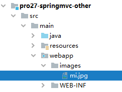
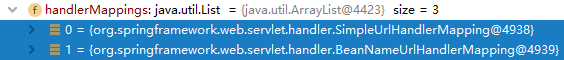

# 第一节 获取原生Servlet API对象

## 1、原生 Servlet API

* HttpServletRequest
* HttpServletResponse
* HttpSession
* ServletContext

原生：最原始的、本真的，没有经过任何的加工、包装和处理。

API：直接翻译过来是应用程序接口的意思。对我们来说，提到 API 这个词的时候，通常指的是在某个特定的领域，已经封装好可以直接使用的一套技术体系。很多时候，特定领域的技术规范都是对外暴露一组接口作为这个领域的技术标准，然后又在这个标准下有具体实现。

## 2、可以直接拿到的对象

### ①在 IDEA 中创建代码模板

使用快捷键调出代码模板能够极大的提升开发效率


### ②测试获取三个可以直接得到的对象

#### [1]创建超链接


```html
<a th:href="@{/original/api/direct}">可以直接得到的三个</a><br />
```

#### [2]声明 handler 方法

```java
@RequestMapping("/original/api/direct")
public String getOriginalAPIDirect(

        // 有需要使用的 Servlet API 直接在形参位置声明即可。
        // 需要使用就写上，不用就不写，开发体验很好，这里给 SpringMVC 点赞
        HttpServletRequest request,
        HttpServletResponse response,
        HttpSession session
) {

    logger.debug(request.toString());
    logger.debug(response.toString());
    logger.debug(session.toString());

    return "target";
}
```

> ServletContext对象没法通过形参声明的方式直接获取，如果非要在形参位置声明ServletContext类型的变量，那么会抛出下面的异常：
>
> java.lang. IllegalStateException: No primary or single public constructor found for interface javax.servlet. ServletContext - and no default constructor found either

## 3、获取ServletContext

### ①方法一：通过HttpSession获取

```java
@RequestMapping("/original/servlet/context/first/way")
public String originalServletContextFirstWay(HttpSession session) {

    // 获取ServletContext对象的方法一：通过HttpSession对象获取
    ServletContext servletContext = session.getServletContext();
    logger.debug(servletContext.toString());

    return "target";
}
```

### ②方法二：通过 IOC 容器注入

```java
// 获取ServletContext对象的方法二：从 IOC 容器中直接注入
@Autowired
private ServletContext servletContext;

@RequestMapping("/original/servlet/context/second/way")
public String originalServletContextSecondWay() {

    logger.debug(this.servletContext.toString());

    return "target";
}
```

## 4、原生对象和 IOC 容器关系


# 第二节 属性域

## 1、在整个应用中属性域的重要作用

[参考资料]([verse03 (gitee.io)](http://heavy_code_industry.gitee.io/code_heavy_industry/pro001-javaweb/lecture/bookstore05/verse03.html))


## 2、请求域操作方式

### ①使用 Model 类型的形参

```java
@RequestMapping("/attr/request/model")
public String testAttrRequestModel(

        // 在形参位置声明Model类型变量，用于存储模型数据
        Model model) {

    // 我们将数据存入模型，SpringMVC 会帮我们把模型数据存入请求域
    // 存入请求域这个动作也被称为暴露到请求域
    model.addAttribute("requestScopeMessageModel","i am very happy[model]");

    return "target";
}
```

### ②使用 ModelMap 类型的形参

```java
@RequestMapping("/attr/request/model/map")
public String testAttrRequestModelMap(

        // 在形参位置声明ModelMap类型变量，用于存储模型数据
        ModelMap modelMap) {

    // 我们将数据存入模型，SpringMVC 会帮我们把模型数据存入请求域
    // 存入请求域这个动作也被称为暴露到请求域
    modelMap.addAttribute("requestScopeMessageModelMap","i am very happy[model map]");

    return "target";
}
```

### ③使用 Map 类型的形参

```java
@RequestMapping("/attr/request/map")
public String testAttrRequestMap(

        // 在形参位置声明Map类型变量，用于存储模型数据
        Map<String, Object> map) {

    // 我们将数据存入模型，SpringMVC 会帮我们把模型数据存入请求域
    // 存入请求域这个动作也被称为暴露到请求域
    map.put("requestScopeMessageMap", "i am very happy[map]");

    return "target";
}
```

### ④使用原生 request 对象

```java
@RequestMapping("/attr/request/original")
public String testAttrOriginalRequest(

        // 拿到原生对象，就可以调用原生方法执行各种操作
        HttpServletRequest request) {

    request.setAttribute("requestScopeMessageOriginal", "i am very happy[original]");

    return "target";
}
```

### ⑤使用 ModelAndView 对象

```java
@RequestMapping("/attr/request/mav")
public ModelAndView testAttrByModelAndView() {

    // 1.创建ModelAndView对象
    ModelAndView modelAndView = new ModelAndView();

    // 2.存入模型数据
    modelAndView.addObject("requestScopeMessageMAV", "i am very happy[mav]");

    // 3.设置视图名称
    modelAndView.setViewName("target");

    return modelAndView;
}
```

## 3、模型的本质

### ①BindingAwareModelMap

SpringMVC 传入的 Model、ModelMap、Map类型的参数其实本质上都是 BindingAwareModelMap 类型的。

### ②它们之间的关系


## 4、框架底层将模型存入请求域

### ①最终找到的源码位置

所在类：org.thymeleaf.context. WebEngineContext

所在方法：setVariable()


### ②过程中值得关注的点


## 5、会话域

使用会话域最简单直接的办法就是使用原生的 HttpSession 对象

```java
@RequestMapping("/attr/session")
public String attrSession(
        // 使用会话域最简单直接的办法就是使用原生的 HttpSession 对象
        HttpSession session) {

    session.setAttribute("sessionScopeMessage", "i am haha ...");

    return "target";
}
```

## 6、应用域

应用域同样是使用原生对象来操作：

```java
@Autowired
private ServletContext servletContext;

@RequestMapping("/attr/application")
public String attrApplication() {

    servletContext.setAttribute("appScopeMsg", "i am hungry...");

    return "target";
}
```


# 第三节 静态资源访问

## 1、静态资源的概念

资源本身已经是可以直接拿到浏览器上使用的程度了，不需要在服务器端做任何运算、处理。典型的静态资源包括：

* 纯HTML文件
* 图片
* CSS文件
* JavaScript文件
* ……

## 2、SpringMVC 环境下静态资源问题

### ①情况一：斜杠情况

#### [1]情景描述

DispatcherServlet 的 url-pattern 标签配置的是“/”。意味着整个 Web 应用范围内所有请求都由 SpringMVC 来处理。

#### [2]情景重现

在 Web 应用中加入图片资源：



部署目录下不会自动加入，需要我们手动重新构建才行：


重新构建应用参考下面的操作步骤：


#### [3]访问静态资源


#### [4]分析原因

* DispatcherServlet 的 url-pattern 配置的是“/”
* url-pattern 配置“/”表示整个 Web 应用范围内所有请求都由 SpringMVC 来处理
* 对 SpringMVC 来说，必须有对应的 @RequestMapping 才能找到处理请求的方法
* 现在 ./images/mi.jpg 请求没有对应的 @RequestMapping 所以返回 404

#### [5]解决办法

* 在 SpringMVC 配置文件中增加配置：

```xml
<!-- 加入这个配置，SpringMVC 就会在遇到没有 @RequestMapping 的请求时放它过去 -->
<!-- 所谓放它过去就是让这个请求去找它原本要访问的资源 -->
<mvc:default-servlet-handler/>
```

* 再次测试访问图片：


* 新的问题：其他原本正常的请求访问不了了
* 进一步解决问题：再增加一个配置

```xml
<!-- 开启 SpringMVC 的注解驱动功能。这个配置也被称为 SpringMVC 的标配。 -->
<!-- 标配：因为 SpringMVC 环境下非常多的功能都要求必须打开注解驱动才能正常工作。 -->
<mvc:annotation-driven/>
```

#### [6]default-servlet-handler底层[了解]

所在类：org.springframework.web.servlet.resource. DefaultServletHttpRequestHandler

关键方法：handleRequest()方法

大体机制：SpringMVC 首先查找是否存在和当前请求对应的 @RequestMapping；如果没有，则调用handleRequest()方法转发到目标资源。

```java
@Override
public void handleRequest(HttpServletRequest request, HttpServletResponse response)
			throws ServletException, IOException {

	Assert.state(this.servletContext != null, "No ServletContext set");
	RequestDispatcher rd = this.servletContext.getNamedDispatcher(this.defaultServletName);
	if (rd == null) {
		throw new IllegalStateException("A RequestDispatcher could not be located for the default servlet '" +
		this.defaultServletName + "'");
	}

    // 这里执行请求转发操作
	rd.forward(request, response);
}
```

### ②情况二：扩展名情况

#### [1]修改 url-pattern

```xml
<servlet>
    <servlet-name>DispatcherServlet</servlet-name>
    <servlet-class>org.springframework.web.servlet.DispatcherServlet</servlet-class>
    <init-param>
        <param-name>contextConfigLocation</param-name>
        <param-value>classpath:spring-mvc.xml</param-value>
    </init-param>
    <load-on-startup>1</load-on-startup>
</servlet>
<servlet-mapping>
    <servlet-name>DispatcherServlet</servlet-name>
    <!--<url-pattern>/</url-pattern>-->

    <!-- 以扩展名方式匹配 SpringMVC 要处理的请求 -->
    <!-- 此时要求请求扩展名必须是 html，SpringMVC 才会处理这个请求 -->
    <url-pattern>*.html</url-pattern>
</servlet-mapping>
```

#### [2]效果

* 图片直接就可以访问了。因为请求扩展名不是 html，不会受到 SpringMVC 影响。
* 其他请求：做下面两个操作才可以正常访问
  + 需要在超链接地址后面附加 html 扩展名
  + 在 @RequestMapping 注解指定的 URL 地址中也附加 html 扩展名


# 第四节 mvc:view-controller

## 1、需求情景

在一个 handler 方法中，仅仅只是完成 @RequestMapping 映射，将请求转发到目标视图，除此之外没有任何其他代码。此时可以使用 SpringMVC 配置文件中的配置代替这样的 handler 方法。

## 2、具体操作

### ①配置

在 SpringMVC 配置文件中使用 mvc:view-controller 配置：

```xml
<mvc:view-controller path="/index.html" view-name="portal"/>
```

同时，handler 类中就可以去掉被代替的方法。

### ②新的问题

加入 mvc:view-controller 配置后，其他正常 @RequestMapping 将失效。此时还是需要加入 mvc:annotation-driven 来解决。

## 3、三个配置影响访问效果探索[了解]

### ①相关组件：HandlerMapping

见名知意，HandlerMapping 封装的数据包含了请求地址和 handler 方法之间的映射关系。所以请求访问是否能生效关键要看 HandlerMapping 在 IOC 容器中加载的情况。为了看到这一点，我们可以在 DispatcherServlet 中找到 doDispatch() 方法设置断点。之所以选择这个方法，是因为每一个由 SpringMVC 处理的请求都会经过这里，便于操作。


### ②分三种情况查看

#### [1]三个标签都没有配置


我们看到 SpringMVC 加载了三个 HandlerMapping：

> org.springframework.web.servlet.handler. BeanNameUrlHandlerMapping
>
> org.springframework.web.servlet.mvc.method.annotation. RequestMappingHandlerMapping
>
> org.springframework.web.servlet.function.support. RouterFunctionMapping

其中 RequestMappingHandlerMapping 封装了 @RequestMapping 相关请求，有它在 @RequestMapping 相关请求就能访问到。

这里顺带一提，在较低版本的 SpringMVC 此处要加载的是：

> org.springframework.web.servlet.handler. BeanNameUrlHandlerMapping
> org.springframework.web.servlet.mvc.annotation. DefaultAnnotationHandlerMapping

其中 DefaultAnnotationHandlerMapping 封装了 @RequestMapping 相关请求，有它在 @RequestMapping 相关请求就能访问到。

#### [2]增加一个标签

配置了 mvc:view-controller 或 mvc:default-servlet-handler 之后。



我们看到 SpringMVC 加载了两个 HandlerMapping：

> org.springframework.web.servlet.handler. SimpleUrlHandlerMapping
>
> org.springframework.web.servlet.handler. BeanNameUrlHandlerMapping

较低版本的 SpringMVC 在这里的情况一样。

#### [3]全部配置三个标签

配置全部 mvc:view-controller、mvc:default-servlet-handler、mvc:annotation-driven 三个标签。


我们看到 SpringMVC 加载了略有不同的三个 HandlerMapping：

> org.springframework.web.servlet.mvc.method.annotation. RequestMappingHandlerMapping
>
> org.springframework.web.servlet.handler. SimpleUrlHandlerMapping
>
> org.springframework.web.servlet.handler. BeanNameUrlHandlerMapping

较低版本的 SpringMVC 在这里的情况还是一样。

### ③结论

在配置不同的情况下，SpringMVC 底层加载的组件不同，特定功能需要特定组件的支持。当特定功能所需组件没有加入到 IOC 容器中的时候，对应的功能就无法使用了。

还有一点是：标配，必加。


# 第五节 表单标签

主要的目的是在页面上实现表单回显。最典型的情况是在修改数据时，把之前旧的数据重新显示出来供用户参考。

## 1、回显简单标签

一个标签回显一个值的情况。

### ①创建用于测试的实体类

```java
public class Tiger {

    private Integer tigerId;
    private String tigerName;
    private Double tigerSalary;
    ……
```

### ②创建 handler 方法

```java
@RequestMapping("/form/redisplay/simple")
public String simpleTagRedisplay(Model model) {

    // 1.准备好用来回显表单的实体类对象
    // 在实际功能中，这里的对象应该是从数据库查询得到
    Tiger tiger = new Tiger();
    tiger.setTigerId(5);
    tiger.setTigerName("tomCat");
    tiger.setTigerSalary(666.66);

    // 2.将实体类数据存入模型
    model.addAttribute("tiger", tiger);

    return "form-simple";
}
```

### ③页面表单回显


```html
<h3>回显Tiger数据</h3>

<form th:action="@{/save/tiger}" method="post">

    <!-- th:value 和 th:field 属性都可以 -->
    老虎的id：<input type="text" name="tigerId" th:value="${tiger.tigerId}" /><br />
    老虎的名字：<input type="text" name="tigerName" th:field="${tiger.tigerName}" /><br />
    老虎的工资：<input type="text" name="tigerSalary" th:field="${tiger.tigerSalary}" /><br />

    <button type="submit">保证</button>
</form>
```

## 2、回显带选择功能的标签

### ①总体思路

* 显示标签本身，需要用到一个集合对象来存储标签本身所需要的数据
* 对标签执行回显操作，需要用到另外的一个实体类

### ②创建实体类

#### [1]用来显示标签的实体类

```java
public class Season {

    // 提交给服务器的值
    private String submitValue;

    // 给用户看的值
    private String showForUserValue;
    ……
```

#### [2]用来回显数据的实体类

```java
public class Paige {

    private Integer paigeId;
    private String paigeName;
    private Season season;
    ……
```

### ③handler 方法

```java
@RequestMapping("/form/redisplay/choose")
public String chooseTagRedisplay(Model model) {

    // 1.准备用来显示标签的数据
    List<Season> seasonList = new ArrayList<>();
    seasonList.add(new Season("spring", "春天"));
    seasonList.add(new Season("summer", "夏天"));
    seasonList.add(new Season("autumn", "秋天"));
    seasonList.add(new Season("winter", "冬天"));

    model.addAttribute("seasonList", seasonList);

    // 2.准备用来回显表单的实体类数据
    Paige paige = new Paige();
    paige.setPaigeId(6);
    paige.setPaigeName("pig");
    paige.setSeason(new Season("summer", "夏天"));

    model.addAttribute("paige", paige);

    return "form-choose";
}
```

### ③页面表单回显

#### [1]单选按钮

```html
<!-- th:each属性：指定用来生成这一组标签的集合数据 -->
<!-- th:value属性：获取数据用来设置HTML标签的value属性，成为将来提交给服务器的值 -->
<!-- th:text属性：获取数据用来设置HTML标签旁边给用户看的名字 -->
<!-- th:checked属性：判断是否回显（把适合的标签设置为默认被选中） -->
<input type="radio" name="season.submitValue" th:each="season : ${seasonList}" th:value="${season.submitValue}" th:text="${season.showForUserValue}" th:checked="${season.submitValue == paige.season.submitValue}" />
```

#### [2]下拉列表

```html
<select name="season.submitValue">
    <option th:each="season : ${seasonList}" th:value="${season.submitValue}" th:text="${season.showForUserValue}" th:selected="${season.submitValue == paige.season.submitValue}" />
</select>
```

#### [3]多选框

* 另外封装一个实体类

```html
public class John {

private List<Season> seasonList;

    public List<Season> getSeasonList() {
        return seasonList;
        }

        public void setSeasonList(List<Season> seasonList) {
            this.seasonList = seasonList;
            }
            }
```

* handler方法

```java
@RequestMapping("/form/redisplay/choose/multi")
public String chooseMulti(Model model) {

    // 1.准备用来显示标签的数据
    List<Season> seasonList = new ArrayList<>();
    seasonList.add(new Season("spring", "春天"));
    seasonList.add(new Season("summer", "夏天"));
    seasonList.add(new Season("autumn", "秋天"));
    seasonList.add(new Season("winter", "冬天"));

    model.addAttribute("seasonList", seasonList);

    // 2.准备用来回显表单的实体类数据
    John john = new John();
    List<Season> seasonListForRedisplay = new ArrayList<>();
    seasonListForRedisplay.add(new Season("summer", "夏天"));
    seasonListForRedisplay.add(new Season("winter", "冬天"));

    model.addAttribute("seasonListForRedisplay", seasonListForRedisplay);

    return "form-multi";
}
```

* 页面标签

```html
<!--
    seasonListForRedisplay.contains(season)
    用包含回显数据的集合调用contains()方法判断是否应该被选中；
    传入contains()方法的是生成具体每一个标签时遍历得到的对象
 -->
<input type="checkbox" name="xxx" th:each="season : ${seasonList}" th:value="${season.submitValue}" th:text="${season.showForUserValue}" th:checked="${seasonListForRedisplay.contains(season)}" />
```

注意：此时需要判断一个对象是否在集合中，那就需要重写equals()和hashCode()方法。


# 第六节 案例

## 1、准备工作

### ①创建实体类

```java
public class Movie {

    private String movieId;
    private String movieName;
    private Double moviePrice;
    ……
```

### ②创建Service

#### [1]接口

```java
public interface MovieService {

    List<Movie> getAll();

    Movie getMovieById(String movieId);

    void saveMovie(Movie movie);

    void updateMovie(Movie movie);

    void removeMovieById(String movieId);

}
```

#### [2]接口的实现类

```java
@Service
public class MovieServiceImpl implements MovieService {

    private static Map<String ,Movie> movieMap;

    static {

        movieMap = new HashMap<>();

        String movieId = null;
        Movie movie = null;

        movieId = UUID.randomUUID().toString().replace("-", "").toUpperCase();
        movie = new Movie(movieId, "肖申克救赎", 10.0);
        movieMap.put(movieId, movie);

        movieId = UUID.randomUUID().toString().replace("-", "").toUpperCase();
        movie = new Movie(movieId, "泰坦尼克号", 20.0);
        movieMap.put(movieId, movie);

        movieId = UUID.randomUUID().toString().replace("-", "").toUpperCase();
        movie = new Movie(movieId, "审死官", 30.0);
        movieMap.put(movieId, movie);

        movieId = UUID.randomUUID().toString().replace("-", "").toUpperCase();
        movie = new Movie(movieId, "大话西游之大圣娶亲", 40.0);
        movieMap.put(movieId, movie);

        movieId = UUID.randomUUID().toString().replace("-", "").toUpperCase();
        movie = new Movie(movieId, "大话西游之仙履奇缘", 50.0);
        movieMap.put(movieId, movie);

        movieId = UUID.randomUUID().toString().replace("-", "").toUpperCase();
        movie = new Movie(movieId, "功夫", 60.0);
        movieMap.put(movieId, movie);

        movieId = UUID.randomUUID().toString().replace("-", "").toUpperCase();
        movie = new Movie(movieId, "大内密探凌凌漆", 70.0);
        movieMap.put(movieId, movie);

        movieId = UUID.randomUUID().toString().replace("-", "").toUpperCase();
        movie = new Movie(movieId, "食神", 80.0);
        movieMap.put(movieId, movie);

        movieId = UUID.randomUUID().toString().replace("-", "").toUpperCase();
        movie = new Movie(movieId, "西游降魔篇", 90.0);
        movieMap.put(movieId, movie);

        movieId = UUID.randomUUID().toString().replace("-", "").toUpperCase();
        movie = new Movie(movieId, "西游伏妖篇", 11.0);
        movieMap.put(movieId, movie);

        movieId = UUID.randomUUID().toString().replace("-", "").toUpperCase();
        movie = new Movie(movieId, "三傻大闹宝莱坞", 12.0);
        movieMap.put(movieId, movie);

        movieId = UUID.randomUUID().toString().replace("-", "").toUpperCase();
        movie = new Movie(movieId, "唐人街探案", 13.0);
        movieMap.put(movieId, movie);

        movieId = UUID.randomUUID().toString().replace("-", "").toUpperCase();
        movie = new Movie(movieId, "一个人的武林", 14.0);
        movieMap.put(movieId, movie);

        movieId = UUID.randomUUID().toString().replace("-", "").toUpperCase();
        movie = new Movie(movieId, "罗马假日", 15.0);
        movieMap.put(movieId, movie);

        movieId = UUID.randomUUID().toString().replace("-", "").toUpperCase();
        movie = new Movie(movieId, "花季雨季", 16.0);
        movieMap.put(movieId, movie);

        movieId = UUID.randomUUID().toString().replace("-", "").toUpperCase();
        movie = new Movie(movieId, "夏洛特烦恼", 17.0);
        movieMap.put(movieId, movie);
    }

    @Override
    public List<Movie> getAll() {
        return new ArrayList<>(movieMap.values());
    }

    @Override
    public Movie getMovieById(String movieId) {
        return movieMap.get(movieId);
    }

    @Override
    public void saveMovie(Movie movie) {
        String movieId = UUID.randomUUID().toString().replace("-", "");

        movie.setMovieId(movieId);

        movieMap.put(movieId, movie);
    }

    @Override
    public void updateMovie(Movie movie) {

        String movieId = movie.getMovieId();

        movieMap.put(movieId, movie);

    }

    @Override
    public void removeMovieById(String movieId) {
        movieMap.remove(movieId);
    }
}
```

### ③测试Service

```java
@SpringJUnitConfig(locations = {"classpath:spring-mvc.xml"})
public class MovieTest {

    @Autowired
    private MovieService movieService;

    @Test
    public void testServiceGetAll() {
        List<Movie> list = movieService.getAll();
        for (Movie movie : list) {
            System.out.println("movie = " + movie);
        }
    }

    @Test
    public void testServiceGetById() {
        List<Movie> movieList = movieService.getAll();
        for (Movie movie : movieList) {
            String movieId = movie.getMovieId();
            Movie movieById = movieService.getMovieById(movieId);
            System.out.println("movieById = " + movieById);
        }
    }

    @Test
    public void testGetOne() {
        Movie movie = movieService.getMovieById("178E6B0B0DA14DC59141E06FFA620673");
        System.out.println("movie = " + movie);
    }

    @Test
    public void testServiceRemoveById() {
        List<Movie> movieList = movieService.getAll();
        for (Movie movie : movieList) {
            String movieId = movie.getMovieId();
            movieService.removeMovieById(movieId);
        }

        movieList = movieService.getAll();
        for (Movie movie : movieList) {
            System.out.println("movie = " + movie);
        }
    }

    @Test
    public void testServiceSave() {
        movieService.saveMovie(new Movie(null, "aa", 111.11));

        List<Movie> all = movieService.getAll();
        for (Movie movie : all) {
            System.out.println("movie = " + movie);
        }
    }

    @Test
    public void testServiceUpdate() {
        List<Movie> all = movieService.getAll();
        for (Movie movie : all) {
            String movieId = movie.getMovieId();
            String movieName = movie.getMovieName() + "~";

            Movie movieNew = new Movie(movieId, movieName, movie.getMoviePrice());
            movieService.updateMovie(movieNew);
        }

        List<Movie> movieList = movieService.getAll();
        for (Movie movie : movieList) {
            System.out.println("movie = " + movie);
        }
    }

}
```

## 2、搭建环境

### ①引入依赖

```xml
<dependencies>
    <!-- SpringMVC -->
    <dependency>
        <groupId>org.springframework</groupId>
        <artifactId>spring-webmvc</artifactId>
        <version>5.3.1</version>
    </dependency>

    <!-- 日志 -->
    <dependency>
        <groupId>ch.qos.logback</groupId>
        <artifactId>logback-classic</artifactId>
        <version>1.2.3</version>
    </dependency>

    <!-- ServletAPI -->
    <dependency>
        <groupId>javax.servlet</groupId>
        <artifactId>javax.servlet-api</artifactId>
        <version>3.1.0</version>
        <scope>provided</scope>
    </dependency>

    <!-- Spring5和Thymeleaf整合包 -->
    <dependency>
        <groupId>org.thymeleaf</groupId>
        <artifactId>thymeleaf-spring5</artifactId>
        <version>3.0.12.RELEASE</version>
    </dependency>

    <dependency>
        <groupId>org.junit.jupiter</groupId>
        <artifactId>junit-jupiter-api</artifactId>
        <version>5.7.0</version>
        <scope>test</scope>
    </dependency>
    <dependency>
        <groupId>org.springframework</groupId>
        <artifactId>spring-test</artifactId>
        <version>5.3.1</version>
    </dependency>
</dependencies>
```

### ②加入配置文件

#### [1]web.xml

```xml
<servlet>
    <servlet-name>dispatcherServlet</servlet-name>
    <servlet-class>org.springframework.web.servlet.DispatcherServlet</servlet-class>
    <init-param>
        <param-name>contextConfigLocation</param-name>
        <param-value>classpath:spring-mvc.xml</param-value>
    </init-param>
    <load-on-startup>1</load-on-startup>
</servlet>
<servlet-mapping>
    <servlet-name>dispatcherServlet</servlet-name>
    <url-pattern>/</url-pattern>
</servlet-mapping>

<filter>
    <filter-name>characterEncodingFilter</filter-name>
    <filter-class>org.springframework.web.filter.CharacterEncodingFilter</filter-class>
    <init-param>
        <param-name>encoding</param-name>
        <param-value>UTF-8</param-value>
    </init-param>
    <init-param>
        <param-name>forceRequestEncoding</param-name>
        <param-value>true</param-value>
    </init-param>
    <init-param>
        <param-name>forceResponseEncoding</param-name>
        <param-value>true</param-value>
    </init-param>
</filter>
<filter-mapping>
    <filter-name>characterEncodingFilter</filter-name>
    <url-pattern>/*</url-pattern>
</filter-mapping>
```

#### [2]日志配置文件

```xml
<?xml version="1.0" encoding="UTF-8"?>
<configuration debug="true">
    <!-- 指定日志输出的位置 -->
    <appender name="STDOUT"
              class="ch.qos.logback.core.ConsoleAppender">
        <encoder>
            <!-- 日志输出的格式 -->
            <!-- 按照顺序分别是：时间、日志级别、线程名称、打印日志的类、日志主体内容、换行 -->
            <pattern>[%d{HH:mm:ss.SSS}] [%-5level] [%thread] [%logger] [%msg]%n</pattern>
        </encoder>
    </appender>

    <!-- 设置全局日志级别。日志级别按顺序分别是：DEBUG、INFO、WARN、ERROR -->
    <!-- 指定任何一个日志级别都只打印当前级别和后面级别的日志。 -->
    <root level="INFO">
        <!-- 指定打印日志的appender，这里通过“STDOUT”引用了前面配置的appender -->
        <appender-ref ref="STDOUT" />
    </root>

    <!-- 根据特殊需求指定局部日志级别 -->
    <logger name="org.springframework.web.servlet.DispatcherServlet" level="DEBUG" />

</configuration>
```

#### [3]SpringMVC 配置文件

```xml
<!-- 自动扫描的包 -->
<context:component-scan base-package="com.atguigu.demo"/>

<!-- 视图解析器 -->
<bean id="thymeleafViewResolver" class="org.thymeleaf.spring5.view.ThymeleafViewResolver">
    <property name="order" value="1"/>
    <property name="characterEncoding" value="UTF-8"/>
    <property name="templateEngine">
        <bean class="org.thymeleaf.spring5.SpringTemplateEngine">
            <property name="templateResolver">
                <bean class="org.thymeleaf.spring5.templateresolver.SpringResourceTemplateResolver">
                    <property name="prefix" value="/WEB-INF/templates/"/>
                    <property name="suffix" value=".html"/>
                    <property name="characterEncoding" value="UTF-8"/>
                    <property name="templateMode" value="HTML5"/>
                </bean>
            </property>
        </bean>
    </property>
</bean>

<!-- SpringMVC 标配：注解驱动 -->
<mvc:annotation-driven/>

<!-- 对于没有 @RequestMapping 的请求直接放行 -->
<mvc:default-servlet-handler/>
```

## 3、功能清单

* [x] [显示首页](verse06/feature01.html)
* [x] [在超链接显示全部数据](verse06/feature02.html)
* [x] [在删除超链接执行删除操作](verse06/feature03.html)
* [x] [在添加数据的表单页面](verse06/feature04.html)
* [x] [在提交按钮执行保存操作](verse06/feature05.html)
* [x] [在更新数据的表单页面并回显表单](verse06/feature06.html)
* [x] [在提交按钮执行更新操作](verse06/feature07.html)


