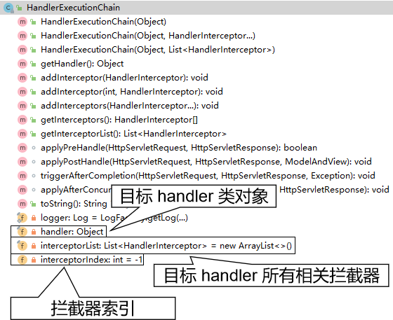
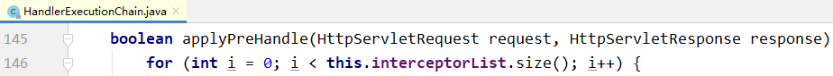
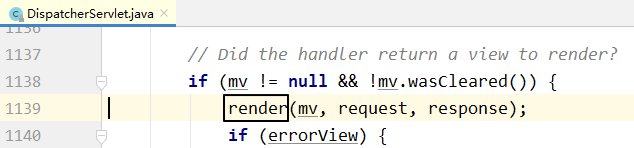
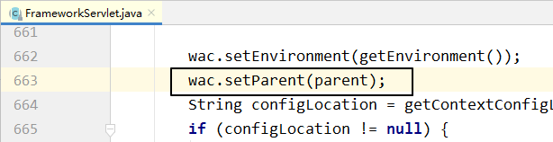

# 第一节 启动过程

## 1、Servlet 生命周期回顾


| 生命周期环节 | 调用的方法                                                   | 时机                                                         | 次数 |
| ------------ | ------------------------------------------------------------ | ------------------------------------------------------------ | ---- |
| 创建对象     | 无参构造器                                                   | 默认：第一次请求<br />修改：Web应用启动时 | 一次 |
| 初始化       | init(ServletConfig servletConfig)                            | 创建对象后                                                   | 一次 |
| 处理请求     | service(ServletRequest servletRequest, <br />ServletResponse servletResponse) | 接收到请求后                                                 | 多次 |
| 清理操作     | destroy()                                                    | Web应用卸载之前                                              | 一次 |

## 2、初始化操作调用路线图


## 3、IOC容器创建

所在类：org.springframework.web.servlet. FrameworkServlet

```java
protected WebApplicationContext createWebApplicationContext(@Nullable ApplicationContext parent) {
	Class<?> contextClass = getContextClass();
	if (!ConfigurableWebApplicationContext.class.isAssignableFrom(contextClass)) {
		throw new ApplicationContextException(
				"Fatal initialization error in servlet with name '" + getServletName() +
				"': custom WebApplicationContext class [" + contextClass.getName() +
				"] is not of type ConfigurableWebApplicationContext");
	}

    // 通过反射创建 IOC 容器对象
	ConfigurableWebApplicationContext wac =
			(ConfigurableWebApplicationContext) BeanUtils.instantiateClass(contextClass);

	wac.setEnvironment(getEnvironment());

    // 设置父容器
	wac.setParent(parent);
	String configLocation = getContextConfigLocation();
	if (configLocation != null) {
		wac.setConfigLocation(configLocation);
	}
	configureAndRefreshWebApplicationContext(wac);

	return wac;
}
```

## 4、将 IOC 容器对象存入应用域

所在类：org.springframework.web.servlet. FrameworkServlet

```java
protected WebApplicationContext initWebApplicationContext() {
	WebApplicationContext rootContext =
			WebApplicationContextUtils.getWebApplicationContext(getServletContext());
	WebApplicationContext wac = null;

	if (this.webApplicationContext != null) {
		wac = this.webApplicationContext;
		if (wac instanceof ConfigurableWebApplicationContext) {
			ConfigurableWebApplicationContext cwac = (ConfigurableWebApplicationContext) wac;
			if (!cwac.isActive()) {
				if (cwac.getParent() == null) {
					cwac.setParent(rootContext);
				}
				configureAndRefreshWebApplicationContext(cwac);
			}
		}
	}
	if (wac == null) {
		wac = findWebApplicationContext();
	}
	if (wac == null) {
        // 创建 IOC 容器
		wac = createWebApplicationContext(rootContext);
	}

	if (!this.refreshEventReceived) {
		synchronized (this.onRefreshMonitor) {
			onRefresh(wac);
		}
	}

	if (this.publishContext) {
		// 获取存入应用域时专用的属性名
		String attrName = getServletContextAttributeName();

        // 存入
		getServletContext().setAttribute(attrName, wac);
	}

	return wac;
}
```

看到这一点的意义：SpringMVC 有一个工具方法，可以从应用域获取 IOC 容器对象的引用。

工具类：org.springframework.web.context.support. WebApplicationContextUtils

工具方法：getWebApplicationContext()

```java
@Nullable
public static WebApplicationContext getWebApplicationContext(ServletContext sc) {
	return getWebApplicationContext(sc, WebApplicationContext.ROOT_WEB_APPLICATION_CONTEXT_ATTRIBUTE);
}
```

## 5、请求映射初始化

FrameworkServlet.createWebApplicationContext()→configureAndRefreshWebApplicationContext()→wac.refresh()→触发刷新事件→org.springframework.web.servlet. DispatcherServlet.initStrategies()→org.springframework.web.servlet. DispatcherServlet.initHandlerMappings()


## 6、小结

整个启动过程我们关心如下要点：

* DispatcherServlet 本质上是一个 Servlet，所以天然的遵循 Servlet 的生命周期。所以宏观上是 Servlet 生命周期来进行调度。
* DispatcherServlet 的父类是 FrameworkServlet。
  + FrameworkServlet 负责框架本身相关的创建和初始化。
  + DispatcherServlet 负责请求处理相关的初始化。
* FrameworkServlet 创建 IOC 容器对象之后会存入应用域。
* FrameworkServlet 完成初始化会调用 IOC 容器的刷新方法。
* 刷新方法完成触发刷新事件，在刷新事件的响应函数中，调用 DispatcherServlet 的初始化方法。
* 在 DispatcherServlet 的初始化方法中初始化了请求映射等。


# 第二节 请求处理过程

## 1、总体阶段

### ①流程描述

* 目标 handler 方法执行前
  + 建立调用链，确定整个执行流程
  + 拦截器的 preHandle() 方法
  + 注入请求参数
  + 准备目标 handler 方法所需所有参数
* 调用目标 handler 方法
* 目标 handler 方法执行后
  + 拦截器的 postHandle() 方法
  + 渲染视图
  + 拦截器的 afterCompletion() 方法

### ②核心代码

整个请求处理过程都是 doDispatch() 方法在宏观上协调和调度，把握了这个方法就理解了 SpringMVC 总体上是如何处理请求的。

所在类：org.springframework.web.servlet. DispatcherServlet

所在方法：doDispatch()

核心方法中的核心代码：

```java
// Actually invoke the handler.
mv = ha.handle(processedRequest, response, mappedHandler.getHandler());
```

## 2、调用前阶段

### ①建立调用链

#### [1]相关组件

全类名：org.springframework.web.servlet. HandlerExecutionChain



拦截器索引默认是 -1，说明开始的时候，它指向第一个拦截器前面的位置。每执行一个拦截器，就把索引向前移动一个位置。所以这个索引每次都是指向当前拦截器。所以它相当于拦截器的指针。

#### [2]对应操作

所在类：org.springframework.web.servlet.handler. AbstractHandlerMapping


结论：调用链是由拦截器和目标 handler 对象组成的。

### ②调用拦截器 preHandle()

所在类：org.springframework.web.servlet. DispatcherServlet

所在方法：doDispatch()


具体调用细节：正序调用

所在类：org.springframework.web.servlet. HandlerExecutionChain

所在方法：applyPreHandle



从这部分代码我们也能看到，为什么拦截器中的 preHandle() 方法通过返回布尔值能够控制是否放行。

* 每一个拦截器的 preHandle() 方法都返回 true：applyPreHandle() 方法返回 true，被取反就不执行 if 分支，继续执行后续操作，这就是放行。
* 任何一个拦截器的 preHandle() 方法返回 false：applyPreHandle() 方法返回 false，被取反执行 if 分支，return，导致 doDispatch() 方法结束，不执行后续操作，就是不放行。

### ③注入请求参数

#### [1]相关组件

接口：org.springframework.web.servlet. HandlerAdapter

作用：字面含义是适配器的意思，具体功能有三个

* 将请求参数绑定到实体类对象中
* 给目标 handler 方法准备所需的其他参数，例如：
  + Model、ModelMap、Map……
  + 原生 Servlet API：request、response、session……
  + BindingResult
  + @RequestParam 注解标记的零散请求参数
  + @PathVariable 注解标记的路径变量
* 调用目标 handler 方法

#### [2]创建并获取这个组件

所在类：org.springframework.web.servlet. DispatcherServlet

所在方法：doDispatch()


#### [3]具体操作：调用目标 handler 方法

所在类：org.springframework.web.servlet. DispatcherServlet

所在方法：doDispatch()


#### [4]具体操作：注入请求参数


通过反射给对应属性注入请求参数应该是下面的过程：

* 获取请求参数名称
* 将请求参数名称首字母设定为大写
* 在首字母大写后的名称前附加 set，得到目标方法名
* 通过反射调用 setXxx() 方法

### ④准备其他参数

以 Model 为例来进行说明。

#### [1]背景

在 handler 方法中，如果需要 Model、ModelMap、Map 等对象用来存放模型数据，那么直接在 handler 方法中声明这些类型的形参即可。

而不管我们声明 Model、ModelMap、Map 三者中的任何一个，其实实际传入的对象都是 BindingAwareModelMap 类型的。

#### [2]相关组件

组件类：org.springframework.web.method.support. ModelAndViewContainer

相关属性：defaultModel

```java
private final ModelMap defaultModel = new BindingAwareModelMap();
```

从这个属性的声明能够看出：defaultModel 直接就是用 BindingAwareModelMap 对象来初始化的。

#### [3]相关操作

相关接口：org.springframework.web.servlet. HandlerAdapter

所在类：org.springframework.web.servlet.mvc.method.annotation. RequestMappingHandlerAdapter

所在方法：invokeHandlerMethod()

操作1：创建 ModelAndViewContainer 对象


操作2：把 ModelAndViewContainer 对象传给 invokeAndHandle() 方法


## 3、调用后阶段

### ①调用拦截器的 postHandle() 方法

所在类：org.springframework.web.servlet. DispatcherServlet

所在方法：doDispatch()


调用细节：从拦截器集合长度 - 1 开始循环，循环到 0 为止。所以是倒序执行。


### ②渲染视图

#### [1]所有后续操作的入口

所在类：org.springframework.web.servlet. DispatcherServlet

所在方法：doDispatch()


#### [2]后续细节1：处理异常

所在类：org.springframework.web.servlet. DispatcherServlet

所在方法：processDispatchResult()


#### [3]后续细节2：渲染视图

所在类：org.springframework.web.servlet. DispatcherServlet

所在方法：processDispatchResult()



补充细节：模型数据存入请求域的具体位置

所在类：org.thymeleaf.context. WebEngineContext. RequestAttributesVariablesMap

所在方法：setVariable()


### ③调用拦截器的 afterCompletion() 方法

所在类：org.springframework.web.servlet. DispatcherServlet

所在方法：processDispatchResult()


调用细节：从拦截器索引开始循环，直到循环变量 i 被减到 0 为止。这样的效果是前面执行拦截器到哪里，就从哪里倒回去执行；前面没有执行的拦截器，现在也不执行。


## 4、所有断点总结

断点位置基准：SpringMVC 版本采用 5.3.1 且源码已经下载，包含注释。

| 所在类                                                       | 所在方法                   | 断点行数 | 作用                                                    |
| ------------------------------------------------------------ | -------------------------- | -------- | ------------------------------------------------------- |
| DispatcherServlet                                            | doDispatch()               | 1037     | 创建调用链对象                                          |
| DispatcherServlet                                            | doDispatch()               | 1044     | 创建 HandlerAdapter 对象                                |
| DispatcherServlet                                            | doDispatch()               | 1056     | 调用拦截器 preHandle()方法                              |
| DispatcherServlet                                            | doDispatch()               | 1061     | 执行目标 handler 方法                                   |
| DispatcherServlet                                            | doDispatch()               | 1068     | 调用拦截器 postHandle()方法                             |
| DispatcherServlet                                            | doDispatch()               | 1078     | 执行所有后续操作                                        |
| AbstractHandlerMapping                                       | getHandlerExecutionChain() | 592      | 创建调用链对象                                          |
| AbstractHandlerMapping                                       | getHandlerExecutionChain() | 599      | 在调用链中添加拦截器                                    |
| HandlerExecutionChain                                        | applyPreHandle()           | 146      | 调用拦截器 preHandle()方法                              |
| HandlerExecutionChain                                        | applyPostHandle()          | 163      | 调用拦截器 postHandle()方法                             |
| HandlerExecutionChain                                        | triggerAfterCompletion     | 175      | 调用拦截器 afterCompletion()方法                        |
| DataBinder                                                   | doBind()                   | 747      | 执行数据绑定                                            |
| RequestMappingHandlerAdapter                                 | invokeHandlerMethod()      | 868      | 创建 ModelAndViewContainer 对象                         |
| RequestMappingHandlerAdapter                                 | invokeHandlerMethod()      | 893      | 将ModelAndViewContainer 对象传入调用目标 handler 的方法 |
| DispatcherServlet                                            | processDispatchResult()    | 1125     | 处理异常                                                |
| DispatcherServlet                                            | processDispatchResult()    | 1139     | 渲染视图                                                |
| DispatcherServlet                                            | processDispatchResult()    | 1157     | 调用拦截器 afterCompletion()方法                        |
| WebEngineContext的内部类：<br />RequestAttributesVariablesMap | setVariable()              | 783      | 将模型数据存入请求域                                    |


# 第三节 ContextLoaderListener

## 1、提出问题

目前情况：DispatcherServlet 加载 spring-mvc.xml，此时整个 Web 应用中只创建一个 IOC 容器。将来整合Mybatis、配置声明式事务，全部在 spring-mvc.xml 配置文件中配置也是可以的。可是这样会导致配置文件太长，不容易维护。

所以想到把配置文件分开：

* 处理浏览器请求相关：spring-mvc.xml 配置文件
* 声明式事务和整合Mybatis相关：spring-persist.xml 配置文件

配置文件分开之后，可以让 DispatcherServlet 加载多个配置文件。例如：

```xml
<servlet>
    <servlet-name>dispatcherServlet</servlet-name>
    <servlet-class>org.springframework.web.servlet.DispatcherServlet</servlet-class>
    <init-param>
        <param-name>contextConfigLocation</param-name>
        <param-value>classpath:spring-*.xml</param-value>
    </init-param>
    <load-on-startup>1</load-on-startup>
</servlet>
```

如果希望这两个配置文件使用不同的机制来加载：

* DispatcherServlet 加载 spring-mvc.xml 配置文件：它们和处理浏览器请求相关
* ContextLoaderListener 加载 spring-persist.xml 配置文件：不需要处理浏览器请求，需要配置持久化层相关功能

此时会带来一个新的问题：在 Web 一个应用中就会出现两个 IOC 容器

* DispatcherServlet 创建一个 IOC 容器
* ContextLoaderListener 创建一个 IOC 容器

注意：本节我们探讨的这个技术方案并不是『可以』这样做。

## 2、配置 ContextLoaderListener

### ①创建 spring-persist.xml


### ②配置 ContextLoaderListener

```xml
<!-- 通过全局初始化参数指定 Spring 配置文件的位置 -->
<context-param>
    <param-name>contextConfigLocation</param-name>
    <param-value>classpath:spring-persist.xml</param-value>
</context-param>

<listener>
    <!-- 指定全类名，配置监听器 -->
    <listener-class>org.springframework.web.context.ContextLoaderListener</listener-class>
</listener>
```

### ③ContextLoaderListeners


| 方法名               | 执行时机           | 作用                  |
| -------------------- | ------------------ | --------------------- |
| contextInitialized() | Web 应用启动时执行 | 创建并初始化 IOC 容器 |
| contextDestroyed()   | Web 应用卸载时执行 | 关闭 IOC 容器         |

### ④ContextLoader

#### [1]指定配置文件位置的参数名

```java
/**
 * Name of servlet context parameter (i.e., {@value}) that can specify the
 * config location for the root context, falling back to the implementation's
 * default otherwise.
 * @see org.springframework.web.context.support.XmlWebApplicationContext#DEFAULT_CONFIG_LOCATION
 */
public static final String CONFIG_LOCATION_PARAM = "contextConfigLocation";
```

#### [2]初始化 IOC 容器

方法名：initWebApplicationContext()

#### [3]创建 IOC 容器

方法名：createWebApplicationContext()

## 3、探讨两个IOC容器之间的关系

打印两个 IOC 容器对象的 toString() 方法：

```java
Object springIOC = servletContext.getAttribute("org.springframework.web.context.WebApplicationContext.ROOT");
logger.debug(springIOC.toString());

Object springMVCIOC = servletContext.getAttribute("org.springframework.web.servlet.FrameworkServlet.CONTEXT.dispatcherServlet");
logger.debug(springMVCIOC.toString());
```

打印效果是：

> Root WebApplicationContext, started on Thu Jun 17 14:49:17 CST 2021
>
> WebApplicationContext for namespace 'dispatcherServlet-servlet', started on Thu Jun 17 14:49:18 CST 2021, parent: Root WebApplicationContext

结论：两个组件分别创建的 IOC 容器是父子关系。

* 父容器：ContextLoaderListener 创建的 IOC 容器
* 子容器：DispatcherServlet 创建的 IOC 容器

父子关系是如何决定的？

* ContextLoaderListener 初始化时如果检查到有已经存在的根级别 IOC 容器，那么会抛出异常。
* DispatcherServlet 创建的 IOC 容器会在初始化时先检查当前环境下是否存在已经创建好的 IOC 容器。
  + 如果有：则将已存在的这个 IOC 容器设置为自己的父容器
  + 如果没有：则将自己设置为 root 级别的 IOC 容器
* 同时 Tomcat 在读取 web.xml 之后，加载组件的顺序就是监听器、过滤器、Servlet。

DispatcherServlet 创建的 IOC 容器设置父容器的源码截图：

所在类：org.springframework.web.servlet. FrameworkServlet

所在方法：createWebApplicationContext()



## 4、探讨两个 IOC 容器之间 bean 的互相访问


spring-mvc.xml配置方式：

```xml
<context:component-scan base-package="com.atguigu.spring.component.controller"/>
```

spring-persist.xml配置方式：

```xml
<context:component-scan base-package="com.atguigu.spring.component.service,com.atguigu.spring.component.dao"/>
```

所以bean所属IOC容器的关系：

* 父容器
  + EmpService
  + EmpDao
* 子容器
  + EmpController

结论：子容器中的 EmpController 装配父容器中的 EmpService 能够正常工作。说明子容器可以访问父容器中的bean。

分析：“子可用父，父不能用子”的根本原因是子容器中有一个属性 getParent() 可以获取到父容器这个对象的引用。

源码依据：

* 在 AbstractApplicationContext 类中，有 parent 属性
* 在 AbstractApplicationContext 类中，有获取 parent 属性的 getParent() 方法
* 子容器可以通过 getParent() 方法获取到父容器对象的引用
* 进而调用父容器中类似 “getBean()” 这样的方法获取到需要的 bean 完成装配
* 而父容器中并没有类似 “getChildren()“ 这样的方法，所以没法拿到子容器对象的引用


## 5、有可能重复创建对象


### ①查看日志确认是否重复创建了对象

> Root WebApplicationContext: initialization started
>
> ……
>
> Creating shared instance of singleton bean 'helloDao'
> Creating shared instance of singleton bean 'helloHandler'
> Creating shared instance of singleton bean 'helloService'
>
> ……
>
> Root WebApplicationContext initialized in 1150 ms
>
> ……
>
> Refreshing WebApplicationContext for namespace 'dispatcherServlet-servlet'
>
> ……
>
> Creating shared instance of singleton bean 'helloDao'
>
> Creating shared instance of singleton bean 'helloHandler'
>
> Creating shared instance of singleton bean 'helloService'
>
> ……

### ②重复创建对象的问题

* 浪费内存空间

* 两个 IOC 容器能力是不同的

  + spring-mvc.xml：仅配置和处理请求相关的功能。所以不能给 service 类附加声明式事务功能。
    结论：基于 spring-mvc.xml 配置文件创建的 EmpService 的 bean 不带有声明式事务的功能

    影响：DispatcherServlet 处理浏览器请求时会调用自己创建的 EmpController，然后再调用自己创建的EmpService，而这个 EmpService 是没有事务的，所以处理请求时没有事务功能的支持。

  + spring-persist.xml：配置声明式事务。所以可以给 service 类附加声明式事务功能。
    结论：基于 spring-persist.xml 配置文件创建的 EmpService 有声明式事务的功能

    影响：由于 DispatcherServlet 的 IOC 容器会优先使用自己创建的 EmpController，进而装配自己创建的EmpService，所以基于 spring-persist.xml 配置文件创建的有声明式事务的 EmpService 用不上。

### ③解决重复创建对象的问题

#### [1]解决方案一[建议使用]

让两个配置文件配置自动扫描的包时，各自扫描各自的组件。

* SpringMVC 就扫描 XxxHandler
* Spring 扫描 XxxService 和 XxxDao

#### [2]解决方案二

如果由于某种原因，必须扫描同一个包，确实存在重复创建对象的问题，可以采取下面的办法处理。

* spring-mvc.xml 配置文件在整体扫描的基础上进一步配置：仅包含被 @Controller 注解标记的类。
* spring-persist.xml 配置在整体扫描的基础上进一步配置：排除被 @Controller 注解标记的类。

具体spring-mvc.xml配置文件中的配置方式如下：

```xml
<!-- 两个Spring的配置文件扫描相同的包 -->
<!-- 为了解决重复创建对象的问题，需要进一步制定扫描组件时的规则 -->
<!-- 目标：『仅』包含@Controller注解标记的类 -->
<!-- use-default-filters="false"表示关闭默认规则，表示什么都不扫描，此时不会把任何组件加入IOC容器；
        再配合context:include-filter实现“『仅』包含”效果 -->
<context:component-scan base-package="com.atguigu.spring.component" use-default-filters="false">

    <!-- context:include-filter标签配置一个“扫描组件时要包含的类”的规则，追加到默认规则中 -->
    <!-- type属性：指定规则的类型，根据什么找到要包含的类，现在使用annotation表示基于注解来查找 -->
    <!-- expression属性：规则的表达式。如果type属性选择了annotation，那么expression属性配置注解的全类名 -->
    <context:include-filter type="annotation" expression="org.springframework.stereotype.Controller"/>
</context:component-scan>
```

具体spring-persist.xml配置文件中的配置方式如下：

```xml
<!-- 两个Spring的配置文件扫描相同的包 -->
<!-- 在默认规则的基础上排除标记了@Controller注解的类 -->
<context:component-scan base-package="com.atguigu.spring.component">

    <!-- 配置具体排除规则：把标记了@Controller注解的类排除在扫描范围之外 -->
    <context:exclude-filter type="annotation" expression="org.springframework.stereotype.Controller"/>
</context:component-scan>
```

## 6、小结

* DispatcherServlet 和 ContextLoaderListener 并存
  + DispatcherServlet 负责加载 SpringMVC 的配置文件，例如：spring-mvc.xml
  + ContextLoaderListener 负责加载 Spring 的配置文件，例如：spring-persist.xml
* 两个 IOC 容器的关系：
  + ContextLoaderListener 创建的容器是父容器
  + DispatcherServlet 创建的容器是子容器
* bean 的装配
  + 子容器可以访问父容器中的 bean
  + 父容器不能访问子容器中的 bean
* 两个容器扫描同一个包会导致重复创建对象
  + 解决办法一：各自扫描各自的包
  + 解决办法二：
    - DispatcherServlet 创建的容器仅扫描 handler
    - ContextLoaderListener 创建的容器不扫描 handler


