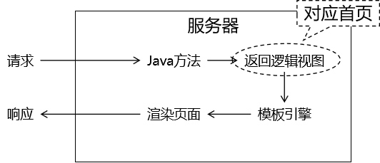
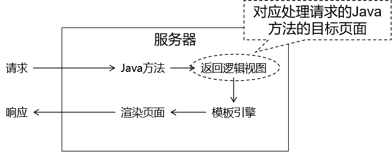
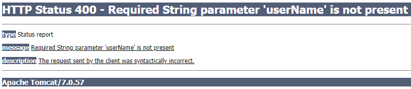

# 第一节 概述

## 1、SpringMVC 优势

SpringMVC 是 Spring 为表述层开发提供的一整套完备的解决方案。在表述层框架历经 Strust、WebWork、Strust2 等诸多产品的历代更迭之后，目前业界普遍选择了 SpringMVC 作为 Java EE 项目表述层开发的首选方案。之所以能做到这一点，是因为 SpringMVC 具备如下显著优势：

* Spring 家族原生产品，与 IOC 容器等基础设施无缝对接
* 表述层各细分领域需要解决的问题全面解决方案
* 代码清新简洁，大幅度提升开发效率
* 内部组件化程度高，可插拔式组件即插即用，想要什么功能配置相应组件即可
* 性能卓著，尤其适合现代大型、超大型互联网项目要求

## 2、表述层框架要解决的基本问题

* 请求映射
* 数据输入
* 视图界面
* 请求分发
* 表单回显
* 会话控制
* 过滤拦截
* 异步交互
* 文件上传
* 文件下载
* 数据校验
* 类型转换

## 3、SpringMVC 代码对比

### ①基于原生 Servlet API 开发代码片段

```java
protected void doGet(HttpServletRequest request, HttpServletResponse response) throws ServletException, IOException {

    String userName = request.getParameter("userName");

    System.out.println("userName="+userName);

}
```

### ②基于 SpringMVC 开发代码片段

```java
@RequestMapping("/user/login")
public String login(@RequestParam("userName") String userName){

    System.out.println("userName="+userName);

    return "result";
}
```


# 第二节 HelloWorld

## 1、功能需求

### ①访问首页



### ②在首页点超链接



## 2、搭建环境

### ①导入依赖

```xml
<dependencies>
    <!-- SpringMVC -->
    <dependency>
        <groupId>org.springframework</groupId>
        <artifactId>spring-webmvc</artifactId>
        <version>5.3.1</version>
    </dependency>

    <!-- 日志 -->
    <dependency>
        <groupId>ch.qos.logback</groupId>
        <artifactId>logback-classic</artifactId>
        <version>1.2.3</version>
    </dependency>

    <!-- ServletAPI -->
    <dependency>
        <groupId>javax.servlet</groupId>
        <artifactId>javax.servlet-api</artifactId>
        <version>3.1.0</version>
        <scope>provided</scope>
    </dependency>

    <!-- Spring5和Thymeleaf整合包 -->
    <dependency>
        <groupId>org.thymeleaf</groupId>
        <artifactId>thymeleaf-spring5</artifactId>
        <version>3.0.12.RELEASE</version>
    </dependency>
</dependencies>
```

由于 Maven 的传递性，我们不必将所有需要的包全部配置依赖，而是配置最顶端的依赖，其他靠传递性导入。


### ②日志配置文件

```xml
<?xml version="1.0" encoding="UTF-8"?>
<configuration debug="true">
    <!-- 指定日志输出的位置 -->
    <appender name="STDOUT"
              class="ch.qos.logback.core.ConsoleAppender">
        <encoder>
            <!-- 日志输出的格式 -->
            <!-- 按照顺序分别是：时间、日志级别、线程名称、打印日志的类、日志主体内容、换行 -->
            <pattern>[%d{HH:mm:ss.SSS}] [%-5level] [%thread] [%logger] [%msg]%n</pattern>
        </encoder>
    </appender>

    <!-- 设置全局日志级别。日志级别按顺序分别是：DEBUG、INFO、WARN、ERROR -->
    <!-- 指定任何一个日志级别都只打印当前级别和后面级别的日志。 -->
    <root level="INFO">
        <!-- 指定打印日志的appender，这里通过“STDOUT”引用了前面配置的appender -->
        <appender-ref ref="STDOUT" />
    </root>

    <!-- 根据特殊需求指定局部日志级别 -->
    <logger name="org.springframework.web.servlet.DispatcherServlet" level="DEBUG" />

</configuration>
```

### ③web.xml

```xml
<!-- 配置SpringMVC中负责处理请求的核心Servlet，也被称为SpringMVC的前端控制器 -->
<servlet>
    <servlet-name>DispatcherServlet</servlet-name>

    <!-- DispatcherServlet的全类名 -->
    <servlet-class>org.springframework.web.servlet.DispatcherServlet</servlet-class>

    <!-- 通过初始化参数指定SpringMVC配置文件位置 -->
    <init-param>

        <!-- 如果不记得contextConfigLocation配置项的名称，可以到DispatcherServlet的父类FrameworkServlet中查找 -->
        <param-name>contextConfigLocation</param-name>

        <!-- 使用classpath:说明这个路径从类路径的根目录开始才查找 -->
        <param-value>classpath:spring-mvc.xml</param-value>
    </init-param>

    <!-- 作为框架的核心组件，在启动过程中有大量的初始化操作要做，这些操作放在第一次请求时才执行非常不恰当 -->
    <!-- 我们应该将DispatcherServlet设置为随Web应用一起启动 -->
    <load-on-startup>1</load-on-startup>

</servlet>

<servlet-mapping>
    <servlet-name>DispatcherServlet</servlet-name>

    <!-- 对DispatcherServlet来说，url-pattern有两种方式配置 -->
    <!-- 方式一：配置“/”，表示匹配整个Web应用范围内所有请求。这里有一个硬性规定：不能写成“/*”。只有这一个地方有这个特殊要求，以后我们再配置Filter还是可以正常写“/*”。 -->
    <!-- 方式二：配置“*.扩展名”，表示匹配整个Web应用范围内部分请求 -->
    <url-pattern>/</url-pattern>
</servlet-mapping>
```

### ④Spring配置文件

```xml
<!-- 自动扫描包 -->
<context:component-scan base-package="com.atguigu.mvc.handler"/>

<!-- Thymeleaf视图解析器 -->
<bean id="viewResolver" class="org.thymeleaf.spring5.view.ThymeleafViewResolver">
    <property name="order" value="1"/>
    <property name="characterEncoding" value="UTF-8"/>
    <property name="templateEngine">
        <bean class="org.thymeleaf.spring5.SpringTemplateEngine">
            <property name="templateResolver">
                <bean class="org.thymeleaf.spring5.templateresolver.SpringResourceTemplateResolver">

                    <!-- 视图前缀 -->
                    <property name="prefix" value="/WEB-INF/templates/"/>

                    <!-- 视图后缀 -->
                    <property name="suffix" value=".html"/>
                    <property name="templateMode" value="HTML5"/>
                    <property name="characterEncoding" value="UTF-8" />
                </bean>
            </property>
        </bean>
    </property>
</bean>
```

## 3、代码实现

### ①创建请求处理器类

#### [1]名称

SpringMVC 对处理请求的类并没有特殊要求，只要是 POJO 即可。我们自己习惯上有两种命名方式：

* XxxHandler：意思是 Xxx 处理器的意思
* XxxController：意思是 Xxx 控制器的意思

这只是一个命名的习惯，不是语法要求。所以往往把处理请求的类叫做『Handler类』，处理请求的方法叫做『Handler方法』。

#### [2]创建


```java
@Controller
public class Demo01HelloHandler {

}
```

### ②实现访问首页

#### [1]创建 handler 方法

```java
@Controller
public class Demo01HelloHandler {

    // @RequestMapping注解在请求地址和Java方法之间建立映射关系
    @RequestMapping("/")
    public String showPortal() {
        return "portal";
    }

}
```

#### [2]在首页编写超链接


```html
<!DOCTYPE html>
<html lang="en" xmlns:th="http://www.thymeleaf.org">

<head>
    <meta charset="UTF-8">
    <title>首页</title>
</head>

<body>

    <h1>首页</h1>

    <!-- 以后我们会越来越倾向于用一句话来作为请求的URL地址，在这样的一句话中使用“/”分隔各个单词 -->
    <!-- say hello to spring mvc -->
    <!-- /say/hello/to/spring/mvc -->
    <a th:href="@{/say/hello/to/spring/mvc}">HelloWorld</a><br />

</body>

</html>
```

### ③实现点击超链接

#### [1]加入日志记录仪

在 handler 类中声明一个成员变量：

```java
private Logger logger = LoggerFactory.getLogger(this.getClass());
```

* Logger：org.slf4j. Logger
* LoggerFactory：org.slf4j. LoggerFactory

使用日志而不是 sysout 的方式在控制台打印，好处在于：根据日志的级别可以非常方便的控制某些日志是否打印。

不管 sysout 还是日志，只要是在控制台打印数据，底层都是 I/O 操作。在项目中，访问数据库和 I/O 都是典型的高消耗型的操作。

在控制台打印的数据，用户看不到，打印它肯定是为了调试程序等类似需求。所以在项目上线的时候，用于调试程序的控制台打印都应该去掉。

如果我们是通过 sysout 方式打印，那么它们会分散在项目中的各个地方，想要通过手动方式删除会很繁琐也可能会有遗漏。

而使用日志的方式，只要在配置文件中修改一下日志级别，就能全面控制某个级别的日志打印或者不打印。

而且日志框架通常都能够指定日志保存的位置，如果有需要可以将日志数据保存到数据库等位置。

#### [2]声明 handler 方法

```java
// 以后我们会越来越倾向于用一句话来作为请求的URL地址
// 在这样的一句话中使用“/”分隔各个单词
@RequestMapping("/say/hello/to/spring/mvc")
public String sayHello() {

    // 方法内部打印日志，证明 SpringMVC 确实调用了这个方法来处理请求
    logger.debug("我是 SpringMVC 的 Hello world。");

    return "target";
}
```

#### [3]创建目标页面


```html
<!DOCTYPE html>
<html lang="en" xmlns:th="http://www.thymeleaf.org">

<head>
    <meta charset="UTF-8">
    <title>目标页面</title>
</head>

<body>

    <h1>目标页面</h1>

    <a th:href="@{/}">回首页</a>

</body>

</html>
```

### ④整体流程解析


# 第三节 @RequestMapping注解

从注解名称上我们可以看到，@RequestMapping注解的作用就是将请求的 URL 地址和处理请求的方式关联起来，建立映射关系。

SpringMVC 接收到指定的请求，就会来找到在映射关系中对应的方法来处理这个请求。

## 1、匹配方式说明

### ①精确匹配

在@RequestMapping注解指定 URL 地址时，不使用任何通配符，按照请求地方进行精确匹配。

```html
<a th:href="@{/say/hello/to/spring/mvc}">HelloWorld</a><br />
```

```java
@RequestMapping("/say/hello/to/spring/mvc")
```

### ②模糊匹配

在@RequestMapping注解指定 URL 地址时，通过使用通配符，匹配多个类似的地址。

```html
<h3>测试@RequestMapping注解匹配方式</h3>
<a th:href="@{/fruit/apple}">@RequestMapping模糊匹配[apple]</a><br />
<a th:href="@{/fruit/orange}">@RequestMapping模糊匹配[orange]</a><br />
<a th:href="@{/fruit/banana}">@RequestMapping模糊匹配[banana]</a><br />
```

```java
@RequestMapping("/fruit/*")
```

## 2、在类级别标记

### ①超链接的HTML标签

```html
<h3>测试@RequestMapping注解标记在类上</h3>
<a th:href="@{/user/login}">用户登录</a><br />
<a th:href="@{/user/register}">用户注册</a><br />
<a th:href="@{/user/logout}">用户退出</a><br />
```

### ②仅标记在方法上的@RequestMapping注解

```java
@RequestMapping("/user/login")
@RequestMapping("/user/register")
@RequestMapping("/user/logout")
```

### ③分别标记在类和方法上的@RequestMapping注解

在类级别：抽取各个方法上@RequestMapping注解地址中前面重复的部分

```java
@RequestMapping("/user")
```

在方法级别：省略被类级别抽取的部分

```java
@RequestMapping("/login")
@RequestMapping("/register")
@RequestMapping("/logout")
```

## 3、附加请求方式要求

### ①请求方式

HTTP 协议定义了八种请求方式，在 SpringMVC 中封装到了下面这个枚举类：

```java
public enum RequestMethod {

	GET, HEAD, POST, PUT, PATCH, DELETE, OPTIONS, TRACE

}
```

### ②@RequestMapping附加请求方式

前面代码中，只要求请求地址匹配即可，现在附加了请求方式后，还要求请求方式也必须匹配才可以。

#### [1]HTML代码

```html
<h3>测试@RequestMapping注解限定请求方式</h3>
<a th:href="@{/emp}">同地址GET请求</a><br />
<form th:action="@{/emp}" method="post">
    <button type="submit">同地址POST请求</button>
</form>
<br />
```

#### [2]handler方法

处理 GET 请求：

```java
@RequestMapping(value = "/emp", method = RequestMethod.GET)
public String empGet() {

    logger.debug("GET 请求");

    return "target";
}
```

处理 POST 请求：

```java
@RequestMapping(value = "/emp", method = RequestMethod.POST)
public String empPost() {

    logger.debug("POST 请求");

    return "target";
}
```

### ③进阶版

| 原版                                                         | 进阶版               |
| ------------------------------------------------------------ | -------------------- |
| @RequestMapping(value = "/emp", <br />method = RequestMethod. GET) | @GetMapping("/emp")  |
| @RequestMapping(value = "/emp", <br />method = RequestMethod. POST) | @PostMapping("/emp") |

除了 @GetMapping、@PostMapping 还有下面几个类似的注解：

* @see PutMapping
* @see DeleteMapping
* @see PatchMapping

另外需要注意：进阶版的这几个注解是从 4.3 版本才开始有，低于 4.3 版本无法使用。

## 4、Ambiguous mapping异常

出现原因：多个 handler 方法映射了同一个地址，导致 SpringMVC 在接收到这个地址的请求时该找哪个 handler 方法处理。

> Caused by: java.lang. IllegalStateException: Ambiguous mapping. Cannot map 'demo03MappingMethodHandler' method
> com.atguigu.mvc.handler. Demo03MappingMethodHandler#empPost()
> to { [/emp]}: There is already 'demo03MappingMethodHandler' bean method
> com.atguigu.mvc.handler. Demo03MappingMethodHandler#empGet() mapped.


# 第四节 获取请求参数

## 1、一名一值

### ①超链接

```html
<a th:href="@{/param/one/name/one/value(userName='tom')}">一个名字一个值的情况</a><br />
```

### ②@RequestParam注解

#### [1]最基本的用法

```java
@RequestMapping("/param/one/name/one/value")
public String oneNameOneValue(
        // 使用@RequestParam注解标记handler方法的形参
        // SpringMVC 会将获取到的请求参数从形参位置给我们传进来
        @RequestParam("userName") String userName
) {

    logger.debug("获取到请求参数：" + userName);

    return "target";
}
```

#### [2]@RequestParam注解省略的情况

```java
@RequestMapping("/param/one/name/one/value")
public String oneNameOneValue(
        // 当请求参数名和形参名一致，可以省略@RequestParam("userName")注解
        // 但是，省略后代码可读性下降而且将来在SpringCloud中不能省略，所以建议还是不要省略
        String userName
) {

    logger.debug("★获取到请求参数：" + userName);

    return "target";
}
```

#### [3]必须的参数没有提供



页面信息说明：

* 响应状态码：400（在 SpringMVC 环境下，400通常和数据注入相关）
* 说明信息：必需的 String 请求参数 'userName' 不存在

原因可以参考 @RequestParam 注解的 required 属性：默认值为true，表示请求参数默认必须提供

```java
	/**
	 * Whether the parameter is required.
	 * <p>Defaults to {@code true}, leading to an exception being thrown
	 * if the parameter is missing in the request. Switch this to
	 * {@code false} if you prefer a {@code null} value if the parameter is
	 * not present in the request.
	 * <p>Alternatively, provide a {@link #defaultValue}, which implicitly
	 * sets this flag to {@code false}.
	 */
	boolean required() default true;
```

#### [4]关闭请求参数必需

required 属性设置为 false 表示这个请求参数可有可无：

```java
@RequestParam(value = "userName", required = false)
```

#### [5]给请求参数设置默认值

使用 defaultValue 属性给请求参数设置默认值：

```java
@RequestParam(value = "userName", required = false, defaultValue = "missing")
```

此时 required 属性可以继续保持默认值：

```java
@RequestParam(value = "userName", defaultValue = "missing")
```

## 2、一名多值

### ①表单

```html
<form action="team" method="post">
    请选择你最喜欢的球队：
    <input type="checkbox" name="team" value="Brazil" />巴西
    <input type="checkbox" name="team" value="German" />德国
    <input type="checkbox" name="team" value="French" />法国
    <input type="checkbox" name="team" value="Holland" />荷兰
    <input type="checkbox" name="team" value="Italian" />意大利
    <input type="checkbox" name="team" value="China" />中国
    <br />
    <input type="submit" value="保存" />
</form>
```

### ②handler方法

```java
@RequestMapping("/param/one/name/multi/value")
public String oneNameMultiValue(

        // 在服务器端 handler 方法中，使用一个能够存储多个数据的容器就能接收一个名字对应的多个值请求参数
        @RequestParam("team") List<String> teamList
        ) {

    for (String team : teamList) {
        logger.debug("team = " + team);
    }

    return "target";
}
```

## 3、表单对应模型

### ①表单

```html
<form action="emp/save" method="post">
    姓名：<input type="text" name="empName" /><br />
    年龄：<input type="text" name="empAge" /><br />
    工资：<input type="text" name="empSalary" /><br />
    <input type="submit" value="保存" />
</form>
```

### ②实体类

```java
public class Employee {

    private Integer empId;
    private String empName;
    private int empAge;
    private double empSalary;
    ……
```

### ③handler方法

```java
@RequestMapping("/param/form/to/entity")
public String formToEntity(

        // SpringMVC 会自动调用实体类中的 setXxx() 注入请求参数
        Employee employee) {

    logger.debug(employee.toString());

    return "target";
}
```

### ④POST请求的字符乱码问题

到 web.xml 中配置 CharacterEncodingFilter 即可：

```xml
<!-- 配置过滤器解决 POST 请求的字符乱码问题 -->
<filter>
    <filter-name>CharacterEncodingFilter</filter-name>
    <filter-class>org.springframework.web.filter.CharacterEncodingFilter</filter-class>

    <!-- encoding参数指定要使用的字符集名称 -->
    <init-param>
        <param-name>encoding</param-name>
        <param-value>UTF-8</param-value>
    </init-param>

    <!-- 请求强制编码 -->
    <init-param>
        <param-name>forceRequestEncoding</param-name>
        <param-value>true</param-value>
    </init-param>

    <!-- 响应强制编码 -->
    <init-param>
        <param-name>forceResponseEncoding</param-name>
        <param-value>true</param-value>
    </init-param>
</filter>
<filter-mapping>
    <filter-name>CharacterEncodingFilter</filter-name>
    <url-pattern>/*</url-pattern>
</filter-mapping>
```

注1：在较低版本的 SpringMVC 中，forceRequestEncoding 属性、forceResponseEncoding 属性没有分开，它们是一个 forceEncoding 属性。这里需要注意一下。

注2：由于 CharacterEncodingFilter 是通过 request.setCharacterEncoding(encoding); 来设置请求字符集，所以在此操作前不能有任何的 request.getParameter() 操作。在设置字符集之前获取过请求参数，那么设置字符集的操作将无效。

## 4、表单对应实体类包含级联属性

### ①实体类

```java
public class Student {

    private String stuName;
    private School school;
    private List<Subject> subjectList;
    private Subject[] subjectArray;
    private Set<Teacher> teacherSet;
    private Map<String, Double> scores;

    public Student() {
        //在各种常用数据类型中，只有Set类型需要提前初始化
        //并且要按照表单将要提交的对象数量进行初始化
        //Set类型使用非常不便，要尽可能避免使用Set
        teacherSet = new HashSet<>();
        teacherSet.add(new Teacher());
        teacherSet.add(new Teacher());
        teacherSet.add(new Teacher());
        teacherSet.add(new Teacher());
        teacherSet.add(new Teacher());
    }
    ……
```

[其他实体类点这里](verse04/detail01.html)

### ②表单

表单项中的 name 属性值必须严格按照级联对象的属性来设定：

```html
<!-- 提交数据的表单 -->
<form th:action="@{/caseFour}" method="post">
    stuName：<input type="text" name="stuName" value="tom" /><br />
    school.schoolName:<input type="text" name="school.schoolName" value="atguigu" /><br />
    subjectList[0].subjectName:<input type="text" name="subjectList[0].subjectName" value="java" /><br />
    subjectList[1].subjectName:<input type="text" name="subjectList[1].subjectName" value="php" /><br />
    subjectList[2].subjectName:<input type="text" name="subjectList[2].subjectName" value="javascript" /><br />
    subjectList[3].subjectName:<input type="text" name="subjectList[3].subjectName" value="css" /><br />
    subjectList[4].subjectName:<input type="text" name="subjectList[4].subjectName" value="vue" /><br />
    subjectArray[0].subjectName:<input type="text" name="subjectArray[0].subjectName" value="spring" /><br />
    subjectArray[1].subjectName:<input type="text" name="subjectArray[1].subjectName" value="SpringMVC" /><br />
    subjectArray[2].subjectName:<input type="text" name="subjectArray[2].subjectName" value="mybatis" /><br />
    subjectArray[3].subjectName:<input type="text" name="subjectArray[3].subjectName" value="maven" /><br />
    subjectArray[4].subjectName:<input type="text" name="subjectArray[4].subjectName" value="mysql" /><br />
    tearcherSet[0].teacherName:<input type="text" name="tearcherSet[0].teacherName" value="t_one" /><br />
    tearcherSet[1].teacherName:<input type="text" name="tearcherSet[1].teacherName" value="t_two" /><br />
    tearcherSet[2].teacherName:<input type="text" name="tearcherSet[2].teacherName" value="t_three" /><br />
    tearcherSet[3].teacherName:<input type="text" name="tearcherSet[3].teacherName" value="t_four" /><br />
    tearcherSet[4].teacherName:<input type="text" name="tearcherSet[4].teacherName" value="t_five" /><br />
    scores['Chinese']：input type="text" name="scores['Chinese']" value="100"/><br />
    scores['English']：<input type="text" name="scores['English']" value="95" /><br />
    scores['Mathematics']：<input type="text" name="scores['Mathematics']" value="88" /><br />
    scores['Chemistry']：<input type="text" name="scores['Chemistry']" value="63" /><br />
    scores['Biology']：<input type="text" name="scores['Biology']" value="44" /><br />
    <input type="submit" value="保存" />
</form>
```

### ③handler方法

```java
@RequestMapping("/param/form/to/nested/entity")
public String formToNestedEntity(

        // SpringMVC 自己懂得注入级联属性，只要属性名和对应的getXxx()、setXxx()匹配即可
        Student student) {

    logger.debug(student.toString());

    return "target";
}
```

## 5、要发送的数据是 List

### ①额外封装一层

```java
public class EmployeeParam {

    private List<Employee> employeeList;
    ……
```

### ②表单

```html
直接发送 List&lt;Employee&gt;：<br />
<form th:action="@{/param/list/emp}" method="post">
    1号员工姓名：<input type="text" name="employeeList[0].empName" /><br />
    1号员工年龄：<input type="text" name="employeeList[0].empAge" /><br />
    1号员工工资：<input type="text" name="employeeList[0].empSalary" /><br />
    2号员工姓名：<input type="text" name="employeeList[1].empName" /><br />
    2号员工年龄：<input type="text" name="employeeList[1].empAge" /><br />
    2号员工工资：<input type="text" name="employeeList[1].empSalary" /><br />
    <button type="submit">保存</button>
</form>
```

### ③handler方法

```java
@RequestMapping("/param/list/emp")
public String saveEmpList(
        // SpringMVC 访问这里实体类的setEmployeeList()方法注入数据
        EmployeeParam employeeParam
) {

    List<Employee> employeeList = employeeParam.getEmployeeList();

    for (Employee employee : employeeList) {
        logger.debug(employee.toString());
    }

    return "target";
}
```


# 第五节 @RequestHeader注解

## 1、作用

通过这个注解获取请求消息头中的具体数据。

## 2、用法

```java
@RequestMapping("/request/header")
public String getRequestHeader(

        // 使用 @RequestHeader 注解获取请求消息头信息
        // name 或 value 属性：指定请求消息头名称
        // defaultValue 属性：设置默认值
        @RequestHeader(name = "Accept", defaultValue = "missing") String accept
) {

    logger.debug("accept = " +accept);

    return "target";
}
```


# 第六节 @CookieValue注解

## 1、作用

获取当前请求中的 Cookie 数据。

## 2、用法

```java
@RequestMapping("/request/cookie")
public String getCookie(

        // 使用 @CookieValue 注解获取指定名称的 Cookie 数据
        // name 或 value 属性：指定Cookie 名称
        // defaultValue 属性：设置默认值
        @CookieValue(value = "JSESSIONID", defaultValue = "missing") String cookieValue,

        // 形参位置声明 HttpSession 类型的参数即可获取 HttpSession 对象
        HttpSession session
) {

    logger.debug("cookieValue = " + cookieValue);

    return "target";
}
```


# 第七节 页面跳转控制

## 1、准备工作

* 准备一个地址在前后缀范围之外的页面
* 让这个页面能够成功访问

### ①创建范围之外的页面


```html
<body>

    <h1>范围之外页面</h1>

</body>
```

### ②在 SpringMVC 配置文件加入配置

下面配置是访问静态资源所需配置，后面会专门说，现在先直接拿来用：

```xml
    <mvc:annotation-driven/>
    <mvc:default-servlet-handler/>
```

## 2、使用指令

### ①转发指令

```java
@RequestMapping("/test/forward/command")
public String forwardCommand() {

    // 需求：要转发前往的目标地址不在视图前缀指定的范围内，
    // 通过返回逻辑视图、拼接前缀后缀得到的物理视图无法达到目标地址

    // 转发到指定的地址：
    return "forward:/outter.html";
}
```

### ②重定向指令

```java
@RequestMapping("/test/redirect/command")
public String redirectCommand() {

    // 重定向到指定的地址：
    // 这个地址由 SpringMVC 框架负责在前面附加 contextPath，所以我们不能加，我们加了就加多了
    // 框架增加 contextPath 后：/demo/outter.html
    // 我们多加一个：/demo/demo/outter.html
    return "redirect:/outter.html";
}
```


