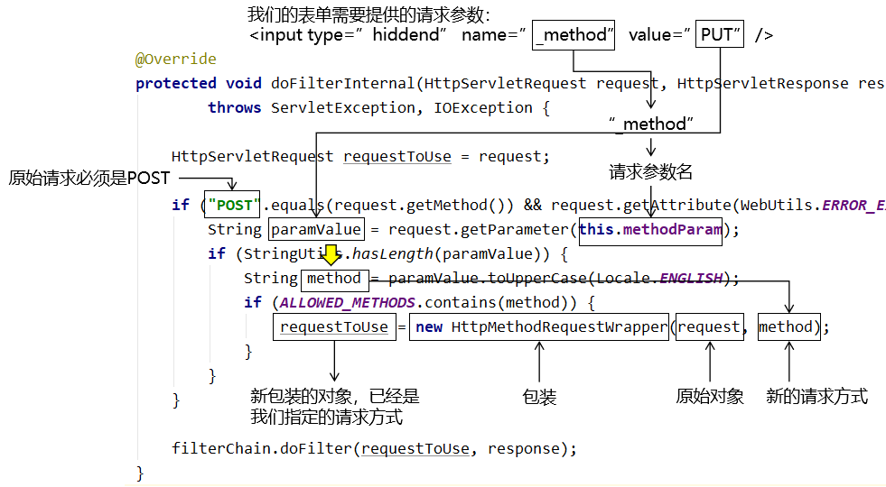
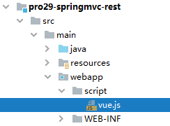
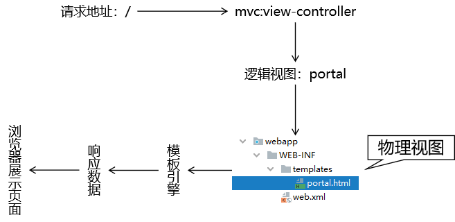
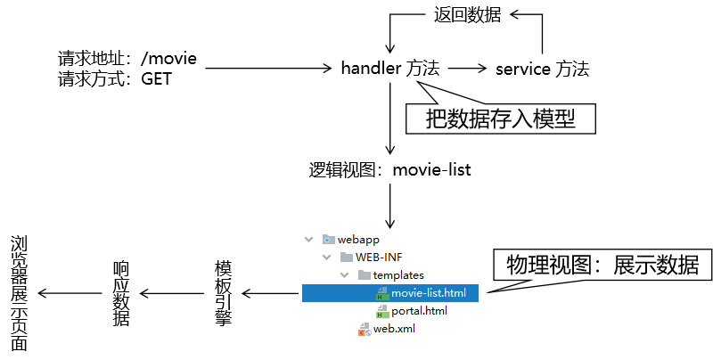
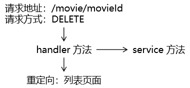
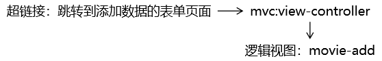
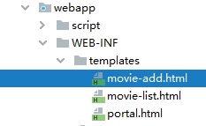
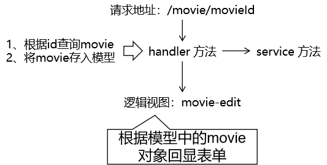

# 第一节 RESTFul概述

## 1、REST 概念

REST：Transfer，表现层资源状态转移。

* 定位：互联网软件架构风格
* 倡导者：Roy Thomas Fielding
* 文献：Roy Thomas Fielding的博士论文

## 2、挑战与应对

### ①一项技术标准规范一统天下

端到端之间的交互协议、技术实现方案有多少种？

* SOAP
* WSDL
* XML-RPC
* socket
* SMTP
* POP3
* ……

面对各种不同领域的各种不同协议、技术标准、解决方案，我们程序员是真的头秃。增加学习成本不说，还复杂难以调试，再加上参考资料稀缺、晦涩难懂。于是 HTTP 协议来了，它来拯救我们了，它有什么优势呢？

* 在最广大的范围内，HTTP 协议拥有最广泛的共识。
* 报文结构清晰，简单明了。
* 无状态，消除了请求与请求之间的耦合关系
* 无类型，却能够展示丰富的数据类型
* 解耦合，双方一旦确定使用 HTTP 协议交互，那就不必关系对方采用什么技术、基于什么平台

### ②功能还是资源？

传统的软件系统仅在本地工作，但随着项目规模的扩大和复杂化，不但整个项目会拓展为分布式架构，很多功能也会通过网络访问第三方接口来实现。在通过网络访问一个功能的情况下，我们不能轻易假设网络状况文档可靠。所以当一个请求发出后没有接收到对方的回应，那我们该如何判定本次操作成功与否？

下面以保存操作为例来说明一下针对功能和针对资源进行操作的区别：

* 针对功能设计系统

  保存一个 Employee 对象，没有接收到返回结果，判定操作失败，再保存一次。但是其实在服务器端保存操作已经成功了，只是返回结果在网络传输过程中丢失了。而第二次的补救行为则保存了重复、冗余但 id 不同的数据，这对整个系统数据来说是一种破坏。

* 针对资源设计系统

  针对 id 为 3278 的资源执行操作，服务器端会判断指定 id 的资源是否存在。如果不存在，则执行保存操作新建数据；如果存在，则执行更新操作。所以这个操作不论执行几次，对系统的影响都是一样的。在网络状态不可靠的情况下可以多次重试，不会破坏系统数据。

> 幂等性：如果一个操作执行一次和执行 N 次对系统的影响相同，那么我们就说这个操作满足幂等性。而幂等性正是 REST 规范所倡导的。

### ③无论内外一视同仁？

确立 HTTP 协议作为项目架构设计规范和统一标准后，无论系统内部的远程方法还是系统外部的第三方接口，对我们当前所在模块来说都是网络上的资源，完全可以使用相同（或类似）的方式来访问和调用。这非常有利于我们建构大型、超大型互联网项目体系。

## 3、REST 规范的内涵

### ①资源

URL：Uniform Resource Locator 统一资源定位器。意思是网络上的任何资源都可以通过 URL 来定位。但是在实际开发中，我们往往是使用 URL 来对应一个具体的功能，而不是资源本身。REST 规范则倡导使用 URL 对应网络上的各种资源，任何一个资源都可以通过一个 URL 访问到，为实现操作幂等性奠定基础。

### ②状态转移

REST 倡导针对资源本身操作，所以对资源的操作如果满足幂等性，那么操作只会导致资源本身的状态发生变化而不会破坏整个系统数据。

## 4、REST 规范具体要求

### ①四种请求方式对应四种常见操作

REST 风格语义。

| 操作     | 请求方式 |
| -------- | -------- |
| 查询操作 | GET      |
| 保存操作 | POST     |
| 删除操作 | DELETE   |
| 更新操作 | PUT      |

> 另有一种说法：
>
> - POST 操作针对功能执行，没有锁定资源 id，是非幂等性操作。
> - PUT 操作锁定资源 id，即使操作失败仍然可以针对原 id 重新执行，对整个系统来说满足幂等性。
> - id 对应的资源不存在：执行保存操作
> - id 对应的资源存在：执行更新操作
>
>
> 这个说法更加深刻

### ②URL 地址风格

REST 风格提倡 URL 地址使用统一的风格设计，从前到后各个单词使用斜杠分开，不使用问号键值对方式携带请求参数，而是将要发送给服务器的数据作为 URL 地址的一部分，以保证整体风格的一致性。还有一点是不要使用请求扩展名。

| 传统 URL 地址    | REST 风格地址 |
| ---------------- | ------------- |
| /remove/emp?id=5 | /emp/5        |

## 5、REST 风格的好处

### ①含蓄，安全

使用问号键值对的方式给服务器传递数据太明显，容易被人利用来对系统进行破坏。使用 REST 风格携带数据不再需要明显的暴露数据的名称。

### ②风格统一

URL 地址整体格式统一，从前到后始终都使用斜杠划分各个内容部分，用简单一致的格式表达语义。

### ③无状态

在调用一个接口（访问、操作资源）的时候，可以不用考虑上下文，不用考虑当前状态，极大的降低了系统设计的复杂度。

### ④严谨，规范

严格按照 HTTP1.1 协议中定义的请求方式本身的语义进行操作。

### ⑤简洁，优雅

过去做增删改查操作需要设计4个不同的URL，现在一个就够了。

| 操作             | 传统风格                | REST 风格                                   |
| ---------------- | ----------------------- | ------------------------------------------- |
| 保存             | /CRUD/saveEmp           | URL 地址：/CRUD/emp<br />请求方式：POST     |
| 删除             | /CRUD/removeEmp?empId=2 | URL 地址：/CRUD/emp/2<br />请求方式：DELETE |
| 更新             | /CRUD/updateEmp         | URL 地址：/CRUD/emp<br />请求方式：PUT      |
| 查询（表单回显） | /CRUD/editEmp?empId=2   | URL 地址：/CRUD/emp/2<br />请求方式：GET    |

### ⑥丰富的语义

通过 URL 地址就可以知道资源之间的关系。它能够把一句话中的很多单词用斜杠连起来，反过来说就是可以在 URL 地址中用一句话来充分表达语义。

> http://localhost:8080/shop
>
> http://localhost:8080/shop/product
>
> http://localhost:8080/shop/product/cellPhone
>
> http://localhost:8080/shop/product/cellPhone/iPhone


# 第二节 四种请求方式映射

## 1、HiddenHttpMethodFilter 与装饰模式

### ①简介

在 HTML 中，GET 和 POST 请求可以天然实现，但是 DELETE 和 PUT 请求无法直接做到。SpringMVC 提供了 将 POST 请求转换为 DELETE 或 PUT 请求。

### ②HiddenHttpMethodFilter 源码要点

#### [1]默认请求参数名常量

```java
public static final String DEFAULT_METHOD_PARAM = "_method";
```

在 HiddenHttpMethodFilter 中，声明了一个常量：DEFAULT_METHOD_PARAM，常量值是"_method"。

#### [2]和常量配套的成员变量

```java
private String methodParam = DEFAULT_METHOD_PARAM;
```

之所以会提供这个成员变量和配套的 setXxx() 方法，是允许我们在配置 Filter 时，通过初始化参数来修改这个变量。如果不修改，默认就是前面常量定义的值。

#### [3]以常量值为名称获取请求参数



### ③原始请求对象的包装

#### [1]困难

* 包装对象必须和原始对象是同一个类型
* 保证同一个类型不能通过子类继承父类实现
  + 子类对象：希望改变行为、属性的对象
  + 父类对象：随着 Servlet 容器的不同，各个容器对 HttpServletRequest 接口给出的实现不同。如果继承了 A 容器给出的实现类，那么将来就不能再迁移到 B 容器。
* 只能让包装对象和被包装对象实现相同接口
  + 虽然使用动态代理技术大致上应该能实现，但是一旦应用代理就必须为被包装的对象的每一个方法都进行代理，操作过于繁琐。
* 如果我们自己创建一个类实现 HttpServletRequest 接口
  + 困难1：我们其实并不知道具体该怎么做
  + 困难2：抽象方法实在太多

#### [2] HttpServletRequestWrapper 类

HttpServletRequestWrapper 类能够非常好的帮助我们对原始 request 对象进行包装。它为什么能帮我们解决上面的困难呢？

* HttpServletRequestWrapper  类替我们实现了HttpServletRequest 接口
* 为了让包装得到的新对象在任何 Servlet 容器平台上都能够正常工作，HttpServletRequestWrapper  类此处的设计非常巧妙：它借助原始的 request 对象本身来实现所有的具体功能
* 在我们想通过包装的方式来修改原始对象的行为或属性时，只需要在 HttpServletRequestWrapper  类的子类中重写对应的方法即可

#### [3]HttpMethodRequestWrapper 类

HttpMethodRequestWrapper 类就是 HiddenHttpMethodFilter 的一个内部类，在 HttpMethodRequestWrapper 类中有如下行为实现了对原始对象的包装：

* 继承了官方包装类：HttpServletRequestWrapper
* 在构造器中将原始 request 对象传给了父类构造器
* 将我们指定的新请求方式传给了成员变量
* 重写了父类（官方包装类）的 getMethod() 方法
* 外界想知道新包装对象的请求方式时，会来调用被重写的 getMethod() 方法，从而得到我们指定的请求方式

```java
/**
 * Simple {@link HttpServletRequest} wrapper that returns the supplied method for
 * {@link HttpServletRequest#getMethod()}.
 */
private static class HttpMethodRequestWrapper extends HttpServletRequestWrapper {

	private final String method;

	public HttpMethodRequestWrapper(HttpServletRequest request, String method) {
        // 在构造器中将原始 request 对象传给了父类构造器
		super(request);

        // 将我们指定的新请求方式传给了成员变量
		this.method = method;
	}

	@Override
	public String getMethod() {
		return this.method;
	}
}
```

### ④装饰者模式

装饰者模式也是二十三种设计模式之一，属于结构型模式，主要特点就是借助原始对象实现和原始对象一样的接口，同时通过重写父类方法修改被包装对象的行为。

## 2、PUT 请求

以下操作需要在已有的 SpringMVC 环境基础上执行：

### ①web.xml

```xml
<filter>
    <filter-name>hiddenHttpMethodFilter</filter-name>
    <filter-class>org.springframework.web.filter.HiddenHttpMethodFilter</filter-class>
</filter>
<filter-mapping>
    <filter-name>hiddenHttpMethodFilter</filter-name>
    <url-pattern>/*</url-pattern>
</filter-mapping>
```

### ②表单

* 要点1：原请求方式必须是 post
* 要点2：新的请求方式名称通过请求参数发送
* 要点3：请求参数名称必须是_method
* 要点4：请求参数的值就是要改成的请求方式

```html
<!-- 原请求方式必须是 post -->
<form th:action="@{/emp}" method="post">
    <!-- 通过表单隐藏域携带一个请求参数 -->
    <!-- 请求参数名：_method -->
    <!-- 请求参数值：put -->
    <input type="hidden" name="_method" value="put" />

    <button type="submit">更新</button>
</form>
```

### ③handler 方法

```java
// 映射请求地址：URL + 请求方式
@RequestMapping(value = "/emp", method = RequestMethod.PUT)
public String updateEmp() {

    logger.debug("现在执行的是 updateEmp() 方法");

    return "target";
}
```

### ④请求方式 Filter 对字符集 Filter 的影响

#### [1]结论

当 web.xml 中两个 Filter 并存，一定要让 CharacterEncodingFilter 先执行。

#### [2]原因

* 在 CharacterEncodingFilter 中通过 request.setCharacterEncoding(encoding) 方法设置字符集的
* request.setCharacterEncoding(encoding) 方法要求前面不能有任何获取请求参数的操作
* 而 HiddenHttpMethodFilter 恰恰有一个获取请求方式的操作：

```java
String paramValue = request.getParameter(this.methodParam);
```

## 3、DELETE 请求

前面为了转换 PUT 请求所配置的环境仍然要继续使用。

### ①设定场景

通常删除超链接会出现在列表页面：

```html
<h3>将XXX请求转换为DELETE请求</h3>
<table id="dataTable">
    <tr>
        <th>姓名</th>
        <th>年龄</th>
        <th>删除</th>
    </tr>
    <tr>
        <td>张三</td>
        <td>40</td>
        <td>
            <a th:href="@{/emp}" @click="doConvert">删除</a>
        </td>
    </tr>
    <tr>
        <td>李四</td>
        <td>30</td>
        <td>
            <a th:href="@{/emp}" @click="doConvert">删除</a>
        </td>
    </tr>
</table>
```

### ②创建负责转换的表单

```html
<!-- 创建一个通用表单，在删除超链接的单击响应函数中通过这个表单把GET请求转换为POST，进而再转DELETE -->
<form method="post" id="convertForm">
    <input type="hidden" name="_method" value="delete" />
</form>
```

### ③给删除超链接绑定单击响应函数

#### [1]引入Vue



```html
<script type="text/javascript" th:src="@{/script/vue.js}"></script>
```

#### [2]绑定单击响应函数

```html
new Vue({
"el":"#dataTable",
"methods":{
"doConvert":function (event) {

// 1.先根据id获取到表单的元素对象
var formEle = document.getElementById("convertForm");

// 2.将表单的action属性设置为当前超链接的href属性
// ①之所以要这样赋值就是为了将来提交表单的时候访问的还是原超链接要访问的地址
// ②event对象：当前事件对象
// ③event.target对象：发生事件的元素对象，现在是我们点击的超链接
// ④event.target.href属性：超链接的href属性值
// ⑤formEle.action属性：表单的action属性的值
formEle.action = event.target.href;

// 3.提交表单
formEle.submit();

// 阻止超链接的默认行为（跳转页面）
event.preventDefault();
}
}
});
```

### ④handler 方法

```java
@RequestMapping(value = "/emp", method = RequestMethod.DELETE)
public String removeEmp() {

    logger.debug("现在执行的是 removeEmp() 方法");

    return "target";
}
```


# 第三节 @PathVariable注解

## 1、REST 风格路径参数

请看下面链接：

> /emp/20
>
> /shop/product/iphone

如果我们想要获取链接地址中的某个部分的值，就可以使用 @PathVariable 注解，例如上面地址中的20、iphone部分。

## 2、操作

### ①传一个值

#### [1]超链接

```html
<a th:href="@{/emp/20}">传一个值</a><br />
```

#### [2]handler 方法

```java
// 实际访问地址：/emp/20
// 映射地址：/emp/{empId}是把变量部分用大括号标记出来，写入变量名
@RequestMapping("/emp/{empId}")
public String getEmpById(@PathVariable("empId") Integer empId) {

    logger.debug("empId = " + empId);

    return "target";
}
```

### ②传多个值

#### [1]超链接

```html
<a th:href="@{/emp/tom/18/50}">传多个值</a><br />
```

#### [2]handler 方法

```java
// 实际地址：/emp/tom/18/50
@RequestMapping("/emp/{empName}/{empAge}/{empSalary}")
public String queryEmp(
        @PathVariable("empName") String empName,
        @PathVariable("empAge") Integer empAge,
        @PathVariable("empSalary") Double empSalary
) {

    logger.debug("empName = " + empName);
    logger.debug("empAge = " + empAge);
    logger.debug("empSalary = " + empSalary);

    return "target";
}
```


# 第四节 案例

## 1、准备工作

和传统 CRUD 一样。

* 搭建环境
* 准备实体类
* 准备Service接口和实现类

## 2、功能清单

| 功能                  | URL 地址        | 请求方式 |
| --------------------- | --------------- | -------- |
| 访问首页√             | /               | GET      |
| 查询全部数据√         | /movie          | GET      |
| 删除√                 | /movie/2        | DELETE   |
| 跳转到添加数据的表单√ | /movie/add/page | GET      |
| 执行保存√             | /movie          | POST     |
| 跳转到更新数据的表单√ | /movie/2        | GET      |
| 执行更新√             | /movie          | PUT      |

## 3、具体功能：访问首页

### ①流程图



### ②配置view-controller


```xml
<mvc:view-controller path="/" view-name="portal"/>
```

### ③创建页面


```html
<!DOCTYPE html>
<html lang="en" xmlns:th="http://www.thymeleaf.org">

<head>
    <meta charset="UTF-8">
    <title>首页</title>
</head>

<body style="text-align: center">
    <h1>首页</h1>

    <a th:href="@{/movie}">显示电影列表</a>

</body>

</html>
```

## 4、具体功能：查询全部数据

### ①流程图



### ②handler 方法

```java
@RequestMapping(value = "/movie", method = RequestMethod.GET)
public String getMovieList(Model model) {

    // 1.调用 Service 方法查询数据
    List<Movie> movieList = movieService.getAll();

    // 2.将数据存入模型
    model.addAttribute("movieList", movieList);

    // 3.返回逻辑视图
    return "movie-list";
}
```

### ③页面展示数据

```html
<table>
    <tr>
        <th>电影ID</th>
        <th>电影名称</th>
        <th>电影票价格</th>
        <th>删除</th>
        <th>更新</th>
    </tr>
    <tbody th:if="${#lists.isEmpty(movieList)}">
    <tr>
        <td colspan="5">抱歉！没有查询到数据！</td>
    </tr>
    <tr>
        <td colspan="5">
            <a th:href="@{/movie/add/page}">跳转到添加数据的表单页面</a>
        </td>
    </tr>
    </tbody>
    <tbody th:if="${not #lists.isEmpty(movieList)}">
    <tr th:each="movie : ${movieList}">
        <td th:text="${movie.movieId}">这里显示电影ID</td>
        <td th:text="${movie.movieName}">这里显示电影名称</td>
        <td th:text="${movie.moviePrice}">这里显示电影价格</td>
        <td>
            <a th:href="@{/movie/}+${movie.movieId}">删除</a>
        </td>
        <td>
            <a th:href="@{/movie/}+${movie.movieId}">更新</a>
        </td>
    </tr>
    <tr>
        <td colspan="5">
            <a th:href="@{/movie/add/page}">跳转到添加数据的表单页面</a>
        </td>
    </tr>
    </tbody>
</table>
```

## 5、具体功能：删除



重点在于将 GET 请求转换为 DELETE。基本思路是：通过一个hiddenHttpMethodFilter 在服务器端把 POST 请求转为 DELETE。

### ①创建通用表单

```html
<!-- 组件名称：通用表单 -->
<!-- 组件作用：把删除超链接的 GET 请求转换为 POST，并携带 _method 请求参数 -->
<form id="convertForm" method="post">

    <!-- 请求参数作用：告诉服务器端 hiddenHttpMethodFilter 要转换的目标请求方式 -->
    <!-- 请求参数名：_method，这是 hiddenHttpMethodFilter 中规定的 -->
    <!-- 请求参数值：delete，这是因为我们希望服务器端将请求方式最终转换为 delete -->
    <input type="hidden" name="_method" value="delete" />
</form>
```

### ②删除超链接绑定单击响应函数

在这个单击响应函数中完成转换

#### [1]引入 Vue


```html
<script type="text/javascript" th:src="@{/script/vue.js}"></script>
```

#### [2]绑定单击响应函数

删除超链接：

```html
<a @click="doConvert" th:href="@{/movie/}+${movie.movieId}">删除</a>
```

Vue代码：

```html
new Vue({
"el":"#dataTable",
"methods":{
"doConvert":function () {

// 1.根据 id 值查询到通用表单的元素对象
var convertFormEle = document.getElementById("convertForm");

// 2.将当前超链接的 href 属性值赋值给通用表单的元素对象的 action 属性
// ①event：当前事件对象
// ②event.target：当前点击的超链接对象
// ③event.target.href：读取当前超链接对象的 href 属性
// ④convertFormEle.action：给表单的 action 属性赋值
convertFormEle.action = event.target.href;

// 3.提交通用表单
convertFormEle.submit();

// 测试单击响应函数是否正确绑定
// console.log("你点我了！！！");

// 取消超链接控件的默认行为
event.preventDefault();
}
}
});
```

### ③handler 方法

```java
    // 实际访问地址举例：/movie/2345QEA
    // 想要把路径中代表 movieId 的部分给匹配出来
    // 所以在 @RequestMapping 注解中写 URL 地址的时候，把地址中动态的部分用大括号标记出来
    // 在大括号中声明变量名
    // 在 @PathVariable 注解中引用这个变量名
    // 使用 @PathVariable 注解修饰一个形参，SpringMVC 就会将匹配到的值从形参这里传入
    @RequestMapping(value = "/movie/{movieId}", method = RequestMethod.DELETE)
    public String removeMovie(
            @PathVariable("movieId") String movieId
    ) {

        // 1.执行删除
        movieService.removeMovieById(movieId);

        // 2.重定向到显示列表的页面
        return "redirect:/movie";
    }
```

## 6、具体功能：跳转到添加数据的表单

### ①流程图



### ②配置view-controller


```xml
<mvc:view-controller path="/movie/add/page" view-name="movie-add"/>
```

### ③创建页面



```html
<form th:action="@{/movie}" method="post">

    电影名称：<input type="text" name="movieName" /><br />
    电影票价格：<input type="text" name="moviePrice" /><br />

    <button type="submit">保存</button>

</form>
```

## 7、具体功能：执行保存

### ①流程图


### ②handler 方法

```java
    @RequestMapping(value = "/movie", method = RequestMethod.POST)
    public String saveMovie(Movie movie) {

        movieService.saveMovie(movie);

        return "redirect:/movie";
    }
```

## 8、具体功能：跳转到更新数据的表单

### ①流程图



### ②handler 方法

```java
    @RequestMapping(value ="/movie/{movieId}", method = RequestMethod.GET)
    public String toEditPage(@PathVariable("movieId") String movieId, Model model) {

        Movie movie = movieService.getMovieById(movieId);

        model.addAttribute("movie", movie);

        return "movie-edit";
    }
```

### ③页面表单回显

```html
<form th:action="@{/movie}" method="post">

    <input type="hidden" name="_method" value="PUT" />
    <input type="hidden" name="movieId" th:value="${movie.movieId}" />

    电影名称：<input type="text" name="movieName" th:value="${movie.movieName}" /><br />
    电影票价格：<input type="text" name="moviePrice" th:value="${movie.moviePrice}" /><br />

    <button type="submit">更新</button>

</form>
```

## 9、具体功能：执行更新

### ①流程图


### ②handler 方法

```java
@RequestMapping(value = "/movie", method = RequestMethod.PUT)
public String updateMovie(Movie movie) {

    movieService.updateMovie(movie);

    return "redirect:/movie";
}
```


