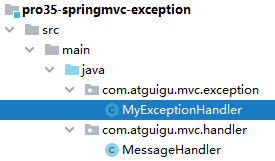
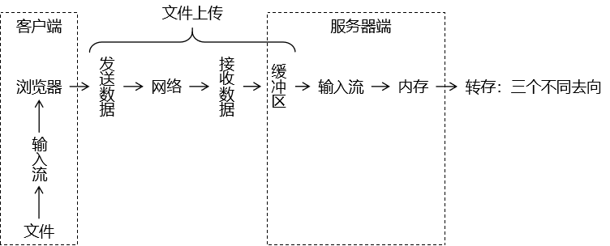
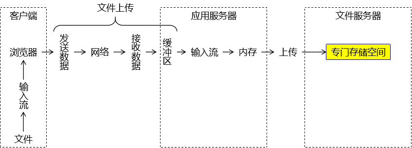

# 第一节 Ajax

## 1、实验一

请求：发送普通请求参数

handler 方法：使用 @RequestParam 注解接收请求参数

响应：服务器端返回普通文本

### ①引入 JavaScript 库


```html
<script type="text/javascript" src="script/vue.js"></script>
<script type="text/javascript" src="script/axios.min.js"></script>
```

### ②前端代码

```html
new Vue({
"el":"#btnSpan",
"methods":{
"experimentOne":function () {

// 请求：发送普通请求参数
// 响应：普通文本
axios({
"method":"post",
"url":"ajax/experiment/one",
"params":{
"userName":"tom",
"password":"123456"
}
}).then(function (response) {

// response接收服务器端返回的响应数据
console.log(response);
}).catch(function (response) {
console.log(response);
});

}
}
});
```

### ③后端代码

```java
// 使用@ResponseBody注解告诉 SpringMVC：请你拿当前方法的返回值作为响应体，不要再找视图了
// 方法返回值类型有两种情况：
// 情况一：简单类型。SpringMVC 会直接作为响应体数据。
// 情况二：复杂类型。SpringMVC 会把它转换为 JSON 然后再作为响应体。此时需要 Jackson 的支持。
@ResponseBody
@RequestMapping("/ajax/experiment/one")
public String experimentOne(

        // Ajax请求发过来的请求参数，对服务器端来说没有区别，还是像以前一样正常接收
        @RequestParam("userName") String userName,
        @RequestParam("password") String password
) {

    logger.debug("userName = " + userName);
    logger.debug("password = " + password);

    // 服务器端给Ajax程序的响应数据通过handler方法的返回值提供
    return "message from handler as response[来自服务器的问候]";
}
```

## 2、实验二

请求：让整个请求体就是一个 JSON 数据

handler 方法：使用 @RequestBody 标记的实体类接收请求体数据

响应：返回普通文本

### ①前端代码

```html
"experimentTwo":function () {

axios({
"method":"post",
"url":"ajax/experiment/two",

// data属性中指定一个 JSON 数据作为请求体
"data":{
"stuId": 55,
"stuName": "tom",
"subjectList": [
{
"subjectName": "java",
"subjectScore": 50.55
},
{
"subjectName": "php",
"subjectScore": 30.26
}
],
"teacherMap": {
"one": {
"teacherName":"tom",
"teacherAge":23
},
"two": {
"teacherName":"jerry",
"teacherAge":31
},
},
"school": {
"schoolId": 23,
"schoolName": "atguigu"
}
}
}).then(function (response) {
console.log(response);
}).catch(function (error) {
console.log(error);
});

}
```

### ②后端代码

#### [1]导入依赖

```xml
<!-- https://mvnrepository.com/artifact/com.fasterxml.jackson.core/jackson-databind -->
<dependency>
    <groupId>com.fasterxml.jackson.core</groupId>
    <artifactId>jackson-databind</artifactId>
    <version>2.12.1</version>
</dependency>
```

如果忘记导入这个依赖，会看到下面的错误页面：


关于 SpringMVC 和 Jackson jar包之间的关系，需要注意：当 SpringMVC 需要解析 JSON 数据时就需要使用 Jackson 的支持。但是 SpringMVC 的 jar 包并没有依赖 Jackson，所以需要我们自己导入。

我们自己导入时需要注意：SpringMVC 和 Jackson 配合使用有版本的要求。二者中任何一个版本太高或太低都不行。

SpringMVC 解析 JSON 数据包括两个方向：

* 从 JSON 字符串到 Java 实体类。
* 从 Java 实体类到 JSON 字符串。

另外，如果导入了 Jackson 依赖，但是没有开启 mvc:annotation-driven 功能，那么仍然会返回上面的错误页面。

也就是说，我们可以这么总结 SpringMVC 想要解析 JSON 数据需要两方面支持：

* mvc:annotation-driven
* 引入 Jackson 依赖

还有一点，如果运行环境是 Tomcat7，那么在 Web 应用启动时会抛出下面异常：

> org.apache.tomcat.util.bcel.classfile. ClassFormatException: Invalid byte tag in constant pool: 19

解决办法是使用 Tomcat8 或更高版本。

#### [2]handler 方法

```java
@ResponseBody
@RequestMapping("/ajax/experiment/two")
public String experimentTwo(

        // 使用 @RequestBody 注解将请求体 JSON 数据解析出来，注入到对应的实体类中
        @RequestBody Student student
        ) {

    logger.debug(student.toString());

    return "message from handler as response[来自服务器的问候]";
}
```

#### [3]@RequestBody注解

适用 @RequestBody 注解的场景：请求体整个是一个 JSON 数据


Request Payload 翻译成中文大致可以说：请求负载。

## 3、实验三

请求：发送普通的请求参数，请求参数整体正好对应实体类

handler 方法：使用普通实体类接收请求参数

响应：返回普通文本数据

### ①前端代码

```html
"experimentThree":function () {

axios({
"method":"post",
"url":"ajax/experimentThree",

// 普通的请求参数正好对应服务器端的一个实体类
"params":{
"soldierId":"666",
"soldierName":"tigerMan"
}
}).then(function (response) {
console.log(response);
}).catch(function (error) {
console.log(error);
});

}
```

### ②后端代码

```java
@ResponseBody
@RequestMapping("/ajax/experimentThree")
public String experimentThree(

        // 请求参数名正好对这个实体类的属性名，可以通过 setXxx() 方法直接注入
        Soldier soldier) {

    logger.debug(soldier.toString());

    return "message from handler as response[来自服务器的问候]";
}
```

### ③常见错误

如果前端程序使用 axios 的 params 属性发送请求参数，那么请求参数会附着在 URL 地址后面，此时当前请求没有请求体。同时服务器端 handler 方法使用了 @RequestBody 注解，会在日志中看到下面异常信息：

> HttpMessageNotReadableException: Required request body is missing:

意思是需要请求体，但是没有找到。

## 4、实验四

请求：不需要发送任何数据

handler 方法：返回实体类

响应：服务器端返回由实体类生成的 JSON 数据

### ①前端代码

```html
"experimentFour":function () {

axios({
"method":"post",
"url":"ajax/experimentFour"
}).then(function (response) {
console.log(response);

// 服务器返回的响应体数据被封装到了 data 属性中
console.log(response.data);
console.log("response.data.soldierId = " + response.data.soldierId);
console.log("response.data.soldierName = " + response.data.soldierName);
}).catch(function (error) {
console.log(error);
});

}
```

### ②后端代码

```java
// 使用 @ResponseBody 注解标记的方法返回实体类数据时，
// SpringMVC 需要借助 Jackson 来将实体类转换为 JSON 数据
@ResponseBody
@RequestMapping("/ajax/experimentFour")
public Soldier experimentFour() {

    return new Soldier(333, "catMan");
}
```

浏览器控制台打印效果如下：


### ③常见错误

#### [1]415 错误


出现上面的错误页面，表示 SpringMVC 为了将 实体类对象转换为 JSON 数据，需要转换器。但是现在找不到转换器。它想要成功完成转换需要两方面支持：

* mvc:annotation-driven
* 引入 Jackson 依赖

#### [2]406 错误


问题出现的原因：

* 请求地址扩展名：html
* 服务器端打算返回的数据格式：JSON

上面二者不一致。SpringMVC 要坚守一个商人的良心，不能干『挂羊头，卖狗肉』的事儿。解决办法有三种思路：

* 第一种方法：不使用请求扩展名
* 第二种方法：使用和实际返回的数据格式一致的扩展名

```xml
    <servlet-mapping>
        <servlet-name>dispatcherServlet</servlet-name>
        <url-pattern>*.html</url-pattern>
        <url-pattern>*.json</url-pattern>
    </servlet-mapping>
```

* 第三种方法：使用一个 HTTP 协议中没有被定义的扩展名，例如：*.atguigu

## 5、@RestController

### ①提取@ResponseBody

如果类中每个方法上都标记了 @ResponseBody 注解，那么这些注解就可以提取到类上。

### ②合并

类上的 @ResponseBody 注解可以和 @Controller 注解合并为 @RestController 注解。所以使用了 @RestController 注解就相当于给类中的每个方法都加了 @ResponseBody 注解。

### ③@RestController源码

```java
@Target(ElementType.TYPE)
@Retention(RetentionPolicy.RUNTIME)
@Documented
@Controller
@ResponseBody
public @interface RestController {

	/**
	 * The value may indicate a suggestion for a logical component name,
	 * to be turned into a Spring bean in case of an autodetected component.
	 * @return the suggested component name, if any (or empty String otherwise)
	 * @since 4.0.1
	 */
	@AliasFor(annotation = Controller.class)
	String value() default "";

}
```

## 6、SpringMVC 4 版本响应体字符集设置

```java
// 当返回响应体数据包含乱码时，在@RequestMapping注解中设置
// produces属性给响应体设置内容类型
@ResponseBody
@RequestMapping(value = "/ajax/get/message", produces = "text/html;charset=UTF-8")
public String getMessage() {
    return "message from server:你好";
}

// 如果返回 JSON 数据时遇到乱码问题，那么内容类型应设置为：application/json;charset=UTF-8
// 这里需要注意：JSON 属于 application 这个大类，不属于 text
@ResponseBody
@RequestMapping(value = "/ajax/get/entity", produces = "application/json;charset=UTF-8")
public Emp getEntity() {

    Emp emp = new Emp();

    emp.setEmpName("舔狗");

    return emp;
}
```


# 第二节 拦截器

## 1、概念

### ①拦截器和过滤器解决类似的问题

#### [1]生活中坐地铁的场景

为了提高乘车效率，在乘客进入站台前统一检票：


#### [2]程序中

在程序中，使用拦截器在请求到达具体 handler 方法前，统一执行检测。


### ②拦截器 VS 过滤器

#### [1]相似点

三要素相同

* 拦截：必须先把请求拦住，才能执行后续操作
* 过滤：拦截器或过滤器存在的意义就是对请求进行统一处理
* 放行：对请求执行了必要操作后，放请求过去，让它访问原本想要访问的资源

#### [2]不同点

* 工作平台不同
  + 过滤器工作在 Servlet 容器中
  + 拦截器工作在 SpringMVC 的基础上
* 拦截的范围
  + 过滤器：能够拦截到的最大范围是整个 Web 应用
  + 拦截器：能够拦截到的最大范围是整个 SpringMVC 负责的请求
* IOC 容器支持
  + 过滤器：想得到 IOC 容器需要调用专门的工具方法，是间接的
  + 拦截器：它自己就在 IOC 容器中，所以可以直接从 IOC 容器中装配组件，也就是可以直接得到 IOC 容器的支持

#### [3]选择

功能需要如果用 SpringMVC 的拦截器能够实现，就不使用过滤器。

## 2、使用

### ①创建拦截器类

#### [1]实现接口

```java
public class Process01Interceptor implements HandlerInterceptor {

    Logger logger = LoggerFactory.getLogger(this.getClass());

    // 在处理请求的目标 handler 方法前执行
    @Override
    public boolean preHandle(HttpServletRequest request, HttpServletResponse response, Object handler) throws Exception {

        logger.debug("Process01Interceptor preHandle方法");

        // 返回true：放行
        // 返回false：不放行
        return true;
    }

    // 在目标 handler 方法之后，渲染视图之前
    @Override
    public void postHandle(HttpServletRequest request, HttpServletResponse response, Object handler, ModelAndView modelAndView) throws Exception {

        logger.debug("Process01Interceptor postHandle方法");

    }

    // 渲染视图之后执行
    @Override
    public void afterCompletion(HttpServletRequest request, HttpServletResponse response, Object handler, Exception ex) throws Exception {

        logger.debug("Process01Interceptor afterCompletion方法");

    }
}
```

单个拦截器执行顺序：

* preHandle() 方法
* 目标 handler 方法
* postHandle() 方法
* 渲染视图
* afterCompletion() 方法

#### [2]继承类

在较低版本的 SpringMVC 中，实现 HandlerInterceptor 接口需要把所有抽象方法都实现。但是又不是每个方法都需要使用，导致代码比较繁琐。

此时可以通过继承 HandlerInterceptorAdapter 类同样可以创建拦截器类。HandlerInterceptorAdapter 类中已经给 HandlerInterceptor 接口提供了默认实现，我们继承后不需要把每个方法都实现，只需要把有用的方法重写即可。

在 SpringMVC 较高版本（例如：5.3版本以上）中，HandlerInterceptor 接口已经借助 JDK 1.8 新特性让每个抽象方法都给出了默认实现，所以 HandlerInterceptorAdapter 这个类被标记为过时。

```java
@Deprecated
public abstract class HandlerInterceptorAdapter implements AsyncHandlerInterceptor {

}
```

### ②注册拦截器

#### [1]默认拦截全部请求

```xml
<!-- 注册拦截器 -->
<mvc:interceptors>

    <!-- 直接通过内部 bean 配置的拦截器默认拦截全部请求（SpringMVC 范围内） -->
    <bean class="com.atguigu.mvc.interceptor.Process01Interceptor"/>
</mvc:interceptors>
```

#### [2]配置拦截路径

##### (1)精确匹配

```xml
<!-- 具体配置拦截器可以指定拦截的请求地址 -->
<mvc:interceptor>
    <!-- 精确匹配 -->
    <mvc:mapping path="/common/request/one"/>
    <bean class="com.atguigu.mvc.interceptor.Process03Interceptor"/>
</mvc:interceptor>
```

##### (2)模糊匹配：匹配单层路径

```xml
<mvc:interceptor>
    <!-- /*匹配路径中的一层 -->
    <mvc:mapping path="/common/request/*"/>
    <bean class="com.atguigu.mvc.interceptor.Process04Interceptor"/>
</mvc:interceptor>
```

##### (3)模糊匹配：匹配多层路径

```xml
<mvc:interceptor>
    <!-- /**匹配路径中的多层 -->
    <mvc:mapping path="/common/request/**"/>
    <bean class="com.atguigu.mvc.interceptor.Process05Interceptor"/>
</mvc:interceptor>
```

#### [3]配置不拦截路径

```xml
        <mvc:interceptor>
            <!-- /**匹配路径中的多层 -->
            <mvc:mapping path="/common/request/**"/>

            <!-- 使用 mvc:exclude-mapping 标签配置不拦截的地址 -->
            <mvc:exclude-mapping path="/common/request/two/bbb"/>

            <bean class="com.atguigu.mvc.interceptor.Process05Interceptor"/>
        </mvc:interceptor>
```

### ③多个拦截器执行顺序

* preHandle()方法：和配置的顺序一样
* 目标handler方法
* postHandle()方法：和配置的顺序相反
* 渲染视图
* afterCompletion()方法：和配置的顺序相反

## 3、案例

一个网站有 5 个资源，其中两个无须登录即可访问，另外三个需要登录后才能访问。如果不登录就访问那三个资源，会自动跳转到登录页面并给出提示：请登录后再操作。

提示：将数据存入请求域、转发或重定向请求都需要使用原生对象来完成，在拦截器中 SpringMVC 并没有提供 Model、ModelMap 等 API 供我们使用。

访问资源的请求地址可参考：

* 公共资源1：/public/resource/one
* 公共资源2：/public/resouce/two
* 私密资源1：/private/resouce/one
* 私密资源2：/private/resouce/two
* 私密资源3：/private/resouce/three

[参考代码](./verse02/homework.html)


# 第三节 类型转换

SpringMVC 将『把请求参数注入到 POJO 对象』这个操作称为『数据绑定』，英文单词是 binding。数据类型的转换和格式化就发生在数据绑定的过程中。 类型转换和格式化是密不可分的两个过程，很多带格式的数据必须明确指定格式之后才可以进行类型转换。最典型的就是日期类型。

## 1、自动类型转换

HTTP 协议是一个无类型的协议，我们在服务器端接收到请求参数等形式的数据时，本质上都是字符串类型。请看 javax.servlet. ServletRequest 接口中获取全部请求参数的方法：

```java
public Map<String, String[]> getParameterMap();
```

而我们在实体类当中需要的类型是非常丰富的。对此，SpringMVC 对基本数据类型提供了自动的类型转换。例如：请求参数传入“100”字符串，我们实体类中需要的是 Integer 类型，那么 SpringMVC 会自动将字符串转换为 Integer 类型注入实体类。

## 2、日期和数值类型

### ①通过注解设定数据格式

```java
public class Product {

    @DateTimeFormat(pattern = "yyyy-MM-dd HH:mm:ss")
    private Date productDate;

    @NumberFormat(pattern = "###,###,###.###")
    private Double productPrice;
```

### ②表单

```html
<form th:action="@{/save/product}" method="post">
    生产日期：<input type="text" name="productDate" value="1992-10-15 17:15:06" /><br />
    产品价格：<input type="text" name="productPrice" value="111,222,333.444" /><br />
    <button type="submit">保存</button>
</form>
```

### ③handler 方法

```java
@RequestMapping("/save/product")
public String saveProduct(Product product) {

    logger.debug(product.toString());

    return "target";
}
```

## 3、转换失败后处理方式

### ①默认结果


### ②BindingResult 接口


BindingResult 接口和它的父接口 Errors 中定义了很多和数据绑定相关的方法，如果在数据绑定过程中发生了错误，那么通过这个接口类型的对象就可以获取到相关错误信息。

### ③重构 handler 方法

```java
@RequestMapping("/save/product")
public String saveProduct(
        Product product,

	    // 在实体类参数和 BindingResult 之间不能有任何其他参数
        // 封装数据绑定结果的对象
        BindingResult bindingResult) {

    // 判断数据绑定过程中是否发生了错误
    if (bindingResult.hasErrors()) {
        // 如果发生了错误，则跳转到专门显示错误信息的页面
        // 相关错误信息会自动被放到请求域
        return "error";
    }

    logger.debug(product.toString());

    return "target";
}
```

### ④在页面上显示错误消息

```html
	<!-- 从请求域获取实体类信息时，属性名是按照类名首字母小写的规则 -->
	<!-- ${注入请求参数的实体类.出问题的字段} -->
	<p th:errors="${product.productDate}">这里显示具体错误信息</p>
```

## 4、自定义类型转换器

在实际开发过程中，难免会有某些情况需要使用自定义类型转换器。因为我们自己自定义的类型在 SpringMVC 中没有对应的内置类型转换器。此时需要我们提供自定义类型来执行转换。

> 我们学习的知识点可以分成：
>
> - 拼死学会
>
> - 以防万一
>
> - 增长见闻
>
> 自定义类型转换器的定位就是以防万一

### ①创建实体类

#### [1]Address

```java
public class Address {

    private String province;
    private String city;
    private String street;
    ……
```

#### [2]Student

```java
public class Student {

    private Address address;
    ……
```

### ②表单

现在我们希望通过一个文本框输入约定格式的字符串，然后转换为我们需要的类型，所以必须通过自定义类型转换器来实现，否则 SpringMVC 无法识别。

```html
<h3>自定义类型转换器</h3>
<form th:action="@{/save/student}" method="post">
    地址：<input type="text" name="address" value="aaa,bbb,ccc" /><br />
</form>
```

### ③handler 方法

```java
@RequestMapping("/save/student")
public String saveStudent(Student student) {

    logger.debug(student.getAddress().toString());

    return "target";
}
```

在目前代码的基础上，我们没有提供自定义类型转换器，所以处理请求时看到如下错误日志：

> Field error in object 'student' on field 'address': rejected value [aaa, bbb, ccc]; codes [typeMismatch.student.address, typeMismatch.address, typeMismatch.com.atguigu.mvc.entity. Address, typeMismatch]; arguments [org.springframework.context.support. DefaultMessageSourceResolvable: codes [student.address, address]; arguments []; default message [address]]; default message [Failed to convert property value of type 'java.lang. String' to required type 'com.atguigu.mvc.entity. Address' for property 'address'; nested exception is java.lang. IllegalStateException: Cannot convert value of type 'java.lang. String' to required type 'com.atguigu.mvc.entity. Address' for property 'address': no matching editors or conversion strategy found]]]

页面返回 400。

### ④创建自定义类型转换器类

实现接口：org.springframework.core.convert.converter. Converter&lt; S, T&gt;

泛型 S：源类型（本例中是 String 类型）

泛型 T：目标类型（本例中是 Address 类型）

```java
public class AddressConverter implements Converter<String, Address> {
    @Override
    public Address convert(String source) {

        // 1.按照约定的规则拆分源字符串
        String[] split = source.split(",");

        String province = split[0];
        String city = split[1];
        String street = split[2];

        // 2.根据拆分结果创建 Address 对象
        Address address = new Address(province, city, street);

        // 3.返回转换得到的对象
        return address;
    }
}
```

### ⑤在 SpringMVC 中注册

```xml
<!-- 在 mvc:annotation-driven 中注册 FormattingConversionServiceFactoryBean -->
<mvc:annotation-driven conversion-service="formattingConversionService"/>

<!-- 在 FormattingConversionServiceFactoryBean 中注册自定义类型转换器 -->
<bean id="formattingConversionService"
      class="org.springframework.format.support.FormattingConversionServiceFactoryBean">

    <!-- 在 converters 属性中指定自定义类型转换器 -->
    <property name="converters">
        <set>
            <bean class="com.atguigu.mvc.converter.AddressConverter"/>
        </set>
    </property>

</bean>
```


# 第四节 数据校验

在 Web 应用三层架构体系中，表述层负责接收浏览器提交的数据，业务逻辑层负责数据的处理。为了能够让业务逻辑层基于正确的数据进行处理，我们需要在表述层对数据进行检查，将错误的数据隔绝在业务逻辑层之外。

## 1、校验概述

JSR 303 是 Java 为 Bean 数据合法性校验提供的标准框架，它已经包含在 JavaEE 6.0 标准中。JSR 303 通过在 Bean 属性上标注类似于 @NotNull、@Max 等标准的注解指定校验规则，并通过标准的验证接口对Bean进行验证。

| 注解                       | 规则                                           |
| -------------------------- | ---------------------------------------------- |
| @Null                      | 标注值必须为 null                              |
| @NotNull                   | 标注值不可为 null                              |
| @AssertTrue                | 标注值必须为 true                              |
| @AssertFalse               | 标注值必须为 false                             |
| @Min(value)                | 标注值必须大于或等于 value                     |
| @Max(value)                | 标注值必须小于或等于 value                     |
| @DecimalMin(value)         | 标注值必须大于或等于 value                     |
| @DecimalMax(value)         | 标注值必须小于或等于 value                     |
| @Size(max, min)             | 标注值大小必须在 max 和 min 限定的范围内       |
| @Digits(integer, fratction) | 标注值值必须是一个数字，且必须在可接受的范围内 |
| @Past                      | 标注值只能用于日期型，且必须是过去的日期       |
| @Future                    | 标注值只能用于日期型，且必须是将来的日期       |
| @Pattern(value)            | 标注值必须符合指定的正则表达式                 |

JSR 303 只是一套标准，需要提供其实现才可以使用。Hibernate Validator 是 JSR 303 的一个参考实现，除支持所有标准的校验注解外，它还支持以下的扩展注解：

| 注解      | 规则                               |
| --------- | ---------------------------------- |
| @Email    | 标注值必须是格式正确的 Email 地址  |
| @Length   | 标注值字符串大小必须在指定的范围内 |
| @NotEmpty | 标注值字符串不能是空字符串         |
| @Range    | 标注值必须在指定的范围内           |

Spring 4.0 版本已经拥有自己独立的数据校验框架，同时支持 JSR 303 标准的校验框架。Spring 在进行数据绑定时，可同时调用校验框架完成数据校验工作。在SpringMVC 中，可直接通过注解驱动 mvc:annotation-driven 的方式进行数据校验。Spring 的 LocalValidatorFactoryBean 既实现了 Spring 的 Validator 接口，也实现了 JSR 303 的 Validator 接口。只要在Spring容器中定义了一个LocalValidatorFactoryBean，即可将其注入到需要数据校验的 Bean中。Spring本身并没有提供JSR 303的实现，所以必须将JSR 303的实现者的jar包放到类路径下。

配置 mvc:annotation-driven 后，SpringMVC 会默认装配好一个 LocalValidatorFactoryBean，通过在处理方法的入参上标注 @Validated 注解即可让 SpringMVC 在完成数据绑定后执行数据校验的工作。

## 2、操作演示

请在 SpringMVC 环境基础上做下面的操作：

### ①导入依赖

```xml
<!-- https://mvnrepository.com/artifact/org.hibernate.validator/hibernate-validator -->
<dependency>
    <groupId>org.hibernate.validator</groupId>
    <artifactId>hibernate-validator</artifactId>
    <version>6.2.0.Final</version>
</dependency>
<!-- https://mvnrepository.com/artifact/org.hibernate.validator/hibernate-validator-annotation-processor -->
<dependency>
    <groupId>org.hibernate.validator</groupId>
    <artifactId>hibernate-validator-annotation-processor</artifactId>
    <version>6.2.0.Final</version>
</dependency>
```

注：需要 Tomcat 版本至少是 8。

### ②应用校验规则

#### [1]标记规则注解

在实体类中需要附加校验规则的成员变量上标记校验规则注解：

```java
    // 字符串长度：[3,6]
    @Size(min = 3, max = 6)

    // 字符串必须满足Email格式
    @Email
    private String email;
```

#### [2]在handler 方法形参标记注解

```java
@RequestMapping("/save/president")
public String savePresident(@Validated President president) {

    logger.debug(president.getEmail());

    return "target";
}
```

#### [3]校验失败效果

日志：

> Field error in object 'president' on field 'email': rejected value [aa]; codes [Email.president.email, Email.email, Email.java.lang. String, Email]; arguments [org.springframework.context.support. DefaultMessageSourceResolvable: codes [president.email, email]; arguments []; default message [email], [Ljavax.validation.constraints. Pattern$Flag; @4a6addb7, .*]; default message [不是一个合法的电子邮件地址]
> Field error in object 'president' on field 'email': rejected value [aa]; codes [Size.president.email, Size.email, Size.java.lang. String, Size]; arguments [org.springframework.context.support. DefaultMessageSourceResolvable: codes [president.email, email]; arguments []; default message [email], 6, 3]; default message [个数必须在3和6之间]]]

同时页面返回 400。

### ③显示友好的错误提示

#### [1]重构 handler 方法

```java
@RequestMapping("/save/president")
public String savePresident(

        // 在实体类参数和 BindingResult 之间不能有任何其他参数
        @Validated President president, BindingResult bindingResult) {

    if (bindingResult.hasErrors()) {
        return "error";
    }

    logger.debug(president.getEmail());

    return "target";
}
```

#### [2]准备错误信息页面

```html
    <h1>系统信息</h1>
    <!-- 从请求域获取实体类信息时，属性名是按照类名首字母小写的规则 -->
    <!-- ${注入请求参数的实体类.出问题的字段} -->
    <p th:errors="${president.email}">这里显示系统提示消息</p>
```


# 第五节 异常映射

## 1、概念

### ①微观

将异常类型和某个具体的视图关联起来，建立映射关系。好处是可以通过 SpringMVC 框架来帮助我们管理异常。

* 声明式管理异常：在配置文件中指定异常类型和视图之间的对应关系。在配置文件或注解类中统一管理。
* 编程式管理异常：需要我们自己手动 try ... catch ... 捕获异常，然后再手动跳转到某个页面。

### ②宏观

一个项目中会包含很多个模块，各个模块需要分工完成。如果张三负责的模块按照 A 方案处理异常，李四负责的模块按照 B 方法处理异常……各个模块处理异常的思路、代码、命名细节都不一样，那么就会让整个项目非常混乱。

## 2、异常映射的好处

* 使用声明式代替编程式来实现异常管理
  + 让异常控制和核心业务解耦，二者各自维护，结构性更好
* 整个项目层面使用同一套规则来管理异常
  + 整个项目代码风格更加统一、简洁
  + 便于团队成员之间的彼此协作

## 3、基于 XML 的异常映射

### ①配置

SpringMVC 会根据异常映射信息，在捕获到指定异常对象后，将异常对象存入请求域，然后转发到和异常类型关联的视图。

```xml
<bean id="exceptionResolver"
      class="org.springframework.web.servlet.handler.SimpleMappingExceptionResolver">

    <!-- 配置异常映射关系 -->
    <property name="exceptionMappings">
        <props>
            <!-- key属性：指定异常类型 -->
            <!-- 文本标签体：和异常类型对应的逻辑视图 -->
            <prop key="java.lang.ArithmeticException">error-arith</prop>
        </props>
    </property>

    <!-- 使用 exceptionAttribute 属性配置将异常对象存入请求域时使用的属性名 -->
    <!-- 这个属性名默认是exception -->
    <property name="exceptionAttribute" value="atguiguException"/>
</bean>
```

### ②异常范围

如果在配置文件中，发现有多个匹配的异常类型，那么 SpringMVC 会采纳范围上最接近的异常映射关系。

```xml
<prop key="java.lang.ArithmeticException">error-arith</prop>
<prop key="java.lang.RuntimeException">error-runtime</prop>
```

## 4、基于注解的异常映射

### ①创建异常处理器类



### ②异常处理器类加入 IOC 容器

```xml
<context:component-scan base-package="com.atguigu.mvc.handler,com.atguigu.mvc.exception"/>
```

### ③给异常处理器类标记注解

```java
// 异常处理器类需要使用 @ControllerAdvice 注解标记
@ControllerAdvice
public class MyExceptionHandler {

}
```

### ④声明处理异常的方法

```java
// @ExceptionHandler注解：标记异常处理方法
// value属性：指定匹配的异常类型
// 异常类型的形参：SpringMVC 捕获到的异常对象
@ExceptionHandler(value = NullPointerException.class)
public String resolveNullPointerException(Exception e, Model model) {

    // 我们可以自己手动将异常对象存入模型
    model.addAttribute("atguiguException", e);

    // 返回逻辑视图名称
    return "error-nullpointer";
}
```

当同一个异常类型在基于 XML 和注解的配置中都能够找到对应的映射，那么以注解为准。

## 5、区分请求类型

### ①分析

异常处理机制和拦截器机制都面临这样的问题：


### ②判断依据

查看请求消息头中是否包含 Ajax 请求独有的特征：

* Accept 请求消息头：包含 application/json
* X-Requested-With 请求消息头：包含 XMLHttpRequest

两个条件满足一个即可。

```java
/**
 * 判断当前请求是否为Ajax请求
 * @param request 请求对象
 * @return
 * 		true：当前请求是Ajax请求
 * 		false：当前请求不是Ajax请求
 */
public static boolean judgeRequestType(HttpServletRequest request) {

	// 1.获取请求消息头
	String acceptHeader = request.getHeader("Accept");
	String xRequestHeader = request.getHeader("X-Requested-With");

	// 2.判断
	return (acceptHeader != null && acceptHeader.contains("application/json"))

			||

			(xRequestHeader != null && xRequestHeader.equals("XMLHttpRequest"));
}
```

### ③兼容两种请求的处理方法

```java
@ExceptionHandler(value = Exception.class)
public String resolveException(Exception e, HttpServletRequest request, HttpServletResponse response) throws IOException {

    // 调用工具方法判断当前请求是否是 Ajax 请求
    boolean judgeResult = MVCUtil.judgeRequestType(request);

    if (judgeResult) {

        // 对 Ajax 请求返回字符串作为响应体
        String message = e.getMessage();

        response.setContentType("text/html;charset=UTF-8");
        response.getWriter().write(message);

        // 上面已经使用原生 response 对象返回了响应，这里就不返回视图名称了
        return null;
    }

    // 对普通请求返回逻辑视图名称
    return "error-exception";
}
```


# 第六节 文件上传

## 1、表单

* 第一点：请求方式必须是 POST
* 第二点：请求体的编码方式必须是 multipart/form-data（通过 form 标签的 enctype 属性设置）
* 第三点：使用 input 标签、type 属性设置为 file 来生成文件上传框

```html
<form th:action="@{/atguigu/upload}" method="post" enctype="multipart/form-data">

    <input type="file" name="picture" />
    <button type="submit">上传头像</button>

</form>
```

## 2、SpringMVC 环境要求

### ①依赖

```xml
<!-- https://mvnrepository.com/artifact/commons-fileupload/commons-fileupload -->
<dependency>
    <groupId>commons-fileupload</groupId>
    <artifactId>commons-fileupload</artifactId>
    <version>1.3.1</version>
</dependency>
```

### ②配置

在 SpringMVC 的配置文件中加入 multipart 类型数据的解析器：

```xml
<bean id="multipartResolver"
      class="org.springframework.web.multipart.commons.CommonsMultipartResolver">

    <!-- 由于上传文件的表单请求体编码方式是 multipart/form-data 格式，所以要在解析器中指定字符集 -->
    <property name="defaultEncoding" value="UTF-8"/>

</bean>
```

## 3、handler 方法接收数据

```java
@RequestMapping("/simple/upload")
public String doUpload(

        // 表单提交的数据仍然是请求参数，所以使用 @RequestParam 注解接收
        @RequestParam("nickName") String nickName,

        // 对于上传的文件使用 MultipartFile 类型接收其相关数据
        @RequestParam("picture") MultipartFile picture
        ) throws IOException {

    String inputName = picture.getName();
    logger.debug("文件上传表单项的 name 属性值：" + inputName);

    // 获取这个数据通常都是为了获取文件本身的扩展名
    String originalFilename = picture.getOriginalFilename();
    logger.debug("文件在用户本地原始的文件名：" + originalFilename);

    String contentType = picture.getContentType();
    logger.debug("文件的内容类型：" + contentType);

    boolean empty = picture.isEmpty();
    logger.debug("文件是否为空：" + empty);

    long size = picture.getSize();
    logger.debug("文件大小：" + size);

    byte[] bytes = picture.getBytes();
    logger.debug("文件二进制数据的字节数组：" + Arrays.asList(bytes));

    InputStream inputStream = picture.getInputStream();
    logger.debug("读取文件数据的输入流对象：" + inputStream);

    Resource resource = picture.getResource();
    logger.debug("代表当前 MultiPartFile 对象的资源对象" + resource);

    return "target";
}
```

## 4、MultipartFile 接口


## 5、文件转存

### ①底层机制



### ②三种去向

#### [1]本地转存


##### (1)实现方式

###### <1>创建保存文件的目录


这个目录如果是空目录，那么服务器部署运行时很容易会忽略这个目录。为了避免这个问题，在这个目录下随便创建一个文件，随便写点内容即可。

###### <2>编写转存代码

下面是负责处理文件上传请求的 handler 方法的转存部分：

```java
……

// 1、准备好保存文件的目标目录
// ①File 对象要求目标路径是一个物理路径（在硬盘空间里能够直接找到文件的路径）
// ②项目在不同系统平台上运行，要求能够自动兼容、适配不同系统平台的路径格式
//      例如：Window系统平台的路径是 D:/aaa/bbb 格式
//      例如：Linux系统平台的路径是 /ttt/uuu/vvv 格式
//      所以我们需要根据『不会变的虚拟路径』作为基准动态获取『跨平台的物理路径』
// ③虚拟路径：浏览器通过 Tomcat 服务器访问 Web 应用中的资源时使用的路径
String destFileFolderVirtualPath = "/head-picture";

// ④调用 ServletContext 对象的方法将虚拟路径转换为真实物理路径
String destFileFolderRealPath = servletContext.getRealPath(destFileFolderVirtualPath);

// 2、生成保存文件的文件名
// ①为了避免同名的文件覆盖已有文件，不使用 originalFilename，所以需要我们生成文件名
// ②我们生成文件名包含两部分：文件名本身和扩展名
// ③声明变量生成文件名本身
String generatedFileName = UUID.randomUUID().toString().replace("-","");

// ④根据 originalFilename 获取文件的扩展名
String fileExtname = originalFilename.substring(originalFilename.lastIndexOf("."));

// ⑤拼装起来就是我们生成的整体文件名
String destFileName = generatedFileName + "" + fileExtname;

// 3、拼接保存文件的路径，由两部分组成
//      第一部分：文件所在目录
//      第二部分：文件名
String destFilePath = destFileFolderRealPath + "/" + destFileName;

// 4、创建 File 对象，对应文件具体保存的位置
File destFile = new File(destFilePath);

// 5、执行转存
picture.transferTo(destFile);

……
```

##### (2)缺陷

* Web 应用重新部署时通常都会清理旧的构建结果，此时用户以前上传的文件会被删除，导致数据丢失。
* 项目运行很长时间后，会导致上传的文件积累非常多，体积非常大，从而拖慢 Tomcat 运行速度。
* 当服务器以集群模式运行时，文件上传到集群中的某一个实例，其他实例中没有这个文件，就会造成数据不一致。
* 不支持动态扩容，一旦系统增加了新的硬盘或新的服务器实例，那么上传、下载时使用的路径都需要跟着变化，导致 Java 代码需要重新编写、重新编译，进而导致整个项目重新部署。


#### [2]文件服务器（采纳）

##### (1)总体机制



##### (2)好处

* 不受 Web 应用重新部署影响
* 在应用服务器集群环境下不会导致数据不一致
* 针对文件读写进行专门的优化，性能有保障
* 能够实现动态扩容


##### (3)文件服务器类型

* 第三方平台：
  + 阿里的 OSS 对象存储服务
  + 七牛云
* 自己搭建服务器：FastDFS等

#### [3]上传到其他模块

这种情况肯定出现在分布式架构中，常规业务功能不会这么做，采用这个方案的一定的特殊情况。


在 MultipartFile 接口中有一个对应的方法：

```java
/**
 * Return a Resource representation of this MultipartFile. This can be used
 * as input to the {@code RestTemplate} or the {@code WebClient} to expose
 * content length and the filename along with the InputStream.
 * @return this MultipartFile adapted to the Resource contract
 * @since 5.1
 */
default Resource getResource() {
	return new MultipartFileResource(this);
}
```

注释中说：这个 Resource 对象代表当前 MultipartFile 对象，输入给 RestTemplate 或 WebClient。而 RestTemplate 或 WebClient 就是用来在 Java 程序中向服务器端发出请求的组件。


# 第七节 文件下载

## 1、初始形态

使用链接地址指向要下载的文件。此时浏览器会尽可能解析对应的文件，只要是能够在浏览器窗口展示的，就都会直接显示，而不是提示下载。

```html
<a href="download/hello.atguigu">下载</a><br />
<a href="download/tank.jpg">下载</a><br />
<a href="download/chapter04.zip">下载</a><br />
```

上面例子中，只有 chapter04.zip 文件是直接提示下载的，其他两个都是直接显示。

## 2、明确要求浏览器提示下载

```java
@Autowired
private ServletContext servletContext;

@RequestMapping("/download/file")
public ResponseEntity<byte[]> downloadFile() {

    // 1.获取要下载的文件的输入流对象
    // 这里指定的路径以 Web 应用根目录为基准
    InputStream inputStream = servletContext.getResourceAsStream("/images/mi.jpg");

    try {
        // 2.将要下载的文件读取到字节数组中
        // ①获取目标文件的长度
        int len = inputStream.available();

        // ②根据目标文件长度创建字节数组
        byte[] buffer = new byte[len];

        // ③将目标文件读取到字节数组中
        inputStream.read(buffer);

        // 3.封装响应消息头
        // ①创建MultiValueMap接口类型的对象，实现类是HttpHeaders
        MultiValueMap responseHeaderMap = new HttpHeaders();

        // ②存入下载文件所需要的响应消息头
        responseHeaderMap.add("Content-Disposition", "attachment; filename=mi.jpg");

        // ③创建ResponseEntity对象
        ResponseEntity<byte[]> responseEntity = new ResponseEntity<>(buffer, responseHeaderMap, HttpStatus.OK);

        // 4.返回responseEntity对象
        return responseEntity;
    } catch (IOException e) {
        e.printStackTrace();
    } finally {

        if (inputStream != null) {
            try {
                inputStream.close();
            } catch (IOException e) {
                e.printStackTrace();
            }
        }

    }

    return null;
}
```

## 3、典型应用场景举例

我们目前实现的是一个较为简单的下载，可以用在下面的一些场合：

* 零星小文件下载
* 将系统内部的数据导出为 Excel、PDF 等格式，然后以下载的方式返回给用户


# 第八节 其他不重要内容

## 1、SpringMVC 配置文件的默认位置

### ①配置要求

* 配置文件存放目录：/WEB-INF 目录
* 文件名格式：[servlet-name]-servlet.xml
  + servlet-name 部分是在 web.xml 中配置 DispatcherServlet 时，servlet-name 标签的值
* 省略原理的 init-param

### ②为什么不建议

除 web.xml 是 Tomcat 要求放在 WEB-INF 下，其他配置文件习惯上是放在类路径下。

## 2、请求映射其他方式

### ①根据请求参数情况映射

使用 @RequestMapping 注解的 params 参数实现，表达式语法参见下面的例子：

| 需求                                                         | 映射方式                                                     |
| ------------------------------------------------------------ | ------------------------------------------------------------ |
| 请求参数中必须包含userName                                   | @RequestMapping(value = "/xxx", <br />params="userName")     |
| 请求参数中不能包含userName                                   | @RequestMapping(value = "/xxx", <br />params="!userName")    |
| 请求参数中必须包含userName<br />且值必须为Tom2015            | @RequestMapping(value = "/xxx", <br />params="userName=Tom2015") |
| 请求参数中必须包含userName<br />但值不能为Tom2015            | @RequestMapping(value = "/xxx", <br />params="userName=! Tom2015") |
| 请求参数中必须包含userName<br />且值为Tom2015，<br />同时必须包含userPwd但值不限 | @RequestMapping(value = "/xxx", <br />params={"userName=Tom2015", "userPwd"} ) |

### ②根据请求消息头内容映射

使用 @RequestMapping 注解的 headers 参数实现，表达式语法参见下面的例子：

| 需求                                     | 映射方式                                                     |
| ---------------------------------------- | ------------------------------------------------------------ |
| 根据 Accept-Language:zh-CN, zh; q=0.8 映射 | @RequestMapping (<br />value="/xxx", <br />headers= "Accept-Language=zh-CN, en; q=0.8" ) |

### ③Ant 风格通配符

* 英文问号：匹配一个字符
* 一个星号：匹配路径中的一层
* 两个连续星号：匹配路径中的多层

## 3、@ModelAttribute 注解

handler 类中，选定一个方法标记 @ModelAttribute 注解。

* 效果1：在每个 handler 方法前执行
* 效果2：可以将某些数据提前存入请求域

```java
@Controller
public class ModelAttrHandler {

    @ModelAttribute
    public void doSthBefore(Model model) {
        model.addAttribute("initAttr", "initValue");
    }

    @RequestMapping("/test/model/attr/one")
    public String testModelAttrOne(Model model) {

        Object modelAttribute = model.getAttribute("initAttr");
        System.out.println("modelAttribute = " + modelAttribute);

        return "target";
    }

    @RequestMapping("/test/model/attr/two")
    public String testModelAttrTwo(Model model) {

        Object modelAttribute = model.getAttribute("initAttr");
        System.out.println("modelAttribute = " + modelAttribute);

        return "target";
    }

    @RequestMapping("/test/model/attr/three")
    public String testModelAttrThree(Model model) {

        Object modelAttribute = model.getAttribute("initAttr");
        System.out.println("modelAttribute = " + modelAttribute);

        return "target";
    }

}
```


