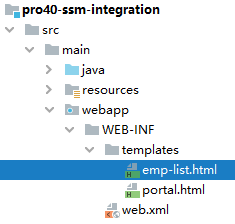
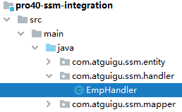
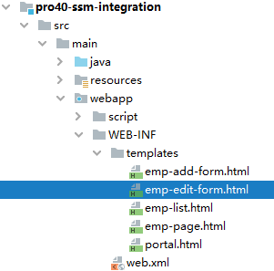

# 第一节 Spring 和 Mybatis 整合

## 1、思路


## 2、Mybatis-Spring技术

[官方介绍](http://mybatis.org/spring/zh/index.html)

相关技术之间版本匹配说明：


Mybatis-Spring 的依赖：

```xml
<!-- https://mvnrepository.com/artifact/org.mybatis/mybatis-spring -->
<dependency>
    <groupId>org.mybatis</groupId>
    <artifactId>mybatis-spring</artifactId>
    <version>2.0.6</version>
</dependency>
```

## 3、总体 SSM 整合所需依赖

```xml
<!-- SpringMVC -->
<dependency>
    <groupId>org.springframework</groupId>
    <artifactId>spring-webmvc</artifactId>
    <version>5.3.1</version>
</dependency>

<!-- Spring 持久化层所需依赖 -->
<dependency>
    <groupId>org.springframework</groupId>
    <artifactId>spring-orm</artifactId>
    <version>5.3.1</version>
</dependency>

<!-- 日志 -->
<dependency>
    <groupId>ch.qos.logback</groupId>
    <artifactId>logback-classic</artifactId>
    <version>1.2.3</version>
</dependency>

<!-- ServletAPI -->
<dependency>
    <groupId>javax.servlet</groupId>
    <artifactId>javax.servlet-api</artifactId>
    <version>3.1.0</version>
    <scope>provided</scope>
</dependency>

<!-- Spring5和Thymeleaf整合包 -->
<dependency>
    <groupId>org.thymeleaf</groupId>
    <artifactId>thymeleaf-spring5</artifactId>
    <version>3.0.12.RELEASE</version>
</dependency>

<!-- Mybatis核心 -->
<dependency>
    <groupId>org.mybatis</groupId>
    <artifactId>mybatis</artifactId>
    <version>3.5.7</version>
</dependency>

<!-- MySQL驱动 -->
<dependency>
    <groupId>mysql</groupId>
    <artifactId>mysql-connector-java</artifactId>
    <version>5.1.3</version>
</dependency>

<!-- 数据源 -->
<dependency>
    <groupId>com.alibaba</groupId>
    <artifactId>druid</artifactId>
    <version>1.0.31</version>
</dependency>

<!-- junit5 -->
<dependency>
    <groupId>org.junit.jupiter</groupId>
    <artifactId>junit-jupiter-api</artifactId>
    <version>5.7.0</version>
    <scope>test</scope>
</dependency>

<!-- Spring 的测试功能 -->
<dependency>
    <groupId>org.springframework</groupId>
    <artifactId>spring-test</artifactId>
    <version>5.3.1</version>
</dependency>

<!-- Mybatis 和 Spring 的整合包 -->
<dependency>
    <groupId>org.mybatis</groupId>
    <artifactId>mybatis-spring</artifactId>
    <version>2.0.6</version>
</dependency>
```

## 4、配置数据源

### ①创建 jdbc.properties

```properties
jdbc.user=root
jdbc.password=atguigu
jdbc.url=jdbc:mysql://192.168.198.100:3306/mybatis-example
jdbc.driver=com.mysql.jdbc.Driver
```

### ②加入日志配置文件


### ③创建 Spring 配置文件


```xml
<!-- 加载外部属性文件 -->
<context:property-placeholder location="classpath:jdbc.properties"/>

<!-- 配置数据源 -->
<bean id="druidDataSource" class="com.alibaba.druid.pool.DruidDataSource">
    <property name="username" value="${jdbc.user}"/>
    <property name="password" value="${jdbc.password}"/>
    <property name="driverClassName" value="${jdbc.driver}"/>
    <property name="url" value="${jdbc.url}"/>
</bean>
```

### ④创建 junit 测试类

```java
@SpringJUnitConfig(locations = {"classpath:spring-persist.xml"})
public class SSMTest {

    @Autowired
    private DataSource dataSource;

    Logger logger = LoggerFactory.getLogger(getClass());

    @Test
    public void testConn() throws SQLException {
        Connection connection = dataSource.getConnection();
        logger.debug(connection.toString());
    }

}
```

## 5、配置 SqlSessionFactoryBean

### ①创建 Mybatis 全局配置文件


```xml
<?xml version="1.0" encoding="UTF-8" ?>
<!DOCTYPE configuration
        PUBLIC "-//mybatis.org//DTD Config 3.0//EN"
        "http://mybatis.org/dtd/mybatis-3-config.dtd">
<configuration>

    <!-- Mybatis全局配置 -->
    <settings>
        <!-- 将数据库表字段映射到驼峰式命名的Java实体类属性中 -->
        <!-- 数据库表字段格式：单词_单词 -->
        <!-- Java实体类属性：首字母小写的驼峰式命名 -->
        <setting name="mapUnderscoreToCamelCase" value="true"/>
    </settings>

</configuration>
```

### ②创建模型

```java
public class Emp {

    private Integer empId;
    private String empName;
    private Double empSalary;
```

### ③创建Mapper接口

```java
public interface EmpMapper {

    List<Emp> selectAll();

}
```

### ④创建Mapper配置文件

```xml
<?xml version="1.0" encoding="UTF-8" ?>
<!DOCTYPE mapper
        PUBLIC "-//mybatis.org//DTD Mapper 3.0//EN"
        "http://mybatis.org/dtd/mybatis-3-mapper.dtd">

<!-- mapper是根标签。namespace属性是找到当前配置的依据 -->
<!-- 由于最理想的Mybatis使用方式是：通过Mapper接口调用接口方法，访问数据库 -->
<!-- 这样的理想方式要求：能够通过接口全类名找到Mapper配置 -->
<!-- 所以：我们就用Mapper接口的全类名来给namespace属性赋值 -->
<mapper namespace="com.atguigu.ssm.mapper.EmpMapper">

    <!-- List<Emp> selectAll(); -->
    <select id="selectAll" resultType="Emp">
        select emp_id,emp_name,emp_salary from t_emp
    </select>

</mapper>
```

### ⑤配置 SqlSessionFactoryBean

#### [1]风格一：保留 Mybatis 全局配置文件

```xml
<!-- 配置 SqlSessionFactoryBean -->
<bean id="sqlSessionFactory" class="org.mybatis.spring.SqlSessionFactoryBean">

    <!-- 指定 Mybatis 全局配置文件位置 -->
    <property name="configLocation" value="classpath:mybatis-config.xml"/>

    <!-- 指定 Mapper 配置文件位置 -->
    <property name="mapperLocations" value="classpath:mappers/*Mapper.xml"/>

    <!-- 装配数据源 -->
    <property name="dataSource" ref="druidDataSource"/>

</bean>
```

#### [2]风格二：彻底舍弃 Mybatis 全局配置文件

```xml
<!-- 配置 SqlSessionFactoryBean -->
<bean id="sqlSessionFactory" class="org.mybatis.spring.SqlSessionFactoryBean">

    <!-- 舍弃 Mybatis 全局配置文件，使用 configuration 属性 -->
    <property name="configuration">
        <bean class="org.apache.ibatis.session.Configuration">
            <property name="mapUnderscoreToCamelCase" value="true"/>
        </bean>
    </property>

    <!-- 舍弃 Mybatis 全局配置文件，使用 typeAliasesPackage 属性配置实体类所在包 -->
    <property name="typeAliasesPackage" value="com.atguigu.ssm.entity"/>

    <!-- 指定 Mapper 配置文件位置 -->
    <property name="mapperLocations" value="classpath:mappers/*Mapper.xml"/>

    <!-- 装配数据源 -->
    <property name="dataSource" ref="druidDataSource"/>

</bean>
```

注意：上面两种方式如果并存，会抛出异常：

> java.lang. IllegalStateException: Property 'configuration' and 'configLocation' can not specified with together

### ⑥配置 Mapper 接口扫描器

#### [1]方式一：使用扫描器

```xml
<!-- 配置 Mapper 接口类型的bean的扫描器 -->
<bean id="mapperScannerConfigurer" class="org.mybatis.spring.mapper.MapperScannerConfigurer">
    <property name="basePackage" value="com.atguigu.ssm.mapper"/>
</bean>
```

#### [2]方式二：使用 mybatis-spring 名称空间

```xml
<mybatis-spring:scan base-package="com.atguigu.ssm.mapper"/>
```

### ⑦测试

```java
@Autowired
private EmpMapper empMapper;

@Test
public void testMybatis() {
    List<Emp> empList = empMapper.selectAll();

    for (Emp emp : empList) {
        logger.debug(emp.toString());
    }
}
```

## 6、加入声明式事务

### ①配置事务管理器

```xml
<!-- 配置事务管理器 -->
<bean id="transactionManager" class="org.springframework.jdbc.datasource.DataSourceTransactionManager">
    <!-- 装配数据源 -->
    <property name="dataSource" ref="druidDataSource"/>
</bean>

<!-- 开启基于注解的声明式事务 -->
<tx:annotation-driven transaction-manager="transactionManager"/>
```

### ②测试

#### [1]创建 Service 组件


```java
@Service
public class EmpServiceImpl implements EmpService {

    @Autowired
    private EmpMapper empMapper;

    @Override
    @Transactional(readOnly = true)
    public List<Emp> getAll() {
        return empMapper.selectAll();
    }
}
```

#### [2]配置自动扫描的包


```xml
<context:component-scan base-package="com.atguigu.ssm.service"/>
```

#### [3]测试

```java
@Autowired
private EmpService empService;

@Test
public void testTx() {
    List<Emp> empList = empService.getAll();
    for (Emp emp : empList) {
        System.out.println("emp = " + emp);
    }
}
```


# 第二节 Spring 和 SpringMVC 整合

## 1、本质

* ContextLoaderListener：读取 spring-persist.xml
* DispatcherServlet：读取 spring-mvc.xml

## 2、web.xml配置

```xml
<!-- ContextLoaderListener -->
<!-- 通过 context-param 指定 Spring 框架的配置文件位置 -->
<context-param>
    <param-name>contextConfigLocation</param-name>
    <param-value>classpath:spring-persist.xml</param-value>
</context-param>

<!-- 配置 ContextLoaderListener 监听器 -->
<listener>
    <listener-class>org.springframework.web.context.ContextLoaderListener</listener-class>
</listener>

<!-- DispatcherServlet -->
<servlet>
    <servlet-name>dispatcherServlet</servlet-name>
    <servlet-class>org.springframework.web.servlet.DispatcherServlet</servlet-class>
    <init-param>
        <param-name>contextConfigLocation</param-name>
        <param-value>classpath:spring-mvc.xml</param-value>
    </init-param>
    <load-on-startup>1</load-on-startup>
</servlet>
<servlet-mapping>
    <servlet-name>dispatcherServlet</servlet-name>
    <url-pattern>/</url-pattern>
</servlet-mapping>

<!-- 需要注意两个 Filter 的顺序：字符集过滤器在前，转换请求方式过滤器在后 -->
<!-- CharacterEncodingFilter -->
<filter>
    <filter-name>characterEncodingFilter</filter-name>
    <filter-class>org.springframework.web.filter.CharacterEncodingFilter</filter-class>
    <init-param>
        <param-name>encoding</param-name>
        <param-value>UTF-8</param-value>
    </init-param>
    <init-param>
        <param-name>forceRequestEncoding</param-name>
        <param-value>true</param-value>
    </init-param>
    <init-param>
        <param-name>forceResponseEncoding</param-name>
        <param-value>true</param-value>
    </init-param>
</filter>
<filter-mapping>
    <filter-name>characterEncodingFilter</filter-name>
    <url-pattern>/*</url-pattern>
</filter-mapping>

<!-- HiddenHttpMethodFilter -->
<filter>
    <filter-name>hiddenHttpMethodFilter</filter-name>
    <filter-class>org.springframework.web.filter.HiddenHttpMethodFilter</filter-class>
</filter>
<filter-mapping>
    <filter-name>hiddenHttpMethodFilter</filter-name>
    <url-pattern>/*</url-pattern>
</filter-mapping>
```

## 3、SpringMVC 配置

```xml
<!-- SpringMVC 只扫描 handler 类所在的包 -->
<!-- Spring 和 SpringMVC 扫描各自负责的组件，扫描的范围没有重合的部分，直接避免了重复创建对象 -->
<context:component-scan base-package="com.atguigu.ssm.handler"/>

<!-- 配置 Thymeleaf 的视图解析器 -->
<bean id="thymeleafViewResolver" class="org.thymeleaf.spring5.view.ThymeleafViewResolver">
    <property name="order" value="1"/>
    <property name="characterEncoding" value="UTF-8"/>
    <property name="templateEngine">
        <bean class="org.thymeleaf.spring5.SpringTemplateEngine">
            <property name="templateResolver">
                <bean class="org.thymeleaf.spring5.templateresolver.SpringResourceTemplateResolver">
                    <property name="prefix" value="/WEB-INF/templates/"/>
                    <property name="suffix" value=".html"/>
                    <property name="characterEncoding" value="UTF-8"/>
                    <property name="templateMode" value="HTML5"/>
                </bean>
            </property>
        </bean>
    </property>
</bean>

<!-- SpringMVC 注解驱动（标配） -->
<mvc:annotation-driven/>

<!-- 对于没有映射的请求直接转发放行，主要是静态资源 -->
<mvc:default-servlet-handler/>

<!-- 匹配请求路径直接前往视图，不经过 handler 方法 -->
<mvc:view-controller path="/" view-name="portal"/>
<mvc:view-controller path="/index.html" view-name="portal"/>
```

## 4、创建组件


```java
@Controller
public class EmpHandler {

    @Autowired
    private EmpService empService;

    @RequestMapping("/get/all")
    public String getAll(Model model) {

        // 1、查询数据
        List<Emp> empList = empService.getAll();

        // 2.存入模型
        model.addAttribute("empList", empList);

        return "emp-list";
    }

}
```

## 5、页面操作

### ①首页超链接


```html
<a th:href="@{/get/all}">显示全部数据</a>
```

### ②显示数据的页面



```html
<table>
    <tr>
        <th>ID</th>
        <th>NAME</th>
        <th>SALARY</th>
    </tr>
    <tbody th:if="${#lists.isEmpty(empList)}">
        <tr>
            <td colspan="3">抱歉！没有查询到数据！</td>
        </tr>
    </tbody>
    <tbody th:if="${not #lists.isEmpty(empList)}">
        <tr th:each="emp : ${empList}">
            <td th:text="${emp.empId}">这里显示员工ID</td>
            <td th:text="${emp.empName}">这里显示员工NAME</td>
            <td th:text="${emp.empSalary}">这里显示员工SALARY</td>
        </tr>
    </tbody>
</table>

<a th:href="@{/}">回首页</a>
```


# 第三节 分页

## 1、提出问题

如果应用程序显示数据不分页，会有三个问题：

* 用户查看数据非常不方便。
* 所有数据不分冷热全部显示出来，冷数据白白占用存储空间，浪费内存。
* 在服务器端查询全部数据占用内存很大，给整个系统增加了很大压力。

## 2、分页的概念

### ①分页本身的概念

把系统中要显示的数据分成较小的单元，每个单元作为『一页』显示给用户。每次访问服务器只查询一页数据。

分页的好处：

* 用户体验较好。
* 服务器端每次只查询一部分数据，内存压力减小。
* 对冷数据减少查询的次数，据此对系统性能进行优化。

### ②分页的细节


## 3、实现分页的基本逻辑

### ①物理分页

具体数据库不同，分页语法有区别。下面我们以 MySQL 为例来说明。MySQL 的分页需要借助 LIMIT 子句来完成。

```sql
select emp_id,emp_name,emp_salary from t_emp limit 0,5; # 查询第一页数据
select emp_id,emp_name,emp_salary from t_emp limit 5,5; # 查询第二页数据
select emp_id,emp_name,emp_salary from t_emp limit 10,5;# 查询第三页数据
```

LIMIT 子句的公式：

> limit (pageNo-1)*pageSize, pageSize

注意：在 SQL 的语法中，LIMIT 子句必须出现在 SQL 语句最后。

### ②逻辑分页

#### [1]需求

为了能够在页面上全面显示分页相关的细节数据，总页数需要计算得到。

#### [2]总页数计算方式


#### [3]页码的合理化

页码的有效范围：1~总页数。修正方式：

* 用户输入的页码 < 1：将页码设定为第一页
* 用户输入的页码 > 总页数：将页码设定为最后一页

### ③分页执行流程

* 查询总记录数
* 查询当前页数据
* 根据总记录数和每页条数计算总页数
* 在1~总页数之间修正页码
* 封装上述所有数据，发送到页面显示

## 4、Mybatis 的分页插件

具体使用细节可以参考：[官方文档](https://github.com/pagehelper/Mybatis-PageHelper/blob/master/wikis/zh/HowToUse.md)


### ①依赖

```xml
<!-- https://mvnrepository.com/artifact/com.github.pagehelper/pagehelper -->
<dependency>
    <groupId>com.github.pagehelper</groupId>
    <artifactId>pagehelper</artifactId>
    <version>5.2.0</version>
</dependency>
```

### ②配置

```xml
<!-- 配置 SqlSessionFactoryBean -->
<bean id="sqlSessionFactory" class="org.mybatis.spring.SqlSessionFactoryBean">

    ……

    <!-- 在 plugins 属性中配置 Mybatis 插件 -->
    <property name="plugins">
        <array>
            <bean class="com.github.pagehelper.PageInterceptor">
                <property name="properties">
                    <props>
                        <!-- 设置 reasonable 为 true 表示将页码进行合理化修正。页码的有效范围：1~总页数 -->
                        <prop key="reasonable">true</prop>

                        <!-- 数据库方言：同样都是 SQL 语句，拿到不同数据库中，在语法上会有差异 -->
                        <!-- 默认情况下，按照 MySQL 作为数据库方言来运行 -->
                        <prop key="helperDialect">mysql</prop>
                    </props>
                </property>
            </bean>
        </array>
    </property>

</bean>
```

## 5、实现分页功能

### ①首页超链接

```html
<a th:href="@{/get/page/1}">显示分页数据</a>
```

### ②handler 方法

```java
@RequestMapping("/get/page/{pageNo}")
public String getPage(
        @PathVariable("pageNo") Integer pageNo,
        Model model) {

    // PageInfo 对象封装了和分页相关的所有信息
    PageInfo<Emp> pageInfo = empService.getPageInfo(pageNo);

    // 将 PageInfo 对象存入模型
    model.addAttribute("pageInfo", pageInfo);

    return "emp-page";
}
```

### ③service 方法

```java
@Override
public PageInfo<Emp> getPageInfo(Integer pageNo) {

    // 1、确定每页显示数据的条数
    int pageSize = 5;

    // 2、设定分页数据：开启分页功能。开启后，后面执行的 SELECT 语句会自动被附加 LIMIT 子句，
    // 而且会自动查询总记录数
    PageHelper.startPage(pageNo, pageSize);

    // 3、正常执行查询
    List<Emp> empList = empMapper.selectAll();

    // 4、封装为 PageInfo 对象返回
    return new PageInfo<>(empList);
}
```

### ④页面展示

#### [1]显示数据

```html
……
<tr th:each="emp : ${pageInfo.list}">
    ……
```

#### [2]显示翻页导航栏

```html
<span th:if="${pageInfo.hasPreviousPage}">
    <a th:href="@{/get/page/1}">首页</a>
    <a th:href="@{/get/page/}+${pageInfo.prePage}">上一页</a>
</span>

<span th:each="navigator : ${pageInfo.navigatepageNums}">

    <!-- th:if 判断当前标签是否是当前页 -->
    <!-- 如果不是当前页则显示超链接 -->
    <a th:if="${navigator != pageInfo.pageNum}" th:href="@{/get/page/}+${navigator}" th:text="'['+${navigator}+']'"></a>

    <!-- 如果是当前页则显示页码本身 -->
    <span th:if="${navigator == pageInfo.pageNum}" th:text="'['+${navigator}+']'"></span>
</span>

<span th:if="${pageInfo.hasNextPage}">
    <a th:href="@{/get/page/}+${pageInfo.nextPage}">下一页</a>
    <a th:href="@{/get/page/}+${pageInfo.pages}">最后一页</a>
</span>

<span th:text="${pageInfo.pageNum}+'/'+${pageInfo.pages}"></span>
```

### ⑤打印的 SQL 语句


## 6、为什么是 PageInfo 而不是 Page

### ①List接口的具体实现

当我们开启了分页功能后，查询一个 List 集合，实际返回的是：com.github.pagehelper. Page 类型。这个 Page 类继承了 ArrayList，所以也兼容 List 接口类型。

### ②提出问题

如果我们将 Page 类型的对象存入模型，转发到视图模板上显示数据，会存在一个问题：视图模板技术只承认这个对象是一个 List 集合，不识别 List 集合之外的其它属性。

这一点在其他场合也需要注意：我们开发时尽量不要继承 ArrayList、HashMap 等类似的集合实现类。如果继承了，那么页面视图模板技术或其他表达式往往只能识别我们的对象是一个集合，而无法访问额外封装的其他属性。

所以 Page 对象需要封装为 PageInfo，让 list、pageNum 等等数据作为 PageInfo 对象的属性；PageInfo 本身并不是一个 List 类型的集合。

### ③PageHelper 非侵入式的体现

```java
PageHelper.startPage(pageNo, pageSize);
```

开启分页功能，就在 SQL 语句后面附加 LIMIT 子句并查询总记录数；不开启就还是按照原样查询。分页功能对原有的 Mapper 接口、SQL 语句没有任何影响。这个效果可以称之为是非侵入式，也可以说是可插拔的。


# 第四节 增删改操作

## 1、设计 URL 地址

| 功能         | 地址                  | 请求方式        |
| ------------ | --------------------- | --------------- |
| 删除         | /emp/{empId}/{pageNo} | DELETE          |
| 前往新增页面 | /emp/add              | view-controller |
| 提交新增表单 | /emp                  | POST            |
| 前往更新页面 | /emp/{empId}/{pageNo} | GET             |
| 提交更新表单 | /emp                  | PUT             |

## 2、删除操作

### ①创建超链接


```html
<a th:href="@{/emp/}+${emp.empId}+'/'+${pageInfo.pageNum}" @click="doConvert">删除</a>
```

### ②handler 方法



```java
@DeleteMapping("/emp/{empId}/{pageNo}")
public String doRemove(
        @PathVariable("empId") Integer empId,
        @PathVariable("pageNo") Integer pageNo
) {

    // 执行删除
    empService.removeEmpById(empId);

    return "redirect:/get/page/" + pageNo;
}
```

### ③service 方法


```java
@Transactional(
        readOnly = false,
        propagation = Propagation.REQUIRES_NEW,
        rollbackFor = Exception.class)
@Override
public void removeEmpById(Integer empId) {

    empMapper.deleteByPrimaryKey(empId);

}
```

### ④mapper 方法


```java
void deleteByPrimaryKey(Integer empId);
```

### ⑤SQL 语句


```xml
<!-- void deleteByPrimaryKey(Integer empId); -->
<delete id="deleteByPrimaryKey">
    delete from t_emp where emp_id=#{empId}
</delete>
```

## 3、保存操作：前往表单页面

### ①创建超链接


```html
    <tr>
        <td colspan="5">
            <a th:href="@{/emp/add}">前往添加数据的表单页面</a>
        </td>
    </tr>
    </tbody>
```

### ②创建 view-controller


```xml
<mvc:view-controller path="/emp/add" view-name="emp-add-form"/>
```

### ③创建视图页面


```html
<form th:action="@{/emp}" method="post">
    员工姓名：<input type="text" name="empName" /><br />
    员工工资：<input type="text" name="empSalary" /><br />
    <button type="submit">保存</button>
</form>
```

## 4、保存操作：提交表单

### ①handler 方法


```java
@PostMapping("/emp")
public String saveEmp(Emp emp) {

    // 执行保存
    empService.saveEmp(emp);

    // 为了在保存完成后直接显示新数据，直接前往最后一页
    // 通过 Integer.MAX_VALUE 获取一个非常大的数据，
    // 再结合配置 PageHelper 时指定的 reasonable 就可以直接前往最后一页
    return "redirect:/get/page/" + Integer.MAX_VALUE;
}
```

### ②service 方法


```java
@Transactional(
        readOnly = false,
        propagation = Propagation.REQUIRES_NEW,
        rollbackFor = Exception.class)
@Override
public void saveEmp(Emp emp) {
    empMapper.insertEmp(emp);
}
```

### ③mapper 方法


```java
void insertEmp(Emp emp);
```

### ④SQL 语句


```xml
<!-- void insertEmp(Emp emp); -->
<insert id="insertEmp">
    insert into t_emp(emp_name,emp_salary) values(#{empName},#{empSalary})
</insert>
```

## 5、更新操作：前往表单页面

### ①创建超链接


```html
<a th:href="@{/emp/}+${emp.empId}+'/'+${pageInfo.pageNum}">更新</a>
```

### ②handler 方法


```java
@GetMapping("/emp/{empId}/{pageNo}")
public String toEditPage(
        @PathVariable("empId") Integer empId,

        // @PathVariable 注解解析得到的数据会被自动存入模型，
        // 属性名就是注解中的变量名
        @PathVariable("pageNo") Integer pageNo,
        Model model
) {

    // 执行查询
    Emp emp = empService.getEmpById(empId);

    // 将实体类对象存入模型
    model.addAttribute("emp", emp);

    return "emp-edit-form";
}
```

### ③service 方法


```java
@Override
@Transactional(readOnly = true)
public Emp getEmpById(Integer empId) {

    return empMapper.selectByPrimaryKey(empId);
}
```

### ④mapper 方法


```java
Emp selectByPrimaryKey(Integer empId);
```

### ⑤SQL 语句


```java
<!-- Emp selectByPrimaryKey(Integer empId); -->
<select id="selectByPrimaryKey" resultType="Emp">
    select emp_id,emp_name,emp_salary from t_emp where emp_id=#{empId}
</select>
```

### ⑥创建页面视图



```html
<form th:action="@{/emp}" method="post">

    <!-- 附带表单隐藏域：将 POST 请求转换为 PUT 请求 -->
    <input type="hidden" name="_method" value="PUT" />

    <!-- 附带表单隐藏域：实体类的 id -->
    <input type="hidden" name="empId" th:value="${emp.empId}" />

    <!-- 附带表单隐藏域：来源页的页码 -->
    <input type="hidden" name="pageNo" th:value="${pageNo}" />

    <!-- 常规表单项回显 -->
    员工姓名：<input type="text" name="empName" th:value="${emp.empName}" /><br />
    员工工资：<input type="text" name="empSalary" th:value="${emp.empSalary}" /><br />
    <button type="submit">更新</button>
</form>
```

## 6、更新操作：提交表单

### ①handler 方法


```java
@PutMapping("/emp")
public String updateEmp(Emp emp, @RequestParam("pageNo") Integer pageNo) {

    // 执行更新
    empService.updateEmp(emp);

    // 重定向到分页页面
    return "redirect:/get/page/" + pageNo;
}
```

### ②service 方法


```java
@Override
@Transactional(
        readOnly = false,
        propagation = Propagation.REQUIRES_NEW,
        rollbackFor = Exception.class)
public void updateEmp(Emp emp) {
    empMapper.updateEmpByPrimaryKey(emp);
}
```

### ③mapper 方法


```java
void updateEmpByPrimaryKey(Emp emp);
```

### ④SQL 语句


```xml
<!-- void updateEmpByPrimaryKey(Emp emp); -->
<update id="updateEmpByPrimaryKey">
    update t_emp set emp_name=#{empName},emp_salary=#{empSalary}
    where emp_id=#{empId}
</update>
```


