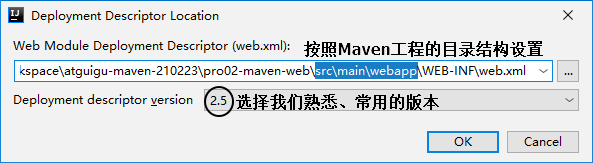

# Maven的IDEA操作

第一节 创建父工程


 第二节 配置Maven信息


 第三节 创建模块工程


 第四节 创建Web工程

 1、创建模块

按照前面的同样操作创建模块，此时这个模块其实还是一个Java工程。

 2、修改打包方式

```xml
<packaging>war</packaging>
```

 3、增加目录


 4、借助IDEA生成web.xml





 第五节 其他操作

 1、在IDEA中执行Maven命令


 2、在IDEA中查看某个模块的依赖信息


